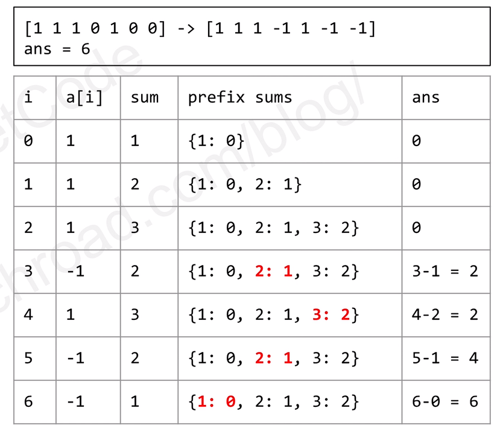
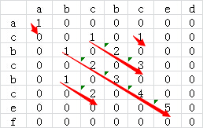
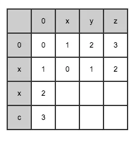
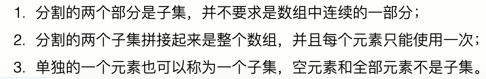
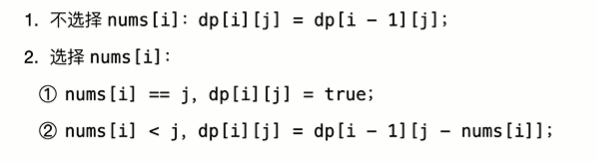
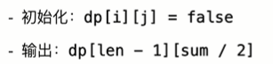
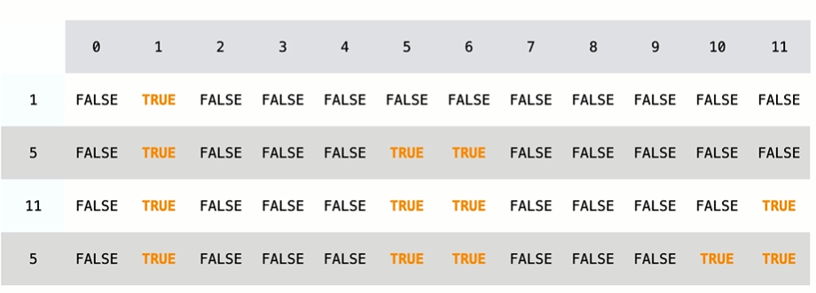
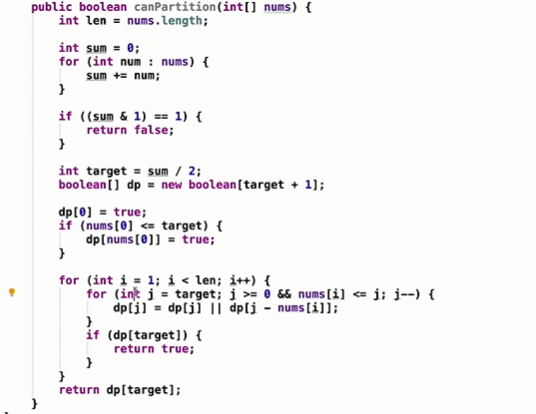
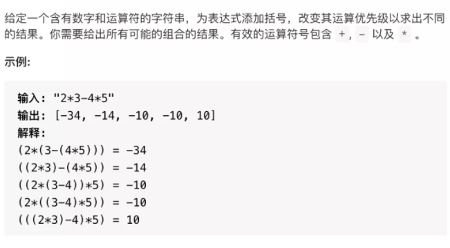
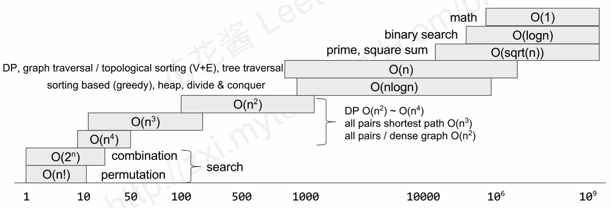

参考项目：[algorithmPractice](https://github.com/3218870799/algorithmPractice)

本笔记的每一个代码都有在上述项目的项目代码以及可运行测试类

# 1：数组

## 1.1：easy

**LeetCode118：杨辉三角**

给定一个非负整数 numRows，生成杨辉三角的前 numRows 行。

在杨辉三角中，每个数是它左上方和右上方的数的和。

示例:

输入: 5
输出:
[
     [1],
    [1,1],
   [1,2,1],
  [1,3,3,1],
 [1,4,6,4,1]
]

```java
package com.leetcode.array.easy;

import java.beans.IntrospectionException;
import java.lang.reflect.Array;
import java.util.*;

public class YanghuiTriangle118 {
    public static void main(String[] args) {
        int n = 5;
        //结果返回二维数组形式
        int[][] result2 = generate2(5);
        //lambda表达式遍历输出
        Arrays.stream(result2).forEach(arr->{
            Arrays.stream(arr).filter(i->i!=0).forEach( i ->System.out.print(i));
            System.out.println();
        });
        List<List<Integer>> result = generate(5);
    }

    /**
     * 解决：先给第一列全部赋值为1
     * 然后遍历二位数组，从第二行第二个开始，每一个等于上一行位置的加上上一行前一列位置的和
     * @param n
     * @return
     */
    public static int[][] generate2(int n) {
        int [][] result = new int[n][n];
        if (n<0){
            return result;
        }
        for (int j = 0; j < n; j++) {
            result[j][0] = 1;
        }
        for (int i = 1; i < n; i++) {
            for (int j = 1; j < n; j++) {
                result[i][j] =  result[i-1][j-1] + result[i-1][j];
            }
        }
        return result;
    }

    /**
     * 返回List<list<Integer>>
     * 两个List指针分别指向上一行和当前行
     * 第一行初始为1
     * 从第二行开始遍历
     * 当前行第一个为1，中间为currentList.add( last.get(j)+last.get(j-1));最后一个为1
     *
     * @param numRows
     * @return
     */
    public static List<List<Integer>> generate(int numRows) {
        if (numRows <= 0){
            return new ArrayList<List<Integer>>();
        }
        List<List<Integer>> result = new  ArrayList<List<Integer>>();
        List<Integer> last = new ArrayList<Integer>();
        last.add(1);
        result.add(last);
        for(int i=1; i< numRows;i++){
            List<Integer> currentList =  new ArrayList<Integer>();
            currentList.add(1);
            for (int j=1;j< i;j++){
                currentList.add( last.get(j)+last.get(j-1));
            }
            currentList.add(1);
            last = currentList;
            result.add(currentList);
        }
        return result;
    }

}

```


牛客网：

**数组左边最大值减右边最大值的差最大**


先遍历一遍数组，先求出全局最大值MAX

1）MAX被划分到左边，让右部分最大值尽量小，则只留最后一个，因为最后一个怎么划分都存在，故最后一个一定是差值最大的

2）MAX被划分到右边，则同理，划分到0的位置


**找出在一个数组中出现次数超过一半的数** 

思路一：遍历数组放入Map中，去的数组长度，遍历Map取得value值大于数组长度一半的值


思路二：

数组中有一个数字出现的次数超过了数组长度的一半。如果把这个数组『排序』，那么排序之后位于数组中间的数字一定就是那个出现次数超过数组长度一半的数字。

那么就变成找中间的这个数，快速排序的一个partition过程就是将


思路三：

数组中有一个数字出现的次数超过数组长度的一半，也就是说**它出现的次数比其他所有数字出现次数的和还要多**。

- 当我们遍历到下一个数字的时候，如果下一个数字和我们之前保存的数字相同，则次数加1；
- 如果下一个数字和我们之前保存的数字不同，则次数减1。
- 如果次数为零，我们需要保存下一个数字，并把次数设为1

我们要找的数字出现的次数比其他所有数字出现的次数之和还要多，那么要找的数字肯定是最后一次把次数设为1时对应的数字。

```java
public class MoreThanHalfNum {
    public static void main(String[] args) {
        int[] a = {1,5,2,2,3,4,2,2};
        int resutl = getMoreThanHalfNum(a);
    }

    private static Integer getMoreThanHalfNum(int[] array) {
        if (array == null)
            return null;
        Integer number = null;
        int count = 0;
        Integer resultInteger = null;
        for (int i = 0; i < array.length; i++) {
            if (number == null) {
                number = array[i];
                count++;
            } else {
                if (array[i] != number)
                    if (count == 0) {
                        number = array[i];
                        count = 1;
                    } else
                        count--;
                else
                    count++;
            }
            if (count == 1)
                resultInteger = number;
        }
        return resultInteger;

    }
}
```


Leetcode 121. 买卖股票的最佳时机

给定一个数组，它的第 i 个元素是一支给定股票第 i 天的价格。

如果你最多只允许完成一笔交易（即买入和卖出一支股票），设计一个算法来计算你所能获取的最大利润。

注意你不能在买入股票前卖出股票。

示例 1:

```
输入: [7,1,5,3,6,4]
输出: 5
```

解释: 在第 2 天（股票价格 = 1）的时候买入，在第 5 天（股票价格 = 6）的时候卖出，最大利润 = 6-1 = 5 。

```
注意利润不能是 7-1 = 6, 因为卖出价格需要大于买入价格。
```

示例 2:

```
输入: [7,6,4,3,1]
输出: 0
```

解释: 在这种情况下, 没有交易完成, 所以最大利润为 0。

题解

纪录两个状态, 一个是最大利润, 另一个是遍历过的子序列的最小值。知道之前的最小值我们就可以算出当前天可能的最大利润是多少

```
class Solution {
    public int maxProfit(int[] prices) {
        // 7,1,5,3,6,4
        int maxProfit = 0;
        int minNum = Integer.MAX_VALUE;
        for (int i = 0; i < prices.length; i++) {
            if (Integer.MAX_VALUE != minNum && prices[i] - minNum > maxProfit) {
                maxProfit = prices[i] - minNum;
            }

            if (prices[i] < minNum) {
                minNum = prices[i];
            }
        }
        return maxProfit;
    }
}
```

Leetcode 122. 买卖股票的最佳时机 II

这次改成股票可以买卖多次, 但是你必须要在出售股票之前把持有的股票卖掉。
示例 1:

```
输入: [7,1,5,3,6,4]
输出: 7
解释: 在第 2 天（股票价格 = 1）的时候买入，在第 3 天（股票价格 = 5）的时候卖出, 这笔交易所能获得利润 = 5-1 = 4 。
     随后，在第 4 天（股票价格 = 3）的时候买入，在第 5 天（股票价格 = 6）的时候卖出, 这笔交易所能获得利润 = 6-3 = 3 。
```

示例 2:

```
输入: [1,2,3,4,5]
输出: 4
解释: 在第 1 天（股票价格 = 1）的时候买入，在第 5 天 （股票价格 = 5）的时候卖出, 这笔交易所能获得利润 = 5-1 = 4 。
     注意你不能在第 1 天和第 2 天接连购买股票，之后再将它们卖出。
     因为这样属于同时参与了多笔交易，你必须在再次购买前出售掉之前的股票。
```

示例 3:

```
输入: [7,6,4,3,1]
输出: 0
解释: 在这种情况下, 没有交易完成, 所以最大利润为 0。
```

题解

由于可以无限次买入和卖出。我们都知道炒股想挣钱当然是低价买入高价抛出，那么这里我们只需要从第二天开始，如果当前价格比之前价格高，则把差值加入利润中，因为我们可以昨天买入，今日卖出，若明日价更高的话，还可以今日买入，明日再抛出。以此类推，遍历完整个数组后即可求得最大利润。

```
class Solution {
    public int maxProfit(int[] prices) {
        // 7,1,5,3,6,4
        int maxProfit = 0;
        for (int i = 0; i < prices.length; i++) {
            if (i != 0 && prices[i] - prices[i-1] > 0) {
                maxProfit += prices[i] - prices[i-1];
            }
        }
        return maxProfit;
    }
}
```

## 1.2：medium

525：连续数组

给定一个二进制数组, 找到含有相同数量的 0 和 1 的最长连续子数组的长度。

示例 1:

输入: [0,1]
输出: 2
说明: [0, 1] 是具有相同数量0和1的最长连续子数组，长度为2
示例 2:

输入: [0,1,0]
输出: 2
说明: [0, 1] (或 [1, 0]) 是具有相同数量0和1的最长连续子数组，长度为2。


注意: 给定的二进制数组的长度不会超过50000。

思路：

```
* 将0变成-1
* 使用hashtable，将和作为key，位置作为value，
* 如果遍历时和已经存在，说明从value到该位置的和为0，则result = 该位置index - value，判断哪个result最长
```



```java
private static int findMaxLength(int[] nums) {
    if(nums.length<=1) return 0;
    HashMap<Integer,Integer> pos = new HashMap<>();
    int sum = 0;
    int ans = 0;
    for (int i = 0; i < nums.length; i++) {
        sum += nums[i]==1?1:-1;
        //如果和为0，则也是其中一种结果
        if(sum==0){
            ans=i+1;
        }else if(pos.containsKey(sum)){
            //如果和已经存在，则取以前结果 和现在位置差最大的一个
            ans = Math.max(ans,i-pos.get(sum));
        }else{
            //如果没有，就放到hashMap里
            pos.put(sum,i);
        }
    }
    return ans;
}
```

//使用Array进行加速


### **300：最长上升子序列**


思路一：动态规划

记录数组中每一个数的最长上升子序列

该数的最长上升子序列  =   前一个比它小的 +1 

代码思路

一开始一个外部循环

​			内部循环从第一位截止到当前位置

​						如果前面的比当前位置小，则长度 + 1，选取最长的进行赋值

更新全局的最长长度


思路二：二分搜索

[10,9,2,5,7,101,18]

10

9

2

2,5

2,5,7

2,5,7,101

2,5,7,18

对于每一个新来的数，看他在最长上升子序列中的那个部分，把对应部分加入

只有放在最后的时候长度才会++

如果放在开始和中间，只有中间数更小，后边才能更新更长的

复杂度nlogn

```java
	/**
	 * 最长上升子序列
	 * [10,9,2,5,7,101,18]则最长上升子序列为2，3, 7, 18
	 * 使用动态规划
	 * @param nums
	 * @return
	 */
	public static int lengthOfLIS(int[] nums){
		
		int n = nums.length;
		//截止到某一个index的最长上升子序列
		int[] dp = new int[n];
		int maxLen = 0;
		
		for(int i=0;i<n;i++){
			//一个数也是上升子序列
			int len =1;
			
			for(int j=0;j<i;j++){
				//
				if(nums[j]<nums[i]){
					len=Math.max(len, dp[j]+1);
				}
			}
			//截止到i的最长长度
			dp[i]=len;
			if(dp[i]>maxLen){
				maxLen=dp[i];
			}
		}
		return maxLen;
		
	}
	/**
	 * 最长上升子序列
	 * 如果新加入的对比于原本的中间，则替换，如果在最后，则长度加一
	 * @param nums
	 * @return
	 */
	public static int lengthOfLISFunction2(int[] nums){
		int n = nums.length;
		int[] dp = new int[n];
		int len =0;
		for (int num : nums) {
			//二分收索判断num在dp中的什么地方，即下标多少，范围是0到len
			int index = Arrays.binarySearch(dp, 0, len ,num);
			//<0则没有出现过，取到应该放的地方
			//pos = 
			if(index<0){
				index = -(index+1);
			}
			//如果在中间就直接更新为这个数
			dp[index] = num;
			//这个应该插入的位置在最后
			if(index==len){
				//长度要加一
				len++;
			}	
		}
		return len;
	}
```


**最长连续子数组**

[-4, -3, -2, -1, 2, 3, 5, 6, 7, 9, 12, 33, 35]，找出它的最长连续子数组，如这个数组的最长连续子数组是-4, -3, -2, -1。

思路1

思路：1、将数组元素放入二叉树  2、对二叉树使用中序排列，得到一个有序数组  3、对有序数组元素进行-1判断，获得最长连续数组。

思路2

用**hash表**来解决这个问题，先初始化一个hash表， 存储所有数组元素， 然后遍历这个数组， 对找到的数组元素， 去搜索其相连的上下两个元素是否在hash表中， 如果在， 删除相应元素并增加此次查找的数据长度， 如果不在， 从下一个元素出发查找。已经访问过的元素记录下来或者删除

### 1014：最佳观光组合

给定正整数数组 `A`，`A[i]` 表示第 `i` 个观光景点的评分，并且两个景点 `i` 和 `j` 之间的距离为 `j - i`。

一对景点（`i < j`）组成的观光组合的得分为（`A[i] + A[j] + i - j`）：景点的评分之和**减去**它们两者之间的距离。

返回一对观光景点能取得的最高分。

**示例：**

```
输入：[8,1,5,2,6]
输出：11
解释：i = 0, j = 2, A[i] + A[j] + i - j = 8 + 5 + 0 - 2 = 11
```

**提示：**

1. `2 <= A.length <= 50000`
2. `1 <= A[i] <= 1000`

**思路**

直接暴力两层 for 循环肯定过不了关，我们把公式变化为 `(A[i] + i) + (A[j] - j)`，看到此应该就可以想到在每次遍历 `j` 时，只需要知道 `max(A[i] + i)` 即可。

```java
class Solution {

    public int maxScoreSightseeingPair(int[] A) {
        int ans = 0, cur = A[0] + 0;
        for (int j = 1; j < A.length; j++) {
            ans = Math.max(ans, cur + A[j] - j); // 计算当前最大得分
            cur = Math.max(cur, A[j] + j);       // 更新最大的 A[i] + i
        }
        return ans;
    }

    public static void main(String[] args) {
        Solution solution = new Solution();
        int[] A = new int[]{8, 1, 5, 2, 6};
        System.out.println(solution.maxScoreSightseeingPair(A));
    }
}
```


## 1.3：Hard

315：计算右侧小于当前元素的个数


给定一个整数数组 nums，按要求返回一个新数组 counts。数组 counts 有该性质： counts[i] 的值是  nums[i] 右侧小于 nums[i] 的元素的数量。

 

示例：

输入：nums = [5,2,6,1]
输出：[2,1,1,0] 
解释：
5 的右侧有 2 个更小的元素 (2 和 1)
2 的右侧仅有 1 个更小的元素 (1)
6 的右侧有 1 个更小的元素 (1)
1 的右侧有 0 个更小的元素


提示：

0 <= nums.length <= 10^5
-10^4 <= nums[i] <= 10^4

思路：

```txt
1：暴力的两层for循环，但是数太多太大

```


## 


# 

https://cuijiahua.com/blog/2018/02/basis_67.html

https://www.nowcoder.com/ta/coding-interviews

# 2：字符串

## 2.1Easy

牛客网：

题目描述

输入一个字符串,按字典序打印出该字符串中字符的所有排列。例如输入字符串abc,则按字典序打印出由字符a,b,c所能排列出来的所有字符串abc,acb,bac,bca,cab和cba。

输入描述:

```
输入一个字符串,长度不超过9(可能有字符重复),字符只包括大小写字母。
```

示例1

输入

```
"ab"
```

返回值

```
["ab","ba"]
```

**思路**

假设输入为a、b、c
那么其实排序的总数：
fun（a，b，c）=a（fun（b，c））+ b（fun（a，c））{即将a和b交换}+ c（fun（b，a））{ 即将a和c交换 }
fun（b，c） = b+fun（c）+c（fun（b））{即将b与c交换}
fun（c）=1

题目中说可能存在重复字符，因此交换时需要判断交换的字符是否相等，如果相等就没必要换了

```java
import java.util.*;

public class StringSort {

    public static void main(String[] args) {
        String str = "abcd";
        ArrayList<String> result = Permutation(str);
        result.stream().forEach(System.out::println);
    }

    public static ArrayList<String> Permutation(String str) {
        StringBuilder strBuilder = new StringBuilder(str);
        ArrayList<String> result = PermutationHelp(strBuilder);
        return result;
    }
    public static ArrayList<String> PermutationHelp(StringBuilder str){
        ArrayList<String> result = new  ArrayList<String>();
        if(str.length() == 1){
            result.add(str.toString());
        }else{
            for(int i = 0; i < str.length(); i++){
                //可能有重复字符，先判定该字符是否已经交换过排序过
                if(i == 0 || str.charAt(i) != str.charAt(0)){
                    char temp = str.charAt(i);
                    str.setCharAt(i, str.charAt(0));
                    str.setCharAt(0, temp);
                    ArrayList<String> newResult = PermutationHelp(new StringBuilder(str.substring(1)));
                    for(int j =0; j < newResult.size(); j++)
                        result.add(str.substring(0,1)+newResult.get(j));
                    //用完还是要放回去的
                    temp = str.charAt(0);
                    str.setCharAt(0, str.charAt(i));
                    str.setCharAt(i, temp);
                }
            }
            //需要在做一个排序操作
            Collections.sort(result);
        }
        return result;
    }
}

```

**最长公共子串**

给定两个字符串，求他们之间最长饿相同子字符串的长度

使用dp\[i][j]来表示第一个串的前i位和第二个串的前j位中的最长公共子串，

计算某个二维矩阵的值的时候顺便计算出来当前最长的公共子串的长度，即某个二维矩阵元素的值由record[i][j]=1演变为record[i][j]=1 +record\[i-1][j-1]，这样就避免了后续查找对角线长度的操作了。




```java
public int getLCS(String s, String t) {
        if (s == null || t == null) {
            return 0;
        }
        int result = 0;
        int sLength = s.length();
        int tLength = t.length();
        int[][] dp = new int[sLength][tLength];
        for (int i = 0; i < sLength; i++) {
            for (int k = 0; k < tLength; k++) {
                if (s.charAt(i) == t.charAt(k)) {
                    if (i == 0 || k == 0) {
                        dp[i][k] = 1;
                    } else {
                        dp[i][k] = dp[i - 1][k - 1] + 1;
                    }
                    result = Math.max(dp[i][k], result);
                } else {
                    dp[i][k] = 0;
                }
            }
        }
        return result;
    }
```


**最长公共子序列**

公共子串与公共子序列不同，公共子序列不要求连续，公共子串必须是连续的。

如

A = “helloworld”

B = “loop”

则最长公共子串是lo

最长公共子序列是loo

* 规划二维数组，比较字符相同，如果相同则把i-1.j-1的值加1
* 如果不同，则把两个对角的最大的值复制过来

```java
	public static int LCS(String a,String b){
		int m = a.length();
		int n = b.length();
		int[][] dp = new int[m+1][n+1];

		for(int i=0;i<m;i++){
			for(int j=0;j<n;j++){
				char c1 = a.charAt(i);
				char c2 = b.charAt(j);
				if(c1==c2){
					dp[i+1][j+1]=dp[i][j]+1;
				}else {
					dp[i+1][j+1]=Math.max(dp[i+1][j], dp[i][j+1]);
				}
			}
		}
		
		return dp[m][n];
	}
```


最长上升子序列

参考前面数组Easy中最长上升子序列


# 3：链表

## 3.1 Easy

**160. 相交链表**

编写一个程序，找到两个单链表相交的起始节点。

如下面的两个链表**：**


在节点 c1 开始相交。

思路：

1. 如果两个链表相交，则交点比在较短的链表的其中一个节点上

2. 遍历两个链表计算两个链表的长度，相减计算长度的差值

3. 较长的链表先走差值的长度

4. 同时遍历两个链表，比较两个链表的值，相等则相交

   

```java
package com.xqc.LinkedList.Easy;

/**
 * @ClassName GetIntersectionNode160
 * @Author Administrator
 * @Date 2020/12/16/016 18:02
 * @Description TODO
 */
public class GetIntersectionNode160 {
    public class ListNode {
      int val;
      ListNode next;
      ListNode(int x) {
          val = x;
          next = null;
      }
    }
    public static void main(String[] args) {

    }
    public static ListNode getIntersectionNode(ListNode headA, ListNode headB) {
        int lenA = 0;
        int lenB = 0;
        ListNode listA = headA;
        ListNode listB = headB;

        while (listA != null) {
            listA = listA.next;
            lenA++;
        }
        while (listB != null) {
            listB = listB.next;
            lenB++;
        }

        int diff;
        if(lenA > lenB) {
            diff = lenA - lenB;
            while (diff > 0) {
                diff--;
                headA = headA.next;
            }
        } else {
            diff = lenB - lenA;
            while (diff > 0) {
                diff--;
                headB = headB.next;

            }
        }

        while (headA != null && headB != null) {
            if (headA == headB) {
                return headA;
            }
            headA = headA.next;
            headB = headB.next;
        }

        return null;
    }

}
```


# 4：二叉树

## easy

二叉树找一条和最大的路径

思路：

首先一条路径遍历到叶子节点的时候，两个叶子节点的根节点相同，也就是到其根节点的路径上节点的val的和是一样的，此时那个节点的值大，那么最大路劲就会在哪个路径上。这就是递归的最初思想，之后扩展到左右子树

即：

递归求出左边最大值，递归求出右边最大值，出口为节点为null返回0

最大值等于 Max(左边最大值，右边最大值) + 根的值

```java
public class TreeMaxPath {

    public static int max = Integer.MIN_VALUE;  // 始终保持最大的和

    // root到叶节点的最大路径的和
    public static int solution(TreeNode root) {
        if(root == null) {
            return 0;
        }
        int left = solution(root.left);
        int right = solution(root.right);
        max = Math.max(max, left + right + root.val);// 更新max值
        return Math.max(left, right) + root.val;
    }


    public static void main(String[] args) {
        // Test case
        TreeNode node1 = new TreeNode(1);
        TreeNode node2 = new TreeNode(2);
        TreeNode node3 = new TreeNode(3);
        TreeNode node4 = new TreeNode(4);
        TreeNode node5 = new TreeNode(5);

        node1.left = node2;
        node1.right = node3;
        node2.left = node4;
        node2.right = node5;

        solution(node1);
        System.out.println("max = " + max);
    }
}
class TreeNode{
    int val;
    TreeNode left;
    TreeNode right;
    TreeNode(int val){
        this.val = val;
    }
}
```

**LeetCode104：二叉树转链表**

给定一个二叉树，原地将它展开为链表。

例如，给定二叉树

```
    1
   / \
  2   5
 / \   \
3   4   6
```

将其展开为：

```
1
 \
  2
   \
    3
     \
      4
       \
        5
         \
          6
```


思路：

转换的时候递归的时候记住是先转换右子树，再转换左子树。

右子树转换完之后链表的头结点在哪里。注意没有新定义一个next指针，而是直接将right 当做next指针,那么Left指针我们赋值成null就可以了。

```java
class Solution {
    private TreeNode prev = null;

    public void flatten(TreeNode root) {
        if (root == null)  return;
        flatten(root.right); // 先转换右子树
        flatten(root.left); 
        root.right = prev;  // 右子树指向链表的头
        root.left = null; // 把左子树置空
        prev = root; // 当前结点为链表头
    }
}
```

非递归实现

```java
class Solution {
    public void flatten(TreeNode root) {
        if (root == null) return;
        Stack<TreeNode> stack = new Stack<TreeNode>();
        stack.push(root);
        while (!stack.isEmpty()) {
            TreeNode current = stack.pop();
            if (current.right != null) stack.push(current.right);
            if (current.left != null) stack.push(current.left);
            if (!stack.isEmpty()) current.right = stack.peek();
            current.left = null;
        }
    }
}
```


**树中两个节点的最低公共祖先**

 输入两个二叉搜索树的结点，求两个结点的最低公共祖先，所谓的最低公共祖先是指距离两个节点最近的共同祖先。

解题思路：

- 1.二叉搜索树具有一个很好的特点。**以当前结点为根节点的左边结点的值都是小于根节点的值，右边结点的值都大于根节点的值。**
- 2.根据这个特点，如果给的两个节点的值都`小于`根节点，那么它们的最低公共祖先就一定在它左子树。
- 3.如果给的两个节点的值都`大于`根节点，那么它们的最低公共祖先就一定在它右子树。
- 4.如果`一个结点的值大于根节点的值`，`一个结点的值小于根节点的值`，那么这个根节点就是它的最低公共祖先。

若只是一颗二叉树

- 如果一个结点为根，另一个结点无论在什么地方它们的最低公共祖先一定为根结点。
- 如果一个结点在左树，另一个结点在右树，那么它的最低公共祖先一定是根节点。
- 如果两个结点都在左树，以子问题在左树查找。
- 如果两个结点都在右树，以子问题在右树查找。

```java
public class Solution {  
    public TreeNode lowestCommonAncestor(TreeNode root, TreeNode p, TreeNode q) {  
        //发现目标节点则通过返回值标记该子树发现了某个目标结点  
        if(root == null || root == p || root == q) return root;  
        //查看左子树中是否有目标结点，没有为null  
        TreeNode left = lowestCommonAncestor(root.left, p, q);  
        //查看右子树是否有目标节点，没有为null  
        TreeNode right = lowestCommonAncestor(root.right, p, q);  
        //都不为空，说明做右子树都有目标结点，则公共祖先就是本身  
        if(left!=null&&right!=null) return root;  
        //如果发现了目标节点，则继续向上标记为该目标节点  
        return left == null ? right : left;  
    }  
}
```


# 4：图


## medium

LeetCode133：克隆图

一个无向图，如何深copy

给你无向 连通 图中一个节点的引用，请你返回该图的 深拷贝（克隆）。

图中的每个节点都包含它的值 val（int） 和其邻居的列表（list[Node]）。

class Node {
    public int val;
    public List<Node> neighbors;
}

思路：

采用深度优先递归克隆节点，克隆节点邻居时，遍历克隆邻居并深度递归克隆邻居节点


```java
public class cloneGraph133 {
    class Solution{
        //定义一个hashMap，key代表节点的值，value代表该节点，可以用于记录是否已经遍历过该节点
        Map<Integer,Node> map = new HashMap<>();
        public Node cloneGraph(Node node){
            //判空
            if (node==null)
                return null;
            //如果不为空，深度优先克隆图
            return dfsClone(node);
        }
        private Node dfsClone(Node node){
            if(node==null) return null;
            //如果该节点已经遍历过，已经存放于map中
            if (map.containsKey(node.val)){
                return map.get(node.val);
            }
            //如果没有遍历过，新建一个节点
            Node newNode = new Node(node.val,new ArrayList<>());
            //然后将该节点放入到map中
            map.put(node.val,newNode);
            for (Node neighbor:node.neighbors) {
                //然后深度优先克隆他的邻居节点
                newNode.neighbors.add(dfsClone(neighbor));
            }
            return newNode;
        }
    }
    class Node {
        public int val;
        public List<Node> neighbors;
        public Node() {
            val = 0;
            neighbors = new ArrayList<Node>();
        }
        public Node(int _val) {
            val = _val;
            neighbors = new ArrayList<Node>();
        }
        public Node(int _val, ArrayList<Node> _neighbors) {
            val = _val;
            neighbors = _neighbors;
        }
    }
}
```

# 5：哈希表

### 554：砖墙

你的面前有一堵矩形的、由多行砖块组成的砖墙。 这些砖块高度相同但是宽度不同。你现在要画一条自顶向下的、穿过最少砖块的垂线。

砖墙由行的列表表示。 每一行都是一个代表从左至右每块砖的宽度的整数列表。

如果你画的线只是从砖块的边缘经过，就不算穿过这块砖。你需要找出怎样画才能使这条线穿过的砖块数量最少，并且返回穿过的砖块数量。

你不能沿着墙的两个垂直边缘之一画线，这样显然是没有穿过一块砖的。

 

示例：

输入: [[1,2,2,1],
      [3,1,2],
      [1,3,2],
      [2,4],
      [3,1,2],
      [1,3,1,1]]

输出: 2

解释: 

 

提示：

每一行砖块的宽度之和应该相等，并且不能超过 INT_MAX。
每一行砖块的数量在 [1,10,000] 范围内， 墙的高度在 [1,10,000] 范围内， 总的砖块数量不超过 20,000。

思路：

题意根据图示已经描述得很清楚了，就是在从底部到顶部，求最少交叉的数量，我们可以把每堵墙可以穿过的地方保存到哈希表中，每次遇到哈希表中的值加一，代表就是这条路不用交叉的数量，最终我们可以算出不用交叉的最大值，让总墙数减去其值就是最少交叉的数量。

```java
class Solution {
    public int leastBricks(List<List<Integer>> wall) {
        Map<Integer, Integer> map = new HashMap<>();
        int width = 0, max = 0;
        for (List<Integer> sub : wall) {
            int p = 0;
            for (int i = 0, len = sub.size() - 1; i < len; ++i) {
                p += sub.get(i);
                Integer v = map.get(p);
                map.put(p, (v == null ? 0 : v) + 1);
            }
        }
        for (Integer integer : map.values()) {
            if (integer > max) max = integer;
        }
        return wall.size() - max;
    }
}
```


# 7：动态规划

## 子序列问题：

### Easy

#### 53：最大子序和

给定一个整数数组 nums ，找到一个具有最大和的连续子数组（子数组最少包含一个元素），返回其最大和。

示例:

输入: [-2,1,-3,4,-1,2,1,-5,4]
输出: 6
解释: 连续子数组 [4,-1,2,1] 的和最大，为 6。


思路分析：

**以** **`nums[i]`** **为结尾的「最大子数组和」为** **`dp[i]`**。

这种定义之下，想得到整个 `nums` 数组的「最大子数组和」，不能直接返回 `dp[n-1]`，而需要遍历整个 `dp` 数组：

`dp[i]` 有两种「选择」，要么与前面的相邻子数组连接，形成一个和更大的子数组；要么不与前面的子数组连接，自成一派，自己作为一个子数组。

即：

```java
// 要么自成一派，要么和前面的子数组合并
dp[i] = Math.max(nums[i], nums[i] + dp[i - 1]);
```

代码：

```java
int maxSubArray(int[] nums) {
    int n = nums.length;
    if (n == 0) return 0;
    int[] dp = new int[n];
    // base case
    // 第一个元素前面没有子数组
    dp[0] = nums[0];
    // 状态转移方程
    for (int i = 1; i < n; i++) {
        dp[i] = Math.max(nums[i], nums[i] + dp[i - 1]);
    }
    // 得到 nums 的最大子数组
    int res = Integer.MIN_VALUE;
    for (int i = 0; i < n; i++) {
        res = Math.max(res, dp[i]);
    }
    return res;
}
```

以上解法时间复杂度是 O(N)，空间复杂度也是 O(N)，较暴力解法已经很优秀了，不过**注意到** **`dp[i]`** **仅仅和** **`dp[i-1]`** **的状态有关**，那么我们可以进行「状态压缩」，将空间复杂度降低：

```java
int maxSubArray(int[] nums) {
    int n = nums.length;
    if (n == 0) return 0;
    // base case
    int dp_0 = nums[0];
    int dp_1 = 0, res = dp_0;

    for (int i = 1; i < n; i++) {
        // dp[i] = max(nums[i], nums[i] + dp[i-1])
        dp_1 = Math.max(nums[i], nums[i] + dp_0);
        dp_0 = dp_1;
        // 顺便计算最大的结果
        res = Math.max(res, dp_1);
    }

    return res;
}
```


### Hard

#### 72：编辑距离


思路：

编辑距离问题就是给我们两个字符串 `s1` 和 `s2`，只能用三种操作，让我们把 `s1` 变成 `s2`，求最少的操作数。

**解决两个字符串的动态规划问题，一般都是用两个指针** **`i,j`** **分别指向两个字符串的最后，然后一步步往前走，缩小问题的规模**。

设两个字符串分别为 "rad" 和 "apple"，为了把 `s1` 变成 `s2`，算法会这样进行：


根据上面的 GIF，可以发现操作不只有三个，其实还有第四个操作，就是什么都不要做（skip）

因为这两个字符本来就相同，为了使编辑距离最小，显然不应该对它们有任何操作，直接往前移动 `i,j` 即可。

还有一个很容易处理的情况，就是 `j` 走完 `s2` 时，如果 `i` 还没走完 `s1`，那么只能用删除操作把 `s1` 缩短为 `s2`。比如这个情况：


类似的，如果 `i` 走完 `s1` 时 `j` 还没走完了 `s2`，那就只能用插入操作把 `s2` 剩下的字符全部插入 `s1`。等会会看到，这两种情况就是算法的 **base case**。

代码思路：

```java
public int Solution(String s1,String s2){
    // base case
    if(i==-1)return j+1;
    if(j==-1)return i+1;
    
    if(s1[i]==s2[j]){
        //啥也不做
        return dp[i-1][j-1];
    }else{
        //插入删除，替换中最小的步数
        return Math.min(dp[i,j-1] + 1,dp[i-1,j]+1,dp[i-1][j-1]+1);
    }
    
}
```

动态规划思路：





Java实现

```java
    private int getEditDistance(String s1, String s2) {
        //
        int d = 0;
        //s1的前i位与s2的前j位转换所需要的步骤数
        int[][] dp = new int[s1.length()+1][s2.length()+1];
        //s1与s2为空，不用变换
        dp[0][0] = 0;
        //一个串为空，变成另一个串则插入该串的长度的步骤
        for (int i = 0; i < s1.length()+1; i++) {
            dp[i][0] = i;
        }
        for (int j = 0; j < s2.length()+1; j++) {
            dp[0][j] = j;
        }

        for (int i = 1; i < s1.length()+1; i++) {
            for (int j = 0; j < s2.length()+1; j++) {
                //如果该位相等，则啥也不做
                if (s1.charAt(i-1)==s2.charAt(j-1)){
                    d=0;
                }else{
                    //如果不等，步数加一
                    d=1;
                }
                /*该位的步骤数等于：
                dp[i-1][j] 删除一位
                dp[i][j-1] 插入一位
                dp[i-1][j-1] 替换一位 或则 啥也不做
                 */
                dp[i][j]=Min(dp[i-1][j]+1,dp[i][j-1]+1,dp[i-1][j-1]+d)
            }
        }
        return dp[s1.length()][s2.length()];
    }
    public int Min(int a,int b,int c) {
        return (a<b?a:b)<c?(a<b?a:b):c;
    }
```


#### 354.俄罗斯套娃信封问题

排序进行预处理


思路：

信封嵌套问题就需要先按特定的规则排序，之后就转换为一个 [最长递增子序列问题](https://github.com/labuladong/algo/tree/1ed5e674983f857aa5745a0810575a0edd5a78a0/动态规划系列/动态规划设计：最长递增子序列.md)

**先对宽度** **`w`** **进行升序排序，如果遇到** **`w`** **相同的情况，则按照高度** **`h`** **降序排序。之后把所有的** **`h`** **作为一个数组，在这个数组上计算 LIS 的长度就是答案。**


然后在 `h` 上寻找最长递增子序列：


这个解法的关键在于，对于宽度 `w` 相同的数对，要对其高度 `h` 进行降序排序。因为两个宽度相同的信封不能相互包含的，逆序排序保证在 `w` 相同的数对中最多只选取一个。

代码：

```java
// envelopes = [[w, h], [w, h]...]
public int maxEnvelopes(int[][] envelopes) {
    int n = envelopes.length;
    // 按宽度升序排列，如果宽度一样，则按高度降序排列
    Arrays.sort(envelopes, new Comparator<int[]>() 
    {
        public int compare(int[] a, int[] b) {
            return a[0] == b[0] ? 
                b[1] - a[1] : a[0] - b[0];
        }
    });
    // 对高度数组寻找 LIS
    int[] height = new int[n];
    for (int i = 0; i < n; i++)
        height[i] = envelopes[i][1];
	//套用最长上升子序列模板
    return lengthOfLIS(height);
}
```

## 背包问题：

### medium

#### 416：分割等和子集(01背包)

给定一个只包含正整数的非空数组。是否可以将这个数组分割成两个子集，使得两个子集的元素和相等。

注意:

每个数组中的元素不会超过 100
数组的大小不会超过 200
示例 1:

输入: [1, 5, 11, 5]

输出: true

解释: 数组可以分割成 [1, 5, 5] 和 [11].


示例 2:

输入: [1, 2, 3, 5]

输出: false

解释: 数组不能分割成两个元素和相等的子集.


思路：



两个子集的和相等，每个等于sum/2

可以转换为：

在若干物品中选中一些物品，每个物品只能使用一次，这些物品恰好能够填满容量为sum/2的背包。

剩下的自然为sum/2也就。


**第一步要明确两点，「状态」和「选择」**。

状态就是「背包的容量」和「可选择的物品」，选择就是「装进背包」或者「不装进背包」。

**第二步要明确** **`dp`** **数组的定义**。

dp\[i][j]表示考虑下标[0,i]这个区间里的所有整数，在他们当中能够选出一些数，使得这些数之和恰好为整数j

**第三步，根据「选择」，思考状态转移的逻辑**。



**第四步，考虑初始化与输出**。



规划：




代码：

```java
    public boolean canPartition(int[] nums){
        int len = nums.length;
        //先计算sum
        int sum = 0;
        for (int num:nums) {
            sum+=num;
        }
        //如果sum是奇数，直接返回false
        if((sum & 1)==1){
            return false;
        }
        int target = sum/2;
        //对于数组前i个是否有子集使总和为j
        boolean[][] dp = new boolean[len][target+1];
        //赋值第一行，第一行只能填满容量为0的背包
        if(nums[0]<=target){
            dp[0][nums[0]] = true;
        }
        //从第二行开始填表
        for (int i = 1; i < len; i++) {
            for (int j = 0; j <=target ; j++) {
                //不考虑当前元素，直接从上一行抄下来
                dp[i][j] = dp[i-1][j];
                //如果当前值恰好等于当前容量
                if (nums[i]==j){
                    dp[i][j] = true;
                    continue;
                }
                //如果当前值严格小于当前容量
                if(nums[i]<j){
                    //或者上一行的值，或则上一行右边的值(考虑当前数，容量减少），其中一个成立即可
                    dp[i][j] = dp[i-1][j] || dp[i-1][j-nums[i]];
                }
            }

        }
    return dp[len -1][target];
    }
```


优化：

使用一维数组，从右向左填写表格，不断覆盖




#### 518：零钱兑换II（完全背包）

给定不同面额的硬币和一个总金额。写出函数来计算可以凑成总金额的硬币组合数。假设每一种面额的硬币有无限个。 

 

示例 1:

输入: amount = 5, coins = [1, 2, 5]
输出: 4
解释: 有四种方式可以凑成总金额:
5=5
5=2+2+1
5=2+1+1+1
5=1+1+1+1+1
示例 2:

输入: amount = 3, coins = [2]
输出: 0
解释: 只用面额2的硬币不能凑成总金额3。
示例 3:

输入: amount = 10, coins = [10] 
输出: 1


注意:

你可以假设：

0 <= amount (总金额) <= 5000
1 <= coin (硬币面额) <= 5000
硬币种类不超过 500 种
结果符合 32 位符号整数

思路：

**第一步要明确两点，「状态」和「选择」**。

状态有两个，就是「背包的容量」和「可选择的物品」，选择就是「装进背包」或者「不装进背包」嘛，背包问题的套路都是这样。

伪代码：

```java
for 状态1 in 状态1的所有取值：
    for 状态2 in 状态2的所有取值：
        for ...
            dp[状态1][状态2][...] = 计算(选择1，选择2...)
```

**第二步要明确 `dp` 数组的定义**。

首先看看刚才找到的「状态」，有两个，也就是说我们需要一个二维 `dp` 数组。

`dp[i][j]` 的定义如下：

若只使用前 `i` 个物品，当背包容量为 `j` 时，有 `dp[i][j]` 种方法可以装满背包。

换句话说，翻译回我们题目的意思就是：

**若只使用 `coins` 中的前 `i` 个硬币的面值，若想凑出金额 `j`，有 `dp[i][j]` 种凑法**。

base case 为 `dp[0][..] = 0， dp[..][0] = 1`。因为如果不使用任何硬币面值，就无法凑出任何金额；如果凑出的目标金额为 0，那么“无为而治”就是唯一的一种凑法

|      | 0    | 1    | 2    | 3    | 4    | 5    |
| ---- | ---- | ---- | ---- | ---- | ---- | ---- |
| 0    | 1    | 0    | 0    | 0    | 0    | 0    |
| 1    | 1    |      |      |      |      |      |
| 2    | 1    |      |      |      |      |      |
| 5    | 1    |      |      |      |      |      |

**第三步，根据「选择」，思考状态转移的逻辑**。

**如果你不把这第 `i` 个物品装入背包**，也就是说你不使用 `coins[i]` 这个面值的硬币，那么凑出面额 `j` 的方法数 `dp[i][j]` 应该等于 `dp[i-1][j]`，继承之前的结果。

**如果你把这第 `i` 个物品装入了背包**，也就是说你使用 `coins[i]` 这个面值的硬币，那么 `dp[i][j]` 应该等于 `dp[i][j-coins[i-1]]`。

首先由于 `i` 是从 1 开始的，所以 `coins` 的索引是 `i-1` 时表示第 `i` 个硬币的面值。

`dp[i][j-coins[i-1]]` 也不难理解，如果你决定使用这个面值的硬币，那么就应该关注如何凑出金额 `j - coins[i-1]`。

比如说，你想用面值为 2 的硬币凑出金额 5，那么如果你知道了凑出金额 3 的方法，再加上一枚面额为 2 的硬币，不就可以凑出 5 了嘛。

所以可能使用一个2，可能使用2个2，即最多使用  j - coins[i-1] * n > 0


我用 Java 写的代码，把上面的思路完全翻译了一遍，并且处理了一些边界问题：

```java
int change(int amount, int[] coins) {
    int n = coins.length;
    int[][] dp = amount int[n + 1][amount + 1];
    // base case
    for (int i = 0; i <= n; i++) 
        dp[i][0] = 1;

    for (int i = 1; i <= n; i++) {
        for (int j = 1; j <= amount; j++)
            if (j - coins[i-1] >= 0)
                dp[i][j] = dp[i - 1][j] 
                         + dp[i][j - coins[i-1]];
            else 
                dp[i][j] = dp[i - 1][j];
    }
    return dp[n][amount];
}
```

而且，我们通过观察可以发现，`dp` 数组的转移只和 `dp[i][..]` 和 `dp[i-1][..]` 有关，所以可以压缩状态，进一步降低算法的空间复杂度：

```java
int change(int amount, int[] coins) {
    int n = coins.length;
    int[] dp = new int[amount + 1];
    dp[0] = 1; // base case
    for (int i = 0; i < n; i++)
        for (int j = 1; j <= amount; j++)
            if (j - coins[i] >= 0)
                dp[j] = dp[j] + dp[j-coins[i]];

    return dp[amount];
}
```

这个解法和之前的思路完全相同，将二维 `dp` 数组压缩为一维，时间复杂度 O(N*amount)，空间复杂度 O(amount)。


# 分治算法

### 241：为运算表达式设计优先级



思路：

**1、不要思考整体，而是把目光聚焦局部，只看一个运算符**。

**2、明确递归函数的定义是什么，相信并且利用好函数的定义**。


显然我们有四种加括号方式：

```
(1)   +    (2 * 3 - 4 * 5)
(1 + 2)   *   (3 - 4 * 5)
(1 + 2 * 3)   -   (4 * 5)
(1 + 2 * 3 - 4)   *   (5)
```

那么前边的和后边的又可以递归

最后再将左右两边根据中间运算符进行运算

```java
List<Integer> diffWaysToCompute(String input) {
	List<Integer> res = new LinkedList<>();
    for (int i = 0; i < input.length(); i++) {
        char c = input.charAt(i);
        // 扫描算式 input 中的运算符
        if (c == '-' || c == '*' || c == '+') {
            /****** 分 ******/
            
            // 以运算符为中心，分割成两个字符串，分别递归计算
            List<Integer> left = diffWaysToCompute(input.substring(0, i));
            List<Integer> right = diffWaysToCompute(input.substring(i + 1));
            /****** 治 ******/
            // 通过子问题的结果，合成原问题的结果
            for (int a : left)
                for (int b : right)
                    if (c == '+')
                        res.add(a + b);
                    else if (c == '-')
                        res.add(a - b);
                    else if (c == '*')
                        res.add(a * b);
        }
    }
    // base case
    // 如果 res 为空，说明算式是一个数字，没有运算符
    if (res.isEmpty()) {
        res.add(Integer.parseInt(input));
    }
    return res;
    
}

```

优化：减少重复记录，将字符串记录存储在HashMap中，如果已经存在，则直接取出，不在计算

```java
// 备忘录
HashMap<String, List<Integer>> memo = new HashMap<>();

List<Integer> diffWaysToCompute(String input) {
    // 避免重复计算
    if (memo.containsKey(input)) {
        return memo.get(input);
    }
    /****** 其他都不变 ******/

    /***********************/

    // 将结果添加进备忘录
    memo.put(input, res);
    return res;
}
```


# 并查集

基础知识请参考《数据结构与算法》

684：


# 其他：

从一个日志文件中根据关键字读取日志，记录出现的次数，最后按照次数排序打印

```java
public class AnswerApp {

    public static void main(String[] args) throws IOException {
        long startTime = System.currentTimeMillis();

        statistics();

        long endTime = System.currentTimeMillis();

        System.out.println("execute time " + (endTime - startTime) + " ms.");
    }


    public static void statistics() throws IOException {
        System.out.println("请输入搜索关键词(多个关键词以英文逗号隔开):");
        Scanner scanner = new Scanner(System.in);
        String keyWord = scanner.nextLine();

        String[] keyWords = keyWord.split(",");

        File file = new File("C:\\Users\\answer\\work detail.txt");
        BufferedReader bufferedReader = new BufferedReader(new FileReader(file));
		
		// 直接读取文本到集合中. commons.io 包	
//		List<String> datas = FileUtils.readLines(file, Charsets.UTF_8);

        String line;

        // 定义一个结果存储容器, key 为 关键词, value 为关键词出现的次数
        HashMap<String, Integer> resultMap = new HashMap<>();

        while ((line = bufferedReader.readLine()) != null) {
            for (String kw : keyWords) {
                kw = kw.trim();

                if (StringUtils.isEmpty(kw)) {
                    continue;
                }

                int count = line.split(kw).length - 1;

                // 如果是以 关键词 结尾的, 此处会统计不到, 因此要单独判断
                if (count == 0) {
                    if (line.endsWith(kw)) {
                        count = 1;
                    }
                }

                if (resultMap.containsKey(kw)) {
                    resultMap.put(kw, resultMap.get(kw) + count);
                } else {
                    resultMap.put(kw, count);
                }
            }
        }

        List<Map.Entry<String, Integer>> list = Lists.newArrayList(resultMap.entrySet());

        // 自定义比较器, 根据 list 中元素的 value 值进行 从大到小 排序
        list.sort((o1, o2) -> o2.getValue() - o1.getValue());

        System.out.println();
        System.out.println("统计结果: ");
        for (Map.Entry entry : list) {
            System.out.println(entry.getKey() + " " + entry.getValue());
        }

    }

}
```


# 经验

input Size VS Time Complexity

输入范围推算算法使用

CPU上线2*10^9




递归的时间与空间复杂度

