# 第一章：概述

数据结构包括：线性结构（顺序存储和链式存储）和非线性结构。

线性结构常见的有：数组、队列、链表和栈。

非线性结构包括：二维数组，多维数组，广义表，树结构，图结构 树结构，图结构

## 1：时间复杂度

算法所需要的计算工作量

常数时间：O（1）

对数时间：**O(logn)**

**线性时间：**O(*n*)

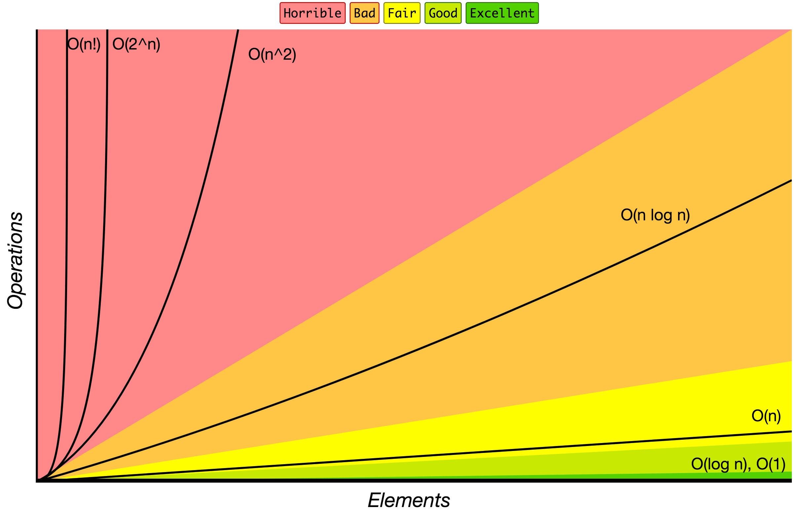

## 2，空间复杂度

# 第二章：数组

## 1：对称矩阵

压缩存储：若n阶矩阵中的元满足Aij = Aji 则该矩阵可以用一维数组进行压缩存储，

可以以行序为主序存储矩阵下三角（包括对角线）中的元，假设一维数组**sa[n(n+1)/2]**
存储n阶矩阵，则sa[k]和矩阵元aij之间存在着一一对应的关系:**k=大（大-1）/2+小-1**；（大与小相对于
i 于 j 相对比而取值）

### 1：三角矩阵：

以主对角线划分，三角矩阵有上三角矩阵和下三角矩阵两种。上三角矩阵是指下三角（不含对角线）中的元均为常数
c 或 零 的 n
阶矩阵，下三角矩阵与之相反。对三角矩阵进行压缩存储时，除了和对称矩阵一样，只存储其上（下）三角中的元素之外，再加一个存储常数
c 的存储空间即可

上三角矩阵：

sa[k]和矩阵Aij间的对应关系为 当 i \> =j 时，k = i\*(i-1)\*(2\*n-i+2)/2+(j-1) 当
i \< j 时，n\*(n+1)/2

下三角矩阵：

sa[k]和矩阵Aij间的对应关系为 当 i \>=j 时，i\*(i-1)/2 + j -1 当 i \<j
时，n\*(n+1)/2

三对角矩阵：

## 2：稀疏数组

用稀疏数组的行列表示压缩二维数组

第一行表示行数，列数，有效值数

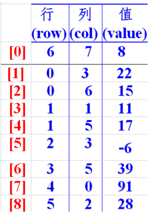

二维数组转稀疏数组的思路

1：遍历原始二维数组，得到有效数据的个数sum

2：根据sum创建稀疏数组sparseArr int[sum+1][3]，第一行表示行数，列数，有效值数

3：将二维数组的有效数据存入到稀疏数组

稀疏数组转原始二维数组的思路

1：先读取稀疏数组的第一行，根据第一行的数据，创建原始二维数组，

2：在读取稀疏数组后几行的数据并赋值给原始的二维数组即可

# 第三章：队列

## 1：数组实现


class ArrayQueue {

private int maxSize; // 表示数组的最大容量

private int front; // 队列头

private int rear; // 队列尾

private int[] arr; // 该数据用于存放数据, 模拟队列

// 创建队列的构造器

// 判断队列是否满

// 判断队列是否为空

// 添加数据到队列

// 获取队列的数据, 出队列

}

入队：将尾指针往后移：rear+1 ,

## 2：数组实现循环队列


>   元素个数=（尾-头+表长）%表长

>   入队：rear=（rear+1）%MAX

>   队空：rear==front

>   对满：（rear+1）%MAX==front

## 3：优先队列

获取优先级最高的任务

其实是根据堆实现的

分类：最大优先队列，最小优先队列

1：MaxPriorityQueue

## 4：Java集合队列queue

Queue接口与List、Set同一级别，都是继承了Collection接口。LinkedList实现了Deque接 口。

# 第三章：线性表

## 1：顺序表

连续的存储单元

数组实现：

ArrayList实现：长度可变

## 2：链表

### 1：单向链表

**节点**

```java
Class Node{
	Public int no；

	Public Node next；

	//构造方法

	//重写toString

}
**//定义单链表**

Class SingleLinkedList{

//先初始化一个头节点, 头节点不要动, 不存放具体的数据

private HeroNode head = new HeroNode(0, "", "");

//添加节点到单向链表

//思路，当不考虑编号顺序时

//1. 找到当前链表的最后节点

//2. 将最后这个节点的 next 指向 新的节点

//添加节点到指定位置

//修改节点信息

//删除节点

}
```


1.  求单链表中有效节点的个数

2.  查找单链表中的倒数第k个结点 【新浪面试题】

3.  单链表的反转【腾讯面试题，有点难度】

4.  从尾到头打印单链表 【百度，要求方式1：反向遍历 。 方式2：Stack栈】

5.  合并两个有序的单链表，合并之后的链表依然有序【课后练习.】

### 2：双向链表

Class Node{

Public int no；

Public Node next；

Public Node pre；

//构造器

//重写toString

}

//创建双向链表类

Class DoubleLinkedList{

//初始化头结点

}

### 3：循环链表

>   结构：单链表中将最后一个节点的指针指向第一个元素的数据域，将其构成循环状态

>   判断单链表为空的条件是head-\>next==NULL，而判断循环单链表为空的条件是head-\>next==head。访问第一个结点即rear-\>next-\>next。

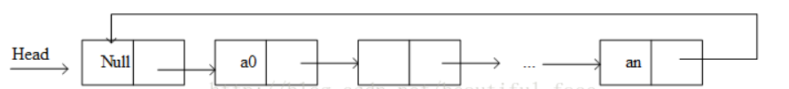

约瑟夫环问题

Josephu 问题为：设编号为1，2，…
n的n个人围坐一圈，约定编号为k（1\<=k\<=n）的人从1开始报数，数到m
的那个人出列，它的下一位又从1开始报数，数到m的那个人又出列，依次类推，直到所有人出列为止，由此产生一个出队编号的序列。

**提示**：用一个不带头结点的循环链表来处理Josephu
问题：先构成一个有n个结点的单循环链表，然后由k结点起从1开始计数，计到m时，对应结点从链表中删除，然后再从被删除结点的下一个结点又从1开始计数，直到最后一个结点从链表中删除算法结束。

4：双向循环链表

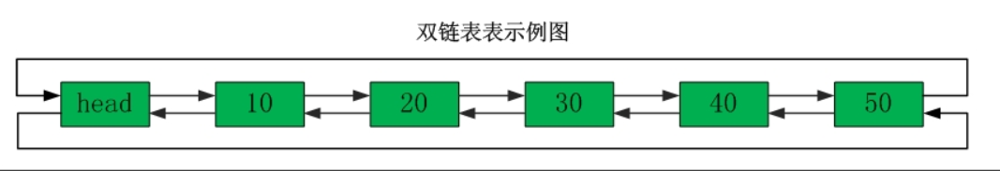

## 3：面试题

1：单链表的反转

思路：先定义一个reverseHead，然后从头到尾遍历原来的链表，每遍历一个节点，就将其取出，并采用头插法放在新的reverseHead的最前端，最后head.next=reverseHead.next

2：从尾到头打印单链表

思路：使用栈，将每个节点压入栈中，然后利用栈的先进先出

3：约瑟夫问题——循环链表

Josephu 问题为：设编号为 1，2，… n 的 n 个人围坐一圈，约定编号为
k（1\<=k\<=n）的人从 1 开始报数，数到 m 的那个人出列，它的下一位又从 1
开始报数，数到 m
的那个人又出列，依次类推，直到所有人出列为止，由此产生一个出队编号的序列。

思路：


# 第四章：栈

应用场景：

1.  子程序的调用：在跳往子程序前，会先将下个指令的地址存到堆栈中，直到子程序执行完后再将地址取出，以回到原来的程序中。

2.  处理递归调用：和子程序的调用类似，只是除了储存下一个指令的地址外，也将参数、区域变量等数据存入堆栈中。

3.  表达式的转换[中缀表达式转后缀表达式]与求值(实际解决)。

4.  二叉树的遍历。

5.  图形的深度优先(depth一first)搜索法。

## 1：使用数组实现——顺序栈


**中缀表达式转换为后缀表达式**

**具体步骤如下:**

1.  初始化两个栈：运算符栈s1和储存中间结果的栈s2；

2.  从左至右扫描中缀表达式；

3.  遇到操作数时，将其压s2；

4.  遇到运算符时，比较其与s1栈顶运算符的优先级：

    1.  如果s1为空，或栈顶运算符为左括号“(”，则直接将此运算符入栈；

    2.  否则，若优先级比栈顶运算符的高，也将运算符压入s1；

否则，将s1栈顶的运算符弹出并压入到s2中，再次转到(4-1)与s1中新的栈顶运算符相比较；

1.  遇到括号时：  
    (1) 如果是左括号“(”，则直接压入s1  
    (2)
    如果是右括号“)”，则依次弹出s1栈顶的运算符，并压入s2，直到遇到左括号为止，此时将这一对括号丢弃

2.  重复步骤2至5，直到表达式的最右边

3.  将s1中剩余的运算符依次弹出并压入s2

4.  依次弹出s2中的元素并输出，**结果的逆序即为中缀表达式对应的后缀表达式**

## 2：链栈

## 3：面试题

### 1：逆波兰计算器

1) 输入一个逆波兰表达式(后缀表达式)，使用栈(Stack), 计算其结果

2)
支持小括号和多位数整数，因为这里我们主要讲的是数据结构，因此计算器进行简化，只支持对整数的
对整数的计算。

3) 思路分析

例如: (3+4)×5-6 对应的后缀表达式就是 3 4 + 5 × 6 - , 针对后缀表达式求值步骤如下:

1．从左至右扫描，将 3 和 4 压入堆栈；

2．遇到+运算符，因此弹出 4 和 3（4 为栈顶元素，3 为次顶元素），计算出 3+4
的值，得 7，再将 7 入栈；

3．将 5 入栈；

4．接下来是×运算符，因此弹出 5 和 7，计算出 7×5=35，将 35 入栈；

5．将 6 入栈；

6．最后是-运算符，计算出 35-6 的值，即 29，由此得出最终结果


准备两个栈data和min，当data新增数据时，min与min栈顶的（即最小值）相比，然后放入min栈中

经典括号匹配问题：

```java
public class MatchBrackets {
    public static void main(String[] args) {
        String s = "cjsdhc{{{{(())[][]}";
        Boolean result = isValid(s);
        System.out.println(result);

    }
    private static Boolean isValid(String s) {
        /**
         * 用栈实现
         * 遍历字符串时判断，
         * 如果是左括号，那么将其入栈，
         * 如果为右括号，
         *          先判断栈是否为空，为空直接返回false
         *          不为空时判断：
         *                  栈顶元素与右括号是否匹配，
         *                  如果匹配就出栈，不匹配返回false
         */
        Stack<Character> stack = new Stack<Character>();
        for (int i = 0; i < s.length(); i++) {
            if (('('==s.charAt(i))||('['==s.charAt(i))||('{'==s.charAt(i))){
                stack.push(s.charAt(i));
            }else if((')'==s.charAt(i))||(']'==s.charAt(i))||('}'==s.charAt(i))){
                if (stack.empty()){
                    return false;
                }else{
                    if (('('==stack.peek()&&')'==s.charAt(i))||('['==stack.peek()&&']'==s.charAt(i))||('{'==stack.peek()&&'}'==s.charAt(i))){
                        stack.pop();
                    }
                }
            }
        }
        // 遍历循环结束后，如果发现栈里为空，则证明括号匹配完毕；否则括号不匹配
        if (stack.empty()){
            return true;
        }
        return false;

    }
}

```


# 第九章：树

## 1：二叉树

### 1.1：概述

>   1) 如果该二叉树的所有叶子节点 叶子节点都在最后一层 最后一层，并且结点总数=
>   2\^n -1 , n 为层数，则我们称为满二叉树。

>   2) 如果该二叉树的所有叶子节点 叶子节点都在最后一层 最后一层或者倒数第二层
>   倒数第二层，而且最后一层的叶子节点在左边连续，倒数第二层的叶子节点在右边连续，我们称为完全二叉树

遍历：前序，中序，后续，层次遍历

查找指定节点——前序，中序，后序

图的

深度优先搜索（DFS）

广度优先搜索（）

对于图因为有环要增加标记是否已经搜索过了

删除节点

二叉树存储

顺序存储二叉树

1) 顺序二叉树通常只考虑完全二叉树

2) 第 n 个元素的左子节点为 2 \* n + 1

3) 第 n 个元素的右子节点为 2 \* n + 2

4) 第 n 个元素的父节点为 (n-1) / 25) n : 表示二叉树中的第几个元素(按 0
开始编号如图所示)

深度计算：

### 1.2：二叉树的遍历

```java
package com.xqc.binartTree;
import java.util.LinkedList;
import java.util.Queue;
import java.util.Stack;

/**
 * 
 * @author xqc
 * @data 2020年5月24日
 * Description:
 * 二叉树遍历方式
 */
public class BinaryTreeVisit {

    /**
     * @author xqc
     * @data 2020年5月24日
     * Description:
     * 二叉树节点
     */
    public static class BinaryTreeNode {
        int value;
        BinaryTreeNode left;
        BinaryTreeNode right;

        public BinaryTreeNode(int value) {
            this.value = value;
        }

        public BinaryTreeNode(int value, BinaryTreeNode left,
                BinaryTreeNode right) {
            super();
            this.value = value;
            this.left = left;
            this.right = right;
        }
    }

    // 访问树的节点
    public static void visit(BinaryTreeNode node) {
        System.out.println(node.value);
    }

    /** 递归实现二叉树的先序遍历 */
    public static void preOrder(BinaryTreeNode node) {
        if (node != null) {
            visit(node);
            preOrder(node.left);
            preOrder(node.right);
        }
    }

    /** 递归实现二叉树的中序遍历 */
    public static void inOrder(BinaryTreeNode node) {
        if (node != null) {
            inOrder(node.left);
            visit(node);
            inOrder(node.right);
        }
    }

    /** 递归实现二叉树的后序遍历 */
    public static void postOrder(BinaryTreeNode node) {
        if (node != null) {
            postOrder(node.left);
            postOrder(node.right);
            visit(node);
        }
    }

    /** 
     * 先序遍历——非递归实现二叉树的
     * 当栈不为空时，
     * 先取出节点，访问，右节点入栈，左节点入栈    
     * 
     */
    public static void iterativePreorder(BinaryTreeNode root) {
        Stack<BinaryTreeNode> stack = new Stack<>();
        //如果二叉树不为空
        if (root != null) {
           //将根节点入栈
            stack.push(root);
            //当栈不为空时
            while (!stack.empty()) {
               //出栈
                root = stack.pop();
                // 先访问节点
                visit(root);
                // 把右结点压入栈
                if (root.right != null) {
                    stack.push(root.right);
                }
                // 把左子结点压入栈
                if (root.left != null) {
                    stack.push(root.left);
                }
            }
        }
    }

    /** 
     * 中序遍历——非递归实现
     * 
     */
    public static void iterativeInOrder(BinaryTreeNode root) {
        Stack<BinaryTreeNode> stack = new Stack<>();
        BinaryTreeNode node = root;
        //节点不为空或者栈不为空
        while (node != null || stack.size() > 0) {
            // 依次将把当前节点的所有左侧子结点压入栈
            while (node != null) {
                stack.push(node);
                node = node.left;
            }
            // 访问节点，处理该节点的右子树
            if (stack.size() > 0) {
               //获得栈顶元素，即先访问左节点，又一循环访问根节点
                node = stack.pop();
                visit(node);
                //指向右节点
                node = node.right;
            }
        }
    }

    /** 非递归使用单栈实现二叉树后序遍历 */
    public static void iterativePostOrder(BinaryTreeNode root) {
        Stack<BinaryTreeNode> stack = new Stack<>();
        BinaryTreeNode node = root;
        // 访问根节点时判断其右子树是够被访问过
        BinaryTreeNode preNode = null;
        while (node != null || stack.size() > 0) {
            // 把当前节点的左侧节点全部入栈
            while (node != null) {
                stack.push(node);
                node = node.left;
            }
            if (stack.size() > 0) {
                BinaryTreeNode temp = stack.peek().right;
                // 一个根节点被访问的前提是：无右子树或右子树已被访问过
                if (temp == null || temp == preNode) {
                    node = stack.pop();
                    visit(node);
                    preNode = node;// 记录刚被访问过的节点
                    node = null;
                } else {
                    // 处理右子树
                    node = temp;
                }
            }
        }
    }
    /** 非递归使用双栈实现二叉树后序遍历 */
    public static void iterativePostOrderByTwoStacks(BinaryTreeNode root) {
        Stack<BinaryTreeNode> stack = new Stack<>();
        Stack<BinaryTreeNode> temp = new Stack<>();
        BinaryTreeNode node = root;
        while (node != null || stack.size() > 0) {
            // 把当前节点和其右侧子结点推入栈
            while (node != null) {
                stack.push(node);
                temp.push(node);
                node = node.right;
            }
            // 处理栈顶节点的左子树
            if (stack.size() > 0) {
                node = stack.pop();
                node = node.left;
            }
        }
        while (temp.size() > 0) {
            node = temp.pop();
            visit(node);
        }
    }

    /** 
     * 二叉树广度优先遍历——层序遍历 
     * 使用队列
     * 当队列不为空时
     * 取出对头节点，访问，左不为空左入队，右不为空右入队
     * 
     * */
    public static void layerTraversal(BinaryTreeNode root) {
        Queue<BinaryTreeNode> queue = new LinkedList<>();

        if (root != null) {
            queue.add(root);
            while (!queue.isEmpty()) {
                BinaryTreeNode currentNode = queue.poll();
                visit(currentNode);
                if (currentNode.left != null) {
                    queue.add(currentNode.left);
                }
                if (currentNode.right != null) {
                    queue.add(currentNode.right);
                }

            }
        }
    }

    public static void main(String[] args) {

        // 构造二叉树
        // 1
        // / \
        // 2 3
        // / / \
        // 4 5 7
        // \ /
        // 6 8
        BinaryTreeNode root = new BinaryTreeNode(1);
        BinaryTreeNode node2 = new BinaryTreeNode(2);
        BinaryTreeNode node3 = new BinaryTreeNode(3);
        BinaryTreeNode node4 = new BinaryTreeNode(4);
        BinaryTreeNode node5 = new BinaryTreeNode(5);
        BinaryTreeNode node6 = new BinaryTreeNode(6);
        BinaryTreeNode node7 = new BinaryTreeNode(7);
        BinaryTreeNode node8 = new BinaryTreeNode(8);

        root.left = node2;
        root.right = node3;
        node2.left = node4;
        node3.left = node5;
        node3.right = node7;
        node5.right = node6;
        node7.left = node8;
        System.out.println("二叉树先序遍历");
        preOrder(root);
        System.out.println("二叉树先序遍历非递归");
        iterativePreorder(root);
        System.out.println("二叉树中序遍历");
        inOrder(root);
        System.out.println("二叉树中序遍历非递归");
        iterativeInOrder(root);
        System.out.println("二叉树后序遍历");
        postOrder(root);
        System.out.println("二叉树单栈非递归后序遍历");
        iterativePostOrder(root);
        System.out.println("二叉树双栈非递归后序遍历");
        iterativePostOrderByTwoStacks(root);
        System.out.println("二叉树层树序遍历");
        layerTraversal(root);
    }
}
```


### 2：完全二叉树

1、具有n个结点的完全二叉树的深度


（注：[ ]表示向下取整）

2、如果对一棵有n个[结点](https://baike.baidu.com/item/结点/9794643)的完全二叉树的结点按层序编号, 则对任一结点i (1≤i≤n) 有: [2] 

- 如果i=1, 则结点i是二叉树的根, 无双亲;如果i>1, 则其双亲parent (i) 是结点[i/2]. [2] 

- 如果2i>n, 则结点i无左孩子, 否则其左孩子lchild (i) 是结点2i; [2] 

- 如果2i+1>n, 则结点i无右孩子, 否则其右孩子rchild (i) 是结点2i+1.

  

### 3：线索二叉树

n 个结点的二叉链表中含有 n+1 【公式 2n-(n-1)=n+1】
个空指针域。利用二叉链表中的空指针域，存放指向该结点在某种遍历次序下的前驱和后继结点的指针（这种附加的指针称为"线索"）

这种加上了线索的二叉链表称为线索链表， 相应的二叉树称为线索二叉树(Threaded
BinaryTree)。
根据线索性质的不同，线索二叉树可分为前序线索二叉树、中序线索二叉树和后序线索二叉树三种

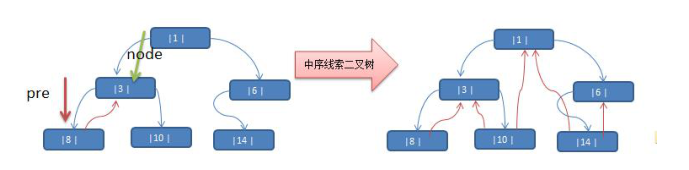

### 4：二叉查找(搜索)树BST

左子树都小于根节点，右子树都大于根节点，中序遍历有序

### 5：平衡二叉树AVL

当二叉查找树递增有序时，二叉查找树就变成了了链表，不合理，故要求极致的平衡，代价大，

左右子树高度差不超过1

**插入**


4：多路查找树

B树

2-3树

### 6：红黑树

HashMap用红黑树，在内存中。MySQL索引不用，取得数据在磁盘上，每次取一页（大概4K）

#### 性质：

红黑树是一种近视平衡的二叉查找树，他能过确保任何一个节点的左右子树的高度差不会超过二者中较低的那个的一倍，相比与二叉查找树，标记的不再是左右高度差，而是一个布尔类型，把他的额外空间调到最小，AVL的查找速度更快，但是维护平衡消耗的更多。


红黑树不追求"完全平衡"，即不像AVL那样要求节点的 `|balFact| <= 1`，它只要求部分达到平衡，但是提出了为节点增加颜色，红黑是用非严格的平衡来换取增删节点时候旋转次数的降低，


红黑树必须要满足以下5条性质：

1：每个节点不是红色就是黑色

2：不可能有连在一起的红色节点

3：根节点是黑色的

4：每个红色节点的两个子节点都是黑色，叶子节点都是黑色，出度为0满足了性质就可以近视的平衡，最后是红色则补两个黑色子节点

5：从任何一个节点触发，到达叶子节点经过的黑色节点数量一致


#### 左旋

Java中实现TreeMap，Java8中实现HashMap

搜索：比节点小就去左边，否则就去右边


遍历有广度优先（BFS），深度优先（DFS）

#### 插入

1：以红色作为插入默认色，寻找位置（调整小）

2：修复违规

变色：当前节点的父亲是红色，且它的叔叔也是红色

（1）把父节点设为黑色

（2）把叔叔变成黑色

(3)把爷爷变成红色

（4）把指针定义到爷爷节点设为当前要操作的

右旋：当前父节点是红色，叔叔是黑色的时候，且当前的节点是左子树，右旋

（1）把父节点变成黑色

（2）把祖父节点变成红色

（3）以爷爷节点旋转

旋转

当前父节点是红色，叔叔是黑色的时候，且当前的节点是右子树，左旋以父节点作为左旋

左旋：把右子节点转成自己的父亲

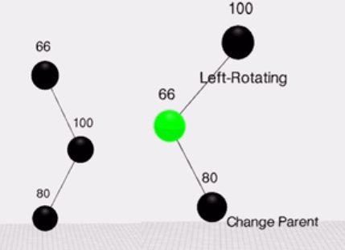


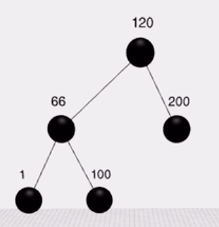


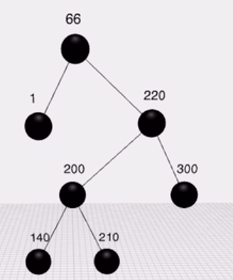

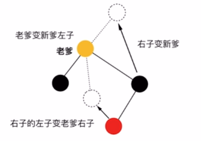

#### 右旋


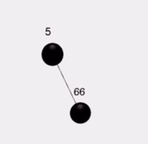

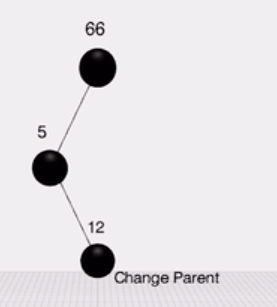

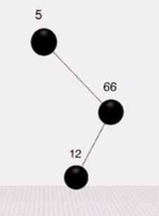


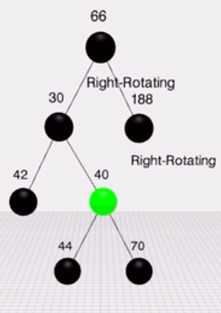


1：没有爸爸，直接变成黑色

2：爸爸黑色

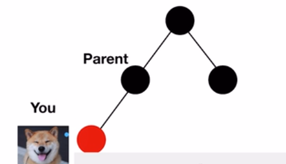

3：爸爸是红色的

3.1uncle是红色的，直接祖父变成红色，祖父也要向上再检查一下

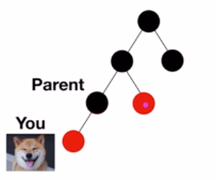

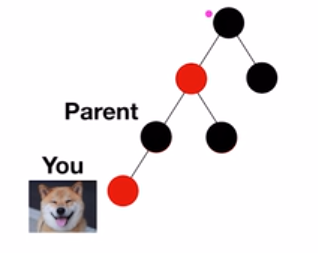

3.2uncle是黑色的

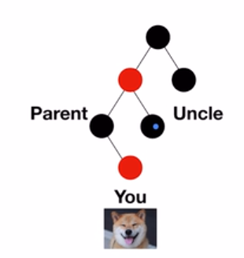

删除

1：搜索要删除的节点

2：查找替换节点


### 6：B树与B+树

### B树：

多路平衡查找树

每个节点最多有m-1个关键字（可以存有的键值对）。

根节点最少可以只有1个关键字。

非根节点至少有m/2个关键字。

每个节点中的关键字都按照从小到大的顺序排列，每个关键字的左子树中的所有关键字都小于它，而右子树中的所有关键字都大于它。

所有叶子节点都位于同一层，或者说根节点到每个叶子节点的长度都相同。

每个节点都存有索引和数据，也就是对应的key和value。

根节点的**关键字**数量范围：1 \<= k \<= m-1，非根节点的**关键字**数量范围：m/2
\<= k \<= m-1。

B树的插入

**判断当前结点key的个数是否小于等于m-1，如果满足，直接插入即可，如果不满足，将节点的中间的key将这个节点分为左右两部分，中间的节点放到父节点中即可。**


分裂

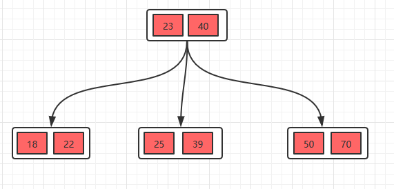

删除操作：保证节点个数的范围m/2 \<= k \<= m-1。

1：删除叶子节点节点数还是大于m/2直接删除

2：把22删除，这种情况的规则：22是非叶子节点，**对于非叶子节点的删除，我们需要用后继key（元素）覆盖要删除的key，然后在后继key所在的子支中删除该后继key**。对于删除22，需要将后继元素24移到被删除的22所在的节点。

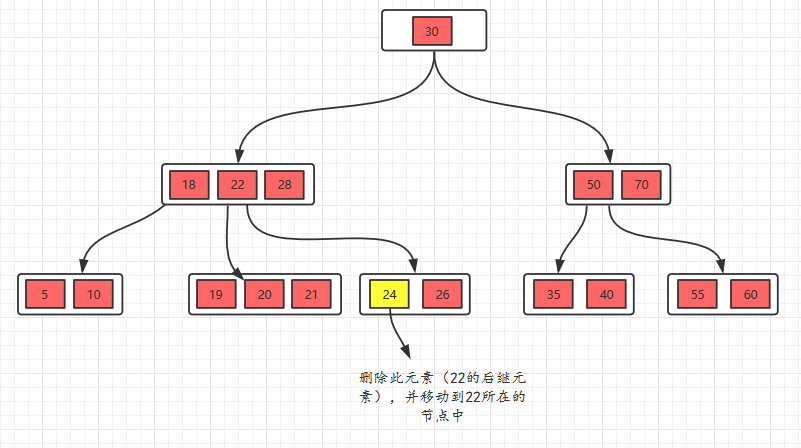

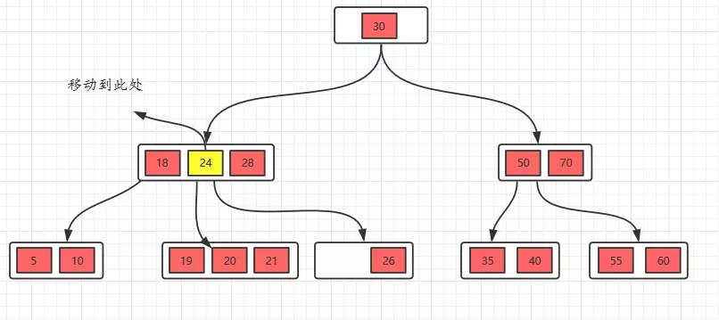

此时发现26所在的节点只有一个元素，小于2个（m/2），这个节点不符合要求，这时候的规则（向兄弟节点借元素）：**如果删除叶子节点，如果删除元素后元素个数少于（m/2），并且它的兄弟节点的元素大于（m/2），也就是说兄弟节点的元素比最少值m/2还多，将先将父节点的元素移到该节点，然后将兄弟节点的元素再移动到父节点**。这样就满足要求了。

我们看看操作过程就更加明白了。


3：删除28，**删除叶子节点**，删除后不满足要求，所以，我们需要考虑向兄弟节点借元素，但是，兄弟节点也没有多的节点（2个），借不了，怎么办呢？如果遇到这种情况，**首先，还是将先将父节点的元素移到该节点，然后，将当前节点及它的兄弟节点中的key合并，形成一个新的节点**。

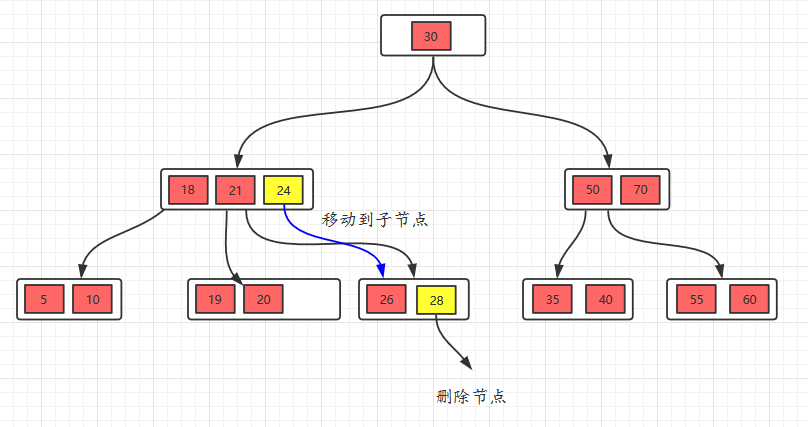

移动之后，跟兄弟节点合并。


### B+树

同：

-   根节点至少一个元素

-   非根节点元素范围：m/2 \<= k \<= m-1

不同：

-   B+树有两种类型的节点：内部结点（也称索引结点）和叶子结点。内部节点就是非叶子节点，内部节点不存储数据，只存储索引，数据都存储在叶子节点。

-   内部结点中的key都按照从小到大的顺序排列，对于内部结点中的一个key，左树中的所有key都小于它，右子树中的key都大于等于它。叶子结点中的记录也按照key的大小排列。

-   每个叶子结点都存有相邻叶子结点的指针，叶子结点本身依关键字的大小自小而大顺序链接。

-   父节点存有右孩子的第一个元素的索引。

<https://my.oschina.net/u/4116286/blog/3107389>

总结：

-   单一节点存储的元素更多，使得查询的IO次数更少，所以也就使得它更适合做为数据库MySQL的底层数据结构了。

-   所有的查询都要查找到叶子节点，查询性能是稳定的，而B树，每个节点都可以查找到数据，所以不稳定。

-   所有的叶子节点形成了一个有序链表，更加便于查找。


# 第五章：哈希表（散列表）


# 第六章：Set集合

注重独一无二的性质,该体系集合可以知道某物是否已近存在于集合中,不会存储重复的元素，用于存储无序(存入和取出的顺序不一定相同)元素，值不能重复。

## 1：性质

1：对象对等性，

 引用到堆上同一个对象的两个引用是相等的。如果对两个引用调用hashCode方法，会得到相同的结果，如果对象所属的类没有覆盖Object的hashCode方法的话，hashCode会返回每个对象特有的序号（java是依据对象的内存地址计算出的此序号），所以两个不同的对象的hashCode值是不可能相等的。

## 2：Java中实现

### 2.1：HashSet

哈希表边存放的是哈希值。HashSet存储元素的顺序并不是按照存入时的顺序（和List显然不同） 是按照哈希值来存的所以取数据也是按照哈希值取得。

HashSet如何检查重复？HashSet会通过元素的hashcode（）和equals方法进行判断元素师否重复。

### 2.2：TreeSet

### 2.3：LinkedHashSet


会保存插入的顺序。

看到array，就要想到角标。

看到link，就要想到first，last。

看到hash，就要想到hashCode,equals.

看到tree，就要想到两个接口。Comparable，Comparator。


# 第七章：Map

## 常用API

| 方法                          | 描述                                                         |
| ----------------------------- | ------------------------------------------------------------ |
| clear()                       | 从 Map 中删除所有映射                                        |
| remove(Object key)            | 从 Map 中删除键和关联的值                                    |
| put(Object key, Object value) | 将指定值与指定键相关联                                       |
| putAll(Map t)                 | 将指定 Map 中的所有映射复制到此 map                          |
| entrySet()                    | 返回 Map 中所包含映射的 Set 视图。Set 中的每个元素都是一个 Map.Entry 对象，可以使用 getKey() 和 getValue() 方法（还有一个 setValue() 方法）访问后者的键元素和值元素 |
| keySet()                      | 返回 Map 中所包含键的 Set 视图。删除 Set 中的元素还将删除 Map 中相应的映射（键和值） |
| values()                      | 返回 map 中所包含值的 Collection 视图。删除 Collection 中的元素还将删除 Map 中相应的映射（键和值） |
| get(Object key)               | 返回与指定键关联的值                                         |
| containsKey(Object key)       | 如果 Map 包含指定键的映射，则返回 true                       |
| containsValue(Object value)   | 如果此 Map 将一个或多个键映射到指定值，则返回 true           |
| isEmpty()                     | 如果 Map 不包含键-值映射，则返回 true                        |
| size()                        | 返回 Map 中的键-值映射的数目                                 |

## 1：Java中的实现

#### HashMap

最常用的Map,它根据键的HashCode 值存储数据,根据键可以直接获取它的值，具有很快的访问速度。HashMap最多只允许一条记录的键为Null(多条会覆盖);允许多条记录的值为 Null。非同步的。

#### TreeMap

能够把它保存的记录根据键(key)排序,默认是按升序排序，也可以指定排序的比较器，当用Iterator 遍历TreeMap时，得到的记录是排过序的。TreeMap不允许key的值为null。非同步的。

#### Hashtable

与 HashMap类似,不同的是:key和value的值均不允许为null;它支持线程的同步，即任一时刻只有一个线程能写Hashtable,因此也导致了Hashtale在写入时会比较慢。

#### LinkedHashMap

保存了记录的插入顺序，在用Iterator遍历LinkedHashMap时，先得到的记录肯定是先插入的.在遍历的时候会比HashMap慢。key和value均允许为空，非同步的。

##  2：Map排序

```java
public class MapSort {
    public static void main(String[] args) {
        Map<String,String> map = new HashMap<String,String>();
        map.put("b", "b");
        map.put("a", "c");
        map.put("c", "a");
        // 通过ArrayList构造函数把map.entrySet()转换成list
        List<Map.Entry<String,String>> list = new ArrayList<Map.Entry<String, String>>(map.entrySet());
        //通过比较器实现比较排序
        Collections.sort(list,new Comparator<Map.Entry<String,String>>(){
            @Override
            public int compare(Map.Entry<String, String> mapping1, Map.Entry<String, String> mapping2) {
                return mapping1.getKey().compareTo(mapping2.getKey());
            }
        });
        for (Map.Entry<String,String> mapping:list) {
            System.out.println(mapping.getKey() + "  : "+mapping.getValue());
        }
    }

}
```


# 第七章：查找

## 1：顺序（线性）查找

## 2：二分查找

有序数组，构建二叉排序树

查找的复杂度O（logN）

### 递归

思路：

1：首先确定数组下标：mid=（left+right）/2

2：然后让需要查找的数Value和arr【mid】比较，

Value\>arr【mid】，说明要查找在mid右边，递归向右查

Value\<arr【mid】

Value==arr【mid】，则找到

3：递归结束的条件：找到，或则扫描完整个数组没找到

public static int binarySearch(int[] arr, int left, int right, int findVal) {

// 当 left \> right 时，说明递归整个数组，但是没有找到

if (left \> right) {

return -1;

}

int mid = (left + right) / 2;

int midVal = arr[mid];

if (findVal \> midVal) {

// 向 右递归

return binarySearch(arr, mid + 1, right, findVal);

} else if (findVal \< midVal) {

// 向左递归

return binarySearch(arr, left, mid - 1, findVal);

} else {

return mid;}

}

### 非递归—必备算法1

//二分查找的非递归实现

/\*\*

\*

\* \@param arr 待查找的数组, arr是升序排序

\* \@param target 需要查找的数

\* \@return 返回对应下标，-1表示没有找到

\*/

public static int binarySearch(int[] arr, int target) {

int left = 0;

int right = arr.length - 1;

while(left \<= right) { //说明继续查找

int mid = (left + right) / 2;

if(arr[mid] == target) {

return mid;

} else if ( arr[mid] \> target) {

right = mid - 1;//需要向左边查找

} else {

left = mid + 1; //需要向右边查找

}

}

return -1;

}

}

## 3：插值查找

插值查找算法类似于二分查找，不同的是插值查找每次从自适应mid处开始查找。

将折半查找中的求mid 索引的公式 , low 表示左边索引left, high表示右边索引right.  
key 就是前面我们讲的 findVal


int mid = low + (high - low) \* (key - arr[low]) / (arr[high] - arr[low])
;/\*插值索引\*/  
对应前面的代码公式：  
int mid = left + (right – left) \* (findVal – arr[left]) / (arr[right] –
arr[left])

1.  对于数据量较大，**关键字分布比较均匀**的查找表来说，采用**插值查找,
    速度较快.**


-   

# 第七章：堆Heap

完全二叉树的一种


通常使用数组来实现

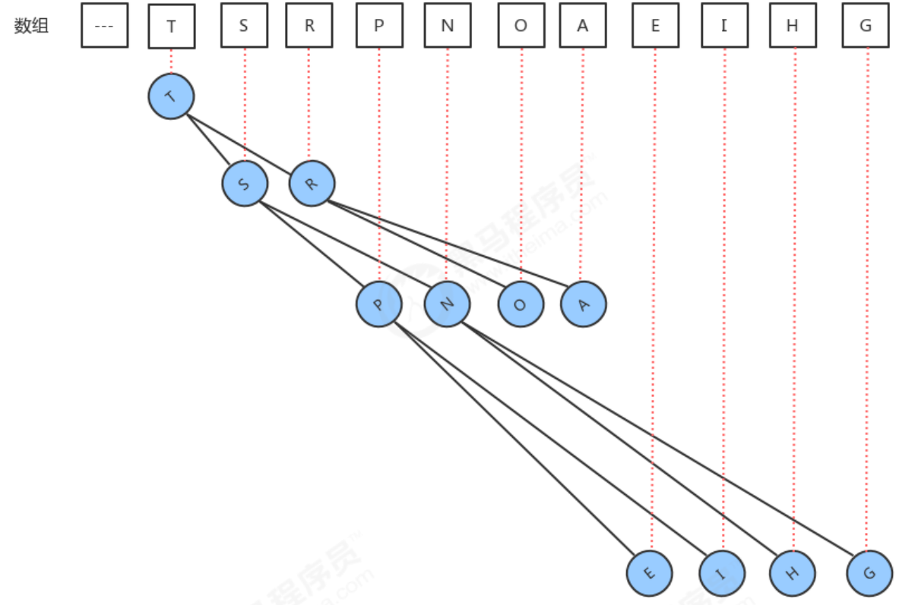

如果一个结点的位置为k，则它的父结点的位置为[k/2],而它的两个子结点的位置则分别为2k和2k+1。这样，在不 使用指针的情况下，我们也可以通过计算数组的索引在树中上下移动：从a[k]向上一层，就令k等于k/2,向下一层就 令k等于2k或2k+1。


插入：

如果往堆中新插入元素，我们只需要不断的比较新结点a[k]和它的父结点a[k/2]的大小，然后根据结果完成 数据元素的交换，就可以完成堆的有序调整。

删除最大元素

大根堆最大元素就是根节点

当删除掉最大元素后，只需要将最后一个元素放到索引1处，并不断的拿着当前结点a[k]与它的子结点a[2k] 和a[2k+1]中的较大者交换位置，即可完成堆的有序调整。

```java
//堆代码
public class Heap<T extends Comparable<T>> {
    //存储堆中的元素
    private T[] items;
    //记录堆中元素的个数
    private int N;

    public Heap(int capacity) {
        items = (T[]) new Comparable[capacity + 1];
        N = 0;
    }

    //判断堆中索引i处的元素是否小于索引j处的元素
    private boolean less(int i, int j) {
        return items[i].compareTo(items[j]) < 0;
    }

    //交换堆中i索引和j索引处的值
    private void exch(int i, int j) {
        T tmp = items[i];
        items[i] = items[j];
        items[j] = tmp;
    }

    //往堆中插入一个元素
    public void insert(T t) {
        items[++N] = t;
        swim(N);
    }

    //删除堆中最大的元素,并返回这个最大元素
    public T delMax() {
        T max = items[1];
        //交换索引1处和索引N处的值
        exch(1, N);
        //删除最后位置上的元素
        items[N] = null;
        N--;//个数-1
        sink(1);
        return max;
    }

    //使用上浮算法，使索引k处的元素能在堆中处于一个正确的位置
    private void swim(int k) {
        //如果已经到了根结点，就不需要循环了
        while (k > 1) {
            //比较当前结点和其父结点
            if (less(k / 2, k)) {
                //父结点小于当前结点，需要交换
                exch(k / 2, k);
            }
            k = k / 2;
        }
    }

    //使用下沉算法，使索引k处的元素能在堆中处于一个正确的位置
    private void sink(int k) {
        //如果当前已经是最底层了，就不需要循环了
        while (2 * k <= N) {
            //找到子结点中的较大者
            int max;
            if (2 * k + 1 <= N) {//存在右子结点
                if (less(2 * k, 2 * k + 1)) {
                    max = 2 * k + 1;
                } else {
                    max = 2 * k;
                }
            } else {//不存在右子结点
                max = 2 * k;
            }
            //比较当前结点和子结点中的较大者，如果当前结点不小，则结束循环
            if (!less(k, max)) {
                break;
            }
            //当前结点小，则交换，
            exch(k, max);
            k = max;
        }
    }
}
```


堆排序

堆排序是利用堆这种数据结构而设计的一种排序算法，堆排序是一种选择排序，它的最坏，最好，平均时间复杂度均为
O(nlogn)，它也是不稳定排序。


# 第八章：串

## 2：常见面试题

### 1：KMP算法

判断str1中是否有str2，如果存在返回第一次出现的位置

# 第十章：图

## 1：基础概念

1：顶点，边，路径，无向图，入度，出度，

2：表示方法：

二维数组（邻接矩阵）；

数组+链表（邻接表）

## 2：图的遍历

### 深度优先遍历（DFS）

**思路：**

从初始访问节点出发，首先访问第一个邻接节点，再以这个被访问节点作为初始节点，访问他的第一个邻接节点，依次递推，然后再访问第二个，然后返回上一个节点

步骤：

1）访问初始节点v，并标记节点v为已访问

2）查找结点v的第一个邻接节点w

3）若w存在，则执行4，若w不存在，则回到第一步从v的下一个节点继续

4）若w未被访问，对w进行深度优先遍历递归

5）查找节点v的w邻接节点的下一个邻接节点，转到步骤3

```java
    private void dfs(boolean[] isVisited, int i) {
        //首先访问该节点
        System.out.println(getValueByIndex(i) + "-->");
        //将节点设置为已经访问
        isVisited[i] = true;
        //查找节点i的第一个邻接节点w
        int w = getFirstNeighbor(i);
        //说明有w
        while (w != -1) {
            if (!isVisited[w]) {
                dfs(isVisited, w);
            }
            //如果w节点已经被访问过
            w = getNextNeighbor(i, w);
        }
    }
```

### 广度优先遍历(BFS）

步骤：

1）访问初始节点v并标记节点v为已访问

2）节点v入队列

3）当队列非空是，继续执行，否则算法结束

4）出队列，取得对头节点u

5）查找节点u的邻接节点w，若不存在，则转到3，否则循环一下步骤

5.1 若节点w未访问，则访问节点w并标记为已访问

5.2 节点w入队列

5.3 查找节点u的继w邻接节点后的下一个邻接节点w


## 3：拓扑排序

拓扑排序： 给定一副有向图，将所有的顶点排序，使得所有的有向边均从排在前面的元素指向排在后面的元素，此时就可以明 确的表示出每个顶点的优先级。

#### 检测有向图中的环

如果学习x课程前必须先学习y课程，学习y课程前必须先学习z课程，学习z课程前必须先学习x课程，那么一定是有 问题了，我们就没有办法学习了，因为这三个条件没有办法同时满足。其实这三门课程x、y、z的条件组成了一个 环： 因此，如果我们要使用拓扑排序解决优先级问题，首先得保证图中没有环的存在。

思路：

当我们深度搜索时： 

1. 在如果当前顶点正在搜索，则把对应的onStack数组中的值改为true，标识进栈；
2. 如果当前顶点搜索完毕，则把对应的onStack数组中的值改为false，标识出栈； 
3. 如果即将要搜索某个顶点，但该顶点已经在栈中，则图中有环；

如


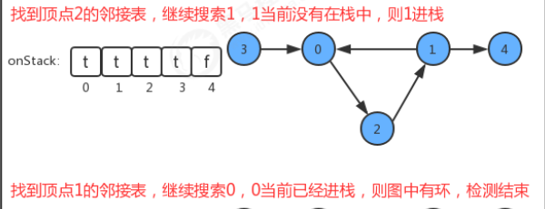

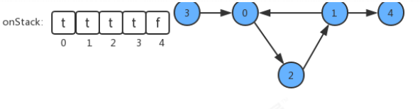

代码实现：

```java
public class DirectedCycle {
    //索引代表顶点，值表示当前顶点是否已经被搜索
    private boolean[] marked;
    //记录图中是否有环
    private boolean hasCycle;
    //索引代表顶点，使用栈的思想，记录当前顶点有没有已经处于正在搜索的有向路径上
    private boolean[] onStack;
    //创建一个检测环对象，检测图G中是否有环
    public DirectedCycle(Digraph G){
        //创建一个和图的顶点数一样大小的marked数组
        marked = new boolean[G.V()];
        //创建一个和图的顶点数一样大小的onStack数组
        onStack = new boolean[G.V()];
        //默认没有环
        this.hasCycle=false;
        //遍历搜索图中的每一个顶点
        for (int v = 0; v <G.V(); v++) {
            //如果当前顶点没有搜索过，则搜索
            if (!marked[v]){
                dfs(G,v);
            }
        }
    }
    //基于深度优先搜索，检测图G中是否有环
    private void dfs(Digraph G, int v){
        //把当前顶点标记为已搜索
        marked[v]=true;
        //让当前顶点进栈
        onStack[v]=true;
        //遍历v顶点的邻接表，得到每一个顶点w
        for (Integer w : G.adj(v)){
            //如果当前顶点w没有被搜索过，则递归搜索与w顶点相通的其他顶点
            if (!marked[w]){
                dfs(G,w);
            }
            //如果顶点w已经被搜索过，则查看顶点w是否在栈中，如果在，则证明图中有环，修改hasCycle标记，结束循环
            if (onStack[w]){
                hasCycle=true;
                return;
            }
        }
        //当前顶点已经搜索完毕，让当前顶点出栈
        onStack[v]=false;
    }
    //判断w顶点与s顶点是否相通
    public boolean hasCycle(){
        return hasCycle;
    }

}
```


#### 基于深度优先的定点排序


## 3：最短路径

### 迪杰斯特拉算法

```java
package com.xqc.classic;

import java.util.Arrays;
/**
 * 
 * @ClassName:DijkstraAlgorithm.java
 * @Author qcxiao
 * @Date:2020年8月10日下午2:06:52
 * @Version:1.0
 * @Description:迪杰斯特拉算法求最短路径
 */
public class DijkstraAlgorithm {

	public static void main(String[] args) {
		//顶点矩阵
		char[] vertex = { 'A', 'B', 'C', 'D', 'E', 'F', 'G' };
		//邻接矩阵
		int[][] matrix = new int[vertex.length][vertex.length];
		final int N = 65535;// 表示不可以连接
		matrix[0]=new int[]{N,5,7,N,N,N,2};  
        matrix[1]=new int[]{5,N,N,9,N,N,3};  
        matrix[2]=new int[]{7,N,N,N,8,N,N};  
        matrix[3]=new int[]{N,9,N,N,N,4,N};  
        matrix[4]=new int[]{N,N,8,N,N,5,4};  
        matrix[5]=new int[]{N,N,N,4,5,N,6};  
        matrix[6]=new int[]{2,3,N,N,4,6,N};
        //创建 Graph对象
        Graph graph = new Graph(vertex, matrix);
        //测试, 看看图的邻接矩阵是否ok
        graph.showGraph();
        //测试迪杰斯特拉算法
        graph.dsj(2);//C
        graph.showDijkstra();
        
        
	}

}
/**
 * @ClassName:DijkstraAlgorithm.java
 * @Author qcxiao
 * @Date:2020年8月10日下午2:09:43
 * @Version:1.0
 * @Description:图对象，使用邻接矩阵表示
 */
class Graph {
	private char[] vertex; // 顶点数组
	private int[][] matrix; // 邻接矩阵
	private VisitedVertex vv; //已经访问的顶点的集合

	// 构造器
	public Graph(char[] vertex, int[][] matrix) {
		this.vertex = vertex;
		this.matrix = matrix;
	}
	
	//显示结果
	public void showDijkstra() {
		vv.show();
	}

	// 显示图
	public void showGraph() {
		for (int[] link : matrix) {
			System.out.println(Arrays.toString(link));
		}
	}
	/**
	* @Function: DijkstraAlgorithm.java
	* @Description: 迪杰斯特拉算法实现
	*
	* @Return Type:void
	* @Parament:  index 表示出发顶点对应的下标
	*
	* @Version: v1.0.0
	* @Author : qcxiao
	* @Date:2020年8月10日 下午2:15:47
	 */
	public void dsj(int index) {
		vv = new VisitedVertex(vertex.length, index);
		update(index);//更新index顶点到周围顶点的距离和前驱顶点
		for(int j = 1; j <vertex.length; j++) {
			index = vv.updateArr();// 选择并返回新的访问顶点
			update(index); // 更新index顶点到周围顶点的距离和前驱顶点
		} 
	}
	
	
	
	//更新index下标顶点到周围顶点的距离和周围顶点的前驱顶点,
	private void update(int index) {
		int len = 0;
		//根据遍历我们的邻接矩阵的  matrix[index]行
		for(int j = 0; j < matrix[index].length; j++) {
			// len 含义是 : 出发顶点到index顶点的距离 + 从index顶点到j顶点的距离的和 
			len = vv.getDis(index) + matrix[index][j];
			// 如果j顶点没有被访问过，并且 len 小于出发顶点到j顶点的距离，就需要更新
			if(!vv.in(j) && len < vv.getDis(j)) {
				vv.updatePre(j, index); //更新j顶点的前驱为index顶点
				vv.updateDis(j, len); //更新出发顶点到j顶点的距离
			}
		}
	}
}

/**
 * @ClassName:DijkstraAlgorithm.java
 * @Author qcxiao
 * @Date:2020年8月10日下午2:18:12
 * @Version:1.0
 * @Description: 已访问顶点集合
 */
class VisitedVertex {
	// 记录各个顶点是否访问过 1表示访问过,0未访问,会动态更新
	public int[] already_arr;
	// 每个下标对应的值为前一个顶点下标, 会动态更新
	public int[] pre_visited;
	// 记录出发顶点到其他所有顶点的距离,比如G为出发顶点，就会记录G到其它顶点的距离，会动态更新，求的最短距离就会存放到dis
	public int[] dis;
	
	//构造器
	/**
	 * 
	 * @param length :表示顶点的个数 
	 * @param index: 出发顶点对应的下标, 比如G顶点，下标就是6
	 */
	/**
	* @Function: DijkstraAlgorithm.java
	* 
	* @Param: length :表示顶点的个数
	* @Param: index: 出发顶点对应的下标, 比如G顶点，下标就是
	* @Version: 1.0
	* @Author: qcxiao
	* @Date: 2020年8月10日 下午2:18:31
	 */
	public VisitedVertex(int length, int index) {
		this.already_arr = new int[length];
		this.pre_visited = new int[length];
		this.dis = new int[length];
		//初始化 dis数组
		Arrays.fill(dis, 65535);
		this.already_arr[index] = 1; //设置出发顶点被访问过
		this.dis[index] = 0;//设置出发顶点的访问距离为0
				
	}
	/**
	 * 功能: 判断index顶点是否被访问过
	 * @param index
	 * @return 如果访问过，就返回true, 否则访问false
	 */
	public boolean in(int index) {
		return already_arr[index] == 1;
	}
	
	/**
	 * 功能: 更新出发顶点到index顶点的距离
	 * @param index
	 * @param len
	 */
	public void updateDis(int index, int len) {
		dis[index] = len;
	}
	/**
	 * 功能: 更新pre这个顶点的前驱顶点为index顶点
	 * @param pre
	 * @param index
	 */
	public void updatePre(int pre, int index) {
		pre_visited[pre] = index;
	}
	/**
	 * 功能:返回出发顶点到index顶点的距离
	 * @param index
	 */
	public int getDis(int index) {
		return dis[index];
	}
	
	
	/**
	 * 继续选择并返回新的访问顶点， 比如这里的G 完后，就是 A点作为新的访问顶点(注意不是出发顶点)
	 * @return
	 */
	public int updateArr() {
		int min = 65535, index = 0;
		for(int i = 0; i < already_arr.length; i++) {
			if(already_arr[i] == 0 && dis[i] < min ) {
				min = dis[i];
				index = i;
			}
		}
		//更新 index 顶点被访问过
		already_arr[index] = 1;
		return index;
	}
	
	//显示最后的结果
	//即将三个数组的情况输出
	public void show() {
		
		System.out.println("==========================");
		//输出already_arr
		for(int i : already_arr) {
			System.out.print(i + " ");
		}
		System.out.println();
		//输出pre_visited
		for(int i : pre_visited) {
			System.out.print(i + " ");
		}
		System.out.println();
		//输出dis
		for(int i : dis) {
			System.out.print(i + " ");
		}
		System.out.println();
		//为了好看最后的最短距离，我们处理
		char[] vertex = { 'A', 'B', 'C', 'D', 'E', 'F', 'G' };
		int count = 0;
		for (int i : dis) {
			if (i != 65535) {
				System.out.print(vertex[count] + "("+i+") ");
			} else {
				System.out.println("N ");
			}
			count++;
		}
		System.out.println();
		
	}

}
```


## 4：最小生成树

```
包含图中所有顶点并且权值之和最小
```

### Prim算法

小扩展：贪心选取未在集合中最短的边

代码：

```java
	private static int Prim(int x,Map<Integer,List<Pair>> g) {
		//表示是否访问过
		boolean[] visited = new boolean[10005];
		
		PriorityQueue<Pair> heap = new PriorityQueue<>((a,b)->a.weight-b.weight);
		heap.offer(new Pair(0,x));
		
		int minimumCost=0;
		while(!heap.isEmpty()){
			Pair p = heap.poll();
			//换成另外一个点
			x=p.y;
			//如果访问过就不再操作了
			if(visited[x]) continue;
			//标志已经访问
			visited[x] = true;
			minimumCost+=p.weight;
			for(int i=0;i<g.get(x).size();i++){
				if(!visited[g.get(x).get(i).y]){
					heap.offer(g.get(x).get(i));
				}
			}
		}
		return minimumCost;
	}
```


### 克鲁斯卡尔算法

* 边联合：将最小的边加入集合使其并不能形成环
* 使用并查集判断其不能成环
* 测试用例：


代码：

```java
private static int Kruskal(Edge[] edges) {
   //使用并查集
   DSU dsu = new DSU(10005);
   
   int minimumCost = 0;
   for (Edge edge : edges) {
      int x = edge.x;
      int y = edge.y;
      //如果不属于一个联通分量
      if(dsu.findRoot(x)!=dsu.findRoot(y)){
         minimumCost+=edge.weight;
         dsu.union(x,y);
      }
   }  
   return minimumCost;
   
}
	static class DSU{
		int[] root;//父亲节点
		int[] size;//
		public DSU(int n){
			root = new int[n];
			size = new int[n];
			//初始化将根节点指向自己
			for(int i =0;i<n;i++){
				root[i]=i;
			}
			//一开始每个联通分量都是1
			Arrays.fill(size, 1);
			
		}
		public int findRoot(int x){
			if(root[x]!=x){
				root[x]=findRoot(root[x]);
			}
			return root[x];
		}
		public void union(int x,int y){
			int rootX = findRoot(x);
			int rootY = findRoot(y);
			if(rootX==rootY)return;
			//如果rootX更小，就把rootX的父就是rootY
			if(size[rootX]<size[rootY]){
				root[rootX]=rootY;
			}else{
				root[rootY] = rootX;
			}
		}
		
	}
```


# 第五章：递归

## 面试题

八皇后问题（递归+回溯）

思路分析

1) 第一个皇后先放第一行第一列

2) 第二个皇后放在第二行第一列、然后判断是否 OK， 如果不
OK，继续放在第二列、第三列、依次把所有列都放完，找到一个合适

3) 继续第三个皇后，还是第一列、第二列……直到第 8
个皇后也能放在一个不冲突的位置，算是找到了一个正确解

4)
当得到一个正确解时，在栈回退到上一个栈时，就会开始回溯，即将第一个皇后，放到第一列的所有正确解，全部得到.

5) 然后回头继续第一个皇后放第二列，后面继续循环执行 1,2,3,4 的步骤

代码实现

public class Queue8 {

//定义一个 max 表示共有多少个皇后

int max = 8;

//定义数组 array, 保存皇后放置位置的结果,比如 arr = {0 , 4, 7, 5, 2, 6, 1, 3}

int[] array = new int[max];

//编写一个方法，放置第 n 个皇后//特别注意： check 是 每一次递归时，进入到 check
中都有 for(int i = 0; i \< max; i++)，因此会有回溯

private void check(int n) {

if(n == max) { //n = 8 , 其实 8 个皇后就既然放好

print();

return;

}

//依次放入皇后，并判断是否冲突

for(int i = 0; i \< max; i++) {//先把当前这个皇后 n , 放到该行的第 1 列

array[n] = i;

//判断当放置第 n 个皇后到 i 列时，是否冲突

if(judge(n)) { // 不冲突//接着放 n+1 个皇后,即开始递归

check(n+1); //

}

//如果冲突，就继续执行 array[n] = i; 即将第 n 个皇后，放置在本行得
后移的一个位置

}

}

//查看当我们放置第 n 个皇后, 就去检测该皇后是否和前面已经摆放的皇后冲突

/\*\*

\* \@param n 表示第 n 个皇后

\* \@return\*/

private boolean judge(int n) {

judgeCount++;

for(int i = 0; i \< n; i++) {

// 说明

//1. array[i] == array[n] 表示判断 第 n 个皇后是否和前面的 n-1 个皇后在同一列

//2. Math.abs(n-i) == Math.abs(array[n] - array[i]) 表示判断第 n 个皇后是否和第
i 皇后是否在同一斜线

// n = 1 放置第 2 列 1 n = 1 array[1] = 1

// Math.abs(1-0) == 1 Math.abs(array[n] - array[i]) = Math.abs(1-0) = 1

//3. 判断是否在同一行, 没有必要，n 每次都在递增

if(array[i] == array[n] \|\| Math.abs(n-i) == Math.abs(array[n] - array[i]) )

{return false;

}

}

Return true；

}

# 第六章：排序

## 1：前序知识

1：comparable接口

由于我们这里要讲排序，所以肯定会在元素之间进行比较，而Java提供了一个接口Comparable就是用来定义排序
规则的

//学生类

public class Student implements Comparable{

……

>   //定义比较规则

>   \@Override

>   public int compareTo(Student o) {

>   return this.getAge()-o.getAge();

>   }

}

测试

//测试类

public class Test {

public static void main(String[] args) {

>   Student stu1 = new Student();

>   stu1.setUsername("zhangsan");

>   stu1.setAge(17);

>   Student stu2 = new Student();

>   stu2.setUsername("lisi");

>   stu2.setAge(19);

>   Comparable max = getMax(stu1, stu2);

>   System.out.println(max);

>   }

>   //测试方法，获取两个元素中的较大值

>   public static Comparable getMax(Comparable c1,Comparable c2){

>   int cmp = c1.compareTo(c2);

>   if (cmp\>=0){

>   return c1;

>   }else{

>   return c2;

>   }

>   }

}

## 2：冒泡排序

依次比较相邻的元素的值，若发现逆序则交换

详情参考：https://www.cnblogs.com/nullering/p/9537321.html

## 3：选择排序

从未排序中选择最小值与未排序第一个交换，已排序扩张

详情参考：https://www.cnblogs.com/nullering/p/9537321.html

## 4：插入排序

每次从无序表中取出第一个元素，把它插入到有序表的合适位置，使有序表仍然有序。

详情参考：https://www.cnblogs.com/nullering/p/9537321.html

## 5：快速排序

快速排序是找出一个元素（理论上可以随便找一个）作为基准(pivot),然后对数组进行分区操作,使基准左边元素的值都不大于基准值,基准右边的元素值 都不小于基准值，如此作为基准的元素调整到排序后的正确位置。递归快速排序，将其他n-1个元素也调整到排序后的正确位置。最后每个元素都是在排序后的正 确位置，排序完成。

详情参考：https://www.cnblogs.com/nullering/p/9537321.html

```java
	public static void sort(int[] a, int start, int end){
		if(start > end){
			//如果只有一个元素，就不用再排下去了
			return;
		} 
		else{
			//如果不止一个元素，继续划分两边递归排序下去
			int partition = divide(a, start, end);
			sort(a, start, partition-1);
			sort(a, partition+1, end);
		}		
	}
	/**
	 * 将数组的某一段元素进行划分，小的在左边，大的在右边
	 * @param a
	 * @param start
	 * @param end
	 * @return
	 */
	public static int divide(int[] a, int start, int end){
		//每次都以最右边的元素作为基准值
		int base = a[end];
		//start一旦等于end，就说明左右两个指针合并到了同一位置，可以结束此轮循环。
		while(start < end){
			while(start < end && a[start] <= base)
				//从左边开始遍历，如果比基准值小，就继续向右走
				start++;
			//上面的while循环结束时，就说明当前的a[start]的值比基准值大，应与基准值进行交换
			if(start < end){
				//交换
				int temp = a[start];
				a[start] = a[end];
				a[end] = temp;
				//交换后，此时的那个被调换的值也同时调到了正确的位置(基准值右边)，因此右边也要同时向前移动一位
				end--;
			}	
			while(start < end && a[end] >= base)
				//从右边开始遍历，如果比基准值大，就继续向左走
				end--;
			//上面的while循环结束时，就说明当前的a[end]的值比基准值小，应与基准值进行交换
			if(start < end){
				//交换
				int temp = a[start];
				a[start] = a[end];
				a[end] = temp;
				//交换后，此时的那个被调换的值也同时调到了正确的位置(基准值左边)，因此左边也要同时向后移动一位
				start++;
			}		
		}
		//这里返回start或者end皆可，此时的start和end都为基准值所在的位置
		return end;
	}
```


## 6：归并排序

将每条记录看成一个有序的子表，然后将有序表进行合并排序，直至完全有序

详情参考：https://www.cnblogs.com/nullering/p/9540619.html

## 7：堆排序

先构造出来大根堆（假设从小到大排序），然后取出堆顶元素（也就是最大的元素），放到数组的最后面，然后再将剩余的元素构造大根堆，再取出堆顶元素放到数组倒数第二个位置，依次类 推，直到所有的元素都放到数组中，排序就完成了

注：升序排序建立大根堆，降序排列建立小根堆

详情参考：https://www.cnblogs.com/nullering/p/9540619.html

## 8：对比

| 排序方法     | 时间复杂度（平均） | 时间复杂度（最坏) | 时间复杂度（最好) | 空间复杂度 | 稳定性 | 复杂性 |
| ------------ | ------------------ | ----------------- | ----------------- | ---------- | ------ | ------ |
| 直接插入排序 | O(n2)              | O(n2)             | O(n)              | O(1)       | 稳定   | 简单   |
| 希尔排序     | O(nlog2n)          | O(n2)             | O(n)              | O(1)       | 不稳定 | 较复杂 |
| 直接选择排序 | O(n2)              | O(n2)             | O(n2)             | O(1)       | 不稳定 | 简单   |
| 堆排序       | O(nlog2n)          | O(nlog2n)         | O(nlog2n)         | O(1)       | 不稳定 | 较复杂 |
| 冒泡排序     | O(n2)              | O(n2)             | O(n)              | O(1)       | 稳定   | 简单   |
| 快速排序     | O(nlog2n)          | O(n2)             | O(nlog2n)         | O(nlog2n)  | 不稳定 | 较复杂 |
| 归并排序     | O(nlog2n)          | O(nlog2n)         | O(nlog2n)         | O(n        | 稳定   | 较复杂 |
| 基数排序     | O(d(n+r))          | O(d(n+r))         | O(d(n+r))         | O(n+r)     | 稳定   | 较复杂 |

 关键字初始次序

1：元素的 **移动次数**与关键字的初始排列次序无关的是：基数排序。

2：元素的 **比较次数**与初始序列无关是：选择排序。

   解释：选择排序每一趟都从待排序的数据元素中选出最小的或者最大的一个元素。

3：算法的 **时间复杂度**与初始序列无关的是：直接选择排序。

选择排序 一定是n-1趟排序，比较的次数永远是n(n-1)/2。

4：冒泡排序最少一趟，最多n-1;比较次数最少n-1，最多n(n-1)/2。


## 9：Java中的Array.sort与Collections.sort

事实上Collections.sort方法底层就是调用的array.sort方法


# 八：排序

## 堆排序

建立大根堆O（N）

其实是数组

父——子：i——（i-1）/2

堆调整

数量小在内存中完成的内排序，需要外存的外排序

十：检索

提高效率：预排序，建立索引，散列技术，当散列不适合基于磁盘的应用，使用B树

平均检索长度ASL：检索过程中对关键码的平均比较次数

1：线性表检索

1：顺序检索：0处存待检索，从后往前检索，直达0处失败

2：二分检索：排序

ASL=log2（n+1）-1

插入不方便

3：分块检索：块间有序，块内无序。

记录：起始位置，每块最大值或者最小值，该块的数量。

2：集合检索

1：

3：散列检索

动态索引B树

中序遍历有序，m阶B数的结构定义

每个节点

# 算法常用

## 并查集DisjointSet

虽然很多时候能够被DFS代替

find

每个节点有一个parent，根节点是自己，

find的功能就是找到他的祖先即根节点

union


作用：检查两月元素是不是在同一个Set里面，在O(1)的时间内检查

即findRoot是不是同一个，但是向上搜索的话O(n)，优化

1：压缩路径Path Compression

2：union by rank


find过程中触发PathCompression

例如

find(5)的过程中，直接将路径上的节点直接指向根节点

find(8)的过程中，直接将路径上的节点直接指向根节点

如果先find(5)再find(8)那么他的复杂度即将降低


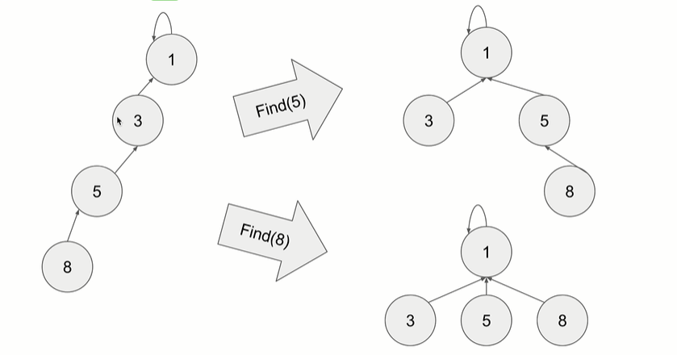


union by rank

我们把Rank低的union到Rank比较高的树上去。


```java
/**
 * 
 * @author xqc
 * @data 2020年2月18日
 * Description:
 * 并查集
 * 1:判断两个点是不是在一个集合
 * 2:把两个点加入到一个集合
 */
public class DisJointSet {
	static int maxn = 10000+10;
	//保存祖先
	static int[] parent;
	//rank记录每个树的高度
	static int[] rank ;
	/**
	 * 并查集初始化
	 */
	public static void init(){
		parent = new int[maxn];
		rank =new int[maxn];
		for(int i = 0;i<maxn;i++){
			//初始化父节点为自己
			parent[i]=i;
		    rank[i]=1;
		}
	}
	/**
	 * 查找根节点并进行路径压缩
	 * @param x
	 * @return
	 */
	public int findRoot(int x){
		//return parent[x] == x ? x : ((int)parent[x]=findRoot(parent[x]));
		while(parent[x]!=x){
			parent[x]=parent[parent[x]];//路径压缩
			x=parent[x];
		}
		return x;
	}
	//判断两个原数是否在同一个集合中
	public boolean isSameSet(int x,int y){
		return findRoot(x)==findRoot(y);
	}
	//合并两个集合
	public void union(int x, int y) {
        int xRoot = findRoot(x);
        int yRoot = findRoot(y);
        //若果是属于一个集合，直接退出
        if (xRoot == yRoot) {
            return;
        }
        //x的树高，y的根接到x的根上，yRoot的父指针指向xRoot
        if (rank[xRoot] > rank[yRoot]) {
            parent[yRoot] = xRoot;
        } else if (rank[yRoot] > rank[xRoot]) {
            parent[xRoot] = yRoot;
        } else {
            parent[yRoot] = xRoot;
            rank[xRoot] ++;
        }
	}
	public static void main(String[] args) {
		Scanner input = new Scanner(System.in);
		String str = input.next();
		System.out.println(str);		
	}
}
```

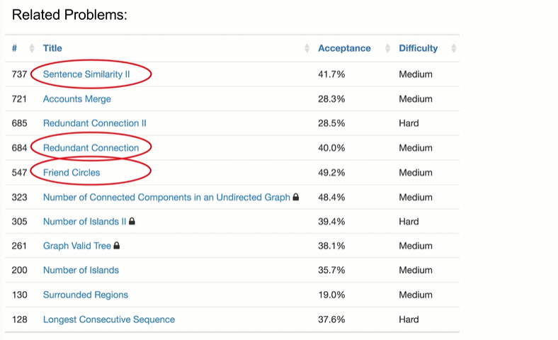

## 1：数论atoi

需特殊考虑，0，负数，小数

数据大小，类型范围

INT_MAX     0x7fff ffff                   21 4748 3647

INT_MIN     0x8000 0000            -21 4748 3648

LeetCode7 反转数字

典例1：

1.1：判断是2的幂

如果一个数是2的幂，那么它的二进制是这样的:
2 10
4 100
8 1000
16 10000

也就是第一个是1，其他都是0。
然后-1的话:
1 01
3 11
7 111
15 1111

故：如果是2的幂，则

n & （n-1）==0

扩展：求一个数n的二进制中1的个数。
非常巧妙地利用了一个性质，n=n&(n-1) 能移除掉n的二进制中最右边的1的性质，循环移除，直到将1全部移除，这种方法将问题的复杂度降低到只和1的个数有关系。

```java
	while (data)
	{
		data = data & (data-1);
		count++;
    }
```

3的幂：

big3 % n ==0，如果big3是三的幂，那么n也是

big3=3^k

k = log3(maxint)求出最大值下的最大3的幂


4的幂n&0x55555555

231,326，

取&操作，按位筛选器

191，

n = n&(n-1);//最低位1变0


172：求末尾多少个0

204：素数

素数筛


258题：


268题：找规律，0到n的数列，问中间缺的是啥？


292题：博弈问题

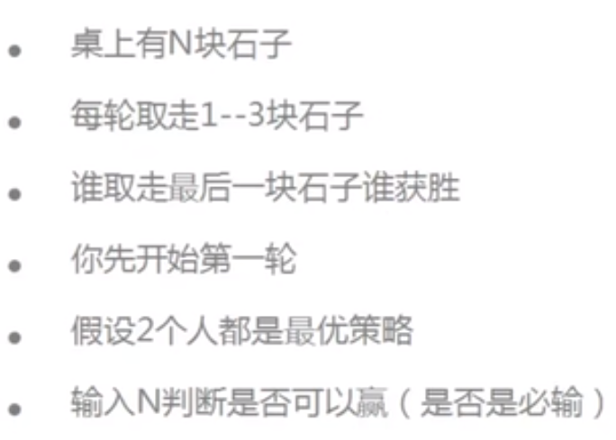

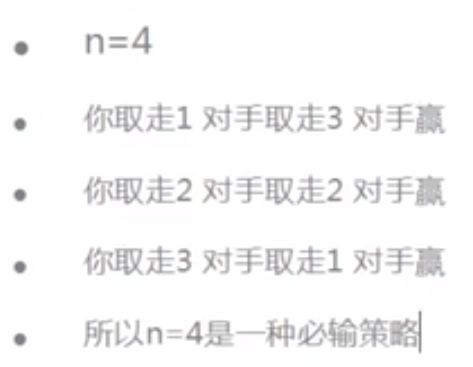

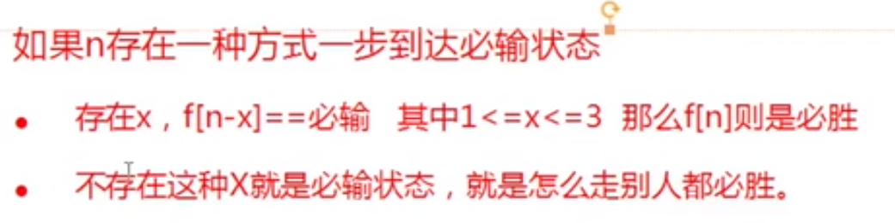


### 1.2：排列组合

排列A：从n个**不同元素**中取出m个元素，按一定顺序排成一列，一共有多少种排列？

组合C：从n个**不同元素**中，任取m个元素组成一组，一共有多少种取法？

A（n,m) =                                             =              n!/(n - m）!

A（4,2）=            4*3                           =            4!/2!         =    4 * 3   =12


C（n,m)  =   n!/m!(n-m)!     

C（4,2）=   4!/2!(4-2)!    =   (4\*3)/(2\*1)  = 6


排列A（n,m)  相当于从n里面取出m个然后进行全排列，即

A(n,m) = C(n,m)*A(m,m)


例1：对数组中元素进行全排列的方法数

```java
static int count=0;
	
public static void main(String[] args) {	
		int[] a={1,2,3};
		A(a,0,2);
		System.out.println(count);		
	}
	private static void A(int[] a, int start, int end) {
		//递归出口
        if(start==end){
			for (int x : a) {
				System.out.print(x);
			}
			count++;
			System.out.println();
		}else{
			//对于从开始到结束的每个数字
			for(int i=start;i<=end;i++){
				//每个数字都可以放在最前边一次
				swap(a,start,i);
				//将除了第一位以外剩下的进行全排列
				A(a,start+1,end);
				//防止重复，再换回来
				swap(a,start,i);
			}			
		}		
	}	
	private static void swap(int[] a, int start, int i) {
		int temp=a[start];
		a[start]=a[i];
		a[i]=temp;
	}
```


例2：C（n，m）从n中选出m人，返回可以选择的方法数

```java
	public static int RecursiveComposition(int n ,int m){
		if(m>n){
			return 0;
		}
		if(m==0){
			return 1;
		}
		return RecursiveComposition(n-1,m-1)+RecursiveComposition(n-1,m);
	}
```

### 1.3：最大公约数和最小公倍数

```java
	    public static int CommonMultiply(int m ,int n){
	        int r,gcd,lcm=0;

	        lcm=m*n;
	        while((r=m%n)!=0){
	              m=n;
	              n=r;
	        }
	        gcd = n;
	        lcm=lcm/gcd;
	        System.out.println("最大公约数："+gcd);
	        System.out.println("最小公倍数："+lcm);
	        return 0;
	    }
```


## 贪心算法（贪婪算法）

每一步都 选择此时最优的步骤，但全局不一定是最优的

仅适用于局部最优解策略能导致全局最优解策略

经典问题

### 1：钱币支付问题

假设有1,2,5,10,20,50,100元的纸币，分别有2,5,10,2,3,1张，问当买了一个130元的东西，要求使用的纸币量最少

思路：

1：最大的面额开始选择，50元大了，选择20的，


代码思路：从总数/最大 ，然后取余再比下一个，直到满足

### 2：区间问题


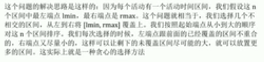

### 3：分糖果


如：g = {2,5,9,9,10,15} s = {1,3,6,8,20}

思路：对数组g
和s进行排序，按照从小到大的顺序使用各糖果尝试是否可满足某个孩子，每个糖果试一次，若成功，则换下一个孩子，直到发现没有更多的孩子。

代码思路：两个指针指向两个数组，

4：摇摆序列

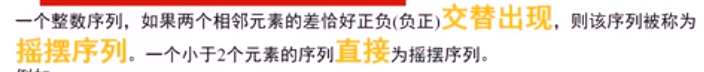

例如：【1,7,4,9,2,5】，相邻元素的差（6，-3,5，-7,3）该序列为摇摆序列

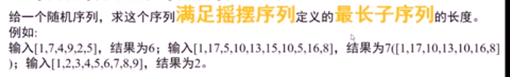

舍弃部分数，使其变成最长子序列

上升序列保留最大的，下降序列保留最小的


代码思路：状态机

### 5：移除k个数字

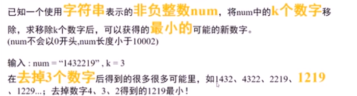

思路

长度为n的去掉k个数字，有

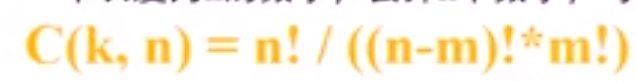

钟可能。枚举是不可能的

位数一样，尽可能让得到新数字的优先最高位最小，然后次高位最小，……

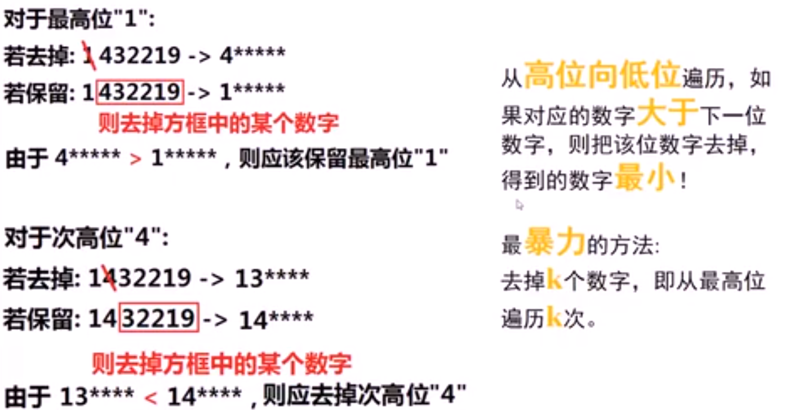

算法思路

例1：背包问题

向背包中放物品，背包最多容纳100kg，求放入的钱数最大，每种水果要么全放入要么不放入

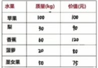

思路：第一步选择单价最大的全部放入，在剩下的基础上选择单价最大的放入

## 分治算法

回溯、分治和动态规划算法可以划为一类，因为它们都会涉及递归。

分治算法呢，可以认为是一种算法思想，通过将原问题分解成小规模的子问题，然后根据子问题的结果构造出原问题的答案。这里有点类似动态规划，所以说运用分治算法也需要满足一些条件，你的原问题结果应该可以通过合并子问题结果来计算。


大多用递归实现

分治法在每一层递归上都有三个步骤：

1) 分解：将原问题分解为若干个规模较小，相互独立，与原问题形式相同的子问题

2) 解决：若子问题规模较小而容易被解决则直接解，否则递归地解各个子问题

3) 合并：将各个子问题的解合并为原问题的解。

场景：

1：归并排序

```java
void sort(int[] nums, int lo, int hi) {
    int mid = (lo + hi) / 2;
    /****** 分 ******/
    // 对数组的两部分分别排序
    sort(nums, lo, mid);
    sort(nums, mid + 1, hi);
    /****** 治 ******/
    // 合并两个排好序的子数组
    merge(nums, lo, mid, hi);
}
```

2：海量数据处理，分别加载

案例一：汉诺塔问题

1) 如果是有一个盘， A-\>C

如果我们有 n \>= 2 情况，我们总是可以看做是两个盘 1.最下边的盘 2. 上面的盘

2) 先把 最上面的盘 A-\>B

3) 把最下边的盘 A-\>C

4) 把 B 塔的所有盘 从 B-\>C

public static void hanoiTower(int num, char a, char b, char c)

{

//如果只有一个盘

if(num == 1) {

System.out.println("第 1 个盘从 " + a + "-\>" + c);

} else {

//如果我们有 n \>= 2 情况，我们总是可以看做是两个盘 1.最下边的一个盘 2.
上面的所有盘

//1. 先把 最上面的所有盘 A-\>B， 移动过程会使用到 c

hanoiTower(num - 1, a, c, b);

//2. 把最下边的盘 A-\>C

System.out.println("第" + num + "个盘从 " + a + "-\>" + c);

//3. 把 B 塔的所有盘 从 B-\>C , 移动过程使用到 a 塔

hanoiTower(num - 1, b, a, c);

}

## 回溯算法

八皇后问题

8\*8的格子，是得任意两个皇后都不能处于同一横行，竖行和斜线上。

## 动态规划

套路分析：

**首先，动态规划问题的一般形式就是求最值**。动态规划其实是运筹学的一种最优化方法，

既然是要求最值，核心问题是什么呢？**求解动态规划的核心问题是穷举**。因为要求最值，肯定要把所有可行的答案穷举出来，然后在其中找最值呗。

首先，动态规划的穷举有点特别，因为这类问题**存在「重叠子问题」**，如果暴力穷举的话效率会极其低下，所以需要「备忘录」或者「DP table」来优化穷举过程，避免不必要的计算。

而且，动态规划问题一定会**具备「最优子结构」**，才能通过子问题的最值得到原问题的最值。

只有列出**正确的「状态转移方程」**才能正确地穷举。

以上提到的重叠子问题、最优子结构、状态转移方程就是动态规划三要素。

一般形式

```java
// 初始化 base case
dp[0][0][...] = base
// 进行状态转移
for 状态1 in 状态1的所有取值：
    for 状态2 in 状态2的所有取值：
        for ...
            dp[状态1][状态2][...] = 求最值(选择1，选择2...)
```


记录上一个问题的解，然后求该问题的解，减少递归中的重复计算

自顶向下的备忘录方式

案例一：0-1背包问题

(1) v[i][0]=v[0][j]=0; //表示 填入表 第一行和第一列是 0

(2) 当 w[i]\> j 时：v[i][j]=v[i-1][j] // 当准备加入新增的商品的容量大于
当前背包的容量时，就直接使用上一个单元格的装入策略

(3) 当 j\>=w[i]时： v[i][j]=max{v[i-1][j], v[i]+v[i-1][j-w[i]]}// 当
准备加入的新增的商品的容量小于等于当前背包的容量,

// 装入的方式:

v[i-1][j]： 就是上一个单元格的装入的最大值

v[i] : 表示当前商品的价值

v[i-1][j-w[i]] ： 装入 i-1 商品，到剩余空间 j-w[i]的最大值当 j\>=w[i]时：
v[i][j]=max{v[i-1][j], v[i]+v[i-1][j-w[i]]} :

```
思路：
/**
 * 01b背包问题,每个物品只有一个，背包容量为n，在背包中怎么装才能使装的东西价值最大
 * @param weight
 * @param value
 * @param n
 * @return 
 *        0  1  2  3  4  5  6  7  8  9  10   重量
 *        ————————————————————————————————————
 *      1|
 *      2|
 *      dp[i][j] 背包容量为j时，可以选择前i个物品，达到最大的价值
 *        方式1:选择第i个物品 dp[i-1][j-w[i]]+value[i],则最大=第i个物品的价值+剩余容量选择前i-1个物品所能达到的最大值
 *        方式2：不选择第i个物品dp[i-1][j]则最大=容量为j时选择前i-1个物品所能达到的最大值
 *   故：方程dp[i][j]=MAX(dp[i-1][j-w[i]]+value[i],dp[i-1][j]);
 */
```


代码

```java
	private static int KnapsackProblem(int[] weight, int[] value, int n) {
		//m表示物品的数量
		int m = weight.length;
		int[][] dp = new int[m+1][n+1];
		for(int i=0;i<=m;i++){
			for(int j=0;j<=n;j++){
				if(j>=weight[i]){
					dp[i][j]=Math.max(dp[i-1][j-weight[i]]+value[i],dp[i-1][j] );
				}else{
					dp[i][j]=dp[i-1][j];
				}
			}
		}
		return dp[m][n];
		
	}
```


## 二分查找非递归

已经排序的数组，中间位的数与目标数相比，

```java
	public static int binarySearch(int[] arr, int target) {	
		int left = 0;
		int right = arr.length - 1;
		//说明继续查找
		while(left <= right) {
			int mid = (left + right) / 2;
			if(arr[mid] == target) {
				return mid;
			} else if ( arr[mid] > target) {
				//需要向左边查找
				right = mid - 1;
			} else {
				//需要向右边查找
				left = mid + 1;
			}
		}
		return -1;
	}
```

## KMP算法


```java
public class KMP {
	
	public static void main(String[] args) {
		String str = "abcabcababaccc";
		String match = "ababa";
		System.out.println(getIndexOf(str, match));
	}
	
	public static int getIndexOf(String s,String m){
		if(s==null||m==null||m.length()<1||s.length()<m.length()){
			return -1;
		}
		char[] str1 = s.toCharArray();
		char[] str2 = m.toCharArray();
		int i1 = 0;
		int i2 = 0;
		int[] next = getNextArray(str2);
		
		while(i1<str1.length && i2<str2.length){
			if(str1[i1]==str2[i2]){
				i1++;
				i2++;
			}else if(next[i2]==-1){
				i1++;
			}else{
				i2 = next[i2];
			}
		}
		return i2 == str2.length ? i1-i2 : -1;
	}

	private static int[] getNextArray(char[] str) {
		if(str.length == 1){
			return new int[] {-1};
		}
		int[] next = new int[str.length];
		next[0]=-1;
		next[1]=0;
		//
		int i = 2;
		//跳到的位置
		int cn = 0;
		while(i<next.length){
			if(str[i-1]==str[cn]){
				next[i++] = ++cn;
			}else if(cn>0){
				cn = next[cn];
			}else{
				next[i++]=0;
			}
		}
/*		for(int j :next){
			System.out.println(j);
		}*/
		return next;
	}
}
```

## 布隆过滤器


## 树状数组

主要解决前n个数的和问题


Fenwick Tree 或 Binary Indexed Tree

也是预先计算部分解

每个点存储了一部分的和

与DP不同的是，DP每一个点存储的是当前位置的结果，但是树状数组存储的

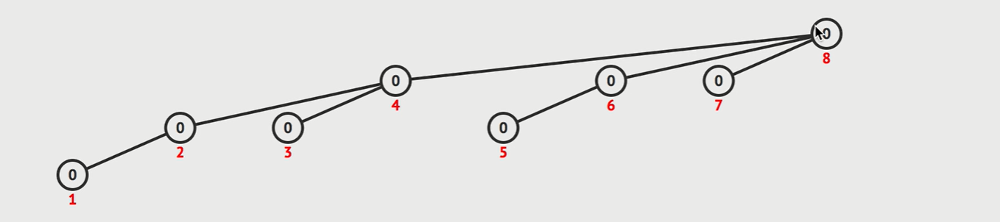

当1更新的时候，会沿着路径上的节点全部更新，当前路径上的值全部加上我当前的元素

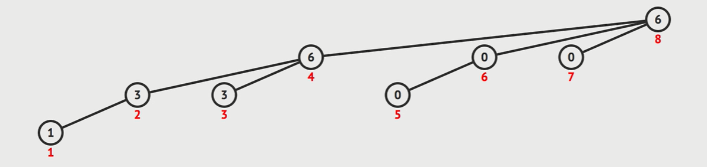

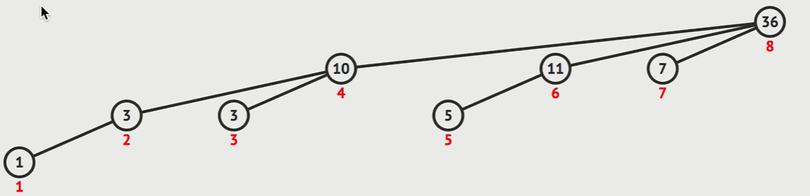


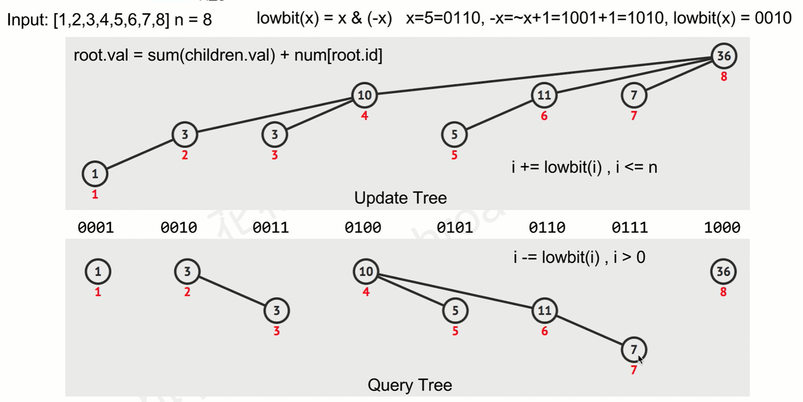

代码实现：

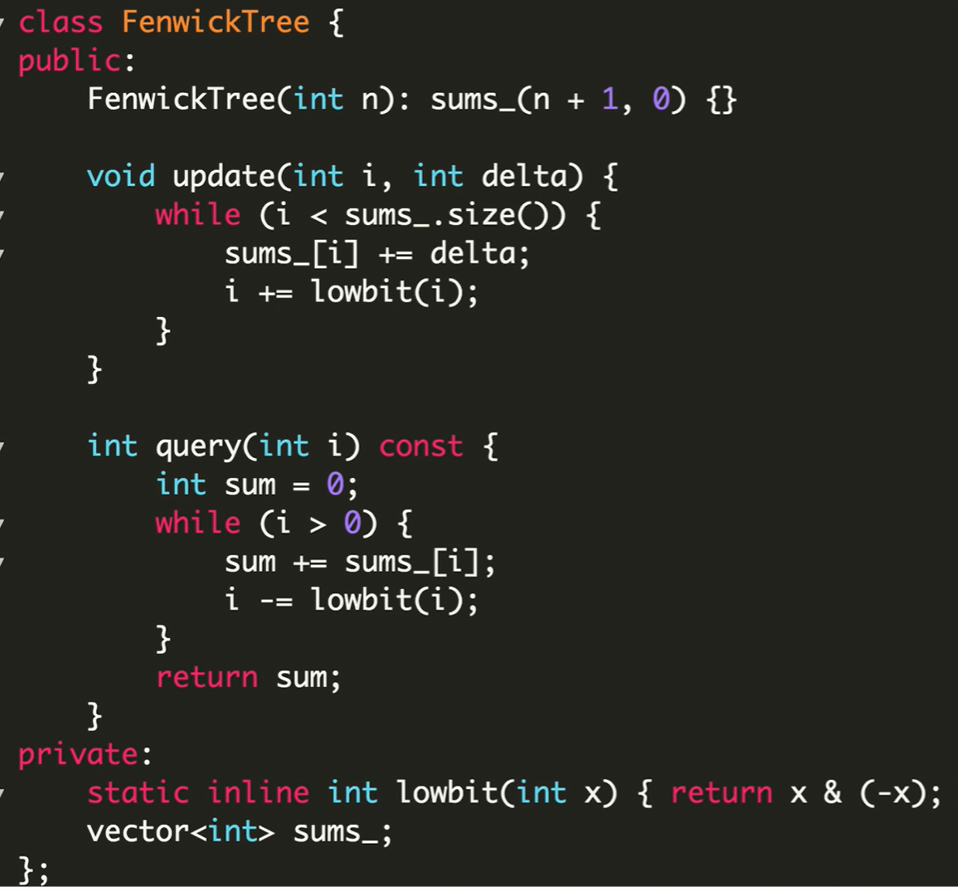


307

315


# 内功修炼

1：数组

**int**[] arr1 = **new int**[3];

**int**[] arr2 = **new int**[]{1,2,3};

arr1 = arr2.clone();

arr1.equals(arr2);

arr1.getClass();

**int** l = arr1.length;

添加元素方法封装

删除元素方法封装

查找算法方法封装

2：栈

第一章：排序基础

2-1 选择排序法

2-2 使用模板（泛型）编写算法

2-3 随机生成算法测试用例

2-4 测试算法的性能

2-5 插入排序法

2-6 插入排序法的改进

2-7 更多关于O（n\*2）排序算法的思考

第三章：高级排序问题

3-1 归并排序法

3-2 归并排序法的实现

3-3 归并排序法的优化

3-4 自底向上的归并排序算法

3-5 快速排序法

3-6 随机化快速排序法

3-7 双路快速排序法

3-8 三路快速排序法

3-9 归并排序和快速排序的衍生问题

第四章：堆和堆排序

4-1 为什么使用堆

4-2 堆的基本存储

4-3 Shift Up

4-4 Shift Down

4-5 基础堆排序和Heapify

4-6 优化的堆排序

4-7 排序算法总结

4-8 索引堆

4-9 索引堆的优化

4-10 和堆相关的其他问题

第五章：二分搜索树

5-1 二分查找法

5-2 二分搜索树基础

5-3 二分搜索树的节点插入

5-4 二分搜索书的查找

5-5 二分搜索树的遍历（深度优先遍历）

5-6 层序遍历（广度优先遍历）

5-7 删除最大值，最小值

5-8 二分搜索树的删除

5-9 二分搜索树的顺序性

5-10 二分搜索树的局限性

5-11 树形问题和更多树。

第六章:并查集

6-1 并查集基础

6-2 Qucik Find

6-3 Quick Union

6-4 基于size的优化

6-5 基于rank的优化

6-6 路径压缩

第七章:

7-1 图论基础

7-2 图的表示

7-3 相邻点迭代器

7-4 图的算法框架

7-5 深度优先遍历和联通分量

7-6 寻路

7-7 广度优先遍历和最短路径

7-8 迷宫生成，ps抠图--更多无权图的应用

第八章：最小生成树

8-1 有权图

8-2 最小生成树问题和切分定理

8-3 Prim算法的第一个实现

8-4 Prim算法的优化

8-5 优化后的Prim算法的实现

8-6 Krusk算法

8-7 最小生成树算法的思考

第九章：最短路径

9-1 最短路径问题和松弛操作

9-2 Dijkstra算法的思想

9-3 实现Dijkstra算法

9-4 负权边和Bellman-Ford算法

9-5 实现Bellman-Ford算法

9-6 更多和最短路径相关的思考

第十章：结束语

10-1 总结，算法思想，大家加油！

# 10：其他常见算法题

1：八皇后问题——回溯算法

在8\*8的国际象棋上摆放八个皇后，使其不能相互攻击，即任意两个皇后都不能处于同一行同一列或统一斜线上，问有多少种摆法

2：马踏棋盘算法（骑士周游问题）

图形深度优先+贪心

# 算法竞赛进阶指南

www.acwing.com

## 位运算

与： x & y 如果两个都是真才真

或 ： x \| y

非: !x

异或：x \^ y：相同为0，不同为1

成对的实现：

一个数异或1得到其配偶

Lowbit运算

Lowbit(101010011000) = 1000

将原数取反加一，与原数进行与操作

Int lowbit(n){

Return (-n)& n;

}

计算机里：

Int 32位

1：000000000000000……1

补码：正数不变，负数原码取反加一

左移：1\<\<n = 2\^n

右移：算术右移补符号位

89题：

求 aa 的 bb 次方对 pp 取模的值。

快速幂

90：64位整数乘法

91：最短Hamiton路径

旅行商问题：NP完全问题

递推与递归

把递归改成非递归

92：递归实现·指数型枚举

93：递归实现组合型枚举

94：递归