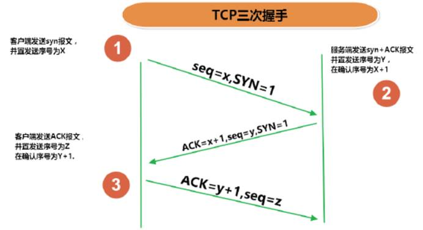

# 第一章：计算机网络体系结构

## 1：概述

### 1.1：名称解释

接口：下层向上层提供的原语操作 

协议：同一层之间，通信双方进行信息交换必须遵守的规则 

服务：不同层之间交换信息必须遵守的规则


性能指标：

1）带宽：网络的通信线路传送数据的能力。即：在单位时间内从网络中的某一个点到另一点所能通过的“最高数据率”。

2）时延：数据（一个报文或分组，甚至比特）从网络（或链路）的一端传送到另一端所需的时间。

发送时延：主机或路由器发送数据帧所需要的时间，即：从发送数据帧的第一个比特算起到该帧的最后一个比特发送完毕所需要的时间。

传播时延：电磁波在信道中传播一定的距离需要花费的时间。

处理时延：主机或路由器在收到分组时要花费一定的时间进行处理。

排队时延：分组在经过网络传输时，要经过许多路由器。但分组在进入路由器后要先在输入队列中排队等待处理。

6:）时延带宽积：传播时延*带宽

7）往返时延RTT：从发送方发送数据开始，到发送方收到来自接收方的确认总共经历的时间。

8）吞吐量：在单位时间内通过某个网络（信道/接口）的数据量。

9）速率：连接在计算机网络上的主机在数字信道上传送数据的速率

服务：

1）面向连接和无连接服务

2）可靠服务和不可靠服务

3）有应答服务和无应答服务

### 1.2：分类

按交换技术分：

1）电路交换网络：

专用通道，实时性强，时延小，信道利用率低

2）报文交换网络：

存储转发的传输方式，

加上原地址和目的地址，校检码

**出错时，整个报文都将重传**。

3）分组交换网络：

存储转发的传输方式

包交换，

 将一个长报文先分割为若干个较短的分组，然后把这些分组（携带源、目的地址和编号信息）逐个地发送出去。采用分组交换技术，**在通信之前不需要建立连接**，每个节点首先将前一节点送来的分组收下并保存在缓冲区中，然后根据分组头部中的地址信息选择适当的链路将其发送至下一个节点，这样在通信过程中可以根据用户的要求和网络的能力来动态分配带宽。**分组交换比电路交换的信道利用率高，但时延较大**。分组转发的带来的问题：排队时延以及增加头部带来的开销。  

### 1.3：网络模型


 **1）物理层（Physical Layer）**

激活、维持、关闭通信端点之间的机械特性、电气特性、功能特性以及过程特性。**该层为上层协议提供了一个传输数据的可靠的物理媒体。简单的说，物理层确保原始的数据可在各种物理媒体上传输。**物理层记住两个重要的设备名称，中继器（Repeater，也叫放大器）和集线器。

**2）数据链路层（Data Link Layer）**

数据链路层在物理层提供的服务的基础上向网络层提供服务，其最基本的服务是将源自网络层来的数据可靠地传输到相邻节点的目标机网络层。为达到这一目的，数据链路必须具备一系列相应的功能，主要有：如何将数据组合成数据块，在数据链路层中称这种数据块为帧（frame），帧是数据链路层的传送单位；如何控制帧在物理信道上的传输，包括如何处理传输差错，如何调节发送速率以使与接收方相匹配；以及在两个网络实体之间提供数据链路通路的建立、维持和释放的管理。数据链路层在不可靠的物理介质上提供可靠的传输。该层的作用包括：物理地址寻址、数据的成帧、流量控制、数据的检错、重发等。

**3）网络层（Network Layer）**

网络层的目的是实现两个端系统之间的数据透明传送，具体功能包括寻址和路由选择、连接的建立、保持和终止等。它提供的服务使传输层不需要了解网络中的数据传输和交换技术。如果您想用尽量少的词来记住网络层，那就是"路径选择、路由及逻辑寻址"。

 

# 第二章：物理层

## **2.1、基带调制**

1）编码：把数字信号转换为另一种形式的数字信号。

常用编码方式：不归零制，归零制（正脉冲代表1，负脉冲代表0），曼彻斯特编码（位周期中心的向上跳变代表0，向下代表1，反之亦可），差分曼彻斯特编码（每一位的中心处始终有跳变。位开始边界有跳变为0，位开始边界无跳变为1）。

2）基本的带通调制方法

调幅，调频，调相

## 2.1：通信基础

奈奎斯特定理：在任何信道中，码元传输的速率是有上限的，传输速率超过此上限，就会出现严重的码间串扰的问题，使接收端对码元的判决(即识别)成为不可能。


香农定理：求出了信息传输速率的极限。

C=W*log2(1+S/N) （ log2表示以2为底的对数）(bit/s)

W是信道带宽（赫），S是信号功率（瓦），N是噪声功率（瓦）。

香农公式中的S/N 为无量纲单位。如：S/N＝1000（即，信号功率是噪声功率的1000倍）

但是，当讨论信噪比（S/N）时，常以分贝（dB）为单位。公式如下：

SNR(信噪比，单位为dB)=10log(S/N)


编码方式

## 2.2：传输介质


## 2.3：信道复用

1）频分复用FDM:所有用户在同样的时间占用不同的带宽频率（频率带宽）

2）TDM:

3）波分复用WDM：

4）码分复用CDM: 

码分多址CDMA


## 2.3：物理层设备

中继器，集线器

 

# 第三章：数据链路层

三个基本问题：封装成帧，透明传输，差错检测

 **数据链路层拆分为两个子层**

1）逻辑链路控制LLC

2）媒体接入控制MAC


### CSMA/CD

（载波监听多点接入/碰撞检测）


载波监听

# 第四章：网络层

##  4.1：IP

1)地址解析协议ARP(Address Resolution Protocol)

2)网际控制报文协议ICMP(Internet Control Message Protocol)

3)网际组管理协议IGMP(Internet Group Management Protocol)


私有地址

私有地址包括3组

A类：10.0.0.0~10.255.255.255

B类：172.16.0.0~172.31.255.255

C类：192.168.0.0~192.168.255.255

# 第五章：传输层

## 5.2：UDP协议

使用UDP协议包括：TFTP（简单文件传输协议）、SNMP（简单网络管理协议）、DNS（域名解析协议）、NFS、BOOTP。


## 5.3：TCP协议

TCP报文首部格式：





 　**注：seq**:"sequance"序列号；**ack**:"acknowledge"确认号；**SYN**:"synchronize"请求同步标志；**；ACK**:"acknowledge"确认标志"**；****FIN**："Finally"结束标志。


TCP协议通过使用连续ARQ协议和滑动窗口协议，来保证数据传输的正确性，从而提供可靠的传输。

1）ARQ协议，即自动重传请求

2）连续ARQ协议：由于停止等待ARQ协议信道利用率太低，所以需要使用连续ARQ协议来进行改善。这个协议会连续发送一组数据包，然后再等待这些数据包的ACK。

发送方采用流水线传输。流水线传输就是发送方可以连续发送多个分组，不必每发完一个分组就停下来等待对方确认

3）滑动窗口协议：在发送方和接收方之间各自维持一个滑动窗口，发送方是发送窗口，接收方是接收窗口，而且这个窗口是随着时间变化可以向前滑动的。它允许发送方发送多个分组而不需等待确认。TCP的滑动窗口是以字节为单位的。

拥塞控制：

1）慢开始

指在TCP开始发送报文段时先设置拥塞窗口为1。

2）拥塞避免

3）快重传

4）快恢复


## 5.4：对比

TCP与UDP有什么不同

|              | UDP                                        | TCP                                    |
| :----------- | :----------------------------------------- | -------------------------------------- |
| 是否连接     | 无连接                                     | 面向连接                               |
| 是否可靠     | 不可靠传输，不使用流量控制和拥塞控制       | 可靠传输，使用流量控制和拥塞控制       |
| 连接对象个数 | 支持一对一，一对多，多对一和多对多交互通信 | 只能是一对一通信                       |
| 传输方式     | 面向报文                                   | 面向字节流                             |
| 首部开销     | 首部开销小，仅8字节                        | 首部最小20字节，最大60字节             |
| 适用场景     | 适用于实时应用（IP电话、视频会议、直播等） | 适用于要求可靠传输的应用，例如文件传输 |


# 第六章：应用层

## 6.1：HTTP

HTTP请求由三部分组成，分别是：
（1）请求行：
（2）消息报头；
（3）请求正文。


HTTP响应由四部分组成，分别是：
（1）状态行；
（2）消息报头；
（3）空行；
（4）响应正文；


请求方法

HTTP 1.0包括三种请求方法，分别是:
（1）GET：请求指定的页面信息，并返回实体主体。
（2）HEAD：类似于get请求，只不过返回的响应中没有具体的内容，用于获取报头
（3）POST：向指定资源提交数据进行处理请求（例如提交表单或者上传文件）。数据被包含在请求体中。POST请求可能会导致新的资源的建立和/或已有资源的修改。
HTTP 1.1中新增了五中请求方法：
（1）OPTIONS： 允许客户端查看服务器的性能；
（2）PUT： 从客户端向服务器传送的数据取代指定的文档的内容；
（3）DELETE：请求服务器删除指定的页面；
（4）TRACE：回显服务器收到的请求，主要用于测试或诊断；
（5）CONNECT：HTTP/1.1协议中预留给能够将连接改为管道方式的代理服务器。


http协议不同的版本区别：

HTTP 1.0：

（1）、支持POST、GET、HEAD三种方法；
（2）、规定浏览器与服务器之间只保持短暂的连接，浏览器的每次请求都需要与服务器建立一个TCP连接，服务器完成请求处理后立即断开TCP连接，服务器不跟踪每个客户也不记录过去的请求；

HTTP 1.1：

（1）、新增了五种请求方法：PUT、DELETE、CONNECT、TRACE、OPTIONS；
（2）、HTTP 1.1 在Request消息头里头多了一个Host域，便于一台WEB服务器上可以在同一个IP地址和端口号上使用不同的主机名来创建多个虚拟WEB站点；
（3）、在HTTP/1.1中新增了24个状态响应码：
100-199 用于指定客户端应相应的某些动作。
200-299 用于表示请求成功。
300-399 用于已经移动的文件并且常被包含在定位头信息中指定新的地址信息。
400-499 用于指出客户端的错误。
500-599 用于支持服务器错误。


Http与HttpS的区别：

一、传输信息安全性不同

1、http协议：是超文本传输协议，信息是明文传输。如果攻击者截取了Web浏览器和网站服务器之间的传输报文，就可以直接读懂其中的信息。

2、https协议：是具有安全性的ssl加密传输协议，为浏览器和服务器之间的通信加密，确保数据传输的安全。

二、连接方式不同

1、http协议：http的连接很简单，是无状态的。

2、https协议：是由SSL＋HTTP协议构建的可进行加密传输、身份认证的网络协议。

三、端口不同

1、http协议：使用的端口是80。

2、https协议：使用的端口是443．

四、证书申请方式不同

1、http协议：免费申请。

2、https协议：需要到ca申请证书，一般免费证书很少，需要交费。


http调优

1：使用base64码减少请求

2：httpCLient

修改连接池连接数

设置失败重试次数

设置连接超时时长


Http缓存机制：

配置服务器响应头来告诉浏览器是否应该缓存资源、是否强制校验缓存、缓存多长时间；浏览器非首次请求根据响应头是否应该取缓存、缓存过期发送请求头验证缓存是否可用还是重新获取资源的过程。

关键字

相应：

| 响应头                                                       | (常用)值                                                     | 说明                                               |
| ------------------------------------------------------------ | ------------------------------------------------------------ | -------------------------------------------------- |
| [Cache-Control](https://developer.mozilla.org/zh-CN/docs/Web/HTTP/Headers/Cache-Control) | no-cache, no-store, must-revalidate, max-age, public, private | 控制浏览器是否可以缓存资源、强制缓存校验、缓存时间 |
| [ETag](https://developer.mozilla.org/zh-CN/docs/Web/HTTP/Headers/ETag) | 文件指纹（hash码、时间戳等可以标识文件是否更新）             | 强校验，根据文件内容生成精确                       |
| [Last-Modified](https://developer.mozilla.org/zh-CN/docs/Web/HTTP/Headers/Last-Modified) | 请求的资源最近更新时间                                       | 弱校验， 根据文件修改时间，可能内容未变，不精确    |
| [Expires](https://developer.mozilla.org/zh-CN/docs/Web/HTTP/Headers/Expires) | 资源缓存过期时间                                             | 与响应头中的 Date 对比                             |

请求：

| 请求头                                                       | 值                              | 说明                                   |
| ------------------------------------------------------------ | ------------------------------- | -------------------------------------- |
| [If-None-Match](https://developer.mozilla.org/zh-CN/docs/Web/HTTP/Headers/If-None-Match) | 缓存响应头中的 ETag 值          | 发送给服务器比对文件是否更新（精确）   |
| [If-Modified-Since](https://developer.mozilla.org/zh-CN/docs/Web/HTTP/Headers/If-Modified-Since) | 缓存响应头中的 Last-Modified 值 | 发送给服务器比对文件是否更新（不精确） |

流程：


不设置响应头，浏览器并不能知道是否应该缓存资源，而是每次都发送新的请求，接收新的资源。

```java
// strategy['no-cache'](req, res, filePath, stat);
// strategy['no-store'](req, res, filePath, stat);
// strategy['cache'](req, res, filePath, stat);
strategy['nothing'](req, res, filePath, stat);
```

明确禁止缓存

设置响应头

```cmd
Cache-Control: no-store
或
Cache-Control: no-cache, no-store, must-revalidate

strategy['no-store'](req, res, filePath, stat);

```

- `Cache-Control: public` 表示一些中间代理、CDN等可以缓存资源，即便是带有一些敏感 HTTP 验证身份信息甚至响应状态代码通常无法缓存的也可以缓存。通常 public 是非必须的，因为响应头 max-age 信息已经明确告知可以缓存了。
- `Cache-Control: private` 明确告知此资源只能单个用户可以缓存，其他中间代理不能缓存。原始发起的浏览器可以缓存，中间代理不能缓存。例如：百度搜索时，特定搜索信息只能被发起请求的浏览器缓存。

缓存过期策略：

一般缓存机制只作用于 `get` 请求

1、三种方式设置服务器告知浏览器缓存过期时间

设置响应头（注意浏览器有自己的缓存替换策略，即便资源过期，不一定被浏览器删除。同样资源未过期，可能由于缓存空间不足而被其他网页新的缓存资源所替换而被删除。）：

- 1、设置 `Cache-Control: max-age=1000` //响应头中的 `Date` 经过 `1000s` 过期
- 2、设置 `Expires` //此时间与本地时间(响应头中的 Date )对比，小于本地时间表示过期，由于本地时钟与服务器时钟无法保持一致，导致比较不精确
- 3、如果以上均未设置，却设置了 `Last-Modified` ，浏览器隐式的设置资源过期时间为 `(Date - Last-Modified) * 10%` 缓存过期时间。

2、两种方式校验资源过期

设置请求头：

- 1、`If-None-Match` 如果缓存资源过期，浏览器发起请求会自动把原来缓存响应头里的 `ETag` 值设置为请求头 `If-None-Match` 的值发送给服务器用于比较。一般设置为文件的 hash 码或其他标识能够精确判断文件是否被更新，为强校验。
- 2、`If-Modified-Since` 同样对应缓存响应头里的 `Last-Modified` 的值。此值可能取得 [ctime](http://nodejs.cn/api/fs.html#fs_stats_ctime) 的值，该值可能被修改但文件内容未变，导致对比不准确，为弱校验。


## 6.2：DNS


