# 第一章：计算机网络体系结构

## 1：概述

网络的组成 :

- 边缘部分 : 主机
- 核心部分 : 大量网络和连接这些网络的路由器(此路由器不是我们家用的路由器)

### 1.1：名称解释

接口：下层向上层提供的原语操作

协议：同一层之间，通信双方进行信息交换必须遵守的规则

服务：不同层之间交换信息必须遵守的规则

性能指标：

1）带宽：网络的通信线路传送数据的能力。即：在单位时间内从网络中的某一个点到另一点所能通过的“最高数据率”。

2）时延：数据（一个报文或分组，甚至比特）从网络（或链路）的一端传送到另一端所需的时间。

发送时延：主机或路由器发送数据帧所需要的时间，即：从发送数据帧的第一个比特算起到该帧的最后一个比特发送完毕所需要的时间。

传播时延：电磁波在信道中传播一定的距离需要花费的时间。

处理时延：主机或路由器在收到分组时要花费一定的时间进行处理。

排队时延：分组在经过网络传输时，要经过许多路由器。但分组在进入路由器后要先在输入队列中排队等待处理。

6:）时延带宽积：传播时延\*带宽

7）往返时延 RTT：从发送方发送数据开始，到发送方收到来自接收方的确认总共经历的时间。

8）吞吐量：在单位时间内通过某个网络（信道/接口）的数据量。

9）速率：连接在计算机网络上的主机在数字信道上传送数据的速率

服务：

1）面向连接和无连接服务

2）可靠服务和不可靠服务

3）有应答服务和无应答服务

### 1.2：分类

按交换技术分：

1）电路交换网络：

专用通道，实时性强，时延小，信道利用率低

2）报文交换网络：

存储转发的传输方式，

加上原地址和目的地址，校检码

**出错时，整个报文都将重传**。

3）分组交换网络：

存储转发的传输方式

包交换，

将一个长报文先分割为若干个较短的分组，然后把这些分组（携带源、目的地址和编号信息）逐个地发送出去。采用分组交换技术，**在通信之前不需要建立连接**，每个节点首先将前一节点送来的分组收下并保存在缓冲区中，然后根据分组头部中的地址信息选择适当的链路将其发送至下一个节点，这样在通信过程中可以根据用户的要求和网络的能力来动态分配带宽。**分组交换比电路交换的信道利用率高，但时延较大**。分组转发的带来的问题：排队时延以及增加头部带来的开销。

### 1.3：网络模型

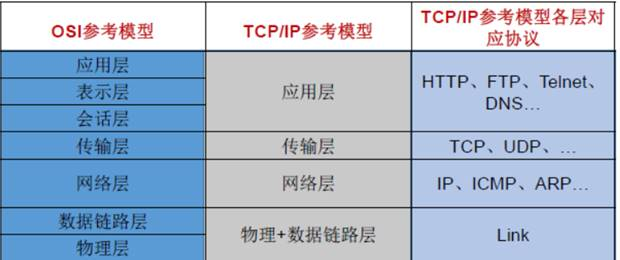

FTP 默认数据端口 21

Http 默认端口 80

Https 默认端口 443/tcp,443/UPD

网络层以上使用 IP 地址, 数据链路层以下使用 MAC 地址

**1）物理层（Physical Layer）**

激活、维持、关闭通信端点之间的机械特性、电气特性、功能特性以及过程特性。**该层为上层协议提供了一个传输数据的可靠的物理媒体。简单的说，物理层确保原始的数据可在各种物理媒体上传输。**物理层记住两个重要的设备名称，中继器（Repeater，也叫放大器）和集线器。

**2）数据链路层（Data Link Layer）**

数据链路层在物理层提供的服务的基础上向网络层提供服务，其最基本的服务是将源自网络层来的数据可靠地传输到相邻节点的目标机网络层。为达到这一目的，数据链路必须具备一系列相应的功能，主要有：如何将数据组合成数据块，在数据链路层中称这种数据块为帧（frame），帧是数据链路层的传送单位；如何控制帧在物理信道上的传输，包括如何处理传输差错，如何调节发送速率以使与接收方相匹配；以及在两个网络实体之间提供数据链路通路的建立、维持和释放的管理。数据链路层在不可靠的物理介质上提供可靠的传输。该层的作用包括：物理地址寻址、数据的成帧、流量控制、数据的检错、重发等。

**3）网络层（Network Layer）**

网络层的目的是实现两个端系统之间的数据透明传送，具体功能包括寻址和路由选择、连接的建立、保持和终止等。它提供的服务使传输层不需要了解网络中的数据传输和交换技术。如果您想用尽量少的词来记住网络层，那就是"路径选择、路由及逻辑寻址"。

# 第二章：物理层

## **2.1、基带调制**

1）编码：把数字信号转换为另一种形式的数字信号。

常用编码方式：不归零制，归零制（正脉冲代表 1，负脉冲代表 0），曼彻斯特编码（位周期中心的向上跳变代表 0，向下代表 1，反之亦可），差分曼彻斯特编码（每一位的中心处始终有跳变。位开始边界有跳变为 0，位开始边界无跳变为 1）。

2）基本的带通调制方法

调幅，调频，调相

## 2.1：通信基础

奈奎斯特定理：在任何信道中，码元传输的速率是有上限的，传输速率超过此上限，就会出现严重的码间串扰的问题，使接收端对码元的判决(即识别)成为不可能。

香农定理：求出了信息传输速率的极限。

C=W\*log2(1+S/N) （ log2 表示以 2 为底的对数）(bit/s)

W 是信道带宽（赫），S 是信号功率（瓦），N 是噪声功率（瓦）。

香农公式中的 S/N 为无量纲单位。如：S/N ＝ 1000（即，信号功率是噪声功率的 1000 倍）

但是，当讨论信噪比（S/N）时，常以分贝（dB）为单位。公式如下：

SNR(信噪比，单位为 dB)=10log(S/N)

编码方式

## 2.2：传输介质

## 2.3：信道复用

- 频分复用（FDM，Frequency Division Multiplexing）：不同用户在不同频带，所用用户在同样时间占用不同带宽资源
- 时分复用（TDM，Time Division Multiplexing）：不同用户在同一时间段的不同时间片，所有用户在不同时间占用同样的频带宽度
- 波分复用（WDM，Wavelength Division Multiplexing）：光的频分复用
- 码分复用（CDM，Code Division Multiplexing）：不同用户使用不同的码，可以在同样时间使用同样频带通信

码分多址 CDMA

## 2.3：物理层设备

中继器，集线器

# 第三章：数据链路层

三个基本问题：

- 封装成帧：把网络层的 IP 数据报封装成帧，SOH - 数据部分 - EOT
- 透明传输：不管数据部分什么字符，都能传输出去；可以通过字节填充方法解决（冲突字符前加转义字符）

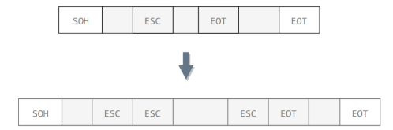

- 差错检测：降低误码率（BER，Bit Error Rate），广泛使用循环冗余检测（CRC，Cyclic Redundancy Check）

  **数据链路层拆分为两个子层**

1）逻辑链路控制 LLC

2）媒体接入控制 MAC

- 点对点信道：
  - 数据单元：帧
  - ## 三个基本问题：
  - 点对点协议（Point-to-Point Protocol）：用户计算机和 ISP 通信时所使用的协议
- 广播信道：
  - 硬件地址（物理地址、MAC 地址）
  - 单播（unicast）帧（一对一）：收到的帧的 MAC 地址与本站的硬件地址相同
  - 广播（broadcast）帧（一对全体）：发送给本局域网上所有站点的帧
  - 多播（multicast）帧（一对多）：发送给本局域网上一部分站点的帧

### CSMA/CD

（载波监听多点接入/碰撞检测）

CSMA/CD 表示载波监听多点接入 / 碰撞检测。

- **多点接入** ：说明这是总线型网络，许多主机以多点的方式连接到总线上。
- **载波监听** ：每个主机都必须不停地监听信道。在发送前，如果监听到信道正在使用，就必须等待。
- **碰撞检测** ：在发送中，如果监听到信道已有其它主机正在发送数据，就表示发生了碰撞。虽然每个主机在发送数据之前都已经监听到信道为空闲，但是由于电磁波的传播时延的存在，还是有可能会发生碰撞。

记端到端的传播时延为 τ，最先发送的站点最多经过 2τ 就可以知道是否发生了碰撞，称 2τ 为 **争用期** 。只有经过争用期之后还没有检测到碰撞，才能肯定这次发送不会发生碰撞。

当发生碰撞时，站点要停止发送，等待一段时间再发送。这个时间采用 **截断二进制指数退避算法** 来确定。从离散的整数集合 {0, 1, .., (2<sup>k</sup>-1)} 中随机取出一个数，记作 r，然后取 r 倍的争用期作为重传等待时间。

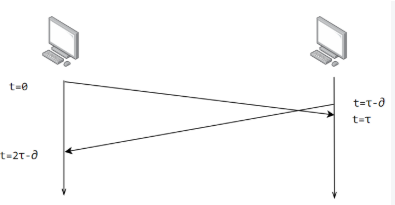

载波监听

MAC 帧

格式为：

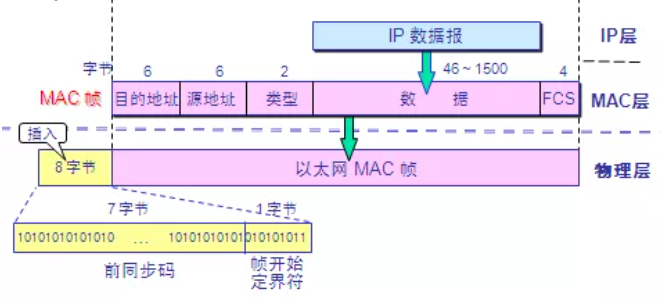

- 目的地址 : 接收方 48 位的 MAC 地址
- 源地址 : 发送方 48 位的 MAC 地址
- 类型字段 : 标志上一层使用的是什么协议, 0×0800 为 IP 数据报

以太网帧格式：

- **类型** ：标记上层使用的协议；
- **数据** ：长度在 46-1500 之间，如果太小则需要填充；
- **FCS** ：帧检验序列，使用的是 CRC 检验方法；

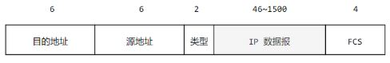

## PPP 协议

互联网用户通常需要连接到某个 ISP 之后才能接入到互联网，PPP 协议是用户计算机和 ISP 进行通信时所使用的数据链路层协议。

PPP 的帧格式：

- F 字段为帧的定界符
- A 和 C 字段暂时没有意义
- FCS 字段是使用 CRC 的检验序列
- 信息部分的长度不超过 1500

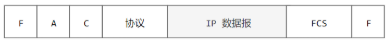

## 设备

路由器与交换机的区别：

交换机主要工作在数据链路层（第二层）路由器工作在网络层（第三层）

交换机转发所依据的对象时：MAC 地址。（物理地址）路由转发所依据的对象是：IP 地址。（网络地址）

交换机主要用于组建局域网，而路由主要功能是将由交换机组好的局域网相互连接起来，或者接入 Internet。

交换机不能分割广播域，路由可以。

# 第四章：网络层

网络层以上使用 IP 地址, 数据链路层以下使用 MAC 地址

## 4.1：IP

ip 数据报

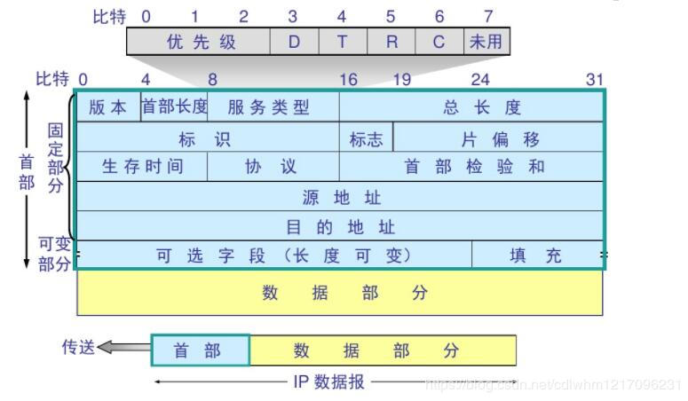

首部前 20 字节为固定长度, 是所有 IP 数据报必备的. 后 4 字节是可选字段, 其长度可变.

IP 数据报首部固定的字段分析 :

- 版本号 : IP 协议的版本, IPv4 或 IPv6
- 首部长度 : 记录了首部的长度, 最大为 1111, 即 15 个 32 位字长, 即 60 字节. 当首部长度不是 4 字节的整数倍时, 需要使用最后的填充字段加以填充.
- 服务类型 : 一般无用
- 总长度 : 指首部和数据之和的长度. 最大为 216-1 = 65535 字节. 但是由于数据链路层规定每一帧的数据长度都有最大长度 MTU, 以太网规定 MTU 为 1500 字节, 所以超出范围的数据报就必须进行分片处理
- 标识 : 每产生一个 IP 数据报, 计数器就+1, 并将此值赋值给标识字段. 再以后需要分片的数据报中, 标识相同说明是同一个数据报
- 标志 : 占 3 位, 最低位记为 MF(More Fragment). MF = 1 说明还有分片; MF = 0 说明这已经是最后一个分片. 中间一位记为 DF(Don’t Fragment), 意思是不能分片. 只有当 DF = 0 时才允许分片.
- 段位移 : 又称片位移, 相对于用户数据字段的起点, 该片从何处开始. 片位移以 8 个字节为偏移单位. 所以, 每个分片的长度一定是 8 字节的整数倍.
- 生存时间 : TTL(Time To Live). 数据报能在因特网中经过路由器的最大次数为 255 次, 每经过一个路由器则 TTL – 1, 为 0 时丢弃该报文.
- 协议 : 记录该报文所携带的数据是使用何种协议.
- 首部检验和 : 只检验数据报的首部, 不检验数据部分. 不为 0 则丢弃报文.
- 源地址和目的地址 : 不解释

### 分类

由两部分组成，网络号和主机号，其中不同分类具有不同的网络号长度，并且是固定的。

IP 地址 ::= {\< 网络号 \>, \< 主机号 \>}

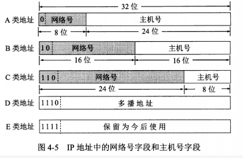

划分子网

子网掩码

A 类地址的默认子网掩码为 255.0.0.0
B 类地址的默认子网掩码为 255.255.0.0
C 类地址的默认子网掩码为 255.255.255.0

私有地址

私有地址包括 3 组

A 类：10.0.0.0~10.255.255.255

B 类：172.16.0.0~172.31.255.255

C 类：192.168.0.0~192.168.255.255

虚拟专用网 VPN

1)地址解析协议 ARP(Address Resolution Protocol)

ARP 是解决同一个局域网上的主机或路由器的 IP 地址和 MAC 地址的映射问题, 即 IP 地址 -> ARP -> MAC 地址

每一个主机都有一个 ARP 高速缓存, 里面有本局域网上的各主机和路由器的 IP 地址到 MAC 地址的映射表.

## 4.2：ARP

（Address Resolution Protocol，地址解析协议）

ARP 实现由 IP 地址得到 MAC 地址。

IP 数据报的源地址和目的地址始终不变，而 MAC 地址随着链路的改变而改变。

## 4.3：ICMP

- PING（Packet InterNet Groper，分组网间探测）测试两个主机之间的连通性
- TTL（Time To Live，生存时间）该字段指定 IP 包被路由器丢弃之前允许通过的最大网段数量

内部网关协议

- RIP（Routing Information Protocol，路由信息协议）
- OSPF（Open Sortest Path First，开放最短路径优先）

外部网关协议

- BGP（Border Gateway Protocol，边界网关协议）

IP 多播

- IGMP（Internet Group Management Protocol，网际组管理协议）
- 多播路由选择协议

VPN 和 NAT

- VPN（Virtual Private Network，虚拟专用网）
- NAT（Network Address Translation，网络地址转换）

ICMP（Internet Control Message Protocol，网际控制报文协议）

IGMP（Internet Group Management Protocol，网际组管理协议）

## VPN

机构内的计算机可以使用仅在本机构有效的 IP 地址（专用地址）。

有三个专用地址块：

- 10.0.0.0 \~ 10.255.255.255
- 172.16.0.0 \~ 172.31.255.255
- 192.168.0.0 \~ 192.168.255.255

## 路由选择协议

路由选择协议都是自适应的，能随着网络通信量和拓扑结构的变化而自适应地进行调整。

互联网可以划分为许多较小的自治系统 AS，一个 AS 可以使用一种和别的 AS 不同的路由选择协议。

可以把路由选择协议划分为两大类：

- 自治系统内部的路由选择：RIP 和 OSPF
- 自治系统间的路由选择：BGP

### 1. 内部网关协议 RIP

RIP 是一种基于距离向量的路由选择协议。距离是指跳数，直接相连的路由器跳数为 1。跳数最多为 15，超过 15 表示不可达。

RIP 按固定的时间间隔仅和相邻路由器交换自己的路由表，经过若干次交换之后，所有路由器最终会知道到达本自治系统中任何一个网络的最短距离和下一跳路由器地址。

距离向量算法：

- 对地址为 X 的相邻路由器发来的 RIP 报文，先修改报文中的所有项目，把下一跳字段中的地址改为 X，并把所有的距离字段加 1；
- 对修改后的 RIP 报文中的每一个项目，进行以下步骤：
- 若原来的路由表中没有目的网络 N，则把该项目添加到路由表中；
- 否则：若下一跳路由器地址是 X，则把收到的项目替换原来路由表中的项目；否则：若收到的项目中的距离 d 小于路由表中的距离，则进行更新（例如原始路由表项为 Net2, 5, P，新表项为 Net2, 4, X，则更新）；否则什么也不做。
- 若 3 分钟还没有收到相邻路由器的更新路由表，则把该相邻路由器标为不可达，即把距离置为 16。

RIP 协议实现简单，开销小。但是 RIP 能使用的最大距离为 15，限制了网络的规模。并且当网络出现故障时，要经过比较长的时间才能将此消息传送到所有路由器。

### 2. 内部网关协议 OSPF

开放最短路径优先 OSPF，是为了克服 RIP 的缺点而开发出来的。

开放表示 OSPF 不受某一家厂商控制，而是公开发表的；最短路径优先表示使用了 Dijkstra 提出的最短路径算法 SPF。

OSPF 具有以下特点：

- 向本自治系统中的所有路由器发送信息，这种方法是洪泛法。
- 发送的信息就是与相邻路由器的链路状态，链路状态包括与哪些路由器相连以及链路的度量，度量用费用、距离、时延、带宽等来表示。
- 只有当链路状态发生变化时，路由器才会发送信息。

所有路由器都具有全网的拓扑结构图，并且是一致的。相比于 RIP，OSPF 的更新过程收敛的很快。

### 3. 外部网关协议 BGP

BGP（Border Gateway Protocol，边界网关协议）

AS 之间的路由选择很困难，主要是由于：

- 互联网规模很大；
- 各个 AS 内部使用不同的路由选择协议，无法准确定义路径的度量；
- AS 之间的路由选择必须考虑有关的策略，比如有些 AS 不愿意让其它 AS 经过。

BGP 只能寻找一条比较好的路由，而不是最佳路由。

每个 AS 都必须配置 BGP 发言人，通过在两个相邻 BGP 发言人之间建立 TCP 连接来交换路由信息。

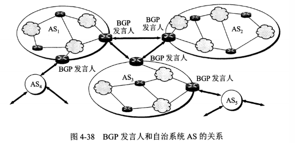

# 第五章：传输层

## 5.2：UDP 协议

UDP 首部

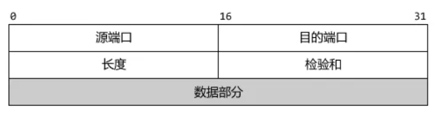

- 源端口 : 源端口号. 在需要对方回信时选用, 不需要则全 0
- 目的端口 : 目的端口号. 这在终点交付报文时必须要使用到
- 长度 : UDP 数据报的长度, 最小值为 8(仅有首部)
- 检验和 : 与 IP 数据报只检验首部不同的是, UDP 需要把首部和数据部分一起检验

使用 UDP 协议包括：TFTP（简单文件传输协议）、SNMP（简单网络管理协议）、DNS（域名解析协议）、NFS、BOOTP。

## 5.3：TCP 协议

TCP 报文首部格式：

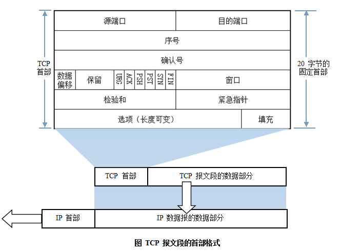

- 源端口和目的端口 : 同 UDP 端口作用
- 序号 : 本报文段的数据的第一个字节的序号
- 确认号 : 期望收到对方下一个报文段的第一个数据字节的序号
  `若确认号 = N, 则表明 : 到序号N-1为止的所有数据都已正常收到`
- 数据偏移 : TCP 报文段的首部长度
- 保留 : 以后用, 目前为 0
- 紧急 URG : 若 URG = 1 时, 说明紧急指针字段有效, 告诉系统这是紧急数据, 应尽快传送. 例如突然要中断传送
- 确认 ACK : ACK = 1 时确认号才有效, ACK = 0 时确认号无效. TCP 规定, 连接建立后所有传送的报文段都必须把 ACK 置 1
- 推送 PSH : 若 PSH = 1, 则接收方收到报文段之后不再等到整个缓存满而是直接向上交付
- 复位 RST : 当 RST = 1, 说明 TCP 连接有严重错误, 必须释放连接再重连
- 同步 SYN : 在连接建立时用来同步序号. 当 SYN = 1, ACK = 0 时表明这是一个连接请求报文段, 对方若同意建立连接, 则在响应的报文段中置 SYN = 1, ACK = 1
- 终止 FIN : 当 FIN = 1, 表明此报文段的发送方数据已发送完毕, 并要求释放连接
- 窗口 : 告诉对方 : 从本报文段首部中的确认号算起, 接收方目前允许对方发送的数据量. 这是作为接收方让发送方设置其发送窗口的依据
- 检验和 : 同 UDP, 检验首部和数据部分
- 紧急指针 : 当 URG = 1 时有效, 指出紧急数据的末尾在报文段的位置
- 选项 : 最大可 40 字节, 没有则为 0
  `最大报文段长度MSS(Maximum Segment Size) : 每一个TCP报文段中数据字段的最大长度, 若不填写则为默认的536字节.`

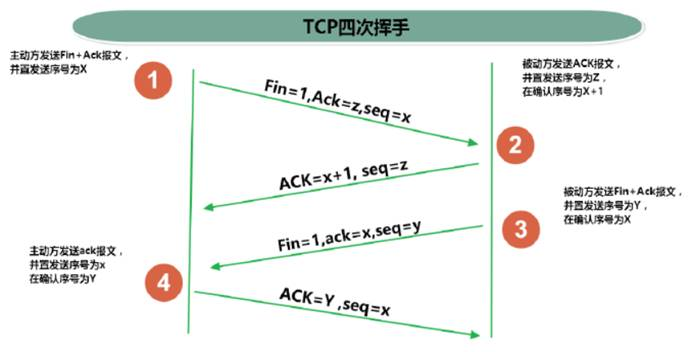

**注：seq**:"sequance"序列号；**ack**:"acknowledge"确认号；**SYN**:"synchronize"请求同步标志；**；ACK**:"acknowledge"确认标志"**；\*\***FIN\*\*："Finally"结束标志。

TCP 协议通过使用连续 ARQ 协议和滑动窗口协议，来保证数据传输的正确性，从而提供可靠的传输。

1）ARQ 协议，即自动重传请求

2）连续 ARQ 协议：由于停止等待 ARQ 协议信道利用率太低，所以需要使用连续 ARQ 协议来进行改善。这个协议会连续发送一组数据包，然后再等待这些数据包的 ACK。

发送方采用流水线传输。流水线传输就是发送方可以连续发送多个分组，不必每发完一个分组就停下来等待对方确认

**TIME_WAIT** 表示主动关闭，**CLOSE_WAIT** 表示被动关闭。

### **流量控制**

流量控制（flow control）就是让发送方的发送速率不要太快，要让接收方来得及接收。

利用滑动窗口和报文段的发送时机来进行流量控制.

3）滑动窗口协议：在发送方和接收方之间各自维持一个滑动窗口，发送方是发送窗口，接收方是接收窗口，而且这个窗口是随着时间变化可以向前滑动的。它允许发送方发送多个分组而不需等待确认。TCP 的滑动窗口是以字节为单位的。

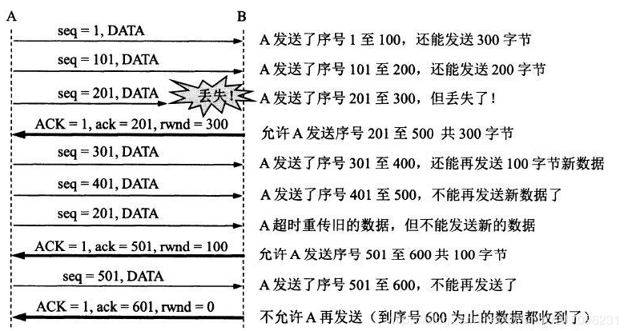

### 拥塞控制

1）慢开始

指在 TCP 开始发送报文段时先设置拥塞窗口为 1。

2）拥塞避免

3）快重传

4）快恢复

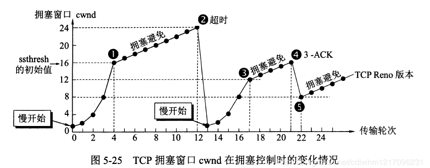

### **超时重传**

如果发送方等待一段时间后, 还是没收到 ACK 确认报文, 就会启动超时重传. 这个等待的时间为重传超时时间(RTO, Retransmission TimeOut).

然而, RTO 的值不是固定的, 这个时间总是略大于连接往返时间(RTT，Round Trip Time). 假设报文发送过去需要 5 秒, 对方收到后发送确认报文回来也需要 5 秒, 那么 RTT 就为 10 秒, 那这 RTO 就要比 10 秒要略大一些. 那么超过 RTO 之后还没有收到确认报文就认为报文丢失了, 就要重传.

### TCP 连接

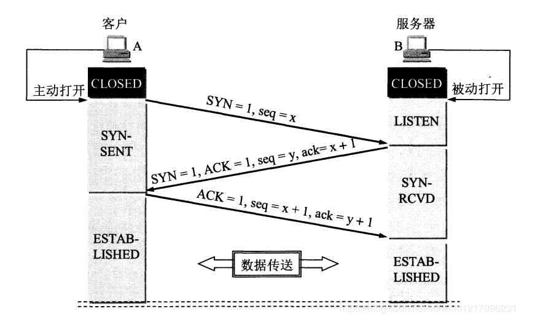

为什么要三次握手, 两次不可以吗?

A : 试想一下, A 第一次发送请求连接, 但是在网络某节点滞留了, A 超时重传, 然后这一次一切正常, A 跟 B 就愉快地进行数据传输了. 等到连接释放了以后, 那个迷失了的连接请求突然到了 B 那, 如果是两次握手的话, B 发送确认, 它们就算是建立起了连接了. 事实上 A 并不会理会这个确认, 因为我压根没有要传数据啊. 但是 B 却傻傻地以为有数据要来, 苦苦等待. 结果就是造成资源的浪费.

更加接地气的解释就是 : A 打电话给 B

```
第一次握手 : 你好, 我是A, 你能听到我说话吗第二次握手 : 听到了, 我是B, 你能听到我说话吗第三次握手 : 听到了, 我们可以开始聊天了三次握手其实就是为了检测双方的发送和接收能力是否正常, 你说呢?
```

Q : 为什么要四次挥手, 而不是两次, 三次?

A :

首先, 由于 TCP 的全双工通信, 双方都能作为数据发送方. A 想要关闭连接, 必须要等数据都发送完毕, 才发送 FIN 给 B. (此时 A 处于半关闭状态)
然后, B 发送确认 ACK, 并且 B 此时如果要发送数据, 就发送(例如做一些释放前的处理)
再者, B 发送完数据之后, 发送 FIN 给 A. (此时 B 处于半关闭状态)
然后, A 发送 ACK, 进入 TIME-WAIT 状态
最后, 经过 2MSL 时间后没有收到 B 传来的报文, 则确定 B 收到了 ACK 了. (此时 A, B 才算是处于完全关闭状态)

PS : 仔细分析以上步骤就知道为什么不能少于四次挥手了.

Q : 为什么要等待 2MSL(Maximum Segment Lifetime)时间, 才从 TIME_WAIT 到 CLOSED？

A : 在 Client 发送出最后的 ACK 回复，但该 ACK 可能丢失。Server 如果没有收到 ACK，将不断重复发送 FIN 片段。所以 Client 不能立即关闭，它必须确认 Server 接收到了该 ACK。Client 会在发送出 ACK 之后进入到 TIME_WAIT 状态。Client 会设置一个计时器，等待 2MSL 的时间。如果在该时间内再次收到 FIN，那么 Client 会重发 ACK 并再次等待 2MSL。MSL 指一个片段在网络中最大的存活时间，2MSL 就是一个发送和一个回复所需的最大时间。如果直到 2MSL，Client 都没有再次收到 FIN，那么 Client 推断 ACK 已经被成功接收，则结束 TCP 连接。

更加接地气的解释 :

```
第一次挥手 : A告诉B, 我没数据发了, 准备关闭连接了, 你要发送数据吗
第二次挥手 : B发送最后的数据
第三次挥手 : B告诉A, 我也要关闭连接了
第四次挥手 : A告诉B你可以关闭了, 我这边也关闭了
```

## 5.4：对比

TCP 与 UDP 有什么不同

|              | UDP                                         | TCP                                    |
| :----------- | :------------------------------------------ | -------------------------------------- |
| 是否连接     | 无连接                                      | 面向连接                               |
| 是否可靠     | 不可靠传输，不使用流量控制和拥塞控制        | 可靠传输，使用流量控制和拥塞控制       |
| 连接对象个数 | 支持一对一，一对多，多对一和多对多交互通信  | 只能是一对一通信                       |
| 传输方式     | 面向报文                                    | 面向字节流                             |
| 首部开销     | 首部开销小，仅 8 字节                       | 首部最小 20 字节，最大 60 字节         |
| 适用场景     | 适用于实时应用（IP 电话、视频会议、直播等） | 适用于要求可靠传输的应用，例如文件传输 |

# 第六章：应用层

常见协议端口号

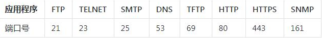

## 6.1：HTTP

HTTP 请求由三部分组成，分别是：
（1）请求行：
（2）消息报头；
（3）请求正文。


HTTP 响应由四部分组成，分别是：
（1）状态行；
（2）消息报头；
（3）空行；
（4）响应正文；

HTTP 状态码：
1XX 消息，2XX 成功，3XX 重定向，4XX 请求错误，5XX 服务器错误

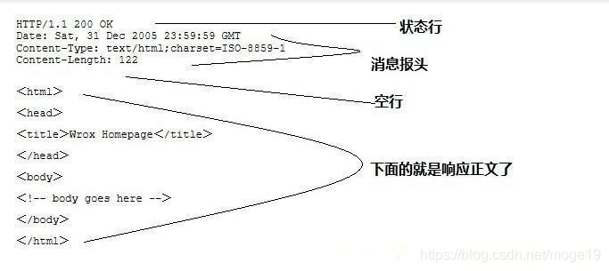

请求方法

HTTP 1.0 包括三种请求方法，分别是:
（1）GET：请求指定的页面信息，并返回实体主体。
（2）HEAD：类似于 get 请求，只不过返回的响应中没有具体的内容，用于获取报头
（3）POST：向指定资源提交数据进行处理请求（例如提交表单或者上传文件）。数据被包含在请求体中。POST 请求可能会导致新的资源的建立和/或已有资源的修改。
HTTP 1.1 中新增了五中请求方法：
（1）OPTIONS： 允许客户端查看服务器的性能；
（2）PUT： 从客户端向服务器传送的数据取代指定的文档的内容；
（3）DELETE：请求服务器删除指定的页面；
（4）TRACE：回显服务器收到的请求，主要用于测试或诊断；
（5）CONNECT：HTTP/1.1 协议中预留给能够将连接改为管道方式的代理服务器。

http 协议不同的版本区别：

HTTP 1.0：

（1）、支持 POST、GET、HEAD 三种方法；
（2）、规定浏览器与服务器之间只保持短暂的连接，浏览器的每次请求都需要与服务器建立一个 TCP 连接，服务器完成请求处理后立即断开 TCP 连接，服务器不跟踪每个客户也不记录过去的请求；

HTTP 1.1：

（1）、新增了五种请求方法：PUT、DELETE、CONNECT、TRACE、OPTIONS；
（2）、HTTP 1.1 在 Request 消息头里头多了一个 Host 域，便于一台 WEB 服务器上可以在同一个 IP 地址和端口号上使用不同的主机名来创建多个虚拟 WEB 站点；
（3）、在 HTTP/1.1 中新增了 24 个状态响应码：
100-199 用于指定客户端应相应的某些动作。
200-299 用于表示请求成功。
300-399 用于已经移动的文件并且常被包含在定位头信息中指定新的地址信息。
400-499 用于指出客户端的错误。
500-599 用于支持服务器错误。

Http 与 HttpS 的区别：

一、传输信息安全性不同

1、http 协议：是超文本传输协议，信息是明文传输。如果攻击者截取了 Web 浏览器和网站服务器之间的传输报文，就可以直接读懂其中的信息。

2、https 协议：是具有安全性的 ssl 加密传输协议，为浏览器和服务器之间的通信加密，确保数据传输的安全。

二、连接方式不同

1、http 协议：http 的连接很简单，是无状态的。

2、https 协议：是由 SSL ＋ HTTP 协议构建的可进行加密传输、身份认证的网络协议。

三、端口不同

1、http 协议：使用的端口是 80。

2、https 协议：使用的端口是 443．

四、证书申请方式不同

1、http 协议：免费申请。

2、https 协议：需要到 ca 申请证书，一般免费证书很少，需要交费。

http 调优

1：使用 base64 码减少请求

2：httpCLient

修改连接池连接数

设置失败重试次数

设置连接超时时长

Http 缓存机制：

配置服务器响应头来告诉浏览器是否应该缓存资源、是否强制校验缓存、缓存多长时间；浏览器非首次请求根据响应头是否应该取缓存、缓存过期发送请求头验证缓存是否可用还是重新获取资源的过程。

关键字

相应：

| 响应头                                                                                   | (常用)值                                                      | 说明                                               |
| ---------------------------------------------------------------------------------------- | ------------------------------------------------------------- | -------------------------------------------------- |
| [Cache-Control](https://developer.mozilla.org/zh-CN/docs/Web/HTTP/Headers/Cache-Control) | no-cache, no-store, must-revalidate, max-age, public, private | 控制浏览器是否可以缓存资源、强制缓存校验、缓存时间 |
| [ETag](https://developer.mozilla.org/zh-CN/docs/Web/HTTP/Headers/ETag)                   | 文件指纹（hash 码、时间戳等可以标识文件是否更新）             | 强校验，根据文件内容生成精确                       |
| [Last-Modified](https://developer.mozilla.org/zh-CN/docs/Web/HTTP/Headers/Last-Modified) | 请求的资源最近更新时间                                        | 弱校验， 根据文件修改时间，可能内容未变，不精确    |
| [Expires](https://developer.mozilla.org/zh-CN/docs/Web/HTTP/Headers/Expires)             | 资源缓存过期时间                                              | 与响应头中的 Date 对比                             |

请求：

| 请求头                                                                                           | 值                              | 说明                                   |
| ------------------------------------------------------------------------------------------------ | ------------------------------- | -------------------------------------- |
| [If-None-Match](https://developer.mozilla.org/zh-CN/docs/Web/HTTP/Headers/If-None-Match)         | 缓存响应头中的 ETag 值          | 发送给服务器比对文件是否更新（精确）   |
| [If-Modified-Since](https://developer.mozilla.org/zh-CN/docs/Web/HTTP/Headers/If-Modified-Since) | 缓存响应头中的 Last-Modified 值 | 发送给服务器比对文件是否更新（不精确） |

流程：

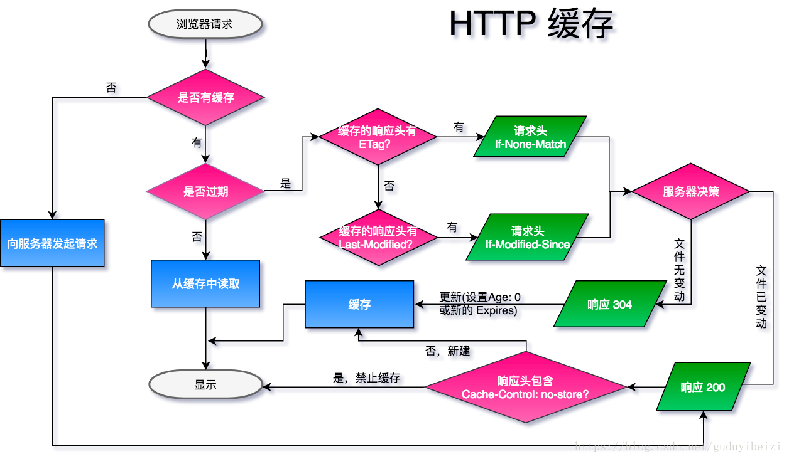

不设置响应头，浏览器并不能知道是否应该缓存资源，而是每次都发送新的请求，接收新的资源。

```java
// strategy['no-cache'](req, res, filePath, stat);
// strategy['no-store'](req, res, filePath, stat);
// strategy['cache'](req, res, filePath, stat);
strategy['nothing'](req, res, filePath, stat);
```

明确禁止缓存

设置响应头

```cmd
Cache-Control: no-store
或
Cache-Control: no-cache, no-store, must-revalidate

strategy['no-store'](req, res, filePath, stat);

```

- `Cache-Control: public` 表示一些中间代理、CDN 等可以缓存资源，即便是带有一些敏感 HTTP 验证身份信息甚至响应状态代码通常无法缓存的也可以缓存。通常 public 是非必须的，因为响应头 max-age 信息已经明确告知可以缓存了。
- `Cache-Control: private` 明确告知此资源只能单个用户可以缓存，其他中间代理不能缓存。原始发起的浏览器可以缓存，中间代理不能缓存。例如：百度搜索时，特定搜索信息只能被发起请求的浏览器缓存。

缓存过期策略：

一般缓存机制只作用于 `get` 请求

1、三种方式设置服务器告知浏览器缓存过期时间

设置响应头（注意浏览器有自己的缓存替换策略，即便资源过期，不一定被浏览器删除。同样资源未过期，可能由于缓存空间不足而被其他网页新的缓存资源所替换而被删除。）：

- 1、设置 `Cache-Control: max-age=1000` //响应头中的 `Date` 经过 `1000s` 过期
- 2、设置 `Expires` //此时间与本地时间(响应头中的 Date )对比，小于本地时间表示过期，由于本地时钟与服务器时钟无法保持一致，导致比较不精确
- 3、如果以上均未设置，却设置了 `Last-Modified` ，浏览器隐式的设置资源过期时间为 `(Date - Last-Modified) * 10%` 缓存过期时间。

2、两种方式校验资源过期

设置请求头：

- 1、`If-None-Match` 如果缓存资源过期，浏览器发起请求会自动把原来缓存响应头里的 `ETag` 值设置为请求头 `If-None-Match` 的值发送给服务器用于比较。一般设置为文件的 hash 码或其他标识能够精确判断文件是否被更新，为强校验。
- 2、`If-Modified-Since` 同样对应缓存响应头里的 `Last-Modified` 的值。此值可能取得 [ctime](http://nodejs.cn/api/fs.html#fs_stats_ctime) 的值，该值可能被修改但文件内容未变，导致对比不准确，为弱校验。

当你点击了一个链接，都发生了哪些操作？

- 1.点击网址后，应用层的 DNS 协议会将网址解析为 IP 地址；
  - DNS 查找过程：浏览器会检查缓存中有没有这个域名对应的解析过的 IP 地址，如果缓存中有，这个解析过程就将结束。如果用户的浏览器缓存中没有，浏览器会查找操作系统缓存（hosts 文件）中是否有这个域名对应的 DNS 解析结果。若还没有，此时会发送一个数据包给 DNS 服务器，DNS 服务器找到后将解析所得 IP 地址返回给用户。
- 2.在应用层，浏览器会给 web 服务器发送一个 HTTP 请求；
  - 请求头为：GET http://www.baidu.com/HTTP/1.1
- 3.在传输层，（上层的传输数据流分段）HTTP 数据包会嵌入在 TCP 报文段中；
  - TCP 报文段需要设置端口，接收方（百度）的 HTTP 端口默认是 80，本机的端口是一个 1024-65535 之间的随机整数，这里假设为 1025，这样 TCP 报文段由 TCP 首部（包含发送方和接收方的端口信息）+ HTTP 数据包组。
- 4.在网络层中，TCP 报文段再嵌入 IP 数据包中；
  - IP 数据包需要知道双方的 IP 地址，本机 IP 地址假定为 192.168.1.5，接受方 IP 地址为 220.181.111.147（百度），这样 IP 数据包由 IP 头部（IP 地址信息）+TCP 报文段组成。
- 5.在网络接口层，IP 数据包嵌入到数据帧（以太网数据包）中在网络上传送；
  - 数据帧中包含源 MAC 地址和目的 MAC 地址（通过 ARP 地址解析协议得到的）。这样数据帧由头部（MAC 地址）+IP 数据包组成。
- 6.数据包经过多个网关的转发到达百度服务器，请求对应端口的服务；
  - 服务接收到发送过来的以太网数据包开始解析请求信息，从以太网数据包中提取 IP 数据包—>TCP 报文段—>HTTP 数据包，并组装为有效数据交与对应线程池中分配的线程进行处理，在这个过程中，生成相应 request、response。
- 7.请求处理完成之后，服务器发回一个 HTTP 响应；
  - 请求处理程序会阅读请求及它的参数和 cookies。它会读取也可能更新一些数据，并将数据存储在服务器上。处理完毕后，数据通过 response 对象给客户输出信息，输出信息也需要拼接 HTTP 协议头部分，关闭后断开连接。断开后，服务器端自动注销 request、response 对象，并将释放对应线程的使用标识（一般一个请求单独由一个线程处理，部分特殊情况有一个线程处理多个请求的情况）。响应头为：HTTP/1.1200 OK
- 8.浏览器以同样的过程读取到 HTTP 响应的内容（HTTP 响应数据包），然后浏览器对接收到的 HTML 页面进行解析，把网页显示出来呈现给用户。
  - 客户端接收到返回数据，去掉对应头信息，形成也可以被浏览器认识的页面 HTML 字符串信息，交与浏览器翻译为对应页面规则信息展示为页面内容。

## 6.2：DNS

域名系统

- 主机向本地域名服务器的查询一般都是采用递归查询
- 本地域名服务器向根域名服务器的查询通常是采用迭代查询

## 6.3：FTP

(File Transfer Protocol，文件传输协议)

- FTP 是用于在网络上进行文件传输的一套标准协议，使用客户/服务器模式，使用 TCP 数据报，提供交互式访问，双向传输。
- TFTP（Trivial File Transfer Protocol，简单文件传输协议）一个小且易实现的文件传输协议，也使用客户-服务器方式，使用 UDP 数据报，只支持文件传输而不支持交互，没有列目录，不能对用户进行身份鉴定

TELNET

- TELNET 协议是 TCP/IP 协议族中的一员，是 Internet 远程登陆服务的标准协议和主要方式。它为用户提供了在本地计算机上完成远程主机工作的能力。

HTTP（HyperText Transfer Protocol，超文本传输协议）

- HTTP 是用于从 WWW（World Wide Web，万维网）服务器传输超文本到本地浏览器的传送协议。

-

## DHCP

提供了即插即用的连网方式，用户不再需要手动配置 IP 地址等信息。

（Dynamic Host Configuration Protocol，动态主机设置协议）

- DHCP 是一个局域网的网络协议，使用 UDP 协议工作，主要有两个用途：
  - 用于内部网络或网络服务供应商自动分配 IP 地址给用户
  - 用于内部网络管理员作为对所有电脑作中央管理的手段

SNMP（Simple Network Management Protocol，简单网络管理协议）

- SNMP 构成了互联网工程工作小组（IETF，Internet Engineering Task Force）定义的 Internet 协议族的一部分。该协议能够支持网络管理系统，用以监测连接到网络上的设备是否有任何引起管理上关注的情况。

## 电子邮件协议

### 1. SMTP

（Simple Mail Transfer Protocol，简单邮件传输协议）

- SMTP 是一组用于由源地址到目的地址传送邮件的规则，由它来控制信件的中转方式。SMTP 协议属于 TCP/IP 协议簇，它帮助每台计算机在发送或中转信件时找到下一个目的地。它是在 Internet 传输 Email 的标准，是一个相对简单的基于文本的协议。在其之上指定了一条消息的一个或多个接收者（在大多数情况下被确认是存在的），然后消息文本会被传输。可以很简单地通过 Telnet 程序来测试一个 SMTP 服务器，SMTP 使用 TCP 端口 25。

### 2. POP3

POP3 的特点是只要用户从服务器上读取了邮件，就把该邮件删除。但最新版本的 POP3 可以不删除邮件。

### 3. IMAP

IMAP 协议中客户端和服务器上的邮件保持同步，如果不手动删除邮件，那么服务器上的邮件也不会被删除。IMAP 这种做法可以让用户随时随地去访问服务器上的邮件。
