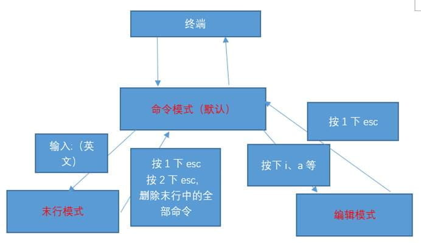
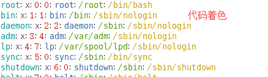
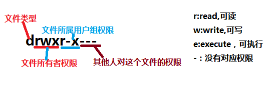
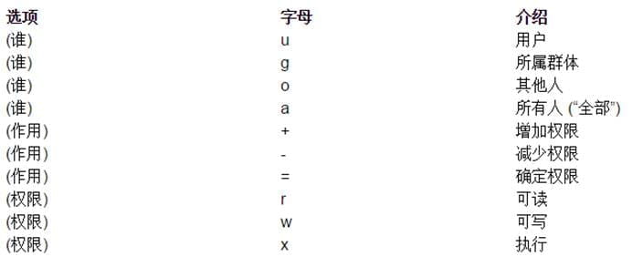
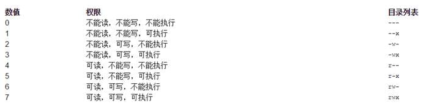

# 简介

## 一、Linux 发展史

1、Linux 前身-Unix

1968 年 Multics 项目**MIT**、Bell 实验室、美国通用电气有限公司\走到了一起，致力于开发 Multics 项目。到后期由于开发进度不是很好，MIT 和 Bell 实验室相继离开这个项目的开发，最终导致项目搁浅

**1970**年（Unix 元年，时间戳） Unix 诞生当时在开发 Multics 项目的时候，实验室中有一个开发成员开发了一款游戏（travel space：遨游太空），因为两个实验室相继离开项目开发，导致这名开发人员没法玩游戏，后来他提议组织人员重新在 Multics 项目之上重新的开发，也就出现了 1970 年的 Unix。当时 Unix 操作系统是使用的**汇编语言（机器语言）**开发的。

1973 年 用**C**语言重写 Unix

因为汇编语言有一个最大的局限性：对于计算机硬件过于依赖。导致移植性不好，所以后期在 1973 年使用了 C 语言对其进行重新开发。

1975 年 Bell 实验室允许大学使用 Unix。

1975 年，bell 实验室允许大学使用 Unix 操作系统用于教学作用，而不允许用于商业用途。

3、开源文化

Linux 是**开源**的操作系统。所谓开源就是指开放源代码。人 物 Stallman 斯特曼，开源文化的倡导人。

1983 年 GNU 计划

1985 年 FSF 基金会

1990 年 Emacs、**GCC**（c 语言的编译器）、程序库

1991 年 Stallman 去找 Linus，商谈让 Linux 加入其开源计划（GNU 计划）

1992 年 GNU/Linux

4、Linux 系统特点

开放性（开源）、多用户、多任务、良好的用户界面、优异的性能与稳定性

多用户多任务：

单用户：一个用户，在登录计算机（操作系统），只能允许**同时**登录一个用户；

单任务：一个任务，允许用户**同时**进行的操作任务数量；

多用户：多个用户，在登录计算机（操作系统），允许**同时**登录多个用户进行操作；

多任务：多个任务，允许用户**同时**进行多个操作任务；

**Windows 属于：单用户、多任务。**

**Linux 属于：多用户、多任务。**

5、Linux 分支

分支：Linux 分支有很多，现在比较有名的 ubuntu、debian、**centos（Community Enterprise Operating System）**、redhat、suse 等等。

## 二、Linux 系统安装

真机安装

虚拟机安装

使用 VMWare 安装 Centos 为例，由于版本不同自行搜索

### 终端

问题：在目前的桌面系统中，如果需要关机可以通过“系统”“关机”进行关机，那么后期服务器都是命令行模式的，届时这种方式将不好用，那会要怎么关机呢？

答：可以通过命令行方式进行关机。命令的输入需要在**终端**中进行输入。

所谓终端，其实类似于 windows 下 cmd 命令行模式。在终端中可以输入需要执行的一些指令，同样可以通过终端进行关机（注意：以后在工作中很少会去使用关机命令，会使用重启比较多）。

终端的形式：

终端组成部分：

**如何使用终端命令进行关机？**

在 Linux 中关机命令 有以下几个：shutdown -h now（正常关机）、halt（关闭内存）、init 0

## 三、Linux 系统的文件

linu系统一切都是文件；


### 1、文件与文件夹（目录）

**Linux 一切皆文件。**

① 在 windows 是文件的，在 Linux 下同样也是文件；

② 在 windows 不是文件的，在 Linux 下也是以文件的形式存储的；

日常学习中和日常工作中，对于文件的操作的都有哪些种类？

**创建文件、编辑文件、保存文件、关闭文件、重命名文件、删除文件、恢复文件。**

### 2、Linux 系统的文件目录结构


目录结构：

/bin：全称 binary，含义是二进制。该目录中存储的都是一些二进制文件，文件都是可以被运行的。

/dev：该目录中主要存放的是外接设备，例如盘、其他的光盘等。在其中的外接设备是不能直接被使用的，需要**挂载（类似 windows 下的分配盘符）**。

/etc：该目录主要存储一些配置文件。

/home：表示“家”，表示**除了 root**用户以外其他用户的家目录，类似于 windows 下的 User/用户目录。

/proc：process，表示进程，该目录中存储的是 Linux 运行时候的进程。

/root：该目录是 root 用户自己的家目录。

/sbin：全称 super binary，该目录也是存储一些可以被执行的二进制文件，但是必须得有 super 权限的用户才能执行。

/tmp：表示“临时”的，当系统运行时候产生的临时文件会在这个目录存着。

/usr：存放的是用户自己安装的软件。类似于 windows 下的 program files。

/var：存放的程序/系统的日志文件的目录。

/mnt：当外接设备需要挂载的时候，就需要挂载到 mnt 目录下。

## 四：环境搭建

以下链接为自己亲测写的很全面的

1：安装Centos7系统

　　https://www.osyunwei.com/archives/2307.html

2：联网

　　https://jingyan.baidu.com/article/19192ad8f7c320e53e570728.html

3：gcc编辑器

```
　　yum install gcc-c++
```

3：卸载自带JDK并安装JDK

https://www.cnblogs.com/sxdcgaq8080/p/7492426.html

4：安装tomact

 

5：安装Mysql数据库

https://www.cnblogs.com/pythonal/p/6141516.html 

6：安装Maven

https://blog.csdn.net/qq_39871625/article/details/78067466

7：安装Redis

https://www.cnblogs.com/zuidongfeng/p/8032505.html

 8：安装Nginx

https://www.cnblogs.com/kaid/p/7640723.html

## 五：常见设置

### 加载开机启动程序

1：启动脚本都统一放在/etc/init.d 文件中，如果你要手动关闭或重启某个进程，直接到目录 /etc/init.d 中寻找启动脚本即可。比如，我要重启Apache服务器，就运行下面的命令：

sudo /etc/init.d/apache2 restart

/etc/init.d 这个目录名最后一个字母d，是directory的意思，表示这是一个目录，用来与程序 /etc/init 区分。

# Linux 的基本指令

## 一、指令与选项

什么是 Linux 的指令？

指在 Linux 终端（命令行）中输入的内容就称之为指令。

一个完整的指令的标准格式：Linux 通用的格式

**\#指令主体（空格） [选项]（空格） [操作对象]**

一个指令可以包含多个选项

操作对象也可以是多个

例如：需要让张三同学帮忙去楼下小卖铺买一瓶农夫山泉水和清风餐巾纸，在这个指令中“买东西”是指令的主体，买的水和餐巾纸是操作的对象，农夫山泉、清风是操作的选项。


## 二、基础指令（重点）

```txt
ls:列出指定路径下的所有文件/文件夹的名称
ls -l /root 表示以详细列表的形式进行展示
ls -a /root 表示显示所有的文件文件夹（包含了隐藏文件文件夹）
ls -lh /root 列出指定路径下的所有文件/文件夹的名称，以列表的形式并且在显示文档大小的时候以可读性较高的形式显示

pwd 打印当前工作目录

cd 用于切换当前的工作目录的

mkdir 创建目录
mkdir -p 一次性创建多层不存在的目录
mkdir 目录1 目录2 目录3 表示一次性创建多个目录

touch 创建文件
touch /home/1.txt 指定路径下创建文件
touch 1.txt 2.txt 一次性创建多个文件

cp 复制文件/文件夹到指定位置,在复制过程中是可以重新对新位置的文件进行重命名的
cp 1.txt  /home/2.txt
cp -r ./test/ /home/test 递归复制文件夹

mv 移动，剪切
mv 1.txt /home/1.txt
mv /home/test/  / 移动文件夹
mv /test /test2 重命名文件夹

rm 移动，删除
-f：force，强制删除，不提示是否删除
-r：表示递归
rm -f linux* 强制删除以linux开头的文件

> 输出重定向
>> 追加输出
ls -la > ls.txt 

cat 打开文件
cat 1.txt 2.txt > 3.txt 配合重定向合并文件
```

## 三、进阶指令（重点）

```txt
df 查看磁盘空间
df -h 以可读性较高的形式展示大小

free 查看内存使用情况
free -m 以mb为单位查看

head 查看一个文件的前 n 行，如果不指定 n，则默认显示前 10 行
head -100 install.log

tail 查看一个文件的未 n 行，如果 n 不指定默认显示后 10 行
tail -10000 catalina.out > 20211103lastCatalina.log
tail -f catalina.out 查看一个文件的动态变化内容

less 查看文件，以较少的内容进行输出，按下辅助功能键（数字+回车、空格键+上下方向键）查看更多 在退出的只需要按下 q 键即可


wc 统计文件内容信息（包含行数、单词数、字节数）
-l：表示 lines，行数
-w：表示 words，单词数 依照空格来判断单词数量
-c：表示 bytes，字节数
wc install.log 不加参数就是三个都显示
wc -l install.log

date 表示操作时间日期
#date +%F    等价于#date "+%Y-%m-%d" 输出形式：2018-03-24
#date “+%F %T”  等价操作#date “+%Y-%m-%d %H:%M:%S”  输出的形式：2018-03-24 16:01:00

cal 操作日历
#cal 直接输出当前月份的日历
#cal -3 表示输出上一个月+本月+下个月的日历
#cal -y 2022 表示输出某一个年份的日历

clear/ctrl + L :清除终端中已经存在的命令和结果（信息


管道符：管道一般可以用于“过滤”，“特殊”，“扩展处理”。
 ls | grep y  需要通过管道查询出根目录下包含“y”字母的文档名称
 
 
curl : http命令行工具
# 将www.linux.com 的html显示在屏幕上
curl http://www.linux.com

# 指定代理以及其端口
curl -x 192.168.100.100:1080 http://www.linux.com

# 上传文件
curl -T dodo1.JPG -u 用户名:密码 ftp://www.linux.com/img/

# 下载文件
curl -O http://www.linux.com/{hello,bb}/dodo[1-5].JPG
```

## 四、高级指令

```txt
hostname 
操作服务器的主机名

id 查看一个用户的一些基本信息（包含用户 id，用户组id，附加组id），该指令如果不指定用户则默认当前用户。
id user1
验证用户信息：通过文件/etc/passwd
验证用户组信息：通过文件/etc/group

whoami 显示当前登录的用户名

ps主要是查看服务器的进程信息
-e：等价于“-A”，表示列出全部的进程
-f：显示全部的列（显示全字段）

列的含义：
UID：该进程执行的用户 id；
PID：进程 id；
PPID：该进程的父级进程 id，如果一个程序的父级进程找不到，该程序的进程称之为僵尸进程（parent process ID）；
C：Cpu 的占用率，其形式是百分数；
STIME：进行的启动时间；
TTY：终端设备，发起该进程的设备识别符号，如果显示“?”则表示该进程并不是由终端设备发起；
TIME：进程的执行时间；
CMD：该进程的名称或者对应的路径；

ps -ef|grep 进程名称


top 查看服务器的进程占的资源（100%使用）退出命令：按下 q 键
表头含义：
PID：进程 id；
USER：该进程对应的用户；
PR：优先级；
VIRT：虚拟内存；
RES：常驻内存；
SHR：共享内存；计算一个进程实际使用的内存 = 常驻内存（RES）- 共享内存（SHR）
S：表示进程的状态 status（sleeping，其中 S 表示睡眠，R 表示运行）；
%CPU：表示 CPU 的占用百分比；
%MEM：表示内存的占用百分比；
TIME+：执行的时间；
COMMAND：进程的名称或者路径；

在运行 top 的时候，可以按下方便的快捷键：
M：表示将结果按照内存（MEM）从高到低进行降序排列；
P：表示将结果按照 CPU 使用率从高到低进行降序排列；
1：当服务器拥有多个 cpu 的时候可以使用“1”快捷键来切换是否展示显示各个 cpu 的详细信息；

其他查看CPU使用情况的命令
mpstat -P ALL
sar -P ALL
#如果输出信息过多，可以定向到文件查看
sar -P ALL > /tmp/sar_cpu.txt


du -sh 查看目录的真实大小
-s：summaries，只显示汇总的大小
-h：表示以高可读性的形式进行显示
du -sh /etc

find 用于查找文件（其参数有 55 个之多）
-name：按照文档名称进行搜索（支持模糊搜索）
-type：按照文档的类型进行搜索 f标识文件 d标识文件夹
find /-name httpd.conf 查找名为httpd.conf的文件
find /etc -name *.conf 搜索 etc 目录下所有的 conf 后缀文件
find /etc -type d 使用 find 来搜索/etc/目录下所有的文件夹

service 用于控制一些软件的服务启动/停止/重启

kill 表示杀死进程 （当遇到僵尸进程或者出于某些原因需要关闭进程的时候）

ifconfig 用于操作网卡相关的指令
ifconfig 获取网卡信息

reboot 重启
reboot -w 模拟重启，但是不重启

shutdown 关机

uptime 输出计算机的持续在线时间

uname 获取操作系统的类型
uname -a all，表示获取全部的系统信息（类型、全部主机名、内核版本、发布时间、开源计划）

netstat -tnlp  查看网络连接状态
选项说明：
-t：表示只列出 tcp 协议的连接；
-n：表示将地址从字母组合转化成 ip 地址，将协议转化成端口号来显示；
-l：表示过滤出“state（状态）”列中其值为 LISTEN（监听）的连接；
-p：表示显示发起连接的进程 pid 和进程名称；

man 手册（包含了 Linux 中全部命令手册，英文）
man cp 通过 man 命令查询 cp 指令的用法

查看端口占用情况
--查看8000端口使用情况
lsof -i:8000
--查看端口8000的进程情况
netstat -tunlp |grep 8000
--杀掉某一进程
kill -9 26993

查看内存使用情况：
cat /proc/meminfo
```

# Vim 编辑器

## 一、vi 介绍

Vi 编辑器是所有 Unix 及 Linux 系统下标准的编辑器，类似于 windows 系统下的 notepad（记事本）编辑器，由于在 Unix 及 Linux 系统的任何版本，Vi 编辑器是完全相同的，因此可以在其他任何介绍 vi 的地方都能进一步了解它，Vi 也是 Linux 中最基本的文本编辑器，学会它后，我们将在 Linux 的世界里畅行无阻，**尤其是在终端中**。

关于 vim：

vi 和 vim 都是 Linux 中的编辑器，不同的是，**vim 比较高级**，可以视为 vi 的升级版本。vi 使用于文本编辑，但是 vim 更适用于 coding（写代码的）。

**Vim**重点是光标的移动，模式切换，删除，查找，替换，复制，粘贴，撤销命令的使用。

## 二、vim 三种模式（重点）

Vim 中存在三种模式（大众的认知）：**命令模式、编辑模式（输入模式）、末行模式（尾行模式）**。

命令模式：在该模式下是不能对文件直接编辑，可以输入快捷键进行一些操作（删除行，复制行，移动光标，粘贴等等）【打开文件之后默认进入的模式】；

编辑模式：在该模式下可以对文件的内容进行编辑；

末行模式：可以在末行输入命令来对文件进行操作（搜索、替换、保存、退出、撤销、高亮等等）；

Vim 的打开文件的方式（4 种，要求掌握的就前三种）：

```txt
vim 文件路径 作用：打开指定的文件
vim +数字 文件的路径 作用：打开指定的文件，并且将光标移动到指定行
vim +/关键词 文件的路径 作用：打开指定的文件，并且高亮显示关键词
vim 文件路径 1 文件路径 2 文件路径 3 作用：同时打开多个文件
```

## 三、命令模式

注意：该模式是打开文件的第一个看到的模式（打开文件即可进入）

1、光标移动

```txt
① 光标移动到行首
按键：shift + 6 或 ^（T 字母上面的 6，不要按小键盘的 6）

② 光标移动到行尾
按键：shift + 4 或 $（R 字母的左上角的 4，不是小键盘的 4）

③ 光标移动到首行
按键：gg

④ 光标移动到末行
按键：G

⑤ 翻屏
向上翻屏：按键 ctrl + b （before） 或 PgUp
向下翻屏：按键 ctrl + f （after） 或 PgDn

```

2、复制操作

```txt
① 复制光标所在行
按键：yy
粘贴：在想要粘贴的地方按下 p 键

② 以光标所在行为准（包含当前行），向下复制指定的行数
按键：数字 yy

③可视化复制
按键：ctrl + v（可视块）或 V（可视行）或 v（可视），然后按下 ↑↓←→ 方向键来选中需要复制的区块，按下 y 键进行复制，最后按下 p 键粘贴
```

3、剪切/删除

```txt
① 剪切删除光标所在行
按键：dd （删除之后下一行上移）
注意：dd 严格意义上说是剪切命令，但是如果剪切了不粘贴就是删除的效果。

② 剪切删除光标所在行为准（包含当前行），向下删除剪切指定的行
按键：数字 dd （删除之后下一行上移）

③ 剪切/删除光标所在的当前行之后的内容，但是删除之后下一行不上移
按键：D （删除之后当前行会变成空白行）

④ 可视化删除
按键：ctrl + v（可视块）或 V（可视行）或 v（可视），上下左右移动，按下 D 表示删除选中行，d 表示删选中块
```

4、撤销/恢复

```txt
撤销：输入:u （不属于命令模式） 或者 u （undo）
恢复：ctrl + r 恢复（取消）之前的撤销操作
```

5、扩展 

```txt
光标的快速移动
① 快速将光标移动到指定的行
按键：数字 G

② 以当前光标为准向上向下移动 n行
按键：数字 ↑，数字 ↓

③ 以当前光标为准向左/向右移动 n 字符
按键：数字 ←，数字 →

④ 末行模式下的快速移动方式：移动到指定的行
按键：输入英文“:”，其后输入行数数字，按下回车
```


## 四、模式间的切换（重点）



## 五、末行模式

进入方式：由命令模式进入，按下“:”或者“/（表示查找）”即可进入

退出方式：

a. 按下 esc

b. 连按 2 次 esc 键

c. 删除末行全部输入字符

```txt
① 保存操作（write）

输入：“:w” 保存文件

输入：“:w 路径” 另存为

② 退出（quit）

输入：“:q” 退出文件

③ 保存并退出

输入：“:wq” 保存并且退出

④ 强制 （!）

输入：“:q!” 表示强制退出，刚才做的修改操作不做保存

⑤ 调用外部命令（了解）

输入：“:!外部命令”

⑥ 搜索/查找

输入：“/关键词”

例如：我想在 passwd 文件中搜索“sbin”关键词

在搜索结果中切换上下一个结果：N/n（next）

如果需要取消高亮，则需要输入：“:nohl”【no highlight】


⑦ 替换

:s/搜索的关键词/新的内容 替换光标所在行的第一处符合条件的内容

:s/搜索的关键词/新的内容/g 替换光标所在行的全部符合条件的内容

:%s/搜索的关键词/新的内容 替换整个文档中每行第一个符合条件的内容

:%s/搜索的关键词/新的内容/g 替换整个文档的符合条件的内容

%表示整个文件

g 表示全局（global）


⑧ 显示行号（临时）

输入：“:set nu”[number]
如果想取消显示，则输入：“:set nonu”

```


## 六、编辑模式

重点看前 2 个进入方式：i（insert）、a（after）。

退出方式：按下 esc 键

## 七、实用功能

1、代码着色




如何控制着色显示与否？

显示：“:syntax on” syn

tax：语法

关闭显示：“:syntax off”

2、vim 中计算器的使用

当在编辑文件的时候突然需要使用计算器去计算一些公式，则此时需要用计算器，但是需要退出，vim 自身集成了一个简易的计算器。

a. 进入编辑模式

b. 按下按键“ctrl + R”，然后输入“=”，此时光标会变到最后一行

c. 输入需要计算的内容，按下回车

## 八、扩展

1、vim 的配置（重点）

Vim 是一款编辑器，编辑器也是有配置文件的。

Vim 配置有三种情况：

a. 在文件打开的时候在末行模式下输入的配置（临时的）

b. 个人配置文件（~/.vimrc，如果没有可以自行新建）

c. 全局配置文件（vim 自带，/etc/vimrc）

① 新建好个人配置文件之后进入编辑

② 在配置文件中进行配置

比如显示行号：set nu

配置好之后 vim 打开文件就会永远显示行号

**问题：如果某个配置项，在个人配置文件与全局配置文件产生冲突的时候应该以谁为准？**

测试步骤：在两个配置文件中针对同一个配置项设置不同的值

① 先在全局的配置中设置不显示行号，在个人的配置文件中设置显示行号，观察结果

最后显示行号：说明以个人为准

② 先在全局中配置显示行号，在个人中设置不显示行号，观察结果

最后的显示是不显示行号，说明以个人为准

结论：**如果针对同一个配置项，个人配置文件中存在，则以个人配置文件为准，如果个人配置文件中不存在这一项，则以全局配置文件为准**。

2、异常退出

什么是异常退出：在编辑文件之后并没有正常的去 wq（保存退出），而是遇到突然关闭终端或者断电的情况，则会显示下面的效果，这个情况称之为异常退出：

解决办法：将交换文件（在编程过程中产生的临时文件）删除掉即可

\#rm -f .passwd.swp

3、别名机制（实用）

作用：相当于创建一些属于自己的自定义命令

例如：在 windows 下有 cls 命令，在 Linux 下可能因为没有这个命令而不习惯清屏。现在可以通过别名机制来解决这个问题，可以自己创造出 cls 命令

别名机制依靠一个别名映射文件：~/.bashrc

\#vim ~/.bashrc

**注意：如果想新创造的命令生效，必须要重新登录当前用户。**

4、退出方式

回顾：之前 vim 中退出编辑的文件可以使用“:q”或者“:wq”。

**除了上面的这个语法之外，vim\*\***还支持另外一个保存退出方法“:x\***\*”。**

说明：

①“:x”在文件没有修改的情况下，表示直接退出，在文件修改的情况下表示保存并退出；

② 如果文件没有被修改，但是使用 wq 进行退出的话，则文件的修改时间会被更新；但是如果文件没有被修改，使用 x 进行退出的话，则文件修改时间不会被更新的；主要是会混淆用户对文件的修改时间的认定。

因此建议以后使用“:x”来进行对文件的保存退出。

# Linux 自有服务

自有服务，即不需要用户独立去安装的软件的服务，而是当系统安装好之后就可以直接使用的服务（内置）。

## 一、运行模式

运行模式也可以称之为**运行级别**。

在 linux 中存在一个进程：init （initialize，初始化），进程 id 是 1。

查看进程：#ps -ef|grep init

该进程存在一个对应的配置文件：inittab（**系统运行级别配置文件**，位置/etc/inittab）

根据上述的描述，可以得知，Centos6.5 中存在 7 中运行级别/模式。

0 — 表示关机级别（不要将默认的运行级别设置成这个值）

1 — 单用户模式

2 — 多用户模式，不带 NFS（Network File Syetem）

3 — 多用户模式，完全的多用户模式（不带桌面的，纯命令行模式）

4 — 没有被使用的模式（被保留模式）

5 — X11，完整的图形化界面模式

6 — 表示重启级别（不要将默认的运行级别设置成这个值）

与该级别相关的几个命令：

\#init 0 表示关机

\#init 3 表示切换到不带桌面的模式

\#init 5 切换到图形界面

\#init 6 重启电脑

注意：init 指令需要超级管理员的权限，普通用户无法执行。

这些命令其实都是调用的 init进程，将数字（运行级别）传递给进程，进程去读配置文件执行对应的操作。\*\*

① 切换到纯命令行模式下（**临时切换，重启之后又恢复**）

\#init 3

切换之后需要输入用户名和密码，在输入密码的时候没有*\*\*\*\*\*\*提示输入，只要自己确认输入的密码没有错误，按下回车即可。

② 回到桌面模式

\#init 5

**③ 设置模式永久为命令行模式**

将/etc/inittab 文件中的 initdefault 值设置成 3，然后重启操作系统。

## 二、用户与用户组管理（重点）

Linux 系统是一个多用户多任务的操作系统，任何一个要使用系统资源的用户，都必须首先向系统管理员申请一个账号，然后以这个账号的身份进入系统。

用户的账号一方面可以帮助系统管理员对使用系统的用户进行跟踪，并控制他们对系统资源的访问；另一方面也可以帮助用户组织文件，并为用户提供安全性保护。

每个用户账号都拥有一个惟一的用户名和各自的密码。

用户在登录时键入正确的用户名和密码后，就能够进入系统和自己的主目录。

要想实现用户账号的管理，要完成的工作主要有如下几个方面：

用户账号的添加、删除、修改以及用户密码的管理。

用户组的管理。

**注意三个文件：**

/etc/passwd 存储用户的关键信息

/etc/group 存储用户组的关键信息

/etc/shadow 存储用户的密码信息

### 1、用户管理

```txt
添加用户
useradd 选项 用户名
-g：表示指定用户的用户主组，选项的值可以是用户组的 id，也可以是组名
-G：表示指定用户的用户附加组，选项的值可以是用户组的 id，也可以是组名
-u：uid，用户的 id（用户的标识符），系统默认会从500之后按顺序分配 uid，如果不想使用系统分配的，可以通过该选项自定义【类似于腾讯 QQ 的自选靓号情况】
-c comment：添加注释

验证/etc/passwd 的最后一行，查看是否有

修改用户
usermod 选项 用户名
-g：表示指定用户的用户主组，选项的值可以是用户组的 id，也可以是组名
-G：表示指定用户的用户附加组，选项的值可以是用户组的 id，也可以是组名
-u：uid，用户的 id（用户的标识符），系统默认会从500之后按顺序分配 uid，如果不想使用系统分配的，可以通过该选项自定义【类似于腾讯 QQ 的自选靓号情况】
-l：修改用户名

设置密码
Linux 不允许没有密码的用户登录到系统，因此前面创建的用户目前都处于锁定状态，需要设置密码之后才能登录计算机。
在设置密码的时候也是没有任何输入提示的，放心输入，确保两次输入的密码一致，按下回车即可。
passwd 用户名

删除用户
userdel 选项 用户名
-r：表示删除用户的同时，删除其home目录
```

### 2、用户组管理

每个用户都有一个用户组，系统可以对一个用户组中的所有用户进行集中管理。不同 Linux 系统对用户组的规定有所不同，如 Linux 下的用户属于与它同名的用户组，这个用户组在创建用户时同时创建。

用户组的管理涉及用户组的**添加、删除和修改**。组的增加、删除和修改实际上就是对/etc/group 文件的更新。

文件结构：

用户组名:密码:用户组 ID:组内用户名

密码：X 表示占位符，虽然用户组可以设置密码，但是绝大部分的情况下不设置密码；

组内用户名：表示附加组是该组的用户名称；

```txt
用户组添加
groupadd 选项 用户组名
-g：类似用户添加里的“-u”，-g 表示选择自己设置一个自定义的用户组 ID 数字，如果自己不指定，则默认从 500 之后递增；


用户组编辑
groupmod 选项 用户组名
-g：类似用户修改里的“-u”，-g 表示选择自己设置一个自定义的用户组 ID 数字
-n：类似于用户修改“-l”，表示设置新的用户组的名称

用户组删除
groupdel 用户组名
当如果需要删除一个组，但是这个组是某个用户的主组时，则不允许删除；如果确实需要删除，则先从组内移出所有用户
```

## 三：权限管理

Linux 系统一般将文件可存/取访问的身份分为 3 个类别：owner、group、others，且 3 种身份各有 read、write、execute 等权限。

Owner 身份（文件所有者，默认为文档的创建者）

由于 Linux 是多用户、多任务的操作系统，因此可能常常有多人同时在某台主机上工作，但每个人均可在主机上设置文件的权限，让其成为个人的“私密文件”，即个人所有者。因为设置了适当的文件权限，除本人（文件所有者）之外的用户无法查看文件内容。

Group 身份（与文件所有者同组的用户）

与文件所有者同组最有用的功能就体现在多个团队在同一台主机上开发资源的时候。例如主机上有 A、B 两个团体，A 中有 a1,a2,a3 三个成员，B 中有 b1,b2 两个成员，这两个团体要共同完成一份报告 F。由于设置了适当的权限，A、B 团体中的成员都能互相修改对方的数据，但是团体 C 的成员则不能修改 F 的内容，甚至连查看的权限都没有。同时，团体的成员也能设置自己的私密文件，让团队的其它成员也读取不了文件数据。在Linux中，每个账户支持多个用户组。如用户 a1、b1即可属于 A用户组，也能属于 B用户组【主组和附加。

Others 身份（其他人，相对于所有者）

Root 用户（超级用户）

在 Linux 中，还有一个神一样存在的用户，这就是 root 用户，因为在所有用户中它拥有最大的权限 ，所以管理着普通用户。


### 1：Linux 的权限介绍

Linux中存在用户、用户组和其他人概念，各自有不同的权限，对于一个文档来说，其权限具体分配如下：



十位字符表示含义：

第 1 位：表示文档类型，取值常见的有“d 表示文件夹”、“-表示文件”、“l 表示软连接”、“s 表示套接字”等等；

第 2-4 位：表示文档所有者的权限情况，第 2 位表示读权限的情况，取值有 r、-；第 3 位表示写权限的情况，w 表示可写，-表示不可写，第 4 位表示执行权限的情况，取值有 x、-。

第 5-7 位：表示与所有者同在一个组的用户的权限情况，第 5 位表示读权限的情况，取值有 r、-；第 6 位表示写权限的情况，w 表示可写，-表示不可写，第 7 位表示执行权限的情况，取值有 x、-。

第 8-10 位：表示除了上面的前 2 部分的用户之外的其他用户的权限情况，第 8 位表示读权限的情况，取值有 r、-；第 9 位表示写权限的情况，w 表示可写，-表示不可写，第 10 位表示执行权限的情况，取值有 x、-。

权限分配中,均是 rwx 的三个参数组合，且位置顺序不会变化。没有对应权限就用 – 代替。


### 2：权限设置

```shell
chmod 选项 权限模式 文档
-R：递归设置权限 （当文档类型为文件夹的时候）
权限模式：就是该文档需要设置的权限信息
文档：可以是文件，也可以是文件夹，可以是相对路径也可以是绝对路径。
```

（1）字母形式



给谁设置：

u：表示所有者身份 owner（user）

g：表示给所有者同组用户设置（group）

o：表示 others，给其他用户设置权限

a：表示 all，给所有人（包含 ugo 部分）设置权限

**如果在设置权限的时候不指定给谁设置，则默认给所有用户设置**

权限字符：

r：读

w：写

x：表示执行

-：表示没有权限

权限分配方式：

+：表示给具体的用户新增权限（相对当前）

-：表示删除用户的权限（相对当前）

=：表示将权限设置成具体的值（注重结果）【赋值】


（2）数字形式




### 3、属主与属组设置

属主：所属的用户（文件的主人）

属组：所属的用户组


前面的那个 root 就是属主

后面的那个 root 就是属组

这两项信息在文档创建的时候会使用创建者的信息（用户名、用户所属的主组名称）。

如果有时候去删除某个用户，则该用户对应的文档的属主和属组信息就需要去修改。

```txt
# 更改文档的所属用户
chown -R username 文档路径 

# 更改文档的所属用户组
chgrp -R groupname 文档的路径  
```

## 三、网络设置

首先知道网卡配置文件位置：/etc/sysconfig/network-scripts

在目录中网卡的配置文件命名格式：ifcfg-网卡名称

重启网卡

```shell
/etc/init.d/network restar
```

网卡是一个网络组件，属于硬件范畴，主要负责计算机之间数据的**封装和解封**。

MAC 地址：网卡的物理地址，网卡设备的编号，**默认**情况是全球唯一的（16 进制）。

```txt
ping 检测当前主机与目标主机之间的连通性

netstat -tnlp （-t：tcp 协议，-n：将字母转化成数字，-l：列出状态为监听，-p：显示进程相关信息
netstat -an （-a：表示全部，-n：将字母转化为数字）

traceroute 查找当前主机与目标主机之间所有的网关

tcpdump
tcpdump 协议 port 端口
tcpdump 协议 port 端口 host 地址
tcpdump -i 网卡设备名
```

## 四、ssh 服务（重点）

ssh（secure shell，安全外壳协议），该协议有 2 个常用的作用：远程连接协议、远程文件传输协议。协议使用端口号：默认是 22  如果需要修改，则需要修改ssh 服务的配置文件：

```shell
/etc/ssh/ssh_config
```

a. 注意范围，端口范围是从 0-65535；

b. 不能使用别的服务已经占用的端口；

```shell
service sshd start/stop/restart
/etc/init.d/sshd start/stop/restart
```

### 远程终端

终端工具主要帮助运维人员连接远程的服务器，常见终端工具有：Xshell、secureCRT、Putty 等。

## 五、chkconfig

作用：提供“开机启动项”的一个管理服务。

在 linux 下不是所有的软件安装完成之后都有开机启动服务，有的可能需要自己去添加。除此之外还可以查看和删除。

```txt
开机启动服务查询
chkconfig --list
其中 0-6 表示各个启动级别

删除服务
chkconfig --del 服务名

添加开机启动服务
chkconfig --add 服务名 【必须要保证服务正常运行，才可以添加】

设置服务在某个级别下开机启动/不启动【重点命令】
chkconfig --level 连在一起的启动级别 服务名 on/off
chkconfig --level 35 httped on
```

## 六、ntp 服务

作用：ntp 主要是用于对计算机的时间同步管理操作。

时间是对服务器来说是很重要的，一般很多网站都需要读取服务器时间来记录相关信息，如果时间不准，则可能造成很大的影响。

同时服务器时间方式有 2 个：**一次性同步（手动同步）、通过服务自动同步**。

上游的概念：


```txt
一次性同步时间（简单）
ntpdate 时间服务器的域名或ip地址

设置时间同步服务
服务名：ntpd
启动 ntpd 服务
service ntpd start 或者 /etc/init.d/ntpd start
设置 ntpd 服务开机启动：
chkconfig --list|grep ntpd
chkconfig --level 35 ntpd on
```

## 四、防火墙服务

防火墙：**防范一些网络攻击**。有**软件防火墙**、硬件防火墙之分。

防火墙选择让请求通过，从而保证网络安全性。

在当前的 centos6.5中防火墙有一个名称：iptables【7.x 中默认使用的是 firewalld】

```txt
查看 iptables 是否开机启动
chkconfig --list | grep iptables

iptables 服务启动/重启/关闭
service iptables start/restart/stop
/etc/init.d/iptables start /restart/stop

查看iptables的状态（规则）
service iptables status

查看规则的命令
iptables -L -n
-L：表示列出规则
-n：表示将单词表达形式改成数字形式显示

简单设置防火墙规则
需要允许 80 端口通过防火墙，则规则可以用以下的命令来设置
iptables -I INPUT -p tcp --dport 80 -j ACCEPT
-I：表示将规则放到最前面
-A：add，添加规则（最后）
INPUT：进站请求【出站 output】
-p：protocol，指定协议（icmp/tcp/udp）
--dport：指定端口号
-j：指定行为结果，允许（accept）/禁止（reject）/丢弃（drop）

添加完成之后需要保存操作：
/etc/init.d/iptables save


```

## 五、rpm 管理（重点）

作用：rpm 的作用类似于 windows 上的中“软件管理”，主要作用是对 linux 服务器上的软件包进行对应管理操作，**管理分为：查询、卸载、安装**。

```txt
查询某个软件的安装情况
rpm -qa|grep 关键词
-q：查询，query
-a：全部，al

卸载某个软件
rpm -e 软件名称

当存在依赖关系的时候又不想去解决这个问题的时候可以：
rpm -e 软件包名 --nodeps

软件的安装
软件包的获得方式：
a. 去官网去下载；
b. 不介意老版本的话，可以从光盘（或者镜像文件）中读取；
安装软件的命令
rpm -ivh 软件包完整名称
选项：
-i：install，安装
-v：显示进度条
-h：表示以“#”形式显示进度条

```

扩展

```txt
lsblk （list block devices） 查看块状设备的信息
Name：名称
Size：设备大小
Type：类型
MountPoint：挂载点（类似 windows 下盘符）


光盘的解挂操作：相当于 U 盘在 windows 上已经被弹出了，但是没有拔下电脑 USB 接口。
umount 当前设备的挂载点 

 挂载光盘
mount 设备原始地址 要挂载的位置路径
设备原始地址：地址统一都在/dev 下，然后根据大小确定具体 name 值，拼凑在一起组成原始地址，例如当前：“/dev/sr0”
要挂载的位置路径：挂载目录一般都在 mnt 下，也可以在 mnt 下建目录，此处以“/mnt/dvd”为例
mount /dev/sr0 /mnt/dvd
```

## 六、cron/crontab 计划任务

作用：操作系统不可能 24 小时都有人在操作，有些时候想在指定的时间点去执行任务（例如：每天夜里 2 点去重新启动 Apache），此时不可能真有人每天夜里 2 点去执行命令，此时可以交给计划任务程序去执行操作。

```txt
crontab
-l  列出指定用户的计划任务列表
-e 编辑指定用户的计划任务列表
-u 指定的用户名，如果不指定，则表示当前用户
-r：remove，删除指定用户的计划任务列表

# 列出
crontab -l

编辑计划任务
计划任务的规则语法格式，以行为单位，一行则为一个计划：

如果想要每天的 0 点 0 分执行 reboot 指令，则可以写成
0 0 * * * reboot
分 时 日 月 周 命令
```
