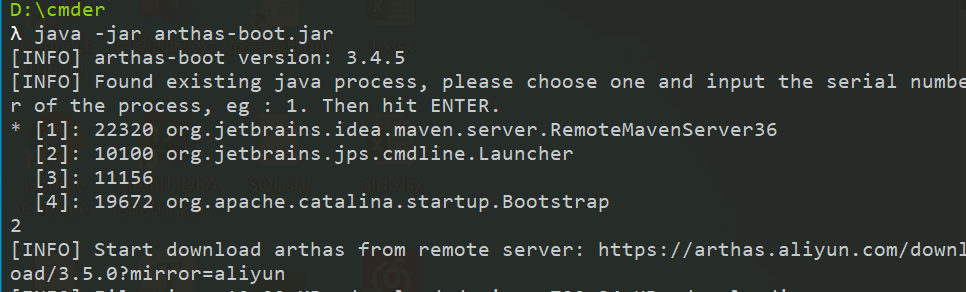
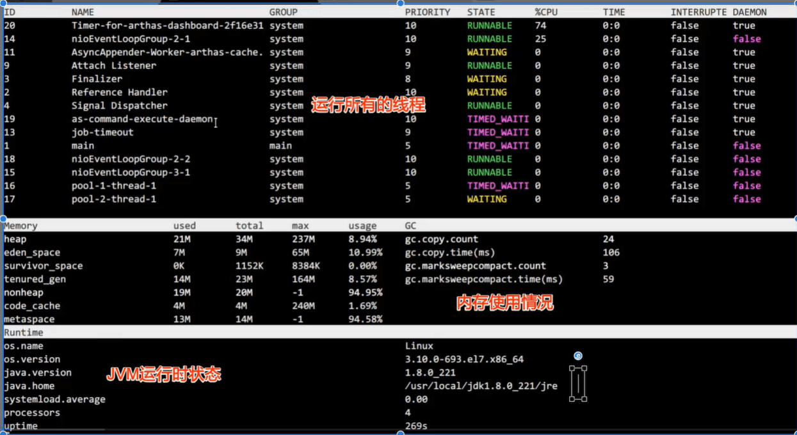
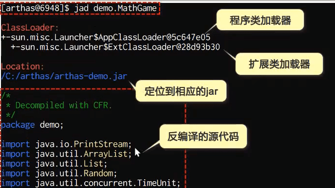
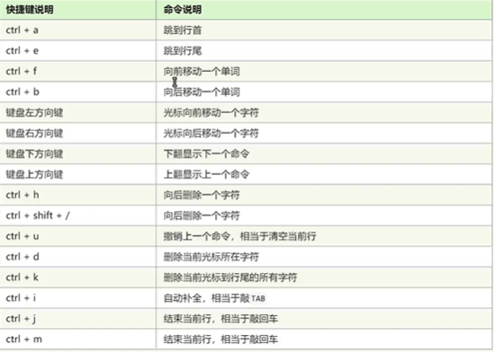
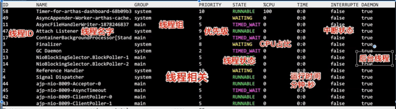
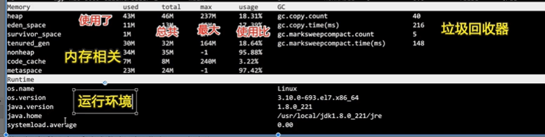

官网：https://arthas.aliyun.com/doc/

# 概述

当你遇到以下类似问题而束手无策时，Arthas可以帮助你解决:

1.这个类从哪个jar包加载的?为什么会报各种类相关的 Exception?

2.我改的代码为什么没有执行到?难道是我没commit?分支搞错了?

3.遇到问题无法在线上debug，难道只能通过加日志再重新发布吗?

4.线上遇到某个用户的数据处理有问题，但线上同样无法 debug，线下无法重现!

5.是否有一个全局视角来查看系统的运行状况?

6.有什么办法可以监控到JVM的实时运行状态?

7.怎么快速定位应用的热点，生成火焰图?
**运行环境要求**

Arthas支持JDK6+，支据Linux/Mac/Windows，采用命令行交互模式，同时提供丰富的 Tab自动补全功能进一步方便进行问题的定位和诊断。

# 安装

Window安装：

```shell
curl -O https://alibaba.github.io/arthas/arthas-boot.jar
java -jar arthas-boot.jar
```

选择需要的



下载需要的jar包，下载到C:\Users\hspcadmin\.arthas\lib\3.5.0\arthas

1.在Linux下在线安装的方式与在Windows下的安装相同

⒉.如果要使用离线的安装方式，先下载完成的zip到本地，再解压到任意的目录即可

因为jar包是绿色，要卸载的话，直接删除2个目录

.arthas安装目录 logs的日志记录目录

# 使用

如果端口号被占用。也可以通过以下命令换成另一个端口号执行

```shell
 java -jar arthas-boot.jar --telnet-port 9998 --http-port -1
```


也可以通过浏览器连接arthas：Arthas目前支&wWeb Console，用户在attach成功之后，可以直接访问: http://127.0.0.1:3658/.可以填入IP，远程连接其它机器上的arthas.

## 命令

1：dashboard仪表板，过段时间就刷新，按q退出



2：thread命令查看正在运行的线程

```shell
# 打印当前最忙的3个线程的堆栈信息
thread -n 3
# 查看ID为1都线程的堆栈信息
thread 1
# 找出当前阻塞其他线程的线程
thread -b
# 查看指定状态的线程
thread -state WAITING
```

3：cls：清屏

4：jad反编译源代码：

```shell
jad demo.MathGame
```



5：watch监视

观察指定方法的调用情况

```shell
watch demo.MathGame primeFactors returnObj
watch 包名.类名 方法名 
```

6：JVM

查看当前JVM信息

```txt
COUNT:JVM当前活跃的线程数
DAEMON-COUNT：JVM当前活跃的守护线程数
PEAK-COUNT:从JVM启动开始曾经活着的最大线程数
STARTED-COUNT：从JVM启动开始总共启动过的线程次数
DEADLOCK-COUNT:JVM当前死锁的线程数
```

7：trace

方法内部调用路径，并输出方法路径上的每个节点上耗时

quit或者exit：只是退出，断开连接

完全退出：stop

help：

cat：

grep：

-n ：显示行号

-i：忽略大小写

-m 行数：最大显示行数

-e ‘正则’：

pwd：


session：查看当前会话的信息

reset：重置增强类，将被Arthas增强过的类全部还原，Arthas服务器关闭是会重置所有增强的类。

trace：追踪

version：输出版本号

history：显示所以敲过的命令

keymap：显示快捷键以及自定义快捷键




8：Logger

使用`logger`命令可以查看日志信息，并改变日志级别，这个命令非常有用。

比如我们在生产环境上一般是不会打印`DEBUG`级别的日志的，当我们在线上排查问题时可以临时开启`DEBUG`级别的日志，帮助我们排查问题，下面介绍下如何操作。

- 我们的应用默认使用的是`INFO`级别的日志，使用`logger`命令可以查看；


- 使用如下命令改变日志级别为`DEBUG`，需要使用`-c`参数指定类加载器的HASH值；

```
logger -c 21b8d17c --name ROOT --level debug
```

- 再使用`logger`命令查看，发现`ROOT`级别日志已经更改；


- 使用`docker logs -f mall-tiny-arthas`命令查看容器日志，发现已经打印了DEBUG级别的日志；


- 查看完日志以后记得要把日志级别再调回`INFO`级别。

```
logger -c 21b8d17c --name ROOT --level info
```


### JVM相关命令

dashboard：





thread：查看当前 JVM 的线程堆栈信息

-b：处于阻塞状态的线程

jvm：查看当前 JVM 的信息

sysprop：查看当前JVM的系统属性(`System Property`)

sysenv——查看JVM的环境变量

- [getstatic](https://arthas.aliyun.com/doc/getstatic.html)——查看类的静态属性

```shell
getstatic demo.MathGame random
```

- [ognl](https://arthas.aliyun.com/doc/ognl.html)——执行ognl表达式

```shell
$ ognl '@java.lang.System@out.println("hello")'
null
```

- [heapdump](https://arthas.aliyun.com/doc/heapdump.html)——dump java heap, 类似jmap命令的heap dump功能

### class/Classloader相关

- [sc](https://arthas.aliyun.com/doc/sc.html)——查看JVM已加载的类信息

```shell
# 打印类的详细信息
$ sc -d demo.MathGame
# 打印类的Field信息
$ sc -d -f demo.MathGame
```

- [sm](https://arthas.aliyun.com/doc/sm.html)——查看已加载类的方法信息

```shell
$ sm java.lang.String
java.lang.String-><init>
java.lang.String->equals
java.lang.String->toString

$ sm -d java.lang.String toString
 declaring-class  java.lang.String
 method-name      toString
 modifier         public
 annotation
 parameters
 return           java.lang.String
 exceptions
```

- [jad](https://arthas.aliyun.com/doc/jad.html)——反编译指定已加载类的源码

```shell
$ jad java.lang.String
```

- [mc](https://arthas.aliyun.com/doc/mc.html)——内存编译器，内存编译`.java`文件为`.class`文件
- [retransform](https://arthas.aliyun.com/doc/retransform.html)——加载外部的`.class`文件，retransform到JVM里
- [redefine](https://arthas.aliyun.com/doc/redefine.html)——加载外部的`.class`文件，redefine到JVM里
- [dump](https://arthas.aliyun.com/doc/dump.html)——dump 已加载类的 byte code 到特定目录
- [classloader](https://arthas.aliyun.com/doc/classloader.html)——查看classloader的继承树，urls，类加载信息，使用classloader去getResource


- [monitor](https://arthas.aliyun.com/doc/monitor.html)——方法执行监控
- [watch](https://arthas.aliyun.com/doc/watch.html)——方法执行数据观测
- [trace](https://arthas.aliyun.com/doc/trace.html)——方法内部调用路径，并输出方法路径上的每个节点上耗时
- [stack](https://arthas.aliyun.com/doc/stack.html)——输出当前方法被调用的调用路径
- [tt](https://arthas.aliyun.com/doc/tt.html)——方法执行数据的时空隧道，记录下指定方法每次调用的入参和返回信息，并能对这些不同的时间下调用进行观测

# profiler/火焰图

基于性能结果产生SVG图片，用来展示CPU的调用栈；

y轴表示调用栈，每一层都是一个函数，调用栈越深，火焰越高；顶部就是正在执行的函数，下方都是他的父函数； 

x轴表示抽样数，如果一个函数在x轴占据的宽度越宽，就表示它被抽到的次数多，即执行时间长；x轴不代表时间先后，而是调用栈合并后，按子母顺讯排列的。

火焰图就是看顶层的哪个函数占据的宽度最大，只要有平顶，就表示该函数可能存在性能问题；

- [profiler](https://arthas.aliyun.com/doc/profiler.html)–使用[async-profiler](https://github.com/jvm-profiling-tools/async-profiler)对应用采样，生成火焰图

开启

```shell
profiler start
```

停止

```shell
profiler stop
```


# 本地的WebSocket连接

访问http://127.0.0.1:8563/


# ArthasTunnel
