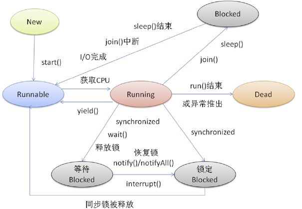

# 第一章：绪论

1.1：作用

作为用户与计算机硬件系统之间的接口

作为计算机系统资源的管理者

实现对计算机资源的抽象

1.2：发展

人工操作

脱机输入/输出方式

单道批处理

多道批处理

分时系统

实时系统

1.3：基本特征

并发，共享，虚拟

并发是指两个或则多个事件在同一时刻发生，

而并发是指两个或多个事件在同一时间间隔内发生

1.4：主要功能

处理机管理

存储器管理

设备管理

文件管理

用户接口

1.5

微内核：效率低

# 第二章：进程管理

PCB：进程控制块，用于存放进程的管理和控制信息的数据结构

线程

并行：多个cpu实例或者多台机器同时执行一段处理逻辑，是真正的同时。 
并发：通过cpu调度算法，让用户看上去同时执行，实际上从cpu操作层面不是真正的同时。

## 进程

状态

三态模型：

**`就绪状态`** 是指进程已经被分配到了所有必需的资源，除了`CPU`。在这个状态下，进程处于箭在弦上随时待发的状态，只要一获得`CPU`的执行权限，进程便会立刻执行，从而进入执行状态。

当有多个处于就绪状态的进程时，不同的进程会根据优先级被划分入不同的队列。一个因为时间片用完而进入就绪状态的进程会被划分入低优先级队列，而因为`I/O`操作完成而进入就绪状态的进程，则会被划分入高优先级队列。

**`执行状态`** 是指进程正常运行的状态。而当处于执行状态的进程由于需要等待某个事件发送（通常为等待`I/O`）时，就会放弃`CPU`，从而进入暂时的阻塞状态。`CPU`这时一旦空出，通过不同的调度算法，`CPU`又会被分配给另一个就绪进程。

**`阻塞状态`** 相当于就绪状态和执行状态的一个缓冲状态。当处于执行状态的进程无法正常执行时，会先进入阻塞状态，等待需要的请求执行完成，再回到就绪状态，等待下一次的`CPU`分配和执行。

五态模型

**`创建状态`** 是指进程刚刚创建的状态，在这个状态下，需要等待操作系统完成创建和分配进程的各种所需信息，包括建立`PCB（Process Control Block）`、加载程序并创建地址空间等。在完成这些准备工作后，该进程的状态就会转移为就绪状态并划分入就绪队列中。

**`终止状态`** 代表着进程的结束，当进程执行完成后，需要操作系统在终止状态对进程的运行结果进行善后处理。这样的善后处理包括对进程所使用的资源进行回收，并将其它进程所需要的信息传递出去。最后，操作系统还需要对终止的进程进行内存释放，将其`PCB`中的内容清空，并将这部分内存返还给系统。

七态模型

活跃就绪是指进程在主存并且可被调度的状态。而静止就绪状态是指就绪进程被对换到辅存时的状态，它是不能被直接调度的状态，只有当主存中没有活跃就绪态进程，或者是挂起态进程具有更高的优先级时，系统才会把挂起就绪态进程调回主存并转换为活跃就绪状态。

# 第三章：处理机调度与死锁

## 银行家算法

# 第四章：存储器管理

# 第五章：设备管理

# 第六章：IO

依据`I/O`设备工作方式的不同，通常进行如下分类：

（1）字符设备`character device`，又叫做人机交互设备。用户通过这些设备实现与计算机系统的通信。它们大多是以字符为单位发送和接受数据的，数据通信的速度比较慢。

> 例如，键盘和显示器为一体的字符终端、打印机、扫描仪、包括鼠标等，还有早期的卡片和纸带输入和输出机。含有显卡的图形显示器的速度相对较快，可以用来进行图像处理中的复杂图形的显示。

（2）块设备`block device`，又叫外部存储器，用户通过这些设备实现程序和数据的长期保存。与字符设备相比，它们是以块为单位进行传输的，如磁盘、磁带和光盘等。块的常见尺寸为`512~32768B`之间。

（3）网络通信设备。这类设备主要有网卡、调制解调器等，主要用于与远程设备的通信。这类设备的传输速度比字符设备高，但比外部存储器低。

# 第六章：文件系统

#### 目录结构

# 第七章：操作系统接口

# 第八章：网络操作系统

# 第九章：系统安全性

# 第10章：Unix系统内核

