# 一：计算机系统概述

## 发展历程

一般把计算机的发展分为五个阶段：

电子管——晶体管——集成电器——大规模集成电器——摩尔定律

| 发展阶段 | 时间      | 硬件技术                   | 速度（次/秒） |
| -------- | --------- | -------------------------- | ------------- |
| 第一代   | 1946-1957 | 电子管计算机时代           | 40 000        |
| 第二代   | 1958-1964 | 晶体管计算机时代           | 200 000       |
| 第三代   | 1965-1971 | 中小规模集成电路计算机时代 | 1 000 000     |
| 第四代   | 1972-1977 | 大规模集成电路计算机时代   | 10 000 000    |
| 第五代   | 1978-现在 | 超大规模集成电路计算机时代 | 100 000 000   |

## 层次结构

### 1：硬件组成：

冯诺依曼体系结构：

- 计算机由运算器，控制器，存储器，输入，输出五部分组成；

- 指令和数据都用二进制代码表示，保存在存储器中，按地址寻址；

- 指令由操作码和地址码组成，在存储器内按顺序存放；

- 以运算器为中心，IO 通过运算器与存储器相连。

现代体系：

- 以存储器为中心

- IO 尽可能绕过 CPU，直接让 IO 和存储器间完成

功能部件：

输入设备，

输出设备，

存储器：存储字，MAR 和 MDR 的位数。

运算器：算数运算和逻辑运算，ALU

控制器：PC + IR + CU，CPU 和主存储器构成主机，IO 设备和外村构成外设。

### 2：软件分类

系统软件：OS，DBMS，语言处理程序，分布式系统，网络系统，标准库，服务程序

应用软件：科学计算程序，应用类程序

机器语言，汇编语言，高级语言

### 3：工作过程

程序和数据装入主存，从程序起始地址开始执行；从起始地址取出第一条指令，译码执行并计算下一条指令地址；取出下条指令地址，在取值译码，执行间往复，直到执行完毕

### 4：多级层次结构

应用程序-高级语言-汇编语言-操作系统-指令集架构层-微代码层-硬件逻辑层

### 5：分类

单指令单数据流：冯诺依曼体系结构

单指令多数据流：向量处理器

多指令单数据流：不存在

多指令多数据流：多处理器

## 基本概念性能指标

机器字长：CPU一次能处理数据的位数，与CPU中**寄存器**位数有关

存储字长：存储器中一个存储单元（存储地址）所存储的二进制代码位数，与MDR位数有关，数据总线

指令字长：计算机指令字的位数

数据字长，计算机数据存储所占用的位数

 

总线宽度：总线上同时能够传输的数据位数，即数据总线的根数

总线带宽：单位时间内总线上传输数据的位数，通常每秒传输的字节数来衡量 总线带宽 = 总线工作频率* （总线宽度/8）

主存带宽：数据传输率

 

总线传输周期：一次总线操作所需的时间（申请，寻址，传输，结束），由若干总线时钟周期构成

总线时钟周期：及其时钟周期

CPU时钟周期：主拍脉冲或T周期，为主频的倒数

 

吞吐量：系统在单位时间内处理请求的数量，取决于主存存取周期；

响应时间：发出请求到得到结果的时间差，包括 CPU 时间和等待时间；

时钟周期：主频的倒数，CPU 最小时间单位

主频：

CPI：执行一条指令需要的时钟周期数

CPU 执行时间：运行一个程序花费的时间

MIPS：每秒执行多少百万条指令

FLOPS：每秒执行多少百万条浮点运算

# 二：数据编码

## 1：制数与编码

进制转换：

BCD码：8421码（加6修正）余3码，2421码

ASCII码：

### 校检原理

码距：

奇偶校检码：

海明校检码：

循环冗余码：

## 2：定点数

无符号数与有符号数

原码

补码

反码

移码

转换：

x为正数【x】

x为负数

无论正负【x】补——连同符号位取反加一——>【-x】

运算：

加法

移位运算：逻辑移位（无符号）算术移位（）

算术运算：

```txt
原码   BAH = 1011 1010 (B)
算术左移一位 = 1111 0100 (B) 2倍
算术右移一位 = 1001 1101 (B) 1/2倍
补码   BAH = 1011 1010 (B) 
算术左移 1位 = 1111 0100(B)
算术右移 1位 = 1101 1101(B)
```

循环移位

例一：定点数加法运算

假设两个带符号整数x ， y .用8位补码表示，x=63 ，y = -31，则x - y 的表示及溢出标识OF是——

解：【x】原 = 0011 1111 ，[y]原 = 1001 1111 ，

　　【x】补 = 0011 1111　[y]补 = 1110 0001，[-y]补 = 0001 1111

　　【x-y】 = 【x】补 +【-y】补 = 5EH ，没有溢出 OF =0

例二：溢出判断：进位丢弃最高位不一定溢出，超出表示范围才算溢出，（当最高位进位与符号位进位的值不同是才溢出，可能是正负反转）

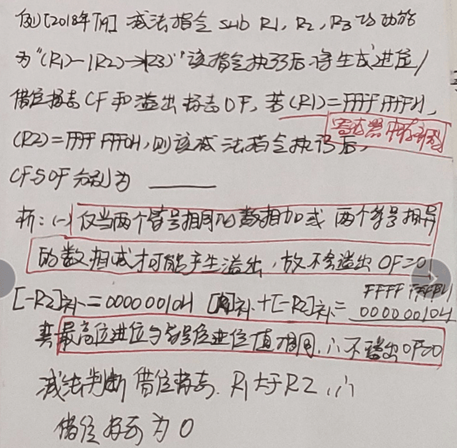

## 3：浮点数

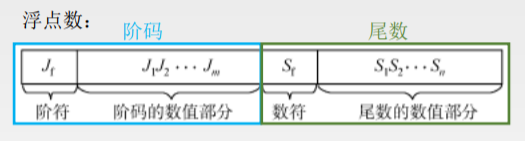

IEEE754标准：

规格化后的短浮点数的真值为：（-1）^s X 1.M X 2^(E-127)

浮点数的加减运算：对阶，尾数相加，规格化，舍入，判溢出

溢出：阶码是否超出了表示范围

注意C语言中运算以补码表示运算

 例一：浮点数加减运算以及溢出判断

浮点数的阶码和尾数均采用补码表示，且位数分别为5位和7位（均含2位符号位），数X=2^7 * 29/32

Y = 2^5  *  5/8 ，则用浮点加法计算X + Y 的最终结果为——

解：x = 00,111；00,11101 　　y= 00 ,101; 00,101 

1:对阶：小阶向大阶看起：y = 00,111；00,00101

2:尾数相加 00,11101

　　　　+  00,00101

　　　　——————

　　　　   01,00010

3：规格化：尾数右移一位，阶码加一  01,000；00,10001

4：判溢出：阶码符号位为01 溢出

## 4：ALU

### 串行加法器

### 并行加法器

### ALU 功能

ALU 是一个组合逻辑电路，核心是并行加法器，

4 片 74181 串联可组成 16 位 ALU，属于单级先行进位；

4 片 74181 和一片 74182 构成 16 位 ALU，属于两级先行进位 ALU

### ALU 结构

两幅图，会画一级先行进位和二级先行进位

# 三：存储器层次结构

## 1：基本概念

1：层次划分：主存储器即内存，辅存储器即硬盘；高速缓存 Cache

存取方式：

- 随机存储器：如主存和 cache
- 只读存储器：也是随机存储，但只能读不能写，RAM 和 ROM 共同构成主存地址域。
- 串行访问存储器：如磁带是顺序访问存储器，硬盘是直接访问存储器，但不是随机存储器，需要先寻道然后再道上殊勋存取。

信息的可保护性：

断电易失：如 RAM

断电不丢失：如 ROM，磁盘，光盘

破坏性读：DRAM

非破坏性读：SRAM，磁盘

3：边界对齐：

大端小端存储方式：

- - 大端：最高字节地址是数据地址（0123存成0123）
  - 小端：最低字节地址是数据地址（0123存成3210）

2：性能指标

实际容量 = 存储单元个数 _ 单元长度；理论容量= 存储子树 _ 存储字长；

存取时间 = 取出结果时间 - 启动存储器时间

存取周期 = 存取时间 + 存储器状态恢复时间 = 连续读或写的最小时间间隔，显然存取周期>=存取时间

## 3：层次化结构

CPU-寄存器-Cache-主存-辅存

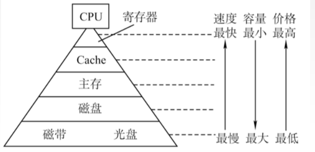

## 4：随机存储器

SRAM ：使用双稳态触发器存储信息，多用于高速缓存

非破坏性读，断电易失

引脚中处理地址线和数据线外，还有 CS（片选），WE（可写），OE（可读）

DRAM：

用电容电荷存储信息，用于主存；

刷新：

- 集中刷新：在固定的时间集中刷新，产生无法访问的时间段（死区）
- 分散刷新：将工作周期分开为读写周期和刷新周期，这样增加了存储周期，但无死区
- 异步刷新：刷新周期（2ms）除以行数，得到时间间隔 t，每时间 t 产生一次刷新，缩短死区时间；

刷新对 CPU 透明，刷新单位是行，刷新类似读，刷新无序片选；

DRAM 引脚除了地址线和数据线，还有 RAS（行选，起 CS 的作用），CAS（列选），WE，OE

只读存储器：

ROM 跟 RAM 一样随机读写，结构简单，断电不丢失

ROM，MROM 只读，PROM 写一次，EPROM 和 E2PROM 多次擦除，Flash 固态硬盘

Flash


 

 

 


 

 （1）随机存储器

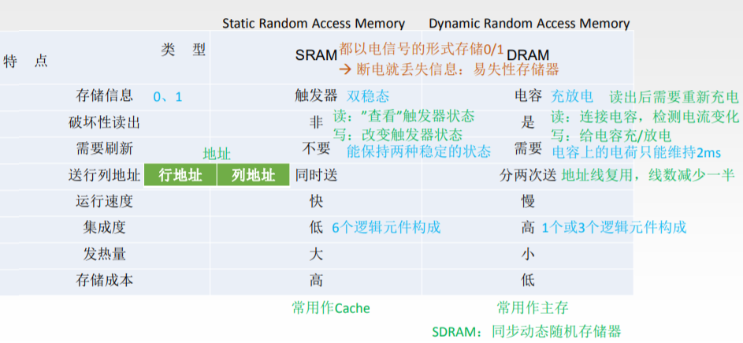

 DRAM存储器的刷新

分散刷新：

集中刷新：

异步刷新：

（2）只读存储器ROM

MROM（掩膜式只读存储器）：

PROM（一次可编程只读存储器）

EPROM（可编程可擦除）

FlashMermory（闪存存储器）：U盘

固态硬盘


## 5：存储器与 CPU 的连接

（1）主存容量扩展：

字扩展：

位扩展：

字位同时扩展：

（2）双口RAM与多模块存储器

双端口RAM

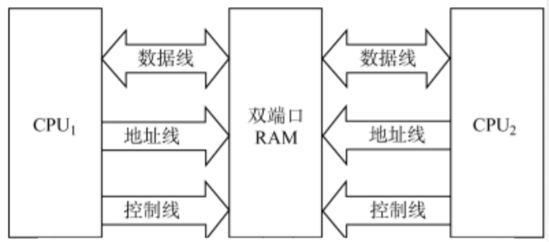

 

两个端口对同一主存：可同时读，不可同时写，也不能边读边写

 

多提并行存储器

高位交叉编址：

地位交叉编址： 

2：半导体存储器：

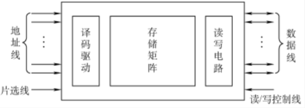

 3：Cache

（1）地址映射方式：

全相连：主存字块标记|字块内地址

直接映射：

组相连：

（2）替换算法：

随机

先入先出

最近最少使用（LRU）

最不经常使用（LFU）

（3）写策略

命中：全写法 和写会法

不命中：写分配法和非写分配法

 

 

 

 

 

 4：虚拟存储器

解决主存容量不足，希望向程序员提供更大的编程空间

页式虚拟存储器

转换：虚拟地址= 虚拟页号+页内偏移------->物理页号+页内偏移

段式虚拟存储器

段页式虚拟存储器

快表TLB：

页表，段表放在主存中，收到虚拟地址后先访问主存，查询页表段表进行虚实地址转换


# 四：指令系统

## 基本概念

数据通路：执行部件间传送信息的路径，分为共享通路和专用通路

指令集：一台机器所有指令的集合

RISC（精简指令集）和CISC（复杂指令集）

指令字长：指令中包含的二进制位数，有等长指令、变长指令。

2：基本格式分类

零地址指令：空操作，停机，关中断指令；运算类指令只用在堆栈计算机中

一地址指令：自加，自减，求反等单操作数运算；隐含地址 ACC，结果也放进 ACC 中，访问2次

二地址指令：| OP |A1 | A2| ，结果存放在 A1 中，访问3次

三地址指令：同时给出两个操作数地址和存放结果的地址，访问4次

四地址指令：在三地址指令基础上再给出下条指令地址，这不利于跳转。

定长指令：

指操作码长度固定，利于流水线

变长地址：

操作码长度不固定，会进行扩展操作码指令设计

## 寻址

指令寻址方式：顺序寻址，跳跃寻址

有效地址：指令中的地址码给出的是形式地址，要根据寻址方式得到有效地址

指令寻址：PC +1 ；JMP

数据寻址：根据指令中的地址码和寻址方式

2：数据寻址方式：

隐含寻址：操作数在 ACC 中

立即数寻址：指令直接给出操作数，地址码字段是操作数本身 MOV AX, 200H

寄存器寻址：地址码字段是寄存器地址 MOV AX, BX

直接寻址：指令给出操作数在内存地址，EA = A。地址码字段是内存地址 MOV AX, [200H] 

间接寻址：指令给出操作数地址的地址，EA = (A)地址码字段是内存地址的地址 MOV AX, I[200H]

寄存器间接寻址：地址码字段是存内存地址的寄存器地址 MOV AX, [BX]

相对寻址：操作数地址 + 当前PC的值

基址寻址：操作数地址 + 基址寄存器的值（一段程序中不变） MOV AX, 32[B]

变址寻址：操作数地址 + 变址寄存器的值（随程序不断变化） MOV AX, 32[SI]

寄存器寻址：指令给出寄存器号。EA = R

寄存器间接寻址：指令给出寄存器号，寄存器存储操作数地址，EA = （R）

相对寻址：指令给出形式地址 A，EA = （PC ) + A（数加，A 是补码表示），注意 PC 取值后 +1

基址寻址：EA = （BR ） + A

变址寻址：EA = （IX ） + A

堆栈寻址：EA = (SP)

基址寻址用于为程序会数据分配存储空间，基址地址由操作系统给出且不变，A 由程序猿给出，可变。

变址寻址用于处理数组问题，变址寄存器内容由用户给出，可变；A 不变

3： 指令格式：R型指令，I型指令，J型指令

微指令

微指令的编码方式：目标尽量缩短指令字长

（1）直接编码方式：无须译码，以为代替一个微指令

（2）字段直接编码：互斥的放在同一字段，留出一个状态（000）

（3）字段间接编码

微指令格式

水平型　　 　　　　　　　　　垂直型

微程序短，速度快 　　　　　　微程序长，速度慢

微指令长，编码麻烦　　　　　　微指令端，好编码

流水线

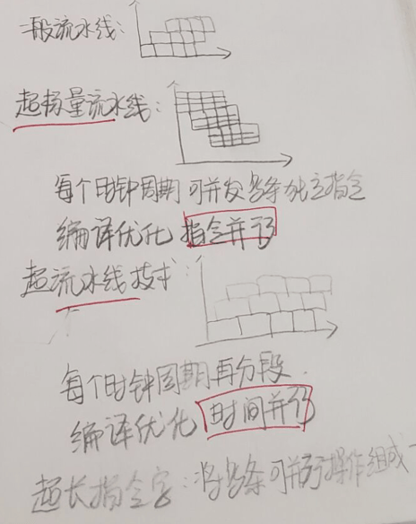

 


数据寻址方式：


CISC：指令复杂庞大；指令长度不固定，指令执行时间和频率差异；大多采用微程序控制器；编译程序难优化

RISC：指令精简，指令定长；只选常用指令，且大都只用一个时钟周期；只有 Load/Store 才能访存；使用大量寄存器流水线和组合逻辑电路

# 五：中央处理器

1：CPU的功能与结构

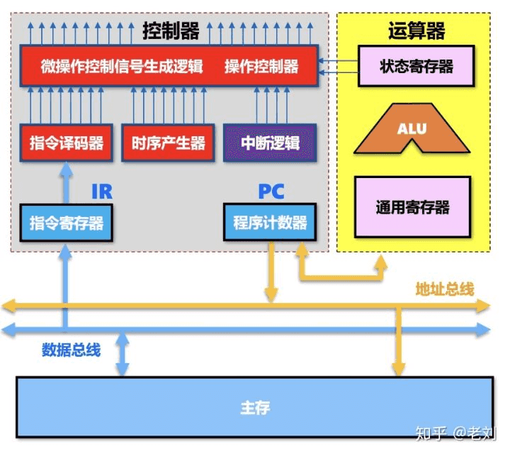

2：指令执行过程

 

3：数据通路的功能的基本结构

主存与CPU之间的数据传送

CPU从主存读取指令，实现传送操作的流程及控制信号为：

(PC)→Bus→MAR PCout和MARin有效，现行指令地址→MAR

1→R  CU发读命令(通过控制总线发出，图中未画出)

MEM(MAR)→MDR MDRin有效 MDR

MDR→Bus→IR MDRout和IRin有效，现行指令→IR

4：控制器的功能和工作原理

5：指令流水线


# 六：总线

## 1：概述

总线：一组能为多个部件分时共享的公共信息传送线路

总线特性：机械特性（尺寸，形状，管脚数），电气特性（传输方向和有效的电平范围），功能特性（每根传输线的功能），时间特性（信号的时序关系）

分时，共享，猝发传送

分类：

按数据传输格式：串行总线和并行总线

按总线功能：片内总线（CPU内部），系统总线（数据总线，地址总线，控制总线），通信总线；其中数据总线是双向的；地址总线单向传输；控制总线双向；通信总线是计算机系统之间传输信息的总线

按时序控制方式：同步总线，异步总线


组成结构

单总线结构：将各设备挂在一组总线上（不是一根），简单低成本；带宽低，

双总线结构：一条主存总线，一条 IO 总线，从低速 IO 从总线分离，需要增加硬件。

三总线结构：主存总线，IO 总线，DMA 总线；提高 IO 性能吞吐量；工作效率低

性能指标：

总线周期：一次总线操作所需全部时间（申请，寻址，传输，结束）

总线时钟周期：即机器时钟周期

总线工作频率：总线周期倒数，总线周期 = 若干时钟周期

总线时钟频率：即机器时钟频率

总线宽度：总线上能同时传输数据位数，取决于数据总线的根数；

## 2：总线仲裁

集中式

分布式

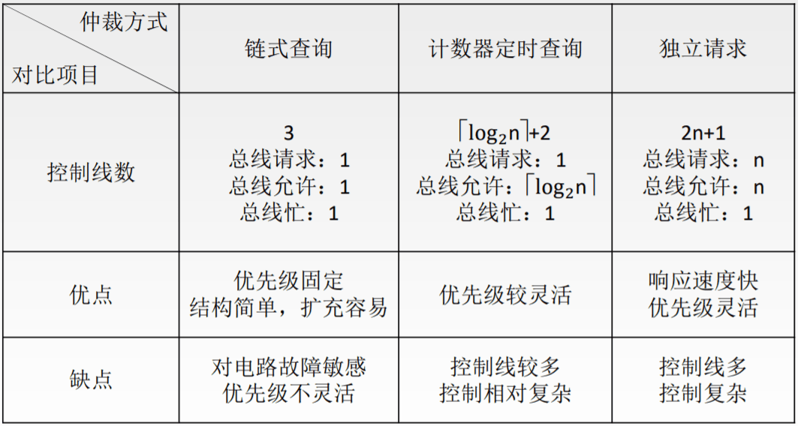

链式查询

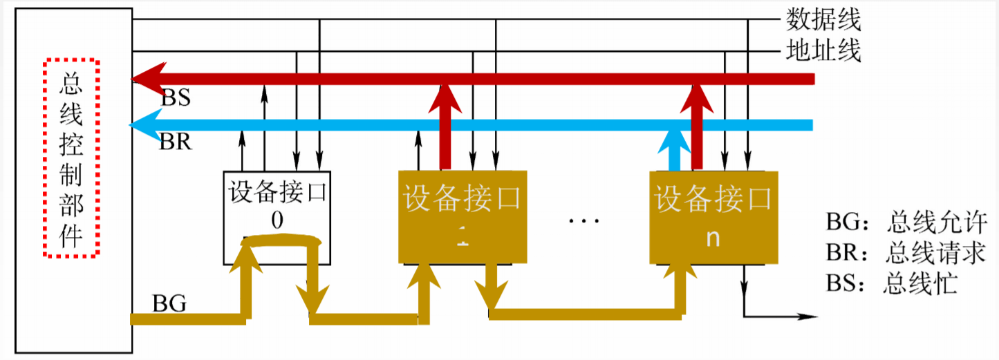

计数器定时查询

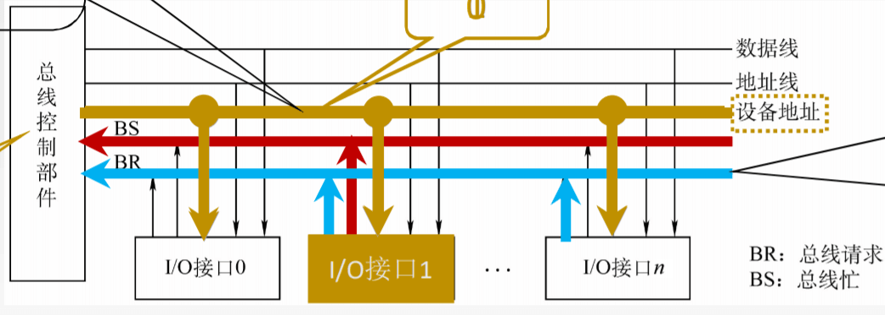

 

独立请求

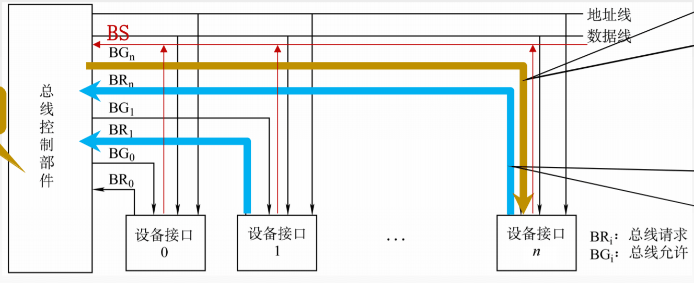

 

分布式

3：操作和定时

4：总线标准

系统总线标准：ISA，EISA，VESA，PCI，PCI-Express

设备总线标准：IDE,AGP，RS-232C，USB，SCSI

局部总线标准：


## 3：操作与定时

同步方式：

异步方式：

总线传输方式：

# 七：输入与输出

### 1：IO系统

 （1）IO软件

IO指令：CPU指令的一部分

通道指令

（2）IO硬件：外部设备，设备控制器和接口，IO总线

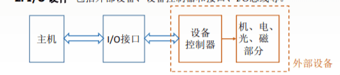

 

（3）IO接口

统一编址和独立编址

（4）IO子系统结构层次

**用户层I/O软件**：实现与用户交互的接口，用户可以直接调用在用户层提供的、与I/O操作有关的库函数，对设备进行操作。

**设备独立软件**：用于实现用户程序与设备驱动器的统一接口、设备命令、设备保护以及设备分配与释放等，同时为设备管理和数据传送提供必要的存储空间。

**设备驱动程序**：与硬件直接相关，负责具体实现系统对设备发出的操作指令，驱动I/O设备工作的驱动程序。

**中断处理程序**：用于保护被中断进程的CPU环境，转入相应的中断处理程序进行处理，处理完并恢复被中断进程的现场后，返回到被中断进程。

### 2：IO方式

程序查询方式

 

程序中断方式

中断：

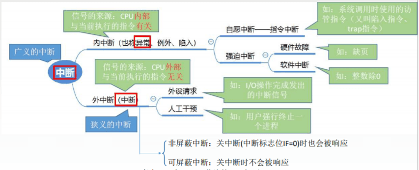

 

中断判优：

中断隐指令：

关中断：

保存断点：

引出中断服务程序：

DMA方

### 3：外部设备

输入设备：键盘，鼠标

输出设备：显示器，打印机

外存储器：磁盘，光驱

#### 磁盘存储器：

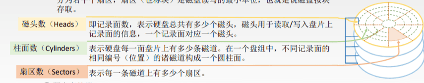

 

 记录密度：道密度（磁盘延半径方向的磁道数，），位密度（磁道单位长度上能记录的二进制代码位数），面密度（位密度与道密度的乘积）

 平均存取时间=寻道时间（磁头移动到目的磁道）+旋转延迟时间（磁头固定到所在扇区）+传输时间（传输数据所花的时间）

数据传输率：单位时间内向主机传送数据的字节数

**磁盘阵列：**

RAID0：无冗余和无校检的磁盘阵列，条带均匀分布

RAID1：以镜像为冗余方式

RAID2：纠错海明码

RAID3：位交叉奇偶校检

RAID4：块交叉奇偶校检

RAID5：无独立校检的奇偶校检


#  八：专题专解

1：各种实现

程序查询：纯软件

程序中断：软件传递+硬件中断

DMA：纯硬件

通道：软硬件结合

中断系统：隐指令（硬件）中断程序（软件）

时钟管理：专用统一计数器

地址映射：寄存器+加法器+其他

计算专题：

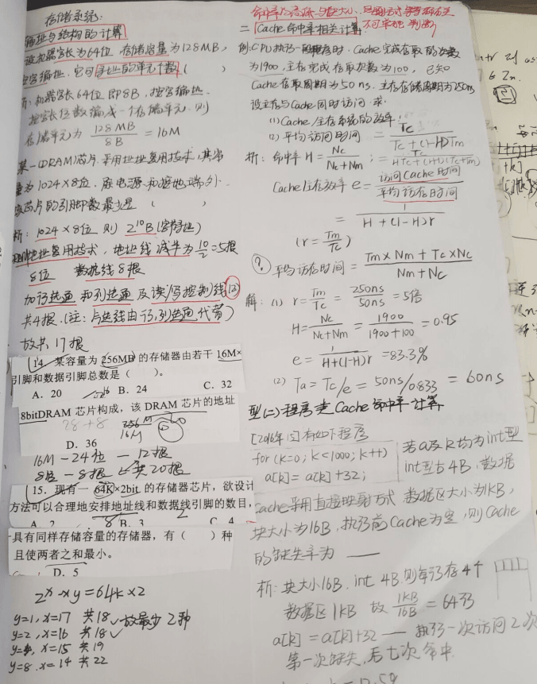

 
