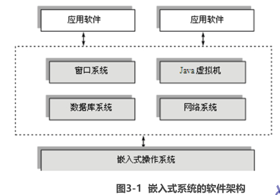
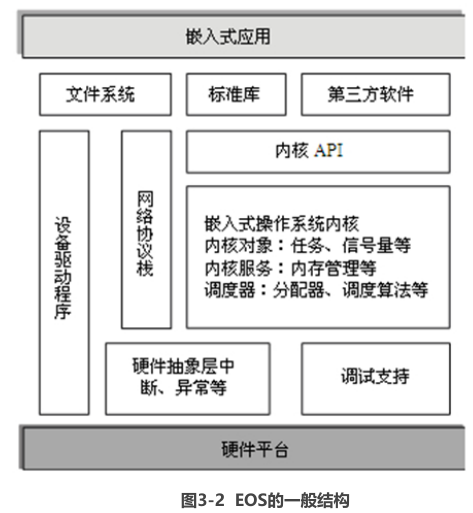
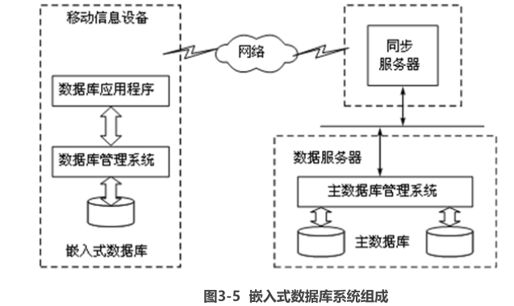

## 一：嵌入式系统概论

### 嵌入式系统的特点包括：

（1）系统专用性强。

（2）软、硬件依赖性强。

（3）系统实时性强。

（4）处理器专用。

（5）多种技术紧密结合。

（6）系统透明性。

（7）系统资源受限。

### 实时系统的概念

实时系统可以看成对外部事件及时响应的系统。现实世界中，并非所有的嵌入式系统都具有实时特性，所有的实时系统也不一定都是嵌入式的。但这两种系统并不互相排斥，兼有这两种特性的系统称为实时嵌入式系统（Real-Time Embedded System，RTES），通常简称为实时系统。介绍与RTES相关的几个概念：

（1）逻辑（或功能）正确：指系统对外部事件的处理能够产生正确的结果。

（2）时间正确：指系统对外部事件的处理必须在预定的周期内完成。

（3）死线（Deadline）：指系统必须对外部事件处理的最迟时间界限，错过此界限可能产生严重后果。通常，计算必须在到达死线前完成。

（4）实时系统：指功能正确和时间正确同时满足的系统，二者同等重要。换言之，实时系统有时间约束并且是死线驱动的。但是在某些系统中，为了保证功能正确性，有可能牺牲时间正确性。

## 二：嵌入式系统的基本架构

嵌入式系统一般都由**软件**和**硬件**两个部分组成，

硬件基础：**嵌入式处理器**、**存储器**和**外部设备**构成整个系统的**硬件基础**。

**软件部分**：**系统软件**、**支撑软件**和**应用软件**，其中系统软件和支撑软件是基础，应用软件则是最能体现整个嵌入式系统的特点和功能的部分。

### 硬件架构

**微处理器**是整个嵌入式系统的核心，负责控制系统的执行。

**外部设备**是嵌入式系统同外界交互的通道，常见的外部设备有flash存储器、键盘、输入笔、触摸屏、液晶显示器等，在很多嵌入式系统中还有与系统用途紧密相关的各种专用外设。嵌入式系统中经常使用的存储器有3种类型，分别是RAM、ROM和混合存储器。

**系统的存储器**用于存放系统的程序代码、数据和系统运行的结果。

嵌入式系统的**核心部件**是各种类型的**嵌入式处理器**，根据目前的使用情况，嵌入式处理器可以分为如下几类：

（1）嵌入式微处理器。由通用计算机中的CPU演变而来，在功能上跟普通的微处理器基本一致，但是它具有体积小、功耗低、质量轻、成本低及可靠性高的优点。通常，嵌入式微处理器和ROM（Read Only Memory，只读存储器）、RAM（Random Access Memory，随机存取存储器）、总线接口及外设接口等部件安装在一块电路板上，称为单板计算机。

（2）嵌入式微控制器。又称为单片机，整个计算机系统都集成到一块芯片中。嵌入式微控制器一般以某一种微处理器内核为核心，芯片内部集成有存储器、总线、总线逻辑、定时器/计数器、监督定时器、并口/串口、数模/模数转换器、闪存等必要外设。与嵌入式微处理器相比，嵌入式微控制器的最大特点是单片化，因而体积更小、功耗和成本更低，可靠性更高。

（3）嵌入式数字信号处理器。一种专门用于信号处理的处理器，DSP（Digital Signal Processor，数字信号处理器）是芯片内部采用程序和数据分开的结构，具有专门的硬件乘法器，广泛采用流水线操作，提供特殊的DSP指令，可以用来快速实现各种数字信号的处理算法。目前，DSP在嵌入式系统中使用非常广泛，如数字滤波、快速傅立叶变换及频谱分析等。

（4）嵌入式片上系统。一种在一块芯片上集成很多功能模块的复杂系统，例如，把微处理器内核、RAM、USB（Universal Serial Bus，通用串行总线）、IEEE 1394、Bluetooth（蓝牙）等集成到一个芯片中，构成一个嵌入式片上系统，从而大幅度缩小了系统的体积、降低了系统的复杂度、增强了系统的可靠性。在大量生产时，生产成本也远远低于单元部件组成的电路板系统。根据用途不同，嵌入式片上系统可以分为通用片上系统和专用片上系统两类。专用类的嵌入式片上系统一般是针对某一或某些系统而设计的。

### 软件架构

 

 

## 三：嵌入式操作系统（EOS）

嵌入式操作系统（Embedded Operating System，EOS）由操作系统内核、应用程序接口、设备驱动程序接口等几部分组成。

嵌入式操作一般采用微内核结构。操作系统只负责进程的调度、进程间的通信、内存分配及异常与中断管理最基本的任务，其他大部分的功能则由支撑软件完成。

嵌入式系统中的支撑软件由窗口系统、网络系统、数据库管理系统及Java虚拟机等几部分组成。

对于嵌入式系统来讲，软件的开发环境大部分在通用台式计算机和工作站上运行，但从逻辑上讲，它仍然被认为是嵌入式系统支撑软件的一部分。

支撑软件一般用于一些浅度嵌入的系统中，如智能手机、个人数字助理等。嵌入式系统中的应用软件是系统整体功能的集中体现。系统的能力总是通过应用软件表现出来

内核对象：

RTOS的用户可以使用内核对象来解决实时系统设计中的问题，如并发、同步与互斥、数据通信等。内核对象包括信号量、消息队列、管道、事件与信号等。配套视频

内核服务：

大多数嵌入式处理器架构都提供了异常和中断机制，允许处理器中断正常的执行路径。这个中断可能由应用软件触发，也可由一个错误或不可预知的外部事件来触发。而大多数EOS则提供异常和中断处理的“包裹”功能，使嵌入式系统开发者避免底层细节。

常见的嵌入式操作系统

1．VxWorks

2．Palm

3．Windows CE

4．Linux 

## 四：嵌入式系统数据库

 一个完整的嵌入式DBMS由若干子系统组成，包括主DBMS、同步服务器、嵌入式DBMS、连接网络等几个子系统，如图3-5所示。

 

 

##  五：嵌入式系统网络

###  1：现场总线网

现场总线主要有总线型与星型两种拓扑结构。FCS通常由以下部分组成：现场总线仪表、控制器、现场总线线路、监控、组态计算机。这里的仪表、控制器、计算机都需要通过现场总线网卡、通信协议软件连接到网上。因此，现场总线网卡、通信协议软件是现场总线控制系统的基础和神经中枢。

###  2：嵌入式因特网

1．嵌入式因特网的接入方式

（1）直接接入式因特网。嵌入式设备上集成了TCP/IP协议栈及相关软件，这类设备可以作为Internet的一个节点，分配有IP地址，与Internet直接互联。

这种接入方式的特点是：设备可以直接连接到Internet，对Internet进行透明访问，不需要专门的接入设备，设备的协议标准化；需要的处理器性能和资源相对较高，需要占用IP资源，由于目前IPv4资源紧张，这种方案在IPv6网中可能更现实。

（2）通过网关接入因特网。即采用瘦设备方案，设备不直接接入Internet，不需要复杂的TCP/IP协议全集，而是通过接入设备接入Internet。

这种接入方式的特点是：对接入设备的性能和资源要求较低，接入设备的协议栈开销较小，不需要分配合法的IP地址，可以降低系统的整体成本；设备可以实现多样化、小型化。

 