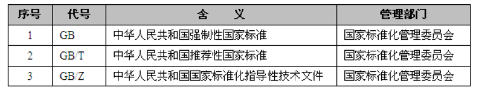

全文链接：https://www.cnblogs.com/nullering/p/9684820.html

# 知识产权保护

## 《著作权》

### （一）著作权法客体 

1、作品 
2、职务作品 
为完成单位工作任务所创作的作品。

职务作品是用单位资源完成，或者合同约定的，著作权属于单位，作者仅享有署名权。 
其他职务作品著作权仍归作者，但单位有权在业务范围内优先使用，并且在两年内，未经单位同意，作者不得许可其他人、单位使用。

### （二）著作权法主体

 著作权关系人，包括著作权人、受让者。

**1、著作权人与受让者** 

著作权人又称为原始著作权人，受让者又称为后继著作权人。

**2、著作权人的确定** 
认定著作权人，根据创作事实。为他人创作进行组织、咨询、物质条件或其他辅助工作，不属于创作范围，不被确认为著作权人。

如果创作多人参与，那么著作权由合作的作者共同享有。作品可以分割使用，作者对各自创作的部分可以单独享有著作权，但不得侵犯合作作品整体的著作权。

如果作者不明，作品原件的所有人可以行使除署名权以外的著作权，直到作者身份明确。

如果作品受委托创作，除非合同约定，否则著作权仍归属受委托人。

### （三）著作权 

根据著作权法及实施条例规定，著作权人对作品享有5种权利：

（1）发表权：即决定作品是否公之于众的权利。

（2）署名权：即表明作者身份，在作品上署名的权利。

（3）修改权：即修改或授权他人修改作品的权利。

（4）保护作品完整权：即保护作品不受歪曲、篡改的权利。

（5）使用权、使用许可权和获取报酬权、转让权：即以复制、表演、播放、展览、发行、摄制电影、电视、录像，或者改编、翻译、注释和编辑等方式使用作品的权利，以及许可他人以上述方式使用作品，并由此获得报酬的权利。

**1、著作权保护期限** 

1）著作权属于公民的： 
署名权、修改权、保护作品完整权永不过期；发表权、使用权和获得报酬权保护期为作者终生以及死亡后50年（第50年的12月31日）。作者死亡后，著作权按照继承法转移。

2）著作权属于单位的： 
发表权、使用权和获得报酬权保护期为50年（首次发表后的第50年的12月31日），若50年内未发表，不予保护。单位变更、终止后，其著作权由承受其义务的单位享有。

**2、使用许可** 

　　使用需要得到著作权人的许可，并签订合同，包括约定使用方式，范围与期限，报酬，违约责任等等。合同有效期不超过10年。 但有些情况可以不经著作权人许可，不支付报酬，但要指明作者姓名，作品名称，不得侵犯其著作权。如 个人学习、研究或欣赏，使用他人作品*等。*

　　如果作品是委托创作的，著作权的归属应通过委托权和受委托人之间的合同来确定，如果没有明确的约定，或则没有签订相关合同，则著作权仍属于受托人。

获得著作权从软件完成之日起

##  《计算机软件保护条例》

### （一）：著作权人确定

根据《计算机软件保护条例》规定，软件开发可以分为合作开发、职务开发、委托开发三种形式。

（1）合作开发。对于由两个或两个以上的开发者或组织合作开发的软件，著作权的归属根据合同约定确定。若无合同，则共享著作权。若合作开发的软件可以分割使用，那么开发者对自己开发的部分单独享有著作权，可以在不破坏整体著作权的基础上行使。

（2）职务开发。如果开发者在单位或组织中任职期间，所开发的软件符合以下条件，则软件著作权应归单位或组织所有。•针对本职工作中明确规定的开发目标所开发的软件。•开发出的软件属于从事本职工作活动的结果。使用了单位或组织的资金、专用设备、未公开的信息等物质、技术条件，并由单位或组织承担责任的软件。

（3）委托开发。如果是接受他人委托而进行开发的软件，其著作权的归属应由委托人与受托人签订书面合同约定；如果没有签订合同，或合同中未规定的，则其著作权由受托人享有。

另外，由国家机关下达任务开发的软件，著作权的归属由项目任务书或合同规定，若未明确规定，其著作权应归任务接受方所有。

 

计算机软件也属于作品。所以也适用著作权法。除此而外，也有一些特点： 
1、受保护软件必须固化在有形物体上，如硬盘、光盘、软盘等。 
2、合法复制品所有人权利：得到著作权人许可，复制品所有人可以：、 
1）将软件安装到设备中 
2）备份复制品，但这些备份不得再转给他人 
3）可以修改该复制品，但不得提供给任何第三方 
4）出于学习研究，安装、存储、显示等方式，可以不经著作权人许可，不向其支付报酬。

## 《商标法及实施条例》

（一）商标使用期限 
10年。期满后可以续期，但必须提前6个月申请；如果期间未申请，还有6个月宽限期；再不申请，注销。

（二）注册商标的申请 
多个申请人同一天申请注册相同或近似商标，则申请人提供注册前先使用该商标的证据，先使用者先得；如果都没有证据，则协商解决；协商无果，抽签。

（三）注册商标专用权保护 
以下行为侵犯商标权，敬请留意： 
1、未经商标注册人许可，使用相同或相似商标 
2、销售侵犯商标专用权的商品（如果销售方不知道是侵权商品，并且能证明来源合法，则不承担相应责任） 
3、伪造或销售他人注册商标 
4、未经商标注册人许可，更换其注册商标

商标注册人死亡或终止，自死亡或终止日起1年期满，没有办理转移手续，任何人都可以申请注销该商标。

 

## 《专利法及实施细则》

 

（一）授予专利权的条件 
新颖性、创造性、实用性。

科学发现、疾病诊疗、动植物品种、原子核变换得到的物质，不能够被授予专利权。

（二）确定专利权人 
发明人或设计人。组织、提供方便、辅助、咨询意见者不算。 
职务发明专利人为单位。

所谓职务发明，指单位任务、或利用单位资源、或离开单位1年内，与原单位工作任务相关的发明创造。 
非职务发明，单位无权阻止个人申请。多人申请，专利权归最早申请者。

专利权保护期限20年，外观设计专利10年。得到专利权要交年费，不交则被终止。另外，任何单位和个人都可以申请专利复审，复审不通过则专利权终止。

特殊情况下，国家可以强行得到许可。

 

 

## 《反不正当竞争法》

 比如利用政府职权，限定商品购买，以及地方保护主义，等等

 商业秘密是指不为公众所知，具有经济利益，具有实用性，并且已经采取了保密措施的技术信息与经营信息。在《反不正当竞争法》中对商业秘密进行了保护，如果存在以下行为的，则视为侵犯商业秘密。

（1）以盗窃、利诱、胁迫等不正当手段获取别人的商业秘密。

（2）披露使用不正当手段获取的商业秘密；

（3）违反有关保守商业秘密的要求约定，披露、使用其掌握的商业秘密。

商标：

作为一个商标，应该具备显著性、独占性、价值和竞争性四个特征。

两个或者两个以上的申请人，在同一种商品或者类似商品上，分别以相同或者近似的商标在同一天申请注册的，各申请人应当自收到商标局通知之日起30日内提交其申请注册前在先使用该商标的证据。同日使用或者均未使用的，各申请人可以自收到商标局通知之日起30日内自行协商，并将书面协议报送商标局；不愿协商或者协商不成的，商标局通知各申请人以抽签的方式确定一个申请人，驳回其他人的注册申请。商标局已经通知但申请人未参加抽签的，视为放弃申请，商标局应当书面通知未参加抽签的申请人。

注册商标的有效期限为10年，自核准注册之日起计算。注册商标有效期满，需要继续使用的，应当在期满前6个月内申请续展注册；在此期间未能提出申请的，可以给予6个月的宽展期。宽展期满仍未提出申请的，注销其注册商标。每次续展注册的有效期为10年。

 

# 标准化：

国际标准：

国家标准：

行业标准：

地方标准（DB）：

企业标准（Q）：

 

 

 

 