# 一、IntelliJIDEA 

## 1.JetBrains 公司介绍 

IDEA(https://www.jetbrains.com/idea/)是 JetBrains 公司的产品，公司旗下还有其

它产品，比如：

-   WebStorm：用于开发 JavaScript、HTML5、CSS3 等前端技术；
-   PyCharm：用于开发 python
-   PhpStorm：用于开发 PHP
-   RubyMine：用于开发 Ruby/Rails
-   AppCode：用于开发 Objective - C/Swift
-   CLion：用于开发 C/C++
-   DataGrip：用于开发数据库和 SQL
-   Rider：用于开发.NET
-   GoLand：用于开发 Go
-    Android Studio：用于开发 android(google 基于 IDEA 社区版进行迭代)


## 2. IntelliJ IDEA 介绍 

IDEA，全称 IntelliJ IDEA，是 Java 语言的集成开发环境，IDEA
在业界被公认为是最好的 java
开发工具之一，尤其在智能代码助手、代码自动提示、重构、J2EE 支持、Ant、JUnit、CVS
整合、代码审查、创新的 GUI 设计等方面的功能可以说是超常的。

IntelliJ IDEA 在 2015 年的官网上这样介绍自己：

Excel at enterprise, mobile and web development with Java, Scala and Groovy,
with all the latest modern technologies and frameworks available out of the box.

简明翻译：IntelliJ IDEA 主要用于支持 Java、Scala、Groovy
等语言的开发工具，同时具备支持目前主流的技术和框架，擅长于企业应用、移动应用和
Web 应用的开发。

## **3.IDEA** 的主要功能介绍

语言支持上：


其他支持：

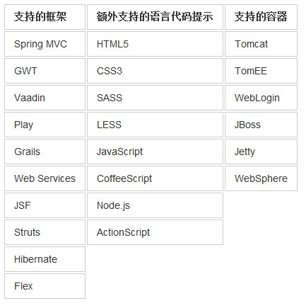

## 4.IDEA 的主要优势：(相较于 Eclipse 而言) 

1.  强大的整合能力。比如：Git、Maven、Spring 等

2.  提示功能的快速、便捷

3.  提示功能的范围广

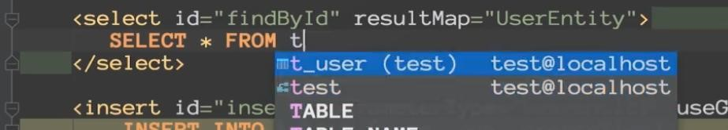

1.  好用的快捷键和代码模板 private static final psf

2.  精准搜索

## 5.IDEA 的下载地址：(官网) 

https://www.jetbrains.com/idea/download/\#section=windows

IDEA 分为两个版本：旗舰版**(Ultimate)**和社区版**(Community)**。

旗舰版收费(限 30 天免费试用)，社区版免费，这和 Eclipse 有很大区别。


这里提供了不同操作系统下的两个不同版本的安装文件。

两个不同版本的详细对比，可以参照官网：

<https://www.jetbrains.com/idea/features/editions_comparison_matrix.html>

## 6. 官网提供的详细使用文档： 

[https://www.jetbrains.com/help/idea/meet](https://www.jetbrains.com/help/idea/meet-intellij-idea.html)[-](https://www.jetbrains.com/help/idea/meet-intellij-idea.html)[intellij](https://www.jetbrains.com/help/idea/meet-intellij-idea.html)[-](https://www.jetbrains.com/help/idea/meet-intellij-idea.html)[idea.html](https://www.jetbrains.com/help/idea/meet-intellij-idea.html)

# 二、windows 下安装

## 1：安装

具体安装步骤可参考系统重装篇

## 2：安装目录结构

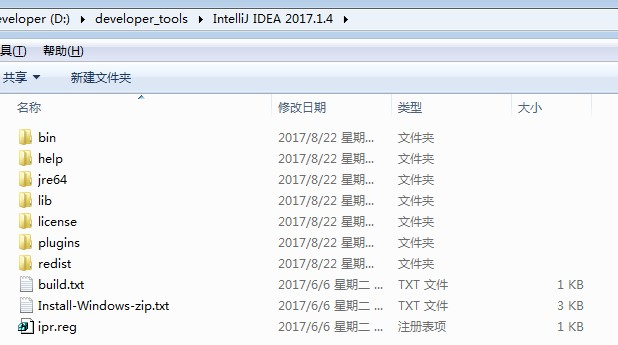

bin：容器，执行文件和启动参数等 help：快捷键文档和其他帮助文档

jre64：64 位java 运行环境

lib：idea 依赖的类库

license：各个插件许可

plugin：插件

其中：bin 目录下：


这里以我的电脑系统(64 位 windows7，16G 内存)为例，说明一下如何调整 VM 配置文件：


1.  大家根据电脑系统的位数，选择 32 位的 VM 配置文件或者 64 位的 VM 配置文件

2.  32 位操作系统内存不会超过 4G，所以没有多大空间可以调整，建议不用调整了

3.  64 位操作系统中 8G 内存以下的机子或是静态页面开发者是无需修改的。

4.  64 位操作系统且内存大于 8G 的，如果你是开发大型项目、Java 项目或是 Android
    项目，建议进行修改，常修改的就是下面 3 个参数：

\-Xms128m，16 G 内存的机器可尝试设置为 -Xms512m  (设置初始的内存数，增加该值可以提高Java程序的启动速度。) 

-Xmx750m，16 G 内存的机器可尝试设置为 -Xmx1500m  (设置最大内存数，提高该值，可以减少内存Garage收集的频率，提高程序性能)  

-XX:ReservedCodeCacheSize=240m，16G 内存的机器可尝试设置为 -XX:ReservedCodeCacheSize=500m  (保留代码占用的内存容量)  


## 3：设置目录结构 

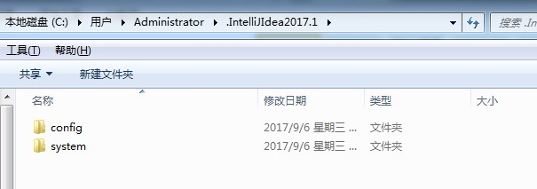

这是 IDEA的各种配置的保存目录。这个设置目录有一个特性，就是你删除掉整个目录之后，重新启动IntelliJ IDEA 会再自动帮你生成一个全新的默认配置，所以很多时候如果你把 IntelliJIDEA 配置改坏了，没关系，删掉该目录，一切都会还原到默认。

### config 目录 

config 目录是 IntelliJ IDEA 个性化化配置目录，或者说是整个 IDEA设置目录。此目录可看成是最重要的目录，没有之一，IntelliJ IDEA a安装时会自动扫描硬盘上的旧配置目录，指的就是该目录。

这个目录主要记录了：IDEA主要配置功能、自定义的代码模板、自定义的文件模板、自定义的快捷键、Project 的tasks 记录等等个性化的设置。 比如：

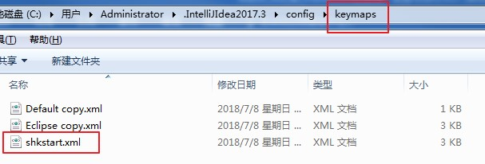

### system 目录 

system 目录是 IntelliJ IDEA 系统文件目录，是 IntelliJ IDEA与开发项目一个桥梁目录，里面主要有：缓存、索引、容器文件输出等等，虽然不是最重要目录，但也是最不可或缺的目录之一。比如：

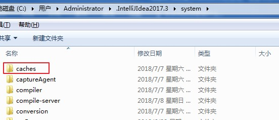

#  三、设置快捷键(Keymap) 

## 1. 设置快捷为 Eclipse 的快捷键 


## 2.通过快捷键功能修改快捷键设置 


## 3.通过指定快捷键，查看或修改其功能 


## 4.导入已有的设置 

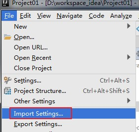


点击 0K 之后，重启 IDEA 即可。

## 5.常用快捷键 

| 快捷键             | 功能                                            |
| ------------------ | ----------------------------------------------- |
| Alt+Enter          | 导入包，自动修正代码                            |
| Ctrl+Y             | 删除光标所在行                                  |
| Ctrl+D             | 复制光标所在行的内容，插入光标位置下面          |
| Ctrl+Alt+L         | 格式化代码                                      |
| Ctrl+/             | 单行注释                                        |
| Ctrl+Shift+/       | 选中代码注释，多行注释，再按取消注释            |
| Alt+Ins            | 自动生成代码，toString，get，set等方法          |
| Alt+Shift+上下箭头 | 移动当前代码行                                  |
| **shift+enter**    | 向下开始新的一行                                |
| **ctrl+o**         | 查看类的结构：类似于 **eclipse** 的 **outline** |
| **double Shift**   | 查找文件                                        |
| ctrl + F           | 文件内搜索                                      |
| ctrl + shift + F   | 全局搜索                                        |
| ctrl + R           | 替换                                            |
| Ctrl + Shift + R   | 全局替换                                        |
|                    |                                                 |
|                    |                                                 |
|                    |                                                 |
|                    |                                                 |
|                    |                                                 |


# **三、个性化配置** 

## 1.设置主题 


## 2.设置插件 

设置 IDEA的各种插件，可以选择自定义设置、删除，或者安装本身不存在的插件（比如：支持Scala 的插件）。可以通过界面菜单栏的 settings 进行设置。

IDEA 插件官方下载地址：https://plugins.jetbrains.com/idea


## 3.设置显示常见的视图 


调出工具条和按钮组

## 4.工程界面展示 

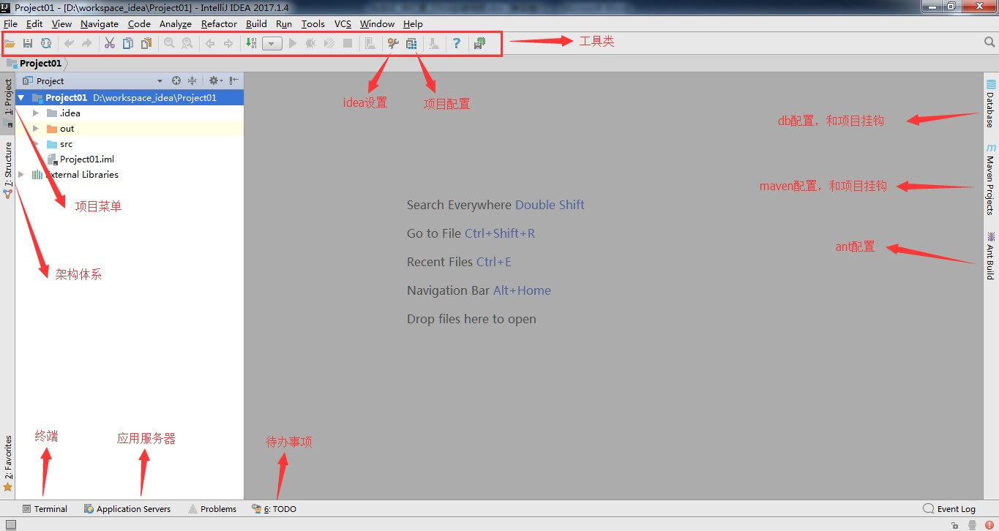

-   工程下的 src 类似于 Eclipse 下的 src 目录，用于存放代码。

-   工程下的.idea 和 project01.iml 文件都是 IDEA 工程特有的。类似于 Eclipse
    工程下的.settings、.classpath、.project 等。

  


# 四、创建 Java 工程

## 1.创建 Java 工程 


-   Create New Project:创建一个新的工程

-   Import Project:导入一个现有的工程

-   Open:打开一个已有工程。比如：可以打开 Eclipse 项目。

-   Check out from Version Control:可以通过服务器上的项目地址 check out Github上面项目或其他 Git 托管服务器上的项目

这里选择 Create New Project，需要明确一下概念：

IntelliJ IDEA 没有类似 Eclipse 的工作空间的概念（Workspaces），最大单元就是Project。这里可以把 Project 理解为 Eclipse 中的 Workspace。

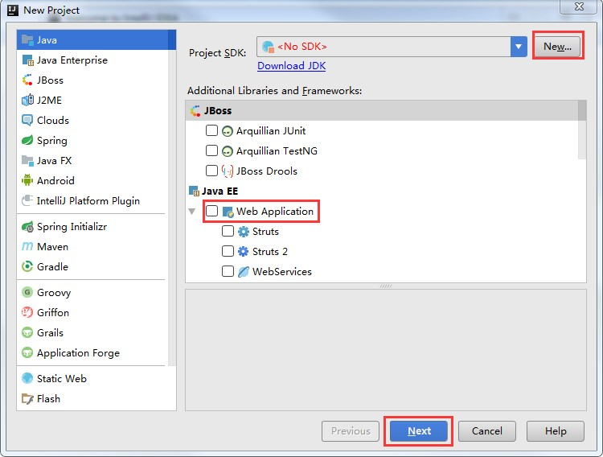

选择指定目录下的 JDK 作为 Project SDK。

如果要创建 Web 工程，则需要勾选上面的 Web Application。如果不需要创建 Web
工程的话，则不需要勾选。这里先不勾选，只是创建简单的 Java 工程。

其中，选择 New：选择 jdk 的安装路径所在位置：


点击 OK 以后，选择 Next:

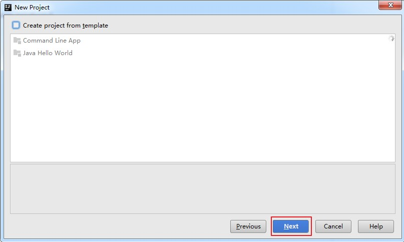

这里不用勾选。选择 Next，进入下一个页面：

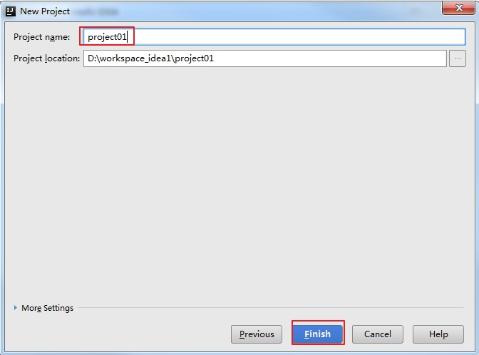

给创建的工程起一个名字，点击 finish。


点击 OK 即可。

在包下 new-class：


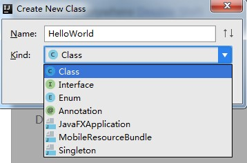

不管是创建 class，还是 interface，还是 annotation，都是选择 new – java class，然后在下拉框中选择创建的结构的类型。

接着在类 HelloWorld 里声明主方法，输出 helloworld，完成测试。


说明：在 **IDEA** 里要说的是，写完代码，不用点击保存。**IDEA** 会自动保存代码。

## 2.创建模块(Module) 

在 Eclipse 中我们有 Workspace（工作空间）和 Project（工程）的概念，在 IDEA中只有 Project（工程）和 Module（模块）的概念。

从 Eclipse 转过来的人总是下意识地要在同一个窗口管理 n 个项目，这在IntelliJ IDEA 是无法做到的。IntelliJ IDEA提供的解决方案是打开多个项目实例，即打开多个项目窗口。即：一个 Project 打开一个Window 窗口。

在 IntelliJ IDEA 中 Project 是最顶级的级别，次级别是 Module。一个 Project可以有多个 Module。目前主流的大型项目都是分布式部署的，结构都是类似这种多Module 结构。

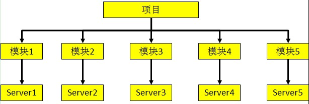

这类项目一般是这样划分的，比如：core Module、web Module、plugin Module、 solrModule 等等，模块之间彼此可以相互依赖。通过这些 Module的命名也可以看出，他们之间都是处于同一个项目业务下的模块，彼此之间是有不可分割的业务关系的。举例：


相比较于多 Module 项目，小项目就无需搞得这么复杂。只有一个 Module 的结构IntelliJ IDEA 也是支持的，并且 IntelliJ IDEA 创建项目的时候，默认就是单Module 的结构的。下面，我们演示如何创建 Module:


接着选择 Next:


之后，我们可以在 Module 的 src 里写代码，此时 Project 工程下的 src
就没什么用了。可以删掉。

## 3.查看项目配置 

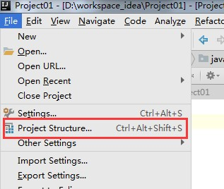

进入项目结构：

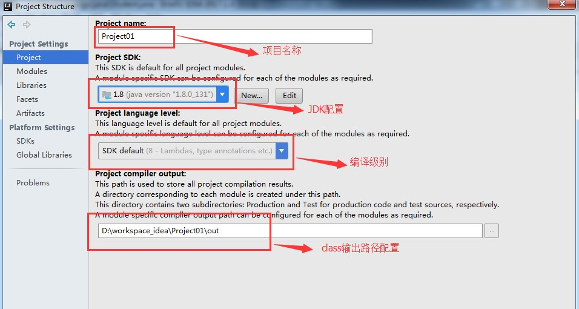

## 4：对项目的相关操作

4.1：切换JDK版本

File——>Project Structure——> SDK


# 五、常用配置 

IntelliJ IDEA有很多人性化的设置我们必须单独拿出来讲解，也因为这些个性化的设置让那些 IntelliJIDEA 死忠粉更加死心塌地使用它和分享它。

进入设置界面：


目录结构如下：

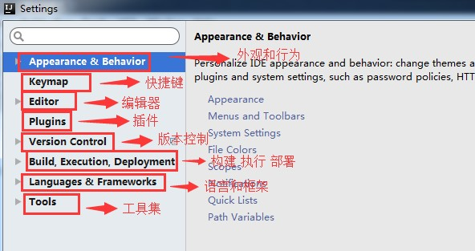

## 1：常用配置手记

### 1.1：xml文件的颜色，空格时显示混乱

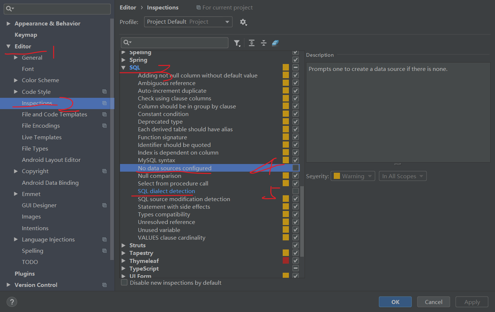


### 1.2：错误提示不及时

1.开启了节省电源的问题
file》power save mode点一下把前边的勾去掉
2.有缓存问题
file》invalidateCaches/Restart

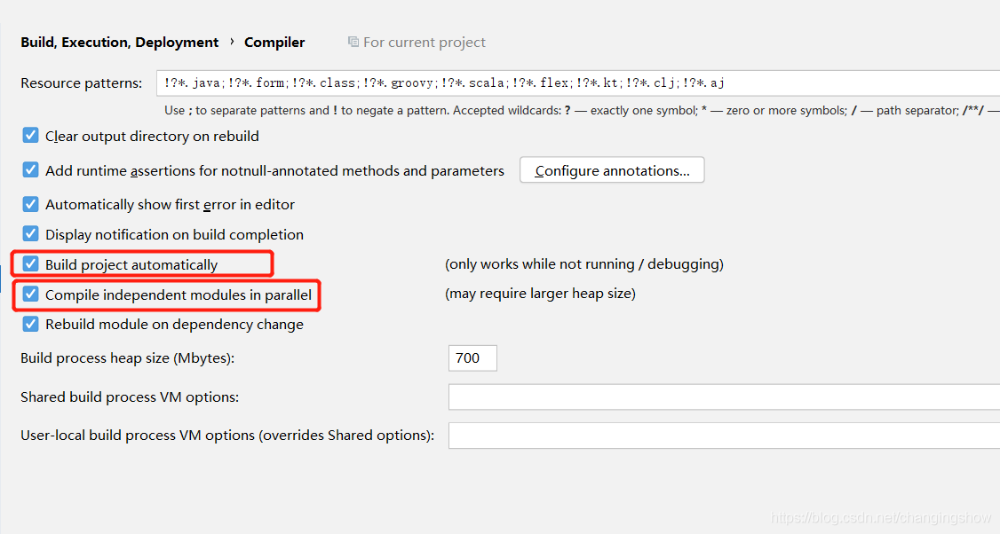


## 1.Appearance & Behavior 

### 1.1 设置主题 

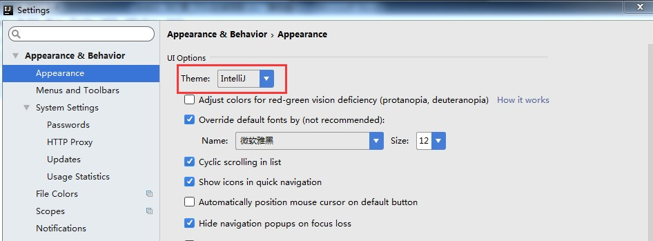

这里默认提供了三套主题：IntelliJ，Darcula，Windows。这里可以根据自己的喜好进行选择。

### 1.2 设置窗体及菜单的字体及字体大小 (可忽略) 


### 1.3 设置编辑区主题 (可忽略) 

IDEA 默认提供了两个编辑区主题，可以通过如下的方式进行选择。


如果想要更多的主题效果的话，可以到如下的网站下载：<http://www.riaway.com/> 

下载以后，导入主题：

（方式一）

file –\> import setttings –\> 选中下载的主题 jar 文件 –\> 一路确认 –\> 重启。

重启以后，新主题会自动启用。如果没有启用，可以如下方式选择：


下载以后，导入主题：（方式二）

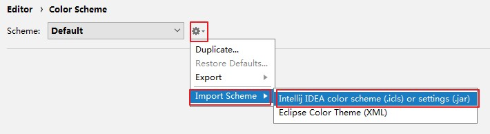

### 1.4 通过插件(plugins)更换主题 

喜欢黑色主题的话，还可以下载插件：Material Theme UI

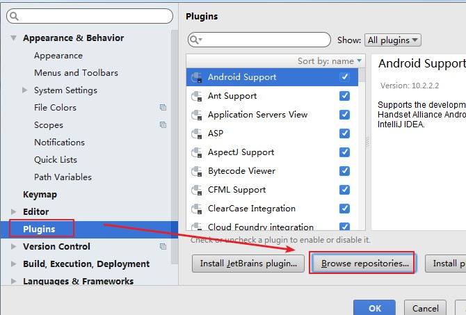

点击按钮以后，在联网环境下搜索如下的插件-安装-重启 IDEA 即可：


如果对安装的主题插件不满意，还可以找到此插件，进行卸载 – 重启 IDEA 即可。


1.5：设置启动不加载上次的项目


## 2. Editor - General 

### 2.1 设置鼠标滚轮修改字体大小(可忽略) 


我们可以勾选此设置后，增加 Ctrl + 鼠标滚轮 快捷键来控制代码字体大小显示。

### 2.2 设置鼠标悬浮提示 

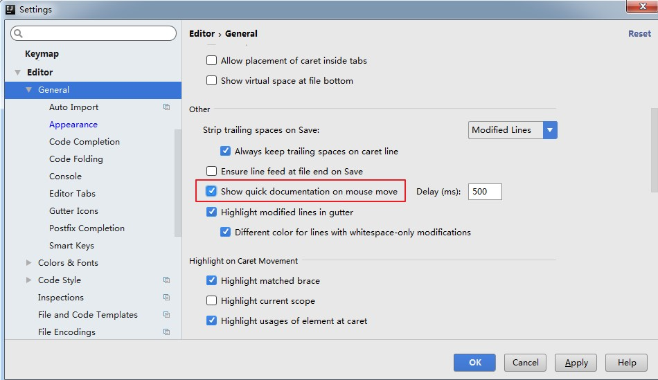

### 2.3 设置自动导包功能 


-   Add unambiguous imports on the fly：自动导入不明确的结构

-   Optimize imports on the fly：自动帮我们优化导入的包

### 2.4 设置显示行号和方法间的分隔符 


-   如上图红圈所示，可以勾选 Show line
    numbers：显示行数。我建议一般这个要勾选上。

-   如上图红圈所示，可以勾选 Show method separators：
    显示方法分隔线。这种线有助于我们区分开方法，所以建议勾选上。

### 2.5 忽略大小写提示 

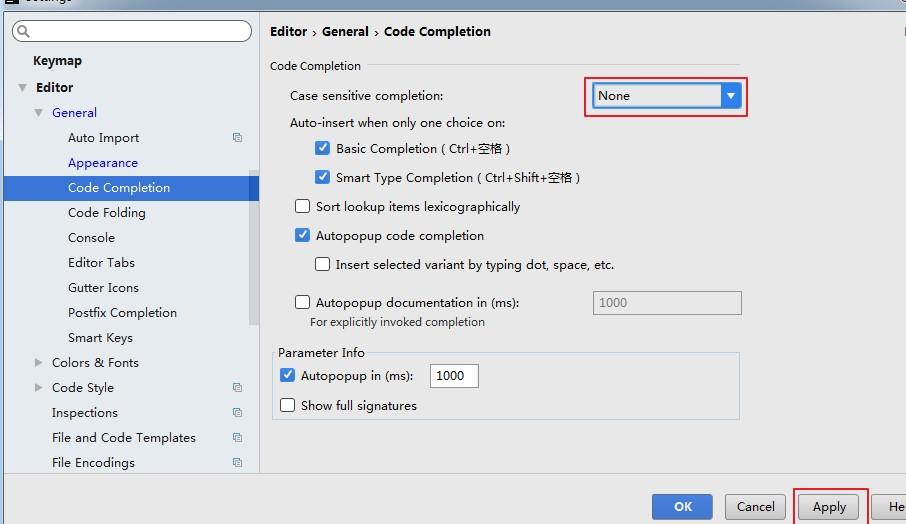

-   IntelliJ IDEA
    的代码提示和补充功能有一个特性：区分大小写。如上图标注所示，默认就是 First
    letter 区分大小写的。

-   区分大小写的情况是这样的：比如我们在 Java 代码文件中输入 stringBuffer，
    IntelliJ IDEA 默认是不会帮我们提示或是代码补充的，但是如果我们输入

    StringBuffer 就可以进行代码提示和补充。

-   如果想不区分大小写的话，改为 None 选项即可。

### 2.6 设置取消单行显示 tabs 的操作 


如上图标注所示，在打开很多文件的时候，IntelliJ IDEA 默认是把所有打开的文件名 Tab
单行显示的。但是我个人现在的习惯是使用多行，多行效率比单行高，因为单行会隐藏超过界面部分
Tab，这样找文件不方便。

2.7：修改文件后出现星号

https://blog.csdn.net/qq_41694906/article/details/95205446

## 3. Editor – Font 

### 3.1 设置默认的字体、字体大小、字体行间距 


## 4. Editor – Color Scheme 

### 4.1 修改当前主题的字体、字体大小、字体行间距(可忽略) 

如果当前主题不希望使用默认字体、字体大小、字体行间距，还可以单独设置：


### 4.2 修改当前主题的控制台输出的字体及字体大小(可忽略) 


### 4.3 修改代码中注释的字体颜色 


-   Doc Comment – Text：修改文档注释的字体颜色

-   Block comment：修改多行注释的字体颜色

-   Line comment：修改当行注释的字体颜色

## 5. Editor – Code Style 

>   **5.1** 设置超过指定 **import** 个数，改为**\* (**可忽略**)**


## 6. Editor – File and Code Templates 

### 6.1 修改类头的文档注释信息 

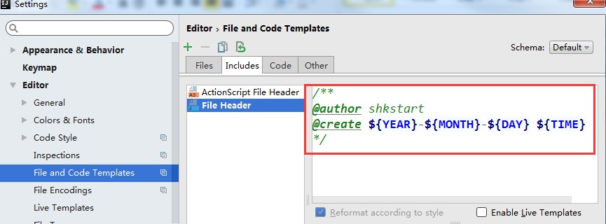

/\*\*

\@author shkstart

\@create **\${YEAR}**-**\${MONTH}**-**\${DAY} \${TIME}**

\*/

常用的预设的变量，这里直接贴出官网给的：

\${PACKAGE_NAME} - the name of the target package where the new class or
interface will be created.

\${PROJECT_NAME} - the name of the current project.

\${FILE_NAME} - the name of the PHP file that will be created.

\${NAME} - the name of the new file which you specify in the New File dialog box
during the file creation.

\${USER} - the login name of the current user.

\${DATE} - the current system date.

\${TIME} - the current system time.

\${YEAR} - the current year.

\${MONTH} - the current month.

\${DAY} - the current day of the month.

\${HOUR} - the current hour.

\${MINUTE} - the current minute.

\${PRODUCT_NAME} - the name of the IDE in which the file will be created.

\${MONTH_NAME_SHORT} - the first 3 letters of the month name. Example: Jan, Feb,
etc. \${MONTH_NAME_FULL} - full name of a month. Example: January, February,
etc.

## 7. Editor – File Encodings 

### 7.1 设置项目文件编码 


说明：Transparent native-to-ascii conversion 主要用于转换
ascii，一般都要勾选，不然 Properties 文件中的注释显示的都不会是中文。

### 7.2 设置当前源文件的编码(可忽略) 


对单独文件的编码修改还可以点击右下角的编码设置区。如果代码内容中包含中文，则会弹出如上的操作选择。其中：

①Reload
表示使用新编码重新加载，新编码不会保存到文件中，重新打开此文件，旧编码是什么依旧还是什么。

②Convert
表示使用新编码进行转换，新编码会保存到文件中，重新打开此文件，新编码是什么则是什么。

③含有中文的代码文件，Convert
之后可能会使中文变成乱码，所以在转换成请做好备份，不然可能出现转换过程变成乱码，无法还原。

##  8.Build,Execution,Deployment 

### 8.1 设置自动编译 

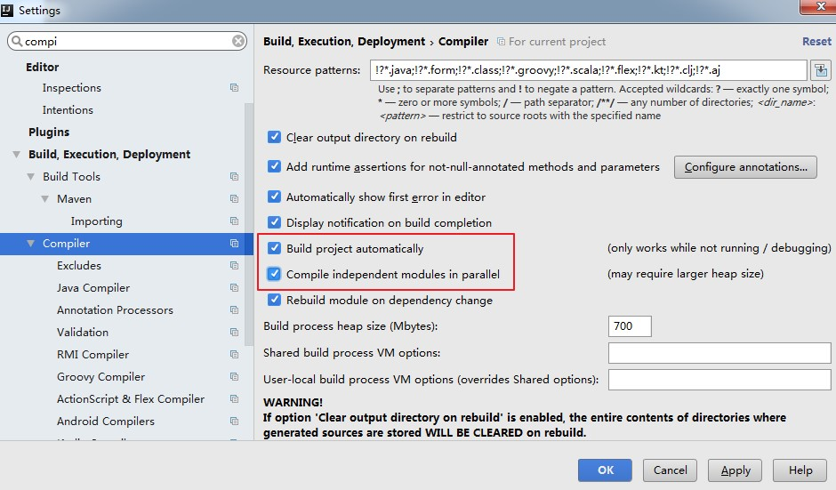

-   构建就是以我们编写的 java 代码、框架配置文件、国际化等其他资源文件、 JSP
    页面和图片等资源作为“原材料”，去“生产”出一个可以运行的项目的过程。


Intellij Idea 默认状态为不自动编译状态，Eclipse 默认为自动编译：很多朋友都是从
Eclipse 转到 Intellij 的，这常常导致我们在需要操作 class 文件时忘记对修改后的
java 类文件进行重新编译，从而对旧文件进行了操作。

### 8.2.设置为省电模式 (可忽略) 


如上图所示，IntelliJ IDEA 有一种叫做 省电模式 的状态，开启这种模式之后 IntelliJ
IDEA 会关掉代码检查和代码提示等功能。所以一般也可认为这是一种
阅读模式，如果你在开发过程中遇到突然代码文件不能进行检查和提示，可以来看看这里是否有开启该功能。

### 8.3设置代码水平或垂直显示 


# 七、关于模板(Templates) 

(Editor – Live Templates 和 Editor – General – Postfix Completion)

## 1.Live Templates(实时代码模板)功能介绍 

它的原理就是配置一些常用代码字母缩写，在输入简写时可以出现你预定义的固定模式的代码，使得开发效率大大提高，同时也可以增加个性化。最简单的例子

就是在 Java 中输入 sout 会出现 System.out.println(); 官方介绍 Live Templates：

**https://www.jetbrains.com/help/idea/using-live-templates.html**

## **2.**已有的常用模板

**Postfix Completion** 默认如下：


**Live Templates** 默认如下：

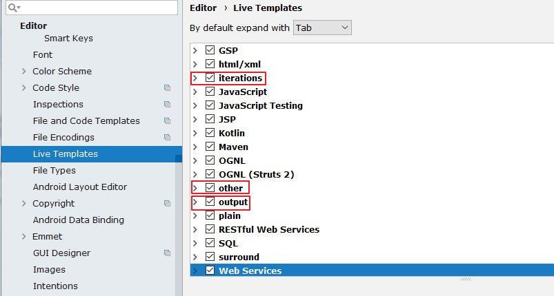

二者的区别：Live Templates 可以自定义，而 Postfix Completion
不可以。同时，有些操作二者都提供了模板，Postfix Templates 较 Live Templates 能快
0.01 秒

举例：

>   **2.1 psvm :** 可生成 **main** 方法

>   **2.2 sout : System.out.println()** 快捷输出

>   类似的：

>   soutp=System.out.println("方法形参名 = " + 形参名);
>   soutv=System.out.println("变量名 = " + 变量);
>   soutm=System.out.println("当前类名.当前方法");

>   “abc”.sout =\> System.out.println("abc");

>   **2.3 fori :** 可生成 **for** 循环

>   类似的：

>   iter：可生成增强 for 循环 itar：可生成普通 for 循环

>   **2.4 list.for :** 可生成集合 **list** 的 **for** 循环

>   List\<String\> list = new ArrayList\<String\>();

>   输入: list.for 即可输出

>   for(String s:list){

>   }

>   又如：list.fori 或 list.forr

>   **2.5 ifn**：可生成 **if(xxx = null)**

类似的：

inn：可生成 if(xxx != null) 或 xxx.nn 或 xxx.null

>   **2.6 prsf**：可生成 **private static final**

类似的：

psf：可生成 public static final psfi：可生成 public static final int
psfs：可生成 public static final String

## 3.修改现有模板:Live Templates 

如果对于现有的模板，感觉不习惯、不适应的，可以修改：修改 **1**：通过调用 psvm
调用 main 方法不习惯，可以改为跟 Eclipse 一样，使用 main 调取。


>   修改 **2**：

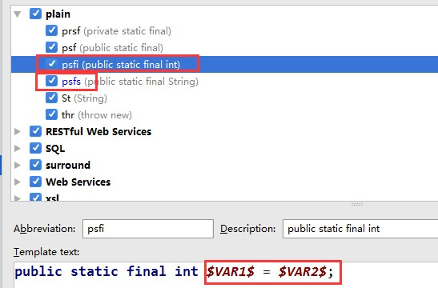

类似的还可以修改 psfs。

4.自定义模板

IDEA 提供了很多现成的 Templates。但你也可以根据自己的需要创建新的 Template。

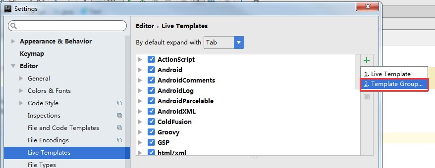

先定义一个模板的组：

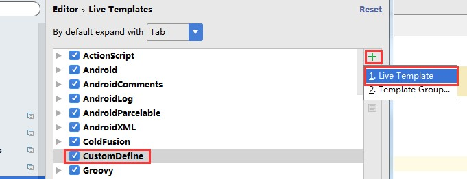

选中自定义的模板组，点击”+”来定义模板。

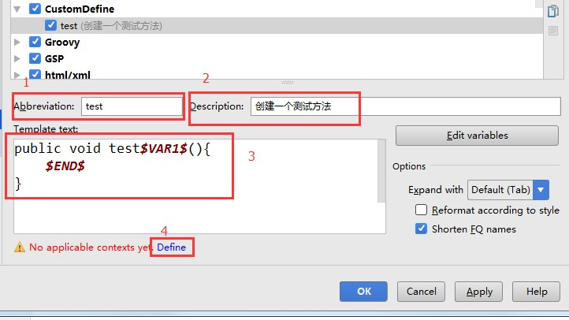

1.  Abbreviation:模板的缩略名称

2.  Description:模板的描述

3.  Template text:模板的代码片段

4.  应用范围。比如点击 Define。选择如下：

    

可以如上的方式定义个测试方法，然后在 java 类文件中测试即可。

类似的可以再配置如下的几个 Template:

1.


2.

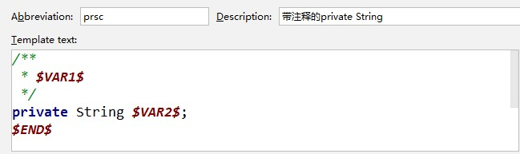

# 八、创建 Java Web Project 或 Module 

## 1. 创建的静态 Java Web 

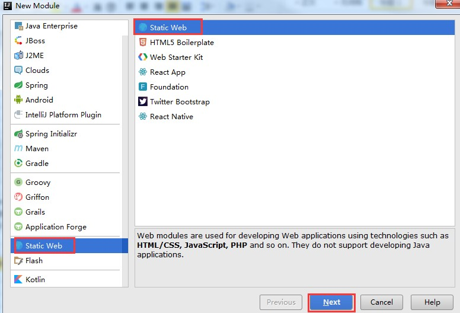


1.  创建动态的 **Java Web 2.1** 创建动态 **Web** 的 **module**

工程栏空白处 new – module:


这里一定要勾选 Web Application，才能创建一个 Web 工程。


提供 Web 工程名。这里注意修改一下 Content root 和 Module file location。

创建以后的工程结构如下：

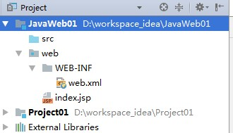

打开 index.jsp。修改为如下内容。这里你会发现 IDEA 的代码提示功能要强于

Eclipse。

## 2. 配置 **Tomcat**

在 IDEA 中配置 Tomcat 之前，需要保证已经安装并配置了 Tomcat
的环境变量。如果没有安装并配置，可以参考《尚硅谷_宋红康_Tomcat
快速部署.pdf》,配置完成以后，在命令行输入：**catalina run** 。能够启动
tomcat，则证明安装配置成功。

下面看如何在 IDEA 中配置：


点击 Edit Configurations：

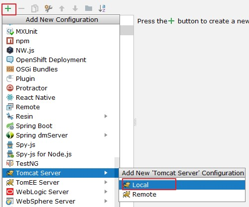

这里选择 TomEE Server 或者 Tomcat Server 都可以。接着选择 Local。

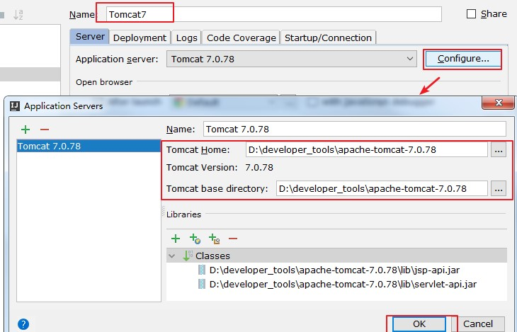

这里配置 Tomcat 的名称以及配置应用服务器的位置。根据自己 Tomcat 的安装位置决定。


其它位置使用默认值(设置要启动的浏览器以及端口号)，如上。接着部署：

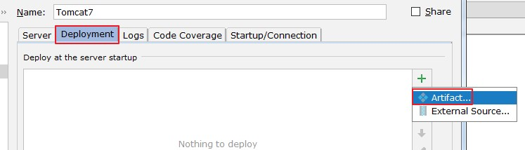

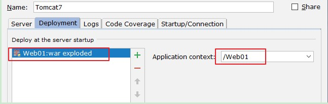

点击 OK 即可。此时：

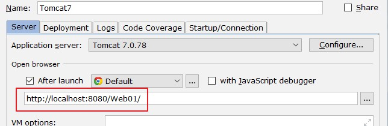

执行刚才创建的 index.jsp 即可：

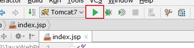

效果如下：


注意事项：显示运行以后的 Tomcat 的信息：


可以点击红框，刚点击完毕并不能马上关闭服务器，只是断开了与服务器的连接，稍后当停止按钮显示为灰色，才表示关闭。

# 九、关联数据库 

**1.**关联方式

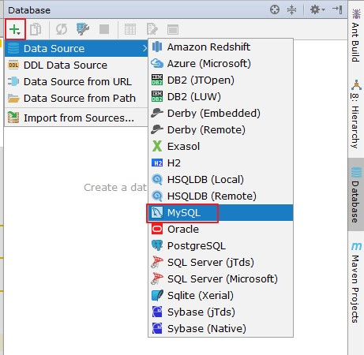

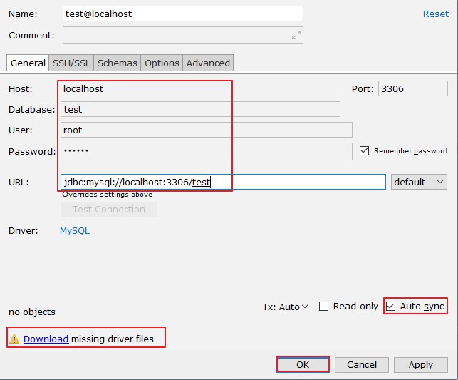

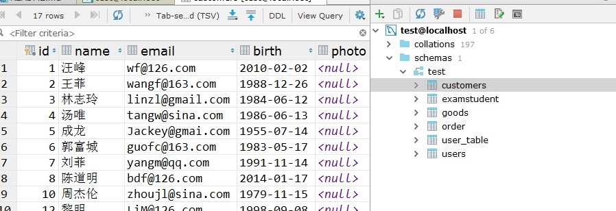

表面上很多人认为配置 Database 就是为了有一个 GUI 管理数据库功能，但是这并不是IntelliJ IDEA 的 Database 最重要特性。数据库的 GUI 工具有很多， IntelliJ IDEA 的Database 也没有太明显的优势。IntelliJ IDEA 的 Database 最大特性就是对于 Java Web
项目来讲，常使用的 ORM 框架，如 Hibernate、Mybatis 有很好的支持，比如配置好了Database 之后，IntelliJ IDEA 会自动识别 domain 对象与数据表的关系，也可以通过Database 的数据表直接生成 domain 对象等等。

**2.**常用操作


 图标 1：同步当前的数据库连接。这个是最重要的操作。配置好连接以后或通过其他工具操作数据库以后，需要及时同步。 

 图标 2：配置当前的连接。 

图标 3：断开当前的连接。  

图标 4：显示相应数据库对象的数据  

图标 5：编辑修改当前数据库对象  


连接Oracle


# 十、版本控制(Version Control) 

不管是个人开发还是团队开发，版本控制都会被使用。而 IDEA也很好的集成了版本控制的相关结构。


很多人认为 IntelliJ IDEA 自带了 SVN 或是 Git 等版本控制工具，认为只要安装了IntelliJ IDEA就可以完全使用版本控制应有的功能。这完全是一种错误的解读，IntelliJ IDEA是自带对这些版本控制工具的插件支持，但是该装什么版本控制客户端还是要照样装的。


IntelliJ IDEA对版本控制的支持是以插件化的方式来实现的。旗舰版默认支持目前主流的版本控制软件：CVS、Subversion（SVN）、Git、Mercurial、Perforce、TFS。又因为目前太多人使用 Github 进行协同或是项目版本管理，所以 IntelliJ IDEA 同时自带了 Github 插件，方便 Checkout 和管理你的 Github项目。

## 1：使用SVN

1.1：调出SVN工具窗口


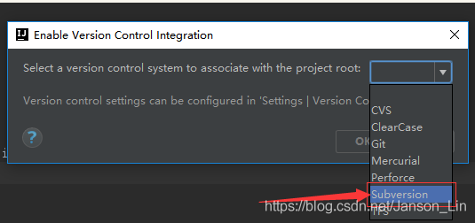


1.2：忽略文件

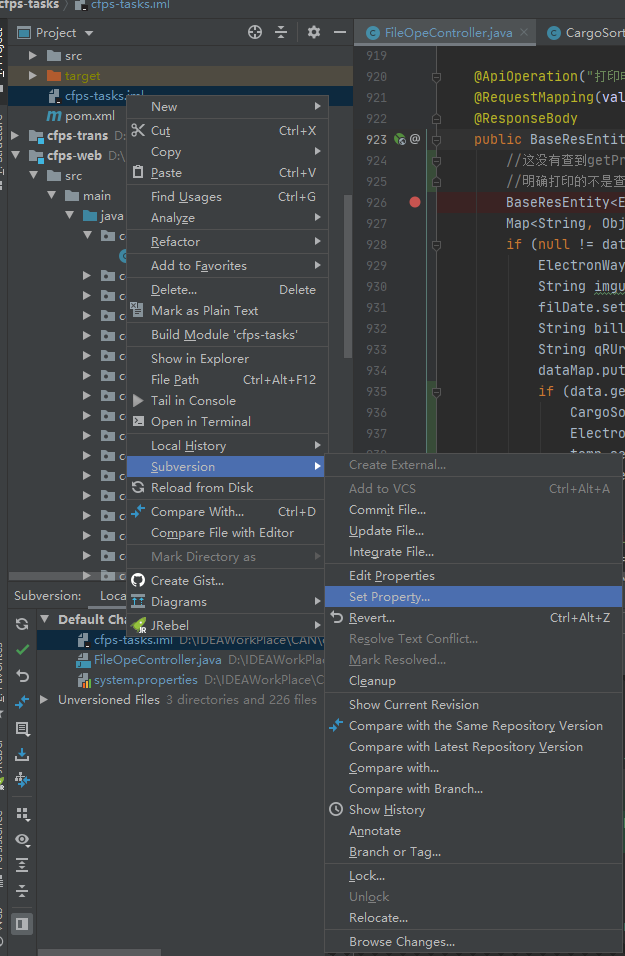

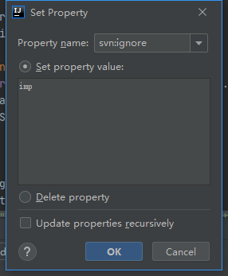

1.3 查看历史


1.4：提交代码分组

对于不同问题修改的代码进行分组，以便于后期提交。


搁置代码

会把你的代码暂时放起来


如果想找回来，去右边shelf选项卡恢复


## 2：使用GIt

### 2.1. 提前安装好 **Git** 的客户端

Git 的 msysGit
官网下载：[https://git](https://git-scm.com/)[-](https://git-scm.com/)[scm.com/](https://git-scm.com/)

Git 客户端 TortoiseGit 官网下载：http://download.tortoisegit.org/tgit/

### 2.2 关联 git.exe 

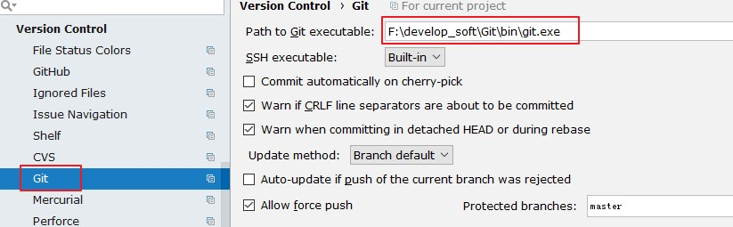

### 2.3.关联 **GitHub** 上的账户，并测试连接

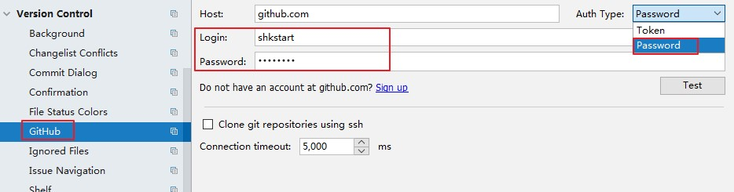

### 2.4.**在 **GitHub上创建账户下的一个新的仓库作为测试：


### 2.5. 支持从当前登录的 Github 账号上直接 Checkout 项目 


### 2.6.在 IDEA 中 clone GitHub 上的仓库： 

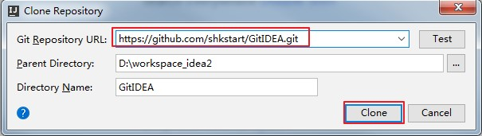

这里需要在 GitHub 的自己的账户下，复制项目仓库路径，填写到上图 GitRepository URL 中。如下：


1.  连接成功以后，会下载 **github** 上的项目


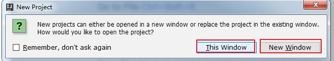

根据自己的需要，选择本窗口，还是开启一个新的窗口。

除此之外，还可以通过如下的方式连接 **GitHub**

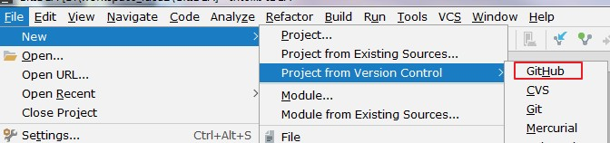

### 2.9. 本地代码分享到 GitHub 

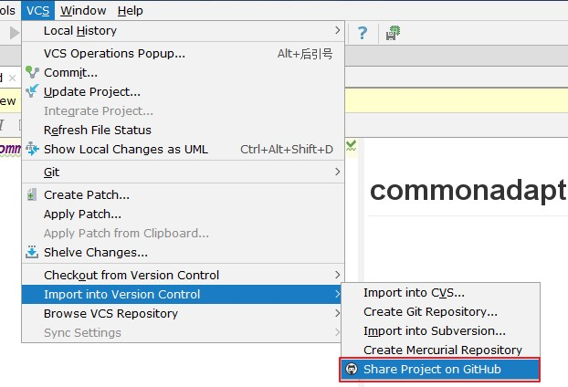

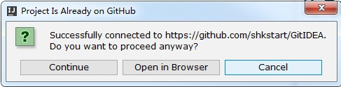

此时会在 GitHub 上创建一个新的仓库，而非更新已经存在的仓库。

### 2.10.Git 的常用操作 


clone：拷贝远程仓库 commit：本地提交 push：远程提交

pull：更新到本地

### 2.11.没有使用 **Git** 时本地历史记录的查看

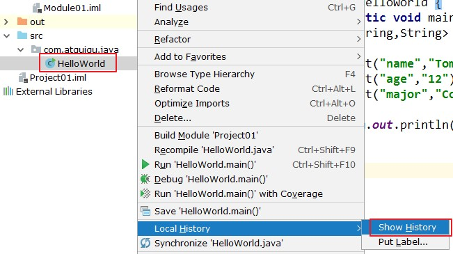


即使我们项目没有使用版本控制功能，IntelliJ IDEA 也给我们提供了本地文件历史记录。

# 十一、断点调试 

### 1. Debug 的设置 


设置 Debug 连接方式，默认是 Socket。Shared memory 是 Windows特有的一个属性，一般在 Windows 系统下建议使用此设置，内存占用相对较少。

1.1 常用断点调试快捷键

  step over 进入下一步，如果当前行断点是一个方法，则不进入当前方法体内 F8 eclipse是F6

   step into 进入下一步，如果当前行断点是一个方法，则进入当前方法体内 F7 eclipse是F5

   force step into 进入下一步，如果当前行断点是一个方法，则进入当前方法体内  

  step out 跳出  

  resume program 恢复程序运行，但如果该断点下面代码还有断点则停在下一个断点上   F9

  stop 停止 

   mute breakpoints 点中，使得所有的断点失效  

  view breakpoints 查看所有断点  

Atl +F9 运行到光标处

Alt + F8 ：debugger时选中查看值


对于常用的 Debug 的快捷键，需要大家熟练掌握。

1.2  条件断点

说明：

调试的时候，在循环里增加条件判断，可以极大的提高效率，心情也能愉悦。

具体操作：

在断点处右击调出条件断点。可以在满足某个条件下，实施断点。

查看表达式的值**(Ctrl + u)**：

选择行，ctrl + u。还可以在查看框中输入编写代码时的其他方法：


# 十二、配置 Maven 

## 1. Maven 的介绍 


>   Make -\> Ant -\> Maven -\> Gradle

Maven 是 Apache
提供的一款自动化构建工具，用于自动化构建和依赖管理。开发团队基本不用花多少时间就能自动完成工程的基础构建配置，因为
Maven 使用了一个标准的目录结构和一个默认的构建生命周期。在如下环节中，Maven
使得开发者工作变得更简单。

构建环节：


|   | 清理：表示在编译代码前将之前生成的内容删除              |
|----|---------------------------------------------------------|
|   | 编译：将源代码编译为字节码                              |
|   | 测试：运行单元测试用例程序                              |
|   | 报告：测试程序的结果                                    |
|   | 打包：将 java 项目打成 jar 包；将 Web 项目打成 war 包   |
|   | 安装：将 jar 或 war 生成到 Maven 仓库中                 |
|   | 部署：将 jar 或 war 从Maven仓库中部署到Web服务器上运行  |

## 2. Maven 的配置 

maven 的下载 – 解压 – 环境变量的配置这里就赘述了，需要的参考 1-课件中的《Maven
的配置》。下面直接整合 Maven。选择自己 Maven 的目录，和 settings
文件，然后配置自己的仓库 reposiroty。


-   Maven home directory：可以指定本地 Maven 的安装目录所在，因为我已经配置了
    M2_HOME 系统参数，所以直接这样配置 IntelliJ IDEA
    是可以找到的。但是假如你没有配置的话，这里可以选择你的 Maven
    安装目录。此外，这里不建议使用 IDEA 默认的。

-   User settings file / Local repository：我们还可以指定 Maven 的 settings.xml
    位置和本地仓库位置。

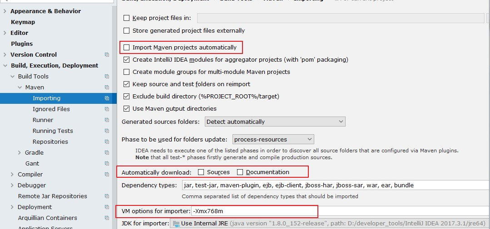

-   Import Maven projects automatically：表示 IntelliJ IDEA 会实时监控项目的
    pom.xml 文件，进行项目变动设置。

-   Automatically download：在 Maven
    导入依赖包的时候是否自动下载源码和文档。默认是没有勾选的，也不建议勾选，原因是这样可以加快项目从外网导入依赖包的速度，如果我们需要源码和文档的时候我们到时候再针对某个依赖包进行联网下载即可。IntelliJ
    IDEA

    支持直接从公网下载源码和文档的。

-   VM options for importer：可以设置导入的 VM
    参数。一般这个都不需要主动改，除非项

    目真的导入太慢了我们再增大此参数。

## 3. 创建对应的 Module 


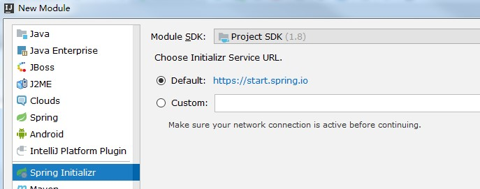

举例：此时 Spring Initalizr 是 springboot 工程的模板。

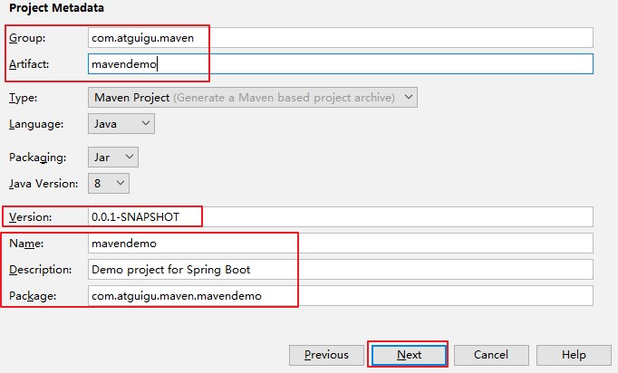

Group：组织或公司域名，倒序

Artifact：项目模块名称

Version：默认 maven 生成版本：0.0.1-SNAPSHOT


这里可以暂时先不选，后面开发需要了再进行设置。


点击 finish 即可完成创建。


创建完成以后，可以在 IDEA 右边看到创建的
Module。如果没有，可以刷新一下。目录下也会有对应的生命周期。其中常用的是：clean、compile、package、install。比如这里install，如果其他项目需要将这里的模块作为依赖使用，那就可以
install。安装到本地仓库的位置。


其他操作这里不再赘述。

# 十三、常用插件

1、CodeGlance 代码迷你缩放图插件

2、 Codota

代码提示工具，扫描你的代码后，根据你的敲击完美提示

Codota基于数百万个开源Java程序和您的上下文来完成代码行，从而帮助您以更少的错误更快地进行编码。

3、Material Theme UI

那就顺便推荐一下这个吧，超多的主题插件，各种颜色，各种模式，感兴趣的可以试一下，图我就不截了

4、Alibaba Java Coding Guidelines

阿里巴巴的编码规约检查插件

检查你的编码习惯，让你更规范


9、Json Parser json串格式化工具，不用打开浏览器了

厌倦了打开浏览器来格式化和验证JSON？为什么不安装JSON Parser并在具有脱机支持的IDE内进行呢？JSON Parser是用于验证和格式化JSON字符串的轻量级插件。安装并传播:)


11、JUnitGenerator

自动生成测试代码。


15、Translation 翻译插件 灰常牛逼


翻译中文，给接口起名字就不用费劲啦


# 十四：其他设置

## 1.生成 javadoc 

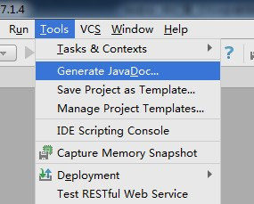


输入：

Locale：输入语言类型：zh_CN

Other command line arguments：-encoding UTF-8 -charset UTF-8

## **2.** 缓存和索引的清理

即eclipse中clean项目

IntelliJ IDEA首次加载项目的时候，都会创建索引，而创建索引的时间跟项目的文件多少成正比。在IntelliJ IDEA创建索引过程中即使你编辑了代码也是编译不了，运行不起来的，所以还是安安静静等IntelliJ IDEA 创建索引完成。

IntelliJ IDEA的缓存和索引主要是用来加快文件查询，从而加快各种查找、代码提示等操作的速度，所以IntelliJ IDEA 的索引的重要性再强调一次也不为过。但是，IntelliJ IDEA的索引和缓存并不是一直会良好地支持 IntelliJ IDEA 的，某些特殊条件下，IntelliJIDEA 的缓存和索引文件也是会损坏的，比如：断电、蓝屏引起的强制关机，当你重新打开IntelliJ IDEA，很可能 IntelliJ IDEA会报各种莫名其妙错误，甚至项目打不开，IntelliJ IDEA主题还原成默认状态。即使没有断电、蓝屏，也会有莫名奇怪的问题的时候，也很有可能是IntelliJ IDEA
缓存和索引出现了问题，这种情况还不少。遇到此类问题也不用过多担心。我们可以清理缓存和索引。如下：

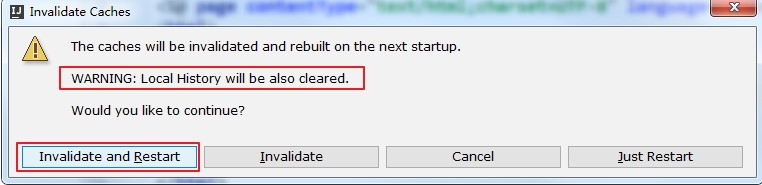

一般建议点击 Invalidate and Restart，这样会比较干净。

上图警告：清除索引和缓存会使得 IntelliJ IDEA 的 Local History丢失。所以如果你项目没有加入到版本控制，而你又需要你项目文件的历史更改记录，那你最好备份下你的LocalHistory 目 录 。 目 录 地 址 在 ： C:\\Users\\ 当 前 登 录 的 系 统 用户 名\.IntelliJIdea14\\system\\LocalHistory建议使用硬盘的全文搜索，这样效率更高。

通过上面方式清除缓存、索引本质也就是去删除 C 盘下的 system目录下的对应的文件而已，所以如果你不用上述方法也可以删除整个 system。当IntelliJ IDEA 再次启动项目的时候会重新创建新的 system 目录以及对应项目缓存和索引。

## **3.**取消更新


取消勾选：即可取消更新

## **4.**插件的使用

在 IntelliJ IDEA 的安装讲解中我们其实已经知道，IntelliJ IDEA本身很多功能也都是通过插件的方式来实现的。

官网插件库：https://plugins.jetbrains.com/

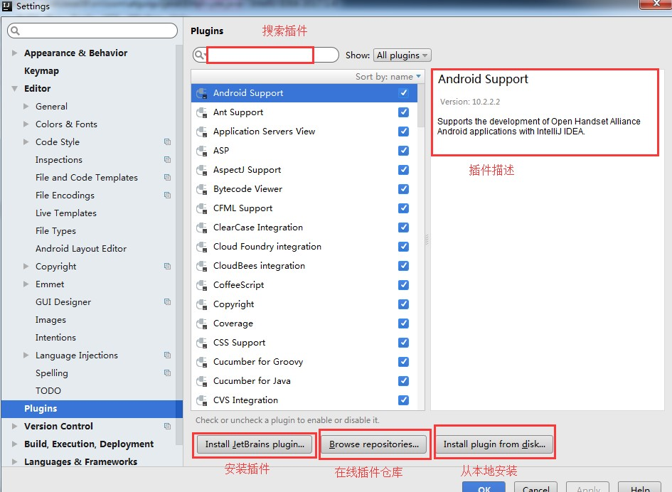

-   Install JetBrains plugin：弹出 IntelliJ IDEA
    公司自行开发的插件仓库列表，供下载安装。

-   Browse repositories：弹出插件仓库中所有插件列表供下载安装。

-   Install plugin from
    disk：浏览本地的插件文件进行安装，而不是从服务器上下载并安装。

需要特别注意的是：在国内的网络下，经常出现显示不了插件列表，或是显示了插件列表，无法下载完成安装。这时候请自行打开
VPN，一般都可以得到解决。

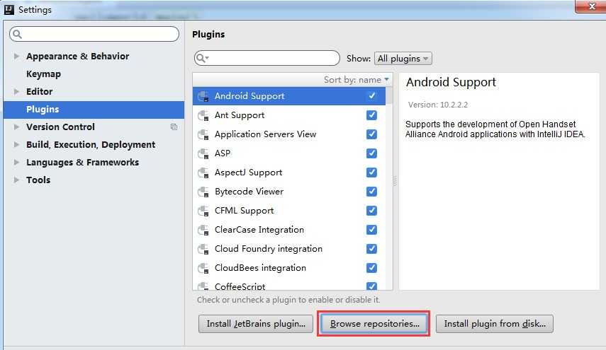


如上图演示，在线安装 IntelliJ IDEA
插件库中的插件。安装完以后会提示重启，才可以使用插件。

常用插件推荐：

| 插件名称                 | 插件介绍                                                                             | 官网地址                                                                                                  |
|--------------------------|--------------------------------------------------------------------------------------|-----------------------------------------------------------------------------------------------------------|
| 插件名称                 | 插件介绍                                                                             | 官网地址                                                                                                  |
| Key promoter             | 快捷键提示                                                                           | <https://plugins.jetbrains.com/plugin/4455?pr=idea> [](https://plugins.jetbrains.com/plugin/4455?pr=idea) |
| CamelCase                | 驼峰式命名和下划线命名交替变化                                                       | <https://plugins.jetbrains.com/plugin/7160?pr=idea> [](https://plugins.jetbrains.com/plugin/7160?pr=idea) |
| CheckStyle-IDEA          | 代码样式检查                                                                         | <https://plugins.jetbrains.com/plugin/1065?pr=idea> [](https://plugins.jetbrains.com/plugin/1065?pr=idea) |
| FindBugs-IDEA            | 代码 Bug 检查                                                                        | <https://plugins.jetbrains.com/plugin/3847?pr=idea> [](https://plugins.jetbrains.com/plugin/3847?pr=idea) |
| Statistic                | 代码统计                                                                             | <https://plugins.jetbrains.com/plugin/4509?pr=idea> [](https://plugins.jetbrains.com/plugin/4509?pr=idea) |
| JRebel Plugin            | 热部署                                                                               | <https://plugins.jetbrains.com/plugin/?id=4441> [](https://plugins.jetbrains.com/plugin/?id=4441)         |
| CodeGlance               | 在编辑代码最右侧，显示一块代码小地图                                                 | <https://plugins.jetbrains.com/plugin/7275?pr=idea> [](https://plugins.jetbrains.com/plugin/7275?pr=idea) |
| Eclipse Code  Formatter  | 使用 Eclipse 的代码格式化风格，在一个团队中如果公司有规定格式化风格，这个可以使用。  | <https://plugins.jetbrains.com/plugin/6546?pr=idea> [](https://plugins.jetbrains.com/plugin/6546?pr=idea) |
| GsonFormat               | 把 JSON 字符串直接实例化成类                                                         | <https://plugins.jetbrains.com/plugin/7654?pr=idea> [](https://plugins.jetbrains.com/plugin/7654?pr=idea) |


## 5：热部署插件jrebel

安装

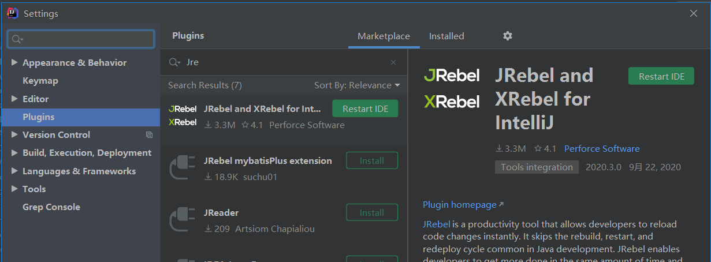


提示Enable jrebel点击使用


激活：

1、点此链接生成guid： https://www.guidgen.com/ 复制生成的guid

2：选择第一个选项 Team URL

 在第一个空白地址中填写：

https://jrebel.qekang.com/+生成的guid

第二个选项则填写你自己的邮箱即可

然后选择同意接受协议等等


3：然后继续点击右侧的 JRebel setup guide

4：设置自动编译


5：设置运行时编译


6：修改后手动更新ctrl+shift +F9


以后就不要再使用debug启动了，使用Jrebel debug启动即可。


每次修改需要部署时，手动启动

ctrl+shift +F9


## 6：MybatisCodeHelper

下载：蓝奏云("https://borber.lanzous.com/b0cq9t1jc") 密码:6llf

然后直接拖拽进IDEA，重启IDEA

按照一下方法激活即可


使用：

1：根据实体类生成建表语句


2：根据表生成bean，mapper.xml

连接数据库，打开DataBase窗口，选择要生成的代码对应的表，右键


3：点击小鸟可实现Dao与mapper.xml文件的跳转


## 6：自定义控制台高亮插件Grep Console

安装插件


设置如下：


添加运行配置


## 7：IDEA类和方法注释模板设置

https://blog.csdn.net/xiaoliulang0324/article/details/79030752

1：类的注释

File-->settings-->Editor-->File and Code Templates-->Files

我们选择Class文件（当然你要设置接口的还也可以选择Interface文件）

${NAME}：设置类名，与下面的${NAME}一样才能获取到创建的类名

TODO：代办事项的标记，一般生成类或方法都需要添加描述

${USER}、${DATE}、${TIME}：设置创建类的用户、创建的日期和时间，这些事IDEA内置的方法，还有一些其他的方法在绿色框标注的位置，比如你想添加项目名则可以使用${PROJECT_NAME}


2：设置方法注释模板

File-->Settings-->Editor-->Live Templates

点击右侧新建组，命名为userDefine


然后新建Live Template

命名为*

添加描述add comments for methods

修改生成注释的快捷键为Enter

设置模板

```xml
*
* Author xqc
* Date $time$ $date$
* Param $param$
* Throws 
* Return $return$
**/
```


设置模板应用场景

点击模板页面最下方的警告，来设置将模板应用于那些场景，一般选择EveryWhere-->Java即可

（如果曾经修改过，则显示为change而不是define）


设置参数的获取方式

选择右侧的Edit variables按钮

PS:第五步和第六步顺序不可颠倒，否则第六步将获取不到方法


选择每个参数对应的获取方法（在下拉选择框中选择即可），网上有很多教程说获取param时使用脚本的方式，我试过使用脚本

的方式不仅麻烦而且只能在方法内部使用注释时才能获取到参数

