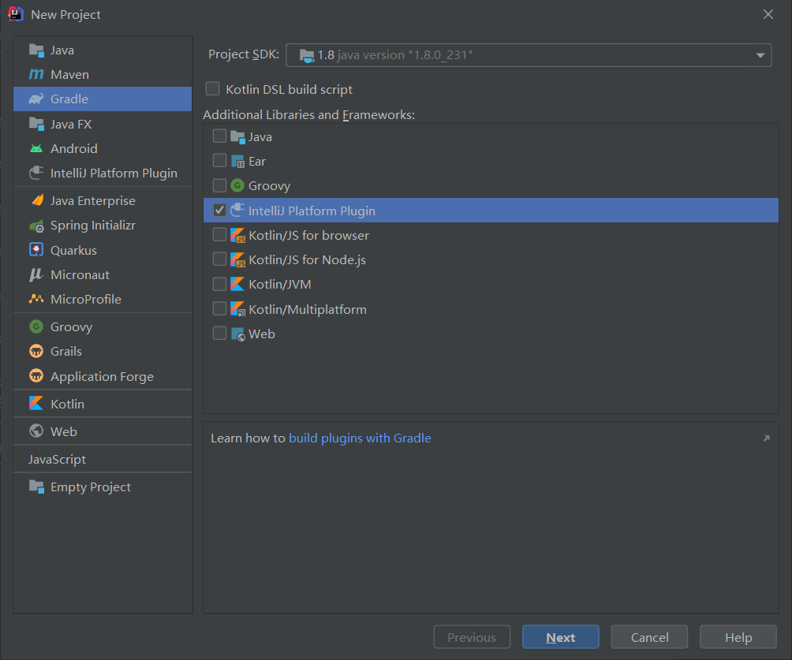
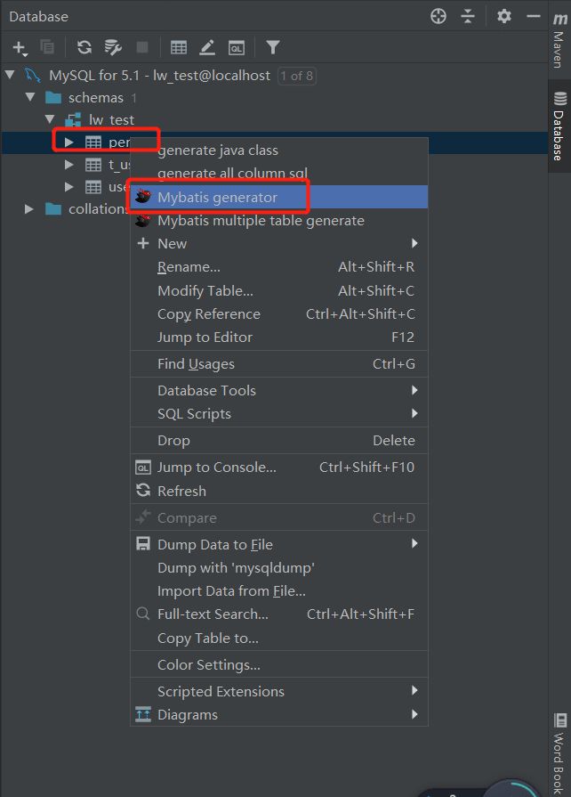
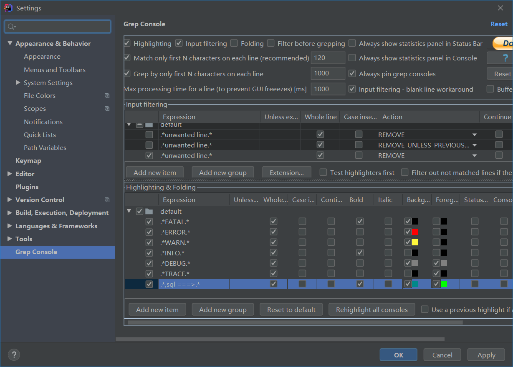
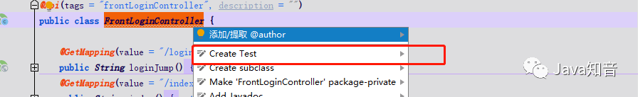
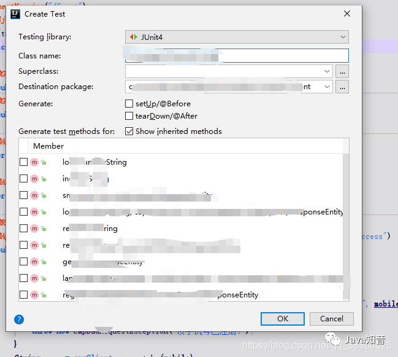
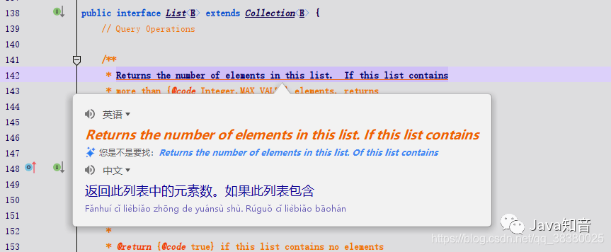
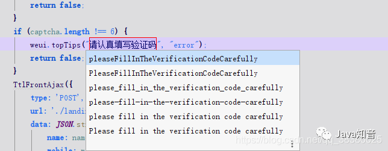

# 开发插件

新建项目：



推荐使用社区版的IDEA，这样可以阅读IDEA的源码：

版本配置

1：gradle配置

```gradle
//默认会整成最新的JDk，这样导致有的项目不能用
sourceCompatibility = 1.8
//默认会整成最新的IDEA才能用，定义一个老一点的版本
intellij{
	version='2017.3'
	updateSinceUntilBuild=false
}
```

2：插件配置

resource-MATE-INF目录下的plugin.xml

具体看下边

3：打包成一个zip压缩包，

自己的话自己从硬盘上安装就可以了

4：发布上传

插件官网：https://plugins.jetbrains.com/

注册账号进行登录

直接点击自己头像下的upload plugin，然后选择刚打包好的zip文件

上传后，人家官方审核，审核通过即可从插件库下载到；

## 1：给插件设置图标

在MATE-INF 文件夹下新建pluginicorn.svg ，名称固定，

## 2：配置

```xml
<!--兼容性配置-->
<idea-version since-build="171.0"></idea-version>
<description>
</description>
```


# 插件推荐

## 热部署插件 jrebel

1：安装并重启


2：提示 Enable jrebel 点击使用，根据设置导航进行设置


3：激活

（1）：点此链接生成 guid： https://www.guidgen.com/ 复制生成的 guid

（2）：选择第一个选项 Team URL

在第一个空白地址中填写：

```txt
https://jrebel.qekang.com/+生成的guid
```

第二个选项则填写你自己的邮箱即可

然后选择同意接受协议等等

4：然后继续点击右侧的 JRebel setup guide

5：设置自动编译


6：设置运行时编译

7：修改后手动更新 ctrl+shift +F9

以后就不要再使用 debug 启动了，使用 Jrebel debug 启动即可。


## MybatisCodeHelper

下载：蓝奏云("https://borber.lanzous.com/b0cq9t1jc") 密码:6llf

然后直接拖拽进 IDEA，重启 IDEA

按照以下方法激活即可


使用：

1：根据实体类生成建表语句

2：根据表生成 bean，mapper.xml

连接数据库，打开 DataBase 窗口，选择要生成的代码对应的表，右键



3：点击小鸟可实现 Dao 与 mapper.xml 文件的跳转

## Grep Console

安装插件


设置如下：



我是配合打印SQL语句，这样直观；如果你还不知道如何打印SQL语句，可以参考我的文章

## SonarLint

这个插件是配合SonarQube代码质量管理平台进行使用的，不过如果你的团队没有进行代码质量管理，你也可以安装此插件自己使用，进行代码质量管理的自检。安装上即可使用，如果想在团队进行SonarQube质量管理，可以再进行SonarQube配置。


添加运行配置


## FindBug或IDEA QAPlug

FindBug新版不能用了，用spotBugs代替，帮助寻找潜在的Bug


## SequenceDiagram

调用链路自动生成时序图

双击顶部的类名可以跳转到对应类的源码中，双击调用的函数名可以直接调入某个函数的源码。


## Statistic

代码统计


## Maven Helper

帮助解决Maven冲突


## CamelCase

驼峰式命名和下划线命名交替变化


## CodeGlance

代码迷你缩放图插件

2、 Codota

代码提示工具，扫描你的代码后，根据你的敲击完美提示

Codota 基于数百万个开源 Java 程序和您的上下文来完成代码行，从而帮助您以更少的错误更快地进行编码。

3、Material Theme UI

那就顺便推荐一下这个吧，超多的主题插件，各种颜色，各种模式，感兴趣的可以试一下，图我就不截了

4、Alibaba Java Coding Guidelines

阿里巴巴的编码规约检查插件

检查你的编码习惯，让你更规范

9、Json Parser json 串格式化工具，不用打开浏览器了

厌倦了打开浏览器来格式化和验证 JSON？为什么不安装 JSON Parser 并在具有脱机支持的 IDE 内进行呢？JSON Parser 是用于验证和格式化 JSON 字符串的轻量级插件。安装并传播:)

11、JUnitGenerator

Ctrl + Shift + T

自动生成测试代码。





15、Translation 翻译插件 灰常牛逼



翻译中文，给接口起名字就不用费劲啦




