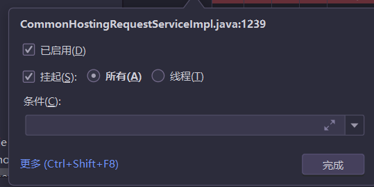
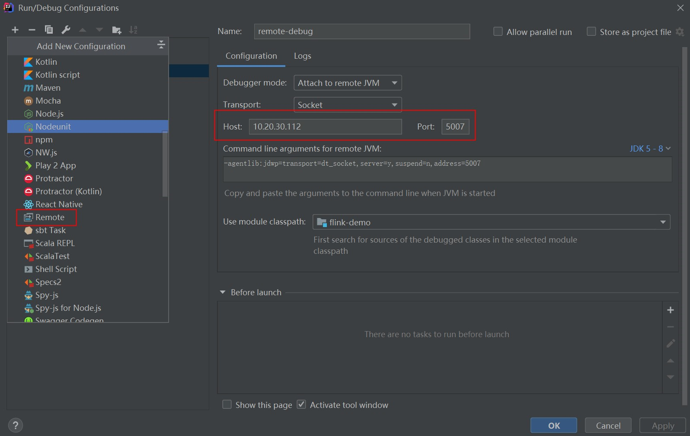

# 一、IntelliJIDEA

主要优势：

强大的整合能力。比如：Git、Maven、Spring 等

提示功能的快速、便捷

提示功能的范围广

好用的快捷键和代码模板 private static final psf

精准搜索


下载地址：

https://www.jetbrains.com/idea/download/

历史版本：https://www.jetbrains.com/idea/download/other.html

IDEA 分为两个版本：旗舰版**(Ultimate)**和社区版**(Community)**。

旗舰版收费(限 30 天免费试用)，社区版免费，这和 Eclipse 有很大区别。

这里提供了不同操作系统下的两个不同版本的安装文件。

两个不同版本的详细对比，可以参照官网：

<https://www.jetbrains.com/idea/features/editions_comparison_matrix.html>

使用文档：

[https://www.jetbrains.com/help/idea/meet](https://www.jetbrains.com/help/idea/meet-intellij-idea.html)[-](https://www.jetbrains.com/help/idea/meet-intellij-idea.html)[intellij](https://www.jetbrains.com/help/idea/meet-intellij-idea.html)[-](https://www.jetbrains.com/help/idea/meet-intellij-idea.html)[idea.html](https://www.jetbrains.com/help/idea/meet-intellij-idea.html)

# 二、安装

## 1：安装

具体安装步骤可参考系统重装篇

## 2：目录结构

bin：容器，执行文件和启动参数等 help：快捷键文档和其他帮助文档

jre64：64 位 java 运行环境

lib：idea 依赖的类库

license：各个插件许可

plugin：插件

其中：bin 目录下：

idea.exe.vmoptions：32位的IDEA的VM配置文件

idea.properties：属性配置文件

idea64.exe.vmoptions：64位IDEA的VM配置文件

这里以我的电脑系统(64 位 windows7，16G 内存)为例，说明一下如何调整 VM 配置文件：

```properties
-Xms4096m
-Xmx8192m
-XX:ReservedCodeCacheSize=1024m
-XX:+UseG1GC
-XX:SoftRefLRUPolicyMSPerMB=50
-XX:CICompilerCount=2
-XX:+HeapDumpOnOutOfMemoryError
-XX:-OmitStackTraceInFastThrow
-ea
-Dsun.io.useCanonCaches=false
-Djdk.http.auth.tunneling.disabledSchemes=""
-Djdk.attach.allowAttachSelf=true
-Djdk.module.illegalAccess.silent=true
-Dkotlinx.coroutines.debug=off
```

1.  大家根据电脑系统的位数，选择 32 位的 VM 配置文件或者 64 位的 VM 配置文件

2.  32 位操作系统内存不会超过 4G，所以没有多大空间可以调整，建议不用调整了

3.  64 位操作系统中 8G 内存以下的机子或是静态页面开发者是无需修改的。

4.  64 位操作系统且内存大于 8G 的，如果你是开发大型项目、Java 项目或是 Android
    项目，建议进行修改，常修改的就是下面 3 个参数：

\-Xms128m，16 G 内存的机器可尝试设置为 -Xms512m (设置初始的内存数，增加该值可以提高 Java 程序的启动速度。)

-Xmx750m，16 G 内存的机器可尝试设置为 -Xmx1500m (设置最大内存数，提高该值，可以减少内存 Garage 收集的频率，提高程序性能)

-XX:ReservedCodeCacheSize=240m，16G 内存的机器可尝试设置为 -XX:ReservedCodeCacheSize=500m (保留代码占用的内存容量)

## 3：设置目录结构

C:\用户\admin\.IntelliJIdea2021.1

这是 IDEA 的各种配置的保存目录。这个设置目录有一个特性，就是你删除掉整个目录之后，重新启动 IntelliJ IDEA 会再自动帮你生成一个全新的默认配置，所以很多时候如果你把 IntelliJIDEA 配置改坏了，没关系，删掉该目录，一切都会还原到默认。

### config 目录

config 目录是 IntelliJ IDEA 个性化化配置目录，或者说是整个 IDEA 设置目录。此目录可看成是最重要的目录，没有之一，IntelliJ IDEA a 安装时会自动扫描硬盘上的旧配置目录，指的就是该目录。

这个目录主要记录了：IDEA 主要配置功能、自定义的代码模板、自定义的文件模板、自定义的快捷键、Project 的 tasks 记录等等个性化的设置。 

### system 目录

system 目录是 IntelliJ IDEA 系统文件目录，是 IntelliJ IDEA 与开发项目一个桥梁目录，里面主要有：缓存、索引、容器文件输出等等，虽然不是最重要目录，但也是最不可或缺的目录之一。

# 三、创建项目

## 创建 Java 工程

Create New Project:创建一个新的工程

Import Project:导入一个现有的工程

Open:打开一个已有工程。比如：可以打开 Eclipse 项目。

Check out from Version Control:可以通过服务器上的项目地址 check out Github 上面项目或其他 Git 托管服务器上的项目


这里选择 Create New Project，需要明确一下概念：

IntelliJ IDEA 没有类似 Eclipse 的工作空间的概念（Workspaces），最大单元就是 Project。这里可以把 Project 理解为 Eclipse 中的 Workspace。

选择指定目录下的 JDK 作为 Project SDK。

如果要创建 Web 工程，则需要勾选上面的 Web Application。如果不需要创建 Web工程的话，则不需要勾选。这里先不勾选，只是创建简单的 Java 工程。

其中，选择 New：选择 jdk 的安装路径所在位置：

点击 OK 以后，选择 Next

## 创建模块(Module)

在 Eclipse 中我们有 Workspace（工作空间）和 Project（工程）的概念，在 IDEA 中只有 Project（工程）和 Module（模块）的概念。

从 Eclipse 转过来的人总是下意识地要在同一个窗口管理 n 个项目，这在 IntelliJ IDEA 是无法做到的。IntelliJ IDEA 提供的解决方案是打开多个项目实例，即打开多个项目窗口。即：一个 Project 打开一个 Window 窗口。

在 IntelliJ IDEA 中 Project 是最顶级的级别，次级别是 Module。一个 Project 可以有多个 Module。目前主流的大型项目都是分布式部署的，结构都是类似这种多 Module 结构。


这类项目一般是这样划分的，比如：core Module、web Module、plugin Module、 solrModule 等等，模块之间彼此可以相互依赖。通过这些 Module 的命名也可以看出，他们之间都是处于同一个项目业务下的模块，彼此之间是有不可分割的业务关系的。举例：

相比较于多 Module 项目，小项目就无需搞得这么复杂。只有一个 Module 的结构 IntelliJ IDEA 也是支持的，并且 IntelliJ IDEA 创建项目的时候，默认就是单 Module 的结构的。下面，我们演示如何创建 Module:

接着选择 Next:

之后，我们可以在 Module 的 src 里写代码，此时 Project 工程下的 src
就没什么用了。可以删掉。

## 查看项目配置

File——Project Structure

进入项目结构：


# 四、常用配置

IntelliJ IDEA 有很多人性化的设置我们必须单独拿出来讲解，也因为这些个性化的设置让那些 IntelliJIDEA 死忠粉更加死心塌地使用它和分享它。

## 1：导入导出配置

如果重装了IDEA，避免重新将以前的东西重新再配置一遍，可已经原本的配置导出，然后在新的IDEA中进行导入；

File ——>Manage IDE Setting

你可以选择导出，或则导入或者加载公司的设置库，或者同步到IDEA账号；

## 2、设置快捷键(Keymap)

1. 设置快捷为 Eclipse 的快捷键、
2. 通过快捷键功能修改快捷键设置


3.通过指定快捷键，查看或修改其功能


## 3：常用快捷键

官方参考手册位置：file:///D:/IntelliJIDEA/install/IntelliJ%20IDEA%202020.1.2/help/ReferenceCard.pdf

| 快捷键             | 功能                                            |
| ------------------ | ----------------------------------------------- |
| Alt+Enter          | 导入包，自动修正代码                            |
| Ctrl+Y             | 删除光标所在行                                  |
| Ctrl+D             | 复制光标所在行的内容，插入光标位置下面          |
| Ctrl+/             | 单行注释                                        |
| Ctrl+Shift+/       | 选中代码注释，多行注释，再按取消注释            |
| Ctrl+Alt+L         | 格式化代码                                      |
| Alt+Ins            | 自动生成代码，toString，get，set 等方法         |
| Alt+Shift+上下箭头 | 移动当前代码行                                  |
| **shift+enter**    | 向下开始新的一行                                |
| **ctrl+o**         | 查看类的结构：类似于 **eclipse** 的 **outline** |
| **double Shift**   | 查找文件                                        |
| ctrl + F           | 文件内搜索                                      |
| ctrl + shift + F   | 全局搜索                                        |
| ctrl + R           | 替换                                            |
| Ctrl + Shift + R   | 全局替换                                        |
| ctrl+alt+v         | 提取方法返回值                                  |
| Ctrl +E            | 页面切换                                        |
| Ctrl+Alt+C         | 抽取静态变量                                    |
| Ctrl + Alt + M     | 抽取方法                                        |
| “test”.sout + Tab  | 快速输出                                        |
| "test".r           | 快速返回                                        |
| “test”.null        | 快速判空                                        |
| Ctrl + F8          | 打上或取消断点                                  |
| Ctrl + +/-         | 折叠或展开方法                                  |
|                    |                                                 |
|                    |                                                 |
|                    |                                                 |
|                    |                                                 |
|                    |                                                 |

## 4：插件

设置 IDEA 的各种插件，可以选择自定义设置、删除，或者安装本身不存在的插件（比如：支持 Scala 的插件）。可以通过界面菜单栏的 settings 进行设置。

IDEA 插件官方下载地址：https://plugins.jetbrains.com/idea

## 5：设置显示常见的视图


调出工具条和按钮组

## 6：工程界面展示


- 工程下的 src 类似于 Eclipse 下的 src 目录，用于存放代码。

- 工程下的.idea 和 project01.iml 文件都是 IDEA 工程特有的。类似于 Eclipse
  工程下的.settings、.classpath、.project 等。

## 7：Setting


### 1.1：xml 文件的颜色，空格时显示混乱


### 1.2：错误提示不及时

1.开启了节省电源的问题file》power save mode 点一下把前边的勾去掉 

2.有缓存问题file》invalidateCaches/Restart


### 忽略大小写提示


### 设置取消单行显示 tabs 的操作


如上图标注所示，在打开很多文件的时候，IntelliJ IDEA 默认是把所有打开的文件名 Tab单行显示的。但是我个人现在的习惯是使用多行，多行效率比单行高，因为单行会隐藏超过界面部分Tab，这样找文件不方便。

2.7：修改文件后出现星号

https://blog.csdn.net/qq_41694906/article/details/95205446

### 修改类头的文档注释信息


```txt
/**
* @ProjectName: ${PROJECT_NAME}
* @Package: ${PACKAGE_NAME}
* @Author: XQC
* @CreateDate: ${DATE} ${TIME}
* @Description: note
* @UpdateRemark: The modified content
* Copyright © ${YEAR} XQC. All Right Revealed
**/
```


常用的预设的变量，这里直接贴出官网给的：

\${PACKAGE_NAME} - the name of the target package where the new class or
interface will be created.

\${PROJECT_NAME} - the name of the current project.

\${FILE_NAME} - the name of the PHP file that will be created.

\${NAME} - the name of the new file which you specify in the New File dialog box
during the file creation.

\${USER} - the login name of the current user.

\${DATE} - the current system date.

\${TIME} - the current system time.

\${YEAR} - the current year.

\${MONTH} - the current month.

\${DAY} - the current day of the month.

\${HOUR} - the current hour.

\${MINUTE} - the current minute.

\${PRODUCT_NAME} - the name of the IDE in which the file will be created.

\${MONTH_NAME_SHORT} - the first 3 letters of the month name. Example: Jan, Feb,
etc. \${MONTH_NAME_FULL} - full name of a month. Example: January, February,
etc.

### 编码

https://www.cnblogs.com/votory/p/12283176.html

# 七、关于模板(Templates)

(Editor – Live Templates 和 Editor – General – Postfix Completion)

## Live Templates功能介绍

它的原理就是配置一些常用代码字母缩写，在输入简写时可以出现你预定义的固定模式的代码，使得开发效率大大提高，同时也可以增加个性化。最简单的例子

就是在 Java 中输入 sout 会出现 System.out.println(); 官方介绍 Live Templates：

**https://www.jetbrains.com/help/idea/using-live-templates.html**

## **2.**已有的常用模板

**Postfix Completion** 默认如下：


**Live Templates** 默认如下：


二者的区别：Live Templates 可以自定义，而 Postfix Completion不可以。同时，有些操作二者都提供了模板，Postfix Templates 较 Live Templates 能快0.01 秒

## 修改现有模板:Live Templates

如果对于现有的模板，感觉不习惯、不适应的，可以修改：修改 **1**：通过调用 psvm调用 main 方法不习惯，可以改为跟 Eclipse 一样，使用 main 调取。


自定义模板

IDEA 提供了很多现成的 Templates。但你也可以根据自己的需要创建新的 Template。


先定义一个模板的组：


选中自定义的模板组，点击”+”来定义模板。


1.  Abbreviation:模板的缩略名称

2.  Description:模板的描述

3.  Template text:模板的代码片段

4.  应用范围。比如点击 Define。选择如下：


可以如上的方式定义个测试方法，然后在 java 类文件中测试即可。

类似的可以再配置如下的几个 Template:


# 九、关联数据库

1：连接mysql


表面上很多人认为配置 Database 就是为了有一个 GUI 管理数据库功能，但是这并不是 IntelliJ IDEA 的 Database 最重要特性。数据库的 GUI 工具有很多， IntelliJ IDEA 的 Database 也没有太明显的优势。IntelliJ IDEA 的 Database 最大特性就是对于 Java Web
项目来讲，常使用的 ORM 框架，如 Hibernate、Mybatis 有很好的支持，比如配置好了 Database 之后，IntelliJ IDEA 会自动识别 domain 对象与数据表的关系，也可以通过 Database 的数据表直接生成 domain 对象等等。

2：连接 Oracle


# 十、版本控制

不管是个人开发还是团队开发，版本控制都会被使用。而 IDEA 也很好的集成了版本控制的相关结构。


很多人认为 IntelliJ IDEA 自带了 SVN 或是 Git 等版本控制工具，认为只要安装了 IntelliJ IDEA 就可以完全使用版本控制应有的功能。这完全是一种错误的解读，IntelliJ IDEA 是自带对这些版本控制工具的插件支持，但是该装什么版本控制客户端还是要照样装的。

IntelliJ IDEA 对版本控制的支持是以插件化的方式来实现的。旗舰版默认支持目前主流的版本控制软件：CVS、Subversion（SVN）、Git、Mercurial、Perforce、TFS。又因为目前太多人使用 Github 进行协同或是项目版本管理，所以 IntelliJ IDEA 同时自带了 Github 插件，方便 Checkout 和管理你的 Github 项目。

## 1：使用 SVN

1.1：调出 SVN 工具窗口


1.2：忽略文件


1.3 查看历史


1.4：提交代码分组

对于不同问题修改的代码进行分组，以便于后期提交。


搁置代码

会把你的代码暂时放起来


如果想找回来，去右边 shelf 选项卡恢复


## 2：使用 GIt

2.1. 提前安装好 **Git** 的客户端

Git 的 msysGit官网下载：[https://git](https://git-scm.com/)[-](https://git-scm.com/)[scm.com/](https://git-scm.com/)

Git 客户端 TortoiseGit 官网下载：http://download.tortoisegit.org/tgit/

2.2 关联 git.exe


2.3.关联 **GitHub** 上的账户，并测试连接


2.4.**在 **GitHub 上创建账户下的一个新的仓库作为测试：

2.5. 支持从当前登录的 Github 账号上直接 Checkout 项目


2.6.在 IDEA 中 clone GitHub 上的仓库：


这里需要在 GitHub 的自己的账户下，复制项目仓库路径，填写到上图 GitRepository URL 中。

根据自己的需要，选择本窗口，还是开启一个新的窗口。

除此之外，还可以通过如下的方式连接 **GitHub**


2.9. 本地代码分享到 GitHub


此时会在 GitHub 上创建一个新的仓库，而非更新已经存在的仓库。

2.10.Git 的常用操作

clone：拷贝远程仓库 commit：本地提交 push：远程提交

pull：更新到本地

2.11.没有使用 **Git** 时本地历史记录的查看


即使我们项目没有使用版本控制功能，IntelliJ IDEA 也给我们提供了本地文件历史记录。

# 十一、断点调试

## Debug 的设置


设置 Debug 连接方式，默认是 Socket。Shared memory 是 Windows 特有的一个属性，一般在 Windows 系统下建议使用此设置，内存占用相对较少。

1.1 常用断点调试快捷键

step over 进入下一步，如果当前行断点是一个方法，则不进入当前方法体内 F8 eclipse 是 F6

 step into 进入下一步，如果当前行断点是一个方法，则进入当前方法体内 F7 eclipse 是 F5

force step into 进入下一步，如果当前行断点是一个方法，则进入当前方法体内

step out 跳出

 resume program 恢复程序运行，但如果该断点下面代码还有断点则停在下一个断点上 F9

stop 停止

mute breakpoints 点中，使得所有的断点失效

view breakpoints 查看所有断点

Atl +F9 运行到光标处

Alt + F8 ：debugger 时选中查看值

对于常用的 Debug 的快捷键，需要大家熟练掌握。

1.2 条件断点

说明：

调试的时候，在循环里增加条件判断，可以极大的提高效率，心情也能愉悦。

具体操作：

在断点处右击调出条件断点。可以在满足某个条件下，实施断点。

查看表达式的值**(Ctrl + u)**：

选择行，ctrl + u。还可以在查看框中输入编写代码时的其他方法：


### 多线程调试




## 远程调试

项目启动时添加参数

IDEA设置




# 十二、配置 Maven

## Maven 的配置

maven 的下载 – 解压 – 环境变量的配置这里就赘述了，需要的参考Maven篇文章。下面直接整合 Maven。选择自己 Maven 的目录，和 settings文件，然后配置自己的仓库 reposiroty。


- Maven home directory：可以指定本地 Maven 的安装目录所在，因为我已经配置了
  M2_HOME 系统参数，所以直接这样配置 IntelliJ IDEA
  是可以找到的。但是假如你没有配置的话，这里可以选择你的 Maven
  安装目录。此外，这里不建议使用 IDEA 默认的。

- User settings file / Local repository：我们还可以指定 Maven 的 settings.xml
  位置和本地仓库位置。

- Import Maven projects automatically：表示 IntelliJ IDEA 会实时监控项目的
  pom.xml 文件，进行项目变动设置。

- Automatically download：在 Maven
  导入依赖包的时候是否自动下载源码和文档。默认是没有勾选的，也不建议勾选，原因是这样可以加快项目从外网导入依赖包的速度，如果我们需要源码和文档的时候我们到时候再针对某个依赖包进行联网下载即可。IntelliJ
  IDEA

  支持直接从公网下载源码和文档的。

- VM options for importer：可以设置导入的 VM
  参数。一般这个都不需要主动改，除非项

  目真的导入太慢了我们再增大此参数。

# 十四：其他设置

## 1.生成 javadoc


输入：

Locale：输入语言类型：zh_CN

Other command line arguments：-encoding UTF-8 -charset UTF-8

## **2.** 缓存和索引的清理

即 eclipse 中 clean 项目

IntelliJ IDEA 首次加载项目的时候，都会创建索引，而创建索引的时间跟项目的文件多少成正比。在 IntelliJ IDEA 创建索引过程中即使你编辑了代码也是编译不了，运行不起来的，所以还是安安静静等 IntelliJ IDEA 创建索引完成。

IntelliJ IDEA 的缓存和索引主要是用来加快文件查询，从而加快各种查找、代码提示等操作的速度，所以 IntelliJ IDEA 的索引的重要性再强调一次也不为过。但是，IntelliJ IDEA 的索引和缓存并不是一直会良好地支持 IntelliJ IDEA 的，某些特殊条件下，IntelliJIDEA 的缓存和索引文件也是会损坏的，比如：断电、蓝屏引起的强制关机，当你重新打开 IntelliJ IDEA，很可能 IntelliJ IDEA 会报各种莫名其妙错误，甚至项目打不开，IntelliJ IDEA 主题还原成默认状态。即使没有断电、蓝屏，也会有莫名奇怪的问题的时候，也很有可能是 IntelliJ IDEA
缓存和索引出现了问题，这种情况还不少。遇到此类问题也不用过多担心。我们可以清理缓存和索引。如下：

一般建议点击 Invalidate and Restart，这样会比较干净。

上图警告：清除索引和缓存会使得 IntelliJ IDEA 的 Local History 丢失。所以如果你项目没有加入到版本控制，而你又需要你项目文件的历史更改记录，那你最好备份下你的 LocalHistory 目 录 。 目 录 地 址 在 ： C:\\Users\\ 当 前 登 录 的 系 统 用户 名\.IntelliJIdea14\\system\\LocalHistory 建议使用硬盘的全文搜索，这样效率更高。

通过上面方式清除缓存、索引本质也就是去删除 C 盘下的 system 目录下的对应的文件而已，所以如果你不用上述方法也可以删除整个 system。当 IntelliJ IDEA 再次启动项目的时候会重新创建新的 system 目录以及对应项目缓存和索引。

## Cloud Toolkit

https://help.aliyun.com/document_detail/98762.html

https://www.cnblogs.com/xl5230/p/11726548.html

## 格式化统一规范

设置以什么方式进行格式化


可以参考：

https://www.cnblogs.com/lsysy/p/9954785.html