# 第 1 章 框架概述

##  JDBC 编程

```java
public void findStudent() {
    Connection conn = null;
    Statement stmt = null;
    ResultSet rs = null;
    try {
        //注册mysql驱动
        Class.forName("com.mysql.jdbc.Driver");
        //连接数据的基本信息 url ，username，password
        String url = "jdbc:mysql://localhost:3306/springdb";
        String username = "root";
        String password = "123456";
        //创建连接对象
        conn = DriverManager.getConnection(url, username, password);
        //保存查询结果
        List<Student> stuList = new ArrayList<>();
        //创建Statement, 用来执行sql语句
        stmt = conn.createStatement();
        //执行查询，创建记录集，
        rs = stmt.executeQuery("select * from student");
        while (rs.next()) {
            Student stu = new Student();
            stu.setId(rs.getInt("id"));
            stu.setName(rs.getString("name"));
            stu.setAge(rs.getInt("age"));
            //从数据库取出数据转为Student对象，封装到List集合
            stuList.add(stu);
        }
    } catch (Exception e) {
        e.printStackTrace();
    } finally {
        try {
            //关闭资源
            if (rs != null) ;
            {
                rs.close();
            }
            if (stmt != null) {
                stmt.close();
            }
            if (conn != null) {
                conn.close();
            }
        } catch (Exception e) {
            e.printStackTrace();
        }
    }
}
```

### 缺陷

1.  代码比较多，开发效率低

2.  需要关注 Connection ,Statement, ResultSet 对象创建和销毁

3.  对 ResultSet 查询的结果，需要自己封装为 List

4.  重复的代码比较多些

5.  业务代码和数据库的操作混在一起

## MyBatis 框架概述

是一个基于 Java 的持久层框架。减轻使用 JDBC 的复杂性，不用编写重复的创建 Connetion , Statement ;不用编写关闭资源代码。直接使用 java 对象，表示结果数据。让开发者专注 SQL 的处理。 其他分心的工作由 MyBatis 代劳。

MyBatis 可以完成：

1.  注册数据库的驱动，例如 Class.forName(“com.mysql.jdbc.Driver”))
2.  创建 JDBC 中必须使用的 Connection ， Statement， ResultSet 对象
3.  从 xml 中获取 sql，并执行 sql 语句，把 ResultSet 结果转换 java 对象
4.  关闭资源：ResultSet.close() , Statement.close() , Conenection.close()

缺点：

1、SQL 语句的编写工作量较大，尤其当字段多、关联表多时，对开发人员编写 SQL 语句的功底有一定要求。

2、SQL 语句依赖于数据库，导致数据库移植性差，不能随意更换数据库

对Hibernate 对比：

1：Mybatis 是一个半自动的 ORM 框架，在查询关联对象或关联集合对象时，需要手动编写 sql 语句来完成;

2：Hibernate 是全自动 ORM 映射工具，查询关联对象或者关联集合对象时，可以根据对象关系模型直接获取，不需要编写 sql.

3：Mybatis 直接编写原生态 sql，可以严格控制 sql 执行性能，灵活度高， 非常适合对性能要求高，需求变化频繁的项目；但是如果涉及到较多的字段或者关联多表时，sql 语句编写量大且对开发人的 sql 语句编写功底要求高。

4：Hibernate 对象/关系映射能力强，数据库无关性好，适合需求变化不大的项目，使用 hibernate 开发可以节省很多代码，提高效率。

# 第 2 章 快速入门

## 1：入门案例

搭建 MyBatis 开发环境，实现第一个案例

下载 mybatis

https://github.com/mybatis/mybatis-3/releases

（1） 创建 mysql 数据库和表

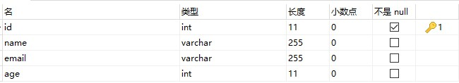

（2） 创建 maven 工程

创建 maven 工程，信息如下：模板：

（3） 删除默认创建的 App 类文件

（4）添加 Maven 依赖

```xml
<dependencies>
    <dependency>
      <groupId>junit</groupId>
      <artifactId>junit</artifactId>
      <version>4.11</version>
      <scope>test</scope>
</dependency>
<dependency>
      <groupId>org.mybatis</groupId>
      <artifactId>mybatis</artifactId>
      <version>3.5.1</version>
</dependency>
<dependency>
      <groupId>mysql</groupId>
      <artifactId>mysql-connector-java</artifactId>
    <version>5.1.9</version>
    </dependency>
</dependencies>

```

（5） 加入 maven 插件

```xml
 <build>
    <resources>
      <resource>
        <directory>src/main/java</directory><!--所在的目录-->
        <includes><!--包括目录下的.properties,.xml 文件都会扫描到-->
          <include>**/*.properties</include>
          <include>**/*.xml</include>
        </includes>
        <filtering>false</filtering>
      </resource>
   </resources>
    <plugins>
      <plugin>
        <artifactId>maven-compiler-plugin</artifactId>
        <version>3.1</version>
        <configuration>
          <source>1.8</source>
          <target>1.8</target>
        </configuration>
      </plugin>
    </plugins>
</build>

```

（6） 编写Student 实体

创建包 com.xqc.domain, 包中创建 Student 类

```java
package com.xqc.domain;
/**
*	<p>Description: 实体类 </p>
*	<p>Company: http://www.xqc.com
 */
 public class Student {
    //属性名和列名一样
     private Integer id;
     private String name;
     private String email;
     private Integer age;
    // set ,get , toString
}
```

（7） 编写Dao 接口StudentDao

```java
package com.xqc.dao;
import com.xqc.domain.Student;
import java.util.List;
/**
 * <p>Description: Dao接口 </p>
 * <p>Company: http://www.xqc.com
 */
public interface StudentDao {
    /*查询所有数据*/
	List<Student> selectStudents();
}

```

（8） 编写 Dao 接口 Mapper 映射文件StudentDao.xml

要求：

1.  在 dao 包中创建文件 StudentDao.xml
2.  要 StudentDao.xml 文件名称和接口 StudentDao 一样，区分大小写的一样。

```xml
 <?xml version="1.0" encoding="UTF-8" ?>
<!DOCTYPE mapper
        PUBLIC "-//mybatis.org//DTD Mapper 3.0//EN"
		"http://mybatis.org/dtd/mybatis-3-mapper.dtd">
<!--
     namespace：必须有值，自定义的唯一字符串
		推荐使用：dao接口的全限定名称
-->
<mapper namespace="com.xqc.dao.StudentDao">
    <!--
       <select>: 查询数据， 标签中必须是select语句
			id:  sql语句的自定义名称，推荐使用dao接口中方法名称，
			使用名称表示要执行的sql语句
			resultType: 查询语句的返回结果数据类型，使用全限定类名
    -->
    <select id="selectStudents" resultType="com.xqc.domain.Student">
        <!--要执行的sql语句-->
        select id,name,email,age from student
    </select>
</mapper>

```

（9） 创建 MyBatis主配置文件

项目 src/main 下创建 resources 目录，设置 resources 目录为 resources root
创建主配置文件：名称为 mybatis.xml

说明：主配置文件名称是自定义的，内容如下：

```xml
<?xml version="1.0" encoding="UTF-8" ?>
<!DOCTYPE configuration
        PUBLIC "-//mybatis.org//DTD Config 3.0//EN"         "http://mybatis.org/dtd/mybatis-3-config.dtd">

    <!--配置mybatis环境-->
    <environments default="mysql">
        <!--id:数据源的名称-->
        <environment id="mysql">
            <!--配置事务类型：使用JDBC事务（使用Connection的提交和回滚）-->
            <transactionManager type="JDBC"/>
            <!--数据源dataSource：创建数据库Connection对象
				type: POOLED 使用数据库的连接池
            -->
            <dataSource type="POOLED">
                <!--连接数据库的四个要素-->
                <property name="driver" value="com.mysql.jdbc.Driver"/>
                <property name="url" value="jdbc:mysql://localhost:3306/ssm"/>
                <property name="username" value="root"/>
                <property name="password" value="123456"/>
            </dataSource>
        </environment>
    </environments>
    <mappers>
        <!--告诉mybatis要执行的sql语句的位置-->
        <mapper resource="com/xqc/dao/StudentDao.xml"/>
</mappers>
<configuration>

```

支持中文的 url：**jdbc:mysql://localhost:3306/ssm?useUnicode=true&characterEncoding=utf-8**

（10） 创建测试类 MyBatisTest

src/test/java/com/xqc/ 创建 MyBatisTest.java 文件

```java
@Test
public void testStart() throws IOException{
    //1.mybatis主配置文件
    String config = "mybatis-config.xml";
    //2:读取配置文件
    InputStream in = Resources.getResourceAsStream(config);
    //3.创建SqlSessionFactory对象,目的是获取SqlSession
    SqlSessionFactory factory = new SqlSessionFactoryBuilder().build(in);
    //4.获取SqlSession,SqlSession能执行sql语句
    SqlSession session = factory.openSession();
    //5.执行SqlSession的selectList()
    List<Student> studentList =      session.selectList("com.xqc.dao.StudentDao.selectStudents");
    //6.循环输出查询结果
    studentList.forEach( student -> System.out.println(student));
    //7.关闭SqlSession，释放资源     session.close();
}

```

List\<Student\> studentList = session.selectList("com.xqc.dao.StudentDao.selectStudents");
近似等价的 jdbc 代码

Connection conn = 获取连接对象

String sql=” select id,name,email,age from student”

PreparedStatement ps = conn.prepareStatement(sql);

ResultSet rs = ps.executeQuery();

（11） 配置日志功能

mybatis.xml 文件加入日志配置，可以在控制台输出执行的 sql 语句和参数

```xml
<settings>
    <setting name="logImpl" value="STDOUT_LOGGING" />
</settings>
```

## 2 ：基本的 CURD

查询一个 selectOne

insert ,update ,delete

###  insert

（1） StudentDao 接口中增加方法

```java
int insertStudent(Student student);
```

（2） StudentDao.xml 加入 sql 语句

```xml
<insert id="insertStudent"> insert into student(id,name,email,age)
    values(#{id},#{name},#{email},#{age})
</insert>
```

（3） 增加测试方法

```java
@Test
public void testInsert() throws IOException {
    //1.mybatis主配置文件
    String config = "mybatis-config.xml";
    //2.读取配置文件
    InputStream in = Resources.getResourceAsStream(config);
    //3.创建SqlSessionFactory对象
    SqlSessionFactory factory = new SqlSessionFactoryBuilder().build(in);
    //4.获取SqlSession
    SqlSession session = factory.openSession();
    //5.创建保存数据的对象
    Student student = new Student();
    student.setId(1005);
    student.setName("张丽");
    student.setEmail("zhangli@163.com");
    student.setAge(20);
    //6.执行插入insert
    int rows =  session.insert("com.xqc.dao.StudentDao.insertStudent",student);
    //7.提交事务
    System.out.println("增加记录的行数:"+rows);
    //8.关闭SqlSession
    session.close();
}
```

### update

（1） StudentDao 接口中增加方法

```java
int updateStudent(Student student);
```

（2） StudentDao.xml 增加 sql 语句

```xml
<update id="updateStudent"> update student set age = #{age} where id=#{id}
</update>
```

（3） 增加测试方法

（4）问：Mybatis 如果 Update 一个没有的数据项会怎么办？？

实验证明：不会怎么样，也不会报错，也不会增加数据

### delete

（1） StudentDao 接口中增加方法

```java
int deleteStudent(int id);
```

（2） StudentDao.xml 增加 sql 语句

```xml
<delete id="deleteStudent"> delete from student where id=#{studentId}
</delete>
```

## 3 ：MyBatis对象分析

### 对象使用

（1） Resources 类

Resources 类，顾名思义就是资源，用于读取资源文件。其有很多方法通过加载并解析资源文件，返回不同类型的 IO 流对象。

（2） SqlSessionFactoryBuilder 类

SqlSessionFactory 的创建，需要使用 SqlSessionFactoryBuilder 对象的 build()方法。由于 SqlSessionFactoryBuilder 对象在创建完工厂对象后，就完成了其历史使命，即可被销毁。所以，一般会将该 SqlSessionFactoryBuilder 对象创建为一个方法内的局部对象，方法结束，对象销毁。

（3） SqlSessionFactory 接口

SqlSessionFactory 接口对象是一个重量级对象（系统开销大的对象），是线程安全的，所以一个应用只需要一个该对象即可。创建 SqlSession 需要使用 SqlSessionFactory 接口的 openSession()方法。

SqlSessionFactory 是 MyBatis 的关键对象,它是个单个数据库映射关系经过编译后的内存镜像.SqlSessionFactory 对象的实例可以通过 SqlSessionFactoryBuilder 对象类获得,SqlSessionFactoryBuilder 则可以从 XML 配置文件或一个预先定制的 Configuration 的实例构建出 SqlSessionFactory 的实例.每一个 MyBatis 的应用程序都以一个 SqlSessionFactory 对象的实例为核心.同时 SqlSessionFactory 也是线程安全的,SqlSessionFactory 一旦被创建,应该在应用执行期间都存在.在应用运行期间不要重复创建多次,建议使用单例模式.SqlSessionFactory 是创建 SqlSession 的工厂.

openSession(true)：创建一个有自动提交功能的 SqlSession

openSession(false)：创建一个非自动提交功能的 SqlSession，需手动提交

openSession()：同 openSession(false)

mybatis 框架主要是围绕着 SqlSessionFactory 进行的，创建过程大概如下：

```xml
(1)、定义一个Configuration对象，其中包含数据源、事务、mapper文件资源以及影响数据库行为属性设置settings

(2)、通过配置对象，则可以创建一个SqlSessionFactoryBuilder对象

(3)、通过 SqlSessionFactoryBuilder 获得SqlSessionFactory 的实例。

(4)、SqlSessionFactory 的实例可以获得操作数据的SqlSession实例，通过这个实例对数据库进行操
```

（4）SqlSession 接口

SqlSession 接口对象用于执行持久化操作。一个 SqlSession 对应着一次数据库会话，一次会话以 SqlSession 对象的创建开始，以 SqlSession 对象的关闭结束。

SqlSession 的实例不能被共享，SqlSession 接口对象是线程不安全的，所以每次数据库会话结束前，需要马上调用其 close()方法，将其关闭。再次需要会话，再次创建。 SqlSession 在方法内部创建，.使用完 SqlSeesion 之后关闭 Session 很重要,应该确保使用 finally 块来关闭它.

## 4：代理CURD

（**1**） 去掉 **Dao** 接口实现类

只需调用 SqlSession 的 getMapper()方法，即可获取指定接口的实现类对象。该方法的参数为指定 Dao 接口类的 class 值。

```java
SqlSession session = factory.openSession();
StudentDao dao = session.getMapper(StudentDao.class);
```

使用工具类:

```java
StudentDao studentDao = MyBatisUtil.getSqlSession().getMapper(StudentDao.class);
```

（**3**） 使用 **Dao** 代理对象方法执行 **sql** 语句

select 方法:

```java
@Test
public void testSelect() throws IOException{
    final List<Student> studentList = studentDao.selectStudents();
    studentList.foreach(stu->System.out.println(stu));
}
```

update 方法

```java
@Test
public void testUpdate() throws IOException{
    Student student = new Student();
    student.setId(10086);
    student.setAge(28);
    int nums = studentDao.updateStudent(student);
    System.out.println(nums);
}
```

delete 方法

```java
StudentDao.delectStudent(1006);
```

### 原理

动态代理

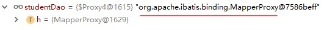

MapperProxy 类定义

```java
public class MapperProxy<T> implements InvocationHandler，Serializable {
    @Override
    public Object invoke(Object proxy，Method method，0bject[] args)
        try {
            if (object.class.equals(method.getDeclaringClass())) {
                return method.invoke(this,args) ;
             }else if (isDefaultMethod ( method)) {
                return invokeDefaultMethod (proxy,method，args);}
         }catch (Throwable t) {
                throw ExceptionUtil.unwrapThrowable(t);
         }final MapperMethod mapperMethod = cachedMapperMethod(method) ;
    return mapperMethod.execute(sqlsession,args);
}
public Object execute( SqlSession sqlSession，0bject[] args){
    Object result;
    switch ( command.getType()) {
        case INSERT: {
    		Object param = method.convertArgsTosqlCommandParam(args);
    		result - rowCountResult(sqlsession.insert(command.getName()， param);
            break;
        }
        case UPDATE: {
            Object param = method.convertArgsToSqlCommandParam(args);
            result = rowCountResult(sqlsession.update(command.getName(), param);
            break;
                                    }

```

## 5： **深入理解参数**

### parameterType

parameterType: 接口中方法参数的类型，类型的完全限定名或别名。这个属性是可选的，因为 MyBatis 可以推断出具体传入语句的参数，默认值为未设置（unset）。

接口中方法的参数从 java 代码传入到 mapper 文件的 sql 语句。

\<select\>,\<insert\>,\<update\>,\<delete\>都可以使用 parameterType 指定类型。

例如：

```xml
<delect id="delectById" parameterType="int"></delect>
<delect id="delectById" parameterType="java.lang.Integer"></delect>
```

### 传递参数

从 java 代码中把参数传递到 mapper.xml 文件。

#### 一个简单参数

Dao 接口中方法的参数只有一个简单类型（java 基本类型和 String），占位符 **\#{**任意字符 **}**，和方法的参数名无关。

mapper 文件：

```xml
<select id="selectById" resultType="com.xqc.domain.Student">
	select * from student where id = #{studentId}
</select>
```

\#{studentId} , studentId 是自定义的变量名称，和方法参数名无关。

#### 多个参数-使用@Param

当 Dao 接口方法多个参数，需要通过名称使用参数。在方法形参前面加入@Param(“自定义参数名”)，

mapper 文件使用\#{自定义参数名}。

例如

```java
List<Student> selectMultiParam(@Param("Name")String name,@Param("Age")int age);
```

mapper 文件：

```xml
<select id="selectMultiParam" resultType="com.xqc.domain.Student">
	select id,name.email,age from student where name= #{Name} or age= #{Age}
</select>
```

#### 多个参数-使用对象

使用 java 对象传递参数， java 的属性值就是 sql 需要的参数值。每一个属性就是一个参数。

语法格式： \#{ property,javaType=java 中数据类型名,jdbcType=数据类型名称 }

javaType, jdbcType 的类型 MyBatis 可以检测出来，一般不需要设置。

常用格式 \#{property }

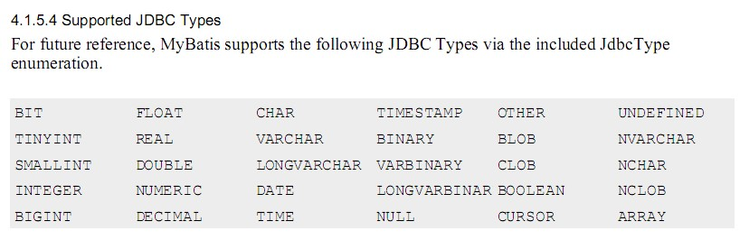

创建保存参数值的对象 QueryParam

```java
package com.xqc.vo;
public class QueryParam{
    private String queryName;
    private int queryAge;
    //get和set
}
```

接口方法：

```java
List<Student> selectMultiObject(QueryParam queryParam);
```

mapper 文件：

```xml
<select id="selectMultiObject" resutlType="com.xqc.domain.Student">
	select id,name,email,age from student where name = #{queryName} or age = #{queryAge}
</select>
```

或者

```xml
<select id="selectMultiObject" resutlType="com.xqc.domain.Student">
	select id,name,email,age from student where name =#{queryName,javaType=string,jdbcType=VARCHAR}
    or age = #{queryAge,javaType=int,jdbcType=INTEGER}
</select>
```

#### 多个参数-按位置

参数位置从 0 开始， 引用参数语法 **\#{ arg** 位置 **}** ， 第一个参数是\#{arg0}，第二个是\#{arg1}

注意：mybatis-3.3 版本和之前的版本使用\#{0},\#{1}方式， 从 mybatis3.4 开始使用\#{arg0}方式。

接口方法：

```java
List<Student> selectByNameAndAge(String name,**int** age);
```

mapper 文件

```xml
<select id="selectByNameAndAge" resutlType="com.xqc.domain.Student">
	select * from student where name = #{arg0} or age = #{arg1}
</select>
```

#### 多个参数-使用 Map

Map 集合可以存储多个值，使用 Map 向 mapper 文件一次传入多个参数。Map 集合使用 String 的 key， Object 类型的值存储参数。 mapper 文件使用 \# { key } 引用参数值。

例如：

```java
Map<String,Object> data = new HashMap<String,Object>();
data.put(“myname”,”李力”);
data.put(“myage”,20);

```

接口方法：

```java
List<Student> selectMultiMap(Map<String,Object> map)
```

mapper 文件：

```xml
<select id="selectMultiMap" resultType="com.xqc.domain.Student">
 select id,name,email,age from student where name=#{myname} or age =#{myage}
</select>
```

### #和\$

1：传入的值

\#将传入的数据都当成一个字符串，会对自动传入的数据加一个双引号。

如：where username = #{username} 会解析成 where username = "111"

$将传入的数据直接显示生成在 sql 中。

如：where username=${username}会解析成 where username = 111

\#方式可以很大程度防止 sql 注入

2：防止注入攻击

$这样的参数会直接参与 sql 编译,从而不能避免注入攻击

\#占位符，告诉 mybatis 使用实际的参数值代替。并使用 PrepareStatement 对象执行 sql 语句,

\#{…}代替 sql 语句的“?”。这样做更安全，更迅速，通常也是首选做法

## 6：封装结果

Mybatis的结果封装分为两种，一种是有ResultMap映射表，一种是有ResultMap映射表，明确定义了结果集列名与对象属性名的配对关系，另外一种是对象类型，没有明确定义结果集列名与对象属性名的配对关系。

原理是使用ObjectFacoty创建一个Teacher对象直接set

### resultType

resultType: 执行 sql 得到 ResultSet 转换的类型，使用类型的完全限定名或别名。注意如果返回的是集合，那应该设置为集合包含的类型，而不是集合本身。resultType 和 resultMap，不能同时使用。

### resultMap

resultMap 可以自定义 sql 的结果和 java 对象属性的映射关系。更灵活的把列值赋值给指定属性。常用在列名和 java 对象属性名不一样的情况。

### 实体类属性名和列名不同

（1） 使用列别名和\<resultType\>

（2） 使用\<resultMap\>

## 7： **模糊** like

模糊查询的实现有两种方式，

一是 java 代码中给查询数据加上“%” ;

二是在 mapper 文件 sql 语句的条件位置加上“%”

需求：查询姓名有“力”的

例 1: java 代码中提供要查询的 “%力%” 接口方法：

```java
List<Student> selectLikeFirst(String name);
```

mapper 文件：

```xml
<select id="selectLikeFirst" resultType="com.xqc.domain.Student">     select id,name,email,age from student     where name like #{studentName}
</select>
```

此时传入的 studentName 为应该为`% 力 %`

例 2：mapper 文件中使用 like name "%" \#{xxx} "%"

接口方法：

```java
List<Student> selectLikeSecond(String name);
```

mapper 文件：

```xml
<select id="selectLikeSecond" resultType="com.xqc.domain.Student">
    select id,name,email,age from student     where name like "%" #{studentName} "%"
</select>
```

# 第 3 章 动态 SQL

动态 SQL，通过 MyBatis 提供的各种标签对条件作出判断以实现动态拼接 SQL 语句。这里的条件判断使用的表达式为 OGNL 表达式。常用的动态 SQL
标签有\<if\>、\<where\>、\<choose/\>、\<foreach\>等。

MyBatis 的动态 SQL 语句，与 JSTL 中的语句非常相似。

动态 SQL，主要用于解决查询条件不确定的情况：在程序运行期间，根据用户提交的查询条件进行查询。提交的查询条件不同，执行的 SQL 语句不同。若将每种可能的情况均逐一列出，对所有条件进行排列组合，将会出现大量的 SQL 语句。此时，可使用动态 SQL 来解决这样的问题

## 环境准备

在 mapper 的动态 SQL 中若出现大于号（\>）、小于号（\<）、大于等于号（\>=），小于等于号（\<=）等符号，最好将其转换为实体符号。否则，XML
可能会出现解析出错问题。

特别是对于小于号（\<），在 XML 中是绝不能出现的。否则解析 mapper 文件会出错。

实体符号表：

| \<  | 小于     | \&lt;  |
| --- | -------- | ------ |
| \>  | 大于     | \&gt;  |
| \>= | 大于等于 | \&gt;= |
| \<= | 小于等于 | \&lt;= |

## 2 \<if\>

对于该标签的执行，当 test 的值为 true 时，会将其包含的 SQL 片断拼接到其所在的 SQL 语句中。

语法：\<if test=”条件”\> sql 语句的部分 \</if\>

接口方法：

List\<Student\> selectStudentIf (Student student);

mapper 文件：

```xml
<select id="selectStudentIf" resultType="com.node.domain.Student">
	select id,name,email,age from student where 1=1
    <if test="name!=null and name!=''">
        and name=#{name}
    </if>
    <if test="age>0">
    	and age &gt;#{age}
    </if>
</select>
```

测试:

```java
List<Student> studentList = studentDao.selectStudentIf(param);
studentList.forEach( stu -> System.out.println(stu));
```

Mybatis 映射几种：

1：没有传该数据项就不插入

2：如果没有传该对象就插入一个默认值

3：查询条件不为空就添加该查询条件

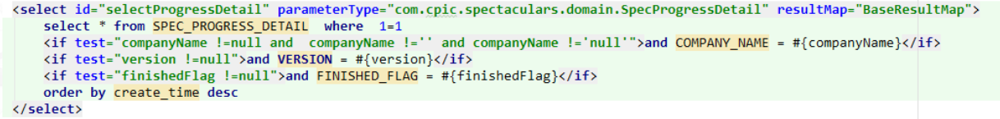

## 3 \<where\>

\<if/\>标签的中存在一个比较麻烦的地方：需要在 where 后手工添加 1=1 的子句。因为，若 where 后的所有\<if/\>条件均为 false，而 where 后若又没有 1=1
子句，则 SQL 中就会只剩下一个空的 where，SQL 出错。所以，在 where 后，需要添加永为真子句 1=1，以防止这种情况的发生。但当数据量很大时，会严重影响查询效率。

使用\<where/\>标签，在有查询条件时，可以自动添加上 where 子句；没有查询条件时，不会添加 where 子句。需要注意的是，第一个\<if/\>标签中的 SQL 片断，可以不包含 and。不过，写上 and 也不错，系统会将多出的 and 去掉。但其它\<if/\>中 SQL 片断的 and，必须要求写上。否则 SQL 语句将拼接出错 。

接口方法：

List\<Student\> selectStudentWhere (Student student);

mapper 文件：

```xml
<select id="selectStudentWhere" resultType="com.xqc.domain.Student">
	select id,name,email,age from student
    <where>
        <if test="name != null and name !='' "> and name = #{name} </if>
        <if test="age > 0 "> and age &gt; #{age} </if>
    </where>
</select>
```

## 4 \<foreach\>

\<foreach/\>标签用于实现对于数组与集合的遍历。对其使用，需要注意：

collection 表示要遍历的集合类型, list ，array 等。

open、close、separator 为对遍历内容的 SQL 拼接。

（1） 遍历 List\<简单类型\>

表达式中的 List 使用 list 表示，其大小使用 list.size 表示。

需求：查询学生 id 是 1002,1005,1006

接口方法：

```java
List<Student> selectStudentForList(List<Integer> idList);
```


mapper 文件：

```xml
<select id="selectStudentForList" resultType="com.xqc.domain.Student">
	select id,name,email,age from student
		<if test="list !=null and list.size > 0 ">
			where id in
            <foreach collection="list" open="(" close=")"  item="stuid" separator=",">
                #{stuid}
            </foreach>
    	</if>
</select>

```

（**2**） 遍历 List\<对象类型\>

接口方法：

```java
List<Student> selectStudentForList2(List<Student> stuList);
```


mapper 文件：

```xml
<select id="selectStudentForList2" resultType="com.xqc.domain.Student">
    select id,name,email,age from student
     	<if test="list !=null and list.size > 0 ">
     	where id in
            <foreach collection="list" open="(" close=")"  item="stuobject" separator=",">
                #{stuobject.id}
            </foreach>
        </if>
</select>

```

## 5 \<sql/\>与\<include/\>

\<sql/\>标签用于定义 SQL 片断，以便其它 SQL 标签复用。而其它标签使用该 SQL 片断，需要使用\<include/\>子标签。

## 6 \<choose/\>，\<When\>

choose 标签是按顺序判断其内部 when 标签中的 test 条件出否成立，如果有一个成立，则 choose 结束。当 choose 中所有 when 的条件都不满则时，则执行 otherwise 中的 sql

## 7\<trim\>

一般用于去除 sql 语句中多余的 and 关键字，逗号，或者给 sql 语句前拼接“where“、“set“以及“values(“等前缀，或者添加“)“等后缀，可用于选择性插入、更新、删除或者条件查询等操作

| **属性**        | **描述**                                                                                                                                                  |
| --------------- | --------------------------------------------------------------------------------------------------------------------------------------------------------- |
| prefix          | 给 sql 语句拼接的前缀                                                                                                                                     |
| suffix          | 给 sql 语句拼接的后缀                                                                                                                                     |
| prefixOverrides | 去除 sql 语句前面的关键字或者字符，该关键字或者字符由 prefixOverrides 属性指定，假设该属性指定为"AND"，当 sql 语句的开头为"AND"，trim 标签将会去除该"AND" |
| suffixOverrides | 去除 sql 语句后面的关键字或者字符，该关键字或者字符由 suffixOverrides 属性指定                                                                            |

如果都没匹配上：SELECT \* FROM BLOG WHERE

如果仅有第二个匹配上：SELECT \* FROM BLOG WHERE AND title like ‘someTitle’

你也可以使用 where 标签去完成该问题

## 8\<![CDATA[ ]]\>

在 CDATA 内部的所有内容都会被解析器忽略。

## 9：Begin And

# 第 5 章 配置文件

## 5.1 主配置文件

主配置文件特点：

1：xml 文件，需要在头部使用约束文件

2：根元素，\<configuration\>

3.主要包含内容：

```xml
<!-- settings是 MyBatis 中全局的调整设置，它们会改变 MyBatis 的运行时行为,应谨慎设置 -->
	    <settings>
	        <!-- 该配置影响的所有映射器中配置的缓存的全局开关。默认值true -->
	      <setting name="cacheEnabled" value="true"/>
	      <!--延迟加载的全局开关。当开启时，所有关联对象都会延迟加载。 特定关联关系中可通过设置fetchType属性来覆盖该项的开关状态。默认值false  -->
	      <setting name="lazyLoadingEnabled" value="true"/>
	        <!-- 是否允许单一语句返回多结果集（需要兼容驱动）。 默认值true -->
	      <setting name="multipleResultSetsEnabled" value="true"/>
	      <!-- 使用列标签代替列名。不同的驱动在这方面会有不同的表现， 具体可参考相关驱动文档或通过测试这两种不同的模式来观察所用驱动的结果。默认值true -->
	      <setting name="useColumnLabel" value="true"/>
	      <!-- 允许 JDBC 支持自动生成主键，需要驱动兼容。 如果设置为 true 则这个设置强制使用自动生成主键，尽管一些驱动不能兼容但仍可正常工作（比如 Derby）。 默认值false  -->
	      <setting name="useGeneratedKeys" value="false"/>
	     <!--  指定 MyBatis 应如何自动映射列到字段或属性。 NONE 表示取消自动映射；PARTIAL 只会自动映射没有定义嵌套结果集映射的结果集。 FULL 会自动映射任意复杂的结果集（无论是否嵌套）。 -->
	     <!-- 默认值PARTIAL -->
	      <setting name="autoMappingBehavior" value="PARTIAL"/>

	      <setting name="autoMappingUnknownColumnBehavior" value="WARNING"/>
	     <!--  配置默认的执行器。SIMPLE 就是普通的执行器；REUSE 执行器会重用预处理语句（prepared statements）； BATCH 执行器将重用语句并执行批量更新。默认SIMPLE  -->
	      <setting name="defaultExecutorType" value="SIMPLE"/>
	      <!-- 设置超时时间，它决定驱动等待数据库响应的秒数。 -->
	      <setting name="defaultStatementTimeout" value="25"/>

	      <setting name="defaultFetchSize" value="100"/>
	      <!-- 允许在嵌套语句中使用分页（RowBounds）默认值False -->
	      <setting name="safeRowBoundsEnabled" value="false"/>
	      <!-- 是否开启自动驼峰命名规则（camel case）映射，即从经典数据库列名 A_COLUMN 到经典 Java 属性名 aColumn 的类似映射。  默认false -->
	      <setting name="mapUnderscoreToCamelCase" value="false"/>
	      <!-- MyBatis 利用本地缓存机制（Local Cache）防止循环引用（circular references）和加速重复嵌套查询。
	             默认值为 SESSION，这种情况下会缓存一个会话中执行的所有查询。
	            若设置值为 STATEMENT，本地会话仅用在语句执行上，对相同 SqlSession 的不同调用将不会共享数据。  -->
	      <setting name="localCacheScope" value="SESSION"/>
	      <!-- 当没有为参数提供特定的 JDBC 类型时，为空值指定 JDBC 类型。 某些驱动需要指定列的 JDBC 类型，多数情况直接用一般类型即可，比如 NULL、VARCHAR 或 OTHER。  -->
	      <setting name="jdbcTypeForNull" value="OTHER"/>
	    <!--   指定哪个对象的方法触发一次延迟加载。  -->
	      <setting name="lazyLoadTriggerMethods" value="equals,clone,hashCode,toString"/>
	    </settings>

```

## 5.2 dataSource 连接池

Mybatis 中访问数据库，可以连接池技术，但它采用的是自己的连接池技术。在 Mybatis 的 mybatis.xml 配置文件中，通过\<dataSource type=”pooled”\>来实现 Mybatis 中连接池的配置。

dataSource 类型：Mybatis 将数据源分成三类

UNPOOLED 不使用连接池的数据源

POOLED 使用连接池的数据源

JNDI 使用 JNDI 实现的数据源

其中 UNPOOLED ,POOLED 数据源实现了 javax.sq.DataSource 接口， JNDI 和前面两个实现方式不同，

dataSource 配置

```xml
<dataSource type="POOLED">
	<property name="driver" value="com.mysql.jdbc.Driver"/>
    <property name="url"  value="jdbc:mysql://localhost:3306/ssm?charset=utf-8"/>
    <property name="username" value="root"/>
    <property name="password" value="123456"/>
</dataSource>

```

MyBatis 在初始化时，根据\<dataSource\>的 type 属性来创建相应类型的的数据源 DataSource，即： type=”POOLED”：MyBatis 会创建 PooledDataSource 实例 type=”UNPOOLED” ： MyBatis 会创建 UnpooledDataSource 实例 type=”JNDI”：MyBatis 会从 JNDI 服务上查找 DataSource 实例，然后返回使用

## 5.3 事务

（1） 默认需要手动提交事务

Mybatis 框架是对 JDBC 的封装，所以 Mybatis 框架的事务控制方式，本身也是用 JDBC 的 Connection 对象的 commit(), rollback() .Connection 对象的 setAutoCommit()方法来设置事务提交方式的。自动提交和手工提交、该标签用于指定 MyBatis 所使用的事务管理器。MyBatis 支持两种事务管理器类型：**JDBC** 与 **MANAGED**。

- JDBC：使用 JDBC 的事务管理机制。即，通过 Connection 的 commit()方法提交，通过 rollback()方法回滚。但默认情况下，MyBatis 将自动提交功能关闭了，改为了手动提交。即程序中需要显式的对事务进行提交或回滚。从日志的输出信息中可以看到。

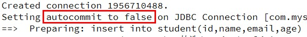

- MANAGED：由容器来管理事务的整个生命周期（如 Spring 容器）。

（**2**） 自动提交事务

设置自动提交的方式，factory 的 openSession() 分为有参数和无参数的。

```java
SqlSession openSession();
SqlSession openSession(boolean autoCommit);
```

有参数为 true，使用自动提交，可以修改 MyBatisUtil 的 getSqlSession()方法。session = _factory_.openSession(**true**);再执行 insert 操作，无需执行 session.commit(),事务是自动提交的

## 5.4 使用数据库属性配置文件

为 了方便对数据库连接的管理，DB 连接四要素数据一般都是存放在一个专门的属性文件中的。MyBatis 主配置文件需要从这个属性文件中读取这些数据。

步骤：

（**1**） 在 **classpath** 路径下，创建 **properties** 文件

在 resources 目录创建 jdbc.properties 文件，文件名称自定义。

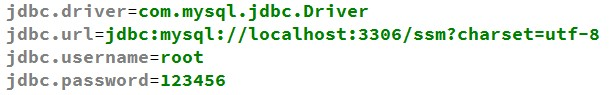

（**2**） 使用 properties标签

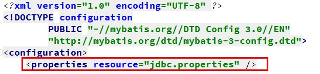

5.5 typeAliases（类型别名）

Mybatis 支持默认别名，我们也可以采用自定义别名方式来开发，主要使用在\<select resultType=”别名”\> mybatis.xml 主配置文件定义别名

## 5.6 mappers（映射器）

（1） \<mapper resource=" " /\>使用相对于类路径的资源,从 classpath 路径查找文件

例如：\<mapper resource="com/xqc/dao/StudentDao.xml" /\>

（2） \<package name=""/\>指定包下的所有 Dao 接口

如：\<package name="com.xqc.dao"/\> 注意：此种方法要求 Dao 接口名称和 mapper 映射文件名称相同，且在同一个目录中。

# 第六章：原理

## Mapper和映射文件绑定

以编程式为例，需要进行如下

```java
SqlSession session = sqlSessionFactory.openSession();
        UserMapper userMapper = session.getMapper(UserMapper.class);
        List<LwUser> userList = userMapper.listUserByUserName("孤狼1号");
```

1：获取Mapper接口

在调用getMapper之后，回去Configuration对象中获取Mapper对象。通过Configuration对象中的MapperRegistry对象属性，继续调用getMapper方法，根据type类型，获取到当前类型对应的代理工厂类，然后通过代理工厂类生成对应Mapper的代理类，而MapperProxy可以看到实现了InvocationHandler，使用的就是JDK动态代理。

2：Mapper接口与映射文件的关联

Mapper接口及其映射文件是在加载mybatis-config配置文件的时候存储进去的

## SQL执行流程

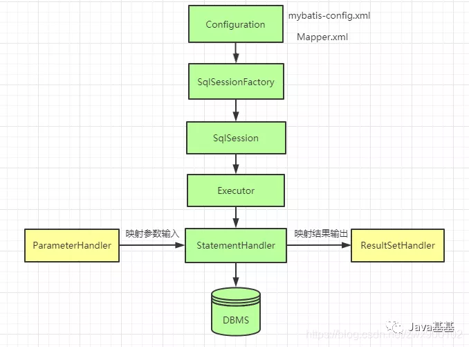


# 第 7 章 扩展

## 7.1 PageHelper

### 7.1.1 Mybatis 通用分页插件

<https://github.com/pagehelper/Mybatis-PageHelper>

PageHelper 支持多种数据库

### **7.1.2 基于 PageHelper 分页：**

实现步骤

（1） maven 坐标

```xml
<dependency>
  <groupId>com.github.pagehelper</groupId>
  <artifactId>pagehelper</artifactId>
  <version>5.1.10</version>
</dependency>

```

（2） 加入 plugin 配置，在mybatis配置文件中\<environments\>之前加入

```xml
<plugins>
    <plugin interceptor="com.github.pagehelper.PageInterceptor" />
</plugins>
```

（3）PageHelper 对象

查询语句之前调用 PageHelper.startPage 静态方法。除了 PageHelper.startPage 方法外，还提供了类似用法的 PageHelper.offsetPage 方法。

在你需要进行分页的 MyBatis 查询方法前调用 PageHelper.startPage 静态方法即可，紧跟在这个方法后的第一个 MyBatis 查询方法会被进行分页。

```java
 @Test
public void testSelect() throws IOException {
    //获取第1页，3条内容
    PageHelper.stratPage(1,3);
    List<Student> studentList = studentDao.selectStudents();
    studentList.forEach( stu -> System.out.println(stu));
}

```

当 ResultMap 去重遇到 PageHelper 的时候不支持

其分页原理是物理分页，即在执行 sql 语句前进行过滤

对于 oracle，是在外层套一个

```sql
select * from{
	……
}where rownum <=20
```

对于 mysql，在外层套一个

```sql
select... from ...where...limit  x, y
```

### 优化：

使用 id 进行分页

```sql
select * from tableA where id > 8000000 limit 10;
```

但是这种可能会出现问题，要是第一次查了 1 到 10，记录 ID 为 10 现在，然后我把第 7 条记录删除了，那查出的就错乱了。

https://mp.weixin.qq.com/s?__biz=MzI1NDQ3MjQxNA==&mid=2247493234&idx=2&sn=ade716af50bde91bd2b554fe663ac002&chksm=e9c61fc3deb196d5273e1f645cbdf5c914537a3e0b3e0d9c970a02faff25c857d61394cfe08b&mpshare=1&scene=23&srcid=0314G21ZMghwYncHwfaLf6a2&sharer_sharetime=1615719630444&sharer_shareid=36a11a4ebb04967d7698241b47b50050#rd

# 第九章：多表查询

## 一对一

## 一对多

一个用户有多个账号，账号表有外键用户 id

查询所有用户信息及用户关联的账户信息，查询过程中如果用户没有账户信息，此时也要将用户信息查询出来，左连接较为合适。

SQL 语句：

```sql
SELECT u.*,acc.id id,acc.uis,acc.money FROM user u LEFT JOIN account acc ON u.id = acc.uid
```

User 类

```java
public class User implements Serializable {
    private Integer id;
    private string username;
    private Date birthday;
    private string sex;
    private string address;
    private List<Account> accounts;

```

DAO 加入查询方法

```java
List<User> findAll();
```

Mapper 文件

```xml
<?xml version="1.0" encoding=”UTE-8"?><! DOCTYPE mapper
PUBLIC "-//mybatis.org// DTD Mapper 3.0//EN""http: / /mybatis.org/dtd/mybatis-3-mapper.dtd">
<mapper namespace="com.itheima .dao.IUserDao">
    <resultMap type="user”ic="userMap">
        <id column="idi" property="id"></id>
            <result colunmn="username" property="username" / ><result column="address" property="address"/><result colunn="sex" property="sex"/>
            <result column="birthday" property="birthday" / ><!-- collection是用于建立一对多中集合属性的对应关系
            ofType用于指定集合元素的数据类型
            <collection property="accounts" ofType="account">
                <id column="aid" property="id"/>
                <result column="uid" property="uid" / >
                <result column= "money" property= "money" / >
            </collection>
        </resultMap>
<!--配置查询所有操作—->
       <select id="findAll" resultMap="userMap ">
           select u.*, a.id as aid ,a.uid, a.money from user u left outer join account a on u.id =a.uid
      </ select>
</mapper>
```

Collection:部分定义了用户关联的账户信息

Property：关联结果集存储在 User 对象上的那个属性

OfType：指定关联查询的结果集中的对象类型即 List 中的对象类型，此处可以使用别名，也可以使用权限定名

## 多对多查询

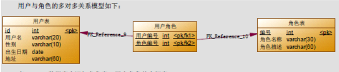

查询角色我们要用到 Role 表，但角色分配的用户信息我们并不能直接找到用户信息，而是要通过中间表（User_ROLE）才能关联到用户信息

## 嵌套查询与嵌套结果查询

嵌套结果查询及一对多，多对多等情况的查询。Mybatis 通过联合查询，将结果从数据库内一次性查出来，然后根据其一对多，多对一，多对多的关系和 ResultMap 中的配置，进行结果的转换，构建需要的对象。

嵌套查询，就是下边的懒加载，使用 assocation 等关键字。

# 第 10 章：延迟加载策略

通过前面的学习，我们已经掌握了 Mybatis 中一对一，一对多，多对多关系的配置及实现，可以实现对象的关联查询。实际开发过程中很多时候我们并不需要总是在加载用户信息时就一定要加载他的账户信息。此时就是我们所说的延迟加载。

延迟加载：就是在需要用到数据时才进行加载，不需要用到数据时就不加载数据。延迟加载也称懒加载.

好处：先从单表查询，需要时再从关联表去关联查询，大大提高数据库性能，因为查询单表要比关联查询多张表速度要快。

坏处：因为只有当需要用到数据时，才会进行数据库查询，这样在大批量数据查询时，因为查询工作也要消耗时间，所以可能造成用户等待时间变长，造成用户体验下降。

需求：

查询账户(Account)信息并且关联查询用户(User)信息。如果先查询账户(Account)信息即可满足要求，当我们需要查询用户(User)信息时再查询用户(User)信息。把对用户(User)信息的按需去查询就是延迟加载。

mybatis 第三天实现多表操作时，我们使用了 resultMap 来实现一对一，一对多，多对多关系的操作。主要是通过 association、collection 实现一对一及一对多映射。association、collection 具备延迟加载功能。

### 1.1 使用 assocation 实现延迟加载

需求：

查询账户信息同时查询用户信息。

账户的持久层**DAO**接口

```java
List<Account> findAll();
```

账户持久层映射

```xml
<?xml version="1.0" encoding="UTF-8"?>
<!DOCTYPE mapper
    PUBLIC "-//mybatis.org//DTD Mapper 3.0//EN"
    "http://mybatis.org/dtd/mybatis-3-mapper.dtd">
    <mapper namespace="com.itheima.dao.IAccountDao">
        <!-- 建立对应关系 -->
        <resultMap type="account" id="accountMap">
            <id column="aid" property="id"/>
            <result column="uid" property="uid"/>
            <result column="money" property="money"/>
            <!-- 它是用于指定从表方的引用实体属性的 -->
            <association property="user" javaType="user"
                select="com.xqc.dao.IUserDao.findById" column="uid">
            </association>
        </resultMap>
        <select id="findAll" resultMap="accountMap">
        	select * from account
        </select>
    </mapper>

```

**select**： 填写我们要调用的 select 映射的 id

**column** ： 填写我们要传递给 select 映射的参数

用户的业务接口

开启**Mybatis**的延迟加载策略

进入 Mybaits 的官方文档，找到 settings 的说明信息：

我们需要在 Mybatis 的配置文件 SqlMapConfig.xml 文件中添加延迟加载的配置。

### 1.2 使用 Collection 实现延迟加载

同样我们也可以在一对多关系配置的\<collection\>结点中配置延迟加载策略。

\<collection\>结点中也有 select 属性，column 属性。

需求：

完成加载用户对象时，查询该用户所拥有的账户信息。

# 第 11 章 Mybatis 缓存

像大多数的持久化框架一样，Mybatis 也提供了缓存策略，通过缓存策略来减少数据库的查询次数，从而提高性能。

Mybatis 中缓存分为一级缓存，二级缓存。

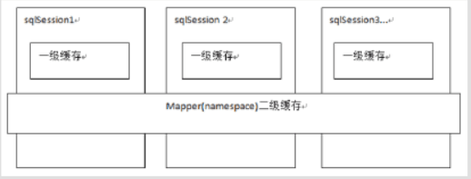

一级缓存: 基于 PerpetualCache 的 HashMap 本地缓存，其存储作用域为 Session，当 Session
flush 或 close 之后，该 Session 中的所有 Cache 就将清空。

二级缓存与一级缓存其机制相同，默认也是采用 PerpetualCache，HashMap 存储，不同在于
其存储作用域为 Mapper(Namespace)，并且可自定义存储源，如 Ehcache。

对于缓存数据更新机制，当某一个作用域(一级缓存 Session/二级缓存 Namespaces)的进行了
C/U/D 操作后，默认该作用域下所有 select 中的缓存将被 clear。

**但是二级缓存会带来问题：**

因为二级缓存时保存在 Mapper 对象中的，如果一个 user 的操作对应了两个 mapper，Amapper.xml 修改后 Bmapper.xml 是无法感知到的。

例如：

对于 tableA 与 tableB 的操作定义在两个 Mapper 中，分别叫做 MapperA 与 MapperB，即它们属于两个命名空间，如果此时启用缓存:

MapperA 中执行上述 sql 语句查询这 6 个字段

tableB 更新了 col1 与 col2 两个字段

MapperA 再次执行上述 sql 语句查询这 6 个字段〈前提是没有执行过任何 insert、delete、update 操作)
此时问题就来了，即使第(2）步 tableB 更新了 col1 与 col2 两个字段，第(3)步 MapperA 走二级缓存查询到的这 6 个字段依然是原来的这 6 个字段的值

## 1：Mybatis 一级缓存

### 1.1 证明一级缓存的存在

一级缓存是 SqlSession 级别的缓存，只要 SqlSession 没有 flush 或 close，它就存在。

编写用户持久层**Dao**接口

```java
public interface IUserDao {
/**
* 根据id查询
* @param userId
* @return
*/
User findById(Integer userId);
}
```

编写用户持久层映射文件

```xml
<?xml version="1.0" encoding="UTF-8"?>
<!DOCTYPE mapper
PUBLIC "-//mybatis.org//DTD Mapper 3.0//EN"
"http://mybatis.org/dtd/mybatis-3-mapper.dtd">
<mapper namespace="com.xqc.dao.IUserDao">
<!-- 根据id查询 -->
<select id="findById" resultType="UsEr" parameterType="int" useCache="true">
select * from user where id = #{uid}
</select>
</mapper>

```

编写测试方法

```java
/**
*
* <p>Title: MybastisCRUDTest</p>
* <p>Description: 一对多的操作</p>
* <p>Company: http://www.xqc.com/ </p>
*/
public class UserTest {
    private InputStream in ;
    private SqlSessionFactory factory;
    private SqlSession session;
    private IUserDao userDao;
    @Test
    public void testFindById() {
        //6.执行操作
        User user = userDao.findById(41);
        System.out.println("第一次查询的用户："+user);
        User user2 = userDao.findById(41);
        System.out.println("第二次查询用户："+user2);
        System.out.println(user == user2);
    }

    @Before//在测试方法执行之前执行
    public void init()throws Exception {
        //1.读取配置文件
        in = Resources.getResourceAsStream("SqlMapConfig.xml");
        //2.创建构建者对象
        SqlSessionFactoryBuilder builder = new SqlSessionFactoryBuilder();
        //3.创建SqlSession工厂对象
        factory = builder.build(in);
        //4.创建SqlSession对象
        session = factory.openSession();
        //5.创建Dao的代理对象
        userDao = session.getMapper(IUserDao.class);
    }

    @After//在测试方法执行完成之后执行
    public void destroy() throws Exception{
        //7.释放资源
        session.close();
        in.close();
    }
}

```

测试结果如下：

我们可以发现，虽然在上面的代码中我们查询了两次，但最后只执行了一次数据库操作，这就是 Mybatis 提供给我们的一级缓存在起作用了。因为一级缓存的存在，导致第二次查询 id 为 41 的记录时，并没有发出 sql 语句从数据库中查询数据，而是从一级缓存中查询。

### 1.2 一级缓存的分析

一级缓存是 SqlSession 范围的缓存，当调用 SqlSession 的修改，添加，删除，commit()，close()方法时，就会清空一级缓存。

第一次发起查询用户 id 为 1 的用户信息，先去找缓存中是否有 id 为 1 的用户信息，如果没有，从数据库查询用户信息。

得到用户信息，将用户信息存储到一级缓存中。

如果 sqlSession 去执行 commit 操作（执行插入、更新、删除），清空 SqlSession 中的一级缓存，这样做的目的为了让缓存中存储的是最新的信息，避免脏读。

第二次发起查询用户 id 为 1 的用户信息，先去找缓存中是否有 id 为 1 的用户信息，缓存中有，直接从缓存中获取用户信息。

MyBatis 的一级缓存是默认开启的，不需要任何的配置。

### 1.3 测试一级缓存的清空

测试一级缓存

```java
public class UserTest {
    private InputStream in ;
    private SqlSessionFactory factory;
    private SqlSession session;
    private IUserDao userDao;
    @Test
    public void testFindById() {
        //6.执行操作

        User user = userDao.findById(41);
        System.out.println("第一次查询的用户："+user);
        User user2 = userDao.findById(41);
        System.out.println("第二次查询用户："+user2);
        System.out.println(user == user2);
    }

    @Before//在测试方法执行之前执行
    public void init()throws Exception {
        //1.读取配置文件
        in = Resources.getResourceAsStream("SqlMapConfig.xml");
        //2.创建构建者对象
        SqlSessionFactoryBuilder builder = new SqlSessionFactoryBuilder();
        //3.创建SqlSession工厂对象
        factory = builder.build(in);
        //4.创建SqlSession对象
        session = factory.openSession();
        //5.创建Dao的代理对象
        userDao = session.getMapper(IUserDao.class);
    }

    @After//在测试方法执行完成之后执行
    public void destroy() throws Exception{
        //7.释放资源
        session.close();
        in.close();
    }
}

```

测试缓存同步

```java
@Test
public void testClearlCache(){
    //1.根据id查询用户
    User user1 = userDao.findById(41);
    System.out.println(user1);
    //2.更新用户信息
    user1.setUsername("update user clear cache");
    user1.setAddress("北京市海淀区");
    userDao.updateUser(user1);
    //3.再次查询id为41的用户
    User user2 = userDao.findById(41);
    System.out.println(user2);
    System.out.println(user1 == user2);
}
```

当执行 sqlSession.close()后，再次获取 sqlSession 并查询 id=41 的 User 对象时，又重新执行了 sql 语句，从数据库进行了查询操作。

### 1.4：总结

MyBatis 的一级缓存是默认开启的，不需要任何的配置。

一级缓存的生命周期有多长？

1. MyBatis 在开启一个数据库会话时，会 创建一个新的 SqlSession 对象，SqlSession 对象中会有一个新的 Executor 对象，Executor 对象中持有一个新的 PerpetualCache 对象；当会话结束时，SqlSession 对象及其内部的 Executor 对象还有 PerpetualCache 对象也一并释放掉。
2. 如果 SqlSession 调用了 close()方法，会释放掉一级缓存 PerpetualCache 对象，一级缓存将不可用；
3. 如果 SqlSession 调用了 clearCache()，会清空 PerpetualCache 对象中的数据，但是该对象仍可使用；
4. SqlSession 中执行了任何一个 update 操作(update()、delete()、insert()) ，都会清空 PerpetualCache 对象的数据，但是该对象可以继续使用；

一级缓存的不足：

使用一级缓存的时候，因为缓存不能跨会话共享，不同的会话之间对于相同的数据可能有不一样的缓存。在有多个会话或者分布式环境下，会存在脏数据的问题。如果要解决这个问题，就要用到二级缓存。MyBatis 一级缓存（MyBaits 称其为 Local Cache）无法关闭，但是有两种级别可选：

- session 级别的缓存，在同一个 sqlSession 内，对同样的查询将不再查询数据库，直接从缓存中。

- statement 级别的缓存，避坑： 为了避免这个问题，可以将一级缓存的级别设为 statement 级别的，这样每次查询结束都会清掉一级缓存。

## 2 Mybatis 二级缓存

二级缓存是 mapper 映射级别的缓存，多个 SqlSession 去操作同一个 Mapper 映射的 sql 语句，多个 SqlSession 可以共用二级缓存，二级缓存是跨 SqlSession 的。二级缓存是用来解决以及缓存不能跨会话共享问题的

### 2.1 二级缓存结构图

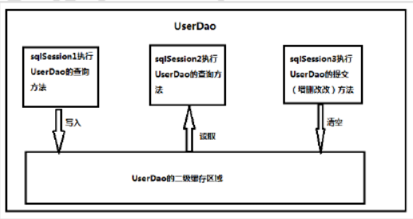

首先开启 mybatis 的二级缓存。

sqlSession1 去查询用户信息，查询到用户信息会将查询数据存储到二级缓存中。

如果 SqlSession3 去执行相同 mapper 映射下 sql，执行 commit 提交，将会清空该 mapper 映射下的二级缓存区域的数据。

sqlSession2 去查询与 sqlSession1 相同的用户信息，首先会去缓存中找是否存在数据，如果存在直接从缓存中取出数据。

### 2.2 二级缓存的开启与关闭

第一步：在**SqlMapConfig.xml**文件开启二级缓存

```xml
<settings>
<!-- 开启二级缓存的支持 -->
<setting name="cacheEnabled" value="true"/>
</settings>
```

因 cacheEnabled 的取值默认就为 true，所以这一步可以省略不配置。为 true 代表开启二级缓存；为 false 代表不开启二级缓存。

第二步：配置相关的**Mapper**映射文件，在 Mapping 文件中打上<cache>标签

\<cache\>标签表示当前这个 mapper 映射将使用二级缓存，区分的标准就看 mapper 的 namespace 值。

```xml
<?xml version="1.0" encoding="UTF-8"?>
<!DOCTYPE mapper
PUBLIC "-//mybatis.org//DTD Mapper 3.0//EN"
"http://mybatis.org/dtd/mybatis-3-mapper.dtd">
<mapper namespace="com.xqc.dao.IUserDao">
<!-- 开启二级缓存的支持 -->
<cache type="org.apache.ibatis.cache.impl.PerpetualCache"
    size="1024"
eviction="LRU"
flushInterval="120000"
readOnly="false"/>
</mapper>

```

这个简单语句的效果如下:

- 映射语句文件中的所有 select 语句的结果将会被缓存。
- 映射语句文件中的所有 insert、update 和 delete 语句会刷新缓存。
- 缓存会使用最近最少使用算法（LRU, Least Recently Used）算法来清除不需要的缓存。
- 缓存不会定时进行刷新（也就是说，没有刷新间隔）。
- 缓存会保存列表或对象（无论查询方法返回哪种）的 1024 个引用。
- 缓存会被视为读/写缓存，这意味着获取到的对象并不是共享的，可以安全地被调用者修改，而不干扰其他调用者或线程所做的潜在修改。

可用的清除策略有：

- `LRU` – 最近最少使用：移除最长时间不被使用的对象。
- `FIFO` – 先进先出：按对象进入缓存的顺序来移除它们。
- `SOFT` – 软引用：基于垃圾回收器状态和软引用规则移除对象。
- `WEAK` – 弱引用：更积极地基于垃圾收集器状态和弱引用规则移除对象。

默认的清除策略是 LRU。

flushInterval（刷新间隔）属性可以被设置为任意的正整数，设置的值应该是一个以毫秒为单位的合理时间量。 默认情况是不设置，也就是没有刷新间隔，缓存仅仅会在调用语句时刷新。

size（引用数目）属性可以被设置为任意正整数，要注意欲缓存对象的大小和运行环境中可用的内存资源。默认值是 1024。

readOnly（只读）属性可以被设置为 true 或 false。只读的缓存会给所有调用者返回缓存对象的相同实例。 因此这些对象不能被修改。这就提供了可观的性能提升。而可读写的缓存会（通过序列化）返回缓存对象的拷贝。 速度上会慢一些，但是更安全，因此默认值是 false。

第三步：配置**statement**上面的**useCache**属性

```xml
<!-- 根据id查询 -->
<select id="findById" resultType="user" parameterType="int" useCache="true">
select * from user where id = #{uid}
</select>
```

将 UserDao.xml 映射文件中的\<select\>标签中设置 useCache=”true”代表当前这个 statement 要使用二级缓存，如果不使用二级缓存可以设置为 false。

注意：针对每次查询都需要最新的数据 sql，要设置成 useCache=false，禁用二级缓存。

### 2.3 二级缓存测试

```java
public class SecondLevelCacheTest {
private InputStream in;
private SqlSessionFactory factory;
@Before//用于在测试方法执行之前执行
public void init()throws Exception{
//1.读取配置文件，生成字节输入流
in = Resources.getResourceAsStream("SqlMapConfig.xml");
//2.获取SqlSessionFactory
factory = new SqlSessionFactoryBuilder().build(in);
}
@After//用于在测试方法执行之后执行
public void destroy()throws Exception{
in.close();
}

```

测试二级缓存

```java
@Test
public void testFirstLevelCache(){
SqlSession sqlSession1 = factory.openSession();
IUserDao dao1 = sqlSession1.getMapper(IUserDao.class);
User user1 = dao1.findById(41);
System.out.println(user1);
sqlSession1.close();//一级缓存消失
SqlSession sqlSession2 = factory.openSession();
IUserDao dao2 = sqlSession2.getMapper(IUserDao.class);
User user2 = dao2.findById(41);
System.out.println(user2);
sqlSession2.close();
System.out.println(user1 == user2);
}
}

```

经过上面的测试，我们发现执行了两次查询，并且在执行第一次查询后，我们关闭了一级缓存，再去执行第二次查询时，我们发现并没有对数据库发出 sql 语句，所以此时的数据就只能是来自于我们所说的二级缓存。

### 2.4：总结

当我们在使用二级缓存时，所缓存的类一定要实现 java.io.Serializable 接口，这种就可以使用序列化方式来保存对象。

```java
public class User implements Serializable {
}
```

如果你的 MyBatis 使用了二级缓存，并且你的 Mapper 和 select 语句也配置使用了二级缓存，那么在执行 select 查询的时候，MyBatis 会先从二级缓存中取输入，其次才是一级缓存，即 MyBatis 查询数据的顺序是：二级缓存 —> 一级缓存 —> 数据库。

在什么情况下才有必要去开启二级缓存？

1. 因为所有的增删改都会刷新二级缓存，导致二级缓存失效，所以适合在查询为主的应用中使用，比如历史交易、历史订单的查询。否则缓存就失去了意义。
2. 如果多个 namespace 中有针对于同一个表的操作，比如 Blog 表，如果在一个 namespace 中刷新了缓存，另一个 namespace 中没有刷新，就会出现读到脏数据的情况。所以，推荐在一个 Mapper 里面只操作单表的情况使用。

如果要让多个 namespace 共享一个二级缓存，应该怎么做？跨 namespace 的缓存共享的问题，可以使用<cache-ref>来解决：

```
<cache-ref namespace="com.wuzz.crud.dao.DepartmentMapper" />
```

cache-ref 代表引用别的命名空间的 Cache 配置，两个命名空间的操作使用的是同一个 Cache。在关联的表比较少，或者按照业务可以对表进行分组的时候可以使用。

注意：在这种情况下，多个 Mapper 的操作都会引起缓存刷新，缓存的意义已经不大了.

第三方缓存做二级缓存

除了 MyBatis 自带的二级缓存之外，我们也可以通过实现 Cache 接口来自定义二级缓存。

## 禁用缓存，清理缓存

```txt
<select>标签后添加useCache=”false“即可关闭缓存；
在select标签中添加：flushCache="true",实现缓存清理。
```

# 第 6 章：注解开发

## 常用注解

@Insert:实现新增

@Update:实现更新

@Delete:实现删除

@Select:实现查询

@Result:实现结果集封装

@Results:可以与\@Result 一起使用，封装多个结果集

@ResultMap:实现引用\@Results 定义的封装

@One:实现一对一结果集封装

@Many:实现一对多结果集封装

@SelectProvider: 实现动态 SQL 映射

@CacheNamespace:实现注解二级缓存的使用

@Insert

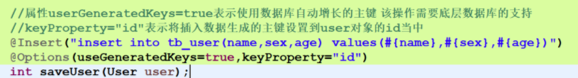

@delete

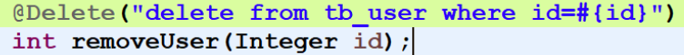

@update

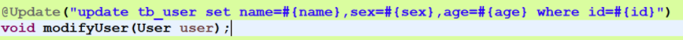

@select

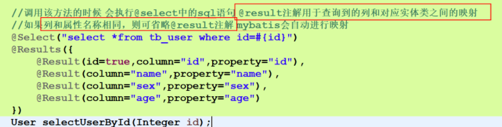

@one：一对一关系

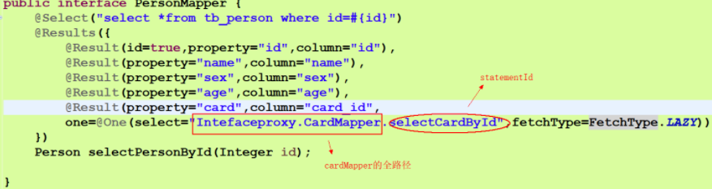

# 第十三章：流式查询

流式查询指的是查询成功后不是返回一个集合而是返回一个迭代器，应用每次从迭代器取一条查询结果。流式查询的好处是能够降低内存使用。

如果没有流式查询，我们想要从数据库取 1000 万条记录而又没有足够的内存时，就不得不分页查询，而分页查询效率取决于表设计，如果设计的不好，就无法执行高效的分页查询。因此流式查询是一个数据库访问框架必须具备的功能。

## 流式查询接口

Cursor 的接口类

1. Cursor 是可关闭的；
2. Cursor 是可遍历的。

Cursor 还提供了三个方法：

1. isOpen()：用于在取数据之前判断 Cursor 对象是否是打开状态。只有当打开时 Cursor 才能取数据；
2. isConsumed()：用于判断查询结果是否全部取完。
3. getCurrentIndex()：返回已经获取了多少条数据

因为 Cursor 实现了迭代器接口，因此在实际使用当中，从 Cursor 取数据非常简单：

```java
cursor.forEach(rowObject -> {...});
```

## 构建 Cursor

我们举个实际例子。下面是一个 Mapper 类：

```java
@Mapper
public interface FooMapper {
	@Select("select * from foo limit #{limit}")
	Cursor<Foo> scan(@Param("limit") int limit);
}
```

方法 scan() 是一个非常简单的查询。通过指定 Mapper 方法的返回值为 Cursor 类型，MyBatis 就知道这个查询方法一个流式查询。

然后我们再写一个 SpringMVC Controller 方法来调用 Mapper（无关的代码已经省略）：

```java
@GetMapping("foo/scan/0/{limit}")
public void scanFoo0(@PathVariable("limit") int limit) throws Exception {
	try (Cursor<Foo> cursor = fooMapper.scan(limit)) {  // 1
	cursor.forEach(foo -> {});                      // 2
	}
}
```

上面的代码中，fooMapper 是 @Autowired 进来的。

注释

1 处调用 scan 方法，得到 Cursor 对象并保证它能最后关闭；

2 处则是从 cursor 中取数据。

上面的代码看上去没什么问题，但是执行 scanFoo0() 时会报错：

```
java.lang.IllegalStateException: A Cursor is already closed.
```

这是因为我们前面说了在取数据的过程中需要保持数据库连接，而 Mapper 方法通常在执行完后连接就关闭了，因此 Cusor 也一并关闭了。

所以，解决这个问题的思路不复杂，保持数据库连接打开即可。我们至少有三种方案可选。

**方案一：SqlSessionFactory**

我们可以用 SqlSessionFactory 来手工打开数据库连接，将 Controller 方法修改如下：

```java
@GetMapping("foo/scan/1/{limit}")
public void scanFoo1(@PathVariable("limit") int limit) throws Exception {
	try (
		SqlSession sqlSession = sqlSessionFactory.openSession();  // 1
		Cursor<Foo> cursor =  sqlSession.getMapper(FooMapper.class).scan(limit)   // 2
	) {
		cursor.forEach(foo -> { });
	}
}
```

上面的代码中，1 处我们开启了一个 SqlSession （实际上也代表了一个数据库连接），并保证它最后能关闭；2 处我们使用 SqlSession 来获得 Mapper 对象。这样才能保证得到的 Cursor 对象是打开状态的。

**方案二：TransactionTemplate**

在 Spring 中，我们可以用 TransactionTemplate 来执行一个数据库事务，这个过程中数据库连接同样是打开的。代码如下：

```java
@GetMapping("foo/scan/2/{limit}")
public void scanFoo2(@PathVariable("limit") int limit) throws Exception {
	TransactionTemplate transactionTemplate = new TransactionTemplate(transactionManager);  // 1
    transactionTemplate.execute(status -> {               // 2
    	try (Cursor<Foo> cursor = fooMapper.scan(limit)) {
    		cursor.forEach(foo -> { });
    	} catch (IOException e) {
    		e.printStackTrace();
    	}
    	return null;
    });
}
```

上面的代码中

1 处我们创建了一个 TransactionTemplate 对象（此处 transactionManager 是怎么来的不用多解释，本文假设读者对 Spring 数据库事务的使用比较熟悉了）

2 处执行数据库事务，而数据库事务的内容则是调用 Mapper 对象的流式查询。注意这里的 Mapper 对象无需通过 SqlSession 创建。

**方案三：@Transactional 注解**

这个本质上和方案二一样，代码如下：

```java
@GetMapping("foo/scan/3/{limit}")
@Transactional
public void scanFoo3(@PathVariable("limit") int limit) throws Exception {
	try (Cursor<Foo> cursor = fooMapper.scan(limit)) {
		cursor.forEach(foo -> { });
	}
}
```

仅仅是在原来方法上面加了个 @Transactional 注解。这个方案看上去最简洁，但请注意 Spring 框架当中注解使用的坑：只在外部调用时生效。在当前类中调用这个方法，依旧会报错

以上是三种实现 MyBatis 流式查询的方法。

# 第十四章：其他

简述 Mybatis 的插件运行原理，以及如何编写一个插件。

答：Mybatis 仅可以编写针对 ParameterHandler、ResultSetHandler、StatementHandler、Executor 这 4 种接口的插件，Mybatis 使用 JDK 的动态代理，为需要拦截的接口生成代理对象以实现接口方法拦截功能，每当执行这 4 种接口对象的方法时，就会进入拦截方法，具体就是 InvocationHandler 的 invoke 方法，当然，只会拦截那些你指定需要拦截的方法。

编写插件：实现 Mybatis 的 Interceptor 接口并复写 intercept 方法，然后在给插件编写注解，指定要拦截哪一个接口的哪些方法即可，记住，别忘了在配置文件中配置你编写的插件