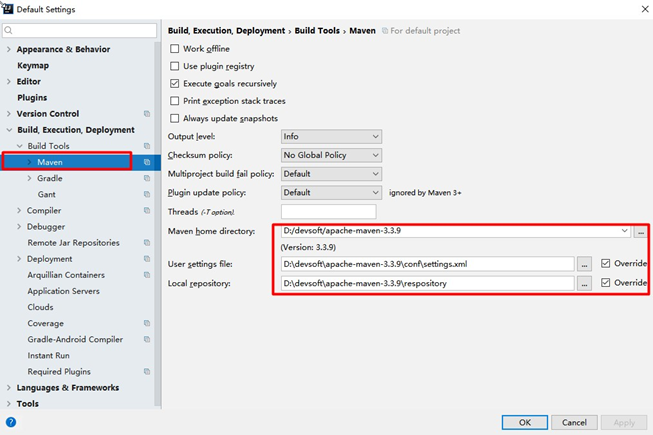
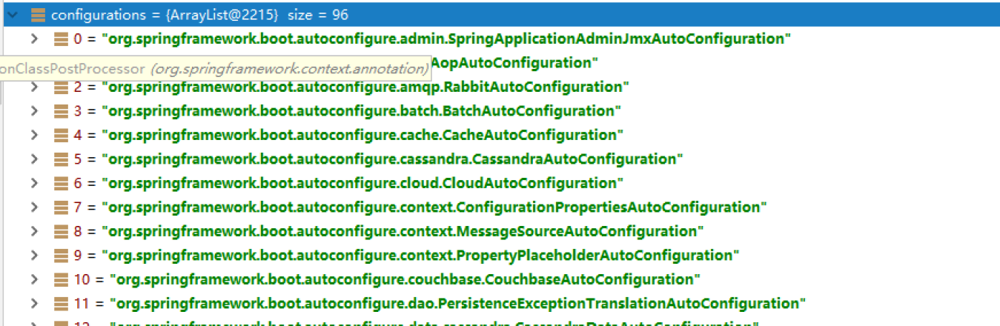
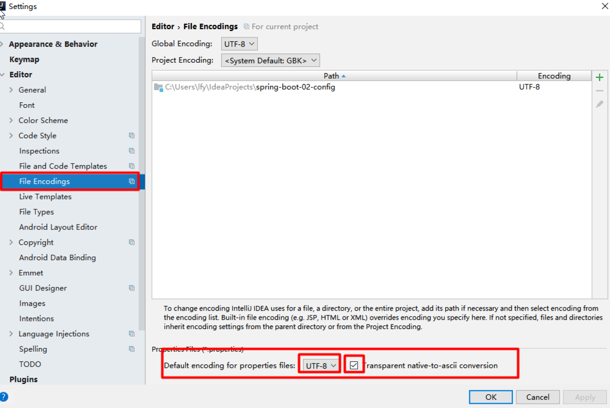
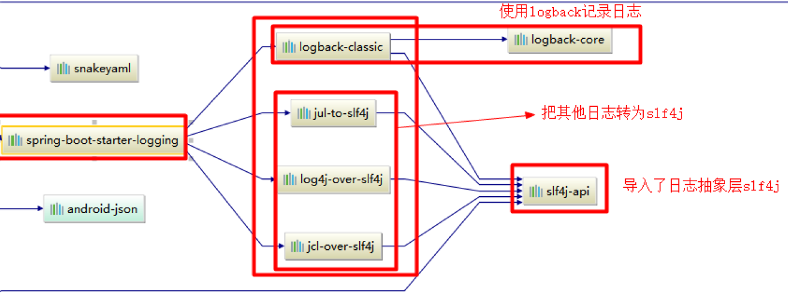
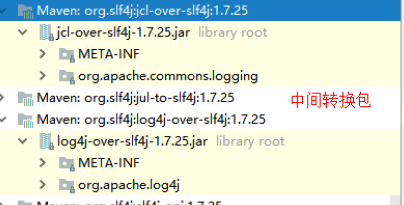

# 一、Spring Boot 入门

## 1.1、Spring Boot 简介

简化Spring应用开发
微服务：架构风格（服务微化）
一个应用应该是一组小型服务；可以通过HTTP的方式进行互通；
微服务：每一个功能元素 终都是一个可独立替换和独立升级的软件单元

## 1.2、环境准备

环境约束

–jdk1.8：Spring Boot 推荐jdk1.7及以上；java version "1.8.0_112"

–maven3.x：maven 3.3以上版本；Apache Maven 3.3.9
–IntelliJIDEA2017：IntelliJ IDEA 2017.2.2 x64、STS
–SpringBoot 1.5.9.RELEASE：1.5.9
1、MAVEN设置；	 
给maven 的settings.xml配置文件的profiles标签添加

```xml
<profile>
	<id>jdk-1.8</id>
    <activation>
        
    </activation>
</profile>
```


2、IDEA设置	 
整合maven进来；



## 1.3、Spring Boot HelloWorld

一个功能：
浏览器发送hello请求，服务器接受请求并处理，响应Hello World字符串；
1、创建一个maven工程；（jar）

2、导入spring boot相关的依赖

```xml
<parent>
    <groupId>org.springframework.boot</groupId>
    <artifactId>spring‐boot‐starter‐parent</artifactId>
    <version>1.5.9.RELEASE</version>
</parent>
<dependencies>
    <dependency>
        <groupId>org.springframework.boot</groupId>
        <artifactId>spring‐boot‐starter‐web</artifactId>
    </dependency>
</dependencies>
```

3、编写一个主程序；启动Spring Boot应用	

```java
/**
* @SpringBootApplication 来标注一个主程序类，说明这是一个Spring Boot应用
*/
@SpringBootApplication
public class HelloWorldMainApplication {
    public static void main(String[] args) {
        // Spring应用启动起来
        SpringApplication.run(HelloWorldMainApplication.class,args);
    }
}
```

4、编写相关的Controller、Service	 

Controller

```java
@Controller
public class HelloController {
        @ResponseBody
        @RequestMapping("/hello")
        public String hello(){
        	return "Hello World!";
    }
}
```

5、运行主程序测试	

6、简化部署	

 ```xml
<!‐‐ 这个插件，可以将应用打包成一个可执行的jar包；‐‐>
<build>
    <plugins>
        <plugin>
            <groupId>org.springframework.boot</groupId>
            <artifactId>spring‐boot‐maven‐plugin</artifactId>
        </plugin>
    </plugins>
</build>
 ```

将这个应用打成jar包，直接使用java -jar的命令进行执行；

## 1.4、解析 

1、POM文件

1、父项目

```xml
<parent>
    <groupId>org.springframework.boot</groupId>
    <artifactId>spring‐boot‐starter‐parent</artifactId>
    <version>1.5.9.RELEASE</version>
</parent>
他的父项目是
<parent>
    <groupId>org.springframework.boot</groupId>
    <artifactId>spring‐boot‐dependencies</artifactId>
    <version>1.5.9.RELEASE</version>
    <relativePath>../../spring‐boot‐dependencies</relativePath>
</parent>
他来真正管理Spring Boot应用里面的所有依赖版本；
```

Spring Boot的版本仲裁中心；
以后我们导入依赖默认是不需要写版本；（没有在dependencies里面管理的依赖自然需要声明版本号）
2、启动器

```xml
<dependency>
    <groupId>org.springframework.boot</groupId>
    <artifactId>spring‐boot‐starter‐web</artifactId>
</dependency>

```

spring-boot-starter：spring-boot场景启动器；帮我们导入了web模块正常运行所依赖的组件；
Spring Boot将所有的功能场景都抽取出来，做成一个个的starters（启动器），只需要在项目里面引入这些starter 相关场景的所有依赖都会导入进来。要用什么功能就导入什么场景的启动器

2、主程序类，主入口类

```java
/**
* @SpringBootApplication 来标注一个主程序类，说明这是一个Spring Boot应用
*/
@SpringBootApplication
public class HelloWorldMainApplication {
    public static void main(String[] args) {
        // Spring应用启动起来
        SpringApplication.run(HelloWorldMainApplication.class,args);
    }
}
```

@SpringBootApplication: Spring Boot应用标注在某个类上说明这个类是SpringBoot的主配置类，SpringBoot 就应该运行这个类的main方法来启动SpringBoot应用；

```java
@Target(ElementType.TYPE)
@Retention(RetentionPolicy.RUNTIME)
@Documented
@Inherited
@SpringBootConfiguration
@EnableAutoConfiguration
@ComponentScan(excludeFilters = {
@Filter(type = FilterType.CUSTOM, classes = TypeExcludeFilter.class),
@Filter(type = FilterType.CUSTOM, classes = AutoConfigurationExcludeFilter.class) })
public @interface SpringBootApplication {
```

@SpringBootConfiguration:Spring Boot的配置类；
 标注在某个类上，表示这是一个Spring Boot的配置类；  

@Configuration:配置类上来标注这个注解；  

配置类 ----- 配置文件；配置类也是容器中的一个组件；@Component

@EnableAutoConfiguration：开启自动配置功能；
 以前我们需要配置的东西，Spring Boot帮我们自动配置；@EnableAutoConfiguration告诉SpringBoot开启自动配置功能；这样自动配置才能生效；

```java
@AutoConfigurationPackage
@Import(EnableAutoConfigurationImportSelector.class)
public @interface EnableAutoConfiguration {
```

 @AutoConfigurationPackage：自动配置包
 @Import(AutoConfigurationPackages.Registrar.class)：
 Spring的底层注解@Import，给容器中导入一个组件；导入的组件由AutoConfigurationPackages.Registrar.class；
将主配置类（@SpringBootApplication标注的类）的所在包及下面所有子包里面的所有组件扫描到Spring容器；
 @Import(EnableAutoConfigurationImportSelector.class)；
 给容器中导入组件？
 EnableAutoConfigurationImportSelector：导入哪些组件的选择器；
 将所有需要导入的组件以全类名的方式返回；这些组件就会被添加到容器中；
 会给容器中导入非常多的自动配置类（xxxAutoConfiguration）；就是给容器中导入这个场景需要的所有组件，并配置好这些组件；



有了自动配置类，免去了我们手动编写配置注入功能组件等的工作；
SpringFactoriesLoader.loadFactoryNames(EnableAutoConfiguration.class,classLoader)；

Spring Boot在启动的时候从类路径下的META-INF/spring.factories中获取EnableAutoConfiguration指定的值，将
这些值作为自动配置类导入到容器中，自动配置类就生效，帮我们进行自动配置工作；以前我们需要自己配置的东西，自动配置类都帮我们；
J2EE的整体整合解决方案和自动配置都在spring-boot-autoconfigure-1.5.9.RELEASE.jar；

## 1.5、使用Spring Initializer快速创建Spring Boot项目	 

1、IDEA：使用 Spring Initializer快速创建项目	 
IDE都支持使用Spring的项目创建向导快速创建一个Spring Boot项目；选择我们需要的模块；向导会联网创建Spring Boot项目；默认生成的Spring Boot项目；

选择我们需要的模块；向导会联网创建Spring Boot项目；默认生成的Spring Boot项目；主程序已经生成好了，我们只需要我们自己的逻辑
resources文件夹中目录结构
static：保存所有的静态资源； js css images；
templates：保存所有的模板页面；（Spring Boot默认jar包使用嵌入式的Tomcat，默认不支持JSP页
面）；可以使用模板引擎（freemarker、thymeleaf）；
application.properties：Spring Boot应用的配置文件；可以修改一些默认设置；

2、STS使用 Spring Starter Project快速创建项目


​	 

# 二、配置文件	 

## 2.1、配置文件	 

SpringBoot使用一个全局的配置文件，配置文件名是固定的；
•application.properties
•application.yml

配置文件的作用：
修改SpringBoot自动配置的默认值；
SpringBoot在底层都给我们自动配置好；
标记语言：
 以前的配置文件；大多都使用的是 xxxx.xml文件；
 YAML：以数据为中心，比json、xml等更适合做配置文件；
 YAML：配置例子

```yaml
server:
	port: 8081
```

 XML：

```xml
<server>
	<port>8081</port>
</server>
```

## 2.2、YAML语法：	 

1、基本语法	 
k:(空格)v：表示一对键值对（空格必须有）；
以空格的缩进来控制层级关系；只要是左对齐的一列数据，都是同一个层级的

```yml
server:
    port: 8081
    path: /hello
```

属性和值也是大小写敏感；
2、值的写法

**字面量：普通的值（数字，字符串，布尔）**
k: v：字面直接来写；
字符串默认不用加上单引号或者双引号；
""：双引号；不会转义字符串里面的特殊字符；特殊字符会作为本身想表示的意思
name: "zhangsan \n lisi"：输出；zhangsan 换行 lisi
''：单引号；会转义特殊字符，特殊字符最终只是一个普通的字符串数据
name: ‘zhangsan \n lisi’：输出；zhangsan \n lisi

**对象、Map（属性和值）（键值对）：**

k: v：在下一行来写对象的属性和值的关系；注意缩进
对象还是k: v的方式

```xml
friends:
    lastName: zhangsan
    age: 20
```

行内写法：

```yml
friends: {lastName: zhangsan,age: 18}
```

数组（List、Set）： 用-值表示数组中的一个元素

```yml
pets:
‐ cat
‐ dog
‐ pig
```

行内写法

```yml
pets: [cat,dog,pig]
```


3、配置文件值注入	 

配置文件

```yml
person:
    lastName: hello
    age: 18
    boss: false
    birth: 2017/12/12
    maps: {k1: v1,k2: 12}
    lists:
        ‐ lisi
        ‐ zhaoliu
    dog:
        name: 小狗
        age: 12
```

javaBean：

```java
/**
* 将配置文件中配置的每一个属性的值，映射到这个组件中
* @ConfigurationProperties：告诉SpringBoot将本类中的所有属性和配置文件中相关的配置进行绑定；
* prefix = "person"：配置文件中哪个下面的所有属性进行一一映射
*
* 只有这个组件是容器中的组件，才能容器提供的@ConfigurationProperties功能；
*
*/
@Component
@ConfigurationProperties(prefix = "person")
public class Person {
    private String lastName;
    private Integer age;
    private Boolean boss;
    private Date birth;
    private Map<String,Object> maps;
    private List<Object> lists;
    private Dog dog;
```

我们可以导入配置文件处理器，以后编写配置就有提示了

```xml
<!‐‐导入配置文件处理器，配置文件进行绑定就会有提示‐‐>
<dependency>
    <groupId>org.springframework.boot</groupId>
    <artifactId>spring‐boot‐configuration‐processor</artifactId>
    <optional>true</optional>
</dependency>
```

1、properties配置文件在idea中默认utf-8可能会乱码	 
调整



2、@Value获取值和@ConfigurationProperties获取值比较

|                | @ConfigurationProperties | @Value     |
| -------------- | ------------------------ | ---------- |
| 功能           | 批量注入配置文件中的属性 | 一个个指定 |
| 松散绑定       | 支持                     | 不支持     |
| SpEL           | 不支持                   | 支持       |
| JSP303数据校验 | 支持                     | 不支持     |
| 复杂类型封装   | 支持                     | 不支持     |

配置文件yml还是properties他们都能获取到值；

如果说，我们只是在某个业务逻辑中需要获取一下配置文件中的某项值，使用@Value；
如果说，我们专门编写了一个javaBean来和配置文件进行映射，我们就直接使用@ConfigurationProperties；

3、配置文件注入值数据校验

```java
@Component
@ConfigurationProperties(prefix = "person")
@Validated
public class Person {
    /**
    * <bean class="Person">
    * <property name="lastName" value="字面量/${key}从环境变量、配置文件中获取值/#
    {SpEL}"></property>
    * <bean/>
    */
    //lastName必须是邮箱格式
    @Email
    //@Value("${person.last‐name}")
    private String lastName;
    //@Value("#{11*2}")
    private Integer age;
    //@Value("true")
    private Boolean boss;
    private Date birth;
    private Map<String,Object> maps;
    private List<Object> lists;
    private Dog dog;  
```

4、@PropertySource&@ImportResource&@Bean	 
@PropertySource：加载指定的配置文件；

 ```java
/**
* 将配置文件中配置的每一个属性的值，映射到这个组件中
* @ConfigurationProperties：告诉SpringBoot将本类中的所有属性和配置文件中相关的配置进行绑定；
* prefix = "person"：配置文件中哪个下面的所有属性进行一一映射
*
* 只有这个组件是容器中的组件，才能容器提供的@ConfigurationProperties功能；
* @ConfigurationProperties(prefix = "person")默认从全局配置文件中获取值；
*
*/
@PropertySource(value = {"classpath:person.properties"})
@Component
@ConfigurationProperties(prefix = "person")
//@Validated
public class Person {
/**
* <bean class="Person">
* <property name="lastName" value="字面量/${key}从环境变量、配置文件中获取值/#
{SpEL}"></property>
* <bean/>
*/
//lastName必须是邮箱格式
// @Email
//@Value("${person.last‐name}")
private String lastName;
//@Value("#{11*2}")
private Integer age;
//@Value("true")
private Boolean boss;
 ```

@ImportResource：导入Spring的配置文件，让配置文件里面的内容生效；
Spring Boot里面没有Spring的配置文件，我们自己编写的配置文件，也不能自动识别；想让Spring的配置文件生效，加载进来；@ImportResource标注在一个配置类上

```java
@ImportResource(locations = {"classpath:beans.xml"})
导入Spring的配置文件让其生效
```


不来编写Spring的配置文件

SpringBoot推荐给容器中添加组件的方式；推荐使用全注解的方式
1、	配置类@Configuration------>Spring配置文件
2、	使用@Bean给容器中添加组件


4、配置文件占位符	 

1、随机数	 


2、占位符获取之前配置的值，如果没有可以是用:指定默认值	 


5、Profile	 

1、多Profile文件	 
我们在主配置文件编写的时候，文件名可以是 application-{profile}.properties/yml 默认使用application.properties的配置；

2、yml支持多文档块方式	 

 

3、激活指定profile	 
在配置文件中指定 spring.profiles.active=dev
命令行：
 java -jar spring-boot-02-config-0.0.1-SNAPSHOT.jar --spring.profiles.active=dev；  可以直接在测试的时候，配置传入命令行参数
虚拟机参数；
 -Dspring.profiles.active=dev

6、配置文件加载位置	 

springboot 启动会扫描以下位置的application.properties或者application.yml文件作为Spring boot的默认配置文件
–file:./config/
–file:./
–classpath:/config/
–classpath:/
优先级由高到底，高优先级的配置会覆盖低优先级的配置； SpringBoot会从这四个位置全部加载主配置文件；互补配置；

我们还可以通过spring.config.location来改变默认的配置文件位置
项目打包好以后，我们可以使用命令行参数的形式，启动项目的时候来指定配置文件的新位置；指定配置文件和默认加载的这些配置文件共同起作用形成互补配置；
java -jar spring-boot-02-config-02-0.0.1-SNAPSHOT.jar --spring.config.location=G:/application.properties
7、外部配置加载顺序	 
SpringBoot也可以从以下位置加载配置； 优先级从高到低；高优先级的配置覆盖低优先级的配置，所有的配置会形成互补配置 1.命令行参数所有的配置都可以在命令行上进行指定
java -jar spring-boot-02-config-02-0.0.1-SNAPSHOT.jar --server.port=8087 --server.context-path=/abc 多个配置用空格分开； --配置项=值

2.来自java:comp/env的JNDI属性
3.Java系统属性（System.getProperties()）
4.操作系统环境变量
5.RandomValuePropertySource配置的random.*属性值

由jar包外向jar包内进行寻找；优先加载带profile
6.jar包外部的application-{profile}.properties或application.yml(带spring.profile)配置文件
7.jar包内部的application-{profile}.properties或application.yml(带spring.profile)配置文件

再来加载不带profile
8.jar包外部的application.properties或application.yml(不带spring.profile)配置文件
9.jar包内部的application.properties或application.yml(不带spring.profile)配置文件
 	
10.@Configuration注解类上的@PropertySource
11.通过SpringApplication.setDefaultProperties指定的默认属性
所有支持的配置加载来源；
8、自动配置原理	 


1、自动配置原理：	 
、SpringBoot启动的时候加载主配置类，开启了自动配置功能 @EnableAutoConfiguration
、@EnableAutoConfiguration 作用：利用EnableAutoConfigurationImportSelector给容器中导入一些组件？可以查看selectImports()方法的内容；
List configurations = getCandidateConfigurations(annotationMetadata, attributes);获取候选的配置


将 类路径下 META-INF/spring.factories 里面配置的所有EnableAutoConfiguration的值加入到了容器中；

Auto Configure

org.springframework.boot.autoconfigure.EnableAutoConfiguration=\
org.springframework.boot.autoconfigure.admin.SpringApplicationAdminJmxAutoConfiguration,\
org.springframework.boot.autoconfigure.aop.AopAutoConfiguration,\
org.springframework.boot.autoconfigure.amqp.RabbitAutoConfiguration,\
org.springframework.boot.autoconfigure.batch.BatchAutoConfiguration,\
org.springframework.boot.autoconfigure.cache.CacheAutoConfiguration,\
org.springframework.boot.autoconfigure.cassandra.CassandraAutoConfiguration,\
org.springframework.boot.autoconfigure.cloud.CloudAutoConfiguration,\
org.springframework.boot.autoconfigure.context.ConfigurationPropertiesAutoConfiguration,\
org.springframework.boot.autoconfigure.context.MessageSourceAutoConfiguration,\
org.springframework.boot.autoconfigure.context.PropertyPlaceholderAutoConfiguration,\
org.springframework.boot.autoconfigure.couchbase.CouchbaseAutoConfiguration,\
org.springframework.boot.autoconfigure.dao.PersistenceExceptionTranslationAutoConfiguration, \
org.springframework.boot.autoconfigure.data.cassandra.CassandraDataAutoConfiguration,\
org.springframework.boot.autoconfigure.data.cassandra.CassandraRepositoriesAutoConfiguration ,\
org.springframework.boot.autoconfigure.data.couchbase.CouchbaseDataAutoConfiguration,\
org.springframework.boot.autoconfigure.data.couchbase.CouchbaseRepositoriesAutoConfiguration ,\
org.springframework.boot.autoconfigure.data.elasticsearch.ElasticsearchAutoConfiguration,\
org.springframework.boot.autoconfigure.data.elasticsearch.ElasticsearchDataAutoConfiguration

org.springframework.boot.autoconfigure.reactor.ReactorAutoConfiguration,\
org.springframework.boot.autoconfigure.security.SecurityAutoConfiguration,\
org.springframework.boot.autoconfigure.security.SecurityFilterAutoConfiguration,\
org.springframework.boot.autoconfigure.security.FallbackWebSecurityAutoConfiguration,\
org.springframework.boot.autoconfigure.security.oauth2.OAuth2AutoConfiguration,\
org.springframework.boot.autoconfigure.sendgrid.SendGridAutoConfiguration,\
org.springframework.boot.autoconfigure.session.SessionAutoConfiguration,\
org.springframework.boot.autoconfigure.social.SocialWebAutoConfiguration,\
org.springframework.boot.autoconfigure.social.FacebookAutoConfiguration,\
org.springframework.boot.autoconfigure.social.LinkedInAutoConfiguration,\
org.springframework.boot.autoconfigure.social.TwitterAutoConfiguration,\
org.springframework.boot.autoconfigure.solr.SolrAutoConfiguration,\
org.springframework.boot.autoconfigure.thymeleaf.ThymeleafAutoConfiguration,\
org.springframework.boot.autoconfigure.transaction.TransactionAutoConfiguration,\
org.springframework.boot.autoconfigure.transaction.jta.JtaAutoConfiguration,\
org.springframework.boot.autoconfigure.validation.ValidationAutoConfiguration,\
org.springframework.boot.autoconfigure.web.DispatcherServletAutoConfiguration,\
org.springframework.boot.autoconfigure.web.EmbeddedServletContainerAutoConfiguration,\
org.springframework.boot.autoconfigure.web.ErrorMvcAutoConfiguration,\
org.springframework.boot.autoconfigure.web.HttpEncodingAutoConfiguration,\
org.springframework.boot.autoconfigure.web.HttpMessageConvertersAutoConfiguration,\
org.springframework.boot.autoconfigure.web.MultipartAutoConfiguration,\
org.springframework.boot.autoconfigure.web.ServerPropertiesAutoConfiguration,\
org.springframework.boot.autoconfigure.web.WebClientAutoConfiguration,\
org.springframework.boot.autoconfigure.web.WebMvcAutoConfiguration,\
org.springframework.boot.autoconfigure.websocket.WebSocketAutoConfiguration,\
org.springframework.boot.autoconfigure.websocket.WebSocketMessagingAutoConfiguration,\
org.springframework.boot.autoconfigure.webservices.WebServicesAutoConfiguration
每一个这样的 xxxAutoConfiguration类都是容器中的一个组件，都加入到容器中；用他们来做自动配置；
、每一个自动配置类进行自动配置功能；
、以HttpEncodingAutoConfiguration（Http编码自动配置）为例解释自动配置原理；
@Configuration   //表示这是一个配置类，以前编写的配置文件一样，也可以给容器中添加组件
@EnableConfigurationProperties(HttpEncodingProperties.class)  //启动指定类的
ConfigurationProperties功能；将配置文件中对应的值和HttpEncodingProperties绑定起来；并把
HttpEncodingProperties加入到ioc容器中
3 
4 @ConditionalOnWebApplication //Spring底层@Conditional注解（Spring注解版），根据不同的条件，如果满足指定的条件，整个配置类里面的配置就会生效；    判断当前应用是否是web应用，如果是，当前配置类生效
5 
6 @ConditionalOnClass(CharacterEncodingFilter.class)  //判断当前项目有没有这个类
CharacterEncodingFilter；SpringMVC中进行乱码解决的过滤器；
7 
@ConditionalOnProperty(prefix = "spring.http.encoding", value = "enabled", matchIfMissing = true)  //判断配置文件中是否存在某个配置  spring.http.encoding.enabled；如果不存在，判断也是成立的
//即使我们配置文件中不配置pring.http.encoding.enabled=true，也是默认生效的；
public class HttpEncodingAutoConfiguration {
11  
//他已经和SpringBoot的配置文件映射了
private final HttpEncodingProperties properties;
14  
//只有一个有参构造器的情况下，参数的值就会从容器中拿
public HttpEncodingAutoConfiguration(HttpEncodingProperties properties) { 17        this.properties = properties;
18    }
19  
@Bean   //给容器中添加一个组件，这个组件的某些值需要从properties中获取
@ConditionalOnMissingBean(CharacterEncodingFilter.class) //判断容器没有这个组件？
public CharacterEncodingFilter characterEncodingFilter() {
CharacterEncodingFilter filter = new OrderedCharacterEncodingFilter();
filter.setEncoding(this.properties.getCharset().name());
filter.setForceRequestEncoding(this.properties.shouldForce(Type.REQUEST));
filter.setForceResponseEncoding(this.properties.shouldForce(Type.RESPONSE)); 27        return filter;
28    }
根据当前不同的条件判断，决定这个配置类是否生效？
一但这个配置类生效；这个配置类就会给容器中添加各种组件；这些组件的属性是从对应的properties类中获取的，这些类里面的每一个属性又是和配置文件绑定的；

 

5）、所有在配置文件中能配置的属性都是在xxxxProperties类中封装者‘；配置文件能配置什么就可以参照某个功能对应的这个属性类

 

精髓：
、SpringBoot启动会加载大量的自动配置类
、我们看我们需要的功能有没有SpringBoot默认写好的自动配置类；
、我们再来看这个自动配置类中到底配置了哪些组件；（只要我们要用的组件有，我们就不需要再来配置了）
、给容器中自动配置类添加组件的时候，会从properties类中获取某些属性。我们就可以在配置文件中指定这些属性的值；

xxxxAutoConfigurartion：自动配置类；
给容器中添加组件
xxxxProperties:封装配置文件中相关属性；

2、细节	 

1、@Conditional派生注解（Spring注解版原生的@Conditional作用）	 作用：必须是@Conditional指定的条件成立，才给容器中添加组件，配置配里面的所有内容才生效；
@Conditional扩展注解	作用（判断是否满足当前指定条件）
@ConditionalOnJava	系统的java版本是否符合要求
@ConditionalOnBean	容器中存在指定Bean；
@ConditionalOnMissingBean	容器中不存在指定Bean；
@ConditionalOnExpression	满足SpEL表达式指定
@ConditionalOnClass	系统中有指定的类
@ConditionalOnMissingClass	系统中没有指定的类
@ConditionalOnSingleCandidate	容器中只有一个指定的Bean，或者这个Bean是首选Bean
@ConditionalOnProperty	系统中指定的属性是否有指定的值
@ConditionalOnResource	类路径下是否存在指定资源文件
@ConditionalOnWebApplication	当前是web环境
@ConditionalOnNotWebApplication	当前不是web环境
@ConditionalOnJndi	JNDI存在指定项
自动配置类必须在一定的条件下才能生效；我们怎么知道哪些自动配置类生效；
我们可以通过启用 debug=true属性；来让控制台打印自动配置报告，这样我们就可以很方便的知道哪些自动配置类生效；

 

# 三、日志

## 3.1、日志框架	 

小张；开发一个大型系统；
1、	System.out.println("")；将关键数据打印在控制台；去掉？写在一个文件？
2、	框架来记录系统的一些运行时信息；日志框架 ； zhanglogging.jar；
3、	高大上的几个功能？异步模式？自动归档？xxxx？ zhanglogging-good.jar？
4、	将以前框架卸下来？换上新的框架，重新修改之前相关的API；zhanglogging-prefect.jar；
5、	JDBC---数据库驱动；
 写了一个统一的接口层；日志门面（日志的一个抽象层）；logging-abstract.jar；  给项目中导入具体的日志实现就行了；我们之前的日志框架都是实现的抽象层；

市面上的日志框架；
JUL、JCL、Jboss-logging、logback、log4j、log4j2、slf4j....
日志门面  （日志的抽象层）	日志实现
JCL（Jakarta  Commons Logging）    SLF4j（Simple  Logging Facade for Java）    jboss-logging	Log4j  JUL（java.util.logging）  Log4j2  Logback
左边选一个门面（抽象层）、右边来选一个实现；日志门面： SLF4J；
日志实现：Logback；

SpringBoot：底层是Spring框架，Spring框架默认是用JCL；‘
 SpringBoot选用 SLF4j和logback；

## 3.2、SLF4j使用	 

**1、如何在系统中使用SLF4j **  https://www.slf4j.org	 
以后开发的时候，日志记录方法的调用，不应该来直接调用日志的实现类，而是调用日志抽象层里面的方法；

给系统里面导入slf4j的jar和 logback的实现jar

```java
import org.slf4j.Logger;
import org.slf4j.LoggerFactory;
public class HelloWorld {
    public static void main(String[] args) {
        Logger logger = LoggerFactory.getLogger(HelloWorld.class);
        logger.info("Hello World");
    }
}
```

图示；

每一个日志的实现框架都有自己的配置文件。使用slf4j以后，配置文件还是做成日志实现框架自己本身的配置文件；
**2、遗留问题	 **
a（slf4j+logback）: Spring（commons-logging）、Hibernate（jboss-logging）、MyBatis、xxxx 统一日志记录，即使是别的框架和我一起统一使用slf4j进行输出？

如何让系统中所有的日志都统一到slf4j；
1、	将系统中其他日志框架先排除出去；
2、	用中间包来替换原有的日志框架；
3、	我们导入slf4j其他的实现

## **3.3、SpringBoot日志关系**	 

SpringBoot使用它来做日志功能；

```xml
<dependency>
    <groupId>org.springframework.boot</groupId>
    <artifactId>spring‐boot‐starter‐logging</artifactId>
</dependency>
```

底层依赖关系



总结：
1）	、SpringBoot底层也是使用slf4j+logback的方式进行日志记录
2）	、SpringBoot也把其他的日志都替换成了slf4j；
3）	、中间替换包

```java
@SuppressWarnings("rawtypes")
public abstract class LogFactory {
    static String UNSUPPORTED_OPERATION_IN_JCL_OVER_SLF4J =
    "http://www.slf4j.org/codes.html#unsupported_operation_in_jcl_over_slf4j";
    static LogFactory logFactory = new SLF4JLogFactory();
```



4）	、如果我们要引入其他框架？一定要把这个框架的默认日志依赖移除掉？
 Spring框架用的是commons-logging；

```xml
<dependency>
    <groupId>org.springframework</groupId>
    <artifactId>spring‐core</artifactId>
    <exclusions>
    <exclusion>
        <groupId>commons‐logging</groupId>
        <artifactId>commons‐logging</artifactId>
        </exclusion>
    </exclusions>
</dependency>
```

SpringBoot能自动适配所有的日志，而且底层使用slf4j+logback的方式记录日志，引入其他框架的时候，只需要把这个框架依赖的日志框架排除掉即可；

## 3.4、日志使用；	 

1、默认配置	 
SpringBoot默认帮我们配置好了日志；

 ```java
//记录器
Logger logger = LoggerFactory.getLogger(getClass());
@Test
public void contextLoads() {
    //System.out.println();
    //日志的级别；
    //由低到高 trace<debug<info<warn<error
    //可以调整输出的日志级别；日志就只会在这个级别以以后的高级别生效
    logger.trace("这是trace日志...");
    logger.debug("这是debug日志...");
    //SpringBoot默认给我们使用的是info级别的，没有指定级别的就用SpringBoot默认规定的级别；root
    级别
    logger.info("这是info日志...");
    logger.warn("这是warn日志...");
    logger.error("这是error日志...");
}
 ```

日志输出格式

```con
日志输出格式：
%d表示日期时间，
%thread表示线程名，
%‐5level：级别从左显示5个字符宽度
%logger{50} 表示logger名字最长50个字符，否则按照句点分割。
%msg：日志消息，
%n是换行符
‐‐>
%d{yyyy‐MM‐dd HH:mm:ss.SSS} [%thread] %‐5level %logger{50} ‐ %msg%n
```

SpringBoot修改日志的默认配置

```yml
logging.level.com.atguigu=trace
#logging.path=
# 不指定路径在当前项目下生成springboot.log日志
# 可以指定完整的路径；
#logging.file=G:/springboot.log
# 在当前磁盘的根路径下创建spring文件夹和里面的log文件夹；使用 spring.log 作为默认文件
logging.path=/spring/log
# 在控制台输出的日志的格式
logging.pattern.console=%d{yyyy‐MM‐dd} [%thread] %‐5level %logger{50} ‐ %msg%n
# 指定文件中日志输出的格式
logging.pattern.file=%d{yyyy‐MM‐dd} === [%thread] === %‐5level === %logger{50} ==== %msg%n
```


| logging.file | logging.path | Example  | Desription                       |
| ------------ | ------------ | -------- | -------------------------------- |
|              |              |          | 只在控制台输出                   |
| 指定文件名   |              | my.log   | 输出去日志到my.log文件           |
|              | 指定目录     | /var/log | 输出到指定目录的spring.log文件中 |

2、指定配置	 给类路径下放上每个日志框架自己的配置文件即可；SpringBoot就不使用他默认配置的了

| logging System          | Customization                                                |
| ----------------------- | ------------------------------------------------------------ |
| logback                 | logback-spring.xml , logback-spring.groovy , logback.xml or logback.groovy |
| log4j2                  | log4j2-spring.xml or log4j2.xml                              |
| JDK (Java Util Logging) | logging.properties                                           |

logback.xml：直接就被日志框架识别了；
logback-spring.xml：日志框架就不直接加载日志的配置项，由SpringBoot解析日志配置，可以使用SpringBoot 的高级Profile功能

```xml
<springProfile name="staging">
<!‐‐ configuration to be enabled when the "staging" profile is active ‐‐>
可以指定某段配置只在某个环境下生效
</springProfile>
```

如：

```xml
<appender name="stdout" class="ch.qos.logback.core.ConsoleAppender">
<!‐‐
    日志输出格式：
    %d表示日期时间，
    %thread表示线程名，
    %‐5level：级别从左显示5个字符宽度
    %logger{50} 表示logger名字最长50个字符，否则按照句点分割。
    %msg：日志消息，
    %n是换行符
‐‐>
<layout class="ch.qos.logback.classic.PatternLayout">
    <springProfile name="dev">
    <pattern>%d{yyyy‐MM‐dd HH:mm:ss.SSS} ‐‐‐‐> [%thread] ‐‐‐> %‐5level
    %logger{50} ‐ %msg%n</pattern>
    </springProfile>
    <springProfile name="!dev">
    <pattern>%d{yyyy‐MM‐dd HH:mm:ss.SSS} ==== [%thread] ==== %‐5level
    %logger{50} ‐ %msg%n</pattern>
    </springProfile>
</layout>
</appender>
```

如果使用logback.xml作为日志配置文件，还要使用profile功能，会有以下错误

no applicable action for [springProfile]

## 3.5、切换日志框架	 

可以按照slf4j的日志适配图，进行相关的切换；
slf4j+log4j的方式；

 ```xml
<dependency>
    <groupId>org.springframework.boot</groupId>
    <artifactId>spring‐boot‐starter‐web</artifactId>
    <exclusions>
    <exclusion>
        <artifactId>logback‐classic</artifactId>
        <groupId>ch.qos.logback</groupId>
    </exclusion>
    <exclusion>
    <artifactId>log4j‐over‐slf4j</artifactId>
    <groupId>org.slf4j</groupId>
    </exclusion>
    </exclusions>
    </dependency>
    <dependency>
    <groupId>org.slf4j</groupId>
    <artifactId>slf4j‐log4j12</artifactId>
</dependency>
 ```

切换为log4j2

```xml
<dependency>
    <groupId>org.springframework.boot</groupId>
    <artifactId>spring‐boot‐starter‐web</artifactId>
    <exclusions>
    <exclusion>
    <artifactId>spring‐boot‐starter‐logging</artifactId>
    <groupId>org.springframework.boot</groupId>
    </exclusion>
    </exclusions>
    </dependency>
    <dependency>
    <groupId>org.springframework.boot</groupId>
	<artifactId>spring‐boot‐starter‐log4j2</artifactId>
</dependency>
```


# 四、Web开发	 

## 4.1、简介	 


使用SpringBoot；
1）	、创建SpringBoot应用，选中我们需要的模块；
2）	、SpringBoot已经默认将这些场景配置好了，只需要在配置文件中指定少量配置就可以运行起来
3）	、自己编写业务代码；

自动配置原理？
这个场景SpringBoot帮我们配置了什么？能不能修改？能修改哪些配置？能不能扩展？xxx

xxxxAutoConfiguration：帮我们给容器中自动配置组件；
xxxxProperties:配置类来封装配置文件的内容； 

2、SpringBoot对静态资源的映射规则；	 

```java
@ConfigurationProperties(prefix = "spring.resources", ignoreUnknownFields = false)
public class ResourceProperties implements ResourceLoaderAware {
//可以设置和静态资源有关的参数，缓存时间等
	WebMvcAuotConfiguration：
    @Override
    public void addResourceHandlers(ResourceHandlerRegistry registry) {
        if (!this.resourceProperties.isAddMappings()) {
            logger.debug("Default resource handling disabled");
            return;
        }
        Integer cachePeriod = this.resourceProperties.getCachePeriod();
        if (!registry.hasMappingForPattern("/webjars/**")) {
            customizeResourceHandlerRegistration(
                    registry.addResourceHandler("/webjars/**")
                            .addResourceLocations(
                                    "classpath:/META‐INF/resources/webjars/")
                    .setCachePeriod(cachePeriod));
        }
        String staticPathPattern = this.mvcProperties.getStaticPathPattern();
        //静态资源文件夹映射
        if (!registry.hasMappingForPattern(staticPathPattern)) {
            customizeResourceHandlerRegistration(
                    registry.addResourceHandler(staticPathPattern)
                            .addResourceLocations(
                                    this.resourceProperties.getStaticLocations())
                    .setCachePeriod(cachePeriod));
        }
    }
 
    //配置欢迎页映射
    @Bean
    public WelcomePageHandlerMapping welcomePageHandlerMapping(
            ResourceProperties resourceProperties) {
        return new WelcomePageHandlerMapping(resourceProperties.getWelcomePage(),
                this.mvcProperties.getStaticPathPattern());
    }
 
   //配置喜欢的图标
    @Configuration
    @ConditionalOnProperty(value = "spring.mvc.favicon.enabled", matchIfMissing = true)
    public static class FaviconConfiguration {
    private final ResourceProperties resourceProperties;
    public FaviconConfiguration(ResourceProperties resourceProperties) {
    this.resourceProperties = resourceProperties;
    }
    @Bean
    public SimpleUrlHandlerMapping faviconHandlerMapping() {
    SimpleUrlHandlerMapping mapping = new SimpleUrlHandlerMapping();
    mapping.setOrder(Ordered.HIGHEST_PRECEDENCE + 1);
    //所有 **/favicon.ico
    mapping.setUrlMap(Collections.singletonMap("**/favicon.ico",
    faviconRequestHandler()));
    return mapping;
    }
        @Bean
    public ResourceHttpRequestHandler faviconRequestHandler() {
    ResourceHttpRequestHandler requestHandler = new
    ResourceHttpRequestHandler();
    requestHandler
    .setLocations(this.resourceProperties.getFaviconLocations());
    return requestHandler;
    }
    }
```

 

1）	、所有 /webjars/** ，都去 classpath:/META-INF/resources/webjars/ 找资源； 

 webjars：以jar包的方式引入静态资源； http://www.webjars.org/

localhost:8080/webjars/jquery/3.3.1/jquery.js


2）	、"/**" 访问当前项目的任何资源，都去（静态资源的文件夹）找映射

localhost:8080/abc === 去静态资源文件夹里面找abc
3）	、欢迎页； 静态资源文件夹下的所有index.html页面；被"/**"映射；  localhost:8080/ 找index页面
4）	、所有的 **/favicon.ico 都是在静态资源文件下找；

3、模板引擎	 

JSP、Velocity、Freemarker、Thymeleaf


SpringBoot推荐的Thymeleaf；
语法更简单，功能更强大；

1、引入thymeleaf；	 


2、Thymeleaf使用	 

只要我们把HTML页面放在classpath:/templates/，thymeleaf就能自动渲染；使用：
1、	导入thymeleaf的名称空间

2、	使用thymeleaf语法；

3、语法规则	 
1）	、th:text；改变当前元素里面的文本内容；  th：任意html属性；来替换原生属性的值


2）	、表达式？


6
7
8
9
10
11
12
13
14
15
16
17
18
19
20
21
22
23
24
25
26
27
28
29
30
31
32
33
34
35
36
37
38
39
40
41
42
43
44
45
46
47
48
49
50
51
52
53
54
55
56	                #vars: the context variables.                 #locale : the context locale.                 #request : (only in Web Contexts) the HttpServletRequest object.
                #response : (only in Web Contexts) the HttpServletResponse object.
                #session : (only in Web Contexts) the HttpSession object.                 #servletContext : (only in Web Contexts) the ServletContext object.
                
                ${session.foo}
            3）、内置的一些工具对象：
#execInfo : information about the template being processed.
#messages : methods for obtaining externalized messages inside variables expressions, in the same way as they would be obtained using #{…} syntax. #uris : methods for escaping parts of URLs/URIs #conversions : methods for executing the configured conversion service (if any).
#dates : methods for java.util.Date objects: formatting, component extraction, etc. #calendars : analogous to #dates , but for java.util.Calendar objects.
#numbers : methods for formatting numeric objects. #strings : methods for String objects: contains, startsWith, prepending/appending, etc. #objects : methods for objects in general.
#bools : methods for boolean evaluation.
#arrays : methods for arrays.
#lists : methods for lists.
#sets : methods for sets.
#maps : methods for maps.
#aggregates : methods for creating aggregates on arrays or collections.
#ids : methods for dealing with id attributes that might be repeated (for example, as a result of an iteration).

    Selection Variable Expressions: *{...}：选择表达式：和${}在功能上是一样；
        补充：配合 th:object="${session.user}：
   <div th:object="${session.user}">
    <p>Name: <span th:text="*{firstName}">Sebastian</span>.</p>
    <p>Surname: <span th:text="*{lastName}">Pepper</span>.</p>
    <p>Nationality: <span th:text="*{nationality}">Saturn</span>.</p>
    </div>

    Message Expressions: #{...}：获取国际化内容
    Link URL Expressions: @{...}：定义URL；
            @{/order/process(execId=${execId},execType='FAST')}     Fragment Expressions: ~{...}：片段引用表达式
            <div th:insert="~{commons :: main}">...</div>

Literals（字面量）
      Text literals: 'one text' , 'Another one!' ,…
      Number literals: 0 , 34 , 3.0 , 12.3 ,…
      Boolean literals: true , false
      Null literal: null
      Literal tokens: one , sometext , main ,… Text operations:（文本操作）
    String concatenation: +
    Literal substitutions: |The name is ${name}| Arithmetic operations:（数学运算）
    Binary operators: + , ‐ , * , / , %

4、SpringMVC自动配置	 

https://docs.spring.io/spring-boot/docs/1.5.10.RELEASE/reference/htmlsingle/#boot-features-developingweb-applications
1. Spring MVC auto-configuration	 
Spring Boot 自动配置好了SpringMVC 以下是SpringBoot对SpringMVC的默认配置:（WebMvcAutoConfiguration）
Inclusion of ContentNegotiatingViewResolver and BeanNameViewResolver beans.
自动配置了ViewResolver（视图解析器：根据方法的返回值得到视图对象（View），视图对象决定如何渲染（转发？重定向？））
ContentNegotiatingViewResolver：组合所有的视图解析器的；
如何定制：我们可以自己给容器中添加一个视图解析器；自动的将其组合进来；
Support for serving static resources, including support for WebJars (see below).静态资源文件夹路径,webjars

 	Support for HttpMessageConverters (see below).
HttpMessageConverter：SpringMVC用来转换Http请求和响应的；User---Json；
HttpMessageConverters 是从容器中确定；获取所有的HttpMessageConverter；自己给容器中添加HttpMessageConverter，只需要将自己的组件注册容器中（@Bean,@Component）

Automatic registration of MessageCodesResolver (see below).定义错误代码生成规则
Automatic use of a ConfigurableWebBindingInitializer bean (see below).
我们可以配置一个ConfigurableWebBindingInitializer来替换默认的；（添加到容器）

org.springframework.boot.autoconfigure.web：web的所有自动场景；
If you want to keep Spring Boot MVC features, and you just want to add additional MVC configuration
(interceptors, formatters, view controllers etc.) you can add your own @Configuration class of type WebMvcConfigurerAdapter , but without @EnableWebMvc . If you wish to provide custom instances of
RequestMappingHandlerMapping , RequestMappingHandlerAdapter or ExceptionHandlerExceptionResolver you can declare a WebMvcRegistrationsAdapter instance providing such components.
If you want to take complete control of Spring MVC, you can add your own @Configuration annotated with
@EnableWebMvc .
2、扩展SpringMVC	 

编写一个配置类（@Configuration），是WebMvcConfigurerAdapter类型；不能标注@EnableWebMvc;
既保留了所有的自动配置，也能用我们扩展的配置；

原理：
1）	、WebMvcAutoConfiguration是SpringMVC的自动配置类
2）	、在做其他自动配置时会导入；@Import(EnableWebMvcConfiguration.class)

3）	、容器中所有的WebMvcConfigurer都会一起起作用；
4）	、我们的配置类也会被调用；
 效果：SpringMVC的自动配置和我们的扩展配置都会起作用；
3、全面接管SpringMVC；	 
SpringBoot对SpringMVC的自动配置不需要了，所有都是我们自己配置；所有的SpringMVC的自动配置都失效了我们需要在配置类中添加@EnableWebMvc即可；

原理：
为什么@EnableWebMvc自动配置就失效了；
1）	@EnableWebMvc的核心

2）	、

3）	、

4）	、@EnableWebMvc将WebMvcConfigurationSupport组件导入进来；
5）	、导入的WebMvcConfigurationSupport只是SpringMVC基本的功能；

5、如何修改SpringBoot的默认配置	 

模式：
1）	、SpringBoot在自动配置很多组件的时候，先看容器中有没有用户自己配置的（@Bean、@Component）如果有就用用户配置的，如果没有，才自动配置；如果有些组件可以有多个（ViewResolver）将用户配置的和自己默认的组合起来；
2）	、在SpringBoot中会有非常多的xxxConfigurer帮助我们进行扩展配置
3）	、在SpringBoot中会有很多的xxxCustomizer帮助我们进行定制配置
6、RestfulCRUD	 

1）、默认访问首页	 


2）、国际化	 
1）	、编写国际化配置文件；
2）	、使用ResourceBundleMessageSource管理国际化资源文件
3）	、在页面使用fmt:message取出国际化内容

步骤：
1）	、编写国际化配置文件，抽取页面需要显示的国际化消息


2）	、SpringBoot自动配置好了管理国际化资源文件的组件；

@ConfigurationProperties(prefix = "spring.messages") public class MessageSourceAutoConfiguration {
    
    /**
*	Comma‐separated list of basenames (essentially a fully‐qualified classpath
*	location), each following the ResourceBundle convention with relaxed support for
*	slash based locations. If it doesn't contain a package qualifier (such as     * "org.mypackage"), it will be resolved from the classpath root.
     */
    private String basename = "messages";  
    //我们的配置文件可以直接放在类路径下叫messages.properties；
    
    @Bean
    public MessageSource messageSource() {
        ResourceBundleMessageSource messageSource = new ResourceBundleMessageSource();
        if (StringUtils.hasText(this.basename)) {
            //设置国际化资源文件的基础名（去掉语言国家代码的）
            messageSource.setBasenames(StringUtils.commaDelimitedListToStringArray(
                    StringUtils.trimAllWhitespace(this.basename)));
        }
        if (this.encoding != null) {
            messageSource.setDefaultEncoding(this.encoding.name());
        }
        messageSource.setFallbackToSystemLocale(this.fallbackToSystemLocale);         messageSource.setCacheSeconds(this.cacheSeconds);
        messageSource.setAlwaysUseMessageFormat(this.alwaysUseMessageFormat);
        return messageSource;
    }
3）、去页面获取国际化的值；

 


效果：根据浏览器语言设置的信息切换了国际化；

原理：
 国际化Locale（区域信息对象）；LocaleResolver（获取区域信息对象）；

        @Bean
        @ConditionalOnMissingBean
        @ConditionalOnProperty(prefix = "spring.mvc", name = "locale")
        public LocaleResolver localeResolver() {
            if (this.mvcProperties
                    .getLocaleResolver() == WebMvcProperties.LocaleResolver.FIXED) {
                return new FixedLocaleResolver(this.mvcProperties.getLocale());             }
            AcceptHeaderLocaleResolver localeResolver = new AcceptHeaderLocaleResolver();
            localeResolver.setDefaultLocale(this.mvcProperties.getLocale());
            return localeResolver;
默认的就是(        })根据请求头带来的区域信息获取Locale进行国际化
4）、点击链接切换国际化

3）、登陆	 
开发期间模板引擎页面修改以后，要实时生效

1）	、禁用模板引擎的缓存

2）	、页面修改完成以后ctrl+f9：重新编译；

登陆错误消息的显示


4）、拦截器进行登陆检查	 拦截器

 

注册拦截器

5）、CRUD-员工列表	 
实验要求：
1）	、RestfulCRUD：CRUD满足Rest风格；
URI： /资源名称/资源标识 HTTP请求方式区分对资源CRUD操作
 	普通CRUD（uri来区分操作）	RestfulCRUD
查询	getEmp	emp---GET
添加	addEmp?xxx	emp---POST
修改	updateEmp?id=xxx&xxx=xx	emp/{id}---PUT
删除	deleteEmp?id=1	emp/{id}---DELETE
2）	、实验的请求架构;
实验功能	请求URI	请求方式
查询所有员工	emps	GET
查询某个员工(来到修改页面)	emp/1	GET
来到添加页面	emp	GET
添加员工	emp	POST
来到修改页面（查出员工进行信息回显）	emp/1	GET
修改员工	emp	PUT
删除员工	emp/1	DELETE
3）	、员工列表：
thymeleaf公共页面元素抽取	 


三种引入公共片段的th属性：
th:insert：将公共片段整个插入到声明引入的元素中 th:replace：将声明引入的元素替换为公共片段
th:include：将被引入的片段的内容包含进这个标签中

 


引入片段的时候传入参数：
 1 
2	<nav class="col‐md‐2 d‐none d‐md‐block bg‐light sidebar" id="sidebar">
3	<div class="sidebar‐sticky">
4	<ul class="nav flex‐column">
5	<li class="nav‐item">
6	<a class="nav‐link active"
7	th:class="${activeUri=='main.html'?'nav‐link active':'nav‐link'}"
8	href="#" th:href="@{/main.html}">
9	<svg xmlns="http://www.w3.org/2000/svg" width="24" height="24" viewBox="0 0 24 24" fill="none" stroke="currentColor" stroke‐width="2" strokelinecap="round" stroke‐linejoin="round" class="feather feather‐home">
10	<path d="M3 9l9‐7 9 7v11a2 2 0 0 1‐2 2H5a2 2 0 0 1‐2‐2z"></path>
11	<polyline points="9 22 9 12 15 12 15 22"></polyline>
12	</svg>
13	Dashboard <span class="sr‐only">(current)</span>
14	</a>
15	</li>
16 
17	<!‐‐引入侧边栏;传入参数‐‐>
18	<div th:replace="commons/bar::#sidebar(activeUri='emps')"></div>
6）、CRUD-员工添加	 
添加页面


提交的数据格式不对：生日：日期；
2017-	12-12；2017/12/12；2017.12.12；
日期的格式化；SpringMVC将页面提交的值需要转换为指定的类型;
2017-12-12---Date； 类型转换，格式化; 默认日期是按照/的方式；
7）、CRUD-员工修改	 修改添加二合一表单


8）、CRUD-员工删除	 

 

7、错误处理机制	 

1）、SpringBoot默认的错误处理机制	 
默认效果：
1）	、浏览器，返回一个默认的错误页面

浏览器发送请求的请求头：

2）	、如果是其他客户端，默认响应一个json数据

 


原理：
 可以参照ErrorMvcAutoConfiguration；错误处理的自动配置；给容器中添加了以下组件
1、	DefaultErrorAttributes：


2、	BasicErrorController：处理默认/error请求
@Controller
@RequestMapping("${server.error.path:${error.path:/error}}") public class BasicErrorController extends AbstractErrorController {
    
    @RequestMapping(produces = "text/html")//产生html类型的数据；浏览器发送的请求来到这个方法处理
    public ModelAndView errorHtml(HttpServletRequest request,
            HttpServletResponse response) {
        HttpStatus status = getStatus(request);
        Map<String, Object> model = Collections.unmodifiableMap(getErrorAttributes(
                request, isIncludeStackTrace(request, MediaType.TEXT_HTML)));
        response.setStatus(status.value());
        
        //去哪个页面作为错误页面；包含页面地址和页面内容
        ModelAndView modelAndView = resolveErrorView(request, response, status, model);
        return (modelAndView == null ? new ModelAndView("error", model) : modelAndView);
    }
     
    @RequestMapping
@ResponseBody    //产生json数据，其他客户端来到这个方法处理；
20	public ResponseEntity<Map<String, Object>> error(HttpServletRequest request) {
21	Map<String, Object> body = getErrorAttributes(request,
22	isIncludeStackTrace(request, MediaType.ALL));
23	HttpStatus status = getStatus(request);
24	return new ResponseEntity<Map<String, Object>>(body, status); 25    }

3、	ErrorPageCustomizer：


4、	DefaultErrorViewResolver：
@Override
    public ModelAndView resolveErrorView(HttpServletRequest request, HttpStatus status,
            Map<String, Object> model) {
        ModelAndView modelAndView = resolve(String.valueOf(status), model);
        if (modelAndView == null && SERIES_VIEWS.containsKey(status.series())) {
            modelAndView = resolve(SERIES_VIEWS.get(status.series()), model);         }
        return modelAndView;
    }

    private ModelAndView resolve(String viewName, Map<String, Object> model) {         //默认SpringBoot可以去找到一个页面？  error/404
        String errorViewName = "error/" + viewName;
        
        //模板引擎可以解析这个页面地址就用模板引擎解析
        TemplateAvailabilityProvider provider = this.templateAvailabilityProviders
                .getProvider(errorViewName, this.applicationContext);
        if (provider != null) {
            //模板引擎可用的情况下返回到errorViewName指定的视图地址
            return new ModelAndView(errorViewName, model);
        }
        //模板引擎不可用，就在静态资源文件夹下找errorViewName对应的页面   error/404.html
        return resolveResource(errorViewName, model);
    }
 步骤：
 一但系统出现4xx或者5xx之类的错误；ErrorPageCustomizer就会生效（定制错误的响应规则）；就会来到/error 请求；就会被BasicErrorController处理；
 1）响应页面；去哪个页面是由DefaultErrorViewResolver解析得到的；


2）、如果定制错误响应：	 1）、如何定制错误的页面；	 
1）	、有模板引擎的情况下；error/状态码; 【将错误页面命名为 错误状态码.html 放在模板引擎文件夹里面的 error文件夹下】，发生此状态码的错误就会来到 对应的页面；
 我们可以使用4xx和5xx作为错误页面的文件名来匹配这种类型的所有错误，精确优先（优先寻找精确的状态
码.html）；
 页面能获取的信息；  timestamp：时间戳  status：状态码  error：错误提示
 exception：异常对象  message：异常消息
 errors：JSR303数据校验的错误都在这里
2）	、没有模板引擎（模板引擎找不到这个错误页面），静态资源文件夹下找；
3）	、以上都没有错误页面，就是默认来到SpringBoot默认的错误提示页面；

2）、如何定制错误的json数据；	 
1）	、自定义异常处理&返回定制json数据；


2）	、转发到/error进行自适应响应效果处理

3）、将我们的定制数据携带出去；	 
出现错误以后，会来到/error请求，会被BasicErrorController处理，响应出去可以获取的数据是由 getErrorAttributes得到的（是AbstractErrorController（ErrorController）规定的方法）；
 1、完全来编写一个ErrorController的实现类【或者是编写AbstractErrorController的子类】，放在容器中；  2、页面上能用的数据，或者是json返回能用的数据都是通过errorAttributes.getErrorAttributes得到；  容器中DefaultErrorAttributes.getErrorAttributes()；默认进行数据处理的；自定义ErrorAttributes

终的效果：响应是自适应的，可以通过定制ErrorAttributes改变需要返回的内容，


8、配置嵌入式Servlet容器	 

SpringBoot默认使用Tomcat作为嵌入式的Servlet容器；


问题？
1）、如何定制和修改Servlet容器的相关配置；	 
1、	修改和server有关的配置（ServerProperties【也是EmbeddedServletContainerCustomizer】）；

2、	编写一个EmbeddedServletContainerCustomizer：嵌入式的Servlet容器的定制器；来修改Servlet容器的
配置

2）、注册Servlet三大组件【Servlet、Filter、Listener】	 
由于SpringBoot默认是以jar包的方式启动嵌入式的Servlet容器来启动SpringBoot的web应用，没有web.xml文件。
注册三大组件用以下方式
ServletRegistrationBean

FilterRegistrationBean

ServletListenerRegistrationBean


SpringBoot帮我们自动SpringMVC的时候，自动的注册SpringMVC的前端控制器；DIspatcherServlet；
DispatcherServletAutoConfiguration中：

2）、SpringBoot能不能支持其他的Servlet容器；
3）、替换为其他嵌入式Servlet容器	 

默认支持：
Tomcat（默认使用）

Jetty

Undertow


4）、嵌入式Servlet容器自动配置原理；	 

EmbeddedServletContainerAutoConfiguration：嵌入式的Servlet容器自动配置？


1）	、EmbeddedServletContainerFactory（嵌入式Servlet容器工厂）

2）	、EmbeddedServletContainer：（嵌入式的Servlet容器）


3）	、以TomcatEmbeddedServletContainerFactory为例


4）	、我们对嵌入式容器的配置修改是怎么生效？


EmbeddedServletContainerCustomizer：定制器帮我们修改了Servlet容器的配置？
怎么修改的原理？
5）	、容器中导入了EmbeddedServletContainerCustomizerBeanPostProcessor


步骤：
1）	、SpringBoot根据导入的依赖情况，给容器中添加相应的
EmbeddedServletContainerFactory【TomcatEmbeddedServletContainerFactory】
2）	、容器中某个组件要创建对象就会惊动后置处理器；
EmbeddedServletContainerCustomizerBeanPostProcessor；
只要是嵌入式的Servlet容器工厂，后置处理器就工作；
3）	、后置处理器，从容器中获取所有的EmbeddedServletContainerCustomizer，调用定制器的定制方法

5）、嵌入式Servlet容器启动原理；	 
什么时候创建嵌入式的Servlet容器工厂？什么时候获取嵌入式的Servlet容器并启动Tomcat；获取嵌入式的Servlet容器工厂：
1）	、SpringBoot应用启动运行run方法
2）	、refreshContext(context);SpringBoot刷新IOC容器【创建IOC容器对象，并初始化容器，创建容器中的每一个组件】；如果是web应用创建AnnotationConfigEmbeddedWebApplicationContext，否则：
AnnotationConfigApplicationContext
3）	、refresh(context);刷新刚才创建好的ioc容器；


4）	、 onRefresh(); web的ioc容器重写了onRefresh方法 5）、webioc容器会创建嵌入式的Servlet容器；createEmbeddedServletContainer();
6）	、获取嵌入式的Servlet容器工厂：
EmbeddedServletContainerFactory containerFactory = getEmbeddedServletContainerFactory();  从ioc容器中获取EmbeddedServletContainerFactory 组件；TomcatEmbeddedServletContainerFactory创建对象，后置处理器一看是这个对象，就获取所有的定制器来先定制Servlet容器的相关配置；
7）	、使用容器工厂获取嵌入式的Servlet容器：this.embeddedServletContainer = containerFactory
.getEmbeddedServletContainer(getSelfInitializer());
8）	、嵌入式的Servlet容器创建对象并启动Servlet容器；先启动嵌入式的Servlet容器，再将ioc容器中剩下没有创建出的对象获取出来；
IOC容器启动创建嵌入式的Servlet容器

9、使用外置的Servlet容器	 

嵌入式Servlet容器：应用打成可执行的jar  优点：简单、便携；
 缺点：默认不支持JSP、优化定制比较复杂（使用定制器【ServerProperties、自定义
EmbeddedServletContainerCustomizer】，自己编写嵌入式Servlet容器的创建工厂【EmbeddedServletContainerFactory】）；

外置的Servlet容器：外面安装Tomcat---应用war包的方式打包；
步骤	 
1）	、必须创建一个war项目；（利用idea创建好目录结构）
2）	、将嵌入式的Tomcat指定为provided；

3）	、必须编写一个SpringBootServletInitializer的子类，并调用configure方法

4）	、启动服务器就可以使用；
原理	 
jar包：执行SpringBoot主类的main方法，启动ioc容器，创建嵌入式的Servlet容器； war包：启动服务器，服务器启动SpringBoot应用【SpringBootServletInitializer】，启动ioc容器；

servlet3.0（Spring注解版）：
8.2.4 Shared libraries / runtimes pluggability：
规则：
1）	、服务器启动（web应用启动）会创建当前web应用里面每一个jar包里面ServletContainerInitializer实例：
2）	、ServletContainerInitializer的实现放在jar包的META-INF/services文件夹下，有一个名为 javax.servlet.ServletContainerInitializer的文件，内容就是ServletContainerInitializer的实现类的全类名
3）	、还可以使用@HandlesTypes，在应用启动的时候加载我们感兴趣的类；

流程：
1）	、启动Tomcat
2）	、org\springframework\spring-web\4.3.14.RELEASE\spring-web-4.3.14.RELEASE.jar!\METAINF\services\javax.servlet.ServletContainerInitializer：
Spring的web模块里面有这个文件：org.springframework.web.SpringServletContainerInitializer
3）	、SpringServletContainerInitializer将@HandlesTypes(WebApplicationInitializer.class)标注的所有这个类型的类都传入到onStartup方法的Set>；为这些WebApplicationInitializer类型的类创建实例；
4）	、每一个WebApplicationInitializer都调用自己的onStartup；

5）	、相当于我们的SpringBootServletInitializer的类会被创建对象，并执行onStartup方法

6）	、SpringBootServletInitializer实例执行onStartup的时候会createRootApplicationContext；创建容器
protected WebApplicationContext createRootApplicationContext(
      ServletContext servletContext) {
    //1、创建SpringApplicationBuilder
   SpringApplicationBuilder builder = createSpringApplicationBuilder();
   StandardServletEnvironment environment = new StandardServletEnvironment();
   environment.initPropertySources(servletContext, null);
   builder.environment(environment);
   builder.main(getClass());
   ApplicationContext parent = getExistingRootWebApplicationContext(servletContext);
   if (parent != null) {
      this.logger.info("Root context already created (using as parent).");
      servletContext.setAttribute(
            WebApplicationContext.ROOT_WEB_APPLICATION_CONTEXT_ATTRIBUTE, null);
      builder.initializers(new ParentContextApplicationContextInitializer(parent));    }
   builder.initializers(
         new ServletContextApplicationContextInitializer(servletContext));
   builder.contextClass(AnnotationConfigEmbeddedWebApplicationContext.class);
    
    //调用configure方法，子类重写了这个方法，将SpringBoot的主程序类传入了进来
   builder = configure(builder);
    
    //使用builder创建一个Spring应用
   SpringApplication application = builder.build();
   if (application.getSources().isEmpty() && AnnotationUtils
         .findAnnotation(getClass(), Configuration.class) != null) {
      application.getSources().add(getClass());
   }
   Assert.state(!application.getSources().isEmpty(),
         "No SpringApplication sources have been defined. Either override the "
               + "configure method or add an @Configuration annotation");
   // Ensure error pages are registered
   if (this.registerErrorPageFilter) {
      application.getSources().add(ErrorPageFilterConfiguration.class);
   }
    //启动Spring应用
   return run(application);
}
7）、Spring的应用就启动并且创建IOC容器

 

启动Servlet容器，再启动SpringBoot应用

# 五、Docker

1、简介	 

Docker是一个开源的应用容器引擎；是一个轻量级容器技术；
Docker支持将软件编译成一个镜像；然后在镜像中各种软件做好配置，将镜像发布出去，其他使用者可以直接使用这个镜像；
运行中的这个镜像称为容器，容器启动是非常快速的。

 

2、核心概念	 

docker主机(Host)：安装了Docker程序的机器（Docker直接安装在操作系统之上）； docker客户端(Client)：连接docker主机进行操作；
docker仓库(Registry)：用来保存各种打包好的软件镜像；
docker镜像(Images)：软件打包好的镜像；放在docker仓库中；
docker容器(Container)：镜像启动后的实例称为一个容器；容器是独立运行的一个或一组应用

使用Docker的步骤：
1）	、安装Docker
2）	、去Docker仓库找到这个软件对应的镜像；
3）	、使用Docker运行这个镜像，这个镜像就会生成一个Docker容器；
4）	、对容器的启动停止就是对软件的启动停止；
3、安装Docker	 

1）、安装linux虚拟机	 
1）	、VMWare、VirtualBox（安装）；
2）	、导入虚拟机文件centos7-atguigu.ova；
3）	、双击启动linux虚拟机;使用 root/ 123456登陆
4）	、使用客户端连接linux服务器进行命令操作；
5）	、设置虚拟机网络；
 桥接网络=选好网卡==接入网线；
6）	、设置好网络以后使用命令重启虚拟机的网络

7）	、查看linux的ip地址

8）	、使用客户端连接linux；
2）、在linux虚拟机上安装docker	 
步骤：

4、Docker常用命令&操作	 

1）、镜像操作	 
操作	命令	说明
检索	docker  search 关键字  eg：docker  search redis	我们经常去docker  hub上检索镜像的详细信息，如镜像的TAG。
拉取	docker pull 镜像名:tag	:tag是可选的，tag表示标签，多为软件的版本，默认是latest
列表	docker images	查看所有本地镜像
删除	docker rmi image-id	删除指定的本地镜像
https://hub.docker.com/
2）、容器操作	 
软件镜像（QQ安装程序）----运行镜像----产生一个容器（正在运行的软件，运行的QQ）；步骤：


3）、安装MySQL示例	 


错误的启动

                          PORTS               NAMES
7	42f09819908b        mysql               "docker‐entrypoint.sh"   34 seconds ago      Exited 
(1) 33 seconds ago                            mysql01
8	538bde63e500        tomcat              "catalina.sh run"        About an hour ago   Exited (143) About an hour ago                       compassionate_ 9 goldstine
10	c4f1ac60b3fc        tomcat              "catalina.sh run"        About an hour ago   Exited 
(143) About an hour ago                       lonely_fermi
11	81ec743a5271        tomcat              "catalina.sh run"        About an hour ago   Exited (143) About an hour ago                       sick_ramanujan
12 
13 
14	//错误日志
15	[root@localhost ~]# docker logs 42f09819908b
16	error: database is uninitialized and password option is not specified 
17	You need to specify one of MYSQL_ROOT_PASSWORD, MYSQL_ALLOW_EMPTY_PASSWORD and MYSQL_RANDOM_ROOT_PASSWORD；这个三个参数必须指定一个
正确的启动
1	[root@localhost ~]# docker run ‐‐name mysql01 ‐e MYSQL_ROOT_PASSWORD=123456 ‐d mysql
2	b874c56bec49fb43024b3805ab51e9097da779f2f572c22c695305dedd684c5f
3	[root@localhost ~]# docker ps
4	CONTAINER ID        IMAGE               COMMAND                  CREATED             STATUS              PORTS               NAMES
5	b874c56bec49        mysql               "docker‐entrypoint.sh"   4 seconds ago       Up 3 seconds        3306/tcp            mysql01
做了端口映射
1	[root@localhost ~]# docker run ‐p 3306:3306 ‐‐name mysql02 ‐e MYSQL_ROOT_PASSWORD=123456 ‐d mysql
2	ad10e4bc5c6a0f61cbad43898de71d366117d120e39db651844c0e73863b9434
3	[root@localhost ~]# docker ps
4	CONTAINER ID        IMAGE               COMMAND                  CREATED             STATUS              PORTS                    NAMES
5	ad10e4bc5c6a        mysql               "docker‐entrypoint.sh"   4 seconds ago       Up 2 seconds        0.0.0.0:3306‐>3306/tcp   mysql02

几个其他的高级操作
1	docker run ‐‐name mysql03 ‐v /conf/mysql:/etc/mysql/conf.d ‐e MYSQL_ROOT_PASSWORD=my‐secret‐pw 
‐d mysql:tag
2	把主机的/conf/mysql文件夹挂载到 mysqldocker容器的/etc/mysql/conf.d文件夹里面 3 改mysql的配置文件就只需要把mysql配置文件放在自定义的文件夹下（/conf/mysql）
4 
5	docker run ‐‐name some‐mysql ‐e MYSQL_ROOT_PASSWORD=my‐secret‐pw ‐d mysql:tag ‐‐character‐setserver=utf8mb4 ‐‐collation‐server=utf8mb4_unicode_ci
6	指定mysql的一些配置参数

# 六、SpringBoot与数据访问	 

1、JDBC	 

 

效果：
 默认是用org.apache.tomcat.jdbc.pool.DataSource作为数据源；  数据源的相关配置都在DataSourceProperties里面；自动配置原理：
org.springframework.boot.autoconfigure.jdbc：
1、参考DataSourceConfiguration，根据配置创建数据源，默认使用Tomcat连接池；可以使用 spring.datasource.type指定自定义的数据源类型； 2、SpringBoot默认可以支持；

3、	自定义数据源类型


4、	DataSourceInitializer：ApplicationListener；
 作用：
1）	、runSchemaScripts();运行建表语句；
2）	、runDataScripts();运行插入数据的sql语句；默认只需要将文件命名为：

5、操作数据库：自动配置了JdbcTemplate操作数据库
2、整合Druid数据源	 


3、整合MyBatis	 

步骤：
1）	、配置数据源相关属性（见上一节Druid）
2）	、给数据库建表
3）	、创建JavaBean
4）、注解版	 


问题：
自定义MyBatis的配置规则；给容器中添加一个ConfigurationCustomizer；

 

5）、配置文件版	 

更多使用参照
http://www.mybatis.org/spring-boot-starter/mybatis-spring-boot-autoconfigure/

4、整合SpringData JPA	 

1）、SpringData简介	 

2）、整合SpringData JPA	 
JPA:ORM（Object Relational Mapping）；
1）	、编写一个实体类（bean）和数据表进行映射，并且配置好映射关系；

2）	、编写一个Dao接口来操作实体类对应的数据表（Repository）

3）	、基本的配置JpaProperties

# 七、启动配置原理	 

几个重要的事件回调机制
配置在META-INF/spring.factories ApplicationContextInitializer
SpringApplicationRunListener

只需要放在ioc容器中
ApplicationRunner
CommandLineRunner

启动流程：
1、创建SpringApplication对象	 

2、运行run方法	 


4
5
6
7
8
9
10
11
12
13
14
15
16
17
18
19
20
21
22
23
24
25
26
27
28
29
30
31
32
33
34
35
36
37
38
39
40
41
42
43
44
45
46
47
48
49
50
51
52
53
54
55	   ConfigurableApplicationContext context = null;
   FailureAnalyzers analyzers = null;
   configureHeadlessProperty();
    
   //获取SpringApplicationRunListeners；从类路径下META‐INF/spring.factories
   SpringApplicationRunListeners listeners = getRunListeners(args);
    //回调所有的获取SpringApplicationRunListener.starting()方法
   listeners.starting();
   try {
       //封装命令行参数
      ApplicationArguments applicationArguments = new DefaultApplicationArguments(
            args);       //准备环境
      ConfigurableEnvironment environment = prepareEnvironment(listeners,
            applicationArguments);
            //创建环境完成后回调SpringApplicationRunListener.environmentPrepared()；表示环境准备完成
       
      Banner printedBanner = printBanner(environment);
       
       //创建ApplicationContext；决定创建web的ioc还是普通的ioc
      context = createApplicationContext();
       
      analyzers = new FailureAnalyzers(context);
       //准备上下文环境;将environment保存到ioc中；而且applyInitializers()；
       //applyInitializers()：回调之前保存的所有的ApplicationContextInitializer的initialize方法
       //回调所有的SpringApplicationRunListener的contextPrepared()；
       //
      prepareContext(context, environment, listeners, applicationArguments,
            printedBanner);
       //prepareContext运行完成以后回调所有的SpringApplicationRunListener的contextLoaded（）；
       
       //s刷新容器；ioc容器初始化（如果是web应用还会创建嵌入式的Tomcat）；Spring注解版        //扫描，创建，加载所有组件的地方；（配置类，组件，自动配置）
      refreshContext(context);
       //从ioc容器中获取所有的ApplicationRunner和CommandLineRunner进行回调
       //ApplicationRunner先回调，CommandLineRunner再回调
      afterRefresh(context, applicationArguments);
       //所有的SpringApplicationRunListener回调finished方法
      listeners.finished(context, null);
      stopWatch.stop();
      if (this.logStartupInfo) {
         new StartupInfoLogger(this.mainApplicationClass)
               .logStarted(getApplicationLog(), stopWatch);
      }
       //整个SpringBoot应用启动完成以后返回启动的ioc容器；
      return context;
   }
   catch (Throwable ex) {
      handleRunFailure(context, listeners, analyzers, ex);
      throw new IllegalStateException(ex);
   }
}

3、事件监听机制	 

配置在META-INF/spring.factories
ApplicationContextInitializer

SpringApplicationRunListener


配置（META-INF/spring.factories）

 

只需要放在ioc容器中
ApplicationRunner


CommandLineRunner


八、自定义starter	 

starter：
1、	这个场景需要使用到的依赖是什么？
2、	如何编写自动配置
1	@Configuration  //指定这个类是一个配置类
2	@ConditionalOnXXX  //在指定条件成立的情况下自动配置类生效
3	@AutoConfigureAfter  //指定自动配置类的顺序 4 @Bean  //给容器中添加组件
5 
6	@ConfigurationPropertie结合相关xxxProperties类来绑定相关的配置
7	@EnableConfigurationProperties //让xxxProperties生效加入到容器中
8 
9	自动配置类要能加载
10	将需要启动就加载的自动配置类，配置在META‐INF/spring.factories
11	org.springframework.boot.autoconfigure.EnableAutoConfiguration=\
12	org.springframework.boot.autoconfigure.admin.SpringApplicationAdminJmxAutoConfiguration,\ 13 org.springframework.boot.autoconfigure.aop.AopAutoConfiguration,\
3、	模式：启动器只用来做依赖导入；专门来写一个自动配置模块；
启动器依赖自动配置；别人只需要引入启动器（starter）
mybatis-spring-boot-starter；自定义启动器名-spring-boot-starter

步骤：
1）	、启动器模块

2）	、自动配置模块

 

 

更多SpringBoot整合示例	 

https://github.com/spring-projects/spring-boot/tree/master/spring-boot-samples

 

 

 
