# 一、基础知识

## 1、分布式基础理论

### 1.1）、什么是分布式系统？

《分布式系统原理与范型》定义：

“分布式系统是若干独立计算机的集合，这些计算机对于用户来说就像单个相关系统”

分布式系统（distributed system）是建立在网络之上的软件系统。随着互联网的发展，网站应用的规模不断扩大，常规的垂直应用架构已无法应对，分布式服务架构以及流动计算架构势在必行，亟需**一个治理系统**确保架构有条不紊的演进。

### 1.2）、发展演变


**单一应用架构**

当网站流量很小时，只需一个应用，将所有功能都部署在一起，以减少部署节点和成本。此时，用于简化增删改查工作量的数据访问框架(ORM)是关键。

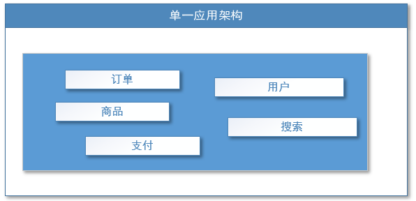

适用于小型网站，小型管理系统，将所有功能都部署到一个功能里，简单易用。

缺点： 1、性能扩展比较难

2、协同开发问题

3、不利于升级维护

**垂直应用架构**

当访问量逐渐增大，单一应用增加机器带来的加速度越来越小，将应用拆成互不相干的几个应用，以提升效率。此时，用于加速前端页面开发的 Web 框架(MVC)是关键。


通过切分业务来实现各个模块独立部署，降低了维护和部署的难度，团队各司其职更易管理，性能扩展也更方便，更有针对性。

缺点： 公用模块无法重复利用，开发性的浪费

**分布式服务架构**

当垂直应用越来越多，应用之间交互不可避免，将核心业务抽取出来，作为独立的服务，逐渐形成稳定的服务中心，使前端应用能更快速的响应多变的市场需求。此时，用于提高业务复用及整合的**分布式服务框架(RPC)**是关键。

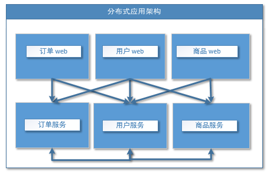

**流动计算架构**

当服务越来越多，容量的评估，小服务资源的浪费等问题逐渐显现，此时需增加一个调度中心基于访问压力实时管理集群容量，提高集群利用率。此时，用于**提高机器利用率的资源调度和治理中心(SOA)[
Service Oriented Architecture]是关键**。

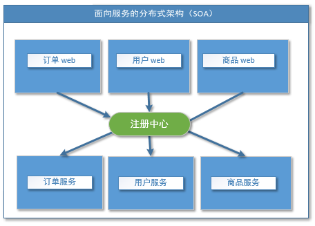

### 1.3）、RPC

**什么叫 RPC**？

RPC【Remote Procedure Call】是指远程过程调用，是一种进程间通信方式，他是一种技术的思想，而不是规范。它允许程序调用另一个地址空间（通常是共享网络的另一台机器上）的过程或函数，而不用程序员显式编码这个远程调用的细节。即程序员无论是调用本地的还是远程的函数，本质上编写的调用代码基本相同。

RPC 基本原理

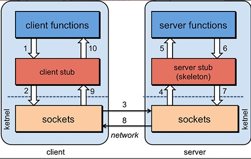

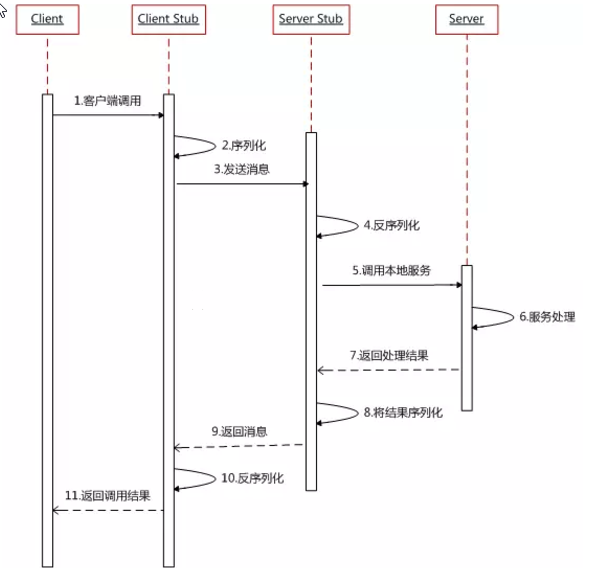

RPC 两个核心模块：通讯，序列化。

核心功能实现：

RPC 的核心功能主要由 5 个模块组成，如果想要自己实现一个 RPC，最简单的方式要实现三个技术点，分别是：

- 服务寻址
- 数据流的序列化和反序列化
- 网络传输

服务寻址：

服务寻址可以使用 Call ID 映射。在本地调用中，函数体是直接通过函数指针来指定的，但是在远程调用中，函数指针是不行的，因为两个进程的地址空间是完全不一样的。

所以在 RPC 中，所有的函数都必须有自己的一个 ID。这个 ID 在所有进程中都是唯一确定的。

客户端在做远程过程调用时，必须附上这个 ID。然后我们还需要在客户端和服务端分别维护一个函数和 Call ID 的对应表。

当客户端需要进行远程调用时，它就查一下这个表，找出相应的 Call ID，然后把它传给服务端，服务端也通过查表，来确定客户端需要调用的函数，然后执行相应函数的代码。

序列化与反序列化：

客户端怎么把参数值传给远程的函数呢?在本地调用中，我们只需要把参数压到栈里，然后让函数自己去栈里读就行。

但是在远程过程调用时，客户端跟服务端是不同的进程，不能通过内存来传递参数。

这时候就需要客户端把参数先转成一个字节流，传给服务端后，再把字节流转成自己能读取的格式。

只有二进制数据才能在网络中传输，序列化和反序列化的定义是：

- 将对象转换成二进制流的过程叫做序列化
- 将二进制流转换成对象的过程叫做反序列化

这个过程叫序列化和反序列化。同理，从服务端返回的值也需要序列化反序列化的过程。

网络传输

远程调用往往用在网络上，客户端和服务端是通过网络连接的。

所有的数据都需要通过网络传输，因此就需要有一个网络传输层。网络传输层需要把 Call ID 和序列化后的参数字节流传给服务端，然后再把序列化后的调用结果传回客户端。

只要能完成这两者的，都可以作为传输层使用。因此，它所使用的协议其实是不限的，能完成传输就行。

尽管大部分 RPC 框架都使用 TCP 协议，但其实 UDP 也可以，而 gRPC 干脆就用了 HTTP2。

RPC 与 Http 的区别：

相同：底层通讯都是基于 Socket，都可以远程调用

不同点：

RPC 是基于 TCP 协议的，也可以基于 Http，Http 是基于 Http 协议的

RPC 请求体积小，Http 请求中会包含很多内容。

RPC 基于 thrift 实现二进制高效传输，Http 大部分通过 json 来实现，字节大小与序列化都耗时更多

RPC 自带负载均衡

RPC 多用于公司内部调用，Http 一般对外。

## 2、dubbo 核心概念

### 2.1）、简介

Apache Dubbo (incubating) \|ˈdʌbəʊ\| 是一款高性能、轻量级的开源 JavaRPC 框架，它提供了三大核心能力：面向接口的远程方法调用，智能容错和负载均衡，以及服务自动注册和发现。

官网：

<http://dubbo.apache.org/>

#### 对比 SpringCloud


### 2.2）、基本概念


**服务提供者（Provider）**：暴露服务的服务提供方，服务提供者在启动时，向注册中心注册自己提供的服务。

**服务消费者（Consumer）**:
调用远程服务的服务消费方，服务消费者在启动时，向注册中心订阅自己所需的服务，服务消费者，从提供者地址列表中，基于软负载均衡算法，选一台提供者进行调用，如果调用失败，再选另一台调用。

**注册中心（Registry）**：注册中心返回服务提供者地址列表给消费者，如果有变更，注册中心将基于长连接推送变更数据给消费者

**监控中心（Monitor）**：服务消费者和提供者，在内存中累计调用次数和调用时间，定时每分钟发送一次统计数据到监控中心

- 调用关系说明

- 服务容器负责启动，加载，运行服务提供者。

- 服务提供者在启动时，向注册中心注册自己提供的服务。

- 服务消费者在启动时，向注册中心订阅自己所需的服务。

- 注册中心返回服务提供者地址列表给消费者，如果有变更，注册中心将基于长连接推送变更数据给消费者。

- 服务消费者，从提供者地址列表中，基于软负载均衡算法，选一台提供者进行调用，如果调用失败，再选另一台调用。

- 服务消费者和提供者，在内存中累计调用次数和调用时间，定时每分钟发送一次统计数据到监控中心。

## 3、dubbo 环境搭建

### 3.1）Window 下安装 zookeeper

1：下载 zookeeper

网址 <https://archive.apache.org/dist/zookeeper/zookeeper-3.4.13/>

2：解压 Zookeeper

解压运行 zkServer.cmd ，初次运行会报错，没有 zoo.cfg 配置文件

3：修改 zoo.cfg 配置文件

将 conf 下的 zoo.sample.cfg 复制一份改名为 zoo.cfg 即可

注意几个重要位置：

dataDir=./ 临时数据存储的目录（可写相对路径）

clientPort=2181 zookeeper 的端口号

修改完成后再次启动 zookeeper

4、使用 zkCli.cmd 测试

ls /：列出 zookeeper 根下保存的所有节点

create –e /xqc 123：创建一个 xqc 节点，值为 123

get /xqc：获取/xqc 节点的值

### 3.2）windows 安装 dubbo-admin

dubbo 本身并不是一个服务软件。它其实就是一个 jar 包能够帮你的 java 程序连接到 zookeeper，并利用 zookeeper 消费、提供服务。所以你不用在 Linux 上启动什么 dubbo 服务。

但是为了让用户更好的管理监控众多的 dubbo 服务，官方提供了一个可视化的监控程序，不过这个监控即使不装也不影响使用。

1、下载 dubbo-admin <https://github.com/apache/incubator-dubbo-ops> 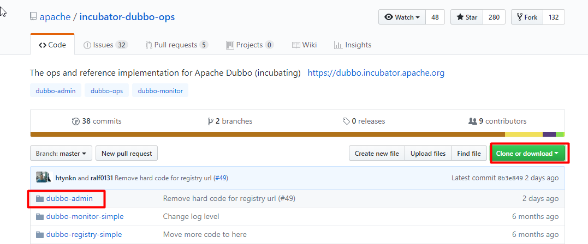

2、进入目录，修改 dubbo-admin 配置 修改 src\\main\\resources\\application.properties 指定 zookeeper 地址 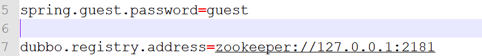

3、打包 dubbo-admin mvn clean package -Dmaven.test.skip=true

4、运行 dubbo-admin java -jar dubbo-admin-0.0.1-SNAPSHOT.jar **注意：【有可能控制台看着启动了，但是网页打不开，需要在控制台按下 ctrl+c 即可】** 默认使用 root/root 登陆 

### 3.3）linux 安装 zookeeper

1、安装 jdk

1、下载 jdk <http://www.oracle.com/technetwork/java/javase/downloads/jdk8-downloads-2133151.html >

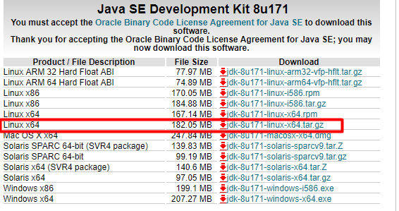

不要使用 wget 命令获取 jdk 链接，这是默认不同意，导致下载来的 jdk 压缩内容错误

2、上传到服务器并解压

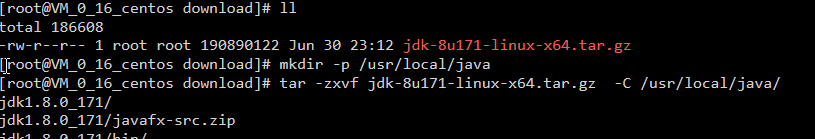

3、设置环境变量

/usr/local/java/jdk1.8.0_171


文件末尾加入下面配置

export JAVA_HOME=/usr/local/java/jdk1.8.0_171

export JRE_HOME=\${JAVA_HOME}/jre

export CLASSPATH=.:\${JAVA_HOME}/lib:\${JRE_HOME}/lib

export PATH=\${JAVA_HOME}/bin:\$PATH

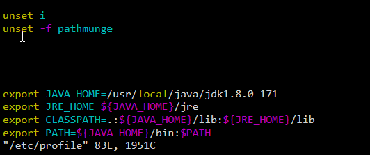

4、使环境变量生效&测试 JDK

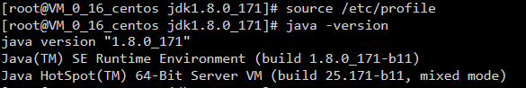

2、安装 zookeeper

1、下载 zookeeper

网址 https://archive.apache.org/dist/zookeeper/zookeeper-3.4.11/

wget https://archive.apache.org/dist/zookeeper/zookeeper-3.4.11/zookeeper-3.4.11.tar.gz

2、解压


3、移动到指定位置并改名为 zookeeper

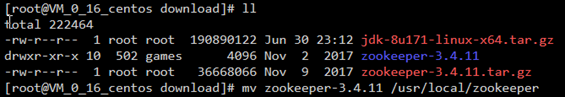


3、开机启动 zookeeper

1）-复制如下脚本

\#!/bin/bash

\#chkconfig:2345 20 90

\#description:zookeeper

\#processname:zookeeper

ZK_PATH=/usr/local/zookeeper

export JAVA_HOME=/usr/local/java/jdk1.8.0_171

case \$1 in

start) sh \$ZK_PATH/bin/zkServer.sh start;;

stop) sh \$ZK_PATH/bin/zkServer.sh stop;;

status) sh \$ZK_PATH/bin/zkServer.sh status;;

restart) sh \$ZK_PATH/bin/zkServer.sh restart;;

\*) echo "require start\|stop\|status\|restart" ;;

esac

 2）-把脚本注册为 Service

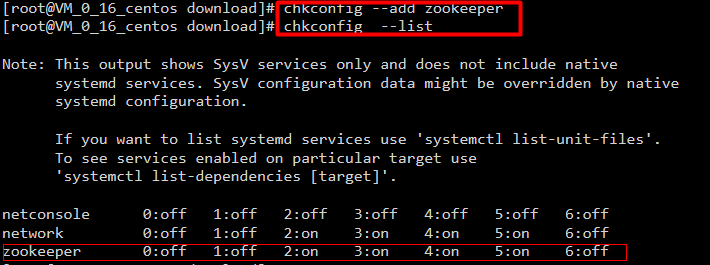 3）-增加权限

 |

4、配置 zookeeper

1、初始化 zookeeper 配置文件 拷贝/usr/local/zookeeper/conf/zoo_sample.cfg 到同一个目录下改个名字叫 zoo.cfg 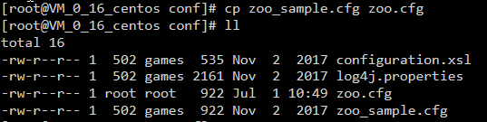

2、启动 zookeeper 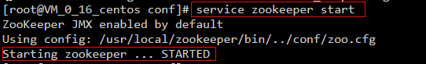

### 3.4）linux 安装 dubbo-admin

1、安装 Tomcat8

（旧版 dubbo-admin 是 war，新版是 jar 不需要安装 Tomcat）

1、下载 Tomcat8 并解压 <https://tomcat.apache.org/download-80.cgi>

wget <http://mirrors.shu.edu.cn/apache/tomcat/tomcat-8/v8.5.32/bin/apache-tomcat-8.5.32.tar.gz>

2、解压移动到指定位置 

3、开机启动 tomcat8  复制如下脚本

\#!/bin/bash

\#chkconfig:2345 21 90

\#description:apache-tomcat-8

\#processname:apache-tomcat-8

CATALANA_HOME=/opt/apache-tomcat-8.5.32

export JAVA_HOME=/opt/java/jdk1.8.0_171

case $1 in

start)

echo "Starting Tomcat..."

$CATALANA_HOME/bin/startup.sh

;;

stop)

echo "Stopping Tomcat..."

$CATALANA_HOME/bin/shutdown.sh

;;

restart)

echo "Stopping Tomcat..."

$CATALANA_HOME/bin/shutdown.sh

sleep 2

echo

echo "Starting Tomcat..."

$CATALANA_HOME/bin/startup.sh

;;

\*)

echo "Usage: tomcat {start|stop|restart}"

;; esac

4、注册服务&添加权限 


5、启动服务&访问 tomcat 测试

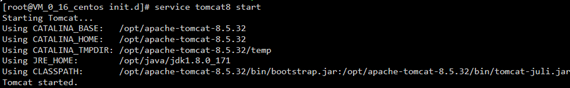

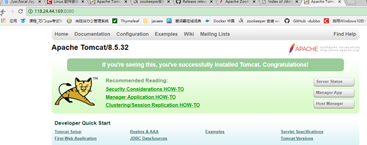

2、安装 dubbo-admin

dubbo 本身并不是一个服务软件。它其实就是一个 jar 包能够帮你的 java 程序连接到 zookeeper，并利用 zookeeper 消费、提供服务。所以你不用在 Linux 上启动什么 dubbo 服务。

但是为了让用户更好的管理监控众多的 dubbo 服务，官方提供了一个可视化的监控程序，不过这个监控即使不装也不影响使用。

1、下载 dubbo-admin <https://github.com/apache/incubator-dubbo-ops>


2、进入目录，修改 dubbo-admin 配置 修改 src\\main\\resources\\application.properties 指定 zookeeper 地址 

3、打包

dubbo-admin mvn clean package -Dmaven.test.skip=true

4、运行 dubbo-admin java -jar dubbo-admin-0.0.1-SNAPSHOT.jar 默认使用 root/root 登陆 

## 4、dubbo-helloworld

### 4.1）、提出需求

某个电商系统，订单服务需要调用用户服务获取某个用户的所有地址；

我们现在 需要创建两个服务模块进行测试

| 模块                  | 功能           |
| --------------------- | -------------- |
| 订单服务 web 模块     | 创建订单等     |
| 用户服务 service 模块 | 查询用户地址等 |

测试预期结果：

订单服务 web 模块在 A 服务器，用户服务模块在 B 服务器，A 可以远程调用 B 的功能。

### 4.2）、工程架构

根据 dubbo《服务化最佳实践》

#### 1、分包

建议将服务接口，服务模型，服务异常等均放在 API 包中，因为服务模型及异常也是 API
的一部分，同时，这样做也符合分包原则：重用发布等价原则(REP)，共同重用原则(CRP)。

如果需要，也可以考虑在 API 包中放置一份 spring 的引用配置，这样使用方，只需在
spring
加载过程中引用此配置即可，配置建议放在模块的包目录下，以免冲突，如：com/alibaba/china/xxx/dubbo-reference.xml。

#### 2、粒度

服务接口尽可能大粒度，每个服务方法应代表一个功能，而不是某功能的一个步骤，否则将面临分布式事务问题，Dubbo
暂未提供分布式事务支持。

服务接口建议以业务场景为单位划分，并对相近业务做抽象，防止接口数量爆炸。

不建议使用过于抽象的通用接口，如：Map
query(Map)，这样的接口没有明确语义，会给后期维护带来不便。

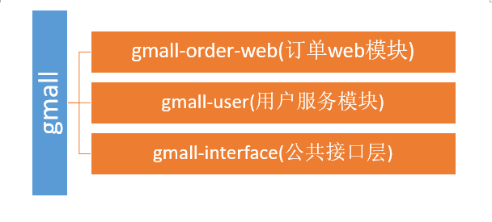

### 4.3）、创建模块

1、gmall-interface：公共接口层（model，service，exception…）

作用：定义公共接口，也可以导入公共依赖

1、Bean 模型

```java

public class UserAddress implements Serializable{
    private Integer id;
    private String userAddress;
    private String userId;
    private String consignee;
    private String phoneNum;
    private String isDefault;
}
```

3、Service 接口

```java
UserService
public List<UserAddress> getUserAddressList(String userId)
```


2、gmall-user：用户模块（对用户接口的实现）

```xml
pom.xml
<dependencies>
     <dependency\>
         <groupId>com.xqc.dubbo</groupId>
         <artifactId>gmall-interface</artifactId>
         <version>0.0.1-SNAPSHOT</version>
      </dependency>
</dependencies\>
```

```java
service
public class** UserServiceImpl **implements** UserService {
    @Override  **public** List\<UserAddress\> getUserAddressList(String userId) {
        // **TODO** Auto-generated method stub
        **return** userAddressDao.getUserAddressById(userId);
    }
}
```

4、gmall-order-web：订单模块（调用用户模块）

```xml
pom.xml
<dependencies\>
    <dependency\>
        <groupId\>com.xqc.dubbo\</groupId\>
        <artifactId\>gmall-interface\</artifactId\>
        <version\>0.0.1-SNAPSHOT\</version\>
    </dependency\>
</dependencies\>
```

测试

```java
 **public class** OrderService {
     UserService userService;
      /* 初始化订单，查询用户的所有地址并返回
      @param  userId
      @return  */
     public List<UserAddress> initOrder(String userId){
         return userService.getUserAddressList(userId);
     }
 }
```

现在这样是无法进行调用的。我们 gmall-order-web 引入了 gmall-interface，但是 interface 的实现是 gmall-user，我们并没有引入，而且实际他可能还在别的服务器中。

### 4.4）、使用 dubbo 改造

**1、改造 gmall-user 作为服务提供者**

```xml
1、引入dubbo
		<!-- 引入dubbo -->
		<dependency>
			<groupId>com.alibaba</groupId>
			<artifactId>dubbo</artifactId>
			<version>2.6.2</version>
		</dependency>
	<!-- 由于我们使用zookeeper作为注册中心，所以需要操作zookeeper
dubbo 2.6以前的版本引入zkclient操作zookeeper
dubbo 2.6及以后的版本引入curator操作zookeeper
下面两个zk客户端根据dubbo版本2选1即可
-->
		<dependency>
			<groupId>com.101tec</groupId>
			<artifactId>zkclient</artifactId>
			<version>0.10</version>
		</dependency>
		<!-- curator-framework -->
		<dependency>
			<groupId>org.apache.curator</groupId>
			<artifactId>curator-framework</artifactId>
			<version>2.12.0</version>
		</dependency>

```

2：配置提供者

```xml
<!--当前应用的名字  -->
	<dubbo:application name="gmall-user"></dubbo:application>
	<!--指定注册中心的地址  -->
    <dubbo:registry address="zookeeper://118.24.44.169:2181" />
    <!--使用dubbo协议，将服务暴露在20880端口  -->
    <dubbo:protocol name="dubbo" port="20880" />
    <!-- 指定需要暴露的服务 -->
    <dubbo:service interface="com.xqc.gmall.service.UserService" ref="userServiceImpl" />
```

3：启动服务

```java

	public static void main(String[] args) throws IOException {
		ClassPathXmlApplicationContext context =
				new ClassPathXmlApplicationContext("classpath:spring-beans.xml");

		System.in.read();
	}

```

**2、改造 gmall-order-web 作为服务消费者**

```xml
1、引入dubbo
		<!-- 引入dubbo -->
		<dependency>
			<groupId>com.alibaba</groupId>
			<artifactId>dubbo</artifactId>
			<version>2.6.2</version>
		</dependency>
	<!-- 由于我们使用zookeeper作为注册中心，所以需要引入zkclient和curator操作zookeeper -->
		<dependency>
			<groupId>com.101tec</groupId>
			<artifactId>zkclient</artifactId>
			<version>0.10</version>
		</dependency>
		<!-- curator-framework -->
		<dependency>
			<groupId>org.apache.curator</groupId>
			<artifactId>curator-framework</artifactId>
			<version>2.12.0</version>
		</dependency>
```

2：配置消费者信息

```xml
<!-- 应用名 -->
	<dubbo:application name="gmall-order-web"></dubbo:application>
	<!-- 指定注册中心地址 -->
	<dubbo:registry address="zookeeper://118.24.44.169:2181" />
	<!-- 生成远程服务代理，可以和本地bean一样使用demoService -->
	<dubbo:reference id="userService" interface="com.xqc.gmall.service.UserService"></dubbo:reference>


```

**3、测试调用**

访问 gmall-order-web 的 initOrder 请求，会调用 UserService 获取用户地址；

调用成功。说明我们 order 已经可以调用远程的 UserService 了；

**4、注解版**

1：服务提供方

```java
<dubbo:application name="gmall-user"></dubbo:application>
    <dubbo:registry address="zookeeper://118.24.44.169:2181" />
    <dubbo:protocol name="dubbo" port="20880" />
<dubbo:annotation package="com.xqc.gmall.user.impl"/>

import com.alibaba.dubbo.config.annotation.Service;
import com.xqc.gmall.bean.UserAddress;
import com.xqc.gmall.service.UserService;
import com.xqc.gmall.user.mapper.UserAddressMapper;

@Service //使用dubbo提供的service注解，注册暴露服务
public class UserServiceImpl implements UserService {

	@Autowired
	UserAddressMapper userAddressMapper;

```

2：服务消费方

```xml
<dubbo:application name="gmall-order-web"></dubbo:application>
<dubbo:registry address="zookeeper://118.24.44.169:2181" />
<dubbo:annotation package="com.xqc.gmall.order.controller"/>

@Controller
public class OrderController {

	@Reference  //使用dubbo提供的reference注解引用远程服务
	UserService userService;

```

## 5、监控中心

### 5.1）、dubbo-admin

图形化的服务管理页面；安装时需要指定注册中心地址，即可从注册中心中获取到所有的提供者/消费者进行配置管理

### 5.2）、dubbo-monitor-simple

简单的监控中心；

#### 1、安装

| 1、下载 dubbo-ops <https://github.com/apache/incubator-dubbo-ops>                                                                                                                                      |
| ------------------------------------------------------------------------------------------------------------------------------------------------------------------------------------------------------ |
| 2、修改配置指定注册中心地址 进入 dubbo-monitor-simple\\src\\main\\resources\\conf 修改 dubbo.properties 文件 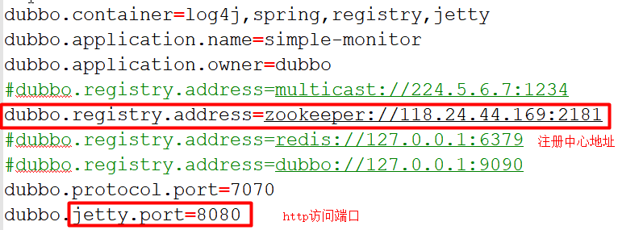 |
| 3、打包 dubbo-monitor-simple mvn clean package -Dmaven.test.skip=true                                                                                                                                  |
| 4、解压 tar.gz 文件，并运行 start.bat 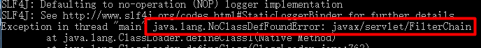 如果缺少 servlet-api，自行导入 servlet-api 再访问监控中心              |
| 5、启动访问 8080 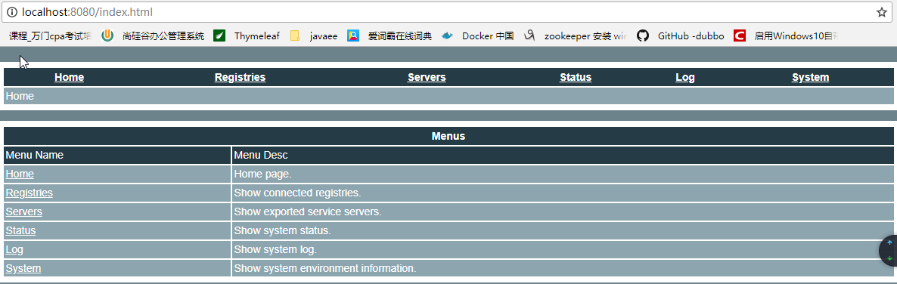                                                                                             |

#### 2、监控中心配置

所有服务配置连接监控中心，进行监控统计

\<!-- 监控中心协议，如果为 protocol="registry"，表示从注册中心发现监控中心地址，否则直连监控中心 --\>

\<dubbo:monitor protocol=_"registry"_\>\</dubbo:monitor\>

Simple Monitor 挂掉不会影响到 Consumer 和 Provider
之间的调用，所以用于生产环境不会有风险。

Simple Monitor
采用磁盘存储统计信息，请注意安装机器的磁盘限制，如果要集群，建议用 mount 共享磁盘。

## 6、整合 SpringBoot

##### 1、引入 spring-boot-starter 以及 dubbo 和 curator 的依赖

```xml
<dependency>
    <groupId>com.alibaba.boot</groupId>
    <artifactId>dubbo-spring-boot-starter</artifactId>
    <version>0.2.0</version>
</dependency>
```

注意 starter 版本适配：

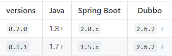

2：配置 application.properties

```yml
提供者配置：

dubbo.application.name=gmall-user
# 这里是zk的连接配置
dubbo.registry.protocol=zookeeper
dubbo.registry.address=192.168.67.159:2181
# 需要扫描的包
dubbo.scan.base-package=com.xqc.gmall
# ProtocolConfig Bean
dubbo.protocol.id=dubbo
dubbo.protocol.name=dubbo

application.name就是服务名，不能跟别的dubbo提供端重复
registry.protocol 是指定注册中心协议
registry.address 是注册中心的地址加端口号
protocol.name 是分布式固定是dubbo,不要改。
base-package  注解方式要扫描的包
消费者配置：
dubbo.application.name=gmall-order-web
dubbo.registry.protocol=zookeeper
dubbo.registry.address=192.168.67.159:2181
dubbo.scan.base-package=com.xqc.gmall
dubbo.protocol.name=dubbo

```

3：dubbo 注解

@Service、@Reference

【如果没有在配置中写 dubbo.scan.base-package,还需要使用@EnableDubbo 注解】

# 二、dubbo 配置

## 1、配置原则


JVM 启动 -D
参数优先，这样可以使用户在部署和启动时进行参数重写，比如在启动时需改变协议的端口。

XML 次之，如果在 XML 中有配置，则 dubbo.properties 中的相应配置项无效。

Properties 最后，相当于缺省值，只有 XML 没有配置时，dubbo.properties
的相应配置项才会生效，通常用于共享公共配置，比如应用名。

## 2、重试次数

失败自动切换，当出现失败，重试其它服务器，但重试会带来更长延迟。可通过 retries="2" 来设置重试次数(不含第一次)。

重试次数配置如下：

```xml
<dubbo:service retries="2" />
或
<dubbo:reference retries="2" />
或
<dubbo:reference>
    <dubbo:method name="findFoo" retries="2" />
</dubbo:reference>

```

## 3、超时时间

timeout 由于网络或服务端不可靠，会导致调用出现一种不确定的中间状态（超时）。为了避免超时导致客户端资源（线程）挂起耗尽，必须设置超时时间。

### 1、Dubbo 消费端

全局超时配置

```xml
<dubbo:consumer timeout="5000" />

指定接口以及特定方法超时配置
<dubbo:reference interface="com.foo.BarService" timeout="2000">
    <dubbo:method name="sayHello" timeout="3000" />
</dubbo:reference>
```

### 2、Dubbo 服务端

全局超时配置

```xml
<dubbo:provider timeout="5000" />

指定接口以及特定方法超时配置
<dubbo:provider interface="com.foo.BarService" timeout="2000">
    <dubbo:method name="sayHello" timeout="3000" />
</dubbo:provider>

```

### 3、配置原则

dubbo 推荐在 Provider 上尽量多配置 Consumer 端属性：

1、作服务的提供者，比服务使用方更清楚服务性能参数，如调用的超时时间，合理的重试次数，等等

2、在 Provider 配置后，Consumer 不配置则会使用 Provider 的配置值，即 Provider 配置可以作为 Consumer 的缺省值。否则，Consumer 会使用 Consumer 端的全局设置，这对于 Provider 不可控的，并且往往是不合理的

配置的覆盖规则：

1. 方法级配置别优于接口级别，即小 Scope 优先

2. Consumer 端配置 优于 Provider 配置 优于 全局配置，

3. 最后是 Dubbo Hard Code 的配置值（见配置文档）


## 4、版本号

当一个接口实现，出现不兼容升级时，可以用版本号过渡，版本号不同的服务相互间不引用。

可以按照以下的步骤进行版本迁移：

> 在低压力时间段，先升级一半提供者为新版本

> 再将所有消费者升级为新版本

> 然后将剩下的一半提供者升级为新版本

老版本服务提供者配置：

\<dubbo:service interface="com.foo.BarService" version="1.0.0" /\>

新版本服务提供者配置：

\<dubbo:service interface="com.foo.BarService" version="2.0.0" /\>

老版本服务消费者配置：

\<dubbo:reference id="barService" interface="com.foo.BarService" version="1.0.0" /\>

新版本服务消费者配置： \<dubbo:reference id="barService" interface="com.foo.BarService" version="2.0.0" /\>

如果不需要区分版本，可以按照以下的方式配置： \<dubbo:reference id="barService" interface="com.foo.BarService" version="\*" /\>

# 三、高可用

## 1、zookeeper 宕机与 dubbo 直连

现象：zookeeper 注册中心宕机，还可以消费 dubbo 暴露的服务。

原因：健壮性

监控中心宕掉不影响使用，只是丢失部分采样数据

数据库宕掉后，注册中心仍能通过缓存提供服务列表查询，但不能注册新服务

注册中心对等集群，任意一台宕掉后，将自动切换到另一台

**注册中心全部宕掉后，服务提供者和服务消费者仍能通过本地缓存通讯**

服务提供者无状态，任意一台宕掉后，不影响使用

服务提供者全部宕掉后，服务消费者应用将无法使用，并无限次重连等待服务提供者恢复系统不能提供服务的时间；

## 2、集群负载均衡

在集群负载均衡时，Dubbo 提供了多种均衡策略，缺省为 random 随机调用。

负载均衡策略

**Random LoadBalance** ：随机，按权重设置随机概率。 在一个截面上碰撞的概率高，但调用量越大分布越均匀，而且按概率使用权重后也比较均匀，有利于动态调整提供者权重。

**RoundRobin LoadBalance** ：轮循，按公约后的权重设置轮循比率。 存在慢的提供者累积请求的问题，比如：第二台机器很慢，但没挂，当请求调到第二台时就卡在那，久而久之，所有请求都卡在调到第二台上。

**LeastActive LoadBalance**： 最少活跃调用数，相同活跃数的随机，活跃数指调用前后计数差。 使慢的提供者收到更少请求，因为越慢的提供者的调用前后计数差会越大。

**ConsistentHash LoadBalance** ：一致性 Hash，相同参数的请求总是发到同一提供者。 当某一台提供者挂时，原本发往该提供者的请求，基于虚拟节点，平摊到其它提供者，不会引起剧烈变动。

算法参见：http://en.wikipedia.org/wiki/Consistent_hashing 缺省只对第一个参数 Hash，如果要修改，请配置

<dubbo:parameter key="hash.arguments" value="0,1" /\>

缺省用 160 份虚拟节点，如果要修改，请配置

\<dubbo:parameter key="hash.nodes" value="320" /\> |

## 3、整合 hystrix，服务熔断与降级处理

### 1、服务降级

**什么是服务降级？**

**当服务器压力剧增的情况下，根据实际业务情况及流量，对一些服务和页面有策略的不处理或换种简单的方式处理，从而释放服务器资源以保证核心交易正常运作或高效运作。**

可以通过服务降级功能临时屏蔽某个出错的非关键服务，并定义降级后的返回策略。

向注册中心写入动态配置覆盖规则：

```xml
RegistryFactory registryFactory = ExtensionLoader.getExtensionLoader(RegistryFactory.class).getAdaptiveExtension();
Registry registry = registryFactory.getRegistry(URL.valueOf("zookeeper://10.20.153.10:2181"));
registry.register(URL.valueOf("override://0.0.0.0/com.foo.BarService?category=configurators&dynamic=false&application=foo&mock=force:return+null"));
```

其中：

- mock=force:return+null 表示消费方对该服务的方法调用都直接返回 null 值，不发起远程调用。用来屏蔽不重要服务不可用时对调用方的影响。
- 还可以改为 mock=fail:return+null 表示消费方对该服务的方法调用在失败后，再返回 null 值，不抛异常。用来容忍不重要服务不稳定时对调用方的影响。

### 2、集群容错

在集群调用失败时，Dubbo 提供了多种容错方案，缺省为 failover 重试。

**集群容错模式**

**Failover Cluster** 失败自动切换，当出现失败，重试其它服务器。通常用于读操作，但重试会带来更长延迟。可通过 retries="2" 来设置重试次数(不含第一次)。 重试次数配置如下：

```xml
<dubbo:service retries="2" />
或
<dubbo:reference retries="2" />
或
<dubbo:reference>
    <dubbo:method name="findFoo" retries="2" />
</dubbo:reference>
```

Failover Cluster：失败自动切换，自动重试其他服务器（默认）

**Failfast Cluster** 快速失败，只发起一次调用，失败立即报错。通常用于非幂等性的写操作，比如新增记录。

**Failsafe Cluster** 失败安全，出现异常时，直接忽略。通常用于写入审计日志等操作。

**Failback Cluster** 失败自动恢复，后台记录失败请求，定时重发。通常用于消息通知操作。

**Forking Cluster** 并行调用多个服务器，只要一个成功即返回。通常用于实时性要求较高的读操作，但需要浪费更多服务资源。可通过 forks="2" 来设置最大并行数。

**Broadcast Cluster** 广播调用所有提供者，逐个调用，任意一台报错则报错 [2]。通常用于通知所有提供者更新缓存或日志等本地资源信息。

**集群模式配置** 按照以下示例在服务提供方和消费方配置集群模式

\<dubbo:service cluster="failsafe" /\> 或

\<dubbo:reference cluster="failsafe" /\>

### 3、整合 hystrix

Hystrix 旨在通过控制那些访问远程系统、服务和第三方库的节点，从而对延迟和故障提供更强大的容错能力。Hystrix 具备拥有回退机制和断路器功能的线程和信号隔离，请求缓存和请求打包，以及监控和配置等功能

#### 1、配置 spring-cloud-starter-netflix-hystrix

spring boot 官方提供了对 hystrix 的集成，直接在 pom.xml 里加入依赖：

```xml
        <dependency>
            <groupId>org.springframework.cloud</groupId>
            <artifactId>spring-cloud-starter-netflix-hystrix</artifactId>
            <version>1.4.4.RELEASE</version>
        </dependency>
```

然后在 Application 类上增加@EnableHystrix 来启用 hystrix starter：

```java
@SpringBootApplication
@EnableHystrix
public class ProviderApplication {

```

#### 2、配置 Provider 端

在 Dubbo 的 Provider 上增加@HystrixCommand 配置，这样子调用就会经过 Hystrix 代理。

```java
@Service(version = "1.0.0")
public class HelloServiceImpl implements HelloService {
    @HystrixCommand(commandProperties = {
     @HystrixProperty(name = "circuitBreaker.requestVolumeThreshold", value = "10"),
     @HystrixProperty(name = "execution.isolation.thread.timeoutInMilliseconds", value = "2000") })
    @Override
    public String sayHello(String name) {
        // System.out.println("async provider received: " + name);
        // return "annotation: hello, " + name;
        throw new RuntimeException("Exception to show hystrix enabled.");
    }
}
```

#### 3、配置 Consumer 端

对于 Consumer 端，则可以增加一层 method 调用，并在 method 上配置@HystrixCommand。当调用出错时，会走 fallbackMethod = "reliable"的调用里。

```java
    @Reference(version = "1.0.0")
    private HelloService demoService;

    @HystrixCommand(fallbackMethod = "reliable")
    public String doSayHello(String name) {
        return demoService.sayHello(name);
    }
    public String reliable(String name) {
        return "hystrix fallback value";
    }
```

# 四、dubbo 原理

高性能的 RPC 远程服务调用，提供了基于长连接的 NOI 框架封装抽象，

## 1、RPC 原理

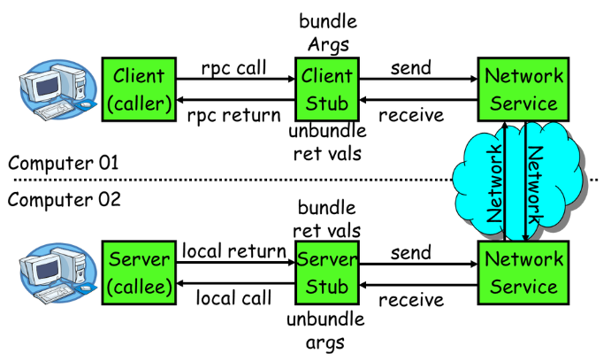

一次完整的 RPC 调用流程（同步调用，异步另说）如下：

**1）服务消费方（client）调用以本地调用方式调用服务；**

2）client stub 接收到调用后负责将方法、参数等组装成能够进行网络传输的消息体；

3）client stub 找到服务地址，并将消息发送到服务端；

4）server stub 收到消息后进行解码；

5）server stub 根据解码结果调用本地的服务；

6）本地服务执行并将结果返回给 server stub；

7）server stub 将返回结果打包成消息并发送至消费方；

8）client stub 接收到消息，并进行解码；

**9）服务消费方得到最终结果。**

RPC 框架的目标就是要 2\~8 这些步骤都封装起来，这些细节对用户来说是透明的，不可见的。

## 2、netty 通信原理

Netty 是一个异步事件驱动的网络应用程序框架，
用于快速开发可维护的高性能协议服务器和客户端。它极大地简化并简化了 TCP 和 UDP 套接字服务器等网络编程。

BIO：(Blocking IO)

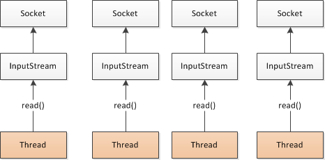

NIO (Non-Blocking IO)

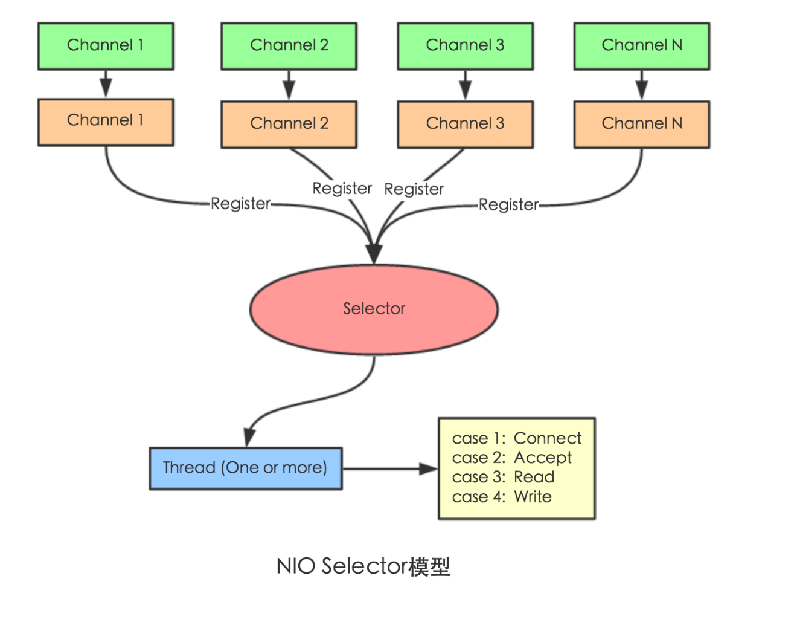

Selector 一般称 为**选择器** ，也可以翻译为 **多路复用器，**

Connect（连接就绪）、Accept（接受就绪）、Read（读就绪）、Write（写就绪）

Netty 基本原理：

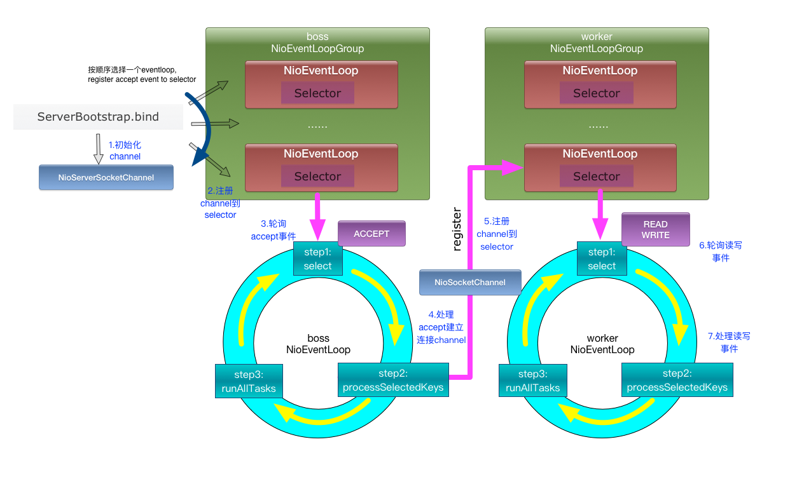

## 3、dubbo 原理

### 1、框架设计


- config 配置层：对外配置接口，以 ServiceConfig, ReferenceConfig
  为中心，可以直接初始化配置类，也可以通过 spring 解析配置生成配置类

- proxy 服务代理层：服务接口透明代理，生成服务的客户端 Stub 和服务器端
  Skeleton, 以 ServiceProxy 为中心，扩展接口为 ProxyFactory

- registry 注册中心层：封装服务地址的注册与发现，以服务 URL 为中心，扩展接口为
  RegistryFactory, Registry, RegistryService

- cluster 路由层：封装多个提供者的路由及负载均衡，并桥接注册中心，以 Invoker
  为中心，扩展接口为 Cluster, Directory, Router, LoadBalance

- monitor 监控层：RPC 调用次数和调用时间监控，以 Statistics 为中心，扩展接口为
  MonitorFactory, Monitor, MonitorService

- protocol 远程调用层：封装 RPC 调用，以 Invocation, Result 为中心，扩展接口为
  Protocol, Invoker, Exporter

- exchange 信息交换层：封装请求响应模式，同步转异步，以 Request, Response
  为中心，扩展接口为 Exchanger, ExchangeChannel, ExchangeClient,
  ExchangeServer

- transport 网络传输层：抽象 mina 和 netty 为统一接口，以 Message
  为中心，扩展接口为 Channel, Transporter, Client, Server, Codec

- serialize 数据序列化层：可复用的一些工具，扩展接口为 Serialization,
  ObjectInput, ObjectOutput, ThreadPool

### 2、启动解析、加载配置信息


### 3、服务暴露

流程：首先 provider 启动时，先把想要提供的服务暴露在本地，然后再把服务暴露到远程，启动 Netty 服务，建立长连接，连接到注册中心 ZK 上，然后监控 ZK 上的消费服务。

服务的暴露起始于 Spring IOC 容器刷新完毕之后，会根据配置参数组装成 URL， 然后根据 URL 的参数来进行本地或者远程调用。

在第一次暴露的时候会调用 createServer 来创建 Server，默认是 NettyServer。

然后将 export 得到的 exporter 存入一个 Map 中，供之后的远程调用查找，然后会向注册中心注册提供者的信息。

Dubbo 会在 Spring 实例化完 bean 之后，在刷新容器最后一步发布 ContextRefreshEvent 事件的时候，通知实现了 ApplicationListener 的 ServiceBean 类进行回调 onApplicationEvent 事件方法，Dubbo 会在这个方法中调用 ServiceBean 父类 ServiceConfig 的 export 方法，而该方法真正实现了服务的（异步或者非异步）发布。


### 4、服务引用

引入时机有两种，一种饿汉式，一种懒汉式

饿汉式就是加载会引入，懒汉式是只有这个服务被注入到其他类中时启动引入流程，默认是懒汉式

会先根据配置参数组装 URL，一般而言我们都会配置的注册中心，所以会构建 RegistryDirectory

向注册中心注册消费者的信息，并且订阅提供者，配置，路由等节点。

得知提供者的信息之后会进入 Dubbo 协议的引入，创建 invoker，期间会包含 NettyClient 来进行远程通信，最后通过 Cluster 来包装 Invoker，默认是 FailoverCluster,最终返回代理类。


### 5、服务调用

它有几个角色，服务提供者，服务消费者，注册中心，注册中心保存一个 List<URL>,提供者有多个实例，加上 ip 和路径，消费者负载均衡的调用其中一个。

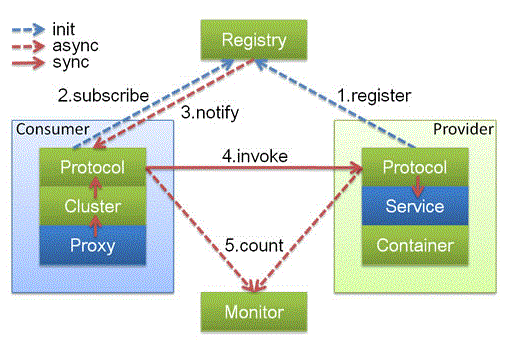

服务提供者：

提供服务的接口，提供服务的实现类，注册服务（向注册中心注册，本地注册），暴露服务（启动 Tomact，Netty，从而接受以及处理请求。）

服务消费者：

启动时根据接口名从服务中心获取服务地址并缓存，根据负载均衡策略选出一个服务器地址进行服务调用。

注册中心：

保存服务名与服务器地址映射关系，服务地址变动主动通知服务消费者。

Socket 通信是一个全双工的方式，如果有多个线程同时进行远程方法调用，这时建立在 client server 之间的 socket 连接上会有很多双方发送的消息传递，这里使用了一个唯一 ID，然后传递给服务端，再服务端又回传回来，这样就知道结果是原先哪个线程的了。

整体流程：

1：客户端线程调用远程接口，生成唯一 ID，Dubbo 是使用 AtomicLong 从 0 开始累计数字的，将打包的方法信息（接口名称，方法名称，参数值列表）和处理结果的回调对象 callback 全部封装在一起，组成一个对象 Object

2：向专门存放调用信息的全局 ConcurrentHashMap 里面 put（ID，object）

3：将 ID 和打包信息封装成一对象 connRequest，使用 IOSession.writer(connRequest)异步发送出去。

4：当前线程再使用 callback()的 get()方法视图获取远程的返回结果。在 get()内部，则使用 synchronized 获取回调对象 callback 的锁， 再先检测是否已经获取到结果，如果没有，然后调用 callback 的 wait()方法，释放 callback 上的锁，让当前线程处于等待状态。

5：服务端接收到请求并处理，将结果发送给客户端，客户端 Socket 连接上专门监听消息的线程收到消息，分析结果，取到 ID，再从前面的 ConcurrentHashMap 中 get(ID)，从而找到 callback，将方法调用结果设置到 callBack 对象里。

6：监听线程接着使用 synchronized 获取回调=对象 callBack 的锁（因为前面调用了 wait（）方法，那个线程已经释放 callback 锁了）再 notifyAll()，唤醒前面处于等待状态的线程继续执行（callback 的 get 方法继续执行就能拿到调用结果了），到此，整个过程结束。

- 服务容器负责启动，加载，运行服务提供者。
- 服务提供者在启动时，向注册中心注册自己提供的服务。
- 服务消费者在启动时，向注册中心订阅自己所需的服务。
- 注册中心返回服务提供者地址列表给消费者，如果有变更，注册中心将基于长连接推送变更数据给消费者。
- 服务消费者，从提供者地址列表中，基于软负载均衡算法，选一台提供者进行调用，如果调用失败，再选另一台调用。
- 服务消费者和提供者，在内存中累计调用次数和调用时间，定时每分钟发送一次统计数据到监控中心。


### 6：序列化

默认使用 Hessian 序列化，还有 Duddo、FastJson、Java 自带序列化。

# 五：dubbo 直连方式实现

点对点的直连项目:消费者直接访问服务提供者，没有注册中心。消费者必须指定服务提供者的访问地址（url）。

消费者直接通过 url 地址访问固定的服务提供者。这个 url 地址是不变的。

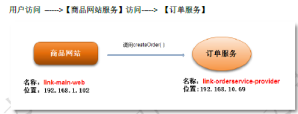

## 1：创建服务提供者：订单服务

1：新建 JavaProject

**ink-orderservice-provider**

2：引入 Maven 所需依赖

```xml
<dependency>
<groupId>org.springframework</groupId>
<artifactId>spring-context</artifactId>
<version>4.3.16.RELEASE</version>
</dependency>
<dependency>
<groupId>com.alibaba</groupId>
<artifactId>dubbo</artifactId>
<version>2.6.2</version>
</dependency>
<plugins>
<plugin>
<artifactId>maven-compiler-plugin</artifactId>
<version>3.1</version>
<configuration>
<source>1.8</source>
<target>1.8</target>
</configuration>
</plugin>
</plugins>
```

3：创建订单实体类 order

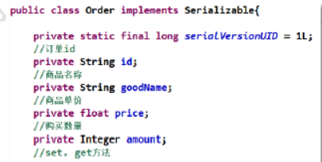

4：新建订单服务接口 ：orderService

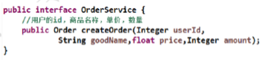

5：新建接口实现类

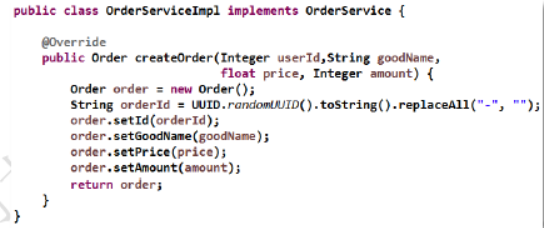

6：创建 dubbo 配置文件

Orderservce-provider.xml

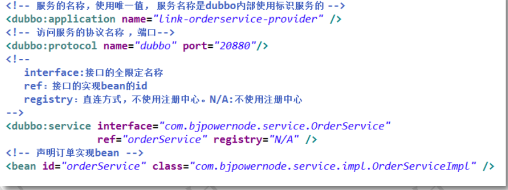

7：测试配置文件

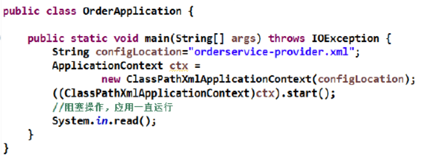

8：maven install

## 2：创建服务消费者：商品网站

1：新建 javaProject

项目名称：**link-main-web**

2：添加依赖

```xml
<dependency>
<groupId>com.bjpowernode</groupId>
<artifactId>link-orderservice-provider</artifactId>
<version>1.0.0</version>
</dependency>
<dependency>
<groupId>org.springframework</groupId>
<artifactId>spring-context</artifactId>
<version>4.3.16.RELEASE</version>
</dependency>
<dependency>
<groupId>com.alibaba</groupId>
<artifactId>dubbo</artifactId>
<version>2.6.2</version>
</dependency>
<build>加入maven编译插件
<plugins>
<plugin>
<artifactId>maven-compiler-plugin</artifactId>
<version>3.1</version>
<configuration>
<source>1.8</source>
<target>1.8</target>
</configuration>
</plugin>
</plugins>

```

3：创建购买商品接口

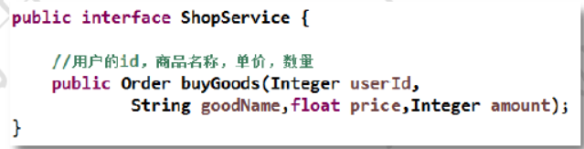

4：创建实现类

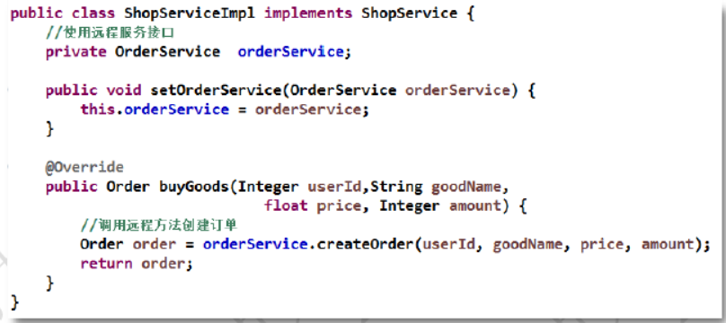

5：创建 dubbo 配置文件

Shop-consume.xml

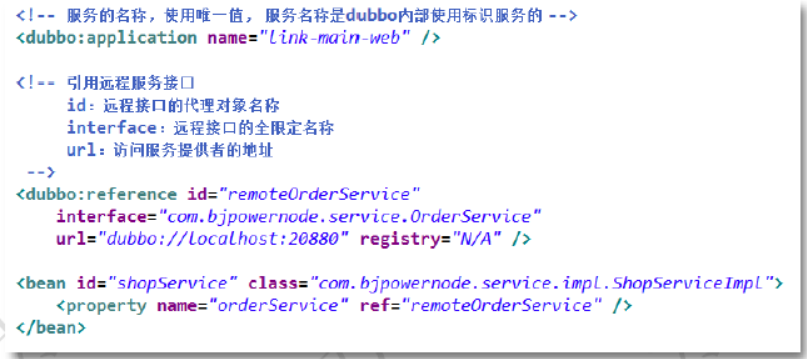

6：执行消费者

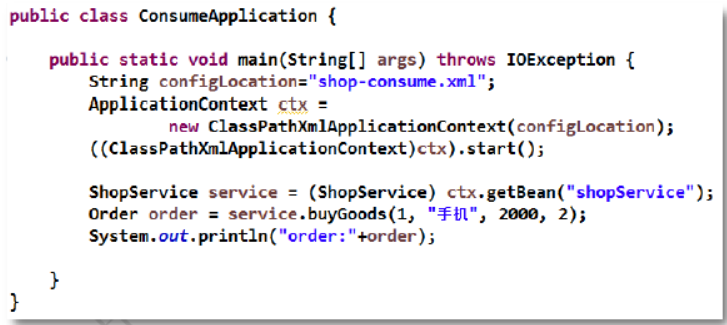

## 当前线程怎么暂停，等结果回来后，再向后执行？

A：先生成一个对象 OBJ，在全局 Map 里 put(ID，Obj)，再用 synchronized 获取 Obj 锁，再调用 Obj.wait()让当前线程处于等待状态，然后另一消息监听线程等到服 务端结果来了后，再 map.get(ID)找到 obj，再用 synchronized 获取 obj 锁，再调用 obj.notifyAll()唤醒前面处于等待状态的线程。
