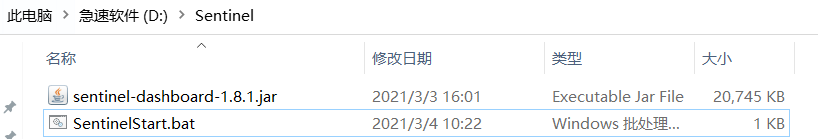
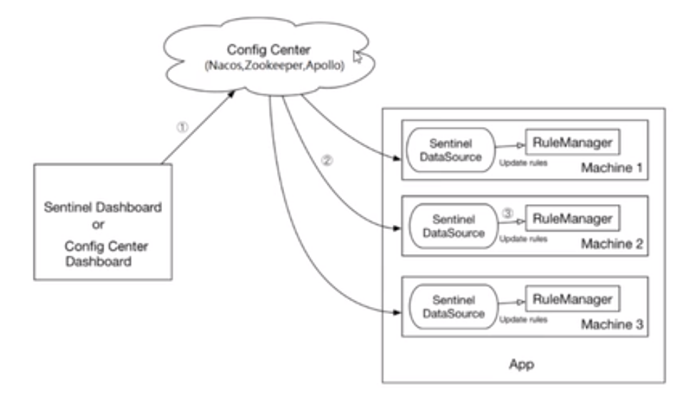
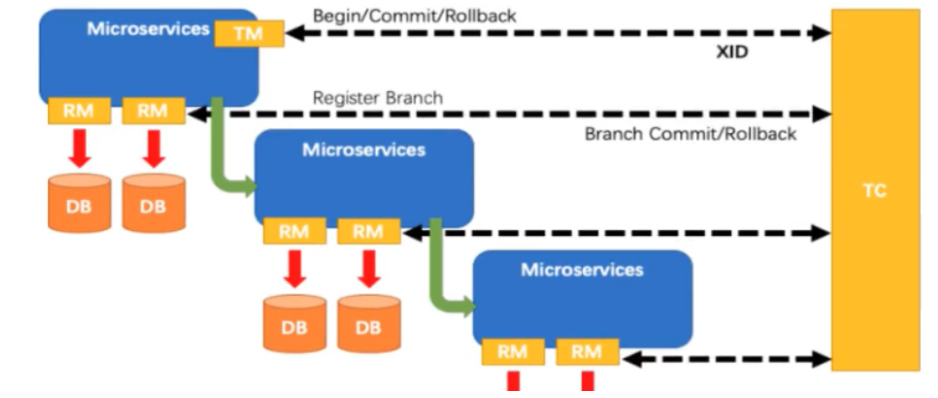

**之所以有 Spring CloudAlibaba,是因为 Spring Cloud Netflix 项目进入维护模式，就是不更新了,不会开发新组件了**

**所以,某些组件都有代替版了,比如 Ribbon 由 Loadbalancer 代替,等等**

==支持的功能==

服务限流降级：默认支持 Serlvet，Feign，RestTemplate，Dubbo 和 RocketMQ 限流降级功能的接入，可以在运行时通过控制台实时修改限流降级规则，还支持查看限流降级 Metrics 监控。

服务注册与发现：适配 Spring Cloud 服务注册与发现标准，默认集成了 Ribbon 的支持。

分布式配置管理：致辞分布式系统中的外部化配置，配置更改时自动刷新。

消息驱动能力：基于 Spring Cloud Stream 为微服务应用构建消息驱动能力

阿里云对象存储：阿里云提供的海量，安全，低成本，高可用的云存储服务，支持在任何应用，任何时间，任何地点存储和访问任意类型的数据。

分布式任务调度：提供秒级，精准，高可靠，高可用的定时（基于 Cron 表达式）任务调度服务，同时提供分布式的任务执行模型，如网格任务，网格任务支持海量子任务均匀分配到所有 Worker(schedulerx-client)上执行。

几乎可以将之前的 Spring Cloud 代替

具体组件

Sentinal：阿里巴巴开源产品，把流量作为切入点，从流量控制，熔断降级，系统负载保护等多个维度保护服务的稳定性。

Nacos：一个更易于构建云原生应用的动态服务发现，配置管理和服务管理平台。

RocketMQ：基于 Java 的高性能，高吞吐量的分布式消息和流计算平台。

Dubbo：高性能 Java RPC 框架。

Seata：一个易于使用的高性能微服务分布式事务解决方案。

Alibaba Cloud OSS：阿里云存储服务，是阿里云提供的海量，安全，低成本，高可靠的云存储服务，您可以在任何应用，任何时间，任何地点存储和访问任意类型的数据。

# Nacos

## 对比

Nacos 它既可以支持 CP,也可以支持 AP,可以切换


何时选择使用何种模式？既然支持 CP 和 AP，那么如何选择？

一般来说，如果不需要存储服务级别的信息且服务实例是通过 Nacos-Client 注册，并能够保持心跳上报，那么就可以选择 AP 模式，当前主流的服务如 SpringCloud 和 Dubbo 服务，都适用 AP 模式，AP 模式为了服务的可能性减弱了一致性，因此 AP 模式下只能注册临时实例。

如果需要在服务级别编辑或则存储配置信息，那么 CP 是必须，K8S 服务和 DNS 服务则适用于 CP 模式。CP 模式下则之策注册持久化实例，此时则是以 raft 协议为集群运行模式。该模式下注册实例之前必须先注册服务，如果服务不存在，则会返回错误。

==下面这个 curl 命令,就是切换模式==

`curl -X PUT ‘$NACOS_SERVER:8848/nacos/v1/operator/switches?entry=serverMode&value=CP’`

**服务注册和配置中心的组合**

Nacos=erueka+config+bus

## 安装

Window 安装：

需要 java8 和 Maven

**1,到 github 上下载安装包**

https://github.com/alibaba/nacos/releases/tag/2.0.0-BETA

解压安装包

导入数据库脚本：D:\Nacos\conf\nacos_config.sql

启动 mysql

**2,启动 Nacos**

在 bin 下,进入 cmd，如果集群直接启动

./startup.cmd

单机使用单机模式启动

```cmd
.\startup.cmd -m standalone
```

**3,访问 Nacos**

Nacos 默认监听 8848

http://localhost:8848/nacos

账号密码:默认都是 nacos

## 原理

流程：

客户端在启动时，首先穿件一个心跳定时任务，如果返回 404，就向注册中心发送注册请求；客户端将服务实例信息发送到服务端，服务端将客户信息放在一个 ConcurrentHashMap 中；客户端定时任务拉取服务端注册信息，每次拉取后刷新本地已保存的信息，需要用时直接从本地获取。

心跳机制：启动微服务时会向 Nacos 建立连接，并发送心跳请求，Nacos 会将其记录下来，如果某个微服务挂掉了，Nacos 定时任务监听微服务是否超出心跳时间，先标记为不健康，还是不行就直接干掉

## 配置中心

### 概念

Nacos 同 SpringCloud-Config 一样，在项目初始化时，要保证先从配置中心进行配置拉取，拉取配置后，才能保证项目的正常启动。

将各个服务的配置发布到配置中心，各个服务从配置中心拉取相关配置，当配置中心有更改时，配置中心通知各个服务，从配置中心再拉取相关配置。

常用的有携程的Apollo，阿里的Nacos，和SpringCloud Config


问题：实际开发中，通常一个系统会准备 dev 开发环境，test 测试环境，prod 生产环境，如果保证指定环境启动时服务能正确读取到 Nacos 上的响应配置文件呢？

问题：大型分布式微服务系统会有很多微服务子项目，每个微服务项目又都会有响应的开发环境，测试环境，预发环境，正式环境，那怎么对这些微服务配置进行管理呢？

Namespace + Group + Data ID 三者关系？为什么这么设计？

NameSpace 默认有一个:public 名称空间

这三个类似 java 的: 包名 + 类名 + 方法名

最外城的 namespace 是可以用去区分部署环境的，Group 和 DayaID 逻辑上区分两个目标对象

三者情况：


默认情况：

Namespace = public ，Group = DEFAULT_GROUP，默认 Cluster 是 Default

Nacos 默认命名空间是 public Namespace 主要用来实现隔离。

比方说我们现在有三个环境：开发，测试，生产环境，我们就可以创建三个 Namespace，不同的 Namespace 之间是隔离的。

Group 默认是 DEFAULT_GROUP,Group 可以把不同的微服务划分到同一个分组里面去。

Service 就是微服务：一个 Service 可以包含多个 Cluster（集群），Nacos 默认 Cluster 是 DEFAULT，Cluster 是对指定微服务的一个虚拟划分。

比方说为了容灾，将 Service 微服务分别部署在杭州机房和广州机房，这是就可以给杭州机房的 Service 微服务起一个集群名称（HZ），给广州机房的 Service 微服务起一个集群名称（GZ），还可以尽量让同一个机房的微服务相互调用，以提高性能。

#### DataId配置集

在系统中，一个配置文件通常就是一个配置集，一个配置集可以包含了系统的各种配置信息，例如，一个配置集可 能包含了数据源、线程池、日志级别等配置项。每个配置集都可以定义一个有意义的名称，就是配置集的ID即Data ID。

指定spring.profile.active和配置文件的DataID来使不同环境读取不同的配置新建dev配置DataID，新建test配置DataID，通过spring.profile.active属性就能进行多环境下配置文件的读取。


==通过配置文件,实现多环境的读取:==

在项目配置文件中

```yml
spring:
	profile:
		active:test
```


#### GroupID配置分组

配置分组是对配置集进行分组，通过一个有意义的字符串（如 Buy 或 Trade ）来表示，不同的配置分组下可以有 相同的配置集（Data ID）。当您在 Nacos 上创建一个配置时，如果未填写配置分组的名称，则配置分组的名称默 认采用 DEFAULT_GROUP 。配置分组的常见场景：可用于区分不同的项目或应用，例如：学生管理系统的配置集 可以定义一个group为：STUDENT_GROUP。

#### namespace命名空间

命名空间（namespace）可用于进行不同环境的配置隔离。例如可以隔离开发环境、测试环境和生产环境，因为 它们的配置可能各不相同，或者是隔离不同的用户，不同的开发人员使用同一个nacos管理各自的配置，可通过 namespace隔离。不同的命名空间下，可以存在相同名称的配置分组(Group) 或 配置集。默认public 的namespace，每个命名空间有对应的namespaceId，项目的yml文件中配置的就是namespaceId

Namespace：代表不同环境，如开发、测试、生产环境。 

Group：代表某项目，如青岛项目、广州项目 

DataId：每个项目下往往有若干个工程，每个配置集(DataId)是一个工程的主配置文件

导入与导出功能/或者直接克隆

监听查询

### 优先级

Spring Cloud Alibaba Nacos Config目前提供了三种配置能力从Nacos拉取相关的配

- A:通过spring.cloud.nacos.config.shared-dataids支持多个共享Data ld 的配置，不建议使用
- B:通过spring.cloud.nacos.config .ext-config[n].data-id 的方式支持多个扩展Data ld的配置，多个Data ld同时配置时，他的优先级关系是 spring.cloud.nacos.config.ext-config[n].data-id其中 n的值越大，优先级越高。
- C:通过内部相关规则(应用名、扩展名)自动生成相关的Data ld配置

当三种方式共同使用时，他们的一个优先级关系是:C>B>A，扩展中重复，n越大，优先级越高

## Nacos 集群和持久化配置


Nacos 默认有自带嵌入式数据库,derby,但是如果做集群模式的话,就不能使用自己的数据库，不然每个节点一个数据库,那么数据就不统一了,需要使用外部的 mysql

采用集中式存储的方式来支持集群化部署，目前只支持 MYSQL 的存储。

#### 1,单机版,切换 mysql 数据库:

**将 nacos 切换到使用我们自己的 mysql 数据库:**

**1,nacos 默认自带了一个 sql 文件,在 nacos 安装目录下**

将它放到我们的 mysql 执行

**2,修改 Nacos 安装目录下的安排 application.properties,添加:**

```properties
spring.datasource.platform=mysql
db.num=1
db.ur1.O=jdbc : mysql://127.0.0.1:3306/nacos_config?
characterEncoding=utf8&connectTimeout=1000&socketTimeout=3000&autoReconnect=truedb.user=rodt
db. password=123456
```

**3,此时可以重启 nacos,那么就会改为使用我们自己的 mysql**

#### Linux 上配置 Nacos 集群+Mysql 数据库

官方架构图:


1：修改端口

2：修改集群配置文件

会有集群控制台的集群节点。项目配置中就可以指定一个虚拟Vip


**需要一个 Nginx 作为 VIP**

1,下载安装 Nacos 的 Linux 版安装包

2,进入安装目录,现在执行自带的 sql 文件

进入 mysql,执行 sql 文件

3.修改配置文件,切换为我们的 mysql

就是上面 windos 版要修改的几个属性

4,修改 cluster.conf,指定哪几个节点是 Nacos 集群

这里使用 3333,4444,5555 作为三个 Nacos 节点监听的端口

5,我们这里就不配置在不同节点上了,就放在一个节点上

既然要在一个节点上启动不同 Nacos 实例,就要修改 startup.sh,使其根据不同端口启动不同 Nacos 实例


可以看到,这个脚本就是通过 jvm 启动 nacos

所以我们最后修改的就是,nohup java -Dserver.port=3344

6,配置 Nginx

```properties
upstream cluster{
	server 127.0.0.1:3333;
	server 127.0.0.1:4444;
	server 127.0.0.1:5555;
}
server [
	listen 1111:
	server_name localhost;
	# charset koi8- r:
	#access_log logs / host.access.logmain;
	location {
		#roothtml:
		#index  index.html index.htm;
		proxy_pass http: // cluster:
	}
```

7,启动 Nacos:
./startup.sh -p 3333

./startup.sh -p 4444

./startup.sh -p 5555

7,启动 nginx

8,测试:

访问 192.168.159.121:1111

如果可以进入 nacos 的 web 界面,就证明安装成功了

9,将微服务注册到 Nacos 集群:

```yml
spring:
	application:
		name: nacos-payment-provider
	cloud:
		nacos:
			discovery:
			#server-addr: localhost:8848#/配置Nacos地址
			#换成nginx的1111端口，l做集群
			server-addr: 192.168.111.144:1111
					# 换成nginx的即可,有nginx代理到其中一个节点
```

10,进入 Nacos 的 web 界面

可以看到,已经注册成功


## 服务发现


# Sentinel

实现熔断与限流,就是 Hystrix


资源：它可以是 Java 应用程序中的任何内容，例如，由应用程序提供的服务，或由应用程序调用的其它应用提供的服务，甚至可以是一段代码。在接下来的文档中，我们都会用资源来描述代码块。只要通过 Sentinel API 定义的代码，就是资源，能够被 Sentinel 保护起来。大部分情况下，可以使用方法签名，URL，甚至服务名称作为资源名来标示资源。

规则：围绕资源的实时状态设定的规则，可以包括流量控制规则、熔断降级规则以及系统保护规则。所有规则可以动态实时调整。

## 原理：

### 熔断降级

Sentinel 和 Hystrix 的原则是一致的: 当调用链路中某个资源出现不稳定，例如，表现为 timeout，异常比例升高的时候，则对这个资源的调用进行限制，并让请求快速失败，避免影响到其它的资源，最终产生雪崩的效果。

在限制手段上，Sentinel 和 Hystrix 采取了完全不一样的方法。

Hystrix 通过线程池)的方式，来对依赖(在我们的概念中对应资源)进行了隔离。这样做的好处是资源和资源之间做到了最彻底的隔离。缺点是除了增加了线程切换的成本，还需要预先给各个资源做线程池大小的分配。

Sentinel 采用了两种手段：

- 通过并发线程数进行限制：这样不但没有线程切换的损耗，也不需要预先分配线程池大小，当某个资源出现不稳定的情况下，例如响应时间变成，对资源的注解影响就是会造成线程数的逐步积累，当线程数在特定资源上积累到一定的数量之后，对该资源的心情求就会被拒绝，堆积的线程完成任务后才开始继续接受请求。
- 通过响应时间对资源进行降级：当依赖的资源出现响应时间过长后，所有对资源的访问都会被直接拒绝，知道过了指定时间窗口之后才重新恢复。
- 系统负载保护：Sentinel 同时对系统的维度提供保护，防止雪崩，让系统的入口流量和系统的负载达到一个平衡，保证系统在能力范围之内处理最多的请求。

### 工作机制：

- 对主流框架提供适配或者显示的 API，来定义需要保护的资源，并提供设施对资源进行实时统计和调用链路分析；

- 然后根据预设的规则，结合对资源的实时统计信息，对流量进行控制，
- 提供了实时的监控系统

阿里官方也给出一份文档：[原理介绍](https://link.zhihu.com/?target=https%3A//github.com/alibaba/Sentinel/wiki/Sentinel%E5%B7%A5%E4%BD%9C%E4%B8%BB%E6%B5%81%E7%A8%8B)。

在 Sentinel 里面，所有的资源都对应一个资源名称以及一个 Entry。Entry 可以通过对主流框架的适配自动创建，也可以通过注解的方式或调用 API 显式创建；每一个 Entry 创建的时候，同时也会创建一系列功能插槽（slot chain）。这些插槽有不同的职责，例如:

`StatisticSlot` 则用于记录、统计不同纬度的 runtime 指标监控信息；

`ClusterBuilderSlot` 则用于存储资源的统计信息以及调用者信息，例如该资源的 RT, QPS, thread count 等等，这些信息将用作为多维度限流，降级的依据；

### 流量控制

角度：


## Window 安装

下载：https://github.com/alibaba/Sentinel/releases是一个Jar包，放到目录下



创建一个启动脚本，指定端口为 8070

```cmd
start java -jar sentinel-dashboard-1.8.1.jar --server.port=8070
```

然后访问：http://localhost:8070/

账号：sentinel

密码：sentinel

## 微服务整合 sentinel:

1,启动 Nacos

2,新建一个项目,8401,主要用于配置 sentinel

1. pom

2. 配置文件

   ```yml
   server:
   	port: 8401
   spring:
   	application:
   		name: cloudalibaba-sentinel-service
   	cloud:
   		nacos:
   			discovery:
   			#Nacos服务注册中心地址
   				server-addr: localhost:8848
   		sentinel:
   			transport:
   				#配置sentinel dashboard地址
   				dashboard: localhost:8080
   				#默认8719端口，假如被占用会自动从8719开始依次+1扫描,直至找到未被占用的端口
   				port: 8719I
   management:
   	endpoints:
   		web:
   			exposure:
   				include: '*'

   ```

3. 主启动类

   

4. controller\

   

5. 到这里就可以启动 8401

   此时我们到 sentinel 中查看,发现并 8401 的任何信息

   是因为,sentinel 是懒加载,需要我们执行一次访问,才会有信息

   访问 localhost/8401/testA

   

6. 可以看到.已经开始监听了

## 流控规则

流量控制主要有两种方式：

- 并发线程数
- QPS


资源名：唯一名称。默认请求路径

针对来源：Sentinel 可以针对调用者进行限流，填写微服务名，默认 default（不区分来源）

阈值类型/单机阈值：

- QPS（每秒钟请求数量）：当调用该 API 的 QPS 达到阈值的时候，进行限流。
- 线程数：当调用该 API 的线程数达到阈值的时候，进行限流。

是否集群：不需要集群

流控模式：

- 直接：API 达到限流条件时，直接限流
- 关联：当关联的资源达到阈值是，就限流自己，比如**支付接口**达到阈值,就要限流下订单的接口,防止一直有订单
- 链路：只记录指定链路上的流量（指定资源从入口资源进来的流量，如果达到阈值，就进行限流）

流控效果

- 快速失败：直接失败，跑一场
- Warm UP：根据 CodeFactor（冷加载因子，默认 3）的值，从阈值 CodeFactor，经过预热时长，才达到设置的 QPS 的阈值。当系统长期初一低水位的情况下，当流量突然增加时，直接把系统拉升可能瞬间把系统压垮。
- 排队等待：严格控制请求通过的间隔时间，也即是让请求以匀速的速度通过，对应的是漏桶算法.阈值类型必须设置成QPS，否则无效。

## 熔断降级规则

**熔断框架比较**


就是熔断降级，Sentinel 熔断降级会在调用链路中某个资源出现不稳定状态时（例如调用超时或异常比例升高），对这个资源的调用进行限制，让请求快速失败，避免影响到其他的资源而导致级联错误。

当资源被降级后，在接下来的降级时间窗口之内，对该资源的调用都自动熔断（默认行为是抛出 DegradeException）

Sentinel 的断路器是没有半开状态的：半开的状态，系统会自动检测是否请求有异常，没有异常就关闭断路器恢复使用，有异常则继续打开断路器不可用，具体可看 Hy


降级策略：

RT（平均响应时间，秒级）：当1s内持续进入N个请求，对应时刻的平均响应时间（秒级）均超过阈值（Count，以ms为单位），那么接下的时间（DegradeRule中的timeWindow，以s为单位）之内，对这个方法的调用都会自动地熔断（抛出DegradeException）
- 平均响应时间，超过阈值 且 时间窗口内通过的请求 >= 5，两个条件同时满足后出发降级
- 窗口期过后，关闭断路器
- RT 最大 4900（更大的需要通过 -Dcsp.sentinel.staticstic.max.rt=XXXXX 才能生效）

异常比例 (`DEGRADE_GRADE_EXCEPTION_RATIO`)秒级：当资源的每秒请求量 >= N（可配置），并且每秒异常总数占通过量的比值超过阈值（`DegradeRule` 中的 `count`）之后，资源进入降级状态，即在接下的时间窗口（`DegradeRule` 中的 `timeWindow`，以 s 为单位）之内，对这个方法的调用都会自动地返回。异常比率的阈值范围是 `[0.0, 1.0]`，代表 0% - 100%。

异常数（分钟级）：当资源一分钟的异常数超过阈值之后就会熔断，注意由于统计时间是分钟级别的，如果timeWindow小于60s，则结束熔断状态后仍可能再进入熔断状态。时间窗口一定要大于60S

- 异常数（分钟统计）超过阈值时，触发降级，时间窗口结束后，关闭降级

## 热点规则

何为热点?热点即经常访问的数据。很多时候我们希望统计某个热点数据中访问频次最高的Top K数据，并对其访问进行限制。比如:

- 商品ID为参数，统计一段时间内最常购买的商品ID并进行限制
- 用户ID为参数，针对一段时间内频繁访问的用户ID进行限制

热点参数限流会统计传入参数中的热点参数，并根据配置的限流阈值与模式，对包含热点参数的资源调用进行限流。热点参数限流可以看做是一种特殊的流量控制，仅对包含热点参数的资源调用生效。

比如:

localhost:8080/aa?name=aa

localhost:8080/aa?name=bb

加入两个请求中,带有参数 aa 的请求访问频次非常高,我们就现在 name==aa 的请求,但是 bb 的不限制

==如何自定义降级方法,而不是默认的抛出异常?==

兜底方法：分为系统默认和客户自定义，两种，之前限流出问题后，都是Sentinel系统默认的提示：Blocked by Sentinel；接下来就自己定义，某个方法出问题了，就找到对应的兜底降级方法：在Hystrix中用HystrixCommand，在Sentinel中用 ` @SentinelResource

**使用@SentinelResource 直接实现降级方法,它等同 Hystrix 的@HystrixCommand**

```java
@GetMapping( "/testHotKey ")//定义一个名字,指定降级方法
@SentinelResource(value = "testHotkey" ,blockHandler = "deal_testHotKey")
public string testHotKey(@RequestParam(value = "p1" , required = false) string p1，
						@RequestParam(value = "p2",required = false) string p2)
{
		return "------testHotKey" ;
}
public string deal_testHotkey (string p1，string p2，BlockException exception){
    return "------deal_testHotKey,o(--)o"; //sentinel系统默认的提示: BLocked by Sentin
}
```

==定义热点规则:==


**此时我们访问/testHotkey 并且带上才是 p1**

如果 qps 大于 1,就会触发我们定义的降级方法

**但是我们的参数是 P2,就没有问题**


只有带了 p1,才可能会触发热点限流

设置热点规则中的其他选项:


**注意:**

参数类型只支持,8 种基本类型+String 类

如果我们程序出现异常,是不会走 blockHander 的降级方法的,因为这个方法只配置了热点规则,没有配置限流规则

我们这里配置的降级方法是 sentinel 针对热点规则配置的

只有触发热点规则才会降级

@SentinelResource：处理的是Sentinel控制台配置的违规情况，有blockHander方法配置的兜底处理

RuntimeException：Java运行时异常还是RuntimeException

## 系统自适应保护规则

Sentinel系统自适应限流从整体维度对应用入口流量进行控制，结合应用的Load、CPU使用率、总体平均RT。入口QPS和并发线程数等几个维度的监控指标，通过自适应的流控策略，让系统的入口流量和系统的负载达到一个平衡，让系统尽可能保持最大吞吐量的同时保证系统整体的稳定性。

系统保护规则是应用整体维度的，而不是资源维度的，并且仅对入口流量生效。入口流量指的是进入应用的流量Ⅰ(EntryType.IN)，比如Web 服务或 Dubbo服务霭接收的请求，都属于入口流量。

对整体限流,比如设置 qps 到达 100,这里限流会限制整个系统不可以

__

系统规则支持一下模式：

- Load自适应（权对 Linux/Unix-like机器生效)︰系统的load1作为启发指标，进行自适应系统保护。当系统load1超过没定的启发值，且系统当前的并发线程数超过估算的系统容量时才会触发系统保护（BBR阶段)。系统容量由系统的maxQps * minRt估算得出。设定参考值一般是CPu cores * 2.5
- CPU usage (1.5.0+版本)︰当系统CPU使用率超过阈值即触发系统保护（取值范围0.0-1.0)，比较灵敏。
- 平均RT:当单台机器上所有入口流量的平均RT达到阈值即触发系统保护。单位是毫秒。·并发线程数:当单台机器上所有入口流量
- 并发线程数达到阈值即触发系统保护。
- 入口QPS:当单台机器上所有入口流量的QPS达到阈值即触发系统保护。

重要的属性：

| Field             | 说明                                | 默认值   |
| ----------------- | ----------------------------------- | -------- |
| highestSystemLoad | load1触发值，用于触发自适应控制阶段 | -1不生效 |
| avgRt             | 所有入口流量的平均响应时间          | -1不生效 |
| maxThread         | 入口流量的最大并发数                | -1不生效 |
| QPS               | 所有入口资源的QPS                   | -1不生效 |
| highestCpuUsage   | 当前系统的CPU使用率（0.0-1.0)       | -1不生效 |

本地代码设置，在Sentinel控制台动态设置


## 授权控制

很多时候，我们需要根据调用来源来判断该次请求是否允许放行，这时候可以使用Sentinel的来源访问控制（黑白名单控制)的功能。来源访问控制根据资源的请求来源（origin）判斯资源访问是否通过，若配置白名单则只有请求来源位于白名单内时才可通过;若配置黑名单则请求来源位于黑名单时不通过，其余的请求通过。

来源访问控制规则(AuthorityRule)非常简单，主要有以下配置项:

- resource:资源名，即限流规则的作用对象。
- limitApp:请求来源。对应的黑名单/白名单，多个用","分隔，如 appAappB.
- strategy :限制模式。AUTHORITY_WHITE为白名单模式，AUTHORITY_BLACK为黑名单模式，默认为白名单模式。


## 动态规则扩展

前面不管是通过Java代码还是通过Sentinel控制台的方式去设置限流规则，都属于手动方式，不够灵活。这种方式一般仅用于测试和演示，生产环境上一般通过动态规则源的方式来动态管理限流规则。也就是说，很多时候限流规则会被存储在文件、数据库或者配置中心当中。Sentinel的Datasource接口给我们提供了对接任意配置源的能力。

官方推荐通过控制台设置规则后将规则推送到统一的规则管理中心。客户端实现ReadableDataSource 接口端监听规则中心实时获取变更，流程如下:



常见的实现方式有:

- 拉取式:客户端主动向菜个规则管理中心定期轮询拉取规则，这个规则管理中心可以是文件，甚至是VCS等。这样做的方式是简单。缺点是无法及时获取变更;实现拉模式的数据源最简单的方式是继承AutcRefreshDatasource 抽象类，然后实现 readsource()方法，在该方法里从指定数据源读取字符串格式的配置数据。
- 推送式：常用，规则管理中心统一推送，客户惴通过注册监听器的方式时刻监听变化，比如使用Zookeeper ,Apollo等作为规则管理中心。这种方式有更好的实时性和一致性保证。"实现推模式的数据源最简单的方式是继承 AbstractDatasource抽象类，在其构造方法中添加监听器，并实现readsource(O从指定数据源读取字符串格式的配置数据。


## 持久化规则

默认规则是临时存储的,重启 sentinel 就会消失

将限流配置规则持久化进 Nacos 保存，只要刷新 8401 某个 rest 地址，sentinel 控制台的流控规则就能看到，只要 Nacos 里面的配置不删除，针对 8401 删 Sentinal 上的流控规则持续有效。

**这里以之前的 8401 为案例进行修改:**

1. 修改 8401 的 pom

   ```xml
   添加:
   <!-- SpringCloud ailibaba sentinel-datasource-nacos 持久化需要用到-->
   <dependency>
       <groupId>com.alibaba.csp</groupId>
       <artifactId>sentinel-datasource-nacos</artifactId>
   </dependency>

   ```

2. 修改配置文件:

   ```yml
   server:
     port: 8401

   spring:
     application:
       name: cloudalibaba-sentinel-service
     cloud:
       nacos:
         discovery:
         	# Nacos服务注册中心地址
           server-addr: localhost:8848
           namespace: dev
         config:
           server-addr: localhost:8848
           file-extension: yaml
           #指定分组
           group: dev
           #指定命名空间
           namespace: dev

       # 配置Sentinel流控
       sentinel:
         transport:
           #配置Sentinel dashboard地址
           dashboard: localhost:8070
           #默认8719端口,如果被占用会向上扫描。
           port: 8719

         # sentinel持久化到nacos
         datasource:
           flow:
             nacos:
               # nacos连接地址
               server-addr: ${spring.cloud.nacos.discovery.server-addr}
               # nacos中的配置名称
               data-id: ${spring.application.name}-flow-rules
               group-id: DEFAULT_GROUP
               data-type: json
               rule-type: flow
           degrade:
             nacos:
               server-addr: ${spring.cloud.nacos.discovery.server-addr}
               data-id: ${spring.application.name}-degrade-rules
               group-id: DEFAULT_GROUP
               data-type: json
               rule-type: degrade
   ```

   在上面我们分别配置了 sentinel 的流控规则和降级规则

3. **在 nacos 中创建一个配置文件,dataId 就是上面配置文件中指定的**

   

   json 中,这些属性的含义:

   - **resource**：资源名称
   - **limitApp**：来源应⽤
   - **grade**：阈值类型 0 线程数 1 QPS
   - **count**：单机阈值
   - **strategy**：流控模式， 0 直接 1 关联 2 链路
   - **controlBehavior**：流控效果， 0 快速失败 1 Warm Up 2 排队等待
   - **clusterMode**： true/false 是否集群

4. 启动 8401:

   

   可以看到,直接读取到了规则

5. 关闭 8401

   

6. 此时重启 8401,如果 sentinel 又可以正常读取到规则,那么证明持久化成功

   可以看到,又重新出现了

   

# Seata

是一个分布式事务的解决方案

## 概念

**分布式事务中的一些概念,也是 seata 中的概念:**

Transaction ID XID 全局唯一的事务 ID

三组件：

TC（事务协调者）：维护全局和分子事务的状态，驱动全局事务提交或回滚。

TM（事务管理器）：定义全局事务的范围，开始全局事务，提交或回滚全局事务。

RM（资源管理器）：管理分支事务处理的资源，与 TC 交谈以注册分支事务和报告分支事务的状态，并驱动分支事务提交或回滚。



- TM 向 TC 申请开启一个全局事务，全局事务创建成功并生成一个全局唯一的 XID
- XID 在微服务调用链路的上下文中传播，也就是在多个 TM，RM 中传播
- RM 向 TC 注册分支事务，将其纳入 XID 对应全局事务的管辖
- TM 向 TC 发起针对 XID 的全局提交或回滚决议
- TM 调度 XID 下管辖的全部分支事务完成提交或回滚请求

## seata 安装

（1)：**下载安装 seata 的安装包**

（2）：**修改 file.conf**

```conf
service {
									# 这个名字可以随便取
	vgroup_mapping.my_test_tx_group ="fsp_tx_group"
	default.grouplist = "127.0.0.1:8091"
	enableDegrade = false
	disable = false
	max.commit.retry.timeout = "-1"max.rollback.retry.timeout = "-1"}
store {
	## store mode: file、db
	mode = "db”
	## 表示使用数据库存储事务信
	db {
		## the implement of javax.sql.DataSource, such as DruidDataSource(druid)/BasicDataSource(dbcp) etc.
		datasource = "dbcp"
		## mysql/oracle/h2/oceanbase etc.
		db-type = "mysql"
		driver-class-name = "com.mysql.jdbc.Driver"
		url = "jdbc:mysql://127.0.0.1:3306/seata"
		user = "root
		## 指定mysql相关配置
		password ="你自己密码”l
		min-conn = 1
		max-conn = 3
		global.table = "global_table"
		branch.table = "branch_table"
		lock-table = "lock_table"
		query-limit = 100
		}

```

（3）：**mysql 建库建表**

上面指定了数据库为 seata,所以创建一个数据库名为 seata

建表,在 seata 的安装目录下有一个 db_store.sql,运行即可

**继续修改配置文件,修改 registry.conf**

配置 seata 作为微服务,指定注册中心

```properties
registry{
	# file . nacos . eureka、redis、zk、
	type = "nacos"
	# 指定注册中心为nacos
	nacos {
		# 指定nacos地址
		serverAddr = "localhost:8848"
		namespace = ""
		cluster = "default"
	}
```

启动

先启动 nacos

在启动 seata-server(运行安装目录下的,seata-server.bat)

**业务说明**：

我们创建三个服务，一个订单服务，一个库存服务，一个账户服务

当用户下单时，会在订单服务中创建一个订单，然后通过远程调用库存服务来扣减下单商品的库存，

再通过远程调用账户服务来扣减用户账户里面的余额

最后在订单服务中修改订单状态为已完成。

下单--->库存--->账号余额

1：创建三个数据库

seata_order：存储订单的数据库

seata_storage：存储库存的数据库

seata_account：存储账户信息的数据库

2：创建对应的表

seata_order：建 t_order 表

seata_storage：建 t_storage 表

seata_account：建 t_account 表

3：创建回滚日志表,方便查看

**注意==每个库都要执行一次==这个 sql,生成回滚日志表**

==每个业务都创建一个微服务,也就是要有三个微服务,订单,库存,账号==

==订单==,seta-order-2001

1.  pom

2.  配置文件

    ```yaml
    server:
      port: 2001

    spring:
      application:
        name: seata-order-service
      cloud:
        alibaba:
          seata:
            # 自定义事务组名称需要与seata-server中的对应,我们之前在seata的配置文件中配置的名字
            tx-service-group: fsp_tx_group
        nacos:
          discovery:
            server-addr: 127.0.0.1:8848
      datasource:
        # 当前数据源操作类型
        type: com.alibaba.druid.pool.DruidDataSource
        # mysql驱动类
        driver-class-name: com.mysql.cj.jdbc.Driver
        url: jdbc:mysql://localhost:3306/seata_order?useUnicode=true&characterEncoding=UTF-8&useSSL=false&serverTimezone=GMT%2B8
        username: root
        password: root
    feign:
      hystrix:
        enabled: false
    logging:
      level:
        io:
          seata: info

    mybatis:
      mapperLocations: classpath*:mapper/*.xml
    ```

    还要额外创建其他配置文件,创建一个 file.conf:

    ```.conf
    transport {
     # tcp udt unix-domain-socket
     type = "TCP"
     #NIO NATIVE
     server = "NIO"
     #enable heartbeat
     heartbeat = true
     #thread factory for netty
     thread-factory {
       boss-thread-prefix = "NettyBoss"
       worker-thread-prefix = "NettyServerNIOWorker"
       server-executor-thread-prefix = "NettyServerBizHandler"
       share-boss-worker = false
       client-selector-thread-prefix = "NettyClientSelector"
       client-selector-thread-size = 1
       client-worker-thread-prefix = "NettyClientWorkerThread"
       # netty boss thread size,will not be used for UDT
       boss-thread-size = 1
       #auto default pin or 8
       worker-thread-size = 8
     }
     shutdown {
       # when destroy server, wait seconds
       wait = 3
     }
     serialization = "seata"
     compressor = "none"
    }
    service {
     #vgroup->rgroup
     # 事务组名称
     vgroup_mapping.fsp_tx_group = "default"
     #only support single node
     default.grouplist = "127.0.0.1:8091"
     #degrade current not support
     enableDegrade = false
     #disable
     disable = false
     #unit ms,s,m,h,d represents milliseconds, seconds, minutes, hours, days, default permanent
     max.commit.retry.timeout = "-1"
     max.rollback.retry.timeout = "-1"
    }

    client {
     async.commit.buffer.limit = 10000
     lock {
       retry.internal = 10
       retry.times = 30
     }
     report.retry.count = 5
     tm.commit.retry.count = 1
     tm.rollback.retry.count = 1
    }

    ## transaction log store
    store {
     ## store mode: file、db
     #mode = "file"
     mode = "db"

     ## file store
     file {
       dir = "sessionStore"

       # branch session size , if exceeded first try compress lockkey, still exceeded throws exceptions
       max-branch-session-size = 16384
       # globe session size , if exceeded throws exceptions
       max-global-session-size = 512
       # file buffer size , if exceeded allocate new buffer
       file-write-buffer-cache-size = 16384
       # when recover batch read size
       session.reload.read_size = 100
       # async, sync
       flush-disk-mode = async
     }

     ## database store
     db {
       ## the implement of javax.sql.DataSource, such as DruidDataSource(druid)/BasicDataSource(dbcp) etc.
       datasource = "dbcp"
       ## mysql/oracle/h2/oceanbase etc.
       db-type = "mysql"
       driver-class-name = "com.mysql.jdbc.Driver"
       url = "jdbc:mysql://127.0.0.1:3306/seata"
       user = "root"
       password = "root"
       min-conn = 1
       max-conn = 3
       global.table = "global_table"
       branch.table = "branch_table"
       lock-table = "lock_table"
       query-limit = 100
     }
    }
    lock {
     ## the lock store mode: local、remote
     mode = "remote"

     local {
       ## store locks in user's database
     }

     remote {
       ## store locks in the seata's server
     }
    }
    recovery {
     #schedule committing retry period in milliseconds
     committing-retry-period = 1000
     #schedule asyn committing retry period in milliseconds
     asyn-committing-retry-period = 1000
     #schedule rollbacking retry period in milliseconds
     rollbacking-retry-period = 1000
     #schedule timeout retry period in milliseconds
     timeout-retry-period = 1000
    }

    transaction {
     undo.data.validation = true
     undo.log.serialization = "jackson"
     undo.log.save.days = 7
     #schedule delete expired undo_log in milliseconds
     undo.log.delete.period = 86400000
     undo.log.table = "undo_log"
    }

    ## metrics settings
    metrics {
     enabled = false
     registry-type = "compact"
     # multi exporters use comma divided
     exporter-list = "prometheus"
     exporter-prometheus-port = 9898
    }

    support {
     ## spring
     spring {
       # auto proxy the DataSource bean
       datasource.autoproxy = false
     }
    }

    ```

    创建 registry.conf:

    ```conf
    registry {
      # file 、nacos 、eureka、redis、zk、consul、etcd3、sofa
      type = "nacos"

      nacos {
        #serverAddr = "localhost"
        serverAddr = "localhost:8848"
        namespace = ""
        cluster = "default"
      }
      eureka {
        serviceUrl = "http://localhost:8761/eureka"
        application = "default"
        weight = "1"
      }
      redis {
        serverAddr = "localhost:6379"
        db = "0"
      }
      zk {
        cluster = "default"
        serverAddr = "127.0.0.1:2181"
        session.timeout = 6000
        connect.timeout = 2000
      }
      consul {
        cluster = "default"
        serverAddr = "127.0.0.1:8500"
      }
      etcd3 {
        cluster = "default"
        serverAddr = "http://localhost:2379"
      }
      sofa {
        serverAddr = "127.0.0.1:9603"
        application = "default"
        region = "DEFAULT_ZONE"
        datacenter = "DefaultDataCenter"
        cluster = "default"
        group = "SEATA_GROUP"
        addressWaitTime = "3000"
      }
      file {
        name = "file.conf"
      }
    }

    config {
      # file、nacos 、apollo、zk、consul、etcd3
      type = "file"

      nacos {
        serverAddr = "localhost"
        namespace = ""
      }
      consul {
        serverAddr = "127.0.0.1:8500"
      }
      apollo {
        app.id = "seata-server"
        apollo.meta = "http://192.168.1.204:8801"
      }
      zk {
        serverAddr = "127.0.0.1:2181"
        session.timeout = 6000
        connect.timeout = 2000
      }
      etcd3 {
        serverAddr = "http://localhost:2379"
      }
      file {
        name = "file.conf"
      }
    }

    ```

    ==实际上,就是要将 seata 中的我们之前修改的两个配置文件复制到这个项目下==

3.  **主启动类**

    ```java
    @SpringBootApplication(exclude = DataSourceAutoConfiguration.class) //取消数据源的自动创建
    @EnableDiscoveryClient
    @EnableFeignClients
    public class SeataOrderMain2001 {

        public static void main(String[] args) {
            SpringApplication.run(SeataOrderMain2001.class,args);
        }
    }
    ```

4.  **service 层**

    ```xml
    public interface OrderService {

        /**
         * 创建订单
         * @param order
         */
        void create(Order order);
    }
    ```

    ```xml
    @FeignClient(value = "seata-storage-service")
    public interface StorageService {

        /**
         * 减库存
         * @param productId
         * @param count
         * @return
         */
        @PostMapping(value = "/storage/decrease")
        CommonResult decrease(@RequestParam("productId") Long productId, @RequestParam("count") Integer count);
    }
    ```

    ```xml
    @FeignClient(value = "seata-account-service")
    public interface AccountService {

        /**
         * 减余额
         * @param userId
         * @param money
         * @return
         */
        @PostMapping(value = "/account/decrease")
        CommonResult decrease(@RequestParam("userId") Long userId, @RequestParam("money") BigDecimal money);
    }
    ```

    ````

    ​```xml
    @Service
    @Slf4j
    public class OrderServiceImpl implements OrderService {

        @Resource
        private OrderDao orderDao;
        @Resource
        private AccountService accountService;
        @Resource
        private StorageService storageService;

        /**
         * 创建订单->调用库存服务扣减库存->调用账户服务扣减账户余额->修改订单状态
         * 简单说:
         * 下订单->减库存->减余额->改状态
         * GlobalTransactional seata开启分布式事务,异常时回滚,name保证唯一即可
         * @param order 订单对象
         */
        @Override
        ///@GlobalTransactional(name = "fsp-create-order", rollbackFor = Exception.class)
        public void create(Order order) {
            // 1 新建订单
            log.info("----->开始新建订单");
            orderDao.create(order);

            // 2 扣减库存
            log.info("----->订单微服务开始调用库存,做扣减Count");
            storageService.decrease(order.getProductId(), order.getCount());
            log.info("----->订单微服务开始调用库存,做扣减End");

            // 3 扣减账户
            log.info("----->订单微服务开始调用账户,做扣减Money");
            accountService.decrease(order.getUserId(), order.getMoney());
            log.info("----->订单微服务开始调用账户,做扣减End");

            // 4 修改订单状态,从0到1,1代表已完成
            log.info("----->修改订单状态开始");
            orderDao.update(order.getUserId(), 0);

            log.info("----->下订单结束了,O(∩_∩)O哈哈~");
        }
    }
    ````

5.  **dao 层,也就是接口**

    ```java
    @Mapper
    public interface OrderDao {
        /**
         * 1 新建订单
         * @param order
         * @return
         */
        int create(Order order);

        /**
         * 2 修改订单状态,从0改为1
         * @param userId
         * @param status
         * @return
         */
        int update(@Param("userId") Long userId, @Param("status") Integer status);
    }
    ```

    ==在 resource 下创建 mapper 文件夹,编写 mapper.xml==

    ```xml
    <?xml version="1.0" encoding="UTF-8" ?>
    <!DOCTYPE mapper PUBLIC "-//mybatis.org//DTD Mapper 3.0//EN"
            "http://mybatis.org/dtd/mybatis-3-mapper.dtd">
    <mapper namespace="com.eiletxie.springcloud.alibaba.dao.OrderDao">

        <resultMap id="BaseResultMap" type="com.eiletxie.springcloud.alibaba.domain.Order">
            <id column="id" property="id" jdbcType="BIGINT"></id>
            <result column="user_id" property="userId" jdbcType="BIGINT"></result>
            <result column="product_id" property="productId" jdbcType="BIGINT"></result>
            <result column="count" property="count" jdbcType="INTEGER"></result>
            <result column="money" property="money" jdbcType="DECIMAL"></result>
            <result column="status" property="status" jdbcType="INTEGER"></result>
        </resultMap>

        <insert id="create" parameterType="com.eiletxie.springcloud.alibaba.domain.Order" useGeneratedKeys="true"
                keyProperty="id">
            insert into t_order(user_id,product_id,count,money,status) values (#{userId},#{productId},#{count},#{money},0);
        </insert>

        <update id="update">
            update t_order set status =1 where user_id =#{userId} and status=#{status};
       </update>
    </mapper>

    ```

6.  **controller 层**

    ```java
    @RestController
    public class OrderController {
        @Resource
        private OrderService orderService;
    ```

        /**
         * 创建订单
         *
         * @param order
         * @return
         */
        @GetMapping("/order/create")
        public CommonResult create(Order order) {
            orderService.create(order);
            return new CommonResult(200, "订单创建成功");
        }

    }

7.  **entity 类(也叫 domain 类)**

    ```java
    @Data
    @AllArgsConstructor
    @NoArgsConstructor
    public class CommonResult<T> {
        private Integer code;
        private String message;
        private T data;

        public CommonResult(Integer code, String message) {
            this(code, message, null);
        }
    }

    ```

8.  config 配置类

    ```java
    @Configuration
    @MapperScan({"com.eiletxie.springcloud.alibaba.dao"})		指定我们的接口的位置
    public class MyBatisConfig {
    ```

    ````java

    /**
    ````
 * @Author EiletXie
     
     * @Since 2020/3/18 21:51
 * 使用Seata对数据源进行代理
     */
    @Configuration
    public class DataSourceProxyConfig {
    
        @Value("${mybatis.mapperLocations}")
        private String mapperLocations;
    
    @Bean
        @ConfigurationProperties(prefix = "spring.datasource")
        public DataSource druidDataSource() {
        return new DruidDataSource();
        }
    
        @Bean
        public DataSourceProxy dataSourceProxy(DataSource druidDataSource) {
            return new DataSourceProxy(druidDataSource);
    }
    
        @Bean
        public SqlSessionFactory sqlSessionFactoryBean(DataSourceProxy dataSourceProxy) throws Exception {
            SqlSessionFactoryBean bean = new SqlSessionFactoryBean();
        bean.setDataSource(dataSourceProxy);
            ResourcePatternResolver resolver = new PathMatchingResourcePatternResolver();
            bean.setMapperLocations(resolver.getResources(mapperLocations));
            return bean.getObject();
        }
    }
    ````
    
    ````


8. 使用 seata:

   **在==订单模块==的 serviceImpl 类中的==create 方法==添加启动分布式事务的注解**

   ```java
   /**
   	这里添加开启分布式事务的注解,name指定当前全局事务的名称
   	rollbackFor表示,发生什么异常需要回滚
   	noRollbackFor:表示,发生什么异常不需要回滚
   */
   @GlobalTransactional(name = "fsp-create-order",rollbackFor = Exception.class)
   ///@GlobalTransactional(name = "fsp-create-order", rollbackFor = Exception.class)
   public void create(Order order) {
       // 1 新建订单
       log.info("----->开始新建订单");
       orderDao.create(order);

       // 2 扣减库存
       log.info("----->订单微服务开始调用库存,做扣减Count");
       storageService.decrease(order.getProductId(), order.getCount());
       log.info("----->订单微服务开始调用库存,做扣减End");

       // 3 扣减账户
       log.info("----->订单微服务开始调用账户,做扣减Money");
       accountService.decrease(order.getUserId(), order.getMoney());
       log.info("----->订单微服务开始调用账户,做扣减End");

       // 4 修改订单状态,从0到1,1代表已完成
       log.info("----->修改订单状态开始");
       orderDao.update(order.getUserId(), 0);

       log.info("----->下订单结束了,O(∩_∩)O哈哈~");
   }

   ```

9. 此时在测试

   发现,发生异常后,直接回滚了,前面的修改操作都回滚了

## seata 原理


分布式事务的执行流程：

TM 开启分布式事务（TM 向 TC 注册全局事务记录）

按业务场景，编排数据库，服务等事务中资源（RM 向 TC 汇报资源准备状态）

TM 结束分布式事务，事务一阶段借宿（TM 通知 TC 提交/回滚分布式事务）

TC 汇总事务信息，决定分布式事务是提交还是回滚。

TC 通知所有 RM 提交/回滚资源，事务二阶段结束。

### seata 提供了四个模式

AT，TCC，SAGA 和 XA 事务模式

AT 模式：

前提

- 基于支持本地 ACID 事务的关系型数据库
- Java 应用，通过 JDBC 访问数据库

整体机制：

两阶段提交协议的演变

- 一阶段：业务数据和回滚日志记录在同一个本地事务中提交，释放本地锁和连接资源。

- 二阶段：

  提交异步化，非常快速地完成

  回滚通过一阶段的回滚日志进行反向补偿。

==第一阶段:==


在一阶段，Seata 会拦截业务 SQL

1：解析 SQL 语义，找到业务 SQL 要更新的业务数据，在业务数据被更新前，将其保存为“before image”也就是将元数据保存一份，方便回滚。

2：执行业务 SQL 更新业务数据，在业务数据更新之后，更新后的数据也保存一份

3：其保存成“after image”，最后生成行锁

以上操作全部在一个数据库事务内完成，这样就保证了一阶段操作的原子性。

==二阶段之提交==:


==二阶段之回滚:==

二阶段如果是回滚的话，Seata 就需要回滚一阶段已经执行的业务 SQL，还原业务数据，

回滚方式便是用“before image“还原业务数据，但在还原铅要首先校检脏写，对比”数据库当前业务数据“和”after image“如果两份数据完全一致就说明没有脏写，可以还原业务数据，如果不一致就说明有脏写，出现脏写就需要转人工处理。


==断点==:


**可以看到,他们的 xid 全局事务 id 是一样的,证明他们在一个事务下**


**before 和 after 的原理就是**

```sql
select age from t where id =1 ; age =22
update set age = 28 where id =1;
select age from t where id = 1; age =28
```

**在更新数据之前,先解析这个更新 sql,然后查询要更新的数据,进行保存**
