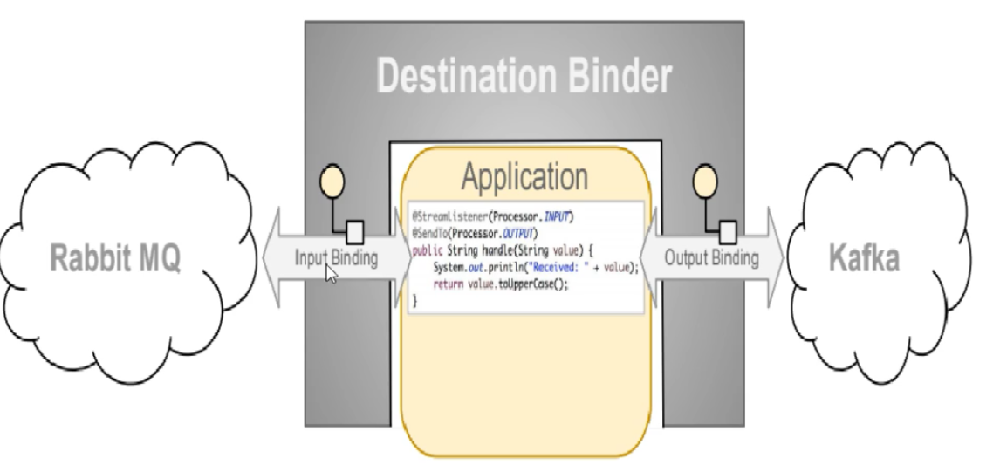

# 第一章：简介

## 1：版本

SpringCloud 最早是从 2014 年推出的，在推出的前期更新迭代速度非常快，频繁发布新版本，目前更趋于稳定，变化稍慢一些；

SpringCloud 的版本并不是传统的使用数字的方式标识，而是使用诸如：Angel、Brixton、Camden......等伦敦的地名来命名版本，

版本的先后顺序使用字母表 A-Z 的先后来标识，

| Hoxton    | 2.2.x                                             |
| --------- | ------------------------------------------------- |
| Greenwish | 2.1.x                                             |
| Finchley  | 兼容 Spring Boot 2.0.x， 不兼容 Spring Boot 1.5.x |
| Edgware   | 兼容 Spring Boot 1.5.x， 不兼容 Spring Boot 2.0.x |
| Dalston   | 兼容 Spring Boot 1.5.x， 不兼容 Spring Boot 2.0.x |
| Camden    | 兼容 Spring Boot 1.4.x， 也兼容 Spring Boot 1.5.x |
| Brixton   | 兼容 Spring Boot 1.3.x， 也兼容 Spring Boot 1.4.x |
| Angel     | 兼容 Spring Boot 1.2.x                            |

Spring Cloud 并没有重复制造轮子，它只是将各家公司开发的比较成熟、经得起实际考验的服务框架组合起来，通过 Spring Boot 风格进行再封装屏蔽掉了复杂的配置和实现原理，最终给开发者留出了一套简单易懂、易部署和易维护的分布式系统开发工具包。这其中有非常著名的 Netflix 公司的开源产品；

## SpringCloud 和 Dubbo 的区别？

dubbo 是二进制传输，占用带宽会少一点。SpringCloud 是 http 传输，带宽会多一点，同时使用 http 协议一般会使用 JSON 报文，消耗会更大。

Spring Cloud 抛弃了 Dubbo 的 RPC 通信，采用的是基于 HTTP 的 REST 方式。


## 2：SpringCloud 升级,部分组件停用:

1,Eureka 停用,可以使用 zk 作为服务注册中心，Consul 也可以，阿里的 Nacos 推荐使用。

2,服务调用,Ribbon 准备停更,代替为 LoadBalance

3,Feign 改为 OpenFeign

4,服务降级 Hystrix 停更,但是也大量使用了。改为 resilence4j 或者阿里巴巴的 sentienl

5.服务网关 Zuul 改为 gateway

6,服务配置 Config 改为 Nacos

7,服务总线 Bus 改为 Nacos

# 第三章：环境搭建

## 1：创建父工程,pom 依赖


选择 Maven 自己的 3.5 以上的


约定>配置》编码

字符编码


注解激活生效


java 编译版本 8


FileType 过滤，让一些文件不显示


删掉 src 文件夹，只保留 pom.xml

跳过单元测试


添加总的 jar 包

```xml
<!-- 统一管理jar包版本 -->
    <properties>
        <project.build.sourceEncoding>UTF-8</project.build.sourceEncoding>
        <maven.compiler.source>1.8</maven.compiler.source>
        <maven.compiler.target>1.8</maven.compiler.target>
        <junit.version>4.12</junit.version>
        <log4j.version>1.2.17</log4j.version>
        <lombok.version>1.16.18</lombok.version>
        <mysql.version>5.1.47</mysql.version>
        <druid.version>1.1.16</druid.version>
        <mybatis.spring.boot.version>1.3.0</mybatis.spring.boot.version>
    </properties>

    <!-- 子模块继承之后，提供作用：锁定版本+子modlue不用写groupId和version 只声明依赖，不不引入jar包 -->
    <dependencyManagement>
        <dependencies>
            <!--spring boot 2.2.2-->
            <dependency>
                <groupId>org.springframework.boot</groupId>
                <artifactId>spring-boot-dependencies</artifactId>
                <version>2.2.2.RELEASE</version>
                <type>pom</type>
                <scope>import</scope>
            </dependency>
            <!--spring cloud Hoxton.SR1-->
            <dependency>
                <groupId>org.springframework.cloud</groupId>
                <artifactId>spring-cloud-dependencies</artifactId>
                <version>Hoxton.SR1</version>
                <type>pom</type>
                <scope>import</scope>
            </dependency>
            <!--spring cloud alibaba 2.1.0.RELEASE-->
            <dependency>
                <groupId>com.alibaba.cloud</groupId>
                <artifactId>spring-cloud-alibaba-dependencies</artifactId>
                <version>2.1.0.RELEASE</version>
                <type>pom</type>
                <scope>import</scope>
            </dependency>
            <dependency>
                <groupId>mysql</groupId>
                <artifactId>mysql-connector-java</artifactId>
                <version>${mysql.version}</version>
            </dependency>
            <dependency>
                <groupId>com.alibaba</groupId>
                <artifactId>druid</artifactId>
                <version>${druid.version}</version>
            </dependency>
            <dependency>
                <groupId>org.mybatis.spring.boot</groupId>
                <artifactId>mybatis-spring-boot-starter</artifactId>
                <version>${mybatis.spring.boot.version}</version>
            </dependency>
            <dependency>
                <groupId>junit</groupId>
                <artifactId>junit</artifactId>
                <version>${junit.version}</version>
            </dependency>
            <dependency>
                <groupId>log4j</groupId>
                <artifactId>log4j</artifactId>
                <version>${log4j.version}</version>
            </dependency>
            <dependency>
                <groupId>org.projectlombok</groupId>
                <artifactId>lombok</artifactId>
                <version>${lombok.version}</version>
                <optional>true</optional>
            </dependency>
        </dependencies>
    </dependencyManagement>

    <build>
        <plugins>
            <plugin>
                <groupId>org.springframework.boot</groupId>
                <artifactId>spring-boot-maven-plugin</artifactId>
                <configuration>
                    <fork>true</fork>
                    <addResources>true</addResources>
                </configuration>
            </plugin>
        </plugins>
    </build>
```

## 2：创建子模块,pay 模块

实现


步骤


### 2.1：建 module


此时的父 pom 中已经自动加入了 module 的配置

```java
  <modules>
    <module>cloud-provider-payment8001</module>
  </modules>
```

### 2.2：pom 依赖

```xml
  <dependencies>
        <!--包含了sleuth+zipkin-->
        <dependency>
            <groupId>org.springframework.cloud</groupId>
            <artifactId>spring-cloud-starter-zipkin</artifactId>
        </dependency>
        <!--eureka-client-->
        <dependency>
            <groupId>org.springframework.cloud</groupId>
            <artifactId>spring-cloud-starter-netflix-eureka-client</artifactId>
        </dependency>
        <dependency>
            <groupId>org.springframework.boot</groupId>
            <artifactId>spring-boot-starter-web</artifactId>
        </dependency>
        <dependency>
            <groupId>org.springframework.boot</groupId>
            <artifactId>spring-boot-starter-actuator</artifactId>
        </dependency>
        <dependency>
            <groupId>org.mybatis.spring.boot</groupId>
            <artifactId>mybatis-spring-boot-starter</artifactId>
        </dependency>
        <dependency>
            <groupId>com.alibaba</groupId>
            <artifactId>druid-spring-boot-starter</artifactId>
            <version>1.1.10</version>
        </dependency>
        <!--mysql-connector-java-->
        <dependency>
            <groupId>mysql</groupId>
            <artifactId>mysql-connector-java</artifactId>
        </dependency>
        <!--jdbc-->
        <dependency>
            <groupId>org.springframework.boot</groupId>
            <artifactId>spring-boot-starter-jdbc</artifactId>
        </dependency>
        <dependency>
            <groupId>org.springframework.boot</groupId>
            <artifactId>spring-boot-devtools</artifactId>
            <scope>runtime</scope>
            <optional>true</optional>
        </dependency>
        <dependency>
            <groupId>org.projectlombok</groupId>
            <artifactId>lombok</artifactId>
            <optional>true</optional>
        </dependency>
        <dependency>
            <groupId>org.springframework.boot</groupId>
            <artifactId>spring-boot-starter-test</artifactId>
            <scope>test</scope>
        </dependency>
    </dependencies>

```

### 2.3：创建 application.yml


一定要变成树叶的标志，如果没有：

https://blog.csdn.net/qq_42449963/article/details/105518286


如果还不行，就 maven clean 一下，应该是 spring 的 jar 包没导入

```yml
server:
	port: 8001
spring:
	application:
		name: cloud-payment-service
	datasource:
    # 当前数据源操作类型
    type: com.alibaba.druid.pool.DruidDataSource
    # mysql驱动类
    driver-class-name: com.mysql.cj.jdbc.Driver
      url: jdbc:mysql://localhost:3306/db2019?useUnicode=true&characterEncoding=
            UTF-8&useSSL=false&serverTimezone=GMT%2B8
    username: root
    password: root
mybatis:
    mapper-locations: classpath*:mapper/*.xml
   	type-aliases-package: com.eiletxie.springcloud.entities
   			它一般对应我们的实体类所在的包，这个时候会自动取对应包中不包括包名的简单类名作为包括包名的别名。多个package之间可以用逗号或者分号等来进行分隔（value的值一定要是包的全）
```

### 2.4：主启动类

```java
@SpringBootApplication
public class PaymentMain8001 {

    public static void main(String[] args) {
        SpringApplication.run(PaymentMain8001.class,args);
   }
}
```

### 2.5：业务类

1：sql

```sql
CREATE DATABASE `db2019`;

USE `db2019`;

DROP TABLE IF EXISTS `payment`;

CREATE TABLE `payment` (
  `id` BIGINT(20) NOT NULL AUTO_INCREMENT COMMENT 'ID',
  `serial` VARCHAR(200) DEFAULT '',
  PRIMARY KEY (`id`)
) ENGINE=INNODB DEFAULT CHARSET=utf8;
```

2：实体类

Payment

```java
//引入lombok，不再写get和set方法
@Data
//对全部参数应用get和set
@AllArgsConstructor
//空参数
@NoArgsConstructor
//序列化
public class Payment implements Serializable {
    private Long id;
    private String serial;
}
```

前端返回实体

```java
//引入lombok，不再写get和set方法
@Data
//对全部参数应用get和set
@AllArgsConstructor
//空参数
@NoArgsConstructor
//序列化
/**
 * 返回前端的数据通用类
 */
public class CommonResult<T> {
    private Integer code;
    private String message;
    private T data;

    public CommonResult(Integer code,String message)
    {
        this(code,message,null);
    }

}
```

报错是因为没有安装 lombok 插件

4,dao 层:

```java
@Mapper
public interface PaymentDao {

    public int create(Payment payment);

    public Payment getPaymentById(@Param("id") Long id);
}
```

5,mapper 配置文件类

在 resource 下创建 directory 目录 mapper，创建 File 为 PaymentMapper.xml

```xml
<?xml version="1.0" encoding="UTF-8" ?>
<!DOCTYPE mapper PUBLIC "-//mybatis.org//DTD Mapper 3.0//EN" "http://mybatis.org/dtd/mybatis-3-mapper.dtd" >

<mapper namespace="com.xqc.springcloud.dao.PaymentDao">

    <insert id="create" parameterType="Payment" useGeneratedKeys="true" keyProperty="id">
        insert into payment(serial)  values(#{serial});
    </insert>

    <resultMap id="BaseResultMap" type="com.xqc.springcloud.entities.Payment">
        <id column="id" property="id" jdbcType="BIGINT"/>
        <id column="serial" property="serial" jdbcType="VARCHAR"/>
    </resultMap>
    <select id="getPaymentById" parameterType="Long" resultMap="BaseResultMap">
        select * from payment where id=#{id};
    </select>

</mapper>

```

6,写 service 和 serviceImpl


7,controller


## 3：热部署

module 中添加插件：

```xml
        <!--自动热部署开发工具-->
        <dependency>
            <groupId>org.springframework.boot</groupId>
            <artifactId>spring-boot-devtools</artifactId>
            <scope>runtime</scope>
            <optional>true</optional>
        </dependency>
```

父工程中添加

```xml
    <build>
        <plugins>
            <plugin>
                <groupId>org.springframework.boot</groupId>
                <artifactId>spring-boot-maven-plugin</artifactId>
                <configuration>
                    <fork>true</fork>
                    <addResources>true</addResources>
                </configuration>
            </plugin>
        </plugins>
    </build>
```

开启自动编译的选项


在父 pom.xml 中按 Ctrl + Shift + Alt + /点击 Registry


如果遇到这个错误不用管，这是阿里犯的错


## 4：order 模块

1：建 moudle

2：改 pom

3：写 yml

```xml
server
	port:80
```

4：主启动类

```java
@SpringBootApplication
@EnableDiscoveryClient
public class OrderZKMain80
{
    public static void main(String[] args) {
            SpringApplication.run(OrderZKMain80.class, args);
    }
}
```

5：业务类

controller 类

因为这里是消费者类,主要是消费,那么就没有 service 和 dao,需要调用 pay 模块的方法。并且这里还没有微服务的远程调用,那么如果要调用另外一个模块,则需要使用基本的 api 调用

使用 RestTemplate 调用 pay 模块


使用配置类将 restTemplate 注入到容器

```java
@Configuration
public class ApplicationContextConfig
{
    //依赖注入
    @Bean
    public RestTemplate getRestTemplate()
    {
        return new RestTemplate();
    }
}
```

编写 controller


测试启动两个服务，访问消费者路径

localhost/consumer/payment/get/31

注意：在提供者模块不要忘记@RequestBody 对于参数

运行窗口：Run DashBoard

    <option name="configurationTypes">
    	<set>
    		<option value="SpringBootApplicationConfigurationType/>
    	</set>
    </option>

## 5：重构,

新建一个模块,将重复代码抽取到一个公共模块中

### 5.1,创建 commons 模块

### 5.2 抽取公共 pom

```xml
    <dependencies>
        <dependency>
            <groupId>org.springframework.boot</groupId>
            <artifactId>spring-boot-devtools</artifactId>
            <scope>runtime</scope>
            <optional>true</optional>
        </dependency>
        <dependency>
            <groupId>org.projectlombok</groupId>
            <artifactId>lombok</artifactId>
            <optional>true</optional>
        </dependency>
        <!--hut工具包，对时间格式有很好的支持-->
        <dependency>
            <groupId>cn.hutool</groupId>
            <artifactId>hutool-all</artifactId>
            <version>5.1.0</version>
        </dependency>
    </dependencies>
```

### 5.3：entity 和实体类放入 commons 中

### 5.4：使用 mavne,将 commone 模块打包(install),

删除原有模块的实体类

其他模块引入 commons

# 第四章：服务注册与发现

## 1：Eureka

当服务很多时,单靠代码手动管理是很麻烦的,需要一个公共组件,统一管理多服务,包括服务是否正常运行,等

Eureka 用于**==服务注册==**,目前官网**已经停止更新**

**服务治理**

管理服务与服务之间的依赖关系，可以实现服务调用，负载均衡，容错等，实现服务发现与注册

**服务注册与发现**

Eureka 采用 CS 的设计架构，EurekaServer 作为服务注册功能的服务器，它是服务注册中心，而系统中的其他微服务，使用 Eureka 的客户端连接到 Eureka Server 并维持心跳连接。


Eureka 包含两个组件：EurekaServer 和 EurekaClient

EurekaServer 提供服务注册服务：EurekaServer 中服务注册表中将会存储所有可用服务节点的信息，服务节点的信息可以在界面中直观看到。

EurekaClient 通过注册中心进行访问：Java 客户端，具备一个内置的，使用轮询负载算法的负载均衡器。在启动后，将会向 EurekaServer 发送心跳（默认周期为 30 秒）。如果 EurekaServer 在多个心跳周期内没有接收到某个节点的心跳。将会从服务注册表中把这个服务节点移除（默认 90 秒）

### 原理：

**客户端启动时如何注册到服务端？**

Eureka 客户端在启动时，首先会创建一个心跳的定时任务，定时向服务端发送心跳信息，服务端会对客户端心跳做出响应，如果响应状态码为 404 时，表示服务端没有该客户端的服务信息，那么客户端则会向服务端发送注册请求，注册信息包括服务名、ip、端口、唯一实例 ID 等信息。

**服务端如何保存客户端服务信息？**

客户端通过 Jersey 框架（亚马逊的一个 http 框架）将服务实例信息发送到服务端，服务端将客户端信息放在一个 ConcurrentHashMap 对象中。

**客户端如何拉取服务端已保存的服务信息？**

客户端拉取服务端服务信息是通过一个定时任务定时拉取的，每次拉取后刷新本地已保存的信息，需要使用时直接从本地直接获取。

**心跳与服务剔除机制？**

心跳机制：

- 客户端启动后，就会启动一个定时任务，定时向服务端发送心跳数据，告知服务端自己还活着，默认的心跳时间间隔是 30 秒。

服务剔除机制：

- 如果开启了自我保护机制，那么所有的服务，包括长时间没有收到心跳的服务（即已过期的服务）都不会被剔除；
- 如果未开启自我保护机制，那么将判断最后一分钟收到的心跳数与一分钟收到心跳数临界值（计算方法参考 5.1 节）比较，如果前者大于后者，且后者大于 0 的话，则启用服务剔除机制；
- 一旦服务剔除机制开启，则 Eureka 服务端并不会直接剔除所有已过期的服务，而是通过随机数的方式进行剔除，避免自我保护开启之前将所有的服务（包括正常的服务）给剔除。

### 1.1：**单机版 eureka:**

**1,1.1：创建项目 cloud_eureka_server_7001**

**1.1.2,引入 pom 依赖**

eurka 最新的依赖变了，服务端引用下边的

```xml
<!--老版本-->
<dependency>
    <groupId>org.springframework.cloud</groupId>
    <artifactId>spring-cloud-starter-eureka</artifactId>
</dependency>

<!--新版本-->
<dependency>
    <groupId>org.springframework.cloud</groupId>
    <artifactId>spring-cloud-starter-neflix-eureka-server</artifactId>
</dependency>
```

1.1.3,配置文件

```yml
server:
  port: 7001

eureka:
  instance:
    hostname: eureka7001.com #eureka服务端的实例名称
  client:
    register-with-eureka: false #false表示不向注册中心注册自己。
    fetch-registry: false #false表示自己端就是注册中心，我的职责就是维护服务实例，并不需要去检索服务
    service-url:
      #集群指向其它eureka
      #defaultZone: http://eureka7002.com:7002/eureka/
      #单机就是7001自己
      defaultZone: http://eureka7001.com:7001/eureka/
  #server:
  #关闭自我保护机制，保证不可用服务被及时踢除
  #enable-self-preservation: false
  #eviction-interval-timer-in-ms: 2000
```

1.1.4,主启动类

```java
@SpringBootApplication
@EnableEurekaServer
public class EurekaMain7001
{
    public static void main(String[] args) {
            SpringApplication.run(EurekaMain7001.class, args);
    }
}
```

**1.1.5,此时就可以启动当前项目了**

1.1.6：测试

打开：localhost:7001

### **1.2：其他服务注册到 eureka**

比如此时 pay 模块加入 eureka

1.主启动类上,加注解,表示当前是 eureka 客户端

```java
@EnableDiscoveryClient
```

2,修改 pom,引入

```xml
<!--eureka-client,引入client的依赖-->
<dependency>
    <groupId>org.springframework.cloud</groupId>
    <artifactId>spring-cloud-starter-neflix-eureka-client</artifactId>
</dependency>
```

3,修改配置文件

```yml
eureka:
  client:
    #表示是否将自己注册进EurekaServer默认为true。
    register-with-eureka: true
    #是否从EurekaServer抓取已有的注册信息，默认为true。单节点无所谓，集群必须设置为true才能配合ribbon使用负载均衡
    fetchRegistry: true
    service-url:
      #单机版
      defaultZone: http://localhost:7001/eureka
      # 集群版
      #defaultZone: http://eureka7001.com:7001/eureka,http://eureka7002.com:7002/eureka
  instance:
    instance-id: payment8001
    #访问路径可以显示IP地址
    prefer-ip-address: true
    #Eureka客户端向服务端发送心跳的时间间隔，单位为秒(默认是30秒)
    #lease-renewal-interval-in-seconds: 1
    #Eureka服务端在收到最后一次心跳后等待时间上限，单位为秒(默认是90秒)，超时将剔除服务
    #lease-expiration-duration-in-seconds: 2
```

4,pay 模块重启,就可以注册到 eureka 中了

```java
@SpringBootApplication
@EnableEurekaClient
public class PaymentMain8001{
    public static void main(String[] args){
        SpringApplication.run()
    }
}
```

### 1.3：集群版 eureka

#### 集群原理:


```java
1,就是pay模块启动时,注册自己,并且自身信息也放入eureka
2.order模块,首先也注册自己,放入信息,当要调用pay时,先从eureka拿到pay的调用地址
3.通过HttpClient调用
	并且还会缓存一份到本地,每30秒更新一次
```

问：微服务 RPC 远程调用最核心的是什么？

高可用：要是注册中心坏了，就直接崩溃，可以搭建 Eureka 注册中心集群。

**集群构建原理:**

互相注册


#### **构建新 erueka 项目**

名字:cloud_eureka_server_7002

1,pom 文件:

粘贴 7001 的即可

2,配置文件:

在写配置文件前,修改一下主机的 C:\Windows\System32\drivers\etchosts 文件


首先修改之前的 7001 的 eureka 项目,因为多个 eureka 需要互相注册

```yml
server:
	port: 7001	# 注意,这里是7001
eureka:
	instance:
		hostname: eureka7001.com # eureka服务端的实例名称
	client:
		register-with-eureka: false #false表示不向注册中心注册自己。
	fetch-registry: false #false表示自己端就是注册中心，我的职贵就是维护服务实例，并不需要去检索服务
	service-url:
		defaultZone: http://eureka7002.com: 7002/eureka/ # 注意.这里指定的是7002的地址

```

然后修改 7002

7002 也是一样的,只不过端口和地址改一下

3,主启动类:

复制 7001 的即可

4,然后启动 7001,7002 即可

__

### 1.4：将 pay,order 模块注册到 eureka 集群中:

1,只需要修改配置文件即可:


2,两个模块都修改上面的都一样即可

然后启动两个模块

要先启动 7001,7002,然后是 pay 模块 8001,然后是 order(80)

### 1.5：将 pay 模块也配置为集群模式:

0,创建新模块,8002

名称: cloud_pay_8002

1,pom 文件,复制 8001 的

2,pom 文件复制 8001 的

3,配置文件复制 8001 的

端口修改一下,改为 8002

服务名称不用改,用一样的

4.主启动类,复制 8001 的

5,mapper,service,controller 都复制一份

然后就启动服务即可

此时访问 order 模块,发现并没有负载均衡到两个 pay,模块中,而是只访问 8001

虽然我们是使用 RestTemplate 访问的微服务,但是也可以负载均衡的


**注意这样还不可以,需要让 RestTemplate 开启负载均衡注解,还可以指定负载均衡算法,默认轮询**


### 1.6：修改服务主机名和 ip 在 eureka 的 web 上显示

比如修改 pay 模块

1,修改配置文件:

添加实例


### 1.7：服务发现 Discovery

对于注册进 Eureka 里面的微服务，可以铜鼓服务发现来了获得该服务的信息。

以 pay 模块为例

**1,首先添加一个注解,在 controller 中**


**2,在主启动类上添加一个注解**


**然后重启 8001.访问/payment/discover**y

### 1.8：Eureka 自我保护:


概述
保护模式主要用于一组客户端与 Euraka Server 之间存在网络分区场景下的保护，一旦进入保护模式：**Eureka Server 将会尝试保护其服务注册表中的信息，不再删除服务注册表中的数据，也就是不会注销任何微服务**

一句话：某时刻某一个微服务不可用了，Eureka 不会立即清理。依旧会对该微服务新的进行保存，属于 CAP 里面的 AP 分支。

为什么会产生 Eureka 的自我保护机制？

为了防止 EurekaClient 可以正常运行，但是与 EurekaServer 网络不通情况下，EurekaServer 不会立即将 EurekaClient 服务剔除

什么是自我保护模式？

默认情况下，如果 EurekaServer 在一定时间内没有收到某个微服务实例的心跳，EurekaServer 将会注销该实例（默认 90 秒）。但是当网络分区故障发生（延时，卡顿，拥挤）时，微服务与 EurekaServer 之间无法正常通信，以上行为可能变得危险了——因为微服务本身其实是健康的，此时不应该注销这个微服务，EUreka 通过自我保护来解决这个问题——当 EurekaServer 节点在短时间内丢失过多客户端时（可能发生了网络分区故障）那么这个节点就会进入自我保护模式。

**eureka 服务端配置:**

出厂默认。自我保护机制开启：

eureka.server.enable-self-proservation = false 可以禁用自我保护机制

evicition-interval-timer-in-ms2000

**设置接受心跳时间间隔**

客户端(比如 pay 模块):


此时启动 erueka 和 pay.此时如果直接关闭了 pay,那么 erueka 会直接删除其注册信息

## 2：Zookeeper

### 2.1：启动 zk,到 linux 上

### 2.2：创建新的 pay 模块,

单独用于注册到 zk 中

名字 : cloud-provider1_pay_8004

1,pom 依赖

2,配置文件


3,主启动类


4,controller


5,然后就可以启动

**此时启动,会报错,因为 jar 包与我们的 zk 版本不匹配**

解决:
修改 pom 文件,改为与我们 zk 版本匹配的 jar 包


**此时 8003 就注册到 zk 中了**

```java
我们在zk上注册的node是临时节点,当我们的服务一定时间内没有发送心跳
  	那么zk就会`将这个服务的node删除了
```

**这里测试,就不写 service 与 dao 什么的了**

### 2.3：创建 order 消费模块注册到 zk

创建项目

名字: cloud_order_zk_80

2,pom

3,配置文件


4 主启动类:


5,RestTemolate


6,controller


**然后启动即可注册到 zk**

8,集群版 zk 注册:

只需要修改配置文件:


这个 connect-string 指定多个 zk 地址即可

connect-string: 1.2.3.4,2.3.4.5

## 3：Consul

Consul 是一套开源的分布式服务发现和配置管理系统，由 HashiCorp 公司用 `Go` 语言开发

提供了微服务中的服务治理。配置中心，控制总线等功能，这些功能中的每一个都可以根据需要单独使用，也可以在一起使用。

优点：

- 基于 raft 协议，比较简洁

- 支持健康检查，服务发现同时支持 Http 和 DNS 协议支持跨越数据中心的 WAN 集群，提供图形界面跨平台，支持 Linux，Mac，Windows

- KV 存储

- 多数据中心

- 可视化 WEB 界面

### 1,安装 consul

需要下载一个安装包

双击运行

```cmd
# 使用开发模式启动
consul agent -dev
```

访问主页

http://localhost:8500

### 2,创建新的 pay 模块,8006

1,项目名字

cloud_consule_pay_8006

2,pom 依赖

3,配置文件


4,主启动类


5,controller


6,启动服务

####

### 3,创建新 order 模块

cloud-consul-order-80

1,pom 文件

2,配置文件


3,主启动类


4,RestTemplate 注册

配置类注册

5,controller


6,启动服务,测试

## 4：三个注册中心的异同

CAP：[一致性](https://baike.baidu.com/item/一致性/9840083)（Consistency）、[可用性](https://baike.baidu.com/item/可用性/109628)（Availability）、[分区容错性](https://baike.baidu.com/item/分区容错性/23734073)（Partition tolerance）。

- zookeeper 当主节点故障时，zk 会在剩余节点重新选择主节点，耗时过长，虽然最终能够恢复，但是选取主节点期间会导致服务不可用，这是不能容忍的。
- eureka 各个节点是平等的，一个节点挂掉，其他节点仍会正常保证服务。


# 第五章：服务调用

## 10,Ribbon 负载均衡

### 简介

主要提供客户端的软件负载均衡和服务调用。Ribbon 客户端组件提供一系列完善的配置项如连接超时，重试等。简单的说，就是在配置文件中列出 Load Balencer 后面所有的机器，Ribbon 会自动的帮助你基于某种规则（如简单轮询，随机连接等）去连接这些机器。我们很容易使用 Ribbon 实现自定义的负载均衡算法。

**Ribbon 目前也进入维护,基本上不准备更新了**

**进程内 LB(本地负载均衡)**

将 LB 逻辑集成到消费方，消费方从服务注册中心获知有哪些地址可用，然后自己再从这些地址中选择一个合适的服务器。

集中式（LB）（服务器负载均衡）

集中式 LB，即在服务的消费方和提供方之间使用独立的 LB 设施（可以是硬件 F5 软件 nginx 等

**区别**

Ribbon 本地负载均衡客户端 VS Nginx 服务端负载均衡：

Nginx 是服务器负载均衡，客户端所有请求都会交给 Nginx，然后由 Ngixn 实现转发。

Ribbon 本地父子负载均衡，在调用微服务接口时候，会在服务注册中心上获取信息表之后缓存到 JV

**Ribbon 就是负载均衡+RestTemplate**

Ribbon 其实就是一个软负载均衡的客户端组件，它可以和其他所需要请求的客户端结合使用，和 Eureka 结合只是其中一个实例。


Ribbon 在工作时分成两步：

第一步选择 EurekaServer，它优先选择在同一区域内负载较少的 Server

第二步在根据用户指定的策略，在从 server 取到的服务注册列表中选择一个地址。

其中 Ribbon 提供了多种策略：轮询，随机，和响应时间加权。

### 原理

ILoadBalance负载均衡器：ribbon是一个为客户端提供负载均衡功能的服务，它内部提供了一个叫做ILoadBalance的接口代表负载均衡器的操作，比如有添加服务器操作、选择服务器操作、获取所有的服务器列表、获取可用的服务器列表等等。

流程：

LoadBalancerClient（RibbonLoadBalancerClient是实现类）在初始化的时候（execute方法），会通过ILoadBalance（BaseLoadBalancer是实现类）向Eureka注册中心获取服务注册列表，并且每10s一次向EurekaClient发送“ping”，来判断服务的可用性，如果服务的可用性发生了改变或者服务数量和之前的不一致，则从注册中心更新或者重新拉取。LoadBalancerClient有了这些服务注册列表，就可以根据具体的IRule（路由）来进行负载均衡。

IRule接口代表负载均衡策略，choose方法时具体的选择服务器方法，其中RandomRule表示随机策略、RoundRobinRule表示轮询策略、WeightedResponseTimeRule表示加权策略、BestAvailableRule表示请求数最少策略等等。

随机策略：

```java
int index = rand.nextInt(serverCount); // 使用jdk内部的Random类随机获取索引值index
server = upList.get(index); // 得到服务器实例
```

轮询策略：

最大权重：

有一个默认每30秒更新一次权重列表的定时任务，该定时任务会根据实例的响应时间来更新权重列表，choose方法做的事情就是，用一个(0,1)的随机double数乘以最大的权重得到randomWeight，然后遍历权重列表，找出第一个比randomWeight大的实例下标，然后返回该实例

最少并发请求：

```java
for (Server server: serverList) { // 遍历每个服务器
        ServerStats serverStats = loadBalancerStats.getSingleServerStat(server); // 获取各个服务器的状态
        if (!serverStats.isCircuitBreakerTripped(currentTime)) { // 没有触发断路器的话继续执行
            int concurrentConnections = serverStats.getActiveRequestsCount(currentTime); // 获取当前服务器的请求个数
            if (concurrentConnections < minimalConcurrentConnections) { // 比较各个服务器之间的请求数，然后选取请求数最少的服务器并放到chosen变量中
                minimalConcurrentConnections = concurrentConnections;
                chosen = server;
            }
        }
    }
```


### 使用 Ribbon:

1,默认我们使用 eureka 的新版本时,它默认集成了 ribbon

```xml
<dependency>
    <groupId>org.springframework.cloud</groupId>
    <artifactId>spring-cloud-starter-neflix-eureka-server</artifactId>
</dependency>
```

**==这个 starter 中集成了 reibbon 了==**

2,我们也可以手动引入 ribbon

**放到 order 模块中,因为只有 order 访问 pay 时需要负载均衡**

```xml
<dependency>
    <groupId>org.springframework.cloud</groupId>
    <artifactId>spring-cloud-starter-neflix-ribbon</artifactId>
</dependency>
```

3,RestTemplate 类:

```java
// 返回对象为响应体中数据转化成的对象，基本上可以理解为Json
@GetMapping(" / consumer/ payment/get/{id}")
public CommonResult<Payment> getPayment(@Pathvariable("id") Long id){
	return restTemplate.getForobject(PAYMENT_SRV+"/payment/get/"+id,CommonResult.class);
}
//返回对象为ResponseEntity对象，包含了响应中的一些重要信息，比如响应头、响应状态码、响应体等
@GetMapping( "/ consumer/ payment/getForEntity/{id}")
public commonResult<Payment> getPayment2(@Pathvariable("id") Long id){
	ResponseEntity<commonResult> entity = restTemplate.getForEntit(PAYMENT_SRV+" /payment/get/"+id，commonResul);
    if(entity.getstatuscode().is2xxSuccessful()){
        return entity.getBody();
    }e1se {
        return new CommonResult( code: 444，message: "操作失败");
    }
}
@GetMapping("/consumer/payment/getForEntity/{id}")
public commonResult<Payment> getPayment2(@Pathvariable("id") Long id){
	ResponseEntitycCommonResult> entity = restTemplate.getForEntity( url:PAYINENT_URL+"/payment/get/"+id,CommonResul.class);
	if(entity.getstatuscode().is2xxsuccessful()){
        return entity.getBody();//这个responseEntity中有判断,这里是判断,状态码是不是2xx,
    }else{
        return new commonResult<>( code: 444,message:"操作失败");
    }
}
```

```java
RestTemplate的:
		xxxForObject()方法,返回的是响应体中的数据
    xxxForEntity()方法.返回的是entity对象,这个对象不仅仅包含响应体数据,还包含响应体信息(状态码等)
```

#### Ribbon 常用负载均衡算法:

**IRule 接口,Riboon 使用该接口,根据特定算法从所有服务中,选择一个服务,**

**Rule 接口有 7 个实现类,每个实现类代表一个负载均衡算法**

- com.netflix.loadbalancer.RoundRobinRule : 轮询
- com.netflix.loadbalancer.RandomRule：随机
- com.netflix.loadbalancer.RetryRule：先轮询，如果获取失败则指定时间内重试
- WeightedResponseTimeRule：响应速度越快的实例权重越大，越容易被选择
- BestAvailableRule：先过滤多次访问故障的，再选择并发量最小的服务。
- AvailabilityFilteringRule：先过滤故障，再选择并发量较小的实例
- ZoneAvoidanceRule：默认规则，复合判断 server 所在区域的性能和可用性。

**==这里使用 eureka 的那一套服务==**

这个自定义配置类不能放在@ComponentScan 所扫描的当前包下以及子包下，否则自定义的配置类就会被所有的 Ribbon 客户端所共享，达不到特殊化定制的目的了。

**==也就是不能放在主启动类所在的包及子包下==**

1,修改 order 模块

2,额外创建一个包


3,创建配置类,指定负载均衡算法

```java
@Configuration
public class MySelfRule
{
    @Bean
	public IRule myRule(){
		return new RandomRule();//定义为随机
	}
}
```

4,在主启动类上加一个注解

```java
@springBootApplication
@EnableEurekaclient
@Ribbonclient(name = "CLOUD-PAYMENT-SERVICE" ,configuration=MySelfRule.class)
public class orderMain80
{
	public static void main(string[] args){
        SpringApplication.run(Orderwain80.class，args);
    }
}
```

**表示,访问 CLOUD_pAYMENT_SERVICE 的服务时,使用我们自定义的负载均衡算法**

#### 自定义负载均衡算法:

1,ribbon 的轮询算法原理

rest 接口第几次请求数%服务器集群总数量 = 实际调用服务器位置下标，每次服务重启后 rest 接口计数从 1 开始


2,自定义负载均衡算法:

- **给**pay 模块(8001,8002),的 controller 方法添加一个方法,返回当前节点端口

```java
@value( "${server.port}")
private string serverPort;

@GetMapping(value = "/ payment/lb")
public string getPaymentLB()
{
    return serverPort;
}

```

- **修改 order 模块**

去掉@LoadBalanced

```java
@configuration
public class Applicationcontextconfig{
	@Bean
	//@loadBalanceda
	public RestTemplate getRestTemplate() {
        return new RestTemplate();
    }
}
```

3,自定义接口


==具体的算法在实现类中实现==

4,接口实现类


5,修改 controller:


6,启动服务,测试即可

## OpenFeign

是一个声明式的 web 客户端,只需要创建一个接口,添加注解即可完成微服务之间的调用，封装了 Ribbon

Feign 支持可插拔式的编码器和解码器，SpringCloud 对 Feign 进行封装。使其支持 SpringMVC 标准注解和 HttpMessageConverters。

以前要写接口，写实现类，通过 Ribbon 负载均衡远程调用，拿到返回值继续写接下来的程序，现在直接写接口，添加注解，使用时直接使用远程的类方法即可，无感知远程 HTTP 请求。

作用：

远程调用其他服务

实际开发中，由于对服务依赖的调用可能不止一处，往往一个接口会被多处调用，所以通常都会针对每个微服务自行封装一些客户端类来包装这些依赖服务的调用。

在 Feign 的实现下，我们只需要创建一个接口并使用注解的方式来配置它（以前是 DAO 接口上面标注 Mapper 注解，现在是一个微服务接口上面标注一个 Feign 注解即可）即可完成对服务提供方的接口绑定，简化了使用 SrpingCloudRibbon 时，自动封装服务调用客户端的开发量。

就是 A 要调用 B,Feign 就是在 A 中创建一个一模一样的 B 对外提供服务的的接口,我们调用这个接口,就可以服务到 B

### Feign 与 OpenFeign 区别

Feign：Feign 是 SpringCloud 组件中的一个轻量级 RESTful 的 Http 服务客户端，Feign 内置了 Feign 内置了 Ribbon，用来做客户端负载均衡，去调用服务注册中心的服务。Feign 的使用方式是：使用 Feign 的注解定义接口，调用这个接口，就可以斯奥用服务注册中心的服务。

OpenFeign：OpenFeign 是 SpringCloud 在 Feign 的基础上支持了 SpringMVC 的注解，如@RequestMapping 等等，OpenFeign 的@FeignClient 可以解析 SpringMVC 的@RequestMapping 注解下的接口，并通过动态代理的方式产生实现类，实现类中做负载均衡并调用其他服务。

### 常用注解

1）：@FeignClient 和@EnableFeignClients

@FeignClient 标注用于声明 Feign 客户端可访问的 Web 服务。

@EnableFeignClients 标注用于修饰 Spring Boot 应用的入口类，以通知 Spring Boot 启动应用时，扫描应用中声明的 Feign 客户端可访问的 Web 服务。

### 使用 OpenFeign

之前的服务间调用,我们使用的是 ribbon+RestTemplate，现在改为使用 Feign

1,新建一个 order 项目,用于 feign 测试

名字 cloud_order_feign-80

pom 文件

```xml
<!--openfeign-->
<dependency>
    <groupId>org.springframework.cloud</groupId>
    <artifactId>spring-cloud-starter-openfeign</artifactId>
</dependency>
```

配置文件

```yml
server:
	port: 80
eureka:
	client:
		register-with-eureka: false
		service-url:
			defaultzone: http://eureka7001.com:7001/eureka/,http://eureka7002.com:7002/eureka/
```

主启动类

```java
@SpringBootApplication
@EnableFeignClients
public class OrderFeignMain80 {
    public static void main(String[] args) {
        SpringApplication.run(OrderFeignMain80.class, args);
    }
}
```

5,fegin 需要调用的其他的服务的接口

```java
@Component
@FeignClient(value = "cloud-payment-service")
public interface PaymentFeignService {

    @GetMapping(value = "/payment/get/{id}")
    public CommonResult<Payment> getPaymentById(@PathVariable("id") Long id);

    @GetMapping("/payment/feign/timeout")
    public String paymentFeignTimeout();
}
```

6,controller

```java
@RestController
@Slf4j
public class OrderFeignController {
    @Resource
    private PaymentFeignService paymentFeignService;

    @GetMapping(value = "/consumer/payment/get/{id}")
    public CommonResult<Payment> getPaymentById(@PathVariable("id") Long id){
        CommonResult<Payment> paymentById = paymentFeignService.getPaymentById(id);
        return paymentById;
    }

    @GetMapping("/consumer/payment/feign/timeout")
    public String paymentFeignTimeout(){
        //open-feign-ribbon,客户端默认等待一秒钟
        return paymentFeignService.paymentFeignTimeout();
    }
}
```

7 测试:

启动两个 erueka(7001,7002)

启动两个 pay(8001,8002)

启动当前的 order 模块

请求传参：

1：GET 方式：使用@PathVriable 注解或@RequestParam 注解接受请求参数。如上面演示，

2：POST 方式：


### 性能优化

#### gzip 压缩

压缩纯文本可以达到 70%以上，降低网络传输字节，加快网页加载速度，使用 deflate 算法

Http 协议关于压缩传输的规定

1：客户端向服务器请求中带有：` Accept-Encoding:gzip` ,`deflate ` 字段，向服务器表示客户端支持的压缩格式（gzip 或 deflate）如果不发送该请求头，服务端默认是不会压缩的。

2：服务端在收到请求之后，如果请求头中含有 `Accept-Encodeing` 字段，并且支持该压缩类型，就会对想用报文压缩之后返回给客户端，并且携带 `Content-Encoding:gzip` 消息头，表示响应报文是根据改格式进行压缩的

3：客户端接收到请求之后，先判断是否有 ` Content-Encoding` 消息头，如果有，按该格式解压报文，否则按正常报文处理

配置：

浏览器——>消费者——>生产者，并且返回的过程

局部是指：消费者——生产者直接进行压缩

全局是指：浏览器<——>消费者<——>生产者之间的传输进行压缩

局部：

服务消费者：application.yml

```yml
feign:
	compression:
		request:
			mime-types:text/xml,application/xml.application/json #配置压缩支持的MIME TYPE
			mime-request-size：512 # 配置压缩数据大小的最小阈值，默认2048
			enabled:true #请求是否开启gzip压缩
		response:
			enabled:true # 响应是否开启gzip压缩
```

全局：

```yml
server:
	port:9000 # 接口
	compression:
        # 是否开启压缩
        enabled:true
        # 配置压缩支持的MIME TYPE
        mime-types:application/json,application/xml,text/html,text/xml,text/plain
```


#### Http连接池

Feign的Http客户端支持3种框架：HttpURLConnection，HttpClient，OKHttp，默认是HttpURLConnection，一般换成HttpClient

#### OpenFeign 超时机制

==OpenFeign 默认等待时间是 1 秒,超过 1 秒,直接报错==

1,设置超时时间,修改配置文件:

**因为 OpenFeign 的底层是 ribbon 进行负载均衡,所以它的超时时间是由 ribbon 控制**

```properties
# 设置feign客户端超时时间(OpenFeign默认支持ribbon)
ribbon:
  # 指的是建立连接所用的时间,适用于网络状态正常的情况下,两端连接所用的时间
  ReadTimeout: 5000
  # 指的是建立连接后从服务器读取到可用资源所用的时间
  ConnectTimeout: 5000
```

#### OpenFeign 日志

Feign 提供日志打印功能，我们可以通过配置来调整日志级别，从而了解 Fegin 中 Http 请求的细节。对 feign 接口的调用情况进行监控和输出。后可以使用链路追踪进行监控

**OpenFeign 的日志级别有:**

NONE：默认的，不显示任何日志

BASIC：仅记录请求方法，URL，响应状态码及执行时间。

HEADERS：除了 BASIC 中定义的信息以外，还有请求和响应的头信息

FULL：除了 HEADERS 中定义的信息以外，还有请求和响应的正文及元数据

1,使用 OpenFeign 的日志:

**实现在配置类中添加 OpenFeign 的日志类**

```java
@Configuration
public class FeignConfig {
    /**
     * feignClient配置日志级别
     *
     * @return
     */
    @Bean
    public Logger.Level feignLoggerLevel() {
        // 请求和响应的头信息,请求和响应的正文及元数据
        return Logger.Level.FULL;
    }
}
```

2,为指定类设置日志级别

```java
@Component
@FeignClient(value="CLOUD-PAYMENT-SERVICE")
public interface PaymentFeignService{

}
```

**配置文件中:**

```yml
logging:
  level:
    # feign日志以什么级别监控哪个接口
    com.xqc.springcloud.service.PaymentFeignService: debug
```

3,启动服务即可

### 负载均衡配置

Feign 封装了 Ribbon 自然也就集成了负载均衡的功能，默认采用轮询策略，修改默认策略。

全局修改：

在启动类或配置类中注入负载均衡策略对象，所有服务请求均采用使用这种策略。

```java
@Bean
public RandomRule randomRule(){
    return new RandomRule();
}
```

局部配置：打开配置文件

```yml
# 负载均衡策略
# service-provide为调用的服务的名称
service-provider
	ribbon:
		NFLoadBalancerRuleClassName:com.netflix.loadbalancer.RandomRule
```

### 原理

基于面向接口的动态代理方式生成实现类

FeignClientFactoryBean implement FactoryBean

Target：

# 第六章：服务降级

Hystrix 能够保证在一个依赖出问题的情况下，不会导致整体服务失败，避免级联故障，以提高分布式系统的弹性。

断路器本身就是一种开关装置，当某个服务单元故障时，通过断路器的故障监控（类似熔断保险丝），向调用方返回一个符合预期的，可处理的备选响应（FallBack），而不是长时间的等待或者抛出调用方无法处理的异常。

### hystrix 中的重要概念:

1,服务降级

服务降级是从整个系统的负荷情况出发和考虑的，对某些负荷会比较高的情况，为了预防某些功能（业务场景）出现负荷过载或者响应慢的情况，在其内部 `暂时舍弃对一些非核心的接口和数据的请求` ，而直接返回一个提前准备好的 fallback（退路）错误处理信息。这样，虽然提供的是一个有损的服务，但却保证了整个系统的稳定性和可用性。

2,服务熔断

当某服务出现不可用或响应超时的情况时，为了防止整个系统出现雪崩，暂时停止对该服务的调用。**然后调用服务降级**

3,服务限流

**限流,比如秒杀场景,不能访问用户瞬间都访问服务器,限制一次只可以有多少请求**

4：服务雪崩

多个微服务之间调用的时候，假设微服务 A 调用微服务 B 和微服务 C，微服务 B 和 C 又调用其他的微服务，这就是所谓的“扇出”。

如果扇出的链路上某个微服务的调用响应时间过程或者不可用，对微服务 A 的调用就会占用越来越多的系统资源，进而引起系统崩溃，所谓的“雪崩效应”

### 使用 hystrix,服务降级

1,创建带降级机制的 pay 模块

名字: cloud-hystrix-pay-8007

2,pom 文件

3,配置文件


4,主启动类


5,service


6controller


7,先测试:

```java
此时使用压测工具,并发20000个请求,请求会延迟的那个方法,
		压测中,发现,另外一个方法并没有被压测,但是我们访问它时,却需要等待
		这就是因为被压测的方法它占用了服务器大部分资源,导致其他请求也变慢了
```

8,先不加入 hystrix,

2,创建带降级的 order 模块:

1,名字: cloud-hystrix-order-80

2,pom

3,配置文件


4,主启动类


5,远程调用 pay 模块的接口:


6,controller:


7,测试

启动 order 模块,访问 pay

再次压测 2 万并发,发现 order 访问也变慢了


**解决:**


##### 

3,配置服务降级

1,修改 pay 模块

1,为 service 的指定方法(会延迟的方法)添加@HystrixCommand 注解


2,主启动类上,添加激活 hystrix 的注解


3,触发异常


**可以看到,也触发了降级**

2,修改 order 模块,进行服务降级

一般服务降级,都是放在客户端(order 模块),


1,修改配置文件:


**2,主启动类添加直接,启用 hystrix:**


3,修改 controller,添加降级方法什么的


4,测试

启动 pay 模块,order 模块,

**注意:,这里 pay 模块和 order 模块都开启了服务降级**

但是 order 这里,设置了 1.5 秒就降级,所以访问时,一定会降级

##### 4,重构:

**上面出现的问题:**
1,降级方法与业务方法写在了一块,耦合度高

2.每个业务方法都写了一个降级方法,重复代码多

##### **解决重复代码的问题**:

**配置一个全局的降级方法,所有方法都可以走这个降级方法,至于某些特殊创建,再单独创建方法**

1,创建一个全局方法


2,使用注解指定其为全局降级方法(默认降级方法)


3,业务方法使用默认降级方法:


4,测试:


##### 解决代码耦合度的问题:

修改 order 模块,这里开始,pay 模块就不服务降级了,服务降级写在 order 模块即可

1,Payservice 接口是远程调用 pay 模块的,我们这里创建一个类实现 service 接口,在实现类中统一处理异常


2,修改配置文件:添加:


3,让 PayService 的实现类生效:


```java
它的运行逻辑是:
		当请求过来,首先还是通过Feign远程调用pay模块对应的方法
    但是如果pay模块报错,调用失败,那么就会调用PayMentFalbackService类的
    当前同名的方法,作为降级方法
```

4,启动测试

启动 order 和 pay 正常访问--ok

==此时将 pay 服务关闭,order 再次访问==


可以看到,并没有报 500 错误,而是降级访问==实现类==的同名方法

这样,即使服务器挂了,用户要不要一直等待,或者报错

问题:

**这样虽然解决了代码耦合度问题,但是又出现了过多重复代码的问题,每个方法都有一个降级方法**

### 使用服务熔断

类似保险丝达到最大访问服务后，直接拒绝访问，然后调用服务降级的方法并返回友好提示。

**比如并发达到 1000,我们就拒绝其他用户访问,在有用户访问,就访问降级方法**

1,修改前面的 pay 模块

**1,修改 Payservice 接口,添加服务熔断相关的方法:**


这里属性整体意思是:
10 秒之内(窗口,会移动),如果并发==超过==10 个,或者 10 个并发中,失败了 6 个,就开启熔断器


IdUtil 是 Hutool 包下的类,这个 Hutool 就是整合了所有的常用方法,比如 UUID,反射,IO 流等工具方法什么的都整合了


```java
断路器的打开和关闭,是按照一下5步决定的
  	1,并发此时是否达到我们指定的阈值
  	2,错误百分比,比如我们配置了60%,那么如果并发请求中,10次有6次是失败的,就开启断路器
  	3,上面的条件符合,断路器改变状态为open(开启)
  	4,这个服务的断路器开启,所有请求无法访问
  	5,在我们的时间窗口期,期间,尝试让一些请求通过(半开状态),如果请求还是失败,证明断路器还是开启状态,服务没有恢复
  		如果请求成功了,证明服务已经恢复,断路器状态变为close关闭状态
```

2,修改 controller

添加一个测试方法;


3,测试:

启动 pay,order 模块

==多次访问,并且错误率超过 60%:==


此时服务熔断,此时即使访问正确的也会报错:


**但是,当过了几秒后,又恢复了**

因为在 10 秒窗口期内,它自己会尝试接收部分请求,发现服务可以正常调用,慢慢的当错误率低于 60%,取消熔断

### Hystrix 所有可配置的属性:

**全部在这个方法中记录,以成员变量的形式记录,**

以后需要什么属性,查看这个类即可


### 总结

熔断类型

- 熔断打开：请求不再调用当前服务，内部设置时钟一般为 MTTR（平均故障处理时间）当打开时长达到所设置的时钟则进入半熔断状态。
- 熔断半开：部分请求根据规则调用当前服务，如果请求成功且符合规则则认为当前服务恢复正常，关闭熔断。
- 熔断关闭：熔断关闭不会对服务进行熔断

**==当断路器开启后:==**

1：再有请求调用的时候，将不会调用主逻辑，而是直接调用降级 fallback，通过断路器，实现了自动地发现错误并将降级逻辑切换为主逻辑，减少响应延迟的效果。

2：原来的主逻辑要如何恢复呢？

当断路器打开时，对主逻辑进行熔断之后。Hystrix 会启动一个休眠时间窗，在这个时间窗内，降级逻辑是临时的主逻辑

当休眠时间窗到期，断路器将进入搬开状态，释放一次请求到原来的主逻辑上，如果此次请求正常返回，那么断路器将继续闭合。

如果请求仍然有问题，断路器就继续打开，重新计算休眠空窗期

**==其他参数:==**


**熔断整体流程:**

```java
1请求进来,首先查询缓存,如果缓存有,直接返回
  	如果缓存没有,--->2
2,查看断路器是否开启,如果开启的,Hystrix直接将请求转发到降级返回,然后返回
  	如果断路器是关闭的,
				判断线程池等资源是否已经满了,如果已经满了
  					也会走降级方法
  			如果资源没有满,判断我们使用的什么类型的Hystrix,决定调用构造方法还是run方法
        然后处理请求
        然后Hystrix将本次请求的结果信息汇报给断路器,因为断路器此时可能是开启的
          			(因为断路器开启也是可以接收请求的)
        		断路器收到信息,判断是否符合开启或关闭断路器的条件,
				如果本次请求处理失败,又会进入降级方法
        如果处理成功,判断处理是否超时,如果超时了,也进入降级方法
        最后,没有超时,则本次请求处理成功,将结果返回给controller


```

### Hystrix 服务监控:

#### HystrixDashboard

除了隔离依赖服务调用以外，Hystrix 还提供了准实时的调用监控，Hystrix 会持续地记录所有通过 Hystrix 发起的请求和执行信息，并以统计报表和图形的形式展示给用户，包括每秒执行多少成功，多少失败等。

#### 使用 HystrixDashboard:

1,创建项目:

名字: cloud_hystrixdashboard_9001

2,pom 文件

3,配置文件


4,主启动类


5,修改所有 pay 模块(8001,8002,8003...)

**他们都添加一个 pom 依赖:**


之前的 pom 文件中都添加过了,==这个是 springboot 的监控组件==

6,启动 9001 即可

访问: **localhost:9001/hystrix**

7,注意,此时仅仅是可以访问 HystrixDashboard,并不代表已经监控了 8001,8002

如果要监控,还需要配置:(8001 为例)

==8001 的主启动类添加:==


**其他 8002,8003 都是一样的**

8,到此,可以启动服务

启动 7001,8001,9001

**然后在 web 界面,指定 9001 要监控 8001:**

##### 


# 第七章：服务网关:

zuul 停更了,

## GateWay

GateWay 旨在提供一种简单而有效的方法来对 API 进行路由，以及提供强大的过滤器功能，例如：熔断，限流，重试等。

**gateway 之所以性能号,因为底层使用 WebFlux,而 webFlux 底层使用 netty 通信(NIO)**

提供了统一的路由方式且基于 Filter 链的方式提供了网关基本的功能。


### GateWay 的特性

动态路由：能够匹配任何请求属性。

可以对路由指定 Predicate（断言）和 Filter（过滤器）

集成 Hystrix 的断路器功能

集成 SpringCloud 服务发现功能

易于编写的 Predicate（断言）和 Filter（过滤器）

请求限流功能

支持路径重写

### GateWay 与 zuul 的区别:

1：Zuul 1.x 是一个基于阻塞 I/O 的 API Gateway

2：Zuul 1.x 基于 Servlet2.5 使用阻塞架构它不支持任何长连接（如，WebSocket）Zuul 的设计模式和 Nginx 比较像，每次 I/O 操作都是从工作线程中选择一个执行，请求线程被阻塞到工作线程完成，但是差别是 Nginx 用 C++实现，Zuul 用 Java 实现，而 JVM 本身会有第一次加载较慢的情况，使得 Zuul 的性能相对较差

3：Zuul 2.x 想基于 Netty 非阻塞和长连接，但 SpringCloud 目前没有整合

4：Gateway 使用非阻塞的 API，还支持 WebSocket，并且与 Spring 紧密集

### zuul1.x 的模型:

基于 Servlet 的阻塞式处理模型

### webflux:

**是一个非阻塞的 web 框架,类似 springmvc 这样的**

Servlet3 之后有了异步非阻塞的支持。而 WebFlux 是一个典型非阻塞异步的框架，它的核心是基于 Reactor 的相关 API 实现的。

### GateWay 的一些概念:

#### 1,路由

路由是构建网关的基本模块，它由 ID，目标 URL，一系列的断言和过滤器组成，如果断言为 true 则匹配该路由。

就是根据某些规则,将请求发送到指定服务上

#### 2,断言

参考 Java8 的 Predicate，开发人员可以匹配 HTTP 请求中所有内容（比如请求头或请求参数）如果请求与断言相匹配，则进行路

就是判断,如果符合条件就是 xxxx,反之 yyyy

#### 3,过滤

指的是 Spring 框架中 GateWayFilter 的实例，使用过滤器，可以请求被路由前或后对请求进行修改

**路由前后,过滤请求**

### 工作原理:


客户端向 Gateway 发出请求，然后在 Gateway Handler Mapping 中找到与请求相匹配的路由，将其发送到 Gateway Web Handler

Handler 再通过制定的过滤器链来将请求发送到实际的服务之星业务逻辑，然后返回

过滤器之间用虚线分开是因为过滤器可能会在发送代理请求之前（pre）或之后（post）执行业务逻辑

Filter 在“pre”类型的过滤器可以做参数校检，权限校检，零流量监控，日志输出，协议转换

在 post 类型的过滤器中可以做响应内容，响应头的修改，日志的输出，流量监控等作用

### 使用 GateWay:

想要新建一个 GateWay 的项目

名字: cloud_gateway_9527

1,pom

2,配置文件


3,主启动类


4,针对 pay 模块,设置路由:


**==修改 GateWay 模块(9527)的配置文件==:**


这里表示,

当访问 localhost:9527/payment/get/1 时,

路由到 localhost:8001/payment/get/1

5,开始测试

**启动 7001,8001,9527**

```java
如果启动GateWay报错
  	可能是GateWay模块引入了web和监控的starter依赖,需要移除
```

访问:

localhost:9527/payment/get/1


6,GateWay 的网关配置,

**GateWay 的网关配置,除了支持配置文件,还支持硬编码方式**

7 使用硬编码配置 GateWay:

创建配置类:


8,然后重启服务即可

### 重构:

上面的配置虽然首先了网关,但是是在配置文件中写死了要路由的地址

现在需要修改,不指定地址,而是根据微服务名字进行路由,我们可以在注册中心获取某组微服务的地址

需要:

1 个 eureka,2 个 pay 模块

#### 修改 GateWay 模块的配置文件:


然后就可以启动微服务.测试

### Pridicate 断言

参考 Java8 的 Predicate，开发人员可以匹配 HTTP 请求中所有内容（比如请求头或请求参数）如果请求与断言相匹配，则进行路

就是判断,如果符合条件就是 xxxx,反之 yyyy


**我们之前在配置文件中配置了断言:**


**这个断言表示,如果外部访问路径是指定路径,就路由到指定微服务上**

可以看到,这里有一个 Path,这个是断言的一种,==断言的类型==:


```java
After:
		可以指定,只有在指定时间后,才可以路由到指定微服务
```


这里表示,只有在==2020 年的 2 月 21 的 15 点 51 分 37 秒==之后,访问==才可以路由==

在此之前的访问,都会报 404

如何获取当前时区?\*\*


```java
before:
		与after类似,他说在指定时间之前的才可以访问
between:
		需要指定两个时间,在他们之间的时间才可以访问
```


```java
cookie:
		只有包含某些指定cookie(key,value),的请求才可以路由
```


```java
Header:
		只有包含指定请求头的请求,才可以路由
```


测试:


```java
host:
		只有指定主机的才可以访问,
		比如我们当前的网站的域名是www.aa.com
    那么这里就可以设置,只有用户是www.aa.com的请求,才进行路由
```


可以看到,如果带了域名访问,就可以,但是直接访问 ip 地址.就报错了

```java
method:
		只有指定请求才可以路由,比如get请求...
```


```java
path:
		只有访问指定路径,才进行路由
     比如访问,/abc才路由
```


```java
Query:
		必须带有请求参数才可以访问
```


### Filter 过滤器

指的是 Spring 框架中 GateWayFilter 的实例，使用过滤器，可以请求被路由前或后对请求进行修改

**路由前后,过滤请求**

可用于修改进入的 Http 请求和返回的 HTTP 响应，路由过滤器只能指定路由进行使用，Gateway 内置了多种路由过滤器，他们都有 GatewayFilter 的工厂类来产生。

#### 生命周期:

**在请求进入路由之前,和处理请求完成,再次到达路由之前**

#### 种类

- GatewayFilter
- GlobalFilter

GateWayFilter,单一的过滤器

**与断言类似,比如闲置,请求头,只有特定的请求头才放行,反之就过滤**

```yml
routes:
	-id:paymet_routh # payment_route # 路由的ID，没有固定规则但要求唯一，建议配合服务名
	uri:lb://cloud-provider-payment # 匹配后的目标服务地址，供服务的路由地址
	#uri：http://localhost:8001 #匹配后提供服务的路由地址
	filters:
		-AddRequestParameter=X-Request-Id,1024 # 过滤器工厂会在匹配的请求头加上一堆请求头，名称为X-Request—Id值为1024
```

GlobalFilter,全局过滤器:

#### **自定义过滤器:**

实现两个接口


**然后启动服务,即可,因为过滤器通过@COmponet 已经加入到容器了**


# 第八章：服务配置 Config

==微服务面临的问题==

```java
可以看到,每个微服务都需要一个配置文件,并且,如果有几个微服务都需要连接数据库
		那么就需要配4次数据库相关配置,并且当数据库发生改动,那么需要同时修改4个微服务的配置文件才可以
```

所以有了 springconfig 配置中心

SpringCloud Config 为微服务架构中的微服务提供集中化的外部配置支持，配置服务器为各个不同微服务应用的所有环境提供一个中心化的外部配置。


SpringCloud Config 分为服务端和客户端两部分。

服务端也称为分布式配置中心，他是一个独立的微服务应用，用来连接配置服务器并未客户端提供获取配置信息，加密解密信息等访问接口。

客户端则是通过制定的配置中心来管理应用资源，以及与业务相关的配置内容，并在启动的时候从配置中心获取和加载配置信息配置信息。配置服务器默认采用 Git 来存储配置信息，这样就有助于对环境配置进行吧版本管理，并且可以通过 git 客户端工具来方便的管理和访问配置内容。


## 使用配置中心:

0,使用 github 作为配置中心的仓库:

**初始化 git 环境:**


1,新建 config 模块:

名字: cloud-config-3344

2,pom

3,配置文件


4,主启动类


5,修改 hosts:


6,配置完成

测试,3344 是否可以从 github 上获取配置

启动 3344 (要先启动 eureka)


它实际上就是,读取到配置文件中的 GitHub 的地址,然后拼接上/master/config-dev.yml

7,读取配置文件的规则:


==2,==


**这里默认会读取 master 分支,因为我们配置文件中配置了**


==3==


注意,这个方式读取到的配置是==json 格式==的

**所有规则:**


## 创建配置中心客户端:

1,创建 config 客户端项目

名字: cloud-config-client-3355

2,pom

3,配置文件

注意这个配置文件就不是 application.yml

而是 bootstrap.yml

这个配置文件的作用是,先到配置中心加载配置,然后加载到 application.yml 中


4,主启动类:


5,controller 类

就是上面提到的,以 rest 风格将配置对外暴露


**如果客户端运行正常,就会读取到 github 上配置文件的,config.info 下的配置**

6,测试:

启动 3344,3355

访问 3355 的 /configInfo


7,问题::

```java
上面3355确实获取到了配置文件,但是如果此时配置文件修改了,3355是获取不到的
		3344可以实时获取到最新配置文件,但是3355却获取不到
  	除非重启服务
```

**8,实现动态刷新:**

1,修改 3355,添加一个 pom 依赖:


2,修改配置文件,添加一个配置:


3,修改 controller:


4,此时重启服务

**此时 3355 还不可以动态获取**

因为此时,还需要==外部==发送 post 请求通知 3355


**此时在刷新 3355,发现可以获取到最新的配置文件了,这就实现了动态获取配置文件,因为 3355 并没有重启**

具体流程就是:

我们启动好服务后

运维人员,修改了配置文件,然后发送一个 post 请求通知 3355

3355 就可以获取最新配置文件

**问题:**

如果有多个客户端怎么办(3355,3356,3357.....)

虽然可以使用 shell 脚本,循环刷新

但是,可不可以使用广播,一次通知??

这些 springconfig 做不到,需要使用 springcloud Bus 消息总线

## 3：配置中心内容加密

从配置获取的配置默认是明文的，有些像数据源这样的配置需要加密的话，需要对配置中心进行加密处理。

下面使用对称性加密来加密配置，需要配置一个密钥，当然也可以使用 RSA 非对称性加密，但对称加密比较方便也够用了，这里就以对称加密来配置即可。

1、安装 JCE

JDK 下的 JCR 默认是有长度限制的，需要替换没有长度限制的 JCE 版本。

> http://www.oracle.com/technetwork/java/javase/downloads/jce-7-download-432124.html

把下载包里面的两个 jar 文件复制替换到 JAVA_HOME/jre/lib/security 目录下。

2、添加加密 KEY

配置中心配置文件中加入加密密钥。

```
encrypt:   key: 0e010e17-2529-4581-b907-c8edcfd6be09
```

3、查看加密功能状态

```
http://192.168.1.237:7100/encrypt/status
```

功能正常会显示 OK

```
{"status":"OK"}
```

4、加密解密

对 `develop`字符串加密

```
curl http://192.168.1.237:7100/encrypt -d  develop -u config-user:99282424-5939-4b08-a40f-87b2cbc403f6
```

对 `develop`字符串解密

```
curl http://192.168.1.237:7100/decrypt -d  0fb593294187a31f35dea15e8bafaf77745328dcc20d6d6dd0dfa5ae753d6836 -u config-user:99282424-5939-4b08-a40f-87b2cbc403f6
```

-u username:password 为 basic 认证

5、配置文件

```
spring:   datasource:     username: '{cipher}0fb593294187a31f35dea15e8bafaf77745328dcc20d6d6dd0dfa5ae753d6836'
```

需要加密的内容以 `{cipher}`开头，并注意要使节单引号包起来，不然报错。

6、读取配置

这样客户端读取出来的配置是自动解密了的，如果要关闭自动解密功能通过客户端自己来解密，同时也要保留加解密的端点可以通过关闭以下配置即可。

```
spring.cloud.config.server.encrypt.enabled=false
```

## 4：动态刷新配置信息

有时候在配置中心有些参数是需要修改的，这时候如何不重启而达到实时生效的效果呢？

添加依赖

```xml
<dependencies>
	<dependency>
		<groupId>org.springframework.boot</groupId>
		<artifactId>spring-boot-starter-actuator</artifactId>
	</dependency>
</dependencies>
```

`spring-boot-starter-actuator`：这个模块的/refresh(POST 请求)端点可以刷新配置，更多的使用参考 Spring Boot 系列文章。

生效前提

在需要刷新的 Bean 上添加@RefreshScope 注解。

```java
@RefreshScope
@RestController
public class TestController {
	@Value("${username}")
	private String username;

```

当配置更改时，标有@RefreshScope 的 Bean 将得到特殊处理来生效配置。

扩展问题

如果项目少配置少的情况可以通过/refresh 来手动刷新配置，如果项目比较复杂的情况呢这种肯定是行不通的，Spring Cloud Bus 消息总线可以解决配置修改的真正的动态刷新。

# 第九章：消息总线 BUS

用来将分布式系统的节点与轻量级消息系统链接起来的框架，它整合了 Java 的事件处理机制和消息中间件的功能。


注意,这里年张 media,就代表两种广播方式

图 1: **它是 Bus 直接通知给其中一个客户端,由这个客户端开始蔓延,传播给其他所有客户端**

图 2: 它**是通知给配置中心的服务端,有服务端广播给所有客户端**

**为什么被称为总线?**


```java
就是通过消息队列达到广播的效果
  		我们要广播每个消息时,主要放到某个topic中,所有监听的节点都可以获取到
```

### 使用 Bus:

1,配置 rabbitmq 环境:


**2,之前只有一个配置中心客户端,这里在创建一个**

==**复制 3355 即可,创建为 3366**==


全部复制 3355 的即可

2,使用 Bus 实现全局广播

**Bus 广播有两种方式:**

==就是上面两个 media 的两种方式==


**这两种方式,第二种跟合适,因为:**

==第一种的缺点:==


**配置第二种方式:**

**1,配置 3344(配置中心服务端):**

1,修改配置文件:


2,添加 pom

**springboot 的监控组件,和消息总线**


2,修改 3355(配置中心的客户端)

1,pom:


2,配置文件:

==注意配置文件的名字,要改为 bootstrap.yml==


3,修改 3366(也是配置中心的客户端)

修改与 3355 是一模一样的

4,测试

启动 7001,3344,3355,3366

此时修改 GitHub 上的配置文件

==此时只需要刷新 3344,即可让 3355,3366 动态获取最新的配置文件==


其原理就是:


**所有客户端都监听了一个 rabbitMq 的 topic,我们将信息放入这个 topic,所有客户端都可以送到,从而实时更新**

配置定点通知

就是只通知部分服务,比如只通知 3355,不通知 3366


**只通知 3355**


**可以看到,实际上就是通过==微服务的名称+端口号==进行指定**

# 第十章：消息驱动 Stream

```java
现在一个很项目可能分为三部分:
			前端--->后端---->大数据
			而后端开发使用消息中间件,可能会使用RabbitMq
			而大数据开发,一般都是使用Kafka,
			那么一个项目中有多个消息中间件,对于程序员,因为人员都不友好
```

而 Spring Cloud Stream 就类似 jpa,屏蔽底层消息中间件的差异,程序员主要操作 Spring Cloud Stream 即可

不需要管底层是 kafka 还是 rabbitMq，屏蔽底层消息中间件的差异，降低切换成本，统一消息的编程模型

## 简介

一个构建消息驱动微服务的框架

应用程序通过生产者或则消费者来与 SrpingCloud 中 binder 对象交互。我们主要就是操作 binder 对象与底层 mq 交换

通过我们胚子来 binding（绑定）而 SpringCloudStream 的 binder 对象负责与消息中间件交互

所以我们只需要搞清楚如何与 SpringCloudStram 狡猾就可以方便使用消息驱动的方式

通过使用 SpringIntegration 来连接消息代理中间件以实现消息事件驱动。

SpringCloudStram 为一些供应商的消息中间件产品提供了个性化的自动化配置实现，引用了发布-定于，消费组，分区的三个核心概念。

目前仅支持 RabbitMQ 和 Kafka

比方说我们用到了 RabbitMQ 和 Kafkab，由于这两个消息中间件的架构上的不同，像 RabbitMQ 有 exchange，kafka 有 Topic 和 Partitions 分区。



如果我么用了其中一个，后面的业务需求，我们向往另外一种消息队列进行迁移，很多东西只能推到重新做，

### **屏蔽底层差异**

通过定义绑定器作为中间层，完美地实现了应用程序与消息中间件细节之间的隔离

通过向应用程序暴露统一的 Channel 通道，使得应用程序不需要考虑各种不同的消息中间件实现。

**绑定器 Binder:**

Input 对应于消费者

OutPut 对应于生产者


### 通信模式:

Sream 中消息通信方式遵循了发布-订阅模式

Topic 主题进行广播

- 在 RabbitMQ 就是 Exchange
- 在 Kafka 中就是 Topic

### 业务流程:


Source 和 Sink

简单的可理解为参照对象是 SpringCloudStream 自身

从 Stream 发布消息就是输出，接受消息就是输入

Channel

通道，是队列 Queue 的一种抽象，在消息通讯系统中就是实现存储和转发的媒介

```java
类似flume中的channel,source,sink  估计是借鉴(抄袭)的
  	source用于获取数据(要发送到mq的数据)
  	channel类似SpringCloudStream中的中间件,用于存放source接收到的数据,或者是存放binder拉取的数据
```

### 常用注解和 api:


## 使用 SpringCloudStream

需要创建三个项目,一个生产者,两个消费者


### 1,创建生产者

1,pom

2,配置文件


3,主启动类


4,service 和实现类

service 定义发送消息


**这里,就会调用 send 方法,将消息发送给 channel,**

**然后 channel 将消费发送给 binder,然后发送到 rabbitmq 中**

5,controller


6,可以测试

**启动 rabbitmq**

**启动 7001,8801**

确定 8801 后,会在 rabbitmq 中创建一个 Exchange,就是我们配置文件中配置的 exchange

**访问 8801 的/sendMessage**

### 创建消费者:

1,pom 文件

2,配置文件

==**这里排版一点问题**==

**==input==就表示,当前服务是一个消费者,需要消费消息,下面就是指定消费哪个 Exchange 中的消息**


3,主启动类


4,业务类(消费数据)


**生产者发送消息时,使用 send 方法发送,send 方法发送的是一个个 Message,里面封装了数据**

5,测试:

启动 7001.8801.8802

**此时使用生产者生产消息**


==可以看到,消费者已经接收到消息了==

### 创建消费者 2

创建 8803,

==与 8802 创建一模一样,就不写了==

**创建 8803 主要是为了演示重复消费等问题**

...

....

...

### 重复消费问题:

此时启动 7001.8801.8802.8803

此时生产者生产一条消息

但是此时查询消费者,发现 8802,8803==都消费到了同一条数据

订单系统做集群部署，都会从 RabbitMQ 中获取订单信息

那如果一个订单同时被两个服务获取到，那么就会造成数据错误

可以使用 Straam 中的消息分组来解决

Stream 中处于同一个 group 中的多个消费者是竞争关系，就能够保证消息只能会被其中一个应用消费一次，不同组是可以重复消费的。


#### 自定义分组

**修改 8802,8803 的配置文件**


**现在将 8802,8803 都分到了 A 组**

然后去重启 02,03

**然后此时生产者生产两条消息**


**可以看到,每人只消费了一条消息,并且没有重复消费**

### 持久化问题:

就是当服务挂了,怎么消费没有消费的数据??

这里,先将 8802 移除 A 组,

然后将 02,03 服务关闭

此时生产者开启,发送 3 条消息

此时重启 02,03

可以看到,当 02 退出 A 组后,它就获取不到在它宕机的时间段内的数据

但是 03 重启后,直接获取到了宕机期间它没有消费的数据,并且消费了

总结:
也就是,当我们没有配置分组时,会出现消息漏消费的问题

而配置分组后,我们可以自动获取未消费的数据

# 第十一章：链路追踪 Sleuth

**sleuth 要解决的问题:**

在微服务框架中，一个由客户端发起的请求在后端系统中会经过多个不同的服务节点调用来协同产生最后的请求结果，每一个前段请求都会形成一个复杂的分布式服务调用链路，链路中的任何一环出现高延迟或错误都会引起整个请求的失败。

**而来 sleuth 就是用于追踪每个请求的整体链路**

## ZipKin

每个微服务都会向 zipkin 报告计时数据，聚合各业务系统调用延迟数据，达到链路调用监控跟踪。

在复杂的调用链路中假设存在一条调用链路响应缓慢，如何定位其中延迟高的服务呢？

- 日志： 通过分析调用链路上的每个服务日志得到结果

- zipkin：使用`zipkin`的`web UI`可以一眼看出延迟高的服务

  各业务系统在彼此调用时，将特定的跟踪消息传递至`zipkin`,zipkin 在收集到跟踪信息后将其聚合处理、存储、展示等，用户可通过`web UI`方便获得网络延迟、调用链路、系统依赖等等。
  同时 zipkin 会根据调用关系通过 zipkin ui 生成依赖关系图，


在使用 zipkin 链路追踪的时候，需要提前启动 zipkin 服务

来自 Twitte 的分布式日志收集工具，分为上传端(spring-cloud-starter-zipkin，集成到项目中)与服务端(独立部署，默认将数据存到内存中)

注意: Zipkin 仅对 RPC 通信过程进行记录，注意它与业务代码日志是无关的，如果你希望找到一款 LogAppender 来分析所有 Log4j 留下的日志，那么建议还是使用 Kakfa+ELK 这种传统的方法来实现。

### 概念：

- Span：基本工作单元，一次链路调用(可以是 RPC，DB 等没有特定的限制)创建一个 span，通过一个 64 位 ID 标识它，span 通过还有其他的数据，例如描述信息，时间戳，key-value 对的(Annotation)tag 信息，parent-id 等,其中 parent-id 可以表示 span 调用链路来源，通俗的理解 span 就是一次请求信息
- Trace：类似于树结构的 Span 集合，表示一条调用链路，存在唯一标识
- Annotation：注解，用来记录请求特定事件相关信息（例如时间），通常包含四个注解信息
  - cs： Client Start,表示客户端发起请求
  - sr：Server Receive,表示服务端收到请求
  - ss：Server Send,表示服务端完成处理，并将结果发送给客户端
  - cr：Client Received,表示客户端获取到服务端返回信息
- BinaryAnnotation：提供一些额外信息，一般已 key-value 对出现

### 安装 zipkin:

下载：https://search.maven.org/remote_content?g=io.zipkin.java&a=zipkin-server&v=LATEST&c=exec

**运行 jar 包**

```cmd
java -jar zipkin-server-2.12.5-exec.jar
# 或集成RabbitMQ
java -jar zipkin-server-2.12.5-exec.jar --zipkin.collector.rabbitmq.addresses=127.0.0.1
```

**然后就可以访问 web 界面, 默认 zipkin 监听的端口是 9411**

localhost:9411/zipkin/


**一条链路完整 media:**


**精简版:**


**可以看到,类似链表的形式**

### 日志存储方式

目前 zipkin 收集的信息能够以三种方式进行存储

- 内存（默认）
- Mysql
- ElasticSearch

这里我们尝试的是以 mysql 的方式进行存储，如果不想以 mysql 进行存储的话，可以忽略这一步

- 初始化 mysql 数据库

首先需要在 mogu_blog 数据库中，执行下面的官方 SQL 脚本，创建对应的表

[官方脚本传送门](https://github.com/openzipkin/zipkin/blob/master/zipkin-storage/mysql-v1/src/main/resources/mysql.sql)

在之前，需要创建一个数据库，叫 zipkin

执行完成后，我们将会得到三个表

其中

- zipkin_spans：存放基本工作单元，也就是一次链路调用的信息
- zipkin_dependencies：存放的依赖信息
- zipkin_annotations：用来记录请求特定事件相关信息（例如时间）

然后在安装下面的方式进行启动

```cmd
java -jar zipkin.jar --STORAGE_TYPE=mysql --MYSQL_DB=zipkin --MYSQL_USER=root --MYSQL_PASS=root --MYSQL_HOST=localhost --MYSQL_TCP_PORT=3306
```

### 项目中集成 ZipKin

引入依赖

```xml
<!-- sleuth -->
<dependency>
    <groupId>org.springframework.cloud</groupId>
    <artifactId>spring-cloud-starter-sleuth</artifactId>
</dependency>

<!-- zipkin链路追踪 -->
<dependency>
    <groupId>org.springframework.cloud</groupId>
    <artifactId>spring-cloud-starter-zipkin</artifactId>
</dependency>
```

在业务服务的 application.yml 增加下面的配置，几乎每个模块

```yml
#spring
spring:
  # sleuth 配置
  sleuth:
    web:
      client:
        enabled: true
    sampler:
      probability: 1.0 # 采样比例为: 0.1(即10%),设置的值介于0.0到1.0之间，1.0则表示全部采集。
  # zipkin 配置
  zipkin:
    base-url: http://localhost:9411 # 指定了Zipkin服务器的地址
```

访问：：[http://localhost:9411](http://localhost:9411/)

## Sleuth

它的功能是在项目中自动为日志加入 Tag 与序列号

### 2,使用 sleuth:

不需要额外创建项目,使用之前的 8001 和 order 的 80 即可

1,修改 8001

**引入 pom:**


这个包虽然叫 zipkin 但是,里面包含了 zpikin 与 sleuth

**修改配置文件:**


2,修改 80

**添加 pom**

与上面是一样的

**添加配置**:

与上面也是一样的

3,测试:

启动 7001.8001,80,9411


### 原理：

调用侧请求中加入额外的 Span 序列号等上下文信息放入 Header 中(通过注入 Feign 定制 Client 实现)，被调用侧通过全局 Filter 模拟 AOP 记录执行情况，计算执行情况与耗时，并存入定制的 ByteBoundedQueue 队列中，然后通过 HTTP 等将信息异步发送到 Zipkin 收集器中，Zipkin 收集器通过 UI 显示调用详情

其中添加了如下组件

- TraceFeignClient： 请求端注入的 FeignClient，为 Request 的 Header 添加 SpanID, TraceID 等信息

- TraceFilter： 接收端注入的定制 Filter，它将解析 Request 中的 Header，执行业务，计算耗时，最终算出一个完整的 JSON 格式的 Span，通过队列异步发送到收集器 ZipKin 中
- ZipKin：日志收集器，读取 JSON 格式的 SPAN 信息，并存储与展示

采样率

如果使用 spring-cloud-sleuth-zipkin 或 spring-cloud-sleuth-stream，PercentageBasedSampler 是默认的（默认值是 0.1），你可以使用 spring.sleuth.sampler.percentage 配置输出

附加信息

用户可以使用 span tags 定制关键字，为了限制 span 数据量，一般一个 HTTP 请求只会被少数元数据标记，例如 status code、host 以及 URL，用户可以通过配置 spring.sleuth.keys.http.headers(一系列头名称)添加 request headers
