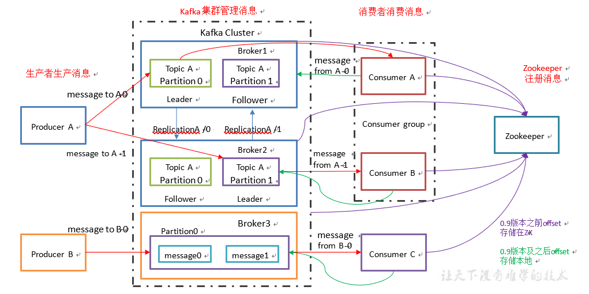
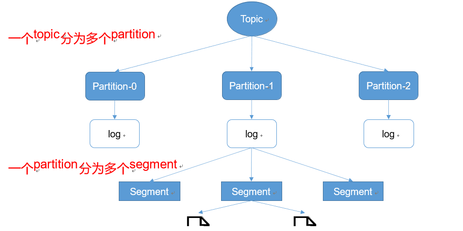
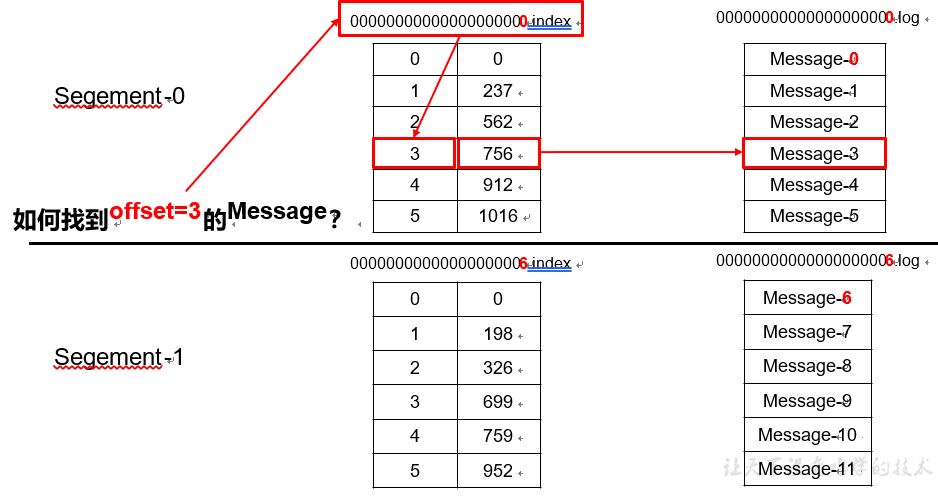
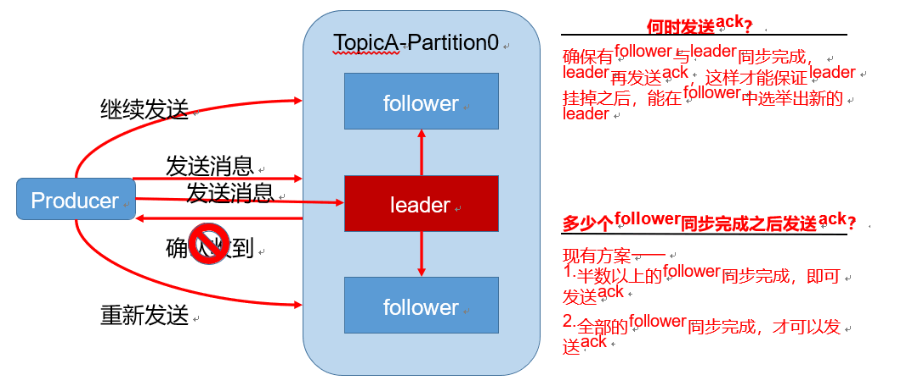
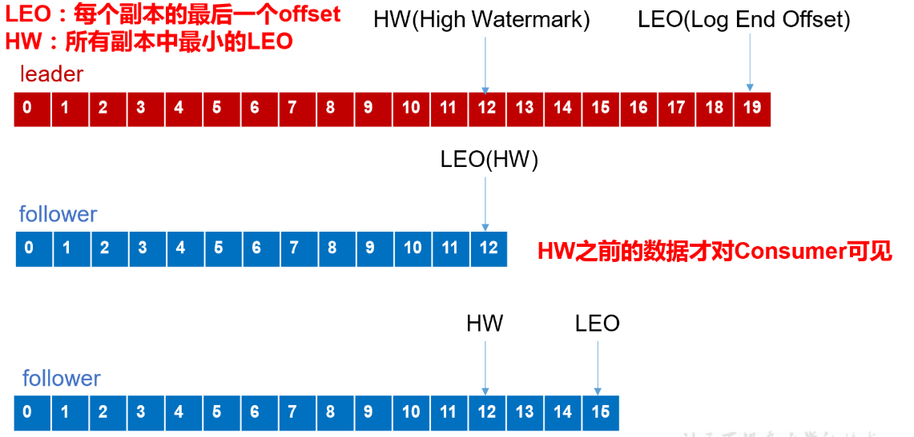
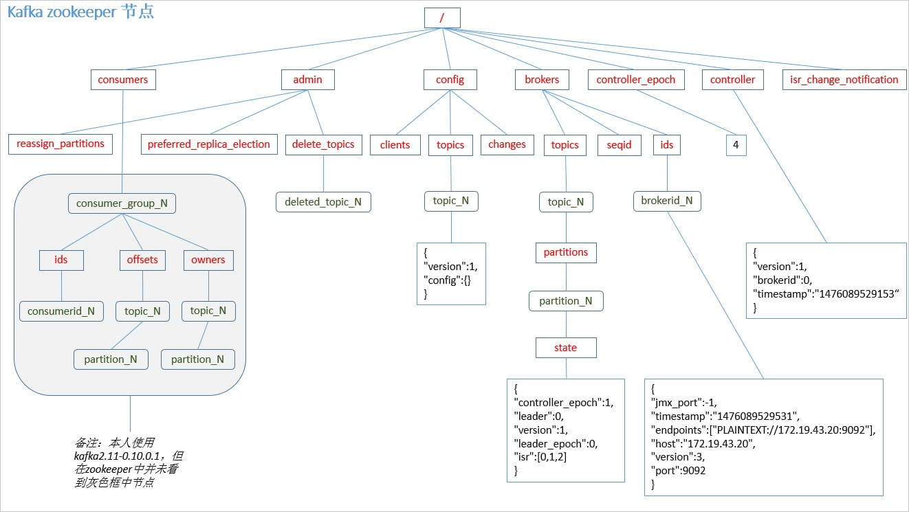
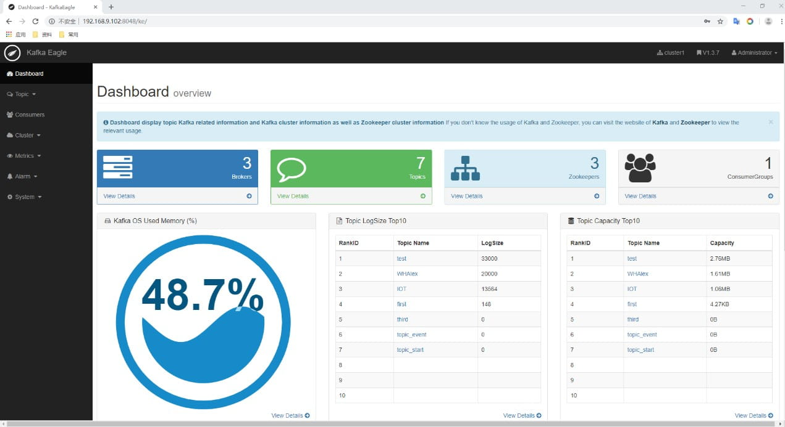

# 第 1 章 概述

观察者模式

Kafka 是一个分布式的基于发布/订阅模式的消息队列（MessageQueue），主要应用于大数据实时处理领域。

##  基础架构



**Producer** ：消息生产者，就是向 kafka broker 发消息的客户端；

**Consumer** ：消息消费者，向 kafka broker 取消息的客户端；

**Consumer Group** （**CG**）：

消费者组，由多个 consumer 组成。消费者组内每个消费者负责消费不同分区的数据，一个分区只能由一个组内消费者消费；消费者组之间互不影响。所有的消费者都属于某个消费者组；

**Broker** ：

一台 kafka 服务器就是一个 broker。一个集群由多个 broker 组成。一个 broker 可以容纳多个 topic。broker 是消息的代理，Producers 往 Brokers 里面的指定 Topic 中写消息，Consumers 从 Brokers 里面拉取指定 Topic 的消息，然后进行业务处理，broker 在中间起到一个代理保存消息的中转站。

**Topic** ：可以理解为一个队列，生产者和消费者面向的都是一个 topic；

**Partition分区**：

为了实现扩展性，一个非常大的 topic 可以分布到多个 broker（即服务器）上，一个 topic 可以分为多个 partition，每个 partition 是一个有序的队列；

**Replica**：

副本，为保证集群中的某个节点发生故障时，该节点上的 partition 数据不丢失，且 kafka 仍然能够继续工作，kafka 提供了副本机制，一个 topic 的每个分区都有若干个副本，一个 leader和若干个 follower。

**leader**：每个分区多个副本的“主”，生产者发送数据的对象，以及消费者消费数据的对象都是 leader。

**follower**：每个分区多个副本中的“从”，实时从 leader 中同步数据，保持和 leader 数据的同步。leader 发生故障时，某个 follower 会成为新的 follower。

**Offset：**

消息位移，表示分区中每条消息的位置信息，是一个单调递增且不变的值。

消费者位移：Consumer Offset。表示消费者消费进度，每个消费者都有自己的消费者位移。offset保存在broker端的内部topic中，不是在clients中保存


重平衡：Rebalance。消费者组内某个消费者实例挂掉后，其他消费者实例自动重新分配订阅主题分区

Connector：kafka的连接器可以将数据库中的数据导入到Kafka，也可以将Kafka的数据导出到数据库中；

Stream Process ：流处理器可以从Kafka中拉取数据，也可以将数据写入到Kafka中


**Zookeeper：**

主要用于通知生产者和消费者Kafka集群中有新的broker加入，或者Kafka集群中出现故障的Broker


# 第 2 章 安装

## 安装部署

 jar 包下载

http://kafka.apache.org/downloads.html

1.  解压安装包

```shell
tar -zxvf kafka_2.11-0.11.0.0.tgz -C /opt/module/
```

修改解压后的文件名称

```shell
mv kafka_2.11-0.11.0.0/ kafka
```

在/opt/module/kafka 目录下创建 logs 文件夹

```shell
 mkdir logs
```

修改配置文件

```shell
cd config/
vi server.properties
```

输入以下内容：

```properties
#broker的全局唯一编号，不能重复
broker.id=0
#删除topic功能使能
delete.topic.enable=true
#处理网络请求的线程数量
num.network.threads=3
#用来处理磁盘IO的现成数量
num.io.threads=8
#发送套接字的缓冲区大小
socket.send.buffer.bytes=102400
#接收套接字的缓冲区大小
socket.receive.buffer.bytes=102400
#请求套接字的缓冲区大小
socket.request.max.bytes=104857600
#kafka运行日志存放的路径
log.dirs=/opt/module/kafka/logs
#topic在当前broker上的分区个数
num.partitions=1
#用来恢复和清理data下数据的线程数量
num.recovery.threads.per.data.dir=1
#segment文件保留的最长时间，超时将被删除 log.retention.hours=168
#配置连接Zookeeper集群地址
zookeeper.connect=hadoop102:2181,hadoop103:2181,hadoop104:2181

```

配置环境变量

```shell
sudo vi /etc/profile

#KAFKA_HOME export KAFKA_HOME=/opt/module/kafka export PATH=$PATH:$KAFKA_HOME/bin 

source /etc/profil
```

分发安装包

```shell
xsync kafka/
```

注意：分发之后记得配置其他机器的环境变量

注：broker.id 不得重复


目录结构

```txt
bin:
config:
data:

```

##  命令行操作

1.  查看当前服务器中的所有 topic

```shell
bin/kafka-topics.sh hadoop102:2181 --list --zookeeper
```

2.  创建 topic

```shell
bin/kafka-topics.sh --zookeeper hadoop102:2181 --create --replication-factor 3 --partitions 1 -topic first
```

选项说明：

--topic 定义 topic 名

--replication-factor 定义副本数

--partitions 定义分区数

3.删除 topic

```shell
bin/kafka-topics.sh hadoop102:2181 --delete --topic first
```

需要 server.properties 中设置 delete.topic.enable=true 否则只是标记删除。

4.发送消息

```shell
bin/kafka-console-producer.sh --brokerlist hadoop102:9092 --topic first
>hello world
```

5。消费消息

```shell
bin/kafka-console-consumer.sh --zookeeper hadoop102:2181 --topic first
bin/kafka-console-consumer.sh --bootstrap-server hadoop102:9092 --topic first
bin/kafka-console-consumer.sh --bootstrap-server hadoop102:9092 --from-beginning --topic first
```

\--from-beginning：会把主题中以往所有的数据都读取出来。

6.查看某个 Topic 的详情

```shell
bin/kafka-topics.sh hadoop102:2181 --describe --topic first
```

7.修改分区数

```shell
bin/kafka-topics.sh hadoop102:2181 --alter --topic first --partitions 6
```

### Kafka Tool

可视化工具


## 配置

server.properties

监听器listeners和advertised.listeners


# 第 3 章  基本原理

## Zookeeper

Kafka 集群中有一个 broker 会被选举为 Controller，负责管理集群 broker 的上下线，所有 topic 的分区副本分配和 leader 选举等工作。

zookeeper 是一个分布式的协调组件，早期版本的 kafka 用 zk 做 meta 信息存储，consumer 的消费状态，group 的管理以及 offset 的值。考虑到 zk 本身的一些因素以及整个架构较大概率存在单点问题，新版本中逐渐弱化了 zookeeper 的作用。新的 consumer 使用了 kafka 内部的 group coordination 协议，也减少了对 zookeeper 的依赖

但是 broker 依然依赖于 ZK，zookeeper 在 kafka 中还用来选举 controller 和 检测 broker 是否存活等等。负责协调管理并保存 Kafka 集群的所有元数据信息，比如集群都有哪些 Broker 在运行、创建了哪些 Topic，每个 Topic 都有多少分区以及这些分区的 Leader 副本都在哪些机器上等信息。

2.8版本以后，Kafka可以不依赖于Zookeeper，使用KRaft生成集群ID，


## Kafka集群

### Controller

kafka启动时，会在所有的broker中选择一个Controller，创建topic，或者添加分区，副本之类的管理任务都是由Controller完成的，分区Leader的选举，也由Controller决定；

1：Controller的选举

在Kafka集群启动的时候，每个broker都会尝试取ZK上注册成为Controller，但是只有一个竞争成功，其他的Broker就会注册改节点的监视器，一旦该节点发生变化，就会重新竞争注册为Controller；

### 分区与副本

一个 topic 对应多个 partation，为保证 partation 的可用性，每个 partation 都有一个或者多个 follower，消费者只能从 leader 中读数据，单个的 partation 是可以保证有序的。

ZK 的作用是记录消费者消费 partation 中的偏移量。至于消费者什么时候提交消费的偏移量，会引起不同的问题，

如果读完就提交偏移量，丢失数据，

如果处理完再提交偏移量，多读数据，重复读数据

还有生产者是传输给 topic 就算传输完成（可能丢失数据），还是 topic 写到 partation 就算传输完成（可能导致重复）？

partation 数据路由规则

1：指定了 patition 则直接使用

2：未指定 patition，但指定 key，则通过对 key 的 value 通过 hash 选出一个 patition

3：patition 和 key 都未指定，使用轮询选出一个 patition

每条消息有一个自增编号：标识顺讯，用于标识消息的偏移量

副本：


Kafka中的leader和follower是相 对分区有意义，不是相对broker，Kafka在创建topic的时候，会尽量分配分区的leader在不同的broker中，其实就是负载均衡。

leader职责：读写数据

follower职责：同步数据、参与选举（leader crash之后，会选举一个follower重新成为分区的leader；


Follow可以按照不同状态分为三类：

AR：已分配的副本，分区的所有副本；

ISR：在同步中的副本，所有与leader副本保持一定程度同步的副本

OSR：同步滞后过多的副本

正常情况下，所有follower副本都应该与leader副本保持同步，即AR = ISR，OSR为空；如果 follower 长时间未向 leader 同步数据，则该 follower 将被踢出 ISR，该时间阈值由 **replica.lag.time.max.ms** 参数设定。


1：Leader选举

所有分区的leader选举都由Controller决定，Controller会将leader的改变直接通过RPC的方式通知需为此作出相应的Broker，Controller读取当前分区的ISR，只要有一个副本还幸存，就选择其中一个作为leader，否则就任意选一个副本成为leader，

2：leader负载均衡

如果某个broker crash之后，就可能会导致partition的leader分布不均匀，就是一个broker上存在一个topic下不同partition的leader

通过以下指令，可以将leader分配到优先的leader对应的broker，确保leader是均匀分配的

```shell
bin/kafka-leader-election.sh --bootstrap-server node1.itcast.cn:9092 --topic test --partition=2 --election-type preferred
```

### 文件存储机制

Kafka 中消息是以 **topic** 进行分类的，生产者生产消息，消费者消费消息，都是面向 topic 的。 topic 是逻辑上的概念，而 partition 是物理上的概念，每个 partition 对应于一个 log 文件，该 log 文件中存储的就是 producer 生产的数据。Producer 生产的数据会被不断追加到该 log 文件末端，且每条数据都有自己的 offset。消费者组中的每个消费者，都会实时记录自己消费到了哪个 offset，以便出错恢复时，从上次的位置继续消费。



由于生产者生产的消息会不断追加到 log 文件末尾，为防止 log 文件过大导致数据定位,效率低下，Kafka 采取了分片和索引机制，将每个 partition 分为多个 segment。每个 segment 对应两个文件——“.index”文件和“.log”文件。这些文件位于一个文件夹下，该文件夹的命名规则为：topic 名称+分区序号。例如，first 这个 topic 有三个分区，则其对应的文件夹为

first-0,first-1,first-2。

00000000000000000000.index 00000000000000000000.log

00000000000000170410.index 00000000000000170410.log

00000000000000239430.index 00000000000000239430.log

index 和 log 文件以当前 segment 的第一条消息的 offset 命名。下图为 index 文件和 log 文件的结构示意图。



“.index”文件存储大量的索引信息，“.log”文件存储大量的数据，索引文件中的元数据指向对应数据文件中 message 的物理偏移地址。

保留数据时 Kafka 的一个基本特性，Kafka 不会一直保留数据，也不会等到所有消费者都读取了消息之后才删除消息。相反，Kafka 管理员为每个主题配置了数据保留期限，规定数据被删除之前可以保留多长时间，或者清理数据之前可以保留的数据量大小。 因为在一个大文件里查找和删除消息是很费时的，也很容易出错，所以我们把分区分成若干个片段。默认情况下，index 大小为 10M，每个片段(log)包含 1GB 或一周数据，以较小的那个为准。当前正在写入数据的片段叫做**活跃片段**，活跃片段永远不会被删除。

#### Message 格式

#### broker存储

Kafka 使用消息日志（Log）来保存数据，一个日志就是磁盘上一个只能追加写（Append-only）消息的物理文件。因为只能追加写入，故避免了缓慢的随机 I/O 操作，改为性能较好的顺序 I/O 写操作，这也是实现 Kafka 高吞吐量特性的一个重要手段。

不过如果你不停地向一个日志写入消息，最终也会耗尽所有的磁盘空间，因此 Kafka 必然要定期地删除消息以回收磁盘。怎么删除呢？

简单来说就是通过日志段（Log Segment）机制。在 Kafka 底层，一个日志又近一步细分成多个日志段，消息被追加写到当前最新的日志段中，当写满了一个日志段后，Kafka 会自动切分出一个新的日志段，并将老的日志段封存起来。Kafka 在后台还有定时任务会定期地检查老的日志段是否能够被删除，从而实现回收磁盘空间的目的。

#### 数据清理

在Kafka中，提供两种日志清理方式：

日志删除：按照指定策略直接删除不符合条件的日志；

日志压缩：按照消息的key进行整合，有相同key的但有不同value值，只保留最后一个版本；

1：日志删除

消息定期清理，一次删除一个segment段的日志文件；kafka的日志管理器，会根据Kafka的配置，来决定哪些文件可以被删除；

当前日志分段的保留策略有三种：

基于时间的保留策略：默认保留7天；

基于日志大小的保留策略：

基于之日起始偏移量的保留策略：

### 高效读写数据

1：顺序写磁盘

Kafka 的 producer 生产数据，要写入到 log 文件中，写的过程是一直追加到文件末端，为顺序写。官网有数据表明，同样的磁盘，顺序写能到 600M/s，而随机写只有 100K/s。这与磁盘的机械机构有关，顺序写之所以快，是因为其省去了大量磁头寻址的时间。

2：零复制技术

写磁盘减少满的CPU复制，直接传文件描述符，磁盘直接赋值；

### 配置

config目录下，主要是server.properties

```properties
# 唯一表示
broker.id
# 监听列表
listeners
# zookeeper路径
Zookeeper.connect
# 消息保存路径
logs.dir
# 是否允许自动创建主题,生产者写消息，消费者读消息，主题不存在是否自动创建
auto.create.topics.enable=true

## 主题相关
# 主题分区数
num.partitions=
# 日志保存日期
log.retention.hours=168
# topic每个分区的最大文件，-1表示不限制
log.retention.bytes

##最大消息设置
message.max.bytes

```


## 生产者

### 1 分区策略

1. 分区的原因

   - 方便在集群中扩展，每个 Partition 可以通过调整以适应它所在的机器，而一个 topic 又可以有多个 Partition 组成，因此整个集群就可以适应任意大小的数据了；

   - 可以提高并发，因为可以以 Partition 为单位读写了。

2. 分区的原则

   我们需要将 producer 发送的数据封装成一个 **ProducerRecord** 对象。

- 指明 partition 的情况下，直接将指明的值直接作为 partiton 值；

- 没有指明 partition 值但有 key 的情况下，将 key 的 hash 值与 topic 的 partition 数进行取余得到 partition 值；

- 既没有 partition 值又没有 key 值的情况下，第一次调用时随机生成一个整数（后面每次调用在这个整数上自增），将这个值与 topic 可用的 partition 总数取余得到 partition 值，也就是常说的 round-robin 算法。


分区写入策略：

1：轮询策略：默认策略，如果生产消息时，key为 NULL ，则使用轮询算法均衡的分配分区；

2：随机：

3：按key分配：根据key 取hash 再根据分区数取余，容易数据倾斜；

4：自定义分区 

```java
//创建自定义分区器
public class KeyWithRandomPartitioner implement Partitioner{
}

//配置自定义分区
props.put(ProducerConfig.PARTITIONER_CLASS_CONFIG,KeyWithRandomPartitioner.class.getName());
```

乱序问题：

使用分区策略以后，消息分到了不同的分区，没有办法保证消息的有序性


### 2 数据可靠性保证

为保证 producer 发送的数据，能可靠的发送到指定的 topic，topic 的每个 partition 收到 producer 发送的数据后，都需要向 producer 发送 ack（acknowledgement 确认收到），如果 producer 收到 ack，就会进行下一轮的发送，否则重新发送数据。



**副本数据同步策略**

| 方案                             | 优点                                                     | 缺点                                                      |
| -------------------------------- | -------------------------------------------------------- | --------------------------------------------------------- |
| 半数以上完成同步，就发送 **ack** | 延迟低                                                   | 选举新的 leader 时，容忍 n 台节点的故障，需要 2n+1 个副本 |
| 全部完成同步，才发送 **ack**     | 选举新的 leader 时，容忍 n 台节点的故障，需要 n+1 个副本 | 延迟高                                                    |

Kafka 选择了第二种方案，原因如下：

1.同样为了容忍 n 台节点的故障，第一种方案需要 2n+1 个副本，而第二种方案只需要 n+1 个副本，而 Kafka 的每个分区都有大量的数据，第一种方案会造成大量数据的冗余。

2.虽然第二种方案的网络延迟会比较高，但网络延迟对 Kafka 的影响较小。

#### **ack 应答机制**

对于某些不太重要的数据，对数据的可靠性要求不是很高，能够容忍数据的少量丢失，所以没必要等 ISR 中的 follower 全部接收成功。

所以 Kafka 为用户提供了三种可靠性级别，用户根据对可靠性和延迟的要求进行权衡，

选择以下的配置。

acks 参数配置： **acks**：

0：producer 不等待 broker 的 ack，这一操作提供了一个最低的延迟，broker 一接收到还没有写入磁盘就已经返回，当 broker 故障时有可能丢失数据；

1：producer 等待 broker 的 ack，partition 的 leader 落盘成功后返回 ack，如果在 follower 同步成功之前 leader 故障，那么将会丢失数据；

\-1（all）：producer 等待 broker 的 ack，partition 的 leader 和 follower 全部落盘成功后才返回 ack。但是如果在 follower 同步完成后，broker 发送 ack 之前，leader 发生故障，那么会造成数据重复。

#### 副本同步机制

Kafka 中 topic 的每个 Partition 有一个预写式日志文件，每个 Partition 都由一系列有序的、不可变的消息组成，这些消息被连续的追加到 Partition 中，Partition 中的每个消息都有一个连续的序列号叫做 offset,确定它在分区日志中唯一的位置

故障处理细节



**LEO**：指的是每个副本最大的 **offset**；

**HW**：指的是消费者能见到的最大的 **offset**，**ISR** 队列中最小的 **LEO**。

follower 故障：

follower 发生故障后会被临时踢出 ISR，待该 follower 恢复后，follower 会读取本地磁盘记录的上次的 HW，并将 log 文件高于 HW 的部分截取掉，从 HW 开始向 leader 进行同步。等该 **follower** 的 **LEO** 大于等于该 **Partition** 的 **HW**，即 follower 追上 leader 之后，就可以重新加入 ISR 了。

leader 故障

leader 发生故障之后，会从 ISR 中选出一个新的 leader，之后，为保证多个副本之间的数据一致性，其余的 follower 会先将各自的 log 文件高于 HW 的部分截掉，然后从新的 leader 同步数据。

注意：这只能保证副本之间的数据一致性，并不能保证数据不丢失或者不重复。

### 3.2.3 Exactly Once 语义

将服务器的 ACK 级别设置为-1，可以保证 Producer 到 Server 之间不会丢失数据，即 At Least Once 语义。

相对的，将服务器 ACK 级别设置为 0，可以保证生产者每条消息只会被发送一次，即 At Most Once 语义。

At Least Once 可以保证数据不丢失，但是不能保证数据不重复；相对的，

At Least Once 可以保证数据不重复，但是不能保证数据不丢失。

但是，对于一些非常重要的信息，比如说交易数据，下游数据消费者要求数据既不重复也不丢失，即 Exactly Once 语义。在 0.11 版本以前的 Kafka，对此是无能为力的，只能保证数据不丢失，再在下游消费者对数据做全局去重。对于多个下游应用的情况，每个都需要单独做全局去重，这就对性能造成了很大影响。

0.11 版本的 Kafka，引入了一项重大特性：幂等性。

### 幂等性

简单地说就是对接口的多次调用所产生的结果和调用一次是一致的。生产者在进行重试的时候有可能会重复写入消息，而使用 Kafka 的幂等性功能之后就可以避免这种情况。Producer 不论向 Server 发送多少次重复数据，Server 端都只会持久化一条。

幂等性结合 At LeastOnce 语义，就构成了 Kafka 的 Exactly Once 语义。即：

At Least Once + 幂等性 = Exactly Once

要启用幂等性，只需要将 Producer 的参数中 enable.idompotence 设置为 true 即可。

Kafka 的幂等性实现其实就是将原来下游需要做的去重放在了数据上游。开启幂等性的 Producer 在初始化的时候会被分配一个 PID，发往同一 Partition 的消息会附带 SequenceNumber。而 Broker 端会对\<PID, Partition,SeqNumber\>做缓存，当具有相同主键的消息提交时，Broker 只会持久化一条。但是 PID 重启就会变化，同时不同的 Partition 也具有不同主键，所以幂等性无法保证跨分区跨会话的 Exactly Once。

### 消息压缩

生产者程序中配置`compression.type` 参数即表示启用指定类型的压缩算法。

`props.put(“compression.type”, “gzip”)`，它表明该 Producer 的压缩算法使用的是`GZIP`。这样 Producer 启动后生产的每个消息集合都是经 GZIP 压缩过的，故而能很好地节省网络传输带宽以及 Kafka Broker 端的磁盘占用。

但如果Broker又指定了不同的压缩算法，如：`Snappy`，会将生产端的消息解压然后按自己的算法重新压缩。

> 各压缩算法比较：吞吐量方面：LZ4 > Snappy > zstd 和 GZIP；而在压缩比方面，zstd > LZ4 > GZIP > Snappy。

kafka默认不指定压缩算法。

2：解压缩

当 Consumer pull消息时，Broker 会原样发送出去，当消息到达 Consumer 端后，由 Consumer 自行解压缩还原成之前的消息。


## 消费者

### 1 消费方式

consumer 采用 pull（拉）模式从 broker 中读取数据。

push（推）模式很难适应消费速率不同的消费者，因为消息发送速率是由 broker 决定的。它的目标是尽可能以最快速度传递消息，但是这样很容易造成 consumer 来不及处理消息，典型的表现就是拒绝服务以及网络拥塞。而 pull 模式则可以根据 consumer 的消费能力以适当的速率消费消息。

pull （拉）模式不足之处是，如果 kafka 没有数据，消费者可能会陷入循环中，一直返回空数据。针对这一点，Kafka 的消费者在消费数据时会传入一个时长参数 timeout，如果当前没有数据可供消费，consumer 会等待一段时间之后再返回，这段时长即为 timeout。

### 2 分区分配策略

一个 consumer group 中有多个 consumer，一个 topic 有多个 partition，所以必然会涉及到 partition 的分配问题，即确定那个 partition 由哪个 consumer 来消费。

编写一个类实现`org.apache.kafka.clients.Partitioner`接口。实现内部两个方法：`partition()`和`close()`。然后显式地配置生产者端的参数`partitioner.class`

常见的策略：

- Range分配（范围分配策略）：默认 

```txt
n：分区的数量 / 消费者数量 向下取整
m：分区的数量 % 消费者数量
前m个消费者消费n+1个分区
剩余的消费者消费n个分区
```

- 轮询策略：

- 粘性分配策略：在没有发生rebalance跟轮询分配策略是一致的。发生了rebalance，轮询分配策略，重新走一遍轮询分配的过程。而粘性会保证跟上一次的尽量一致，只是将新的需要分配的分区，均匀的分配到现有可用的消费者中即可。这样可以减少上下文的切换；

  

#### 再均衡机制

在某些情况下，消费者组中的消费者消费的分区会产生变化，会导致消费者分配不均匀。

触发时机

1）消费者数量发生变化：某个消费者crash，新增消费者

2）topic的数量发生变化：某个topic被删除

3）partition的数量发生变化：删除partition，新增partition

影响：发生rebalance时，所有的consumer 将不再工作，直到每个消费者都被成功分配所需要消费的分区为止；


### 3.3.3 offset 的维护

由于 consumer 在消费过程中可能会出现断电宕机等故障，consumer 恢复后，需要从故障前的位置的继续消费，所以 consumer 需要实时记录自己消费到了哪个 offset，以便故障恢复后继续消费。



Kafka 0.9 版本之前，consumer 默认将 offset 保存在 Zookeeper 中，从 0.9 版本开始， consumer 默认将 offset 保存在 Kafka 一个内置的 topic 中，该 topic 为**\_\_consumer_offsets**。

- 修改配置文件 consumer.properties

```properties
exclude.internal.topics=false
```

- 读取 offset

  0.11.0.0 之前版本:

```shell
bin/kafka-console-consumer.sh --topic __consumer_offsets --
zookeeper 	hadoop102:2181 	--formatter
"kafka.coordinator.GroupMetadataManager $OffsetsMessageFormatter" --consumer.config config/consumer.properties --from-beginning
```

0.11.0.0 之后版本(含):

```shell
bin/kafka-console-consumer.sh --topic __consumer_offsets --
zookeeper 	hadoop102:2181 	--formatter
"kafka.coordinator.group.GroupMetadataManager\$OffsetsMessageForm atter" --consumer.config config/consumer.properties --frombeginning
```

### 3.3.4 消费者组案例

1.  需求：测试同一个消费者组中的消费者，同一时刻只能有一个消费者消费。
2.  案例实操
    (1):在 hadoop102、hadoop103 上修改/opt/module/kafka/config/consumer.properties 配置
    文件中的 group.id 属性为任意组名。

```shell
vi consumer.properties group.id=xqc
```

(2)在 hadoop102、hadoop103 上分别启动消费者

```shell
 bin/kafka-console-consumer.sh \\ --zookeeper
hadoop102:2181 --topic first --consumer.config config/consumer.properties

bin/kafka-console-consumer.sh -bootstrap-server
hadoop102:9092 --topic first --consumer.config config/consumer.properties

```

(3)在 hadoop104 上启动生产者

```shell
bin/kafka-console-producer.sh \\  --broker-list hadoop102:9092 --topic first
>hello world
```

(4):查看 hadoop102 和 hadoop103 的接收者。

同一时刻只有一个消费者接收到消息。

## 6 Kafka 事务

生产和消费可以跨分区和会话，要么全部成功，要么全部失败。

幂等性不能跨多个分区运行，事务可以保证多个分区操作的原子性。

### Producer 事务

为了实现跨分区跨会话的事务，需要引入一个全局唯一的 Transaction ID，并将 Producer 获得的 PID 和 Transaction ID 绑定。这样当 Producer 重启后就可以通过正在进行的 Transaction ID 获得原来的 PID。

为了管理 Transaction，Kafka 引入了一个新的组件 Transaction Coordinator。Producer 就是通过和 Transaction Coordinator 交互获得 Transaction ID 对应的任务状态。Transaction Coordinator 还负责将事务所有写入 Kafka 的一个内部 Topic，这样即使整个服务重启，由于事务状态得到保存，进行中的事务状态可以得到恢复，从而继续进行。

能够保证将消息原子性地写入到多个分区中。这批消息要么全部写入成功，要么全部失败。能够保证跨分区、跨会话间的幂等性。

```
producer.initTransa ctions();
try {
            producer.beginTransaction();
            producer.send(record1);
            producer.send(record2);
            //提交事务
            producer.commitTransaction();
} catch (KafkaException e) {
            //事务终止
            producer.abortTransaction();
}
```

实际上即使写入失败，Kafka 也会把它们写入到底层的日志中，也就是说 Consumer 还是会看到这些消息。要不要处理在 Consumer 端设置 `isolation.level` ，这个参数有两个值:

- read_uncommitted：这是默认值，表明 Consumer 能够读取到 Kafka 写入的任何消息
- read_committed：表明 Consumer 只会读取事务型 Producer 成功提交事务写入的消息

### Consumer 事务

上述事务机制主要是从 Producer 方面考虑，对于 Consumer 而言，事务的保证就会相对较弱，尤其时无法保证 Commit 的信息被精确消费。这是由于 Consumer 可以通过 offset 访问任意信息，而且不同的 Segment File 生命周期不同，同一事务的消息可能会出现重启后被删除的情况。


## 4：常见问题

### 确保消息不丢失

1：Broker数据不丢失

进行分区写入，所有ISR中的Follower都会从Leader中复制数据，保证数据仍然可用；

2：生产者数据不丢失

生产者连接Leader写入数据时，可以通过ACK机制确保数据成功写入：

同步模式下，确认机制设置为-1，即让消息写入 Leader 和 Follower 之后再确认消息发送成功；

异步模式下，为防止缓冲区满，可以在配置文件设置不限制阻塞超时时间，当缓冲区满时让生产者一直处于阻塞状态；

3：消费者消息不丢失

重点控制offset，事务型；

也可以自己控制offset，MYSQL中建张表存放offset，不再从ZK中读取Offset，更新Offset和处理消息放到同一个事务中；

### 重复消费问题

针对消息重复：将消息的唯一标识保存到外部介质中，每次消费时判断是否处理过即可。

kafka 实际上有个 offset 的概念，就是每个消息写进去，都有一个 offset，代表他的序号，然后 consumer 消费了数据之后，每隔一段时间，会把自己消费过的消息 offset 提交一下，代表我已经消费过了，下次我要是重启啥的，你就让我从上次消费到的 offset 来继续消费。

数据要写库，首先根据主键查一下，如果这个数据已经有了，那就别插入了，执行 update 即可

让生产者发送每条消息的时候，需要加一个全局唯一的 id，类似于订单 id 之后的东西，然后你这里消费到了之后，先根据这个 id 去 redis 中查找，之前消费过了么，如果没有消费过，那就进行处理，然后把这个 id 写入到 redis 中，如果消费过了，那就别处理了，保证别重复消费相同的消息即可。

### 消息顺序性

kafka 每个 partition 中的消息在写入时都是有序的，消费时，每个 partition 只能被每一个 group 中的一个消费者消费，保证了消费时也是有序的。

整个 topic 不保证有序。如果为了保证 topic 整个有序，那么将 partition 调整为 1.

方法二：通过有key分组，同一个key的消息放入同一个分区，保证局部有序

### 延时队列

Kafka 并没有使用 JDK 自带的 Timer 或者 DelayQueue 来实现延迟的功能，而是**基于时间轮自定义了一个用于实现延迟功能的定时器（SystemTimer）**。JDK 的 Timer 和 DelayQueue 插入和删除操作的平均时间复杂度为 O(nlog(n))，并不能满足 Kafka 的高性能要求，而基于时间轮可以将插入和删除操作的时间复杂度都降为 O(1)。时间轮的应用并非 Kafka 独有，其应用场景还有很多，在 Netty、Akka、Quartz、Zookeeper 等组件中都存在时间轮的踪影。

### 消息积压


# 第 4 章 Kafka API

## 生产者

### 消息发送

Kafka 的 Producer发送消息采用的是异步发送的方式。在消息发送的过程中，涉及到了两个线程——main线程和 Sender线程，以及一个线程共享变量——**RecordAccumulator**。 main线程将消息发送给 RecordAccumulator，Sender 线程不断从 RecordAccumulator中拉取消息发送到 Kafka broker。

相关参数：

**batch.size**：只有数据积累到 batch.size 之后，sender 才会发送数据。

**linger.ms**：如果数据迟迟未达到 batch.size，sender 等待 linger.time之后就会发送数据。


一条消息发送之后，会阻塞当前线程，直至返回 ack。由于 send方法返回的是一个 Future 对象，根据 Futrue对象的特点，我们也可以实现同步发送的效果，只需在调用 Future 对象的 get方发即可。

```java
/**
* 创建连接
* 创建一个生产者对象KafkaProducer
* 调用send方法发送消息（ProducerRecor，封装是key-value键值对）
* 调用Future.get表示等带服务端的响应
* 关闭生产者
*/
public class KafkaProducerTest {
    public static void main(String[] args) throws ExecutionException, InterruptedException {
        // 1. 创建用于连接Kafka的Properties配置
        Properties props = new Properties();
        props.put("bootstrap.servers", "node1.itcast.cn:9092");
        props.put("acks", "all");
        props.put("key.serializer", "org.apache.kafka.common.serialization.StringSerializer");
        props.put("value.serializer", "org.apache.kafka.common.serialization.StringSerializer");

        // 2. 创建一个生产者对象KafkaProducer
        KafkaProducer<String, String> kafkaProducer = new KafkaProducer<>(props);

        // 3. 发送1-100的消息到指定的topic中
        for(int i = 0; i < 100; ++i) {
            // 构建一条消息，直接new ProducerRecord
            ProducerRecord<String, String> producerRecord = new ProducerRecord<>("test", null, i + "");
            Future<RecordMetadata> future = kafkaProducer.send(producerRecord);
            // 调用Future的get方法等待响应
            future.get();
            System.out.println("第" + i + "条消息写入成功！");
        }

        // 4.关闭生产者
        kafkaProducer.close();
    }
}
```

### 异步发送 API

1.不带回调函数的 API

2.带回调函数的 **API** 回调函数会在 producer 收到 ack时调用，为异步调用，该方法有两个参数，分别是RecordMetadata 和 Exception，如果 Exception 为 null，说明消息发送成功，如果Exception 不为 null，说明消息发送失败。注意：消息发送失败会自动重试，不需要我们在回调函数中手动重试。

```java
// 二、使用异步回调的方式发送消息
ProducerRecord<String, String> producerRecord = new ProducerRecord<>("test", null, i + "");
kafkaProducer.send(producerRecord, new Callback() {
    @Override
    public void onCompletion(RecordMetadata metadata, Exception exception) {
        // 1. 判断发送消息是否成功
        if(exception == null) {
            // 发送成功
            // 主题
            String topic = metadata.topic();
            // 分区id
            int partition = metadata.partition();
            // 偏移量
            long offset = metadata.offset();
            System.out.println("topic:" + topic + " 分区id：" + partition + " 偏移量：" + offset);
        }
        else {
            // 发送出现错误
            System.out.println("生产消息出现异常！");
            // 打印异常消息
            System.out.println(exception.getMessage());
            // 打印调用栈
            System.out.println(exception.getStackTrace());
        }
    }
});
```

## 消费者API

Consumer 消费数据时的可靠性是很容易保证的，因为数据在 Kafka中是持久化的，故不用担心数据丢失问题。

由于 consumer 在消费过程中可能会出现断电宕机等故障，consumer恢复后，需要从故障前的位置的继续消费，所以 consumer 需要实时记录自己消费到了哪个offset，以便故障恢复后继续消费。

所以 offset 的维护是 Consumer 消费数据是必须考虑的问题。


### 消息消费

```java
/**
 * 消费者程序
 *
 * 1.创建Kafka消费者配置
 * 2.创建Kafka消费者
 * 3.订阅要消费的主题
 * 4.使用一个while循环，不断从Kafka的topic中拉取消息
 * 5.将将记录（record）的offset、key、value都打印出来
 */
public class KafkaConsumerTest {

    public static void main(String[] args) {
        // 1.创建Kafka消费者配置
        Properties props = new Properties();
        props.setProperty("bootstrap.servers", "node1.itcast.cn:9092");
        // 消费者组（可以使用消费者组将若干个消费者组织到一起），共同消费Kafka中topic的数据
        // 每一个消费者需要指定一个消费者组，如果消费者的组名是一样的，表示这几个消费者是一个组中的
        props.setProperty("group.id", "test");
        // 自动提交offset
        props.setProperty("enable.auto.commit", "true");
        // 自动提交offset的时间间隔
        props.setProperty("auto.commit.interval.ms", "1000");
        // 拉取的key、value数据的
        props.setProperty("key.deserializer", "org.apache.kafka.common.serialization.StringDeserializer");
        props.setProperty("value.deserializer", "org.apache.kafka.common.serialization.StringDeserializer");

        // 2.创建Kafka消费者
        KafkaConsumer<String, String> kafkaConsumer = new KafkaConsumer<>(props);

        // 3. 订阅要消费的主题
        // 指定消费者从哪个topic中拉取数据
        kafkaConsumer.subscribe(Arrays.asList("test"));

        // 4.使用一个while循环，不断从Kafka的topic中拉取消息
        while(true) {
            // Kafka的消费者一次拉取一批的数据
            ConsumerRecords<String, String> consumerRecords = kafkaConsumer.poll(Duration.ofSeconds(5));
            // 5.将将记录（record）的offset、key、value都打印出来
            for (ConsumerRecord<String, String> consumerRecord : consumerRecords) {
                // 主题
                String topic = consumerRecord.topic();
                // offset：这条消息处于Kafka分区中的哪个位置
                long offset = consumerRecord.offset();
                // key\value
                String key = consumerRecord.key();
                String value = consumerRecord.value();

                System.out.println("topic: " + topic + " offset:" + offset + " key:" + key + " value:" + value);
            }
        }
    }
}
```

自动提交offset和手动提交offset：

ConsumerRecord对象为了使我们能够专注于自己的业务逻辑，Kafka 提供了自动提交 offset 的功能。自动提交 offset 的相关参数：

**enable.auto.commit**：是否开启自动提交 offset 功能

**auto.commit.interval.ms**：自动提交 offset 的时间间隔

虽然自动提交 offset 十分简介便利，但由于其是基于时间提交的，开发人员难以把握offset 提交的时机。因此 Kafka 还提供了手动提交 offset 的 API。

手动提交 offset 的方法有两种：分别是 commitSync（同步提交）和commitAsync（异步提交）。两者的相同点是，都会将本次 poll的一批数据最高的偏移量提交；不同点是， commitSync阻塞当前线程，一直到提交成功，并且会自动失败重试（由不可控因素导致，也会出现提交失败）；而 commitAsync 则没有失败重试机制，故有可能提交失败。

1.  同步提交 offset

    由于同步提交 offset 有失败重试机制，故更加可靠，

2.  异步提交 **offset**

虽然同步提交 offset更可靠一些，但是由于其会阻塞当前线程，直到提交成功。因此吞吐量会收到很大的影响。因此更多的情况下，会选用异步提交offset 的方式。


### 自定义存储 offset

Kafka 0.9 版本之前，offset 存储在 zookeeper，0.9 版本及之后，默认将 offset存储在 Kafka 的一个内置的 topic 中。除此之外，Kafka 还可以选择自定义存储offset。

offset 的维护是相当繁琐的，因为需要考虑到消费者的 Rebalace。

当有新的消费者加入消费者组、已有的消费者推出消费者组或者所订阅的主题的分区发生变化，就会触发到分区的重新分配，重新分配的过程叫做Rebalance。

消费者发生 Rebalance之后，每个消费者消费的分区就会发生变化。因此消费者要首先获取到自己被重新分配到的分区，并且定位到每个分区最近提交的offset 位置继续消费。

要实现自定义存储 offset，需要借助ConsumerRebalanceListener

## 自定义 Interceptor

### 拦截器原理

Producer 拦截器(interceptor)是在 Kafka 0.10 版本被引入的，主要用于实现clients 端的定制化控制逻辑。

对于 producer 而言，interceptor 使得用户在消息发送前以及 producer回调逻辑前有机会对消息做一些定制化需求，比如修改消息等。同时，producer允许用户指定多个 interceptor 按序作用于同一条消息从而形成一个拦截链(interceptorchain)。Intercetpor 的实现接口是 org.apache.kafka.clients.producer.ProducerInterceptor，其定义的方法包括：

configure(configs)：获取配置信息和初始化数据时调用。

onSend(ProducerRecord)：：该方法封装进 KafkaProducer.send 方法中，即它运行在用户主线程中。Producer确保在消息被序列化以及计算分区前调用该方法。用户可以在该方法中对消息做任何操作，但最好保证不要修改消息所属的topic 和分区，否则会影响目标分区的计算。

onAcknowledgement(RecordMetadata, Exception)：该方法会在消息从 RecordAccumulator 成功发送到 Kafka Broker之后，或者在发送过程中失败时调用。并且通常都是在 producer
回调逻辑触发之前。onAcknowledgement 运行在 producer 的 IO线程中，因此不要在该方法中放入很重的逻辑，否则会拖慢 producer 的消息发送效率。

close：关闭 interceptor，主要用于执行一些资源清理工作

如前所述，interceptor可能被运行在多个线程中，因此在具体实现时用户需要自行确保线程安全。另外倘若指定了多个interceptor，则 producer 将按照指定顺序调用它们，并仅仅是捕获每个 interceptor可能抛出的异常记录到错误日志中而非在向上传递。这在使用过程中要特别留意。

# 第 5 章 Kafka 监控

## Kafka Eagle

登录页面查看监控数据

<http://192.168.9.102:8048/ke> [](http://192.168.9.102:8048/ke)




# 第八章：生产问题

问题1：生产上发现kafka服务器没有接收到需要消费的消息，有哪些步骤可以排查？

解决方案：

1：使用todb的插件，查看相关管理功能号，看kafka传输情况，事务号，kafka连接状态等

2.查看dlogex日志

3.抓包看从节点那边是否发送出去消息
