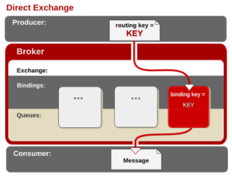

# 第1章  RabbitMQ概述

## 1.1   什么是消息队列

消息（Message）是指在应用间传送的数据。消息可以非常简单，比如只包含文本字符串，也可以更复杂，可能包含嵌入对象。

消息队列（Message Queue）是一种应用间的通信方式，消息发送后可以立即返回，由消息系统来确保消息的可靠传递。消息发布者只管把消息发布到 MQ 中而不用管谁来取，消息使用者只管从 MQ 中取消息而不管是谁发布的。这样发布者和使用者都不用知道对方的存在。

## 1.2   为什么要使用消息队列

从上面的描述中可以看出消息队列是一种应用间的异步协作机制，那什么时候需要使用 MQ 呢？

以常见的订单系统为例，用户点击【下单】按钮之后的业务逻辑可能包括：扣减库存、生成相应单据、发红包、发短信通知。在业务发展初期这些逻辑可能放在一起同步执行，随着业务的发展订单量增长，需要提升系统服务的性能，这时可以将一些不需要立即生效的操作拆分出来异步执行，比如发放红包、发短信通知等。这种场景下就可以用 MQ ，在下单的主流程（比如扣减库存、生成相应单据）完成之后发送一条消息到 MQ 让主流程快速完结，而由另外的单独线程拉取MQ的消息（或者由 MQ 推送消息），当发现 MQ 中有发红包或发短信之类的消息时，执行相应的业务逻辑。

以上是用于业务解耦的情况，其它常见场景包括最终一致性、广播、错峰流控等等。

## 1.3   RabbitMQ特点

RabbitMQ 是一个由 Erlang 语言开发的 AMQP 的开源实现。

AMQP ：Advanced Message Queue，高级消息队列协议。它是应用层协议的一个开放标准，为面向消息的中间件设计，基于此协议的客户端与消息中间件可传递消息，并不受产品、开发语言等条件的限制。

RabbitMQ 最初起源于金融系统，用于在分布式系统中存储转发消息，在易用性、扩展性、高可用性等方面表现不俗。具体特点包括：

 

  1、可靠性（Reliability）

  RabbitMQ 使用一些机制来保证可靠性，如持久化、传输确认、发布确认。

 

  2、灵活的路由（Flexible Routing）

在消息进入队列之前，通过 Exchange 来路由消息的。对于典型的路由功能，RabbitMQ 已经提供了一些内置的 Exchange 来实现。针对更复杂的路由功能，可以将多个 Exchange 绑定在一起，也通过插件机制实现自己的 Exchange 。

  3、 消息集群（Clustering）

​       多个 RabbitMQ 服务器可以组成一个集群，形成一个逻辑 Broker 。

  3、 高可用（Highly Available Queues）

队列可以在集群中的机器上进行镜像，使得在部分节点出问题的情况下队列仍然可用。

  4、多种协议（Multi-protocol）

​       RabbitMQ 支持多种消息队列协议，比如 STOMP、MQTT 等等。

  5、多语言客户端（Many Clients）

​       RabbitMQ 几乎支持所有常用语言，比如 Java、.NET、Ruby 等等。

  6、 管理界面（Management UI）

RabbitMQ 提供了一个易用的用户界面，使得用户可以监控和管理消息 Broker 的许多方面。

  7、 跟踪机制（Tracing）

​       如果消息异常，RabbitMQ 提供了消息跟踪机制，使用者可以找出发生了什么。

 

 

# 第2章   RabbitMQ安装

一般来说安装 RabbitMQ 之前要安装 Erlang ，可以去Erlang官网下载。接着去RabbitMQ官网下载安装包，之后解压缩即可。

Erlang官方下载地址：https://www.erlang.org/downloads

RabbitMQ官方下载地址：https://www.rabbitmq.com/download.html

## 2.1   安装前的准备

### 2.1.1 依赖包安装

安装RabbitMQ之前必须要先安装所需要的依赖包可以使用下面的一次性安装命令

yum install gcc glibc-devel make ncurses-devel openssl-devel xmlto -y

### 2.1.2 安装Erlang

1、 将Erlang源代码包otp_src_19.3.tar.gz上传到Linux的/home目录下

​     2、解压erlang 源码包

tar -zxvf otp_src_19.3.tar.gz

​     3、手动创建erlang 的安装目录

mkdir /usr/local/erlang

4、进入erlang的解压目录

cd otp_src_19.3

​     5、配置erlang的安装信息

​        ./configure --prefix=/usr/local/erlang --without-javac

​     6、编译并安装

make && make install

​     7、配置环境变量

vim /etc/profile

​     8、将这些配置填写到profile文件的最后

ERL_HOME=/usr/local/erlang

PATH=$ERL_HOME/bin:$PATH

export ERL_HOME PATH

​     9、启动环境变量配置文件

source /etc/profile

## 2.2   安装RabbitMQ

1、 将RabbitMQ安装包rabbitmq-server-3.7.2-1.el7.noarch.rpm上传到/home目录

2、安装RabbitMQ

rpm -ivh --nodeps rabbitmq-server-3.7.2-1.el7.noarch.rpm

 

## 2.3   RabbitMQ常用命令

### 2.3.1 启动和关闭

1、启动RabbitMQ

rabbitmq -server start 

注意：这里可能会出现错误，错误原因是/var/lib/rabbitmq/.erlang.cookie文件权限不够。

解决方案对这个文件授权

 chown rabbitmq:rabbitmq /var/lib/rabbitmq/.erlang.cookie

chmod 400 /var/lib/rabbitmq/.erlang.cookie

2、停止服务

rabbitmqctl stop

 

### 2.3.2 插件管理

1、添加插件

​     rabbitmq-plugins enable {插件名}

2、删除插件

​     rabbitmq-plugins disable {插件名}

​     注意：RabbitMQ启动以后可以使用浏览器进入管控台但是默认情况RabbitMQ不允许直接使用浏览器浏览器进行访问因此必须添加插件

  rabbitmq-plugins enable rabbitmq_management

3、使用浏览器访问管控台http://RabbitMQ服务器IP:15672

http://192.168.71.128:15672

### 2.3.3 用户管理

RabbitMQ安装成功后使用默认用户名guest登录

账号：guest

密码：guest

注意：这里guest只允许本机登录访问需要创建用户并授权远程访问命令如下

1、 添加用户：rabbitmqctl add_user {username} {password}

 rabbitmqctl add_user root root

2、 删除用户：rabbitmqctl delete_user {username}

 

3、 修改密码：rabbitmqctl change_password {username} {newpassword}

rabbitmqctl change_password root 123456

 

4、 设置用户角色：rabbitmqctl set_user_tags {username} {tag}

rabbitmqctl set_user_tags root administrator

 

tag参数表示用户角色取值为：management *，*monitoring *，**policymaker* administrator

​         各角色详解：

management

用户可以通过AMQP做的任何事外加：

列出自己可以通过AMQP登入的virtual hosts 

查看自己的virtual hosts中的queues, exchanges 和 bindings

查看和关闭自己的channels 和 connections

查看有关自己的virtual hosts的“全局”的统计信息，包含其他用户在这些virtual hosts中的活动。

 

policymaker 

management可以做的任何事外加：

查看、创建和删除自己的virtual hosts所属的policies和parameters

 

monitoring 

management可以做的任何事外加：

列出所有virtual hosts，包括他们不能登录的virtual hosts

查看其他用户的connections和channels

查看节点级别的数据如clustering和memory使用情况

查看真正的关于所有virtual hosts的全局的统计信息

 

administrator  

policymaker和monitoring可以做的任何事外加:

创建和删除virtual hosts

查看、创建和删除users

查看创建和删除permissions

关闭其他用户的connections

 

### 2.3.4 权限管理

1、 授权命令：rabbitmqctl set_permissions [-p vhostpath] {user} {conf} {write} {read}

-p vhostpath ：用于指定一个资源的命名空间，例如 –p / 表示根路径命名空间

user：用于指定要为哪个用户授权填写用户名

   conf:一个正则表达式match哪些配置资源能够被该用户配置。
    write:一个正则表达式match哪些配置资源能够被该用户读。
    read:一个正则表达式match哪些配置资源能够被该用户访问。

  例如：

   rabbitmqctl set_permissions -p / root '.*' '.*' '.*'

  用于设置root用户拥有对所有资源的 读写配置权限

2、查看用户权限 rabbitmqctl list_permissions [vhostpath]

例如

 查看根径经下的所有用户权限

 rabbitmqctl list_permissions 

 查看指定命名空间下的所有用户权限

 rabbitmqctl list_permissions /abc 

 

3、查看指定用户下的权限rabbitmqctl list_user_permissions {username}

例如

 查看root用户下的权限

 rabbitmqctl list_user_permissions root

 

 

 

4、清除用户权限rabbitmqctl clear_permissions {username}

例如：

​    清除root用户的权限

rabbitmqctl clear_permissions root

 

 

 

### 2.3.5 vhost管理

 vhost是RabbitMQ中的一个命名空间，可以限制消息的存放位置利用这个命名空间可以进行权限的控制有点类似Windows中的文件夹一样，在不同的文件夹中存放不同的文件。

1、添加vhost: rabbitmqctl add vhost {name}

例如

 rabbitmqctl add vhost bjpowernode

2、删除vhost：rabbitmqctl delete vhost {name}

  例如

  rabbitmqctl delete vhost bjpowernode

 

# 第3章  RabbitMQ消息发送和接收

## 3.1   RabbitMQ的消息发送和接收机制

所有 MQ 产品从模型抽象上来说都是一样的过程：
 消费者（consumer）订阅某个队列。生产者（producer）创建消息，然后发布到队列（queue）中，最后将消息发送到监听的消费者。


上面是MQ的基本抽象模型，但是不同的MQ产品有有者不同的机制，RabbitMQ实际基于AMQP协议的一个开源实现，因此RabbitMQ内部也是AMQP的基本概念。

RabbitMQ的内部接收如下：


1、Message
 消息，消息是不具体的，它由消息头和消息体组成。消息体是不透明的，而消息头则

由一系列的可选属性组成，这些属性包括routing-key（路由键）、priority（相对于其他消息

的优先权）、delivery-mode（指出该消息可能需要持久性存储）等。 

2、Publisher
 消息的生产者，也是一个向交换器发布消息的客户端应用程序。 

3、Exchange
 交换器，用来接收生产者发送的消息并将这些消息路由给服务器中的队列。

4、Binding
 绑定，用于消息队列和交换器之间的关联。一个绑定就是基于路由键将交换

器和消息队列连接起来的路由规则，所以可以将交换器理解成一个由绑定构成的

路由表。 

5、Queue
 消息队列，用来保存消息直到发送给消费者。它是消息的容器，也是消息的

终点。一个消息可投入一个或多个队列。消息一直在队列里面，等待消费者连接

到这个队列将其取走。 

6、Connection
 网络连接，比如一个TCP连接。

7、Channel
 信道，多路复用连接中的一条独立的双向数据流通道。信道是建立在真实的

TCP连接内地虚拟连接，AMQP 命令都是通过信道发出去的，不管是发布消息、

订阅队列还是接收消息，这些动作都是通过信道完成。因为对于操作系统来说建

立和销毁 TCP 都是非常昂贵的开销，所以引入了信道的概念，以复用一条 TCP 

连接。 

8、Consumer
 消息的消费者，表示一个从消息队列中取得消息的客户端应用程序。

9、Virtual Host
 虚拟主机，表示一批交换器、消息队列和相关对象。虚拟主机是共享相同的

身份认证和加密环境的独立服务器域。每个 vhost 本质上就是一个 mini 版的 

RabbitMQ 服务器，拥有自己的队列、交换器、绑定和权限机制。vhost 是 AMQP 

概念的基础，必须在连接时指定，RabbitMQ 默认的 vhost 是 / 。 

10、Broker
 表示消息队列服务器实体。

 

 

 

 

 

## 3.2  AMQP 中的消息路由

AMQP 中消息的路由过程和 Java 开发者熟悉的 JMS 存在一些差别，AMQP 中增加了 Exchange 和 Binding 的角色。生产者把消息发布到 Exchange 上，消息最终到达队列并被消费者接收，而 Binding 决定交换器的消息应该发送到那个队列


## 3.3   Exchange 类型

 

Exchange分发消息时根据类型的不同分发策略有区别，目前共四种类型：direct、fanout、topic、headers 。headers 匹配 AMQP 消息的 header 而不是路由键，此外 headers 交换器和 direct 交换器完全一致，但性能差很多，目前几乎用不到了，所以直接看另外三种类型

 

1、direct

消息中的路由键（routing key）如果和 Binding 中的 binding key 一致， 交换器就将消息发到对应的队列中。路由键与队列名完全匹配，如果一个队列绑定到交换机要求路由键为“dog”，则只转发 routing key 标记为“dog”的消息，不会转发“dog.puppy”，也不会转发“dog.guard”等等。它是完全匹配、单播的模式。



2、fanout

每个发到 fanout 类型交换器的消息都会分到所有绑定的队列上去。fanout 交换器不处理路由键，只是简单的将队列绑定到交换器上，每个发送到交换器的消息都会被转发到与该交换器绑定的所有队列上。很像子网广播，每台子网内的主机都获得了一份复制的消息。fanout 类型转发消息是最快的。

 

3、topic

topic 交换器通过模式匹配分配消息的路由键属性，将路由键和某个模式进行匹配，此时队列需要绑定到一个模式上。它将路由键和绑定键的字符串切分成单词，这些单词之间用点隔开。它同样也会识别两个通配符：符号“#”和符号“*”。#匹配0个或多个单词，“*”匹配不多不少一个单词。


 

## 3.4   Java发送和接收Queue的消息

 

### 3.4.1 创建Maven工程01-rabbitmq-send-java

添加Maven依赖

```xml
<dependencies>  
    <dependency>    		           
        <groupId>com.rabbitmq</groupId>      
        <artifactId>amqp-client</artifactId>    
        <version>5.1.1</version>  
    </dependency> 
</dependencies>  
```


### 3.4.2 编写消息发送类

在01-rabbitmq-send-java项目中创建，com.bjpowernode.rabbitmq.queue.Send类

```java
public class Send{
        public static void main(String[] args) throws IOException, TimeoutException {
             //创建链接工厂对象
            ConnectionFactory factory=new ConnectionFactory();
            factory.setHost("192.168.222.128");//设置RabbitMQ的主机IP
            factory.setPort(5672);//设置RabbitMQ的端口号
            factory.setUsername("root");//设置访问用户名
            factory.setPassword("root");//设置访问密码
            Connection connection=null;//定义链接对象
            Channel channel=null;//定义通道对象
            connection=factory.newConnection();//实例化链接对象
            channel=connection.createChannel();//实例化通道对象
            String message ="Hello World!3";
            //创建队列 ，名字为myQueue
            channel.queueDeclare("myQueue", true, false, false, null);
            //发送消息到指定队列
            channel.basicPublish("","myQueue",null,message.getBytes("UTF-8"));
            System.out.println("消息发送成功: "+message);
            channel.close();
            connection.close();
    }
}
```

以运行Send类观看管控台的变化

### 3.4.3 创建Maven工程01-rabbitmq-receive-java

添加Maven依赖

 ```xml
<dependencies>
    <dependency>
        <groupId>com.rabbitmq</groupId>
        <artifactId>amqp-client</artifactId>
        <version>5.1.1</version>
    </dependency>
</dependencies>

 ```

### 3.4.4 编写消息接收类

在01-rabbitmq-receive-java项目中创建，com.bjpowernode.rabbitmq.queue.Receive类

 ```java
public class Receive {
        public static void main(String[] args) throws IOException, TimeoutException {
            ConnectionFactory factory = new ConnectionFactory();
            factory.setUsername("root");
            factory.setPassword("root");
            factory.setHost("192.168.222.128");
            //建立到代理服务器到连接
            Connection conn = factory.newConnection();
            //获得信道
            final Channel channel = conn.createChannel();
            //声明队列
            channel.queueDeclare("myQueue", true, false, false, null);
            //消费消息
            boolean autoAck = true;
            String consumerTag = "";
            //接收消息
            //参数1 队列名称
            //参数2 是否自动确认消息 true表示自动确认 false表示手动确认
            //参数3 为消息标签 用来区分不同的消费者这里暂时为""
            // 参数4 消费者回调方法用于编写处理消息的具体代码（例如打印或将消息写入数据库）
            channel.basicConsume("myQueue", autoAck, consumerTag, new DefaultConsumer(channel) {
                @Override
                public void handleDelivery(String consumerTag,
                                           Envelope envelope,
                                           AMQP.BasicProperties properties,
                                           byte[] body) throws IOException {
                    //获取消息数据
                    String bodyStr = new String(body, "UTF-8");
                    System.out.println(bodyStr);
                }
            });
//            channel.close();
//            conn.close();
        }
}

 ```

注意：

1、Queue的消息只能被同一个消费者消费，如果没有消费监听队列那么消息会存放到队列中持久化保存，直到有消费者来消费这个消息，如果以有消费者监听队列则立即消费发送到队列中的消息

2、Queue的消息可以保证每个消息都一定能被消费

## 3.5   Java绑定Exchange发送和接收消息

  AMQP 协议中的核心思想就是生产者和消费者的解耦，生产者从不直接将消息发送给队列。生产者通常不知道是否一个消息会被发送到队列中，只是将消息发送到一个交换机。先由 Exchange 来接收，然后 Exchange 按照特定的策略转发到 Queue 进行存储。Exchange 就类似于一个交换机，将各个消息分发到相应的队列中。

在实际应用中我们只需要定义好 Exchange 的路由策略，而生产者则不需要关心消息会发送到哪个 Queue 或被哪些 Consumer 消费。在这种模式下生产者只面向 Exchange 发布消息，消费者只面向 Queue 消费消息，Exchange 定义了消息路由到 Queue 的规则，将各个层面的消息传递隔离开，使每一层只需要关心自己面向的下一层，降低了整体的耦合度。


### 3.5.1 Exchange的direct消息绑定

#### 3.5.1.1   编写direct消息发送类

在01-rabbitmq-send-java项目中创建，com.bjpowernode.rabbitmq.direct.Send类

```java
public class Send {
    public static void main(String[] args) throws IOException, TimeoutException {
        //创建链接工厂对象
        ConnectionFactory factory=new ConnectionFactory();
        factory.setHost("192.168.222.128");//设置RabbitMQ的主机IP
        factory.setPort(5672);//设置RabbitMQ的端口号
        factory.setUsername("root");//设置访问用户名
        factory.setPassword("root");//设置访问密码
        Connection connection=null;//定义链接对象
        Channel channel=null;//定义通道对象
        connection=factory.newConnection();//实例化链接对象
        channel=connection.createChannel();//实例化通道对象
       String message ="Hello World!3";
       String exchangeName="myExchange";
channel.queueDeclare("myQueueDirect", true, false, false, null);
       //指定Exchange的类型
       //参数1为 交换机名称
       //参数2为交换机类型取值为 direct、queue、topic、headers
       //参数3 为是否为持久化消息 true表示持久化消息 false表示非持久化
        channel.exchangeDeclare(exchangeName, "direct", true);
        //发送消息到RabbitMQ
        //参数1 我们自定义的交换机名称
        //参数2 自定义的RoutingKey值
        //参数3 设置消息的属性，可以通过消息属性设置消息是否是持久化的
        //参数4 具体要发送的消息信息
        channel.basicPublish(exchangeName,"myRoutingKey",null,message.getBytes("UTF-8"));
        System.out.println("消息发送成功: "+message);
//        channel.close();
//        connection.close();
    }
}
```

注意：使用direct消息模式时必须要指定RoutingKey（路由键），将指定的消息绑定到指定的路由键上

#### 3.5.1.2   编写direct消息接收类

在01-rabbitmq-Receive-java项目中创建，com.bjpowernode.rabbitmq.direct.Receive类

 ```java
public static void main(String[] args) throws IOException, TimeoutException {
        //创建链接工厂对象
        ConnectionFactory factory=new ConnectionFactory();
        factory.setHost("192.168.222.128");//设置RabbitMQ的主机IP
        factory.setPort(5672);//设置RabbitMQ的端口号
        factory.setUsername("root");//设置访问用户名
        factory.setPassword("root");//设置访问密码
        Connection connection=null;//定义链接对象
        Channel channel=null;//定义通道对象
        connection=factory.newConnection();//实例化链接对象
        channel=connection.createChannel();//实例化通道对象
        String message ="Hello World!3111";
channel.queueDeclare("myQueueDirect", true, false, false, null);
        String exchangeName="myExchange";
   //指定Exchange的类型
        //参数1为 交换机名称
        //参数2为交换机类型取值为 direct、queue、topic、headers
        //参数3 为是否为持久化消息 true表示持久化消息 false表示非持久化
        channel.exchangeDeclare(exchangeName, "direct", true);
        channel.queueDeclare("myQueueDirect", true, false, false, null);
     
         channel.basicConsume("myQueueDirect ", autoAck, consumerTag, new DefaultConsumer(channel) {
                @Override
                public void handleDelivery(String consumerTag,
                                           Envelope envelope,
                                           AMQP.BasicProperties properties,
                                           byte[] body) throws IOException {
                    //获取消息数据
                    String bodyStr = new String(body, "UTF-8");
                    System.out.println(bodyStr);
                }
            });
//            channel.close();
//            conn.close();
        }
    }
 ```

注意：

1、使用Exchange的direct模式时接收者的RoutingKey必须要与发送时的RoutingKey完全一致否则无法获取消息

  2、接收消息时队列名也必须要发送消息时的完全一致

### 3.5.2 Exchange的fanout消息绑定

#### 3.5.2.1 编写fanout消息发送类

在01-rabbitmq-send-java项目中创建，com.bjpowernode.rabbitmq.fanout.Send类

```java
public static void main(String[] args) throws IOException, TimeoutException {
        //创建链接工厂对象
        ConnectionFactory factory=new ConnectionFactory();
        factory.setHost("192.168.222.128");//设置RabbitMQ的主机IP
        factory.setPort(5672);//设置RabbitMQ的端口号
        factory.setUsername("root");//设置访问用户名
        factory.setPassword("root");//设置访问密码
        Connection connection=null;//定义链接对象
        Channel channel=null;//定义通道对象
        connection=factory.newConnection();//实例化链接对象
        channel=connection.createChannel();//实例化通道对象
        String message ="Hello World!3111";
        String exchangeName="myExchangeFanout";
        //指定Exchange的类型
        //参数1为 交换机名称
        //参数2为交换机类型取值为 direct、queue、topic、headers
        //参数3 为是否为持久化消息 true表示持久化消息 false表示非持久化
        channel.exchangeDeclare(exchangeName, "fanout", true);
        //接收消息
        //参数1 队列名称
        //参数2 是否自动确认消息 true表示自动确认 false表示手动确认
        //参数3 为消息标签 用来区分不同的消费者这列暂时为""
        // 参数4 消费者回调方法用于编写处理消息的具体代码（例如打印或将消息写入数据库）
        System.out.println(queueName);
        channel.basicConsume(queueName,autoAck,consumerTag,new DefaultConsumer(channel) {
            @Override
            public void handleDelivery(String consumerTag,
                                       Envelope envelope,
                                       AMQP.BasicProperties properties,
                                       byte[] body) throws IOException {
                //获取消息数
                String bodyStr = new String(body, "UTF-8");
                System.out.println(bodyStr);
            }
        });
    }
```

注意：

fanout模式的消息需要将一个消息同时绑定到多个队列中因此这里不能创建并指定某个队列

#### 3.5.2.2 编写fanout消息接收类

在01-rabbitmq-receive-java项目中创建，com.bjpowernode.rabbitmq.fanout.Receive类

```java
public static void main(String[] args) throws IOException, TimeoutException {
        ConnectionFactory factory = new ConnectionFactory();
        factory.setUsername("root");
        factory.setPassword("root");
        factory.setHost("192.168.222.128");
        //建立到代理服务器到连接
        Connection conn = factory.newConnection();
        //获得信道
        final Channel channel = conn.createChannel();
        //声明交换器
        String exchangeName = "myExchangeFanout";
        channel.exchangeDeclare(exchangeName, "fanout", true);
        //声明队列
        String queueName = channel.queueDeclare().getQueue();
        String routingKey = "";
        //绑定队列，通过键 hola 将队列和交换器绑定起来
        channel.queueBind(queueName, exchangeName, routingKey);
        //消费消息
        boolean autoAck = true;
        String consumerTag = "";
        //接收消息
        //参数1 队列名称
        //参数2 是否自动确认消息 true表示自动确认 false表示手动确认
        //参数3 为消息标签 用来区分不同的消费者这列暂时为""
        // 参数4 消费者回调方法用于编写处理消息的具体代码（例如打印或将消息写入数据库）
        System.out.println(queueName);
        channel.basicConsume(queueName,autoAck,consumerTag,new DefaultConsumer(channel) {
            @Override
            public void handleDelivery(String consumerTag,
                                       Envelope envelope,
                                       AMQP.BasicProperties properties,
                                       byte[] body) throws IOException {
                //获取消息数
                String bodyStr = new String(body, "UTF-8");
                System.out.println(bodyStr);
            }
        });
    }
```

注意：

1、使用fanout模式获取消息时不需要绑定特定的队列名称，只需使用channel.queueDeclare().getQueue();获取一个随机的队列名称，然后绑定到指定的Exchange即可获取消息。

2、这种模式中可以同时启动多个接收者只要都绑定到同一个Exchang即可让所有接收者同时接收同一个消息是一种广播的消息机制

### 3.5.3 Exchange的topic消息绑定

#### 3.5.3.1编写topic消息发送类

在01-rabbitmq-send-java项目中创建，com.bjpowernode.rabbitmq.topic.Send类

 ```java
public static void main(String[] args) throws IOException, TimeoutException {
    //创建链接工厂对象
    ConnectionFactory factory=new ConnectionFactory();
    factory.setHost("192.168.222.128");//设置RabbitMQ的主机IP
    factory.setPort(5672);//设置RabbitMQ的端口号
    factory.setUsername("root");//设置访问用户名
    factory.setPassword("root");//设置访问密码
    Connection connection=null;//定义链接对象
    Channel channel=null;//定义通道对象
    connection=factory.newConnection();//实例化链接对象
    channel=connection.createChannel();//实例化通道对象
    String message ="Hello World!";
    String exchangeName="myExchangeTopic";
    //指定Exchange的类型
    //参数1为 交换机名称
    //参数2为交换机类型取值为 direct、queue、topic、headers
    //参数3 为是否为持久化消息 true表示持久化消息 false表示非持久化
    channel.exchangeDeclare(exchangeName, "topic", true);
    //发送消息到RabbitMQ
    //参数1 我们自定义的交换机名称
    //参数2 自定义的RoutingKey值
    //参数3 设置消息的属性，可以通过消息属性设置消息是否是持久化的
    //参数4 具体要发送的消息信息
    channel.basicPublish(exchangeName,"test.myRoutingKey",null,message.getBytes("UTF-8"));
    System.out.println("消息发送成功: "+message);
    channel.close();
    connection.close();
}

 ```

注意：

1、在topic模式中必须要指定Routingkey，并且可以同时指定多层的RoutingKey，每个层次之间使用 点分隔即可 例如 test.myRoutingKey

 

#### 3.5.3.2编写topic的消息接收类

在01-rabbitmq-receive-java项目中创建，com.bjpowernode.rabbitmq.topic.Receive类

 ```java
public static void main(String[] args) throws IOException, TimeoutException {
    ConnectionFactory factory = new ConnectionFactory();
    factory.setUsername("root");
    factory.setPassword("root");
    factory.setHost("192.168.222.128");
    //建立到代理服务器到连接
    Connection conn = factory.newConnection();
    //获得信道
    final Channel channel = conn.createChannel();
    //声明交换器
    String exchangeName = "myExchangeTopic";
    channel.exchangeDeclare(exchangeName, "topic", true);
    //声明队列
    String queueName = channel.queueDeclare().getQueue();

    String routingKey = "test.#";
    //绑定队列，通过键 将队列和交换器绑定起来
    channel.queueBind(queueName, exchangeName, routingKey);
    //消费消息
    boolean autoAck = true;
    String consumerTag = "";
    //接收消息
    //参数1 队列名称
    //参数2 是否自动确认消息 true表示自动确认 false表示手动确认
    //参数3 为消息标签 用来区分不同的消费者这列暂时为""
    // 参数4 消费者回调方法用于编写处理消息的具体代码（例如打印或将消息写入数据库）
    channel.basicConsume(queueName, autoAck, consumerTag, new DefaultConsumer(channel) {
        @Override
        public void handleDelivery(String consumerTag,
                                   Envelope envelope,
                                   AMQP.BasicProperties properties,
                                   byte[] body) throws IOException {
            //获取消息数据
            String bodyStr = new String(body, "UTF-8");
            System.out.println("test.#----"+bodyStr);
        }
    });
}
 ```


注意：

1、Topic模式的消息接收时必须要指定RoutingKey并且可以使用# 和 *来做统配符号，#表示通配任意一个单词 *表示通配任意多个单词，例如消费者的RoutingKey为test.#或#.myRoutingKey都可以获取RoutingKey为test.myRoutingKey发送者发送的消息 

 

 

### 3.5.4 事务消息

事务消息与数据库的事务类似，只是MQ中的消息是要保证消息是否会全部发送成功，防止丢失消息的一种策略。

RabbitMQ有两种方式来解决这个问题：

1. 通过AMQP提供的事务机制实现；
2. 使用发送者确认模式实现；

 

 

#### 3.5.4.1 事务使用

事务的实现主要是对信道（Channel）的设置，主要的方法有三个：

1. channel.txSelect()声明启动事务模式；
2. channel.txCommint()提交事务；
3. channel.txRollback()回滚事务；

#### 3.5.4.2 编写消息发送类

在01-rabbitmq-send-java项目中创建，com.bjpowernode.rabbitmq.transaction.Send类

 

  public class Send{      public static void main(String[] args) throws IOException,  TimeoutException {        //创建链接工厂对象        ConnectionFactory factory=new ConnectionFactory();        factory.setHost("192.168.171.143");//设置RabbitMQ的主机IP        factory.setPort(5672);//设置RabbitMQ的端口号        factory.setUsername("root");//设置访问用户名        factory.setPassword("root");//设置访问密码        Connection connection=null;//定义链接对象        Channel channel=null;//定义通道对象        connection=factory.newConnection();//实例化链接对象        channel=connection.createChannel();//实例化通道对象        String message ="Hello World!";  String `exchangeName=`"myExchangeTransaction";  //指定Exchange的类型  //参数1为 交换机名称  //参数2为交换机类型取值为 direct、fanout、topic、headers  //参数3 为是否为持久化消息 true表示持久化消息 false表示非持久化  `channel.exchangeDeclare(exchangeName, "direct", true);``    // 声明事务``channel.txSelect();`      //发送消息到RabbitMQ      //参数1 我们自定义的交换机名称      //参数2 自定义的RoutingKey值      //参数3 设置消息的属性，可以通过消息属性设置消息是否是持久化的      //参数4 具体要发送的消息信息      channel.basicPublish(`exchangeName`,"myRoutingKeyTransaction",null,message.getBytes("UTF-8"));  // 提交事务  `    channel.txCommit();`        System.out.println("消息发送成功: "+message);      channel.close();      connection.close();    }  }  

 

 

 

#### 3.6.1.4编写消息接收类

在01-rabbitmq-receive-java项目中创建，com.bjpowernode.rabbitmq.transaction.Receive类

 

  public class Receive{      public static void main(String[] args) throws IOException,  TimeoutException {        ConnectionFactory factory = new ConnectionFactory();        factory.setUsername("root");        factory.setPassword("root");        factory.setHost("192.168.171.143");        //建立到代理服务器到连接        Connection conn = factory.newConnection();        //获得信道        final Channel channel = conn.createChannel();        //声明交换器        String exchangeName = "myExchangeTransaction";        channel.exchangeDeclare(exchangeName, "direct", true);        //声明队列        String queueName = channel.queueDeclare().getQueue();        String routingKey = "myRoutingKeyTransaction";        //绑定队列，通过键 hola 将队列和交换器绑定起来        channel.queueBind(queueName, exchangeName, routingKey);        //消费消息        boolean autoAck = true;        String consumerTag = "";        //接收消息         //参数1 队列名称        //参数2 是否自动确认消息 true表示自动确认 false表示手动确认         //参数3 为消息标签 用来区分不同的消费者这列暂时为""         // 参数4 消费者回调方法用于编写处理消息的具体代码（例如打印或将消息写入数据库）         channel.basicConsume(queueName,  autoAck, consumerTag, new DefaultConsumer(channel) {          @Override          public void  handleDelivery(String consumerTag,                         Envelope envelope,                         AMQP.BasicProperties properties,                        byte[] body) throws IOException  {            //获取消息数据            String bodyStr = new  String(body, "UTF-8");              System.out.println(bodyStr);          }        });  `channel.close();``    conn.close();`    }  }  

 

 

### 3.5.5 消息的发送者确认模式

Confirm发送方确认模式使用和事务类似，也是通过设置Channel进行发送方确认的，最终达到确保所有的消息全部发送成功

**Confirm****的三种实现方式：**

方式一：channel.waitForConfirms()普通发送方确认模式；

  public class Send {     public static void main(String[]  args) throws IOException, TimeoutException, InterruptedException {       //创建链接工厂对象       ConnectionFactory factory=new  ConnectionFactory();         factory.setHost("192.168.222.128");//设置RabbitMQ的主机IP       factory.setPort(5672);//设置RabbitMQ的端口号       factory.setUsername("root");//设置访问用户名         factory.setPassword("root");//设置访问密码       Connection connection=null;//定义链接对象       Channel channel=null;//定义通道对象         connection=factory.newConnection();//实例化链接对象         channel=connection.createChannel();//实例化通道对象       String message ="Hello World!3";          //创建队列 ，名字为myQueue         channel.queueDeclare("myQueue", true, false, false, null);       // 开启发送方确认模式       channel.confirmSelect();       long  time=System.currentTimeMillis();       //发送消息到指定队列       for(int i=0;i<10000;i++){         message="Hello  World!"+i;           channel.basicPublish("","myQueue",null,message.getBytes("UTF-8"));       }       channel.waitForConfirms();         System.out.println(System.currentTimeMillis()-time);        System.out.println("消息发送成功: "+message);       channel.close();       connection.close();     }   }     

 

方式二：channel.waitForConfirmsOrDie()批量确认模式；

  public class Send {     public static void main(String[]  args) throws IOException, TimeoutException, InterruptedException {       //创建链接工厂对象       ConnectionFactory factory=new  ConnectionFactory();         factory.setHost("192.168.222.128");//设置RabbitMQ的主机IP       factory.setPort(5672);//设置RabbitMQ的端口号         factory.setUsername("root");//设置访问用户名         factory.setPassword("root");//设置访问密码       Connection connection=null;//定义链接对象       Channel channel=null;//定义通道对象         connection=factory.newConnection();//实例化链接对象         channel=connection.createChannel();//实例化通道对象       String message ="Hello  World!3";          //创建队列 ，名字为myQueue         channel.queueDeclare("myQueue", true, false, false, null);       // 开启发送方确认模式       channel.confirmSelect();       long  time=System.currentTimeMillis();       //发送消息到指定队列       for(int i=0;i<10000;i++){         message="Hello  World!"+i;           channel.basicPublish("","myQueue",null,message.getBytes("UTF-8"));       }       channel.waitForConfirmsOrDie();         System.out.println(System.currentTimeMillis()-time);       System.out.println("消息发送成功: "+message);       channel.close();       connection.close();     }   }     

 

方式三：channel.addConfirmListener()异步监听发送方确认模式

  public class Send {     public static void main(String[]  args) throws IOException, TimeoutException, InterruptedException {       //创建链接工厂对象       ConnectionFactory factory=new  ConnectionFactory();         factory.setHost("192.168.222.128");//设置RabbitMQ的主机IP       factory.setPort(5672);//设置RabbitMQ的端口号         factory.setUsername("root");//设置访问用户名       factory.setPassword("root");//设置访问密码       Connection connection=null;//定义链接对象       Channel channel=null;//定义通道对象         connection=factory.newConnection();//实例化链接对象         channel=connection.createChannel();//实例化通道对象       String message ="Hello  World!3";          //创建队列 ，名字为myQueue         channel.queueDeclare("myQueue", true, false, false, null);       // 开启发送方确认模式       channel.confirmSelect();       long  time=System.currentTimeMillis();       //发送消息到指定队列       for(int i=0;i<10000;i++){         message="Hello World!"+i;           channel.basicPublish("","myQueue",null,message.getBytes("UTF-8"));       }       channel.addConfirmListener(new  ConfirmListener() {         public void handleAck(long  deliveryTag, boolean multiple) throws IOException {             System.out.println("未确认消息，标识：" + deliveryTag+"----"+multiple);         }            public void handleNack(long  deliveryTag, boolean multiple) throws IOException {             System.out.println("已确认消息，标识："+deliveryTag+" ---多个消息："+multiple);         }       });         System.out.println(System.currentTimeMillis()-time);       System.out.println("消息发送成功: "+message);       channel.close();       connection.close();     }   }     

 

 

### 3.5.6 消息的消费者确认模式

为了保证消息从队列可靠地到达消费者，RabbitMQ提供消息确认机制(message acknowledgment)。消费者在声明队列时，可以指定noAck参数，当noAck=false时，RabbitMQ会等待消费者显式发回ack信号后才从内存(和磁盘，如果是持久化消息的话)中移去消息。否则，RabbitMQ会在队列中消息被消费后立即删除它。

在Consumer中Confirm模式中分为手动确认和自动确认。

 

手动确认主要并使用以下方法：

 

basicAck(): 用于肯定确认，multiple参数用于多个消息确认。

basicRecover()：是路由不成功的消息可以使用recovery重新发送到队列中。

basicReject()：是接收端告诉服务器这个消息我拒绝接收,不处理,可以设置是否放回到队列中还是丢掉，而且只能一次拒绝一个消息,官网中有明确说明不能批量拒绝消息，为解决批量拒绝消息才有了basicNack。

basicNack()：可以一次拒绝N条消息，客户端可以设置basicNack方法的multiple参数为true。

在01-rabbitmq-send-java项目中创建，com.bjpowernode.rabbitmq.ack.Send类

  public class Send {     public static void main(String[]  args) throws IOException, TimeoutException {       //创建链接工厂对象       ConnectionFactory factory=new  ConnectionFactory();         factory.setHost("192.168.222.128");//设置RabbitMQ的主机IP       factory.setPort(5672);//设置RabbitMQ的端口号         factory.setUsername("root");//设置访问用户名         factory.setPassword("root");//设置访问密码       Connection connection=null;//定义链接对象       Channel channel=null;//定义通道对象       connection=factory.newConnection();//实例化链接对象         channel=connection.createChannel();//实例化通道对象       String message ="Hello  World!3111222";       String  exchangeName="myExchange";         channel.queueDeclare("myQueueDirect", true, false, false,  null);       //指定Exchange的类型       //参数1为 交换机名称       //参数2为交换机类型取值为 direct、queue、topic、headers       //参数3 为是否为持久化消息 true表示持久化消息 false表示非持久化         channel.exchangeDeclare(exchangeName, "direct", true);       //发送消息到RabbitMQ       //参数1 我们自定义的交换机名称       //参数2 自定义的RoutingKey值       //参数3 设置消息的属性，可以通过消息属性设置消息是否是持久化的       //参数4 具体要发送的消息信息         channel.basicPublish(exchangeName,"myRoutingKeyDirect",null,message.getBytes("UTF-8"));       System.out.println("消息发送成功: "+message);   //     channel.close();   //    connection.close();     }   }  

 

 

 

 

在01-rabbitmq-receive-java项目中创建，com.bjpowernode.rabbitmq.ack.Receive类

  public class Receive {     public static void main(String[]  args) throws IOException, TimeoutException {       ConnectionFactory factory = new  ConnectionFactory();         factory.setUsername("root");         factory.setPassword("root");         factory.setHost("192.168.222.128");       //建立到代理服务器到连接       Connection conn =  factory.newConnection();       //获得信道       final Channel channel =  conn.createChannel();       //声明交换器       String exchangeName =  "myExchange";       String queueName =  "myQueueDirect";       channel.queueDeclare(queueName,  true, false, false, null);       channel.exchangeDeclare(exchangeName,  "direct", true);       //声明队列       String routingKey =  "myRoutingKeyDirect";       //绑定队列，通过键 hola 将队列和交换器绑定起来       channel.queueBind(queueName,  exchangeName, routingKey);       //消费消息       boolean autoAck = false;       String consumerTag =  "";       //接收消息       //参数1 队列名称       //参数2 是否自动确认消息 true表示自动确认 false表示手动确认       //参数3 为消息标签 用来区分不同的消费者这列暂时为""       // 参数4 消费者回调方法用于编写处理消息的具体代码（例如打印或将消息写入数据库）       System.out.println(queueName);  //开启事务       channel.txSelect();       channel.basicConsume(queueName,  autoAck, consumerTag, new DefaultConsumer(channel) {         @Override         public void  handleDelivery(String consumerTag,                        Envelope envelope,                       AMQP.BasicProperties  properties,                        byte[] body) throws IOException {              //获取消息数据           String bodyStr = new  String(body, "UTF-8");           System.out.println(bodyStr);           //获取当前消息的序列号           long deliveryTag =  envelope.getDeliveryTag();           //确认消息           //参数 1 用于确定确认那条消息           //参数 2 false 表示确认这条消息， true表示确认小于这个值的所有消息           channel.basicAck(deliveryTag,  false);         }       });  //开始提交事务  channel.txCommit()  //回滚事务   //   channel.txRollback();   //   channel.close();   //   conn.close();     }   }  

注意：

 1、如果开启了事务手动提交以后再开始事务，如果事务执行了回滚操作那么即使手动确认了消息那么消息也不会从队列中移除，除非使用事务执行提交以后才会移除。

# 第4章  SpringBoot集成RabbitMQ

## 4.1   创建消息生产者工程

 

创建模块02-rabbitmq-springboot-send

   

 

 

 

 

 

 

配置模块02-rabbitmq-springboot-send的application.properties文件添加对RabbitMQ的集成

 

  #配置RabbitMQ链接信息   #配置RabbitMQ服务器的IP地址   spring.rabbitmq.host=192.168.222.128   #配置RabbitMQ服务器的端口   spring.rabbitmq.port=5672   #配置RabbitMQ服务器的访问账号   spring.rabbitmq.username=root   #配置RabbitMQ服务器的访问密码   spring.rabbitmq.password=root     

 

创建SendService接口与实现类

 

 

 

 

 

## 4.2   创建消息接收者工程

创建模块02-rabbitmq-springboot-receive

 

 

 

 

 

 

 

 

 

 

 

配置模块02-rabbitmq-springboot-receive的application.properties文件添加对RabbitMQ的集成

 

  #配置RabbitMQ链接信息   #配置RabbitMQ服务器的IP地址   spring.rabbitmq.host=192.168.222.128   #配置RabbitMQ服务器的端口   spring.rabbitmq.port=5672   #配置RabbitMQ服务器的访问账号   spring.rabbitmq.username=root   #配置RabbitMQ服务器的访问密码   spring.rabbitmq.password=root     

 

 

 

 

 

 

## 4.3   Direct模式消息发送和接收

### 4.3.1 消息发送

在02-rabbitmq-springboot-send模块中创建类，com.bjpowernode.direct.Send

  @Service   public class Send {     //自动注入Amqp的模板对象     @Resource     private AmqpTemplate template;     public void send(){       //发送消息到队列       //参数 1 为消息存放的交换机名称  （需要事前创建）       //参数 2 为RoutingKey，接收者需要根据这个key精准接收消息       //参数 3 为具体存入队列中的消息数据         template.convertAndSend("BootDirectExchange","BootRouting","SpringBootDirect");     }   }  

 

 

创建Amqp配置类com.bjpowernode.rabbitmq.config.AmqpConfig

 

  @Configuration   public class AmqpConfig {  //@Bean 用于模拟Spring配置文件中的<bean>标签，用于创建名字为  // BootDirectExchange的交换机     @Bean     public DirectExchange myChange(){       return new  DirectExchange("BootDirectExchange");     }   }  

 

运行测试Direct消息发送，编写Application.java类

  @SpringBootApplication   public class Application {     public static void main(String[]  args) {      ApplicationContext ac=  SpringApplication.run(Application.class, args);      Send send= (Send)  ac.getBean("send");      send.send();     }   }  

 

 

### 4.3.2 消息接收

在02-rabbitmq-springboot-receive模块中创建类，com.bjpowernode.direct.Receive

 

  @Service   public class Receive {     //@RabbitListener注解用于标记当前方法为消息监听方法，可以监听某个队列，当队列中有新消息则自动完成接收，不需要调用，自动进行接受     @RabbitListener(queues  ="myQueueDirect")     public void receive(String  message){       System.out.println("Boot的Direct消息----"+message);     }   }  

 

创建Amqp配置类com.bjpowernode.rabbitmq.config.AmqpConfig

  @Configuration   public class AmqpConfig {        //创建一个名字为BootDirectExchange的交换机     @Bean     public DirectExchange myChange(){       return new  DirectExchange("BootDirectExchange");     }  //创建一个名字为myQueueDirect的队列     @Bean     public Queue queue(){       return new Queue("myQueueDirect");     }     //将队列绑定到交换机，配置一个队列和交换机的绑定     @Bean("binding")  //参数1 为自定义队列对象，参数名queue为自定义队列Bean 的id  //参数 2 为自定义的交换机，参数名myChange 为自定义交换机Bean 的id     public Binding binding(Queue  queue,Exchange myChange){  // 将队列绑定到交换机，参数BootRouting为RoutingKey       return  BindingBuilder.bind(queue).to(myChange).with("BootRouting  ").noargs();     }   }  

 

运行测试Receive消息接收，编写Application.java类

  @SpringBootApplication   public class Application {     public static void main(String[]  args) {       SpringApplication.run(Application.class,  args);     }   }  

 

只能接受一次，执行一次接受一次，不能不间断的接受

 

如果当前监听方法正常结束spring就会启动自动确认消息，如果出现异常则不会确认消息，因此在消息处理时我们要做好消息的防止重复处理工作。

 

## 4.4   Fanout模式消息发送和接收

 

多个接受者可以

### 4.4.1 消息发送

在02-rabbitmq-springboot-send模块中创建类，com.bjpowernode.fanout.Send

 

  @Service   public class Send {     //自动注入Amqp的模板对象     @Resource     private AmqpTemplate template;     public void fanoutSend(){  //发送消息  //参数 1 为交换机名称  //参数 2 为Routingkey ，由于Fanout不需要绑定RoutingKey因此可以为空  //参数 3 为具体的消息内容         template.convertAndSend("BootFanoutExchange","","SpringBootFanout");     }   }  

 

 

修改Amqp配置类com.bjpowernode.rabbitmq.config.AmqpConfig，增加以下内容

  //创建交换机  @Bean   public FanoutExchange fanoutExchange(){  //创建一个基于Fanout的交换机 名字为BootFanoutExchange     return new FanoutExchange("BootFanoutExchange");   }  

 

 

运行测试Direct消息发送，编写Application.java类

  @SpringBootApplication   public class Application {     public static void main(String[]  args) {      ApplicationContext ac=  SpringApplication.run(Application.class, args);      Send send= (Send)  ac.getBean("send");      send.fanoutSend();     }   }  

 

 

### 4.4.2 消息接收

在02-rabbitmq-springboot-receive模块中创建类，com.bjpowernode.fanout.Receove

 

  @Service   public class Receive {     @RabbitListener(queues  ="fanoutQueue")     public void fanoutReceive(String  message){         System.out.println("Boot的Fanout消息----"+message);     }   }            

 

 

修改Amqp配置类com.bjpowernode.rabbitmq.config.AmqpConfig，增加以下内容

  //创建一个名字为 fanoutQueue的队列  @Bean   public Queue fanoutQueue(){     return new  Queue("fanoutQueue");   }  //创建一个名字为 BootFanoutExchange的交换机   @Bean   public FanoutExchange fanoutExchange(){     return new  FanoutExchange("BootFanoutExchange");   }     @Bean   public Binding fanoutBinding(Queue  fanoutQueue,FanoutExchange fanoutExchange){     //将队列绑定到指定的交换机上  //参数1 为指定的队列对象  //参数2 为指定的交换机对象     return  BindingBuilder.bind(fanoutQueue).to(fanoutExchange);   }     

 

 

运行测试Receive消息接收，编写Application.java类

  @SpringBootApplication   public class Application {     public static void main(String[]  args) {       SpringApplication.run(Application.class,  args);     }   }  

 

 

 

## 4.5   Topic模式消息发送和接收

### 4.5.1 消息发送

在02-rabbitmq-springboot-send模块中创建类，com.bjpowernode.topic.Send

 

  @Service   public class Send {     //自动注入Amqp的模板对象     @Resource     private AmqpTemplate template;  public void topicSend(){  //发送消息  //参数 1 为交换机名称  //参数 2 为Routingkey   //参数 3 为具体的消息内容         template.convertAndSend("BootTopicExchange","Boot.text","SpringBootTopic");     }   }                                   

 

 

修改Amqp配置类com.bjpowernode.rabbitmq.config.AmqpConfig，增加以下内容

  //创建交换机  @Bean   public TopicExchange topicExchange(){    return new  TopicExchange("BootTopicExchange");   }     

 

 

运行测试Direct消息发送，编写Application.java类

  @SpringBootApplication   public class Application {     public static void main(String[]  args) {      ApplicationContext ac=  SpringApplication.run(Application.class, args);      Send send= (Send)  ac.getBean("send");      send. topicSend ();     }   }  

 

 

### 4.5.2 消息接收

在02-rabbitmq-springboot-receive模块中创建类，com.bjpowernode.topic.Receove

 

  @Service   public class Receive {     @RabbitListener(queues  ="topicQueue")     public void topicReceive(String  message){       System.out.println("Boot的Fanout消息111----"+message);     }  @RabbitListener(queues  ="topicQueue2")     public void fanoutReceive 02(String  message){        System.out.println("Boot的Fanout消息222----"+message);     }   }                  

 

 

修改Amqp配置类com.bjpowernode.rabbitmq.config.AmqpConfig，增加以下内容

  //创建交换机，  @Bean   public TopicExchange TopicExchange(){  //创建一个名为BootTopicExchange的Topic的交换机     return new TopicExchange("BootTopicExchange");   }  //创建队列   @Bean   public Queue topicQueue(){     return new  Queue("topicQueue");   }  //创建队列   @Bean   public Queue topicQueue2(){     return new  Queue("topicQueue2");   }  //绑定队列到交换机   @Bean   public Binding topicBinding(Queue  topicQueue,TopicExchange topicExchange){     //将队列绑定到指定交换机  //参数1 为指定队列对象  //参数2 为指定的交换机对象  //参数3 为RoutingKey的匹配规则，Boot.#表示 可以接收以Boot开头的任意子孙路径下的队列  Return  BindingBuilder.bind(topicQueue).to(topicExchange).with("Boot.#");   }   @Bean   public Binding topicBinding2(Queue topicQueue2,TopicExchange  topicExchange){      //将队列绑定到指定交换机  //参数1 为指定队列对象  //参数2 为指定的交换机对象  //参数3 为RoutingKey的匹配规则，#.test表示 可以接收以任意路径靠头的但是必须以test结尾的队列     return  BindingBuilder.bind(topicQueue2).to(topicExchange).with("#.text");   }  

 

 

运行测试Receive消息接收，编写Application.java类

  @SpringBootApplication   public class Application {     public static void main(String[]  args) {         SpringApplication.run(Application.class, args);     }   }  

 

 

 

# 第5章  RabbitMQ集群

 

普通模式(默认):对于Queue来说,消息实体只存在于其中的一个节点,A/B两个节点仅有相同的元数据,即队列结构.(交换机的所有元数据在所有节点上是一致的,而队列的完整信息只有在创建它的节点上,各个节点仅有相同的元数据,即队列结构)当消息进入A节点的Queue中后,consumer从B节点拉取数据时,RabbitMQ会临时在A.B间进行消息传输,把A中的消息实体取出并经过B发送给consumer.所以consumer应尽量连接每个节点,从中取消息.即对于同一个逻辑队列,要在多个节点建立物理Queue,否则无论consumer连A或B,出口总在A,会产生瓶颈.该模式存在一个问题就是当A节点故障后,B节点无法取到A节点中还未消费的消息实体.如果做个消息持久化,那么等A几点恢复,然后才可被消费;如果没有做持久化,然后就...该模式非常适合非持久化队列,只有该队列是非持久化的,客户端才能重新连接到集群中的其他节点,并且重新创建队列,如果该队列是持久化的,那么唯一的办法就是将故障节点恢复起来.

 

镜像模式(高可用模式):把需要的队列做成镜像模式,存在于多个节点,数据Rabbitmq的HA方案.该模式解决了上述问题,其实质和普通模式的不同之处在于,消息实体会主动在镜像节点间同步,而不会在consumer取数据时临时拉取.该模式带来的副作用也很明显,除了降低系统性能意外,如果镜像队列过多,加之有大量的消息进入,集群内部的网络带宽将会被这种同步通讯大大消耗掉,所以在对可靠性要求较高的场合中适用.

 

## 5.1   镜像模式集群实现

### 5.1.1 环境准备

1、 安装2两台Linux操作系统并修改hostname 分别为A和B

执行vi /etc/hosts 文件内容如下

  127.0.0.1 A   localhost localhost.localdomain localhost4 localhost4.localdomain4  ::1    A localhost localhost.localdomain localhost6  localhost6.localdomain6     192.168.222.129 A  192.168.222.130 B  

 注意：2台Linux服务器需要完成同样的操作

​    关闭防火墙确保2台机器相互ping 同可以执行ping A 和ping B命令进行测试

 

### 5.1.2 安装RabbitMQ

在2台Linux服务中分别安装RabbitMQ

#### 5.1.2.1 依赖包安装 

安装RabbitMQ之前必须要先安装所需要的依赖包可以使用下面的一次性安装命令

yum install gcc glibc-devel make ncurses-devel openssl-devel xmlto -y

#### 5.1.2.2 安装Erlang

2、 将Erlang源代码包otp_src_19.3.tar.gz上传到Linux的/home目录下

​     2、解压erlang 源码包

tar -zxvf otp_src_19.3.tar.gz

​     3、手动创建erlang 的安装目录

mkdir /usr/local/erlang

4、进入erlang的解压目录

cd otp_src_19.3

​     5、配置erlang的安装信息

​        ./configure --prefix=/usr/local/erlang --without-javac

​     6、编译并安装

make && make install

​     7、配置环境变量

vim /etc/profile

​     8、将这些配置填写到profile文件的最后

ERL_HOME=/usr/local/erlang

PATH=$ERL_HOME/bin:$PATH

export ERL_HOME PATH

​     9、启动环境变量配置文件

source /etc/profile

#### 5.1.2.3      安装RabbitMQ

1、将RabbitMQ安装包rabbitmq-server-3.7.2-1.el7.noarch.rpm上传到/home目录

2、安装RabbitMQ

rpm -ivh --nodeps rabbitmq-server-3.7.2-1.el7.noarch.rpm

3、安装管控台插件

rabbitmq-plugins enable rabbitmq_management

 

​     注意：需要分别在2台Linux服务器中安装RabbitMQ

 

 

#### 5.1.2.4 配置Cookie文件

Erlang Cookie是保证不同节点可以互相通信的秘钥,要保证集群中的不同节点互相通信必须共享相同的Erlang Cookie,具体存放在/var/lib/rabbitmq/.erlang.cookie

例如

  [root@A ~]# cat /var/lib/rabbitmq/.erlang.cookie   MZFQSBXIIJJMUZRTJFWQ  [root@A ~]# ~  

 

​     必须要保证2台Linux的Cookie 文件内容完全相同，可以选择使用vim进行编辑

也可以使用scp命令完成文件跨机器拷贝例如

 

  [root@A ~]# scp /var/lib/rabbitmq/.erlang.cookie  192.168.222.130:/var/lib/rabbitmq  

注意：由于这个文件的权限是只读因此无论是使用vim还是scp来实现Cookie文件的同步都会失败，因此必须要修改这个文件的权限,

例如 chmod 777 /var/lib/rabbitmq/.erlang.cookie

当Cookie文件同步完成以后再修改权限回只读

例如 chmod 400 /var/lib/rabbitmq/.erlang.cookie

 

#### 5.1.2.5 组建集群

分别启动2台Linux机器中的RabbitMQ服务器

  rabbitmqctl stop  rabbitmq-server -detached     

 

注意：rabbitmq-server –detached 表示在后台运行

 

将某个RabbitMQ加入到某个服务器节点

  rabbitmqctl stop_app  rabbitmqctl join_cluster rabbit@A  rabbitmqctl start_app  

 

注意:

 rabbitmqctl join_cluster rabbit@A 命令中的A为某个机器的hostname，在hostname为B的机器中执行这些命令

 

查看集群状态确认节点成功添加

  [root@B ~]# rabbitmqctl cluster_status  Cluster status of node rabbit@B ...  [{nodes,[{disc,[rabbit@A,rabbit@B]}]},   {running_nodes,[rabbit@A,rabbit@B]},   {cluster_name,<<"rabbit@A">>},   {partitions,[]},   {alarms,[{rabbit@A,[]},{rabbit@B,[]}]}]  [root@B ~]#  

 

注意：

​     当查看节点状态时发现2台机器的节点同时显示机表示集群搭建完成

 

其他命令

​     如果要将某个节点从集群中移除,使其变回独立节点,可以使用以下命令:

  rabbitmqctl stop_app  rabbitmqctl reset  rabbitmqctl start_app  

### 5.1.3 使用SpringBoot连接RabbitMQ集群

**5.1.3.1** **配置****RabbitMQ****的账号**

分别为2台Linux中的RabbitMQ添加账号并进行授权

  rabbitmqctl add_user root root  rabbitmqctl set_user_tags root  administrator  rabbitmqctl set_permissions -p / root  '.*' '.*' '.*'  

 

 

 

**5.1.3.2 SpringBoot****配置**

修改SpringBoot的application.properties文件进行集群的继承

  #spring.rabbitmq.port=5672  #配置RabbitMQ的集群访问地址   spring.rabbitmq.addresses=192.168.222.129:5672,192.168.222.130:5672   #配置RabbitMQ服务器的访问账号   spring.rabbitmq.username=root   #配置RabbitMQ服务器的访问密码   spring.rabbitmq.password=root  

 

 

 

 

 

 

 

# 第六章：CFPS项目中的应用

 

 

 

 