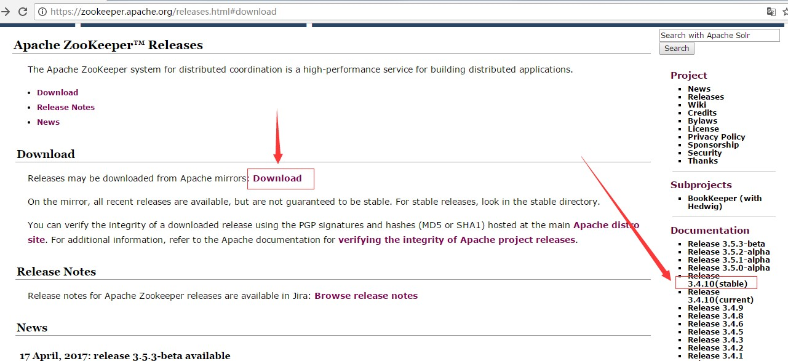
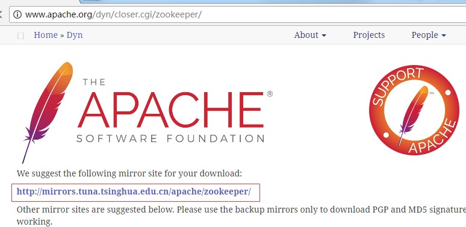
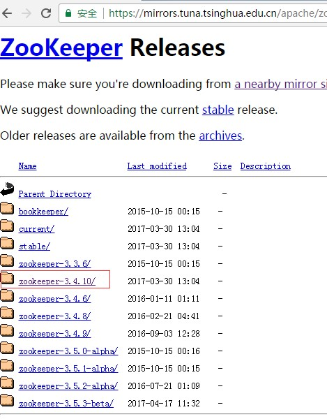
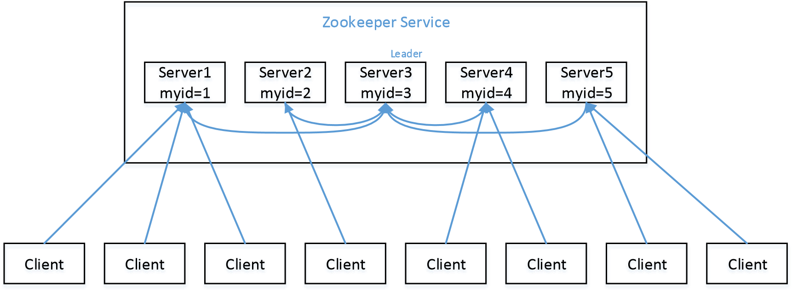

# 第 1 章 Zookeeper 简介

Zookeeper 是一个开源的分布式的，为分布式应用提供协调服务的 Apache 项目。是 Hadoop 和 HBase 的重要组件。

提供的服务包括：文件系统和通知机制。

统一命名服务、统一配置管理、统一集群管理、服务器节点动态上下线、软负载均衡等。

可以实现：数据发布订阅，负载均衡，分布式协调通知，集群管理，……

统一命名服务

## 节点类型

四种数据节点 ZNode：

（1）persistent-持久节点

除非手动删除，否则节点一直存在于 Zookeeper 上

（2）ephemeral-临时节点

临时节点的生命周期与**客户端会话绑定**，一旦客户端会话失效（客户端与 zookeeper 连接断开不一定会话失效），那么这个客户端创建的所有临时节点都会被移除。**不允许有子节点。**

（3）persistent_sequential-持久顺序节点

基本特性同持久节点，只是增加了顺序属性，节点名后边会追加一个由父节点维护的自增整型数字。类似 mysql 的 id，不允许重名节点

（4）ephemeral_sequential-临时顺序节点

基本特性同临时节点，增加了顺序属性，节点名后边会追加一个由父节点维护的自增整型数字。

ZNode具有原子性操作，存储数据大小有限制；

## 工作状态

服务器具有四种状态，分别是 LOOKING、FOLLOWING、LEADING、OBSERVING。

- LOOKING：寻找 Leader 状态。当服务器处于该状态时，它会认为当前集群中没有 Leader，因此需要进入 Leader 选举状态。
- FOLLOWING：跟随者状态。表明当前服务器角色是 Follower。
- LEADING：领导者状态。表明当前服务器角色是 Leader。
- OBSERVING：观察者状态。表明当前服务器角色是 Observer。

## ZAB 协议

ZAB 协议是为分布式协调服务 Zookeeper 专门设计的一种支持崩溃恢复的原子广播协议。

ZAB 协议包括两种基本的模式：崩溃恢复和消息广播。

当整个 zookeeper 集群刚刚启动或者 Leader 服务器宕机、重启或者网络故障导致不存在过半的服务器与 Leader 服务器保持正常通信时，所有进程（服务器）进入崩溃恢复模式，首先选举产生新的 Leader 服务器，然后集群中 Follower 服务器开始与新的 Leader 服务器进行数据同步，当集群中超过半数机器与该 Leader 服务器完成数据同步之后，退出恢复模式进入消息广播模式，Leader 服务器开始接收客户端的事务请求生成事物提案来进行事务请求处理。

## 特点

最终一致性

半数存活：集群中只要有半数以上节点存活，Zookeeper 集群就能正常服务。

1）Zookeeper：一个领导者（leader），多个跟随者（follower）组成的集群。

2）Leader 负责进行投票的发起和决议，更新系统状态

3）Follower 用于接收客户请求并向客户端返回结果，在选举 Leader 过程中参与投票

5）全局数据一致：每个 server 保存一份相同的数据副本，client 无论连接到哪个 server，数据都是一致的。

6）更新请求顺序进行，来自同一个 client 的更新请求按其发送顺序依次执行。

7）数据更新原子性，一次数据更新要么成功，要么失败。

8）实时性，在一定时间范围内，client 能读到最新数据。


## 作用

命名服务；

配置管理；

集群管理


# 第 2 章 Zookeeper 安装

## 下载地址

1．官网首页： https://zookeeper.apache.org/

2．下载截图








## 2.1 本地模式安装部署

### 1．安装前准备

1.  安装 Jdk

2.  拷贝 Zookeeper 安装包到 Linux 系统下

3.  解压到指定目录

```shell
tar 3.4.10.tar.gz -C /opt/module/ | -zxvf zookeeper- |
```

### 2．配置修改

1.  将/opt/module/zookeeper-3.4.10/conf 这个路径下的 zoo_sample.cfg 修改为 zoo.cfg；

2. 打开 zoo.cfg 文件，修改 dataDir 路径：

   ```txt
   dataDir=/opt/module/zookeeper-3.4.10/zkData
   ```

3. 在/opt/module/zookeeper-3.4.10/这个目录上创建 zkData 文件夹

   ```shell
   mkdir zkData
   ```

### 3．操作 Zookeeper

1. 启动 Zookeeper

   ```shell
   bin/zkServer.sh start
   ```

2. 查看进程是否启动：jps

3. 查看状态：

4. 启动客户端：

   ```shell
   bin/zkCli.sh
   ```

5. 退出客户端：

6. 停止 Zookeeper

   ```shell
   bin/zkServer.sh stop
   ```

## 2.2 配置参数解读

Zookeeper 中的配置文件 zoo.cfg 中参数含义解读如下：

1．tickTime =2000：通信心跳数，Zookeeper 服务器与客户端心跳时间，单位毫秒

Zookeeper 使用的基本时间，服务器之间或客户端与服务器之间维持心跳的时间间隔，也就是每个 tickTime 时间就会发送一个心跳，时间单位为毫秒。

它用于心跳机制，并且设置最小的 session 超时时间为两倍心跳时间。(session 的最小超时时间是 2\*tickTime)

2．initLimit =10：LF 初始通信时限

集群中的 Follower 跟随者服务器与 Leader 领导者服务器之间初始连接时能容忍的最多心跳数（tickTime 的数量），用它来限定集群中的 Zookeeper 服务器连接到 Leader 的时限。

3．syncLimit =5：LF
同步通信时限集群中 Leader 与 Follower 之间的最大响应时间单位，假如响应超过 syncLimittickTime，Leader 认为 Follwer 死掉，从服务器列表中删除 Follwer。

4．dataDir：数据文件目录+数据持久化路径主要用于保存 Zookeeper 中的数据。

5．clientPort =2181：客户端连接端口监听客户端连接的端口。

# 第 3 章 Zookeeper 实战（开发重点）

## 实现分布式配置中心

将集群上的配置文件统一进行管理到配置中心上，当某一处需要修改时，推送到集群的各个服务器上。

发布订阅

拉取方式：每隔一定时间主动拉取，不及时

推送方式：订阅某一项内容，当发生改变时，服务器推送，客户端注册 watch 监听器

- 这种方式存储数据量小，数据量要小于 1M
- 集群中各机器一致

## 实现软负载均衡

与 Nginx 的区别：

Nginx 等都是基于服务器端的负载均衡，Zookeeper 的负载均衡是基于客户端的负载均衡。

客户端存储服务器状态，类似王者荣耀让你选择每个区。让客户端主动选择服务器。

## 实现服务注册，治理与发现

## 实现分布式锁

锁服务可以分为两类：一个是保持独占，另一个是控制时序

- 保持独占：

## 3.2 客户端命令行操作

| 命令基本语法     | 功能描述                                         |
| ---------------- | ------------------------------------------------ |
| help             | 显示所有操作命令                                 |
| ls path [watch]  | 使用 ls 命令来查看当前 znode 中所包含的内容      |
| ls2 path [watch] | 查看当前节点数据并能看到更新次数等数据           |
| create           | 普通创建 -s 含有序列 -e 临时（重启或者超时消失） |
| get path [watch] | 获得节点的值                                     |
| set              | 设置节点的具体值                                 |
| stat             | 查看节点状态                                     |
| delete           | 删除节点                                         |
| rmr              | 递归删除节点                                     |

1：创建节点

```shell
## 创建永久节点
create /test node
## 创建临时节点
create -e /test node
## 创建顺序节点
create -s /test
## 创建临时顺序节点
create -e -s /test
```


## 3.3 API 应用

### 3.3.1 环境搭建

1．创建一个 Maven 工程

2．添加 pom 文件

```xml
<dependencies>
  <dependency>
   <groupId>junit</groupId>
   <artifactId>junit</artifactId>
   <version>RELEASE</version>
  </dependency>
  <dependency>
   <groupId>org.apache.logging.log4j</groupId>
   <artifactId>log4j-core</artifactId>
   <version>2.8.2</version>
  </dependency>
  <!--
https://mvnrepository.com/artifact/org.apache.zookeeper/zook eeper -->
  <dependency>
   <groupId>org.apache.zookeeper</groupId>
   <artifactId>zookeeper</artifactId>
   <version>3.4.10</version>
  </dependency>
</dependencies>
```

3．拷贝 log4j.properties 文件到项目根目录需要在项目的 src/main/resources 目录下，新建一个文件，命名为“log4j.properties”，在文件中填入。

```yml
log4j.rootLogger=INFO, stdout   log4j.appender.stdout=org.apache.log4j.ConsoleAppender   log4j.appender.stdout.layout=org.apache.log4j.PatternLayout   log4j.appender.stdout.layout.ConversionPattern=%d %p [%c]
- %m%n
log4j.appender.logfile=org.apache.log4j.FileAppender   log4j.appender.logfile.File=target/spring.log   log4j.appender.logfile.layout=org.apache.log4j.PatternLayout   log4j.appender.logfile.layout.ConversionPattern=%d %p [%c] - %m%n
```

### **3.3.2** 创建 **ZooKeeper** 客户端

```java
private static String connectString =
 "hadoop102:2181,hadoop103:2181,hadoop104:2181";  private static int sessionTimeout = 2000;  private ZooKeeper zkClient = null;

 @Before
 public void init() throws Exception {

 zkClient = new ZooKeeper(connectString, sessionTimeout, new Watcher() {

   @Override
   public void process(WatchedEvent event) {

    // 收到事件通知后的回调函数（用户的业务逻辑）
    System.out.println(event.getType() + "--" + event.getPath());

    // 再次启动监听
    try {
     zkClient.getChildren("/", true);
    } catch (Exception e) {
     e.printStackTrace();
    }
   }
  });
 }
```

### 3.3.3 创建子节点

```java
// 创建子节点
@Test
public void create() throws Exception {

  // 参数1：要创建的节点的路径； 参数2：节点数据 ； 参数3：节点权限 ；参数4：节点的类型
  String nodeCreated = zkClient.create("/qcx",
	"jinlian".getBytes(), 	Ids.OPEN_ACL_UNSAFE,
CreateMode.PERSISTENT);
}
```

### **3.3.4** 获取子节点并监听节点变化

```java
// 获取子节点
@Test
public void getChildren() throws Exception {

  List<String> children = zkClient.getChildren("/", true);
  for (String child : children) {    System.out.println(child);
} 	}
// 延时阻塞
Thread.sleep(Long.MAX_VALUE);

```

### **3.3.5** 判断 **Znode** 是否存在

```java
// 判断znode是否存在
@Test
public void exist() throws Exception {

 Stat stat = zkClient.exists("/eclipse", false);
 System.out.println(stat == null ? "not exist" : "exist");
}
```

## 3.4 监听服务器节点动态上下线案例

1．需求某分布式系统中，主节点可以有多台，可以动态上下线，任意一台客户端都能实时感知到主节点服务器的上下线。

3．具体实现

先在集群上创建/servers 节点

```java
[zk: localhost:2181(CONNECTED) 10] create /servers "servers" Created /servers
```

服务器端向 Zookeeper 注册代码

```java

import java.io.IOException;
import org.apache.zookeeper.CreateMode; 
import org.apache.zookeeper.WatchedEvent;
import org.apache.zookeeper.Watcher; 
import org.apache.zookeeper.ZooKeeper; 
import org.apache.zookeeper.ZooDefs.Ids;

public class DistributeServer {

 private static String connectString="hadoop102:2181,hadoop103:2181,hadoop104:2181";  
 private static int sessionTimeout = 2000;  
 private ZooKeeper zk = null;
 private String parentNode = "/servers";

 // 创建到zk的客户端连接
 public void getConnect() throws IOException{
      zk = new ZooKeeper(connectString, sessionTimeout, new Watcher() {
           @Override
           public void process(WatchedEvent event) {
           }
      });
 }

 // 注册服务器
 public void registServer(String hostname) throws Exception{
      String create = zk.create(parentNode+"/server",hostname.getBytes(),Ids.OPEN_ACL_UNSAFE,CreateMode.EPHEMERAL_SEQUENTIAL);

      System.out.println(hostname +" is online "+ create);
 }

 // 业务功能
 public void business(String hostname) throws Exception{
      System.out.println(hostname+" is working ...");

      Thread.sleep(Long.MAX_VALUE);
 }

 public static void main(String[] args) throws Exception {

	// 1获取zk连接
  	DistributeServer server = new DistributeServer();   
    server.getConnect();

     // 2 利用zk连接注册服务器信息
     server.registServer(args[0]);

      // 3 启动业务功能
      server.business(args[0]);
 }
```

1.  客户端代码

```java

import java.io.IOException; 
import java.util.ArrayList; 
import java.util.List;
import org.apache.zookeeper.WatchedEvent; 
import org.apache.zookeeper.Watcher; 
import org.apache.zookeeper.ZooKeeper;

public class DistributeClient {

 private static String connectString =
"hadoop102:2181,hadoop103:2181,hadoop104:2181";  
    private static int sessionTimeout = 2000;  
    private ZooKeeper zk = null;
    private String parentNode = "/servers";

 // 创建到zk的客户端连接
 public void getConnect() throws IOException {
  	zk = new ZooKeeper(connectString, sessionTimeout, new Watcher() {
           @Override
           public void process(WatchedEvent event) {
                // 再次启动监听
                try {
                 getServerList();
                } catch (Exception e) {
                 e.printStackTrace();
                }
   			}
  	});
 }

 // 获取服务器列表信息
 public void getServerList() throws Exception {
  // 1获取服务器子节点信息，并且对父节点进行监听
  List<String> children = zk.getChildren(parentNode, true);

  // 2存储服务器信息列表
  ArrayList<String> servers = new ArrayList<>();

  // 3遍历所有节点，获取节点中的主机名称信息
  for (String child : children) {
       byte[] data = zk.getData(parentNode + "/" + child, false, null);
       servers.add(new String(data));
  }

     // 4打印服务器列表信息
     System.out.println(servers);
 }

 // 业务功能
 public void business() throws Exception{
  	System.out.println("client is working ..."); Thread.sleep(Long.MAX_VALUE);
 }

 public static void main(String[] args) throws Exception {

      // 1获取zk连接
      DistributeClient client = new DistributeClient();
      client.getConnect();

      // 2获取servers的子节点信息，从中获取服务器信息列表
      client.getServerList();

      // 3业务进程启动
      client.business();
 }
}

```

# 第 4 章 Zookeeper 内部原理

## 4.2 Stat 结构体

czxid-创建节点的事务 zxid 每次修改 ZooKeeper 状态都会收到一个 zxid 形式的时间戳，也就是 ZooKeeper 事务 ID。事务 ID 是 ZooKeeper 中所有修改总的次序。每个修改都有唯一的 zxid，如果 zxid1 小于 zxid2，那么 zxid1 在 zxid2 之前发生。

1.  ctime - znode 被创建的毫秒数(从 1970 年开始)
2.  mzxid - znode 最后更新的事务 zxid
3.  mtime - znode 最后修改的毫秒数(从 1970 年开始)
4.  pZxid-znode 最后更新的子节点 zxid
5.  cversion - znode 子节点变化号，znode 子节点修改次数
6.  dataversion - znode 数据变化号
7.  aclVersion - znode 访问控制列表的变化号
8.  ephemeralOwner- 如果是临时节点，这个是 znode 拥有者的 session
    id。如果不是临时节点则是 0。
9.  dataLength- znode 的数据长度 11）numChildren - znode 子节点数量

## 4.3 监听器原理（面试重点）

数据变更通知

Zookeeper 允许客户端向服务端的某个 Znode 注册一个 Watcher 监听，当服务端的一些指定事件触发了这个 Watcher，服务端会向指定客户端发送一个事件通知来实现分布式的通知功能，然后客户端根据 Watcher 通知状态和事件类型做出业务上的改变。

工作机制：

（1）客户端注册 watcher

（2）服务端处理 watcher

（3）客户端回调 watcher

Watcher 特性总结：

（1）一次性

无论是服务端还是客户端，一旦一个 Watcher 被 触 发 ，Zookeeper 都会将其从相应的存储中移除。这样的设计有效的减轻了服务端的压力，不然对于更新非常频繁的节点，服务端会不断的向客户端发送事件通知，无论对于网络还是服务端的压力都非常大。

（2）客户端串行执行

客户端 Watcher 回调的过程是一个串行同步的过程。

（3）轻量

3.1、Watcher 通知非常简单，只会告诉客户端发生了事件，而不会说明事件的具体内容。

3.2、客户端向服务端注册 Watcher 的时候，并不会把客户端真实的 Watcher 对象实体传递到服务端，仅仅是在客户端请求中使用 boolean 类型属性进行了标记。

（4）watcher event 异步发送 watcher 的通知事件从 server 发送到 client 是异步的，这就存在一个问题，不同的客户端和服务器之间通过 socket 进行通信，由于网络延迟或其他因素导致客户端在不通的时刻监听到事件，由于 Zookeeper 本身提供了 ordering guarantee，即客户端监听事件后，才会感知它所监视 znode 发生了变化。所以我们使用 Zookeeper 不能期望能够监控到节点每次的变化。Zookeeper 只能保证最终的一致性，而无法保证强一致性。

（5）注册 watcher getData、exists、getChildren

（6）触发 watcher create、delete、setData

（7）当一个客户端连接到一个新的服务器上时，watch 将会被以任意会话事件触发。当与一个服务器失去连接的时候，是无法接收到 watch 的。而当 client 重新连接时，如果需要的话，所有先前注册过的 watch，都会被重新注册。通常这是完全透明的。只有在一个特殊情况下，watch 可能会丢失：对于一个未创建的 znode 的 exist watch，如果在客户端断开连接期间被创建了，并且随后在客户端连接上之前又删除了，这种情况下，这个 watch 事件可能会被丢失。

#### 客户端注册 Watcher 实现

（1）调用 getData()/getChildren()/exist()三个 API，传入 Watcher 对象

（2）标记请求 request，封装 Watcher 到 WatchRegistration

（3）封装成 Packet 对象，发服务端发送 request

（4）收到服务端响应后，将 Watcher 注册到 ZKWatcherManager 中进行管理

（5）请求返回，完成注册。

#### 服务端处理 Watcher 实现

（1）服务端接收 Watcher 并存储

接收到客户端请求，处理请求判断是否需要注册 Watcher，需要的话将数据节点的节点路径和 ServerCnxn（ServerCnxn 代表一个客户端和服务端的连接，实现了 Watcher 的 process 接口，此时可以看成一个 Watcher 对象）存储在 WatcherManager 的 WatchTable 和 watch2Paths 中去。

（2）Watcher 触发

以服务端接收到 setData() 事务请求触发 NodeDataChanged 事件为例：

2.1 封装 WatchedEvent

将通知状态（SyncConnected）、事件类型（NodeDataChanged）以及节点路径封装成一个 WatchedEvent 对象

事件类型：WatchEvent.getType()

```java
## 节点创建
Event.EventType.NodeCreated 
## 删除节点
Event.EventType.NodeDeleted
```


2.2 查询 Watcher

从 WatchTable 中根据节点路径查找 Watcher

没找到；说明没有客户端在该数据节点上注册过 Watcher

找到；提取并从 WatchTable 和 Watch2Paths 中删除对应 Watcher（从这里可以看出 Watcher 在服务端是一次性的，触发一次就失效了）

调用 process 方法来触发 Watcher

这里 process 主要就是通过 ServerCnxn 对应的 TCP 连接发送 Watcher 事件通知。

#### 客户端回调 Watcher

客户端 SendThread 线程接收事件通知，交由 EventThread 线程回调 Watcher。

客户端的 Watcher 机制同样是一次性的，一旦被触发后，该 Watcher 就失效了。


## 4.4 选举机制（面试重点）

1.  半数机制：集群中半数以上机器存活，集群可用。所以 Zookeeper 适合安装奇数台服务器。
2.  Zookeeper 虽然在配置文件中并没有指定 Master 和 Slave。但是，Zookeeper 工作时，是有一个节点为 Leader，其他则为 Follower，Leader 是通过内部的选举机制临时产生的。
3.  以一个简单的例子来说明整个选举的过程。

假设有五台服务器组成的 Zookeeper 集群，它们的 id 从 1-5，同时它们都是最新启动的，也就是没有历史数据，在存放数据量这一点上，都是一样的。假设这些服务器依序启动，来看看会发生什么，如图
5-8 所示。



图 5-8 Zookeeper 的选举机制

1.  服务器 1 启动，发起一次选举。服务器 1 投自己一票。此时服务器 1 票数一票，不够半数以上（3 票），选举无法完成，服务器 1 状态保持为 LOOKING；
2.  服务器 2 启动，再发起一次选举。服务器 1 和 2 分别投自己一票并交换选票信息：此时服务器 1 发现服务器 2 的 ID 比自己目前投票推举的（服务器 1）大，更改选票为推举服务器 2。此时服务器 1 票数 0 票，服务器 2 票数 2 票，没有半数以上结果，选举无法完成，服务器 1，2 状态保持 LOOKING
3.  服务器 3 启动，发起一次选举。此时服务器 1 和 2 都会更改选票为服务器 3。此次投票结果：服务器 1 为 0 票，服务器 2 为 0 票，服务器 3 为 3 票。此时服务器 3 的票数已经超过半数，服务器 3 当选 Leader。服务器 1，2 更改状态为 FOLLOWING，服务器 3 更改状态为 LEADING；
4.  服务器 4 启动，发起一次选举。此时服务器 1，2，3 已经不是 LOOKING 状态，不会更改选票信息。交换选票信息结果：服务器 3 为 3 票，服务器 4 为 1 票。此时服务器 4 服从多数，更改选票信息为服务器 3，并更改状态为 FOLLOWING；
5.  服务器 5 启动，同 4 一样当小弟。

## 访问机制ACL

创建Znode的时候，需要传入访问控制列表ACL，用于决定谁可以对它执行何种操作。

```txt
OPEN_ACL_UNSAFE  : 完全开放的ACL，任何连接的客户端都可以操作该属性znode,练习中使用的是
CREATOR_ALL_ACL : 只有创建者才有ACL权限
READ_ACL_UNSAFE：只能读取ACL
```

1：权限模式

- IP：从 IP 地址粒度进行权限控制
- Digest：最常用，通过用户名和密码识别客户端；
- World：最开放的权限控制方式，是一种特殊的 digest 模式，只有一个权限标识“world:anyone”
- Super：超级用户

2：授权对象

授权对象指的是权限赋予的用户或一个指定实体，例如 IP 地址或是机器灯。

3：具体权限

- CREATE：数据节点创建权限，允许授权对象在该 Znode 下创建子节点
- DELETE：子节点删除权限，允许授权对象删除该数据节点的子节点
- READ：数据节点的读取权限，允许授权对象访问该数据节点并读取其数据内容或子节点列表等
- WRITE：数据节点更新权限，允许授权对象对该数据节点进行更新操作
- ADMIN：数据节点管理权限，允许授权对象对该数据节点进行 ACL 相关设置操作


## 4.5 写数据流程

# 第 5 章：常见问题与解决方案

## 1：Zookeeper 怎么保证主从节点的状态同步？

Zookeeper 的核心是原子广播机制，这个机制保证了各个 server 之间的同步。实现这个机制的协议叫做 Zab 协议。Zab 协议有两种模式，它们分别是恢复模式和广播模式。

1. 恢复模式

当服务启动或者在领导者崩溃后，Zab 就进入了恢复模式，当领导者被选举出来，且大多数 server 完成了和 leader 的状态同步以后，恢复模式就结束了。状态同步保证了 leader 和 server 具有相同的系统状态。

1. 广播模式

一旦 leader 已经和多数的 follower 进行了状态同步后，它就可以开始广播消息了，即进入广播状态。这时候当一个 server 加入 ZooKeeper 服务中，它会在恢复模式下启动，发现 leader，并和 leader 进行状态同步。待到同步结束，它也参与消息广播。ZooKeeper 服务一直维持在 Broadcast 状态，直到 leader 崩溃了或者 leader 失去了大部分的 followers 支持。

https://thinkwon.blog.csdn.net/article/details/104397719
