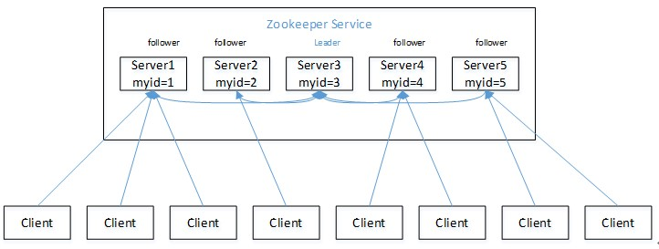

# 第1 章 Zookeeper 入门 

## 1.1 概述 

>   Zookeeper 是一个开源的分布式的，为分布式应用提供协调服务的 Apache 项目。

## 1.2 特点 

>   1）Zookeeper：一个领导者（leader），多个跟随者（follower）组成的集群。

>   2）Leader负责进行投票的发起和决议，更新系统状态

>   3）Follower用于接收客户请求并向客户端返回结果，在选举Leader过程中参与投票

>   4）集群中只要有半数以上节点存活，Zookeeper集群就能正常服务。

>   5）全局数据一致：每个server保存一份相同的数据副本，client无论连接到哪个server，数据都是一致的。

>   6）更新请求顺序进行，来自同一个client的更新请求按其发送顺序依次执行。

>   7）数据更新原子性，一次数据更新要么成功，要么失败。

>   8）实时性，在一定时间范围内，client能读到最新数据。

## 1.3 数据结构 

## 1.4 应用场景 

提供的服务包括：统一命名服务、统一配置管理、统一集群管理、服务器节点动态上下线、软负载均衡等。

统一命名服务

## 1.5 下载地址 

>   1．官网首页：

>   https://zookeeper.apache.org/

>   2．下载截图，如图 5-5，5-6，5-7 所示

>   图 5-5 Zookeeper 下载（一）

>   图 5-6 Zookeeper 下载（二）

>   图 5-7 Zookeeper 下载（三）

# 第 2 章 Zookeeper 安装 

## 2.1 本地模式安装部署 

### 1．安装前准备 

1.  安装 Jdk

2.  拷贝 Zookeeper 安装包到 Linux 系统下

3.  解压到指定目录

| [atguigu\@hadoop102 software]\$ tar  3.4.10.tar.gz -C /opt/module/  | \-zxvf  | zookeeper- |
|---------------------------------------------------------------------|---------|------------|

### 2．配置修改 

1.  将/opt/module/zookeeper-3.4.10/conf 这个路径下的 zoo_sample.cfg 修改为
    zoo.cfg；

    [atguigu\@hadoop102 conf]\$ mv zoo_sample.cfg zoo.cfg

2.  打开 zoo.cfg 文件，修改 dataDir 路径：

    [atguigu\@hadoop102 zookeeper-3.4.10]\$ vim zoo.cfg

    修改如下内容：

    dataDir=/opt/module/zookeeper-3.4.10/zkData

3.  在/opt/module/zookeeper-3.4.10/这个目录上创建 zkData 文件夹

    [atguigu\@hadoop102 zookeeper-3.4.10]\$ mkdir zkData

### 3．操作 Zookeeper 

1.  启动 Zookeeper

    [atguigu\@hadoop102 zookeeper-3.4.10]\$ bin/zkServer.sh start

2.  查看进程是否启动

    [atguigu\@hadoop102 zookeeper-3.4.10]\$ jps

    4020 Jps

    4001 QuorumPeerMain

3.  查看状态：

    [atguigu\@hadoop102 zookeeper-3.4.10]\$ bin/zkServer.sh status ZooKeeper JMX
    enabled by default

    Using config: /opt/module/zookeeper-

    3.4.10/bin/../conf/zoo.cfg Mode: standalone

4.  启动客户端：

    [atguigu\@hadoop102 zookeeper-3.4.10]\$ bin/zkCli.sh

5.  退出客户端：

    [zk: localhost:2181(CONNECTED) 0] quit

6.  停止 Zookeeper

    [atguigu\@hadoop102 zookeeper-3.4.10]\$ bin/zkServer.sh stop

## 2.2 配置参数解读 

>   Zookeeper中的配置文件zoo.cfg中参数含义解读如下：

1．tickTime =2000：通信心跳数，Zookeeper 服务器与客户端心跳时间，单位毫秒

Zookeeper使用的基本时间，服务器之间或客户端与服务器之间维持心跳的时间间隔，也就是每个tickTime时间就会发送一个心跳，时间单位为毫秒。

>   它用于心跳机制，并且设置最小的session超时时间为两倍心跳时间。(session的最小超

时时间是2\*tickTime)

>   2．initLimit =10：LF 初始通信时限

集群中的Follower跟随者服务器与Leader领导者服务器之间初始连接时能容忍的最多心跳数（tickTime的数量），用它来限定集群中的Zookeeper服务器连接到Leader的时限。

>   3．syncLimit =5：LF
>   同步通信时限集群中Leader与Follower之间的最大响应时间单位，假如响应超过syncLimit
>   \*

tickTime，Leader认为Follwer死掉，从服务器列表中删除Follwer。

>   4．dataDir：数据文件目录+数据持久化路径主要用于保存 Zookeeper 中的数据。

>   5．clientPort =2181：客户端连接端口监听客户端连接的端口。

## 3：实践：centos7安装Zookeeper

1：解压Zookeeper

tar -zxvf zookeeper-3.4.11.tar.gz

2：修改配置文件

cd zookeeper/conf/

cp zoo_sample.cfg zoo.cfg

vim zoo.cfg

tickTime=2000

dataDir=/home/hadoop/zookeeperdata

clientPort=2181

initLimit=5

syncLimit=2

server.1=server1:2888:3888

server.2=server2:2888:3888

注：

tickTime ：心跳时间，单位毫秒。

同时tickTime又是zookeeper中的基本单位，比如后面的initLimit=5就是指5个tickTime时间，在这里是10秒。

dataDir ：存储数据信息的本地目录

3：启动

bin/zkServer.sh start

# 第 3 章 Zookeeper 实战（开发重点） 

## 3.1 分布式安装部署 

### 1．集群规划 

>   在 hadoop102、hadoop103 和 hadoop104 三个节点上部署 Zookeeper。

### 2．解压安装 

1.  解压 Zookeeper 安装包到/opt/module/目录下

| [atguigu\@hadoop102 software]\$ tar  3.4.10.tar.gz -C /opt/module/  | \-zxvf zookeeper- |
|---------------------------------------------------------------------|-------------------|

2.  同步/opt/module/zookeeper-3.4.10 目录内容到 hadoop103、hadoop104

    [atguigu\@hadoop102 module]\$ xsync zookeeper-3.4.10/

### 3．配置服务器编号 

>   （1）在/opt/module/zookeeper-3.4.10/这个目录下创建 zkData

>   [atguigu\@hadoop102 zookeeper-3.4.10]\$ mkdir -p zkData
>   （2）在/opt/module/zookeeper-3.4.10/zkData 目录下创建一个 myid 的文件

>   [atguigu\@hadoop102 zkData]\$ touch myid

>   添加 myid 文件，注意一定要在 linux 里面创建，在 notepad++里面很可能乱码

1.  编辑 myid 文件

    [atguigu\@hadoop102 zkData]\$ vi myid

    在文件中添加与 server 对应的编号：

    2

2.  拷贝配置好的 zookeeper 到其他机器上

    [atguigu\@hadoop102 zkData]\$ xsync myid

并分别在 hadoop103、hadoop104 上修改 myid 文件中内容为 3、4

>   4．配置 zoo.cfg 文件

1.  重命名/opt/module/zookeeper-3.4.10/conf 这个目录下的 zoo_sample.cfg 为
    zoo.cfg

    [atguigu\@hadoop102 conf]\$ mv zoo_sample.cfg zoo.cfg

2.  打开 zoo.cfg 文件

    [atguigu\@hadoop102 conf]\$ vim zoo.cfg

修改数据存储路径配置

>   dataDir=/opt/module/zookeeper-3.4.10/zkData

增加如下配置

>   \#\#\#\#\#\#\#\#\#\#\#\#\#\#\#\#\#\#\#\#\#\#\#cluster\#\#\#\#\#\#\#\#\#\#\#\#\#\#\#\#\#\#\#\#\#\#\#\#\#\#
>   server.2=hadoop102:2888:3888 server.3=hadoop103:2888:3888
>   server.4=hadoop104:2888:3888

1.  同步 zoo.cfg 配置文件

    [atguigu\@hadoop102 conf]\$ xsync zoo.cfg

2.  配置参数解读

    server.A=B:C:D。

**A**是一个数字，表示这个是第几号服务器；集群模式下配置一个文件 myid，这个文件在
dataDir 目录下，这个文件里面有一个数据就是 A 的值，Zookeeper
启动时读取此文件，拿到里面的数据与 zoo.cfg 里面的配置信息比较从而判断到底是哪个
server。

>   **B**是这个服务器的地址；

>   **C**是这个服务器 Follower 与集群中的 Leader 服务器交换信息的端口；

>   **D**是万一集群中的 Leader
>   服务器挂了，需要一个端口来重新进行选举，选出一个新的

>   Leader，而这个端口就是用来执行选举时服务器相互通信的端口。

### 4．集群操作 

1.  分别启动 Zookeeper

    [atguigu\@hadoop102 zookeeper-3.4.10]\$ bin/zkServer.sh start
    [atguigu\@hadoop103 zookeeper-3.4.10]\$ bin/zkServer.sh start

    [atguigu\@hadoop104 zookeeper-3.4.10]\$ bin/zkServer.sh start

2.  查看状态

    [atguigu\@hadoop102 zookeeper-3.4.10]\# bin/zkServer.sh status

    JMX enabled by default

    Using config: /opt/module/zookeeper-

    3.4.10/bin/../conf/zoo.cfg

    Mode: follower

    [atguigu\@hadoop103 zookeeper-3.4.10]\# bin/zkServer.sh status

    JMX enabled by default

    Using config: /opt/module/zookeeper-

    3.4.10/bin/../conf/zoo.cfg

    Mode: leader

    [atguigu\@hadoop104 zookeeper-3.4.5]\# bin/zkServer.sh status

    JMX enabled by default

    Using config: /opt/module/zookeeper-

    3.4.10/bin/../conf/zoo.cfg Mode: follower

## 3.2 客户端命令行操作 

表 5-1

| 命令基本语法      | 功能描述                                            |
|-------------------|-----------------------------------------------------|
| help              | 显示所有操作命令                                    |
| ls path [watch]   | 使用 ls 命令来查看当前 znode 中所包含的内容         |
| ls2 path [watch]  | 查看当前节点数据并能看到更新次数等数据              |
| create            | 普通创建  -s 含有序列  -e 临时（重启或者超时消失）  |
| get path [watch]  | 获得节点的值                                        |
| set               | 设置节点的具体值                                    |
| stat              | 查看节点状态                                        |
| delete            | 删除节点                                            |
| rmr               | 递归删除节点                                        |

>   1．启动客户端

>   [atguigu\@hadoop103 zookeeper-3.4.10]\$ bin/zkCli.sh

>   2．显示所有操作命令

>   [zk: localhost:2181(CONNECTED) 1] help

>   3．查看当前 znode 中所包含的内容

>   [zk: localhost:2181(CONNECTED) 0] ls /

>   [zookeeper]

>   4．查看当前节点详细数据

| [zk: localhost:2181(CONNECTED) 1] ls2 /  [zookeeper] cZxid = 0x0  ctime = Thu Jan 01 08:00:00 CST 1970 mZxid = 0x0  mtime = Thu Jan 01 08:00:00 CST 1970 pZxid = 0x0  |
|-----------------------------------------------------------------------------------------------------------------------------------------------------------------------|

>   cversion = -1 dataVersion = 0 aclVersion = 0 ephemeralOwner = 0x0 dataLength
>   = 0 numChildren = 1

>   5．分别创建 2 个普通节点

>   [zk: localhost:2181(CONNECTED) 3] create /sanguo "jinlian"

>   Created /sanguo

>   [zk: localhost:2181(CONNECTED) 4] create /sanguo/shuguo

>   "liubei"

>   Created /sanguo/shuguo

>   6．获得节点的值

| [zk: localhost:2181(CONNECTED) 5] get /sanguo jinlian  cZxid = 0x100000003  ctime = Wed Aug 29 00:03:23 CST 2018 mZxid = 0x100000003  mtime = Wed Aug 29 00:03:23 CST 2018 pZxid = 0x100000004 cversion = 1 dataVersion = 0 aclVersion = 0 ephemeralOwner = 0x0 dataLength = 7 numChildren = 1  [zk: localhost:2181(CONNECTED) 6]  [zk: localhost:2181(CONNECTED) 6] get /sanguo/shuguo liubei  cZxid = 0x100000004  ctime = Wed Aug 29 00:04:35 CST 2018 mZxid = 0x100000004  mtime = Wed Aug 29 00:04:35 CST 2018 pZxid = 0x100000004 cversion = 0 dataVersion = 0 aclVersion = 0 ephemeralOwner = 0x0 dataLength = 6 numChildren = 0  |
|------------------------------------------------------------------------------------------------------------------------------------------------------------------------------------------------------------------------------------------------------------------------------------------------------------------------------------------------------------------------------------------------------------------------------------------------------------------------------------------------------------------------------------------------------------------------------------------------------------------------------------------|

>   7．创建短暂节点

>   [zk: localhost:2181(CONNECTED) 7] create -e /sanguo/wuguo

>   "zhouyu"

>   Created /sanguo/wuguo

1.  在当前客户端是能查看到的

    [zk: localhost:2181(CONNECTED) 3] ls /sanguo

    [wuguo, shuguo]

2.  退出当前客户端然后再重启客户端

    [zk: localhost:2181(CONNECTED) 12] quit

    [atguigu\@hadoop104 zookeeper-3.4.10]\$ bin/zkCli.sh

3.  再次查看根目录下短暂节点已经删除

    [zk: localhost:2181(CONNECTED) 0] ls /sanguo

    [shuguo]

    8．创建带序号的节点

4.  先创建一个普通的根节点/sanguo/weiguo

    [zk: localhost:2181(CONNECTED) 1] create /sanguo/weiguo

    "caocao"

    Created /sanguo/weiguo

5.  创建带序号的节点

| [zk: localhost:2181(CONNECTED) 2]                                                                                                                                                        | create  | \-s  |
|------------------------------------------------------------------------------------------------------------------------------------------------------------------------------------------|---------|------|
| /sanguo/weiguo/xiaoqiao "jinlian"  Created /sanguo/weiguo/xiaoqiao0000000000  [zk: localhost:2181(CONNECTED) 3]                                                                          | create  | \-s  |
| /sanguo/weiguo/daqiao "jinlian"  Created /sanguo/weiguo/daqiao0000000001  [zk: localhost:2181(CONNECTED) 4]  /sanguo/weiguo/diaocan "jinlian"  Created /sanguo/weiguo/diaocan0000000002  | create  | \-s  |

>   如果原来没有序号节点，序号从 0 开始依次递增。如果原节点下已有 2
>   个节点，则再排序时从 2 开始，以此类推。

>   9．修改节点数据值

>   [zk: localhost:2181(CONNECTED) 6] set /sanguo/weiguo "simayi"

>   10．节点的值变化监听

（1）在 hadoop104 主机上注册监听/sanguo 节点数据变化

| [zk: localhost:2181(CONNECTED) 26]  localhost:2181(CONNECTED) 8] get /sanguo watch  | [zk:  |
|-------------------------------------------------------------------------------------|-------|
| 2）在 hadoop103 主机上修改/sanguo 节点的数据                                        |       |
| [zk: localhost:2181(CONNECTED) 1] set /sanguo "xisi"                                |       |
| 3）观察 hadoop104 主机收到数据变化的监听                                            |       |
| WATCHER::  WatchedEvent state:SyncConnected type:NodeDataChanged path:/sanguo       |       |

>   （

>   （

>   11．节点的子节点变化监听（路径变化）

1.  在 hadoop104 主机上注册监听/sanguo 节点的子节点变化

    [zk: localhost:2181(CONNECTED) 1] ls /sanguo watch

    [aa0000000001, server101]

2.  在 hadoop103 主机/sanguo 节点上创建子节点

    [zk: localhost:2181(CONNECTED) 2] create /sanguo/jin "simayi" Created
    /sanguo/jin

3.  观察 hadoop104 主机收到子节点变化的监听

    WATCHER::

    WatchedEvent state:SyncConnected type:NodeChildrenChanged path:/sanguo

    12．删除节点

    [zk: localhost:2181(CONNECTED) 4] delete /sanguo/jin

    13．递归删除节点

    [zk: localhost:2181(CONNECTED) 15] rmr /sanguo/shuguo

    14．查看节点状态

| [zk: localhost:2181(CONNECTED) 17] stat /sanguo cZxid = 0x100000003  ctime = Wed Aug 29 00:03:23 CST 2018 mZxid = 0x100000011  mtime = Wed Aug 29 00:21:23 CST 2018 pZxid = 0x100000014 cversion = 9 dataVersion = 1 aclVersion = 0 ephemeralOwner = 0x0 dataLength = 4 numChildren = 1  |
|------------------------------------------------------------------------------------------------------------------------------------------------------------------------------------------------------------------------------------------------------------------------------------------|

## 3.3 API 应用 

### **3.3.1 Eclipse** 环境搭建 

>   1．创建一个 Maven 工程

#### 2．添加 pom 文件 

>   \<dependencies\>

>   \<dependency\>

>   \<groupId\>junit\</groupId\>

>   \<artifactId\>junit\</artifactId\>

>   \<version\>RELEASE\</version\>

>   \</dependency\>

>   \<dependency\>

>   \<groupId\>org.apache.logging.log4j\</groupId\>

>   \<artifactId\>log4j-core\</artifactId\>

>   \<version\>2.8.2\</version\>

>   \</dependency\>

>   \<!--

>   https://mvnrepository.com/artifact/org.apache.zookeeper/zook eeper --\>

>   \<dependency\>

>   \<groupId\>org.apache.zookeeper\</groupId\>

>   \<artifactId\>zookeeper\</artifactId\>

>   \<version\>3.4.10\</version\>

>   \</dependency\>

>   \</dependencies\>

3．拷贝 log4j.properties 文件到项目根目录需要在项目的 src/main/resources
目录下，新建一个文件，命名为“log4j.properties”，在文件中填入。

>   log4j.rootLogger=INFO, stdout
>   log4j.appender.stdout=org.apache.log4j.ConsoleAppender
>   log4j.appender.stdout.layout=org.apache.log4j.PatternLayout
>   log4j.appender.stdout.layout.ConversionPattern=%d %p [%c]

>   \- %m%n

>   log4j.appender.logfile=org.apache.log4j.FileAppender
>   log4j.appender.logfile.File=target/spring.log
>   log4j.appender.logfile.layout=org.apache.log4j.PatternLayout
>   log4j.appender.logfile.layout.ConversionPattern=%d %p [%c] - %m%n

### **3.3.2** 创建 **ZooKeeper** 客户端 

| private static String connectString =   "hadoop102:2181,hadoop103:2181,hadoop104:2181"; private static int sessionTimeout = 2000; private ZooKeeper zkClient = null;   \@Before   public void init() throws Exception {   zkClient = new ZooKeeper(connectString, sessionTimeout, new Watcher() {   \@Override   public void process(WatchedEvent event) {   // 收到事件通知后的回调函数（用户的业务逻辑）   System.out.println(event.getType() + "--" + event.getPath());   // 再次启动监听   try {   zkClient.getChildren("/", true);   } catch (Exception e) {   e.printStackTrace();   }   }   });   }  |
|-------------------------------------------------------------------------------------------------------------------------------------------------------------------------------------------------------------------------------------------------------------------------------------------------------------------------------------------------------------------------------------------------------------------------------------------------------------------------------------------------------------------------------------------------------------------------------------------------------------|

### 3.3.3 创建子节点 

>   // 创建子节点

>   \@Test

>   public void create() throws Exception {

>   // 参数1：要创建的节点的路径； 参数2：节点数据 ； 参数3：节点权限
>   ；参数4：节点的类型

>   String nodeCreated = zkClient.create("/atguigu",

"jinlian".getBytes(), Ids.OPEN_ACL_UNSAFE,

>   CreateMode.PERSISTENT);

>   }

### **3.3.4** 获取子节点并监听节点变化 

>   // 获取子节点

>   \@Test

>   public void getChildren() throws Exception {

>   List\<String\> children = zkClient.getChildren("/", true);

>   for (String child : children) { System.out.println(child);

| }  | }  // 延时阻塞  Thread.sleep(Long.MAX_VALUE);  |
|----|------------------------------------------------|

### **3.3.5** 判断 **Znode** 是否存在 

| // 判断znode是否存在  \@Test  public void exist() throws Exception {   Stat stat = zkClient.exists("/eclipse", false);   System.out.println(stat == null ? "not exist" : "exist"); }  |
|---------------------------------------------------------------------------------------------------------------------------------------------------------------------------------------|

## 3.4 监听服务器节点动态上下线案例 

1．需求某分布式系统中，主节点可以有多台，可以动态上下线，任意一台客户端都能实时感知到主节点服务器的上下线。

>   2．需求分析，如图 5-12 所示

>   服务器动态上下线案例分析

>   图 5-12 服务器动态上下线

#### 3．具体实现 

1.  先在集群上创建/servers 节点

    [zk: localhost:2181(CONNECTED) 10] create /servers "servers" Created
    /servers

2.  服务器端向 Zookeeper 注册代码

    package com.atguigu.zkcase; import java.io.IOException;

| import org.apache.zookeeper.CreateMode; import org.apache.zookeeper.WatchedEvent; import org.apache.zookeeper.Watcher; import org.apache.zookeeper.ZooKeeper; import org.apache.zookeeper.ZooDefs.Ids;  public class DistributeServer {   private static String connectString = "hadoop102:2181,hadoop103:2181,hadoop104:2181"; private static int sessionTimeout = 2000; private ZooKeeper zk = null;   private String parentNode = "/servers";   // 创建到zk的客户端连接   public void getConnect() throws IOException{   zk = new ZooKeeper(connectString, sessionTimeout, new Watcher() {   \@Override   public void process(WatchedEvent event) {   }   });   }   // 注册服务器   public void registServer(String hostname) throws Exception{   String create = zk.create(parentNode + "/server", hostname.getBytes(), Ids.OPEN_ACL_UNSAFE,  CreateMode.EPHEMERAL_SEQUENTIAL);   System.out.println(hostname +" is online "+ create);   }   // 业务功能   public void business(String hostname) throws Exception{   System.out.println(hostname+" is working ...");   Thread.sleep(Long.MAX_VALUE);   }   public static void main(String[] args) throws Exception { // 1获取zk连接   DistributeServer server = new DistributeServer(); server.getConnect();   // 2 利用zk连接注册服务器信息   server.registServer(args[0]);   // 3 启动业务功能   server.business(args[0]);   }  |
|---------------------------------------------------------------------------------------------------------------------------------------------------------------------------------------------------------------------------------------------------------------------------------------------------------------------------------------------------------------------------------------------------------------------------------------------------------------------------------------------------------------------------------------------------------------------------------------------------------------------------------------------------------------------------------------------------------------------------------------------------------------------------------------------------------------------------------------------------------------------------------------------------------------------------------------------------------------------------------------------------------------------------------------------------------------------------------------------------------------------------------------------------------------------------------------------------------------------------------------------------------------------------------------------------------------------------------------------------------------------------------------|

>   }

1.  客户端代码

| package com.atguigu.zkcase; import java.io.IOException; import java.util.ArrayList; import java.util.List;  import org.apache.zookeeper.WatchedEvent; import org.apache.zookeeper.Watcher; import org.apache.zookeeper.ZooKeeper;  public class DistributeClient {   private static String connectString = "hadoop102:2181,hadoop103:2181,hadoop104:2181"; private static int sessionTimeout = 2000; private ZooKeeper zk = null;   private String parentNode = "/servers";   // 创建到zk的客户端连接   public void getConnect() throws IOException {   zk = new ZooKeeper(connectString, sessionTimeout, new Watcher() {   \@Override   public void process(WatchedEvent event) {   // 再次启动监听   try {   getServerList();   } catch (Exception e) {   e.printStackTrace();   }   }   });   }   // 获取服务器列表信息   public void getServerList() throws Exception {   // 1获取服务器子节点信息，并且对父节点进行监听   List\<String\> children = zk.getChildren(parentNode, true);   // 2存储服务器信息列表   ArrayList\<String\> servers = new ArrayList\<\>();   // 3遍历所有节点，获取节点中的主机名称信息   for (String child : children) {   byte[] data = zk.getData(parentNode + "/" + child, false, null);   servers.add(new String(data));   }   // 4打印服务器列表信息  |
|-------------------------------------------------------------------------------------------------------------------------------------------------------------------------------------------------------------------------------------------------------------------------------------------------------------------------------------------------------------------------------------------------------------------------------------------------------------------------------------------------------------------------------------------------------------------------------------------------------------------------------------------------------------------------------------------------------------------------------------------------------------------------------------------------------------------------------------------------------------------------------------------------------------------------------------------------------------------------------------------------------------------------------------------------------------------------------------------------------------------------------------------------------------------------------------------------------------------------------------------------------------------------------------------|

>   System.out.println(servers);

>   }

>   // 业务功能

>   public void business() throws Exception{

>   System.out.println("client is working ..."); Thread.sleep(Long.MAX_VALUE);

>   }

>   public static void main(String[] args) throws Exception {

>   // 1获取zk连接

>   DistributeClient client = new DistributeClient();

>   client.getConnect();

>   // 2获取servers的子节点信息，从中获取服务器信息列表

>   client.getServerList();

>   // 3业务进程启动

>   client.business();

>   }

>   }

# 第 4 章 Zookeeper 内部原理 

## 4.1 节点类型 

## 4.2 Stat 结构体 

1.  czxid-创建节点的事务 zxid 每次修改 ZooKeeper 状态都会收到一个
    zxid形式的时间戳，也就是 ZooKeeper事务 ID。事务 ID 是 ZooKeeper
    中所有修改总的次序。每个修改都有唯一的 zxid，如果 zxid1 小

于 zxid2，那么 zxid1 在 zxid2 之前发生。

1.  ctime - znode 被创建的毫秒数(从 1970 年开始)

2.  mzxid - znode 最后更新的事务 zxid

3.  mtime - znode 最后修改的毫秒数(从 1970 年开始)

4.  pZxid-znode 最后更新的子节点 zxid

5.  cversion - znode 子节点变化号，znode 子节点修改次数

6.  dataversion - znode 数据变化号

7.  aclVersion - znode 访问控制列表的变化号

8.  ephemeralOwner- 如果是临时节点，这个是 znode 拥有者的 session
    id。如果不是临时节点则是 0。

9.  dataLength- znode 的数据长度 11）numChildren - znode 子节点数量

## 4.3 监听器原理（面试重点） 

## 4.4 选举机制（面试重点） 

1.  半数机制：集群中半数以上机器存活，集群可用。所以 Zookeeper
    适合安装奇数台服务器。

2.  Zookeeper 虽然在配置文件中并没有指定 Master 和 Slave。但是，Zookeeper
    工作时，是有一个节点为 Leader，其他则为 Follower，Leader
    是通过内部的选举机制临时产生的。 3）以一个简单的例子来说明整个选举的过程。

假设有五台服务器组成的 Zookeeper 集群，它们的 id 从
1-5，同时它们都是最新启动的，也就是没有历史数据，在存放数据量这一点上，都是一样的。假设这些服务器依序启动，来看看会发生什么，如图
5-8 所示。

图 5-8 Zookeeper 的选举机制

1.  服务器 1 启动，发起一次选举。服务器 1 投自己一票。此时服务器 1
    票数一票，不够半数以上（3 票），选举无法完成，服务器 1 状态保持为 LOOKING；

2.  服务器 2 启动，再发起一次选举。服务器 1 和 2
    分别投自己一票并交换选票信息：此时服务器 1 发现服务器 2 的 ID
    比自己目前投票推举的（服务器 1）大，更改选票为推举服务器 2。此时服务器 1
    票数 0 票，服务器 2 票数 2 票，没有半数以上结果，选举无法完成，服务器 1，2
    状态保持 LOOKING

3.  服务器 3 启动，发起一次选举。此时服务器 1 和 2 都会更改选票为服务器
    3。此次投票结果：服务器 1 为 0 票，服务器 2 为 0 票，服务器 3 为 3
    票。此时服务器 3 的票数已经超过半数，服务器 3 当选 Leader。服务器 1，2
    更改状态为 FOLLOWING，服务器 3 更改状态为 LEADING；

4.  服务器 4 启动，发起一次选举。此时服务器 1，2，3 已经不是 LOOKING 状态，

    不会更改选票信息。交换选票信息结果：服务器 3 为 3 票，服务器 4 为 1
    票。此时服务器 4 服从多数，更改选票信息为服务器 3，并更改状态为 FOLLOWING；

5.  服务器 5 启动，同 4 一样当小弟。

## 4.5 写数据流程 

# 第 5 章 企业面试真题 

5.1 请简述 ZooKeeper 的选举机制

详见 4.4。

5.2 ZooKeeper 的监听原理是什么？

详见 4.3。

5.3 ZooKeeper 的部署方式有哪几种？集群中的角色有哪些？集群最少需要几台机器？

部署方式单机模式、集群模式

角色：Leader 和 Follower

集群最少需要机器数：3

5.4 ZooKeeper 的常用命令

ls create get delete set…
