# 一、Linux发展史

## 1、Linux前身-Unix

1968年 Multics项目

**MIT**、Bell实验室、美国通用电气有限公司**走到了一起，致力于开发Multics项目。到后期由于开发进度不是很好，MIT和Bell实验室相继离开这个项目的开发，最终导致项目搁浅。

 

**1970**年（Unix元年，时间戳） Unix诞生

当时在开发Multics项目的时候，实验室中有一个开发成员开发了一款游戏（travel space：遨游太空），因为两个实验室相继离开项目开发，导致这名开发人员没法玩游戏，后来他提议组织人员重新在Multics项目之上重新的开发，也就出现了1970年的Unix。当时Unix操作系统是使用的**汇编语言（机器语言）**开发的。

 

1973年 用**C**语言重写Unix

因为汇编语言有一个最大的局限性：对于计算机硬件过于依赖。导致移植性不好，所以后期在1973年使用了C语言对其进行重新开发。

 

1975年 Bell实验室允许大学使用Unix。

 

1975年，bell实验室允许大学使用Unix操作系统用于教学作用，而不允许用于商业用途。

## 2、Linux诞生

人物 Linus

Linux的开发作者，Linux之父，李纳斯·托瓦兹。Linux诞生时是荷兰在校大学生。


1991年 0.0.1版本

李纳斯当时学校使用的就是Unix操作系统，然后其对系统的底层代码进行了修改，放到了学校为学生开放的网站上，原先他把文件命名写成了Linus’s Unix，后期网络管理发现之后觉得这个名字不好，自己手动的将名字改成Linux。随后其他同学下载之后发现这个版本还是挺好用的，随后都把自己代码贡献给李纳斯。

1992年 0.0.2版本

1994年 1.0版本

2003年 2.6版本

**上述所提及的版本号并不是分支版本，而是指Linux****的内核版本。**

## 3、开源文化

Linux是**开源**的操作系统。所谓开源就是指开放源代码。

人 物 Stallman 斯特曼，开源文化的倡导人。

 

**1983****年 GNU****计划**

1985年 FSF基金会

1990年 Emacs、**GCC**（c语言的编译器）、程序库 

1991年   Stallman去找Linus，商谈让Linux加入其开源计划（GNU计划）

1992年 GNU/Linux

 

## 4、Linux系统特点

开放性（开源）、多用户、多任务、良好的用户界面、优异的性能与稳定性

 

多用户多任务：

单用户：一个用户，在登录计算机（操作系统），只能允许**同时**登录一个用户；

单任务：一个任务，允许用户**同时**进行的操作任务数量；

多用户：多个用户，在登录计算机（操作系统），允许**同时**登录多个用户进行操作；

多任务：多个任务，允许用户**同时**进行多个操作任务；

 

**Windows****属于：单用户、多任务。**

**Linux****属于：多用户、多任务。**

 

## 5、Linux分支

分支：Linux分支有很多，现在比较有名的ubuntu、debian、**centos****（**Community Enterprise Operating System**）**、redhat、suse等等。

 

# 二、Linux系统的安装

## 1、安装方式

目前安装操作系统方式有2种：真机安装、虚拟机安装。

**真机安装**：使用真实的电脑进行安装，像安装windows操作系统一样，真机安装的结果就是替换掉当前的windows操作系统；

**虚拟机安装**：通过一些特定的手段，来进行模拟安装，**并不会影响当前计算机的真实操作系统**；

 

如果是学习或者测试使用，强烈建议使用虚拟机安装方式。

## 2、虚拟机软件（了解）

什么是虚拟机？

虚拟机，有些时候想模拟出一个真实的电脑环境，碍于使用真机安装代价太大，因此而诞生的一款可以模拟操作系统运行的软件。

 

虚拟机目前有2个比较有名的产品：vmware出品的vmware workstation、oracle 出品的virtual Box。

 

## 3、虚拟机的安装

### 3.1、VMware Workstation的安装

①打开安装程序

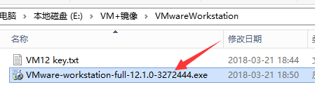

 

②进行下一步开始安装

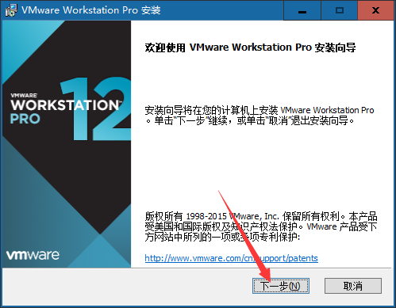

 

③同意许可协议

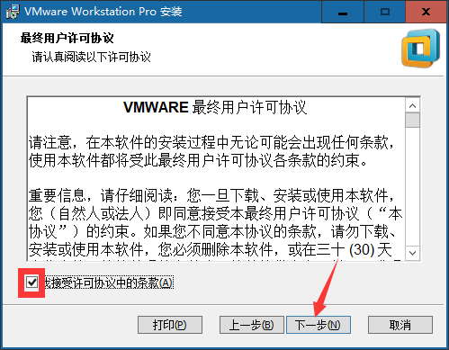

 

④根据需要决定是否需要更改软件的安装位置

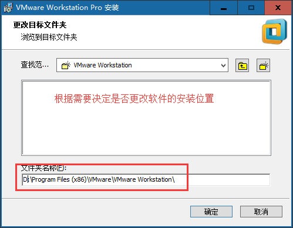

点击下一步：

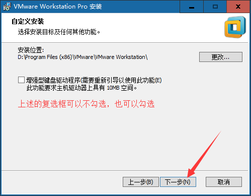

 

⑤用户体验设置

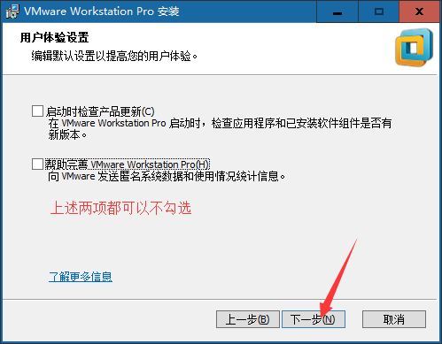

 

⑥快捷方式创建的步骤

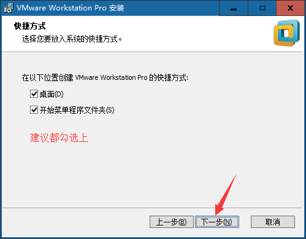

 

⑦点击安装按钮

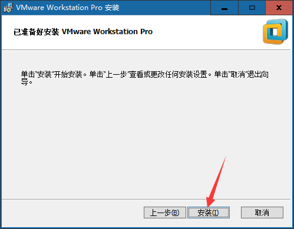

 

⑧点击完成

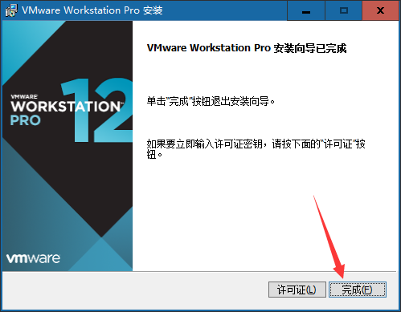

 

⑨**最重要的地方，在安装完之后需要检查，检查虚拟机软件是否有安装2个虚拟网卡**

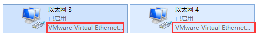

**如果没有这2个网卡的话，则会影响后期windows系统与虚拟机其中操作系统之间的相互通信（比如共享网络、文件传输等）。**

### 3.2、Virtual Box的安装

①运行安装程序

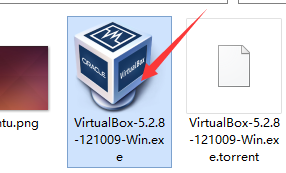

 

②点击下一步


 

③选择性更改安装的位置

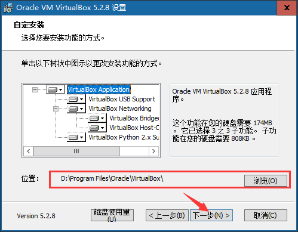

 

④安装的选项设置

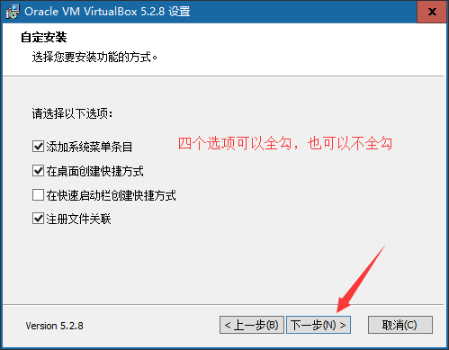

 

⑤断网警告，点击是即可

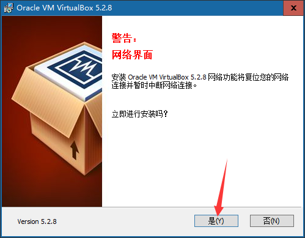

 

⑤点击安装按钮

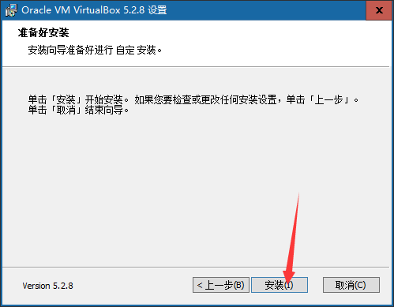

 

⑥完成

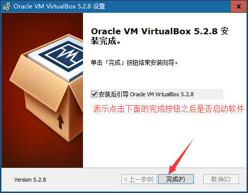

 

**⑦检查是否有对应的虚拟网卡存在**


 

两个软件安装完成之后在桌面上都有对应的快捷方式

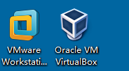

 

## 4、Linux版本的选择

版本选择：CentOS 6.5  【镜像一般都是xxx.iso文件】

**问题：为什么不选择最新版的7.x版本？**

6.x目前依然是主流

6.x的各种系统操作模式是基础

7.x实际上也支持大多数6.x的操作形式

 

官网：https://www.centos.org/

从官网下载得到的镜像文件

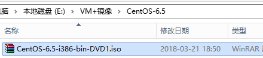

## 5、新建虚拟机

### 5.1、使用VMware Workstation（重点）

①点击“文件”菜单，选择“新建虚拟机…”选项，选择“自定义”点击下一步

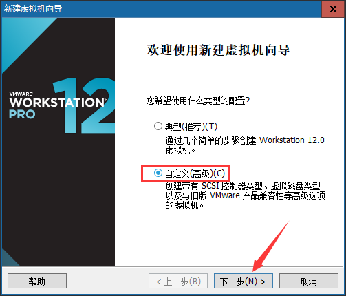

 

②选择兼容性，默认即可，直接下一步

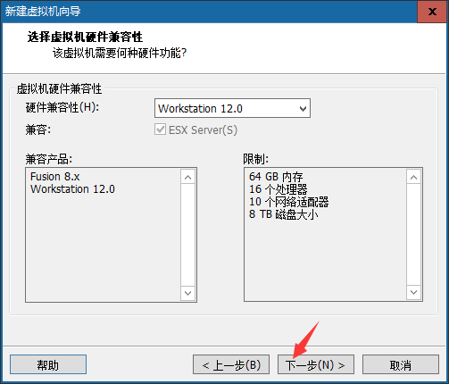

 

③选择镜像文件的时候选择“稍后….”，点击下一步

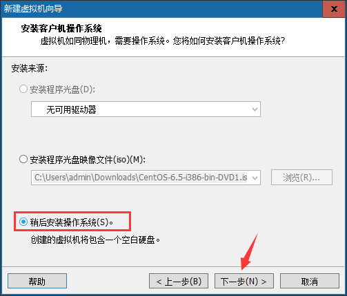

④选择需要安装的操作系统

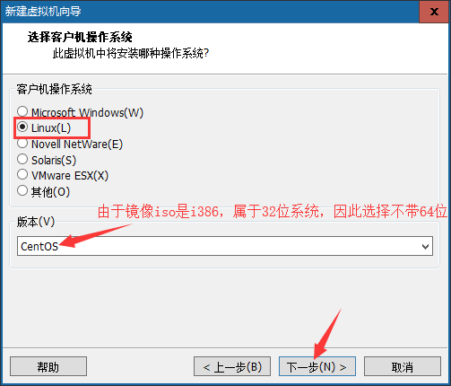

 

⑤选择虚拟机的名称（名称将会后期出现在左侧）和设置虚拟系统的安装位置

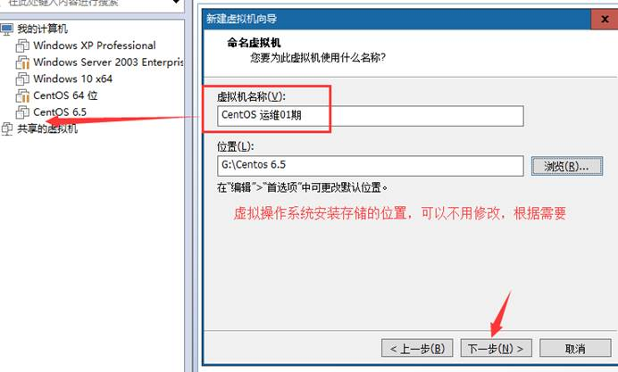

⑥cpu设置


 

⑦分配内存

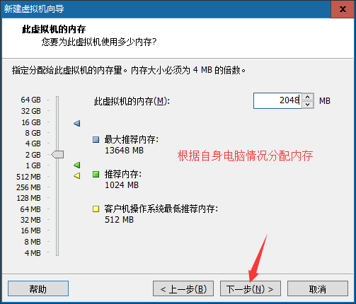

⑧选择网络类型，选择nat即可

NAT：配置好之后windows即可和虚拟机进行互相通信，但是教室内的其他同学是访问不了的，只能自己可以访问虚拟机中的操作系统；

桥接：配置好之后其他同学也可以访问你的虚拟机操作系统；

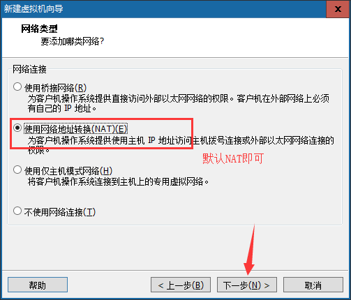

 

⑨后续默认的步骤，直接下一步

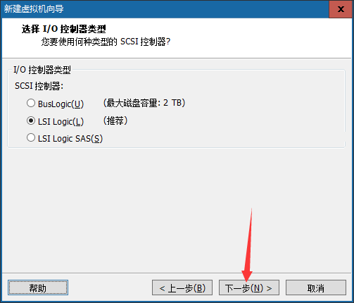

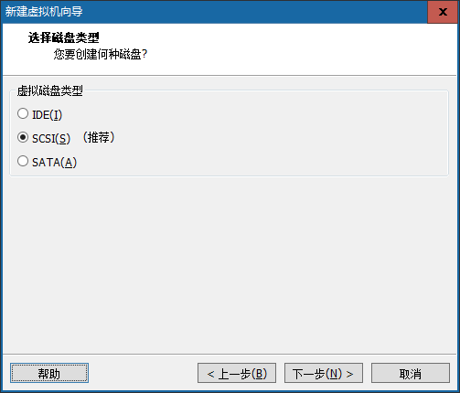

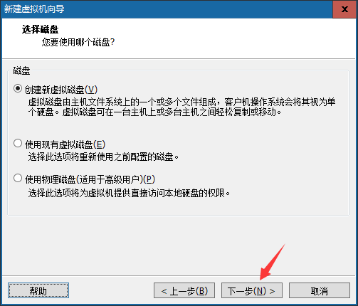

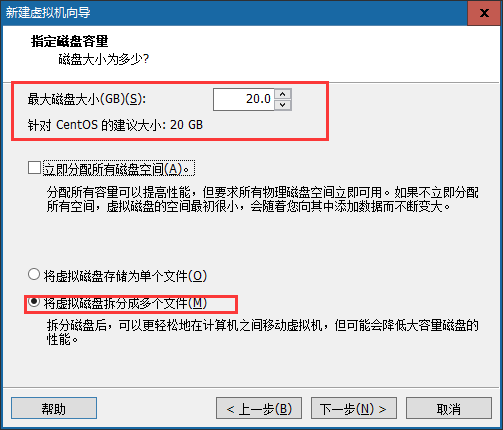

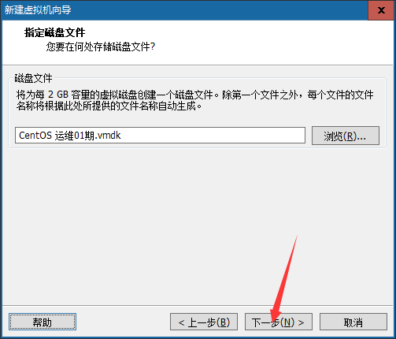

 

⑩点击完成

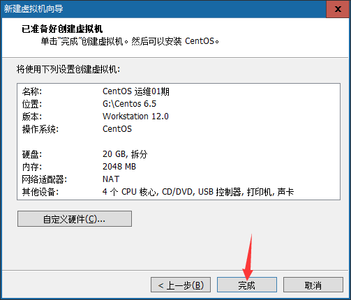

### 5.2、使用Virtual Box（了解）

①点击左上角的新建按钮

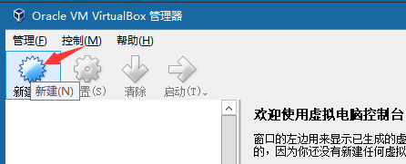

 

②选择操作系统，由于centos在列表中是没有的，所以选择centos对应的主线redhat 32位

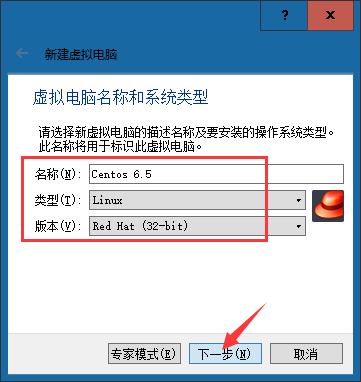

 

③选择内存大小

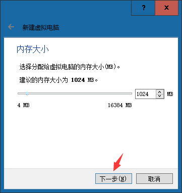

 

④创建磁盘，默认即可

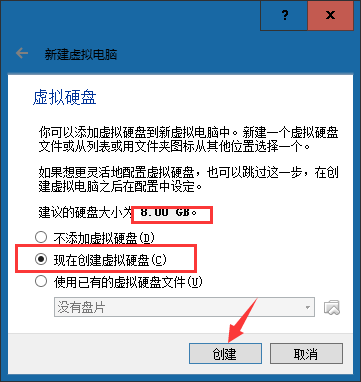

 

⑤选择磁盘类型，默认即可

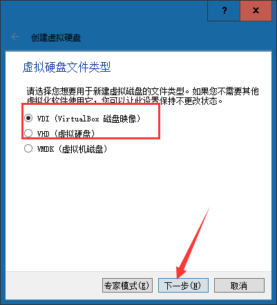

 

⑥选择磁盘大小的分配方式，方式为动态分配即可

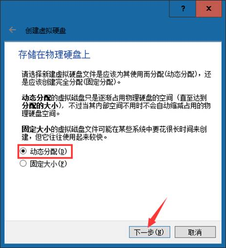

⑦设置磁盘的位置和大小确认

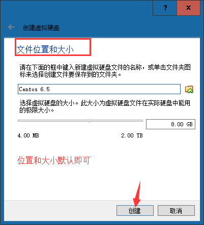

 

## 6、Linux操作系统安装

### 6.1、使用VMware workstation进行安装

a. 由于之前没有指定iso镜像文件，因此此处需要先指定系统镜像文件

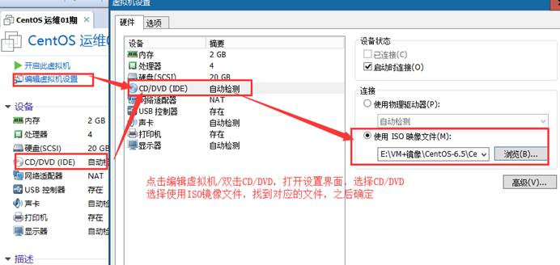

b. 运行此虚拟机

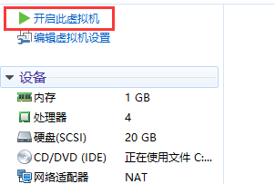

**注意：如果开机之后鼠标点进去虚拟机出不来，则可以按下组合快捷键“ctrl+alt****”。**

 

如果启动之后出现类似提示框（不是错误框）则勾选不再提示，并且确定即可：

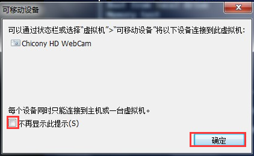

 

如果在启动时候出现下述错误，则说明电脑没有开启cpu的 虚拟化，如果需要开启，则需要重启计算机，并且在开启的时候进入主板的BIOS设置开启虚拟化，然后保存设置重启电脑：

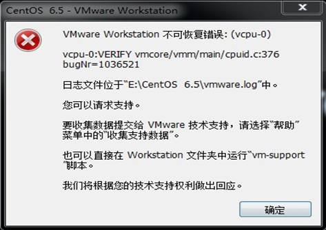

c. 选择升级/安装已经存在的系统（通过↑/↓方向键）按下回车

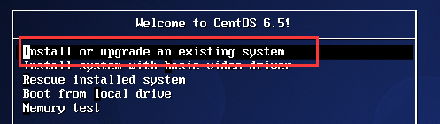

 

d. 在检测到光盘（disc）之后选择跳过完整性检测直接进行安装

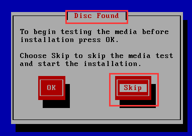

随后提示不支持的硬件，忽略直接下一步

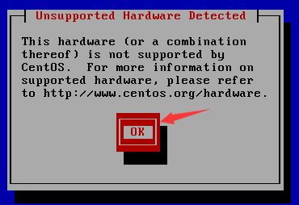

 

e. 点击下一步

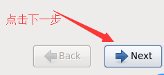

 

f. 选择在安装过程中使用的语言

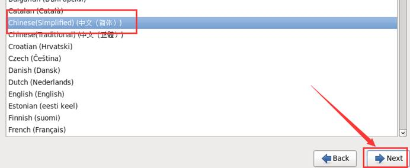

 

g. 选择键盘类型，美国式英语

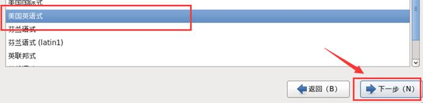

 

h. 选择存储设备类型

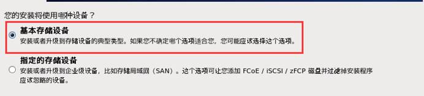

 

i. 对磁盘进行空白盘的初始化操作，选择“是，忽略所有的数据”

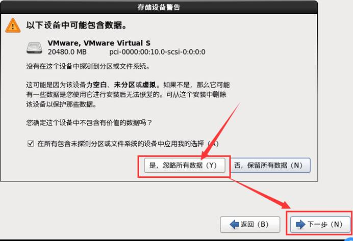

 

j. 设置网卡自动连接，依次应用 – 关闭 – 下一步


k. 设置时区，默认亚洲/上海


 

l. 设置密码，设置好了之后下一步


 

m. 使用全部的磁盘空间来安装Linux系统，点击下一步


 

n. 选择安装的Linux类型


 

o. 选择开发 – 开发工具，**前面复选框√，点击下一步**


 

p. 等待软件包的安装


等待完成，点击重新引导


 

q. 重新引导之后点击“前进”


 

r. 在协议许可界面选择同意，然后点击前进


 

s. 创建普通用户帐号（可选），然后点击前进


 

t. 时间设置，设置好之后前进


 

u. 关于kdump，之后点击完成


 

 

v. 登录界面


如果需要使用非列出的用户进行登录则点击其他，否则双击列出的用户名即可，随后输入密码。

 

w. 使用root帐号登录之后的提示


 

x. 看到的桌面


### 6.2、使用virtual Box安装Linux（了解）

a. 选择需要安装的系统镜像


 

b. 启动虚拟机


**注意：如果鼠标在虚拟机中想退出到windows****，则需要按下ctrl+alt****组合键（空格右侧的）**

 

**c.** **后续全部操作按照上面6.1****章节中的步骤继续安装即可。**

## 7、终端

问题：在目前的桌面系统中，如果需要关机可以通过“系统”“关机”进行关机，那么后期服务器都是命令行模式的，届时这种方式将不好用，那会要怎么关机呢？


 

答：可以通过命令行方式进行关机。命令的输入需要在**终端**中进行输入。

 

所谓终端，其实类似于windows下cmd命令行模式。在终端中可以输入需要执行的一些指令，同样可以通过终端进行关机（注意：以后在工作中很少会去使用关机命令，会使用重启比较多）。

 

终端的形式：


 

终端组成部分：


 

**如何使用终端命令进行关机？**

在Linux中关机命令 有以下几个：shutdown -h now（正常关机）、halt（关闭内存）、init 0

 

## 8、使用VMware备份操作系统

在vm中备份方式有2种：快照、克隆。

**快照**：又称还原点，就是保存在拍快照时候的系统的状态（包含了所有的内容），在后期的时候随时可以恢复。【**侧重在于短期备份，需要频繁备份的时候可以使用快照，做快照的时候虚拟的操作系统一般处于开启状态**】

①在菜单“虚拟机”-“快照”-“拍摄快照”


输入相关信息，点击拍摄快照

 

②搞事情


 

③使用快照恢复搞事情之前的状态

路径：虚拟机 – 快照 – 快照管理器


恢复好之后的状态：


 

 

 

**克隆**：就是复制的意思。【**侧重长期备份，做克隆的时候是必须得关闭**】

路径：先关机 – 右键需要克隆的虚拟机 – 管理 – 克隆

 


 


上述的名称和位置与之前新建虚拟机的时候是一样的含义。

等待克隆完成


**克隆好的服务器相关密码帐号等信息与被克隆的系统一致。**

# 三、Linux系统的文件

## 1、文件与文件夹（目录）

什么是文件？

一般都是一个独立的东西，可以通过一些特定的工具进行打开，并且其中不能在包含除了文字以外的东西。例如：


 

什么是文件夹？

可以在其中包含其他文件的东西。


 

为什么先讲文件？

1:日常运维工作中，有近一半以上的工作内容 精力 其实都是对文件的操作。

2: Linux 本身也是一个基于文件形式表示的操作系统。

**Linux一切皆文件。**

①在windows是文件的，在Linux下同样也是文件；

②在windows不是文件的，在Linux下也是以文件的形式存储的；

 

日常学习中和日常工作中，对于文件的操作的都有哪些种类？

**创建文件、编辑文件、保存文件、关闭文件、重命名文件、删除文件、恢复文件。**

 

## 2、Linux系统的文件目录结构


目录结构：

Bin：全称binary，含义是二进制。该目录中存储的都是一些二进制文件，文件都是可以被运行的。

Dev：该目录中主要存放的是外接设备，例如盘、其他的光盘等。在其中的外接设备是不能直接被使用的，需要**挂载（类似windows下的分配盘符）**。

Etc：该目录主要存储一些配置文件。

Home：表示“家”，表示**除了root**用户以外其他用户的家目录，类似于windows下的User/用户目录。

Proc：process，表示进程，该目录中存储的是Linux运行时候的进程。

Root：该目录是root用户自己的家目录。

Sbin：全称super binary，该目录也是存储一些可以被执行的二进制文件，但是必须得有super权限的用户才能执行。

Tmp：表示“临时”的，当系统运行时候产生的临时文件会在这个目录存着。

Usr：存放的是用户自己安装的软件。类似于windows下的program files。

Var：存放的程序/系统的日志文件的目录。

Mnt：当外接设备需要挂载的时候，就需要挂载到mnt目录下。

# Linux的基本指令

# 一、指令与选项

什么是Linux的指令？

指在Linux终端（命令行）中输入的内容就称之为指令。


 

一个完整的指令的标准格式：Linux通用的格式

\#**指令主体****（空格） [****选项]****（空格） [****操作对象]**

一个指令可以包含多个选项

操作对象也可以是多个

 

例如：需要让张三同学帮忙去楼下小卖铺买一瓶农夫山泉水和清风餐巾纸，在这个指令中“买东西”是指令的主体，买的水和餐巾纸是操作的对象，农夫山泉、清风是操作的选项。

# 二、基础指令（重点）

## 1、ls指令

含义：ls （list）

 

**用法1****：#ls**

含义：列出当前工作目录下的所有文件/文件夹的名称


 

**用法2****：#ls** **路径**

含义：列出指定路径下的所有文件/文件夹的名称

关于路径（重要）：

路径可以分为两种：相对路径、绝对路径。

相对路径：相对首先得有一个参照物（一般就是当前的工作路径）；

​    相对路径的写法：在相对路径中通常会用到2个符号“./”【表示当前目录下】、“../”【上一级目录下】。

绝对路径：绝对路径不需要参照物，直接从根“/”开始寻找对应路径；


 

**用法3****：#ls** **选项** **路径**

含义：在列出指定路径下的文件/文件夹的名称，并以指定的格式进行显示。

常见的语法：

​     \#ls -l 路径

​     \#ls -la 路径

选项解释：

​     **-l****：表示list****，表示以详细列表的形式进行展示**

​     **-a****：表示显示所有的文件/****文件夹（包含了隐藏文件/****文件夹）**


上述列表中的第一列字符表示文档的类型，**其中“****-****”表示改行对应的文档类型为文件，“d****”表示文档类型为文件夹**。

 


**在Linux****中隐藏文档一般都是以“.****”开头。**

 

**用法4****：#ls -lh** **路径**

含义：列出指定路径下的所有文件/文件夹的名称，以列表的形式并且在显示文档大小的时候以**可读性较高的形式显示**

参数含义：


## 2、pwd指令

**用法：#pwd**      **（print working directory****，打印当前工作目录）**


## 3、cd指令

命令：#cd        （change directory，改变目录）

作用：用于切换当前的工作目录的

**语法：#cd** **路径**

 

案例：当前在“/”下，需要使用绝对路径切换到/usr/local。


 

案例：当前在/usr/local下，需要使用相对路径切换目录到home目录下的Linux123用户家目录中去。


 

补充：

在Linux中有一个特殊的符号“~”，表示当前用户的家目录。

切换的方式：#cd ~


 

## 4、mkdir指令

指令：mkdir  （make directory，创建目录）

语法1：**#mkdir** **路径** **【路径，可以是文件夹名称也可以是包含名称的一个完整路径】**

 

案例：在当前路径下创建出目录“yunweihenniux”


注意：ls列出的结果颜色说明，**其中蓝色的名称表示文件夹**，黑色的表示文件，**绿色的其权限为拥有所有权限**。

 

案例：在指定路径下创建出一个文件夹“yunweihenniux”


 

语法2：**#mkdir -p** **路径**

含义：**当一次性创建多层不存在的目录的时候**，添加-p参数，否则会报错


 

语法3：**#mkdir** **路径1** **路径2** **路径3 ….**  【表示一次性创建多个目录】


## 5、touch指令

指令：touch  

作用：创建文件

语法：**#touch** **文件路径**   【路径可以是直接的文件名也可以是路径】

 

案例：使用touch来在当前路径下创建一个文件，命名为Linux.txt


 

案例：使用touch来同时创建多个文件


 

案例：使用touch来在“Linux123”用户的家目录中创建文件，Linux.txt


 

## 6、cp指令

指令：cp     （copy，复制）

作用：复制文件/文件夹到指定的位置

语法：**#cp** **被复制的文档路径** **文档被复制到的路径**

 

案例：使用cp命令来复制一个文件


**注意：Linux****在复制过程中是可以重新对新位置的文件进行重命名的，但是如果不是必须的需要，则建议保持前后名称一致。**

 

案例：使用cp命令来复制一个文件夹

**注意：当使用cp****命令进行文件夹复制操作的时候需要添加选项“-r****”【-r****表示递归复制】，否则目录将被忽略**


## 7、mv指令

指令：mv  （move，移动，剪切）

作用：移动文档到新的位置

语法：**#mv** **需要移动的文档路径** **需要保存的位置路径**

 

确认：移动之后原始的文件还在不在原来的位置？原始文件是不在原始位置的

 

案例：使用mv命令移动一个文件


 

 

案例：使用mv命令移动一个文件夹


 

补充：在Linux中重命名的命令也是mv，语法和移动语法一样。


 

## 8、rm指令

指令：rm （remove，移除、删除）

作用：移除/删除文档

语法：#rm 选项 需要移除的文档路径

选项：

​     -f：force，强制删除，不提示是否删除

​     -r：表示递归

 

案例：删除一个文件


在删除的时候如果不带选项，会提示是否删除，如果需要确认则输入“y/yes”，否则输入“n/no”按下回车。

 

**注意：如果在删除的时候不想频繁的确认，则可以在指令中添加选项“-f****”，表示force****（强制）。**


 

案例：删除一个文件夹


**注意：删除一个目录的时候需要做递归删除，并且一般也不需要进行删除确认询问，所以移除目录的时候一般需要使用-rf****选项。**

 

案例：删除多个文档


 

案例：要删除一个目录下有公共特性的文档，例如都以Linux开头


其中*******称之为通配符，意思表示任意的字符，Linux\*****，则表示只要文件以Linux****开头，后续字符则不管**。

 

## 9、vim指令

指令：vim  （vim是一款文本编辑器）

语法：**#vim** **文件的路径**

作用：打开一个文件（可以不存在，也可以存在）

 

案例：使用vim来打开文件

 

退出打开的文件：在没有按下其他命令的时候，按下shift+英文冒号，输入q，按下回车即可


 

## 10、输出重定向

**一般命令的输出都会显示在终端中，有些时候需要将一些命令的执行结果想要保存到文件中进行后续的分析/****统计，则这时候需要使用到的输出重定向技术。**

 

\>：覆盖输出，会覆盖掉原先的文件内容

\>>：追加输出，不会覆盖原始文件内容，会在原始内容末尾继续添加

 

**语法：#****正常执行的指令 > / >>** **文件的路径**

注意：文件可以不存在，不存在则新建

 

案例：使用覆盖重定向，保存ls -la 的执行结果，保存到当前目录下的ls.txt


 

 

案例：使用追加重定向，保存ls -la的执行结果到ls.txt中


 

## 11、cat指令

**作用1****：cat****有直接打开一个文件的功能。**

**语法1****：#cat** **文件的路径**


 

**作用2****：cat****还可以对文件进行合并**

**语法2****：#cat** **待合并的文件路径1** **待合并的文件路径2 ….** **文件路径n >** **合并之后的文件路径**

例如，合并3个文件，并存到一个文件中【配合输出重定向使用】


# 三、进阶指令（重点）

## 1、df指令

作用：查看磁盘的空间

**语法：#df -h      -h****表示以可读性较高的形式展示大小**


## 2、free指令

作用：查看内存使用情况

**语法：#free -m  -m****表示以mb****为单位查看**


 

剩余的真实可以用的内存为1665mb。

Swap：用于临时内存，当系统真实内存不够用的时候可以临时使用磁盘空间来充当内存。

 

## 3、head指令

作用：查看一个文件的前n行，如果不指定n，则默认显示前10行。

**语法：#head -n** **文件路径**  **【n****表示数字】**


 

## 4、tail指令

作用1：查看一个文件的未n行，如果n不指定默认显示后10行

**语法：#tail -n** **文件的路径   n****同样表示数字**


 

作用2：可以通过tail指令来查看一个文件的动态变化内容【**变化的内容不能是用户手动增加的**】

**语法：#tail -f** **文件路径**

**该命令一般用于查看系统的日志比较多。**

 

## 5、less指令

作用：查看文件，以较少的内容进行输出，按下辅助功能键（数字+回车、**空格键**+上下方向键）查看更多

**语法：#less** **需要查看的文件路径**


在退出的只需要按下q键即可。

## 6、wc指令

作用：统计文件内容信息（包含行数、单词数、字节数）

语法：**#wc -lwc** **需要统计的文件路径**

​     **-l****：表示lines**，行数**

​     -w：表示words，单词数  依照空格来判断单词数量

​     -c：表示bytes，字节数


## 7、date指令（重点）

作用：表示操作时间日期（**读取**、设置）

语法1：#date             输出的形式：2018年 3月 24日 星期六 15:54:28

语法2：**#date +%F**   **（等价于#date “+%Y-%m-%d”** **）**   输出形式：2018-03-24

语法3：#date “+%F %T”  引号表示让“年月日与时分秒”成为一个不可分割的整体

​     **等价操作#date “+%Y-%m-%d %H:%M:%S”**

输出的形式：2018-03-24 16:01:00

 

语法4：获取之前或者之后的某个时间（备份）

\#date -d “**-**1 **day**” “+%Y-%m-%d %H:%M:%S”

 

符号的可选值：+（之后） 或者 - （之前）

单位的可选值：day（天）、month（月份）、year（年）

%F：表示完整的年月日

%T：表示完整的时分秒

%Y：表示四位年份

%m：表示两位月份（带前导0）

%d：表示日期（带前导0）

%H：表示小时（带前导0）

%M：表示分钟（带前导0）

%S：表示秒数（带前导0）

## 8、cal指令

**作用：用来操作日历的**

**语法1****：#cal**  **等价于 #cal -1**     直接输出当前月份的日历

**语法2****：#cal -3**           表示输出上一个月+本月+下个月的日历

**语法3****：#cal -y** **年份**         表示输出某一个年份的日历

 

## 9、clear/ctrl + L指令

作用：清除终端中已经存在的命令和结果（信息）。

**语法：clear**      **或者快捷键：ctrl + L**

 

需要注意的是，该命令并不是真的清除了之前的信息，而是把之前的信息的隐藏到了最上面，通过滚动条继续查看以前的信息。

## 10、管道（重要）

**管道符：**

作用：管道一般可以用于“**过滤**”，“特殊”，“扩展处理”。

语法：管道不能单独使用，必须需要配合前面所讲的一些指令来一起使用，其作用**主要是辅助作用**。

 

**①过滤**案例（**100%****使用**）：需要通过管道查询出根目录下包含“y”字母的文档名称。

\#ls | grep y

针对上面这个命令说明：

①以管道作为分界线，前面的命令有个输出，后面需要先输入，然后再过滤，最后再输出，通俗的讲就是管道前面的输出就是后面指令的输入；

 

②grep指令：主要用于过滤

 

②特殊用法案例：通过管道的操作方法来实现less的等价效果（了解）

之前通过less查看一个文件，可以#less 路径

现在通过管道还可以这么：#cat 路径|less

 

③扩展处理：请使用学过的命令，来统计某个目录下的文档的总个数？

**答：#ls  | wc -l**

 

 

# Linux的基本指令（2）

# 一、高级指令

## 1、hostname指令

作用：操作服务器的**主机名**（**读取**、设置）

语法1：#hostname            含义：表示输出完整的主机名

**语法2：#hostname -f             **含义：表示输出当前主机名中的FQDN**（全限定**域名）

 


 

## 2、id指令

**作用：查看一个用户的一些基本信息（包含用户id****，用户组id****，附加组id…****），该指令如果不指定用户则默认当前用户。**

语法1：#id       默认显示当前执行该命令的用户的基本信息

语法2：#id 用户名       显示指定用户的基本信息


 

验证上述信息是否正确？

**验证用户信息：通过文件/etc/passwd**

**验证用户组信息：通过文件/etc/group**


## 3、whoami指令

**作用：“我是谁？”显示当前登录的用户名，一般用于shell****脚本，用于获取当前操作的用户名方便记录日志****。**

语法：#whoami


 

## 4、ps -ef指令（重点）

指令：ps 

作用：主要是查看服务器的进程信息

选项含义：

​     -e：等价于“-A”，表示列出全部的进程

​     -f：显示全部的列（显示全字段）

 

执行结果：


列的含义：

UID：该进程执行的用户id；

PID：进程id；

PPID：该进程的父级进程id，如果一个程序的父级进程找不到，该程序的进程称之为僵尸进程（parent process ID）；

C：Cpu的占用率，其形式是百分数；

STIME：进行的启动时间；

TTY：终端设备，发起该进程的设备识别符号，如果显示“?”则表示该进程并不是由终端设备发起；

TIME：进程的执行时间；

CMD：该进程的名称或者对应的路径；

 

案例：（100%使用的命令）在ps的结果中过滤出想要查看的进程状态

**#ps -ef|grep “****进程名称”**


 

再例如查看火狐浏览器的进程：


 

## 5、top指令（重点）

**作用：查看服务器的进程占的资源（100%****使用）**

语法：

​     进入命令：#top           （动态显示）

​     退出命令：按下q键

 

输出的结果：


表头含义：

PID：进程id；

USER：该进程对应的用户；

PR：优先级；

VIRT：虚拟内存；

RES：常驻内存；

SHR：共享内存；

​    计算一个进程实际使用的内存 = 常驻内存（RES）- 共享内存（SHR）

S：表示进程的状态status（sleeping，其中S表示睡眠，R表示运行）；

%CPU：表示CPU的占用百分比；

%MEM：表示内存的占用百分比；

TIME+：执行的时间；

COMMAND：进程的名称或者路径；

 

**在运行top****的时候，可以按下方便的快捷键：**

M：表示将结果按照内存（MEM）从高到低进行降序排列；

P：表示将结果按照CPU使用率从高到低进行降序排列；

1：当服务器拥有多个cpu的时候可以使用“1”快捷键来切换是否展示显示各个cpu的详细信息；

## 6、du -sh指令

作用：查看目录的真实大小

**语法：#du -sh** **目录路径**

选项含义：

​     -s：summaries，只显示汇总的大小

​     -h：表示以高可读性的形式进行显示

 

案例：统计“/root/yunweihenniux”目录的实际大小


 

案例：统计“/etc”目录实际大小


 

## 7、find指令

作用：用于查找文件（其参数有55个之多）

语法：**find** **路径范围** **选项** **选项的值**

选项：

​     -name：按照文档名称进行搜索（支持模糊搜索）

​     -type：按照文档的类型进行搜索

​         **文档类型：“-”表示文件（在使用find的时候需要用f来替换），“d表示文件夹**

案例：使用find来搜索httpd.conf

\#find /-name httpd.conf


 

案例：搜索etc目录下所有的conf后缀文件

\#find /etc -name *.conf

 


 

案例：使用find来搜索/etc/sane.d/目录下所有的**文件**

\#find /etc/sane.d/ -type f


 

案例：使用find来搜索/etc/目录下所有的**文件夹**

\#find /etc -type d


## 8、service指令（重点）

作用：用于控制一些软件的服务启动/停止/重启

**语法：#service** **服务名 start/stop/restart**

例如：需要启动本机安装的Apache（网站服务器软件），其服务名httpd

\#service httpd start


通过ps命令来检查httpd服务是否启动：


## 9、kill指令（重点）

**作用：表示杀死进程**      （当遇到僵尸进程或者出于某些原因需要关闭进程的时候）

语法：**#kill**  **进程PID**      （语法需要配合ps一起使用）

 

案例：需要kill掉Apache的进程


 

与kill命令作用相似但是比kill更加好用的杀死进程的命令：killall

语法：**#kill all** **进程名称**


 

## 10、ifconfig指令（重点）

**作用：用于操作网卡相关的指令。**

简单语法：#ifconfig        （获取网卡信息）


Eth0表示Linux中的一个网卡，eth0是其名称。Lo（**loop****，本地回还网卡，其ip****地址一般都是127.0.0.1**）也是一个网卡名称。


**注意：inet addr****就是网卡的ip****地址**。

 

## 11、reboot指令

作用：重新启动计算机         

**语法1****：#reboot**      **重启**

语法2：#reboot -w  模拟重启，但是不重启（只写关机与开机的日志信息）

 

## 12、shutdown指令

作用：关机           （慎用）

**语法1****：#shutdown -h now “****关机提示”** **或者  #shutdown -h 15:25 “****关机提示”**

案例：设置Linux系统关机时间在12:00


 

**如果想要取消关机计划的话，则可以按照以下方式去尝试：**

**①针对于centos7.x****之前的版本：ctrl+c**

**②针对于centos7.x****（包含）之后的版本：#shutdown -c**

 

除了shutdown关机以外，还有以下几个关机命令：

\#init 0

\#halt

\#poweroff

## 13、uptime指令

作用：输出计算机的持续在线时间（**计算机从开机到现在运行的时间**）

**语法：#uptime**


## 14、uname指令

作用：获取计算机操作系统相关信息

语法1：#uname           获取操作系统的类型

**语法2**：#uname -a       all，表示获取全部的系统信息（类型、全部主机名、内核版本、发布时间、开源计划）


## 15、netstat -tnlp指令

作用：查看网络连接状态

语法：#netstat -tnlp


选项说明：

​    -t：表示只列出tcp协议的连接；

​    -n：表示将地址从字母组合转化成ip地址，将协议转化成端口号来显示；

​    -l：表示过滤出“state（状态）”列中其值为LISTEN（监听）的连接；

​    -p：表示显示发起连接的进程pid和进程名称；

 

 

## 16、man指令

作用：manual，手册（包含了Linux中全部命令手册，英文）

语法：#man 命令         （退出按下q键）

 

案例：通过man命令查询cp指令的用法

\#man cp

 

 

# 二、练习题

1、如何通过命令行重启linux操作系统？  #reboot

2、**如何在命令行中快速删除光标前****/****后的内容？**  **前：****ctrl + u**  **后：****ctrl + k**

3、如何删除/tmp下所有A开头的文件？   #rm -f /tmp/A* 

4、系统重要文件需要备份，如何把/etc/passwd备份到/tmp目录下？

  \#cp /etc/passwd /tmp/

5、如何查看系统最后创建的3个用户？

  \#tail -3 /etc/passwd

6、什么命令可以统计当前系统中一共有多少账户？

  \#wc -l /etc/passwd    #cat /etc/passwd|wc -l

7、如何创建/tmp/test.conf文件？

  \#touch /tmp/test.conf

8、如何通过vim编辑打开/tmp/test.conf?

  \#vim /tmp/test.conf

9、如何查看/etc/passwd的头3行和尾3行？

  \#head -3 /etc/passwd

  \#tail -3 /etc/passwd

10、如何**一次性**创建目录/text/1/2/3/4？

  \#mkdir -p /text/1/2/3/4

11、如何最快的返回到当前账户的家目录？

  \#cd ~         #cd

12、如何查看/etc所占的磁盘空间？

  \#du -sh /etc

13、如何删除/tmp下所有的文件？

  \#rm -rf /tmp/*

14、尝试启动Apache的服务，并且检查是否启动成功。

  \#service httpd start

  \#ps -ef|grep httpd

15、使用已学命令杀死Apache的进程。

  \#killall httpd

 

# 编辑器之神——vim编辑器

# 一、vi介绍

Vi编辑器是所有Unix及Linux系统下标准的编辑器，类似于windows系统下的notepad（记事本）编辑器，由于在Unix及Linux系统的任何版本，Vi编辑器是完全相同的，因此可以在其他任何介绍vi的地方都能进一步了解它，Vi也是Linux中最基本的文本编辑器，学会它后，我们将在Linux的世界里畅行无阻，**尤其是在终端中**。

 

关于vim：

vi和vim都是Linux中的编辑器，不同的是，**vim****比较高级**，可以视为vi的升级版本。vi使用于文本编辑，但是vim更适用于coding（写代码的）。

 

**Vim**重点是光标的移动，模式切换，删除，查找，替换，复制，粘贴，撤销命令的使用**。

# 二、vim三种模式（重点）

Vim中存在三种模式（大众的认知）：**命令模式、编辑模式（输入模式）、末行模式（尾行模式）**。

命令模式：在该模式下是不能对文件直接编辑，可以输入快捷键进行一些操作（删除行，复制行，移动光标，粘贴等等）【打开文件之后默认进入的模式】；

编辑模式：在该模式下可以对文件的内容进行编辑；

末行模式：可以在末行输入命令来对文件进行操作（搜索、替换、保存、退出、撤销、高亮等等）；

Vim的打开文件的方式（4种，要求掌握的就前三种）：

\#vim 文件路径                     作用：打开指定的文件

\#vim +数字  文件的路径          作用：打开指定的文件，并且将光标移动到指定行

\#vim +/关键词  文件的路径       作用：打开指定的文件，并且高亮显示关键词

\#vim 文件路径1 文件路径2 文件路径3  作用：同时打开多个文件

 

**重点：先复制出一个/etc/passwd****文件，复制当前家目录下（千万不要在etc****下直接修改！！！****）**


后续一切vim命令都是基于/root/passwd文件进行操作。

 

**退出方式：输入:q****按下回车即可**


# 三、命令模式

注意：该模式是打开文件的第一个看到的模式（打开文件即可进入）

## 1、光标移动

①光标移动到行首

按键：shift + 6 或 ^（T字母上面的6，不要按小键盘的6）

 

②光标移动到行尾

按键：shift + 4 或 $（R字母的左上角的4，不是小键盘的4）

 

③光标移动到首行

按键：gg

 

④光标移动到末行

按键：G

 

⑤翻屏

向上翻屏：按键ctrl + b  （before）    或       PgUp

向下翻屏：按键ctrl + f   （after）      或       PgDn

## 2、复制操作

①复制光标所在行

按键：yy

粘贴：在想要粘贴的地方按下p键

 

**②以光标所在行为准（包含当前行），向下复制指定的行数**

按键：数字yy

 

③**可视化**复制

按键：ctrl + v（可视块）或V（可视行）或v（可视），然后按下↑↓←→方向键来选中需要复制的区块，按下y键进行复制，最后按下p键粘贴

## 3、剪切/删除

**①剪切/****删除光标所在行**

按键：dd             （删除之后下一行上移）

注意：dd严格意义上说是剪切命令，但是如果剪切了不粘贴就是删除的效果。

 

**②剪切/****删除光标所在行为准（包含当前行），向下删除/****剪切指定的行**

按键：数字dd        （删除之后下一行上移）

 

③剪切/删除光标所在的当前行之后的内容，但是删除之后下一行不上移

按键：D              （删除之后当前行会变成空白行）

 

④可视化删除

按键：ctrl + v（可视块）或V（可视行）或v（可视），上下左右移动，按下D表示删除选中行，d表示删选中块

 

## 4、撤销/恢复

撤销：输入:u （不属于命令模式） 或者  u             （undo）

恢复：ctrl + r          恢复（取消）之前的撤销操作

 

## 5、扩展1：光标的快速移动

**①快速将光标移动到指定的行**

按键：数字G  

 

**②以当前光标为准向上/****向下移动n****行**

按键：数字↑，数字↓

 

③以当前光标为准向左/向右移动n字符

按键：数字←，数字→

 

④末行模式下的快速移动方式：移动到指定的行

按键：输入英文“:”，其后输入行数数字，按下回车

 

 

# 四、模式间的切换（重点）


# 五、末行模式

进入方式：由命令模式进入，按下“:”或者“/（表示查找）”即可进入

退出方式：

​         a. 按下esc

​         b. 连按2次esc键

​         c. 删除末行全部输入字符

 

①保存操作（write）

输入：“:w”              保存文件

输入：“:w 路径”        另存为

 

②退出（quit）

输入：“:q”               退出文件

 

③保存并退出

输入：“:wq”             保存并且退出

 

④强制 （!）

输入：“:q!”              表示强制退出，刚才做的修改操作不做保存

 

⑤调用外部命令（了解）

输入：“:!外部命令”

例如：


当外部命令执行结束之后按下任意键回到vim编辑器打开的内容


 

⑥搜索/查找

输入：“/关键词”

例如：我想在passwd文件中搜索“sbin”关键词


**在搜索结果中切换上/****下一个结果：N/n**      **（next****）**

如果需要取消高亮，则需要输入：“:nohl”【no highlight】

 

⑦替换

:s/搜索的关键词/新的内容              替换光标所在行的第一处符合条件的内容

:s/搜索的关键词/新的内容/g            替换光标所在行的全部符合条件的内容

:%s/搜索的关键词/新的内容             替换整个文档中每行第一个符合条件的内容

:%s/搜索的关键词/新的内容/g           替换整个文档的符合条件的内容

 

%表示整个文件

g表示全局（global）

 

⑧显示行号（临时）

输入：“***:set nu\***”[number]

如果想取消显示，则输入：“:set nonu”

 

⑨扩展2：使用vim同时打开多个文件，在末行模式下进行切换文件

**查看当前已经打开的文件名称：“:files****”**


在%a的位置有2种显示可能

%a：a=active，表示当前正在打开的文件；

\#：表示上一个打开的文件

 

切换文件的方式：

**a.** **如果需要指定切换文件的名称，则可以输入：“:open** **已经打开的文件名”**


 

**b.** **可以通过其他命令来切换上一个文件/****下一个文件**

输入：“:bn”切换到下一个文件（back next）

输入：“:bp”切换到上一个文件（back prev）

 

# 六、编辑模式


重点看前2个进入方式：i（insert）、a（after）。

退出方式：按下esc键

# 七、实用功能

## 1、代码着色


案例：首先创建简单的c语言程序


如何控制着色显示与否？

显示：“:syntax on”            syn

tax：语法

关闭显示：“:syntax off”

 

## 2、vim中计算器的使用

当在编辑文件的时候突然需要使用计算器去计算一些公式，则此时需要用计算器，但是需要退出，vim自身集成了一个简易的计算器。

 

a. 进入编辑模式

b. 按下按键“ctrl + R”，然后输入“=”，此时光标会变到最后一行

c. 输入需要计算的内容，按下回车


# 八、扩展

## 1、vim的配置（重点）

Vim是一款编辑器，编辑器也是有配置文件的。

Vim配置有三种情况：

​     a. 在文件打开的时候在末行模式下输入的配置（临时的）

​     b. 个人配置文件（~/.vimrc，如果没有可以自行新建）

​     c. 全局配置文件（vim自带，/etc/vimrc）

 

①新建好个人配置文件之后进入编辑

 

②在配置文件中进行配置

比如显示行号：set nu


配置好之后vim打开文件就会永远显示行号

 

 

**问题：如果某个配置项，在个人配置文件与全局配置文件产生冲突的时候应该以谁为准？**

测试步骤：在两个配置文件中针对同一个配置项设置不同的值

 

①先在全局的配置中设置不显示行号，在个人的配置文件中设置显示行号，观察结果

最后显示行号：说明以个人为准

 

②先在全局中配置显示行号，在个人中设置不显示行号，观察结果

最后的显示是不显示行号，说明以个人为准

 

结论：**如果针对同一个配置项，个人配置文件中存在，则以个人配置文件为准，如果个人配置文件中不存在这一项，则以全局配置文件为准**。

 

## 2、异常退出

什么是异常退出：在编辑文件之后并没有正常的去wq（保存退出），而是遇到突然关闭终端或者断电的情况，则会显示下面的效果，这个情况称之为异常退出：


 

解决办法：将交换文件（在编程过程中产生的临时文件）删除掉即可

\#rm -f .passwd.swp


 

 

## 3、别名机制（实用）

作用：相当于创建一些属于自己的自定义命令

 

例如：在windows下有cls命令，在Linux下可能因为没有这个命令而不习惯清屏。现在可以通过别名机制来解决这个问题，可以自己创造出cls命令

 

别名机制依靠一个别名映射文件：~/.bashrc

\#vim ~/.bashrc


 

**注意：如果想新创造的命令生效，必须要重新登录当前用户。**

## 4、退出方式

回顾：之前vim中退出编辑的文件可以使用“:q”或者“:wq”。

 

**除了上面的这个语法之外，vim****还支持另外一个保存退出方法“:x****”。**

 

说明：

​     ①“:x”在文件没有修改的情况下，表示直接退出，在文件修改的情况下表示保存并退出；

​     ②如果文件没有被修改，但是使用wq进行退出的话，则文件的修改时间会被更新；但是如果文件没有被修改，使用x进行退出的话，则文件修改时间不会被更新的；主要是会混淆用户对文件的修改时间的认定。

 

因此建议以后使用“:x”来进行对文件的保存退出。

**但是：不要使用X****，不要使用X****，不要使用X****，X****表示对文件进行加密操作。**

 

 

 

 

# 九、作业

1、参考作业文件“httpd-vhosts.conf”的描述；

2、使用别名机制，创建出一个快捷命令“kj”，要求实现按下“kj”回车之后能够实现：

​     统计出Apache的服务进程数量。

 

# Linux自有服务（1）

自有服务，即不需要用户独立去安装的软件的服务，而是当系统安装好之后就可以直接使用的服务（内置）。

# 一、运行模式

运行模式也可以称之为**运行级别**。

 

在linux中存在一个进程：init （initialize，初始化），进程id是1。

查看进程：#ps -ef|grep init


 

该进程存在一个对应的配置文件：inittab（**系统运行级别配置文件**，位置/etc/inittab）

 

文件的主要内容：


根据上述的描述，可以得知，Centos6.5中存在7中运行级别/模式。

0 — 表示关机级别（不要将默认的运行级别设置成这个值）

1 — 单用户模式

2 — 多用户模式，不带NFS（Network File Syetem）

3 — 多用户模式，完全的多用户模式（不带桌面的，纯命令行模式）

4 — 没有被使用的模式（被保留模式）

5 — X11，完整的图形化界面模式

6 — 表示重启级别（不要将默认的运行级别设置成这个值）

 

与该级别相关的几个命令：

\#init 0        表示关机

\#init 3        表示切换到不带桌面的模式

\#init 5        切换到图形界面

\#init 6        重启电脑

注意：init指令需要超级管理员的权限，普通用户无法执行。

 

**这些命令其实都是调用的init****进程，将数字（运行级别）传递给进程，进程去读配置文件执行对应的操作。**

 

①切换到纯命令行模式下（**临时切换，重启之后又恢复**）

\#init 3


切换之后需要输入用户名和密码，在**输入密码的时候没有“*********”提示输入，只要自己确认输入的密码没有错误，按下回车即可**。

 

②回到桌面模式

\#init 5

 

**③设置模式永久为命令行模式**


将/etc/inittab文件中的initdefault值设置成3，然后重启操作系统。

# 二、用户与用户组管理（重点）

Linux系统是一个多用户多任务的操作系统，任何一个要使用系统资源的用户，都必须首先向系统管理员申请一个账号，然后以这个账号的身份进入系统。

用户的账号一方面可以帮助系统管理员对使用系统的用户进行跟踪，并控制他们对系统资源的访问；另一方面也可以帮助用户组织文件，并为用户提供安全性保护。

每个用户账号都拥有一个惟一的用户名和各自的密码。

用户在登录时键入正确的用户名和密码后，就能够进入系统和自己的主目录。

要想实现用户账号的管理，要完成的工作主要有如下几个方面：

 

用户账号的添加、删除、修改以及用户密码的管理。

用户组的管理。

 

**注意三个文件：**

/etc/passwd               存储用户的关键信息

/etc/group                 存储用户组的关键信息

/etc/shadow               存储用户的密码信息

## 1、用户管理

①添加用户

常用语法：#useradd 选项 用户名

常用选项：

​     -g：表示指定用户的用户主组，选项的值可以是用户组的id，也可以是组名

​     -G：表示指定用户的用户附加组，选项的值可以是用户组的id，也可以是组名

​     -u：uid，用户的id（用户的标识符），**系统默认会从****500****之后按顺序分配uid**，如果不想使用系统分配的，可以通过该选项自定义【类似于腾讯QQ的自选靓号情况】

​     -c comment：添加注释

案例：创建用户zhangsan，不带任何选项


验证是否成功：

​     a. 验证/etc/passwd的最后一行，查看是否有zhangsan的信息；

​     b. 验证是否存在家目录（在Centos下创建好用户之后随之产生一个同名家目录）；

 

扩展：认识passwd文件


 

用户名:密码:用户ID:用户组ID:注释:家目录:解释器shell

 

用户名：创建新用户名称，后期登录的时候需要输入；

密码：此密码位置一般情况都是“x”，表示密码的占位；

用户ID：用户的识别符；

用户组ID：该用户所属的主组ID；

注释：解释该用户是做什么用的；

家目录：用户登录进入系统之后默认的位置；

解释器shell：等待用户进入系统之后，用户输入指令之后，该解释器会收集用户输入的指令，传递给内核处理；

 

**注意：在不添加选项的时候，执行useradd****之后会执行一系列的操作**

​     **a.** **创建同名的家目录；**

​     **b.** **创建同名的用户组；**

 

案例：添加选项，创建用户lisi，让lisi属于501主组，附加组500，自选靓号666。


**注意：查看用户的主组可以查看passwd****文件，查看附加组可以查看group****文件。**

 

②修改用户

常用语法：#usermod 选项 用户名

Usermod：user modify，用户修改

常用选项：

​     -g：表示指定用户的用户主组，选项的值可以是用户组的id，也可以是组名

​     -G：表示指定用户的用户附加组，选项的值可以是用户组的id，也可以是组名

​     -u：uid，用户的id（用户的标识符），**系统默认会从****500****之后按顺序分配uid**，如果不想使用系统分配的，可以通过该选项自定义【类似于腾讯QQ的自选靓号情况】

​     -l：修改用户名

 

案例：修改zhangsan用户主组为500，附加组改为501

\#usermod -g 500 -G 501 zhangsan

 

案例：修改zhangsan用户用户名，改为wangerma

**#usermod -l** **新的用户名** **旧的用户名**

\#usermod -l wangerma zhangsan

 

 

③设置密码

Linux不允许没有密码的用户登录到系统，因此前面创建的用户目前都处于锁定状态，需要设置密码之后才能登录计算机。

 

**常用语法：#passwd** **用户名**

案例：设置wangerma用户的密码


在设置密码的时候也是没有任何输入提示的，放心输入，确保两次输入的密码一致，按下回车即可。

 

也可以使用弱密码，但是不建议，否则会看到以下的提示：


 

设置密码之后shadow文件中的体现：能够看出lisi用户没有密码的。


 

在设置用户密码之后可以登录帐号，例如此处需要登录wangerma

切换用户命令：#su [用户名]   （switch user）

如果用户名不指定则表示切换到root用户。


切换用户需要注意的事项：

​    a. 从root往普通用户切换不需要密码，但是反之则需要root密码；

​    b. 切换用户之后前后的工作路径是不变的；

​    c. 普通用户没有办法访问root用户家目录，但是反之则可以；

 

④删除用户

常用语法：#userdel 选项 用户名

Userdel：user delete（用户删除）

常用选项：

​     -r：表示删除用户的同时，删除其家目录；

案例：删除wangerma用户


**注意：已经登录的wangerma****用户删除的时候提示删除失败，但是没有登录的lisi****用户可以正常删除**。

 

解决办法：简单粗暴，kill对应用户的全部进程


 

提示：所有跟用户操作的命令（除passwd外）只有root超级管理员有权限执行。

## 2、用户组管理

每个用户都有一个用户组，系统可以对一个用户组中的所有用户进行集中管理。不同Linux 系统对用户组的规定有所不同，如Linux下的用户属于与它同名的用户组，**这个用户组在创建用户时同时创建**。

用户组的管理涉及用户组的**添加、删除和修改**。组的增加、删除和修改实际上就是对/etc/group文件的更新。


文件结构：

**用户组名:****密码:****用户组ID:****组内用户名**

密码：X表示占位符，虽然用户组可以设置密码，但是绝大部分的情况下不设置密码；

组内用户名：表示附加组是该组的用户名称；

 

①用户组添加

常用语法：#groupadd 选项 用户组名

常用选项：

​     -g：类似用户添加里的“-u”，-g表示选择自己设置一个自定义的用户组ID数字，如果自己不指定，则默认从500之后递增；

 

案例：使用groupadd指令创建一个新的用户组，命名为Administrators


 

②用户组编辑

常用语法：#groupmod 选项 用户组名

常用选项：

​     -g：类似用户修改里的“-u”，-g表示选择自己设置一个自定义的用户组ID数字

​     -n：类似于用户修改“-l”，表示设置新的用户组的名称

案例：修改Administrators用户组，将组ID从502改成520，将名称改为admins


 

③用户组删除

常用语法：#groupdel 用户组名


 

注意：当如果需要删除一个组，但是**这个组是某个用户的主组时**，则不允许删除；如果确实需要删除，则先从组内移出所有用户。


 

# 三、网络设置

首先知道网卡配置文件位置：/etc/sysconfig/network-scripts


在目录中网卡的配置文件命名格式：ifcfg-网卡名称


ONBOOT：是否开机启动

BOOTPROTO：ip地址分配方式，DHCP表示动态主机分配协议

HWADDR：硬件地址，MAC地址

 

如果后续需要重启网卡怎么去操作呢？

**#service network restart**


 

在有的分支版本中可能没有service命令来快速操作服务，但是有一个共性的目录：/etc/init.d

这个目录中放着很对服务的快捷方式。

此处重启网卡命令还可以使用：

**#/etc/init.d/network restart**


 

**扩展1****：**如果修改网卡的配置文件，但是配置文件的目录层次很深，此时可以在浅的目录中创建一个快捷方式（软连接），方便以后去查找

**#ln -s** **原始文件的路径** **快捷方式的路径**


通过ls -l可以列出如下的效果：


其中，文件类型位置的“l”表示其类型为link（连接类型），后面的“->”指向的是原始文件路径。

 

**扩展2****：如何去重启单个网卡？**

停止某个网卡：#ifdown 网卡名

开启某个网卡：#ifup 网卡名

例如：需要停止-启动（重启）eth0网卡，则可以输入

\#ifdown eth0

\#ifup eth0

 

**提示：在实际工作的时候不要随意禁网卡。**

# 四、ssh服务（重点）

ssh（secure shell，安全外壳协议），该协议有2个常用的作用：**远程连接协议**、远程文件传输协议。

 

协议使用**端口**号：默认是22

可以是被修改的，如果需要修改，则需要修改ssh服务的配置文件：

\#/etc/ssh/ssh_config


端口号可以修改，但是得注意2个事项：

​     a. 注意范围，端口范围是从0-65535；

​     b. 不能使用别的服务已经占用的端口；

 

**服务启动/****停止/****重启**

\#service sshd start/stop/restart

\#/etc/init.d/sshd start/stop/restart


 

## 1、远程终端

终端工具主要帮助运维人员连接远程的服务器，常见终端工具有：Xshell、secureCRT、Putty等。以putty为例：

 

①获取服务器ip地址，可以通过ifconfig命令进行查看，然后顺手测试ip的连接相通性


 

②打开putty，输入相关的信息


 

③在弹出key确认的时候点击“是”，以后不会再提示


 

④输入登录信息


 

 

## 2、SSH服务文件传输

可视化的界面传输工具：Filezilla

安装好之后可以查看到桌面图标：


 

①选择“文件”- “站点管理器（Ctrl + S）”


②点击“文件”菜单下方的“▽”选择需要连接的服务器，连接好之后的效果


 

③从本地windows上传文件到linux中方式

支持直接拖拽文件，也可以右键本地需要上传的文件，然后点选“上传”即可


 

④下载linux文件到本地

支持服务器文件直接拖拽到本地，也可以在右侧窗口选择需要下载的文件，右键，点选“下载”。

 

 

**扩展3****：通过命令行工具来传输文件/****文件夹**

工具：PSCP.exe（必须通过cmd命令行打开），为了使用方便可以将其放到环境变量目录中

如果不清楚哪些路径是环境变量路径，只需要将其放到C:/Windows目录下即可。


 

用法：

​     **a. pscp** **选项** **用户名@linux****主机地址:****资源路径 windows****本地的地址** **（下载到win****）**

​     **b. pscp** **选项** **资源路径** **用户名@linux****主机地址:****远程路径**  **（上传到linux****）**

​     c. pscp 选项 -ls 用户名@linux主机地址 （列出远程路径下结构）

 

①下载到本地windows

要求将远程linux服务器下的/etc整个目录下载到本地E:\tmp下

\#pscp -r [root@192.168.21.128:/etc](mailto:root@192.168.21.128:/etc) E:\tmp

 

在CMD中输入之后输入密码


 

②上传文件到linux

将“E:\coursedocs\运维学科\北京运维01期\01-基础班\20180329_Linux自有服务”所有的内容传输到linux下root用户的家目录

\#pscp -r “E:\coursedocs\运维学科\北京运维01期\01-基础班\20180329_Linux自有服务” [root@192.168.21.128:/root](mailto:root@192.168.21.128:/root)


# 五、作业

1、能够分别使用Filezilla和PSCP工具传输给定文件到“/usr/src/data”目录下，如目录不存在则自行创建。

 

# Linux自有服务（2）

自有服务，即不需要用户独立去安装的软件的服务，而是当系统安装好之后就可以直接使用的服务（内置）。

# 一、设置主机名

回顾：

\#hostname

\#hostname -f      FQDN（全限定域名）

 

①临时设置主机名（立竿见影），需要切换用户使之生效

\#hostname 设置的主机名


 

②永久设置主机名（需要重启）

先找到一个文件

/etc/sysconfig/network      【主机名的配置文件】


修改其中的HOSTNAME为自己需要设置的永久主机名


 

**③修改linux****服务器的hosts****文件，将yunwei****指向本地（设置FQDN****）**

Hosts文件的位置：/etc/hosts


 

 

问题：不设置FQDN会怎么样？

​     ①很多开源服务器软件（例如Apache）则无法启动，或出现报错；

​     ②方便记忆，看到主机名对其作用有一个初步判断；

​     ③如果不设置则会影响本地的域名的解析（本地访问）；

# 二、chkconfig

作用：相当于windows下“安全卫士”、“电脑管家”之类的安全辅助工具**提供“开机启动项”的一个管理服务**。

 

在linux下不是所有的软件安装完成之后都有开机启动服务，有的可能需要自己去添加。除此之外还可以查看和删除。

 

①开机启动**服务查询**

\#chkconfig --list


其中0-6表示各个启动级别

例如：以httpd为例，其3级别为关闭（off），则表示其在3启动形式下默认开机不启动

5对应的也是关闭，则表示其在桌面环境下也是开机不启动。

 

再例如：kdump服务，在2，3，4，5的级别下默认开机启动的，其他级别下默认开机不启动

 

②删除服务

\#chkconfig --del 服务名

例如删除httpd服务


 

③添加开机启动服务

\#chkconfig --add 服务名             【必须要保证服务正常运行，才可以添加】


 

**④设置服务在某个级别下开机启动/****不启动【重点命令】**

**#chkconfig --level** **连在一起的启动级别** **服务名on/off**

 

案例：设置httpd服务在3，5级别下默认开机启动


 

案例：设置httpd服务在5的级别下默认开机不启动


# 三、ntp服务

作用：ntp主要是用于**对计算机的时间同步管理**操作。

 

时间是对服务器来说是很重要的，一般很多网站都需要读取服务器时间来记录相关信息，如果时间不准，则可能造成很大的影响。

 

例如：当前虚拟机里的linux时间就是不准确的


 

同时服务器时间方式有2个：**一次性同步（手动同步）、通过服务自动同步**。

 

 

上游的概念：


①一次性同步时间（简单）

**#ntpdate** **时间服务器的域名或ip****地址**

Ip地址查看可以访问：http://www.ntp.org.cn/pool.php


 

②设置时间同步服务

服务名：ntpd

启动ntpd服务

​     \#service ntpd start   或者  /etc/init.d/ntpd start


 

设置ntpd服务开机启动：

\# chkconfig --list|grep ntpd

\# chkconfig --level 35 ntpd on


# 四、防火墙服务

防火墙：**防范一些网络攻击**。有**软件防火墙**、硬件防火墙之分。


 

防火墙选择让请求通过，从而保证网络安全性。

 

**在当前的centos6.5****中防火墙有一个名称：iptables** 【7.x中默认使用的是firewalld】

 

①查看iptables是否开机启动


 

②iptables服务启动/重启/关闭

\#service iptables start/restart/stop

/etc/init.d/iptables start /restart/stop

 

**③查看iptables****的状态（规则）**

]# service iptables status

 

如果iptables没有启动，则提示服务没启动，如果已经启动，则显示防火墙的相关的规则信息


 

④查看规则的命令

\#iptables -L -n

含义：

​     -L：表示列出规则

​     -n：表示将单词表达形式改成数字形式显示

 

⑤简单设置防火墙规则

例如，需要允许80端口通过防火墙，则规则可以用以下的命令来设置

**#iptables -I INPUT -p tcp --dport 80 -j ACCEPT  #****允许访问80****端口**

Iptables：主命令

-I：表示将规则放到最前面

-A：add，添加规则（最后）

INPUT：进站请求【出站output】

-p：protocol，指定协议（icmp/tcp/udp）

--dport：指定端口号

-j：指定行为结果，允许（accept）/禁止（reject）/丢弃（drop）


添加完成之后需要保存操作：

**/etc/init.d/iptables save**


 

测试80端口访问：


 

# 五、rpm管理（重点）

作用：rpm的作用类似于windows上的电脑管家中“软件管理”、安全卫士里面“软件管家”等产品，主要作用是对linux服务器上的软件包进行对应管理操作，**管理分为：查询、卸载、安装**。

 

①查询某个软件的安装情况

**#rpm -qa|grep** **关键词**

选项：

​     -q：查询，query

​     -a：全部，all

 

案例：查询linux上是否安装firefox


 

案例：查询是否安装qq


②卸载某个软件

\#rpm -e 软件的名称


火狐卸载的时候是没有依赖关系的，所以可以直接卸载。

 

但是在卸载Apache的时候提示无法卸载：


当存在依赖关系的时候又不想去解决这个问题的时候可以：

\#rpm -e 软件包名 --nodeps


 

③软件的安装

要想装软件，和windows下一样，先得找到安装包。

​     软件包的获得方式：

​         a. 去官网去下载；

​         b. 不介意老版本的话，可以从光盘（或者镜像文件）中读取；

此处以光盘文件为例：

**查看块状设备的信息：**

\#lsblk  （list block devices）       查看块状设备的信息  


Name：名称

Size：设备大小

Type：类型

MountPoint：挂载点（类似windows下盘符）

 

**扩展：光盘的挂载和解挂**

a. 解挂操作

​     命令：umount

​     **语法：#umount** **当前设备的挂载点（路径）**


此时，相当于U盘在windows上已经被弹出了，但是没有拔下电脑USB接口。

 

b. 挂载光盘

​     命令：mount

​     **语法：#mount** **设备原始地址** **要挂载的位置路径**

设备原始地址：地址统一都在/dev下，然后根据大小确定具体name值，拼凑在一起组成原始地址，例如当前：“/dev/sr0”

要挂载的位置路径：挂载目录一般都在mnt下，也可以在mnt下建目录，此处以“/mnt/dvd”为例


 

**安装软件的命令：**

**#rpm -ivh** **软件包完整名称**

选项：

​     -i：install，安装

​     -v：显示进度条

​     -h：表示以“#”形式显示进度条


# 六、cron/crontab计划任务（重点）

作用：操作系统不可能24小时都有人在操作，有些时候想在指定的时间点去执行任务（例如：每天夜里2点去重新启动Apache），此时不可能真有人每天夜里2点去执行命令，此时可以交给计划任务程序去执行操作。

 

语法：#crontab 选项

​     常用选项：

​         **-l****：list****，列出指定用户的计划任务列表**

​         **-e****：edit****，编辑指定用户的计划任务列表**

​         -u：user，指定的用户名，如果不指定，则表示当前用户

​         -r：remove，删除指定用户的计划任务列表

 

①列出


 

**②编辑计划任务（重点）**

计划任务的规则语法格式，以行为单位，一行则为一个计划：

分 时 日 月 周 需要执行的命令

例如：如果想要每天的0点0分执行reboot指令，则可以写成

0 0 * * * reboot

 

**取值范围：**

分：0~59

时：0~23

日：1~31

月：1~12

周：0~7，0和7表示星期天

 

**四个符号：**

*：表示取值范围中的每一个数字

-：做连续区间表达式的，要想表示1~7，则可以写成：1-7

/：表示每多少个，例如：想每10分钟一次，则可以在分的位置写：*/10

,：表示多个取值，比如想在1点，2点6点执行，则可以在时的位置写：1,2,6

 

问题1：每月1、10、22日的4:45重启network服务

45 4 1,10,22 * * service network restart

 

问题2：每周六、周日的1:10重启network服务

10 1 * * 6,0  service network restart

 

问题3：每天18:00至23:00之间每隔30分钟重启network服务

*/30 18-23 * * *  service network restart

 

问题4：每隔两天的上午8点到11点的第3和第15分钟执行一次重启

3,15 8-11 */2 * *  reboot

 

 

案例：真实测试案例，每1分钟往root家目录中的RT.txt中输入当前的时间信息，为了看到效果使用追加输出

计划任务：*/1 *  *  *  * ls ~>> /root/RT.txt

 

 

**Crontab****权限问题：本身是任何用户都可以创建自己的计划任务**。

 

但是超级管理员可以通过配置来设置某些用户不允许设置计划任务 ：

配置文件位于（黑名单）：

​     /etc/cron.deny             里面写用户名，一行一个


 

 

还有一个配置文件：（白名单）

​     /etc/cron.allow        （本身不存在，自己创建）

 

 

**注意：白名单优先级高于黑名单，如果一个用户同时存在两个名单文件中，则会被默认允许创建计划任务。**

 

 

 

# Linux的权限管理操作 

**Linux****的权限操作与用户、用户组是兄弟操作。**

# 一、权限概述

总述：Linux系统一般将文件可存/取访问的身份分为3个类别：owner、group、others，且3种身份各有read、write、execute等权限。

## 1、权限介绍

什么是权限？

在多用户（可以不同时）计算机系统的管理中，权限是指某个特定的用户具有特定的系统资源使用权力，像是文件夹、特定系统指令的使用或存储量的限制。

 

在Linux中分别有读、写、执行权限：

读权限：

​    对于文件夹来说，读权限影响用户是否能够列出目录结构

​    对于文件来说，读权限影响用户是否可以查看文件内容

 

写权限：

​    对文件夹来说，写权限影响用户是否可以在文件夹下“创建/删除/复制到/移动到”文档

​    对于文件来说，写权限影响用户是否可以编辑文件内容

 

执行权限：

​    一般都是对于文件来说，特别脚本文件。

## 2、身份介绍

### Owner身份（文件所有者，默认为文档的创建者）

由于Linux是多用户、多任务的操作系统，因此可能常常有多人同时在某台主机上工作，但每个人均可在主机上设置文件的权限，让其成为个人的“私密文件”，即个人所有者。因为设置了适当的文件权限，除本人（文件所有者）之外的用户无法查看文件内容。

 

例如某个MM给你发了一封Email情书，你将情书转为文件之后存档在自己的主文件夹中。为了不让别人看到情书的内容，你就能利用所有者的身份去设置文件的适当权限，这样，即使你的情敌想偷看你的情书内容也是做不到的。

### Group身份（与文件所有者同组的用户）

与文件所有者同组最有用的功能就体现在**多个团队在同一台主机上开发资源的时候**。例如主机上有A、B两个团体，A中有a1,a2,a3三个成员，B中有b1,b2两个成员，这两个团体要共同完成一份报告F。由于设置了适当的权限，A、B团体中的成员都能互相修改对方的数据，但是团体C的成员则不能修改F的内容，甚至连查看的权限都没有。同时，团体的成员也能设置自己的私密文件，让团队的其它成员也读取不了文件数据。**在****Linux****中，每个账户支持多个用户组。如用户a1****、b1****即可属于A****用户组，也能属于B****用户组【主组和附加组】**。

### Others身份（其他人，相对于所有者）

这个是个相对概念。打个比方，大明、二明、小明一家三兄弟住在一间房，房产证上的登记者是大明（owner所有者），那么，大明一家就是一个用户组，这个组有大明、二明、小明三个成员；另外有个人叫张三，和他们三没有关系，那么这个张三就是其他人了。

同时，大明、二明、小明有各自的房间，三者虽然能自由进出各自的房间，但是小明不能让大明看到自己的情书、日记等，这就是文件所有者（用户）的意义。

### Root用户（超级用户）

在Linux中，还有一个神一样存在的用户，这就是root用户，因为在所有用户中它拥有最大的权限 ，所以管理着普通用户。

 

## 3、Linux的权限介绍

要设置权限，就需要知道文件的一些基本属性和权限的分配规则。在Linux中，ls命令常用来查看文件的属性，用于显示文件的文件名和相关属性。

\#ls -l 路径      【ls -l 等价于 ll】


标红的部分就是Linux的文档权限属性信息。

 

**Linux****中存在用户、用户组和其他人概念**，各自有不同的权限，对于一个文档来说，其权限具体分配如下：


十位字符表示含义：

第1位：表示文档类型，取值常见的有“d表示文件夹”、“-表示文件”、“l表示软连接”、“s表示套接字”等等；

第2-4位：表示文档所有者的权限情况，第2位表示读权限的情况，取值有r、-；第3位表示写权限的情况，w表示可写，-表示不可写，第4位表示执行权限的情况，取值有x、-。

第5-7位：表示与所有者同在一个组的用户的权限情况，第5位表示读权限的情况，取值有r、-；第6位表示写权限的情况，w表示可写，-表示不可写，第7位表示执行权限的情况，取值有x、-。

第8-10位：表示除了上面的前2部分的用户之外的其他用户的权限情况，第8位表示读权限的情况，取值有r、-；第9位表示写权限的情况，w表示可写，-表示不可写，第10位表示执行权限的情况，取值有x、-。

 

权限分配中,均是rwx的三个参数组合，**且位置顺序不会变化**。没有对应权限就用 – 代替。

 

**例如：以下一个文档权限是怎么样的？**


a. 其是文件夹类型

b. 所有者：拥有全部权限（读写执行）

c. 同组用户：可读、可执行

d. 其他用户：可读、可执行

# 二、权限设置

**语法：#chmod** **选项** **权限模式** **文档**

注意事项：

​     常用选项：

​             -R：递归设置权限 （当文档类型为文件夹的时候）

​     权限模式：就是该文档需要设置的权限信息

​     文档：可以是文件，也可以是文件夹，可以是相对路径也可以是绝对路径。

**注意点：如果想要给文档设置权限，操作者要么是root****用户，要么就是文档的所有者。**

## 1、字母形式


 

给谁设置：

​     u：表示所有者身份owner（user）

​     g：表示给所有者同组用户设置（group）

​     o：表示others，给其他用户设置权限

​     a：表示all，给所有人（包含ugo部分）设置权限

​         **如果在设置权限的时候不指定给谁设置，则默认给所有用户设置**

 

权限字符：

​     r：读

​     w：写

​     x：表示执行

​     -：表示没有权限

 

权限分配方式：

​     +：表示给具体的用户新增权限（相对当前）

​     -：表示删除用户的权限（相对当前）

​     =：表示将权限设置成具体的值（注重结果）【赋值】

 

**例如：需要给anaconda-ks.cfg****文件（-rw-------.****）设置权限，要求所有者拥有全部的权限，同组用户拥有读和执行权限，其他用户只读权限。**

答案：

①#chmod u+x,g+rx,o+r anaconda-ks.cfg


​     ②#chmod u=rwx,g=rx,o=r anaconda-ks.cfg


**提示：当文档拥有执行权限（任意部分），则其颜色在终端中是绿色。**

 

\#chmod ug=rwx 形式，如果有两部分权限一样则可以合在一起写的

 

**例如：如果anaconda-ks.cfg****文件什么权限都没有，可以使用root****用户设置所有人都有执行权限，则可以写成**

​     ①#chmod +x anaconda-ks.cfg

​     ②#chmod a=x anaconda-ks.cfg

​     ③#chmod a+x anaconda-ks.cfg

## 2、数字形式

经常会在一些技术性的网页上看到类似于**#chmod 777 a.txt**  这样的一个权限，这种形式称之为数字形式权限（777）。

 

**读：r    4**

**写：w        2**

**执行：x      1**

没有任何权限：0


 

例如：需要给anaconda-ks.cfg设置权限，权限要求所有者拥有全部权限，同组用户拥有读执行权限，其他用户只读。

**全部权限（u****）：读+****写+****执行=4+2+1=7**

**读和执行（g****）：读+****执行=4+1=5**

**读权限（o****）：读=4**

由上得知权限为：754

\#chmod 754 anaconda-ks.cfg


**面试题：用超级管理员设置文档的权限命令是#chmod -R 731 aaa****，请问这个命令有没有什么不合理的地方？**

拥有者：7=4+2+1=读+写+执行

同组用户：3=2+1=写+执行

其他用户：1=1=执行

 

注意：**在写权限的时候千万不要设置类似于上面的这种“奇葩权限”**。如果一个权限数字中但凡出现2与3的数字，则该权限有不合理的情况。

## 3、注意事项

使用root用户创建一个文件夹（/oo），权限默认，权限如下：


需要在oo目录下创建文件（oo/xx.txt），需要给777权限：


 

切换到test用户（不是文档所有者，也不是同组用户，属于other部分）：

 

问题1：test用户是否可以打开oo/xx.txt文件？【能打开】

问题2：test用户是否可以编辑oo/xx.txt文件？【可以】

问题3：test用户是否可以删除oo/xx.txt文件？【不可以，同样还不允许创建文件/文件夹、移动文件、重命名文件】


**在Linux****中，如果要删除一个文件，不是看文件有没有对应的权限，而是看文件所在的目录是否有写权限，如果有才可以删除**。

# 三、属主与属组设置

属主：所属的用户（文件的主人）

属组：所属的用户组


前面的那个root就是属主

后面的那个root就是属组

 

这两项信息在文档创建的时候会使用创建者的信息（用户名、用户所属的主组名称）。

 

如果有时候去删除某个用户，则该用户对应的文档的属主和属组信息就需要去修改。

## 1、chown（重点）

**作用：更改文档的所属用户**

语法：#chown -R username 文档路径

 

案例：将刚才root用户创建的oo目录，所有者更改为test

\#chown test oo/


## 2、chgrp（了解）

**作用：更改文档的所属用户组**

语法：#chgrp -R groupname 文档的路径

案例：将刚才root用户创建的oo目录，所有者更改为test，并且将所属用户组也改为test

\#chgrp test oo/


 

 

**思考，如何通过一个命令实现既可以更改所属的用户，也可以修改所属的用户组呢？**

答：可以实现的，通过chown命令

​    语法：#chown -R username:groupname  文档路径

 

案例：要求只使用chown指令，将oo目录的所属用户和用户组改回成root，并且包含其子目录


# 四、扩展（1）

 

问题：reboot、shutdown、init、halt、user管理，在普通用户身份上都是操作不了，但是有些特殊的情况下又需要有执行权限。又不可能让root用户把自己的密码告诉普通用户，这个问题该怎么解决？

 

**该问题是可以被解决的，可以使用sudo****（switch user do****）命令来进行权限设置。Sudo****可以让管理员（root****）事先定义某些特殊命令谁可以执行**。

 

默认sudo中是没有除root之外用户的规则，要想使用则先**配置**sudo。

 

**Sudo****配置文件：/etc/sudoers**


 

a. 配置sudo文件请使用“#visudo”，打开之后其使用方法和vim一致

  

b. 配置普通用户的权限


Root表示用户名，如果是用户组，则可以写成“%组名”

ALL：表示允许登录的主机（地址白名单）

(ALL)：表示以谁的身份执行，ALL表示root身份

ALL：表示当前用户可以执行的命令，多个命令可以使用“,”分割

 

**案例：本身test****用户不能添加用户，要求使用sudo****配置，将其设置为可以添加用户，并且可以修改密码（但是不能修改root****用户密码****）。**

注意：在写sudo规则的时候不建议写直接形式的命令，而是写命令的完整路径。

路径可以使用which命令来查看

语法：#which 指令名称


 

在添加好对应的规则之后就可以切换用户，切换到普通用户test，再去执行：


此时要想使用刚才的规则，则以以下命令进行：

**#sudo** **需要执行的指令**


 

**在输入sudo****指令之后需要输入当前的用户密码进行确认的操作（不是root****用户密码），输入之后在接下来5****分钟内再次执行sudo****指令不需要密码**。

 

特别注意：此处按照案例要求，不能让test用户修改root密码，因此规则还需要调整，不然其可以修改root密码的：

 

**禁止修改****root****密码的配置（****先允许全部，再拒绝****root****密码设置****）：** /usr/bin/passwd [A-Za-z]*, **!/usr/bin/passwd root**


 

补充：在普通用户下怎么查看自己具有哪些特殊权限呢？

**#sudo -l**


 

最后：sudo不是任何Linux分支都有的命令，常见centos与ubuntu都存在sudo命令。

 

**作业：给普通用户设置一个关机命令执行权限。**

# Linux的网络基础 

# 一、网络相关概述

## 1、网络发展

**信息传递**

n 远古时期，人们就通过简单的语言、壁画等方式交换信息

n 千百年来，人们一直在用语言、图符、钟鼓、烟火、竹简、纸书等传递信息

n 古代人的烽火狼烟、飞鸽传信、驿马邮递

n 现代社会中，交通警的指挥手语、航海中的旗语等

n 这些信息传递的基本方式都是依靠人的视觉与听觉

 

**电的产生**

n 1831年，法拉第制出了世界上最早的第一台发电机

n 1866年，德国人西门子（Siemens）制成世界上第一台大功率发电机

n 1837年，美国人塞缪乐·莫乐斯成功地研制出世界上第一台电磁式电报机

n 1844年5月24日，莫乐斯在国会大厦联邦最高法院会议厅进行了“用莫尔斯电码”发出了人类历史上的第一份电报，从而实现了长途电报通信

 

**网络诞生**

n 1957年，前苏联发射了第一颗人造卫星，震惊了美国

n 1958年美国成立了国防部**高级研究计划署**（ARPA，Advanced Research Projects Agency），应对冷战形势，ARPA是一个管理机构，没有实验室和科学家


n 1969年，ARPANET（阿帕网）开始联机，**因此****1969****年被称为Internet****元年**

 

**网络分类（记忆）**

n **局域网**（Local Area Network，**LAN**）是指范围在几百米到十几公里内办公楼群或校园内的计算机相互连接所构成的计算机网络。

n 城域网（Metropolitan Area Network，MAN）所采用的技术基本上与局域网相类似，只是规模上要大一些。城域网既可以覆盖相距不远的几栋办公楼，也可以覆盖一个城。

n **广域网**（Wide Area Network，**WAN**）通常跨接很大的物理范围，如一个国家。

 

除了上述的划分，**网络还可以按照所有者分**为公网、私网是两种Internet的接入方式。公网接入方式：上网的计算机得到的IP地址是Internet上的非保留地址，公网的计算机和Internet上的其他计算机可随意互相访问。私网则反之。

 

## 2、ip地址（重点记忆）

IP是英文Internet Protocol的缩写，意思是“网络之间互连的协议”，也就是为计算机网络相互连接进行通信而设计的**协议**。

 

**IP****地址类型分为：公有地址、私有地址。**

公有地址

公有地址（Public address）由Inter NIC（Internet Network Information Center因特网信息中心）负责。这些IP地址分配给注册并向Inter NIC提出申请的组织机构。通过它直接访问因特网。

 

**私有地址（重点）**

私有地址（Private address）属于**非注册地址**，专门为组织机构内部使用。以下列出留用的内部私有地址：

A类 10.0.0.0--10.255.255.255

B类 172.16.0.0--172.31.255.255

**C****类 192.168.0.0--192.168.255.255**

 

**IP****地址按类型可以分为三类：**

| 类别 | 最大网络数    | IP地址范围                | 最大主机数 | 私有IP地址范围              |
| ---- | ------------- | ------------------------- | ---------- | --------------------------- |
| A    | 126（2^7-2)   | 1.0.0.0-127.255.255.255   | 16777214   | 10.0.0.0-10.255.255.255     |
| B    | 16384(2^14)   | 128.0.0.0-191.255.255.255 | 65534      | 172.16.0.0-172.31.255.255   |
| C    | 2097152(2^21) | 192.0.0.0-223.255.255.255 | 254        | 192.168.0.0-192.168.255.255 |

 

 

网络运维相关技能：ip分类、**子网划分**、划分vlan、ACL、综合布线、各种Serve的搭建。

 

127.0.0.1         本机ip

 

## 3、网卡


网卡是一个网络组件，属于硬件范畴，主要负责计算机之间数据的**封装和解封**。

 

MAC地址：网卡的物理地址，网卡设备的编号，**默认**情况是全球唯一的（16进制）。


 

**与IP****地址的区别：**

n 长度不同。IP地址为32位，MAC地址为48位。

n 分配依据不同。

n **网络寻址方式不同**。OSI参考模型，ip地址是基于第三层工作（网络层），mac地址是第二层（数据链路层）

## 4、网线

网线是连接局域网必不可少的。在局域网中常见的网线主要有双绞线（RJ45接口）、铜轴电缆、光缆三种。

 


​         双绞线                        铜轴电缆                   光纤

 

 

## 5、交换机

交换机（Switch）意为“开关”，是一种用于电（光）信号转发的网络设备，交换机它可以为接入交换机的任意两个网络节点提供**独享**的电信号通路。


目前，交换机品牌比较有名的是：华为、华三（h3c）、思科、锐捷。

 

## 6、路由器

路由器（Router）又称网关设备（Gateway）是用于**连接多个逻辑上分开、相对独立的网络**。

       

 

 

 

## 7、拓扑结构图（扩展）

所谓“拓扑”就是把实体抽象成与其大小、形状无关的“点”，而把连接实体的线路抽象成“线”，进而以图的形式来表示这些点与线之间关系的方法，**其目的在于研究这些点、线之间的相连关系**。表示点和线之间关系的图被称为拓扑结构图。

常见的几种拓扑结构图：

 

  

          

         


# 二、网络相关命令

## 1、ping

**作用：检测当前主机与目标主机之间的连通性**（不是100%准确，有的服务器是禁ping）

语法：#ping 主机地址（ip地址、主机名、域名等）

 

例如：测试和baidu.com之间的连通性。


该命令可以跨平台，windows下也可以使用，语法一致。（区别在于Linux下默认一直发送，windows下默认发送4个数据包）


## 2、netstat

**作用：表示查看网络的连接信息**

语法：#netstat -tnlp      （-t：tcp协议，-n：将字母转化成数字，-l：列出状态为监听，-p：显示进程相关信息）

​      \#netstat -an       （-a：表示全部，-n：将字母转化为数字）

 

TCP/IP协议需要使用这个命令。

## 3、traceroute

**作用：查找当前主机与目标主机之间所有的网关**（路由器，会给沿途各个路由器发送icmp数据包，路由器可能会不给响应）。

该命令不是内置命令，需要安装，但是目前的已经安装好了（之前选了开发工具）。

语法：#traceroute 主机地址


 

类似于查看快递的跟踪路由：


扩展：在windows下也有类似的命令：tracert 主机地址


在线工具网址：http://tool.chinaz.com

 

## 4、arp

地址解析协议，即ARP（Address Resolution Protocol），是**根据****IP****地址获取（MAC****）物理地址的协议**。


**当一个主机发送数据时，首先查看本机MAC****地址缓存中有没有目标主机的MAC****地址，** **如果有就使用缓存中的结果；如果没有，ARP****协议就会发出一个广播包，该广播包要求查询目标主机IP****地址对应的MAC****地址，拥有该IP****地址的主机会发出回应，回应中包括了目标主机的MAC****地址，这样发送方就得到了目标主机的MAC****地址。如果目标主机不在本地子网中，则ARP****解析到的MAC****地址是默认网关的MAC****地址**。

 

常用语法：#arp -a     查看本地缓存mac表

​          \#arp -d 主机地址            删除指定的缓存记录


 

该命令在windows下同样适用。

 

 

 

 

## 5、tcpdump(了解)

作用：抓包，抓取数据表

常用语法：

​     \#tcpdump 协议 port 端口

​     \#tcpdump 协议 port 端口 host 地址

​     \#tcpdump -i 网卡设备名

 

查看22端口（ssh）的数据包：


00:09:17.xxxx          监听数据的时分秒

IP：使用的协议类型

192.168.21.1          数据包的一个方向（来自）

\>                     数据的流向

192.168.21.136        数据包的另外一个方向（到达）

# 三、项目上线流程（必须掌握）

## 1、服务器选配购买

项目上线服务器必须是外网服务器。

 

一般服务器有2种情况：购买真实服务器、**购买云服务器**。

 

购买真实服务器一次性成本过高，所以现在基本都是选择云服务器。

 

云服务的厂商：**阿里云**、腾讯云、知道创宇（加速乐）、华为云、盛大云、新浪云（sae）、亚马逊云等等。

以后以阿里云为例：

官网：http://www.aliyun.com

 

①打开阿里云官网，选择产品中的“云服务器ECS”


 

在页面上点击“立即购买”：


 

 

②选择具体的配置


安全组需要先在控制面板中创建，创建好之后才能在这里进行选择（安全组类似于防火墙，可以设置相关规则）：


 

进入后台查看信息：


 

需要重置密码的话，则可以选择右侧“更多”选择“重置密码”，然后重启服务器，最后可以通过远程终端连接服务器：


 

 

## 2、域名购买

①在首页产品中找到域名注册


 

域名注册得先查看是否可以注册：


 

选择需要的域名：


 

 

确认购买信息：


 


 

 

购买之后就可以在后台控制面板中去查看域名情况。

## 3、域名备案

备案：当申请域名的人要想在国内使用域名，则需要向当地的通信管理局（省级）去申请报备。

备案前提：想要使用境内服务器的话，则必须得备案。

 

在管理后台点击“ICP备案系统”


 

点击新增主体备案：


 

填写完基本信息之后点击增加网站：


备案服务号可以在控制台顶部去获取：


 

申请到备案服务号之后填写继续：


 

会让用户下载一个图片：网站真实性核验单

下载打印，填写好上传到阿里云备案系统中。

 

后面等待初审，初审通过之后继续下一步（初审时间一般1天即可）

 

拍照


 

上传照片

 

等待管局审核（到这个步骤基本是已经通过，审核周期一般是15个工作日）。

 

等待审核通过，就会收到工信部发送的短信与邮件通知，邮件中有备案号和备案密码（备案密码用于注销备案）。

## 4、域名解析

 

点击“解析”


解析：将域名绑定到一个服务器地址的操作

DNS：domain name server，用于将域名转化成ip地址的服务器。

 


点击右上角的添加记录：


 

选择记录：


 

例如：需要将[www.linux123.xyz](http://www.linux123.xyz)解析到之前购买的云主机上，则解析可以设置如下：


 

解析之后可以通过在线ping命令检测效果：


 

## 5、配置生产环境（最后1天）

## 6、上传代码

此时需要使用上传工具：pscp，filezilla。

 

和之前使用的方式一样。

 

# Shell基础 

# 一、关于shell

## 1、什么是shell

**什么是shell****？**

Shell（外壳） 是一个用 C 语言编写的程序，它是用户使用 Linux 的桥梁。**Shell** **既是一种命令语言**，**又是一种程序设计语言**。

Shell 是指一种应用程序，这个应用程序提供了一个界面，用户通过这个界面访问操作系统内核的服务。

 

**什么是脚本？**

脚本简单地说就是一条条的文字命令，这些文字命令是可以看到的（如可以用记事本打开查看、编辑）。

常见的脚本： **JavaScript****（JS****，前端）**，VBScript， **ASP****，JSP****，PHP****（后端）**，SQL（数据库操作语言），Perl，**Shell**，python，Ruby，JavaFX，Lua等。

 

**为什么要学习和使用shell****？**

Shell属于内置的脚本

程序开发的效率非常高，依赖于功能强大的命令可以迅速地完成开发任务（批处理）

语法简单，代码写起来比较轻松，简单易学

 

**常见的shell****种类？**

在linux中有很多类型的shell，不同的shell具备不同的功能，shell还决定了脚本中函数的语法，Linux中默认的shell是**/bin/bash****（重点）**，流行的shell有ash、bash、ksh、csh、zsh等，不同的shell都有自己的特点以及用途。

 

csh

C shell 使用的是“类C”语法,csh是具有C语言风格的一种shell，其内部命令有52个，较为庞大。目前使用的并不多，已经被/bin/tcsh所取代。

 

ksh

Korn shell 的语法与 Bourne shell 相同，同时具备了 C shell 的易用特点。许多安装脚本都使用 ksh ，ksh有42条内部命令，与bash相比有一定的限制性。

 

tcsh

tcsh是csh的增强版，与 C shell 完全兼容。

 

sh 

是一个快捷方式，已经被/bin/bash所取代。

 

nologin

指用户不能登录


 

zsh

目前Linux里最庞大的一种shell：zsh。它有84个内部命令，使用起来也比较复杂。一般情况下，不会使用该shell。

 

**bash**

**大多数Linux****系统默认使用的shell**，bash shell 是 Bourne shell 的一个免费版本，它是最早的 Unix shell，bash还有一个特点，可以通过help命令来查看帮助。包含的功能几乎可以涵盖shell所具有的功能，所以一般的shell脚本都会指定它为执行路径。

## 2、shell入门

编写规范：

代码规范：

​    \#!/bin/bash            [指定告知系统当前这个脚本要使用的shell解释器]

​    Shell相关指令

 

文件命名规范：

​    文件名.sh              .sh是linux下bash shell 的默认后缀

 

使用流程：

①创建.sh文件          touch/vim

②编写shell代码

③执行shell脚本        脚本必须得有执行权限

 

案例1：创建test.sh，实现第一个shell脚本程序，输出hello world.

输出命令：#echo 123

注意：输出的内容如果包含字母和符号（不包含变量），则需要用引号包括起来。如果是纯数字可以包也可以不包。


 

 


注意，这里在运行时一定要写成 ./test.sh，而不是 test.sh，运行其它二进制的程序也一样，直接写 test.sh，Linux 系统会去 PATH（环境变量） 里寻找有没有叫 test.sh 的，而只有 /bin, /sbin, /usr/bin，/usr/sbin 等在 PATH 里，你的当前目录通常不在 PATH 里，所以写成 test.sh 是会找不到命令的，要用 ./test.sh 告诉系统说，就在当前目录找。

 

案例2：使用root用户帐号创建并执行test2.sh，实现创建一个shelltest用户，并在其家目录中新建文件try.html。


 

脚本执行的另外一个方式：/bin/bash 脚本的路径（了解）


 

Shell脚本分为简单的写法（简单命令的堆积）和复杂写法（程序的设计）

# 二、shell进阶（重点）

## 1、变量（重点）

### 1.1、变量的含义

a. 什么是量

量就是数据.

b. 什么是变量

数据可以发生改变就是变量.

**在一个脚本周期内,****其值可以发生改变的量就是变量.**

c. 什么叫做一个脚本周期

一个脚本周期我们可以简单的理解为当前的shell文件

 

变量是shell中不可或缺的一部分，也是**最基础、最重要**的组成部分。

 

### 1.2、变量的定义与使用（重点）

变量，先定义后使用。

 

**定义形如：class_name="yunwe "**

**使用形如：echo $class_name**

 

变量就是由2部分组成,一个是变量名（左边），另外一部分是变量的值（右边）

变量名和变量值是什么关系??

变量名和变量值是**使用和被使用**关系; 我们的变量名来使用变量值;

 

在使用变量的时候一定需要在变量名前面添加一个$符号，该要求在其他语言中也存在的（例如php）。

 

变量名的规范

注意，变量名后面的等号左右不能有空格，这可能和你熟悉的所有编程语言都不一样。同时，变量名的命名须遵循如下规则：

命名只能使用英文字母，数字和下划线，首个字符不能以数字开头。

中间不能有空格，可以使用下划线“_”。

不能使用标点符号。

不能使用bash里的关键字（可用help命令查看保留关键字）。

 

```
问题：以下哪个shell变量名是合法的？
A. var        B.?var       C. user*name       D.echo
```

 

案例1：使用变量改写入门脚本中的第1个shell脚本。


 

**关于单双引号的问题：**

**双引号能够识别变量，双引号能够实现转义（类似于“\*****”）**

**单引号是不能识别变量，只会原样输出，单引号是不能转义的**

 

案例2：定义一个变量，输出当前时间，要求格式为“年-月-日 时:分:秒”。


**注意：反引号（esc****键下方的那个键），当在脚本中需要执行一些指令并且将执行的结果赋给变量的时候需要使用“反引号”。**


### 1.3、只读变量（了解）

语法：readonly 变量名

 

案例：定义变量a并且其值为10，随后设置其为只读变量，再去尝试重新赋值


### 1.4、接收用户输入（重点）

**语法：read -p** **提示信息**  **变量名**

 

案例：编写一个脚本test6.sh，要求执行之后提示用户输入文件的名称（路径），然后自动为用户创建该文件


 


### 1.5、删除变量（了解）

语法：unset 变量名

 

案例：定义变量b=20，再输出b的值，随后删除b，最后再输出下b


## 2、条件判断语句

老婆给当程序员的老公打电话：**下班顺路买一斤包子带回来，如果看到卖西瓜的，买一个**。当晚，程序员老公手捧一个包子进了家门…老婆怒道：你怎么就买了一个包子？！老公答曰：因为看到了卖西瓜的。

把程序员老婆的话当作一段需求分析一下吧。买一斤包子是一个确定无疑的需求项，无论后面是什么情况什么条件，前面这一斤包子是肯定要买的。看到卖西瓜的是一个条件判断，后面“买一个”是一个模糊不清的需求项，买一个什么呢？需求里没说啊。客户把这个当作开发人员默认了解的内容了。可是作为一个成熟合格的程序员，该老婆的丈夫应该马上跟进确认需求“买一个什么？”，要不然程序可怎么写呢？所以笑话里该程序员是不合格的，起码是不积极不负责的。在没有明确需求的情况下，他只能按照自己的理解来完成工作了。那比较可能的结果就有如下几种：

1 看到卖西瓜的，买一个西瓜

​     **如果** **看到卖西瓜的**

​         **那么**

​         **买一个西瓜**

​     **否则**

​         **买一斤包子**

2 看到卖西瓜的，买一个包子

​     **如果** **看到卖西瓜的**

​         **那么**

​         **买一个包子**

3 看到卖西瓜的，买一个卖西瓜的

4 看到卖西瓜的，买一个老婆一直想买的东西

5 看到卖西瓜的，随便买一个东西

 

**上述1****和2****下面的条件汉字描述称之为“伪代码”，也是属于条件表达式的语法。**

 

语法1（一个条件）：

**if condition**

**then**

  **command1** 

  **command2**

  **...**

**fi**

 

单行写法（一般在命令行中执行的时候）：if [ condition ]; then command; fi

 

 

语法2（两个条件）：

**if condition**

**then**

  **command1** 

  **command2**

  **...**

**else**

  **command**

**fi**

 

语法3（多个条件）：

**if condition1**

**then**

  **command1**

**elif condition2** 

**then**

  **command2**

**else**

  **commandN**

**fi**

## 3、运算符

在shell中，运算符和其他编程脚本语言一样，常见的有算数运算符、关系运算符、

逻辑运算符、字符串运算符、**文件测试运算符**等

### 3.1、算数运算符

下表列出了常用的算术运算符，假定变量 a 为 10，变量 b 为 20：

| **运算符** | **说明**                                        | **举例**                         |
| ---------- | ----------------------------------------------- | -------------------------------- |
| +          | 加法                                            | `expr  $a + $b` 结果为 30。      |
| -          | 减法                                            | `expr  $a - $b` 结果为 -10。     |
| *          | 乘法                                            | `expr  $a \* $b` 结果为  200。   |
| /          | 除法                                            | `expr  $b / $a` 结果为 2。       |
| %          | 取余                                            | `expr  $b % $a` 结果为 0。       |
| =          | 赋值                                            | a=$b 将把变量 b 的值赋给 a。     |
| ==         | 相等。用于比较两个数字，相同则返回 true（真）。 | [ $a  == $b ] 返回 false（假）。 |
| !=         | 不相等。用于比较两个数字，不相同则返回 true。   | [ $a  != $b ] 返回 true。        |

**注意：**条件表达式要放在方括号之间，并且要有空格，例如: **[$a==$b]** 是错误的，必须写成 **[ $a == $b ]**。

原生bash不支持简单的数学运算，但是可以通过其他命令来实现，例如 awk 和 expr，expr 最常用。

expr 是一款表达式计算工具，使用它能完成表达式的求值操作。

例如，两个数相加(注意使用的是反引号 ` 而不是单引号 ')：

\#!/bin/bash

val=`expr 2 + 2`

echo "两数之和为 : $val"

 

两点注意：

表达式和运算符之间要有空格，例如 2+2 是不对的，必须写成 2 + 2，这与我们熟悉的大多数编程语言不一样。

完整的表达式要被 ` ` 包含，注意这个字符不是常用的单引号，在 Esc 键下边。

 


 


### 3.2、关系运算符

**关系运算符只支持数字，不支持字符串，除非字符串的值是数字**。

下表列出了常用的关系运算符，假定变量 a 为 10，变量 b 为 20：

| **运算符** | **说明**                                                  | **举例**                    |
| ---------- | --------------------------------------------------------- | --------------------------- |
| -eq        | 检测**两个数是否相等**，相等返回 true。                   | [ $a  -eq $b ] 返回 false。 |
| -ne        | 检测**两个数是否相等**，不相等返回 true。                 | [ $a  -ne $b ] 返回 true。  |
| -gt        | 检测左边的数**是否大于**右边的，如果是，则返回 true。     | [ $a  -gt $b ] 返回 false。 |
| -lt        | 检测左边的数**是否小于**右边的，如果是，则返回 true。     | [ $a  -lt $b ] 返回 true。  |
| -ge        | 检测左边的数**是否大于等于**右边的，如果是，则返回 true。 | [ $a  -ge $b ] 返回 false。 |
| -le        | 检测左边的数**是否小于等于**右边的，如果是，则返回 true。 | [ $a  -le $b ] 返回 true。  |

-eq：equal

-ne：not equal

-gt：great than

-lt：less than

-ge：great than or equal

-le：less than or equal

 

案例：使用a=10，b=20来实现本案例


 

**课堂作业：**

写一个脚本，判断当前输入的用户是否存在。如果存在则提示“用户存在”否则提示“用户不存在”。


### 3.3、逻辑运算符

下表列出了常用的布尔运算符，假定变量 a 为 10，变量 b 为 20：

| **运算符** | **说明**                                                     | **举例**                                  |
| ---------- | ------------------------------------------------------------ | ----------------------------------------- |
| !          | 非运算，表达式为 true 则返回 false，否则返回 true。          | [ !  false ] 返回 true。                  |
| -o         | 或（或者）运算，**有一个表达式为** **true** **则返回** **true**。 | [ $a  -lt 20 -o $b -gt 100 ] 返回 true。  |
| -a         | 与（并且）运算，**两个表达式都为** **true** 才返回 true。    | [ $a  -lt 20 -a $b -gt 100 ] 返回 false。 |

 

**或运算：一个为真即为真，全部为假才是假**

**与运算：一个为假即为假，全部为真才是真**


### 3.4、字符串运算符

下表列出了常用的字符串运算符，假定变量 a 为 "abc"，变量 b 为 "efg"：

| **运算符** | **说明**                                  | **举例**                  |
| ---------- | ----------------------------------------- | ------------------------- |
| =          | 检测两个字符串是否相等，相等返回 true。   | [ $a =  $b ] 返回 false。 |
| !=         | 检测两个字符串是否相等，不相等返回 true。 | [ $a  != $b ] 返回 true。 |
| -z         | 检测字符串长度是否为0，为0返回 true。     | [ -z  $a ] 返回 false。   |
| -n         | 检测字符串长度是否为0，不为0返回 true。   | [ -n  $a ] 返回 true。    |
| str        | 检测字符串是否为空，不为空返回 true。     | [ $a ]  返回 true。       |

 

案例：将上述的语法验证下


 

### 3.5、文件测试运算符（重点）

文件测试运算符用于检测 Unix/Linux 文件的各种属性。

属性检测描述如下：

| **操作符** | **说明**                                                     | **举例**                   |
| ---------- | ------------------------------------------------------------ | -------------------------- |
| -b  file   | 检测文件是否是块设备文件，如果是，则返回 true。              | [ -b  $file ] 返回 false。 |
| -c  file   | 检测文件是否是字符设备文件，如果是，则返回 true。            | [ -c $file  ] 返回 false。 |
| -d  file   | **检测文件是否是目录，如果是，则返回** **true****。**        | [ -d  $file ] 返回 false。 |
| -f  file   | **检测文件是否是普通文件（既不是目录，也不是设备文件），如果是，则返回** **true****。** | [ -f  $file ] 返回 true。  |
| -g  file   | 检测文件是否设置了 SGID 位，如果是，则返回 true。            | [ -g  $file ] 返回 false。 |
| -k  file   | 检测文件是否设置了粘着位(Sticky Bit)，如果是，则返回 true。  | [ -k  $file ] 返回 false。 |
| -p  file   | 检测文件是否是有名管道，如果是，则返回 true。                | [ -p  $file ] 返回 false。 |
| -u  file   | 检测文件是否设置了 SUID 位，如果是，则返回 true。            | [ -u  $file ] 返回 false。 |
| -r  file   | **检测文件是否可读，如果是，则返回** **true****。**          | [ -r  $file ] 返回 true。  |
| -w  file   | **检测文件是否可写，如果是，则返回** **true****。**          | [ -w  $file ] 返回 true。  |
| -x  file   | **检测文件是否可执行，如果是，则返回** **true****。**        | [ -x  $file ] 返回 true。  |
| -s  file   | **检测文件是否为空（文件大小是否大于****0****），不为空返回** **true**。 | [ -s  $file ] 返回 true。  |
| -e  file   | **检测文件（包括目录）是否存在，如果是，则返回** **true****。** | [ -e  $file ] 返回 true。  |

 

 

案例：测试上述标绿色的效果


 

注意：权限几个判断，如果只有一个部分符合，则认为是有权限的。

 

 

 

 

 

## 4、shell脚本附带选项（重点）

问题描述：在linux shell中如何处理tail -10 access.log这样的命令行选项？

步骤：

​     调用tail指令

​     **系统把后续选项传递给tail**

​     Tail先去打开指定的文件

​     取出最后10行

 

问题：自己写的shell是否也可以像内置命令一样传递一些选项呢？

答：可以的，传递方式与上述的描述是一样的，关键是怎么接收。例如：

传递：

\#./test.sh a b c

接收：

在脚本中可以用“$1”来表示a，“$2”来表示b，以此类推。

 

**接收可以用“$****”加上选项对应的序号即可。**

 

 

测试：编写test14.sh，传递a，b，c，输出其值


其实$1、$2是变量。

 

 

练习：创建自定义**指令“****user****”**，可以直接执行，要求该指令具备以下语法和功能：

​     a. #user -add 用户名            【添加用户】

​     b. #user -del 用户名            【删除用户及其家目录】


 

同时题目中要求是指令，所以可以再去添加个别名：


 

# MySQL基础 

# 一、MySQL的安装与初始化

操作之前先确保计算机时间准确。

## 1、Linux下的软件安装方式（初步）

### a. 源码包（建议）

​     优点

开源，如果有足够的能力，可以修改源代码

编译安装，更加适合自己的系统，稳定高效

缺点

安装步骤较多，**容易出错**

编译过程时间较长

 

案例：使用源码编译安装方式安装ncurses（一种常用的终端库）

扩展：解包

常用语法：

​       \#tar -zxvf *.tar.gz     （大多数）

​       \#tar -jxvf *.tar.bz2

选项含义：

-z或--gzip或--ungzip：通过gzip指令处理文件；

-x或--extract或--get：从文件中还原文件；

-v：显示操作过程；

-f或--file：指定一个文件；

-j：支持bzip2解压文件；

①先将软件包传递到服务器上“/usr/local/src”


 

②解压需要安装的源码包

\# tar -zxvf ncurses-6.1.tar.gz


 

③切换到源码文件夹，然后执行后续操作

**配置（config/configure/bootstrap****）** **→** **编译（make/bootstrapd****）** **→** **安装（make install/bootstrapd install****）**

 

**配置操作主要是指定软件的安装目录、需要的依赖在什么地方、指定不需要可选依赖、配置文件的路径、通用数据存储位置等等。**

指定安装的路径：--prefix=路径

需要依赖的路径：--with-PACKAGE名=[包所在的路径]

不需要依赖：--without-PACHAGE名

 

\# ./configure --prefix=/usr/local/ncurses


\# make


\# make install


 

成功之后查看目录（可选）：


 

 

 

 

### b. 二进制包（rpm）

​     优点: 包管理系统简单，只需要几个命令就可以实现包的安装，升级，查询和卸载

缺点: 经过编译，不再可以看到源代码

 

回顾rpm相关指令：

\#rpm -qa|grep 关键词

\#rpm -e 关键词 [--nodeps]

\#rpm -ivh 完整名称

\#rpm -Uvh 完整名称

**#rpm -qf** **文件路径**             **【查询指定文件属于哪个包】**


 

案例：使用二进制包安装lynx（一款纯命令行的浏览器）

在光盘中就有这个包


 

例如查看百度：#lynx --dump [www.baidu.com](http://www.baidu.com)

 

### c. yum等傻瓜式安装

​     优点: 安装简单，快捷

缺点: 完全丧失了自定义性

注意：如果不更改软件来源的情况下，是需要联网才能使用yum的。

 

常用的yum指令：

\#yum  list  [installed]      列出当前已经装的和可以装的软件（全部）

\#yum search   名          搜索指定的关键词的包

\#yum [-y] install  包名    安装指定的包（-y表示允许不再确认）

\#yum [-y] update [包名]      更新指定的包，不指定包则更新全部软件

\#yum [-y] remove 包名       卸载指定的包

 

案例：使用yum指令卸载火狐浏览器

\#yum remove firefox


 

案例：使用yum指令安装火狐浏览器

\#yum install firefox

 

## 2、安装MySQL（重点）

注：此处安装以yum安装为例

### 2.1、MySQL安装

\#yum install mysql-server


 

完成的：


### 2.2、MySQL初始化

\#service mysqld start


查看端口号（**默认端口号****3306**）：


 

\# mysql_secure_installation

Enter current password for root (enter for none):请输入当前root用户的密码，如果没有按回车，注意此root并非linux的root用户。

 

Set root password?是否设置root密码？

需要设置的密码：qhabOfhlluB9

 

Remove anonymous users?是否移除匿名用户，选择移除（Y）

 

Disallow root login remotely?是否不允许root远程登录（默认不允许）

 

Remove test database and access to it?是否移除测试数据库（建议先不移除）

 

Reload privilege tables now?是否重新加载权限表（当我们更改了mysql用户相关的信息之后建议去重载权限）


### 2.3、MySQL的启动控制

语法：service mysqld start/stop/restart

 

进入mysql的方式：

\#mysql -u用户名  -p

 

退出MySQL到linux命令行：

mysql > exit

### 2.4、默认目录/文件位置（了解）

数据库存储目录：/var/lib/mysql

配置文件：/etc/my.cnf


## 3、备份与还原（重点）

### 3.1、备份（导出）

全量备份（数据+结构）：#mysqldump -uroot -p123456 -A > 备份文件路径

**指定库备份（数据****+****结构）：****#** **mysqldump -uroot -p123456** **库名** **>** **备份文件路径**

多个库备份（数据+结构）：# mysqldump -uroot -p123456 --databases db1 db2 > 备份文件路径

 

案例：备份整个库

\# mysqldump -uroot -pqhabOfhlluB9 -A > /root/sql_201804061609.sql


 

**案例：每1****分钟自动备份1****次test****数据库**


 

计划任务编写：


 

等待几分钟观察目录情况：


### 3.2、还原（导入）

还原部分分**（****1****）****mysql****命令行****source****方法** 和 （2）系统命令行方法

1.还原全部数据库:

(1) mysql命令行：mysql> source 备份文件路径

(2) 系统命令行： #mysql -uroot -p123456 < 备份文件路径

**2.****还原单个数据库****(****需指定数据库****)**

**(1) mysql> use** **库名**

**mysql> source** **备份文件路径**

(2) #mysql -uroot -p123456 库名 < 备份文件路径

3.还原单个数据库的多个表(需指定数据库)

(1) mysql> use 库名

mysql> source 备份文件路径

(2) mysql -uroot -p123456 库名 < 备份文件路径

4.还原多个数据库，（一个备份文件里有多个数据库的备份，此时不需要指定数据库）

(1) mysql命令行：mysql> source 备份文件路径

(2) 系统命令行： mysql -uroot -p123456 < 备份文件路径

 

案例1：人为删除xg表（模拟数据表丢失），然后通过最后一次备份还原数据表。

先删除数据表


 

还原操作：


 

案例2：需要还原sql文件到test库（mobile.sql 31万条数据）


设置Mysql连接字符集：

​     Mysql> **set names utf8**;          【三码一致，**服务器端****+****传输过程中+****客户端**】


 

 

# 二，扩展

## 1、mysql的远程管理工具

分为两大类：B/S架构、C/S架构。

B/S：B是指浏览器，S是指服务器。例如：百度搜索应用就属于BS架构软件。

C/S：C是指客户端，S是指服务器。例如：QQ、电脑端微信等应用程序都是CS架构。

在BS中，mysql有个典型的管理工具：PMA（phpMyAdmin）


 

 

CS中比较典型的软件：**navicat**、mysql workbrach


 

要解决的问题：允许mysql远程登录


 

a. 先进入数据库选择mysql数据库；

b. 执行sql语句：select host,user from user;


c. 将其中的一个记录的host值改为“%”，表示可以允许任何地方登录


d. 刷新权限表或者重启mysql

​     **刷新权限：mysql> flush privileges;**


 

e. navicat登录成功


 

 

# Yum项目上线实战 （网站运维）

# 一、编译安装与卸载Nginx

Nginx：是一款比较流行的web服务器软件，类似于Apache。


 

## 1、安装nginx

①下载nginx

下载地址：https://nginx.org/en/download.html

使用在服务器端下载的方式进行下载（此处不使用filezilla）：

**#wget** **地址**

例如当前需要下载nginx到“/usr/local/src”

\#wget https://nginx.org/download/nginx-1.13.11.tar.gz


 

②解压nginx安装包

\# tar -zxvf nginx-1.13.11.tar.gz

 

③进入nginx解压目录

开始进行配置、编译、安装操作

 

在配置时候报错：没有PCRE库


 

直接yum安装pcre-devel：

\#yum install pcre-devel


 

报错缺少zlib库：


直接使用yum安装zlib库：

\#yum install zlib-devel


还需要自己去下载一个zlib的源码包，然后解压出来：


 


最终的nginx配置命令：

\#./configure --prefix=/usr/local/nginx --with-pcre --with-zlib=/usr/local/src/zlib-1.2.11

 

开始安装：

\#make


最后安装：

\#make install


 

安装好的目录：


 

④运行nginx

先停止Apache，然后再运行nginx


\#/usr/local/nginx/sbin/nginx          【启动命令】

\#/usr/local/nginx/sbin/nginx -s reload  【重载，重载配置文件】

 

启动效果：


 

⑤了解：卸载编译安装的软件

\#rm -rf 软件的安装目录

**注意：卸载一个编译安装的软件的时候必须先停止。**

 

# 二、关于LAMP

**LAMP****：Linux + Apache + MySQL + PHP        LAMP****架构（组合）**

LNMP：Linux + Nginx + MySQL + php-fpm LNMP架构（组合）

LNMPA：Linux + Nginx + MySQL + PHP + Apache     Nginx代理方式

 


 


 

# 三、LAMP环境部署

首先登录控制台获取需要连接的主机ip地址：


后续可以进行远程登录。


 

在整个LAMP中需要自己安装的也就只有**Apache + PHP + Mysql**。后续以yum为例。

## 1、PHP与Apache的安装

**#yum install php**       **【在安装好php****的同时会一起顺带安装Apache****】**


 

启动Apache：#service httpd start


**此处会有一个警告，无法确定主机的FQDN****，如果需要处理，则需要修改Apache****的配置文件（/etc/httpd/conf/httpd.conf****）**

\# vim /etc/httpd/conf/httpd.conf

在文件中搜索“ServerName”


将前面的“#”去除，保存退出，重启apache


 

测试访问，在地址栏中输入ip地址直接访问（关闭防火墙）：


 

测试php是否可以运行（默认的Apache站点目录：/var/www/html）：

创建一个index.php文件


 

运行php看到页面：


## 2、MySQL的安装与初始化

\#yum install mysql-server


初始化操作：

\#service mysqld start        【启动】


 

\# mysql_secure_installation


 

 

测试进行命令行登录：

\#mysql -uroot -p

 

如果需要远程登录则需要修改登录主机：


 

重启MYSQL或者刷新权限：

Mysql> flush privileges;


 

 

阿里云上的安全组端口放行：


 

使用navicat进行登录：


 

## 3、项目上线

解压项目包，将upload其中的内容上传到服务器站点目录（/var/www/html）


 

①使用filezilla上传需要的代码文件

 

 

 

②传完之后打开网站的首页，会运行DZ的安装向导

a. 选择同意协议


 

b. 赋予指定目录写权限


\# chmod 777 -R /var/www/html

 


\#yum install php-mysqli


 

重启Apache：


 

重启之后保证所有的配置项都是绿色的勾才可以下一步。

 

c. 选择DZ的安装方式


 

d. 填写数据库与管理员的信息


 

e. 安装完成


 

f. 首页


 

# CFPS项目维护

 

 

 

 

 