# 第一章：Lucene介绍

## 1.1什么是lucene

Lucene是Apache的一个全文检索引擎工具包，通过lucene可以让程序员快速开发一个全文检索功能。

引擎：核心组件

工具包：jar包、类库

## 1.2全文检索的应用场景

搜索引擎


站内搜索（关注）


文件系统的搜索


总结

Lucene和搜索引擎不是一回事

Lucene是一个工具包，它不能独立运行，不能单独对外提供服务。

搜索引擎可以独立运行对外提供搜索服务。

## 1.3全文检索的定义

全文检索首先对要搜索的文档进行分词，然后形成索引，通过查询索引来查询文档。

全文检索就是先创建索引，然后根据索引来进行搜索的过程，就叫全文检索。

比如：字典，

>   字典的偏旁部首页，就类似于luence的索引

字典的具体内容，就类似于luence的文档内容

# 第二章：Lucene实现全文检索的流程

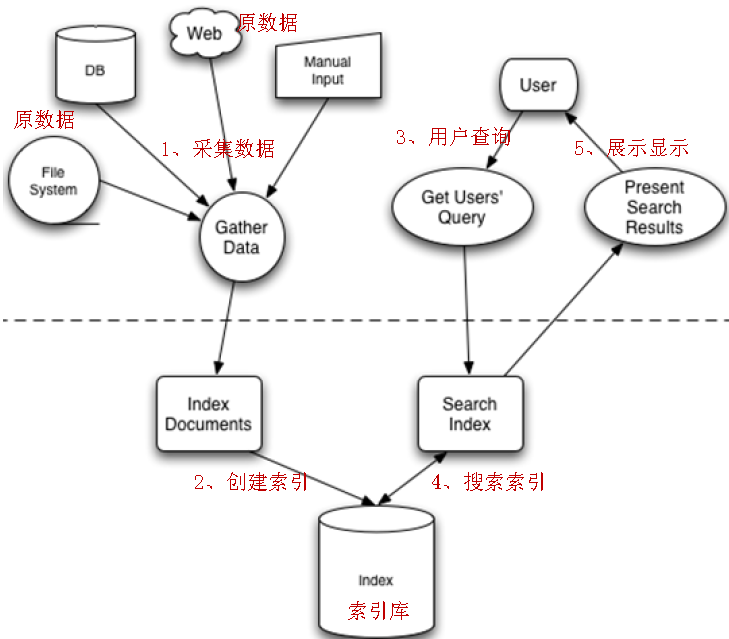

全文检索的流程：索引流程、搜索流程

索引流程：采集数据—》文档处理存储到索引库中

搜索流程：输入查询条件—》通过lucene的查询器查询索引—》从索引库中取出结—》视图渲染

Lucene本身不能进行视图渲染。

# 第三章：入门程序

## 3.1需求

使用lucene完成对数据库中图书信息的索引和搜索功能。

## 3.2：环境准备

-   Jdk：1.7及以上

-   Lucene：4.10（从4.8版本以后，必须使用jdk1.7及以上）

-   Ide：indigo

-   数据库：mysql 5

**数据库脚本初始化**


**Lucene下载**

Lucene是开发全文检索功能的工具包，使用时从官方网站下载，并解压。

官方网站：<http://lucene.apache.org/>

目前最新版本：5.4.0

下载地址：<http://archive.apache.org/dist/lucene/java/>

下载版本：4.10.3

JDK要求：1.7以上（从版本4.8开始，不支持1.7以下）


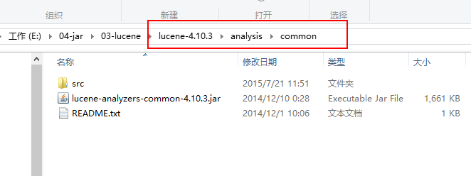


## 3.3：工程搭建

-   Mysql驱动包

-   Analysis的包

-   Core包

-   QueryParser包

-   Junit包（非必须）

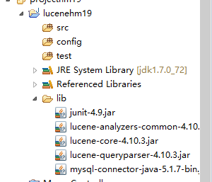

## 3.4：索引流程

**为什么采集数据**

全文检索搜索的内容的格式是多种多样的，比如：视频、mp3、图片、文档等等。对于这种格式不同的数据，需要先将他们采集到本地，**然后统一封装到lucene的文档对象中**，也就是说需要将存储的内容进行统一才能对它进行查询。

**采集数据的方式**

-   对于互联网中的数据，使用爬虫工具（http工具）将网页爬取到本地

-   **对于数据库中的数据，使用jdbc程序进行数据采集**

-   对于文件系统的数据，使用io流采集

因为目前**搜索引擎**主要搜索数据的来源是互联网，搜索引擎使用一种爬虫程序抓取网页（
通过http抓取html网页信息），以下是一些爬虫项目：

Solr（<http://lucene.apache.org/solr>）
，solr是apache的一个子项目，支持从关系数据库、xml文档中提取原始数据。

Nutch（<http://lucene.apache.org/nutch>）,
Nutch是apache的一个子项目，包括大规模爬虫工具，能够抓取和分辨web网站数据。

jsoup（http://jsoup.org/ ），jsoup 是一款Java
的HTML解析器，可直接解析某个URL地址、HTML文本内容。它提供了一套非常省力的API，可通过DOM，CSS以及类似于jQuery的操作方法来取出和操作数据。

heritrix（http://sourceforge.net/projects/archive-crawler/files/），Heritrix
是一个由 java
开发的、开源的网络爬虫，用户可以使用它来从网上抓取想要的资源。其最出色之处在于它良好的可扩展性，方便用户实现自己的抓取逻辑。

**索引文件的逻辑结构**

-   文档域

    文档域存储的信息就是采集到的信息，通过Document对象来存储，具体说是通过Document对象中field域来存储数据。

    比如：数据库中一条记录会存储一个一个Document对象，数据库中一列会存储成Document中一个field域。

    文档域中，Document对象之间是没有关系的。而且每个Document中的field域也不一定一样。

-   索引域

>   索引域主要是为了搜索使用的。索引域内容是经过lucene分词之后存储的。

-   倒排索引表

传统方法是先找到文件，如何在文件中找内容，在文件内容中匹配搜索关键字，这种方法是**顺序扫描方法**，数据量大就搜索慢。

**倒排索引结构**是根据内容（词语）找文档，**倒排索引结构也叫反向索引结构，包括索引和文档两部分，索引即词汇表，它是在索引中匹配搜索关键字，由于索引内容量有限并且采用固定优化算法搜索速度很快，找到了索引中的词汇，词汇与文档关联，从而最终找到了文档。**

### 3.4.4:索引

#### 3.4.4.1**采集数据**


```java
public class BookDaoImpl implements BookDao {
	@Override
	public List<Book> queryBooks() {
		// 数据库链接
		Connection connection = null;
		// 预编译statement
		PreparedStatement preparedStatement = null;
		// 结果集
		ResultSet resultSet = null;

		// 图书列表
		List<Book> list = new ArrayList<Book>();

		try {
			// 加载数据库驱动
			Class.forName("com.mysql.jdbc.Driver");
			// 连接数据库
			connection = DriverManager.getConnection(
					"jdbc:mysql://localhost:3306/solr", "root", "root");
// SQL语句
			String sql = "SELECT * FROM book";
			// 创建preparedStatement
			preparedStatement = connection.prepareStatement(sql);

			// 获取结果集
			resultSet = preparedStatement.executeQuery();

			// 结果集解析
			while (resultSet.next()) {
				Book book = new Book();
				book.setId(resultSet.getInt("id"));
				book.setName(resultSet.getString("name"));
				book.setPrice(resultSet.getFloat("price"));
				book.setPic(resultSet.getString("pic"));
				book.setDescription(resultSet.getString("description"));
				list.add(book);
			}
		} catch (Exception e) {
			e.printStackTrace();
		}

		return list;
	}

}

```

#### **3.4.4.2创建索引**

创建索引流程：


**IndexWriter**是索引过程的核心组件，通过IndexWriter可以**创建新索引、更新索引、删除索引**操作。IndexWriter需要通过**Directory**对索引进行存储操作。

**Directory**描述了索引的存储位置，底层封装了I/O操作，负责对索引进行存储。它是一个抽象类，它的子类常用的包括**FSDirectory**（在文件系统存储索引）、**RAMDirectory**（在内存存储索引）。

```java
	@Test
	public void createIndex() throws Exception {
		// 采集数据
		BookDao dao = new BookDaoImpl();
		List<Book> list = dao.queryBooks();

		// 将采集到的数据封装到Document对象中
		List<Document> docList = new ArrayList<>();
		Document document;
		for (Book book : list) {
			document = new Document();
			// store:如果是yes，则说明存储到文档域中
			// 图书ID
			Field id = new TextField("id", book.getId().toString(), Store.YES);
			// 图书名称
			Field name = new TextField("name", book.getName(), Store.YES);
			// 图书价格
			Field price = new TextField("price", book.getPrice().toString(),
					Store.YES);
			// 图书图片地址
			Field pic = new TextField("pic", book.getPic(), Store.YES);
			// 图书描述
			Field description = new TextField("description",
					book.getDescription(), Store.YES);

			// 将field域设置到Document对象中
			document.add(id);
			document.add(name);
			document.add(price);
			document.add(pic);
			document.add(description);

			docList.add(document);
		}

		// 创建分词器，标准分词器
		Analyzer analyzer = new StandardAnalyzer();

		// 创建IndexWriter
		IndexWriterConfig cfg = new IndexWriterConfig(Version.LUCENE_4_10_3,
				analyzer);
		// 指定索引库的地址
		File indexFile = new File("E:\\11-index\\hm19\\");
		Directory directory = FSDirectory.open(indexFile);
		IndexWriter writer = new IndexWriter(directory, cfg);

		// 通过IndexWriter对象将Document写入到索引库中
		for (Document doc : docList) {
			writer.addDocument(doc);
		}

		// 关闭writer
		writer.close();
	}

```


#### 3.4.4.3分词

Lucene中分词主要分为两个步骤：分词、过滤

分词：将field域中的内容一个个的分词。

过滤：将分好的词进行过滤，比如去掉标点符号、大写转小写、词的型还原（复数转单数、过去式转成现在式）、停用词过滤

停用词：单独应用没有特殊意义的词。比如的、啊、等，英文中的this is a the等等。

-   要分词的内容

Lucene is a Java full-text search engine.

分词

Lucene

is

a

Java

Full

\-

text

search

engine

.

过滤

去掉标点符号

Lucene

is

a

Java

Full

text

search

engine

去掉停用词

Lucene

Java

Full

text

search

engine

大写转小写

lucene

java

full

text

search

engine

如下是org.apache.lucene.analysis.standard.standardAnalyzer的部分源码：

```java
  @Override
  protected TokenStreamComponents createComponents(final String fieldName, final Reader reader) {
    final StandardTokenizer src = new StandardTokenizer(getVersion(), reader);
    src.setMaxTokenLength(maxTokenLength);
    TokenStream tok = new StandardFilter(getVersion(), src);
    tok = new LowerCaseFilter(getVersion(), tok);
    tok = new StopFilter(getVersion(), tok, stopwords);
    return new TokenStreamComponents(src, tok) {
      @Override
      protected void setReader(final Reader reader) throws IOException {
        src.setMaxTokenLength(StandardAnalyzer.this.maxTokenLength);
        super.setReader(reader);
      }
    };
  }

```


如下图是语汇单元的生成过程：

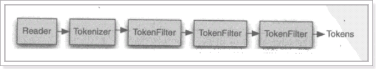

**从一个Reader字符流开始，创建一个基于Reader的Tokenizer分词器，经过三个TokenFilter生成语汇单元Token。**

**同一个域中相同的语汇单元（Token）对应同一个Term（词），它记录了语汇单元的内容及所在域的域名等，还包括来该token出现的频率及位置。**

-   **不同的域中拆分出来的相同的单词对应不同的term。**

-   **相同的域中拆分出来的相同的单词对应相同的term。**

例如：图书信息里面，图书名称中的java和图书描述中的java对应不同的term

#### 3.4.4.4使用luke工具查看索引

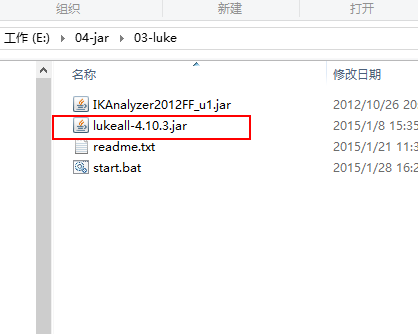


## 3.5：搜索流程

### 输入查询语句

同数据库的sql一样，lucene全文检索也有固定的语法：

最基本的有比如：AND, OR, NOT 等

举个例子，用户想找一个description中包括java关键字和lucene关键字的文档。

它对应的查询语句：**description:java AND lucene**

如下是使用luke搜索的例子：


### 代码

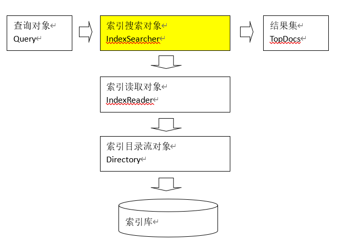

```java
@Test
	public void indexSearch() throws Exception {
		// 创建query对象
		// 使用QueryParser搜索时，需要指定分词器，搜索时的分词器要和索引时的分词器一致
		// 第一个参数：默认搜索的域的名称
		QueryParser parser = new QueryParser("description",new StandardAnalyzer());

		// 通过queryparser来创建query对象
		// 参数：输入的lucene的查询语句(关键字一定要大写)
		Query query = parser.parse("description:java AND lucene");

		// 创建IndexSearcher
		// 指定索引库的地址
		File indexFile = new File("E:\\11-index\\hm19\\");
		Directory directory = FSDirectory.open(indexFile);
		IndexReader reader = DirectoryReader.open(directory);
		IndexSearcher searcher = new IndexSearcher(reader);

		// 通过searcher来搜索索引库
		// 第二个参数：指定需要显示的顶部记录的N条
		TopDocs topDocs = searcher.search(query, 10);

		// 根据查询条件匹配出的记录总数
		int count = topDocs.totalHits;
		System.out.println("匹配出的记录总数:" + count);
		// 根据查询条件匹配出的记录
		ScoreDoc[] scoreDocs = topDocs.scoreDocs;

		for (ScoreDoc scoreDoc : scoreDocs) {
			// 获取文档的ID
			int docId = scoreDoc.doc;

			// 通过ID获取文档
			Document doc = searcher.doc(docId);
			System.out.println("商品ID：" + doc.get("id"));
			System.out.println("商品名称：" + doc.get("name"));
			System.out.println("商品价格：" + doc.get("price"));
			System.out.println("商品图片地址：" + doc.get("pic"));
			System.out.println("==========================");
			// System.out.println("商品描述：" + doc.get("description");
		}
		// 关闭资源
		reader.close();
	}


```


# 第四章：Field域

## 4.1：Field的属性

-   是否分词（Tokenized）

    是：对该field存储的内容进行分词，分词的目的，就是为了索引。

    比如：商品名称、商品描述、商品价格

    否：不需要对field存储的内容进行分词，不分词，不代表不索引，而是将整个内容进行索引。

    比如：商品id

-   是否索引（Indexed）

    是：将分好的词进行索引，索引的目的，就是为了搜索。

    比如：商品名称、商品描述、商品价格、商品id

    否：不索引，也就是不对该field域进行搜索。

-   是否存储（Stored）

    是：将field域中的内容存储到文档域中。存储的目的，就是为了搜索页面显示取值用的。

    比如：商品名称、商品价格、商品id、商品图片地址

    否：不将field域中的内容存储到文档域中。不存储，则搜索页面中没法获取该field域的值。

    比如：商品描述，由于商品描述在搜索页面中不需要显示，再加上商品描述的内容比较多，所以就不需要进行存储。

    如果需要商品描述，则根据搜索出的商品ID去数据库中查询，然后显示出商品描述信息即可。

## 4.2：Field的常用类型

下边列出了开发中常用 的Filed类型，注意Field的属性，根据需求选择：

| Field类                                                                    | 数据类型               | Analyzed 是否分词 | Indexed 是否索引 | Stored 是否存储 | 说明                                                                                                                                          |
|----------------------------------------------------------------------------|------------------------|-------------------|------------------|-----------------|-----------------------------------------------------------------------------------------------------------------------------------------------|
| StringField(FieldName, FieldValue,Store.YES))                              | 字符串                 | N                 | Y                | Y或N            | 这个Field用来构建一个字符串Field，但是不会进行分词，会将整个串存储在索引中，比如(订单号,身份证号等) 是否存储在文档中用Store.YES或Store.NO决定 |
| LongField(FieldName, FieldValue,Store.YES)                                 | Long型                 | Y                 | Y                | Y或N            | 这个Field用来构建一个Long数字型Field，进行分词和索引，比如(价格) 是否存储在文档中用Store.YES或Store.NO决定                                    |
| StoredField(FieldName, FieldValue)                                         | 重载方法，支持多种类型 | N                 | N                | Y               | 这个Field用来构建不同类型Field 不分析，不索引，但要Field存储在文档中                                                                          |
| TextField(FieldName, FieldValue, Store.NO) 或 TextField(FieldName, reader) | 字符串 或 流           | Y                 | Y                | Y或N            | 如果是一个Reader, lucene猜测内容比较多,会采用Unstored的策略.                                                                                  |

## 4.3：修改入门程序的代码


# 第六章：索引维护

## 6.1：需求

图书信息在数据库 发生变化，所以索引库相对应的也要发生增删改变化。

## 6.2：添加索引

参考入门程序的索引流程

IndexWriter.addDocument(document);

## 6.3：删除索引

增删改操作，都是需要通过IndexWriter对象来操作

### 6.3.1根据条件删除

Term是索引域中最小的单位。根据条件删除时，建议根据唯一键来进行删除。在solr中就是根据ID来进行删除和修改操作的。

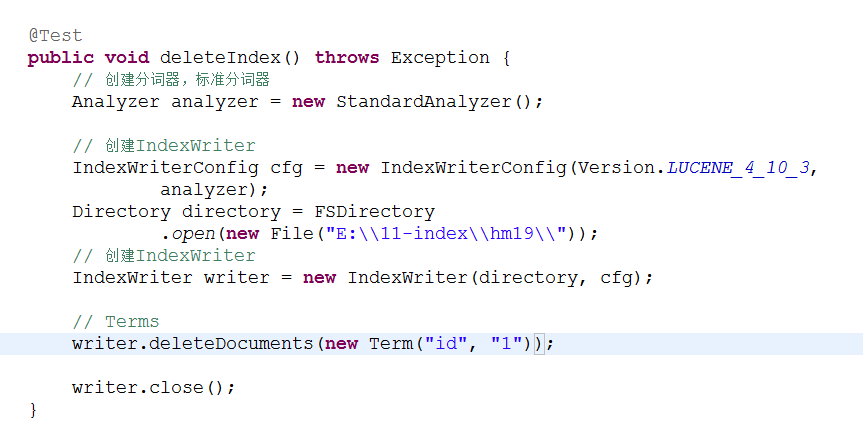

### 6.3.2删除全部


## 6.4修改索引

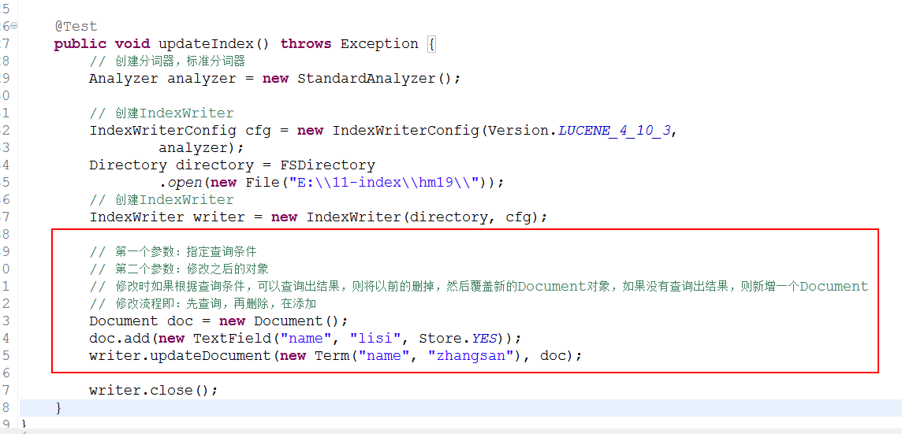

# 第七章：搜索

## 7.1创建查询对象的方式

-   通过Query子类来创建查询对象

    Query子类常用的有：TermQuery、NumericRangeQuery、BooleanQuery

    不能输入lucene的查询语法，不需要指定分词器

-   通过QueryParser来创建查询对象（常用）

    QueryParser、MultiFieldQueryParser

    可以输入lucene的查询语法、可以指定分词器

## 7.2通过Query子类来创建查询对象

### TermQuery

精确的词项查询


### NumericRangeQuery

数字范围查询


### BooleanQuery

组合查询

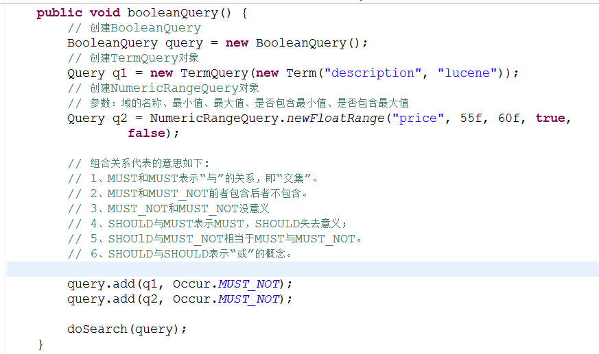

组合关系代表的意思如下:

1、MUST和MUST表示“与”的关系，即“并集”。

2、MUST和MUST_NOT前者包含后者不包含。

3、MUST_NOT和MUST_NOT没意义

4、SHOULD与MUST表示MUST，SHOULD失去意义；

5、SHOUlD与MUST_NOT相当于MUST与MUST_NOT。

6、SHOULD与SHOULD表示“或”的概念。

## 7.3通过QueryParser创建查询对象

### QueryParser

通过QueryParser来创建query对象，可以指定分词器，搜索时的分词器和创建该索引的分词器一定要一致。还可以输入查询语句。

参考入门程序之搜索流程。

### MultiFieldQueryParser

多域查询


### 查询语法

1、基础的查询语法，关键词查询：

域名+“：”+搜索的关键字

例如：content:java

1.  范围查询

域名+“:”+[最小值 TO 最大值]

例如：size:[1 TO 1000]

注意：QueryParser不支持对数字范围的搜索，它支持字符串范围。数字范围搜索建议使用NumericRangeQuery。

1.  组合条件查询

| Occur.MUST 查询条件必须满足，相当于and       | \+（加号）     |
|----------------------------------------------|----------------|
| Occur.SHOULD 查询条件可选，相当于or          | 空（不用符号） |
| Occur.MUST_NOT 查询条件不能满足，相当于not非 | \-（减号）     |

1）+条件1 +条件2：两个条件之间是并且的关系and

例如：+filename:apache +content:apache

1.  \+条件1 条件2：必须满足第一个条件，忽略第二个条件

例如：+filename:apache content:apache

1.  条件1 条件2：两个条件满足其一即可。

例如：filename:apache content:apache

4）-条件1 条件2：必须不满足条件1，要满足条件2

例如：-filename:apache content:apache

第二种写法：

条件1 AND 条件2

条件1 OR 条件2

条件1 NOT 条件2

## 7.4TopDocs

Lucene搜索结果可通过TopDocs遍历，TopDocs类提供了少量的属性，如下：

| 方法或属性 | 说明                   |
| ---------- | ---------------------- |
| totalHits  | 匹配搜索条件的总记录数 |
| scoreDocs  | 顶部匹配记录           |

注意：

Search方法需要指定匹配记录数量n：indexSearcher.search(query, n)

TopDocs.totalHits：是匹配索引库中所有记录的数量

TopDocs.scoreDocs：匹配相关度高的前边记录数组，scoreDocs的长度小于等于search方法指定的参数n

# 第八章：相关度排序

## 8.1什么是相关度排序

相关度排序就是查询关键字与查询结果的匹配相关度。匹配越高的越靠前。Lucene是通过打分来进行相关度排序的。

打分分两步：

1.  根据词计算词的权重

2.  根据词的权重进行打分

词的权重：词指的就是term。也就是说一个term对一个文档的重要性，就叫词的权重。

影响词的权重的方式有两种：

-   Tf

    词在同一个文档中出现的频率

Tf越高，说明词的权重越高

-   Df

    词在多个文档中出现的频率

    Df越高，说明词的权重越低

以上是自然打分的规则。

## 8.2设置boost值影响打分

Boost：加权值，默认是1.0f。

设置加权值可以在创建索引时设置，也可以在查询时设置。

**Boost值是设置到Field域上的**。

### 创建索引时设置boost值

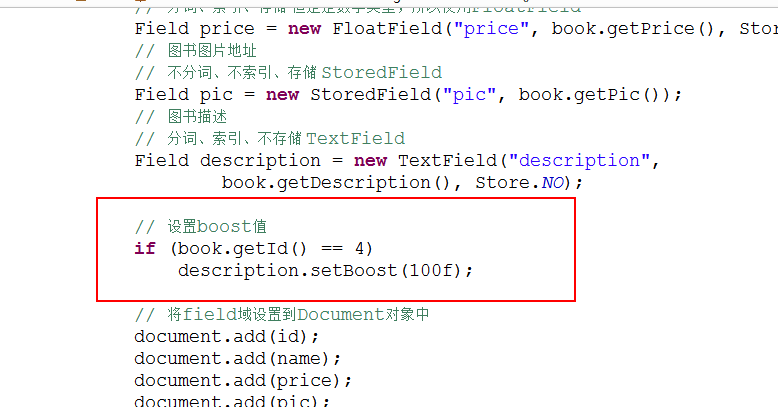

### 搜索时设置boost值

在MultiFieldQueryParser创建时设置boost值。

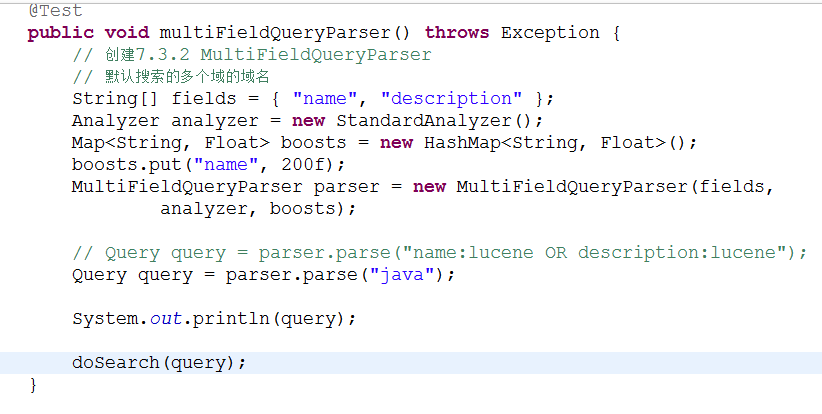

# 第九章：中文分词器

## 9.1什么是中文分词器

对于英文，是安装空格、标点符号进行分词

对于中文，应该安装具体的词来分，中文分词就是将词，切分成一个个有意义的词。

比如：“我的中国人”，分词：我、的、中国、中国人、国人。

## 9.2Lucene自带的中文分词器

-   **StandardAnalyzer**：

**单字分词**：就是按照中文一个字一个字地进行分词。如：“我爱中国”，  
效果：“我”、“爱”、“中”、“国”。

-   **CJKAnalyzer**

**二分法分词**：按两个字进行切分。如：“我是中国人”，效果：“我是”、“是中”、“中国”“国人”。

上边两个分词器无法满足需求。

## 9.3第三方中文分词器

-   paoding： 庖丁解牛最新版在 <https://code.google.com/p/paoding/>
    中最多支持Lucene 3.0，且最新提交的代码在
    2008-06-03，在svn中最新也是2010年提交，**已经过时，不予考虑。**

-   mmseg4j：最新版已从 <https://code.google.com/p/mmseg4j/> 移至
    <https://github.com/chenlb/mmseg4j-solr>，支持Lucene
    4.10，且在github中最新提交代码是2014年6月，从09年～14年一共有：18个版本，也就是一年几乎有3个大小版本，有较大的活跃度，用了mmseg算法。

-   **IK-analyzer**：
    最新版在https://code.google.com/p/ik-analyzer/上，支持Lucene
    4.10从2006年12月推出1.0版开始，
    IKAnalyzer已经推出了4个大版本。最初，它是以开源项目Luence为应用主体的，结合词典分词和文法分析算法的中文分词组件。从3.0版本开
    始，IK发展为面向Java的公用分词组件，独立于Lucene项目，同时提供了对Lucene的默认优化实现。在2012版本中，IK实现了简单的分词
    歧义排除算法，标志着IK分词器从单纯的词典分词向模拟语义分词衍化。
    但是**也就是2012年12月后没有在更新**。

-   ansj_seg：最新版本在 <https://github.com/NLPchina/ansj_seg>
    tags仅有1.1版本，从2012年到2014年更新了大小6次，但是作者本人在2014年10月10日说明：“可能我以后没有精力来维护ansj_seg了”，现在由”nlp_china”管理。2014年11月有更新。并未说明是否支持Lucene，是一个由CRF（条件随机场）算法所做的分词算法。

-   imdict-chinese-analyzer：最新版在
    <https://code.google.com/p/imdict-chinese-analyzer/> ，
    最新更新也在2009年5月，下载源码，不支持Lucene 4.10
    。是利用HMM（隐马尔科夫链）算法。

-   Jcseg：最新版本在git.oschina.net/lionsoul/jcseg，支持Lucene
    4.10，作者有较高的活跃度。利用mmseg算法。

## 9.4Ikanalyzer


### 添加ikanalyzer的jar包


### 代码


### 扩展中文词库

将以下文件拷贝到config目录下

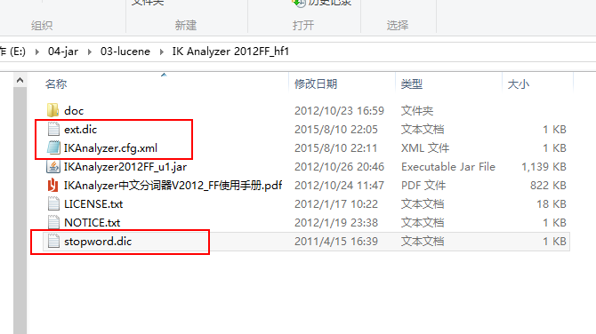

从ikanalyzer包中拷贝配置文件到classpath下。

\<?xml version=*"1.0"* encoding=*"UTF-8"*?\>

\<!DOCTYPE properties SYSTEM "http://java.sun.com/dtd/properties.dtd"\>

\<properties\>

\<comment\>IK Analyzer 扩展配置\</comment\>

\<!-- 用户可以在这里配置自己的扩展字典 --\>

\<entry key=*"ext_dict"*\>dicdata/mydict.dic\</entry\>

\<!-- 用户可以在这里配置自己的扩展停用词字典 --\>

\<entry key=*"ext_stopwords"*\>dicdata/ext_stopword.dic\</entry\>

\</properties\>

如果想配置扩展词和停用词，就创建扩展词的文件和停用词的文件，文件的编码要是utf-8。

注意：**不要用记事本保存扩展词文件和停用词文件，那样的话，格式中是含有bom的**。

### 使用luke来查询中文分词效果

第一步：将ikanalyzer的jar包，拷贝到luke工具的目录

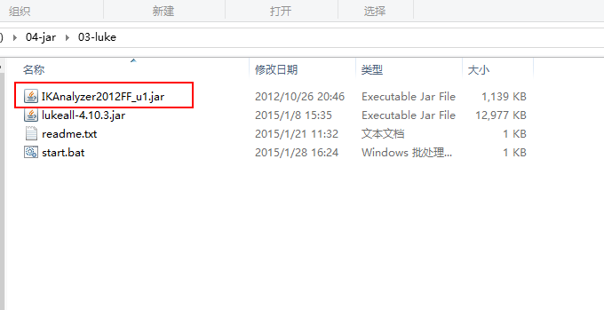

第二步：使用命令打开luke工具

java -Djava.ext.dirs=. -jar lukeall-4.10.3.jar
