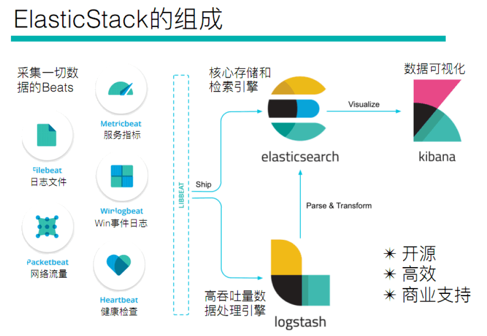

如果你没有听说过 Elastic Stack，那你一定听说过 ELK，实际上 ELK 是三款软件的简称，分别是 Elasticsearch、
Logstash、Kibana 组成，在发展的过程中，又有新成员 Beats 的加入，所以就形成了 Elastic Stack。所以说，ELK 是旧的称呼，Elastic Stack 是新的名字。

全系的 Elastic Stack 技术栈包括：

1：Elasticsearch

Elasticsearch 基于 java，是个开源分布式搜索引擎，它的特点有：分布式，零配置，自动发现，索引自动分片，索引副本机制，restful 风格接口，多数据源，自动搜索负载等。

2：Logstash

Logstash 基于 java，是一个开源的用于收集,分析和存储日志的工具。

3：Kibana

Kibana 基于 nodejs，也是一个开源和免费的工具，Kibana 可以为 Logstash 和 ElasticSearch 提供的日志分析友好的 Web 界面，可以汇总、分析和搜索重要数据日志。

4：Beats

Beats 是 elastic 公司开源的一款采集系统监控数据的代理 agent，是在被监控服务器上以客户端形式运行的数据收集器的统称，可以直接把数据发送给 Elasticsearch 或者通过 Logstash 发送给 Elasticsearch，然后进行后续的数据分析活动。Beats 由如下组成:

- Packetbeat：是一个网络数据包分析器，用于监控、收集网络流量信息，Packetbeat 嗅探服务器之间的流量，解析应用层协议，并关联到消息的处理，其支 持 ICMP (v4 and v6)、DNS、HTTP、Mysql、PostgreSQL、Redis、MongoDB、Memcache 等协议；
- Filebeat：用于监控、收集服务器日志文件，其已取代 logstash forwarder；
- Metricbeat：可定期获取外部系统的监控指标信息，其可以监控、收集 Apache、HAProxy、MongoDB
  MySQL、Nginx、PostgreSQL、Redis、System、Zookeeper 等服务；

Beats 和 Logstash 其实都可以进行数据的采集，但是目前主流的是使用 Beats 进行数据采集，然后使用 Logstash 进行数据的分割处理等，早期没有 Beats 的时候，使用的就是 Logstash 进行数据的采集。

ES7 需要 Java11