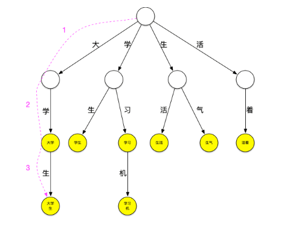
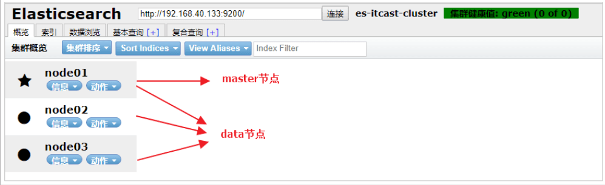
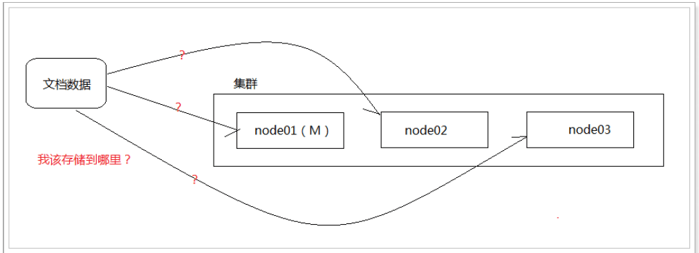
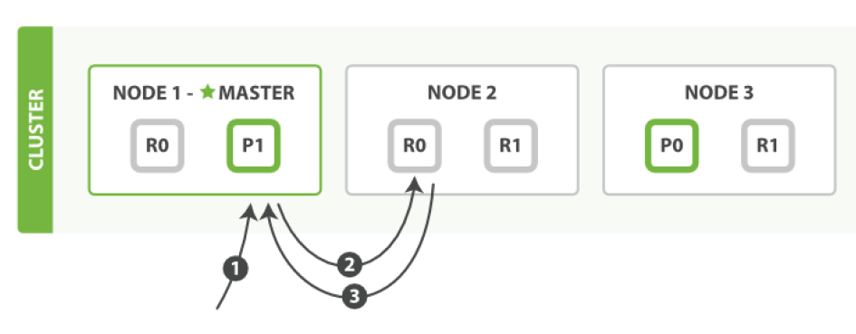
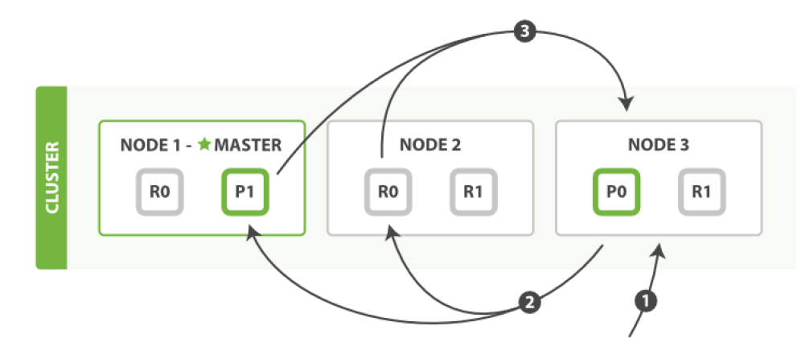
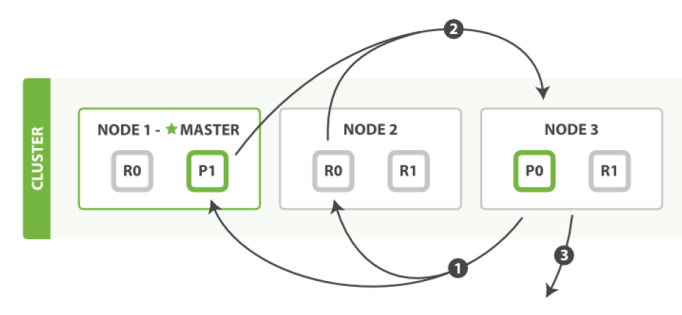

# 一：简介

官网：https://www.elastic.co/

ElasticSearch 是一个基于 Lucene 的搜索服务器。它提供了一个分布式多用户能力的全文搜索引擎，基于 RESTful web 接口。Elasticsearch 是用 Java 开发的，并作为 Apache 许可条款下的开放源码发布，是当前流行的企业级搜索引擎。

ElasticSearch 是 Elastic Stack 的核心，同时 Elasticsearch 是一个分布式、RESTful 风格的搜索和数据分析引擎，能够解决不断涌现出的各种用例。作为 Elastic Stack 的核心，它集中存储您的数据，帮助您发现意料之中以及意料之外的情况。

应用场景：

程序——ES（Lucene/Solr）——索引库

程序——Mybatis——数据库


与 Solr 对比：

1. es基本是开箱即用（解压就可以用），非常简单。Solr安装略微复杂一丢丢。
2. Solr利用Zookeeper进行分布式管理，而Elasticsearch自身带有分布式协调管理功能。
3. Solr支持更多格式的数据，比JSON、XML、CSV，而Elasticsearch仅支持json文件格式。
4. Solr官方提供的功能更多，而Elasticsearch本身更注重于核心功能，高级功能多有第三方插件提供，例如图形化界面需要kibana友好支撑。
5. Solr查询快，但更新索引时慢（即插入删除慢），用于电商等查询多的应用；
   - ES建立索引快（即查询慢），即实时性查询快，用于facebook新浪等搜索。
   - Solr是传统搜索应用的有力解决方案，但Elasticsearch更适用于新兴的实时搜索应用。
6. Solr比较成熟，有一个更大，更成熟的用户、开发和贡献者社区，而Elasticsearch相对开发维护者较少，更新太快，学习使用成本较高。


ES 与关系型数据库

数据库 DataBase——表 TABLE——ROW 行——列

索引库 Index ——类型 TYPE——文档 DOCUMENT——字段 Field

分词建立索引，底层使用倒排索引


特点：分布式，高可用，多类型，多API，面向文档；

近实时，集群

## 安装

下载

到官网下载：https://www.elastic.co/cn/downloads/


Window 安装：

解压：D:\ES\elasticsearch-7.11.1\

运行：D:\ES\elasticsearch-7.11.1\bin\elasticsearch.bat

访问：http://localhost:9200/

目录结构

```txt
bin：启动文件
config：配置文件
     log4j2：日志配置文件
     jvm.options：java虚拟机相关的配置
     elasticsearch.yml：elasticsearch的配置文件！默认9200端口！跨域！
lib：相关jar包
logs：日志
modules：功能模块
plugins：插件！
```


Linux 安装：

选择对应版本的数据，这里我使用的是 Linux 来进行安装，所以就先下载好 ElasticSearch 的 Linux 安装包

拉取 Docker 容器

因为我们需要部署在 Linux 下，为了以后迁移 ElasticStack 环境方便，我们就使用 Docker 来进行部署，首先我们拉取一个带有 ssh 的 centos docker 镜像

```bash
# 拉取镜像
docker pull moxi/centos_ssh
# 制作容器
docker run --privileged -d -it -h ElasticStack --name ElasticStack -p 11122:22 -p 9200:9200 -p 5601:5601 -p 9300:9300 -v /etc/localtime:/etc/localtime:ro  moxi/centos_ssh /usr/sbin/init
```

然后直接远程连接 11122 端口即可

单机版安装

因为 ElasticSearch 不支持 Root 用户直接操作，因此我们需要创建一个 elsearch 用户

```bash
# 添加新用户
useradd elsearch

# 创建一个soft目录，存放下载的软件
mkdir /soft

# 进入，然后通过xftp工具，将刚刚下载的文件拖动到该目录下
cd /soft

# 解压缩
tar -zxvf elasticsearch-7.9.1-linux-x86_64.tar.gz

#重命名
mv elasticsearch-7.9.1/ elsearch
```

因为刚刚我们是使用 root 用户操作的，所以我们还需要更改一下/soft 文件夹的所属，改为 elsearch 用户

```bash
chown elsearch:elsearch /soft/ -R
```

然后在切换成 elsearch 用户进行操作

```bash
# 切换用户
su - elsearch
```

然后我们就可以对我们的配置文件进行修改了

```bash
# 进入到 elsearch下的config目录
cd /soft/elsearch/config
```

然后找到下面的配置

```yaml
#打开配置文件
vim elasticsearch.yml

#设置ip地址，任意网络均可访问
network.host: 0.0.0.0
```

在 Elasticsearch 中如果，network.host 不是 localhost 或者 127.0.0.1 的话，就会认为是生产环境，会对环境的要求比较高，我们的测试环境不一定能够满足，一般情况下需要修改 2 处配置，如下：

```bash
# 修改jvm启动参数
vim conf/jvm.options

#根据自己机器情况修改
-Xms128m
-Xmx128m
```

然后在修改第二处的配置，这个配置要求我们到宿主机器上来进行配置

```bash
# 到宿主机上打开文件
vim /etc/sysctl.conf
# 增加这样一条配置，一个进程在VMAs(虚拟内存区域)创建内存映射最大数量
vm.max_map_count=655360
# 让配置生效
sysctl -p
```

启动 ElasticSearch

首先我们需要切换到 elsearch 用户，root 用户无法启动 ES，启动就报错，必须新建用户

```bash
su - elsearch
```

然后在到 bin 目录下，执行下面

```bash
# 进入bin目录
cd /soft/elsearch/bin
# 后台启动
./elasticsearch -d
```

启动成功后，访问下面的 URL

```bash
http://202.193.56.222:9200/
```

如果出现了下面的信息，就表示已经成功启动了


如果你在启动的时候，遇到过问题，那么请参考下面的错误分析~

错误分析

错误情况 1

如果出现下面的错误信息

```
java.lang.RuntimeException: can not run elasticsearch as root
	at org.elasticsearch.bootstrap.Bootstrap.initializeNatives(Bootstrap.java:111)
	at org.elasticsearch.bootstrap.Bootstrap.setup(Bootstrap.java:178)
	at org.elasticsearch.bootstrap.Bootstrap.init(Bootstrap.java:393)
	at org.elasticsearch.bootstrap.Elasticsearch.init(Elasticsearch.java:170)
	at org.elasticsearch.bootstrap.Elasticsearch.execute(Elasticsearch.java:161)
	at org.elasticsearch.cli.EnvironmentAwareCommand.execute(EnvironmentAwareCommand.java:86)
	at org.elasticsearch.cli.Command.mainWithoutErrorHandling(Command.java:127)
	at org.elasticsearch.cli.Command.main(Command.java:90)
	at org.elasticsearch.bootstrap.Elasticsearch.main(Elasticsearch.java:126)
	at org.elasticsearch.bootstrap.Elasticsearch.main(Elasticsearch.java:92)
For complete error details, refer to the log at /soft/elsearch/logs/elasticsearch.log
[root@e588039bc613 bin]# 2020-09-22 02:59:39,537121 UTC [536] ERROR CLogger.cc@310 Cannot log to named pipe /tmp/elasticsearch-5834501324803693929/controller_log_381 as it could not be opened for writing
2020-09-22 02:59:39,537263 UTC [536] INFO  Main.cc@103 Parent process died - ML controller exiting
```

就说明你没有切换成 elsearch 用户，因为不能使用 root 操作 es

```bash
su - elsearch
```

错误情况 2

```bash
[1]:max file descriptors [4096] for elasticsearch process is too low, increase to at least[65536]
```

解决方法：切换到 root 用户，编辑 limits.conf 添加如下内容

```bash
vi /etc/security/limits.conf

# ElasticSearch添加如下内容:
* soft nofile 65536
* hard nofile 131072
* soft nproc 2048
* hard nproc 4096
```

错误情况 3

```bash
[2]: max number of threads [1024] for user [elsearch] is too low, increase to at least
[4096]
```

也就是最大线程数设置的太低了，需要改成 4096

```bash
#解决：切换到root用户，进入limits.d目录下修改配置文件。
vi /etc/security/limits.d/90-nproc.conf
#修改如下内容：
* soft nproc 1024
#修改为
* soft nproc 4096
```

错误情况 4

```bash
[3]: system call filters failed to install; check the logs and fix your configuration
or disable system call filters at your own risk
```

解决：Centos6 不支持 SecComp，而 ES5.2.0 默认 bootstrap.system_call_filter 为 true

```bash
vim config/elasticsearch.yml
# 添加
bootstrap.system_call_filter: false
bootstrap.memory_lock: false
```

错误情况 5

```bash
[elsearch@e588039bc613 bin]$ Exception in thread "main" org.elasticsearch.bootstrap.BootstrapException: java.nio.file.AccessDeniedException: /soft/elsearch/config/elasticsearch.keystore
Likely root cause: java.nio.file.AccessDeniedException: /soft/elsearch/config/elasticsearch.keystore
	at java.base/sun.nio.fs.UnixException.translateToIOException(UnixException.java:90)
	at java.base/sun.nio.fs.UnixException.rethrowAsIOException(UnixException.java:111)
	at java.base/sun.nio.fs.UnixException.rethrowAsIOException(UnixException.java:116)
	at java.base/sun.nio.fs.UnixFileSystemProvider.newByteChannel(UnixFileSystemProvider.java:219)
	at java.base/java.nio.file.Files.newByteChannel(Files.java:375)
	at java.base/java.nio.file.Files.newByteChannel(Files.java:426)
	at org.apache.lucene.store.SimpleFSDirectory.openInput(SimpleFSDirectory.java:79)
	at org.elasticsearch.common.settings.KeyStoreWrapper.load(KeyStoreWrapper.java:220)
	at org.elasticsearch.bootstrap.Bootstrap.loadSecureSettings(Bootstrap.java:240)
	at org.elasticsearch.bootstrap.Bootstrap.init(Bootstrap.java:349)
	at org.elasticsearch.bootstrap.Elasticsearch.init(Elasticsearch.java:170)
	at org.elasticsearch.bootstrap.Elasticsearch.execute(Elasticsearch.java:161)
	at org.elasticsearch.cli.EnvironmentAwareCommand.execute(EnvironmentAwareCommand.java:86)
	at org.elasticsearch.cli.Command.mainWithoutErrorHandling(Command.java:127)
	at org.elasticsearch.cli.Command.main(Command.java:90)
	at org.elasticsearch.bootstrap.Elasticsearch.main(Elasticsearch.java:126)
	at org.elasticsearch.bootstrap.Elasticsearch.main(Elasticsearch.java:92)

```

我们通过排查，发现是因为 /soft/elsearch/config/elasticsearch.keystore 存在问题


也就是说该文件还是所属于 root 用户，而我们使用 elsearch 用户无法操作，所以需要把它变成 elsearch

```bash
chown elsearch:elsearch elasticsearch.keystore
```

错误情况 6

```bash
[1]: the default discovery settings are unsuitable for production use; at least one of [discovery.seed_hosts, discovery.seed_providers, cluster.initial_master_nodes] must be configured
ERROR: Elasticsearch did not exit normally - check the logs at /soft/elsearch/logs/elasticsearch.log
```

继续修改配置 elasticsearch.yaml

```bash
# 取消注释，并保留一个节点
node.name: node-1
cluster.initial_master_nodes: ["node-1"]
```

## 集成

添加依赖：

修改配置

Application.properties

```properties
# ES 服务地址
spring.data.elasticsearch.cluster-nodes=localhost:9300
# 设置连接超时时间
spring.data.elasticsearch.properties.transport.tcp.connect_time=120s
```


# 二：Head 可视化工具

由于 ES 官方没有给 ES 提供可视化管理工具，仅仅是提供了后台的服务，elasticsearch-head 是一个为 ES 开发的一个页面客户端工具，其源码托管于 Github，地址为 [传送门](https://github.com/mobz/elasticsearch-head)

head 提供了以下安装方式

- 源码安装，通过 npm run start 启动
- 通过 docker 安装
- 通过 chrome 插件安装
- 通过 ES 的 plugin 方式安装

通过 Docker 方式安装

```bash
#拉取镜像
docker pull mobz/elasticsearch-head:5
#创建容器
docker create --name elasticsearch-head -p 9100:9100 mobz/elasticsearch-head:5
#启动容器
docker start elasticsearch-head
```

通过浏览器进行访问：


注意：由于前后端分离开发，所以会存在跨域问题，需要在服务端做 CORS 的配置，如下：

```bash
vim elasticsearch.yml

http.cors.enabled: true http.cors.allow-origin: "*"
```

通过 chrome 插件的方式安装不存在该问题

通过 Chrome 插件安装

打开 chrome 的应用商店，即可安装 https://chrome.google.com/webstore/detail/elasticsearch-head/ffmkiejjmecolpfloofpjologoblkegm


我们也可以新建索引


建议：推荐使用 chrome 插件的方式安装，如果网络环境不允许，就采用其它方式安装。


# 三：核心与操作

## 索引

索引是映射类型的容器，elasticsearch中的索引是一个非常大的文档集合。索引存储了映射类型的字段和其他设置。然后它们被存储到了各个分片上了。我们来研究下分片是如何工作的。

可以把索引看成关系型数据库的表，索引的结构是为快速有效的全文索引准备的，特别是它不存储原始值。

Elasticsearch 可以把索引存放在一台机器或者分散在多台服务器上，每个索引有一或多个分片（shard），每个分片可以有多个副本（replica）。

### 倒排索引

elasticsearch使用的是一种称为倒排索引的结构，采用Lucene倒排索作为底层。这种结构适用于快速的全文搜索，一个索引由文档中所有不重复的列表构成，对于每一个词，都有一个包含它的文档列表


### 索引操作

1：创建索引

相当于创建一个数据库的表

```bash
PUT /haoke
{
	"mappings":{
		"properties":{
			"name":{
				"type":"text"
			},
			"age":{
				"type":"long"
			},
			"birthday":{
				"type":"date"
			}
		},
		
	}
    "settings": {
        "index": {
        "number_of_shards": "2", #分片数
        "number_of_replicas": "0" #副本数
        }
    }
}
```

其中type代表着字段的类型，如果没有指定，ES会自动帮你匹配，支持的类型有：

```txt
官网类型文档地址：https://www.elastic.co/guide/en/elasticsearch/reference/current/keyword.html
- 字符串类型
text、keyword
- 数值类型
long，integer，short，byte，double，float，half float，scaled float
- 日期类型
date
- te布尔值类型
boolean·
- 二进制类型
binary
```

2：修改索引

同创建，直接覆盖

3：删除索引

通过DELETE命令实现删除、根据你的请求来判断是删除索引还是删除文档记录

```bash
#删除索引
DELETE /haoke
```


## 文档

索引和搜索数据的最小单位是文档，

一个文档不只有数据。它还包含了元数据(metadata)——关于文档的信息。三个必须的元数据节点是：

_index：文档存储的地方

\_type：文档代表的对象的类

每个类型(type)都有自己的映射(mapping)或者结构定义，就像传统数据库表中的列一样。所有类型下的文档被存储在同一个索引下，但是类型的映射(mapping)会告诉 Elasticsearch 不同的文档如何被索引。

\_id：文档的唯一标识

id 仅仅是一个字符串，它与\_index 和\_type 组合时，就可以在 Elasticsearch 中唯一标识一个文档。当创建一个文
档，你可以自定义\_id ，也可以让 Elasticsearch 帮你自动生成（32 位长度）

### 文档操作

1：添加数据

URL 规则：POST /{索引}/{类型}/{id}

```bash
POST /haoke/user/1001
{
    "id":1001,
    "name":"张三",
    "age":2
}
```

我们通过 ElasticSearchHead 进行数据预览就能够看到我们刚刚插入的数据了

说明：非结构化的索引，不需要事先创建，直接插入数据默认创建索引。不指定 id 插入数据时，会随机生成一个ID

2：更新数据

在 Elasticsearch 中，文档数据是不为修改的，但是可以通过覆盖的方式进行更新。

```bash
PUT /haoke/user/1001
{
    "id":1001,
    "name":"张三",
    "age":21
}
```

可以局部更新吗？文档数据不是不能更新吗？ 其实是这样的：在内部，依然会查询到这个文档数据，然后进行覆盖操作，步骤如下：

从旧文档中检索 JSON

修改它

删除旧文档

索引新文档

```bash
#注意：这里多了_update标识
POST /haoke/user/1001/_update
{
    "doc":{
    	"age":23
    }
}
```

3：删除索引

在 Elasticsearch 中，删除文档数据，只需要发起 DELETE 请求即可，不用额外的参数

```bash
DELETE 1 /haoke/user/1001
```

需要注意的是，result 表示已经删除，version 也增加了。

如果删除一条不存在的数据，会响应 404

删除一个文档也不会立即从磁盘上移除，它只是被标记成已删除。Elasticsearch 将会在你之后添加更多索引的时候才会在后台进行删除内容的清理。【相当于批量操作】


4：搜索数据

根据 id 搜索数据

```bash
GET /haoke/user/BbPe_WcB9cFOnF3uebvr
```

搜索全部数据

```bash
GET 1 /haoke/user/_search
```

注意，使用查询全部数据的时候，默认只会返回 10 条

关键字搜索数据

```bash
#查询年龄等于20的用户
GET /haoke/user/_search?q=age:20
```


5：DSL 复杂搜索

Elasticsearch 提供丰富且灵活的查询语言叫做 DSL 查询(Query DSL),它允许你构建更加复杂、强大的查询。
DSL(Domain Specific Language 特定领域语言)以 JSON 请求体的形式出现。

```bash
POST /haoke/user/_search
#请求体
{
    "query" : {
        "match" : { #match只是查询的一种
        	"age" : 20
        }
    }
}
```

match：使用分词器解析

term：直接查询精确的

不过字段类型keyword不会被拆分，会任务是一个词去匹配，text才能被拆分

```bash
GET /haoke/_search
{
	"query":{		
        "bool"{
        	"should":[
        	  {
        	  	"term":{
        			"t1":"22"
        		}
        	  },
        	  {
        	  	"term":{
        	  		"t1":"33"
        	  	}
        	  }	
        	]
        }
	}
}
```

terms

terms 跟 term 有点类似，但 terms 允许指定多个匹配条件。 如果某个字段指定了多个值，那么文档需要一起去做匹配：

```bash
{
    "terms":{
        "tag":[
            "search",
            "full_text",
            "nosql"
        ]
    }
}
```

range 

range 过滤允许我们按照指定范围查找一批数据：

```bash
{
    "range":{
        "age":{
            "gte":20,
            "lt":30
        }
    }
}
```

范围操作符包含：

- gt : 大于
- gte:: 大于等于
- lt : 小于
- lte: 小于等于


exists

exists 查询可以用于查找文档中是否包含指定字段或没有某个字段，类似于 SQL 语句中的 IS_NULL 条件

```bash
{
    "exists": {
    	"field": "title"
    }
}
```


过滤字段： 只显示索引中的部分字段

```txt
GET /haoke/_search
{
	"query":{		
        "match"{
        	"name":"111"
        }
	}
	"_source":["name","age"]
}
```

过滤结果集：只显示结果集中部分数据，相当于数据库表中过滤掉部分数据


排序：

```bash
GET /haoke/_search
{
	"sort":{
		{
			"age"{
				"order":"desc"
			}
		}
	}
}
```


分页：

```bash
GET /haoke/_search
{
	"from":0
	"size":10
}
```


布尔值查询：

- bool 查询可以用来合并多个条件查询结果的布尔逻辑，它包含一下操作符：
- must :: 多个查询条件的完全匹配,相当于 and 。
- must_not :: 多个查询条件的相反匹配，相当于 not 。
- should :: 至少有一个查询条件匹配, 相当于 or 。

这些参数可以分别继承一个查询条件或者一个查询条件的数组：

```bash
{
    "bool":{
        "must":{
            "term":{
                "folder":"inbox"
            }
        },
        "must_not":{
            "term":{
                "tag":"spam"
            }
        },
        "should":[
            {
                "term":{
                    "starred":true
                }
            },
            {
                "term":{
                    "unread":true
                }
            }
        ]
    }
}
```

高亮显示，只需要在添加一个 highlight 即可

```bash
POST /haoke/user/_search
#请求数据
{
    "query": {
        "match": {
        	"name": "张三 李四"
        }
    }
    "highlight": {
        "fields": {
        	"name": {}
        }
    }
}
```

聚合

在 Elasticsearch 中，支持聚合操作，类似 SQL 中的 group by 操作。

```bash
POST /haoke/user/_search
{
    "aggs": {
        "all_interests": {
            "terms": {
                "field": "age"
            }
        }
    }
}
```


多词搜索

```bash
POST /itcast/person/_search
{
    "query":{
        "match":{
            "hobby":"音乐 篮球"
        }
    },
    "highlight":{
        "fields":{
            "hobby":{

            }
        }
    }
}
```

可以看到，包含了“音乐”、“篮球”的数据都已经被搜索到了。可是，搜索的结果并不符合我们的预期，因为我们想搜索的是既包含“音乐”又包含“篮球”的用户，显然结果返回的“或”的关系。在 Elasticsearch 中，可以指定词之间的逻辑关系，如下：

```bash
POST /itcast/person/_search
{
    "query":{
        "match":{
            "hobby":"音乐 篮球"
            "operator":"and"
        }
    },
    "highlight":{
        "fields":{
            "hobby":{

            }
        }
    }
}
```


### 批量操作

有些情况下可以通过批量操作以减少网络请求。如：批量查询、批量插入数据。

1：批量查询

```bash
POST /haoke/user/_mget
{
	"ids" : [ "1001", "1003" ]
}
```

如果，某一条数据不存在，不影响整体响应，需要通过 found 的值进行判断是否查询到数据。

#### \_bulk 操作

在 Elasticsearch 中，支持批量的插入、修改、删除操作，都是通过\_bulk 的 api 完成的。

请求格式如下：（请求格式不同寻常）

```
{ action: { metadata }}
{ request body }
{ action: { metadata }}
{ request body }
...
```

批量插入数据：

```bash
{"create":{"_index":"haoke","_type":"user","_id":2001}}
{"id":2001,"name":"name1","age": 20,"sex": "男"}
{"create":{"_index":"haoke","_type":"user","_id":2002}}
{"id":2002,"name":"name2","age": 20,"sex": "男"}
{"create":{"_index":"haoke","_type":"user","_id":2003}}
{"id":2003,"name":"name3","age": 20,"sex": "男"}

```

注意最后一行的回车。

批量删除：

```bash
{"delete":{"_index":"haoke","_type":"user","_id":2001}}
{"delete":{"_index":"haoke","_type":"user","_id":2002}}
{"delete":{"_index":"haoke","_type":"user","_id":2003}}
```

由于 delete 没有请求体，所以，action 的下一行直接就是下一个 action。

其他操作就类似了。一次请求多少性能最高？

- 整个批量请求需要被加载到接受我们请求节点的内存里，所以请求越大，给其它请求可用的内存就越小。有一
  个最佳的 bulk 请求大小。超过这个大小，性能不再提升而且可能降低。
- 最佳大小，当然并不是一个固定的数字。它完全取决于你的硬件、你文档的大小和复杂度以及索引和搜索的负
  载。
- 幸运的是，这个最佳点(sweetspot)还是容易找到的：试着批量索引标准的文档，随着大小的增长，当性能开始
  降低，说明你每个批次的大小太大了。开始的数量可以在 1000~5000 个文档之间，如果你的文档非常大，可以使用较小的批次。
- 通常着眼于你请求批次的物理大小是非常有用的。一千个 1kB 的文档和一千个 1MB 的文档大不相同。一个好的
  批次最好保持在 5-15MB 大小间。

### 查询响应

1：pretty

可以在查询 url 后面添加 pretty 参数，使得返回的 json 更易查看。

2：权重


3：得分


### 映射

所有文档写进索引之前都会先进行分析，如何将输入的文本分割为词条、哪些词条又会被过滤，这种行为叫做映射（mapping）。一般由用户自己定义规则。

Elasticsearch 中支持的类型如下：

| 类型         | 表示的数据类型             |
| ------------ | -------------------------- |
| String       | String，text，keyword      |
| Whole number | byte，short，integer，long |
|              | float，double              |
|              | boolean                    |
|              | date                       |

string 类型在 ElasticSearch 旧版本中使用较多，从 ElasticSearch 5.x 开始不再支持 string，由 text 和
keyword 类型替代。

text 类型，当一个字段是要被全文搜索的，比如 Email 内容、产品描述，应该使用 text 类型。设置 text 类型
以后，字段内容会被分析，在生成倒排索引以前，字符串会被分析器分成一个一个词项。text 类型的字段
不用于排序，很少用于聚合。

keyword 类型适用于索引结构化的字段，比如 email 地址、主机名、状态码和标签。如果字段需要进行过
滤(比如查找已发布博客中 status 属性为 published 的文章)、排序、聚合。keyword 类型的字段只能通过精
确值搜索到。

1：创建明确类型的索引：

如果你要像之前旧版版本一样兼容自定义 type ,需要将 include_type_name=true 携带

```bash
put http://202.193.56.222:9200/itcast?include_type_name=true
{
    "settings":{
        "index":{
            "number_of_shards":"2",
            "number_of_replicas":"0"
        }
    },
    "mappings":{
        "person":{
            "properties":{
                "name":{
                    "type":"text"
                },
                "age":{
                    "type":"integer"
                },
                "mail":{
                    "type":"keyword"
                },
                "hobby":{
                    "type":"text"
                }
            }
        }
    }
}
```

查看映射

```bash
GET /haoke/_mapping
```

做精确匹配搜索时，最好用过滤语句，因为过滤语句可以缓存数据。

## 中文分词

分词就是指将一个文本转化成一系列单词的过程，也叫文本分析，在 Elasticsearch 中称之为 Analysis。

举例：我是中国人 --> 我/是/中国人

分词 api

指定分词器进行分词

```bash
POST /_analyze
{
    "analyzer":"standard",
    "text":"hello world"
}
```

中文分词难点

中文分词的难点在于，在汉语中没有明显的词汇分界点，如在英语中，空格可以作为分隔符，如果分隔不正确就会造成歧义。如：

- 我/爱/炒肉丝
- 我/爱/炒/肉丝

常用中文分词器，IK、jieba、THULAC 等，推荐使用 IK 分词器。

IK Analyzer 是一个开源的，基于 java 语言开发的轻量级的中文分词工具包。从 2006 年 12 月推出 1.0 版开始，IKAnalyzer 已经推出了 3 个大版本。最初，它是以开源项目 Luence 为应用主体的，结合词典分词和文法分析算法的中文分词组件。新版本的 IK Analyzer 3.0 则发展为面向 Java 的公用分词组件，独立于 Lucene 项目，同时提供了对 Lucene 的默认优化实现。

采用了特有的“正向迭代最细粒度切分算法“，具有 80 万字/秒的高速处理能力 采用了多子处理器分析模式，支持：英文字母（IP 地址、Email、URL）、数字（日期，常用中文数量词，罗马数字，科学计数法），中文词汇（姓名、地名处理）等分词处理。 优化的词典存储，更小的内存占用。

IK 分词器 Elasticsearch 插件地址：https://github.com/medcl/elasticsearch-analysis-ik

### 安装分词器

首先下载到最新的 ik 分词器：[下载地址](https://github.com/medcl/elasticsearch-analysis-ik/releases/tag/v7.9.1)

下载完成后，使用 xftp 工具，拷贝到服务器上

```bash
#安装方法：将下载到的 es/plugins/ik 目录下
mkdir es/plugins/ik

#解压
unzip elasticsearch-analysis-ik-7.9.1.zip

#重启
./bin/elasticsearch
```

我们通过日志，发现它已经成功加载了 ik 分词器插件


测试

```bash
POST /_analyze
{
    "analyzer": "ik_max_word",
    "text": "我是中国人"
}
```

### 中文分词器原理

分词器的原理本质上是词典分词。在现有内存中初始化一个词典，然后在分词过程中挨个读取字符和字典中的字符相匹配，把文档中所有词语拆分出来的过程。

字典树，Trie 树，是一种树形结构，是一种哈希树的变种。典型应用是用于统计，排序和保存大量的字符串（但不仅限于字符串），所以经常被搜索引擎系统用于文本词频统计。它的优点是：利用字符串的公共前缀来减少查询时间，最大限度地减少无谓的字符串比较，查询效率比哈希树高。

下面一个存放了[大学、大学生、学习、学习机、学生、生气、生活、活着]这个词典的 trie 树：


它可以看作是用每个词第 n 个字做第 n 到第 n+1 层节点间路径哈希值的哈希树，每个节点是实际要存放的词。

现在用这个树来进行“大学生活”的匹配。依然从“大”字开始匹配，如下图所示：从根节点开始，沿最左边的路径匹配到了大字，沿着“大”节点可以匹配到“大学”,继续匹配则可以匹配到“大学生”，之后字典中再没有以“大”字开头的词，至此已经匹配到了[大学、大学生]第一轮匹配结束



继续匹配“学”字开头的词，方法同上步，可匹配出[学生]

继续匹配“生”和“活”字开头的词，这样“大学生活”在词典中的词全部被查出来。

可以看到，以匹配“大”字开头的词为例，第一种匹配方式需要在词典中查询是否包含“大”、“大学”、“大学”、“大学生活”，共 4 次查询，而使用 trie 树查询时当找到“大学生”这个词之后就停止了该轮匹配，减少了匹配的次数，当要匹配的句子越长，这种性能优势就越明显。

失败指针

再来看一下上面的匹配过程，在匹配“大学生”这个词之后，由于词典中不存在其它以“大”字开头的词，本轮结束，将继续匹配以“学”字开头的词，这时，需要再回到根节点继续匹配，如果这个时候“大学生”节点有个指针可以直指向“学生”节点，就可以减少一次查询，类似地，当匹配完“学生”之后如果“学生”节点有个指针可以指向“生活”节点，就又可以减少一次查询。这种当下一层节点无法匹配需要进行跳转的指针就是失败指针，创建好失败指针的树看起来如下图：


图上红色的线就是失败指针，指向的是当下层节点无法匹配时应该跳转到哪个节点继续进行匹配

失败指针的创建过程通常为：

- 创建好树。

- BFS 每一个节点(不能使用 DFS，因为每一层节点的失败指针在创建时要确保上一层节点的失败指针全部创建完成)。

- 根节点的子节点的失败指针指向根节点。

- 其它节点查找其父节点的失败指针指向的节点的子节点是否有和该节点字相同的节点，如果有则失败指针指向该节点，如果没有则重复刚才的过程直至找到字相同的节点或根节点。

# 四：集成

1：导入依赖

2：配置ES

```java
@Configuration
public class ElasticSearchClientConfig {
    @Bean
    public RestHighLevelClient restHighLevelClient(){
        RestHighLevelClient client = new RestHighLevelClient(
                RestClient.builder(
                        new HttpHost("localhost", 9200, "http")));
        return client;
    }
}
```

3：导入操作bean

```java
@Autowired
private RestHighLevelClient restHighLevelClient;
```

4：具体API操作

```java
// 1.创建索引请求
        CreateIndexRequest request = new CreateIndexRequest("kuang_index");
        // 2.执行创建请求，请求后获得响应createIndexResponse
        CreateIndexResponse createIndexResponse = restHighLevelClient.indices().create(request, RequestOptions.DEFAULT);

       // 2.获取索引，是否存在
        boolean exists = restHighLevelClient.indices().exists(request, RequestOptions.DEFAULT);

        // 1.创建删除索引请求
        DeleteIndexRequest request = new DeleteIndexRequest("kuang_index");
        // 2.获取删除状态
        AcknowledgedResponse delete = restHighLevelClient.indices().delete(request, RequestOptions.DEFAULT);

//添加文档
    // 1.创建对象
        User user = new User("狂神说",3);
        // 2.创建请求
        IndexRequest request = new IndexRequest("kuang_index");
        // 3.规则 put /kuang_index/_doc/1
        request.id("1");
        request.timeout(TimeValue.timeValueSeconds(1));// 或者 request.timeout("1s");
        // 4.把数据放入请求 json
        IndexRequest source = request.source(JSON.toJSONString(user), XContentType.JSON);
        // 5.客户端发送请求，获取响应结果
        IndexResponse indexResponse = restHighLevelClient.index(request, RequestOptions.DEFAULT);

//判断文档是否存在
 GetRequest getRequest = new GetRequest("kuang_index", "1");
        // 不获取返回_source的上下文了
        getRequest.fetchSourceContext(new FetchSourceContext(false));
        getRequest.storedFields("_none_");
        boolean exists = restHighLevelClient.exists(getRequest, RequestOptions.DEFAULT);

//删除文档
       DeleteRequest deleteRequest = new DeleteRequest("kuang_index","1");
        deleteRequest.timeout("1s");
        DeleteResponse deleteResponse = restHighLevelClient.delete(deleteRequest, RequestOptions.DEFAULT);

    // 查询
    // SearchRequest 搜索请求
    // SearchSourceBuilder 条件构造
    // HighlightBuilder 构建高亮
    // TermQueryBuilder精确查询
    // MatchALLQueryBuilder
    // 创建请求
        SearchRequest searchRequest = new SearchRequest("kuang_index");
        // 构建搜索条件
        SearchSourceBuilder sourceBuilder = new SearchSourceBuilder();
        // 查询条件，我们可以使用 QueryBuilders 工具来实现
        TermQueryBuilder termQueryBuilder = QueryBuilders.termQuery("name", "qinjiang1");// 精确
        //MatchAllQueryBuilder matchAllQueryBuilder = QueryBuilders.matchAllQuery();// 匹配所有
        sourceBuilder.query(termQueryBuilder);
        sourceBuilder.timeout(new TimeValue(60, TimeUnit.SECONDS));
        searchRequest.source(sourceBuilder);
        SearchResponse searchResponse = restHighLevelClient.search(searchRequest, RequestOptions.DEFAULT);
        System.out.println(JSON.toJSONString(searchResponse.getHits()));
        System.out.println("=============");
        for (SearchHit hit : searchResponse.getHits().getHits()) {
            System.out.println(hit.getSourceAsMap());
        }
```


# 五：集群与原理

### 集群节点

Elasticsearch 的集群是由多个节点组成的，通过 cluster.name 设置集群名称，并且用于区分其它的集群，每个节点通过 node.name 指定节点的名称。

在 Elasticsearch 中，节点的类型主要有 4 种：

- master 节点
  - 配置文件中 node.master 属性为 true(默认为 true)，就有资格被选为 master 节点。master 节点用于控制整个集群的操作。比如创建或删除索引，管理其它非 master 节点等。
- data 节点
  - 配置文件中 node.data 属性为 true(默认为 true)，就有资格被设置成 data 节点。data 节点主要用于执行数据相关的操作。比如文档的 CRUD。
- 客户端节点
  - 配置文件中 node.master 属性和 node.data 属性均为 false。
  - 该节点不能作为 master 节点，也不能作为 data 节点。
  - 可以作为客户端节点，用于响应用户的请求，把请求转发到其他节点
- 部落节点
  - 当一个节点配置 tribe.\*的时候，它是一个特殊的客户端，它可以连接多个集群，在所有连接的集群上执行
    搜索和其他操作。

### 搭建集群

```bash
#启动3个虚拟机，分别在3台虚拟机上部署安装Elasticsearch
mkdir /itcast/es-cluster

#分发到其它机器
scp -r es-cluster elsearch@192.168.40.134:/itcast

#node01的配置：
cluster.name: es-itcast-cluster
node.name: node01
node.master: true
node.data: true
network.host: 0.0.0.0
http.port: 9200
discovery.zen.ping.unicast.hosts: ["192.168.40.133","192.168.40.134","192.168.40.135"]
# 最小节点数
discovery.zen.minimum_master_nodes: 2
# 跨域专用
http.cors.enabled: true
http.cors.allow-origin: "*"

#node02的配置：
cluster.name: es-itcast-cluster
node.name: node02
node.master: true
node.data: true
network.host: 0.0.0.0
http.port: 9200
discovery.zen.ping.unicast.hosts: ["192.168.40.133","192.168.40.134","192.168.40.135"]
discovery.zen.minimum_master_nodes: 2
http.cors.enabled: true
http.cors.allow-origin: "*"

#node03的配置：
cluster.name: es-itcast-cluster
node.name: node02
node.master: true
node.data: true
network.host: 0.0.0.0
http.port: 9200
discovery.zen.ping.unicast.hosts: ["192.168.40.133","192.168.40.134","192.168.40.135"]
discovery.zen.minimum_master_nodes: 2
http.cors.enabled: true
http.cors.allow-origin: "*"

#分别启动3个节点
./elasticsearch
```

查看集群



创建索引：

查询集群状态：/\_cluster/health

集群中有三种颜色

| 颜色   | 意义                                       |
| ------ | ------------------------------------------ |
| green  | 所有主要分片和复制分片都可用               |
| yellow | 所有主要分片可用，但不是所有复制分片都可用 |
| red    | 不是所有的主要分片都可用                   |

### 分片和副本

为了将数据添加到 Elasticsearch，我们需要索引(index)——一个存储关联数据的地方。实际上，索引只是一个用来指向一个或多个分片(shards)的“逻辑命名空间(logical namespace)”.

- 一个分片(shard)是一个最小级别“工作单元(worker unit)”,它只是保存了索引中所有数据的一部分。
- 我们需要知道是分片就是一个 Lucene 实例，并且它本身就是一个完整的搜索引擎。应用程序不会和它直接通
  信。
- 分片可以是主分片(primary shard)或者是复制分片(replica shard)。
- 索引中的每个文档属于一个单独的主分片，所以主分片的数量决定了索引最多能存储多少数据。
- 复制分片只是主分片的一个副本，它可以防止硬件故障导致的数据丢失，同时可以提供读请求，比如搜索或者从别的 shard 取回文档。
- 当索引创建完成的时候，主分片的数量就固定了，但是复制分片的数量可以随时调整。

### 故障转移

将 data 节点停止

这里选择将 node02 停止：


当前集群状态为黄色，表示主节点可用，副本节点不完全可用，过一段时间观察，发现节点列表中看不到 node02，副本节点分配到了 node01 和 node03，集群状态恢复到绿色。


将 node02 恢复： ./node02/1 bin/elasticsearch


可以看到，node02 恢复后，重新加入了集群，并且重新分配了节点信息。

将 master 节点停止

接下来，测试将 node01 停止，也就是将主节点停止。


从结果中可以看出，集群对 master 进行了重新选举，选择 node03 为 master。并且集群状态变成黄色。
等待一段时间后，集群状态从黄色变为了绿色：


恢复 node01 节点：

```bash
./node01/1 bin/elasticsearch
```

重启之后，发现 node01 可以正常加入到集群中，集群状态依然为绿色：


特别说明：

如果在配置文件中 discovery.zen.minimum_master_nodes 设置的不是 N/2+1 时，会出现脑裂问题，之前宕机
的主节点恢复后不会加入到集群。


### 选举

Elasticsearch 的选主是 ZenDiscovery 模块负责的，主要包含 Ping（节点之间通过这个 RPC 来发现彼此）和 Unicast（单播模块包含一个主机列表以控制哪些节点需要 ping 通）这两部分；
　　对所有可以成为 master 的节点（node.master: true）根据 nodeId 字典排序，每次选举每个节点都把自己所知道节点排一次序，然后选出第一个（第 0 位）节点，暂且认为它是 master 节点。
　　如果对某个节点的投票数达到一定的值（可以成为 master 节点数 n/2+1）并且该节点自己也选举自己，那这个节点就是 master。否则重新选举一直到满足上述条件。

### 脑裂

第一种情况：当选举的两个都是 n/2 时怎么办？

第二种情况：选举资格的节点时有机会透两票的，比如有三备选个节点的集群 ABC，应该选 a 为 master,开始选举 b 先投了 a，然后 a 也投了自己，符合大多数原则，按理应该 a 返回消息，告诉大家我当选，结束选举，但是 b 投票后，网络通讯变慢 b 迟迟没收到 a 的回复导致超时，b 又投了 c 一票，此时 c 也与 a 断开，也投了自己，c 又当选，这时又出现了脑裂

解决办法：ES 规定超过 n/2+1 的才能称为主节点，

### 分布式文档

#### 路由



如图所示：当我们想一个集群保存文档时，文档该存储到哪个节点呢？ 是随机吗？ 是轮询吗？实际上，在 ELasticsearch 中，会采用计算的方式来确定存储到哪个节点，计算公式如下：

```bash
shard = hash(routing) % number_of_primary_shards
```

其中：

routing 值默认是文档ID但也可以自定义。

这个 routing 字符串通过哈希函数生成一个数字，然后除以主切片的数量得到一个余数(remainder)，余数的范围永远是 0 到 number_of_primary_shards - 1，这个数字就是特定文档所在的分片。

这就是为什么创建了主分片后，不能修改的原因。

#### 文档写操作

客户端选择一个 node 发送请求过去，这个 node 就是 `coordinating node`（协调节点）。

`coordinating node` 对 document 进行**路由** ，将请求转发给对应的 node（有 primary shard）。

实际的 node 上的 `primary shard` 处理请求，然后将数据同步到 `replica node`。

```
  coordinating node
```

  如果发现

  ```
primary node
  ```

  和所有

  ```
replica node
  ```

  都搞定之后，就返回响应结果给客户端。

新建、索引和删除请求都是写（write）操作，它们必须在主分片上成功完成才能复制分片上


下面我们罗列在主分片和复制分片上成功新建、索引或删除一个文档必要的顺序步骤：

1. 客户端给 Node 1 发送新建、索引或删除请求。
2. 节点使用文档的\_id 确定文档属于分片 0 。它转发请求到 Node 3 ，分片 0 位于这个节点上。
3. Node 3 在主分片上执行请求，如果成功，它转发请求到相应的位于 Node 1 和 Node 2 的复制节点上。当所有
   的复制节点报告成功， Node 3 报告成功到请求的节点，请求的节点再报告给客户端。

客户端接收到成功响应的时候，文档的修改已经被应用于主分片和所有的复制分片。你的修改生效了。

#### 文档读操作

查询，GET 某一条数据，写入了某个 document，这个 document 会自动给你分配一个全局唯一的 id，可以通过 `doc id` 来查询，会根据 `doc id` 进行 hash，判断出来当时把 `doc id` 分配到了哪个 shard 上面去，从那个 shard 去查询。

- 客户端发送请求到**任意** 一个 node，成为 `coordinate node`。
- `coordinate node` 对 `doc id` 进行哈希路由，将请求转发到对应的 node，此时会使用 `round-robin` **随机轮询算法** ，在 `primary shard` 以及其所有 replica 中随机选择一个，让读请求负载均衡。

当分片所在的节点接收到来自协调节点的请求后，会将请求写入到 Memory Buffer，然后定时（默认是每隔 1 秒）写入到 Filesystem Cache，这个从 Momery Buffer 到 Filesystem 　　 Cache 的过程就叫做 refresh；

当然在某些情况下，存在 Momery Buffer 和 Filesystem Cache 的数据可能会丢失，ES 是通过 translog 的机制来保证数据的可靠性的。其实现机制是接收到请求后，同时也会写入到 translog 中，当 Filesystem cache 中的数据写入到磁盘中时，才会清除掉，这个过程叫做 flush；
　　在 flush 过程中，内存中的缓冲将被清除，内容被写入一个新段，段的 fsync 将创建一个新的提交点，并将内容刷新到磁盘，旧的 translog 将被删除并开始一个新的 translog。

- 接收请求的 node 返回 document 给 `coordinate node`。
- `coordinate node` 返回 document 给客户端。

#### 搜索文档

es 最强大的是做全文检索，就是比如你有三条数据：

```
java真好玩儿啊
java好难学啊
j2ee特别牛
```

你根据 `java` 关键词来搜索，将包含 `java`的 `document` 给搜索出来。es 就会给你返回：java 真好玩儿啊，java 好难学啊

搜索分成两个阶段：Query（搜索） 和 Fetch（取回）

- 客户端发送请求到一个 `coordinate node`。
- 协调节点将搜索请求转发到**所有** 的 shard 分片 对应的 `primary shard`主分片 或 `replica shard`副分片，都可以。每个分片在本地执行搜索并构建一个匹配文档的大小为 from + size 的优先队列。PS：在搜索的时候是会查询 Filesystem Cache 的，但是有部分数据还在 Memory Buffer，所以搜索是近实时的。
- query phase：每个 shard 分片 将自己优先队列中搜索结果（所有文档的 `doc id`）返回给协调节点，由协调节点进行数据的合并到自己的优先队列、排序、分页等操作，产出最终结果。
- fetch phase：接着由协调节点根据 `doc id` 去各个节点上**拉取实际** 的 `document` 数据，最终返回给客户端。

文档能够从主分片或任意一个复制分片被检索。



下面我们罗列在主分片或复制分片上检索一个文档必要的顺序步骤：

1. 客户端给 Node 1 发送 get 请求。
2. 节点使用文档的\_id 确定文档属于分片 0 。分片 0 对应的复制分片在三个节点上都有。此时，它转发请求到 Node 2 。
3. Node 2 返回文档(document)给 Node 1 然后返回给客户端。对于读请求，为了平衡负载，请求节点会为每个请求选择不同的分片——它会循环所有分片副本。可能的情况是，一个被索引的文档已经存在于主分片上却还没来得及同步到复制分片上。这时复制分片会报告文档未找到，主分片会成功返回文档。一旦索引请求成功返回给用户，文档则在主分片和复制分片都是可用的。

### 全文搜索

对于全文搜索而言，文档可能分散在各个节点上，那么在分布式的情况下，如何搜索文档呢？

搜索，分为 2 个阶段，

- 搜索（query）
- 取回（fetch）

#### 搜索（query）



查询阶段包含以下三步：

1. 客户端发送一个 search（搜索） 请求给 Node 3 , Node 3 创建了一个长度为 from+size 的空优先级队
2. Node 3 转发这个搜索请求到索引中每个分片的原本或副本。每个分片在本地执行这个查询并且结果将结果到
   一个大小为 from+size 的有序本地优先队列里去。
3. 每个分片返回 document 的 ID 和它优先队列里的所有 document 的排序值给协调节点 Node 3 。Node 3 把这些
   值合并到自己的优先队列里产生全局排序结果。

#### 取回 fetch



分发阶段由以下步骤构成：

1. 协调节点辨别出哪个 document 需要取回，并且向相关分片发出 GET 请求。
2. 每个分片加载 document 并且根据需要丰富（enrich）它们，然后再将 document 返回协调节点。
3. 一旦所有的 document 都被取回，协调节点会将结果返回给客户端。
