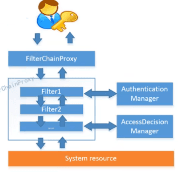

Spring Security是一个功能强大且高度可定制的身份验证和访问控制框架。它实际上是保护基于spring的应用程序的标准。

认证，授权（vip1，vip2，vip3）

主要是Oauth2的支持；

功能权限

访问权限


# 快速入手

新建SpringBoot项目，web模块，thymeleaf模块

导入静态资源


编写Controller

```java
@Controller
public class RouterController {
	//进首页
   @RequestMapping({"/","/index"})
   public String index(){
       return "index";
  }
	//登录页面
   @RequestMapping("/toLogin")
   public String toLogin(){
       return "views/login";
  }
	//VIP1才能进入的页面，传ID
   @RequestMapping("/level1/{id}")
   public String level1(@PathVariable("id") int id){
       return "views/level1/"+id;
  }
	//VIP2才能进入的页面，传ID
   @RequestMapping("/level2/{id}")
   public String level2(@PathVariable("id") int id){
       return "views/level2/"+id;
  }
	//VIP3才能进入的页面，传ID
   @RequestMapping("/level3/{id}")
   public String level3(@PathVariable("id") int id){
       return "views/level3/"+id;
  }
}
```

现在的页面


要做成有些页面某些人访问不了。

登录之后每个人看到的不一样，某些东西不能展示。


几个重要的类

- WebSecurityConfigurerAdapter：自定义Security策略，适配器模式
- AuthenticationManagerBuilder：自定义认证策略，建造者模式。
- @EnableWebSecurity：开启WebSecurity模式


使用

1：引入SpringSecurity模块

```xml
<dependency>
   <groupId>org.springframework.boot</groupId>
   <artifactId>spring-boot-starter-security</artifactId>
</dependency>
```

2：编写SpringSecurity配置类

```java
@EnableWebSecurity // 开启WebSecurity模式
//必须继承WebSecurityConfigurerAdapter
public class SecurityConfig extends WebSecurityConfigurerAdapter {
    
    //根据自己需求重写configure方法，定义授权规则
    @Override
	protected void configure(HttpSecurity http) throws Exception {
   		// 定制请求的授权规则
   		// 首页所有人可以访问
  		http.authorizeRequests().antMatchers("/").permitAll()
  			.antMatchers("/level1/**").hasRole("vip1")
  			.antMatchers("/level2/**").hasRole("vip2")
  			.antMatchers("/level3/**").hasRole("vip3");
        //没有权限跳转到登录页面,需要开启登录
        http.formaLogin();
        
        //开启注销功能.前端请求为 /logout,默认注销完成调到登录，指定跳到首页
        http.logout().logoutSuccessUrl("/");
        
	}
    
    //定义认证规则
    @Override
    protected void configure(AuthenticationManagerBuilder auth) throws Exception {
       //在内存中定义，也可以在jdbc中去拿....
       //Spring security 5.0中新增了多种加密方式，也改变了密码的格式。
       //要想我们的项目还能够正常登陆，需要修改一下configure中的代码。我们要将前端传过来的密码进行某种方式加密
       //spring security 官方推荐的是使用bcrypt加密方式。
       auth.inMemoryAuthentication().passwordEncoder(new BCryptPasswordEncoder())
              .withUser("kuangshen").password(new BCryptPasswordEncoder().encode("123456")).roles("vip2","vip3")
              .and()
              .withUser("root").password(new BCryptPasswordEncoder().encode("123456")).roles("vip1","vip2","vip3")
              .and()
              .withUser("guest").password(new BCryptPasswordEncoder().encode("123456")).roles("vip1","vip2");
	}
    
    //实际项目中的认证
        @Autowired
    private UserDetailsService userDetailsService;

    @Autowired
    public void configureAuthentication(AuthenticationManagerBuilder authenticationManagerBuilder) throws Exception {
        authenticationManagerBuilder
                // 设置UserDetailsService
                .userDetailsService(this.userDetailsService)
                // 使用BCrypt进行密码的hash
                .passwordEncoder(passwordEncoder());
        //remember me
        //默认保留14天
        authenticationManagerBuilder.eraseCredentials(false);
    }    
}  
```


新需求，如果用户没有登录的时候，导航栏上只显示登录按钮，用户登录之后，导航栏可以显示登录的用户信息及注销按钮！还有就是，比如kuangshen这个用户，它只有 vip2，vip3功能，那么登录则只显示这两个功能，而vip1的功能菜单不显示！这个就是真实的网站情况了！该如何做呢？

我们需要结合thymeleaf中的一些功能

sec：authorize="isAuthenticated()":是否认证登录！来显示不同的页面。

1：导入依赖

```xml
<!-- https://mvnrepository.com/artifact/org.thymeleaf.extras/thymeleaf-extras-springsecurity4 -->
<dependency>
   <groupId>org.thymeleaf.extras</groupId>
   <artifactId>thymeleaf-extras-springsecurity5</artifactId>
   <version>3.0.4.RELEASE</version>
</dependency>
```

2：修改前端页面

导入命名空间

```
xmlns:sec="http://www.thymeleaf.org/thymeleaf-extras-springsecurity5"
```

修改导航栏，增加认证判断

```html
<!--登录注销-->
<div class="right menu">

   <!--如果未登录-->
   <div sec:authorize="!isAuthenticated()">
       <a class="item" th:href="@{/login}">
           <i class="address card icon"></i> 登录
       </a>
   </div>

   <!--如果已登录-->
   <div sec:authorize="isAuthenticated()">
       <a class="item">
           <i class="address card icon"></i>
          用户名：<span sec:authentication="principal.username"></span>
          角色：<span sec:authentication="principal.authorities"></span>
       </a>
   </div>

   <div sec:authorize="isAuthenticated()">
       <a class="item" th:href="@{/logout}">
           <i class="address card icon"></i> 注销
       </a>
   </div>
</div>
```

版本问题可能会导致一些问题


配置登录页面

http.formLogin().loginPage(“toLogin”);


# 过滤器

过滤器链加载：

我们在web.xml中配置了一个名称为springSecurityFilterChain的过滤器DelegatingFilterProxy，DelegatingFilterProxy通过springSecurityFilterChain这个名称，得到了一个FilterChainProxy过滤器，然后调用常见的15个过滤器

SecurityContextPersistenceFilter

首当其冲的一个过滤器，作用之重要，自不必多言。

SecurityContextPersistenceFilter主要是使用SecurityContextRepository在session中保存或更新一SecurityContext，并将SecurityContext给以后的过滤器使用，来为后续filter建立所需的上下文。SecurityContext中存储了当前用户的认证以及权限信息。

WebAsyncManagerIntegrationFilter

此过滤器用于集成SecurityContext到Spring异步执行机制中的WebAsyncManager

HeaderWriterFilter

向请求的Header中添加相应的信息,可在http标签内部使用security:headers来控制（仅限于JSP页面）

CsrfFilter

csrf又称跨域请求伪造，SpringSecurity会对所有post请求验证是否包含系统生成的csrf的token信息，
如果不包含，则报错。起到防止csrf攻击的效果。

LogoutFilter

匹配URL为/logout的请求，实现用户退出,清除认证信息。

UsernamePasswordAuthenticationFilter

认证操作全靠这个过滤器，默认匹配URL为/login且必须为POST请求。

DefaultLoginPageGeneratingFilter

如果没有在配置文件中指定认证页面，则由该过滤器生成一个默认认证页面。

DefaultLogoutPageGeneratingFilter

由此过滤器可以生产一个默认的退出登录页面

BasicAuthenticationFilter

此过滤器会自动解析HTTP请求中头部名字为Authentication，且以Basic开头的头信息。

RequestCacheAwareFilter

通过HttpSessionRequestCache内部维护了一个RequestCache，用于缓存HttpServletRequest

SecurityContextHolderAwareRequestFilter

针对ServletRequest进行了一次包装，使得request具有更加丰富的API

AnonymousAuthenticationFilter

当SecurityContextHolder中认证信息为空,则会创建一个匿名用户存入到SecurityContextHolder中。
spring security为了兼容未登录的访问，也走了一套认证流程，只不过是一个匿名的身份。

> 当用户以游客身份登录的时候，也就是可以通过设置某些接口可以匿名访问

SessionManagementFilter

SecurityContextRepository限制同一用户开启多个会话的数量

ExceptionTranslationFilter

异常转换过滤器位于整个springSecurityFilterChain的后方，用来转换整个链路中出现的异常

FilterSecurityInterceptor

获取所配置资源访问的授权信息，根据SecurityContextHolder中存储的用户信息来决定其是否有权
限

> 该过滤器限制哪些资源可以访问，哪些不能够访问


密码加密与解析器：


记住我：直接链式标记为rememberme();并且指定去哪加载用户信息，及后台将用户信息保存下来；

拦截策略：

hasRole ：拥有某个角色可以访问；


# 原理

认证与授权，对所有请求进行拦截，通过一系列的filter进行验证；

当初始化Spring Security时，在WebSecurityConfiguration 中会往Spring容器中注入1一个名为 ` springSecurityFilterChain ` 的Servlet过滤器，类型为：FilterChainProxy ，外部请求都会经过这个类；




而FilterChainProxy 只是一个代理，真正起作用的是一系列的Filter，


认证流程：

过滤器


授权流程：

认证完成后，对访问的资源进行检查，


会话控制：


# 分布式授权服务

分布式环境下认证方案主要有基于Session和基于Token两种方案；

1：基于Session的认证方式，要保证Session同步到各个服务中；方式一般有：

Session的复制，在多台服务器之间同步Session，并使session保持一致；

Session的黏贴，强制指定后续所有请求落在同一台机器上；

Session的集中存储：将Session存入分布式缓存中；

2：基于Token的认证方式：

一般选择token，


