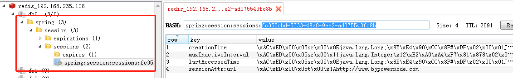
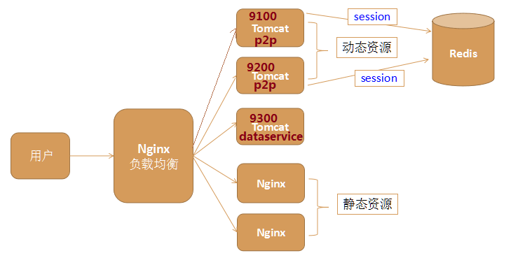
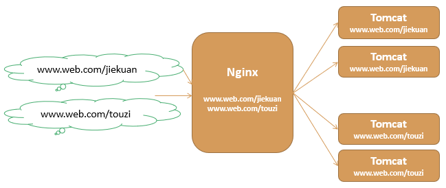
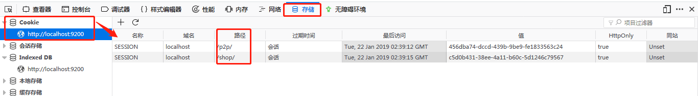
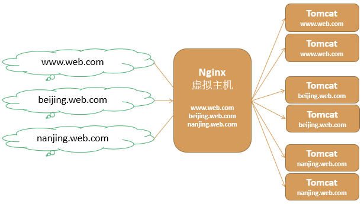
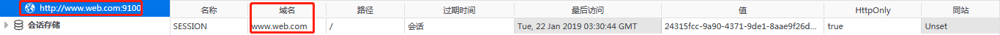

# Session会话管理概述

### Session机制

由于HTTP协议是无状态的协议，一次浏览器和服务器的交互过程就是：

浏览器：你好吗？

服务器：很好！

这就是一次会话，对话完成后，这次会话就结束了，服务器端并不能记住这个人，下次再对话时，服务器端并不知道是上一次的这个人，所以服务端需要记录用户的状态时，就需要用某种机制来识别具体的用户，这个机制就是Session。

### Cookie

服务端如何识别特定的客户？

这个时候需要使用Cookie。每次HTTP请求的时候，客户端都会发送相应的Cookie信息到服务端。

实际上大多数的应用都是用 Cookie来实现Session跟踪的，第一次创建Session时，服务端会在HTTP协议中向客户端 Cookie中记录一个SessionID，以后每次请求把这个会话ID发送到服务器，这样服务端就知道客户端是谁了。

### url重写

那么如果客户端的浏览器禁用了 Cookie 怎么办？

一般这种情况下，会使用一种叫做URL重写的技术来进行session会话跟踪，即每次HTTP交互，URL后面都会被附加上一个诸如
sessionId=xxxxx 这样的参数，服务端据此来识别客户端是谁

## Session会话管理及带来的问题

在Web项目开发中，Session会话管理是一个很重要的部分，用于存储与记录用户的状态或相关的数据。

通常情况下session交由容器（tomcat）来负责存储和管理，但是如果项目部署在多台tomcat中，则session管理存在很大的问题

多台tomcat之间无法共享session，比如用户在tomcat
A服务器上已经登录了，但当负载均衡跳转到tomcat B时，由于tomcat
B服务器并没有用户的登录信息，session就失效了，用户就退出了登录

一旦tomcat容器关闭或重启也会导致session会话失效

因此如果项目部署在多台tomcat中，就需要解决session共享的问题

## Session会话共享方案

第一种是使用容器扩展插件来实现，比如基于Tomcat的tomcat-redis-session-manager插件，基于Jetty的jetty-session-redis插件、memcached-session-manager插件；这个方案的好处是对项目来说是透明的，无需改动代码，但是由于过于依赖容器，一旦容器升级或者更换意味着又得重新配置

其实底层是，复制session到其它服务器，所以会有一定的延迟，也不能部署太多的服务器。

第二种是使用Nginx负载均衡的ip_hash策略实现用户每次访问都绑定到同一台具体的后台tomcat服务器实现session总是存在

这种方案的局限性是ip不能变，如果手机从北京跳到河北，那么ip会发生变化；另外负载均衡的时候，如果某一台服务器发生故障，那么会重新定位，也会跳转到别的机器。

第三种是自己写一套Session会话管理的工具类，在需要使用会话的时候都从自己的工具类中获取，而工具类后端存储可以放到Redis中，这个方案灵活性很好，但开发需要一些额外的时间。

第四种是使用框架的会话管理工具，也就是我们要介绍的Spring
session，这个方案既不依赖tomcat容器，又不需要改动代码，由Spring
session框架为我们提供，可以说是目前非常完美的session共享解决方案

# Spring Session入门

## 简介

Spring Session是Spring家族中的一个子项目，它提供一组API和实现，用于管理用户的session信息

它把servlet容器实现的httpSession替换为spring-session，专注于解决session管理问题，Session信息存储在Redis中，可简单快速且无缝的集成到我们的应用中；

官网：<https://spring.io/>

Spring Session的特性

-   提供用户session管理的API和实现

-   提供HttpSession，以中立的方式取代web容器的session，比如tomcat中的session

-   支持集群的session处理，不必绑定到具体的web容器去解决集群下的session共享问题

## 案例

创建向session放数据的servlet

```java
@WebServlet(urlPatterns = "/setSession")
public class SetSessionServlet extends HttpServlet{
    protected void doPost(HttpServletRequest request,HttpServletResponse response) throws ServletException{
        doGet(request,response);
    }
    protected void doGett(HttpServletRequest request,HttpServletResponse response) throws ServletException{
        request.getSession().setAttribute("url","http://www.XXX.com");
        response.getWriter().writer("ok");
    }
}
```

创建从session取数据的servlet

```java
@WebServlet(urlPatterns = "/getSession")
public class GetSessionServlet extends HttpServlet{
    protected void doPost(HttpServletRequest request,HttpServletResponse response) throws ServletException{
        doGet(request,response);
    }
    protected void doGett(HttpServletRequest request,HttpServletResponse response) throws ServletException{
        String url = (String)request.getSession().getAttribute("url");
        response.getWriter().writer(url==null?"NO SESSION":url);
    }
}
```

向pom.xml文件中添加servlet及jsp的配置


### SpringSession集成配置

在pom.xml文件中，添加Spring Session相关的依赖

在web.xml文件中配置springSessionRepositoryFilter过滤器

```xml
<filter>  
	<filter-name>springSessionRepositoryFilter</filter-name>  
	<filter-class>org.springframework.web.filter.DelegatingFilterProxy</filter-class>  
</filter>  
<filter-mapping>  
	<filter-name>springSessionRepositoryFilter</filter-name>  
	<url-pattern>/*</url-pattern>  
</filter-mapping>
```

在web.xml文件中加载Spring配置文件

创建applicationContext-session.xml

配置一个RedisHttpSessionConfiguration类

```txt
<context:annotation-config/>：用于激活已经在Spring容器中注册的bean或者注解，因为我们通过容器创建的bean中，底层有可能使用了其它的注解，我们通过<context:component-scan>就不能指定具体的包了，所以可以使用<context:annotation-config/>激活
```

配置Spring-data-redis


配置redis.properties文件


### 部署测试

思路

为了演示session的共享，我们这里配置两个tomcat服务器，端口号分别为9100和9200，将我们上面创建好的项目分别部署到这两台服务器上。一台服务器执行放session，另一台服务器执行取session的操作

启动Linux上的redis服务器

启动两台tomcat服务器

-   在浏览器中访问tomcat9100服务器的setSession

    

-   在浏览器中访问tomcat9200服务器的getSession


分析

>   tomcat9200服务器上的项目可以访问tomcat9100上的session，说明session共享成功

进一步验证

打开Resis客户端工具（RedisDesktopManager），查看Redis里面的session数据

其实标准的redis的key格式就是用冒号分割，客户端工具会以目录的形式展示



# Spring Session常见的应用场景

## 同域名下相同项目（集群环境）Session共享

在同一个域名下，比如：[www.p2p.com](http://www.p2p.com)

同一个项目，部署了多台tomcat，这就是典型的集群。我们的入门案例就属于这种应用场景，只不过在实际开发的过程中，我们如果存在了tomcat集群，那么肯定会使用nginx进行负载均衡，那么这种情况下我们该如何处理。

架构图




## 同域名下不同项目Session共享

在同一个域名下，有多个不同的项目（项目的上下文根不一样）比如：

www.web.com/p2p

www.web.com/shop



分析Session共享失败原因

我们通过浏览器提供的开发工具可以发现，这两个请求的cookie的路径(path)不一致，虽然我们已经加了Spring Session共享机制，但是后台服务器认为这是两个不同的会话(session)，可以通过Redis客户端工具（Redis Destop Mananger）查看，先清空，然后访问，发现是维护了两个不同的session，所以不能实现共享



做法：

设置Cookie路径为根/上下文

```xml
<property name="cookiePath" value="/"/>
```


## 同根域名不同二级子域名下的项目Session共享

同一个根域名，不同的二级子域名

比如：

www.web.com

beijing.web.com

nanjing.web.com

如图：




分析Session共享失败原因

我们通过浏览器提供的开发工具可以发现，虽然这两个cookie的路径(path)都设置为了“/”，但是这两个cookie的域名不一致，虽然我们已经加了SpringSession共享机制，但是后台服务器同样认为这是两个不同的会话(session)，可以通过Redis客户端工具查看，先清空，然后访问，发现是维护了两个不同的session，所以不能实现共享，也就是说后台区分是否同一个session和路径和域名有关。




做法

-   设置Cookie路径为根/上下文，项目名一样的话，此步骤可以省略

-   设置cookie的域名为根域名 web.com

```xml
<property name="domainName" value="myweb.com"/>
```


## 单点登录（了解）

不同根域名下的项目实现Session共享，

比如阿里巴巴这样的公司，有多个业务线，多个网站，用户在一个网站登录，那么其他网站也会是登录了的状态，比如：登录了淘宝网，则天猫网也是登录的；

www.taobao.com

www.tmall.com

比如：

www.web.com

www.p2p.com

www.dai.com

对于不同根域名的场景，要实现一处登录，处处登录，**Spring Session不支持**

单点登录(Single Sign On)，简称为SSO，是流行的企业业务整合的解决方案之一，SSO是指在多个应用系统中，用户只需要登录一次就可以访问所有相互信任的应用系统

# 原理

1：执行流程


