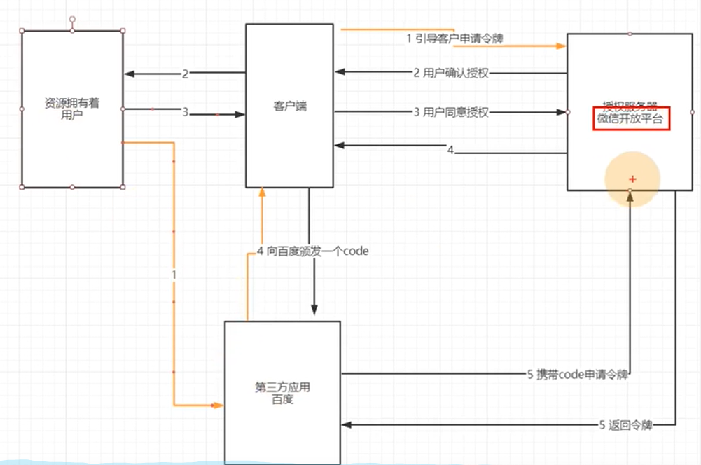

基于session和基于JWT的方式的主要区别就是用户的状态保存的位置，**session是保存在服务端**的，而**JWT是保存在客户端**的。

优缺点：

JWT保存在客户端，在分布式环境下不需要做额外工作。而session因为保存在服务端，分布式环境下需要实现多机数据共享

session一般需要结合Cookie实现认证，所以需要浏览器支持cookie，因此移动端无法使用session认证方案

安全：

JWT的payload使用的是base64编码的，因此在JWT中不能存储敏感数据。而session的信息是存在服务端的，相对来说更安全。

性能：

经过编码之后JWT将非常长，cookie的限制大小一般是4k，cookie很可能放不下，所以JWT一般放在local storage里面。并且用户在系统中的每一次http请求都会把JWT携带在Header里面，HTTP请求的Header可能比Body还要大。而sessionId只是很短的一个字符串，因此使用JWT的HTTP请求比使用session的开销大得多。

一次性：

无状态是JWT的特点，但也导致了这个问题，JWT是一次性的。想修改里面的内容，就必须签发一个新的JWT

- 无法废弃 一旦签发一个JWT，在到期之前就会始终有效，无法中途废弃。若想废弃，一种常用的处理手段是结合redis。
- 续签 如果使用JWT做会话管理，传统的cookie续签方案一般都是框架自带的，session有效期30分钟，30分钟内如果有访问，有效期被刷新至30分钟。一样的道理，要改变JWT的有效时间，就要签发新的JWT。最简单的一种方式是每次请求刷新JWT，即每个HTTP请求都返回一个新的JWT。这个方法不仅暴力不优雅，而且每次请求都要做JWT的加密解密，会带来性能问题。另一种方法是在redis中单独为每个JWT设置过期时间，每次访问时刷新JWT的过期时间

# 流程

## 认证流程：

**基于session的认证流程**

- 用户在浏览器中输入用户名和密码，服务器通过密码校验后生成一个session并保存到数据库
- 服务器为用户生成一个sessionId，并将具有sesssionId的cookie放置在用户浏览器中，在后续的请求中都将带有这个cookie信息进行访问
- 服务器获取cookie，通过获取cookie中的sessionId查找数据库判断当前请求是否有效

**基于JWT的认证流程**

- 用户通过前端系统发送登录请求，请求中携带账号，密码，验证码等信息；
- 前端登录请求首先请求到网关服务，网关服务将请求路由到权限微服务；
- 权限微服务进行认证操作，如果认证通过则 生成jwt token  返回给前端，同时将用户用户拥有的资源权限使用userId 作为key保存到缓存中；
- 前端获取到token，存储到cookie或者local storage中，在后续的请求中都将带有这个token信息进行访问
- 服务器获取token值，通过查找数据库判断当前token是否有效

## 鉴权流程：

1：用户认证后访问其他功能时将jwt token 放在请求头中，首先经过网关服务处理；

2：在网关服务的过滤器中获取请求头中的token并进行解析，将解析出的用户相关数据放在zuul的header中；

3：在网关服务的过滤器中进行鉴权相关处理；

# 权限方案：

传统的RBAC权限设计

用户—角色——权限；

如果用户和权限直接关联，当批量赋权或者回收权限时只能一个个的去操作；

用户和角色的关系是多对多的；

用户组：对于用户组来说，是把众多的用户划分为一组，进行批量授予角色，即，批量授予权限。举个栗子，对于部门来说，一个部门拥有一万多个员工，这些员工都拥有相同的角色，如果没有用户组，可能需要一个个的授予相关的角色，在拥有了用户组以后，只需要，把这些用户全部划分为一组，然后对该组设置授予角色，就等同于对这些用户授予角色。

数据模型：

```txt
组织表;公司表;租户表;
岗位表;
用户表;
角色表;

资源表：
菜单表；

用户角色关系表；
角色权限关系表；
角色组织关系表；
```

菜单和资源其实都属于权限，也有设计成一张表的；

菜单权限：对应系统的菜单，不同用户拥有不同的菜单权限；

资源权限：对应某个功能的访问接口，拥有权限这可以访问此接口


多租户：

甲方要求保存在自己的数据库，不能保存在我们的库里；

每个小区定制化开发，部分表可能都不一样；

动态添加租户和租户数据库；不down机动态添加数据库；

注意点：

隔离性，不能访问到别的小区的数据；或则公司直接保存在不同的表中；

方案三：连接多个数据库，库里的数据可能不一样；为不同租户提供独立的数据库，有助于简化数据模型的扩展设计；增加了数据库的成本；

多租户+分布式会有什么问题？

InnoDB的自增值问题，雪花算法；

多数据库的事务问题；XA两段式提交；


多租户的方案：

方案一：每个租户一套数据库，数据隔离级别最高，安全性最好，但是维护成本也是最高的，一段需要升级，所有的库都要升级；

方案二：共享数据库，一个数据库，每个租户一个Schema（不同数据库可能设置的不同，可以理解为用户）一般都使用中间件如Mycat进行分区；

方案三：共享数据库，共享数据架构；成本比较低；安全性要求性越高，越需要隔离；

存储的数据量越大，越趋向于隔离，小公司的错误不能影响大公司的使用；


问题：维护在客户本地的一些配置，有的客户运维要一些表的说明维护，但是我们不能给，防止他们直接添加菜单给他们自己添加一些其他的功能；


# 网关服务

在网关服务中，通过过滤器实现jwt token 解析与鉴权的相关处理；

在网关服务中会通过Feign来调用权限服务获取相关信息，所以需要定义API接口和相关的熔断器；

Zuul：

启动类注解：

配置类解决跨域问题；


过滤器继承ZuulFilter；

判断当前请求Uri是否需要忽略；

1：静态资源；

2：错误，登录等；


网关抛异常，不进行路由；


TokenContextFilter：解析请求头中的jwt token 并将解析出的用户信息放入Zuul的header中供后面使用；

AccessFilte：进行鉴权相关处理

```txt
第1步：判断当前请求uri是否需要忽略
第2步：获取当前请求的请求方式和uri，拼接成GET/user/page这种形式，称为权限标识符
第3步：从缓存中获取所有需要进行鉴权的资源(同样是由资源表的method字段值+url字段值拼接成)，如果没有获取到则通过Feign调用权限服务获取并放入缓存中
第4步：判断这些资源是否包含当前请求的权限标识符，如果不包含当前请求的权限标识符，则返回未经授权错误提示
第5步：如果包含当前的权限标识符，则从zuul header中取出用户id，根据用户id取出缓存中的用户拥有的权限，如果没有取到则通过Feign调用权限服务获取并放入缓存，判断用户拥有的权限是否包含当前请求的权限标识符
第6步：如果用户拥有的权限包含当前请求的权限标识符则说明当前用户拥有权限，直接放行
第7步：如果用户拥有的权限不包含当前请求的权限标识符则说明当前用户没有权限，返回未经授权错误提示
```


# OAuth2.0

允许用户授权第三方应用程序访问他们存储在另外的服务器的提供者上，

四种认证方式：

1：授权码模式

三方不互信；



2：简化模式

授权服务器向第三方直接下发令牌，而不是像上图一样下发code，然后再去授权服务器取令牌

3：密码模式

微信开放平台直接把密码给第三方；这种基于是绝对信任的，基本不用；
