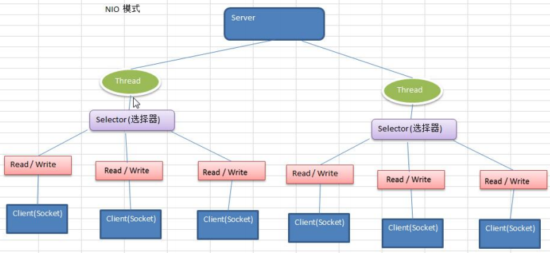
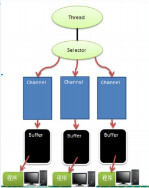
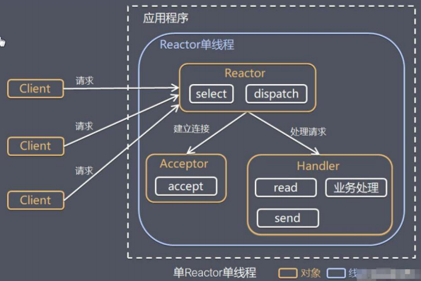
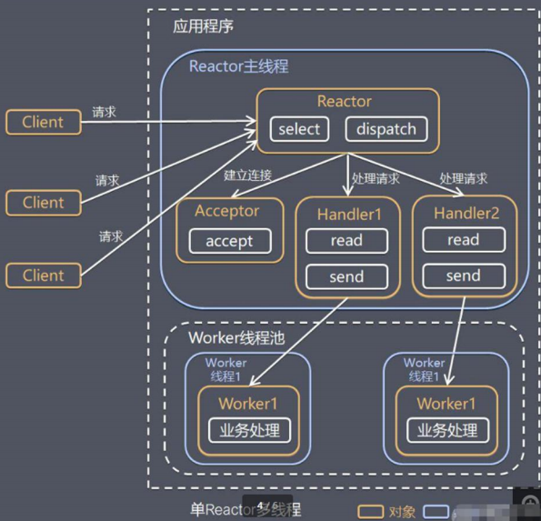
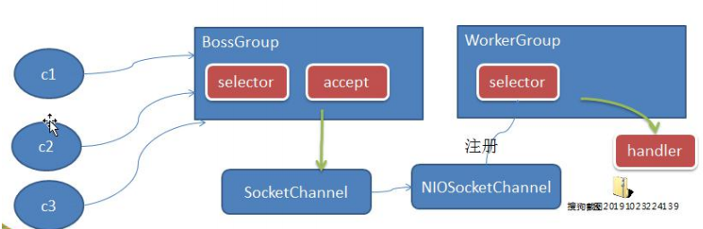
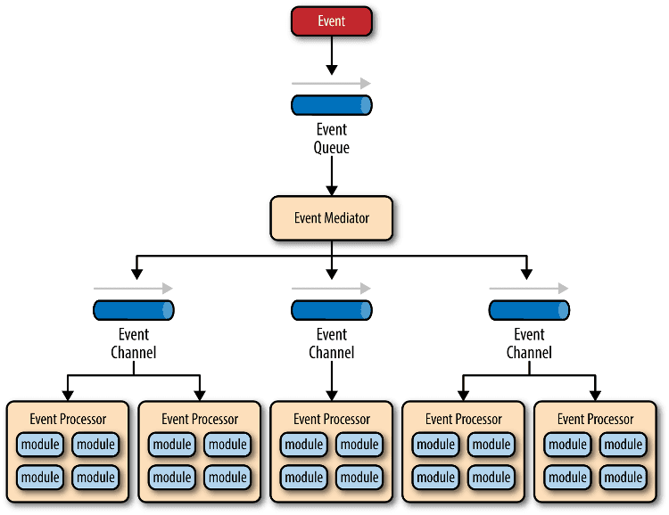
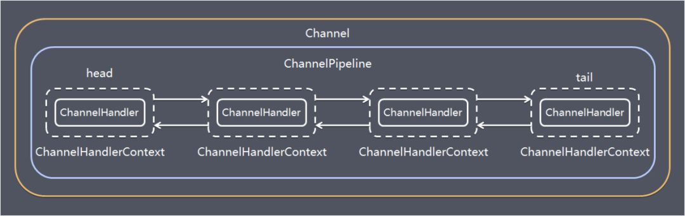
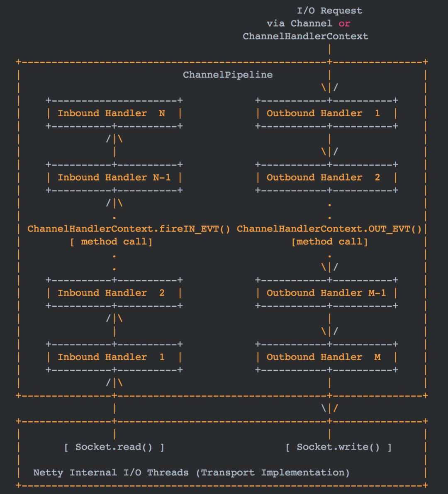
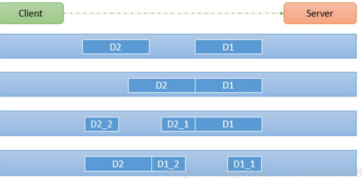

# 第一章：IO模型

Java BIO :同步并阻塞(传统阻塞型)，服务器实现模式为一个连接一个线程，即客户端有连接请求时服务器端就需要启动一个线程进行处理，如果这个连接不做任何事情会造成不必要的线程开销

Java NIO :同步非阻塞，服务器实现模式为一个线程处理多个请求(连接)，即客户端发送的连接请求都会注册到多路复用器上，多路复用器轮询到连接有IO请求就进行处理



Java AIO(NIO.2):异步非阻塞，AIO引入异步通道的概念，采用了Proactor 模式，简化了程序编写，有效的请求才启动线程，它的特点是先由操作系统完成后才通知服务端程序启动线程去处理，一般适用于连接数较多且连接时间较长的应用


BIO适用于连接数目小且固定的

NIO适用于连接数目多且连接短的

AIO适用于连接数目多且连接长的。


BIO以流的方式处理数据,而 NIO以块的方式处理数据,块I/O 的效率比流IO高很多

BIO是阻塞的，NIO则是非阻塞的

BIO基于字节流和字符流进行操作，而NIO 基于Channel(通道)和 Buffer(缓冲区)进行操作，数据总是从通道读取到缓冲区中，或者从缓冲区写入到通道中。Selector(选择器)用于监听多个通道的事件（比如:连接请求，数据到达等），因此使用单个线程就可以监听多个客户端通道

## BIO


**特点**

- 每个请求都需要独立的线程完成数据read，业务处理，数据write的完整操作

**问题**

- 当并发数较大时，需要创建大量线程来处理连接，系统资源占用较大

- 连接建立后，如果当前线程暂时没有数据可读，则线程就阻塞在read操作上，造成线程资源浪费

## NIO

NIO有三大核心部分:Channel(通道)，Buffer(缓冲区), Selector(选择器)

NIO是面向缓冲区﹐或者面向块编程的。数据读取到一个它稍后处理的缓冲区，需要时可在缓冲区中前后移动，这就增加了处理过程中的灵活性，使用它可以提供非阻塞式的高伸缩性网络

Java NIO的非阻塞模式，使一个线程从某通道发送请求或者读取数据，但是它仅能得到目前可用的数据，如果目前没有数据可用时，就什么都不会获取，而不是保持线程阻塞，所以直至数据变的可以读取之前，该线程可以继续做其他的事情。非阻塞写也是如此，一个线程请求写入一些数据到某通道，但不需要等待它完全写入，这个线程同时可以去做别的事情。

通俗理解:NIO是可以做到用一个线程来处理多个操作的。假设有10000个请求过来,根据实际情况，可以分配50或者100个线程来处理。不像之前的阻塞IO那样，非得分配10000个。

HTTP2.0使用了多路复用的技术，做到同一个连接并发处理多个请求，而且并发请求的数量比HTTP1.1大了好几个数量级



1)每个channel都会对应一个Buffer

2)Selector对应一个线程，一个线程对应多个channel(连接)

3)该图反应了有三个channel 注册到该selector /l程序

4)程序切换到哪个channel是有事件决定的, Event 就是一个重要的概念

5) Selector会根据不同的事件，在各个通道上切换

6) Buffer就是一个内存块﹐底层是有一个数组

7)数据的读取写入是通过Buffer，这个和 BIO , BIO中要么是输入流，或者是输出流，不能双向，但是 NIO 的 Buffer是可以读也可以写,需要flip方法切换channel是双向的，可以返回底层操作系统的情况，比如Linux ,底层的操作系统。通道就是双向的.

### Buffer缓冲区

传统的I/O是面向字节流或字符流的，以流式的方式顺序地从一个Stream 中读取一个或多个字节, 因此也就不能随意改变读取指针的位置。

在NIO中, 抛弃了传统的 I/O流, 而是引入了Channel和Buffer的概念. 在NIO中, 只能从Channel中读取数据到Buffer中或将数据 Buffer 中写入到 Channel。

基于buffer操作不像传统IO的顺序操作, NIO 中可以随意地读取任意位置的数据

### Channel通道

与Socket类和ServerSocket类相对应，NIO也提供了SocketChannel和ServerSocketChannel两种套接字通道实现。

### Select选择器

Selector能够检测多个注册的通道上是否有事件发生(注意:多个Channel 以事件的方式可以注册到同一个Selector)，如果有事件发生，便获取事件然后针对每个事件进行相应的处理。这样就可以只用一个单线程去管理多个通道，也就是管理多个连接和请求。

### NIO与零拷贝

零拷贝是网络编程的关键，在Java中，常用的零拷贝有mmap（内存映射）和sendFile。

我们说零拷贝，是从操作系统的角度来说的。因为内核缓冲区之间，没有数据是重复的(只有 kernel buffer有一份数据）。零拷贝不仅仅带来更少的数据复制，还能带来其他的性能优势，例如更少的上下文切换，更少的CPU缓存伪共享以及无CPU校验和计算。

（1）mmap优化

mmap通过内存映射，将文件映射到内核缓冲区，同时，用户空间可以共享内核空间的数据。这样，在进行网络传输时，就可以减少内核空间到用户控件的拷贝次数。

（2）sendFile优化

Linux 2.1版本提供了sendFile函数，其基本原理如下:数据根本不经过用户态，直接从内核缓冲区进入到Socket Buffer，同时，由于和用户态完全无关，就减少了一次上下文切换

Linux在2.4 版本中，做了一些修改，避免了从内核缓冲区拷贝到Socket buffer 的操作，直接拷贝到协议栈，从而再一次减少了数据拷贝。

（3）区别

mmap适合小数据量读写，sendFile适合大文件传输。

mmap需要4次上下文切换，3次数据拷贝; sendFile需要3次上下文切换，最少2次数据拷贝。

SendFile可以利用DMA 方式，减少CPU拷贝，mmap则不能（必须从内核拷贝到Socket缓冲区)。


## AIO

JDK7引入了Asynchronous l/O，即 AIO。在进行IO 编程中，常用到两种模式:Reactor和 Proactor。 Java 的NIO 就是 Reactor，当有事件触发时，服务器端得到通知，进行相应的处理。

AIO 即 NIO2.0，叫做异步不阻塞的IO。AIO引入异步通道的概念，采用了Proactor 模式，简化了程序编写，有效的请求才启动线程，它的特点是先由操作系统完成后才通知服务端程序启动线程去处理，一般适用于连接数较多且连接时间较长的应用


netty提供了零拷贝的buffer，在传输数据时，最终处理的数据会需要对单个传输的报文，进行组合和拆分，Nio原生的ByteBuffer无法做到，netty通过提供的Composite(组合)和Slice(拆分)两种buffer来实现零拷贝；


## 补：Linux下的五种IO模型

此部分是基础知识，也是扩展，不想看的可以直接跳过，其实本身对Netty理解没有多少影响。

### 1：阻塞IO模型


### 2：非阻塞IO模型

### 3：IO复用模型

主要是select和epoll；对一个IO端口，两次调用，两次返回，比阻塞IO并没有什么优越性；关键是能实现同时对多个IO端口进行监听；

 I/O复用模型会用到select、poll、epoll函数，这几个函数也会使进程阻塞，但是和阻塞I/O所不同的的，这两个函数可以同时阻塞多个I/O操作。而且可以同时对多个读操作，多个写操作的I/O函数进行检测，直到有数据可读或可写时，才真正调用I/O操作函数。

select、poll、epoll简介 

epoll跟select都能提供多路I/O复用的解决方案。在现在的Linux内核里有都能够支持，其中epoll是Linux所特有，而select则应该是POSIX所规定，一般[操作系统](http://lib.csdn.net/base/operatingsystem)均有实现

select：

select本质上是通过设置或者检查存放fd标志位的[数据结构](http://lib.csdn.net/base/datastructure)来进行下一步处理。这样所带来的缺点是：

1、 单个进程可监视的fd数量被限制，即能监听端口的大小有限。

   一般来说这个数目和系统内存关系很大，具体数目可以cat /proc/sys/fs/file-max察看。32位机默认是1024个。64位机默认是2048.

2、 对socket进行扫描时是线性扫描，即采用轮询的方法，效率较低：

​    当套接字比较多的时候，每次select()都要通过遍历FD_SETSIZE个Socket来完成调度,不管哪个Socket是活跃的,都遍历一遍。这会浪费很多CPU时间。如果能给套接字注册某个回调函数，当他们活跃时，自动完成相关操作，那就避免了轮询，这正是epoll与kqueue做的。

3、需要维护一个用来存放大量fd的数据结构，这样会使得用户空间和内核空间在传递该结构时复制开销大

poll：

poll本质上和select没有区别，它将用户传入的数组拷贝到内核空间，然后查询每个fd对应的设备状态，如果设备就绪则在设备等待队列中加入一项并继续遍历，如果遍历完所有fd后没有发现就绪设备，则挂起当前进程，直到设备就绪或者主动超时，被唤醒后它又要再次遍历fd。这个过程经历了多次无谓的遍历。

它没有最大连接数的限制，原因是它是基于链表来存储的，但是同样有一个缺点：

1、大量的fd的数组被整体复制于用户态和内核地址空间之间，而不管这样的复制是不是有意义。                                                                   2、poll还有一个特点是“水平触发”，如果报告了fd后，没有被处理，那么下次poll时会再次报告该fd。

epoll:

epoll支持水平触发和边缘触发，最大的特点在于边缘触发，它只告诉进程哪些fd刚刚变为就需态，并且只会通知一次。还有一个特点是，epoll使用“事件”的就绪通知方式，通过epoll_ctl注册fd，一旦该fd就绪，内核就会采用类似callback的回调机制来激活该fd，epoll_wait便可以收到通知

epoll的优点：


1、没有最大并发连接的限制，能打开的FD的上限远大于1024（1G的内存上能监听约10万个端口）；
2、效率提升，不是轮询的方式，不会随着FD数目的增加效率下降。只有活跃可用的FD才会调用callback函数；
    即Epoll最大的优点就在于它只管你“活跃”的连接，而跟连接总数无关，因此在实际的网络环境中，Epoll的效率就会远远高于select和poll。

3、 内存拷贝，利用mmap()文件映射内存加速与内核空间的消息传递；即epoll使用mmap减少复制开销。

select、poll、epoll 区别总结：


1、支持一个进程所能打开的最大连接数

| select | 单个进程所能打开的最大连接数有FD_SETSIZE宏定义，其大小是32个整数的大小（在32位的机器上，大小就是32*32，同理64位机器上FD_SETSIZE为32*64），当然我们可以对进行修改，然后重新编译内核，但是性能可能会受到影响，这需要进一步的测试。 |
| ------ | ------------------------------------------------------------ |
| poll   | poll本质上和select没有区别，但是它没有最大连接数的限制，原因是它是基于链表来存储的 |
| epoll  | 虽然连接数有上限，但是很大，1G内存的机器上可以打开10万左右的连接，2G内存的机器可以打开20万左右的连接 |

2、FD剧增后带来的IO效率问题

| select | 因为每次调用时都会对连接进行线性遍历，所以随着FD的增加会造成遍历速度慢的“线性下降性能问题”。 |
| ------ | ------------------------------------------------------------ |
| poll   | 同上                                                         |
| epoll  | 因为epoll内核中实现是根据每个fd上的callback函数来实现的，只有活跃的socket才会主动调用callback，所以在活跃socket较少的情况下，使用epoll没有前面两者的线性下降的性能问题，但是所有socket都很活跃的情况下，可能会有性能问题。 |

3、 消息传递方式

| select | 内核需要将消息传递到用户空间，都需要内核拷贝动作 |
| ------ | ------------------------------------------------ |
| poll   | 同上                                             |
| epoll  | epoll通过内核和用户空间共享一块内存来实现的。    |

总结：

综上，在选择select，poll，epoll时要根据具体的使用场合以及这三种方式的自身特点。

1、表面上看epoll的性能最好，但是在连接数少并且连接都十分活跃的情况下，select和poll的性能可能比epoll好，毕竟epoll的通知机制需要很多函数回调。

2、select低效是因为每次它都需要轮询。但低效也是相对的，视情况而定，也可通过良好的设计改善

### 4：信号驱动IO

两次调用，两次返回；

  首先我们允许套接口进行信号驱动I/O,并安装一个信号处理函数，进程继续运行并不阻塞。当数据准备好时，进程会收到一个SIGIO信号，可以在信号处理函数中调用I/O操作函数处理数据。

### 5：异步IO模型

数据拷贝的时候进程无需阻塞。

   当一个异步过程调用发出后，调用者不能立刻得到结果。实际处理这个调用的部件在完成后，通过状态、通知和回调来通知调用者的输入输出操作


# 第四章：Netty概述

原生NIO的问题

- NIO的类库和API繁杂，使用麻烦，你需要熟练掌握Selector、ServerSocketChannel、SocketChannel、ByteBuffer等
- 需要具备其它的额外技能做铺垫，例如熟悉Java多线程编程，因为NIO编程涉及到Reactor模式，你必须对多线程和网路编程非常熟悉，才能编写出高质量的NIO程序
- 可靠性能力补齐，开发工作量和难度都非常大。例如客户端面临断连重连、网络闪断、半包读写、失败缓存、网络拥塞和异常码流的处理等等，NIO编程的特点是功能开发相对容易，但是可靠性能力补齐工作量和难度都非常大
- JDK NIO的BUG，例如臭名昭著的epoll bug，它会导致Selector空轮询，最终导致CPU 100%。官方声称在JDK1.6版本的update18修复了该问题，但是直到JDK1.7版本该问题仍旧存在，只不过该bug发生概率降低了一些而已，它并没有被根本解决

Netty

- 设计优雅:适用于各种传输类型的统一API阻塞和非阻塞Socket;基于灵活且可扩展的事件模型，可以清晰地分离关注点;高度可定制的线程模型–单线程，一个或多个线程池.
- 使用方便:详细记录的Javadoc，用户指南和示例;没有其他依赖项，JDK 5(Netty 3.x)或6 (Netty 4.x）就足够了。
- 高性能、吞吐量更高:延迟更低;减少资源消耗;最小化不必要的内存复制。
- 安全:完整的SSL/TLS和 StartTLS支持。

Netty5出现重大bug，稳定版为Netty4


发送报文的逻辑采用异步处理：各个业务点操作时，写相应的请求xml到请求表，后续由tasks轮询请求表，查询各个业务表组织报文，然后发送至队列表，再由另外的tasks将队列表的数据发送至相应的队列。

# 第五章：高性能分析

高性能表现：

- IO 线程模型：同步非阻塞，用最少的资源做更多的事。
- 内存零拷贝：尽量减少不必要的内存拷贝，实现了更高效率的传输。
- 内存池设计：申请的内存可以重用，主要指直接内存。内部实现是用一颗二叉查找树管理内存分配情况。
- 串形化处理读写：避免使用锁带来的性能开销。
- 高性能序列化协议：支持 protobuf 等高性能序列化协议。

Netty作为异步事件驱动的网络，高性能之处主要来自于其I/O模型和线程处理模型，前者决定如何收发数据，后者决定如何处理数据。

## 1：线程模型

不同的线程模式，对程序的性能有很大影响，为了搞清Netty 线程模式，我们来系统的讲解下各个线程模式，最后看看Netty线程模型有什么优越性.

目前存在的线程模型有:

- 传统阻塞 IO服务模型

- Reactor模式：根据Reactor 的数量和处理资源池线程的数量不同，有3种典型的实现

  - 单Reactor单线程;

  - 单Reactor多线程;

  - 主从 Reactor 多线程

Netty 线程模式(Netty主要基于**主从Reactor 多线程模型**做了一定的改进，其中主从 Reactor多线程模型有多个Reactor

### 传统阻塞IO服务模型

采用阻塞IO模型获取输入的数据

每个连接都需要独立的线程完成数据的输入和业务处理

问题：

当并发数很大，就会创建大量的线程，占用很大系统资源连接创建后，如果当前线程暂时没有数据可读，该线程会阻塞在read操作，造成线程资源浪费。

### Reactor模型

Reactor是反应堆的意思，Reactor模型，是指通过一个或多个输入同时传递给服务处理器的服务请求的**事件驱动处理模式**。 服务端程序处理传入多路请求，并将它们同步分派给请求对应的处理线程，Reactor模式也叫Dispatcher模式，即I/O多了复用统一监听事件，收到事件后分发(Dispatch给某进程)，是编写高性能网络服务器的必备技术之一。

Reactor模型中有2个关键组成：

- Reactor
  Reactor在一个单独的线程中运行，负责监听和分发事件，分发给适当的处理程序来对IO事件做出反应。 它就像公司的电话接线员，它接听来自客户的电话并将线路转移到适当的联系人
- Handlers
  处理程序执行I/O事件要完成的实际事件，类似于客户想要与之交谈的公司中的实际官员。Reactor通过调度适当的处理程序来响应I/O事件，处理程序执行非阻塞操作

IO复用结合线程池，就是Reactor模式基本设计思想

基于IO 复用模型:多个连接共用一个阻塞对象，应用程序只需要在一个阻塞对象等待，无需阻塞等待所有连接。当某个连接有新的数据可以处理时，操作系统通知应用程序，线程从阻塞状态返回，开始进行业务处理Reactor 对应的叫法:1.反应器模式2.分发者模式(Dispatcher)3.通知者模式(notifier)


#### 单Reactor单线程



- Select是前面IO 复用模型介绍的标准网络编程API,可以实现应用程序通过一个阻塞对象监听多路连接请求
- Reactor对象通过Select 监控客户端请求事件，收到事件后通过Dispatch进行分发
- 如果是建立连接请求事件，则由Acceptor通过Accept处理连接请求，然后创建一个Handler对象处理连接完成后的后续业务处理
- 如果不是建立连接事件，则 Reactor会分发调用连接对应的 Handler 来响应
- Handler会完成Read→业务处理→Send 的完整业务流程


#### 单Reactor多线程



1)Reactor对象通过select监控客户端请求事件,收到事件后，通过dispatch进行分发

2)如果建立连接请求,则右Acceptor通过accept处理连接请求，然后创建一个Handler对象处理完成连接后的各种事件

3)如果不是连接请求，则由reactor分发调用连接对应的 handler来处理

4) handler 只负责响应事件，不做具体的业务处理,通过read 读取数据后，会分发给后面的worker线程池的某个线程处理业务

5) worker线程池会分配独立线程完成真正的业务，并将结果返回给handler

6)handler 收到响应后，通过send 将结果返回给client

#### 主从REactor多线程


1) Reactor主线程MainReactor对象通过select 监听连接事件,收到事件后，通过Acceptor 处理连接事件

2)当Acceptor处理连接事件后，MainReactor 将连接分配给SubReactor

3) subreactor 将连接加入到连接队列进行监听,并创建handler进行各种事件处理

4)当有新事件发生时，subreactor就会调用对应的 handler 处理

5) handler通过read 读取数据，分发给后面的worker线程处理

6)worker 线程池分配独立的worker线程进行业务处理，并返回结果

7) handler 收到响应的结果后，再通过send将结果返回给client

8) Reactor主线程可以对应多个Reactor子线程，即 MainRecator可以关联多个SubReactor

优点：

响应快，不必为单个同步时间所阻塞，虽然Reactor本身依然是同步的

可以最大程度的避免复杂的多线程及同步问题，并且避免了多线程/进程的切换开销

扩展性好，可以方便的通过增加 Reactor实例个数来充分利用CPU资源

复用性好，Reactor模型本身与具体事件处理逻辑无关，具有很高的复用性

#### Netty模型

Netty主要基于主从Reactors多线程模型多的一定的改进。



1)BossGroup 线程维护Selector ，只关注Accecpt

2)当接收到Accept事件，获取到对应的SocketChannel,封装成NIOScoketChannel并注册到Worker线程(事件循环)，并进行维护

3) 当Worker线程监听到selector 中通道发生自己感兴趣的事件后，就进行处理(就由 handler)，注意handler已经加入到通道

详细原理：


1) Netty 抽象出两组线程池 BossGroup专门负责接收客户端的连接, WorkerGroup专门负责网络的读写

2) BossGroup和 WorkerGroup类型都是 NioEventLoopGroup

3) NioEventLoopGroup相当于一个事件循环组,这个组中含有多个事件循环，每一个事件循环是 NioEventLoop

4) NioEventLoop表示一个不断循环的执行处理任务的线程，每个NioEventLoop 都有一个selector ，用于监听绑定在其上的socket的网络通讯

5)NioEventLoopGroup可以有多个线程，即可以含有多个NioEventLoop

6)每个 Boss NioEventLoop 循环执行的步骤有3步

- 轮询accept事件
- 处理accept事件 ,与client建立连接﹐生成NioScocketChannel，并将其注册到某个worker NIOEventLoop 上的selector
- 处理任务队列的任务，即runAllTasks

  

7)每个Worker NIOEventLoop循环执行的步骤轮询read, write事件处理i/o事件，即 read , write事件，在对应 NioScocketChannel处理处理任务队列的任务，即runAllTasks

8)每个Worker NIOEventLoop处理业务时,会使用pipeline(管道), pipeline中包含了channel，即通过pipeline以获取到对应通道，管道中维护了很多的处理器


虽然Netty的线程模型基于主从Reactor多线程，借用了MainReactor和SubReactor的结构，但是实际实现上，SubReactor和Worker线程在同一个线程池中：

```java
EventLoopGroup bossGroup = new NioEventLoopGroup();
EventLoopGroup workerGroup = new NioEventLoopGroup();
ServerBootstrap server = new ServerBootstrap();
server.group(bossGroup, workerGroup)
.channel(NioServerSocketChannel.class)
```

上面代码中的bossGroup 和workerGroup是Bootstrap构造方法中传入的两个对象，这两个group均是线程池

- bossGroup线程池则只是在bind某个端口后，获得其中一个线程作为MainReactor，专门处理端口的accept事件，**每个端口对应一个boss线程**
- workerGroup线程池会被各个SubReactor和worker线程充分利用

### 补充：事件驱动模型

通常，我们设计一个事件处理模型的程序有两种思路

- 轮询方式
  线程不断轮询访问相关事件发生源有没有发生事件，有发生事件就调用事件处理逻辑。
- 事件驱动方式
  发生事件，主线程把事件放入事件队列，在另外线程不断循环消费事件列表中的事件，调用事件对应的处理逻辑处理事件。事件驱动方式也被称为消息通知方式，其实是设计模式中**观察者模式**的思路。

以GUI的逻辑处理为例，说明两种逻辑的不同：

- 轮询方式
  线程不断轮询是否发生按钮点击事件，如果发生，调用处理逻辑
- 事件驱动方式
  发生点击事件把事件放入事件队列，在另外线程消费的事件列表中的事件，根据事件类型调用相关事件处理逻辑

这里借用O'Reilly 大神关于事件驱动模型解释图




主要包括4个基本组件：

- 事件队列（event queue）：接收事件的入口，存储待处理事件
- 分发器（event mediator）：将不同的事件分发到不同的业务逻辑单元
- 事件通道（event channel）：分发器与处理器之间的联系渠道
- 事件处理器（event processor）：实现业务逻辑，处理完成后会发出事件，触发下一步操作

可以看出，相对传统轮询模式，事件驱动有如下优点：

- 可扩展性好，分布式的异步架构，事件处理器之间高度解耦，可以方便扩展事件处理逻辑

- 高性能，基于队列暂存事件，能方便并行异步处理事件

  


# 第六章：核心模块

### Bootstrap、ServerBootstrap

Bootstrap意思是引导，一个Netty应用通常由一个Bootstrap开始，主要作用是配置整个Netty程序，串联各个组件，Netty中Bootstrap类是客户端程序的启动引导类，ServerBootstrap是服务端启动引导类。

### Future、ChannelFuture

在Netty中所有的IO操作都是异步的，不能立刻得知消息是否被正确处理，但是可以过一会等它执行完成或者直接注册一个监听，具体的实现就是通过Future和ChannelFutures，他们可以注册一个监听，当操作执行成功或失败时监听会自动触发注册的监听事件。

### **Channel**

Netty网络通信的组件，能够用于执行基本的 I/O 操作，如 bind、connect、read、write 等。
Channel为用户提供：

- 当前网络连接的通道的状态（例如是否打开？是否已连接？）

- 网络连接的配置参数 （例如接收缓冲区大小）

- 提供异步的网络I/O操作(如建立连接，读写，绑定端口)，异步调用意味着任何I / O调用都将立即返回，并且不保证在调用结束时所请求的I / O操作已完成。调用立即返回一个ChannelFuture实例，通过注册监听器到ChannelFuture上，可以I / O操作成功、失败或取消时回调通知调用方。

- 支持关联I/O操作与对应的处理程序

  不同协议、不同的阻塞类型的连接都有不同的 Channel 类型与之对应，下面是一些常用的 Channel 类型

- NioSocketChannel，异步的客户端 TCP Socket 连接

- NioServerSocketChannel，异步的服务器端 TCP Socket 连接

- NioDatagramChannel，异步的 UDP 连接

- NioSctpChannel，异步的客户端 Sctp 连接

- NioSctpServerChannel，异步的 Sctp 服务器端连接

这些通道涵盖了 UDP 和 TCP网络 IO以及文件 IO.

### **Selector**

Netty基于Selector对象实现I/O多路复用，通过 Selector, 一个线程可以监听多个连接的Channel事件, 当向一个Selector中注册Channel 后，Selector 内部的机制就可以自动不断地查询(select) 这些注册的Channel是否有已就绪的I/O事件(例如可读, 可写, 网络连接完成等)，这样程序就可以很简单地使用一个线程高效地管理多个 Channel 。

### **NioEventLoop**

NioEventLoop中维护了一个线程和任务队列，支持异步提交执行任务，线程启动时会调用NioEventLoop的run方法，执行I/O任务和非I/O任务：

- I/O任务
  即selectionKey中ready的事件，如accept、connect、read、write等，由processSelectedKeys方法触发。
- 非IO任务
  添加到taskQueue中的任务，如register0、bind0等任务，由runAllTasks方法触发。

两种任务的执行时间比由变量ioRatio控制，默认为50，则表示允许非IO任务执行的时间与IO任务的执行时间相等。

### **NioEventLoopGroup**

NioEventLoopGroup，主要管理eventLoop的生命周期，可以理解为一个线程池，内部维护了一组线程，每个线程(NioEventLoop)负责处理多个Channel上的事件，而一个Channel只对应于一个线程。

### **ChannelHandler**

ChannelHandler是一个接口，处理I / O事件或拦截I / O操作，并将其转发到其ChannelPipeline(业务处理链)中的下一个处理程序。

ChannelHandler本身并没有提供很多方法，因为这个接口有许多的方法需要实现，方便使用期间，可以继承它的子类：

- ChannelInboundHandler用于处理入站I / O事件
- ChannelOutboundHandler用于处理出站I / O操作

或者使用以下适配器类：

- ChannelInboundHandlerAdapter用于处理入站I / O事件

- ChannelOutboundHandlerAdapter用于处理出站I / O操作

- ChannelDuplexHandler用于处理入站和出站事件

  

### **ChannelHandlerContext**

保存Channel相关的所有上下文信息，同时关联一个ChannelHandler对象。

即ChannelHandlerContext中 包含一个具体的事件处理器ChannelHandler ,同时ChannelHandlerContext 中也绑定了对应的 pipeline和 Channel 的信息，方便对ChannelHandler进行调用.

### Pipeline和ChannelPipline

ChannelPipeline是一个重点:

1) ChannelPipeline是一个Handler 的集合，它负责处理和拦截inbound或者 outbound 的事件和操作，相当于一个贯穿Netty 的链。(也可以这样理解: ChannelPipeline是保存ChannelHandler 的 List，用于处理或拦截Channel 的入站事件和出站操作)

2) ChannelPipeline 实现了一种高级形式的拦截过滤器模式，使用户可以完全控制事件的处理方式，以及Channel中各个的ChannelHandler 如何相互交互

3)在Netty 中每个Channel都有且仅有一个ChannelPipeline 与之对应，它们的组成关系如下 



入站Handler处理程序通常处理由图底部的I / O线程生成的入站数据。 通常通过实际输入操作（例如SocketChannel.read（ByteBuffer））从远程读取入站数据。

出站事件由上下方向处理，如图右侧所示。 出站Handler处理程序通常会生成或转换出站传输，例如write请求。 I/O线程通常执行实际的输出操作，例如SocketChannel.write（ByteBuffer）。

保存ChannelHandler的List，用于处理或拦截Channel的入站事件和出站操作。 ChannelPipeline实现了一种高级形式的拦截过滤器模式，使用户可以完全控制事件的处理方式，以及Channel中各个的ChannelHandler如何相互交互。

下图引用Netty的Javadoc4.1中ChannelPipline的说明，描述了ChannelPipeline中ChannelHandler通常如何处理I/O事件。 I/O事件由ChannelInboundHandler或ChannelOutboundHandler处理，并通过调用ChannelHandlerContext中定义的事件传播方法（例如ChannelHandlerContext.fireChannelRead（Object）和ChannelOutboundInvoker.write（Object））转发到其最近的处理程序。



一个 Channel 包含了一个 ChannelPipeline, 而 ChannelPipeline 中又维护了一个由 ChannelHandlerContext 组成的双向链表, 并且每个 ChannelHandlerContext 中又关联着一个 ChannelHandler。入站事件和出站事件在一个双向链表中，入站事件会从链表head往后传递到最后一个入站的handler，出站事件会从链表tail往前传递到最前一个出站的handler，两种类型的handler互不干扰。

### Unpooled类

Netty提供了一个专门用来操作缓冲区（即Netty的数据容器）的工具类。

# 第七章：TCP粘包

I)TCP是面向连接的，面向流的，提供高可靠性服务。收发两端（客户端和服务器端）都要有一一成对的socket,因此，发送端为了将多个发给接收端的包，更有效的发给对方，使用了优化方法(Nagle算法），将多次间隔较小且数据量小的数据，合并成一个大的数据块，然后进行封包。这样做虽然提高了效率，但是接收端就难于分辨出完整的数据包了，因为面向流的通信是无消息保护边界的

2)由于TCP无消息保护边界,需要在接收端处理消息边界问题，也就是我们所说的粘包、拆包问题，看一张图



假设客户端分别发送了两个数据包D1和D2给服务端，由于服务端一次读取到字节数是不确定的，故可能存在以下四种情况:

1)服务端分两次读取到了两个独立的数据包，分别是D1和D2，没有粘包和拆包

2)服务端一次接受到了两个数据包，D1和D2粘合在一起，称之为TCP粘包

3)服务端分两次读取到了数据包，第一次读取到了完整的D1包和D2包的部分内容，第二次读取到了D2包的剩余内容，这称之为TCP拆包

4)服务端分两次读取到了数据包，第一次读取到了DI包的部分内容Dl_1，第二次读取到了D1包的剩余部分内容D1_2和完整的D2包。

解决：

使用自定义协议＋编解码器来解决

关键就是要解决服务器端每次读取数据长度的问题，这个问题解决，就不会出现服务器多读或少读数据的问题，从而避免的TCP粘包、拆包。

原因：

TCP是以流的方式来处理数据，一个完整的包可能会被TCP拆分成多个包进行发送，也可能把小的封装成一个大的数据包发送。

TCP粘包/分包的原因：

应用程序写入的字节大小大于套接字发送缓冲区的大小，会发生拆包现象，而应用程序写入数据小于套接字缓冲区大小，网卡将应用多次写入的数据发送到网络上，这将会发生粘包现象；

进行MSS大小的TCP分段，当TCP报文长度-TCP头部长度>MSS的时候将发生拆包
以太网帧的payload（净荷）大于MTU（1500字节）进行ip分片。

解决方法

消息定长：FixedLengthFrameDecoder类

包尾增加特殊字符分割：

- 行分隔符类：LineBasedFrameDecoder
- 或自定义分隔符类 ：DelimiterBasedFrameDecoder

将消息分为消息头和消息体：LengthFieldBasedFrameDecoder类。分为有头部的拆包与粘包、长度字段在前且有头部的拆包与粘包、多扩展头部的拆包与粘包。


异步的概念和同步相对。当一个异步过程调用发出后，调用者不能立刻得到结果。实际处理这个调用的部件在完成后，通过状态、通知和回调来通知调用者。

Netty中的I/O操作是异步的，包括bind、write、connect等操作会简单的返回一个ChannelFuture，调用者并不能立刻获得结果，通过Future-Listener机制，用户可以方便的主动获取或者通过通知机制获得IO操作结果。

当future对象刚刚创建时，处于非完成状态，调用者可以通过返回的ChannelFuture来获取操作执行的状态，注册监听函数来执行完成后的操，常见有如下操作：

- 通过isDone方法来判断当前操作是否完成
- 通过isSuccess方法来判断已完成的当前操作是否成功
- 通过getCause方法来获取已完成的当前操作失败的原因
- 通过isCancelled方法来判断已完成的当前操作是否被取消
- 通过addListener方法来注册监听器，当操作已完成(isDone方法返回完成)，将会通知指定的监听器；如果future对象已完成，则理解通知指定的监听器

例如下面的的代码中绑定端口是异步操作，当绑定操作处理完，将会调用相应的监听器处理逻辑

```java
serverBootstrap.bind(port).addListener(future -> {
       if (future.isSuccess()) {
           System.out.println(new Date() + ": 端口[" + port + "]绑定成功!");
       } else {
           System.err.println("端口[" + port + "]绑定失败!");
       }
   });
```

相比传统阻塞I/O，执行I/O操作后线程会被阻塞住, 直到操作完成；异步处理的好处是不会造成线程阻塞，线程在I/O操作期间可以执行别的程序，在高并发情形下会更稳定和更高的吞吐量。

Netty架构设计

前面介绍完Netty相关一些理论介绍，下面从功能特性、模块组件、运作过程来介绍Netty的架构设计


# 工作原理架构

初始化并启动Netty服务端过程如下：

```java
public static void main(String[] args) {
       // 创建mainReactor
       NioEventLoopGroup boosGroup = new NioEventLoopGroup();
       // 创建工作线程组
       NioEventLoopGroup workerGroup = new NioEventLoopGroup();

       final ServerBootstrap serverBootstrap = new ServerBootstrap();
       serverBootstrap
                // 组装NioEventLoopGroup
               .group(boosGroup, workerGroup)
                // 设置channel类型为NIO类型
               .channel(NioServerSocketChannel.class)
               // 设置连接配置参数
               .option(ChannelOption.SO_BACKLOG, 1024)
               .childOption(ChannelOption.SO_KEEPALIVE, true)
               .childOption(ChannelOption.TCP_NODELAY, true)
               // 配置入站、出站事件handler
               .childHandler(new ChannelInitializer<NioSocketChannel>() {
                   @Override
                   protected void initChannel(NioSocketChannel ch) {
                       // 配置入站、出站事件channel
                       ch.pipeline().addLast(...);
                       ch.pipeline().addLast(...);
                   }
   });

       // 绑定端口
       int port = 8080;
       serverBootstrap.bind(port).addListener(future -> {
           if (future.isSuccess()) {
               System.out.println(new Date() + ": 端口[" + port + "]绑定成功!");
           } else {
               System.err.println("端口[" + port + "]绑定失败!");
           }
       });
}
```


- 基本过程如下：
- 1 初始化创建2个NioEventLoopGroup，其中boosGroup用于Accetpt连接建立事件并分发请求，
  workerGroup用于处理I/O读写事件和业务逻辑
- 2  基于ServerBootstrap(服务端启动引导类)，配置EventLoopGroup、Channel类型，连接参数、配置入站、出站事件handler
- 3 绑定端口，开始工作

结合上面的介绍的Netty Reactor模型，介绍服务端Netty的工作架构图：


server端包含1个Boss NioEventLoopGroup和1个Worker NioEventLoopGroup，NioEventLoopGroup相当于1个事件循环组，这个组里包含多个事件循环NioEventLoop，每个NioEventLoop包含1个selector和1个事件循环线程。

每个Boss NioEventLoop循环执行的任务包含3步：

- 1 轮询accept事件
- 2 处理accept I/O事件，与Client建立连接，生成NioSocketChannel，并将NioSocketChannel注册到某个Worker NioEventLoop的Selector上
  *3 处理任务队列中的任务，runAllTasks。任务队列中的任务包括用户调用eventloop.execute或schedule执行的任务，或者其它线程提交到该eventloop的任务。

每个Worker NioEventLoop循环执行的任务包含3步：

- 1 轮询read、write事件；
- 2 处I/O事件，即read、write事件，在NioSocketChannel可读、可写事件发生时进行处理
- 3 处理任务队列中的任务，runAllTasks。

其中任务队列中的task有3种典型使用场景

- 1 用户程序自定义的普通任务

```java
ctx.channel().eventLoop().execute(new Runnable() {
   @Override
   public void run() {
       //...
   }
});
```

- 2 非当前reactor线程调用channel的各种方法
  例如在推送系统的业务线程里面，根据用户的标识，找到对应的channel引用，然后调用write类方法向该用户推送消息，就会进入到这种场景。最终的write会提交到任务队列中后被异步消费。
- 3 用户自定义定时任务

```java
ctx.channel().eventLoop().schedule(new Runnable() {
   @Override
   public void run() {

   }
}, 60, TimeUnit.SECONDS);
```


# 问题

Netty 发送消息有几种方式？

Netty 有两种发送消息的方式：

- 直接写入 Channel 中，消息从 ChannelPipeline 当中尾部开始移动；
- 写入和 ChannelHandler 绑定的 ChannelHandlerContext 中，消息从 ChannelPipeline 中的下一个 ChannelHandler 中移动。

13.默认情况 Netty 起多少线程？何时启动？

Netty 默认是 CPU 处理器数的两倍，bind 完之后启动。

16.Netty 支持哪些心跳类型设置？

- readerIdleTime：为读超时时间（即测试端一定时间内未接受到被测试端消息）。
- writerIdleTime：为写超时时间（即测试端一定时间内向被测试端发送消息）。
- allIdleTime：所有类型的超时时间。


# 第八章：使用Netty实现远程调用

## 1：引入依赖

```xml
<!--lombok-->
<dependency>
  <groupId>org.projectlombok</groupId>
  <artifactId>lombok</artifactId>
  <version>1.18.2</version>
  <optional>true</optional>
</dependency>

<!--netty-->
<dependency>
  <groupId>io.netty</groupId>
  <artifactId>netty-all</artifactId>
  <version>4.1.17.Final</version>
</dependency>
```

## 2：服务端

服务启动监听器：NettyServer.java

```java
@Slf4j
public class NettyServer {
    public void start() {
        InetSocketAddress socketAddress = new InetSocketAddress("127.0.0.1", 8082);
        //new 一个主线程组
        EventLoopGroup bossGroup = new NioEventLoopGroup(1);
        //new 一个工作线程组
        EventLoopGroup workGroup = new NioEventLoopGroup(200);
        ServerBootstrap bootstrap = new ServerBootstrap()
                .group(bossGroup, workGroup)
                .channel(NioServerSocketChannel.class)
                .childHandler(new ServerChannelInitializer())
                .localAddress(socketAddress)
                //设置队列大小
                .option(ChannelOption.SO_BACKLOG, 1024)
                // 两小时内没有数据的通信时,TCP会自动发送一个活动探测数据报文
                .childOption(ChannelOption.SO_KEEPALIVE, true);
        //绑定端口,开始接收进来的连接
        try {
            ChannelFuture future = bootstrap.bind(socketAddress).sync();
            log.info("服务器启动开始监听端口: {}", socketAddress.getPort());
            future.channel().closeFuture().sync();
        } catch (InterruptedException e) {
            log.error("服务器开启失败", e);
        } finally {
            //关闭主线程组
            bossGroup.shutdownGracefully();
            //关闭工作线程组
            workGroup.shutdownGracefully();
        }
    }
}
```

Netty服务初始化器ServerChannelInitializer.java

```java
/**
* netty服务初始化器
**/
public class ServerChannelInitializer extends ChannelInitializer<SocketChannel> {
    @Override
    protected void initChannel(SocketChannel socketChannel) throws Exception {
        //添加编解码
        socketChannel.pipeline().addLast("decoder", new StringDecoder(CharsetUtil.UTF_8));
        socketChannel.pipeline().addLast("encoder", new StringEncoder(CharsetUtil.UTF_8));
        socketChannel.pipeline().addLast(new NettyServerHandler());
    }
}
```

netty服务端处理器NettyServerHandler.java

```java
/**
* netty服务端处理器
**/
@Slf4j
public class NettyServerHandler extends ChannelInboundHandlerAdapter {
    /**
     * 客户端连接会触发
     */
    @Override
    public void channelActive(ChannelHandlerContext ctx) throws Exception {
        log.info("Channel active......");
    }

    /**
     * 客户端发消息会触发
     */
    @Override
    public void channelRead(ChannelHandlerContext ctx, Object msg) throws Exception {
        log.info("服务器收到消息: {}", msg.toString());
        ctx.write("你也好哦");
        ctx.flush();
    }


    /**
     * 发生异常触发
     */
    @Override
    public void exceptionCaught(ChannelHandlerContext ctx, Throwable cause) throws Exception {
        cause.printStackTrace();
        ctx.close();
    }
}
```

启动类RpcServerApp.java：

```java
@Slf4j
@SpringBootApplication(exclude = {DataSourceAutoConfiguration.class})
public class RpcServerApp extends SpringBootServletInitializer {
    @Override
    protected SpringApplicationBuilder configure(SpringApplicationBuilder application) {
        return application.sources(RpcServerApp.class);
    }

    /**
     * 项目的启动方法
     *
     * @param args
     */
    public static void main(String[] args) {
        SpringApplication.run(RpcServerApp.class, args);
        //开启Netty服务
        NettyServer nettyServer =new  NettyServer ();
        nettyServer.start();
        log.info("======服务已经启动========");
    }
}
```

## 3：客户端

NettyClient工具类：NettyClientUtil.java

```java
/**
* Netty客户端
**/
@Slf4j
public class NettyClientUtil {

    public static ResponseResult helloNetty(String msg) {
        NettyClientHandler nettyClientHandler = new NettyClientHandler();
        EventLoopGroup group = new NioEventLoopGroup();
        Bootstrap bootstrap = new Bootstrap()
                .group(group)
                //该参数的作用就是禁止使用Nagle算法，使用于小数据即时传输
                .option(ChannelOption.TCP_NODELAY, true)
                .channel(NioSocketChannel.class)
                .handler(new ChannelInitializer<SocketChannel>() {
                    @Override
                    protected void initChannel(SocketChannel socketChannel) throws Exception {
                        socketChannel.pipeline().addLast("decoder", new StringDecoder());
                        socketChannel.pipeline().addLast("encoder", new StringEncoder());
                        socketChannel.pipeline().addLast(nettyClientHandler);
                    }
                });
        try {
            ChannelFuture future = bootstrap.connect("127.0.0.1", 8082).sync();
            log.info("客户端发送成功....");
            //发送消息
            future.channel().writeAndFlush(msg);
            // 等待连接被关闭
            future.channel().closeFuture().sync();
            return nettyClientHandler.getResponseResult();
        } catch (Exception e) {
            log.error("客户端Netty失败", e);
            throw new BusinessException(CouponTypeEnum.OPERATE_ERROR);
        } finally {
            //以一种优雅的方式进行线程退出
            group.shutdownGracefully();
        }
    }
}
```

客户端处理器：NettyClientHandler.java

```java
@Slf4j
@Setter
@Getter
public class NettyClientHandler extends ChannelInboundHandlerAdapter {

    private ResponseResult responseResult;

    @Override
    public void channelActive(ChannelHandlerContext ctx) throws Exception {
        log.info("客户端Active .....");
    }

    @Override
    public void channelRead(ChannelHandlerContext ctx, Object msg) throws Exception {
        log.info("客户端收到消息: {}", msg.toString());
        this.responseResult = ResponseResult.success(msg.toString(), CouponTypeEnum.OPERATE_SUCCESS.getCouponTypeDesc());
        ctx.close();
    }

    @Override
    public void exceptionCaught(ChannelHandlerContext ctx, Throwable cause) throws Exception {
        cause.printStackTrace();
        ctx.close();
    }
}
```

测试接口

```java
@RestController
@Slf4j
public class UserController {

    @PostMapping("/helloNetty")
    @MethodLogPrint
    public ResponseResult helloNetty(@RequestParam String msg) {
        return NettyClientUtil.helloNetty(msg);
    }
}
```


