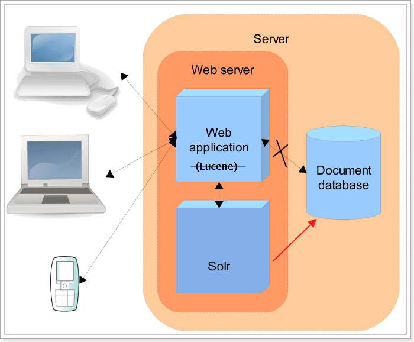
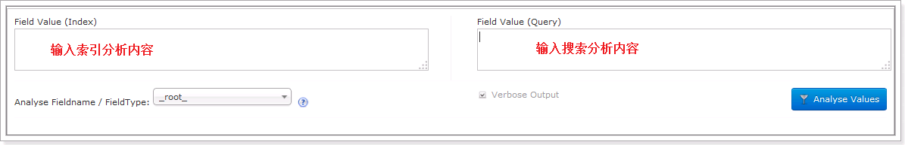
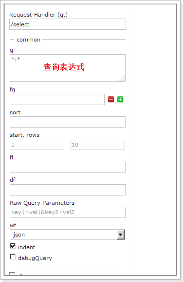
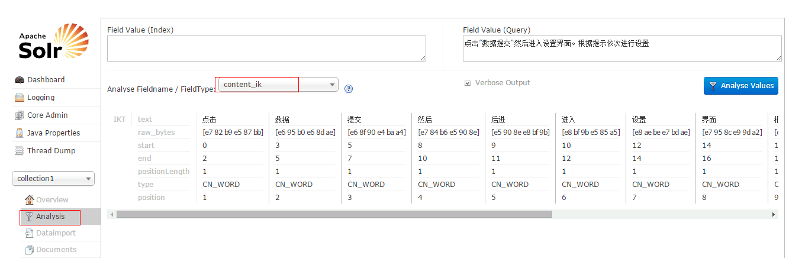

# 第一章：简介

它是基于 Lucene 的全文搜索服务器**。**Solr 可以独立运行在 Jetty、Tomcat 等这些 Servlet 容器中。

Solr 提供了比 Lucene 更为丰富的查询语言，同时实现了**可配置、可扩展**，并对**索引、搜索性能进行了优化**。

使用 Solr 进行创建索引和搜索索引的实现方法很简单，如下：

- **创建索引：客户端（可以是浏览器可以是 Java 程序）**用 POST 方法向 **Solr服务器**发送一个描述 Field 及其内容的 XML文档，**Solr 服务器**根据 xml 文档添加、删除、更新索引 。
  
- **搜索索引：客户端（可以是浏览器可以是 Java 程序）**用 GET 方法向 **Solr服务器**发送请求，然后对**Solr 服务器**返回**Xml、json 等格式的查询结果**进行解析，组织页面布局。Solr 不提供构建页面 UI 的功能，但是**Solr 提供了一个管理界面，通过管理界面可以查询 Solr 的配置和运行情况**。



# 第二章：安装配置

## 1 ：下载 solr

下载并解压

**bin**：solr 的运行脚本

**contrib**：solr 的一些扩展 jar 包，用于增强 solr 的功能。

**dist**：该目录包含 build 过程中产生的 war 和 jar 文件，以及相关的依赖文件。

**docs**：solr 的 API 文档

**example**：solr 工程的例子目录：

- **example/solr**：

该目录是一个标准的 SolrHome，它包含一个默认的 SolrCore

- **example/multicore**：

该目录包含了在 Solr 的 multicore 中设置的多个 Core 目录。

- **example/webapps**：

该目录中包括一个 solr.war，该 war 可作为 solr 的运行实例工程。

**licenses**：solr 相关的一些许可信息

## 2：SolrCore 配置

SolrHome 是 Solr 运行的主目录，该目录中包括了多个 SolrCore 目录。SolrCore 目录中包含了运行 Solr 实例所有的配置文件和数据文件，Solr 实例就是 SolrCore。

一个 SolrHome 可以包括多个 SolrCore（Solr 实例），每个 SolrCore 提供单独的搜索和索引服务。一个SolrCore就是一个索引库；

### 创建 SolrCore

创建 SolrCore 先要创建 SolrHome。在 solr 解压包下**solr-4.10.3examplesolr**文件夹就是一个标准的 SolrHome。

- 拷贝 solr 解压包下**solr-4.10.3examplesolr**文件夹。

- 复制该文件夹到本地的一个目录，把文件名称改为 solrhome。

  注：改名不是必须的，只是为了便于理解

### 配置 SolrCore

在 conf 文件夹下有一个 solrconfig.xml。这个文件是来配置 SolrCore 实例的相关信息。**如果使用默认配置可以不用做任何修改。**它里面包含了不少标签，但是我们关注的标签为：**lib 标签、datadir 标签、requestHandler 标签**。

lib 标签

在 solrconfig.xml 中可以加载一些扩展的 jar，solr.install.dir 表示 solrCore 的目录位置，需要如下修改：

```xml
<lib dir="${solr.install.dir:../..}contrib/extraction/lib" regex=".*.jar"/>
<lib dir="${solr.install.dir:../ . ./dist/" regex="solr-cell-d.*.jar"/>
```

datadir 标签

每个 SolrCore 都有自己的索引文件目录 ，默认在 SolrCore 目录下的 data 中。

data 数据目录下包括了 index 索引目录 和 tlog 日志文件目录。

如果不想使用默认的目录也可以通过 solrConfig.xml 更改索引目录 ，如下：

```xml
<dataDir>${solr.data.dir:F:/develop/solr/collection1/data}</dataDir>
```

requestHandler 标签

requestHandler 请求处理器，定义了索引和搜索的访问方式。

通过/update 维护索引，可以完成索引的添加、修改、删除操作。

```xml
<requestHandler name="update" class="solr.UpdateRequestHandler"></requestHandler>
```

提交 xml、json 数据完成索引维护，索引维护小节详细介绍。

通过/select 搜索索引。

```xml
<requestHandler name="/select" class="solr.SearchHandler"></requestHandler>
```

设置搜索参数完成搜索，搜索参数也可以设置一些默认值，如下：

```xml
<requestHandler name="/select" class="solr.SearchHandler">
    <!-- 设置默认的参数值，可以在请求地址中修改这些参数-->
    <lst name="defaults">
        <str name="echoParams">explicit</str>
        <int name="rows">10</int><!--显示数量-->
        <str name="wt">json</str><!--显示格式-->
        <str name="df">text</str><!--默认搜索字段-->
    </lst>
</requestHandler>
```


## Solr 工程部署

由于在项目中用到的 web 服务器大多数是用的 Tomcat，所以就讲 solr 和 Tomcat 的整合。

1：从 solr 解压包下的examplewebapps目录中拷贝 solr.war

2：复制到 tomcat 安装目录的**webapps**文件夹下

3：解压缩 solr.war

4：解压之后删除 solr.war

5：添加 solr 服务的扩展依赖包（日志包）

- 把 solr 解压包下的solrexamplelibext目录下的所有 jar 包拷贝。

- 复制到解压缩后的 solr 工程的**WEB-INFlib**目录

6：添加 log4j.properties

把 solr 解压包下**solr-4.10.3exampleresourceslog4j.properties**文件进行拷贝

在解压缩后的 solr 工程中的**WEB-INF**目录中创建 classes 文件夹

复制 log4j.properties 文件到刚创建的 classes 目录

7：在 solr 应用的 web.xml 文件中，加载 SolrHome

修改 web.xml 使用 jndi 的方式告诉 solr 服务器。

**Solr/home 名称必须是固定的。**

```xml
<env-entry>
    <env-entry-name>solr/home</env-entry-name>
    <env-entry-value>E:12-solr/solrhome</env-entry-value>
    <env-entry-type>java.lang.String</env-entry-type>
</env-entry>
```

8：启动 Tomcat 进行访问

访问<http://localhost:8080/solr/>


## 多 solrcore 配置

配置多 SolrCore 的好处：

1.  一个 solr 工程对外通过 SorlCore
    提供服务，每个 SolrCore 相当于一个数据库，这个功能就相当于一个 mysql 可以运行多个数据库。

2.  将索引数据分 SolrCore 存储，方便对索引数据管理维护。

3.  SolrCloud 集群需要使用多 core。

复制原来的 core 目录为 collection2

修改 collection2 下的 core.properties

多 core 的使用，在 collection1 和 collection2 中分别创建索引、搜索索引。

# 第三章：管理界面功能介绍

Dashboard：仪表盘，显示了该 Solr 实例开始启动运行的时间、版本、系统资源、jvm 等信息。

Logging：Solr 运行日志信息

Cloud：Cloud 即 SolrCloud，即 Solr 云（集群），当使用 Solr Cloud 模式运行时会显示此菜单，该部分功能在第二个项目，即电商项目会讲解。

Core Admin

Solr Core 的管理界面。在这里可以添加 SolrCore 实例。

java properties

Solr 在 JVM 运行环境中的属性信息，包括类路径、文件编码、jvm 内存设置等信息。

Tread Dump：

显示 Solr Server 中当前活跃线程信息，同时也可以跟踪线程运行栈信息。

Core selector（重点）


Analysis（重点）：



通过此界面可以测试索引分析器和搜索分析器的执行情况。

注：solr 中，**分析器是绑定在域的类型中的**。

dataimport：

可以定义数据导入处理器，从关系数据库将数据导入到 Solr 索引库中。默认没有配置，需要手工配置。

Document（重点）：

通过/update 表示更新索引，**solr 默认根据 id（唯一约束）域来更新 Document 的内容，如果根据 id 值搜索不到 id 域则会执行添加操作，如果找到则更新**。

通过此菜单可以**创建索引、更新索引、删除索引**等操作

- overwrite="true" ：
  solr 在做索引的时候，如果文档已经存在，就用 xml 中的文档进行替换

- commitWithin="1000" ： solr
  在做索引的时候，每个 1000（1 秒）毫秒，做一次文档提交。为了方便测试也可以在 Document 中立即提交，</doc>后添加“<commit/>”

Query（重点）：

通过/select 执行搜索索引，必须指定“q”查询条件方可搜索。




Segments：分段；

# 第四章：基本使用

## schema.xml

schema.xml 文件在 SolrCore 的 conf 目录下，它是 Solr 数据表配置文件，在此配置文件中定义了域以及域的类型还有其他一些配置，**在 solr 中域必须先定义后使用**。

1：field

```xml
<field name="id" type="string" indexed="true" stored="true" required="true" multiValued="false"/>
```

- Name：域的名称

- Type：域的类型

- Indexed：是否创建反向索引

- Stored：是否存储到文件中

- Required：是否必须

- multiValued：是否是多值，存储多个值时设置为 true，solr 允许一个 Field 存储多个值，比如存储一个用户的好友 id（多个），商品的图片（多个，大图和小图）

2：fieldType（域类型）

```xml
<fieldType name="text_zh_ch" class="solr.TextField">
    <analyzer>
    </analyzer>
</fieldType>
```


- name：域类型的名称

- class：指定域类型的 solr 类型。

- analyzer：指定分词器。在 FieldType 定义的时候最重要的就是定义这个类型的数据在建立索引和进行查询的时候要使用的分析器 analyzer，包括分词和过滤。

- type：index 和 query。Index 是创建索引，query 是查询索引。

- tokenizer：指定分词器

- filter：指定过滤器

3：uniqueKey

```xml
<uniqueKey>id</uniqueKey>
```

相当于主键，每个文档中必须有一个 id 域。

4：copyField（复制域）

```xml
<uniqueKey>id</uniqueKey>
```

可以将多个 Field 复制到一个 Field 中，以便进行统一的检索。当创建索引时，solr 服务器会自动的将源域的内容复制到目标域中。

- source：源域

- dest：目标域，搜索时，指定目标域为默认搜索域，可以提供查询效率。

定义目标域：

```xml
<field name="text" type="text general" indexed="true" stored="false" multiValued="true"/>
```

必须要使用：multiValued="true"

5：dynamicField（动态域）

```xml
<dynamicField name="*_i" type="int" indexed="true" stored="true"/>
```

- Name：动态域的名称，是一个表达式，*匹配任意字符，只要域的名称和表达式的规则能够匹配就可以使用。

例如：搜索时查询条件【product_i：钻石】就可以匹配这个动态域，可以直接使用，不用单独再定义一个 product_i 域。

## 配置中文分析器

使用 IKAnalyzer 中文分析器。

第一步：把 IKAnalyzer2012FF_u1.jar 添加到 solr/WEB-INF/lib 目录下。

第二步：复制 IKAnalyzer 的配置文件和自定义词典和停用词词典到 solr 的 classpath 下。

第三步：在 schema.xml 中添加一个自定义的 fieldType，使用中文分析器。

```xml
<!-- IKAnalyzer--> <fieldType name="text_ik" class="solr.TextField"> <analyzer class="org.wltea.analyzer.lucene.IKAnalyzer"/> </fieldType>
```

第四步：定义 field，指定 field 的 type 属性为 text_ik

```xml
<!--IKAnalyzer Field--> <field name="title_ik" type="text_ik" indexed="true" stored="true" /> <field name="content_ik" type="text_ik" indexed="true" stored="false" multiValued="true"/>
```

第五步：重启 tomcat

测试：



## 配置业务 field

### 需求

要使用 solr 实现电商网站中商品搜索。

电商中商品信息在 mysql 数据库中存储了，将 mysql 数据库中数据在 solr 中创建索引。

需要在 solr 的 schema.xml 文件定义商品 Field。

### 定义步骤

先确定定义的商品 document 的 field 有哪些？

可以根据 mysql 数据库中商品表的字段来确定：

products 商品表：pid、name、catalog、catalog_name、price、description、picture

先定义 Fieldtype：

solr 本身提供的 fieldtype 类型够用了不用定义新的了。

再定义 Field：

pid：商品 id 主键

使用 solr 本身提供的：

```xml
<field name="id" type="string" indexed="true" stored="true" required="true"
multiValued="false" />

name：商品名称

<field name="product_name" type="text_ik" indexed="true" stored="true"/>

catalog：商品分类

<field name="product_catalog" type="string" indexed="true" stored="true"/>

catalog_name：商品分类名称

<field name="product_catalog_name" type="text_ik" indexed="true"
stored="true"/>

price：商品价格

<field name="product_price" type="float" indexed="true" stored="true"/>

description：商品描述

<field name="product_description" type="text_ik" indexed="true"
stored="false"/>

picture：商品图片

<field name="product_picture" type="string" indexed="false" stored="true"/>
    
 <!--product--> <field name="product_name" type="text_ik" indexed="true" stored="true"/> <field name="product_catalog" type="string" indexed="true" stored="true"/> <field name="product_catalog_name" type="string" indexed="true" stored="true" /> <field name="product_price" type="float" indexed="true" stored="true"/> <field name="product_description" type="text_ik" indexed="true" stored="false" /> <field name="product_picture" type="string" indexed="false" stored="true" /> <field name="product_keywords" type="text_ik" indexed="true" stored="false" multiValued="true"/>
```

## 数据库数据导入

面板的DataImport

第一步：Dataimport 的 jar

从 solr-4.10.3dist 目录下拷贝 solr-dataimporthandler-4.10.3.jar，复制到以下目录：contrib/dataimporthandler/lib手动创建

修改 schema.xml 如下：

```xml
<lib dir="${solr.install.dir:../..}contrib/dataimporthandler/lib" regex=".*.jar"/>
```

数据库驱动包：把 mysql 数据库驱动包，拷贝到以下目录：contrib/db/lib手动创建

修改 schema.xml，如下：

```xml
<lib dir="${solr.install.dir:../..}contrib/db/lib" regex=".*.jar"/>
```

第二步：配置 solrconfig.xml，添加一个 requestHandler

```xml
<requestHandler name="/dataimport" class="org.apache.solr.handler.dataimport.DataImportHandler"> 
    <lst name="defaults"> 
        <str name="config">data-config.xml</str> 
    </lst> 
</requestHandler>
```

第三步：创建一个 data-config.xml

在 collection1conf目录下创建 data-config.xml 文件

```xml
<?xml version="1.0" encoding="UTF-8" ?> 
<dataConfig> 
    <dataSource type="JdbcDataSource" driver="com.mysql.jdbc.Driver" url="jdbc:mysql://localhost:3306/solr" user="root" password="root"/> 
    <document> 
        <entity name="product" query="SELECT pid,name,catalog,catalog_name,price,description,picture FROM products "> 
            <field column="pid" name="id"/>
            <field column="name" name="product_name"/> 
            <field column="catalog" name="product_catalog"/> 
            <field column="catalog_name" name="product_catalog_name"/> 
            <field column="price" name="product_price"/> 
            <field column="description" name="product_description"/> 
            <field column="picture" name="product_picture"/> 
        </entity> 
    </document> 
</dataConfig>
```

第四步：重启 tomcat

第五步：点击“execute”按钮导入数据

**注意：到入数据前会先清空索引库，然后再导入。**

# 第五章：Solrj 的使用

solrj 是访问 Solr 服务的 java 客户端，提供索引和搜索的请求方法，SolrJ 通常在嵌入在业务系统中，通过 SolrJ 的 API 接口操作 Solr 服务

Solrj 和图形界面操作的区别就类似于数据库中你使用 jdbc 和 mysql 客户端的区别一样。

使用 solrj 调用 solr 服务实现对索引库的增删改查操作。
