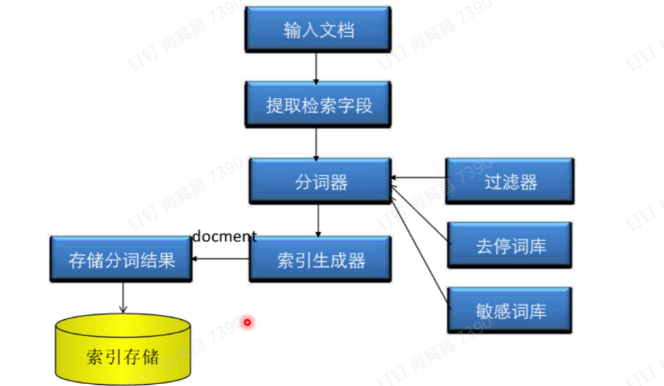
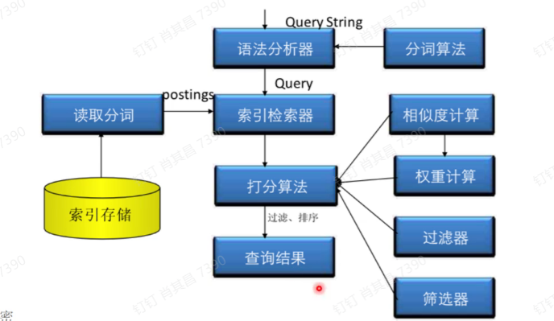
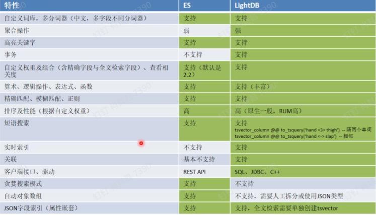

全文检索算法：

算法只影响排序，不影响结果；

词频：指的是某一个给定的词语在文件中出现的次数；

常用：

方案一：ELK架构；

全文检索的核心——倒排索引

自定义分数：增加权重；

缺点：

数据需要同步；专用的语法；需要先访问ES再访问；

方案二：LightDB全文检索

分词和索引分开；

通用的倒排索引；支持数组类型，JSON类型，

在线自定义

模糊搜索能力——基本查询；词组查询；全文检索和普通过滤混合；权重管理；

权重管理：内置权重分为4个等级，不设置则相当于D；

全文检索加速——RUM索引

GIN索引的缺点：

中文搜索：

对比：

