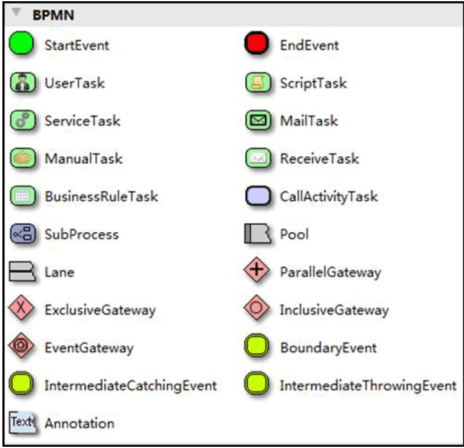
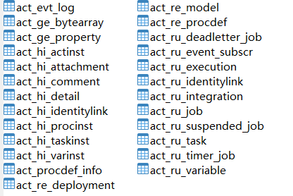

固定流程直接搞个表也能做，但是如果加个流程，多部门协同审批这种，代码变化就比较大了；

Activiti的官网地址是 https://www.activiti.org

# BPMN建模语言

业务流程模型和符号；



而对于一个完整的BPMN图形流程，其实最终是通过XML进行描述的。通常，会将BPMN流程最终保存为一个.bpmn的文件，然后可以使用文本编辑器打开进行查看。而图形与xml文件之间，会有专门的软件来进行转换。

# 搭建

1：

IDEA安装插件：actiBPM；新版本的安不上，用Activiti BPMN visualizer代替；

2：初始化数据库

创建一个单独的数据库；

配置文件activiti.cfg.xml

```xml
<?xml version="1.0" encoding="UTF-8"?>
<beans xmlns="http://www.springframework.org/schema/beans"
       xmlns:xsi="http://www.w3.org/2001/XMLSchema-instance"
       xmlns:context="http://www.springframework.org/schema/context"
       xmlns:tx="http://www.springframework.org/schema/tx"
       xsi:schemaLocation="http://www.springframework.org/schema/beans
                    http://www.springframework.org/schema/beans/spring-beans.xsd
http://www.springframework.org/schema/contex
http://www.springframework.org/schema/context/spring-context.xsd
http://www.springframework.org/schema/tx
http://www.springframework.org/schema/tx/spring-tx.xsd">

    <!-- 这里可以使用 链接池 dbcp-->
    <bean id="dataSource" class="org.apache.commons.dbcp.BasicDataSource">
        <property name="driverClassName" value="com.mysql.cj.jdbc.Driver" />
        <property name="url" value="jdbc:mysql://localhost:3306/activiti?serverTimezone=GMT%2B8" />
        <property name="username" value="root" />
        <property name="password" value="oplus@2016" />
        <property name="maxActive" value="3" />
        <property name="maxIdle" value="1" />
    </bean>

    <bean id="processEngineConfiguration"
          class="org.activiti.engine.impl.cfg.StandaloneProcessEngineConfiguration">
        <!-- 引用数据源 上面已经设置好了-->
        <property name="dataSource" ref="dataSource" />
        <!--activiti数据库表处理策略，如果没有表则创建-->
        <property name="databaseSchemaUpdate" value="true"></property>
    </bean>
</beans>
```

执行样例，创建25张表差不多；

```java
ProcessEngine processEngine = ProcessEngines.getDefaultProcessEngine();
```



ACT_RE ：'RE'表示 repository。 这个前缀的表包含了流程定义和流程静态资源（图片，规则，等等）。

ACT_RU：'RU'表示 runtime。 这些运行时的表，包含流程实例，任务，变量，异步任务，等运行中的数据。 Activiti 只在流程实例执行过程中保存这些数据， 在流程结束时就会删除这些记录。 这样运行时表可以一直很小速度很快。

ACT_HI：'HI'表示 history。 这些表包含历史数据，比如历史流程实例， 变量，任务等等。

ACT_GE ： GE 表示 general。 通用数据， 用于不同场景下


3：画图BPMN文件


4：部署实例

```java
    /**
     * 部署流程定义  文件上传方式
     */
    @Test
    public void testDeployment(){
//        1、创建ProcessEngine
        ProcessEngine processEngine = ProcessEngines.getDefaultProcessEngine();
//        2、得到RepositoryService实例
        RepositoryService repositoryService = processEngine.getRepositoryService();
//        3、使用RepositoryService进行部署
        Deployment deployment = repositoryService.createDeployment()
                .addClasspathResource("bpmn/Leave.bpmn") // 添加bpmn资源
                //png资源命名是有规范的。Leave.myLeave.png|jpg|gif|svg  或者Leave.png|jpg|gif|svg
                .addClasspathResource("bpmn/Leave.myLeave.png")  // 添加png资源
                .name("请假申请流程")
                .deploy();
//        4、输出部署信息
        System.out.println("流程部署id：" + deployment.getId());
        System.out.println("流程部署名称：" + deployment.getName());
    }
```

分析表操作：

act_re_deployment：记录了一个部署

act_re_procdef：流程定义；

部署方式二：压缩包上传bpmn文件和图片进行解析部署；


5：开启一个流程

```java
    /**
     * 启动流程实例
     */
    @Test
    public void testStartProcess(){
//        1、创建ProcessEngine
        ProcessEngine processEngine = ProcessEngines.getDefaultProcessEngine();
//        2、获取RunTimeService
        RuntimeService runtimeService = processEngine.getRuntimeService();
//        3、根据流程定义Id启动流程
        ProcessInstance processInstance = runtimeService
                .startProcessInstanceByKey("myLeave");
//        输出内容
        System.out.println("流程定义id：" + processInstance.getProcessDefinitionId());
        System.out.println("流程实例id：" + processInstance.getId());
        System.out.println("当前活动Id：" + processInstance.getActivityId());
    }
```

6：流程中的人查询自己的待处理流程

```java
    /**
     * 查询当前个人待执行的任务
     */
    @Test
    public void testFindPersonalTaskList() {
//        任务负责人
        String assignee = "worker";
        ProcessEngine processEngine = ProcessEngines.getDefaultProcessEngine();
//        创建TaskService
        TaskService taskService = processEngine.getTaskService();
//        根据流程key 和 任务负责人 查询任务
        List<Task> list = taskService.createTaskQuery()
                .processDefinitionKey("myLeave") //流程Key
                .taskAssignee(assignee)//只查询该任务负责人的任务
                .list();

        for (Task task : list) {
            System.out.println("流程实例id：" + task.getProcessInstanceId());
            System.out.println("任务id：" + task.getId());
            System.out.println("任务负责人：" + task.getAssignee());
            System.out.println("任务名称：" + task.getName());

        }
    }
```

7：流程中的人执行自己的任务

```java
    // 完成任务
    @Test
    public void completTask(){
//        获取引擎
        ProcessEngine processEngine = ProcessEngines.getDefaultProcessEngine();
//        获取taskService
        TaskService taskService = processEngine.getTaskService();

//        根据流程key 和 任务的负责人 查询任务
//        返回一个任务对象
        Task task = taskService.createTaskQuery()
                .processDefinitionKey("myLeave") //流程Key
                .taskAssignee("worker")  //要查询的负责人
                .singleResult();

//        完成任务,参数：任务id
        taskService.complete(task.getId());
    }
```

# 概念

流程定义ProcessDefinition和流程实例ProcessInstance，类似于Java中类和对象的概念；

流程定义ProcessDefinition是以BPMN文件定义的一个工作流程，是一组规范；员工发起一次请假，就会实例化一个请假流程实例；

BusinessKey：业务关键字；

数据库长度255；


## 挂起，激活流程

已经挂起的任务不能继续执行；

全部流程实例的 挂起和 激活

```java
 /**
     * 全部流程实例的 挂起和 激活
     * suspend 暂停
     */
    @Test
    public void suspendAllProcessInstance(){
//        1、获取流程引擎
        ProcessEngine processEngine = ProcessEngines.getDefaultProcessEngine();
//        2、获取Repositoryservice
        RepositoryService repositoryService = processEngine.getRepositoryService();
//        3、查询流程定义,获取流程定义的查询对象
        ProcessDefinition processDefinition = repositoryService.createProcessDefinitionQuery()
                .processDefinitionKey("myLeave")
                .singleResult();
//        4、获取当前流程定义的实例是否都是挂起状态
        boolean suspended = processDefinition.isSuspended();
//        5、获取流程定义的id
        String definitionId = processDefinition.getId();
//        6、如果是挂起状态，改为激活状态
        if(suspended){
//            如果是挂起，可以执行激活的操作,参数1：流程定义id 参数2：是否激活，参数3：激活时间
            repositoryService.activateProcessDefinitionById(definitionId,
                    true,
                    null);
            System.out.println("流程定义id:"+definitionId+"，已激活");
        }else {
//        7、如果是激活状态，改为挂起状态,参数1：流程定义id 参数2：是否暂停 参数3 ：暂停的时间
            repositoryService.suspendProcessDefinitionById(definitionId,
                    true,
                    null);
            System.out.println("流程定义id:"+definitionId+"，已挂起");
        }
    }
```

挂起、激活单个流程实例

```java
    /**
     * 挂起、激活单个流程实例
     */
    @Test
    public void suspendSingleProcessInstance(){
//        1、获取流程引擎
        ProcessEngine processEngine = ProcessEngines.getDefaultProcessEngine();
//        2、RuntimeService
        RuntimeService runtimeService = processEngine.getRuntimeService();
//        3、通过RuntimeService获取流程实例对象
        ProcessInstance instance = runtimeService.createProcessInstanceQuery()
                .processInstanceId("7501")
                .singleResult();
//        4、得到当前流程实例的暂停状态,true-已暂停  false -激活
        boolean suspended = instance.isSuspended();
//        5、获取流程实例id
        String instanceId = instance.getId();
//        6、判断是否已经暂停，如果已经暂停，就执行激活操作
        if(suspended){
//            如果已经暂停，就执行激活
            runtimeService.activateProcessInstanceById(instanceId);
            System.out.println("流程实例id:"+instanceId+"已经激活");
        }else {
//        7、如果是激活状态，就执行暂停操作
            runtimeService.suspendProcessInstanceById(instanceId);
            System.out.println("流程实例id:"+instanceId+"已经暂停");
        }
    }
```

## 流量变量

比如：如果请假超过3天需要总经理审批；

流程变量的类型是Map<String,Object>。所以，流程变量比 业务关键字要强大很多。变量值不仅仅是字符串，也可以是POJO对象。但是当需要 将一个POJO对象放入流程变量时，要注意这个对象必须要实现序列化接口 serializable。

启动时设置：

1：作用域：

Global变量：是流程变量的默认作用域，表示是一个完整的流程实例。 Global变量中变量 名不能重复。如果设置了相同的变量名，后面设置的值会直接覆盖前面设置的变 量值。 

```java
//启动流程实例时设置流程变量
ProcessInstance processInstance = runtimeService.startProcessInstanceByKey(key, map);

//任务办理时设置变量
//在完成任务时设置流程变量，该流程变量只有在该任务完成后其它结点才可使用该 变量，它的作用域是整个流程实例，如果设置的流程变量的key在流程实例中已存在 相同的名字则后设置的变量替换前边设置的变量
taskService.complete(task.getId(),map);

//通过当前流程实例设置
//该流程实例必须未执行完成。
 @Test    
public void setGlobalVariableByExecutionId(){
    //    当前流程实例执行 id，通常设置为当前执行的流程实例        
    String executionId="2601"; 
    //     获取processEngine        
    ProcessEngine processEngine = ProcessEngines.getDefaultProcessEngine(); 
    //        获取RuntimeService       
    RuntimeService runtimeService = processEngine.getRuntimeService(); 
    //        创建出差pojo对象        
    Evection evection = new Evection(); 
    //        设置天数        
    evection.setNum(3d); 
    //      通过流程实例 id设置流程变量        
    runtimeService.setVariable(executionId, "myLeave", evection);
    //      一次设置多个值 
    //runtimeService.setVariables(executionId, variables)    
}


//通过当前任务设置
@Test    
public void setGlobalVariableByTaskId(){                
    //当前待办任务id        
    String taskId="1404";
    //     获取processEngine       
    ProcessEngine processEngine = ProcessEngines.getDefaultProcessEngine();        
    TaskService taskService = processEngine.getTaskService();       
    Evection evection = new Evection();        
    evection.setNum(3);        
    //通过任务设置流程变量        
    taskService.setVariable(taskId, "evection", evection);        
    //一次设置多个值         
    //taskService.setVariables(taskId, variables)   
}
```

Local变量：域只针对一个任务或一个执行实例的范围，没有流程实例大。 Local变量由于作用在不同的任务或不同的执行实例中，所以不同变量的作用域是 互不影响的，变量名可以相同。Local变量名也可以和Global变量名相同，不会 有影响。


## 网关


### 排他网关ExclusiveGateway

排他网关，用来在流程中实现决策。 当流程执行到这个网关，所有分支都会判断条件是否为true，如果为true则执行该分支，

排他网关只会选择一个为true的分支执行。如果有两个分支条件 都为true，排他网关会选择id值较小的一条分支去执行。

如果从网关出去的线所有条件都不满足则系统抛出异常。

### 并行网关ParallelGateway

两个连线都要走，分开后还要聚合：

并行网关允许将流程分成多条分支，也可以把多条分支汇聚到一起，并行网关的功 能是基于进入和外出顺序流的：

fork分支：并行后的所有外出顺序流，为每个顺序流都创建一个并发分支。

join汇聚： 所有到达并行网关，在此等待的进入分支， 直到所有进入顺序流的分支 都到达以后， 流程就会通过汇聚网关。

注意，如果同一个并行网关有多个进入和多个外出顺序流， 它就同时具 有分支和汇聚功能。 这时，网关会先汇聚所有进入的顺序流，然后再切 分成多个并行分支。

与其他网关的主要区别是，并行网关不会解析条件。 即使顺序流中定义了条件，也 会被忽略。

### 包含网关

### 事件网关


## 个人任务管理


## 组任务

任何一个经理审批都可以；候选人还需要主动认领任务；


# 整合

配合 SpringSecurity，SpringBoot，Activiti7开发：
