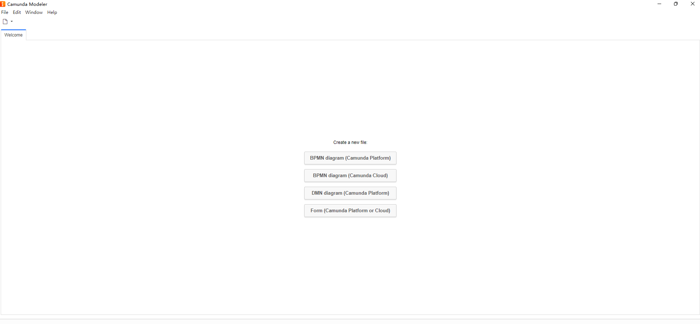
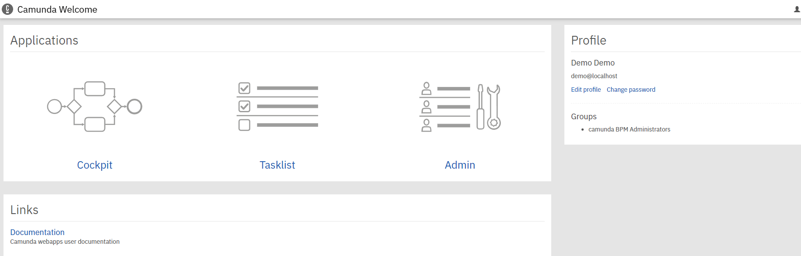
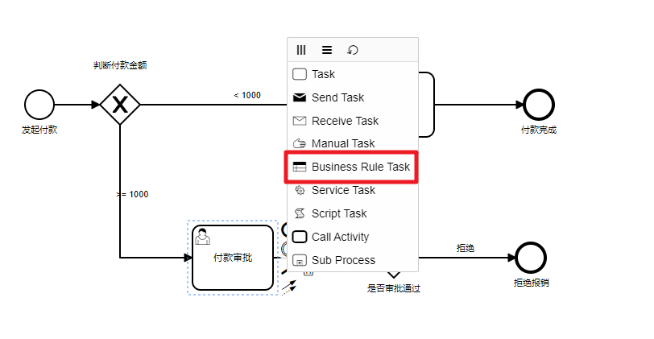
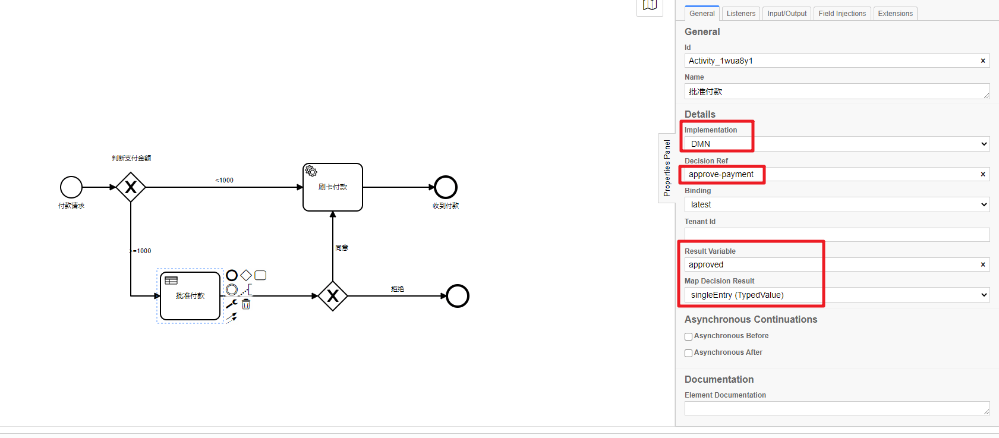
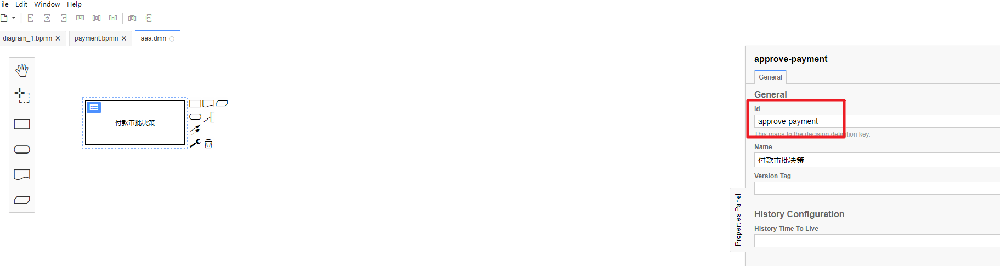
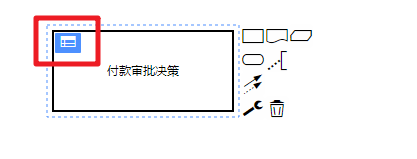
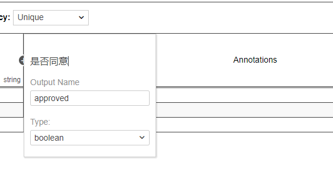
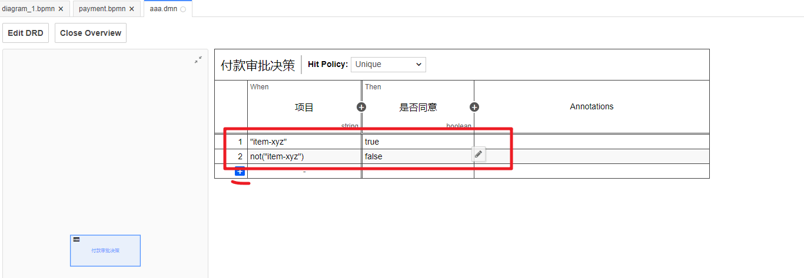

# 一、Camunda介绍

官网地址：https://camunda.com/

中文站点：http://camunda-cn.shaochenfeng.com/

下载：https://downloads.camunda.cloud/release/camunda-bpm/run/7.15/

案例地址：[Congratulation! | docs.camunda.org](https://docs.camunda.org/get-started/quick-start/complete/)

前期准备工作: JAVA1.8以上的JRE或JDK

## 1.Camunda Modeler 

Camunda Modeler 是Camunda 官方提供的一个流程设计器，用于编辑流程图以及其他模型【表单】，也就是一个流程图的绘图工具。可以官方下载，也可以在提供给大家的资料中获取。获取后直接解压缩即可，注意：解压安装到非中文目录中!!!

启动的效果：




## 2.Camunda BPM

下载地址 https://camunda.com/download/

Camunda BPM 是Camunda官方提供的一个`业务流程管理`平台,用来管理，部署的流程定义、执行任务，策略等。下载安装一个Camunda平台，成功解压 Camunda 平台的发行版后，执行名为start.bat（对于 Windows 用户）或start.sh（对于 Unix 用户）的脚本。此脚本将启动应用程序服务器。

打开您的 Web 浏览器并导航到http://localhost:8080/以访问欢迎页面，Camunda的管理平台。

登录成功的主页：



 

## 3.决策自动化

在某些审批中，不在用户手动进行审批，而是通过设置一定的规则，自动进行审批；即通过`DMN`为流程添加一个业务规则来处理

### 添加业务规则

打开 Camunda Modeler，点击 “批准付款”，在右面的扳手菜单中，将类型改为“**Business Rule Task** ”（业务规则任务）



下一步，将属性面板中的 `Implementation` 选择为`DMN`，输入 Decision Ref 为 `approve-payment`，为了将决策的结果存入流程变量，我们还需要编辑结果变量Result Variable 为`approved`，结果类型 Map Decision Result 选择为 `singleEntry `，最后结果如下：





### 创建DMN表

点击 `File > New File > DMN Diagram`创建一个新的DMN,现在画布上已经存在一个决策元素了，选择它，然后在右侧属性面板中更改`Id`和`Name`，这里的Id需要和流程中的`Decision Ref`属性一致，这次我们输入Id为`approve-payment`



接下来，点击决策元素左上角的表格按钮，创建新的DMN表.




### 编辑DMN表

首先编辑输入参数，在本例中，为了简单，我们依据项目名进行判断，规则可以使用 `FEEL 表达式`、`JUEL`或者 `Script` 书写，详情可以阅读 https://docs.camunda.org/manual/latest/user-guide/dmn-engine/expressions-and-scripts/

双击表格中的*Input*，编辑第一个输入参数


下面，设置输入参数，双击*Output*编辑



下面，我们点击左侧的蓝色加号，添加一些规则，最后类似这样：




### 部署DMN表

点击底部的部署按钮，将DMN部署到流程引擎中

### 测试

现在打开 http://localhost:8080/camunda/app/cockpit/ ，使用demo/demo登录，可以看到决策定义增加了一个，点击进去可以看到刚才编辑的DMN.

然后我们部署流程然后启动流程

该流程决策输出的`approved`

# 一、IDEA引入流程设计器

在工作流引擎中流程设计器是一个非常重要的组件，而`InterlliJ IDEA`是Java程序员用到的最多的编程工具了。前面在基础篇的介绍中我们都在通过Camunda提供的流程设计器绘制好流程图，然后需要单独的拷贝到项目中，要是调整修改不是很方便，这时我们可以在IDEA中和流程设计器绑定起来。这样会更加的灵活。

下载Camunda Model

第一步肯定是需要下载`Camunda Model` 这个流程设计器，我们前面有介绍。就是之前解压好的目录了。

IDEA中配置，我们先进入`settings`中然后找到`tools`,继续找到`External Tool`.

编辑bpmn文件，找到您想打开的bpmn文件, 点击右键, 找到External Tools 运行camunda modler即可进行文件编写.

# 二、SpringBoot整合Camunda

但是这里有个比较头疼的问题就是Camunda和SpringBoot版本的兼容性问题，虽然官方也给出了兼容版本的对照表。

## MySQL数据库

我们可以切换到`MySQL`数据库。首先我们需要导入相关的SQL脚本。位置就在我们之前下载的`Camunda Web`服务中。

执行创建所有必需的表和默认索引的SQL DDL脚本。两个脚本都要执行。

生成的相关表结构比较多，因为本身就是基于Activiti演变而来，所以有Activiti基础的小伙伴会非常轻松了。简单介绍下相关表结构的作用。

* **ACT_RE** ：'RE'表示 repository。 这个前缀的表包含了流程定义和流程静态资源 （图片，规则，等等）。
* **ACT_RU**：'RU'表示 runtime。 这些运行时的表，包含流程实例，任务，变量，异步任务，等运行中的数据。 Flowable只在流程实例执行过程中保存这些数据， 在流程结束时就会删除这些记录。 这样运行时表可以一直很小速度很快。
* **ACT_HI**：'HI'表示 history。 这些表包含历史数据，比如历史流程实例， 变量，任务等等。
* **ACT_GE**： GE 表示 general。 通用数据， 用于不同场景下 
* **ACT_ID:**   ’ID’表示identity(组织机构)。这些表包含标识的信息，如用户，用户组，等等。

具体的表结构的含义:

| **表分类**   | **表名**              | **解释**                                           |
| ------------ | --------------------- | -------------------------------------------------- |
| 一般数据     |                       |                                                    |
|              | [ACT_GE_BYTEARRAY]    | 通用的流程定义和流程资源                           |
|              | [ACT_GE_PROPERTY]     | 系统相关属性                                       |
| 流程历史记录 |                       |                                                    |
|              | [ACT_HI_ACTINST]      | 历史的流程实例                                     |
|              | [ACT_HI_ATTACHMENT]   | 历史的流程附件                                     |
|              | [ACT_HI_COMMENT]      | 历史的说明性信息                                   |
|              | [ACT_HI_DETAIL]       | 历史的流程运行中的细节信息                         |
|              | [ACT_HI_IDENTITYLINK] | 历史的流程运行过程中用户关系                       |
|              | [ACT_HI_PROCINST]     | 历史的流程实例                                     |
|              | [ACT_HI_TASKINST]     | 历史的任务实例                                     |
|              | [ACT_HI_VARINST]      | 历史的流程运行中的变量信息                         |
| 流程定义表   |                       |                                                    |
|              | [ACT_RE_DEPLOYMENT]   | 部署单元信息                                       |
|              | [ACT_RE_MODEL]        | 模型信息                                           |
|              | [ACT_RE_PROCDEF]      | 已部署的流程定义                                   |
| 运行实例表   |                       |                                                    |
|              | [ACT_RU_EVENT_SUBSCR] | 运行时事件                                         |
|              | [ACT_RU_EXECUTION]    | 运行时流程执行实例                                 |
|              | [ACT_RU_IDENTITYLINK] | 运行时用户关系信息，存储任务节点与参与者的相关信息 |
|              | [ACT_RU_JOB]          | 运行时作业                                         |
|              | [ACT_RU_TASK]         | 运行时任务                                         |
|              | [ACT_RU_VARIABLE]     | 运行时变量表                                       |
| 用户用户组表 |                       |                                                    |
|              | [ACT_ID_BYTEARRAY]    | 二进制数据表                                       |
|              | [ACT_ID_GROUP]        | 用户组信息表                                       |
|              | [ACT_ID_INFO]         | 用户信息详情表                                     |
|              | [ACT_ID_MEMBERSHIP]   | 人与组关系表                                       |
|              | [ACT_ID_PRIV]         | 权限表                                             |
|              | [ACT_ID_PRIV_MAPPING] | 用户或组权限关系表                                 |
|              | [ACT_ID_PROPERTY]     | 属性表                                             |
|              | [ACT_ID_TOKEN]        | 记录用户的token信息                                |
|              | [ACT_ID_USER]         | 用户表                                             |

然后我们在SpringBoot项目中导入`MySql`的依赖，然后修改对应的配置信息

```xml
    <dependency>
      <groupId>mysql</groupId>
      <artifactId>mysql-connector-java</artifactId>
    </dependency>
```

修改`application.yaml`。添加数据源的相关信息。

```yaml
# spring.datasource.url: jdbc:h2:file:./camunda-h2-database

camunda.bpm.admin-user:
  id: demo
  password: demo
spring:
  datasource:
    driver-class-name: com.mysql.cj.jdbc.Driver
    url: jdbc:mysql://127.0.0.1:3306/camunda1?serverTimezone=Asia/Shanghai
    username: root
    password: 123456
camunda:
  bpm:
    database:
      type: mysql
      schema-update: true
    auto-deployment-enabled: false # 自动部署 resources 下的 bpmn文件
```

# 三、Camunda专题讲解

用了整合的基础我们就可以来完成一个流程审批的案例了

## 部署流程

```java
@RestController
@RequestMapping("/flow")
public class FlowController {

    @Autowired
    private RepositoryService repositoryService;

    @GetMapping("/deploy")
    public String deplopy(){
        Deployment deploy = repositoryService.createDeployment()
                .name("部署的第一个流程") // 定义部署文件的名称
                .addClasspathResource("process.bpmn") // 绑定需要部署的流程文件
                .deploy();// 部署流程
        return deploy.getId() + ":" + deploy.getName();
    }
}
```

启动后访问接口即可

## 启动流程

启动流程我们通过单元测试来操作

```java
import org.camunda.bpm.engine.RepositoryService;
import org.camunda.bpm.engine.RuntimeService;
import org.camunda.bpm.engine.TaskService;
import org.camunda.bpm.engine.runtime.ProcessInstance;
import org.camunda.bpm.engine.task.Task;
import org.junit.jupiter.api.Test;
import org.springframework.beans.factory.annotation.Autowired;
import org.springframework.boot.test.context.SpringBootTest;

import java.util.List;

@SpringBootTest(classes = Application.class)
public class ApplicationTest {

    @Autowired
    private RepositoryService repositoryService;

    @Autowired
    private RuntimeService runtimeService;

    @Autowired
    private TaskService taskService;

    /**
     * 启动流程的案例
     */
    @Test
    public void startFlow(){
        // 部署流程
        ProcessInstance processInstance = runtimeService
                .startProcessInstanceById("1a880f27-2e57-11ed-80d9-c03c59ad2248");
        // 部署的流程实例的相关信息
        System.out.println("processInstance.getId() = " + processInstance.getId());
        System.out.println("processInstance.getProcessDefinitionId() = " + processInstance.getProcessDefinitionId());
    }


}

```

## 查询待办

查询待办也就是查看当前需要审批的任务，通过TaskService来处理

```java
    /**
     * 查询任务
     *    待办
     *
     *  流程定义ID:processDefinition : 我们部署流程的时候会，每一个流程都会产生一个流程定义ID
     *  流程实例ID:processInstance ：我们启动流程实例的时候，会产生一个流程实例ID
     */
    @Test
    public void queryTask(){
        List<Task> list = taskService.createTaskQuery()
                //.processInstanceId("eff78817-2e58-11ed-aa3f-c03c59ad2248")
                .taskAssignee("demo1")
                .list();
        if(list != null && list.size() > 0){
            for (Task task : list) {
                System.out.println("task.getId() = " + task.getId());
                System.out.println("task.getAssignee() = " + task.getAssignee());
            }
        }
    }
```

## 完成任务

```java
   /**
     * 完成任务
     */
    @Test
    public void completeTask(){
        // 根据用户找到关联的Task
        Task task = taskService.createTaskQuery()
                //.processInstanceId("eff78817-2e58-11ed-aa3f-c03c59ad2248")
                .taskAssignee("demo")
                .singleResult();
        if(task != null ){
            taskService.complete(task.getId());
            System.out.println("任务审批完成...");
        }
    }
```


