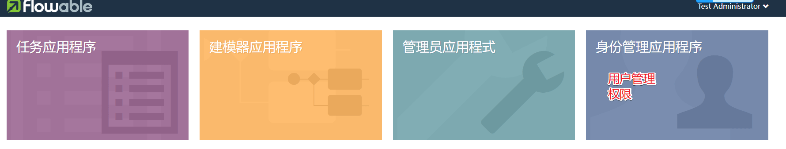
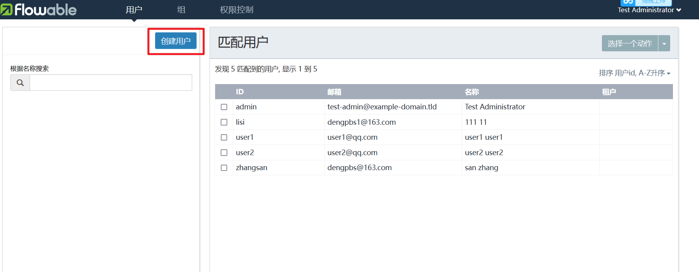
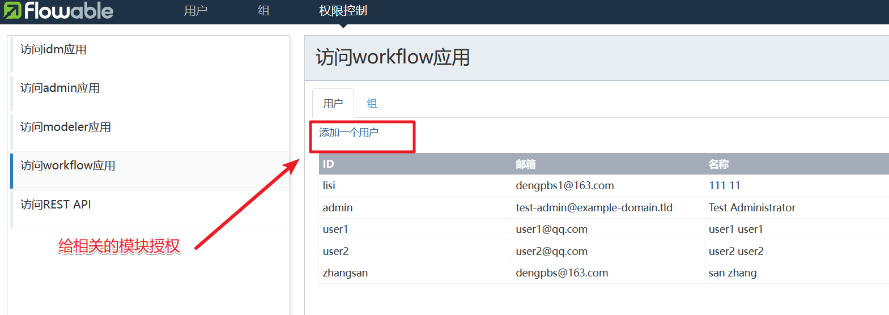
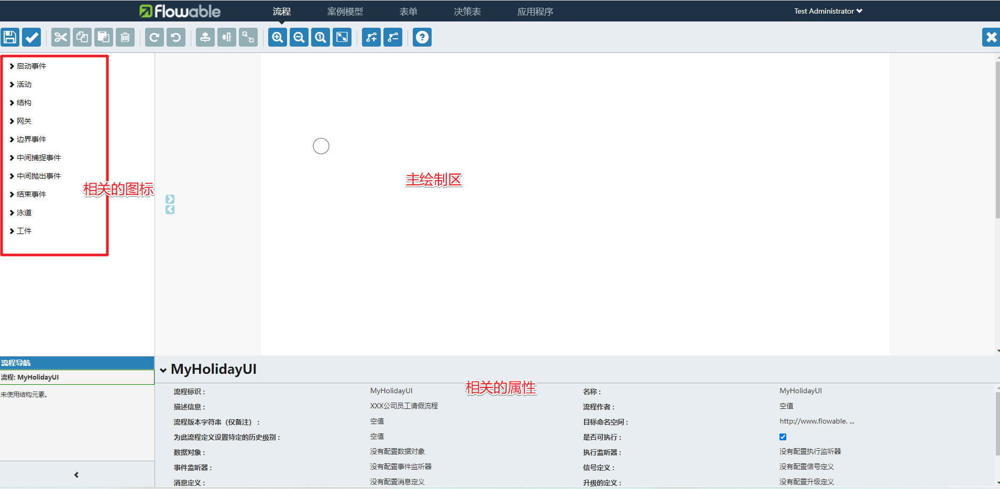
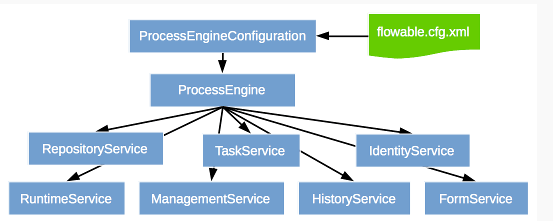
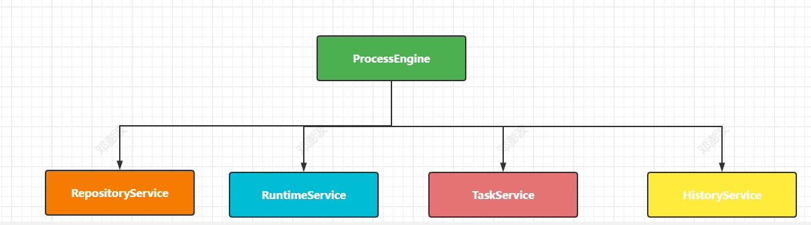

# 一、Flowable介绍

Flowable是BPMN的一个基于java的软件实现，不过Flowable不仅仅包括BPMN，还有DMN决策表和CMMN Case管理引擎，并且有自己的用户管理、微服务API等一系列功能，是一个服务平台。

官方手册：https://tkjohn.github.io/flowable-userguide/#_introduction

# 三、Flowable流程设计器

## Flowable UI

Flowable提供了几个web应用，用于演示及介绍Flowable项目提供的功能：

- Flowable IDM: 身份管理应用。为所有Flowable UI应用提供单点登录认证功能，并且为拥有IDM管理员权限的用户提供了管理用户、组与权限的功能。
- Flowable Modeler: 让具有建模权限的用户可以创建流程模型、表单、选择表与应用定义。
- Flowable Task: 运行时任务应用。提供了启动流程实例、编辑任务表单、完成任务，以及查询流程实例与任务的功能。
- Flowable Admin: 管理应用。让具有管理员权限的用户可以查询BPMN、DMN、Form及Content引擎，并提供了许多选项用于修改流程实例、任务、作业等。管理应用通过REST API连接至引擎，并与Flowable Task应用及Flowable REST应用一同部署。

所有其他的应用都需要Flowable IDM提供认证。每个应用的WAR文件可以部署在相同的servlet容器（如Apache Tomcat）中，也可以部署在不同的容器中。由于每个应用使用相同的cookie进行认证，因此应用需要运行在相同的域名下。

### 安装部署

下载Tomcat：https://tomcat.apache.org/download-80.cgi 官网下载后解压缩到非中文目录即可，然后是下载FlowableUI的文件，在Flowable6.6之后把FlowableUI中提供的四个功能合并到了一起。

然后把解压缩后的两个war包拷贝到Tomcat的解压缩的webapps目录下

Tomcat目录：

启动Tomcat服务，执行startup.bat文件

如果启动中出现乱码修改Tomcat的conf目录下的 logging.properties 文件中的编码

如果一闪而过则检查jdk的环境变量配置。启动成功后，在浏览器中访问 http://localhost:8080/flowable-ui, 默认的账号密码是 admin/test

###  用户管理

我们先在 `身份管理应用程序` 中创建用户并授权



创建用户




授权管理




### 绘制流程

创建新的流程

流程图界面



### 部署流程

绘制好的流程图，我们只需要一键导出即可

下载下来后拷贝到项目的resource目录下即可，然后就根据xml文件流程写代码

# 四、基础

## 表结构讲解

工作流程的相关操作都是操作存储在对应的表结构中，在Flowable中的表结构在初始化的时候会创建五类表结构，具体如下：

* **ACT_RE** ：'RE'表示 repository。 这个前缀的表包含了流程定义和流程静态资源 （图片，规则，等等）。
* **ACT_RU**：'RU'表示 runtime。 这些运行时的表，包含流程实例，任务，变量，异步任务，等运行中的数据。 Flowable只在流程实例执行过程中保存这些数据， 在流程结束时就会删除这些记录。 这样运行时表可以一直很小速度很快。
* **ACT_HI**：'HI'表示 history。 这些表包含历史数据，比如历史流程实例， 变量，任务等等。
* **ACT_GE**： GE 表示 general。 通用数据， 用于不同场景下 
* **ACT_ID:**   ’ID’表示identity(组织机构)。这些表包含标识的信息，如用户，用户组，等等。

具体的表结构的含义:

| **表分类**   | **表名**              | **解释**                                           |
| ------------ | --------------------- | -------------------------------------------------- |
| 一般数据     |                       |                                                    |
|              | [ACT_GE_BYTEARRAY]    | 通用的流程定义和流程资源                           |
|              | [ACT_GE_PROPERTY]     | 系统相关属性                                       |
| 流程历史记录 |                       |                                                    |
|              | [ACT_HI_ACTINST]      | 历史的流程实例                                     |
|              | [ACT_HI_ATTACHMENT]   | 历史的流程附件                                     |
|              | [ACT_HI_COMMENT]      | 历史的说明性信息                                   |
|              | [ACT_HI_DETAIL]       | 历史的流程运行中的细节信息                         |
|              | [ACT_HI_IDENTITYLINK] | 历史的流程运行过程中用户关系                       |
|              | [ACT_HI_PROCINST]     | 历史的流程实例                                     |
|              | [ACT_HI_TASKINST]     | 历史的任务实例                                     |
|              | [ACT_HI_VARINST]      | 历史的流程运行中的变量信息                         |
| 流程定义表   |                       |                                                    |
|              | [ACT_RE_DEPLOYMENT]   | 部署单元信息                                       |
|              | [ACT_RE_MODEL]        | 模型信息                                           |
|              | [ACT_RE_PROCDEF]      | 已部署的流程定义                                   |
| 运行实例表   |                       |                                                    |
|              | [ACT_RU_EVENT_SUBSCR] | 运行时事件                                         |
|              | [ACT_RU_EXECUTION]    | 运行时流程执行实例                                 |
|              | [ACT_RU_IDENTITYLINK] | 运行时用户关系信息，存储任务节点与参与者的相关信息 |
|              | [ACT_RU_JOB]          | 运行时作业                                         |
|              | [ACT_RU_TASK]         | 运行时任务                                         |
|              | [ACT_RU_VARIABLE]     | 运行时变量表                                       |
| 用户用户组表 |                       |                                                    |
|              | [ACT_ID_BYTEARRAY]    | 二进制数据表                                       |
|              | [ACT_ID_GROUP]        | 用户组信息表                                       |
|              | [ACT_ID_INFO]         | 用户信息详情表                                     |
|              | [ACT_ID_MEMBERSHIP]   | 人与组关系表                                       |
|              | [ACT_ID_PRIV]         | 权限表                                             |
|              | [ACT_ID_PRIV_MAPPING] | 用户或组权限关系表                                 |
|              | [ACT_ID_PROPERTY]     | 属性表                                             |
|              | [ACT_ID_TOKEN]        | 记录用户的token信息                                |
|              | [ACT_ID_USER]         | 用户表                                             |

## ProcessEngine

创建一个基本的maven工程，然后添加两个依赖

* Flowable流程引擎。使我们可以创建一个ProcessEngine流程引擎对象，并访问Flowable API。
* 一个是MySQL的数据库驱动

```xml
<dependency>
    <groupId>org.flowable</groupId>
    <artifactId>flowable-engine</artifactId>
    <version>6.3.0</version>
</dependency>
<dependency>
    <groupId>mysql</groupId>
    <artifactId>mysql-connector-java</artifactId>
    <version>8.0.21</version>
</dependency>
```

首先要做的是初始化**ProcessEngine**流程引擎实例。这是一个线程安全的对象，因此通常只需要在一个应用中初始化一次。 

我们还可以在resources目录下创建一个`flowable.cfg.xml`文件，注意这个名称是固定的哦。

```xml
<beans xmlns="http://www.springframework.org/schema/beans"
       xmlns:xsi="http://www.w3.org/2001/XMLSchema-instance"
       xsi:schemaLocation="http://www.springframework.org/schema/beans http://www.springframework.org/schema/beans/spring-beans.xsd">
    <bean id="processEngineConfiguration"
          class="org.flowable.engine.impl.cfg.StandaloneProcessEngineConfiguration">
        <property name="jdbcUrl" value="jdbc:mysql://localhost:3306/flow1?allowMultiQueries=true&amp;useUnicode=true&amp;characterEncoding=UTF-8&amp;useSSL=false&amp;serverTimezone=UTC&amp;nullCatalogMeansCurrent=true" /><property name="jdbcDriver" value="com.mysql.cj.jdbc.Driver" />
        <property name="jdbcUsername" value="root" />
        <property name="jdbcPassword" value="123456" />
        <property name="databaseSchemaUpdate" value="true" />
        <property name="asyncExecutorActivate" value="false" />
    </bean>
</beans>
```

获取流程引擎对象

```java
public static void main(String[] args) {
    // 获取流程引擎对象
    ProcessEngine processEngine = ProcessEngines.getDefaultProcessEngine();
}
```

log4j.properties

```properties
log4j.rootLogger=DEBUG, CA
log4j.appender.CA=org.apache.log4j.ConsoleAppender
log4j.appender.CA.layout=org.apache.log4j.PatternLayout
log4j.appender.CA.layout.ConversionPattern= %d{hh:mm:ss,SSS} [%t] %-5p %c %x - %m%n
```

重新运行应用。应该可以看到关于引擎启动与创建数据库表结构的提示日志：

同时可以看到创建了相关的表结构在数据库中

这样就得到了一个启动可用的流程引擎。接下来为它提供一个流程！

如果要加载自定义名称的配置文件可以通过ProcessEngineConfiguration中的对应构造方法来实现

```java
        ProcessEngineConfiguration configuration = ProcessEngineConfiguration
                .createProcessEngineConfigurationFromResource("flowable.cfg.xml");
        ProcessEngine processEngine = configuration.buildProcessEngine();
```


```java
ProcessEngine processEngine = cfg.buildProcessEngine();
```

这种方式会调用buildProcessEngine()方法，里面的核心代码为：init()方法，完成了各种初始化的操作

## Servcie服务接口

Service是工作流引擎提供用于进行工作流部署、执行、管理的服务接口，我们使用这些接口可以就是操作服务对应的数据表





 ```java
RuntimeService runtimeService = processEngine.getRuntimeService();
RepositoryService repositoryService = processEngine.getRepositoryService();
TaskService taskService = processEngine.getTaskService();
// ...
 ```

**RepositoryService**

是activiti的资源管理类，提供了管理和控制流程发布包和流程定义的操作。使用工作流建模工具设计的业务流程图需要使用此service将流程定义文件的内容部署到计算机。

除了部署流程定义以外还可以：查询引擎中的发布包和流程定义。

暂停或激活发布包，对应全部和特定流程定义。 暂停意味着它们不能再执行任何操作了，激活是对应的反向操作。获得多种资源，像是包含在发布包里的文件， 或引擎自动生成的流程图。

获得流程定义的pojo版本， 可以用来通过java解析流程，而不必通过xml。

**RuntimeService**

Activiti的流程运行管理类。可以从这个服务类中获取很多关于流程执行相关的信息

**TaskService**

Activiti的任务管理类。可以从这个类中获取任务的信息。

**HistoryService**

Flowable的历史管理类，可以查询历史信息，执行流程时，引擎会保存很多数据（根据配置），比如流程实例启动时间，任务的参与者， 完成任务的时间，每个流程实例的执行路径，等等。 这个服务主要通过查询功能来获得这些数据。

**ManagementService**

Activiti的引擎管理类，提供了对Flowable 流程引擎的管理和维护功能，这些功能不在工作流驱动的应用程序中使用，主要用于 Flowable 系统的日常维护。

## 流程定义

Flowable引擎需要流程定义为BPMN 2.0格式，这是一个业界广泛接受的XML标准。 在Flowable术语中，我们将其称为一个**流程定义(process definition)**。一个流程定义可以启动多个**流程实例(process instance)**。*流程定义*可以看做是重复执行流程的蓝图。 在这个例子中，*流程定义*定义了请假的各个步骤，而一个*流程实例*对应某个雇员提出的一个请假申请。

将下面的XML保存在*src/main/resources*文件夹下名为*holiday-request.bpmn20.xml*的文件中。

```xml
<?xml version="1.0" encoding="UTF-8"?>
<definitions xmlns="http://www.omg.org/spec/BPMN/20100524/MODEL"
             xmlns:xsi="http://www.w3.org/2001/XMLSchema-instance"
             xmlns:xsd="http://www.w3.org/2001/XMLSchema"
             xmlns:bpmndi="http://www.omg.org/spec/BPMN/20100524/DI"
             xmlns:omgdc="http://www.omg.org/spec/DD/20100524/DC"
             xmlns:omgdi="http://www.omg.org/spec/DD/20100524/DI"
             xmlns:flowable="http://flowable.org/bpmn"
             typeLanguage="http://www.w3.org/2001/XMLSchema"
             expressionLanguage="http://www.w3.org/1999/XPath"
             targetNamespace="http://www.flowable.org/processdef">

    <process id="holidayRequest" name="Holiday Request" isExecutable="true">

        <startEvent id="startEvent"/>
        <sequenceFlow sourceRef="startEvent" targetRef="approveTask"/>

        <userTask id="approveTask" name="Approve or reject request"/>
        <sequenceFlow sourceRef="approveTask" targetRef="decision"/>

        <exclusiveGateway id="decision"/>
        <sequenceFlow sourceRef="decision" targetRef="externalSystemCall">
            <conditionExpression xsi:type="tFormalExpression">
                <![CDATA[
          ${approved}
        ]]>
            </conditionExpression>
        </sequenceFlow>
        <sequenceFlow  sourceRef="decision" targetRef="sendRejectionMail">
            <conditionExpression xsi:type="tFormalExpression">
                <![CDATA[
          ${!approved}
        ]]>
            </conditionExpression>
        </sequenceFlow>

        <serviceTask id="externalSystemCall" name="Enter holidays in external system"
                     flowable:class="org.flowable.CallExternalSystemDelegate"/>
        <sequenceFlow sourceRef="externalSystemCall" targetRef="holidayApprovedTask"/>

        <userTask id="holidayApprovedTask" name="Holiday approved"/>
        <sequenceFlow sourceRef="holidayApprovedTask" targetRef="approveEnd"/>

        <serviceTask id="sendRejectionMail" name="Send out rejection email"
                     flowable:class="org.flowable.SendRejectionMail"/>
        <sequenceFlow sourceRef="sendRejectionMail" targetRef="rejectEnd"/>

        <endEvent id="approveEnd"/>

        <endEvent id="rejectEnd"/>
    </process>

</definitions>
```

现在我们已经有了流程BPMN 2.0 XML文件，下来需要将它部署(deploy)到引擎中。部署一个流程定义意味着：

* 流程引擎会将XML文件存储在数据库中，这样可以在需要的时候获取它
* 流程定义转换为内部的、可执行的对象模型，这样使用它就可以启动*流程实例*。





将流程定义*部署*至Flowable引擎，需要使用*RepositoryService*，其可以从*ProcessEngine*对象获取。使用*RepositoryService*，可以通过XML文件的路径创建一个新的*部署(Deployment)*，并调用*deploy()*方法实际执行：

## 流程部署

### 部署实现

我们先来看下流程部署的具体过程。代码实现

```java
	/**
     * 部署流程
     */
    @Test
    public void test3(){
        ProcessEngine processEngine = ProcessEngines.getDefaultProcessEngine();
        RepositoryService repositoryService = processEngine.getRepositoryService();
        Deployment deploy = repositoryService.createDeployment()
                .addClasspathResource("holiday-request-new.bpmn20.xml")
                .name("请假流程...")
                .category("请假") // 分类
                .tenantId("dpb") // 租户id
                .deploy();
        System.out.println("deploy.getId() = " + deploy.getId());
        System.out.println("deploy.getName() = " + deploy.getName());
        System.out.println("deploy.getCategory() = " + deploy.getCategory());
    }
```

### 部署涉及表结构

涉及到的三张表：

部署资源表：act_ge_bytearray

部署ID表：act_re_deployment

流程表：act_re_procdef

注意：

业务流程定义数据表。此表和ACT_RE_DEPLOYMENT是多对一的关系，即，一个部署的bar包里可能包含多个流程定义文件，每个流程定义文件都会有一条记录在ACT_REPROCDEF表内，每个流程定义的数据，都会对于ACT_GE_BYTEARRAY表内的一个资源文件和PNG图片文件。和ACT_GE_BYTEARRAY的关联是通过程序用ACT_GE_BYTEARRAY.NAME与ACT_RE_PROCDEF.NAME_完成的

### 挂起和激活

部署的流程默认的状态为激活，如果我们暂时不想使用该定义的流程，那么可以挂起该流程。当然该流程定义下边所有的流程实例全部暂停。

流程定义为挂起状态，该流程定义将不允许启动新的流程实例，同时该流程定义下的所有的流程实例都将全部挂起暂停执行。

```java
	/**
     * 挂起流程
     */
    @Test
    public void test05(){
        // 获取流程引擎对象
        ProcessEngine processEngine = ProcessEngines.getDefaultProcessEngine();
        RepositoryService repositoryService = processEngine.getRepositoryService();
        ProcessDefinition processDefinition = repositoryService.createProcessDefinitionQuery()
                .processDefinitionId("holiday:1:4")
                .singleResult();
        // 获取流程定义的状态
        boolean suspended = processDefinition.isSuspended();
        System.out.println("suspended = " + suspended);
        if(suspended){
            // 表示被挂起
            System.out.println("激活流程定义");
            repositoryService.activateProcessDefinitionById("holiday:1:4",true,null);
        }else{
            // 表示激活状态
            System.out.println("挂起流程");
            repositoryService.suspendProcessDefinitionById("holiday:1:4",true,null);
        }
    }
```

具体的实现其实就是更新了流程定义表中的字段

而且通过REV_字段来控制数据安全，也是一种乐观锁的体现了，如果要启动一个已经挂起的流程就会出现如下的错误

## 启动流程实例

然后我们来看看启动流程实例的过程。实现代码如下：

```java
	/**
     * 启动流程实例
     */
    @Test
    public void testRunProcess(){
        // 获取流程引擎对象
        ProcessEngine processEngine = ProcessEngines.getDefaultProcessEngine();
        // 启动流程实例通过 RuntimeService 对象
        RuntimeService runtimeService = processEngine.getRuntimeService();
        // 构建流程变量
        Map<String,Object> variables = new HashMap<>();
        variables.put("employee","张三") ;// 谁申请请假
        variables.put("nrOfHolidays",3); // 请几天假
        variables.put("description","工作累了，想出去玩玩"); // 请假的原因
        // 启动流程实例，第一个参数是流程定义的id
        ProcessInstance processInstance = runtimeService
                .startProcessInstanceById("holiday:1:4", variables);// 启动流程实例
        // 输出相关的流程实例信息
        System.out.println("流程定义的ID：" + processInstance.getProcessDefinitionId());
        System.out.println("流程实例的ID：" + processInstance.getId());
        System.out.println("当前活动的ID：" + processInstance.getActivityId());
    }
```

当我们启动了一个流程实例后，会在ACT_RU_*对应的表结构中操作,运行时实例涉及的表结构共10张：

* ACT_RU_DEADLETTER_JOB  正在运行的任务表 
* ACT_RU_EVENT_SUBSCR 运行时事件 
* ACT_RU_EXECUTION 运行时流程执行实例 
* ACT_RU_HISTORY_JOB  历史作业表 
* ACT_RU_IDENTITYLINK 运行时用户关系信息 
* ACT_RU_JOB 运行时作业表 
* ACT_RU_SUSPENDED_JOB 暂停作业表 
* ACT_RU_TASK  运行时任务表 
* ACT_RU_TIMER_JOB 定时作业表 
* ACT_RU_VARIABLE  运行时变量表

启动一个流程实例的时候涉及到的表有

* ACT_RU_EXECUTION 运行时流程执行实例 
* ACT_RU_IDENTITYLINK 运行时用户关系信息 
* ACT_RU_TASK  运行时任务表 
* ACT_RU_VARIABLE  运行时变量表

## 查看任务

上面员工发起了一个请假流程，接下来就会流转到总经理这儿来处理，之前我们没有指定经理这的处理人，我们可以加一个

然后我们来查看下lisi的任务

```java
    /**
     * 查看任务
     */
    @Test
    public void testQueryTask(){
        // 获取流程引擎对象
        ProcessEngine processEngine = ProcessEngines.getDefaultProcessEngine();
        TaskService taskService = processEngine.getTaskService();
        List<Task> list = taskService.createTaskQuery()
                .processDefinitionKey("holidayRequestNew")
                .taskAssignee("lisi")
                .list();
        for (Task task : list) {
            System.out.println("task.getProcessDefinitionId() = " + task.getProcessDefinitionId());
            System.out.println("task.getId() = " + task.getId());
            System.out.println("task.getAssignee() = " + task.getAssignee());
            System.out.println("task.getName() = " + task.getName());
        }
    }
```

## 处理流程

```java
		// 获取流程引擎对象
        ProcessEngine processEngine = ProcessEngines.getDefaultProcessEngine();
        TaskService taskService = processEngine.getTaskService();
        Task task = taskService.createTaskQuery()
                .processDefinitionId("holiday:1:4")
                .taskAssignee("lisi")
                .singleResult();
        // 添加流程变量
        Map<String,Object> variables = new HashMap<>();
        variables.put("approved",false); // 拒绝请假
        // 完成任务
        taskService.complete(task.getId(),variables);
```

在正常处理流程中涉及到的表结构

* ACT_RU_EXECUTION 运行时流程执行实例 
* ACT_RU_IDENTITYLINK 运行时用户关系信息 
* ACT_RU_TASK  运行时任务表 
* ACT_RU_VARIABLE  运行时变量表

当然流程实例也可以挂起

```java
// 1.获取ProcessEngine对象
ProcessEngine engine = ProcessEngines.getDefaultProcessEngine();
// 2.获取RuntimeService
RuntimeService runtimeService = engine.getRuntimeService();
// 3.获取流程实例对象
ProcessInstance processInstance = runtimeService.createProcessInstanceQuery()
    .processInstanceId("25001")
    .singleResult();
// 4.获取相关的状态操作
boolean suspended = processInstance.isSuspended();
String id = processInstance.getId();
if(suspended){
    // 挂起--》激活
    runtimeService.activateProcessInstanceById(id);
    System.out.println("流程定义：" + id + "，已激活");
}else{
    // 激活--》挂起
    runtimeService.suspendProcessInstanceById(id);
    System.out.println("流程定义：" + id + "，已挂起");
}
```

## 完成流程

然后我们把第一个流程处理完成

```java
ProcessEngine processEngine = cfg.buildProcessEngine();
TaskService taskService = processEngine.getTaskService();
Task task = taskService.createTaskQuery()
    .processDefinitionId("holiday:1:4")
    .taskAssignee("lisi")
    .singleResult();
// 添加流程变量
Map<String,Object> variables = new HashMap<>();
variables.put("approved",false); // 拒绝请假
// 完成任务
taskService.complete(task.getId(),variables);
```

处理完了一个工作流程后，我们来看看相关的表结构信息

首先我们会发现

* ACT_RU_EXECUTION 运行时流程执行实例 
* ACT_RU_IDENTITYLINK 运行时用户关系信息 
* ACT_RU_TASK  运行时任务表 
* ACT_RU_VARIABLE  运行时变量表

这四张表中对应的数据都没有了，也就是这个流程已经不是运行中的流程了。然后在对应的历史表中我们可以看到相关的信息

* ACT_HI_ACTINST  历史的流程实例

* ACT_HI_ATTACHMENT 历史的流程附件
* ACT_HI_COMMENT  历史的说明性信息
* ACT_HI_DETAIL 历史的流程运行中的细节信息
* ACT_HI_IDENTITYLINK 历史的流程运行过程中用户关系
* ACT_HI_PROCINST  历史的流程实例
* ACT_HI_TASKINST  历史的任务实例
* ACT_HI_VARINST  历史的流程运行中的变量信息

## 删除流程

有些流程已经没有用了，我们需要删除掉，其实也非常简单

```java
    /**
     * 删除流程
     */
    @Test
    public void testDeleteProcess(){
		// 获取流程引擎对象
        ProcessEngine processEngine = ProcessEngines.getDefaultProcessEngine();
        RepositoryService repositoryService = processEngine.getRepositoryService();
        // 删除流程定义，如果该流程定义已经有了流程实例启动则删除时报错
        // repositoryService.deleteDeployment("1");
        // 设置为TRUE 级联删除流程定义，及时流程有实例启动，也可以删除，设置为false 非级联删除操作。
        repositoryService.deleteDeployment("2501",true);

    }
```

## 查看历史信息

选择使用Flowable这样的流程引擎的原因之一，是它可以自动存储所有流程实例的**审计数据**或**历史数据**。这些数据可以用于创建报告，深入展现组织运行的情况，瓶颈在哪里，等等。

例如，如果希望显示流程实例已经执行的时间，就可以从*ProcessEngine*获取*HistoryService*，并创建历史活动(historical activities)的查询。在下面的代码片段中，可以看到我们添加了一些额外的过滤条件：

- 只选择一个特定流程实例的活动
- 只选择已完成的活动

```java
/**
     * 查看历史
     */
    @Test
    public void testQueryHistory(){
		// 获取流程引擎对象
        ProcessEngine processEngine = ProcessEngines.getDefaultProcessEngine();
        HistoryService historyService = processEngine.getHistoryService();
        List<HistoricActivityInstance> list = historyService.createHistoricActivityInstanceQuery()
                .processDefinitionId("holidayRequestNew:1:10003")
                .finished()
                .orderByHistoricActivityInstanceEndTime().asc()
                .list();
        for (HistoricActivityInstance historicActivityInstance : list) {
            System.out.println(historicActivityInstance.getActivityId() + " took "
                    + historicActivityInstance.getDurationInMillis() + " milliseconds");
        }

    }
```

输出结果

```txt
startEvent took 1 milliseconds
approveTask took 837735 milliseconds
decision took 13 milliseconds
sendRejectionMail took 2 milliseconds
rejectEnd took 1 milliseconds
```

# 一、任务分配和流程变量

### 监听器分配

可以使用监听器来完成很多Flowable的流程业务。

我们在此处使用监听器来完成负责人的指定，那么我们在流程设计的时候就不需要指定assignee

创建自定义监听器：

```java
/**
 * 自定义的监听器
 */
public class MyTaskListener implements TaskListener {
    @Override
    public void notify(DelegateTask delegateTask) {
        System.out.println("监听器触发了：" + delegateTask.getName());
        if("提交请假流程".equals(delegateTask.getName()) &&
                "create".equals(delegateTask.getEventName())){
            // 指定任务的负责人
            delegateTask.setAssignee("小明");
        }else {
            delegateTask.setAssignee("小张");
        }
    }
}
```

然后在FlowableUI中关联对应的监听器

```txt
create:任务创建后触发
assignment:任务分配后触发
Delete:任务完成后触发
All：所有事件都触发
```

# 二、候选人和候选人组

在流程定义中在任务结点的 assignee 固定设置任务负责人，在流程定义时将参与者固定设置在.bpmn 文件中，如果临时任务负责人变更则需要修改流程定义，系统可扩展性差。针对这种情况可以给任务设置多个候选人或者候选人组，可以从候选人中选择参与者来完成任务。

## 候选人

任务的拾取

```java
	/**
     * 拾取任务
     *    一个候选人拾取了这个任务之后其他的用户就没有办法拾取这个任务了
     *    所以如果一个用户拾取了任务之后又不想处理了，那么可以退还
     */
    @Test
    public void claimTaskCandidate(){
        ProcessEngine processEngine = ProcessEngines.getDefaultProcessEngine();
        TaskService taskService = processEngine.getTaskService();
        Task task = taskService.createTaskQuery()
                //.processInstanceId("2501")
                .processDefinitionId("holiday-candidate:1:4")
                .taskCandidateUser("李四")
                .singleResult();
        if(task != null){
            // 拾取对应的任务
            taskService.claim(task.getId(),"李四");
            System.out.println("任务拾取成功");
        }
    }
```


任务的归还

拾取任务后不想操作那么就归还任务

```java
    /**
     * 退还任务
     *    一个候选人拾取了这个任务之后其他的用户就没有办法拾取这个任务了
     *    所以如果一个用户拾取了任务之后又不想处理了，那么可以退还
     */
    @Test
    public void unclaimTaskCandidate(){
        ProcessEngine processEngine = ProcessEngines.getDefaultProcessEngine();
        TaskService taskService = processEngine.getTaskService();
        Task task = taskService.createTaskQuery()
                //.processInstanceId("2501")
                .processDefinitionId("holiday-candidate:1:4")
                .taskAssignee("张三")
                .singleResult();
        if(task != null){
            // 拾取对应的任务
            taskService.unclaim(task.getId());
            System.out.println("归还拾取成功");
        }
    }
```

任务的交接

拾取任务后如果不想操作也不想归还可以直接交接给另外一个人来处理

```java
   /**
     * 任务的交接
     *    如果我获取了任务，但是不想执行，那么我可以把这个任务交接给其他的用户
     */
    @Test
    public void taskCandidate(){
        ProcessEngine processEngine = ProcessEngines.getDefaultProcessEngine();
        TaskService taskService = processEngine.getTaskService();
        Task task = taskService.createTaskQuery()
                //.processInstanceId("2501")
                .processDefinitionId("holiday-candidate:1:4")
                .taskAssignee("李四")
                .singleResult();
        if(task != null){
            // 任务的交接
            taskService.setAssignee(task.getId(),"王五");
            System.out.println("任务交接给了王五");
        }
    }
```

## 候选人组

当候选人很多的情况下，我们可以分组来处理。先创建组，然后把用户分配到这个组中。

用户管理

我们需要先单独维护用户信息。后台对应的表结构是`ACT_ID_USER`.

```java
   /**
     * 维护用户
     */
    @Test
    public void createUser(){
        ProcessEngine processEngine = ProcessEngines.getDefaultProcessEngine();
        // 通过 IdentityService 完成相关的用户和组的管理
        IdentityService identityService = processEngine.getIdentityService();
        User user = identityService.newUser("田佳");
        user.setFirstName("田");
        user.setLastName("jia");
        user.setEmail("tianjia@qq.com");
        identityService.saveUser(user);
    }
```

Group管理

维护对应的Group信息，后台对应的表结构是`ACT_ID_GROUP`

```java
    /**
     * 创建用户组
     */
    @Test
    public void createGroup(){
        ProcessEngine processEngine = ProcessEngines.getDefaultProcessEngine();
        IdentityService identityService = processEngine.getIdentityService();
        // 创建Group对象并指定相关的信息
        Group group = identityService.newGroup("group2");
        group.setName("开发部");
        group.setType("type1");
        // 创建Group对应的表结构数据
        identityService.saveGroup(group);

    }
```

 用户分配组

用户和组是一个多对多的关联关联，我们需要做相关的分配，后台对应的表结构是`ACT_ID_MEMBERSHIP`

```java
    /**
     * 将用户分配给对应的Group
     */
    @Test
    public void userGroup(){
        ProcessEngine processEngine = ProcessEngines.getDefaultProcessEngine();
        IdentityService identityService = processEngine.getIdentityService();
        // 根据组的编号找到对应的Group对象
        Group group = identityService.createGroupQuery().groupId("group1").singleResult();
        List<User> list = identityService.createUserQuery().list();
        for (User user : list) {
            // 将用户分配给对应的组
            identityService.createMembership(user.getId(),group.getId());
        }
    }
```


