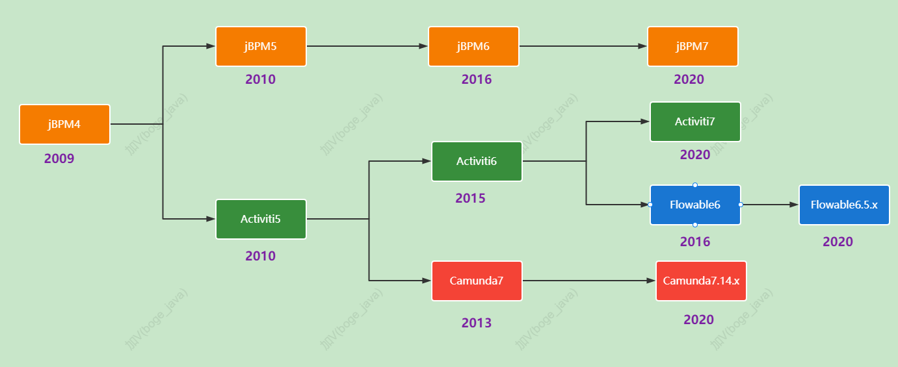

# 一、工作流相关介绍

BPM，业务流程管理是一种管理原则，通常也可以代指BPMS(BusinessProcessManagementSuite)，是一个实现整合不同系统和数据的流程管理软件套件.

**BPMN**(BusinessProcessModelandNotation)是基于流程图的通用可视化标准。该流程图被设计用于创建业务流程操作的图形化模型。业务流程模型就是图形化对象的网状图，包括活动和用于定义这些活动执行顺序的`流程设计器`。BPMN2.0正式版本于2011年1月3日发布，常见的`工作流引擎`如：Activiti、Flowable、jBPM 都基于 BPMN 2.0 标准。

然后来看看BPM的发展历程：

优势在哪？

如果建立一张流程表，使用数字表示流程走到哪一步了，其实就可以了吧。流程引擎还要看他的API，配合他的方法去写，很多冗余的东西用不到

