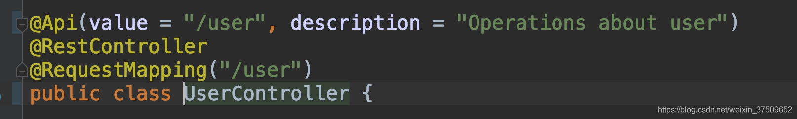

# 一：Swagger

更好的书写API文档的规范且完整框架。

提供描述、生产、消费和可视化RESTful Web Service。

## 依赖：

### 方法一：使用第三方依赖

添加依赖

```xml
	<dependency>
		<groupId>com.spring4all</groupId>
		<artifactId>swagger-spring-boot-starter</artifactId>
		<version>1.7.0.RELEASE</version>
	</dependency>
```

对于SpringBoot

在Spring Boot项目的启动类上添加@EnableSwagger2Doc注解


### 方法二：使用官方依赖

1：添加依赖：

```xml
        <dependency>
            <groupId>io.springfox</groupId>
            <artifactId>springfox-swagger2</artifactId>
            <version>2.7.0</version>
        </dependency>
        <dependency>
            <groupId>io.springfox</groupId>
            <artifactId>springfox-swagger-ui</artifactId>
            <version>2.7.0</version>
        </dependency>
```

**第一个是API获取的包，第二是官方给出的一个ui界面。这个界面可以自定义，默认是官方的，对于安全问题，以及ui路由设置需要着重思考。**

2、swagger的configuration

需要特别注意的是swagger scan base package,这是扫描注解的配置，即你的API接口位置。

```java
import org.springframework.context.annotation.Bean;
import org.springframework.context.annotation.Configuration;
import springfox.documentation.builders.ApiInfoBuilder;
import springfox.documentation.builders.PathSelectors;
import springfox.documentation.builders.RequestHandlerSelectors;
import springfox.documentation.service.ApiInfo;
import springfox.documentation.spi.DocumentationType;
import springfox.documentation.spring.web.plugins.Docket;
import springfox.documentation.swagger2.annotations.EnableSwagger2;

@Configuration
@EnableSwagger2
public class Swagger2 {

        @Bean
        public Docket createRestApi() {
            return new Docket(DocumentationType.SWAGGER_2)
                    .apiInfo(apiInfo())
                    .select()
                    .apis(RequestHandlerSelectors.basePackage("com.yss.ms.admin"))
                    .paths(PathSelectors.any())
                    .build();
        }

        private ApiInfo apiInfo() {
            return new ApiInfoBuilder()
                    .title("服务:发布为daocke镜像,权限管理，用户管理，页面管理，日志 后台 APIs")
                    .description("服务:发布为daocke镜像,权限管理，用户管理，页面管理，日志 后台")
                    .termsOfServiceUrl("http://192.168.1.198:10070/platformgroup/ms-admin")
                    .contact("程序猿")
                    .version("1.0")
                    .build();
        }

    }
```


## swagger的常用API

##### 1、api标记

Api 用在类上，说明该类的作用。可以标记一个Controller类做为swagger 文档资源，使用方式：

```java
@Api(value = "/user", description = "Operations about user")
```



##### 2、ApiOperation标记

ApiOperation：用在方法上，说明方法的作用，每一个url资源的定义,使用方式：

```java
@ApiOperation(
          value = "Find purchase order by ID",
          notes = "For valid response try integer IDs with value <= 5 or > 10. Other values will generated exceptions",
          response = Order,
          tags = {"Pet Store"})
```

##### 3、ApiParam标记

ApiParam请求属性,使用方式：

```java
public ResponseEntity<User> createUser(@RequestBody @ApiParam(value = "Created user object", required = true)  User user)
```

##### 4、ApiResponse

ApiResponse：响应配置，使用方式：
`@ApiResponse(code = 400, message = "Invalid user supplied")`

##### 5、ApiResponses

ApiResponses：响应集配置，使用方式：
`@ApiResponses({ @ApiResponse(code = 400, message = "Invalid Order") })`

##### 6、ResponseHeader

响应头设置，使用方法
`@ResponseHeader(name="head1",description="response head conf")`