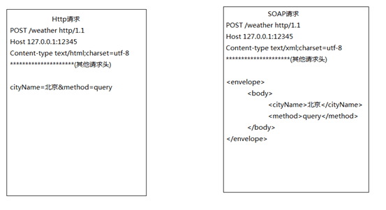

# 一：简介

1   什么是webservice

一言以蔽之：WebService是一种跨编程语言和跨操作系统平台的远程调用**规范**。

**比如**，amazon，天气预报系统，淘宝网，校内网，百度等把自己的系统服务以webservice服务的形式暴露出来，让第三方网站和程序可以调用这些服务功能，这样扩展了自己系统的市场占有率

从表面上看，WebService就是一个应用程序向外界暴露出一个能通过Web进行调用的API，也就是说能用编程的方法通过Web来调用这个应用程序。我们把调用这个WebService的应用程序叫做客户端，而把提供这个WebService的应用程序叫做服务端。**我们要做的就是开发Webservice接口，调用WebService接口**

从深层次看，WebService是建立可互操作的分布式应用程序的新平台，是一个平台，是一套标准。它定义了应用程序如何在Web上实现互操作性，你可以用任何你喜欢的语言，在任何你喜欢的平台上写Web service ，只要我们可以通过Web service标准对这些服务进行查询和访问。

2  什么是远程调用技术

远程调用数据定义：是系统和系统之间的调用


Webservice是使用Http发送SOAP协议的数据的一种远程调用技术

Webservice要开发服务端

Webservice要开发客户端

Webservice客户端开发需要阅读服务端的使用说明书（WSDL）


3：Webservice的优缺点

优点：

 发送方式采用http的post发送，http的默认端口是80，防火墙默认不拦截80，所以跨防火墙

采用XML格式封装数据，XML是跨平台的，所以webservice也可以跨平台。

 Webservice支持面向对象

缺点：

 采用XML格式封装数据，所以在传输过程中，要传输额外的标签，随着SOAP协议的不断完善，标签越来越大，导致webservice性能下降


# 二：入门程序

##   需求

 服务端：发布一个天气查询服务，接收客户端城市名，返回天气数据给客户端

 客户端：发送城市名称给服务端，接收服务端的返回天气数据，打印

## 实现

### 服务端：

开发步骤：

l 第一步：创建SEI（Service Endpoint Interface）接口

```java
public interface WeatherInterface {

	public String queryWeather(String cityName);
	
}
```

第二步：创建SEI实现类，在实现类上加入@WebService

```java
@WebService//@WebService表示该类是一个服务类，需要发布其中的public的方法
public class WeatherInterfaceImpl implements WeatherInterface {

	@Override
	public String queryWeather(String cityName) {
		System.out.println("from client..."+cityName);
		String weather = "晴";
		return weather;
	}
}

```

第三步：发布服务，Endpoint发布服务，publish方法，两个参数：1.服务地址；2.服务实现类

```java
public class WeatherServer {

	public static void main(String[] args) {
		//Endpoint发布服务
		//参数解释
		//1.address - 服务地址
		//2.implementor - 实现类
		Endpoint.publish("http://127.0.0.1:12345/weather", new WeatherInterfaceImpl());
	}
}
```

第四步：测试服务是否发布成功，通过阅读使用说明书，确定客户端调用的接口、方法、参数和返回值存在，证明服务发布成功。

WSDL地址：服务地址+”?wsdl”

### 客户端：

开发步骤

第一步：wsimport命令生成客户端代码

wsimport -s . http://127.0.0.1:12345/weather?wsdl

第二步：根据使用说明书，使用客户端代码调用服务端

Ø 第一步：创建服务视图，视图是从service标签的name属性获取

Ø 第二步：获取服务实现类，实现类从portType的name属性获取

Ø 第三步：获取查询方法，从portType的operation标签获取

```java
public class WeatherClient {

	public static void main(String[] args) {
		//创建服务视图
		WeatherInterfaceImplService weatherInterfaceImplService = new WeatherInterfaceImplService();
		//获取服务实现类
		WeatherInterfaceImpl weatherInterfaceImpl = weatherInterfaceImplService.getPort(WeatherInterfaceImpl.class);
		//调用查询方法，打印
		String weather = weatherInterfaceImpl.queryWeather("北京");
		
		System.out.println(weather);
	}
}
```


# 三：WSDL

WSDL及web服务描述语言，他是webservice服务端使用说明书，说明服务端接口、方法、参数和返回值，WSDL是随服务发布成功，自动生成，无需编写，**为用户提供详细的接口说明书**

好比我们去商店买东西，首先要知道商店里有什么东西可买，然后再来购买，商家的做法就是张贴广告海报。 WebService也一样，WebService客户端要调用一个WebService服务，首先要有知道这个服务的地址在哪，以及这个服务里有什么方法可以调用，所以，WebService务器端首先要通过一个WSDL文件来说明自己家里有啥服务可以对外调用，服务是什么（服务中有哪些方法，方法接受的参数是什么，返回值是什么），服务的网络地址用哪个url地址表示，服务通过什么方式来调用。

WSDL(Web Services Description Language)就是这样一个基于XML的语言，用于描述Web Service及其函数、参数和返回值。

一些最新的开发工具既能根据你的Web service生成WSDL文档，又能导入WSDL文档，生成调用相应WebService的代理类代码。

WSDL文件保存在Web服务器上，通过一个url地址就可以访问到它。客户端要调用一个WebService服务之前，要知道该服务的WSDL文件的地址。WebService服务提供商可以通过两种方式来暴露它的WSDL文件地址：1.注册到UDDI服务器，以便被人查找；2.直接告诉给客户端调用者。

文档结构：


<service>  服务视图，webservice的服务结点，它包括了服务端点

 <binding>   为每个服务端点定义消息格式和协议细节

<portType>  **服务端点**，描述 web service可被执行的操作方法，以及相关的消息，通过binding指向portType

 <message>  定义一个操作（方法）的数据参数(可有多个参数)

 <types>    定义 web service 使用的全部数据类型

阅读从下往上：


# 四：SOAP

SOAP是一种webService平台技术；

SOAP即简单对象访问协议，他是使用http发送的XML格式的数据，它可以跨平台，跨防火墙，SOAP不是webservice的专有协议。

SOAP协议 = HTTP协议 + XML数据格式

WebService通过HTTP协议发送请求和接收结果时，发送的请求内容和结果内容都采用XML格式封装，并增加了一些特定的HTTP消息头，以说明HTTP消息的内容格式，这些特定的HTTP消息头和XML内容格式就是SOAP协议。

当然除了SAOP还有其他WebService技术，XML+XSD,SOAP和WSDL就是构成WebService平台的三大技术。



l 必需有 Envelope 元素，此元素将整个 XML 文档标识为一条 SOAP 消息

l 可选的 Header 元素，包含头部信息

l 必需有Body 元素，包含所有的调用和响应信息 

l 可选的 Fault 元素，提供有关在处理此消息所发生错误的信息


# 五：REST

https://www.cnblogs.com/loveis715/p/4669091.html

REST 是一种软件架构模式，只是一种风格，rest服务采用HTTP 做传输协议，REST 对于HTTP 的利用实现精确的资源定位。

Rest要求对资源定位更加准确，如下：

非rest方式：http://ip:port/queryUser.action?userType=student&id=001

Rest方式：http://ip:port/user/student/query/001

Rest方式表示互联网上的资源更加准确，但是也有缺点，可能目录的层级较多不容易理解。

Rest不再需要生成客户端，直接获取数据

# 五：CXF 

### 1：简介

CXF是什么？有什么用？优点

Apache CXF 是一个开源的web Services 框架，CXF 帮助您构建和开发 web Services ，它支持多种协议，支持数据格式：XML，JSON（仅在REST方式下支持）

### 2：CXF的基础知识

#### 2.1：安装配置

官网下载，解压

环境变量配置


 

### 3：CXF与Spring整合发布SAOP与REST项目

#### 3.1 CXF+Spring整合发布SAOP协议服务

3.1.1服务端

　　开发步骤：

　　第一步：创建web项目，导入jar包，maven项目添加坐标

　　maven需三个：cxf-core, cxf-rt-frontend-jaxws,cxf-rt-transports-http-jetty

　　第二步：创建SEI接口（SEI在webservice中称为portType，在java中称为接口）

```java
import javax.jws.WebService;
import javax.xml.ws.BindingType;
import javax.xml.ws.soap.SOAPBinding;

/**
 * 
 * <p>Title: WeatherInterface.java</p>
 * <p>Description:SEI接口</p>
 */
 @WebService
 @BindingType(SOAPBinding.SOAP12HTTP_BINDING)
 public interface WeatherInterface {

     public String queryWeather(String cityName);

 }
```

　　第三步：创建SEI实现类

```java
public class WeatherInterfaceImpl implements WeatherInterface {

    @Override
    public String queryWeather(String cityName) {
        System.out.println("from client..."+cityName);
        if("北京".equals(cityName)){
            return "冷且霾";
        } else {
            return "暖且晴";
         }
     }

 }
```

　第四步：配置Spring配置文件beans.xml

　　　用<jaxws:server标签发布服务，设置 1.服务地址； 2.设置服务接口； 3设置服务实现类

```xml
<?xml version="1.0" encoding="UTF-8"?>
<beans xmlns="http://www.springframework.org/schema/beans"
    xmlns:xsi="http://www.w3.org/2001/XMLSchema-instance" xmlns:jaxws="http://cxf.apache.org/jaxws"
    xmlns:jaxrs="http://cxf.apache.org/jaxrs" xmlns:cxf="http://cxf.apache.org/core"
    xsi:schemaLocation="http://www.springframework.org/schema/beans 
                            http://www.springframework.org/schema/beans/spring-beans.xsd
                            http://cxf.apache.org/jaxrs http://cxf.apache.org/schemas/jaxrs.xsd
                            http://cxf.apache.org/jaxws http://cxf.apache.org/schemas/jaxws.xsd
                            http://cxf.apache.org/core http://cxf.apache.org/schemas/core.xsd">
     <!-- <jaxws:endpoint发布SOAP协议的服务 ，对Endpoint类封装-->
     <jaxws:endpoint address="/hello" implementor="com.xqc.ws.cxf.server.HelloWorld"/>

     <!-- <jaxws:server发布SOAP协议的服务 ，对JaxWsServerFactoryBean类封装-->
     <jaxws:server address="/weather" serviceClass="com.xqc.ws.cxf.server.WeatherInterface">
         <jaxws:serviceBean>
             <ref bean="weatherInterface"/>
         </jaxws:serviceBean>

         <!-- 配置拦截器 -->
         <jaxws:inInterceptors>
             <ref bean="inIntercepter"/>
         </jaxws:inInterceptors>
         <jaxws:outInterceptors>
             <ref bean="outIntercepter"/>
         </jaxws:outInterceptors>
     </jaxws:server>
     <!-- 配置拦截器的bean -->
     <bean name="inIntercepter" class="org.apache.cxf.interceptor.LoggingInInterceptor"/>
     <bean name="outIntercepter" class="org.apache.cxf.interceptor.LoggingOutInterceptor"/>

     <!-- 配置服务实现类 -->
     <bean name="weatherInterface" class="com.xqc.ws.cxf.server.WeatherInterfaceImpl"/>
 </beans>
```

　　第五步：配置Web.xml

```xml
<?xml version="1.0" encoding="UTF-8"?>
<web-app xmlns:xsi="http://www.w3.org/2001/XMLSchema-instance" xmlns="http://java.sun.com/xml/ns/javaee" xsi:schemaLocation="http://java.sun.com/xml/ns/javaee http://java.sun.com/xml/ns/javaee/web-app_3_0.xsd" id="WebApp_ID" version="3.0">
  <display-name>ws_2_cxf_spring_server</display-name>

  <!-- 设置spring的环境 ,加载spring配置文件 -->
  <context-param>
      <!--contextConfigLocation是不能修改的  -->
      <param-name>contextConfigLocation</param-name>
      <param-value>classpath:beans.xml</param-value>
   </context-param>
   <listener>
       <listener-class>org.springframework.web.context.ContextLoaderListener</listener-class>
   </listener>

   <!-- 配置CXF的Servlet -->
   <servlet>
       <servlet-name>CXF</servlet-name>
       <servlet-class>org.apache.cxf.transport.servlet.CXFServlet</servlet-class>
   </servlet>
   <servlet-mapping>
       <servlet-name>CXF</servlet-name>
       <url-pattern>/ws/*</url-pattern>
   </servlet-mapping>
   
   <welcome-file-list>
     <welcome-file>index.html</welcome-file>
     <welcome-file>index.htm</welcome-file>
     <welcome-file>index.jsp</welcome-file>
     <welcome-file>default.html</welcome-file>
     <welcome-file>default.htm</welcome-file>
     <welcome-file>default.jsp</welcome-file>
   </welcome-file-list>
 </web-app>
```

　　第六步：部署到tomact下，启动tomact

　　第七步：测试服务

　　　　 浏览器输入：WSDL地址规则：http://ip:端口号/项目名称/servlet拦截路径/服务名称?wsdl

　　第八步：Endpoint标签发布服务

<jaxws:endpoint>标签

　　　　　添加文件　

```java
@WebService
public class HelloWorld {
    public String sayHello(String name){
        return "hello,"+name;
    }

}
```

　　　　在beans中添加配置

```xml
      <!-- <jaxws:endpoint发布SOAP协议的服务 ，对Endpoint类封装-->    
      <jaxws:endpoint address="/hello" implementor="com.xqc.ws.cxf.server.HelloWorld"/>      
```

访问：http://ip:端口号/项目名称/servlet拦截路径/   例如：http://localhost:8080/ws_2_cxf_spring_server/ws/

 3.1.2 客户端（近写一个javase的客户端演示一下，客户端可以很多）

　　开发步骤：

第一步：引入jar包

第二步：生成客户端代码

第三步：配置spring配置文件，applicationContent.xml

```xml
<?xml version="1.0" encoding="UTF-8"?>
<beans xmlns="http://www.springframework.org/schema/beans"
    xmlns:xsi="http://www.w3.org/2001/XMLSchema-instance" xmlns:jaxws="http://cxf.apache.org/jaxws"
    xmlns:jaxrs="http://cxf.apache.org/jaxrs" xmlns:cxf="http://cxf.apache.org/core"
    xsi:schemaLocation="http://www.springframework.org/schema/beans 
                            http://www.springframework.org/schema/beans/spring-beans.xsd
                            http://cxf.apache.org/jaxrs http://cxf.apache.org/schemas/jaxrs.xsd
                            http://cxf.apache.org/jaxws http://cxf.apache.org/schemas/jaxws.xsd
                            http://cxf.apache.org/core http://cxf.apache.org/schemas/core.xsd">
    <!-- <jaxws:client实现客户端 ，对JaxWsProxyFactoryBean类封装-->    
    <jaxws:client id="weatherClient" address="http://127.0.0.1:8080/ws_2_cxf_spring_server/ws/weather" serviceClass="com.xqc.cxf.weather.WeatherInterface"/>
</beans>
```

第四步：从spring上下文件获取服务实现类

第五步：调用查询方法，打印

```java
package com.xqc.cxf.client;

import org.springframework.context.ApplicationContext;
import org.springframework.context.support.ClassPathXmlApplicationContext;

import com.xqc.cxf.weather.WeatherInterface;

public class WeatherClient {

     public static void main(String[] args) {
         //初始化spring的上下文
         ApplicationContext context = new ClassPathXmlApplicationContext("classpath:beans.xml");
         WeatherInterface  weatherInterface = (WeatherInterface) context.getBean("weatherClient");
         String weather = weatherInterface.queryWeather("保定");
         System.out.println(weather);
     }
 }
```

#### 3.2CXF+Spring整合发布REST服务

3.2.1服务端

开发步骤：

第一步：导入jar包

第二步：创建学生pojo类，要加入@ XmlRootElement

```java
package com.xqc.ws.rest.pojo;
import java.util.Date;
import javax.xml.bind.annotation.XmlRootElement;
 @XmlRootElement(name="student")//@XmlRootElement可以实现对象和XML数据之间的转换
 public class Student {
    private long id;
     private String name;
     private Date birthday;
 }
```

第三步：创建SEI接口

```java
@WebService
 @Path("/student")//@Path("/student")就是将请求路径中的“/student”映射到接口上
 public interface StudentInterface {

     //查询单个学生
     @GET//指定请求方式，如果服务端发布的时候指定的是GET（POST），那么客户端访问时必须使用GET（POST）
     @Produces(MediaType.APPLICATION_XML)//指定服务数据类型
     @Path("/query/{id}")//@Path("/query/{id}")就是将“/query”映射到方法上，“{id}”映射到参数上，多个参数，以“/”隔开，放到“{}”中
     public Student query(@PathParam("id")long id);

     //查询多个学生
     @GET//指定请求方式，如果服务端发布的时候指定的是GET（POST），那么客户端访问时必须使用GET（POST）
     @Produces("application/json;charset=utf-8")//指定服务数据类型
     @Path("/queryList/{name}")//@Path("/queryList/{name}")就是将“/queryList”映射到方法上，“{name}”映射到参数上，多个参数，以“/”隔开，放到“{}”中
     public List<Student> queryList(@PathParam("name")String name);

 }
```

第四步：创建SEI实现类

```java
 public class StudentInterfaceImpl implements StudentInterface {

     @Override
     public Student query(long id) {
         Student st = new Student();
         st.setId(110);
         st.setName("张三");
         st.setBirthday(new Date());
         return st;
     }

     @Override
     public List<Student> queryList(String name) {

         Student st = new Student();
         st.setId(110);
         st.setName("张三");
         st.setBirthday(new Date());

         Student st2 = new Student();
         st2.setId(120);
         st2.setName("李四");
         st2.setBirthday(new Date());

         List<Student> list = new ArrayList<Student>();
         list.add(st);
         list.add(st2);
         return list;
     }

 }
```


第五步：

配置Spring配置文件,beans.xml，<jaxrs:server，设置1.服务地址；2.服务实现类

```XML
<?xml version="1.0" encoding="UTF-8"?>
<beans xmlns="http://www.springframework.org/schema/beans"
    xmlns:xsi="http://www.w3.org/2001/XMLSchema-instance" xmlns:jaxws="http://cxf.apache.org/jaxws"
    xmlns:jaxrs="http://cxf.apache.org/jaxrs" xmlns:cxf="http://cxf.apache.org/core"
    xsi:schemaLocation="http://www.springframework.org/schema/beans
                            http://www.springframework.org/schema/beans/spring-beans.xsd
                            http://cxf.apache.org/jaxrs http://cxf.apache.org/schemas/jaxrs.xsd
                            http://cxf.apache.org/jaxws http://cxf.apache.org/schemas/jaxws.xsd
                            http://cxf.apache.org/core http://cxf.apache.org/schemas/core.xsd">
     <!-- <jaxrs:server发布REST的服务 ，对JAXRSServerFactoryBean类封装-->
     <jaxrs:server address="/user">
         <jaxrs:serviceBeans>
             <ref bean="studentInterface"/>
         </jaxrs:serviceBeans>
     </jaxrs:server>

     <!-- 配置服务实现类 -->
     <bean name="studentInterface" class="com.xqc.ws.rest.server.StudentInterfaceImpl"/>
 </beans>
```

第六步：配置web.xml

```xml
<?xml version="1.0" encoding="UTF-8"?>
<web-app xmlns:xsi="http://www.w3.org/2001/XMLSchema-instance" xmlns="http://java.sun.com/xml/ns/javaee" xsi:schemaLocation="http://java.sun.com/xml/ns/javaee http://java.sun.com/xml/ns/javaee/web-app_3_0.xsd" id="WebApp_ID" version="3.0">
  <display-name>ws_2_cxf_spring_server</display-name>
  
  <!-- 设置spring的环境 -->
  <context-param>
      <!--contextConfigLocation是不能修改的  -->
      <param-name>contextConfigLocation</param-name>
      <param-value>classpath:applicationContext.xml</param-value>
  </context-param>
  <listener>
      <listener-class>org.springframework.web.context.ContextLoaderListener</listener-class>
  </listener>
  
  <!-- 配置CXF的Servlet -->
  <servlet>
      <servlet-name>CXF</servlet-name>
      <servlet-class>org.apache.cxf.transport.servlet.CXFServlet</servlet-class>
  </servlet>
  <servlet-mapping>
      <servlet-name>CXF</servlet-name>
      <url-pattern>/ws/*</url-pattern>
  </servlet-mapping>
  
  <welcome-file-list>
    <welcome-file>index.html</welcome-file>
    <welcome-file>index.htm</welcome-file>
    <welcome-file>index.jsp</welcome-file>
    <welcome-file>default.html</welcome-file>
    <welcome-file>default.htm</welcome-file>
    <welcome-file>default.jsp</welcome-file>
  </welcome-file-list>
</web-app>
```

第七步：部署到tomcat下，启动tomcat

 

第八步：测试服务

​     REST服务的使用说明书地址：

http://127.0.0.1:8080/ws_4_cxf_rest_spring_server/ws/user?_wadl

[http://127.0.0.1:8080/ws_4_cxf_rest_spring_server/ws/user/student/query/110](http://127.0.0.1:12345/user/student/query/110) 查询单个学生，返回XML数据

```xml
1 <student>
2 <birthday>2015-11-27T15:22:14.240+08:00</birthday>
3 <id>110</id>
4 <name>张三</name>
5 </student>
```

[http://127.0.0.1:8080/ws_4_cxf_rest_spring_server/ws/user/](http://127.0.0.1:12345/user/student/query/110)[/student/queryList/110?_type=json](http://127.0.0.1:12345/user/student/queryList/110?_type=json) 查询多个学生，返回JSON

```
{"student":[{"birthday":"2015-11-27T15:24:21.565+08:00","id":110,"name":"张三"},{"birthday":"2015-11-27T15:24:21.565+08:00","id":120,"name":"李四"}]}
```

3.2.2:客户端：因为返回的直接就是数据，其实直接解析就可以，DOM4J解析

直接用新建html然后使用Ajax使用即可