# 1：大数据

## 一：绪论

1过程：数据采集，大数据存储，大数据计算框架，大数据分析与挖掘，数据可视化，大数据应用

2原因推动力：云计算出现降低存储成本，运算速度越来越快，

3:价值：发现规律，解释现象，预测未来，社会提高治理能力，经济成为发展动力，科学研究新途径

4:思维：要相关不要因果；要全体不要抽样；要效率允许不精确；

## 二：大数据相关技术

### 云计算

：按需提供服务，超大规模服务器当池，冗余稳定，

服务形式主要分为：Iaas，Paas，Saas

### Hadoop

（分布式计算平台）

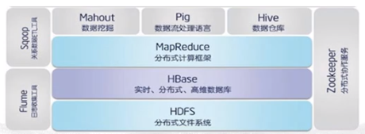

1/对文件进行切片规划

2/启动相应数量的maptask进程

3/调用FileInputFormat中的RecordReader，读一行数据并封装为k1v1

4/调用自定义的map函数，并将k1v1传给map

5/收集map的输出，进行分区和排序

6/reduce task任务启动，并从map端拉取数据

7/reduce task调用自定义的reduce函数进行处理

8/调用outputformat的recordwriter将结果数据输出

### 数据的采集与预处理

采集，预处理，集成

大数据存储：分布式存储，半结构化和无结构化

DFS（分布式文件系统）

CFS（集群文件系统）

GPFS（并行文件系统）

云存储

数据库：关系型与NoSQL

云数据库

数据仓库：面向主题的，

### 大数据计算

离线批处理框架

实时流式计算框架(流式数据)：Spark,Strom

大数据分析

数据描述性分析：统计分析

数据挖掘与机器学习：分类，聚类，关联规则

预测分析：回归分析，时间序列，因果关系预测

推荐系统：协同过滤，基于内容，基于关联规则

数据可视化：

工具：图表生成工具：Echart和AntV

可视化报表

商业智能分析

数据地图

数据挖掘编程语言

## 三：数据采集与预处理

数据采集方法：传感器，日志文件，网络爬虫，外包与众包

数据采集工具：

>   Kafka（基于消息发布与订阅系统）

Flume

大数据预处理

变换，清洗和集成

数据变换（5种）

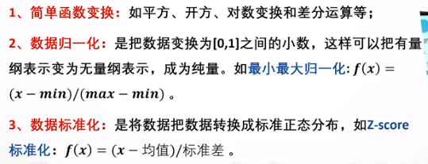

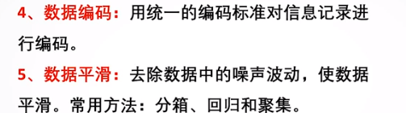

数据清洗

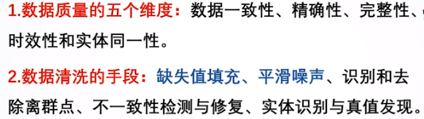

数据集成

实体识别：多个数据源对现实中的实体表示不同

冗余问题

数据值冲突的检测与处理

## 四：Hadoop架构简介

存储

典型分布式文件系统：NFS,AFS,GPFS,GFS,HDFS

处理：

离散批处理，实时交互计算，流计算

### HDFS

分布式文件系统：主节点（Master）和从节点（SlaveNode）

HDFS ：NameNode和DataNode

读数据，写数据流程

常见操作命令：

### HBase

分布式的NoSQL，Google的BigTable，存储，基于HDFS实现随机写操作，先删掉再上传不断优化。主要用于改操作，HDFS本身就可以增删查。

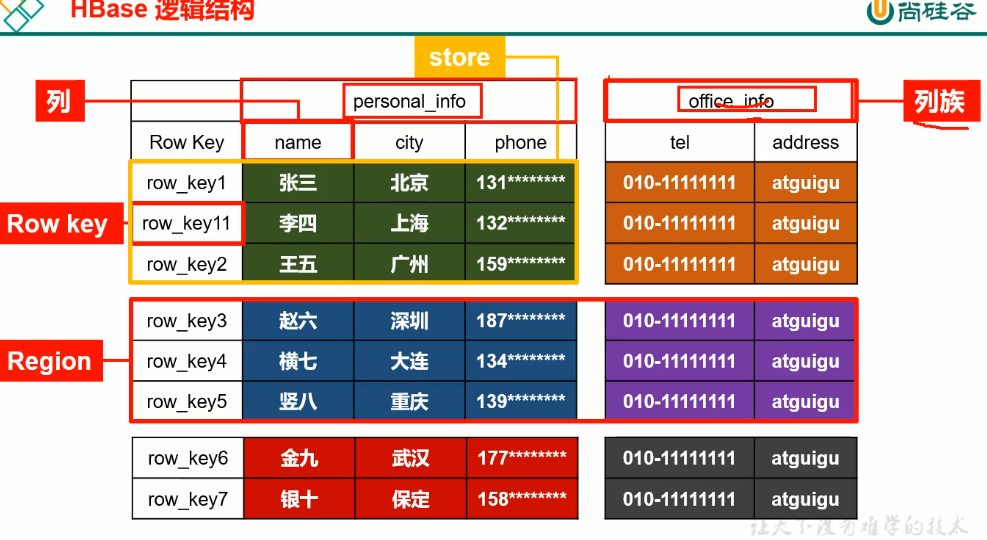

Row_KEY：按字典序排序，唯一

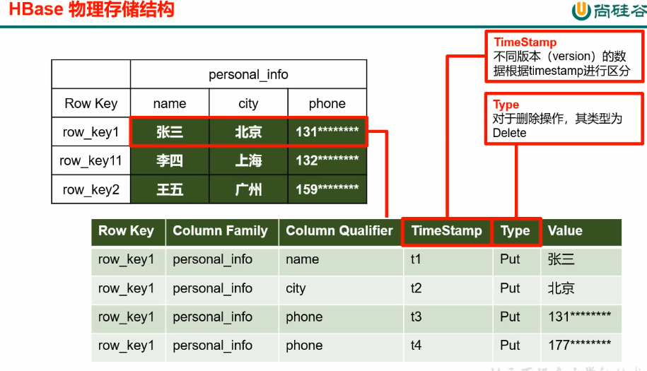

数据模型

1.  NameSpace：命名空间——数据库齐名

2.  Region：切片，HBase定义时只需要声明列族

3.  Row：每行由RowKey和多个Column组成。

4.  Column：

5.  TimeStamp：

6.  Cell：唯一最小单元，没有类型，都是字节码形式存储

详细架构图

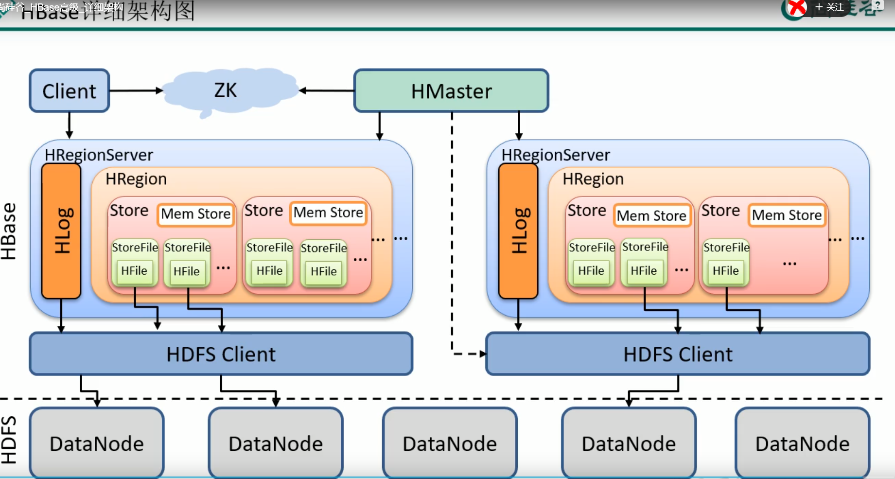

读比写慢

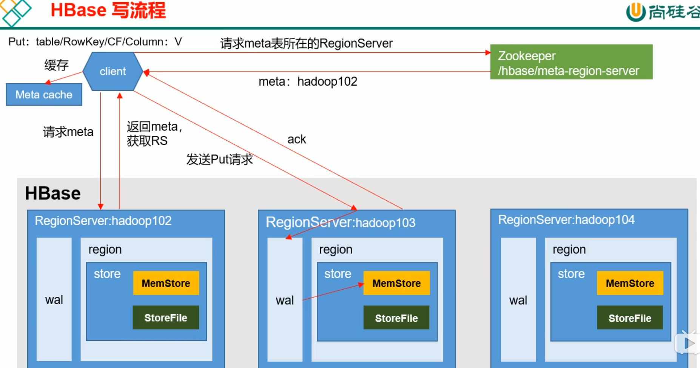

Flush ：一定时间写入HDFS，写入时间 ，当wal的数量超过一定量时，

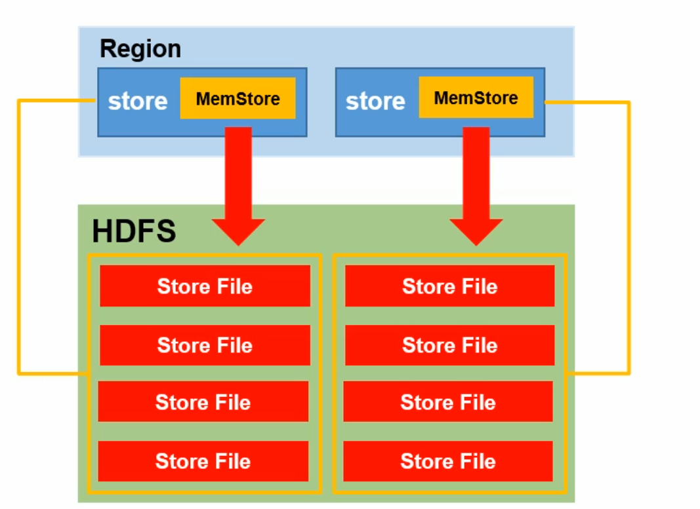

读流程：要将写入HDFS的数据和内存中的数据一起比较时间戳

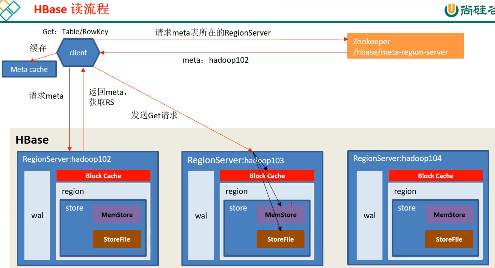

合并

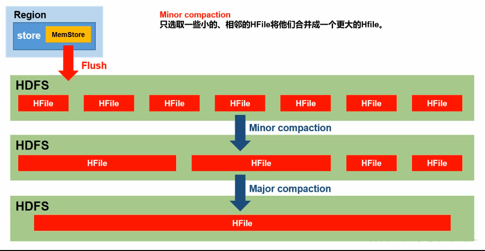

BigTable：键值映射，

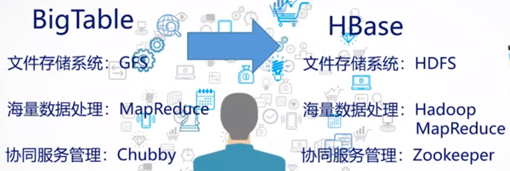

不能改

安装与配置

常见命令

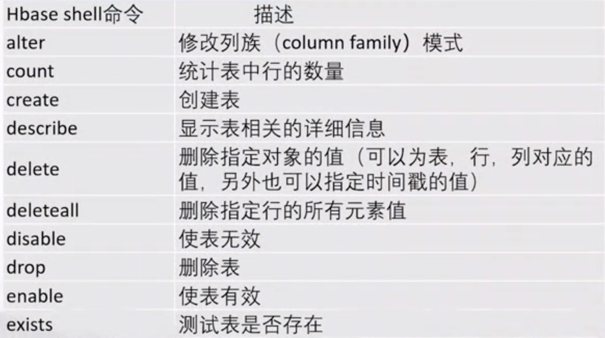

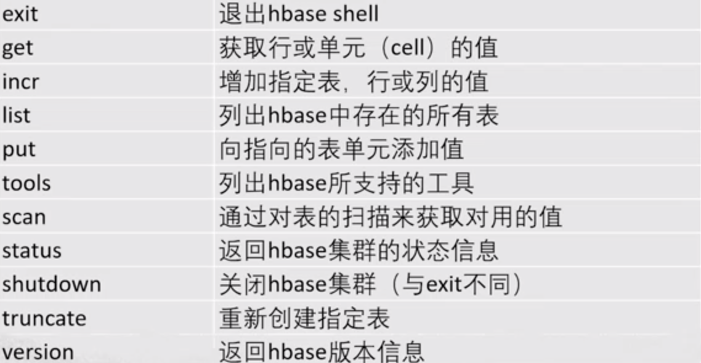

JavaAPI访问

建立连接

本地对表建立连接操作

通过连接对操作

Null数据不会存储

hbase是主从结构，hmaster作为主节点，hregionServer作为从节点

### Hive

<https://www.jianshu.com/p/b0b77b045fab>

Hive是基于Hadoop的一个数据仓库工具，可以将结构化的数据文件映射成一张表，提供类SQL的查询功能，相当于HDFS的一个客户端，是对MapReduce的一个封装

Mybstia——Hive

Mysql——Hbase

数据库——HDFS

主要是数据操作，查询，函数

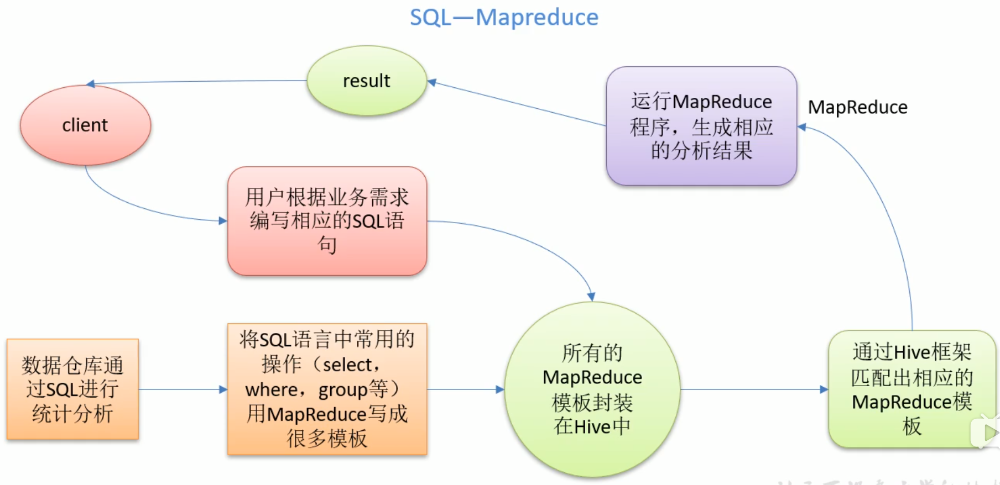

数据类型

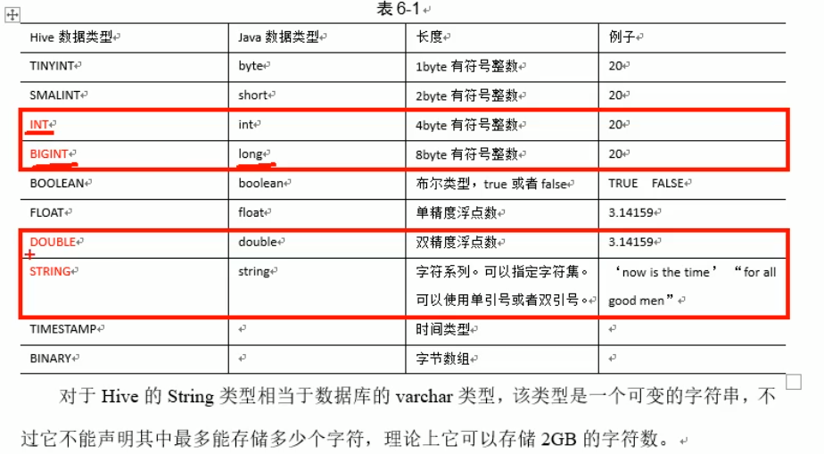

数据仓库：面向主题的，集成的，相对稳定的，反映历史变化的数据集合

安装：

应用接口：

元数据：MYSQL存储

存储模型

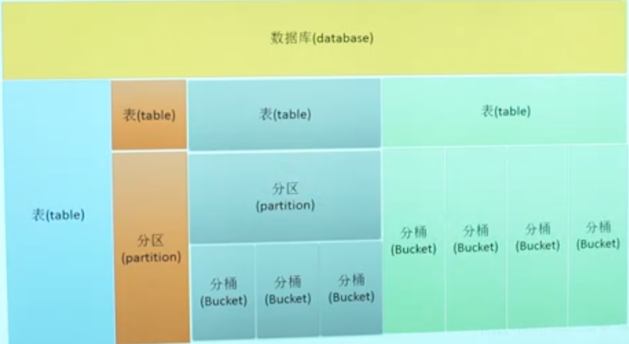

简单操作

CLI：HIVE的数据操作语言DML：网站参考

HQL语言：与SQL语言差不多

## 五：典型大数据计算框架

### MapReduce

工作机制：先map在reduce

6、MapTask和ReduceTask工作机制（☆☆☆☆☆）（也可回答MapReduce工作原理）

（1）Read阶段：Map
Task通过用户编写的RecordReader，从输入InputSplit中解析出一个个key/value。

（2）Map阶段：该节点主要是将解析出的key/value交给用户编写map()函数处理，并产生一系列新的key/value。

（3）Collect收集阶段：在用户编写map()函数中，当数据处理完成后，一般会调用OutputCollector.collect()输出结果。在该函数内部，它会将生成的key/value分区（调用Partitioner），并写入一个环形内存缓冲区中。

（4）Spill阶段：即“溢写”，当环形缓冲区满后，MapReduce会将数据写到本地磁盘上，生成一个临时文件。需要注意的是，将数据写入本地磁盘之前，先要对数据进行一次本地排序，并在必要时对数据进行合并、压缩等操作。

（5）Combine阶段：当所有数据处理完成后，MapTask对所有临时文件进行一次合并，以确保最终只会生成一个数据文件。

（1）Copy阶段：ReduceTask从各个MapTask上远程拷贝一片数据，并针对某一片数据，如果其大小超过一定阈值，则写到磁盘上，否则直接放到内存中。

（2）Merge阶段：在远程拷贝数据的同时，ReduceTask启动了两个后台线程对内存和磁盘上的文件进行合并，以防止内存使用过多或磁盘上文件过多。

**（3）Sort阶段：按照MapReduce语义，用户编写reduce()函数输入数据是按key进行聚集的一组数据。为了将key相同的数据聚在一起，Hadoop采用了基于排序的策略。由于各个MapTask已经实现对自己的处理结果进行了局部排序，因此，ReduceTask只需对所有数据进行一次归并排序即可**。

（4）Reduce阶段：reduce()函数将计算结果写到HDFS上。

Combiner是在每一个maptask所在的节点运行；

Reducer是接收全局所有Mapper的输出结果。

体系结构

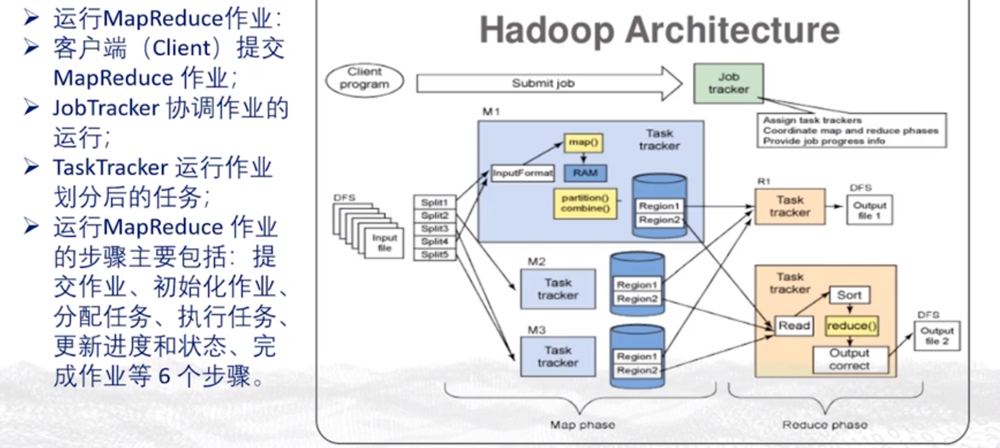

体系结构改进

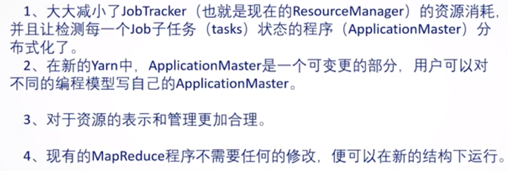

### Spark

Job的中间输出结果可以保存在内存中，从而不再需要读写HDFS，因此Spark能更好地适应用于数据挖掘与机器学习等需要迭代的MapReduce算法

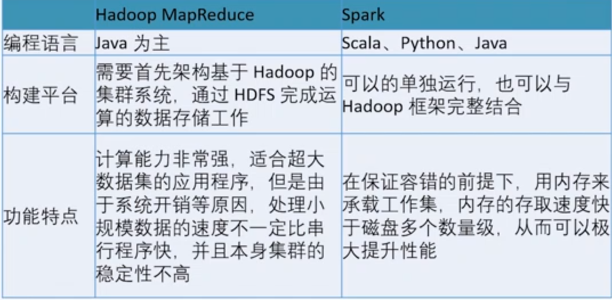

概念术语

Application：

Driver

Executor

Work：运行节点

Task::节点具体任务

Job：多个Task组成的并行单元

运行流程

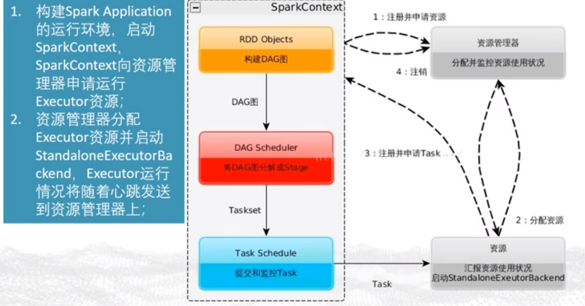

SparkAPI

DataFrameAPI

MLib（机器学习）

回归预测

## 六：大数据分析

### 数据描述性分析

统计学方法，描述数据的统计特征量，分析数据

1.  集中趋势分析

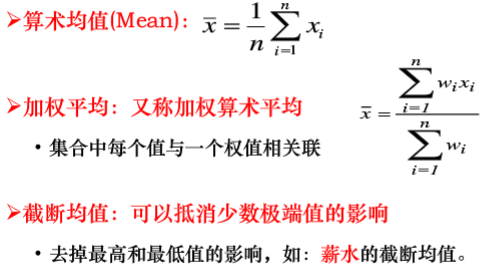

中位数：

众数：

1.  离散趋势分析

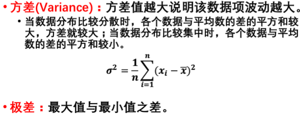

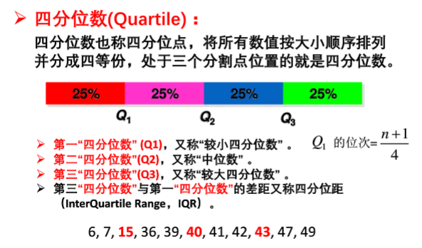

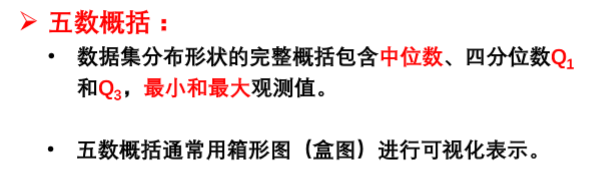

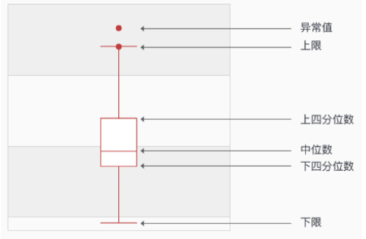

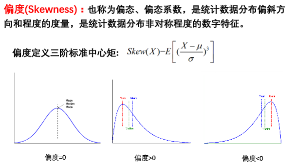

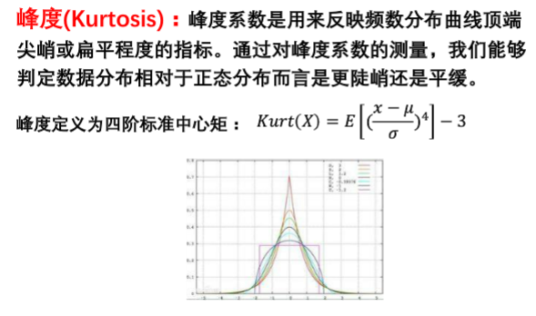

多维数据的相关性：

协方差和Pearson相关系数

1.  频数分布

### 回归分析

确定两种或两种以上变量间相互依赖的定量关系的一种统计分析方法。

因变量与自变量

一元线性回归：最小二乘法

多元线性回归

非线性回归

### 聚类分析

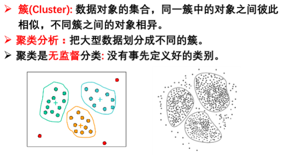

内部高的相似度，外部低的相似度，指标有：

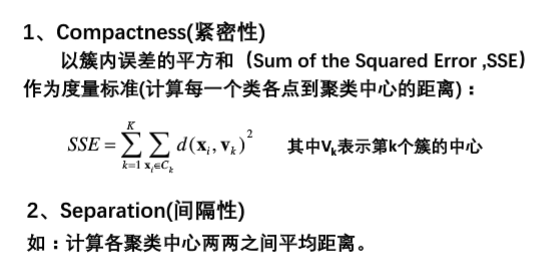

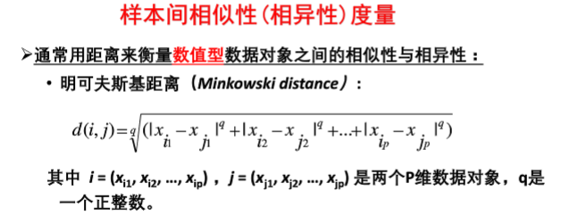

q==1则为曼哈顿距离，q==2则为欧式距离

聚类分析算法

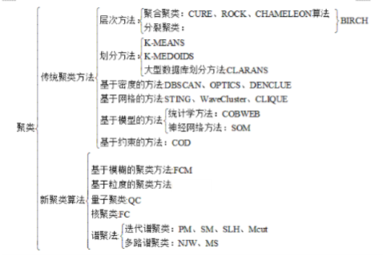

### 分类分析

有监督学习，已经有类别

分类算法的训练与评价

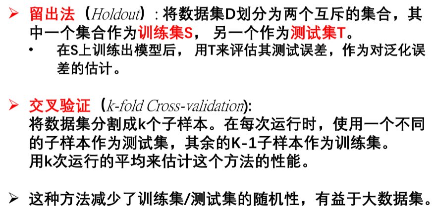

主要的分类算法有

决策树：

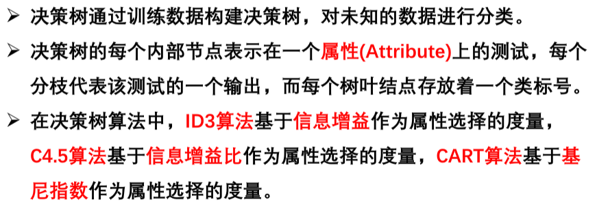

信息熵：变量的不确定性越大，熵也就越大

信息增益越大，区分样本的能力越强，越具有代表性

1：定义：大数据是指无法在一定时间内用常规软件工具对其内容进行抓取、管理和处理的数据集合。
大数据技术，是指从各种各样类型的数据中，快速获得有价值信息的能力。
适用于大数据的技术，包括大规模并行处理（MPP）数据库，数据挖掘电网，分布式文件系统，分布式数据库，云计算平台，互联网，和可扩展的存储系统。

2：Spark与Hadoop的对比

Hadoop存在如下一些缺点:

表达能力有限、磁盘IO开销大、延迟高、任务之间的衔接涉及IO开销、在前一个任务执行完成之前，其他任务就无法开始，难以胜任复杂、多阶段的计算任务，

Spark主要具有如下优点:

Spark的计算模式也属于MapReduce,但不局限于Map和Reduce操作，还提供了多种数据集操作类型，编程模型比Hadoop
MapReduce更灵活、Spark提供了内存计算，可将中间结果放到内存中;对于迭代运算效率更高、Spark基于DAG的任务调度执行机制，要优于Hadoop
MapReduce的迭代执行机制、使用Hadoop进行迭代计算非常耗资源、Spark将数据载入内存后，之后的迭代计算都可以直接使用内存中的中间结果作运算，避免了从磁盘中频繁读取数据

3：MapReduce的全过程：从hdfs读取数据，执行map任务输出中间结果，通过shuffle把中间结果分区排序整理后发给reduce任务，执行reduce任务得到最终结果，并写入分布式文件系统，应用于关系代数运算，分组和聚合运算，矩阵向量乘法

所以shuffle包括：partition，Copy和
