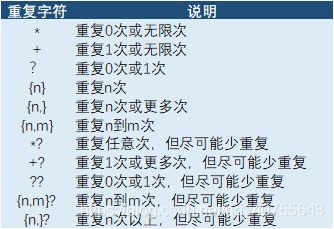
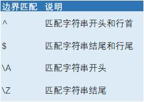
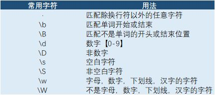

在线测试网站：https://regex101.com/

一般编辑器 ` .* `  代表正则表达式

正则表达式使用单个字符串来描述、匹配一系列匹配某个句法规则的字符串。正则表达式是烦琐的，但它是强大的，学会之后的应用会让你除了提高效率外，会给你带来绝对的成就感。

举个例子，在电脑的cmd窗口，你肯能用过？和*来查找过文件，A?.txt查找出来的就可能是A1.txt  Ab.txt AA.txt文件，如果是A*.txt查找出来的可能就是A1.txt  A1A.txt  Aacadf.txt文件这里的？和*就是通配符，这种通配符就和正则表达式的工作原理一致，正则表达式就是为了搜索，匹配而产生的。

# 第一章：正则字符

## 1：常用字符


 

## 2：重复次数

限定符

 

ab+ : 匹配a开头，b重复一次或无限次

(ab)+ :匹配ab出现一次或多次


 

## 3：边界限定

 

对字符串进行操作

1：QQ号校验，一句句判断太麻烦

要求“5-15长度。0不能开头，只能是数字

String regex = “[1-9][0-9]{4,14}”;//第一位为1到9，第二位0到9，出现4到14次

Boolean flag = qq.matches(regex);

匹配字符

单个字符：

通配符：.匹配除了回车和换行以外的所有字符

[abcd]: 匹配方括号内的字符，里面是或的关系
[^abcd]: 匹配除了方括号里的所有字符，

​    [a-z]：匹配所有的小写字符

​    [A-Z]：匹配所有的大写字符

​    [a-zA-Z0-9]：匹配……中间没有空格 \w所有单词 \d代表所有的数字

*：匹配

+：多个·

？：

a{2,}长度:两个以上的a

\:转义符

/:就是字符斜杠

(?P<name>……)对group进行命名

##  或运算

Good （morning|evening|afternoon）

## 字符类

[]

[abc]+：匹配（只能是a或者b或则c） 的 + （一个或则多个）

元字符

\d：数字字符

\w：字母，数字，下划线，汉字的字符

\s：空白符，同时包含Tab和换行符

.*：代表任意字符，但不包含换行符

^：匹配行首

$：匹配行尾





## 贪婪与懒惰匹配

懒惰匹配，尽可能少的匹配

```xml
<.+> 默认贪婪匹配“任意字符”
<.+?> 懒惰匹配“任意字符
```

+？

*？

### 修饰符

修饰符用于执行区分大小写和全局匹配:

| 修饰符                                             | 描述                                                     |
| :------------------------------------------------- | :------------------------------------------------------- |
| [i](https://www.runoob.com/js/jsref-regexp-i.html) | 执行对大小写不敏感的匹配。                               |
| [g](https://www.runoob.com/js/jsref-regexp-g.html) | 执行全局匹配（查找所有匹配而非在找到第一个匹配后停止）。 |
| m                                                  | 执行多行匹配。                                           |

### 方括号

方括号用于查找某个范围内的字符：

| 表达式                                                       | 描述                               |
| :----------------------------------------------------------- | :--------------------------------- |
| [[abc\]](https://www.runoob.com/jsref/jsref-regexp-charset.html) | 查找方括号之间的任何字符。         |
| [[^abc\]](https://www.runoob.com/jsref/jsref-regexp-charset-not.html) | 查找任何不在方括号之间的字符。     |
| [0-9]                                                        | 查找任何从 0 至 9 的数字。         |
| [a-z]                                                        | 查找任何从小写 a 到小写 z 的字符。 |
| [A-Z]                                                        | 查找任何从大写 A 到大写 Z 的字符。 |
| [A-z]                                                        | 查找任何从大写 A 到小写 z 的字符。 |
| [adgk]                                                       | 查找给定集合内的任何字符。         |
| [^adgk]                                                      | 查找给定集合外的任何字符。         |
| (red\|blue\|green)                                           | 查找任何指定的选项。               |

### 元字符

元字符（Metacharacter）是拥有特殊含义的字符：

| 元字符                                                       | 描述                                        |
| :----------------------------------------------------------- | :------------------------------------------ |
| [.](https://www.runoob.com/jsref/jsref-regexp-dot.html)      | 查找单个字符，除了换行和行结束符。          |
| [\w](https://www.runoob.com/jsref/jsref-regexp-wordchar.html) | 查找数字、字母及下划线。                    |
| [\W](https://www.runoob.com/jsref/jsref-regexp-wordchar-non.html) | 查找非单词字符。                            |
| [\d](https://www.runoob.com/jsref/jsref-regexp-digit.html)   | 查找数字。                                  |
| [\D](https://www.runoob.com/jsref/jsref-regexp-digit-non.html) | 查找非数字字符。                            |
| [\s](https://www.runoob.com/jsref/jsref-regexp-whitespace.html) | 查找空白字符。                              |
| [\S](https://www.runoob.com/jsref/jsref-regexp-whitespace-non.html) | 查找非空白字符。                            |
| [\b](https://www.runoob.com/jsref/jsref-regexp-begin.html)   | 匹配单词边界。                              |
| [\B](https://www.runoob.com/jsref/jsref-regexp-begin-not.html) | 匹配非单词边界。                            |
| \0                                                           | 查找 NULL 字符。                            |
| [\n](https://www.runoob.com/jsref/jsref-regexp-newline.html) | 查找换行符。                                |
| \f                                                           | 查找换页符。                                |
| \r                                                           | 查找回车符。                                |
| \t                                                           | 查找制表符。                                |
| \v                                                           | 查找垂直制表符。                            |
| [\xxx](https://www.runoob.com/jsref/jsref-regexp-octal.html) | 查找以八进制数 xxx 规定的字符。             |
| [\xdd](https://www.runoob.com/jsref/jsref-regexp-hex.html)   | 查找以十六进制数 dd 规定的字符。            |
| [\uxxxx](https://www.runoob.com/jsref/jsref-regexp-unicode-hex.html) | 查找以十六进制数 xxxx 规定的 Unicode 字符。 |

### 量词

| 量词                                                         | 描述                                                         |
| :----------------------------------------------------------- | :----------------------------------------------------------- |
| [n+](https://www.runoob.com/jsref/jsref-regexp-onemore.html) | 匹配任何包含至少一个 n 的字符串。例如，/a+/ 匹配 "candy" 中的 "a"，"caaaaaaandy" 中所有的 "a"。 |
| [n*](https://www.runoob.com/jsref/jsref-regexp-zeromore.html) | 匹配任何包含零个或多个 n 的字符串。例如，/bo*/ 匹配 "A ghost booooed" 中的 "boooo"，"A bird warbled" 中的 "b"，但是不匹配 "A goat grunted"。 |
| [n?](https://www.runoob.com/jsref/jsref-regexp-zeroone.html) | 匹配任何包含零个或一个 n 的字符串。例如，/e?le?/ 匹配 "angel" 中的 "el"，"angle" 中的 "le"。 |
| [n{X}](https://www.runoob.com/jsref/jsref-regexp-nx.html)    | 匹配包含 X 个 n 的序列的字符串。例如，/a{2}/ 不匹配 "candy," 中的 "a"，但是匹配 "caandy," 中的两个 "a"，且匹配 "caaandy." 中的前两个 "a"。 |
| [n{X,}](https://www.runoob.com/jsref/jsref-regexp-nxcomma.html) | X 是一个正整数。前面的模式 n 连续出现至少 X 次时匹配。例如，/a{2,}/ 不匹配 "candy" 中的 "a"，但是匹配 "caandy" 和 "caaaaaaandy." 中所有的 "a"。 |
| [n{X,Y}](https://www.runoob.com/jsref/jsref-regexp-nxy.html) | X 和 Y 为正整数。前面的模式 n 连续出现至少 X 次，至多 Y 次时匹配。例如，/a{1,3}/ 不匹配 "cndy"，匹配 "candy," 中的 "a"，"caandy," 中的两个 "a"，匹配 "caaaaaaandy" 中的前面三个 "a"。注意，当匹配 "caaaaaaandy" 时，即使原始字符串拥有更多的 "a"，匹配项也是 "aaa"。 |
| [n$](https://www.runoob.com/jsref/jsref-regexp-ndollar.html) | 匹配任何结尾为 n 的字符串。                                  |
| [^n](https://www.runoob.com/jsref/jsref-regexp-ncaret.html)  | 匹配任何开头为 n 的字符串。                                  |
| [?=n](https://www.runoob.com/jsref/jsref-regexp-nfollow.html) | 匹配任何其后紧接指定字符串 n 的字符串。                      |
| [?!n](https://www.runoob.com/jsref/jsref-regexp-nfollow-not.html) | 匹配任何其后没有紧接指定字符串 n 的字符串。                  |

### 

# 第二章：常用正则表达式

## 1、校验数字的表达式

·    数字：**^[0-9]\*$**

·    n位的数字：**^\d{n}$**

·    至少n位的数字**：****^\d{n,}$**

·    m-n位的数字：**^\d{m,n}$**

·    零和非零开头的数字：**^(0|[1-9][0-9]\*)$**

·    非零开头的最多带两位小数的数字：**^([1-9][0-9]\*)+(\.[0-9]{1,2})?$**

·    带1-2位小数的正数或负数：**^(\-)?\d+(\.\d{1,2})$**

·    正数、负数、和小数：**^(\-|\+)?\d+(\.\d+)?$**

·    有两位小数的正实数：**^[0-9]+(\.[0-9]{2})?$**

·    有1~3位小数的正实数：**^[0-9]+(\.[0-9]{1,3})?$**

·    非零的正整数：**^[1-9]\d\*$** **或** **^([1-9][0-9]\*){1,3}$** **或** **^\+?[1-9][0-9]\*$**

·    非零的负整数：**^\-[1-9][]0-9"\*$** **或** **^-[1-9]\d\*$**

·    非负整数：**^\d+$** **或** **^[1-9]\d\*|0$**

·    非正整数：**^-[1-9]\d\*|0$** **或** **^((-\d+)|(0+))$**

·    非负浮点数：**^\d+(\.\d+)?$** **或** **^[1-9]\d\*\.\d\*|0\.\d\*[1-9]\d\*|0?\.0+|0$**

·    非正浮点数：**^((-\d+(\.\d+)?)|(0+(\.0+)?))$** **或** **^(-([1-9]\d\*\.\d\*|0\.\d\*[1-9]\d\*))|0?\.0+|0$**

·    正浮点数：**^[1-9]\d\*\.\d\*|0\.\d\*[1-9]\d\*$** **或** **^(([0-9]+\.[0-9]\*[1-9][0-9]\*)|([0-9]\*[1-9][0-9]\*\.[0-9]+)|([0-9]\*[1-9][0-9]\*))$**

·    负浮点数：**^-([1-9]\d\*\.\d\*|0\.\d\*[1-9]\d\*)$** **或** **^(-(([0-9]+\.[0-9]\*[1-9][0-9]\*)|([0-9]\*[1-9][0-9]\*\.[0-9]+)|([0-9]\*[1-9][0-9]\*)))$**

·    浮点数：**^(-?\d+)(\.\d+)?$** **或** **^-?([1-9]\d\*\.\d\*|0\.\d\*[1-9]\d\*|0?\.0+|0)$**

## 2、校验字符的表达式

·    汉字：**^[\u4e00-\u9fa5]{0,}$**

·    英文和数字：**^[A-Za-z0-9]+$** **或** **^[A-Za-z0-9]{4,40}$**

·    长度为3-20的所有字符：**^.{3,20}$**

·    由26个英文字母组成的字符串：**^[A-Za-z]+$**

·    由26个大写英文字母组成的字符串：**^[A-Z]+$**

·    由26个小写英文字母组成的字符串：**^[a-z]+$**

·    由数字和26个英文字母组成的字符串：**^[A-Za-z0-9]+$**

·    由数字、26个英文字母或者下划线组成的字符串：**^\w+$** **或** **^\w{3,20}$**

·    中文、英文、数字包括下划线：**^[\u4E00-\u9FA5A-Za-z0-9_]+$**

·    中文、英文、数字但不包括下划线等符号：**^[\u4E00-\u9FA5A-Za-z0-9]+$** **或** **^[\u4E00-\u9FA5A-Za-z0-9]{2,20}$**

·    可以输入含有^%&',;=?$\"等字符：**[^%&',;=?$\x22]+**

·    禁止输入含有~的字符：**[^~\x22]+**

## 3、特殊需求表达式

·    Email地址：**^\w+([-+.]\w+)\*@\w+([-.]\w+)\*\.\w+([-.]\w+)\*$**

·    域名：**[a-zA-Z0-9][-a-zA-Z0-9]{0,62}(/.[a-zA-Z0-9][-a-zA-Z0-9]{0,62})+/.?**

·    InternetURL：**[a-zA-z]+://[^\s]\*** **或** **^http://([\w-]+\.)+[\w-]+(/[\w-./?%&=]\*)?$**

·    手机号码：**^(13[0-9]|14[5|7]|15[0|1|2|3|5|6|7|8|9]|18[0|1|2|3|5|6|7|8|9])\d{8}$**

·    电话号码("XXX-XXXXXXX"、"XXXX-XXXXXXXX"、"XXX-XXXXXXX"、"XXX-XXXXXXXX"、"XXXXXXX"和"XXXXXXXX)：**^(\(\d{3,4}-)|\d{3.4}-)?\d{7,8}$**

·    国内电话号码(0511-4405222、021-87888822)：**\d{3}-\d{8}|\d{4}-\d{7}**

·    电话号码正则表达式（支持手机号码，3-4位区号，7-8位直播号码，1－4位分机号）: **((\d{11})|^((\d{7,8})|(\d{4}|\d{3})-(\d{7,8})|(\d{4}|\d{3})-(\d{7,8})-(\d{4}|\d{3}|\d{2}|\d{1})|(\d{7,8})-(\d{4}|\d{3}|\d{2}|\d{1}))$)**

·    身份证号(15位、18位数字)，最后一位是校验位，可能为数字或字符X：**(^\d{15}$)|(^\d{18}$)|(^\d{17}(\d|X|x)$)**

·    帐号是否合法(字母开头，允许5-16字节，允许字母数字下划线)：**^[a-zA-Z][a-zA-Z0-9_]{4,15}$**

·    密码(以字母开头，长度在6~18之间，只能包含字母、数字和下划线)：**^[a-zA-Z]\w{5,17}$**

·    强密码(必须包含大小写字母和数字的组合，不能使用特殊字符，长度在 8-10 之间)：**^(?=.\*\d)(?=.\*[a-z])(?=.\*[A-Z])[a-zA-Z0-9]{8,10}$**

·    强密码(必须包含大小写字母和数字的组合，可以使用特殊字符，长度在8-10之间)：**^(?=.\*\d)(?=.\*[a-z])(?=.\*[A-Z]).{8,10}$**

·    日期格式：**^\d{4}-\d{1,2}-\d{1,2}**

·    一年的12个月(01～09和1～12)：**^(0?[1-9]|1[0-2])$**

·    一个月的31天(01～09和1～31)：**^((0?[1-9])|((1|2)[0-9])|30|31)$**


## 匹配括号里的内容


#  第三章：使用

## 3.1：JS中使用

### 支持正则表达式的 String 对象的方法

search：检索与正则表达式想匹配的值的索引

```js
var str = "PMS102039CA89";
//查找数字出现的索引
var num = str.search(/[0-9]/ig);//返回3
```

match：找到一个或多个正则表达式的匹配


replace：替换与正则表达式匹配的子串

```js
var str = "PMS102039CA89";
//用""替换非数字字符
var num = str.replace(/[^0-9]/ig,"");//10203989
```

第二个参数中的 $ 字符具有特定的含义。如下表所示，它说明从模式匹配得到的字符串将用于替换。

| 字符             | 替换文本                                            |
| :--------------- | :-------------------------------------------------- |
| $1、$2、...、$99 | 与 regexp 中的第 1 到第 99 个子表达式相匹配的文本。 |
| $&               | 与 regexp 相匹配的子串。                            |
| $`               | 位于匹配子串左侧的文本。                            |
| $'               | 位于匹配子串右侧的文本。                            |
| $$               | 直接量符号。                                        |

split：把字符串分割为字符串数组


### RegExp 对象方法

| 方法                                                         | 描述                                               |
| :----------------------------------------------------------- | :------------------------------------------------- |
| [compile](https://www.runoob.com/jsref/jsref-regexp-compile.html) | 在 1.5 版本中已废弃。 编译正则表达式。             |
| [exec](https://www.runoob.com/jsref/jsref-exec-regexp.html)  | 检索字符串中指定的值。返回找到的值，并确定其位置。 |
| [test](https://www.runoob.com/jsref/jsref-test-regexp.html)  | 检索字符串中指定的值。返回 true 或 false。         |
| [toString](https://www.runoob.com/jsref/jsref-regexp-tostring.html) | 返回正则表达式的字符串。                           |

### RegExp 对象属性

| 属性                                                         | 描述                                               |
| :----------------------------------------------------------- | :------------------------------------------------- |
| [constructor](https://www.runoob.com/jsref/jsref-regexp-constructor.html) | 返回一个函数，该函数是一个创建 RegExp 对象的原型。 |
| [global](https://www.runoob.com/jsref/jsref-regexp-global.html) | 判断是否设置了 "g" 修饰符                          |
| [ignoreCase](https://www.runoob.com/jsref/jsref-regexp-ignorecase.html) | 判断是否设置了 "i" 修饰符                          |
| [lastIndex](https://www.runoob.com/jsref/jsref-lastindex-regexp.html) | 用于规定下次匹配的起始位置                         |
| [multiline](https://www.runoob.com/jsref/jsref-multiline-regexp.html) | 判断是否设置了 "m" 修饰符                          |
| [source](https://www.runoob.com/jsref/jsref-source-regexp.html) | 返回正则表达式的匹配模式                           |

```javascript
stringObject.replace(regexp/substr,replacement)
```

## Java中正则表达式的应用

1：提取括号里的内容

```java
        String content = "(BF0001)(交易失败)";
        String reg = "\\((.*?)\\)";
        Pattern pattern = Pattern.compile(reg);
        Matcher matcher = pattern.matcher(content);

        while (matcher.find()) {
            String src = matcher.group(1);
            System.out.println(src);
        }
```

2：替换特殊符号

```java
String beforeString = "&1,a*A；公司"
String regex = "[^0-9a-zA-Z\u4e00-\u9fa5]";
String after = beforeString
```

