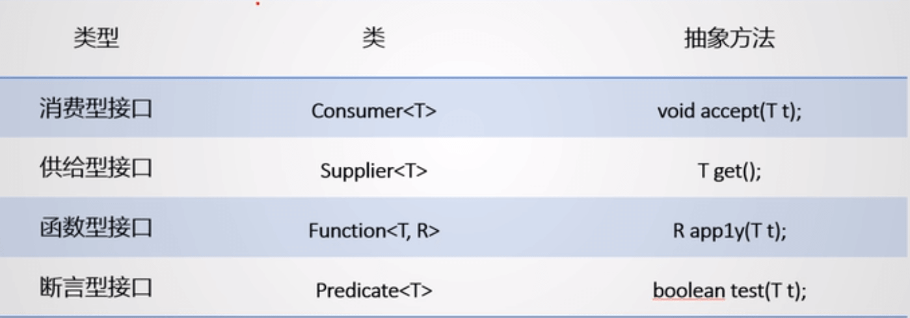
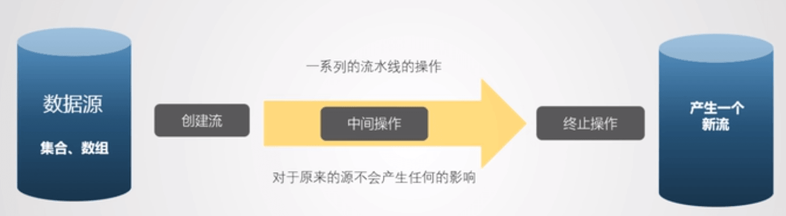
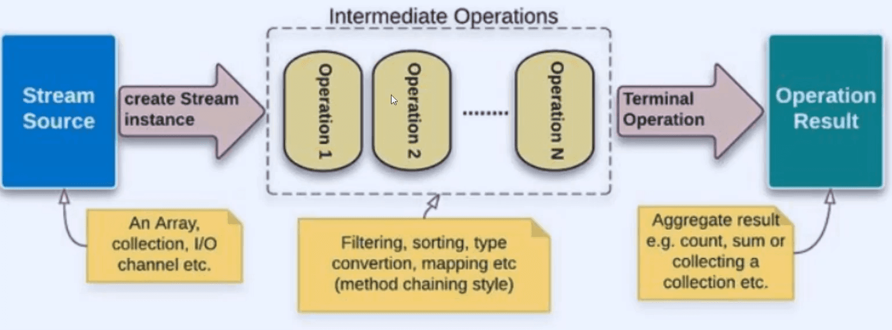
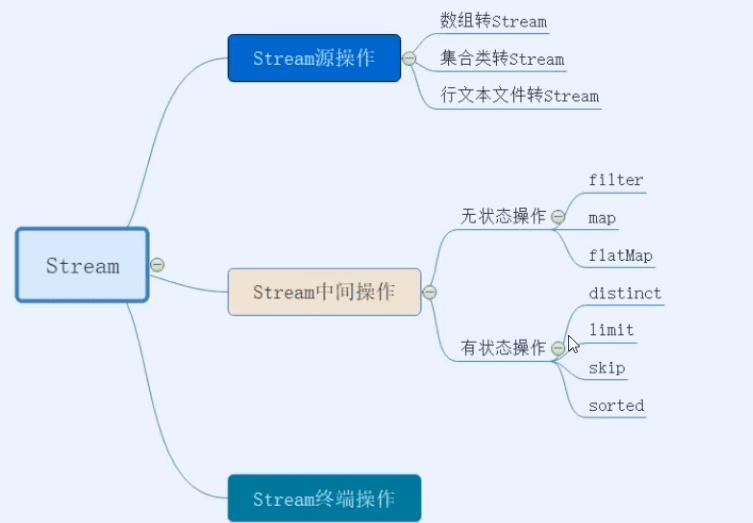
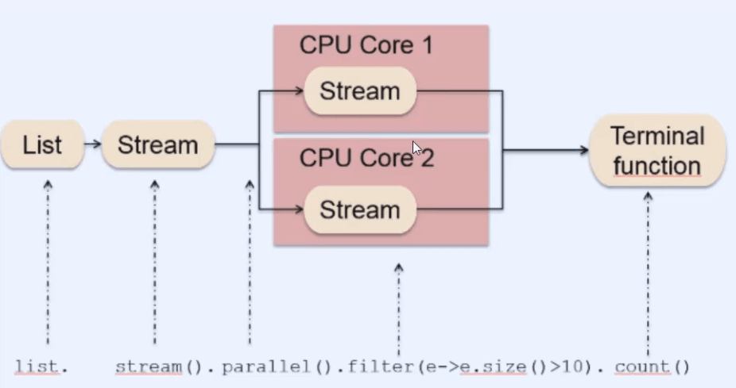

## 1：Lambda 表达式

Lambda 表达式的标准格式为：

(参数类型 参数名称) ‐\> { 代码语句 }

格式说明：

小括号内的语法与传统方法参数列表一致：无参数则留空；多个参数则用逗号分隔。对应于抽象方法的参数

\-\> 是新引入的语法格式，代表指向动作。

大括号内的语法与传统方法体要求基本一致。相当于对抽象方法的实现，函数式接口，只有一个抽象方法。

### 1.1：Lambda 语法糖

匿名函数，由编译器推断并帮你

解决了什么？？

例一：

```java
TreeSet<Integer> set = new TreeSet<>(new Comparator<Integer>() {
    @Override
    public int compare(Integer o1, Integer o2) {
        return Integer.compare(o1,o2);
    }
});
```

去掉多余的一模一样的架子

```java
 TreeSet<Integer> set = new TreeSet<>((x,y)->Integer.compare(x,y));
```

例二：自定义

### 1.2：六大语法

->lambda 操作符，左侧是 lambda 表达式的参数列表，右侧是所需执行的功能，依赖于函数式接口，lambda 表达式即对接口的实现

函数式接口：

使用注解@FunctionalInterface，该接口只有一个方法

**语法 1：无参无返回值**

```java
		//语法一：无参无返回值
		Runnable runnable = new Runnable() {
			@Override
			public void run() {
				System.out.println("输出某些东西");
			}
		};
		//简化实现
		Runnable runnable1 = ()->System.out.println("输出某些东西");
```

注意：匿名内部类使用外部的变量必须为 final，无法改变，即使没有声明，也是 final 的

**语法二：有一个参数，无返回值**

```java
//语法二：有一个参数，无返回值
		Consumer<String> com = new Consumer<String>() {
			@Override
			public void accept(String s) {
				System.out.println(s);
			}
		};
		//简化实现
		//如果只有一个参数，(x)也可以直接写成x
		Consumer<String> com1 = (x)->{System.out.println(x);};
		com1.accept("有一个参数，无返回值,输出参数");

```

**语法三：多个参数，有返回值，多条执行语句**

```java
//语法三：多个参数，有返回值，多条执行语句
		Comparator<Integer> com2 = (x,y)->{
			System.out.println("执行某些操作");
			return Integer.compare(x,y);
		};
		//如果只有一条语句，return 和大括号都可以省略
		Comparator<Integer> com3 = (x,y)->Integer.compare(x,y);
		//语法六：参数指定类型
		//语法三依然可以执行，是因为JVM的上下文推断
		Comparator<Integer> com4 = (Integer x ,Integer y)->Integer.compare(x,y);
```

### 1.3：四大内置函数



函数式接口，只包含一个方法的特殊接口。

### 1.4：方法引用和构造器引用

若 lambda 体中的内容由方法已经实现了，我们可以使用方法引用

语法一

对象::实例方法名

抽象方法的参数类型与参数引用的参数类型一致

```java
//以前
Employee emp = new Employee();
Supplier<String> sup = ()->emp.getName();
String str = sup.get();//供给型接口的get（）方法
System.out.println(str);

//现在:由于对象emp有实现
Supplier<Integer> sup2 = emp::getAge;
```

语法二

类：：静态方法名

```java
Comparator<Integer> com = (x,y)->Integer.compare(x,y);

Comparator<Integer> com = Integer::compare;
```

语法三

类：：实例方法名

当抽象方法第一个参数为实例方法的调用者，第二个参数为实例方法的参数

```java
//以前
BiPredicate<String,String> bp = (x,y)->x.equals(y);

//now
BigPrediacate<String,String> bp = String::equals;
```

构造器引用

需要调用的构造器参数列表与函数式的构造列表保持一致。

ClassName：：new

```java
//供给型
Supplier<Employee> sup = ()->new Employee();
//构造器引用方式,自动匹配无参构造器
Supplier<Employee> sup = Employee::new;
Employee emp = sup.get();
```

法二

```java
//函数形
Function<Integer,Employee> fun = (x)->new Employee(x);
//构造器引用，自动匹配有参构造器
Function<Integer,Employee> fun = Employee::new;
Employee emp = sup.apply(101);
```

数组引用

Type[]::new

```java
//函数型
Function<Integer,String[]> fun = (x)->new String[x];
String[] str = fun.apply(10);
System.out.println(str.length);

//数组引用
Function<Integer,String[]> fun = String[]::new;
String[] str = fun.apply(20);
System.out.println(str.length);
```

**lambda 表达式与方法引用的取舍？**

优先使用 lambdas 表达式而不是匿名类

优先使用方法引用而不是 lambdas

lambdas 表达式能做到方法引用做不到的？？

lambdas 表达式可以捕获外围词法的变量，但是方法引用不行，方法引用只能将其传进去。

方法引用更短更清楚的时候使用方法引用，，否则使用 lambdas 表示

## 2：Stream

字母哥的博客：你可能真的不懂 java

Stream 是 Java8 中处理集合的关键抽象概念，他可以指定你希望对集合进行的操作，可以执行非常复杂的查找，过滤和映射数据等操作。



接口的抽象方法的形参表，返回类型需要和调用的类方法的形参表，返回类型保持一致





### 2.1：获取流

1：可以通过 Collection 系列集合提供的 stream()或者 parallelStream()

```java
List<String> list = new ArrayList<>();
Stream<String> stream1 = list.stream();
```

2：通过 Arrays 中静态方法 stream()获取数组流

```java
Employee[] emps = new Employee[10];
Stream<Employee> stream2 = Arrays.stream(emps);
```

3：通过 Stream 类的静态方法 of()

```java
Stream<String> stream = Stream.of("aa","bb","cc");
```

4：创建无限流

```java
//迭代
Stream<Integer> stream = Stream.iterate(0,(x)->x+2);
Stream.limit(10).forEach(System.out::println);
//生成
Stream.generate(()->Math.random())

```

### 2.2：中间操作

中间操作不会执行任何操作其实，只有终止操作时才会一次性执行全部内容，成为惰性求值

#### 2.2.1：筛选与切片

（1）：Filter 与谓词逻辑

谓词逻辑：比如 sql 语句中 WHERE 和 AND 限定了主语 employee 是什么，那么 WHERE 和 AND 语句所代表的逻辑就是谓词逻辑。

```java
//创建Employee类，并创建10个对象
List<Employee> employees = Arrays.asList(e1,e2,e3,e4,e5,e6,e7,e8);
List<Employee> employeeList = employees.stream()
    									.filter(e->e.getAge()>70 && e.getGender = 'M')
    									.collect(Collectors.toList());
```

limit(n);截断流，使元素不超过给定数量

```java
employee.stream()
    	.filter((e)->{
            System.out.println("!!");
            return e.getSalary()>5000;
        })
    	.limit(2)
    	.forEach(System.out::println);
//发现只执行两次，主要满足2个条件就就此截断
```

skip(n);跳过元素，返回一个扔掉前 n 个元素的流

distinct—筛选，通过流生成元素的 hashCode()和 equals()去除重复元素

#### 2.2.2：映射

map—接收 lambda，将元素转换成其他形式或提取信息，接收一个函数作为参数，该函数会被应用到每个元素上。

(1)：map 转换数据：它的作用就是把inputStream的每个元素映射成outputStream的另外一个元素

```java
//类型转换
Stream.of("Monkey", "Lion", "Giraffe", "Lemur")
        .mapToInt(String::length)
        .forEach(System.out::println);
```

多步骤操作

```java
List<Employee> maped = employees.stream()
            .map(e -> {
                e.setAge(e.getAge() + 1);
                e.setGender(e.getGender().equals("M")?"male":"female");
                return e;
            }).collect(Collectors.toList());
//peek和map一样
List<Employee> maped = employees.stream()
    .peek(e -> {
        e.setAge(e.getAge() + 1);
        e.setGender(e.getGender().equals("M")?"male":"female");
    }).collect(Collectors.toList());
```

（2）：flatmap()处理多维数组：

flatMap()接收一个函数作为参数，将流中的每个值都换成另一个流，然后把所有的流连接成一个流

```java
//取出每个字符
public static Stream<Character> filterCharacter(String str){
    List<Character> list = new ArrayList<>();
    for(Character ch:str.toCharArray()){
        list.add(ch);
    }
    return list.stream();
}
public static main(String[] args){
    Stream<Stream<Character>> stream = list.stream().map(this::filterCharacter);
    stream.forEach((sm)->{
        sm.forEach(System.out::println);
    });
}
```

使用 flatMap

```java
Stream<Character> sm = list.stream().flatMap(this::filterCharacter);
```

（3）foreach方法：接收一个Lambda表达式，然后在Stream的每一个元素上执行该表达式。

foreach不能修改包含的本地变量值，也不能用break/return 之类的关键字提前结束；


#### 2.2.3：排序

sorted()——自然排序（Comparable）

sorted（Comparator com）——定制排序

```java
list.stream()
    .sorted()
    .forEach(System.out::println);

emp.stream()
    .sorted((e1,e2)->{
        if(e1.getAge().equals(e2.getAge())){
            return e1.getName().comparaTo(e2.getName());
        }else{
            return e1.getAge.compareTO(e2.getAge());
        }
    }).forEach(System.out::println);
```

#### Stream API 代替 for 循环

例：

```java
List<String> nameStrs = Arrays.asList("Monkey","Lion","Giraffe","Lemur");
List<String> list = nameStrs.stream()
    						.filter(s->s.startsWith("L"))//过滤以L开头的
    						.map(String::toUpperCase)//map即对每个数据进行处理：调用String类的toUpperCase方法
    						.sorted()//排序
    						.collect(toList());//转换为list

//数组转换成流
String[] nameStrs1 = {"Monkey","Lion","Giraffe","Lemur"};

Stream.of(nameStrs1).filter(s->s.startsWith("L")).map(String::toUpperCase);

//Set
Set<String> set = new HashSet<>(nameStrs);
set.stream().filter(……)

//文件
	Stream<String> stringStream = Files.lines(Paths.get("file.txt"));

```

遍历二维数组

```java
        Arrays.stream(result2).forEach(arr->{
            Arrays.stream(arr).filter(i->i!=0).forEach( i ->System.out.print(i));
            System.out.println();
        });
```

问题？？

对于如下两个 for 循环，怎么改造？效率低了吗？

```java
        for (int j = 0; j < n; j++) {
            result[j][0] = 1;
        }
        for (int i = 1; i < n; i++) {
            for (int j = 1; j < n; j++) {
                result[i][j] =  result[i-1][j-1] + result[i-1][j];
            }
        }
```

####

有状态操作

```java
//取前两个
List<String> limitN = Stream.of("Monkey", "Lion", "Giraffe", "Lemur")
        .limit(2)
        .collect(Collectors.toList());
//跳过前两个
List<String> skipN = Stream.of("Monkey", "Lion", "Giraffe", "Lemur")
        .skip(2)
        .collect(Collectors.toList());
//去重
List<String> uniqueAnimals = Stream.of("Monkey", "Lion", "Giraffe", "Lemur", "Lion")
        .distinct()
        .collect(Collectors.toList());
```

并行不要用有状态操作



#### 并行操作

```java
Stream.of("Monkey", "Lion", "Giraffe", "Lemur", "Lion")
        .parallel()
        .forEach(System.out::println);
```

### 2.3：终端操作

#### 2.3.1：查找与匹配

allMatch()——检查是否匹配所有元素，返回 boolean

```java
//是否所有元素的状态都是BUSY
boolean b = emplist.stream()
    .allMatch((e)->e.getStatus().equals(Status.BUSY));
```

anyMatch——检查是否至少匹配一个元素

```java
//是否存在状态为BUSY的元素
boolean b = emplist.stream()
    		.anyMatch((e)->e.getStatus().equals(Status.BUSY));
```

noneMatch——检查是否没有匹配所有元素

```java
//是否没有状态为BUSY的元素
boolean b = emplist.stream()
    		.noneMatch((e)->e.getStatus().equals(Status.BUSY));
```

findFirst——返回第一个元素

```java
//工资最高的
Optional<Employee> op = emplist.stream()
    	.sorted((e1,e2)->Double.compare(e1.getSalary(),e2.getSalary()))
    .findFirst();
```

findAny——返回当前流中任意元素

count——返回流中元素总个数

max——返回流中最大值

min——返回流中最小值

#### 2.3.2：归约

`Stream.reduce`可以将流中元素反复结合起来，得到一个值。它提供一个起始值(种子)然后依照运算法则和前面的进行组合；

用来实现集合元素的归约。reduce 函数有三个参数：

- _Identity 标识_：一个元素，它是归约操作的初始值，如果流为空，则为默认结果。
- _Accumulator 累加器_：具有两个参数的函数：归约运算的部分结果和流的下一个元素。
- _Combiner 合并器（可选）_：当归约并行化时，或当累加器参数的类型与累加器实现的类型不匹配时，用于合并归约操作的部分结果的函数

Integer 类型归约

reduce 初始值为 0，累加器可以是[lambda](http://www.zimug.com/tag/lambda)表达式，也可以是方法引用。

```java
List<Integer> numbers = Arrays.asList(1, 2, 3, 4, 5, 6);
int result = numbers
        .stream()
        .reduce(0, (subtotal, element) -> subtotal + element);
System.out.println(result);  //21

int result = numbers
        .stream()
        .reduce(0, Integer::sum);
System.out.println(result); //21
```

String 类型归约

不仅可以归约 Integer 类型，只要累加器参数类型能够匹配，可以对任何类型的集合进行归约计算。

```java
List<String> letters = Arrays.asList("a", "b", "c", "d", "e");
String result = letters
        .stream()
        .reduce("", (partialString, element) -> partialString + element);
System.out.println(result);  //abcde

String result = letters
        .stream()
        .reduce("", String::concat);
System.out.println(result);  //ancde
```

对象归约

```java
List<Employee> employees = Arrays.asList(e1, e2, e3, e4, e5, e6, e7, e8, e9, e10);
Integer total = employees.stream().map(Employee::getAge).reduce(0,Integer::sum);
System.out.println(total); //346
```

#### 2.3.3：收集

调用完终端操作就不能再用了，流已经关闭了

collect——将流转换为其他形式，接收一个 Collector 接口的实现，用于给 Stream 中元素汇总的方法。

```java
//总数
Long count = employees.stream()
    .collect(Collector.counting());
System.out.println(count);

System.out.println("_______________");
//平均值
Long avg = employees.stream()
    .collect(Collector.averagingDouble(Employee::getSalary));


//总和
Long sum = employees.stream()
    .collect(Collector.summingDouble(Employee::getSalary));

//最大值
Optional<Employee> max = employees.stream()
    .collect(Collectors.maxBy((e1,e2)->Double.compare(e1.getSalary(),e2.getSalary())));

//最小值
Optional<Double> min = employees.stream()
    .map(Employee:getSalary)
    .collect(Collectors.minBy((e1,e2)->Double::compare));
```

#### 常用

```java
//打印
Stream.of("Monkey", "Lion", "Giraffe", "Lemur", "Lion")
        .parallel()
        .forEach(System.out::println);
Stream.of("Monkey", "Lion", "Giraffe", "Lemur", "Lion")
        .parallel()
        .forEachOrdered(System.out::println);
//收集
.collect(Collectors.toSet());
.collect(Collectors.toList());
.collect(Collectors.toCollection(LinkedList::new));
.toArray(String[]::new);
.collect(Collectors.toMap(
       Function.identity(),   //元素输入就是输出，作为key
       s -> (int) s.chars().distinct().count()// 输入元素的不同的字母个数，作为value
));

// 最终toMap的结果是: {Monkey=6, Lion=4, Lemur=5, Giraffe=6}
.collect(Collectors.groupingBy(
       s -> s.charAt(0) ,  //根据元素首字母分组，相同的在一组
       // counting()        // 加上这一行代码可以实现分组统计
));

// 最终groupingByList内的元素: {G=[Giraffe], L=[Lion, Lemur, Lion], M=[Monkey]}
//如果加上counting() ，结果是:  {G=1, L=3, M=1}
boolean containsTwo = IntStream.of(1, 2, 3).anyMatch(i -> i == 2);
// 判断管道中是否包含2，结果是: true

long nrOfAnimals = Stream.of(
    "Monkey", "Lion", "Giraffe", "Lemur"
).count();
// 管道中元素数据总计结果nrOfAnimals: 4

int sum = IntStream.of(1, 2, 3).sum();
// 管道中元素数据累加结果sum: 6

OptionalDouble average = IntStream.of(1, 2, 3).average();
//管道中元素数据平均值average: OptionalDouble[2.0]

int max = IntStream.of(1, 2, 3).max().orElse(0);
//管道中元素数据最大值max: 3

IntSummaryStatistics statistics = IntStream.of(1, 2, 3).summaryStatistics();
// 全面的统计结果statistics: IntSummaryStatistics{count=3, sum=6, min=1, average=2.000000, max=3}

//List根据对象某值转Map
Map<String, HostingFeeDetailDTO> infoMap = oldInfoList.stream().collect(Collectors.toMap(
    HostingFeeDetailDTO::getFundCode,
    Function.identity()
));

//List转Map，key为多个
Map<String, HostingFeeDetailDTO> infoMap = oldInfoList.stream().collect(Collectors.toMap(
    (x->x.getCompanyId()+"_"+x.getFundCode()+"_"+x.getBusidate()+"_"+x.getFeeType()),
    Function.identity()
));

//分组
Map<String, List<FundShareDTO>> cussharemap = fundsharelist.stream().collect(Collectors.groupingBy(
    v->v.getFundId() + "_" + v.getChannelId() + "_" + v.getOrgId() + "_" + v.getCustomerId()
));

//累加求和
double max = list.stream().mapToDouble(User::getHeight).sum();
BigDecimal bb = list.stream().map(Plan::getAmount).reduce(BigDecimal.ZERO,BigDecimal::add);

```

### 2.4：并行流

#### 对于 stream 性能方面

1：测试性能的方法

使用 junitperf

int 的是 for 循环效率更高，否则更高

函数式接口 Comparator

Stream 查找匹配规则

并行流

```java
Integer total2 = employees
        .parallelStream()
        .map(Employee::getAge)
        .reduce(0,Integer::sum,Integer::sum);  //注意这里reduce方法有三个参数

System.out.println(total); //346
```

## 3：空指针异常 optional

optional容器类的常用方法:

optional.of(T t):创建一个Optional亥例optional.empty() :创建一个空的Optional实例
0ptional.ofNullable(T t):若t不为null,创建Optional 实例,否则创建空实例isPresent:判断是否包含值
orElse(T t) :如果调用对象包含值,返回该值,否则返回t
orElseGet(Sppplier s) :如果调用对象包含伯，返回该伯，否则返回s 获取的伯
map(Function f):如果有值对其处理，并返回处理后的Optional，否则返回Optional.empty()flatNap(Function mapper):与map类似，要求返回伯必须是Optional

```java
@Test
public void test3(){
    Optional<Employee> op = Optional.ofNullable(null);
    System.out.println(op.get());
}
public void test2(){
    Optional<Employee> op = Optional.empty();
    System.out.println(op.get());
}
public void test1(){
    Optional<Employee> op = Optional.of(null);
    System.out.println(op.get());
}
```


## 4：接口中的默认方法和静态方法

接口中以前只能有全局静态常量和抽象方法

现在可以拥有默认方法

```java
public interface MyFun{
    default String getName(){
        return "1234";
    }
}
```

这样就会出现冲突

接口默认方法的“类优先”原则，优先继承

若一个接口中定义了一个默认方法，而另外一个父类或接口中又定义了一个同名的方法时
选择父类中的方法。如果一个父类提供了具体的实现，那么接口中具有相同名称和参数的默认方法会被忽略。

接口冲突。如果一个父接口提供一个默认方法，而另一个接口也提供了一个具有相同名称和参数列表的方法（不管方法是否是默认方法），那么必须覆盖该方法来解决冲突

静态方法

```java
public interface MyFun{
    default String getName(){
        return "1234";
    }
    public static void show(){
        System.out.println("静态方法");
    }
}
```

## 5：全新日期与时间

不可变的，线程安全，都在 java.time 包下

距离 1970 年的毫秒数

日期：LocalDate : 时间：LocalTime :日期时间：LocalDateTime

三个类的方法大体一样，以最全的 LocalDateTime 为例

```java
//获取当前系统时间
LocalDateTime ldt = LocalDateTime.now();
System.out.println(ldt);
//输出：2020-12-02T09:11:37.247
```

构造时间

```java
LocalDateTime ldt = LocalDateTime.of(2020,12,01,13,22,33);
System.out.println(ldt);
//输出：2020-12-01T13:22:33
```

加时间，减时间

```java
// 在该日期时间基础上增加或减少一定时间，
// 参数1：时间量，可以是负数，参数2:时间单位
LocalDateTime plus = parse.plus(1L, ChronoUnit.HOURS); // 2019-10-17T17:54:50.941
// LocalDateTime plus(TemporalAmount amountToAdd)：在该时间基础上增加一定时间
LocalDateTime plus1 = parse.plus(Period.ofDays(1)); // 2019-10-18T16:54:50.941
LocalDateTime plus2 = parse.plusDays(1L); // 2019-10-18T16:54:50.941
		// LocalDateTime    plusDays(long days)：增加指定天数
        // LocalDateTime	plusHours(long hours)：增加指定小时数
        // LocalDateTime	plusMinutes(long minutes)：增加指定分钟数
        // LocalDateTime	plusMonths(long months)：增加指定月份数
        // LocalDateTime	plusNanos(long nanos)：增加指定毫秒数
        // LocalDateTime	plusSeconds(long seconds):增加指定秒数
        // LocalDateTime	plusWeeks(long weeks):增加指定周数
        // LocalDateTime	plusYears(long years):增加指定年数
```

//获取拆分

```java
ldt.getYear();
ldt.getMonthValue();
ldt.getDayOfMonth();
ldt.getHour();
ldt.getMinute();
ldt.getSencond();
```

5.2：Instant 时间戳

以 unix 元年：1970 年 1 月 1 日到某个时间之间的毫秒值

```java
Instant ins = Instant.now();//默认获取的不是系统时间，而是格林威治时区时间
System.out.println(ins);
//偏移量,偏移8个时区
OffsetDateTime odt = ins.atOffset(ZoneOffset.ofHours(8));
System.out.println(odt);
//输出：2020-12-01T13:22:33+8:00
//获取毫秒时间
System.out.println(ins.toEpochMilli());
```

转换：

```java
// LocalDate 转 String 
LocalDate date = LocalDate.now();
DateTimeFormatter fmt = DateTimeFormatter.ofPattern("yyyy-MM-dd");
String dateStr = date.format(fmt);
System.out.println("LocalDate转String:"+dateStr);

// String 转  
String str = "2017-11-21 14:41:06:612";
DateTimeFormatter fmt = DateTimeFormatter.ofPattern("yyyy-MM-dd HH:mm:ss:SSS");     
LocalDate date = LocalDate.parse(str, fmt);
LocalDateTime time = LocalDateTime.parse(str, fmt);
System.out.println("date:"+date);
System.out.println("time:"+time);

```

特殊日期特殊时间获取

```java
LocalDate localDate = LocalDate.now();
//今天
Date day = Date.from(localDate.atStartOfDay(ZoneId.systemDefault()).toInstant());
//这个月的第一天
Date monthStart = Date.from(localDate.with(TemporalAdjusters.firstDayOfMonth()).atStartOfDay(ZoneId.systemDefault()).toInstant());
//今年的第一天
Date yearStart = Date.from(localDate.with(TemporalAdjusters.firstDayOfYear()).atStartOfDay(ZoneId.systemDefault()).toInstant());


```


## 6：重复注解和类型注解

Java 8 引入了充足注解的概念，允许在同一个地方多次使用同一个注解。在 Java 8 中使用**@Repeatable**注解定义重复注解

Java 8 拓宽了注解的应用场景。现在，注解几乎可以使用在任何元素上：局部变量、接口类型、超类和接口实现类，甚至可以用在函数的异常定义上。

## 3：HashMap 的实现

当碰撞达到一定的设置值（默认碰撞长度为 8，总长度大于 64）时，会将链表转换成红黑树

红黑树，除了插入其他操作都比链表快，扩容时元素位置变到

ConcurrentHashMap 同样也变了

以前使用锁分段机制，现在使用 CAS 算法

## 4：JVM 结构的变化

元空间——OOM 发生的几率就低了