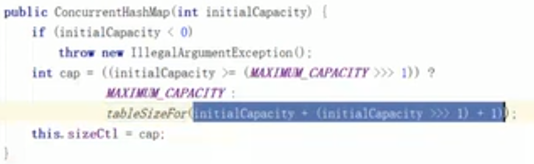
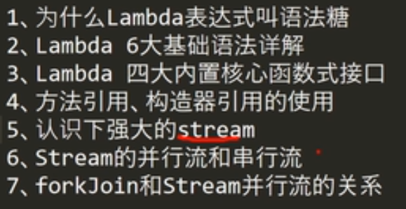

# 一：基础语法

## 1：基本概念

1：跨平台性

通过虚拟机，提供个系统统一的接口

2：基本数据类型与引用类型

==与equals

4：面向对象

封装，抽象，继承，多态

### 1：关键字

1：Final

类：不能被继承，方法：不能被重写，变量：不能被改变

2：static

“static”关键字表明一个成员变量或者是成员方法可以在没有所属的类的实例变量的情况下被访问。

Java中**static方法不能被覆盖**，因为方法覆盖是基于运行时动态绑定的，而static方法是编译时静态绑定的。static方法跟类的任何实例都不相关，所以概念上不适用。

3：synchronized

Synchronized：保证在同一时刻，只有一个线程可以执行某个方法或某个代码块

同时synchronized可以保证一个线程的变化可见（可见性），即可以代替volatile。

可以修饰代码块，方法，静态方法，类

4：volatile

保证可见性，有序性（指令重排），保证单次读写的原子性


保证了不同线程对这个变量进行操作时的可见性，即一个线程修改了某个变量的值，这新值对其他线程来说是立即可见的。（实现可见性）

 禁止进行指令重排序。（实现有序性）

 volatile 只能保证对单次读/写的原子性。i++ 这种操作不能保证原子性。

synchronized 和 volatile 的区别是什么？

volatile 是变量修饰符；synchronized 是修饰类、方法、代码段。

volatile 仅能实现变量的修改可见性，不能保证原子性；而 synchronized
则可以保证变量的修改可见性和原子性。

volatile 不会造成线程的阻塞；synchronized 可能会造成线程的阻塞。

5：String、StringBuffer、StringBuilder。

5.1

String s=new String("abc") 创建了几个对象?

“abc” 创建一个对象new String（） 创建一个对象。

5.2

String被final修饰，声明不可改变的对象每次操作都会生成新的 String
对象，然后将指针指向新的 String 对象，修改用StringBuffer.append(“fkf”);方法

StringBuffer是线程安全的，

StringBuilder是不安全的，但是其性能却高于StringBuffer，单线程使用StringBuilder，多线程用StringBuffer

5.3

String类为什么是final类型

为了实现字符串池(只有当字符是不可变的，字符串池才有可能实现)

为了线程安全(字符串自己便是线程安全的)

为了实现String可以创建HashCode不可变性(Map的key一般String用的最多原因就是这个)

5.4

indexOf()：返回指定字符的索引。

charAt()：返回指定索引处的字符。

replace()：字符串替换。

trim()：去除字符串两端空白。

split()：分割字符串，返回一个分割后的字符串数组。

getBytes()：返回字符串的 byte 类型数组。

length()：返回字符串长度。

toLowerCase()：将字符串转成小写字母。

toUpperCase()：将字符串转成大写字符。

substring()：截取字符串。

equals()：字符串比较。

stringBuffer. reverse()字符串反转

6：Serilizable和transient

一个对象只要实现了Serilizable接口，这个对象就可以被序列化，实际开发中有些敏感信息（密码，银行卡）字段的生命周期仅存在于调用者的内存而不会写到磁盘里序列化，不需要在网络传输，加上transient即可

Instanceof：用来指出对象是否是特定类或接口或该类子类的一个实例

类中的数据成员和成员函数据具有的访问权限包括：public、private、protect、default（包访问权限）

作用域 当前类 同一package 子孙类 其他package

public √ √ √ √

protected √ √ √ ×

default √ √ × ×

private √ × × ×

public 所有类可见

protected
本包和所有子类都可见（本包中的子类非子类均可访问，不同包中的子类可以访问，不是子类不能访问）

default
本包可见（即默认的形式）（本包中的子类非子类均可访问，不同包中的类及子类均不能访问）

priavte 本类可见

## 面试题

1：跨平台原理

# 二：常用API

### 1：Scanner类

Scanner sc = new Scanner(System.in);

int b = sc.nextInt();

### 2：Random类

Random r = new Random();

int i = r.nextInt();

### **3：ArrayList类**

大小可变的数组的实现，

ArrayList对象不能存储基本类型，只能存储引用类型的数据。

ArrayList\<String\> list = new ArrayList\<\>();

public boolean add(E e) ：将指定的元素添加到此集合的尾部。

public E remove(int index) ：移除此集合中指定位置上的元素。返回被删除的元素。

public E get(int index) ：返回此集合中指定位置上的元素。返回获取的元素。

public int size()
：返回此集合中的元素数。遍历集合时，可以控制索引范围，防止越界。

### 4：String类

1：String类为什么是final类型

为了实现字符串池(只有当字符是不可变的，字符串池才有可能实现)

为了线程安全(字符串自己便是线程安全的)

为了实现String可以创建HashCode不可变性(Map的key一般String用的最多原因就是这个)，故不能被继承

查看构造方法

public String() ：初始化新创建的 String对象，以使其表示空字符序列。

public String(char[] value) ：通过当前参数中的字符数组来构造新的String。

public String(byte[] bytes)
：通过使用平台的默认字符集解码当前参数中的字节数组来构造新的

判断功能的方法

public boolean equals (Object anObject) ：将此字符串与指定对象进行比较。

public boolean equalsIgnoreCase (String anotherString)
：将此字符串与指定对象进行比较，忽略大小写。获取功能的方法

public int length () ：返回此字符串的长度。

public String concat (String str) ：将指定的字符串连接到该字符串的末尾。

public char charAt (int index) ：返回指定索引处的 char值。

public int indexOf (String str) ：返回指定子字符串第一次出现在该字符串内的索引。

public String substring (int beginIndex)
：返回一个子字符串，从beginIndex开始截取字符串到字符串结尾。

public String substring (int beginIndex, int endIndex)
：返回一个子字符串，从beginIndex到

endIndex截取字符串。含beginIndex，不含endIndex。转换功能的方法

public char[] toCharArray () ：将此字符串转换为新的字符数组。

public byte[] getBytes () ：使用平台的默认字符集将该
String编码转换为新的字节数组。

public String replace (CharSequence target, CharSequence replacement)
：将与target匹配的字符串使用replacement字符串替换。分割功能的方法

public String[] split(String regex)
：将此字符串按照给定的regex（规则）拆分为字符串数组

5：String、StringBuffer、StringBuilder。

5.1

String s=new String("abc") 创建了几个对象?

“abc” 创建一个字符对象

new String（） 创建一个引用对象。

String s , 这个语句声明一个类String的引用变量 s

5.2

String被final修饰，声明不可改变的对象每次操作都会生成新的 String
对象，然后将指针指向新的 String 对象，修改用StringBuffer.append(“fkf”);方法

StringBuffer是线程安全的，

StringBuilder是不安全的，但是其性能却高于StringBuffer，单线程使用StringBuilder，多线程用StringBuffer

5.3

5.4

indexOf()：返回指定字符的索引。

charAt()：返回指定索引处的字符。

replace()：字符串替换。

trim()：去除字符串两端空白。

split()：分割字符串，返回一个分割后的字符串数组。

getBytes()：返回字符串的 byte 类型数组。

length()：返回字符串长度。

toLowerCase()：将字符串转成小写字母。

toUpperCase()：将字符串转成大写字符。

substring()：截取字符串。

equals()：字符串比较。

stringBuffer. reverse()字符串反转

### 5：StringBuilder类

\- \`public StringBuilder
append(...)\`：添加任意类型数据的字符串形式，并返回当前对象自身。

\- \`public String toString()\`：将当前StringBuilder对象转换为String对象。

### 5：Arrays类

// 定义int 数组

int[] arr = {2,34,35,4,657,8,69,9};

// 打印数组,输出地址值

System.out.println(arr); // [I\@2ac1fdc4

// 数组内容转为字符串

String s = Arrays.toString(arr);

public static String toString(int[] a) ：返回指定数组内容的字符串表示形式。

### 6：Math类

public static double abs(double a) ：返回 double 值的绝对值。

public static double ceil(double a) ：返回大于等于参数的最小的整数。

public static double floor(double a) ：返回小于等于参数最大的整数。

public static long round(double a) ：返回最接近参数的 long。(相当于四舍五入方法)

### 7：Object类

\* \`public String toString()\`：返回该对象的字符串表示。一般要重写

\* \`public boolean equals(Object
obj)\`：指示其他某个对象是否与此对象“相等”。一般也要重写

### 8：Date类

\* \`public long getTime()\` 把日期对象转换成对应的时间毫秒值。

DateFormat format = new SimpleDateFormat("yyyy-MM-dd HH:mm:ss");

\- \`public String format(Date date)\`：将Date对象格式化为字符串。

\- \`public Date parse(String source)\`：将字符串解析为Date对象。

String str = df.format(date);

### 9：Calendar类

\* \`public static Calendar getInstance()\`：使用默认时区和语言环境获得一个日历

Calendar cal = Calendar.getInstance();

\- \`public int get(int field)\`：返回给定日历字段的值。

\- \`public void set(int field, int value)\`：将给定的日历字段设置为给定值。

\- \`public abstract void add(int field, int
amount)\`：根据日历的规则，为给定的日历字段添加或减去指定的时间量。

\- \`public Date
getTime()\`：返回一个表示此Calendar时间值（从历元到现在的毫秒偏移量）的Date对象。

### 10：System类

\- \`public static long currentTimeMillis()\`：返回以毫秒为单位的当前时间。

\- \`public static void arraycopy(Object src, int srcPos, Object dest, int
destPos, int length)\`：将数组中指定的数据拷贝到另一个数组中。

#### 1：接口与抽象类

实现接口的关键字为implements，继承抽象类的关键字为extends

一个类可以实现多个接口，只能继承一个抽象类

接口中所有的方法隐含的都是抽象的。而抽象类则可以同时包含抽象和非抽象的方法。

类可以不实现抽象类和接口声明的所有方法，当然，在这种情况下，类也必须得声明成是抽象的。  
抽象类可以在不提供接口方法实现的情况下实现接口。  
Java接口中声明的变量默认都是final的。抽象类可以包含非final的变量。  
Java接口中的成员函数默认是public的。抽象类的成员函数可以是private，protected或者是public。

#### [media/4adcb6d120cd6b3542a041feb730856d.png](media/4adcb6d120cd6b3542a041feb730856d.png)

2：equals（）和==

Equals方法用来比较对象时，若没有对equals进行重写，其都是调用的Object类的equals方法，而Object方法中的equals方法返回的却是==判断

1、基本数据类型比较  
==和Equals都比较两个值是否相等。相等为true 否则为false；  
2、引用对象比较  
==和Equals都是比较栈内存中的地址是否相等 。相等为true 否则为false；  
需注意几点：  
1、string是一个特殊的引用类型。对于两个字符串的比较，不管是 == 和 Equals 这两者
比较的都是字符串是否相同；

3：HashCode的作用：

返回对象的哈希代码值（就是散列码），用来支持哈希表，例如：HashMap

如果两对象equals()是true,那么它们的hashCode()值一定相等

如果两对象的hashCode()值相等，它们的equals不一定相等（hash冲突啦）

#### [media/219b1f57a4f3764f0a5010ef0e32ee60.png](media/219b1f57a4f3764f0a5010ef0e32ee60.png)

3：基本数据类型与自动拆箱

#### 4: Comparable接口和Comparator接口

Comparable接口只包含compareTo()方法

Comparator接口包含compare（Object ，Object ）方法和equals（）方法

compareTo方法被称为它的自然比较方法。

实现此接口的对象列表（和数组）可以通过Collections.sort（Arrays.sort）进行自动排序。实现此接口的对象可以用作有序映射中的键or有序集合中的元素，无需指定比较器。

Comparator强行对某个对象collection进行整体排序的比较函数。可以将Comparator传递给sort方法（如Collections.sort
或者
Arrays.sort），从而允许在排序上实现精准控制。还可以使用Comparator来控制某些数据结构（如有序set或有序映射）的顺序，or为那些没有自然顺序的对象Collection提供排序。

Comparable是排序接口：

若一个类实现了Comnparable接口，就意味着“该类支持排序”，既然实现了Comparable接口的类支持排序，

假设现在存在“实现Comparable接口类的对象的List列表（or数组）”，则该List列表（or数组）可以通过Collection.sort（or
Arrays.sort）进行排序。

此外，“实现Comparable接口的类的对象”可以用作“有序映射（TreeMap）”中的键或“有序集合（TreeSet）”中的元素，而不需要指定比较器。

Comparator也可以看成一种排序算法的实现，将算法和数据分离。

应用场景：

1
开始设计类的时候，没有考虑到比较问题而没有实现Comparable，可以通过Comparator来实现排序而不必改变对象本身。

2
可以使用多种排序标准，比如员工按照员工号，年龄，名字，升序or降序排序等，并调用（如Collections.sort
或者 Arrays.sort）方法，对Collection进行排序

// 自然排序按照员工号的顺序

public int compareTo(Employee obj) {

Employee employee = (Employee) obj;

return this.no - employee.no;

}

/\*\*

\*

\* 按照员工的年龄进行比较的比较器。

\*/

public class AgeComparator implements Comparator\<Employee\> {

\@Override

public int compare(Employee o1, Employee o2) {

return o1.getAge()-o2.getAge();

}

}

Comparable是【】排序接口，若一个类实现了Coparable接口，说明该类支持排序此外，“实现Comparable接口的类的对象”可以用作“有序映射(如TreeMap)”中的键或“有序集合(TreeSet)”中的元素，而不需要指定比较器。

接口中通过x.compareTo(y)来比较x和y的大小。若返回负数，意味着x比y小；返回零，意味着x等于y；返回正数，意味着x大于y。

5：Java 中的 Math. round(-1. 5) 等于多少？

等于 -1，因为在数轴上取值时，中间值（0.5）向右取整，所以正 0.5 是往上取整，负
0.5 是直接舍弃。

6：String的常用方法：

7：数组与List的转换

List.toArray(); Arrays.asList(array);

8：重构与重载

重载：方法重载是让类以统一的方法处理不同类型的数据的一种手段

重构即重写：子类重写父类的方法

# 三：集合

Collection是集合类的上级接口，继承于他的接口主要有Set 和List.，Map并不是

Collections是针对集合类的一个帮助类，他提供一系列静态方法实现对各种集合的搜索、排序、线程安全化等操作

1：Collection

public static \<T\> boolean addAll(Collection\<T\> c, T... elements)
:往集合中添加一些元素。

public static void shuffle(List\<?\> list) 打乱顺序 :打乱集合顺序。

public static \<T\> void sort(List\<T\> list) :将集合中元素按照默认规则排序。

public static \<T\> void sort(List\<T\> list，Comparator\<? super T\> )
:将集合中元素按照指定规则排

序。

2：Iterator接口

Iterator（迭代器）是一个接口，它的作用就是遍历容器的所有元素。  
Iterator iter = list.iterator(); // 注意iterator，首字母小写

Iterator的三个主要方法

1.1 Boolean hasNext();

判断 iterator
内是否存在下1个元素，如果存在，返回true，否则返回false。（注意，这时上面的那个指针位置不变）

1.2 Object next();

返回 iterator 内下1个元素，同时上面的指针向后移动一位。

故，如果不断地循环执行next()方法，就可以遍历容器内所有的元素了。

1.3 void remove();

删除 iterator 内指针的前1个元素，前提是至少执行过1次next();

(这个方法不建议使用，建议使用容器本身的romove 方法)

3：泛型

4：List

public void add(int index, E element) :
将指定的元素，添加到该集合中的指定位置上。

public E get(int index) :返回集合中指定位置的元素。

public E remove(int index) : 移除列表中指定位置的元素, 返回的是被移除的元素。

public E set(int index, E element)
:用指定元素替换集合中指定位置的元素,返回值的更新前的元素。

1：ArrayList

2:LinkedList

public void addFirst(E e) :将指定元素插入此列表的开头。

public void addLast(E e) :将指定元素添加到此列表的结尾。

public E getFirst() :返回此列表的第一个元素。

public E getLast() :返回此列表的最后一个元素。

public E removeFirst() :移除并返回此列表的第一个元素。

public E removeLast() :移除并返回此列表的最后一个元素。

public E pop() :从此列表所表示的堆栈处弹出一个元素。

public void push(E e) :将元素推入此列表所表示的堆栈。

public boolean isEmpty() ：如果列表不包含元素，则返回true

Vector、Hashtable、Stack 都是线程安全的，而像 HashMap 则是非线程安全的，


Java. util. concurrent 并发包的出现，ConcurrentHashMap安全了

## 0：Collections

## 1：List接口

List是元素有序并且可以重复的集合，被称为序列

List可以精确的控制每个元素的插入位置，或删除某个位置元素

JDK1.7 ：ArrayList像饿汉式，直接创建一个初始容量为10的数组

JDK1.8
ArrayList像懒汉式，一开始创建个长度为0的数组，当添加第一个元素时再创建一个始容量10
的数组

### ArrayList

动态数组，

1、ArrayList创建时的大小为0；当加入第一个元素时，进行第一次扩容时，默认容量大小为10。

2、ArrayList每次扩容都以当前数组大小的1.5倍去扩容。

3、Vector创建时的默认大小为10。

4、Vector每次扩容都以当前数组大小的2倍去扩容。当指定了capacityIncrement之后，每次扩容仅在原先基础上增加capacityIncrement个单位空间。

5、ArrayList和Vector的add、get、size方法的复杂度都为O(1)，remove方法的复杂度为O(n)。

6、ArrayList是非线程安全的，Vector是线程安全的。

1：array与ArrayList的区别

Array可以包含基本类型和对象类型，ArrayList只能包含对象类型。

1：ArrayList，Vector，linkedList的区别

ArrayList和Vector都是使用数组方式存储数据，此数组元素数大于实际存储的数据以便增加和插入元素，它们都允许直接按序号索引元素，但是插入元素要涉及数组元素移动等内存操作，所以索引数据快而插入数据慢，

Vector由于使用了synchronized方法（线程安全），通常性能上较ArrayList差，

LinkedList使用双向链表实现存储，按序号索引数据需要进行前向或后向遍历，但是插入数据时只需要记录本项的前后项即可，所以插入速度较快。

ArrayList是基于数组实现的，要求一段连续的空间

LinkedList是基于链表实现的，是一个双向循环列表。不是线程安全的。

### LinkedList

双向链表，允许插入null，线程不同步

Vector

加：

## 2：Set接口及其实现类

集合Set是Collection的子接口，Set不允许其数据元素重复出现，也就是说在Set中每一个数据元素都是唯一的。

虽然集合号称存储的是 Java 对象，但实际上并不会真正将 Java 对象放入 Set
集合中，只是在 Set 集合中保留这些对象的引用而言。也就是说：Java
集合实际上是多个引用变量所组成的集合，这些引用变量指向实际的 Java 对象。

### HashSet（常用）

基本上都是直接调用底层 **HashMap** 的相关方法来完成，

所谓的Hash算法就是把任意长度的输入（又叫做预映射），通过散列算法，变换成固定长度的输出，该输出就是散列值。

HashSet
不允许重复的值。当我们使用HashSet存储自定义类时，需要在自定义类中重写equals和hashCode方法，主要原因是集合内不允许有重复的数据元素，在集合校验元素的有效性时（数据元素不可重复），需要调用equals和hashCode验证。

HashSet不能保证元素的排列顺序，HashSet不是线程安全的，集合元素可以是null

### LinkedHashSet

根据元素的 hashCode值来决定元素的存储位置， 但它同时使用双向链表
维护元素的次序，这使得看起来是以 插入 顺序保存,不允许重复

### TreeSet

TreeSet可以确保集合元素处于排序状态。TreeSet采用红黑树的数据结构来存储集合元素。

TreeSet会调用集合元素的compareTo(Object
o)方法来比较元素之间的大小关系，然后将集合元素按升序排列，这种方式是自然排序。

## 3：Queue

顾名思义，Queue用于模拟队列这种数据结构。队列先进先出。

Queue接口有一个PriorityQueue实现类。除此之外，Queue还有一个Deque接口，Deque代表一个“双端队列”，双端队列可以同时从两端删除或添加元素，因此Deque可以当作栈来使用。java为Deque提供了ArrayDeque实现类和LinkedList实现类。

2：Queue接口中定义了如下的几个方法：

void add(Object e): 将指定元素插入到队列的尾部。

object element(): 获取队列头部的元素，但是不删除该元素。

boolean offer(Object e):
将指定的元素插入此队列的尾部。当使用容量有限的队列时，此方法通常比add(Object
e)有效。

Object peek(): 返回队列头部的元素，但是不删除该元素。如果队列为空，则返回null。

Object poll(): 返回队列头部的元素，并删除该元素。如果队列为空，则返回null。

Object remove(): 获取队列头部的元素，并删除该元素。

PriorityQueue实现类

## 5：Map 

Key-value型，不允许重复，同一对象所对应的类

1：哈希表


2：Java7实现

容量必须是为2的n次幂，默认1\<\<4为16

创建的时候并没有分配桶，只有将东西put进去的时候才分配

Int I 变成 0到n-1的方法：取余，使用Hash&（length-1）（全1）

为防止碰撞，再次hash

超过一定阈值就要开始扩容

对桶里的所有元素进行重新hash，新桶是旧桶的两倍，

Transfer函数：把原本的遍历一遍，计算新的然后再计算新的里面


Java7的实现容易会出现死锁，它是线程不安全的

原本顺序是7-3，transfer之后顺序变成了3-7。

1.7的问题


1.8


不再是链表，用的是红黑树（二叉平衡树），re的时候保持顺序

Resize效率很低

### 1：HashMap与TreeMap的区别

实现方式

HashMap:基于哈希表实现。（1.8基于数组链表红黑树）使用HashMap要求添加的键类明确定义了hashCode（）和equals

TreeMap:基于红黑树实现。TreeMap没有调优选项，因为该树总处于平衡状态。

用途

HashMap：适用于在Map中插入、删除和定位元素。

TreeMap：适用于按自然顺序或自定义顺序遍历键（key)。

HashMap通常比TreeMap快一点（树和哈希表的数据结构使然），建议多使用HashMap,在需要排序的Map时候才用TreeMap.

### 2：HashMap与HashTable的区别

1：他们都可以存储key-value型数据，都实现了Map接口，

2：

HashMap是线程不安全的效率高，

HashTable是线程安全的，效率低

Hashtable是同步的，而HashMap不是。

因此，HashMap更适合于单线程环境，而Hashtable适合于多线程环境。

要想既安全又效率高就用ConcurrentHashMap

3：HashMap是可以把null作为key或者value的，但是HashTable不行

### HashMap(重点)

HashMap不是线程安全的，如果想要线程安全的HashMap，可以通过Collections类的静态方法synchronizedMap获得线程安全的HashMap。

#### 底层实现

HashMap的底层主要是基于数组，链表和红黑树来实现的，HashMap 会根据 key.
hashCode() 计算出 hash 值，根据 hash 值将 value 保存在 bucket 里。

**当冲突时HashMap 的做法是用链表和红黑树存储相同 hash 值的 value。当 hash
冲突的个数比较少时，使用链表否则使用红黑树。**

key值不可重复，value值可以重复，

key,value 都可以是任何引用类型的数据，包括 null

boolean isEmpty() 长度为0返回true否则false

boolean containsKey(Object key) 判断集合中是否包含指定的key

boolean containsValue(Object value) 判断集合中是否包含指定的value

HashMap中关于红黑树的三个关键参数：


影响HashMap性能的两个重要参数，“initial capacity”（初始化容量）和”load
factor“（负载因子）

容量就是哈希表桶的个数，负载因子就是键值对个数与哈希表长度的一个比值

当比值超过负载因子之后，HashMap就会进行rehash操作来进行扩容。

#### 方法

Get：

1、通过hash值获取该key映射到的桶。

2、桶上的key就是要查找的key，则直接命中。

3、桶上的key不是要查找的key，则查看后续节点：

（1）如果后续节点是树节点，通过调用树的方法查找该key。

（2）如果后续节点是链式节点，则通过循环遍历链查找该key。

PUT：

1、先通过hash值计算出key映射到哪个桶。

2、如果桶上没有碰撞冲突，则直接插入。

3、如果出现碰撞冲突了，则需要处理冲突：

（1）如果该桶使用红黑树处理冲突，则调用红黑树的方法插入。

（2）否则采用传统的链式方法插入。如果链的长度到达临界值，则把链转变为红黑树。

4、如果桶中存在重复的键，则为该键替换新值。

5、如果size大于阈值，则进行扩容。

Hash：

hash指的是key的哈希值，hash是通过下面这个方法计算出来的，采用了二次哈希的方式，其中key的hashCode方法是一个native方法：

static final int hash(Object key) {

int h;

return (key == null) ? 0 : (h = key.hashCode()) \^ (h \>\>\> 16);

这个hash方法先通过key的hashCode方法获取一个哈希值，再拿这个哈希值与它的高16位的哈希值做一个异或操作来得到最后的哈希值

为啥要这样做呢？注释中是这样解释的：如果当n很小，假设为64的话，那么n-1即为63（0x111111），这样的值跟hashCode()直接做与操作，实际上只使用了哈希值的后6位。如果当哈希值的高位变化很大，低位变化很小，这样就很容易造成冲突了，所以这里把高低位都利用起来，从而解决了这个问题。

决定了HashMap的大小只能是2的幂次方


Resize

HashMap在进行扩容时，使用的rehash方式非常巧妙，因为每次扩容都是翻倍，与原来计算（n-1）&hash的结果相比，只是多了一个bit位，所以节点要么就在原来的位置，要么就被分配到“原位置+旧容量”这个位置。

例如，原来的容量为32，那么应该拿hash跟31（0x11111）做与操作；在扩容扩到了64的容量之后，应该拿hash跟63（0x111111）做与操作。新容量跟原来相比只是多了一个bit位，假设原来的位置在23，那么当新增的那个bit位的计算结果为0时，那么该节点还是在23；相反，计算结果为1时，则该节点会被分配到23+31的桶上。

#### ConcurrentHashMap

ConcurrentHashMap是由Segment数组结构和HashEntry数组结构组成。Segment是一种可重入锁ReentrantLock，在ConcurrentHashMap里扮演锁的角色，HashEntry则用于存储键值对数据。


JDK1.8的实现已经抛弃了Segment分段锁机制，利用CAS+Synchronized来保证并发更新的安全。数据结构采用：数组+链表+红黑树。

1.8源码

CAS操作

**1：初始化**

初始化：保证安全，加锁（尽量避免加锁，即使加锁范围尽量小），CAS加自旋

存取数据：初始容量，扩容安全，多个线程共同协助扩容

默认初始容量为16

New 的时候并不会初始化数组，只有但put时才会初始化数组。即延迟到第一次put行为时

创建时如果传入

Final ConcurrentHashMap chm = new ConcurrentHashMap(32);

这是其初始容量为64




初始化后，将值赋值给了sizeCtl

SizeCtl为正数，如果数组未初始化，那么其记录的是初始容量，如果数组已经初始化，那么其记录的是数组的扩容阈值（数组的初始容量的75%）

**2：添加安全**

Put—调用putVal方法，不允许空值空键

分段锁

CAS

hashCode & n-1

**3：扩容rehash**

当元素的数量达到容量阈值sizectl时，需要扩容

扩容两步：

1.  构建一个nextTable，大小为table的两倍。

2.  把table的数据复制到nextTable中。

并更新sizeCtl的大小为新数组的0.75倍

阈值

### HashTable

线程安全：所有涉及到多线程操作的都加上了synchronized关键字来锁住整个table

现在很少用了，多被HahsMap或ConcurrentHashMap代替，不允许插入null值

### LinkedHashMap

哈希表+链表，通过维护一个链表来保证对哈希表迭代时的有序性

HashMap中有三个空方法，二LinkedHashMap就是通过重写这三个方法来保证链表的插入，删除的有序性。

// Callbacks to allow LinkedHashMap post-actions

void afterNodeAccess(Node\<K,V\> p) { }

void afterNodeInsertion(boolean evict) { }

void afterNodeRemoval(Node\<K,V\> p) { }

### TreeMap

TreeMap是非线程安全的。

可以采用可以通过Collections类的静态方法synchronizedMap获得线程安全：

Map m = Collections.synchronizedSortedMap(new TreeMap(…));

TreeMap是用键来进行升序顺序来排序的。通过Comparable 或 Comparator来排序。
（实现和TreeSet基本一致）。

### 常用的遍历Map的方法

 

1. Map<String, String> map = **new** HashMap<String, String>(); 
2.  map.put("1", "value1"); 
3.  map.put("2", "value2"); 
4.  map.put("3", "value3"); 
5.   
6.  //第一种：普遍使用，由于二次取值,效率会比第二种和第三种慢一倍
7.  System.out.println("通过Map.keySet遍历key和value："); 
8.  **for** (String key : map.keySet()) { 
9.   System.out.println("key= "+ key + " and value= " + map.get(key)); 
10.  } 
11.   
12.  //第二种 
13.  System.out.println("通过Map.entrySet使用iterator遍历key和value："); 
14.  Iterator<Map.Entry<String, String>> it = map.entrySet().iterator(); 
15.  **while** (it.hasNext()) { 
16.   Map.Entry<String, String> entry = it.next(); 
17.   System.out.println("key= " + entry.getKey() + " and value= " + entry.getValue()); 
18.  } 
19.   
20.  //第三种：无法在for循环时实现remove等操作 
21.  System.out.println("通过Map.entrySet遍历key和value"); 
22.  **for** (Map.Entry<String, String> entry : map.entrySet()) { 
23.   System.out.println("key= " + entry.getKey() + " and value= " + entry.getValue()); 
24.  } 
25.  
26.  //第四种：只能获取values,不能获取key 
27.  System.out.println("通过Map.values()遍历所有的value，但不能遍历key"); 
28.  **for** (String v : map.values()) { 
29.   System.out.println("value= " + v); 
30.  } 

  

  Map.entrySet迭代器会生成EntryIterator,其返回的实例是一个包含key/value键值对的对象。而keySet中迭代器返回的只是key对象，还需要到map中二次取值。故entrySet要比keySet快一倍左右。


# 四：异常

## 1：概述

1：Exception和Error有什么区别？

Exception和Error都是Throwable的子类。Exception用于用户程序可以捕获的异常情况。Error定义了不期望被用户程序捕获的异常。

2：throw和throws有什么区别？

Throw用于方法内部，Throws用于方法声明上

Throw后跟异常对象，Throws后跟异常类型

Throw后只能跟一个异常对象，Throws后可以一次声明多种异常类型

1：在项目中不要捕获Java类库中继承自RuntimeException的运行时异常，ndexOutOfBoundsException
/ NullPointerException，这类异常由程序员预检查违法来规避，保证程序健壮性。

2：对大段代码进行 try-catch，这是不负责任的表现。 catch
时请分清稳定代码和非稳定代码，稳定代码指的是无论如何不会出错的代码。对于非稳定代码的
catch 尽可能进行区分异常类型，再做对应的异常处理。

3：有 try 块放到了事务代码中， catch
异常后，如果需要回滚事务，一定要注意手动回滚事务。

异常事件可分为两类：

**Error**：Java虚拟机无法解决的严重问题。如：JVM系统内部错误、资源耗尽等严重情况。比如：StackOverflowError和OOM。一般不编写针对性的代码进行处理。

**Exception:**其它因编程错误或偶然的外在因素导致的一般性问题，可以使用针对性的代码进行处理。例如：

空指针访问

试图读取不存在的文件

网络连接中断

数组角标越界

分为编译时异常和运行时异常

## 2：常见异常

-   NullPointerException 空指针异常

-   ClassNotFoundException 指定类不存在

-   NumberFormatException 字符串转换为数字异常

-   IndexOutOfBoundsException 数组下标越界异常

-   ClassCastException 数据类型转换异常

-   FileNotFoundException 文件未找到异常

-   NoSuchMethodException 方法不存在异常

-   IOException IO 异常

-   SocketException Socket 异常

## 3：处理异常

程序检测

If（num==0）{}

方式一：try-catch-finally


捕获异常的有关信息：

与其它对象一样，可以访问一个异常对象的成员变量或调用它的方法。

getMessage() 获取异常信息，返回字符串

printStackTrace()
获取异常类名和异常信息，以及异常出现在程序中的位置。返回值void。


方式二：throws + 异常类型

方法三：手动抛出异常

首先要生成异常类对象，然后通过throw语句实现抛出操作(提交给Java运行环境)。

**IOException e=new IOException();**

**Throw e;**

可以抛出的异常必须是Throwable或其子类的实例。下面的语句在编译时将会产生语法错误：

**Throw new String("wanttothrow");**

## 4：用户自定义异常类

约定：

# 五：多线程：

并行：多个cpu实例或者多台机器同时执行一段处理逻辑，是真正的同时。 
并发：通过cpu调度算法，让用户看上去同时执行，实际上从cpu操作层面不是真正的同时。

## 1：方法（机制）

synchronized, wait, notify 是任何对象都具有的同步工具。

wait/notify必须存在于synchronized块中。并且，这三个关键字针对的是同一个监视器（某对象的监视器）。

volatile 
多线程的内存模型：main memory（主存）、working memory（线程栈），在处理数据时，线程会把值从主存load到本地栈，完成操作后再save回去(volatile关键词的作用：每次针对该变量的操作都激发一次load and save)。 


## 2：线程实现方式

2.1：继承Thread类，重写run方法（其实Thread类本身也实现了Runnable接口）

方法

```java
//当前线程可转让cpu控制权，让别的就绪状态线程运行（切换）
public static Thread.yield() 
//暂停一段时间
public static Thread.sleep()  
//在一个线程中调用other.join(),将等待other执行完后才继续本线程。　　　　
public join()
//后两个函数皆可以被打断
public interrupte()
```


实现Runnable接口，重写run方法

实现Callable接口，重写call方法（有返回值）

使用线程池（有返回值）：

1：继承Thread类实现线程，扩展性不强，因为Java类只能继承一个

**2：t.start()才会启动一个线程，t.run（）只是普通的方法调用，所以是顺序执行的。**

>   **(可运行）状态,并没有运行，一旦得到cpu时间片，就开始执行run()方法**

>   。实现Runnable接口实现一个线程

>   。实现Callable接口：runnable 没有返回值，callable 可以拿到有返回值，callable
>   可以看作是 runnable 的补充。

2：**线程与进程的区别归纳：**

>   **a.地址空间和其它资源**：进程间相互独立，同一进程的各线程间共享。某进程内的线程在其它进程不可见。

>   **b.通信：**进程间通信IPC，线程间可以直接读写进程数据段（如全局变量）来进行通信——需要进程同步和互斥手段的辅助，以保证数据的一致性。

>   **c.调度和切换**：线程上下文切换比进程上下文切换要快得多。

>   d.在多线程OS中，进程不是一个可执行的实体。

守护线程：

>   守护线程是运行在后台的一种特殊进程。它独立于控制终端并且周期性地执行某种任务或等待处理某些发生的事件。在
>   Java 中垃圾回收线程就是特殊的守护线程。

多线程的同步实现方式

>   1：同步方法：即有synchronized关键字修饰的方法。由于java的每个对象都有一个内置锁，当用此关键字修饰方法时，  
>   内置锁会保护整个方法。在调用该方法前，需要获得内置锁，否则就处于阻塞状态。

Sleep()和wait()的区别：

sleep() 时间到会自动恢复；调用sleep不会释放对象锁。InterruptedException异常。

wait() 是Object的方法，导致本线程放弃对象锁，释放所持有的对象的lock。可以使用
notify()/notifyAll()直接唤醒。Notify唤醒一个处于等待状态的线程，并不能确切唤醒某一个等待的线程，而是由JVM确定唤醒那个线程。

反对使用stop（）因为它不安全

Suspend（）容易发生死锁调用suspend()的时候，目标线程会停下来，但却仍然持有在这之前获得的锁定。此时，其他任何线程都不能访问锁定的资源，除非被"挂起"的线程恢复运行。对任何线程来说，如果它们想恢复目标线程，同时又试图使用任何一个锁定的资源，就会造成死锁。

Yield（）：线程让步，暂停当前正在执行的线程，把机会让给优先级相同或更高的线程

Join（）：

## 2：线程池

原理：

当一个任务提交至线程池之后，

1.
线程池首先判断核心线程池里的线程是否已经满了。如果不是，则创建一个新的工作线程来执行任务。否则进入2.

2. 判断工作队列是否已经满了，倘若还没有满，将线程放入工作队列。否则进入3.

3.
判断线程池里的线程是否都在执行任务。如果不是，则创建一个新的工作线程来执行。如果线程池满了，则交给饱和策略来处理任务。

ThreadPoolExecutor执行execute()流程：

当一个任务提交至线程池之后，

1.
线程池首先当前运行的线程数量是否少于corePoolSize。如果是，则创建一个新的工作线程来执行任务。如果都在执行任务，则进入2.

2.
判断BlockingQueue是否已经满了，倘若还没有满，则将线程放入BlockingQueue。否则进入3.

3.
如果创建一个新的工作线程将使当前运行的线程数量超过maximumPoolSize，则交给RejectedExecutionHandler来处理任务。

### 1：创建线程池的方法，

>   1：newSingleThreadExecutor()：只创建唯一的工作者线程来执行任务。线程数目唯一，队列顺序执行

>   2：newCachedThreadPool()：创建一个可缓存线程池，如果线程池长度超过处理需求，可灵活回收空闲线程，若无可回收这创建新新线程。

>   处理大量短时间工作任务的线程池，他会缓存线程并重用，无缓存线程时，就会创建新线程，闲置超过60秒则会被移出缓存，其内部使用
>   SynchronousQueue 作为工作队列；

>   3：newFixedThreadPool(int
>   nThreads)：创建一个制定工作线程数量的线程池，任何时候最多有 nThreads
>   个工作线程是活动的

>   4：newSingleThreadScheduledExecutor()：创建单线程池，返回
>   ScheduledExecutorService，可以进行定时或周期性的工作调度；

>   5：newScheduledThreadPool(int
>   corePoolSize)：创建一个定长的线程池，可以进行定时或周期性的工作调度，区别在于单一工作线程还是多个工作线程

>   。newWorkStealingPool(int parallelism)： Java 8
>   才加入这个创建方法，其内部会构建ForkJoinPool，利用Work-Stealing算法，并行地处理任务，不保证处理顺序；

>   。ThreadPoolExecutor()：是最原始的线程池创建，上面1-3创建方式都是对ThreadPoolExecutor的封装。

### 2，参数

public ThreadPoolExecutor(int corePoolSize,

int maximumPoolSize,

long keepAliveTime,

TimeUnit unit,

BlockingQueue\<Runnable\> workQueue,

RejectedExecutionHandler handler)

corePoolSize

线程池中的核心线程数，当提交一个任务时，线程池创建一个新线程执行任务，直到当前线程数等于corePoolSize,
即使有其他空闲线程能够执行新来的任务,
也会继续创建线程；如果当前线程数为corePoolSize，继续提交的任务被保存到阻塞队列中，等待被执行；如果执行了线程池的prestartAllCoreThreads()方法，线程池会提前创建并启动所有核心线程。

workQueue

用来保存等待被执行的任务的阻塞队列. 在JDK中提供了如下阻塞队列：

(1) ArrayBlockingQueue：基于数组结构的有界阻塞队列，按FIFO排序任务；

(2)
LinkedBlockingQuene：基于链表结构的阻塞队列，按FIFO排序任务，吞吐量通常要高于ArrayBlockingQuene；

(3)
SynchronousQuene：一个不存储元素的阻塞队列，每个插入操作必须等到另一个线程调用移除操作，否则插入操作一直处于阻塞状态，吞吐量通常要高于LinkedBlockingQuene；

(4) priorityBlockingQuene：具有优先级的无界阻塞队列；

-   aximumPoolSize  
    线程池中允许的最大线程数。如果当前阻塞队列满了，且继续提交任务，则创建新的线程执行任务，前提是当前线程数小于maximumPoolSize；当阻塞队列是无界队列,
    则maximumPoolSize则不起作用,
    因为无法提交至核心线程池的线程会一直持续地放入workQueue.

-   keepAliveTime  
    线程空闲时的存活时间，即当线程没有任务执行时，该线程继续存活的时间；默认情况下，该参数只在线程数大于corePoolSize时才有用,
    超过这个时间的空闲线程将被终止；

-   unit  
    keepAliveTime的单位

-   threadFactory  
    创建线程的工厂，通过自定义的线程工厂可以给每个新建的线程设置一个具有识别度的线程名。默认为DefaultThreadFactory

-   handler  
    handler  
    线程池的饱和策略，当阻塞队列满了，且没有空闲的工作线程，如果继续提交任务，必须采取一种策略处理该任务，线程池提供了4种策略：  
    

    -   AbortPolicy：直接抛出异常，默认策略；

    -   CallerRunsPolicy：用调用者所在的线程来执行任务；

    -   DiscardOldestPolicy：丢弃阻塞队列中靠最前的任务，并执行当前任务；

    -   DiscardPolicy：直接丢弃任务；  
        当然也可以根据应用场景实现RejectedExecutionHandler接口，自定义饱和策略，如记录日志或持久化存储不能处理的任务。

### 3：状态

-   running：这是最正常的状态，接受新的任务，处理等待队列中的任务。

-   shutdown：不接受新的任务提交，但是会继续处理等待队列中的任务。

-   stop：不接受新的任务提交，不再处理等待队列中的任务，中断正在执行任务的线程。

-   tidying：所有的任务都销毁了，workCount 为 0，线程池的状态在转换为 TIDYING
    状态时，会执行钩子方法 terminated()。

-   terminated：terminated()方法结束后，线程池的状态就会变成这个。

. 在 Java 程序中怎么保证多线程的运行安全？

方法一：使用安全类，比如 Java. util. concurrent 下的类。

方法二：使用自动锁 synchronized。

方法三：使用手动锁 Lock。

### 4；关闭方式<br>Shutdown shutdownNow tryTerminate 清空工作队列，终止线程池中各个线程，销毁线程池

Wait方法：只能在同步代码块中调用，wait会释放掉对象锁，等待nitify唤醒

Notify方法：

### 5：配置线程池的因素

性质不同的任务可用使用不同规模的线程池分开处理：  
- CPU密集型：尽可能少的线程，Ncpu+1  
- IO密集型：尽可能多的线程, Ncpu\*2，比如数据库连接池  
-
混合型：CPU密集型的任务与IO密集型任务的执行时间差别较小，拆分为两个线程池；否则没有必要拆分。

## 2：进程间通信

管道：

FIFO

消息队列

信号量

共享内存

### 4.2锁相关

Lock能完成synchronized所实现的所有功能。


synchronized会自动释放锁，而Lock一定要求程序员手工释放，并且必须在finally从句中释放。


1：乐观锁与悲观锁

>   悲观锁：认为自己在使用数据的时候一定会有别的线程来修改数据。

>   Java中，synchronized关键字和Lock的实现类都是悲观锁。

>   悲观锁**适合写操作多**的场景，先加锁可以保证写操作时数据正确。

>   乐观锁**适合读操作多**的场景，不加锁的特点能够使其读操作的性能大幅提升。

>   乐观锁：自己在使用数据时不会有别的线程修改数据，所以不会添加锁，只是在更新数据的时候去判断之前有没有别的线程更新了这个数据。使用CAS算法

>   CAS算法（比较与交换），会导致ABA问题，可以加时间戳

2：自旋锁VS适应性自旋锁

>   如果自旋超过了限定次数（默认是10次，可以使用-XX:PreBlockSpin来更改）没有成功获得锁，就应当挂起线程。

3：无锁 VS 偏向锁 VS 轻量级锁 VS 重量级锁

无锁没有对资源进行锁定，所有的线程都能访问并修改同一个资源，但同时只有一个线程能修改成功。


偏向锁是指一段同步代码一直被一个线程所访问，那么该线程会自动获取锁，降低获取锁的代价。

轻量级锁

是指当锁是偏向锁的时候，被另外的线程所访问，偏向锁就会升级为轻量级锁，其他线程会通过自旋的形式尝试获取锁，不会阻塞，从而提高性能。

重量级锁

若当前只有一个等待线程，则该线程通过自旋进行等待。但是当自旋超过一定的次数，或者一个线程在持有锁，一个在自旋，又有第三个来访时，轻量级锁升级为重量级锁。

升级为重量级锁时，锁标志的状态值变为“10”，此时Mark
Word中存储的是指向重量级锁的指针，此时等待锁的线程都会进入阻塞状态。

4：公平锁与非公平锁

公平锁是指多个线程按照申请锁的顺序来获取锁，线程直接进入队列中排队，队列中的第一个线程才能获得锁。

非公平锁是多个线程加锁时直接尝试获取锁，获取不到才会到等待队列的队尾等待。但如果此时锁刚好可用，那么这个线程可以无需阻塞直接获取到锁，所以非公平锁有可能出现后申请锁的线程先获取锁的场景。

5：可重入锁和非可重入锁

可重入锁又名递归锁，是指在同一个线程在外层方法获取锁的时候，再进入该线程的内层方法会自动获取锁（前提锁对象得是同一个对象或者class），不会因为之前已经获取过还没释放而阻塞。Java中ReentrantLock和synchronized都是可重入锁，

6：独享锁（排它锁）与共享锁

是指该锁一次只能被一个线程所持有。

# 六：IO与NIO

## 1：File类

File能新建，删除，重命名文件和目录，但不能访问文件内容本身。使用输入/输出流对内容操作。

创建：

public File(String pathname)
：通过将给定的路径名字符串转换为抽象路径名来创建新的 File实例。

public File(String parent, String child)
：从父路径名字符串和子路径名字符串创建新的 File实例。

public File(File parent, String child) ：从父抽象路径名和子路径名字符串创建新的
File实例。获取

public String getAbsolutePath() ：返回此File的绝对路径名字符串。

public String getPath() ：将此File转换为路径名字符串。

public String getName() ：返回由此File表示的文件或目录的名称。

public long length() ：返回由此File表示的文件的长度。判断功能的方法

public boolean exists() ：此File表示的文件或目录是否实际存在。

public boolean isDirectory() ：此File表示的是否为目录。

public boolean isFile() ：此File表示的是否为文件。

创建删除功能的方法

public boolean createNewFile()
：当且仅当具有该名称的文件尚不存在时，创建一个新的空文件。

public boolean delete() ：删除由此File表示的文件或目录。

public boolean mkdir() ：创建由此File表示的目录。

public boolean mkdirs()
：创建由此File表示的目录，包括任何必需但不存在的父目录。重命名

public Boolean renameTo(File dest)把文件 重命名为指定的路

## 2：IO流原理及流的分类

按操作数据单位不同分为：字节流（8bit），字符流（16bit）

按数据流的流向不同分为：输入流，输出流

按流的角色不同分为：节点流（直接从数据源或目的地读写数据），处理流（连接在已存在的流（节点流或处理流）之上，通过对数据的处理为程序提供更为强大的读写功能）


#### 字节流：

字节（Byte）：八位0-255

一切皆字节

1：字节输出流OutputStream

public void close() ：关闭此输出流并释放与此流相关联的任何系统资源。

public void flush() ：刷新此输出流并强制任何缓冲的输出字节被写出。

public void write(byte[] b) ：将 b.length字节从指定的字节数组写入此输出流。

public void write(byte[] b, int off, int len) ：从指定的字节数组写入
len字节，从偏移量 off开始输出到此输出流。

public abstract void write(int b) ：将指定的字节输出流。

文件输出流FileOutputStream

public FileOutputStream(File file) ：创建文件输出流以写入由指定的
File对象表示的文件。 public FileOutputStream(String name) ：
创建文件输出流以指定的名称写入文件。

public FileOutputStream(File file, boolean append) ：
创建文件输出流以写入由指定的 File对象表示的文件。

public FileOutputStream(String name, boolean append) ：
创建文件输出流以指定的名称写入文件。

#### 字符流

字符：字的符号

①ASCII码中，一个英文字母（不分大小写）占一个字节的空间，一个中文汉字占两个字节的空间。一个二进制数字序列，在计算机中作为一个数字单元，一般为8位二进制数，换算为十进制。最小值0，最大值255。

②UTF-8编码中，一个英文字符等于一个字节，一个中文（含繁体）等于三个字节。

③Unicode编码中，一个英文等于两个字节，一个中文（含繁体）等于两个字节。

符号：英文标点占一个字节，中文标点占两个字节。举例：英文句号“.”占1个字节的大小，中文句号“。”占2个字节的大小。

④UTF-16编码中，一个英文字母字符或一个汉字字符存储都需要2个字节（Unicode扩展区的一些汉字存储需要4个字节）。

⑤UTF-32编码中，世界上任何字符的存储都需要4个字节。


## 3：节点流（文件流）

读取文件

1. 建立一个流对象，将已存在的文件加载进流

FileReader = new new new FileReader(new File(“Test.txt”));

2. 创建一个临时存放数据的组。

 char[] ch = new char[1024];

3. 调用流对象的读取方法将中数据入到组。

fr.read (ch );

4. 关闭资源。

 fr.close();

写入文件

1：创建流对象，建立数据存放文件

FileWriter fw = new FileWriter(new File(“Test.txt”));

2：调用流对象的写入方法，将数据写入流

Fw.write(“adasdnjakndj”);

3:关闭流资源，并将六种的数据清空到文件中

Fw.close（）；

## 4：缓冲流

为了提高数据读写速度，提供了带缓冲功能的流类，在使用这些流类时，会创建一个内部缓冲区数据，默认8192字节（8Kb）的缓冲区


缓冲流要套接在相应的节点流之上，


当读取数据时，数据按块读入缓冲区，其后的读操作则直接访问缓冲区

当使用BufferedInputStream读取字节文件时，BufferedInputStream会一次性从文件中读取8192个(8Kb)，存在缓冲区中，直到缓冲区装满了，才重新从文件中读取下一个8192个字节数组。

向流中写入字节时，不会直接写到文件，先写到缓冲区中直到缓冲区写满，BufferedOutputStream才会把缓冲区中的数据一次性写到文件里。使用方法flush()可以强制将缓冲区的内容全部写入输出流

关闭流的顺序和打开流的顺序相反。只要关闭最外层流即可，关闭最外层流也会相应关闭内层节点流

flush()方法的使用：手动将buffer中内容写入文件

如果是带缓冲区的流对象的close()方法，不但会关闭流，还会在关闭流之前刷新缓冲区，关闭后不能再写出

## 5：转换流

提供字节流和字符流之间的转换


InputStreamReader：字节输入流按指定字符集转换为字符的输入流

OutputStreamWriter：将字符的输出流按指定字符集转换成字节的输出流

## 6：标准输入输出流 

System.in和System.out分别代表了系统标准的输入和输出设备

System.in的类型是InputStream

System.out的类型是PrintStream，其是OutputStream的子类FilterOutputStream的子类

## 7：打印流

将基本数据类型的数据格式转换为字符串输出

打印流：**PrintStream**和**PrintWriter**

PrintStream和PrintWriter的输出不会抛出IOException异常

## 8：数据流

方便操作Java语言的基本数据类型和String的数据，使用数据流，用于读取和写出基本数据类型，String类的数据

DataInputStream和DataOutputStream，分别套接在InputStream和OutputStream子类的流上。


## 9：对象流

ObjectInputStream和OjbectOutputSteam

用于存储和读取基本数据类型数据或对象的处理流。它的强大之处就是可以把Java中的对象写入到数据源中，也能把对象从数据源中还原回来。

序列化：用ObjectOutputStream类保存基本类型数据或对象的机制

反序列化：用ObjectInputStream类读取基本类型数据或对象的机制

ObjectOutputStream和ObjectInputStream不能序列化static和transient修饰的成员变量

## 10：随机存取文件流

RandomAccessFile类

RandomAccessFile
声明在java.io包下，但直接继承于java.lang.Object类。并且它实现了DataInput、DataOutput这两个接口，也就意味着这个类既可以读也可以写。

RandomAccessFile 类支持“随机访问”
的方式，程序可以直接跳到文件的任意地方来读、写文件

支持只访问文件的部分内容

可以向已存在的文件后追加内容

RandomAccessFile
对象包含一个记录指针，用以标示当前读写处的位置。RandomAccessFile类对象可以自由移动记录指针：

long getFilePointer()：获取文件记录指针的当前位置

void seek(long pos)：将文件记录指针定位到pos位置

## 11：BIO

Block IO：jdk最早抽象出的IO体系，jdk1.0的io体系是阻塞的。


## 11：NIO

Java NIO (New IO，Non-Blocking IO)是从Java 1.4版本开始引入的一套新的IO
API，可以替代标准的Java IO
API。NIO与原来的IO有同样的作用和目的，但是使用的方式完全不同，NIO支持面向缓冲区的(IO是面向流的)、基于通道的IO操作。NIO将以更加高效的方式进行文件的读写操作。

Java API中提供了两套NIO，一套是针对标准输入输出NIO，另一套就是网络编程NIO。

\|-----java.nio.channels.Channel

\|-----FileChannel:处理本地文件

\|-----SocketChannel：TCP网络编程的客户端的Channel

\|-----ServerSocketChannel:TCP网络编程的服务器端的Channel

\|-----DatagramChannel：UDP网络编程中发送端和接收端的Channel

Path、Paths和Files核心API

早期的Java只提供了一个File类来访问文件系统，但File类的功能比较有限，所提供的方法性能也不高。而且，大多数方法在出错时仅返回失败，并不会提供异常信息。

NIO.
2为了弥补这种不足，引入了Path接口，代表一个平台无关的平台路径，描述了目录结构中文件的位置。Path可以看成是File类的升级版本，实际引用的资源也可以不存在。

在以前IO操作都是这样写的:

import java.io.File;

File file = new File("index.html");

但在Java7 中，我们可以这样写：

import java.nio.file.Path;

import java.nio.file.Paths;

Path path = Paths.get("index.html");


流的一层层封装，装饰者模式

区别：IO是面向流的，NIO是面向缓冲区的

三大核心部分：Channel(通道)，Buffer(缓冲区), Selector。

传统IO基于字节流和字符流进行操作，而NIO基于Channel和Buffer(缓冲区)进行操作，数据总是从通道读取到缓冲区中，或者从缓冲区写入到通道中。Selector(选择区)用于监听多个通道的事件（比如：连接打开，数据到达）。因此，单个线程可以监听多个数据通道。

### 1：Channel

与BIO中的stream差不多，只不过stream是单向的，而通道channel是双向的，其主要实现有：

FileChannel

DatagramChannel

SocketChannel

ServerSocketChannel

### 2：Buffer

### 3：selector

4：鲁班教学

服务器端：


客户端：


BIO的特点，阻塞

在不考虑多线程情况下，BIO无法处理并发

当一个阻塞时，其他客户端无法再连接到服务器了

可以开线程，每个添加一个线程，但是每来一个线程添加一个线程，耗费大，就像淘宝双11，但是有很多连接是不买东西的，qq很多连接不发消息，

设置不阻塞


设置为非阻塞：如果没人连接，打印，看已经连接的有没有发送


如果有人连接，放入list，遍历list看他有没有发送数据

NIO设置非阻塞：

ServerSocket变成ServerSocketChannel

Socket变成SocketChannel


13：AIO

Asynchronous IO：异步的，也称nio2

## 12：BIO，NIO 与AIO

1：Java对BIO、NIO、AIO的支持：

Java BIO (blocking I/O)：
同步并阻塞，服务器实现模式为一个连接一个线程，即客户端有连接请求时服务器端就需要启动一个线程进行处理，如果这个连接不做任何事情会造成不必要的线程开销，当然可以通过线程池机制改善。

Java NIO (non-blocking I/O)：
同步非阻塞，服务器实现模式为一个请求一个线程，即客户端发送的连接请求都会注册到多路复用器上，多路复用器轮询到连接有I/O请求时才启动一个线程进行处理。

Java AIO(NIO.2) (Asynchronous I/O) ：
异步非阻塞，服务器实现模式为一个有效请求一个线程，客户端的I/O请求都是由OS先完成了再通知服务器应用去启动线程进行处理，

:2：BIO、NIO、AIO适用场景分析:

BIO方式适用于连接数目比较小且固定的架构，这种方式对服务器资源要求比较高，并发局限于应用中，JDK1.4以前的唯一选择，但程序直观简单易理解。

NIO方式适用于连接数目多且连接比较短（轻操作）的架构，比如聊天服务器，并发局限于应用中，编程比较复杂，JDK1.4开始支持。

AIO方式使用于连接数目多且连接比较长（重操作）的架构，比如相册服务器，充分调用OS参与并发操作，编程比较复杂，JDK7开始支持。

BIO：磁盘-\>内核空间缓冲区-\>用户空间缓冲区

NIO：磁盘-\>用户空间缓冲区

IO是面向流的，NIO是面向缓冲区的

# 七：网络编程

# 八：JDBC

# 八：特性：

## 1：Lambda表达式

Lambda表达式的标准格式为：

(参数类型 参数名称) ‐\> { 代码语句 }

格式说明：

小括号内的语法与传统方法参数列表一致：无参数则留空；多个参数则用逗号分隔。

\-\> 是新引入的语法格式，代表指向动作。

大括号内的语法与传统方法体要求基本一致。



### 1.1：Lambda语法糖

匿名函数，由编译器推断并帮你

解决了什么？？

例一：

```java
TreeSet<Integer> set = new TreeSet<>(new Comparator<Integer>() {
    @Override
    public int compare(Integer o1, Integer o2) {
        return Integer.compare(o1,o2);
    }
});
```

去掉多余的一模一样的架子

```java
 TreeSet<Integer> set = new TreeSet<>((x,y)->Integer.compare(x,y));
```

例二：自定义


### 1.2：六大语法

->lambda操作符，左侧是lambda表达式的参数列表，右侧是所需执行的功能，依赖于函数式接口，lambda表达式即对接口的实现

函数式接口：

使用注解@FunctionalInterface，该接口只有一个方法

语法1：无参无返回值

```java
		//语法一：无参无返回值
		Runnable runnable = new Runnable() {
			@Override
			public void run() {
				System.out.println("输出某些东西");
			}
		};
		//简化实现
		Runnable runnable1 = ()->System.out.println("输出某些东西");
		
```

语法二：有一个参数，无返回值

```java
//语法二：有一个参数，无返回值
		Consumer<String> com = new Consumer<String>() {
			@Override
			public void accept(String s) {
				System.out.println(s);
			}
		};
		//简化实现
		//如果只有一个参数，(x)也可以直接写成x
		Consumer<String> com1 = (x)->{System.out.println(x);};
		com1.accept("有一个参数，无返回值,输出参数");
		
```

语法三：多个参数，有返回值，多条执行语句

```java
//语法三：多个参数，有返回值，多条执行语句
		Comparator<Integer> com2 = (x,y)->{
			System.out.println("执行某些操作");
			return Integer.compare(x,y);
		};
		//如果只有一条语句，return 和大括号都可以省略
		Comparator<Integer> com3 = (x,y)->Integer.compare(x,y);
		//语法六：参数指定类型
		//语法三依然可以执行，是因为JVM的上下文推断
		Comparator<Integer> com4 = (Integer x ,Integer y)->Integer.compare(x,y);
```


### 1.3：四大内置函数


 

 

### 1.4：Stream

Stream是Java8中处理集合的关键抽象概念，他可以指定你希望对集合进行的操作，可以执行非常复杂的查找，过滤和映射数据等操作。


接口的抽象方法的形参表，返回类型需要和调用的类方法的形参表，返回类型保持一致


## 2：反射

允许程序在执行期借助于反射API取得任何类的内部信息，并能直接操作任意对象的内部属性及方法。

加载完类后，在堆内存的方法区就产生一个Class类型的对象（一个类只有一个class对象）


### 1：Class实例

在Object类中定义了方法

Public final Class getClass（）

返回一个Class类，它是Java反射的源头

Class的常用方法


### 2：类的加载与ClassLoader

当程序主动使用某个类时，如果该类还未被加载到内存中，则系统会通过如下三个步骤对该类进行初始化


类加载器的作用：

类加载的作用：将class文件字节码内容加载到内存中，并将这些静态数据转换成方法区的运行时数据结构，然后在堆中生成一个代表这个类的java.lang.Class对象，作为方法区中类数据的访问入口。

类缓存：标准的JavaSE类加载器可以按要求查找类，但一旦某个类被加载到类加载器中，它将维持加载（缓存）一段时间。不过JVM垃圾回收机制可以回收这些Class对象。

在运行状态中，对于任意一个类，都能够知道这个类的所有属性和方法；对于任意一个对象，都能够调用它的任意一个方法和属性；这种动态获取的信息以及动态调用对象的方法的功能称为
Java 语言的反射机制。

反射机制：

1：代理模式的原理：使用一个代理将对象包装起来，然后用该代理对象取代原始对象，任何对原始对象的调用都要通过代理，代理对象决定是否以及何时将方法转移到原始对象

2：静态代理：

2.1举例：实现Runnable接口的方法创建多线程

Class MyThread implements Runnable{};//想当与被代理类

Class Thread implements Runnable{}//相当于代理类

Main（）{

Mythread t = new MyThread();

Thread thread = new Thread(t);

Thread.start();//启动线程，调用线程的run();

}

## 3：枚举

枚举类对象的属性不允许被改动，应该使用private
final修饰，且应在构造器中为其赋值。私有化构造器，保证不能在类外部创建对象

方法


## 4：注解

在代码中嵌入注解，再通过反射拿到

在编译时进行格式检查(JDK内置的三个基本注解)

\@Override: 限定重写父类方法, 该注解只能用于方法

\@Deprecated: 用于表示所修饰的元素(类, 方法等)已过时。通常是因为
所修饰的结构危险或存在更好的选择

\@SuppressWarnings: 抑制编译器警告

自定义注解

利用反射获取注解信息

当一个 Annotation Annotation Annotation Annotation 类型被定义为运行时 Annotation
Annotation Annotation Annotation 后，该注解 才是 运行时 可见 , 当 class class
文件被载入时保存在 class class 文件中的 Annotation Annotation Annotation
Annotation 才会被虚拟 机读取

程序可以 调用 AnnotatedElement AnnotatedElementAnnotatedElement
AnnotatedElement 对象 的如下方法来访问 Annotation Annotation Annotation
Annotation 信

JDK1.8 JDK1.8 JDK1.8 之后，关于元注解 \@Target\@Target\@Target\@Target
\@Target\@Target的参数类型 ElementType ElementTypeElementType ElementType
ElementTypeElementTypeElementType枚举值多了两个：

TYPE_PARAMETER,USE。

## 5：泛型

把集合中的内容限定为一个特定的数据类型

**如果Foo 是Bar 的一个子类型(子类或者子接口)，而G 是某种**

**泛型声明，那么G\<Foo\>是G\<Bar\>的子类型并不成立!!**

# Java9

官方提供的新特性列表：

https://docs.oracle.com/javase/9/whatsnew/toc.htm\#JSNEW-GUID-C23AFD78-C777-460B-8ACE-58BE5EA681F6

或参考OpenJDK

http://openjdk.java.net/projects/jdk9/

在线OracleJDK9Documentation

https://docs.oracle.com/javase/9/

## 1：目录结构的改变


## 2：模块化

## 3：REPL工具：jShell命令


## 4：接口的私有方法

接口中放啊的访问权限修饰符可以声明为private的了，

## 5：钻石操作符的使用升级

匿名实现类与钻石操作符共同使用在8中会报错，Java9可以


6：try语句优化

# Java10

局部变量类型推断

# Java11

## 1：新增字符串处理方法


## 2：全新HTTP客户端API

## 3：全新垃圾收集器ZGC

ZGC是一个并发，基于region，压缩型的垃圾收集器，只有root扫描阶段会STW，因此GC停顿时间不会随着堆的增长和存活对象的增长而变长。

由oracle开发，承诺在数TB的堆上具有非常低的暂停时间，多层堆（即热对象置于DRAM和冷对象置于NVMe闪存），压缩堆

SWT阶段：应用程序线程被暂停，以便gc执行其工作。
当应用程序因为GC暂停时，这通常是由于Stop The World阶段。

ZGC给Hotspot Garbage Collectors增加了两种新技术：着色指针和读屏障。

### 着色指针

着色指针是一种将信息存储在指针（或使用Java术语引用）中的技术。因为在64位平台上（ZGC仅支持64位平台），指针可以处理更多的内存，因此可以使用一些位来存储状态。
ZGC将限制最大支持4Tb堆（42-bits），那么会剩下22位可用，它目前使用了4位：
finalizable， remap， mark0和mark1。

着色指针的一个问题是，当您需要取消着色时，它需要额外的工作（因为需要屏蔽信息位）。

### 多重映射

### 读屏障

读屏障是每当应用程序线程从堆加载引用时运行的代码片段（即访问对象上的非原生字段non-primitive
field）：

# 面试题：

1：实现拷贝文件工具类使用字节流还是字符流？

字节流（图片，声音，图像）
