# 一：基础语法

## 1：基本概念

标识符：

标识符可以包含英文字母 26 个(区分大小写) 、0-9 数字 、$（美元符号） 和\_（下划线） 。
标识符不能以数字开头。
标识符不能是关键字。

### 1.1：关键字

类与接口的声明：class（类）,extends（继承）,implements（实现）,interface

流程控制：if.else,switch,do,while,case,break,continue,return,default,for

异常处理：try,catch,finally,throw,throws,

- #### final

类：不能被继承，方法：不能被重写，变量：不能被改变。

- #### static

“static”关键字表明一个成员变量或者是成员方法可以在没有所属的类的实例变量的情况下被访问。

Java 中**static 方法不能被覆盖**，因为方法覆盖是基于运行时动态绑定的，而 static 方法是编译时静态绑定的。static 方法跟类的任何实例都不相关，所以概念上不适用。

- #### synchronized

synchronized：保证在同一时刻，只有一个线程可以执行某个方法或某个代码块

同时 synchronized 可以保证一个线程的变化可见（可见性），即可以代替 volatile。

可以修饰代码块，方法，静态方法，类

- #### volatile

  Volatile 是 Java 虚拟机提供的`轻量级`的同步机制（三大特性）

  - 保证可见性
  - 不保证原子性
  - 禁止指令重排

保证可见性，有序性（指令重排），保证单次读写的原子性
保证了不同线程对这个变量进行操作时的可见性，即一个线程修改了某个变量的值，这新值对其他线程来说是立即可见的。（实现可见性）

禁止进行指令重排序。（实现有序性）

volatile 只能保证对单次读/写的原子性。i++ 这种操作不能保证原子性。

**synchronized 和 volatile 的区别是什么？**

- volatile 是变量修饰符；synchronized 是修饰类、方法、代码段。

- volatile 仅能实现变量的修改可见性，不能保证原子性；而 synchronized 则可以保证变量的修改可见性和原子性。

- volatile 不会造成线程的阻塞；synchronized 可能会造成线程的阻塞。

**String、StringBuffer、StringBuilder**

5.1

String s=new String("abc") 创建了几个对象?

“abc” 创建一个对象 new String（） 创建一个对象。

5.2

String 被 final 修饰，声明不可改变的对象每次操作都会生成新的 String
对象，然后将指针指向新的 String 对象，修改用 StringBuffer.append(“fkf”);方法

StringBuffer 是线程安全的，

StringBuilder 是不安全的，但是其性能却高于 StringBuffer，单线程使用 StringBuilder，多线程用 StringBuffer

5.3

String 类为什么是 final 类型

为了实现字符串池(只有当字符是不可变的，字符串池才有可能实现)

为了线程安全(字符串自己便是线程安全的)

为了实现 String 可以创建 HashCode 不可变性(Map 的 key 一般 String 用的最多原因就是这个)

5.4

indexOf()：返回指定字符的索引。

charAt()：返回指定索引处的字符。

replace()：字符串替换。

trim()：去除字符串两端空白。

split()：分割字符串，返回一个分割后的字符串数组。

getBytes()：返回字符串的 byte 类型数组。

length()：返回字符串长度。

toLowerCase()：将字符串转成小写字母。

toUpperCase()：将字符串转成大写字符。

substring()：截取字符串。

equals()：字符串比较。

stringBuffer. reverse()字符串反转

- #### Serilizable 和 transient

一个对象只要实现了 Serilizable 接口，这个对象就可以被序列化，实际开发中有些敏感信息（密码，银行卡）字段的生命周期仅存在于调用者的内存而不会写到磁盘里序列化，不需要在网络传输，加上 transient 即可

Instanceof：用来指出对象是否是特定类或接口或该类子类的一个实例

- #### this 与 super

  super ：代表父类的存储空间标识(可以理解为父亲的引用)。
  this ：代表当前对象的引用(谁调用就代表谁)。

### 1.2：变量

局部变量与成员变量

定义的位置不同：局部变量定义在方法内部，成员变量定义在方法外部，直接写在类中

作用范围不一样：局部变量只有方法中才能用，成员变量都可以用

默认值不一样：局部变量没有默认值，如果想要使用，必须手动进行赋值，成员变量会有默认值，规则与数组相同

内存的位置不一样：局部变量位于栈内存，成员变量位于堆内存

生命周期不一样：局部变量随着方法进栈而诞生，方法出栈而消失。成员变量随对象创建而诞生

注：当局部变量与成员变量冲突时，根据就近原则，优先使用局部变量

### 1.3：访问控制

类中的数据成员和成员函数据具有的访问权限包括：public、private、protect、default（包访问权限）

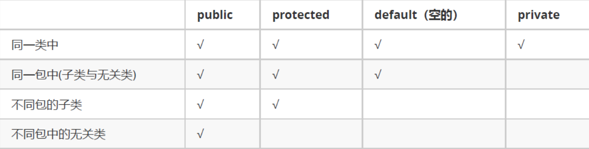

public 所有类可见

protected
本包和所有子类都可见（本包中的子类非子类均可访问，不同包中的子类可以访问，不是子类不能访问）

default
本包可见（即默认的形式）（本包中的子类非子类均可访问，不同包中的类及子类均不能访问）

priavte 本类可见

**在非本包子类，通过父类的对象实例只能访问父类的 public 成员,不能访问 protected 成员。**

## 2：数据类型

**1）八种基本数据类型**

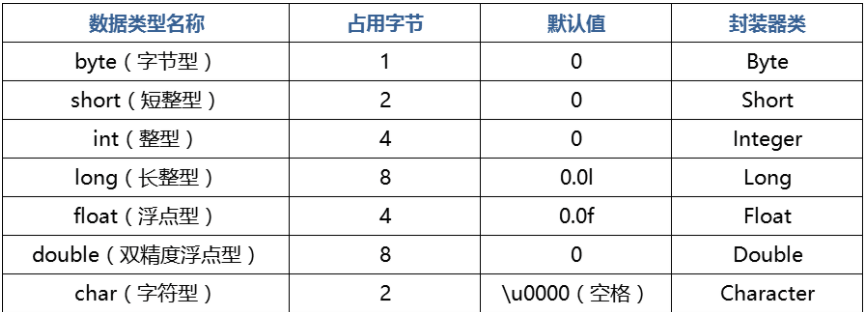

数据范围与字节数不一定相关，float 数据范围比 long 更加广泛，但是 float 是 4 字节，long 是 8 字节。

**注:double 型比 float 型存储范围更大，精度更高，所以通常的浮点型的数据在不声明的情况下都是 double 型的。**

存储金额有关使用**BigDecimal**

**2）引用类型**

引用数据类型传递的是内存的使用权，是一块内存空间，它可以由多个单位同时使用。

String：字符串型，用于存储一串字符

**3）数据类型转换：**

自动转换：将取值范围小的类型自动提升为取值范围大的类型 。

```java
byte、short、char‐‐>int‐‐>long‐‐>float‐‐>double
```

强制转换

浮点转成整数，直接取消小数点，可能造成数据损失精度。
int 强制转成 short 砍掉 2 个字节，可能造成数据丢失。

Long 转成 Integer：

```java
LongNum.inValue();
```

4）**包装类**

基本类型与引用类型，使用基本类型在于效率，然而很多情况，会创建对象使用，因为对象可以做更多的功能，如果想要我们的基本类型像对象一样操作，就可以使用基本类型对应的包装类

| 基本类型 | 对应的包装类（位于 java.lang 包中） |
| -------- | ----------------------------------- |
| byte     | Byte                                |
| short    | Short                               |
| int      | **Integer**                         |
| long     | Long                                |
| float    | Float                               |
| double   | Double                              |
| char     | **Character**                       |
| boolean  | Boolean                             |

- **装箱**：从基本类型转换为对应的包装类对象。

- **拆箱**：从包装类对象转换为对应的基本类型。

除了 Character 类之外，其他所有包装类都具有 parseXxx 静态方法可以将字符串参数转换为对应的基本类型：

- `public static byte parseByte(String s)`：将字符串参数转换为对应的 byte 基本类型。
- `public static short parseShort(String s)`：将字符串参数转换为对应的 short 基本类型。
- `public static int parseInt(String s)`：将字符串参数转换为对应的 int 基本类型。
- `public static long parseLong(String s)`：将字符串参数转换为对应的 long 基本类型。
- `public static float parseFloat(String s)`：将字符串参数转换为对应的 float 基本类型。
- `public static double parseDouble(String s)`：将字符串参数转换为对应的 double 基本类型。
- `public static boolean parseBoolean(String s)`：将字符串参数转换为对应的 boolean 基本类型。

5）值缓存

这个就是 java8 中的 Integer 类中的一个内部缓存类（其他版本的 jdk 实现有可能不一样但是效果都是一样的），这个类的作用就是将 -128~127 之间的整型做了一个缓存，（享元模式）

这个东西注释里已经写的比较清楚了，缓存在第一次使用时初始化，可以使用 -XX:AutoBoxCacheMax=（SIZE） VM 启动参数 来改变改变之后的缓存区间为 [-128~SIZE]

其实不止是 Integer ，在 Java 中所有的整型都是有缓存的，在 Byte 中也是有的，这个缓存的大小正好也是 Byte 的范围。

```java
        Integer a=100,b=100,c=200,d=200;
        System.out.println(a==b);
        System.out.println(c==d);
```

所以，上诉答案应该是， `true , false`

### ==与 equals

==比较的是地址

equals 比较的是字符串，如果不重写比较的也是地址。

### 值传递和引用传递

八种基本数据类型，在栈里面分配内存，属于值传递

`栈管运行，堆管存储`

int 等基本数据类型，相当于传递的一个副本，属于值传递

对于其他对象一般都是引用传递

特殊的 String，会将变量放入到一个常量池中，

## 3：流程控制

if……else

switch……case……break

for

do……while

## 3：重载与重写

重载：指在同一个类中，允许存在一个以上的同名方法，只要它们的参数列表不同即可，与修饰符和返回值类型无关。

重载只是指参数不同，返回类型不同参数相同会报错，重复定义

## 4：面向对象

封装，继承，多台

### 4.1：封装

封装就是将一些细节信息隐藏起来，对于外界不可见

方法就是一种封装，关键字 Private 也是一种封装

### 4.2：继承

如果子类父类中出现重名的成员变量

Java 中的向上转型与向下转型

1 ： 向上转型：大体可以理解为子类转换成父类，例子优先还是：

```java
1 public class Animal {
 2     public void eat(){
 3         System.out.println("animal eatting...");
 4     }
 5 }
 7 public class Cat extends Animal{
 9     public void eat(){
11         System.out.println("我吃鱼");
12     }
13 }
15 public class Dog extends Animal{
17     public void eat(){
19         System.out.println("我吃骨头");
20     }
22     public void run(){
23         System.out.println("我会跑");
24     }
25 }
27 public class Main {
29     public static void main(String[] args) {
31         Animal animal = new Cat(); //向上转型
32         animal.eat();
34         animal = new Dog();
35         animal.eat();
36     }
38 }
39
40 //结果:
41 //我吃鱼
42 //我吃骨头
```

(1):虽然将子类转换成父类，但调用方法是调用的是子类的方法，这里的转型只是父类的引用指向了子类的实例。

(2):如果子类还有父类中没有的方法 w 可以调用吗 ？答案当然是不能，子类转换成父类，子类多余的方法会丢失，就像例子中 dog 的 run（）方法会丢失

(3)为什么要用向上转型：父类是接口啊！接口的好处就不用说了，比如当你对所有动物全部放生，就不用一个个放生，可以 Save（Animal）；就 OK

2：向下转型：简单来说就是将父类转换为子类，但是转换可就不像向上转那末好转了！理解起来也比向上转型不好理解

(1)：首先注意：向下转型的前提是父类对象指向的是子类对象，就是你必须先向上转然后才能向下转，可能会有人说转上去再转下来，没有意义啊！作用就是当再次转下来的时候，就可以调用向上转丢失的方法，而且编程以后接口一多会有很多泛型编程，这样就可以针对父类进行编程，如果需要再取用子类的方法。

（2）：强制类型转换：将一个子类的引用赋值给超类，编译器是允许的，但将一个超类引用赋给一个子类变量必须进行强制类型转换

```java
public class Sys{
    public static void main(String[] args) {
        Animal a=new Dog(); //向上转型
        a.eat();

        Dog aa=(Dog)a; //向下转型,编译和运行皆不会出错(正确的)
        aa.eat();//向下转型时调用的是子类的
        aa.run();

        Animal a2=new Animal();
        Dog aa2=(Dog) a2; //-不安全的---向下转型,编译无错但会运行会出错
        aa2.eat();
        aa2.run();
    }
}
//结果为：
//我吃骨头
//我吃骨头
//我会跑
//报错······
```

结果表明：只有先经过向上转型的才能进行向下转型，向下转型必须要进行强制类型转换，

（3）：另外要注意两点，

第一：如果 Cat 向上转成 Animal，那末向下转 Animal 只能转成 Cat，不能转成 Dog，因为 Cat 怎么也不会变成 Dog

第二：为了安全的类型转换，向下转型时最好先 if ( Dog instanceof Animal) 判断一下，否则一旦无法转换，程序就会直接终止

Java 为什么只能单继承？

多继承的菱形继承问题

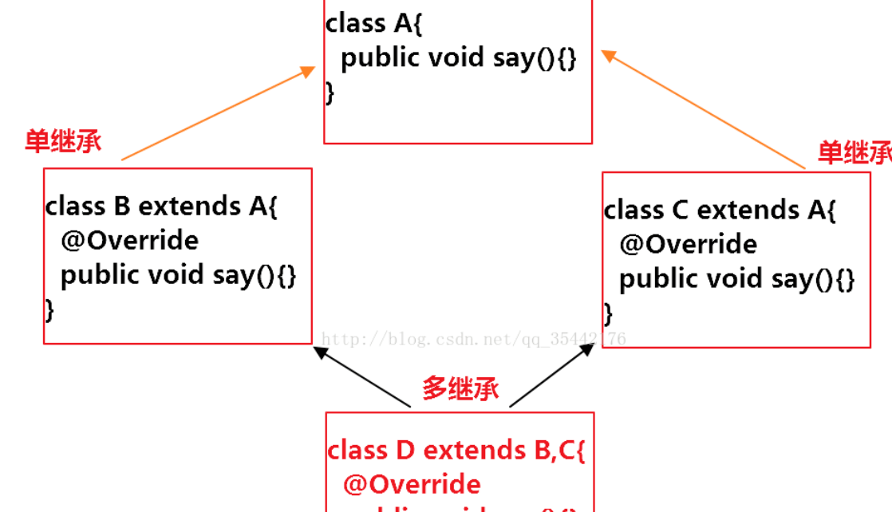

### 4.3：多态

是指同一行为，具有多个不同表现形式。

### 4.4：内部类

```java
//定义
class Car { //外部类
    class Engine { //内部类
    }
}
//使用
外部类名.内部类名 对象名 = new 外部类型().new 内部类型()；
```

非静态内部类依赖于外部类的实例，也就是说需要先创建外部类实例，才能用这个实例去创建非静态内部类。而静态内部类不需要。静态内部类不能访问外部类的非静态的变量和方法。

### 4.4：匿名内部类

```java
FlyAble f = new FlyAble(){
    public void fly() {
    	System.out.println("我飞了~~~");
    }
};
```

## 5：抽象与接口

接口的内部主要就是封装了方法，包含抽象方法（JDK 7 及以前），默认方法和静态方法（JDK 8），私有方法（JDK 9）。

抽象方法：使用 abstract 关键字修饰，可以省略，没有方法体。该方法供子类实现使用。

默认方法：使用 default 修饰，不可省略，供子类调用或者子类重写。
静态方法：使用 static 修饰，供接口直接调用。

私有方法：使用 private 修饰，供接口中的默认方法或者静态方法调用。

优先级：

继承>实现

当一个类，既继承一个父类，又实现若干个接口时，父类中的成员方法与接口中的默认方法重名，子类就近选择执
行父类的成员方法。

实现接口的关键字为 implements，继承抽象类的关键字为 extends

一个类可以实现多个接口，只能继承一个抽象类

接口中所有的方法隐含的都是抽象的。而抽象类则可以同时包含抽象和非抽象的方法。

类可以不实现抽象类和接口声明的所有方法，当然，在这种情况下，类也必须得声明成是抽象的。  
抽象类可以在不提供接口方法实现的情况下实现接口。  
Java 接口中声明的变量默认都是 final 的。抽象类可以包含非 final 的变量。  
Java 接口中的成员函数默认是 public 的。抽象类的成员函数可以是 private，protected 或者是 public。

## 5：方法

### 5.1：构造方法

### 5.2：可变参数方法

在**JDK1.5**之后，如果我们定义一个方法需要接受多个参数，并且多个参数类型一致，我们可以对其简化成如下格式：

```
修饰符 返回值类型 方法名(参数类型... 形参名){  }
```

其实这个书写完全等价与

```
修饰符 返回值类型 方法名(参数类型[] 形参名){  }
```

只是后面这种定义，在调用时必须传递数组，而前者可以直接传递数据即可。

```java
    int sum2 = getSum(6, 7, 2, 12, 2121);
	//可变参数写法
    public static int getSum(int... arr) {
        int sum = 0;
        for (int a : arr) {
            sum += a;
        }
        return sum;
    }
```

### 5.3：抽象方法及重写

## 面试题

1：跨平台原理

# 二：常用 API

## 1：数组

```java
int[] arr = new int[3];
int[] arr = new int[]{1,2,3,4,5};
int[] arr = {1,2,3,4,5};
```

### Arrays 类

来操作数组的各种方法，比如排序和搜索等。其所有方法均为静态方法，调用起来非常简单。

// 定义 int 数组

int[] arr = {2,34,35,4,657,8,69,9};

// 打印数组,输出地址值

System.out.println(arr); // [I\@2ac1fdc4

```java
// 数组内容转为字符串
String s = Arrays.toString(arr);
public static String toString(int[] a) ：返回指定数组内容的字符串表示形式。
   public static void sort(int[] a) ：对指定的 int 型数组按数字升序进行排序。

```

### Vector 类

实现类似动态数组的功能

创建了一个向量类的对象后，可以往其中随意地插入不同的类的对象，既不需顾及类型也不需预先选定向量的容量，并可方便地进行查找。

对于预先不知或不愿预先定义数组大小，并需频繁进行查找、插入和删除工作的情况，可以考虑使用向量类。

构造

public vector()
　　 public vector(int initialcapacity,int capacityIncrement)
　　 public vector(int initialcapacity)

就算设定了容量，当真正存放的数据个数超过容量时，系统也会扩充向量对象。

方法

插入

- public final synchronized void addElement(Object obj)
- public final synchronized void setElementAt(object obj,int index)
- public final synchronized void insertElementAt(Object obj,int index)

删除

- public final synchronized void removeElement(Object obj)
- public final synchronized void removeAllElement()
- public final synchronized void removeElementlAt(int index)

查询搜索

## 2：Object 类

Java 语言中的根类，即所有类的父类。它中描述的所有方法子类都可以使用。在对象实例化的时候，最终找的父类就是 Object。

- `public String toString()`：返回该对象的字符串表示。
- `public boolean equals(Object obj)`：指示其他某个对象是否与此对象“相等”。

这里的“相同”有默认和自定义两种方式。

默认地址比较

如果没有覆盖重写 equals 方法，那么 Object 类中默认进行`==`运算符的对象地址比较，只要不是同一个对象，结果必然为 false。

对象内容比较

如果希望进行对象的内容比较，即所有或指定的部分成员变量相同就判定两个对象相同，则可以覆盖重写 equals 方法。

- `hashCode()` ：返回哈希值，

散列值相同的两个对象不一定等价

- `clone()` ：克隆

浅拷贝 ：拷贝对象和原始对象的引用类型引用同一个对象。

深拷贝 ：拷贝对象和原始对象的引用类型引用不同对象。

### 1：Scanner 类

```java
Scanner sc = new Scanner(System.in);

int b = sc.nextInt();
```

### 2：Random 类

Random r = new Random();

int i = r.nextInt();

###

### **3：ArrayList 类**

大小可变的数组的实现，

ArrayList 对象不能存储基本类型，只能存储引用类型的数据。

ArrayList\<String\> list = new ArrayList\<\>();

public boolean add(E e) ：将指定的元素添加到此集合的尾部。

public E remove(int index) ：移除此集合中指定位置上的元素。返回被删除的元素。

public E get(int index) ：返回此集合中指定位置上的元素。返回获取的元素。

public int size()
：返回此集合中的元素数。遍历集合时，可以控制索引范围，防止越界。

### 4：String 类

1：查看构造方法

```java
//构造
public String() ：初始化新创建的 String对象，以使其表示空字符序列。
public String(char[] value) ：通过当前参数中的字符数组来构造新的String。
public String(byte[] bytes) ：通过使用平台的默认字符集解码当前参数中的字节数组来构造新的
```

2：判断功能的方法

```java
public boolean equals (Object anObject) ：将此字符串与指定对象进行比较。

public boolean equalsIgnoreCase (String anotherString)：将此字符串与指定对象进行比较，忽略大小写。获取功能的方法

public int length () ：返回此字符串的长度。

public String concat (String str) ：将指定的字符串连接到该字符串的末尾。

public char charAt (int index) ：返回指定索引处的 char值。

public int indexOf (String str) ：返回指定子字符串第一次出现在该字符串内的索引。

public String substring (int beginIndex)：返回一个子字符串，从beginIndex开始截取字符串到字符串结尾。

public String substring (int beginIndex, int endIndex)：返回一个子字符串，从beginIndex到endIndex截取字符串。含beginIndex，不含endIndex。转换功能的方法
public char[] toCharArray () ：将此字符串转换为新的字符数组。

public byte[] getBytes () ：使用平台的默认字符集将该String编码转换为新的字节数组。

public String replace (CharSequence target, CharSequence replacement)：将与target匹配的字符串使用replacement字符串替换。分割功能的方法

public String[] split(String regex)：将此字符串按照给定的regex（规则）拆分为字符串数组
```

**1：String 类为什么是不可变的 final 类型？**

- 为了实现字符串池(只有当字符是不可变的，字符串池才有可能实现）

如果字符串可变的话，**当两个引用指向指向同一个字符串时，对其中一个做修改就会影响另外一个。**

- 为了线程安全(字符串自己便是线程安全的)

- 为了保证 String 的 HashCode 永远保持一致，每次使用时不用重复计算

(Map 的 key 一般 String 用的最多原因就是这个)，故不能被继承

**2：String s=new String("abc") 创建了几个对象?**

“abc” 创建一个字符对象

new String（） 创建一个引用对象。

String s , 这个语句声明一个类 String 的引用变量 s

### 5：StringBuilder 与 StringBuffer

StringBuild 线程不安全，StringBuffer 线程安全

构造

- `public StringBuilder()`：构造一个空的 StringBuilder 容器。
- `public StringBuilder(String str)`：构造一个 StringBuilder 容器，并将字符串添加进去。

方法

- `public StringBuilder append(...)`：添加任意类型数据的字符串形式，并返回当前对象自身。
- `public String toString()`：将当前 StringBuilder 对象转换为 String 对象。

### 锁消除 lock eliminate

```java
public void add(String str1,String str2){
         StringBuffer sb = new StringBuffer();
         sb.append(str1).append(str2);
}
```

我们都知道 StringBuffer 是线程安全的，因为它的关键方法都是被 synchronized 修饰过的，但我们看上面这段代码，我们会发现，sb 这个引用只会在 add 方法中使用，不可能被其它线程引用（因为是局部变量，栈私有），因此 sb 是不可能共享的资源，JVM 会自动消除 StringBuffer 对象内部的锁。

### 锁粗化 lock coarsening

```java
public String test(String str){

       int i = 0;
       StringBuffer sb = new StringBuffer():
       while(i < 100){
           sb.append(str);
           i++;
       }
       return sb.toString():
}
```

JVM 会检测到这样一连串的操作都对同一个对象加锁（while 循环内 100 次执行 append，没有锁粗化的就要进行 100 次加锁/解锁），此时 JVM 就会将加锁的范围粗化到这一连串的操作的外部（比如 while 虚幻体外），使得这一连串操作只需要加一次锁即可。

### 6：Math 类

```java
public static double abs(double a) ：返回 double 值的绝对值。

public static double ceil(double a) ：返回大于等于参数的最小的整数。

public static double floor(double a) ：返回小于等于参数最大的整数。

public static long round(double a) ：返回最接近参数的 long。(相当于四舍五入方法)
```

### 8：Date 类

构造

```java
        // 创建日期对象，把当前的时间
        System.out.println(new Date()); // Tue Jan 16 14:37:35 CST 2018
        // 创建日期对象，把当前的毫秒值转成日期对象
        System.out.println(new Date(0L)); // Thu Jan 01 08:00:00 CST 1970
```

\* \`public long getTime()\` 把日期对象转换成对应的时间毫秒值。

DateFormat format = new SimpleDateFormat("yyyy-MM-dd HH:mm:ss");

\- \`public String format(Date date)\`：将 Date 对象格式化为字符串。

\- \`public Date parse(String source)\`：将字符串解析为 Date 对象。

String str = df.format(date);

### 9：DateFormat 类

`java.text.DateFormat` 是日期/时间格式化子类的抽象类，我们通过这个类可以帮我们完成日期和文本之间的转换,也就是可以在 Date 对象与 String 对象之间进行来回转换。

- **格式化**：按照指定的格式，从 Date 对象转换为 String 对象。
- **解析**：按照指定的格式，从 String 对象转换为 Date 对象。

构造

```java
        // 对应的日期格式如：2018-01-16 15:06:38
        DateFormat format = new SimpleDateFormat("yyyy-MM-dd HH:mm:ss");
```

常用的格式规则为：

| 标识字母（区分大小写） | 含义 |
| ---------------------- | ---- |
| y                      | 年   |
| M                      | 月   |
| d                      | 日   |
| H                      | 时   |
| m                      | 分   |
| s                      | 秒   |

方法：

- `public String format(Date date)`：将 Date 对象格式化为字符串。

```java
        Date date = new Date();
        // 创建日期格式化对象,在获取格式化对象时可以指定风格
        DateFormat df = new SimpleDateFormat("yyyy年MM月dd日");
        String str = df.format(date);
        System.out.println(str); // 2008年1月23日
```

- `public Date parse(String source)`：将字符串解析为 Date 对象。

```java
        DateFormat df = new SimpleDateFormat("yyyy年MM月dd日");
        String str = "2018年12月11日";
        Date date = df.parse(str);
        System.out.println(date); // Tue Dec 11 00:00:00 CST 2018
```

### 9：Calendar 类

构造

`public static Calendar getInstance()`：使用默认时区和语言环境获得一个日历

```java
Calendar cal = Calender.getInstance();
```

方法：

- `public int get(int field)`：返回给定日历字段的值。

- `public void set(int field, int value)`：将给定的日历字段设置为给定值。

- `public abstract void add(int field, int amount)`：根据日历的规则，为给定的日历字段添加或减去指定的时间量。

- `public Date getTime()`：返回一个表示此 Calendar 时间值（从历元到现在的毫秒偏移量）的 Date 对象。

  Calendar 类中提供很多成员常量，代表给定的日历字段：

  | 字段值       | 含义                                    |
  | ------------ | --------------------------------------- |
  | YEAR         | 年                                      |
  | MONTH        | 月（从 0 开始，可以+1 使用）            |
  | DAY_OF_MONTH | 月中的天（几号）                        |
  | HOUR         | 时（12 小时制）                         |
  | HOUR_OF_DAY  | 时（24 小时制）                         |
  | MINUTE       | 分                                      |
  | SECOND       | 秒                                      |
  | DAY_OF_WEEK  | 周中的天（周几，周日为 1，可以-1 使用） |

```java
  // 创建Calendar对象
        Calendar cal = Calendar.getInstance();
        // 设置年
        int year = cal.get(Calendar.YEAR);
        // 设置月
        int month = cal.get(Calendar.MONTH) + 1;
        // 设置日
        int dayOfMonth = cal.get(Calendar.DAY_OF_MONTH);
// 使用add方法
        cal.add(Calendar.DAY_OF_MONTH, 2); // 加2天
        cal.add(Calendar.YEAR, -3); // 减3年

```

### 10：System 类

方法

- `public static long currentTimeMillis()`：返回以毫秒为单位的当前时间。

获取当前系统时间与 1970 年 01 月 01 日 00:00 点之间的毫秒差值

```java
//获取当前时间毫秒值
System.out.println(System.currentTimeMillis();
```

- `public static void arraycopy(Object src, int srcPos, Object dest, int destPos, int length)`：将数组中指定的数据拷贝到另一个数组中。

System.arraycopy 方法具有 5 个参数，含义分别为：

| 参数序号 | 参数名称 | 参数类型 | 参数含义             |
| -------- | -------- | -------- | -------------------- |
| 1        | src      | Object   | 源数组               |
| 2        | srcPos   | int      | 源数组索引起始位置   |
| 3        | dest     | Object   | 目标数组             |
| 4        | destPos  | int      | 目标数组索引起始位置 |
| 5        | length   | int      | 复制元素个数         |

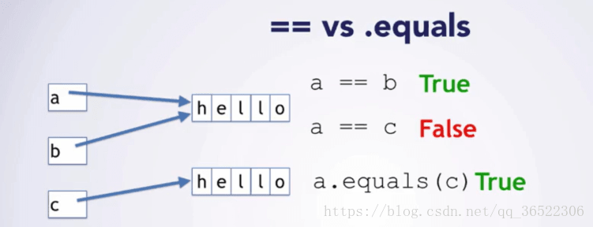

2：equals（）和==

Equals 方法用来比较对象时，若没有对 equals 进行重写，其都是调用的 Object 类的 equals 方法，而 Object 方法中的 equals 方法返回的却是==判断

1、基本数据类型比较  
==和 Equals 都比较两个值是否相等。相等为 true 否则为 false；  
2、引用对象比较  
==和 Equals 都是比较栈内存中的地址是否相等 。相等为 true 否则为 false；  
需注意几点：  
1、string 是一个特殊的引用类型。对于两个字符串的比较，不管是 == 和 Equals 这两者
比较的都是字符串是否相同；

3：HashCode 的作用：

返回对象的哈希代码值（就是散列码），用来支持哈希表，例如：HashMap

如果两对象 equals()是 true,那么它们的 hashCode()值一定相等

如果两对象的 hashCode()值相等，它们的 equals 不一定相等（hash 冲突啦）

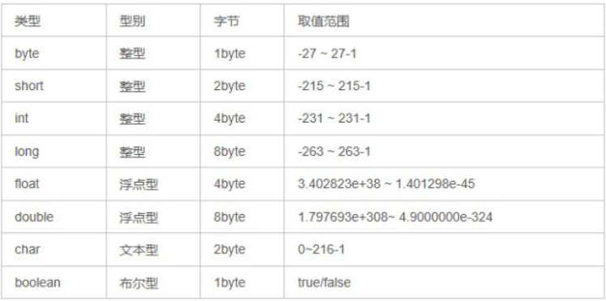

3：基本数据类型与自动拆箱

### 11： Comparable 接口和 Comparator 接口

Comparable 接口只包含 compareTo()方法

Comparator 接口包含 compare（Object ，Object ）方法和 equals（）方法

- ` public int compare(Object o1, Object o2)`：比较其两个参数的顺序。

  > 两个对象比较的结果有三种：大于，等于，小于。
  >
  > 如果要按照升序排序，
  > 则 o1 小于 o2，返回（负数），相等返回 0，01 大于 02 返回（正数）
  > 如果要按照降序排序
  > 则 o1 小于 o2，返回（正数），相等返回 0，01 大于 02 返回（负数）

compareTo 方法被称为它的自然比较方法。

实现此接口的对象列表（和数组）可以通过 Collections.sort（Arrays.sort）进行自动排序。实现此接口的对象可以用作有序映射中的键 or 有序集合中的元素，无需指定比较器。

Comparator 强行对某个对象 collection 进行整体排序的比较函数。可以将 Comparator 传递给 sort 方法（如 Collections.sort
或者
Arrays.sort），从而允许在排序上实现精准控制。还可以使用 Comparator 来控制某些数据结构（如有序 set 或有序映射）的顺序，or 为那些没有自然顺序的对象 Collection 提供排序。

Comparable 是排序接口：

若一个类实现了 Comnparable 接口，就意味着“该类支持排序”，既然实现了 Comparable 接口的类支持排序，

假设现在存在“实现 Comparable 接口类的对象的 List 列表（or 数组）”，则该 List 列表（or 数组）可以通过 Collection.sort（or
Arrays.sort）进行排序。

此外，“实现 Comparable 接口的类的对象”可以用作“有序映射（TreeMap）”中的键或“有序集合（TreeSet）”中的元素，而不需要指定比较器。

Comparator 也可以看成一种排序算法的实现，将算法和数据分离。

应用场景：

1
开始设计类的时候，没有考虑到比较问题而没有实现 Comparable，可以通过 Comparator 来实现排序而不必改变对象本身。

2
可以使用多种排序标准，比如员工按照员工号，年龄，名字，升序 or 降序排序等，并调用（如 Collections.sort
或者 Arrays.sort）方法，对 Collection 进行排序

```java
// 自然排序按照员工号的顺序
public int compareTo(Employee obj) {
	Employee employee = (Employee) obj;
	return this.no - employee.no;
}

/*

*

* 按照员工的年龄进行比较的比较器。

*/

public class AgeComparator implements Comparator<Employee> {
@Override
public int compare(Employee o1, Employee o2) {
	return o1.getAge()-o2.getAge();
}
}
```

Comparable 是【】排序接口，若一个类实现了 Coparable 接口，说明该类支持排序此外，“实现 Comparable 接口的类的对象”可以用作“有序映射(如 TreeMap)”中的键或“有序集合(TreeSet)”中的元素，而不需要指定比较器。

接口中通过 x.compareTo(y)来比较 x 和 y 的大小。若返回负数，意味着 x 比 y 小；返回零，意味着 x 等于 y；返回正数，意味着 x 大于 y。

5：Java 中的 Math. round(-1. 5) 等于多少？

等于 -1，因为在数轴上取值时，中间值（0.5）向右取整，所以正 0.5 是往上取整，负
0.5 是直接舍弃。

6：String 的常用方法：

7：数组与 List 的转换

List.toArray(); Arrays.asList(array);

8：重构与重载

重载：方法重载是让类以统一的方法处理不同类型的数据的一种手段

重构即重写：子类重写父类的方法

# 三：集合

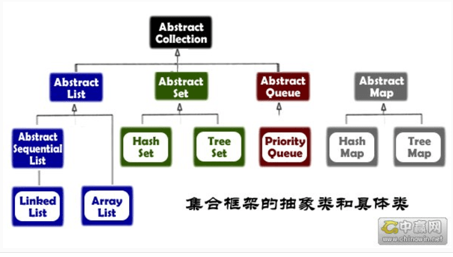

Vector、Hashtable、Stack 都是线程安全的，而像 HashMap 则是非线程安全的

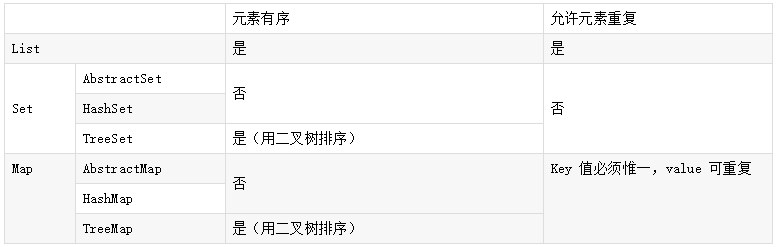

Java. util. concurrent 并发包的出现，ConcurrentHashMap 安全了

## 3.0：Collection

Collection 是集合类的上级接口，继承于他的接口主要有 Set 和 List.，Map 并不是 Collection 是针对集合类的一个帮助类，他提供一系列静态方法实现对各种集合的搜索、排序、线程安全化等操作

方法

- `public boolean add(E e)`： 把给定的对象添加到当前集合中 。
- `public void clear()` :清空集合中所有的元素。
- `public boolean remove(E e)`: 把给定的对象在当前集合中删除。
- `public boolean contains(E e)`: 判断当前集合中是否包含给定的对象。
- `public boolean isEmpty()`: 判断当前集合是否为空。
- `public int size()`: 返回集合中元素的个数。
- `public Object[] toArray()`: 把集合中的元素，存储到数组中。

## 3.1：Collections

是集合工具类，用来对集合进行操作

方法

- `public static <T> boolean addAll(Collection<T> c, T... elements) `:往集合中添加一些元素。
- `public static void shuffle(List<?> list) 打乱顺序`:打乱集合顺序。
- `public static <T> void sort(List<T> list)`:将集合中元素按照默认规则排序。
- `public static <T> void sort(List<T> list，Comparator<? super T> )`:将集合中元素按照指定规则排序。

例

```java
        ArrayList<Integer> list = new ArrayList<Integer>();
        //原来写法
        //list.add(12);
        //list.add(14);
        //list.add(15);
        //list.add(1000);
        //采用工具类 完成 往集合中添加元素
        Collections.addAll(list, 5, 222, 1，2);
        System.out.println(list);
        //排序方法
        Collections.sort(list);
        System.out.println(list);

```

## 3.2：Iterator 迭代器

Iterator（迭代器）是一个接口，它的作用就是遍历容器的所有元素。

构造

```java
Iterator iter = list.iterator(); // 注意iterator，首字母小写
```

方法

- `public E next()`:返回迭代的下一个元素。
- `public boolean hasNext()`:判断 iterator 内是否存在下 1 个元素，如果存在，返回 true，否则返回 false。（注意，这时上面的那个指针位置不变）
- `void remove()`删除 iterator 内指针的前 1 个元素，前提是至少执行过 1 次 next();(这个方法不建议使用，建议使用容器本身的 romove 方法)

例

```java
        //遍历
        //使用迭代器 遍历   每个集合对象都有自己的迭代器
        Iterator<String> it = coll.iterator();
        //  泛型指的是 迭代出 元素的数据类型
        while(it.hasNext()){ //判断是否有迭代元素
            String s = it.next();//获取迭代出的元素
            System.out.println(s);
        }
```

## 3.3：List 接口

List 是元素有序并且可以重复的集合，被称为序列

List 可以精确的控制每个元素的插入位置，或删除某个位置元素

方法

- `public void add(int index, E element)`: 将指定的元素，添加到该集合中的指定位置上。
- `public E get(int index)`:返回集合中指定位置的元素。
- `public E remove(int index)`: 移除列表中指定位置的元素, 返回的是被移除的元素。
- `public E set(int index, E element)`:用指定元素替换集合中指定位置的元素,返回值的更新前的元素。

### ArrayList

JDK1.7 ：ArrayList 像饿汉式，直接创建一个初始容量为 10 的数组

JDK1.8：ArrayList 像懒汉式，一开始创建个长度为 0 的数组，当添加第一个元素时再创建一个始容量 10 的数组

动态数组，

1、ArrayList 创建时的大小为 0；当加入第一个元素时，进行第一次扩容时，默认容量大小为 10。

2、ArrayList 每次扩容都以当前数组大小的 1.5 倍去扩容。

3、Vector 创建时的默认大小为 10。

4、Vector 每次扩容都以当前数组大小的 2 倍去扩容。当指定了 capacityIncrement 之后，每次扩容仅在原先基础上增加 capacityIncrement 个单位空间。

5、ArrayList 和 Vector 的 add、get、size 方法的复杂度都为 O(1)，remove 方法的复杂度为 O(n)。

6、ArrayList 是非线程安全的，Vector 是线程安全的。

Q：怎么实现线程安全呢？

A：方法一：使用 Vector，Vector 是线程安全的，它在方法上加了 synchronized

方法二：使用 Collections 集合工具类，在 ArrayList 外面包装一层同步机制

```java
List<String> list = Collections.synchronizedList(new ArrayList<>());
```

方法三：采用 JUC 中的 CopyOnWriteArrayList

写时复制，CopyOnWrite 容器即写时复制的容器，往一个容器中添加元素的时候，不直接往当前容器 Object[]添加，而是先将 Object[]进行 copy，复制出一个新的容器 object[] newElements，然后新的容器 Object[] newElements 里添加原始，添加元素完后，在将原容器的引用指向新的容器 setArray(newElements)；这样做的好处是可以对 copyOnWrite 容器进行并发的度，而不需要加锁，因为当前容器不需要添加任何元素。所以 CopyOnWrite 容器也是一种读写分离的思想，读和写不同的容器

就是写的时候，把 ArrayList 扩容一个出来，然后把值填写上去，在通知其他的线程，ArrayList 的引用指向扩容后的

1：array 与 ArrayList 的区别

Array 可以包含基本类型和对象类型，ArrayList 只能包含对象类型。

1：ArrayList，Vector，linkedList 的区别

ArrayList 和 Vector 都是使用数组方式存储数据，此数组元素数大于实际存储的数据以便增加和插入元素，它们都允许直接按序号索引元素，但是插入元素要涉及数组元素移动等内存操作，所以索引数据快而插入数据慢，

Vector 由于使用了 synchronized 方法（线程安全），通常性能上较 ArrayList 差，

LinkedList 使用双向链表实现存储，按序号索引数据需要进行前向或后向遍历，但是插入数据时只需要记录本项的前后项即可，所以插入速度较快。

ArrayList 是基于数组实现的，要求一段连续的空间

LinkedList 是基于链表实现的，是一个双向循环列表。不是线程安全的。

### LinkedList

双向链表，允许插入 null，线程不同步

Vector

加：

## 3.4：Set 接口及其实现类

集合 Set 是 Collection 的子接口，Set 不允许其数据元素重复出现，也就是说在 Set 中每一个数据元素都是唯一的。

虽然集合号称存储的是 Java 对象，但实际上并不会真正将 Java 对象放入 Set 集合中，只是在 Set 集合中保留这些对象的引用而言。也就是说：Java 集合实际上是多个引用变量所组成的集合，这些引用变量指向实际的 Java 对象。

### HashSet（常用）

基本上都是直接调用底层 **HashMap** 的相关方法来完成，

所谓的 Hash 算法就是把任意长度的输入（又叫做预映射），通过散列算法，变换成固定长度的输出，该输出就是散列值。
不允许重复的值。当我们使用 HashSet 存储自定义类时，需要在自定义类中重写 equals 和 hashCode 方法，主要原因是集合内不允许有重复的数据元素，在集合校验元素的有效性时（数据元素不可重复），需要调用 equals 和 hashCode 验证。

HashSet 不能保证元素的排列顺序，HashSet 不是线程安全的，集合元素可以是 null

在**JDK1.8**之前，哈希表底层采用数组+链表实现，即使用链表处理冲突，同一 hash 值的链表都存储在一个链表里。但是当位于一个桶中的元素较多，即 hash 值相等的元素较多时，通过 key 值依次查找的效率较低。而 JDK1.8 中，哈希表存储采用数组+链表+红黑树实现，当链表长度超过阈值（8）时，将链表转换为红黑树，这样大大减少了查找时间。

简单的来说，哈希表是由数组+链表+红黑树（JDK1.8 增加了红黑树部分）实现的

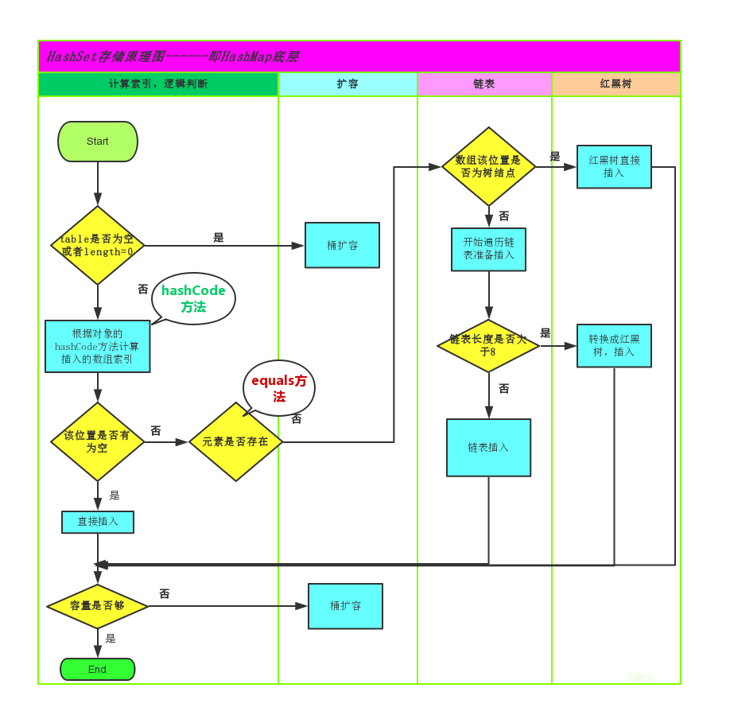

HashSet 线程不安全，同样也可以使用 CopyOnWriteArraySet，其底层依然还是使用 CopyOnWriteArrayList 实现的。

### LinkedHashSet

根据元素的 hashCode 值来决定元素的存储位置， 但它同时使用双向链表维护元素的次序，这使得看起来是以 插入 顺序保存,不允许重复

### TreeSet

TreeSet 可以确保集合元素处于排序状态。TreeSet 采用红黑树的数据结构来存储集合元素。

TreeSet 会调用集合元素的 compareTo(Objecto)方法来比较元素之间的大小关系，然后将集合元素按升序排列，这种方式是自然排序。底层使用红黑树结构存储数据。

## 3：Queue

顾名思义，Queue 用于模拟队列这种数据结构。队列先进先出。

Queue 接口有一个 PriorityQueue 实现类。除此之外，Queue 还有一个 Deque 接口，Deque 代表一个“双端队列”，双端队列可以同时从两端删除或添加元素，因此 Deque 可以当作栈来使用。java 为 Deque 提供了 ArrayDeque 实现类和 LinkedList 实现类。

2：Queue 接口中定义了如下的几个方法：

void add(Object e): 将指定元素插入到队列的尾部。

object element(): 获取队列头部的元素，但是不删除该元素。

boolean offer(Object e):
将指定的元素插入此队列的尾部。当使用容量有限的队列时，此方法通常比 add(Object
e)有效。

Object peek(): 返回队列头部的元素，但是不删除该元素。如果队列为空，则返回 null。

Object poll(): 返回队列头部的元素，并删除该元素。如果队列为空，则返回 null。

Object remove(): 获取队列头部的元素，并删除该元素。

PriorityQueue 实现类

## 4：Stack

Stack 类是 Vector 类的子类。它向用户提供了堆栈这种高级的数据结构。

## 5：Map

Key-value 型，不允许重复，同一对象所对应的类

1：哈希表


2：Java7 实现

容量必须是为 2 的 n 次幂，默认 1\<\<4 为 16

创建的时候并没有分配桶，只有将东西 put 进去的时候才分配

Int I 变成 0 到 n-1 的方法：取余，使用 Hash&（length-1）（全 1）

为防止碰撞，再次 hash

超过一定阈值就要开始扩容

对桶里的所有元素进行重新 hash，新桶是旧桶的两倍，

Transfer 函数：把原本的遍历一遍，计算新的然后再计算新的里面

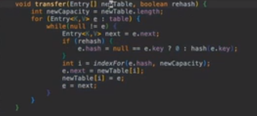

Java7 的实现容易会出现死锁，它是线程不安全的

原本顺序是 7-3，transfer 之后顺序变成了 3-7。

1.7 的问题


1.8

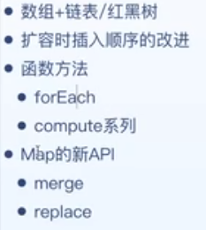

不再是链表，用的是红黑树（二叉平衡树），re 的时候保持顺序

Resize 效率很低

**Entry 对象**

`Map`中存放的是两种对象，一种称为**key**(键)，一种称为**value**(值)，它们在在`Map`中是一一对应关系，这一对对象又称做`Map`中的一个`Entry(项)`。`Entry`将键值对的对应关系封装成了对象。即键值对对象，这样我们在遍历`Map`集合时，就可以从每一个键值对（`Entry`）对象中获取对应的键与对应的值。

方法

- `public K getKey()`：获取 Entry 对象中的键。
- `public V getValue()`：获取 Entry 对象中的值。

在 Map 集合中也提供了获取所有 Entry 对象的方法：

- `public Set<Map.Entry<K,V>> entrySet()`: 获取到 Map 集合中所有的键值对对象的集合(Set 集合)。

### HashMap(重点)

HashMap 不是线程安全的，如果想要线程安全的 HashMap，可以通过 Collections 类的静态方法 synchronizedMap 获得线程安全的 HashMap。

#### 1.7 至 1.8 的变化

1：插入时由 1.7 的头插法（最后插入的放到最前面）改成尾插法

1.7 采用头插法考虑到新插入的元素可能更早用到的问题，但这是个伪命题，而且头插法容易造成死链问题：

在扩容时，头插法会改变链表中元素原本的顺序，以至于在并发场景下导致链表成环的问题，而尾插法，在扩容时会保持链表元素原本的顺序，就不会出现链表成环的问题。但是注意 HashMap 不是线程安全的，即使采用尾插法，也不能用到多线程中。

2：结构变化

JDK1.7 的，数组 + 链表

JDK1.8 变为：数组 + 链表 + 红黑树

#### 结构实现

HashMap 的底层主要是基于数组，链表和红黑树来实现的，HashMap 会根据 key.hashCode() 计算出 hash 值，根据 hash 值将 value 保存在 bucket 里。

HashMap 类中有一个非常重要的字段，就是 Node[] table，即哈希桶数组，明显它是一个 Node 的数组

**当冲突时 HashMap 的做法是用链表和红黑树存储相同 hash 值的 value。当 hash 冲突的个数比较少时，使用链表否则使用红黑树。**

- key 值不可重复，value 值可以重复，

- key,value 都可以是任何引用类型的数据，包括 null

HashMap 中关于红黑树的三个关键参数：

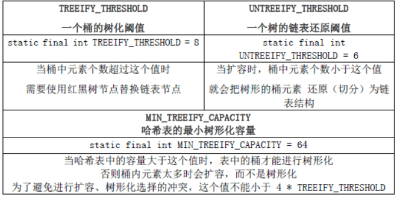

影响 HashMap 性能的两个重要参数，“initial capacity”（初始化容量）和”load factor“（负载因子）

容量就是哈希表桶的个数，负载因子就是键值对个数与哈希表长度的一个比值

当比值超过负载因子之后，HashMap 就会进行 rehash 操作来进行扩容。

Q：为什么选择红黑树而不是 AVL 树？

A：红黑树并不是严格的平衡树，红黑树适合修改密集的任务，AVL 树适合查找密集的任务

#### 方法

**PUT：**

1、先通过 hash 值计算出 key 映射到哪个桶。

2、如果桶上没有碰撞冲突，则直接采用`尾插法`将元素添加到链表中

3、如果出现碰撞冲突了，则需要处理冲突：

（1）如果该桶使用红黑树处理冲突，则调用红黑树的方法插入。红黑树插入的时间复杂度为 logn

（2）否则采用传统的链式方法插入。如果链的长度到达临界值，则把链转变为红黑树。

4、如果桶中存在重复的键，则为该键替换新值。

5、如果 size 大于阈值，则进行扩容。

HashMap 新增元素的时间复杂度是不固定的，可能的值有 O(1)、O(logn)、O(n)。

**get**：

1、通过 hash 值获取该 key 映射到的桶。

2、桶上的 key 就是要查找的 key，则直接命中。

3、桶上的 key 不是要查找的 key，则查看后续节点：

（1）如果后续节点是树节点，通过调用树的方法查找该 key。

（2）如果后续节点是链式节点，则通过循环遍历链查找该 key。

**Hash：**

hash 指的是 key 的哈希值，hash 是通过下面这个方法计算出来的，采用了二次哈希的方式，其中 key 的 hashCode 方法是一个 native 方法：

```java
static final int hash(Object key) {   //jdk1.8 & jdk1.7
     int h;
     // h = key.hashCode() 为第一步 取hashCode值
     // h ^ (h >>> 16)  为第二步 高位参与运算
     return (key == null) ? 0 : (h = key.hashCode()) ^ (h >>> 16);
}
```

这个 hash 方法先通过 key 的 hashCode 方法获取一个哈希值，再拿这个哈希值与它的高 16 位的哈希值做一个异或操作来得到最后的哈希值

为啥要这样做呢？注释中是这样解释的：如果当 n 很小，假设为 64 的话，那么 n-1 即为 63（0x111111），这样的值跟 hashCode()直接做与操作，实际上只使用了哈希值的后 6 位。如果当哈希值的高位变化很大，低位变化很小，这样就很容易造成冲突了，所以这里把高低位都利用起来，从而解决了这个问题。

决定了 HashMap 的大小只能是 2 的幂次方。

当 length 总是 2 的 n 次方时，h& (length-1)运算等价于对 length 取模，也就是 h%length，但是&比%具有更高的效率。

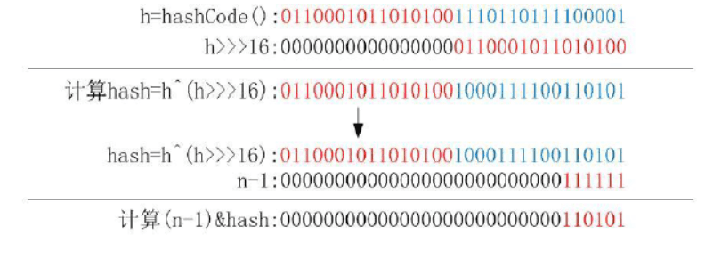

**Resize**

方法是使用一个新的数组代替已有的容量小的数组。

HashMap 在进行扩容时，使用的 rehash 方式非常巧妙，因为每次扩容都是翻倍，与原来计算（n-1）&hash 的结果相比，只是多了一个 bit 位，所以节点要么就在原来的位置，要么就被分配到“原位置+旧容量”这个位置。

例如，原来的容量为 32，那么应该拿 hash 跟 31（0x11111）做与操作；在扩容扩到了 64 的容量之后，应该拿 hash 跟 63（0x111111）做与操作。新容量跟原来相比只是多了一个 bit 位，假设原来的位置在 23，那么当新增的那个 bit 位的计算结果为 0 时，那么该节点还是在 23；相反，计算结果为 1 时，则该节点会被分配到 23+31 的桶上。

总的来说：扩容时总是扩容到原来的两倍，使用位运算，可以很容易的将原本的元素转移到新的数组中去。

Q：HashMap 也是线程不安全的，怎么解决呢？

方法一：使用 Collections 的方法，给外层套一个：Collections.synchronizedMap(new HashMap<>());

方法二：使用 ConcurrentHashMap

### ConcurrentHashMap

#### 结构

JDK1.7 中 ConcurrentHashMap 是由 Segment 数组结构和 HashEntry 数组结构组成。

Segment 是一种可重入锁 ReentrantLock，在 ConcurrentHashMap 里扮演锁的角色，HashEntry 则用于存储键值对数据。

Segment 的个数是不能扩容的，但是单个 Segment 里面的数组是可以扩容的。

JDK1.8 的实现已经抛弃了 Segment 分段锁机制，利用 CAS+Synchronized 来保证并发更新的安全。

Q：为什么舍弃 Segment？

A：至于为什么抛弃 Segment 的设计，是因为分段锁的这个段不太好评定，如果我们的 Segment 设置的过大，那么隔离级别也就过高，那么就有很多空间被浪费了，也就是会让某些段里面没有元素，如果太小容易造成冲突

Q：为什么使用 synchronized 而不是 ReetranLock？

A：

- 减少内存开销：假设使用可重入锁来获得同步支持，那么每个节点都需要通过继承 AQS 来获得同步支持。但并不是每个节点都需要同步支持，只有链表的头结点（红黑树的根节点）需要同步，这无疑带来了巨大的浪费

- 获得 JVM 支持

  可重入锁毕竟是 API 这个级别的，后续的性能优化空间 很小

  Synchronized 则是由 JVM 直接支持，JVM 能够在运行时做出对应的优化措施：锁粗化，锁消除，锁自旋等。这就是使得 Synchronized 能够随着 JDK 版本的升级而无需改动代码的前提下获得性能上的提升。

数据结构采用：Node 数组+链表+红黑树。

Node：是 ConcurrentHashMap 存储结构的基本单元，继承于 HashMap 中的 Entry，用于存储数据

TreeNode：红黑树的数据的存储结构，用于红黑树中存储数据，当链表的节点数大于 8 时会转换成红黑树的结构，他就是通过 TreeNode 作为存储结构代替 Node 来转换成黑红树

TreeBin：reeBin 就是封装 TreeNode 的容器，它提供转换黑红树的一些条件和锁的控制

#### 初始化

初始化：保证安全，加锁（尽量避免加锁，即使加锁范围尽量小），CAS 加自旋

存取数据：初始容量，扩容安全，多个线程共同协助扩容

默认初始容量为 16

New 的时候并不会初始化数组，只有但 put 时才会初始化数组。即延迟到第一次 put 行为时

创建时如果传入

```java
final ConcurrentHashMap chm = new ConcurrentHashMap(32);
```

这是其初始容量为 64

注意：构造方法中，都涉及一个变量`sizeCtl`，这个变量是一个非常重要的变量，它的值不同，对应的含义也不同。

```txt
sizeCtl为0：代表数组未初始化，且数组的初始容量为16

sizeCtl为正数：如果数组未初始化，那么其记录的是数组的初始容量，如果数组已经初始化，那么其记录的是数组的扩容阈值（数组的初始容量的0.75倍）

sizeCtl为1，表示数组正在进行初始化

sizeCtl小于0，并且不是-1，表示数组正在扩容，-[1+n],表示此时有n个线程正在共同完成数组的扩容操作
```

源代码：

```java
public ConcurrentHahsMap(int initialCapacity){
    if(initialCapacity<0)
        throw new IllegalArgumentEcception();
    int cap = ((initialCapacity>=(MAXINUM_CAPACITY>>>1))?
              MAXINUM_CAPACITY:
               tableSizeFor(initialCapacity+(initialCapacity>>>1)+1));
    this.size = cap;
}
```

初始化后，将值赋值给了 sizeCtl

#### put

对当前的 table 进行无条件自循环直到 put 成功

- 如果没有初始化就先调用 initTable（）方法来进行初始化过程

- 如果没有 hash 冲突就直接 CAS 插入

- 如果还在进行扩容操作就先进行扩容

- 如果存在 hash 冲突，就加锁来保证线程安全，这里有两种情况，一种是链表形式就直接遍历到尾端插入，一种是红黑树就按照红黑树结构插入，

- 最后一个如果 Hash 冲突时会形成 Node 链表，在链表长度超过 8，Node 数组超过 64 时会将链表结构转换为红黑树的结构，break 再一次进入循环

- 如果添加成功就调用 addCount（）方法统计 size，并且检查是否需要扩容

**2：添加安全**

Put—调用 putVal 方法，不允许空值空键

分段锁

CAS

hashCode & n-1

**3：扩容 rehash**

当元素的数量达到容量阈值 sizectl 时，需要扩容

扩容两步：

1.  构建一个 nextTable，大小为 table 的两倍。

2.  把 table 的数据复制到 nextTable 中。

并更新 sizeCtl 的大小为新数组的 0.75 倍

阈值

### HashTable

线程安全：所有涉及到多线程操作的都加上了 synchronized 关键字来锁住整个 table

现在很少用了，多被 HahsMap 或 ConcurrentHashMap 代替，不允许插入 null 值

### LinkedHashMap

哈希表+链表，通过维护一个链表来保证对哈希表迭代时的有序性

HashMap 中有三个空方法，二 LinkedHashMap 就是通过重写这三个方法来保证链表的插入，删除的有序性。

// Callbacks to allow LinkedHashMap post-actions

void afterNodeAccess(Node\<K,V\> p) { }

void afterNodeInsertion(boolean evict) { }

void afterNodeRemoval(Node\<K,V\> p) { }

### TreeMap

TreeMap 是非线程安全的。

可以采用可以通过 Collections 类的静态方法 synchronizedMap 获得线程安全：

Map m = Collections.synchronizedSortedMap(new TreeMap(…));

TreeMap 是用键来进行升序顺序来排序的。底层也是使用红黑树结构存储数据，通过 Comparable 或 Comparator 来排序。（实现和 TreeSet 基本一致）。

### 对比

1：HashMap 与 TreeMap 的区别

实现方式

HashMap:基于哈希表实现。（1.8 基于数组链表红黑树）使用 HashMap 要求添加的键类明确定义了 hashCode（）和 equals

TreeMap:基于红黑树实现。TreeMap 没有调优选项，因为该树总处于平衡状态。

用途

HashMap：适用于在 Map 中插入、删除和定位元素。

TreeMap：适用于按自然顺序或自定义顺序遍历键（key)。

HashMap 通常比 TreeMap 快一点（树和哈希表的数据结构使然），建议多使用 HashMap,在需要排序的 Map 时候才用 TreeMap.

**2：HashMap 与 HashTable 的区别**

- HashMap 是线程不安全的，HashTable 是线程安全的，效率低。因此，HashMap 更适合于单线程环境，而 Hashtable 适合于多线程环境。
- Hashtable 的方法是 Synchronize 的，而 HashMap 不是
- HashMap 是可以把 null 作为 key 或者 value 的，但是 HashTable 不行

要想既安全又效率高就用 ConcurrentHashMap

### 常用的遍历 Map 的方法

1. Map<String, String> map = **new** HashMap<String, String>();
2. map.put("1", "value1");
3. map.put("2", "value2");
4. map.put("3", "value3");

//第一种：普遍使用，由于二次取值,效率会比第二种和第三种慢一倍

```java
System.out.println("通过Map.keySet遍历key和value：");
 **for** (String key : map.keySet()) {
 		System.out.println("key= "+ key + " and value= " + map.get(key));
 }
```

//第二种 :通过 Map.entrySet 使用 iterator 遍历 key 和 value

```java
 System.out.println("通过Map.entrySet使用iterator遍历key和value：");
 Iterator<Map.Entry<String, String>> it = map.entrySet().iterator();
 **while** (it.hasNext()) {
 		Map.Entry<String, String> entry = it.next();
 		System.out.println("key= " + entry.getKey() + " and value= " + entry.getValue());
 }
```

//第三种：无法在 for 循环时实现 remove 等操作

```java
 System.out.println("通过Map.entrySet遍历key和value");
 **for** (Map.Entry<String, String> entry : map.entrySet()) {
 		System.out.println("key= " + entry.getKey() + " and value= " + entry.getValue());
 }
```

//第四种：只能获取 values,不能获取 key

```java
System.out.println("通过Map.values()遍历所有的value，但不能遍历key");
 **for** (String v : map.values()) {
 		System.out.println("value= " + v);
 }
```

Map.entrySet 迭代器会生成 EntryIterator,其返回的实例是一个包含 key/value 键值对的对象。而 keySet 中迭代器返回的只是 key 对象，还需要到 map 中二次取值。故 entrySet 要比 keySet 快一倍左右。

## 7：位集合类 BitSet

# 四：异常

## 1：概述

异常体系


1：Exception 和 Error 有什么区别？

Exception 和 Error 都是 Throwable 的子类。Exception 用于用户程序可以捕获的异常情况。Error 定义了不期望被用户程序捕获的异常。

分类

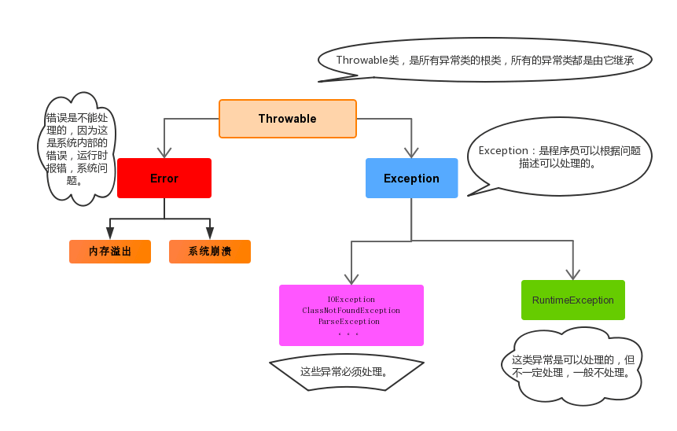

-

异常事件可分为两类：

**Error**：Java 虚拟机无法解决的严重问题。如：JVM 系统内部错误、资源耗尽等严重情况。比如：StackOverflowError 和 OOM。一般不编写针对性的代码进行处理。

**Exception:**其它因编程错误或偶然的外在因素导致的一般性问题，可以使用针对性的代码进行处理。例如：

空指针访问

试图读取不存在的文件

网络连接中断

数组角标越界

- **编译时期异常**:checked 异常。在编译时期,就会检查,如果没有处理异常,则编译失败。(如日期格式化异常)
- **运行时期异常**:runtime 异常。在运行时期,检查异常.在编译时期,运行异常不会编译器检测(不报错)。(如数学异常)

## 2：常见异常

- NullPointerException 空指针异常

- ClassNotFoundException 指定类不存在

- NumberFormatException 字符串转换为数字异常

- IndexOutOfBoundsException 数组下标越界异常

- ClassCastException 数据类型转换异常

- FileNotFoundException 文件未找到异常

- NoSuchMethodException 方法不存在异常

- IOException IO 异常

- SocketException Socket 异常

## 3：处理异常

**1）抛出异常 throw**

**2）声明异常 throws**

throw 和 throws 有什么区别？

Throw 用于方法内部，Throws 用于方法声明上

Throw 后跟异常对象，Throws 后跟异常类型

Throw 后只能跟一个异常对象，Throws 后可以一次声明多种异常类型

**3）捕获异常 try…catch**

1：在项目中不要捕获 Java 类库中继承自 RuntimeException 的运行时异常，ndexOutOfBoundsException
/ NullPointerException，这类异常由程序员预检查违法来规避，保证程序健壮性。

2：对大段代码进行 try-catch，这是不负责任的表现。 catch
时请分清稳定代码和非稳定代码，稳定代码指的是无论如何不会出错的代码。对于非稳定代码的
catch 尽可能进行区分异常类型，再做对应的异常处理。

3：有 try 块放到了事务代码中， catch
异常后，如果需要回滚事务，一定要注意手动回滚事务。

4：有特殊的流关闭等操作一定必须放在 finally 中

程序检测

If（num==0）{}

方式一：try-catch-finally

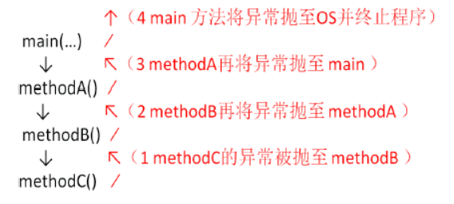

捕获异常的有关信息：

与其它对象一样，可以访问一个异常对象的成员变量或调用它的方法。

getMessage() 获取异常信息，返回字符串

printStackTrace()
获取异常类名和异常信息，以及异常出现在程序中的位置。返回值 void。

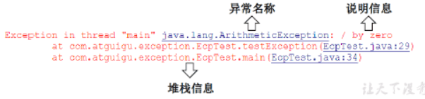

方式二：throws + 异常类型

方法三：手动抛出异常

首先要生成异常类对象，然后通过 throw 语句实现抛出操作(提交给 Java 运行环境)。

**IOException e=new IOException();**

**Throw e;**

可以抛出的异常必须是 Throwable 或其子类的实例。下面的语句在编译时将会产生语法错误：

**Throw new String("wanttothrow");**

## 4：用户自定义异常类

定义异常类

```java
// 业务逻辑异常
public class RegisterException extends Exception {
    /**
     * 空参构造
     */
    public RegisterException() {
    }

    /**
     *
     * @param message 表示异常提示
     */
    public RegisterException(String message) {
        super(message);
    }
}
```

使用

```java
public static boolean checkUsername(String uname) throws LoginException{
        for (String name : names) {
            if(name.equals(uname)){//如果名字在这里面 就抛出登陆异常
                throw new RegisterException("亲"+name+"已经被注册了！");
            }
        }
        return true;
    }
}
```

### 总结：

1：在项目中不要捕获 Java 类库中继承自 RuntimeException 的运行时异常，这类异常由程序员预检查违法来规避，保证程序健壮性。

2：不能大段进行 try……catch……对于非稳定代码的
catch 尽可能进行区分异常类型，再做对应的异常处理。给出准确的异常处理信息

3：有 try 块放到了事务代码中， catch 异常后，如果需要回滚事务，一定要注意手动回滚事务。

4：有特殊的流关闭等操作一定必须放在 finally 中

5：请确保在 Javadoc 中添加一个@throws 声明，并描述可能导致的异常情况。

# 五：多线程：

并行：多个 cpu 实例或者多台机器同时执行一段处理逻辑，是真正的同时。
并发：通过 cpu 调度算法，让用户看上去同时执行，实际上从 cpu 操作层面不是真正的同时。

**线程与进程的区别归纳：**

**a.地址空间和其它资源**：进程间相互独立，同一进程的各线程间共享。某进程内的线程在其它进程不可见。

**b.通信：**进程间通信 IPC，线程间可以直接读写进程数据段（如全局变量）来进行通信——需要进程同步和互斥手段的辅助，以保证数据的一致性。

**c.调度和切换**：线程上下文切换比进程上下文切换要快得多。

d.在多线程 OS 中，进程不是一个可执行的实体。

守护线程：

守护线程是运行在后台的一种特殊进程。它独立于控制终端并且周期性地执行某种任务或等待处理某些发生的事件。在
Java 中垃圾回收线程就是特殊的守护线程。

## 5.1：原理/方法机制

多线程执行时，在栈内存中，其实每一个执行线程都有一片自己所属的栈内存空间。进行方法的压栈和弹栈。

当执行线程的任务结束了，线程自动在栈内存中释放了。但是当所有的执行线程都结束了，那么进程就结束了。

synchronized, wait, notify 是任何对象都具有的同步工具。

wait/notify 必须存在于 synchronized 块中。并且，这三个关键字针对的是同一个监视器（某对象的监视器）。

volatile
多线程的内存模型：main memory（主存）、working memory（线程栈），在处理数据时，线程会把值从主存 load 到本地栈，完成操作后再 save 回去(volatile 关键词的作用：每次针对该变量的操作都激发一次 load and save)。

## 5.2：线程状态

当线程被创建并启动以后，它既不是一启动就进入了执行状态，也不是一直处于执行状态。在线程的生命周期中，枚举中给出了六种线程状态：

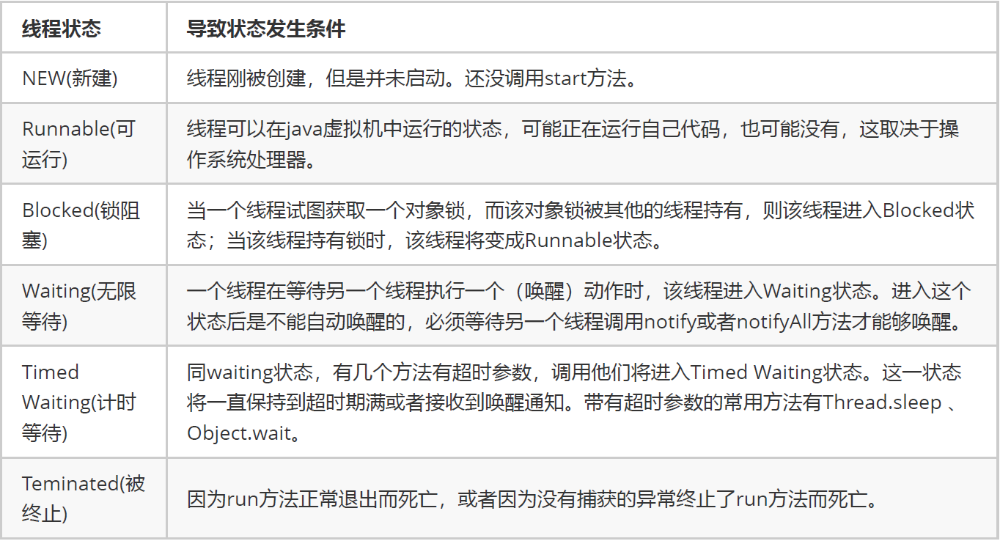

**就绪(Runnable):**线程准备运行，不一定立马就能开始执行。

**运行中(Running)：**进程正在执行线程的代码。

**等待中(Waiting):**线程处于阻塞的状态，等待外部的处理结束。

**睡眠中(Sleeping)：**线程被强制睡眠。

**I/O 阻塞(Blocked on I/O)：**等待 I/O 操作完成。

**同步阻塞(Blocked on Synchronization)：**等待获取锁。

**死亡(Dead)：**线程完成了执行

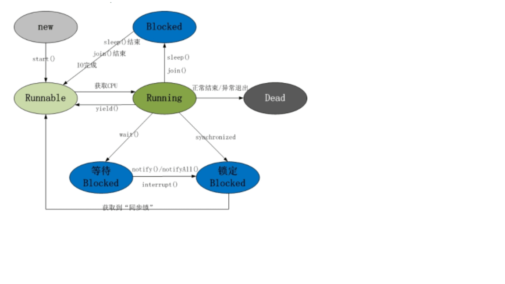多个线程处理同一个资源，需要线程间通信解决线程对资源的占用，避免对同一资源争夺。及引入等待唤醒机制（wait（），notify（））

(a）wait（）方法:线程调用 wait()方法，**释放**它对锁的拥有权，然后**等待另外的线程来通知它**（通知的方式是 notify()或者 notifyAll()方法），这样它才能重新获得锁的拥有权和恢复执行。

要确保调用 wait()方法的时候**拥有锁**，即，wait()方法的调用必须放在**synchronized**方法或**synchronized**块中。

(b)notify()方法：`notify()方法会唤醒一个等待当前对象的锁的线程。唤醒在此对象监视器上等待的单个线程。`

(c)` notifAll()方法：**``**notifyAll（）方法会唤醒在此对象监视器上等待的所有线程。** `

## 5.2：Thread 类

构造

- public Thread() :分配一个新的线程对象。
- public Thread(String name) :分配一个指定名字的新的线程对象。
- public Thread(Runnable target) :分配一个带有指定目标新的线程对象。
- public Thread(Runnable target,String name) :分配一个带有指定目标新的线程对象并指定名字。

常用方法：

- public String getName() :获取当前线程名称。
- public void start() :导致此线程开始执行; Java 虚拟机调用此线程的 run 方法。
- public void run() :此线程要执行的任务在此处定义代码。
- public static void sleep(long millis) :使当前正在执行的线程以指定的毫秒数暂停（暂时停止执行）。
- public static Thread currentThread() :返回对当前正在执行的线程对象的引用。

## 5.2：ThreadLocal

线程变量

ThreadLocal 提供了线程内存储变量的能力，这些变量不同之处在于每一个线程读取的变量是对应的互相独立的。通过 get 和 set 方法就可以得到当前线程对应的值。ThreadLocal 实例通常来说都是 private static 类型的，用于关联线程和线程上下文。

好处：

- 传递数据：保存每个线程绑定的数据，在需要的地方可以直接获取，避免参数直接传递带来的代码耦合问题
- 线程隔离：各线程之间的数据相互隔离却又具备并发性，避免同步方式带来的性能损失

使用举例：

```java
public class MyDemo01 {
    // 变量
    private String content;

    public String getContent() {
        return content;
    }

    public void setContent(String content) {
        this.content = content;
    }

    public static void main(String[] args) {
        MyDemo01 myDemo01 = new MyDemo01();
        ThreadLocal<String> threadLocal = new ThreadLocal<>();
        for (int i = 0; i < 5; i++) {
            new Thread(() -> {
                threadLocal.set(Thread.currentThread().getName() + "的数据");
                System.out.println("-----------------------------------------");
                System.out.println(Thread.currentThread().getName() + "\t  " + threadLocal.get());
            }, String.valueOf(i)).start();
        }
    }
}
```

输出

```
4	  4的数据
-----------------------------------------
3	  3的数据
-----------------------------------------
2	  2的数据
-----------------------------------------
1	  1的数据
0	  0的数据
```

ThreadLocal 与 Synchronized 的区别：

虽然 ThreadLocal 模式与 Synchronized 关键字都用于处理多线程并发访问变量的问题，不过两者处理问题的角度和思路不同。

|        | Synchronized                                                             | ThreadLocal                                                                                  |
| ------ | ------------------------------------------------------------------------ | -------------------------------------------------------------------------------------------- |
| 原理   | 同步机制采用 以空间换时间 的方式，只提供了一份变量，让不同的线程排队访问 | ThreadLocal 采用以空间换时间的概念，为每个线程都提供一份变量副本，从而实现同时访问而互不干扰 |
| 侧重点 | 多个线程之间访问资源的同步                                               | 多线程中让每个线程之间的数据相互隔离                                                         |

总结：在刚刚的案例中，虽然使用 ThreadLocal 和 Synchronized 都能解决问题，但是使用 ThreadLocal 更为合适，因为这样可以使程序拥有更高的并发性。

在 JDK8 中 ThreadLocal 的设计是：每个 Thread 维护一个 ThreadLocalMap，这个 Map 的 key 是 ThreadLocal 实例本身，value 才是真正要存储的值 object。具体的过程是这样的：

- 每个 Thread 线程内部都有一个 Map（ThreadLocalMap）
- Map 里面存储 ThreadLocal 对象（key）和线程的变量副本（value）
- Thread 内部的 Map 是由 ThreadLocal 维护的，由 ThreadLocal 负责向 map 获取和设置线程的变量值。
- 对于不同的线程，每次获取副本值时，别的线程并不能获取到当前线程的副本值，形成了副本的隔离，互不干扰。


面这张图详细的揭示了 ThreadLocal 和 Thread 以及 ThreadLocalMap 三者的关系。

1、Thread 中有一个 map，就是 ThreadLocalMap

2、ThreadLocalMap 的 key 是 ThreadLocal，值是我们自己设定的。

3、ThreadLocal 是一个**弱引用**，当为 null 时，会被当成垃圾回收

**4、重点来了，突然我们 ThreadLocal 是 null 了，也就是要被垃圾回收器回收了，但是此时我们的 ThreadLocalMap 生命周期和 Thread 的一样，它不会回收，这时候就出现了一个现象。那就是 ThreadLocalMap 的 key 没了，但是 value 还在，这就造成了内存泄漏。**

**解决办法：使用完 ThreadLocal 后，执行 remove 操作，避免出现内存溢出情况。**

### 核心源码

除了构造方法之外，ThreadLocal 对外暴露的方法有以下 4 个

| 方法声明                   | 描述                         |
| -------------------------- | ---------------------------- |
| protected T initialValue() | 返回当前线程局部变量的初始值 |
| public void set(T value)   | 返回当前线程绑定的局部变量   |
| public T get()             | 获取当前线程绑定的局部变量   |
| public void remove()       | 移除当前线程绑定的局部变量   |

以下是这 4 个方法的详细源码分析

了解到 ThreadLocal 的操作实际上是围绕 ThreadLocalMap 展开的。ThreadLocalMap 的源码相对比较复杂，我们从以下三个方面进行讨论。

1：基本结构

ThreadLocalMap 是 ThreadLocal 的内部类，没有实现 Map 接口，用独立的方式实现了 Map 的功能，其内部的 Entry 也是独立实现。

存储结果 Entry

## 5.3：线程实现方式

**继承 Thread 类，重写 run 方法（其实 Thread 类本身也实现了 Runnable 接口）**

继承 Thread 类实现线程，扩展性不强，因为 Java 类只能继承一个

测试：

```java
class MyThread extends Thread{
  public void run(){

  }
}
public class TestThread{
  public static void main(String[] args）{
      MyThread thread = new MyThread();//创建用户线程对象
      thread.start();//启动用户线程
      thread.run();//主线程调用用户线程对象的run()方法
  }
}
```

方法

```java
//当前线程可转让cpu控制权，让别的就绪状态线程运行（切换）
public static Thread.yield()
//暂停一段时间
public static Thread.sleep()
//在一个线程中调用other.join(),将等待other执行完后才继续本线程。　　　　
public join()
//后两个函数皆可以被打断
public interrupte()
```

**实现 Runnable 接口，重写 run 方法**

当使用 Thread(Runnable thread)方式创建线程对象时，须为该方法传递一个实现了 Runnable 接口的对象，这样创建的线程将调用实现 Runnable 接口的对象的 run()方法

```java
public class TestThread{
  public static void main(String[] args){
      Mythread mt = new Mythread();
      Thread t = new Thread(mt);//创建用户线程
       t.start();//启动用户线程
  }
}
class Mythread implements Runnable{
    public void run(){

    }
}
```

**实现 Callable 接口，重写 call 方法（有返回值）**

**使用线程池（有返回值）**

上所有的多线程代码都是通过运行 Thread 的 start()方法来运行的。因此，不管是继承 Thread 类还是实现
Runnable 接口来实现多线程，最终还是通过 Thread 的对象的 API 来控制线程的

**说明**

1：start 和 run 方法有什么不同？

t.start()才会启动一个线程，通过调用 Thread 类的 start()方法来启动一个线程，这时此线程处于就绪（可运行）状态，并没有运行，一旦得到 cpu 时间片，就开始执行 run()方法，这里方法 run()称为线程体，它包含了要执行的这个线程的内容，Run 方法运行结束，此线程随即终止。

t.run（）只是普通的方法调用，所以是顺序执行的。

## 5.6：线程池

作用：避免频繁地创建和销毁线程，达到线程对象的重用。另外，使用线程池还可以根据项目灵活地控制并发的数目。

ThreadPoolExecutor 类是线程池中最核心的一个类，它提供了四个构造方法。

### 1，参数

**corePoolSize 核心线程数量**

线程池中的核心线程数，当提交一个任务时，线程池创建一个新线程执行任务，直到当前线程数等于 corePoolSize,即使有其他空闲线程能够执行新来的任务,也会继续创建线程；如果当前线程数为 corePoolSize，继续提交的任务被保存到阻塞队列中，等待被执行；如果执行了线程池的 prestartAllCoreThreads()方法，线程池会提前创建并启动所有核心线程。

**workQueue 阻塞队列**

用来保存等待被执行的任务的阻塞队列. 在 JDK 中提供了如下阻塞队列：

```java
(1) ArrayBlockingQueue：基于数组结构的有界阻塞队列，按FIFO排序任务；

(2)
LinkedBlockingQuene：基于链表结构的阻塞队列，按FIFO排序任务，吞吐量通常要高于ArrayBlockingQuene；

(3)
SynchronousQuene：一个不存储元素的阻塞队列，每个插入操作必须等到另一个线程调用移除操作，否则插入操作一直处于阻塞状态，吞吐量通常要高于LinkedBlockingQuene；

(4) priorityBlockingQuene：具有优先级的无界阻塞队列
```

**maximumPoolSize 最大线程数**
线程池中允许的最大线程数。如果当前阻塞队列满了，且继续提交任务，则创建新的线程执行任务，前提是当前线程数小于 maximumPoolSize；当阻塞队列是无界队列,则 maximumPoolSize 则不起作用,因为无法提交至核心线程池的线程会一直持续地放入 workQueue.

**keepAliveTime 线程空闲时的存活时间**  
线程空闲时的存活时间，即当线程没有任务执行时，该线程继续存活的时间；默认情况下，该参数只在线程数大于 corePoolSize 时才有用,超过这个时间的空闲线程将被终止；

**unit**  
keepAliveTime 的单位

```
有7种取值，在TimeUnit类中有7种静态属性
*    TimeUnit.DAYS;               //天
*    TimeUnit.HOURS;             //小时
*    TimeUnit.MINUTES;           //分钟
*    TimeUnit.SECONDS;           //秒
*    TimeUnit.MILLISECONDS;      //毫秒
*    TimeUnit.MICROSECONDS;      //微妙
*    TimeUnit.NANOSECONDS;       //纳秒
```

**threadFactory 线程工厂**  
创建线程的工厂，通过自定义的线程工厂可以给每个新建的线程设置一个具有识别度的线程名。默认为 DefaultThreadFactory

**handler 当拒绝处理任务时的策略**  
线程池的饱和策略，当阻塞队列满了，且没有空闲的工作线程，如果继续提交任务，必须采取一种策略处理该任务，线程池提供了 4 种策略：

```java
AbortPolicy：直接抛出异常，默认策略；
CallerRunsPolicy：用调用者所在的线程来执行任务；
DiscardOldestPolicy：丢弃阻塞队列中靠最前的任务，并执行当前任务；
DiscardPolicy：直接丢弃任务,当然也可以根据应用场景实现
```

RejectedExecutionHandler 接口，自定义饱和策略，如记录日志或持久化存储不能处理的任务。

### 2：构造方法

```java
 public ThreadPoolExecutor(int corePoolSize,int maximumPoolSize,long keepAliveTime,TimeUnit unit,
            BlockingQueue<Runnable> workQueue);

    public ThreadPoolExecutor(int corePoolSize,int maximumPoolSize,long keepAliveTime,TimeUnit unit,
            BlockingQueue<Runnable> workQueue,ThreadFactory threadFactory);

    public ThreadPoolExecutor(int corePoolSize,int maximumPoolSize,long keepAliveTime,TimeUnit unit,
            BlockingQueue<Runnable> workQueue,RejectedExecutionHandler handler);

    public ThreadPoolExecutor(int corePoolSize,int maximumPoolSize,long keepAliveTime,TimeUnit unit,
        BlockingQueue<Runnable> workQueue,ThreadFactory threadFactory,RejectedExecutionHandler handler);
```

### 3：其他创建线程池的方法

- Executors.newFixedThreadPool(int nThreads) ：创建一个拥有 i 个线程的线程池

  - 执行长期的任务，性能好很多
  - 创建一个定长线程池，可控制线程数最大并发数，超出的线程会在队列中等待。

  缺点：由于阻塞队列无限大，可能造成栈溢出，导致程序崩溃。

- Executors.newSingleThreadExecutor：创建一个只有 1 个线程的 单线程池
  - 一个任务一个任务执行的场景
  - 创建一个单线程化的线程池，它只会用唯一的工作线程来执行任务，保证所有任务按照指定顺序执行
- Executors.newCacheThreadPool(); 创建一个可扩容的线程池
  - 执行很多短期异步的小程序或者负载教轻的服务器
  - 创建一个可缓存线程池，如果线程长度超过处理需要，可灵活回收空闲线程，如无可回收，则新建新线程
  - 处理大量短时间工作任务的线程池，他会缓存线程并重用，无缓存线程时，就会创建新线程，闲置超过 60 秒则会被移出缓存，其内部使用
    SynchronousQueue 作为工作队列；
- Executors.newScheduledThreadPool(int corePoolSize)：线程池支持定时以及周期性执行任务，创建一个 corePoolSize 为传入参数，最大线程数为整形的最大数的线程池
- newSingleThreadScheduledExecutor()：创建单线程池，返回 ScheduledExecutorService，可以进行定时或周期性的工作调度；new ScheduledThreadPool(int corePoolSize)：创建一个定长的线程池，可以进行定时或周期性的工作调度，区别在于单一工作线程还是多个工作线程
- new WorkStealingPool(int parallelism)： Java 8 才加入这个创建方法，其内部会构建 ForkJoinPool，利用 Work-Stealing 算法，并行地处理任务，不保证处理顺序；
- ThreadPoolExecutor()：是最原始的线程池创建，上面 1-3 创建方式都是对 ThreadPoolExecutor 的封装。

### 4：方法

execute（）：提交任务，交给线程池执行

submit（）：提交任务，能够返回执行结果 execute + Future

shutdown（）：关闭线程池，等待任务都执行完

shutdownNow（）：关闭线程池，不等待任务执行完

getTaskCount（）：线程池已执行和未执行的任务总数

getCompletedTaskCount（）：已完成的任务数量

getPoolSize（）：线程池当前的线程数量

getActiveCount（）：当前线程池中正在执行任务的线程数量

### 5：原理：

ThreadPoolExecutor 执行 execute()流程：

当一个任务提交至线程池之后：

1.线程池首先判断**核心线程池里的线程**是否已经满了。如果不是，则创建一个新的工作线程来执行任务。否则进入 2.

2:判断**工作队列**是否已经满了，倘若还没有满，将线程放入工作队列。否则进入 3.

3.判断**线程池里的线程是否都在执行任务**。如果不是，则创建一个新的工作线程来执行。如果线程池满了，则交给饱和策略来处理任务。

### 6：自定义线程池

实际开发中，上诉线程池我们一个都不用，都是自己自定义的

- 线程资源必须通过线程池提供，不允许在应用中自行显式创建线程
  - 使用线程池的好处是减少在创建和销毁线程上所消耗的时间以及系统资源的开销，解决资源不足的问题，如果不使用线程池，有可能造成系统创建大量同类线程而导致消耗完内存或者“过度切换”的问题
- 线程池不允许使用 Executors 去创建，而是通过 ThreadToolExecutors 的方式，这样的处理方式让写的同学更加明确线程池的运行规则，规避资源耗尽的风险
  - Executors 返回的线程池对象弊端如下：
    - FixedThreadPool 和 SingleThreadPool：
      - 运行的请求队列长度为：Integer.MAX_VALUE，可能会堆积大量的请求，从而导致 OOM
    - CacheThreadPool 和 ScheduledThreadPool
      - 运行的请求队列长度为：Integer.MAX_VALUE，可能会堆积大量的请求，从而导致 OOM

线程池的合理参数：

生产环境中如何配置 corePoolSize 和 maximumPoolSize。这个是根据具体业务来配置的

（1）高并发、任务执行时间短的业务，线程池线程数可以设置为 CPU 核数+1，减少线程上下文的切换

（2）并发不高、任务执行时间长的业务要区分开看：分为 CPU 密集型和 IO 密集型。性质不同的任务可用使用不同规模的线程池分开处理：

- CPU 密集型：尽可能少的线程，Ncpu+1
- IO 密集型：尽可能多的线程, Ncpu\*2，比如数据库连接池

参考公式：CPU 核数 / (1 - 阻塞系数) 阻塞系数在 0.8 ~ 0.9 左右

例如：8 核 CPU：8/ (1 - 0.9) = 80 个线程数

- 混合型：CPU 密集型的任务与 IO 密集型任务的执行时间差别较小，拆分为两个线程池；否则没有必要拆分。

### 3：状态

- running：这是最正常的状态，接受新的任务，处理等待队列中的任务。

- shutdown：不接受新的任务提交，但是会继续处理等待队列中的任务。

- stop：不接受新的任务提交，不再处理等待队列中的任务，中断正在执行任务的线程。

- tidying：所有的任务都销毁了，workCount 为 0，线程池的状态在转换为 TIDYING
  状态时，会执行钩子方法 terminated()。

- terminated：terminated()方法结束后，线程池的状态就会变成这个。

. 在 Java 程序中怎么保证多线程的运行安全？

方法一：使用安全类，比如 Java. util. concurrent 下的类。

方法二：使用自动锁 synchronized。

方法三：使用手动锁 Lock。

### 4；关闭方式

Shutdown shutdownNow tryTerminate 清空工作队列，终止线程池中各个线程，销毁线程池

Wait 方法：只能在同步代码块中调用，wait 会释放掉对象锁，等待 nitify 唤醒

Notify 方法：

### 6：线程池中遇到的问题

（1）如果你提交任务时，线程池队列已满，这时会发生什么？

如果你使用的 LinkedBlockingQueue，也就是无界队列的话，没关系，继续添加任务到阻塞队列中等待执行，因为 LinkedBlockingQueue 可以近乎认为是一个无穷大的队列，可以无限存放任务；

如果你使用的是有界队列比方说 ArrayBlockingQueue 的话，任务首先会被添加到 ArrayBlockingQueue 中，ArrayBlockingQueue 满了，则会使用拒绝策略 RejectedExecutionHandler 处理满了的任务，默认是 AbortPolicy。

（2）高并发、任务执行时间短的业务怎样使用线程池？并发不高、任务执行时间长的业务怎样使用线程池？并发高、业务执行时间长的业务怎样使用线程池？这是我在并发编程网上看到的一个问题：

1）高并发、任务执行时间短的业务，线程池线程数可以设置为 CPU 核数+1，减少线程上下文的切换
　　　　 2）并发不高、任务执行时间长的业务要区分开看：
　　　　　　　 a）假如是业务时间长集中在 IO 操作上，也就是 IO 密集型的任务，因为 IO 操作并不占用 CPU，所以不要让所有的 CPU 闲下来，可以加大线程池中的线程数目，让 CPU 处理更多的业务
　　　　　　　 b）假如是业务时间长集中在计算操作上，也就是计算密集型任务，这个就没办法了，和（1）一样吧，线程池中的线程数设置得少一些，减少线程上下文的切换
　　　　 3）并发高、业务执行时间长，解决这种类型任务的关键不在于线程池而在于整体架构的设计，看看这些业务里面某些数据是否能做缓存是第一步，增加服务器是第二步，至于线程池的设置，设置参考 2）。最后，业务执行时间长的问题，也可能需要分析一下，看看能不能使用中间件对任务进行拆分和解耦。

## 5.4：线程间通信

wait()：

notify()

notifyAll()

## 5.5：线程安全

### 线程同步

当我们使用多个线程访问同一资源的时候，且多个线程中对资源有写的操作，就容易出现线程安全问题。

Java 中提供了同步机制(synchronized)来解决

- **同步代码块。**
- **同步方法：**

- **锁机制。**

### 同步代码块

```java
synchronized(同步锁){
	需要同步操作的代码
}
```

作用在非静态方法上：非静态方法是只能提供类的实例进行调用，所以实际上就是对调用方法的对象加锁，俗称对象锁

作用在静态方法上：静态方法是可以通过类名直接调用，所以实际上就是对调用方法的类加锁，俗称类锁

作用在代码块：根据传入的是类对象或类实例判断加锁方式

### 同步方法

同步方法:使用 synchronized 修饰的方法,就叫做同步方法,保证 A 线程执行该方法的时候,其他线程只能在方法外等着。

```java
public synchronized void method(){
	可能会产生线程安全问题的代码
}
```

Sleep()和 wait()的区别：

sleep() 时间到会自动恢复；调用 sleep 不会释放对象锁。InterruptedException 异常。

wait() 是 Object 的方法，导致本线程放弃对象锁，释放所持有的对象的 lock。可以使用
notify()/notifyAll()直接唤醒。Notify 唤醒一个处于等待状态的线程，并不能确切唤醒某一个等待的线程，而是由 JVM 确定唤醒那个线程。

反对使用 stop（）因为它不安全

Suspend（）容易发生死锁调用 suspend()的时候，目标线程会停下来，但却仍然持有在这之前获得的锁定。此时，其他任何线程都不能访问锁定的资源，除非被"挂起"的线程恢复运行。对任何线程来说，如果它们想恢复目标线程，同时又试图使用任何一个锁定的资源，就会造成死锁。

Yield（）：线程让步，暂停当前正在执行的线程，把机会让给优先级相同或更高的线程

Join（）：

### 锁相关

Lock 能完成 synchronized 所实现的所有功能。

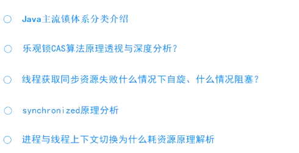

synchronized 会自动释放锁，而 Lock 一定要求程序员手工释放，并且必须在 finally 从句中释放。

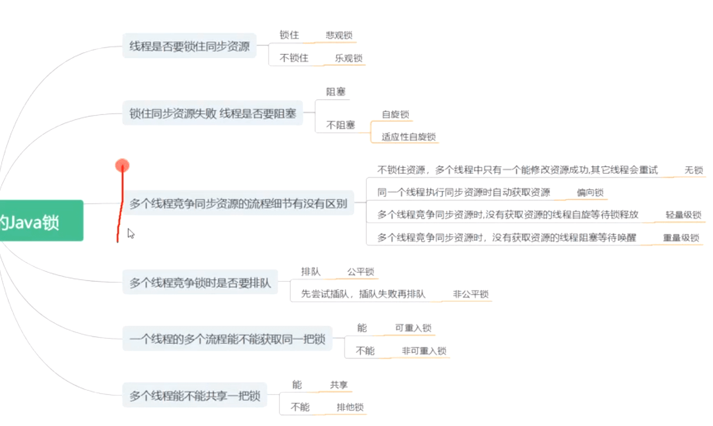

#### 1：乐观锁与悲观锁

悲观锁：认为自己在使用数据的时候一定会有别的线程来修改数据。

> Java 中，synchronized 关键字和 Lock 的实现类都是悲观锁。

> 悲观锁**适合写操作多**的场景，先加锁可以保证写操作时数据正确。

> 乐观锁**适合读操作多**的场景，不加锁的特点能够使其读操作的性能大幅提升。

乐观锁：自己在使用数据时不会有别的线程修改数据，所以不会添加锁，只是在更新数据的时候去判断之前有没有别的线程更新了这个数据。使用 CAS 算法

> CAS 算法（比较与交换），会导致 ABA 问题，可以加时间戳

#### 2：自旋锁 VS 适应性自旋锁

如果同步代码块的内容过于简单，线程挂起切换的时间比线程执行的时间还要长，就得不尝失，如果物理机器有多个处理器，能够让两个或以上的线程同时并行执行，我们就可以让后面那个请求锁的线程不放弃 CPU 的执行时间，看看持有锁的线程是否很快就会释放锁。

而为了让当前线程“稍等一下”，我们需让当前线程进行自旋，如果在自旋完成后前面锁定同步资源的线程已经释放了锁，那么当前线程就可以不必阻塞而是直接获取同步资源，从而避免切换线程的开销。这就是自旋锁。

如果锁被占用的时间很短，自旋等待的效果就会非常好。反之，如果锁被占用的时间很长，那么自旋的线程只会白浪费处理器资源。

如果自旋超过了限定次数（默认是 10 次，可以使用-XX:PreBlockSpin 来更改）没有成功获得锁，就应当挂起线程。

实现原理也是 CAS

自适应意味着自旋的时间（次数）不再固定，而是由前一次在同一个锁上的自旋时间及锁的拥有者的状态来决定。如果在同一个锁对象上，自旋等待刚刚成功获得过锁，并且持有锁的线程正在运行中，那么虚拟机就会认为这次自旋也是很有可能再次成功，进而它将允许自旋等待持续相对更长的时间。如果对于某个锁，自旋很少成功获得过，那在以后尝试获取这个锁时将可能省略掉自旋过程，直接阻塞线程，避免浪费处理器资源。

#### 3：无锁 VS 偏向锁 VS 轻量级锁 VS 重量级锁

**什么 Synchronized 能实现线程同步？**

在回答这个问题之前我们需要了解两个重要的概念：`“Java对象头”、“Monitor”`。

**Java 对象头**

synchronized 是悲观锁，在操作同步资源之前需要给同步资源先加锁，这把锁就是存在 Java 对象头里的，而 Java 对象头又是什么呢？

我们以 Hotspot 虚拟机为例，Hotspot 的对象头主要包括两部分数据：**Mark Word（标记字段）**、**Klass Pointer（类型指针）**。

`Mark Word`：默认存储对象的 HashCode，分代年龄和锁标志位信息。这些信息都是与对象自身定义无关的数据，所以 Mark Word 被设计成一个非固定的数据结构以便在极小的空间内存存储尽量多的数据。它会根据对象的状态复用自己的存储空间，也就是说在运行期间 Mark Word 里存储的数据会随着锁标志位的变化而变化。

`Klass Point`：对象指向它的类元数据的指针，虚拟机通过这个指针来确定这个对象是哪个类的实例。

**Monitor**

Monitor 可以理解为一个同步工具或一种同步机制，通常被描述为一个对象。每一个 Java 对象就有一把看不见的锁，称为内部锁或者 Monitor 锁。

Monitor 是线程私有的数据结构，每一个线程都有一个可用 monitor record 列表，同时还有一个全局的可用列表。每一个被锁住的对象都会和一个 monitor 关联，同时 monitor 中有一个 Owner 字段存放拥有该锁的线程的唯一标识，表示该锁被这个线程占用。

现在话题回到 synchronized，synchronized 通过 Monitor 来实现线程同步，Monitor 是依赖于底层的操作系统的 Mutex Lock（互斥锁）来实现的线程同步。

如同我们在自旋锁中提到的“阻塞或唤醒一个 Java 线程需要操作系统切换 CPU 状态来完成，这种状态转换需要耗费处理器时间。如果同步代码块中的内容过于简单，状态转换消耗的时间有可能比用户代码执行的时间还要长”。这种方式就是 synchronized 最初实现同步的方式，这就是 JDK 6 之前 synchronized 效率低的原因。这种依赖于操作系统 Mutex Lock 所实现的锁我们称之为“重量级锁”，JDK 6 中为了减少获得锁和释放锁带来的性能消耗，引入了“偏向锁”和“轻量级锁”。

所以目前锁一共有 4 种状态，级别从低到高依次是：无锁、偏向锁、轻量级锁和重量级锁。锁状态只能升级不能降级。


**无锁**

无锁没有对资源进行锁定，所有的线程都能访问并修改同一个资源，但同时只有一个线程能修改成功。

无锁的特点就是修改操作在循环内进行，线程会不断的尝试修改共享资源。如果没有冲突就修改成功并退出，否则就会继续循环尝试。如果有多个线程修改同一个值，必定会有一个线程能修改成功，而其他修改失败的线程会不断重试直到修改成功。上面我们介绍的 CAS 原理及应用即是无锁的实现。无锁无法全面代替有锁，但无锁在某些场合下的性能是非常高的。

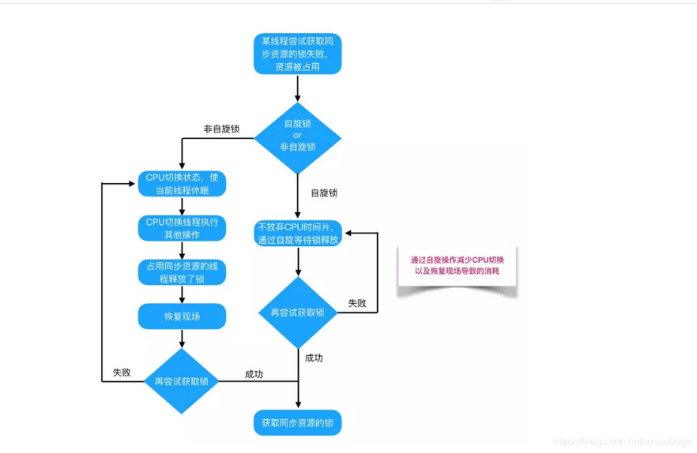

**偏向锁**

偏向锁是指一段同步代码一直被一个线程所访问，那么该线程会自动获取锁，降低获取锁的代价。

当一个线程访问同步代码块并获取锁时，会在 Mark Word 里存储锁偏向的线程 ID。在线程进入和退出同步块时不再通过 CAS 操作来加锁和解锁，而是检测 Mark Word 里是否存储着指向当前线程的偏向锁。引入偏向锁是为了在无多线程竞争的情况下尽量减少不必要的轻量级锁执行路径，因为轻量级锁的获取及释放依赖多次 CAS 原子指令，而偏向锁只需要在置换 ThreadID 的时候依赖一次 CAS 原子指令即可。

偏向锁只有遇到其他线程尝试竞争偏向锁时，持有偏向锁的线程才会释放锁，线程不会主动释放偏向锁。偏向锁的撤销，需要等待全局安全点（在这个时间点上没有字节码正在执行），它会首先暂停拥有偏向锁的线程，判断锁对象是否处于被锁定状态。撤销偏向锁后恢复到无锁（标志位为“01”）或轻量级锁（标志位为“00”）的状态。

偏向锁在 JDK 6 及以后的 JVM 里是默认启用的。可以通过 JVM 参数关闭偏向锁：-XX:-UseBiasedLocking=false，关闭之后程序默认会进入轻量级锁状态。

**轻量级锁**

是指当锁是偏向锁的时候，被另外的线程所访问，偏向锁就会升级为轻量级锁，其他线程会通过自旋的形式尝试获取锁，不会阻塞，从而提高性能。

在代码进入同步块的时候，如果同步对象锁状态为无锁状态（锁标志位为“01”状态，是否为偏向锁为“0”），虚拟机首先将在当前线程的栈帧中建立一个名为锁记录（Lock Record）的空间，用于存储锁对象目前的 Mark Word 的拷贝，然后拷贝对象头中的 Mark Word 复制到锁记录中。

拷贝成功后，虚拟机将使用 CAS 操作尝试将对象的 Mark Word 更新为指向 Lock Record 的指针，并将 Lock Record 里的 owner 指针指向对象的 Mark Word。

如果这个更新动作成功了，那么这个线程就拥有了该对象的锁，并且对象 Mark Word 的锁标志位设置为“00”，表示此对象处于轻量级锁定状态。

如果轻量级锁的更新操作失败了，虚拟机首先会检查对象的 Mark Word 是否指向当前线程的栈帧，如果是就说明当前线程已经拥有了这个对象的锁，那就可以直接进入同步块继续执行，否则说明多个线程竞争锁。

若当前只有一个等待线程，则该线程通过自旋进行等待。但是当自旋超过一定的次数，或者一个线程在持有锁，一个在自旋，又有第三个来访时，轻量级锁升级为重量级锁。

**重量级锁**

升级为重量级锁时，锁标志的状态值变为“10”，此时 MarkWord 中存储的是指向重量级锁的指针，此时等待锁的线程都会进入阻塞状态。


偏向锁通过对比 Mark Word 解决加锁问题，避免执行 CAS 操作。而轻量级锁是通过用 CAS 操作和自旋来解决加锁问题，避免线程阻塞和唤醒而影响性能。重量级锁是将除了拥有锁的线程以外的线程都阻塞。

#### 4：公平锁与非公平锁

公平锁是指多个线程按照申请锁的顺序来获取锁，线程直接进入队列中排队，队列中的第一个线程才能获得锁。

非公平锁是多个线程加锁时直接尝试获取锁，获取不到才会到等待队列的队尾等待。但如果此时锁刚好可用，那么这个线程可以无需阻塞直接获取到锁，所以非公平锁有可能出现后申请锁的线程先获取锁的场景。有可能造成优先级翻转，或者饥饿的线程（也就是某个线程一直得不到锁）

并发包中 ReentrantLock 的创建可以指定析构函数的 boolean 类型来得到公平锁或者非公平锁，默认是非公平锁

```
/**
* 创建一个可重入锁，true 表示公平锁，false 表示非公平锁。默认非公平锁
*/
Lock lock = new ReentrantLock(true);
```

因为非公平锁的优点在于吞吐量比公平锁大，`对于synchronized而言，也是一种非公平锁`

#### 5：可重入锁和非可重入锁

可重入锁又名递归锁，是指在同一个线程在外层方法获取锁的时候，再进入该线程的内层方法会自动获取锁（前提锁对象得是同一个对象或者 class），不会因为之前已经获取过还没释放而阻塞。

Java 中 ReentrantLock 和 synchronized 都是可重入锁，可重入锁的一个优点是可一定程度**避免死锁。**

为什么可重入锁就可以在嵌套调用时可以自动获得锁呢？

有多个人在排队打水，此时管理员允许锁和同一个人的多个水桶绑定。这个人用多个水桶打水时，第一个水桶和锁绑定并打完水之后，第二个水桶也可以直接和锁绑定并开始打水，所有的水桶都打完水之后打水人才会将锁还给管理员。这个人的所有打水流程都能够成功执行，后续等待的人也能够打到水。这就是可重入锁。

源码分析重入锁 ReentrantLock 以及非可重入锁 NonReentrantLock

ReentrantLock 和 NonReentrantLock 都继承父类 AQS，其父类 AQS 中维护了一个同步状态 status 来计数重入次数，status 初始值为 0。

当线程尝试获取锁时，可重入锁先尝试获取并更新 status 值，如果 status == 0 表示没有其他线程在执行同步代码，则把 status 置为 1，当前线程开始执行。如果 status != 0，则判断当前线程是否是获取到这个锁的线程，如果是的话执行 status+1，且当前线程可以再次获取锁。而非可重入锁是直接去获取并尝试更新当前 status 的值，如果 status != 0 的话会导致其获取锁失败，当前线程阻塞。

释放锁时，可重入锁同样先获取当前 status 的值，在当前线程是持有锁的线程的前提下。如果 status-1 == 0，则表示当前线程所有重复获取锁的操作都已经执行完毕，然后该线程才会真正释放锁。而非可重入锁则是在确定当前线程是持有锁的线程之后，直接将 status 置为 0，将锁释放。

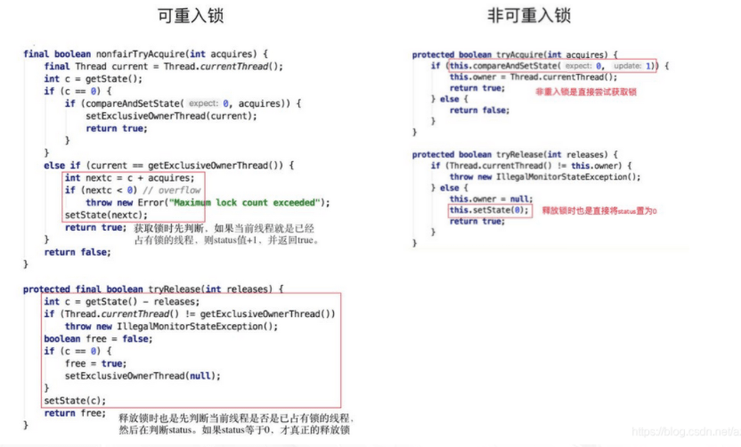

#### 6：独享锁（排它锁）与共享锁

独占锁：指该锁一次只能被一个线程所持有。对 ReentrantLock 和 Synchronized 而言都是独占锁

共享锁：指该锁可以被多个线程锁持有

对 ReentrantReadWriteLock 读锁是共享，写锁是独占。写的时候只能一个人写，但是读的时候，可以多个人同时读

读-读：能共存

读-写：不能共存

写-写：不能共存

当我们在进行写操作的时候，就需要转换成写锁

```
// 创建一个写锁
rwLock.writeLock().lock();

// 写锁 释放
rwLock.writeLock().unlock();
```

当们在进行读操作的时候，在转换成读锁

```
// 创建一个读锁
rwLock.readLock().lock();

// 读锁 释放
rwLock.readLock().unlock();
```

这里的读锁和写锁的区别在于，写锁一次只能一个线程进入，执行写操作，而读锁是多个线程能够同时进入，进行读取的操作

### AQS

AbstractQueuedSynchronizer 抽象队列同步器

ReentrantLock、CountDownLatch、CycleBarrier 底层都是通过 AQS 来实现的

**AQS 的核心思想**：如果被请求的共享资源空闲，则将当前请求的资源的线程设置为有效的工作线程，并将共享资源设置为锁定状态，如果被请求的共享资源被占用，那么就需要一套线程阻塞等待以及唤醒时锁分配的机制，这个 AQS 是用 CLH 队列锁实现的，即将暂时获取不到的锁的线程加入到队列中。CLH 队列是一个虚拟的双向队列，虚拟的双向队列即不存在队列的实例，仅存在节点之间的关联关系。

AQS 是将每一条请求共享资源的线程封装成一个 CLH 锁队列的一个结点（Node），来实现锁的分配

AQS 就是基于 CLH 队列，用 volatile 修饰共享变量 state，线程通过 CAS 去改变状态符，成功则获取锁成功，失败则进入等待队列，同时等待被唤醒。

注意：AQS 是自旋锁，在等待唤醒的时候，经常会使用自旋的方式，不断的尝试获取锁，直到被其它线程获取成功

实现了 AQS 的锁有：自旋锁、互斥锁、读写锁、条件变量、信号量、栅栏都是 AQS 的衍生物，具体实现如下

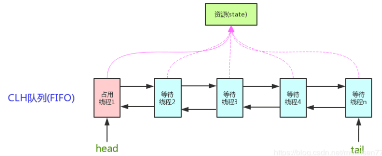

如上图所示，AQS 维护了一个 volatile int state 的变量 和 一个 FIFO 线程等待队列，多线程争用资源被阻塞的时候，就会进入这个队列中。state 就是共享资源，其访问方式有如下三种：

- getState()
- setState()
- compareAndSetState()

AQS 定义了两种资源共享方式

- Exclusive：独占，只有一个线程能执行，如 ReentrantLock
- Share：共享，多个线程可以同时执行，如 Semaphore、CountDownLatch、ReadWriteLock、CycleBarrier

不同的自定义同步器争用共享资源的方式也不同

ReentrantLock

以 ReentrantLock（可重入独占式锁）为例，state 初始化为 0，表示未锁定状态，A 线程 lock()时，会调用 tryAcquire()独占锁，并将 state + 1，之后其它线程在想通过 tryAcquire 的时候就会失败，知道 A 线程 unlock() 到 state = 0 为止，其它线程才有机会获取到该锁。A 释放锁之前，自己也是可以重复获取此锁（state 累加），这就是可重入的概念。

> 注意：获取多少次锁就需要释放多少次锁，保证 state 是能够回到 0

CountDownLatch

以 CountDownLatch 为例，任务分 N 个子线程执行，state 就初始化为 N，N 个线程并行执行，每个线程执行完之后 countDown() 一次，state 就会 CAS 减 1，当 N 子线程全部执行完毕，state = 0,hui unpark() 主调动线程，主调用线程就会从 await()函数返回，继续之后的动作。

一般来说，自定义同步器要么独占方式，要么共享方式，他们也需要实现 tryAcquire 和 tryRelease、 tryAcquireShared 和 tryReleaseShared 中的一种即可。但 AQS 也支持自定义同步器实现独占和共享两种方式，比如 ReentrantLockReadWriteLock。

- acquire() 和 acquireShared() 两种方式下，线程在等待队列中都是忽略中断的
- acquireInterruptibly() 和 acquireSharedInterruptibly() 是支持响应中断的

## 5.6：线程协作

当多个线程可以一起工作去解决某个问题时，如果某些部分必须在其它部分之前完成，那么就需要对线程进行协调。

### join()

在线程中调用另一个线程的 join() 方法，会将当前线程挂起，而不是忙等待，直到目标线程结束。最后能够保证 a 线程的输出先于 b 线程的输出。

### wait() notify() notifyAll()

调用 wait() 使得线程等待某个条件满足，线程在等待时会被挂起，当其他线程的运行使得这个条件满足时，其它线程会调用 notify() 或者 notifyAll() 来唤醒挂起的线程。

它们都属于 Object 的一部分，而不属于 Thread。

只能用在同步方法或者同步控制块中使用，否则会在运行时抛出 IllegalMonitorStateException。

使用 wait() 挂起期间，线程会释放锁。这是因为，如果没有释放锁，那么其它线程就无法进入对象的同步方法或者同步控制块中，那么就无法执行 notify() 或者 notifyAll() 来唤醒挂起的线程，造成死锁。

**wait() 和 sleep() 的区别**

- wait() 是 Object 的方法，而 sleep() 是 Thread 的静态方法；
- wait() 会释放锁，sleep() 不会。

### await() signal() signalAll()

java.util.concurrent 类库中提供了 Condition 类来实现线程之间的协调，可以在 Condition 上调用 await() 方法使线程等待，其它线程调用 signal() 或 signalAll() 方法唤醒等待的线程。

相比于 wait() 这种等待方式，await() 可以指定等待的条件，因此更加灵活。

## 5.7：concurrent 并发包

JUC 包增加了并发编程中常用的工具类，用于定义类似于线程的自定义子 系统，包括线程池、异步 IO 和轻量级任务框架。提供可调的、灵活的线程池。还提供了设计用于多线程上下文中的 Collection 实现等。

#### synchronized

JDK 早期，synchronized 叫做重量级锁， 因为申请锁资源必须通过 kernel, 系统调用

synchronized：保证在同一时刻，只有一个线程可以执行某个方法或某个代码块

同时 synchronized 可以保证一个线程的变化可见（可见性），即可以代替 volatile。

可以修饰代码块，方法，静态方法，类

锁升级的过程：

无锁 - 偏向锁 - 轻量级锁 （自旋锁，自适应自旋）- 重量级锁

#### volatile

Volatile 是 Java 虚拟机提供的`轻量级`的同步机制（三大特性）

- 保证可见性
- 不保证原子性
- 禁止指令重排

**实现机制**：相比于没加 volatile 关键字，汇编代码会加入一个 lock 前缀指令，相当于一个**内存屏障**（禁止处理器指令重排，而 vloatile 是禁止编译器重排序）。此时

（1）会将当前处理器缓存行的数据立即写会系统主存

（2）这个写回内存的操作会引起在其他 cpu 里缓存了该内存地址的数据无效（MES 协议）

线程 2 将 initFlag 的值 store 到主内存时要通过总线，**cpu 总线嗅探机制**监听到 initFlag 值被修改，线程 1 的 initFlag 失效，线程 1 需要重新 read initFlag 的值。

如果大量使用 volatile，由于 Volatile 的 MESI 缓存一致性协议，需要不断的从主内存嗅探和 cas 不断循环，无效交互会导致总线带宽达到峰值。**造成总线风暴**。

Q：**synchronized 和 volatile 的区别是什么？**

- volatile 是变量修饰符；synchronized 是修饰类、方法、代码段。

- volatile 仅能实现变量的修改可见性，不能保证原子性；而 synchronized 则可以保证变量的修改可见性和原子性。

- volatile 不会造成线程的阻塞；synchronized 可能会造成线程的阻塞。

**Q：synchronized 和 lock 有什么区别？**

- synchronized 属于 JVM 层面的，Lock 是 API 层面的
- synchronized 不需要手动释放锁，Lock 需要主动释放，否则可能出现死锁
- synchronized 不可中断，除非抛出异常或则正常运行完成，ReetrantLock 可以中断，可以设置超时方法。

### 原子类

对于 Java 中的运算操作，例如自增或自减，若没有进行额外的同步操作，在多线程环境下就是线程不安全的。num++解析为 num=num+1，明显，这个操作不具备原子性，多线程并发共享这个变量时必然会出现问题。就算加上 volatile 也不能保证其原子性。只有将其声明为原子类

其底层是使用的 CAS 算法，Unsafe

原子类一览：将普通变量升级为原子变量，主要是 AtomicIntegerFieldUpdater<T>，在高并发情况下，LongAdder(累加器)比 AtomicLong 原子操作效率更高，LongAdder 累加器是 java8 新加入的

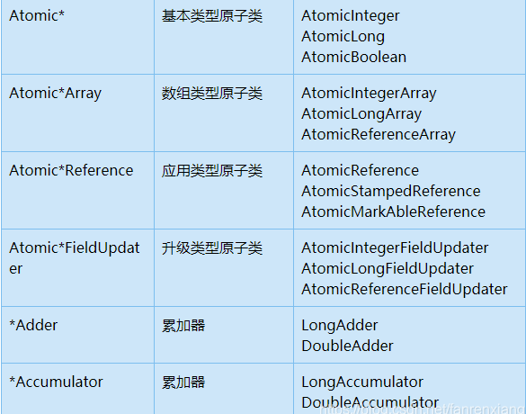

2：原子变量与 CAS 算法

标量原子变量类 AtomicInteger，AtomicLong 和 AtomicBoolean 类分别支持对原始数据类型 int，long 和 boolean 的操作。当引用变量需要以原子方式更新时，AtomicReference 类用于处理引用数据类型。

原子数组类 有三个类称为 AtomicIntegerArray，AtomicLongArray 和 AtomicReferenceArray，它们表示一个 int，long 和引用类型的数组，其元素可以进行原子性更新。

### CAS

CAS（比较交换）是一种无锁非阻塞的算法实现

CAS 会导致 ABA 问题，线程 1 准备用 CAS 将变量的值由 A 替换为 B，在此之前，线程 2 将变量的值由 A 替换为 C，又由 C 替换为 A，然后线程 1 执行 CAS 时发现变量的值仍然为 A，所以 CAS 成功。但实际上这时的现场已经和最初不同了，尽管 CAS 成功，但可能存在潜藏的问题。

解决办法（版本号 AtomicStampedReference），基础类型简单值不需要版本号

unsafe 类是 CAS 的核心类，Java 无法直接访问底层操作系统，而是通过本地 native 方法来访问，尽管如此，JVM 还是开了一个后门：Unsafe 它提供了硬件级别的原子操作。在底层调用汇编指令`cmpxchg`指令，这是一条汇编指令，所以 CPU 一次通过，是原子操作。

3：ConcurrentHashMap

见前

4：CountDownLatch（闭锁）

一个同步辅助类，在完成一组正在其他线程中执行的操作之前，它允许一个或多个线程一直等待。

**CountDownLatch 最重要的方法是 countDown()——倒数 和 await()，前者主要是倒数一次，后者是等待倒数到 0，如果没有到达 0，就只有阻塞等待了。**

5：Lock 同步锁

6：Condition 控制线程通信

7：**ReadWriteLock 读写锁**

8：**线程 8 锁**

**AbstractQueuedSynchronizer (AQS)**

提供了一个基于 FIFO 队列

**6.1 ConcurrentHashMap**

**6.2 ReentrantLock**

**6.3 Condition**

**6.4 CopyOnWriteArrayList**

CopyOnWriteArrayList 是一个线程安全、并且在读操作时无锁的 ArrayList

**6.5 CopyOnWriteArraySet**

CopyOnWriteArraySet 基于 CopyOnWriteArrayList 实现，其唯一的不同是在 add 时调用的是 CopyOnWriteArrayList 的 addIfAbsent 方法。保证了无重复元素，但在 add 时每次都要进行数组的遍历，因此性能会略低于上个。

**6.6 ArrayBlockingQueue**

**6.7 ThreadPoolExecutor**

### ReentrantLock

ReenTrantLock 的实现是一种自旋锁，通过循环调用 CAS 操作来实现加锁。它的性能比较好也是因为避免了使线程进入内核态的阻塞状态。**想尽办法避免线程进入内核的阻塞状态是我们去分析和理解锁设计的关键钥匙。**

与 synchronized 的区别？

都是可重入锁，阻塞的，

synchronized 是 java 关键字，是 JVM 层面的，而 ReentrantLock 是 API 层面的。

ReenTrantLock 可以指定是公平锁还是非公平锁。而 synchronized 只能是非公平锁。

ReenTrantLock 提供了一个 Condition（条件）类，用来实现分组唤醒需要唤醒的线程们，而不是像 synchronized 要么随机唤醒一个线程要么唤醒全部线程。

ReenTrantLock 提供了一种能够中断等待锁的线程的机制，通过 lock.lockInterruptibly()来实现这个机制。

ReentantLock 相比于 Synchronized 可以更方便的获取锁，可以操作读写锁，可以唤醒指定线程等等，

### 1，CountDownLatch

让一些线程阻塞直到另一些线程完成一系列操作才被唤醒

CountDownLatch 主要有两个方法，当一个或多个线程调用 await 方法时，调用线程就会被阻塞。其它线程调用 CountDown 方法会将计数器减 1（调用 CountDown 方法的线程不会被阻塞），当计数器的值变成零时，因调用 await 方法被阻塞的线程会被唤醒，继续执行

### 2，CyclicBarrier

与 CountDownLatch 相反，这个类是为了帮助猿友们方便的实现多个线程一起启动的场景，就像赛跑一样，只要大家都准备好了，那就开始一起冲。也就是做加法。

CyclicBarrier 的字面意思就是可循环（cyclic）使用的屏障（Barrier）。它要求做的事情是，让一组线程到达一个屏障（也可以叫同步点）时被阻塞，直到最后一个线程到达屏障时，屏障才会开门，所有被屏障拦截的线程才会继续干活，线程进入屏障通过 CyclicBarrier 的 await 方法。都是通过维护计数器来实现的。线程执行 await() 方法之后计数器会减 1，

### 3，Semaphore 信号量

信号量主要用于两个目的

- 一个是用于共享资源的互斥使用
- 另一个用于并发线程数或者任务数量控制

### 4，Exchanger

这个类是为了帮助猿友们方便的实现两个线程交换数据的场景，

### 5：FutureTask

在介绍 Callable 时我们知道它可以有返回值，返回值通过 Future\<V\> 进行封装。FutureTask 实现了 RunnableFuture 接口，该接口继承自 Runnable 和 Future\<V\> 接口，这使得 FutureTask 既可以当做一个任务执行，也可以有返回值。

Future：未来会产生的结果，异步执行。

future.get();还是阻塞的，虽然那时异步的，但是这还是阻塞，根本没啥用。

谷歌的 guava 类库使用监听者模式，监听一个装饰者的线程池，于是 JDK 抄了一个 CompleteListener

### 6：BlockingQueue

java.util.concurrent.BlockingQueue 接口有以下阻塞队列的实现：

- **FIFO 队列** ：LinkedBlockingQueue、ArrayBlockingQueue（固定长度）
- **优先级队列** ：PriorityBlockingQueue
- DelayQueue：使用优先级队列实现的延迟无界阻塞队列
- SynchronousQueue：不存储元素的阻塞队列，也即单个元素的队列
  - 生产一个，消费一个，不存储元素，不消费不生产
- LinkedTransferQueue：由链表结构组成的无界阻塞队列
- LinkedBlockingDeque：由链表结构组成的双向阻塞队列

提供了阻塞的 take() 和 put() 方法：如果队列为空 take() 将阻塞，直到队列中有内容；如果队列为满 put() 将阻塞，直到队列有空闲位置

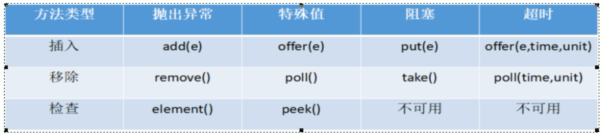

如果提交任务是，线程池队列已满，这时会发生什么？

1、如果使用的是无界队列 LinkedBlockingQueue，也就是无界队列的话，没关系，继续添加任务到阻塞队列中等待执行，因为 LinkedBlockingQueue 可以近乎认为是一个无穷大的队列，可以无限存放任务

2、如果使用的是有界队列比如 ArrayBlockingQueue，任务首先会被添加到 ArrayBlockingQueue 中，ArrayBlockingQueue 满了，会根据 maximumPoolSize 的值增加线程数量，如果增加了线程数量还是处理不过来，ArrayBlockingQueue 继续满，那么则会使用拒绝策略，RejectedExecutionHandler 处理满了的任务，默认是 AbortPolicy

### 7：ForkJoin

主要用于并行计算中，和 MapReduce 原理类似，都是把大的计算任务拆分成多个小任务并行计算。

# 六：IO 与 NIO

## 1：File 类

`java.io.File` 类是文件和目录路径名的抽象表示，主要用于文件和目录的创建、查找和删除等操作。

构造

- `public File(String pathname) ` ：通过将给定的**路径名字符串**转换为抽象路径名来创建新的 File 实例。
- `public File(String parent, String child) ` ：从**父路径名字符串和子路径名字符串**创建新的 File 实例。
- `public File(File parent, String child)` ：从**父抽象路径名和子路径名字符串**创建新的 File 实例。

获取

- `public String getAbsolutePath() ` ：返回此 File 的绝对路径名字符串。
- `public String getPath()` ：将此 File 转换为路径名字符串。
- `public String getName()` ：返回由此 File 表示的文件或目录的名称。
- `public long length()` ：返回由此 File 表示的文件的长度。

判断

- `public boolean exists()` ：此 File 表示的文件或目录是否实际存在。
- `public boolean isDirectory()` ：此 File 表示的是否为目录。
- `public boolean isFile()` ：此 File 表示的是否为文件。

创建删除功能的方法

- `public boolean createNewFile()` ：当且仅当具有该名称的文件尚不存在时，创建一个新的空文件。
- `public boolean delete()` ：删除由此 File 表示的文件或目录。
- `public boolean mkdir()` ：创建由此 File 表示的目录。
- `public boolean mkdirs()` ：创建由此 File 表示的目录，包括任何必需但不存在的父目录。
- public Boolean renameTo(File dest)把文件 重命名为指定的路

## 2：IO 流原理及流的分类

按操作数据单位不同分为：字节流（8bit），字符流（16bit）

按数据流的流向不同分为：输入流，输出流

按流的角色不同分为：节点流（直接从数据源或目的地读写数据），处理流（连接在已存在的流（节点流或处理流）之上，通过对数据的处理为程序提供更为强大的读写功能）


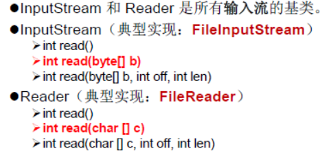

#### 字节流：

字节（Byte）：八位 0-255

一切皆字节

1：字节输出流 OutputStream

public void close() ：关闭此输出流并释放与此流相关联的任何系统资源。

public void flush() ：刷新此输出流并强制任何缓冲的输出字节被写出。

public void write(byte[] b) ：将 b.length 字节从指定的字节数组写入此输出流。

public void write(byte[] b, int off, int len) ：从指定的字节数组写入
len 字节，从偏移量 off 开始输出到此输出流。

public abstract void write(int b) ：将指定的字节输出流。

文件输出流 FileOutputStream

public FileOutputStream(File file) ：创建文件输出流以写入由指定的
File 对象表示的文件。 public FileOutputStream(String name) ：
创建文件输出流以指定的名称写入文件。

public FileOutputStream(File file, boolean append) ：
创建文件输出流以写入由指定的 File 对象表示的文件。

public FileOutputStream(String name, boolean append) ：
创建文件输出流以指定的名称写入文件。

#### 字符流

字符：字的符号

①ASCII 码中，一个英文字母（不分大小写）占一个字节的空间，一个中文汉字占两个字节的空间。一个二进制数字序列，在计算机中作为一个数字单元，一般为 8 位二进制数，换算为十进制。最小值 0，最大值 255。

②UTF-8 编码中，一个英文字符等于一个字节，一个中文（含繁体）等于三个字节。

③Unicode 编码中，一个英文等于两个字节，一个中文（含繁体）等于两个字节。

符号：英文标点占一个字节，中文标点占两个字节。举例：英文句号“.”占 1 个字节的大小，中文句号“。”占 2 个字节的大小。

④UTF-16 编码中，一个英文字母字符或一个汉字字符存储都需要 2 个字节（Unicode 扩展区的一些汉字存储需要 4 个字节）。

⑤UTF-32 编码中，世界上任何字符的存储都需要 4 个字节。

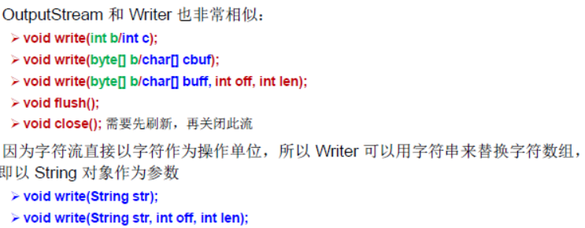

## 3：节点流（文件流）

读取文件

1. 建立一个流对象，将已存在的文件加载进流

FileReader = new new new FileReader(new File(“Test.txt”));

2. 创建一个临时存放数据的组。

 char[] ch = new char[1024];

3. 调用流对象的读取方法将中数据入到组。

fr.read (ch );

4. 关闭资源。

 fr.close();

写入文件

1：创建流对象，建立数据存放文件

FileWriter fw = new FileWriter(new File(“Test.txt”));

2：调用流对象的写入方法，将数据写入流

Fw.write(“adasdnjakndj”);

3:关闭流资源，并将六种的数据清空到文件中

Fw.close（）；

## 4：缓冲流

为了提高数据读写速度，提供了带缓冲功能的流类，在使用这些流类时，会创建一个内部缓冲区数据，默认 8192 字节（8Kb）的缓冲区

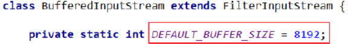

缓冲流要套接在相应的节点流之上，


当读取数据时，数据按块读入缓冲区，其后的读操作则直接访问缓冲区

当使用 BufferedInputStream 读取字节文件时，BufferedInputStream 会一次性从文件中读取 8192 个(8Kb)，存在缓冲区中，直到缓冲区装满了，才重新从文件中读取下一个 8192 个字节数组。

向流中写入字节时，不会直接写到文件，先写到缓冲区中直到缓冲区写满，BufferedOutputStream 才会把缓冲区中的数据一次性写到文件里。使用方法 flush()可以强制将缓冲区的内容全部写入输出流

关闭流的顺序和打开流的顺序相反。只要关闭最外层流即可，关闭最外层流也会相应关闭内层节点流

flush()方法的使用：手动将 buffer 中内容写入文件

如果是带缓冲区的流对象的 close()方法，不但会关闭流，还会在关闭流之前刷新缓冲区，关闭后不能再写出

## 5：转换流

提供字节流和字符流之间的转换


InputStreamReader：字节输入流按指定字符集转换为字符的输入流

OutputStreamWriter：将字符的输出流按指定字符集转换成字节的输出流

## 6：标准输入输出流

System.in 和 System.out 分别代表了系统标准的输入和输出设备

System.in 的类型是 InputStream

System.out 的类型是 PrintStream，其是 OutputStream 的子类 FilterOutputStream 的子类

## 7：打印流

将基本数据类型的数据格式转换为字符串输出

打印流：**PrintStream**和**PrintWriter**

PrintStream 和 PrintWriter 的输出不会抛出 IOException 异常

## 8：数据流

方便操作 Java 语言的基本数据类型和 String 的数据，使用数据流，用于读取和写出基本数据类型，String 类的数据

DataInputStream 和 DataOutputStream，分别套接在 InputStream 和 OutputStream 子类的流上。

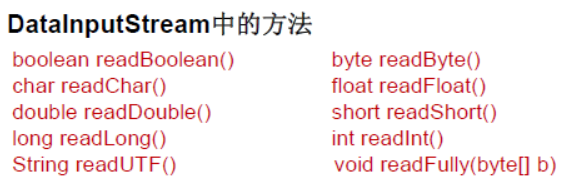

## 9：对象流

ObjectInputStream 和 OjbectOutputSteam

用于存储和读取基本数据类型数据或对象的处理流。它的强大之处就是可以把 Java 中的对象写入到数据源中，也能把对象从数据源中还原回来。

 序列化：用 ObjectOutputStream 类保存基本类型数据或对象的机制

 反序列化：用 ObjectInputStream 类读取基本类型数据或对象的机制

ObjectOutputStream 和 ObjectInputStream 不能序列化 static 和 transient 修饰的成员变量

## 10：随机存取文件流

RandomAccessFile 类

RandomAccessFile
声明在 java.io 包下，但直接继承于 java.lang.Object 类。并且它实现了 DataInput、DataOutput 这两个接口，也就意味着这个类既可以读也可以写。

RandomAccessFile 类支持“随机访问”
的方式，程序可以直接跳到文件的任意地方来读、写文件

 支持只访问文件的部分内容

 可以向已存在的文件后追加内容

RandomAccessFile
对象包含一个记录指针，用以标示当前读写处的位置。RandomAccessFile 类对象可以自由移动记录指针：

long getFilePointer()：获取文件记录指针的当前位置

void seek(long pos)：将文件记录指针定位到 pos 位置

## 11：BIO

Block IO：jdk 最早抽象出的 IO 体系，jdk1.0 的 io 体系是阻塞的。

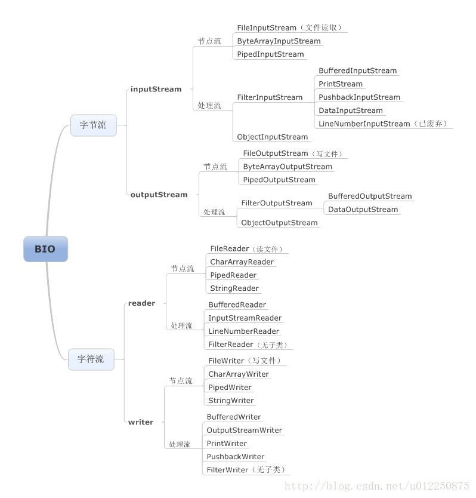

## 11：NIO

Java NIO (New IO，Non-Blocking IO)是从 Java 1.4 版本开始引入的一套新的 IO API，可以替代标准的 Java IO API。NIO 与原来的 IO 有同样的作用和目的，但是使用的方式完全不同，NIO 支持面向缓冲区的(IO 是面向流的)、基于通道的 IO 操作。NIO 将以更加高效的方式进行文件的读写操作。

Java API 中提供了两套 NIO，一套是针对标准输入输出 NIO，另一套就是网络编程 NIO。

\|-----java.nio.channels.Channel

\|-----FileChannel:处理本地文件

\|-----SocketChannel：TCP 网络编程的客户端的 Channel

\|-----ServerSocketChannel:TCP 网络编程的服务器端的 Channel

\|-----DatagramChannel：UDP 网络编程中发送端和接收端的 Channel

Path、Paths 和 Files 核心 API

早期的 Java 只提供了一个 File 类来访问文件系统，但 File 类的功能比较有限，所提供的方法性能也不高。而且，大多数方法在出错时仅返回失败，并不会提供异常信息。

NIO.2 为了弥补这种不足，引入了 Path 接口，代表一个平台无关的平台路径，描述了目录结构中文件的位置。Path 可以看成是 File 类的升级版本，实际引用的资源也可以不存在。

在以前 IO 操作都是这样写的:

```java
import java.io.File;
File file = new File("index.html");
```

但在 Java7 中，我们可以这样写：

```java
import java.nio.file.Path;

import java.nio.file.Paths;

Path path = Paths.get("index.html");
```

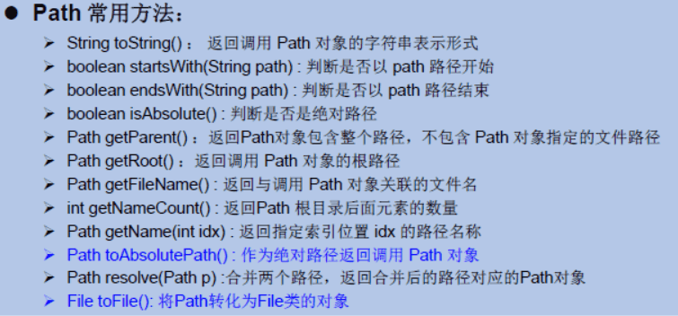

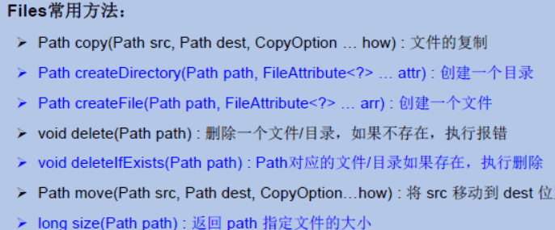

流的一层层封装，装饰者模式

区别：IO 是面向流的，NIO 是面向缓冲区的

三大核心部分：Channel(通道)，Buffer(缓冲区), Selector。

传统 IO 基于字节流和字符流进行操作，而 NIO 基于 Channel 和 Buffer(缓冲区)进行操作，数据总是从通道读取到缓冲区中，或者从缓冲区写入到通道中。Selector(选择区)用于监听多个通道的事件（比如：连接打开，数据到达）。因此，单个线程可以监听多个数据通道。

### 1：Channel

与 BIO 中的 stream 差不多，只不过 stream 是单向的，而通道 channel 是双向的，其主要实现有：

FileChannel

DatagramChannel

SocketChannel

ServerSocketChannel

### 2：Buffer

### 3：selector

4：鲁班教学

服务器端：

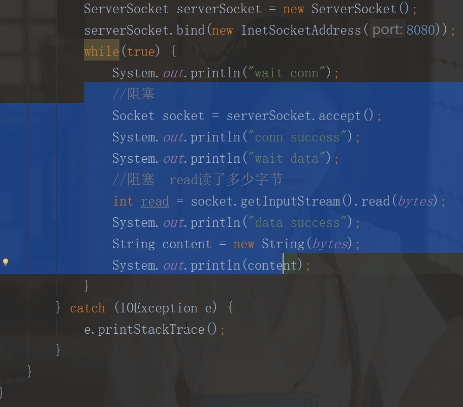

客户端：

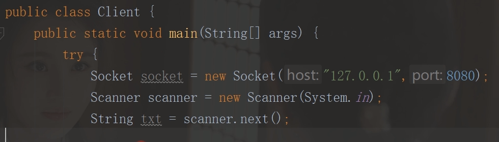

BIO 的特点，阻塞

在不考虑多线程情况下，BIO 无法处理并发

当一个阻塞时，其他客户端无法再连接到服务器了

可以开线程，每个添加一个线程，但是每来一个线程添加一个线程，耗费大，就像淘宝双 11，但是有很多连接是不买东西的，qq 很多连接不发消息，

设置不阻塞

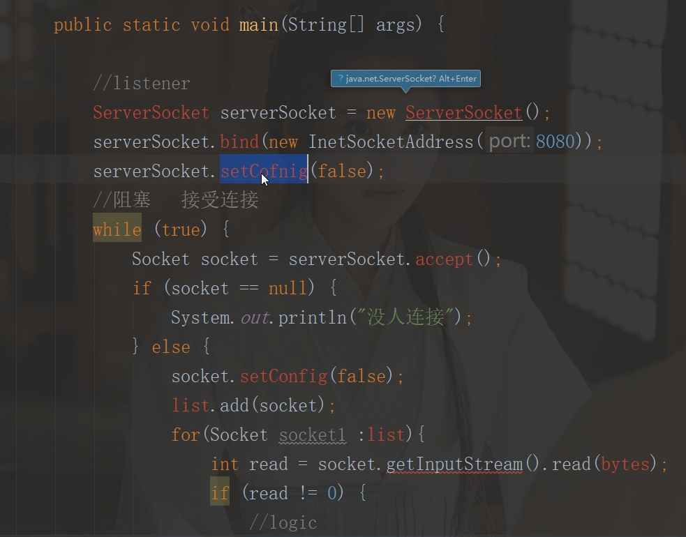

设置为非阻塞：如果没人连接，打印，看已经连接的有没有发送

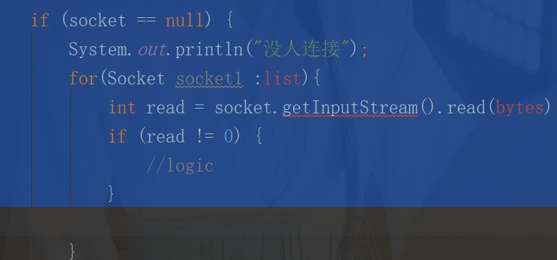

如果有人连接，放入 list，遍历 list 看他有没有发送数据

NIO 设置非阻塞：

ServerSocket 变成 ServerSocketChannel

Socket 变成 SocketChannel

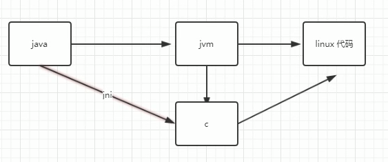

13：AIO

Asynchronous IO：异步的，也称 nio2

## 12：BIO，NIO 与 AIO

1：Java 对 BIO、NIO、AIO 的支持：

Java BIO (blocking I/O)：
同步并阻塞，服务器实现模式为一个连接一个线程，即客户端有连接请求时服务器端就需要启动一个线程进行处理，如果这个连接不做任何事情会造成不必要的线程开销，当然可以通过线程池机制改善。

Java NIO (non-blocking I/O)：
同步非阻塞，服务器实现模式为一个请求一个线程，即客户端发送的连接请求都会注册到多路复用器上，多路复用器轮询到连接有 I/O 请求时才启动一个线程进行处理。

Java AIO(NIO.2) (Asynchronous I/O) ：
异步非阻塞，服务器实现模式为一个有效请求一个线程，客户端的 I/O 请求都是由 OS 先完成了再通知服务器应用去启动线程进行处理，

2：BIO、NIO、AIO 适用场景分析:

BIO 方式适用于连接数目比较小且固定的架构，这种方式对服务器资源要求比较高，并发局限于应用中，JDK1.4 以前的唯一选择，但程序直观简单易理解。

NIO 方式适用于连接数目多且连接比较短（轻操作）的架构，比如聊天服务器，并发局限于应用中，编程比较复杂，JDK1.4 开始支持。

AIO 方式使用于连接数目多且连接比较长（重操作）的架构，比如相册服务器，充分调用 OS 参与并发操作，编程比较复杂，JDK7 开始支持。

BIO：磁盘-\>内核空间缓冲区-\>用户空间缓冲区

NIO：磁盘-\>用户空间缓冲区

IO 是面向流的，NIO 是面向缓冲区的

# 七：网络编程

## 1：TCP 通信

### Socket 类

该类实现客户端套接字，套接字指的是两台设备之间通讯的端点。

构造

`public Socket(String host, int port)` :创建套接字对象并将其连接到指定主机上的指定端口号。如果指定的 host 是 null ，则相当于指定地址为回送地址。

方法

- `public InputStream getInputStream()` ： 返回此套接字的输入流。
  - 如果此 Scoket 具有相关联的通道，则生成的 InputStream 的所有操作也关联该通道。
  - 关闭生成的 InputStream 也将关闭相关的 Socket。
- `public OutputStream getOutputStream()` ： 返回此套接字的输出流。
  - 如果此 Scoket 具有相关联的通道，则生成的 OutputStream 的所有操作也关联该通道。
  - 关闭生成的 OutputStream 也将关闭相关的 Socket。
- `public void close()` ：关闭此套接字。
  - 一旦一个 socket 被关闭，它不可再使用。
  - 关闭此 socket 也将关闭相关的 InputStream 和 OutputStream 。
- `public void shutdownOutput()` ： 禁用此套接字的输出流。
  - 任何先前写出的数据将被发送，随后终止输出流。

步骤：

- 创建 Socket：根据指定服务端的 IP 地址或端口号构造 Socket 类对象。若服务器端 响应，则建立客户端到服务器的通信线路。若连接失败，会出现异常。
- 打开连接到 Socket 的输入/出流： 使用 getInputStream()方法获得输入流，使用 getOutputStream()方法获得输出流，进行数据传输
- 按照一定的协议对 Socket 进行读/写操作：通过输入流读取服务器放入线路的信息 （但不能读取自己放入线路的信息），通过输出流将信息写入线程。
- 关闭 Socket：断开客户端到服务器的连接，释放线路

Linux 的步骤：

第一步：调用 socket()函数创建一个用于通信的套接字。

第二步：通过设置套接字地址结构，说明客户端与之通信的服务器的 IP 地址和端口号。

第三步：调用 connect()函数来建立与服务器的连接。

第四步：调用读写函数发送或者接收数据。

第五步：终止连接。

### ServerSocker 类

这个类实现了服务器套接字，该对象等待通过网络的请求。

构造

`public ServerSocket(int port)` ：使用该构造方法在创建 ServerSocket 对象时，就可以将其绑定到一个指定的端口号上，参数 port 就是端口号。

方法

`public Socket accept()` ：侦听并接受连接，返回一个新的 Socket 对象，用于和客户端实现通信。该方法会一直阻塞直到建立连接。

步骤：

- 调用 ServerSocket(int port) ：创建一个服务器端套接字，并绑定到指定端口 上。用于监听客户端的请求。
- 调用 accept()：监听连接请求，如果客户端请求连接，则接受连接，返回通信 套接字对象。
- 调用 该 Socket 类对象的 getOutputStream() 和 getInputStream ()：获取输出 流和输入流，开始网络数据的发送和接收。
- 关闭 ServerSocket 和 Socket 对象：客户端访问结束，关闭通信套接字。

linux 的步骤：

步骤：

第一步：调用 socket()函数创建一个用于通信的套接字。

第二步：给已经创建的套接字绑定一个端口号，这一般通过设置网络套接口地址和调用 bind()函数来实现。

第三步：调用 listen()函数使套接字成为一个监听套接字。

第四步：调用 accept()函数来接受客户端的连接，这是就可以和客户端通信了。

第五步：处理客户端的连接请求。

第六步：终止连接

## 2：UDP 通信

类 DatagramSocket 和 DatagramPacket 实现了基于 UDP 协议网络程序。

流 程：

- DatagramSocket 与 DatagramPacket 2.
- 建立发送端，接收端 3.
- 建立数据包 4.
- 调用 Socket 的发送、接收方法 5.
- 关闭 Socket

发送端与接收端是两个独立的运行程序

## 3：URL 编程

针对 HTTP 协议的 URLConnection 类

提供了最高级网络应用。URL 的网络资源的位置来同一表示 Internet 上各种网络资源。通过 URL 对象可以创建当前应用程序和 URL 表示的网络资源之 间的连接，这样当前程序就可以读取网络资源数据，或者把自己的数据传送到网络上去。

# 八：JDBC

# 九：特性

## 1：反射

**就是在运行时才知道要操作的类是什么，并且可以在运行时获取类的完整构造，并调用对应的方法。**

加载完类之后，在堆内存的方法区中就产生了一个 Class 类型的对象（一个 类只有一个 Class 对象），这个对象就包含了完整的类的结构信息。我们可 以通过这个对象看到类的结构。这个对象就像一面镜子，透过这个镜子看 到类的结构，所以，我们形象的称之为：反射。

### 基本反射技术：

**根据一个字符串得到一个类**

getClass 方法

```java
 String name = "Huanglinqing";
 Class c1 = name.getClass();
 System.out.println(c1.getName());
//输出
//java.lang.String
```

**Class.forName**

```java
   String name = "java.lang.String";
   Class c1 = null;
   try {
          c1 = Class.forName(name);
          System.out.println(c1.getName());
      } catch (ClassNotFoundException e) {
  }
//输出
//java.lang.String
```

从这个简单的例子可以看出，一般情况下我们使用反射获取一个对象的步骤：

- 获取类的 Class 对象实例

```
Class clz = Class.forName("com.zhenai.api.Apple");
```

- 根据 Class 对象实例获取 Constructor 对象

```
Constructor appleConstructor = clz.getConstructor();
```

- 使用 Constructor 对象的 newInstance 方法获取反射类对象

```
Object appleObj = appleConstructor.newInstance();
```

而如果要调用某一个方法，则需要经过下面的步骤：

- 获取方法的 Method 对象

```
Method setPriceMethod = clz.getMethod("setPrice", int.class);
```

- 利用 invoke 方法调用方法

```
setPriceMethod.invoke(appleObj, 14);
```

### 获取类的成员

当类中方法定义为私有的时候我们能调用？不能！当变量是私有的时候我们能获取吗？不能！但是反射可以。比如源码中有你需要用到的方法，但是那个方法是私有的，这个时候你就可以通过反射去执行这个私有方法，并且获取私有变量。

**获取类的构造函数**

### 反射 API

获取反射中的 Class 对象

在反射中，要获取一个类或调用一个类的方法，我们首先需要获取到该类的 Class 对象。

在 Java API 中，获取 Class 类对象有三种方法：

**第一种，使用 Class.forName 静态方法。**当你知道该类的全路径名时，你可以使用该方法获取 Class 类对象。

```
Class clz = Class.forName("java.lang.String");
```

**第二种，使用 .class 方法。**

这种方法只适合在编译前就知道操作的 Class。

```
Class clz = String.class;
```

**第三种，使用类对象的 getClass() 方法。**

```
String str = new String("Hello");
Class clz = str.getClass();
```

通过反射创建类对象

通过反射创建类对象主要有两种方式：通过 Class 对象的 newInstance() 方法、通过 Constructor 对象的 newInstance() 方法。

第一种：通过 Class 对象的 newInstance() 方法。

```
Class clz = Apple.class;
Apple apple = (Apple)clz.newInstance();
```

第二种：通过 Constructor 对象的 newInstance() 方法

```
Class clz = Apple.class;
Constructor constructor = clz.getConstructor();
Apple apple = (Apple)constructor.newInstance();
```

通过 Constructor 对象创建类对象可以选择特定构造方法，而通过 Class 对象则只能使用默认的无参数构造方法。下面的代码就调用了一个有参数的构造方法进行了类对象的初始化。

```
Class clz = Apple.class;
Constructor constructor = clz.getConstructor(String.class, int.class);
Apple apple = (Apple)constructor.newInstance("红富士", 15);
```

通过反射获取类属性、方法、构造器

我们通过 Class 对象的 getFields() 方法可以获取 Class 类的属性，但无法获取私有属性。

```
Class clz = Apple.class;
Field[] fields = clz.getFields();
for (Field field : fields) {
    System.out.println(field.getName());
}
```

输出结果是：

```
price
```

而如果使用 Class 对象的 getDeclaredFields() 方法则可以获取包括私有属性在内的所有属性：

```
Class clz = Apple.class;
Field[] fields = clz.getDeclaredFields();
for (Field field : fields) {
    System.out.println(field.getName());
}
```

输出结果是：

```
name
price
```

与获取类属性一样，当我们去获取类方法、类构造器时，如果要获取私有方法或私有构造器，则必须使用有 declared 关键字的方法。

### 源码解析

异常报错时的输出

可以看到异常堆栈指出了异常在 Method 的第 497 的 invoke 方法中，其实这里指的 invoke 方法就是我们反射调用方法中的 invoke。

```
Method method = clz.getMethod("setPrice", int.class);
method.invoke(object, 4);   //就是这里的invoke方法
```

允许程序在执行期借助于反射 API 取得任何类的内部信息，并能直接操作任意对象的内部属性及方法。

加载完类后，在堆内存的方法区就产生一个 Class 类型的对象（一个类只有一个 class 对象）


### 1：Class 实例

在 Object 类中定义了方法

Public final Class getClass（）

返回一个 Class 类，它是 Java 反射的源头

Class 的常用方法

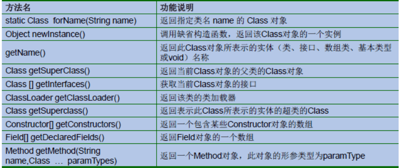

### 2：类的加载与 ClassLoader

当程序主动使用某个类时，如果该类还未被加载到内存中，则系统会通过如下三个步骤对该类进行初始化

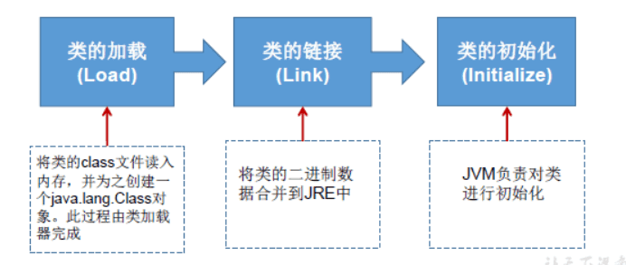

类加载器的作用：

类加载的作用：将 class 文件字节码内容加载到内存中，并将这些静态数据转换成方法区的运行时数据结构，然后在堆中生成一个代表这个类的 java.lang.Class 对象，作为方法区中类数据的访问入口。

类缓存：标准的 JavaSE 类加载器可以按要求查找类，但一旦某个类被加载到类加载器中，它将维持加载（缓存）一段时间。不过 JVM 垃圾回收机制可以回收这些 Class 对象。

在运行状态中，对于任意一个类，都能够知道这个类的所有属性和方法；对于任意一个对象，都能够调用它的任意一个方法和属性；这种动态获取的信息以及动态调用对象的方法的功能称为
Java 语言的反射机制。

ClassLoader

### 反射的应用：动态代理

反射机制：

1：代理模式的原理：使用一个代理将对象包装起来，然后用该代理对象取代原始对象，任何对原始对象的调用都要通过代理，代理对象决定是否以及何时将方法转移到原始对象

2：静态代理：

2.1 举例：实现 Runnable 接口的方法创建多线程

Class MyThread implements Runnable{};//想当与被代理类

Class Thread implements Runnable{}//相当于代理类

Main（）{

Mythread t = new MyThread();

Thread thread = new Thread(t);

Thread.start();//启动线程，调用线程的 run();

}

## 3：枚举

枚举类对象的属性不允许被改动，应该使用 private final 修饰，且应在构造器中为其赋值。私有化构造器，保证不能在类外部创建对象

方法：


## 4：注解 Annotation

在代码中嵌入注解，再通过反射拿到

### 类型

内置注解：JDK 内置的三个基本注解)

- @Override: 限定重写父类方法, 该注解只能用于方法

- @Deprecated: 用于表示所修饰的元素(类, 方法等)已过时。通常是因为所修饰的结构危险或存在更好的选择

- @SuppressWarnings: 抑制编译器警告

元注解：负责解释其他注解

- @Target：用于描述注解的使用范围，即：被描述的注解可以在什么地方使用

JDK1.8 以后参数 ElementType 多了两个枚举值为 TYPE_PARAMETER，USE

- @Retention：表示需要什么保存该注释信息，用于描述注解的生命周期
  - 级别范围：Source < Class < Runtime
- @Document：说明该注解被包含在 java doc 中
- @Inherited：说明子类可以集成父类中的注解

```java
/**
 * 定义一个注解
 */
@Target(value={ElementType.METHOD, ElementType.TYPE})  // target表示我们注解应用的范围，在方法上，和类上有效
@Retention(RetentionPolicy.RUNTIME)   // Retention：表示我们的注解在什么时候还有效，运行时候有效
@Documented   // 表示说我们的注解是否生成在java doc中
@Inherited   // 表示子类可以继承父类的注解
@interface MyAnnotation {
}
```

自定义注解：使用 `@interface`自定义注解

```java
/**
 * 定义一个注解
 */
@Target(value={ElementType.METHOD, ElementType.TYPE})  // target表示我们注解应用的范围，在方法上，和类上有效
@Retention(RetentionPolicy.RUNTIME)   // Retention：表示我们的注解在什么时候还有效，运行时候有效
@Documented   // 表示说我们的注解是否生成在java doc中
@Inherited   // 表示子类可以继承父类的注解
@interface MyAnnotation {

    // 注解的参数：参数类型 + 参数名()
    // 通过default来申明参数的默认值
    String name() default "";

    int age() default 0;

    // 如果默认值为-1，代表不存在
    int id() default -1;

    String[] schools();
}
```

## 5：泛型

1.5 以后

把集合中的内容限定为一个特定的数据类型

**如果 Foo 是 Bar 的一个子类型(子类或者子接口)，而 G 是某种**

**泛型声明，那么 G\<Foo\>是 G\<Bar\>的子类型并不成立!!**

### 泛型通配符

当使用泛型类或者接口时，传递的数据中，泛型类型不确定，可以通过通配符<?>表示。但是一旦使用泛型的通配符后，只能使用 Object 类中的共性方法，集合中元素自身方法无法使用。

### 受限泛型

之前设置泛型的时候，实际上是可以任意设置的，只要是类就可以设置。但是在 JAVA 的泛型中可以指定一个泛型的**上限**和**下限**。

**泛型的上限**：

- **格式**： `类型名称 <? extends 类 > 对象名称`
- **意义**： `只能接收该类型及其子类`

**泛型的下限**：

- **格式**： `类型名称 <? super 类 > 对象名称`
- **意义**： `只能接收该类型及其父类型`

```java
// 泛型的上限：此时的泛型?，必须是Number类型或者Number类型的子类
public static void getElement1(Collection<? extends Number> coll){}
// 泛型的下限：此时的泛型?，必须是Number类型或者Number类型的父类
public static void getElement2(Collection<? super Number> coll){}
```

### 自定义泛型

泛型方法的格式：

[访问权限] <泛型> 返回类型 方法名([泛型标识 参数名称]) 抛出的异常

1.使用类型通配符：？ 比如：List ，Map List 是 List、List 等各种泛型 List 的父类。

2.读取 List 的对象 list 中的元素时，永远是安全的，因为不管 list 的真实类型 是什么，它包含的都是 Object。

3.写入 list 中的元素时，不行。因为我们不知道 c 的元素类型，我们不能向其中 添加对象。 唯一的例外是 null，它是所有类型的成员

# Java8

## 1：Lambda 表达式

Lambda 表达式的标准格式为：

(参数类型 参数名称) ‐\> { 代码语句 }

格式说明：

小括号内的语法与传统方法参数列表一致：无参数则留空；多个参数则用逗号分隔。对应于抽象方法的参数

\-\> 是新引入的语法格式，代表指向动作。

大括号内的语法与传统方法体要求基本一致。相当于对抽象方法的实现，函数式接口，只有一个抽象方法。

### 1.1：Lambda 语法糖

匿名函数，由编译器推断并帮你

解决了什么？？

例一：

```java
TreeSet<Integer> set = new TreeSet<>(new Comparator<Integer>() {
    @Override
    public int compare(Integer o1, Integer o2) {
        return Integer.compare(o1,o2);
    }
});
```

去掉多余的一模一样的架子

```java
 TreeSet<Integer> set = new TreeSet<>((x,y)->Integer.compare(x,y));
```

例二：自定义

### 1.2：六大语法

->lambda 操作符，左侧是 lambda 表达式的参数列表，右侧是所需执行的功能，依赖于函数式接口，lambda 表达式即对接口的实现

函数式接口：

使用注解@FunctionalInterface，该接口只有一个方法

**语法 1：无参无返回值**

```java
		//语法一：无参无返回值
		Runnable runnable = new Runnable() {
			@Override
			public void run() {
				System.out.println("输出某些东西");
			}
		};
		//简化实现
		Runnable runnable1 = ()->System.out.println("输出某些东西");
```

注意：匿名内部类使用外部的变量必须为 final，无法改变，即使没有声明，也是 final 的

**语法二：有一个参数，无返回值**

```java
//语法二：有一个参数，无返回值
		Consumer<String> com = new Consumer<String>() {
			@Override
			public void accept(String s) {
				System.out.println(s);
			}
		};
		//简化实现
		//如果只有一个参数，(x)也可以直接写成x
		Consumer<String> com1 = (x)->{System.out.println(x);};
		com1.accept("有一个参数，无返回值,输出参数");

```

**语法三：多个参数，有返回值，多条执行语句**

```java
//语法三：多个参数，有返回值，多条执行语句
		Comparator<Integer> com2 = (x,y)->{
			System.out.println("执行某些操作");
			return Integer.compare(x,y);
		};
		//如果只有一条语句，return 和大括号都可以省略
		Comparator<Integer> com3 = (x,y)->Integer.compare(x,y);
		//语法六：参数指定类型
		//语法三依然可以执行，是因为JVM的上下文推断
		Comparator<Integer> com4 = (Integer x ,Integer y)->Integer.compare(x,y);
```

### 1.3：四大内置函数


### 1.4：方法引用和构造器引用

若 lambda 体中的内容由方法已经实现了，我们可以使用方法引用

语法一

对象::实例方法名

抽象方法的参数类型与参数引用的参数类型一致

```java
//以前
Employee emp = new Employee();
Supplier<String> sup = ()->emp.getName();
String str = sup.get();//供给型接口的get（）方法
System.out.println(str);

//现在:由于对象emp有实现
Supplier<Integer> sup2 = emp::getAge;
```

语法二

类：：静态方法名

```java
Comparator<Integer> com = (x,y)->Integer.compare(x,y);

Comparator<Integer> com = Integer::compare;
```

语法三

类：：实例方法名

当抽象方法第一个参数为实例方法的调用者，第二个参数为实例方法的参数

```java
//以前
BiPredicate<String,String> bp = (x,y)->x.equals(y);

//now
BigPrediacate<String,String> bp = String::equals;
```

构造器引用

需要调用的构造器参数列表与函数式的构造列表保持一致。

ClassName：：new

```java
//供给型
Supplier<Employee> sup = ()->new Employee();
//构造器引用方式,自动匹配无参构造器
Supplier<Employee> sup = Employee::new;
Employee emp = sup.get();
```

法二

```java
//函数形
Function<Integer,Employee> fun = (x)->new Employee(x);
//构造器引用，自动匹配有参构造器
Function<Integer,Employee> fun = Employee::new;
Employee emp = sup.apply(101);
```

数组引用

Type[]::new

```java
//函数型
Function<Integer,String[]> fun = (x)->new String[x];
String[] str = fun.apply(10);
System.out.println(str.length);

//数组引用
Function<Integer,String[]> fun = String[]::new;
String[] str = fun.apply(20);
System.out.println(str.length);
```

**lambda 表达式与方法引用的取舍？**

优先使用 lambdas 表达式而不是匿名类

优先使用方法引用而不是 lambdas

lambdas 表达式能做到方法引用做不到的？？

lambdas 表达式可以捕获外围词法的变量，但是方法引用不行，方法引用只能将其传进去。

方法引用更短更清楚的时候使用方法引用，，否则使用 lambdas 表示

## 2：Stream

字母哥的博客：你可能真的不懂 java

Stream 是 Java8 中处理集合的关键抽象概念，他可以指定你希望对集合进行的操作，可以执行非常复杂的查找，过滤和映射数据等操作。


接口的抽象方法的形参表，返回类型需要和调用的类方法的形参表，返回类型保持一致


### 2.1：获取流

1：可以通过 Collection 系列集合提供的 stream()或者 parallelStream()

```java
List<String> list = new ArrayList<>();
Stream<String> stream1 = list.stream();
```

2：通过 Arrays 中静态方法 stream()获取数组流

```java
Employee[] emps = new Employee[10];
Stream<Employee> stream2 = Arrays.stream(emps);
```

3：通过 Stream 类的静态方法 of()

```java
Stream<String> stream = Stream.of("aa","bb","cc");
```

4：创建无限流

```java
//迭代
Stream<Integer> stream = Stream.iterate(0,(x)->x+2);
Stream.limit(10).forEach(System.out::println);
//生成
Stream.generate(()->Math.random())

```

### 2.2：中间操作

中间操作不会执行任何操作其实，只有终止操作时才会一次性执行全部内容，成为惰性求值

#### 2.2.1：筛选与切片

Filter 与谓词逻辑

谓词逻辑：比如 sql 语句中 WHERE 和 AND 限定了主语 employee 是什么，那么 WHERE 和 AND 语句所代表的逻辑就是谓词逻辑。

```java
//创建Employee类，并创建10个对象
List<Employee> employees = Arrays.asList(e1,e2,e3,e4,e5,e6,e7,e8);
List<Employee> employeeList = employees.stream()
    									.filter(e->e.getAge()>70 && e.getGender = 'M')
    									.collect(Collectors.toList());
```

limit(n);截断流，使元素不超过给定数量

```java
employee.stream()
    	.filter((e)->{
            System.out.println("!!");
            return e.getSalary()>5000;
        })
    	.limit(2)
    	.forEach(System.out::println);
//发现只执行两次，主要满足2个条件就就此截断
```

skip(n);跳过元素，返回一个扔掉前 n 个元素的流

distinct—筛选，通过流生成元素的 hashCode()和 equals()去除重复元素

#### 2.2.2：映射

map—接收 lambda，将元素转换成其他形式或提取信息，接收一个函数作为参数，该函数会被应用到每个元素上。

map 转换数据

```java
//类型转换
Stream.of("Monkey", "Lion", "Giraffe", "Lemur")
        .mapToInt(String::length)
        .forEach(System.out::println);
```

多步骤操作

```java
List<Employee> maped = employees.stream()
            .map(e -> {
                e.setAge(e.getAge() + 1);
                e.setGender(e.getGender().equals("M")?"male":"female");
                return e;
            }).collect(Collectors.toList());
//peek和map一样
List<Employee> maped = employees.stream()
    .peek(e -> {
        e.setAge(e.getAge() + 1);
        e.setGender(e.getGender().equals("M")?"male":"female");
    }).collect(Collectors.toList());
```

flatmap()处理多维数组

flatMap()接收一个函数作为参数，将流中的每个值都换成另一个流，然后把所有的流连接成一个流

```java
//取出每个字符
public static Stream<Character> filterCharacter(String str){
    List<Character> list = new ArrayList<>();
    for(Character ch:str.toCharArray()){
        list.add(ch);
    }
    return list.stream();
}
public static main(String[] args){
    Stream<Stream<Character>> stream = list.stream().map(this::filterCharacter);
    stream.forEach((sm)->{
        sm.forEach(System.out::println);
    });
}
```

使用 flatMap

```java
Stream<Character> sm = list.stream()   						.flatMap(this::filterCharacter);

```

#### 2.2.3：排序

sorted()——自然排序（Comparable）

sorted（Comparator com）——定制排序

```java
list.stream()
    .sorted()
    .forEach(System.out::println);

emp.stream()
    .sorted((e1,e2)->{
        if(e1.getAge().equals(e2.getAge())){
            return e1.getName().comparaTo(e2.getName());
        }else{
            return e1.getAge.compareTO(e2.getAge());
        }
    }).forEach(System.out::println);
```

#### Stream API 代替 for 循环

例：

```java
List<String> nameStrs = Arrays.asList("Monkey","Lion","Giraffe","Lemur");
List<String> list = nameStrs.stream()
    						.filter(s->s.startsWith("L"))//过滤以L开头的
    						.map(String::toUpperCase)//map即对每个数据进行处理：调用String类的toUpperCase方法
    						.sorted()//排序
    						.collect(toList());//转换为list

//数组转换成流
String[] nameStrs1 = {"Monkey","Lion","Giraffe","Lemur"};

Stream.of(nameStrs1).filter(s->s.startsWith("L")).map(String::toUpperCase);

//Set
Set<String> set = new HashSet<>(nameStrs);
set.stream().filter(……)

//文件
	Stream<String> stringStream = Files.lines(Paths.get("file.txt"));

```

遍历二维数组

```java
        Arrays.stream(result2).forEach(arr->{
            Arrays.stream(arr).filter(i->i!=0).forEach( i ->System.out.print(i));
            System.out.println();
        });
```

问题？？

对于如下两个 for 循环，怎么改造？效率低了吗？

```java
        for (int j = 0; j < n; j++) {
            result[j][0] = 1;
        }
        for (int i = 1; i < n; i++) {
            for (int j = 1; j < n; j++) {
                result[i][j] =  result[i-1][j-1] + result[i-1][j];
            }
        }
```

####

有状态操作

```java
//取前两个
List<String> limitN = Stream.of("Monkey", "Lion", "Giraffe", "Lemur")
        .limit(2)
        .collect(Collectors.toList());
//跳过前两个
List<String> skipN = Stream.of("Monkey", "Lion", "Giraffe", "Lemur")
        .skip(2)
        .collect(Collectors.toList());
//去重
List<String> uniqueAnimals = Stream.of("Monkey", "Lion", "Giraffe", "Lemur", "Lion")
        .distinct()
        .collect(Collectors.toList());
```

并行不要用有状态操作


#### 并行操作

```java
Stream.of("Monkey", "Lion", "Giraffe", "Lemur", "Lion")
        .parallel()
        .forEach(System.out::println);
```

### 2.3：终端操作

#### 2.3.1：查找与匹配

allMatch()——检查是否匹配所有元素，返回 boolean

```java
//是否所有元素的状态都是BUSY
boolean b = emplist.stream()
    .allMatch((e)->e.getStatus().equals(Status.BUSY));
```

anyMatch——检查是否至少匹配一个元素

```java
//是否存在状态为BUSY的元素
boolean b = emplist.stream()
    		.anyMatch((e)->e.getStatus().equals(Status.BUSY));
```

noneMatch——检查是否没有匹配所有元素

```java
//是否没有状态为BUSY的元素
boolean b = emplist.stream()
    		.noneMatch((e)->e.getStatus().equals(Status.BUSY));
```

findFirst——返回第一个元素

```java
//工资最高的
Optional<Employee> op = emplist.stream()
    	.sorted((e1,e2)->Double.compare(e1.getSalary(),e2.getSalary()))
    .findFirst();
```

findAny——返回当前流中任意元素

count——返回流中元素总个数

max——返回流中最大值

min——返回流中最小值

#### 2.3.2：归约

`Stream.reduce`可以将流中元素反复结合起来，得到一个值。

用来实现集合元素的归约。reduce 函数有三个参数：

- _Identity 标识_：一个元素，它是归约操作的初始值，如果流为空，则为默认结果。
- _Accumulator 累加器_：具有两个参数的函数：归约运算的部分结果和流的下一个元素。
- _Combiner 合并器（可选）_：当归约并行化时，或当累加器参数的类型与累加器实现的类型不匹配时，用于合并归约操作的部分结果的函数

Integer 类型归约

reduce 初始值为 0，累加器可以是[lambda](http://www.zimug.com/tag/lambda)表达式，也可以是方法引用。

```java
List<Integer> numbers = Arrays.asList(1, 2, 3, 4, 5, 6);
int result = numbers
        .stream()
        .reduce(0, (subtotal, element) -> subtotal + element);
System.out.println(result);  //21

int result = numbers
        .stream()
        .reduce(0, Integer::sum);
System.out.println(result); //21
```

String 类型归约

不仅可以归约 Integer 类型，只要累加器参数类型能够匹配，可以对任何类型的集合进行归约计算。

```java
List<String> letters = Arrays.asList("a", "b", "c", "d", "e");
String result = letters
        .stream()
        .reduce("", (partialString, element) -> partialString + element);
System.out.println(result);  //abcde

String result = letters
        .stream()
        .reduce("", String::concat);
System.out.println(result);  //ancde
```

对象归约

```java
List<Employee> employees = Arrays.asList(e1, e2, e3, e4, e5, e6, e7, e8, e9, e10);

Integer total = employees.stream().map(Employee::getAge).reduce(0,Integer::sum);
System.out.println(total); //346
```

#### 2.3.3：收集

调用完终端操作就不能再用了，流已经关闭了

collect——将流转换为其他形式，接收一个 Collector 接口的实现，用于给 Stream 中元素汇总的方法。

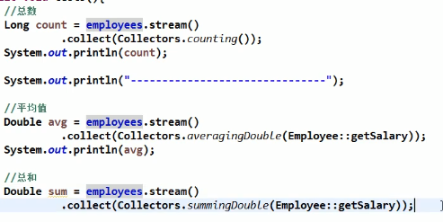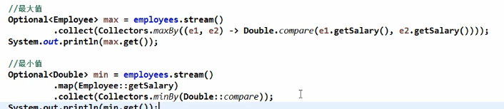

```java
//打印
Stream.of("Monkey", "Lion", "Giraffe", "Lemur", "Lion")
        .parallel()
        .forEach(System.out::println);
Stream.of("Monkey", "Lion", "Giraffe", "Lemur", "Lion")
        .parallel()
        .forEachOrdered(System.out::println);
//收集
.collect(Collectors.toSet());
.collect(Collectors.toList());
.collect(Collectors.toCollection(LinkedList::new));
.toArray(String[]::new);
.collect(Collectors.toMap(
       Function.identity(),   //元素输入就是输出，作为key
       s -> (int) s.chars().distinct().count()// 输入元素的不同的字母个数，作为value
));
// 最终toMap的结果是: {Monkey=6, Lion=4, Lemur=5, Giraffe=6}
.collect(Collectors.groupingBy(
       s -> s.charAt(0) ,  //根据元素首字母分组，相同的在一组
       // counting()        // 加上这一行代码可以实现分组统计
));

// 最终groupingByList内的元素: {G=[Giraffe], L=[Lion, Lemur, Lion], M=[Monkey]}
//如果加上counting() ，结果是:  {G=1, L=3, M=1}
boolean containsTwo = IntStream.of(1, 2, 3).anyMatch(i -> i == 2);
// 判断管道中是否包含2，结果是: true

long nrOfAnimals = Stream.of(
    "Monkey", "Lion", "Giraffe", "Lemur"
).count();
// 管道中元素数据总计结果nrOfAnimals: 4

int sum = IntStream.of(1, 2, 3).sum();
// 管道中元素数据累加结果sum: 6

OptionalDouble average = IntStream.of(1, 2, 3).average();
//管道中元素数据平均值average: OptionalDouble[2.0]

int max = IntStream.of(1, 2, 3).max().orElse(0);
//管道中元素数据最大值max: 3

IntSummaryStatistics statistics = IntStream.of(1, 2, 3).summaryStatistics();
// 全面的统计结果statistics: IntSummaryStatistics{count=3, sum=6, min=1, average=2.000000, max=3}
```

### 2.4：并行流

#### 对于 stream 性能方面

1：测试性能的方法

使用 junitperf

int 的是 for 循环效率更高，否则更高

函数式接口 Comparator

Stream 查找匹配规则

并行流

```java
Integer total2 = employees
        .parallelStream()
        .map(Employee::getAge)
        .reduce(0,Integer::sum,Integer::sum);  //注意这里reduce方法有三个参数

System.out.println(total); //346
```

## 3：空指针异常 optional

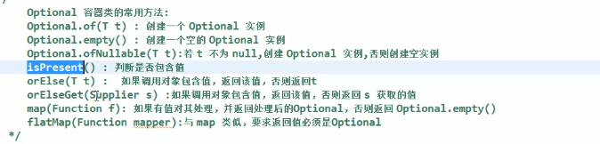

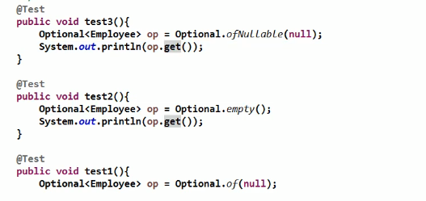

## 4：接口中的默认方法和静态方法

接口中以前只能有全局静态常量和抽象方法

现在可以拥有默认方法

```java
public interface MyFun{
    default String getName(){
        return "1234";
    }
}
```

这样就会出现冲突

接口默认方法的“类优先”原则，优先继承

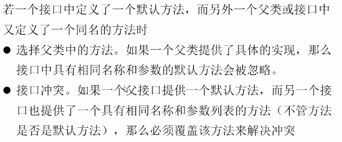

静态方法

```java
public interface MyFun{
    default String getName(){
        return "1234";
    }
    public static void show(){
        System.out.println("静态方法");
    }
}
```

## 5：全新日期与时间

不可变的，线程安全，都在 java.time 包下

距离 1970 年的毫秒数

5.1

日期：LocalDate : 时间：LocalTime :日期时间：LocalDateTime

三个类的方法大体一样，以最全的 LocalDateTime 为例

```java
//获取当前系统时间
LocalDateTime ldt = LocalDateTime.now();
System.out.println(ldt);
//输出：2020-12-02T09:11:37.247
```

构造时间

```java
LocalDateTime ldt = LocalDateTime.of(2020,12,01,13,22,33);
System.out.println(ldt);
//输出：2020-12-01T13:22:33
```

加时间，减时间

```java
// 在该日期时间基础上增加或减少一定时间，
// 参数1：时间量，可以是负数，参数2:时间单位
LocalDateTime plus = parse.plus(1L, ChronoUnit.HOURS); // 2019-10-17T17:54:50.941
// LocalDateTime plus(TemporalAmount amountToAdd)：在该时间基础上增加一定时间
LocalDateTime plus1 = parse.plus(Period.ofDays(1)); // 2019-10-18T16:54:50.941
LocalDateTime plus2 = parse.plusDays(1L); // 2019-10-18T16:54:50.941
		// LocalDateTime    plusDays(long days)：增加指定天数
        // LocalDateTime	plusHours(long hours)：增加指定小时数
        // LocalDateTime	plusMinutes(long minutes)：增加指定分钟数
        // LocalDateTime	plusMonths(long months)：增加指定月份数
        // LocalDateTime	plusNanos(long nanos)：增加指定毫秒数
        // LocalDateTime	plusSeconds(long seconds):增加指定秒数
        // LocalDateTime	plusWeeks(long weeks):增加指定周数
        // LocalDateTime	plusYears(long years):增加指定年数
```

//获取拆分

```java
ldt.getYear();
ldt.getMonthValue();
ldt.getDayOfMonth();
ldt.getHour();
ldt.getMinute();
ldt.getSencond();
```

5.2：Instant 时间戳

以 unix 元年：1970 年 1 月 1 日到某个时间之间的毫秒值

```java
Instant ins = Instant.now();//默认获取的不是系统时间，而是格林威治时区时间
System.out.println(ins);
//偏移量,偏移8个时区
OffsetDateTime odt = ins.atOffset(ZoneOffset.ofHours(8));
System.out.println(odt);
//输出：2020-12-01T13:22:33+8:00
//获取毫秒时间
System.out.println(ins.toEpochMilli());
```

## 6：重复注解和类型注解

## 3：HashMap 的实现

当碰撞达到一定的设置值（默认碰撞长度为 8，总长度大于 64）时，会将链表转换成红黑树

红黑树，除了插入其他操作都比链表快，扩容时元素位置变到

ConcurrentHashMap 同样也变了

以前使用锁分段机制，现在使用 CAS 算法

## 4：JVM 结构的变化

元空间——OOM 发生的几率就低了

# Java9

从此以后六个月迭代一次，小步快跑，快速迭代。

官方提供的新特性列表：

https://docs.oracle.com/javase/9/whatsnew/toc.htm\#JSNEW-GUID-C23AFD78-C777-460B-8ACE-58BE5EA681F6

或参考 OpenJDK

http://openjdk.java.net/projects/jdk9/

在线 OracleJDK9Documentation

https://docs.oracle.com/javase/9/

## 1：下载安装

与以前版本不冲突，安装 jdk 并安装 jre

配置环境变量

## 1：目录结构的改变

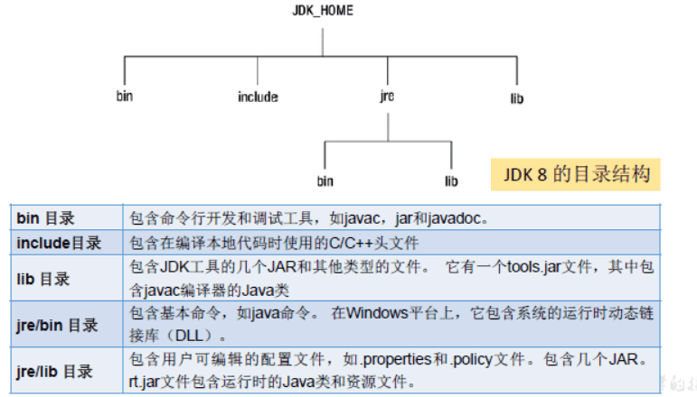

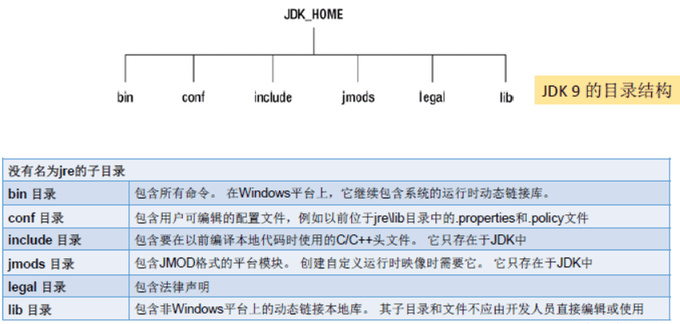

不包含 jre 目录了

## 2：模块系统

最大变化之一引入模块系统（Jigsaw 项目）—>

运行环境的碰撞与臃肿，需要加载 rt.jar

减少内存消耗

对外暴露

java9demo 模块

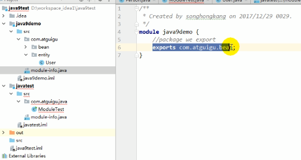

在引入模块

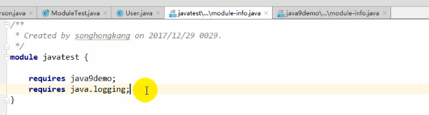

## 3：REPL 工具：jShell 命令


REPL（read-evaluate-print-loop）交互式编程环境

bin 目录下 jshell.exe

配好环境变量后

cmd 输入 jshell

输出：

定义变量

定义方法：

如果定义一个已经存在的方法则直接修改原本的方法

```jshell
/edit add
```

可以直接修改 add 方法

tab 键补全

从外部文件加载源代码

/open 文件路径

受检异常

编译前异常，比如 IOExcetption

jshell 直接隐藏处理了

## 4：多版本兼容 jar 包

向后兼容

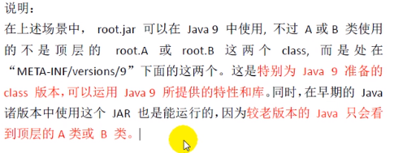

## 5：接口的私有方法

接口中放啊的访问权限修饰符可以声明为 private 的了

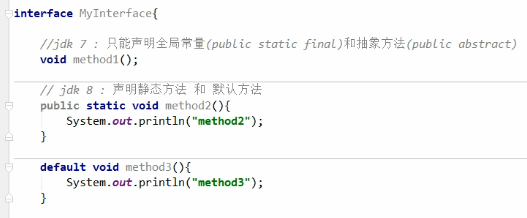

```java
//声明私有方法

```

抽象类和接口的异同

1：声明的方式

2：内部结构

3：共同点

不能实例化，以多态的方式使用

4：不同点

单继承，多实现

## 6：钻石操作符的使用升级

即泛型

```java
//JDK7
Set<String> set = new HashSet<String>();
//JDK8可以进行类型推断
Set<String> set = new HashSet<>();
//JDK9中能够与匿名实现类共同使用钻石操作符
Set<String> set = new HashSet<>(){};
```

匿名实现类与钻石操作符共同使用在 8 中会报错，Java9 可以

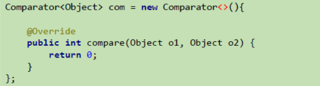

## 7：try 语句优化

流资源的关闭

JDK7 以前

```java
InputStreamReader reader = null;
try{
    reader = new InputStreamReader(System.in);
    //读取数据的过程
    reader.read();
}catch(IOException e){
    e.printStackTrace();
}finally{
    //资源的关闭操作
    if(reader!=null){
        try{
            reader.close();
        }catch(IOException e){
            e.printStackTrace();
        }
    }
}
```

JDK8 在 try 中声明的资源会自动关闭，不用显示处理资源的关闭，必须在资源对象实例化必须放在 try（）中

```java
try(InputStreamReader reader = new InputStreamReader(System.in)){
    reader.read();
}catch(IOException e){
    e.printStackTrace();
}
```

JDK9 支持在外部声明资源文件,此时的 reader 是 final 的，不可再被赋值。而且可以传多个，然后用；分开

```java
InputStreamReader reader = new InputStreamReader(System.in);
OutputStreamReader writer = new OutputStreamWriter(System.in);
try(reader;writer){
    reader.read();
}catch(IOException e){
    e.printStackTrace();
}
```

## 8：下划线

String \_是不允许的，是一个特殊的关键字

## API 层面

## 9：String

JDK8 以前 String 以前是 char[]存储的，每个是两个字节

JDK9 使用 byte[]数组，并使用 encodeFlag 标记编码类型，防止中文等两个字节存储

UTF-16 存储都是两个字节

StringBuilder 和 StringBuffer 也是做了同样的改变。

问题：String，StringBuilder 和 StringBuffer？

## 10：集合

创建只读集合，不可改变的集合

```java
//调用Collection中方法，将list变成只读的
List<String> newList = Collections.unmodifiablelist(list);
//遍历JDK8
newList.forEach(System.out::println);
```

//对只读 Map 的创建

```java
//匿名子类和泛型可以一起使用
Map<Object,Object> map = COllections.unmodifiableMap(new HashMap<>(){
    {
        put("1",1);
        put("2",2);
        put("3",3);
    }
})
 //遍历
map.forEach((k,v)->System.out.println(k + ":" + v));
```

//JDK9 中提供了更加方便的只读集合方法

```java
//创建只读list
List<Integer> list = List.of(1,2,3);
list.forEach(System.out::println);
//创建只读Set
Set<Integer> set = Set.of(2,3,4);
//创建只读Map法一
Map<String,Integer> map = Map.of("1",1,"2",2,"3",3);
//创建只读Map法二
Map<String,Integer> map = Map.ofEntries(Map.entry("1",1),Map.entry("2",2));
```

## 11：增强的 StreamAPI

JDK9 中针对 Stream 中添加了四个方法

1：takeWhile()：一直取直到满足条件就不取了，不同于 filter

```java
List<Integer> list = Arrays.asList(1,2,3,4,5,6,7,8);
Stream<Integer> stream = list.stream();
stream.takeWhile(x-x<5).forEach(System.out::println);
//此时输出为：1,2,3,4
```

2：dropWhile()：与 takeWhile 正好相反

```java
List<Integer> list = Arrays.asList(1,2,3,4,5,6,7,8);
Stream<Integer> stream = list.stream();
stream.dropWhile(x-x<5).forEach(System.out::println);
//此时输出为：5,6,7,8
```

3：ofNullable

Java8 中 Stream 不能完全为 null，否则会报空指针异常。而 Java9 中可以使用 ofNullable 方法创建一个单元素

```java
//Stream其中一种实例化方法of

Stream<Integer> stream = Stream.of(1,2,3，null);
//此时没有问题
stream.forEach(System.out::println);

//如果单元素且为null就会报空指针异常
Stream<Object> stream = Stream.of(null);

//JDK9中可以创建
Stream<String> stream = Stream.ofNullAble("Tom");
System.out.println(stream.count());//输出1
Stream<String> stream = Stream.ofNullAble(null);
System.out.println(stream.count());//输出0
```

4：iterator()的重载

Stream 的实例化方法：

通过集合的 stream()

通过数组工具类 Arrays

Stream 中静态方法 of

iterator()/gen

```java
//JDK8中
Stream.iterator(0,x->x+1).limit(10).forEach(System.out::println);
//输出0 1 2 3 4 5 6 7 8 9
//JDK9中对其进行重载，添加一个判定条件
Stream.iterate(0,x->x<10,x->x+1).forEach(System.out::println);
```

## 12：optional 的变化

可以转换成 stream

```java
Optional<List<String>> optional = Optional.ofNullable(list);

Stream<String> stream = optional.stream().flatMap(x->x.stream());
stream.forEach(System.out::println);
```

## 13：高分辨率图像 API

## 14：全新的 HTTP 客户端 API

2015 年推出 HTTP2

HTTP1.1 和 HTTP2 的主要区别在哪里？

区别在如何在客户端和服务器之间构件和传输数据

Http1 依赖于请求响应周期，Http2 允许服务器 push 数据，它可以发送比客户端请求更多的数据，这使得他可以优先处理并发送对于首先加载网页至关重要的数据

```java
//JDK9中可以使用HttpClient替换原有的HttpURLConnection
HttpClient client = HttpClient.newHttpClient();
HttpRequest req = HttpRequest.newBuilder(URL.create("http://www.baidu.com")).GET().build();
HttpResponse<String> response = null;
response = client.send(req,HttpResponse.BodyHandler.asString());
System.out.println(response.statusCode());
System.out.println(response.version.name());
System.out.println(response.body());
```

## 15：Deprecated 的 API

抛弃了几个不常用的 API，主要是 Applet API

## 16：智能 Java 编译工具

sjavac 慢慢代替 javac

## 17：统一的 JVM 日志系统

G1 作为了默认垃圾回收器

# Java10

## 1：局部变量类型推断

var ：JDK10 中提供的保留类型

只针对局部变量

var 是保留类型不是关键字，意味着我们还可以用 var 来定义变量名和方法名

```java
public static void main(String[] args){
    var i =10;
    var str = "abc";
    var list = new ArrayList<>();
    list.add("test");

    var set = new HashSet<>();

    var user = new User();
}
```

注意：不允许赋值为 null

```java
var aa = null;//错误
```

## 2：垃圾收集器的优化

Java9 的改变

新生代：ParNew

老年代：Paraller Old

JDK10：G1（Grabage -First）收集器：全收集器，既可以收集新生代又可以收集老年代。

分析工具

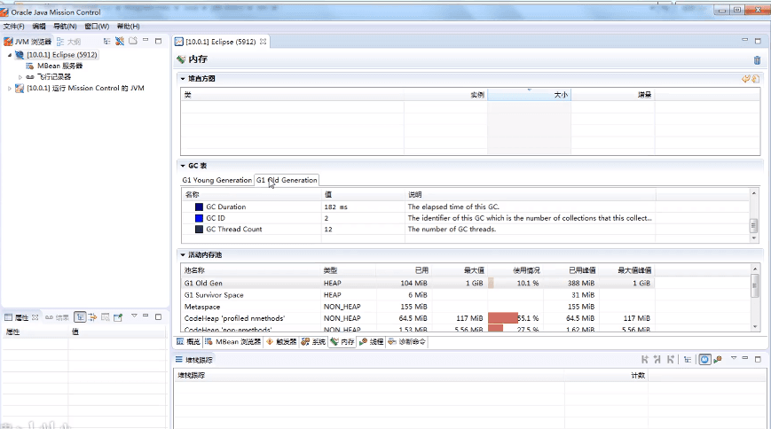

## 3：新增的 API 功能

### 3.1：copyOf()方法

在 List，Set 和 Map 下新增了 copyOf 方法

拷贝后的集合不可修改

且是根据其迭代顺序拷贝的

### 3.2：Java.io.ByteArrayOutStream::toString(Charset)

对 toString 进行重载，可以指定编码，默认使用 UTF-8

```java
String str = "中文测试";
//将str以GBK编码转换成Byte转换成流
ByteArrayInputStream bis = new ByteArrayInputStream(str.getByte("GBK"));

ByteArrayOutStream bos = new ByteArrayOutStream();

int c =0;
while((c=bis.read())!=-1){
    bos.write(c);
}
System.out.println(bos.toString());
System.out.println(bos.toString("GBK"));
```

### 3.3：PrintStream 和 PrintWrite 新增构造方法

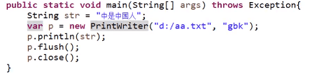

### 3.4：Reader::transferTo

### 3.5：Scanner 和 Formatter 新增构造方法

# Java11

长期支持的版本

## 1：新增字符串处理方法

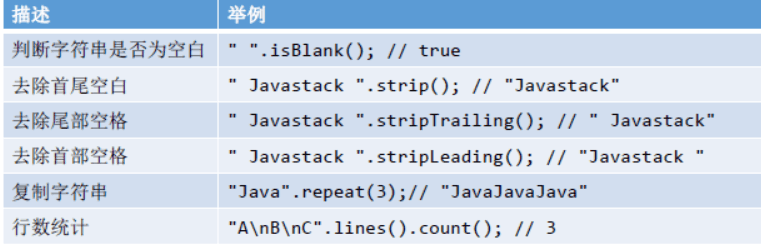

## 2：全新 HTTP 客户端 API

## 3：Epsilon 垃圾收集器

开发一个处理内存分配但不实现任何实际内存回收的机制的 GC

## 3：全新垃圾收集器 ZGC

可伸缩的，低延迟的！！初始只支持 64 位，支持 TB 级的，

热对象置于 DRAM

冷对象置于 NVMe 闪存

ZGC 是一个并发，基于 region，压缩型的垃圾收集器，只有 root 扫描阶段会 STW（所有线程暂停），因此 GC 停顿时间不会随着堆的增长和存活对象的增长而变长。

用法：-XX：+UnlockExperimentalVMOptions -XX:+UseZGC

在 Window 中暂时没有提供

由 oracle 开发，承诺在数 TB 的堆上具有非常低的暂停时间，多层堆（即热对象置于 DRAM 和冷对象置于 NVMe 闪存），压缩堆

SWT 阶段：应用程序线程被暂停，以便 gc 执行其工作。
当应用程序因为 GC 暂停时，这通常是由于 Stop The World 阶段。

ZGC 给 Hotspot Garbage Collectors 增加了两种新技术：着色指针和读屏障。

### 着色指针

着色指针是一种将信息存储在指针（或使用 Java 术语引用）中的技术。因为在 64 位平台上（ZGC 仅支持 64 位平台），指针可以处理更多的内存，因此可以使用一些位来存储状态。
ZGC 将限制最大支持 4Tb 堆（42-bits），那么会剩下 22 位可用，它目前使用了 4 位：
finalizable， remap， mark0 和 mark1。

着色指针的一个问题是，当您需要取消着色时，它需要额外的工作（因为需要屏蔽信息位）。

### 多重映射

### 读屏障

读屏障是每当应用程序线程从堆加载引用时运行的代码片段（即访问对象上的非原生字段 non-primitive
field）：

# Java12

2019 年 3 月 20 日

## 1：Switch 表达式

缺点：

忘了 break 都会执行，

在各个 case 中定义的局部变量名不可重复

新的 switch 表达式

可以返回值

```java
switch(fruit){
        //不再写break，直接跳
        case PEAR->System.out.println("1");
        //多个一样的可以放在一起
        case APPLE,GRAPE,MANGO->System.out.println("2");
        default->new IllegalStateException("No Such Fruit");
}
```

## 2：shenandoah GC 低停顿时间的 GC

省得我

与堆大小无关，吞吐量有限的原则

新生代内存空间较小，所以暂停的时间可以接受，但是一旦老年代出现 FullGC，线程暂停的时间就会更久

工作原理：

其内存结构与 G1 非常相似，都是将内存划分为类似棋盘的 region。整体流程与 G1 也是比较相似的，最大的区别在于实现了并发的 疏散(Evacuation) 环节，引入的 BrooksForwarding Pointer 技术使得 GC 在移动对象时，对象引用仍然可以访问。

Shenandoah GC 工作周期如下所示：

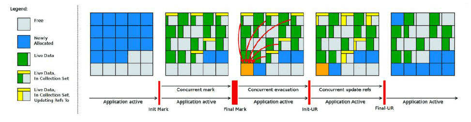

上图对应工作周期如下：

1. Init Mark 启动并发标记 阶段
2. 并发标记遍历堆阶段
3. 并发标记完成阶段
4. 并发整理回收无活动区域阶段
5. 并发 Evacuation 整理内存区域阶段
6. Init Update Refs 更新引用初始化 阶段
7. 并发更新引用阶段
8. Final Update Refs 完成引用更新阶段
9. 并发回收无引用区域阶段

推荐几个配置或调试 Shenandoah 的 JVM 参数:

```xml
-XX:+AlwaysPreTouch：使用所有可用的内存分页，减少系统运行停顿，为避免运行时性能损失。
-Xmx == -Xmsv：设置初始堆大小与最大值一致，可以减轻伸缩堆大小带来的压力，与 AlwaysPreTouch 参数配
合使用，在启动时提交所有内存，避免在最终使用中出现系统停顿。
-XX:+ UseTransparentHugePages：能够大大提高大堆的性能，同时建议在 Linux 上使用时将
/sys/kernel/mm/transparent_hugepage/enabled 和
/sys/kernel/mm/transparent_hugepage/defragv 设置为：madvise，同时与 AlwaysPreTouch 一起使
用时，init 和 shutdownv 速度会更快，因为它将使用更大的页面进行预处理。
-XX:+UseNUMA：虽然 Shenandoah 尚未明确支持 NUMA（Non-Uniform Memory Access），但最好启用此功
能以在多插槽主机上启用 NUMA 交错。与 AlwaysPreTouch 相结合，它提供了比默认配置更好的性能。
-XX:+DisableExplicitGC：忽略代码中的 System.gc() 调用。当用户在代码中调用 System.gc() 时会强制
Shenandoah 执行 STW Full GC ，应禁用它以防止执行此操作，另外还可以使用 -
XX:+ExplicitGCInvokesConcurrent，在 调用 System.gc() 时执行 CMS GC 而不是 Full GC，建议在有
System.gc() 调用的情况下使用。
不过目前 Shenandoah 垃圾回收器还被标记为实验项目，如果要使用Shenandoah GC需要编译时--with-jvmfeatures
选项带有shenandoahgc，然后启动时使用参数
-XX:+UnlockExperimentalVMOptions -XX:+UseShenandoahGC
```

## 3：常量 API

## 4：微基准测试套件

JMH，即 Java Microbenchmark Harness，是专门用于代码微基准测试的工具套件。何谓 Micro Benchmark 呢？简
单的来说就是基于方法层面的基准测试，精度可以达到微秒级。当你定位到热点方法，希望进一步优化方法性能的时
候，就可以使用 JMH 对优化的结果进行量化的分析。
JMH 比较典型的应用场景：
想准确的知道某个方法需要执行多长时间，以及执行时间和输入之间的相关性；
对比接口不同实现在给定条件下的吞吐量；
查看多少百分比的请求在多长时间内完成；

JMH 的使用
要使用 JMH，首先需要准备好 Maven 环境，JMH 的源代码以及官方提供的 Sample 就是使用 Maven 进行项目管理的，
github 上也有使用 gradle 的例子可自行搜索参考。使用 mvn 命令行创建一个 JMH 工程：
如果要在现有 Maven 项目中使用 JMH

```cmd
mvn archetype:generate \
        -DinteractiveMode=false \
        -DarchetypeGroupId=org.openjdk.jmh \
        -DarchetypeArtifactId=jmh-java-benchmark-archetype \
        -DgroupId=co.speedar.infra \
        -DartifactId=jmh-test \
        -Dversion=1.0
```

只需要把生成出来的两个依赖以及 shade 插件拷贝到项目的 pom 中即可：

## 5：只保留一个 AArch64 实现

Java 12 中将删除由 Oracle 提供的 arm64 端口相关的所有源码，即删除目录 open/src/hotspot/cpu/arm 中关于
64-bit 的这套实现，只保留其中有关 32-bit ARM 端口的实现，余下目录的 open/src/hotspot/cpu/aarch64 代码
部分就成了 AArch64 的默认实现。这将使开发贡献者将他们的精力集中在单个 64 位 ARM 实现上，并消除维护两套实现所需的重复工作。

## 6：默认生成类数据共享(CDS)归档文件

## 7：可中断的 G1 Mixed GC

G1 垃圾收集器设计的主要目标之一是满足用户设置的预期的 JVM 停顿时间

G1 收集器必须完成收集集合的所有区域中的所有活动对象之后才能停止；但是如果收集器选择过大
的 GC 回收集，此时的 STW 时间会过长超出目标 pause time。

将 GC 回收集拆分为必需和可选部分时，垃圾收集过程优先处理必需部分。同时，需要为可选 GC 回收集部分维
护一些其他数据，这会产生轻微的 CPU 开销，但小于 1 ％的变化，同时在 G1 回收器处理 GC 回收集期间，本
机内存使用率也可能会增加，使用上述情况只适用于包含可选 GC 回收部分的 GC 混合回收集合。
在 G1 垃圾回收器完成收集需要必需回收的部分之后，如果还有时间的话，便开始收集可选的部分。但是粗粒度
的处理，可选部分的处理粒度取决于剩余的时间，一次只能处理可选部分的一个子集区域。在完成可选收集部
分的收集后，G1 垃圾回收器可以根据剩余时间决定是否停止收集。如果在处理完必需处理的部分后，剩余时间
不足，总时间花销接近预期时间，G1 垃圾回收器也可以中止可选部分的回收以达到满足预期停顿时间的目标。

## 8：增强 G1，自动返回未用堆内存给操作系统

# Java13

## 1：switch 表达式增加 yield

用于返回值

```java
String x = "3";
int i = switch (x) {
	case "1" -> 1;
	case "2" -> 2;
	default -> {
		yield 3;
	}
};
System.out.println(i);
```

## 2：文本块

对于一些 html 文本或则 sql 语句，拼接四问题

```java
//原来的html拼接
String html = "<html>\n" +
                " <body>\n" +
                " <p>Hello, World</p>\n" +
                " </body>\n" +
                "</html>\n";
//原本的SQL
String query = "select employee_id,last_name,salary,department_id\n" +
                "from employees\n" +
                "where department_id in (40,50,60)\n" +
                "order by department_id asc";
//JDK13html拼接
String html1 = """
                <html>
                <body>
                <p>Hello, world</p>
                </body>
                </html>
			  """;
//JDK13的SQL拼接
String newQuery = """
                select employee_id,last_name,salary,department_id
                from employees
                where department_id in (40,50,60)
                order by department_id asc
				""";
```

开始分隔符是由三个双引号字符（"""），后面可以跟零个或多个空格，最终以行终止符结束。文本块内容
以开始分隔符的行终止符后的第一个字符开始。
结束分隔符也是由三个双引号字符（"""）表示，文本块内容以结束分隔符的第一个双引号之前的最后一个
字符结束。

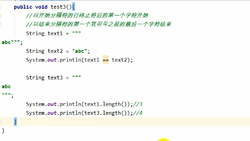

注意：

编译器在编译时会删除掉这些多余的空格。不过行前有没有空格在于终止符的位置

转义字符

```java
//错误
String d = """
			abc \ def
			"""; // 含有未转义的反斜线
```

文本框连接

```java
String code = """
        public void print(""" + type + """
            o) {
            	System.out.println(Objects.toString(o));
            }
		""";
```

更简洁的替代方法是使用 String :: replace 或 String :: format，比如：

```java
String code = """
        public void print($type o) {
        	System.out.println(Objects.toString(o));
        }
		""".replace("$type", type);
String code = String.format("""
        public void print(%s o) {
        	System.out.println(Objects.toString(o));
        }
		""", type);
```

另一个方法是使用 String :: formatted，这是一个新方法，比如：

```java
String source = """
        public void print(%s object) {
        	System.out.println(Objects.toString(object));
        }
		""".formatted(type);
```

## 3：动态 CDS 档案（动态类数据共享归档）

## 4：ZGC:取消使用未使用的内存

## 5：重新实现旧版套接字 API

更简洁的替代方法是使用 String :: replace 或 String :: format，比如：
另一个方法是使用 String :: formatted，这是一个新方法，比如：
String code = "public void print(Object o) {" +
"""
System.out.println(Objects.toString(o));
}
""";

String code = """
public void print(Object o) {
System.out.println(Objects.toString(o));
}
""";
1
2
3
4
5
String code = """
public void print(""" + type + """
o) {
System.out.println(Objects.toString(o));
}
""";
1
2
3
4
5
6
String code = """
public void print($type o) {
System.out.println(Objects.toString(o));
}
""".replace("$type", type);
1
2
3
4
5
String code = String.format("""
public void print(%s o) {
System.out.println(Objects.toString(o));
}
""", type);

String source = """
public void print(%s object) {
System.out.println(Objects.toString(object));
}
""".formatted(type);

# 面试题：

1：实现拷贝文件工具类使用字节流还是字符流？

字节流（图片，声音，图像）
