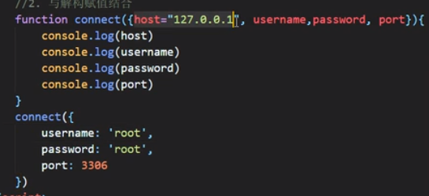

https://www.runoob.com/w3cnote/es6-symbol.html

# 1：简介

 ECMAScript 6.0 ，是 JavaScript 的下一个版本标准，2015.06 发版。每一年发一版

Node.js支持最高

查看Node对ES6的支持

```cmd
node --v8-options | grep harmony
```

webpack

是一个现代 JavaScript 应用程序的静态模块打包器 (module bundler) 。当 webpack 处理应用程序时，它会递归地构建一个依赖关系图 (dependency graph) ，其中包含应用程序需要的每个模块，然后将所有这些模块打包成一个或多个 bundle 。

ebpack 主要有四个核心概念:

- 入口 (entry)
- 输出 (output)
- loader
- 插件 (plugins)

# 2：基本语法

## let关键字

不允许重复声明

块儿级作用域：全局，函数，eval

​	let只在块内有效

不存在变量提升

不影响作用域链

let声明的变量只在 let 命令所在的代码块内有效。let 只能声明一次 var 可以声明多次:for 循环计数器很适合用 let

## const关键字

声明必须赋初始值

标识符一般为大写

不允许重复声明

值不允许修改 

块儿级作用域

const 声明一个只读的常量，一旦声明，常量的值就不能改变。

 const 其实保证的不是变量的值不变，而是保证变量指向的内存地址所保存的数据不允许改动。此时，你可能已经想到，简单类型和复合类型保存值的方式是不同的。是的，对于简单类型（数值 number、字符串 string 、布尔值 boolean）,值就保存在变量指向的那个内存地址，因此 const 声明的简单类型变量等同于常量。而复杂类型（对象 object，数组 array，函数 function），变量指向的内存地址其实是保存了一个指向实际数据的指针，所以 const 只能保证指针是固定的，至于指针指向的数据结构变不变就无法控制了，所以使用 const 声明复杂类型对象时要慎重。


## 变量解构赋值

6 允许按照一定模式，从数组和对象中提取值，对变量进行赋值，这被称 为解构赋值。

```javascript
//对象的解构赋值
const lin = {
 name: '林志颖',
 tags: ['车手', '歌手', '小旋风', '演员']
};
let {name, tags} = lin;
```

## 模板字符串

模板字符串（template string）是增强版的字符串，用反引号（`）标识，特点： 1) 字符串中可以出现换行符 2) 可以使用 ${xxx} 形式输出变量

```javascript
// 定义字符串
let str = `<ul>
			<li>沈腾</li>
 			<li>玛丽</li>
 			<li>魏翔</li>
 			<li>艾伦</li>
		 </ul>`;
// 变量拼接
let star = '王宁';
let result = `${star}在前几年离开了开心麻花`;

```

## 简化对象写法

S6 允许在大括号里面，直接写入变量和函数，作为对象的属性和方法。这样的书写更加简洁。

```javascript
let name = '111';
let slogon = '222';
let improve = function () {
 console.log('可以提高你的技能');
}
//属性和方法简写
let person = {
 name,
 slogon,
 improve,
 //声明函数的简化
 change() {
 	console.log('可以改变你')
 }
};
```

## 箭头函数

ES6 允许使用「箭头」（=>）定义函数。

```javascript
/**
* 1. 通用写法
*/
let fn = (arg1, arg2, arg3) => {
 return arg1 + arg2 + arg3;
}
```

1) 如果形参只有一个，则小括号可以省略 

2) 函数体如果只有一条语句，则花括号可以省略，函数的返回值为该条语句的 执行结果 

3) 箭头函数 this 指向声明时所在作用域下 this 的值 

4) 箭头函数不能作为构造函数实例化 

5) 不能使用 arguments


## 函数参数赋值初始值

1：形参初始值

```javascript

//当不传入第三个参数时，该值就是初始值
function add(a,b,c=10){
    return a + b + c;
}
let result = add(1,2)'
console.log(result);
```

2：与解构赋值结合

```javascript
function connect({options}){
    
}
```




## rest参数

引入 rest 参数，用于获取函数的实参，用来代替 arguments

```javascript
/**
* 作用与 arguments 类似
*/
function add(...args){
 console.log(args);
}
add(1,2,3,4,5);
/**
* rest 参数必须是最后一个形参
*/
function minus(a,b,...args){
 console.log(a,b,args);
}
minus(100,1,2,3,4,5,19);
```

## spread 扩展运算符

扩展运算符（spread）也是三个点（...）。它好比 rest 参数的逆运算，将一个数组转为用逗号分隔的参数序列，对数组进行解包。

```javascript
/**
* 展开数组
*/
let tfboys = ['德玛西亚之力','德玛西亚之翼','德玛西亚皇子'];
let tfboys2 = ['德玛西亚之力2','德玛西亚之翼2','德玛西亚皇子2'];
function fn(){
 console.log(arguments);
}
fn(...tfboys);
let tfboysAll = [...tfboys,tfboys2];
```

## Symbol

引入了一种新的原始数据类型 Symbol ，表示独一无二的值，最大的用法是用来定义对象的唯一属性名。

 数据类型除了 Number 、 String 、 Boolean 、 Objec t、 null 和 undefined ，还新增了 Symbol 。

特点 

1) Symbol 的值是唯一的，用来解决命名冲突的问题 

2) Symbol 值不能与其他数据进行运算 

3) Symbol 定义 的 对象属 性 不能 使 用 for…in 循 环遍 历 ，但 是可 以 使 用 Reflect.ownKeys 来获取对象的所有键名

Symbol.for() 类似单例模式，首先会在全局搜索被登记的 Symbol 中是否有该字符串参数作为名称的 Symbol 值，如果有即返回该 Symbol 值，若没有则新建并返回一个以该字符串参数为名称的 Symbol 值，并登记在全局环境中供搜索。

```js
//创建
let yellow = Symbol("Yellow");
let yellow1 = Symbol.for("Yellow");
yellow === yellow1;      // false
 
let yellow2 = Symbol.for("Yellow");
yellow1 === yellow2;     // true
```

Symbol.keyFor()

Symbol.keyFor() 返回一个已登记的 Symbol 类型值的 key ，用来检测该字符串参数作为名称的 Symbol 值是否已被登记。

```js
let yellow1 = Symbol.for("Yellow");
Symbol.keyFor(yellow1);    // "Yellow"
```


Symbol内置值

除了定义自己使用的 Symbol 值以外，ES6 还提供了 11 个内置的 Symbol 值，指向语言内部使用的方法。可以称这些方法为魔术方法，因为它们会在特定的场 景下自动执行。

| Symbol.hasInstance        | 当其他对象使用 instanceof 运算符，判断是否为该对 象的实例时，会调用这个方法 |
| ------------------------- | ------------------------------------------------------------ |
| Symbol.isConcatSpreadable | Symbol.isConcatSpreadable 属性等于的是一个 布尔值，表示该对象用于 Array.prototype.concat()时， 是否可以展开。 |
|                           |                                                              |
|                           |                                                              |
|                           |                                                              |
|                           |                                                              |
|                           |                                                              |
|                           |                                                              |
|                           |                                                              |
|                           |                                                              |
|                           |                                                              |


## 迭代器

遍历器（Iterator）就是一种机制。它是一种接口，为各种不同的数据结构提 供统一的访问机制。任何数据结构只要部署 Iterator 接口，就可以完成遍历操作。

ES6 创造了一种新的遍历命令 for...of 循环，Iterator 接口主要供 for...of 消费

```js
const xiyou = ['111','222','333','444'];

//遍历数组下标
for(let i in xiyou){
    console.log(i);
}
//输出1234
//遍历内容
for(let v of xiyou){
    console.log(v);
}
//输出111222333444
```

工作原理 

a) 创建一个指针对象，指向当前数据结构的起始位置 

b) 第一次调用对象的 next 方法，指针自动指向数据结构的第一个成员 

c) 接下来不断调用 next 方法，指针一直往后移动，直到指向最后一个成员 

d) 每调用 next 方法返回一个包含 value 和 done 属性的对象


## 生成器

生成器函数是 ES6 提供的一种异步编程解决方案，语法行为与传统函数完全不同.


```js
function * gen(){
 yield '一只没有耳朵';
 yield '一只没有尾巴';
 return '真奇怪';
}
let iterator = gen();
console.log(iterator.next());
console.log(iterator.next());
console.log(iterator.next());
```

 1) * 的位置没有限制 

2) 生成器函数返回的结果是迭代器对象，调用迭代器对象的 next 方法可以得到 yield 语句后的值 

3) yield 相当于函数的暂停标记，也可以认为是函数的分隔符，每调用一次 next 方法，执行一段代码

 4) next 方法可以传递实参，作为 yield 语句的返回值

## Promise

是 ES6 引入的异步编程的新解决方案。语法上 Promise 是一个构造函数， 用来封装异步操作并可以获取其成功或失败的结果。 

1) Promise 构造函数: Promise (excutor) {} 

2) Promise.prototype.then 方法

3) Promise.prototype.catch 方法


# 3：集合

## set

ES6 提供了新的数据结构 Set（集合）。它类似于数组，但成员的值都是唯 一的，集合实现了 iterator 接口，所以可以使用『扩展运算符』和『for…of…』进 行遍历，

集合的属性和方法：

1) size 返回集合的元素个数 

2) add 增加一个新元素，返回当前集合

3) delete 删除元素，返回 boolean 值

4) has 检测集合中是否包含某个元素，返回 boolean 值 

5) clear 清空集合，返回 undefined

## Map 

ES6 提供了 Map 数据结构。它类似于对象，也是键值对的集合。但是“键” 的范围不限于字符串，各种类型的值（包括对象）都可以当作键。Map 也实现了 iterator 接口，所以可以使用『扩展运算符』和『for…of…』进行遍历。

Map 的属 性和方法： 

1) size 返回 Map 的元素个数 

2) set 增加一个新元素，返回当前 Map 

3) get 返回键名对象的键值 

4) has 检测 Map 中是否包含某个元素，返回 boolean 值 

5) clear 清空集合，返回 undefined


# 4：Class类

ES6 提供了更接近传统语言的写法，引入了 Class（类）这个概念，作为对 象的模板。通过 class 关键字，可以定义类。基本上，ES6 的 class 可以看作只是 一个语法糖，它的绝大部分功能，ES5 都可以做到，新的 class 写法只是让对象 原型的写法更加清晰、更像面向对象编程的语法而已。 

知识点：

 1) class 声明类 

2) constructor 定义构造函数初始化 

3) extends 继承父类 

4) super 调用父级构造方法 

5) static 定义静态方法和属性 

6) 父类方法可以重写


# 5：模块化

模块化是指将一个大的程序文件，拆分成许多小的文件，然后将小文件组合起来。

1) 防止命名冲突

2) 代码复用 

3) 高维护性

ES6 之前的模块化规范有：

 1) CommonJS => NodeJS、Browserify 

2) AMD => requireJS 

3) CMD => seaJS

模块功能主要由两个命令构成：export 和 import。 

export 命令用于规定模块的对外接口 

import 命令用于输入其他模块提供的功能


分别暴露

```js
export let a = 'a';
export function teach(){
    console.log("www")
}
```

统一暴露

```js
let a = 'a';
function teach(){
    console.log("www")
}

export{a,teach}
```

默认暴露

```js
export default{
   a :'a';
   teach:function (){
    console.log("www")
	}
}
```

引入

```js
//1:通用的导入方式
import * as m1 from "./src/js/m1/js";
//2:解构赋值形式
import {a as a1,teache} from "./src/js/m1.js";
import {default as m3} from "./src/js/m3.js"
//简单形式，只针对默认暴露
import m3 from "./src/js/m3.js"
```

JS获取当前日期前两天的日期

```javascript
var now = new Date();
now.setDate(now.getDate() - n);
now.toLocaleDateString()
```

动态添加HTML

```javascript
var fundNumContext = document.getElementById("fundNumContext");

fundNumContext.innerHTML=fundNumDiv;
```

