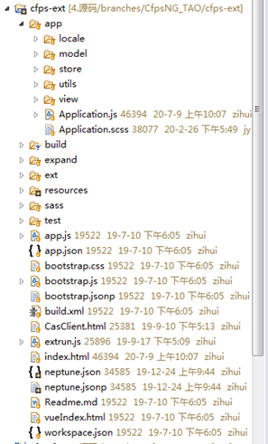
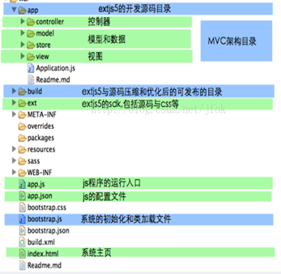
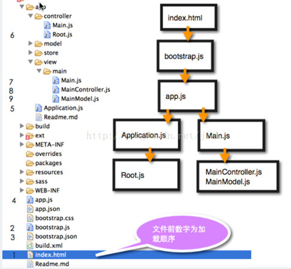
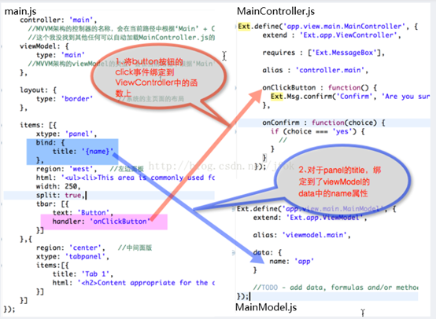

Sencha

Sencha 是由 [ExtJS](http://www.oschina.net/p/extjs)、[jQTouch](http://www.oschina.net/p/jqtouch) 以及 [Raphael](http://www.oschina.net/p/raphael) 三个项目合并而成的一个开源项目

# 一：简介

开发手册：https://docs.sencha.com/extjs/6.2.0/modern/Ext.html

Sencha 为 extjs 提供的开发工具

Sencha Cmd

Sencha CMD 是一个提供 Ext JS 代码缩小，脚手架，生产构建生成功能的工具。

Sencha IDE Plugins

Sencha IDE 插件，它将 Sencha 框架集成到 IntelliJ，WebStorm IDE 中。 这有助于通过提供代码完成，代码检查，代码导航，代码生成，代码重构，模板创建和拼写检查等功能来提高开发人员的生产力。

Sencha Inspector

Sencha Inspector 是一个调试工具，帮助调试器调试任何问题，同时开发。

## 1：环境搭建

Spket 插件：在 eclipse 中可以提示

在线链接

<link href="https://cdn.bootcss.com/extjs/6.0.0/classic/theme-classic/resources/theme-classic-all.css" rel="external nofollow" target="_blank" rel="external nofollow" target="_blank" rel="external nofollow" target="_blank"  rel="stylesheet">

从 sencha 下载文件

1：js 文件

| **ext.js** 这是核心文件，其中包含运行应用程序的所有功能。                                            |
| ---------------------------------------------------------------------------------------------------- |
| **ext-all.js** 此文件包含在文件中没有注释的所有缩小的代码                                            |
| **ext-all-debug.js** 这是 ext-all.js 的未分级版本，用于调试目的。                                    |
| **ext-all-dev.js** 此文件也未分级，用于开发目的，因为它包含所有注释和控制台日志，以检查任何错误/问题 |
| **ext-all.js** 这个文件用于生产目的，主要是因为它比任何其他小得多。                                  |

<!-- 引入ext的样式文件 -->

<link rel="stylesheet" type="text/css" href="extjs/resources/css/ext-all.css">

<!-- 引入ext核心文件，开发模式 -->

<!-- 引入国际化文件 -->

<!-- 引入外部js文件，要是直接在jsp里边写，反应会很慢 -->

Eclipse 编辑即可

自带一个服务器

## 2：Extjs 项目目录结构

App 下创建：

​ Controller

​ Model

​ View

Index

​

## 3：文件的加载过程

1：bootstrap.js：他根据配置文件 bootstrap.json 来设置 extjs 的类的调用路径、引入 css，最后再根据配置文件中的信息，加载 app.js。

2：App.js

根据类加载信息，自动为类 app.Application 加载文件，也为 app.view.main.Main 类找到 js 文件并加载

3：Application.js

4：main.js

## 4：MVVM

# 二：命名约定

类名：StudentClass

方法名：doLayout

变量名：firstName

常量名：MAX_VALUE

配置名：enableColumResize=true

Ext.define('app.view.main.region.Top', {

extjs 的类加载机制就是根据类名来找到具体的类文件在哪里的。

Controller.js:控制器，

View.js:界面部分，显示

Store.js：

Model.js：后端视图映射

Utils.js：

# 三：语法

## 1：model

现实中的映射，相当于 db 中的 table，Java 中的 class

1：两种创建类的方法：Ext.define 和 Ext.regModel,

这两种方式的区别是 Ext.regModel 不需要自己写继承 Ext.data.Model

1. //我们利用 Ext.define 来创建我们的模型类
2. //DB table person(name,age,email)
3. Ext.define("person",{
4. ​ extend:'Ext.data.Model',
5. ​ fields:[
6. ​ {name:'name',type:'auto'},
7. ​ {name:'age',type:'int'},
8. ​ {name:'email',type:'auto'},
9. ​ ]
10. });
11. //MVC 模式中 model 一定是 M 层
12. Ext.regModel("user",{
13. ​ fields:[
14. ​ {name:'name',type:'auto'},
15. ​ {name:'age',type:'int'},
16. ​ {name:'email',type:'auto'},
17. ​ ]
18. });

2：三种实例化对象的方法：new,Ext.create,Ext.ModelMgr.create

1.  //实例化我们的 person 类
2.  //1.new 关键字
3.  var p = new person({
4.  ​ name:'upcat.com',
5.  ​ age:26,
6.  ​ email:'yunfengcheng2008@126.com'
7.  ​ });
8.  console.log(p.get('name'));
9.  var p2 = Ext.create("person",{
10. ​ name:'upcat.com',
11. ​ age:26,
12. ​ email:'yunfengcheng2008@126.com'
13. });
14. console.log(p2.get('age'));
15. var p3 = Ext.ModelMgr.create({
16. ​ name:'upcat.com',
17. ​ age:26,
18. ​ email:'yunfengcheng2008@126.com'
19. },'person');
20. console.log(p3.get('name'));

## 2：代理 Proxy

1.  Ext.onReady(function(){
2.  ​ Ext.define("user",{
3.  ​ extend:'Ext.data.Model',
4.  ​ fields:[
5.  ​ {name:'name',type:'string'},
6.  ​ {name:'age',type:'int'}
7.  ​ ]
8.  });
9.  //不用 create 方法，我们直接用 proxy 来创建对象数据
10. var userData = [
11. ​ {name:'uspcat.com',age:1},
12. ​ {name:'yunfengcheng',age:26}
13. ];
14. var memoryProxy = Ext.create("Ext.data.proxy.Memory",{
15. ​ data:userData,
16. ​ model:'user'
17. });
18.
19. userData.push({name:'new upcast.com',age:1});

localstorage 相当于 cookies，关闭浏览器之后还是可以读到的

1.  Ext.regModel("user",{
2.  ​ fields:[
3.  ​ {name:'name',type:'string'}
4.  ​ ],
5.  ​ proxy:{
6.  ​ type:'localstorage',
7.  ​ id:'twitter-Searches'
8.  ​ }
9.  ​ });
10. ​ //我们用 store 来初始化数据
11. ​ var store = new Ext.data.Store({
12. ​ model:user
13. ​ });
14. ​ store.add({name:'uspcat.com'});
15. ​ store.sync();
16. ​ store.load();
17. ​ var msg = [];
18. ​ store.each(function(rec){
19. ​ msg.push(rec.get('name'));
20. ​ });

sessionstorage 相当于 session，关闭浏览器之后一切都要从头开始

2：json

3：jsonp

1. Ext.define('person', {
2. ​ extend: 'Ext.data.Model',
3. ​ fields: [
4. ​ {name: 'name', type: 'string'}
5. ​ ],
6. ​ proxy:{
7. ​ type:'jsonp',
8. ​ url:'http://www.uspcat.com/extjs/person.php'
9. ​ }
10. ​ });
11. ​ var person = Ext.ModelManager.getModel('person');
12. ​ person.load(1,{
13. ​ scope:this,
14. ​ success:function(model){
15. ​ console.log(model.get('name'));
16. ​ }
17. ​ });

## 3：store

## 4：util 包

1：Ext.util.CSS

Ext.uti.CSS.createStyleSheet(String cssText 样式表.String id):StyleSheet

例：

123456

Ext.util.CSS.createStyleSheet(“.c{clolr:red}”,”red”);

​ Ext.get(“d1”).addClsOnOver(“c”);

直接在 DOM 里加入了 id 为 Red 的<style>标签

GetRule（String/Array selector，Boolean refreshCache）根据样式表得到样式表里的信息

Var cssobj = Ext.util.CSS.getRule(“.c”,ture);

Alert(cssobj.style.color);

弹出 red

2：Ext.util.CLickRepeater

单击事件

3：Ext.util.DelayTask

规定时间内执行该函数，实际是一个队列，不要再执行时移除队列

4：Ext.util.format

格式化

Ellipsis（）截取规定长度

Substr（string，Number start，Number length）

Date( )格式化时间

## 5：Grid 组件

Ext.Grid.Panel

新建 GridDemo.js

Title:

Columns:列，数组

renderTo:渲染到一个 div 的 id 上

store 在 model 中

新建 mode 中

Form（窗体小部件）：

messageBox（消息框）：

Chart（图表）

……

12：MessageBox

提示 Alter 方法：Ext.Msg.alert(4 个参数，参考文档)

其本质是 div，不是 alert

确认 Confirm 方法：Ext.Msg.confirm

输入框：Ext.Msg.prompt(‘标题’，‘请输入姓名’，)

等待框 Wait 方法：

Xtype 别名，可用于实例化

结构图

13.Ext.widget 是只有如 TestField,checkBox,button 等菜单类组件

14：创建面板的过程

Ext.onReady(function(){ //这是 extjs 的规定写法，必须这样写

​ //panel

​ Ext.create('Ext.panel.Panel',{ //创建 pannel 可以是 Ext.panel.Panel，或 Ext.Panel,不能是单独的 pannel 或 Pannel.同理，创建按钮可用 Ext.create('Ext.Button',{});

​ title:'这是面板',

​ width:'50%',

​ height:'60%',

​ html:'
这是 div
<input type="text" id="inp">', //pannel 中可加 html 元素

​ renderTo:Ext.getBody(), //通过该句使面板从内存显示到页面

​ frame:true //这句作用就是使面板有背景色，棱角圆润些，更好看

​ });

});

13、Ext.TabPanel

TabPanel 继承于 Ext.Panel，Ext.TabPanel 就是有选项卡的 Panel，可以在选项卡之间切换。它是多个不同内容的容器，任意组件直接使用 add()函数便可添加到 Ext.TabPanel 中。通过 activeTab 指定激活哪个面板，索引从 0 开始。

14、Ext.data.TreeStore

树节点组件的数据

Markdown 书写工具 typora

Extjs 添加一个 tab 页

要看是写在数据库中的还是 js 中的，要是数据库读取你往数据库添加一条记录即可，要是 JS 里

侧边栏导航功能

https://www.cnblogs.com/MaiJiangDou/p/6762332.html

项目的文件加载过程

Localhost:1841 调用 index.html

加载 app.js

1：lookupreference

## 6：Tree

新建项目

新建 deptView.js

新建 Controller

## 1：onReady

类似于 Window 的 onload 方法，在页面的 DOM 对象加载完毕后立即执行

Ext.onReady()表示确保页面全部加载完后才执行 javascript 语句，是一个入口函数，相当于 java 里边的 main 函数。

## 2：define 定义类

1：在 js 中声明类

Function user(){
//java 中的 public

This.name= ‘csjoijf’;

//var 相当于 private

Var email = ‘jdoi@126.com’

This.getEmail = function(){

Return email;

}

}

Var a = new user();

Ext.define(class name ,class members/properties ,callback function);

示例：

Ext.define(studentApp.view.StudentDeatilsGrid, {

extend : 'Ext.grid.GridPanel',

id : 'studentsDetailsGrid',

store : 'StudentsDetailsGridStore',

renderTo : 'studentsDetailsRenderDiv',

layout : 'fit',

columns : [{

text : 'Student Name',

dataIndex : 'studentName'

},{

text : 'ID',

dataIndex : 'studentId'

},{

text : 'Department',

dataIndex : 'department'

}]

});

若属性在 config 里面，则系统会默认给出 set 或 get 方法。

只是在 extjs 中不智能提示，需要手打。如：

//ExtJS 建立类 实例化对象

​ Ext.define('Person',{//创建新类

​ config:{ //配置项

​ name:'张三',

​ age:20

​ },

​ say:function(){

​ alert('say...');

​ },

​ constructor:function(config){//将配置项初始化,新建类时最好写上构造函数.下边为推荐写法

​ var self = this;

​ self.initConfig(config);//初始化类 传递参数

​ }

​ });

​ //实例化对象

​ var p = Ext.create('Person',{

​ name:'李四', //该处为逗号，不是分号

​ id:50, //不能通过这样的方式来给子类增加新属性，因为在父类 config 里没有定义

​ age:21 //最后一步后边没有任何符号，这和 js 不同。js 每步后都为分号

​ });

​ alert(p.getName());//getName()是系统自动补充，但不会给出提示，需要我们手打。

​ alert(p.getAge());

​ alert(p.id);//此时会显示 id 为 undefined

​ alert(p.getId());//会报错，p.getAge is not a function 因为在父类中没定义

​ p.say();

)};

4.ext 要创建一个类，用 Ext.define;实例化对象则用 Ext.create。

Ext.define 可以创建类，可以继承其它类，也可以被继承。可配默认属性：

extend(注意，后面没有 s)：继承其它的类

mixins：将其他的类融入到当前类，类似于多继承。observable 是经常被 mixins 的

constructor：构造函数，推荐最好写上

Ext.define('Ext.Ajax',{

​ mixins{ //添加混合方法

​ observable:'Ext.util.observable'

​ }

});

## 3：创建对象

方法一：

Var studentObject = new student();

studentObject.getStudentName();

方法二：

Ext.create(

???????????????两种都是创建对象，不同之处，使用的方法第二种

## 4：继承

Ext.define(studentApp.view.StudentDetailsGrid, {

extend : 'Ext.grid.GridPanel',

...

});

多继承

Mixins

## 5：容器

Ext.panel.Panel，

Ext.form.Panel，

Ext.tab.Panel

Ext.container.Viewport

## 6：布局

绝对布局（Absolute）：使用容器的 xy 的坐标对象

相对布局（Accordion）：

## 8：拖放

不好做的，暂时不学

## 9：主题

海王星主题

https://cdnjs.cloudflare.com/ajax/libs/extjs/6.0.0/classic/theme-classic/resources/theme-classic-all.css

9：自定义事件和监听器

## 10：store

（1） modal

（2） store

（3） Proxy

1：Store.getCount()：返回 store 中所有数据记录，然后使用 for 遍历整个 store，从而得到每条记录。

2：Store.each()

store.each(function(record) {

​ alert(record.get('name'));

});

## 11：别名

.alias 即给方法增加别名，在某些时候使用会很方便

Alias（方法，别名）

或则 xtype

xtype

代表一个类的标识名字，用以实例化，可以延迟实例化

Ext 单体

## 12.render 渲染

比如 new Ext.Panel();此时页面上是没有这个 panel 的，什么都看不到，它只是存在于内存中的 javascript 对象。

当调用 panel.render('div1');时，就是把这个对象中对应的配置放到 html 中，这时才能看到带有 ext 样式的 panel.或可用 renderTo:Ext.getBody()等方法渲染到 body 中(必须写这一句，否则不会在页面显示)

## 13.Ext.apply

将原对象的所有属性和方法复制到目标对象
Ext.applyif 将原对象的所有目标对象未包含的属性和方法复制到目标对象
Ext.Array.each 遍历数组，类似于 for(var x in array)

## 14：required

异步加载

不要再用<script>标签引入，

声明命名空间

不加的话会默认找包下的各种文件，只要命名规范一样也可以执行

动态加载类

//加载单个类

Ext.require('Ext.window.Window');

//加载多个

Ext.require([

'Ext.grid.\*',

'Ext.data.\*',

'Ext.util.\*',

'Ext.grid.PagingScroller'

]);

## 15：Bind()

Ext.bind(fn,scope,args,appendArgs);

(方法，函数的引用范围，参数数组，是否传入的参数添加到已有参数的后面)

## 16：item

## 17：reference 与 lookupreference

## 六：组件

### 1：Window 组件

功能：点击按钮出现窗体
