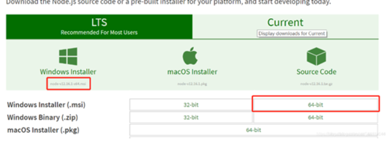
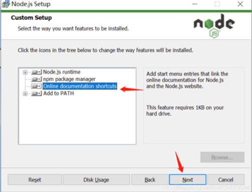
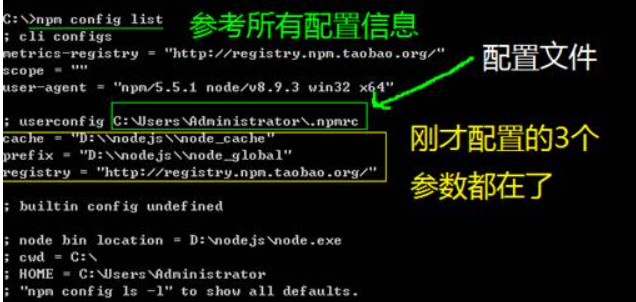
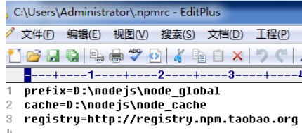

#  一：简介

1：不同浏览器使用不同的JS解析引擎；

Chrome——V8(目前性能最好的)

Firefox——OdinMonkey

Safri——JSCore

IE——Chakra(查克拉):

每个浏览器都内置了DOM，BOM这样的API函数，浏览器交给解析引擎去执行；

2：运行环境


V8引擎负责解析和执行JS代码；

内置API由运行环境提供的特殊接口，只能在所属的运行环境中被调用；

3：JS能否做后端开发？

可以，需要借助Node.js，也是一个运行环境；

NodeJS是一个基于V8引擎的JS运行环境；

浏览器是JavaScript 的前端运行环境。Node.js 是JavaScript 的后端运行环境。Node.js 中无法调用DOM和BOM等浏览器内置API


# 二：安装与配置

官网下载安装包，链接：https://nodejs.org/en/download/

淘宝镜像：https://npm.taobao.org/mirrors/node/


 此处为 node-v12.16.1 - x64.msi选择Windows 64-bit 下载安装
 2.node.js的安装
 （1）点击下载的exe文件进入安装页面，选择next
 （2）勾选接受协议选项，点击 next
 （3）Node.js默认安装目录为 “C:\Program Files\nodejs” , 可以修改目录，并点击 next
 （4)选择安装模式 , 然后点击下一步 next

 
 （5）默认选择next
 （6)最后选择install，等待完成安装
 至此，已经完成了node.js的安装

(7)打开命令行（cmd）输入node -v 和npm -v 查看版本

可以看到node的版本为12.16.1 npm的版本为6.13.4 
 3.环境变量的配置
 （1）在目录nodejs文件夹下创建两个文件夹node_global和 node_cache，用来放安装过程的缓存文件以及最终的模块配置位置
 （2）在cmd中输入如下命令：（注意修改为自己nodejs的目录)

```cmd
npm config set prefix "D:\Program Files\nodejs\node_global"
npm config set prefix "D:\Node\node_global"

npm config set cache "D:\Program Files\nodejs\node_cache"
npm config set cache "D:\Node\node_cache"

```

（3）设置环境变量

右键我的电脑–>属性–>高级系统设置–>环境变量 ，新建系统变量，变量名设为NODE_PATH,变量值为node_modules路径

 
 并且在Path里面新增node_global的目录，如图
 修改完成之后，在命令行输入node回车，再输入require（‘cluster’)出现下图即完成配置

（4）设置本地仓库

输入命令npm config set registry=http://registry.npm.taobao.org 配置镜像站



使用文本编辑器打开配置文件



检查镜像

输入：npm config get registry

输入：Npm info vue

Npm安装或则更新命令

Npm install npm –g

 

（5）执行JS文件

```shell
node test.js
```


# 三：核心模块

## FS文件系统模块

fs.readFile()用来读取指定文件的内容；

```javascript
const fs = require('fs')
fs.readFile('./files/1.txt','utf8',function(err,result){
    if(err){
        return console.log('文件读取失败'+err.message)
    }
})
```

fs.writeFile()用来向指定的文件写入内容；

```javascript
const fs = require('fs')
fs.writeFile('./files/1.txt','data','utf8',function(err,result){
    if(err){
        return console.log('文件写入失败'+err.message)
    }
})
```

## PATH路径模块

```javascript
const paht = require('path')
path.join('/a','/b/c','../','/d'); //输出 /a/b/d

path.basename();//获取文件名称
path.extname();//获取文件扩展名.html
```

## HTTTP模块


