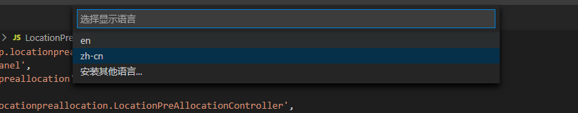
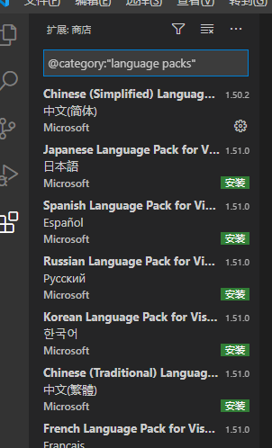
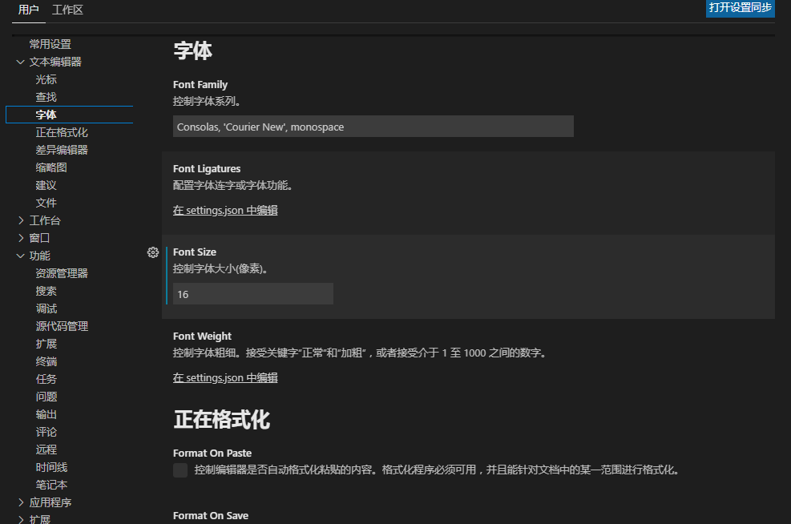
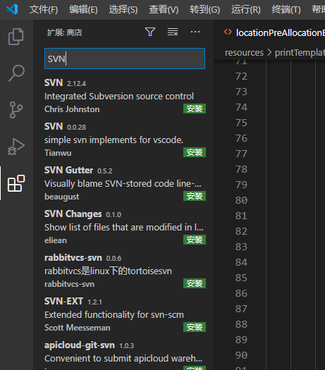
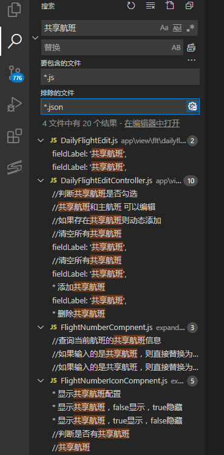

1：设置中文

ctrl + shift +P

在弹出的搜索框中搜索Configure Display Language

选择安装其他语言，我这里已经安装过了

左侧商店弹出搜索到的语言，选择安装即可，然后重启即可使用。

1：设置字体大小

文件——首选项——设置

2：使用SVN

安装插件

3：全局搜索

4：如何忽略文件？？

5：快捷键

\1. 折叠所有区域代码的快捷键：ctrl+k, ctrl+0;

​          先按下ctrl和K，再按下ctrl和0; (注意这个是零，不是欧)

\2. 展开所有折叠区域代码的快捷键：ctrl +k, ctrl+J;

​          先按下ctrl和K，再按下ctrl和J 

\3. 自动格式化代码的快捷键：ctrl+k, ctrl+f;

​          先按下ctrl和K，再按下ctrl和f;

编辑相关：

新建文件:   Ctrl+N

文件之间切换:   Ctrl+Tab

代码行向左或向右缩进:   Ctrl+[ 、 Ctrl+]

**代码格式化:   Shift+Alt+F**

向上或向下移动一行:   Alt+Up 或 Alt+Down

向上或向下复制一行:   Shift+Alt+Up 或 Shift+Alt+Down

在当前行下方插入一行:   Ctrl+Enter

在当前行上方插入一行:   Ctrl+Shift+Enter

删除当前行：Ctrl + Shift + K

光标相关：

同时选中所有匹配编辑(与当前行或选定内容匹配):   Ctrl+Shift+L

快捷键设置：

文件——首选项——键盘快捷方式

