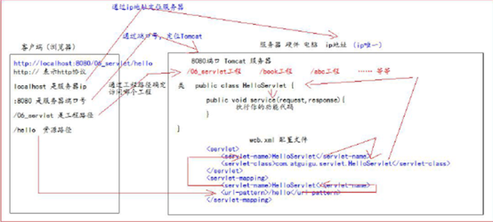
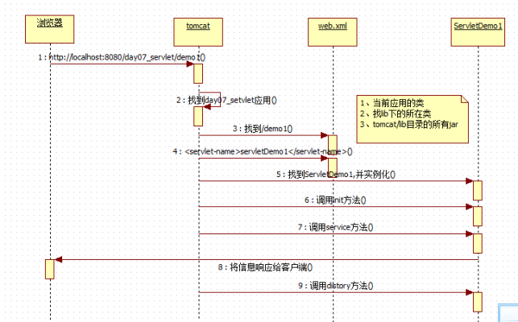

# 一：前端

略

# 二：Tomact

略

# 三：Servlet

Servlet 就JavaWeb 三大组件之一。三大组件分别是：Servlet 程序、Filter 过滤器、Listener 监听器。

1：url地址到servlet程序的访问

​                               

2：生命周期

 

 Servlet被服务器实例化后，容器运行其init方法，请求到达时运行其service方法，service方法自动派遣运行与请求对应的doXXX方法（doGet，doPost）等，当服务器决定将实例销毁的时候调用其destroy方法。

 

方法：

Servlet接口定义了5个方法：

1. void init(ServletConfig config) throws ServletException
2. void service(ServletRequest req, ServletResponse resp) throws ServletException, java.io.IOException
3. void destory()
4. java.lang.String getServletInfo()
5. ServletConfig getServletConfig()

3：Post与get的区别

-  get获取，post提交
- get不安全，请求数据可见
- get传输数据量小

默认情况是调用doGet()方法，JSP页面中的Form表单的method属性设置为post的时候，调用的为doPost()方法；为get的时候，调用deGet()方法。

4：继承HttpServlet实现Servlet

 

 

 

## 2：servletConfig类

配置信息类

Servlet 程序默认是第一次访问的时候创建，

ServletConfig 是每个Servlet 程序创建时，就创建一个对应的ServletConfig 对象。

作用：

1、可以获取Servlet 程序的别名servlet-name 的值

2、获取初始化参数init-param

3、获取ServletContext 对象

 

## 3：ServletContext类

Servlet上下文，一个项目只有一个ServletContext对象实例

ServletContext 是在web 工程部署启动的时候创建。在web 工程停止的时候销毁。

 

什么是域对象?

域对象，是可以像Map 一样存取数据的对象，叫域对象。

这里的域指的是存取数据的操作范围，整个web 工程。

存数据取数据删除数据

Map put() get() remove()

域对象setAttribute() getAttribute() removeAttribute();

 

作用：

1、获取web.xml 中配置的上下文参数context-param

2、获取当前的工程路径，格式: /工程路径

3、获取工程部署后在服务器硬盘上的绝对路径

4、像Map 一样存取数据

 

## 4：HTTP协议

GET

 

GET 请求有哪些：

1、form 标签method=get

2、a 标签

3、link 标签引入css

4、Script 标签引入js 文件

5、img 标签引入图片

6、iframe 引入html 页面

7、在浏览器地址栏中输入地址后敲回车

 

POST

 

POST 请求有哪些：

8、form 标签method=post

 

 

 

 

请求头

 

Accept: 表示客户端可以接收的数据类型

Accpet-Languege: 表示客户端可以接收的语言类型

User-Agent: 表示客户端浏览器的信息

Host： 表示请求时的服务器ip 和端口号

 

响应

 

1、响应行

(1) 响应的协议和版本号

(2) 响应状态码

(3) 响应状态描述符

2、响应头

(1) key : value 不同的响应头，有其不同含义

空行

3、响应体---->>> 就是回传给客户端的数据

 

常见响应码

200 表示请求成功

302 表示请求重定向

404 表示请求服务器已经收到了，但是你要的数据不存在（请求地址错误）

500 表示服务器已经收到请求，但是服务器内部错误（代码错误）

 

## 5：HttpServletRequest类

每次只要有请求进入Tomcat 服务器，Tomcat 服务器就会把请求过来的HTTP 协议信息解析好封装到Request 对象中。

然后传递到service 方法（doGet 和doPost）中给我们使用。我们可以通过HttpServletRequest 对象，获取到所有请求的

信息。

 

Base标签

设置当前页面中所有相对路径工作时，参照哪个路径来进行跳转

 

相对路径与绝对路径

 

## 6：HttpSerletResponse类

每次请求进来，Tomcat 服务器都会创建一个Response 对象传递给Servlet 程序去使用。HttpServletRequest 表示请求过来的信息，HttpServletResponse 表示所有响应的信息，

我们如果需要设置返回给客户端的信息，都可以通过HttpServletResponse 对象来进行设置

 

 

输出流

字节流 getOutStream(); 常用于下载（传递二进制数据）

字符流（getWrite()）；常用于回传字符串

 

请求重定向

 

 

# 四：JSP

## 2：运行原理

 

## 3：jsp语法

1：头部声明

 

language 属性值只能是java。表示翻译的得到的是java 语言的

contentType 属性设置响应头contentType 的内容

pageEncoding 属性设置当前jsp 页面的编码

import 属性给当前jsp 页面导入需要使用的类包

autoFlush 属性设置是否自动刷新out 的缓冲区，默认为true

buffer 属性设置out 的缓冲区大小。默认为8KB

errorPage 属性设置当前jsp 发生错误后，需要跳转到哪个页面去显示错误信息

isErrorPage 属性设置当前jsp 页面是否是错误页面。是的话，就可以使用exception 异常对象

session 属性设置当前jsp 页面是否获取session 对象,默认为true

extends 属性给服务器厂商预留的jsp 默认翻译的servlet 继承于什么类

2：三种脚本

 

声明脚本：

声明脚本格式如下：

<%!

java 代码

%>

 

表达式脚本格式如下：

<%=表达式%>

表达式脚本用于向页面输出内容。

表达式脚本翻译到Servlet 程序的service 方法中以out.print() 打印输出

out 是jsp 的一个内置对象，用于生成html 的源代码

注意：表达式不要以分号结尾，否则会报错

 

 

代码脚本

代码脚本如下：

<% java 代码%>

代码脚本里可以书写任意的java 语句。

代码脚本的内容都会被翻译到service 方法中。

所以service 方法中可以写的java 代码，都可以书写到代码脚本中

 

3：注释

//单行注释

/*

多行代码注解

*/单行注释和多行注释能在翻译后的java 源代码中看见。

<%-- jsp 注释--%>

jsp 注释在翻译的时候会直接被忽略掉

<!-- html 注释-->

指令

a、page指令：定义页面的一些属性。

b、include指令：引入一个静态的JSP页面

c、taglib指令：引入一个标签库

 

## 4：九大内置对象

request 对象请求对象，可以获取请求信息

response 对象响应对象。可以设置响应信息

pageContext 对象当前页面上下文对象。可以在当前上下文保存属性信息

session 对象会话对象。可以获取会话信息。

exception 对象异常对象只有在jsp 页面的page 指令中设置isErrorPage=*"true"* 的时候才会存在

application 对象ServletContext 对象实例，可以获取整个工程的一些信息。

config 对象ServletConfig 对象实例，可以获取Servlet 的配置信息

out 对象输出流。

page 对象表示当前Servlet 对象实例（无用，用它不如使用this 对象）。

 

 

## 5：四大域对象

四大域对象经常用来保存数据信息。

pageContext 可以保存数据在同一个jsp 页面中使用

request 可以保存数据在同一个request 对象中使用。经常用于在转发的时候传递数据

session 可以保存在一个会话中使用

application(ServletContext) 就是ServletContext 对象

 

##  6：基本动作

1. JSP：include    （当页面被请求的时候引入一个文件）
2. JSP：forward    （将请求转到另一个页面）
3. JSP：useBean   （获得JavaBean的一个实例）
4. JSP：setProperty （设置JavaBean的属性）
5. JSP：getProperty （获得JavaBean的属性）
6. JSP：plugin     （根据浏览器类型为Java插件生成object或者embed两种标记）

## 6：out 输出流和response.getwriter()输出流

 

## 7：常用标签

<%-- 静态包含--%>

<%-- 动态包含--%>

<%-- 转发--%>

 

 

静态包含

<%@ include file=*""* %>

静态包含是把包含的页面内容原封装不动的输出到包含的位置

 

动态包含

 

<jsp:include page=*""*></jsp:include>

动态包含会把包含的jsp 页面单独翻译成servlet 文件，然后在执行到时候再调用翻译的servlet 程序。并把计算的结果返回。

动态包含是在执行的时候，才会加载。所以叫动态包含。

 

页面转发

<jsp:forward page=*""*></jsp:forward>

<jsp:forward 转发功能相当于

request.getRequestDispatcher("/xxxx.jsp").forward(request, response); 的功能。

 

 

# 五：Lister监听器

## ServletContextListener 监听器

 

 

 

# 六：EL表达式和JSTL标签库

EL表达式主要是代替jsp页面中的表达式脚本在jsp页面进行数据的输出

 

 

在jsp 标签库中使用taglib 指令引入标签库

CORE 标签库

<%@ taglib prefix=*"c"* uri=*"http://java.sun.com/jsp/jstl/core"* %>

XML 标签库

<%@ taglib prefix=*"x"* uri=*"http://java.sun.com/jsp/jstl/xml"* %>

FMT 标签库

<%@ taglib prefix=*"fmt"* uri=*"http://java.sun.com/jsp/jstl/fmt"* %>

SQL 标签库

<%@ taglib prefix=*"sql"* uri=*"http://java.sun.com/jsp/jstl/sql"* %>

FUNCTIONS 标签库

<%@ taglib prefix=*"fn"* uri=*"http://java.sun.com/jsp/jstl/functions"* %>

 

 

JSTL的使用

1：导包

2：引入

<%@ **taglib** **prefix**="**c**" **uri**="**http://java.sun.com/jsp/jstl/core**" %>

 

3：核心库的使用

**ii. <c:if />**

if 标签用来做if 判断

**<c:choose> <c:when> <c:otherwise>**标签

作用：多路判断。跟switch ... case .... default 非常接近

**ii. <c:foreach />**

遍历输出结果

 

# 七：Cookie与Session

 Cookie是保存在客户端的，session是保存在服务器端的，session是基于cookie进行信息处理的，cookie是不安全的。

# 八：Filter过滤器

拦截请求，过滤相应

## 生命周期

1、构造器方法

2、init 初始化方法

第1，2 步，在web 工程启动的时候执行（Filter 已经创建）

3、doFilter 过滤方法

第3 步，每次拦截到请求，就会执行

4、destroy 销毁

第4 步，停止web 工程的时候，就会执行（停止web 工程，也会销毁Filter 过滤器）

 

## FilterConfig类

 

### 过滤器与拦截器的区别

拦截器是基于java的反射机制的，而过滤器是基于函数回调

拦截器不依赖与servlet容器，过滤器依赖与servlet容器。

 拦截器只能对action请求起作用，而过滤器则可以对几乎所有的请求起作用。

拦截器可以访问action上下文、值栈里的对象，而过滤器不能访问。

在action的生命周期中，拦截器可以多次被调用，而过滤器只能在容器初始化时被调用一次。

# 九：JSON和Ajax请求