# Nginx简介

## Nginx发展介绍

Nginx （engine x）
是一个高性能的Web服务器和反向代理服务器，也可以作为邮件代理服务器。

Nginx
特点是占有内存少，并发处理能力强，以高性能、低系统资源消耗而闻名，Nginx官方测试为5万并发请求。与Nginx同类型的Web服务器还有Apache、Lighttpd（音同lighty）、Tengine（阿里巴巴的）
等。Nginx
的并发处理能力在同类型的Web服务器中表现极好（Apache、Lighttpd），在全世界范围内大量的网站使用了Nginx，国内互联网中也大量使用了Nginx，比如：淘宝、新浪、搜狐、网易、美团等。

Nginx是免费开源的，同时Nginx也有收费的商业版本，商业版本提供了性能优化、宕机等紧急问题处理等技术支持和服务。

## Nginx作者

Nginx 是由俄罗斯人 Igor Sysoev
采用C语言开发编写的，第一个公开版本0.1.0发布于2004年10月4日。

>   Igor Sysoev，Nginx的创始人

Igor
Sysoev出生于1970年的阿拉木图（哈萨克斯坦共和国城市），也就是前苏联。1991年苏联解体，哈萨克斯坦宣布独立，Nginx作者1994年毕业于莫斯科国立鲍曼技术大学；

毕业后继续在莫斯科工作和生活，就职于NGINX.Inc，任CTO。<https://www.nginx.com/>

## 正向代理和反向代理概念

反向代理（Reverse
Proxy）方式是指以代理服务器来接受internet上的连接请求，然后将请求转发给内部网络上的服务器，并将从服务器上得到的结果返回给internet上请求连接的客户端，此时代理服务器对外就表现为一个反向代理服务器；

正向代理类似一个跳板机，代理访问外部资源。比如：我是一个用户，我访问不了某网站，但是我能访问一个代理服务器，这个代理服务器，它能访问那个我不能访问的网站，于是我先连上代理服务器，告诉它我需要那个无法访问网站的内容，代理服务器去取回来,然后返回给我。

## 正向代理和反向代理举例

### 正向代理

比如你现在缺钱，想找马云爸爸去借钱，可想而知人家可能鸟都不鸟你，到最后碰一鼻子灰借不到钱。不过你认识你家隔壁老王，而老王认识马云同志，而且关系还很好。这时候你托老王去找马云借钱，当然这事最后成了，你从马云那里借到了500万！这时候马云并不知道钱是你借的，只知道这钱是老王借的。最后由老王把钱转交给你。在这里，老王就充当了一个重要的角色：代理。

此时的代理，就是我们常说的正向代理。代理客户端去请求服务器，隐藏了真实客户端，服务器并不知道真实的客户端是谁。正向代理应用最广泛的莫过于现在的某些“科学上网工具”，你访问不了谷歌、Facebook的时候，你可以在国外搭建一台代理服务器，代理你访问，代理服务器再把请求到的数据转交给你，你就可以看到内容了。

### 反向代理

比如你现在很无聊，想找人聊天，这时候你拨通了联通客服10010电话，联通的总机可能随机给你分配一个闲置的客服给你接通。这时候你如愿以偿的和客服聊了起来，问了问她目前有没有结婚、有没有对象、家住哪里、她的微信号、她的手机号。。。

此时联通总机充当的角色就是反向代理，你只知道和客服接通并聊了起来，具体为什么会接通这个客服MM，怎么接通的，你并不知道。

反向代理隐藏了真正的服务端，就像你每天使用百度的时候，只知道敲打www.baidu.com就可以打开百度搜索页面，但背后成千上万台百度服务器具体是哪一台为我们服务的，我们并不知道。我们只知道这个代理服务器，它会把我们的请求转发到真实为我们服务的那台服务器那里去。

**综上所述：正向代理代理对象是客户端，反向代理代理对象是服务端。**

## 总结

软件层面一般常用Nginx来做反向代理服务器，它的性能非常好，用来做负载均衡。

# Nginx环境搭建

## 下载

>   免费开源版的官方网站：<http://nginx.org>

>   Nginx 有 Windows 版本和 Linux 版本，但更推荐在 Linux 下使用 Nginx；

>   下载nginx-1.14.2.tar.gz的源代码文件：wget
>   <http://nginx.org/download/nginx-1.14.2.tar.gz>

>   我的习惯，将下载或者上传的安装文件放到/home/soft/目录下

## 安装

### 安装前的准备

Nginx的安装需要确定Linux安装相关的几个库，否则配置和编译会出现错误，
具体的检查安装过程为：

#### gcc编译器是否安装

检查是否安装：yum list installed \| grep gcc

执行安装：yum install gcc -y

#### openssl库是否安装

检查是否安装：yum list installed \| grep openssl

执行安装：yum install openssl openssl-devel -y

#### pcre库是否安装

检查是否安装：yum list installed \| grep pcre

执行安装：yum install pcre pcre-devel -y

#### zlib库是否安装

检查是否安装：yum list installed \| grep zlib

执行安装：yum install zlib zlib-devel -y

#### 一次性安装，执行如下命令

yum install gcc openssl openssl-devel pcre pcre-devel zlib zlib-devel -y

### 正式安装

-   解压下载下来的nginx文件，执行命令：tar -zxvf nginx-1.14.2.tar.gz

-   切换至解压后的nginx主目录，执行命令：cd nginx-1.14.2

-   在nginx主目录nginx-1.14.2下执行命令：./configure --prefix=/usr/local/nginx

-   （其中--prefix是指定nginx安装路径） 注意:等号左右不要有空格

-   执行命令进行编译：make

-   执行命令进行安装：make install

    安装成功后，可以切换到/usr/local/nginx目录下，查看内容

    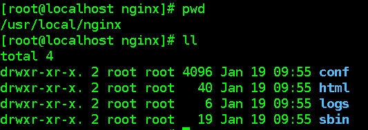

## 启动

### 普通启动

切换到nginx安装目录的sbin目录下，执行：./nginx

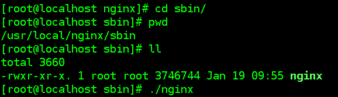

### 通过配置文件启动

./nginx -c /usr/local/nginx/conf/nginx.conf

/usr/local/nginx/sbin/nginx -c /usr/local/nginx/conf/nginx.conf

**其中-c是指定配置文件,而且配置文件路径必须指定绝对路径**

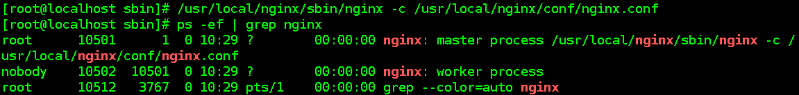

### 检查Nginx是否启动

通过查看进程：ps -ef \| grep nginx

nginx 体系结构由 master 进程和其 worker 进程组成

master 进程读取配置文件，并维护 worker 进程，而 worker 进程则对请求进行实际处理

Nginx启动后，安装目录下会出现一些_tmp结尾的文件，这些是临时文件，不用管。

在浏览器中输入<http://192.168.235.128:80/>访问Nginx服务器，出现以下界面

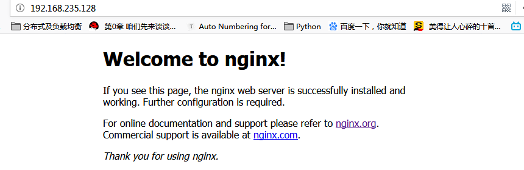

## 关闭

### 优雅关闭Nginx

找出nginx的进程号：ps -ef \| grep nginx

执行命令：kill -QUIT 主pid

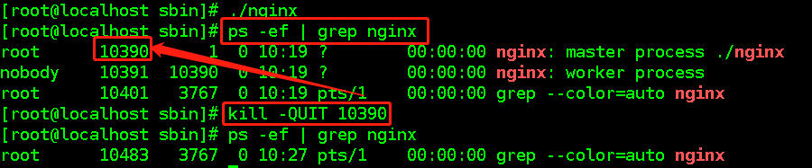

**注意：**

-   其中pid是主进程号的pid（master process），其他为子进程pid（worker process）

-   这种关闭方式会处理完请求后再关闭，所以称之为优雅的关闭

### 快速关闭Nginx：

找出nginx的进程号：ps -ef \| grep nginx

kill -TERM 主pid

**注意：**

-   其中pid是主进程号的pid（master process），其他为子进程pid（worker process）

-   这种关闭方式不管请求是否处理完成，直接关闭，比较暴力，称之为快速的关闭

    

### 重启Nginx：

./nginx -s reload

## 配置检查

当修改Nginx配置文件后，可以使用Nginx命令进行配置文件语法检查，用于检查Nginx配置文件是否正确

/usr/local/nginx/sbin/nginx -c /usr/local/nginx/conf/nginx.conf –t

## 其它

>   Linux上查看nginx版本：/usr/local/nginx/sbin/nginx -V

>   \-v （小写的v）显示 nginx 的版本

>   \-V （大写的V）显示 nginx 的版本、编译器版本和配置参数

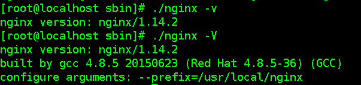

## Window下环境搭建（了解）

>   在官方网站下载最新windows版的nginx：http://nginx.org/en/download.html

>   将下载下来的nginx压缩包解压到一个目录下，解压后该软件就可以启动使用了

>   启动方式1：双击解压目录下的nginx.exe文件即可运行nginx；

>   启动方式2：进入dos窗口，切换到nginx主目录下，在dos窗口执行命令：start nginx

>   关闭方式1：在资源管理器杀掉Nginx进程（有两个进程）

>   关闭方式2：在dos窗口切换到Nginx安装主目录下执行命令：nginx -s stop

# Nginx配置文件说明及Nginx主要应用

## Nginx的核心配置文件

学习Nginx首先需要对它的核心配置文件有一定的认识，这个文件位于Nginx的安装目录/usr/local/nginx/conf目录下，名字为nginx.conf

>   详细配置，可以参考resources目录下的\<\<nginx配置中文详解.conf\>\>

**Nginx的核心配置文件主要由三个部分构成**

###  基本配置

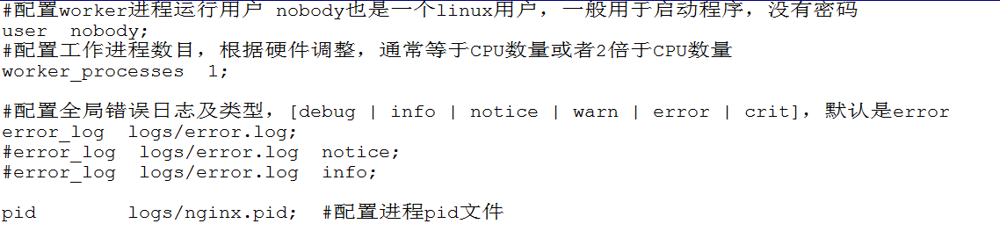

### events配置

### http配置

#### 基本配置

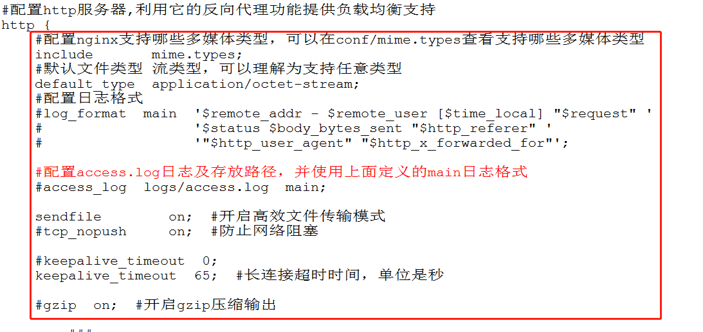

#### server配置，可以有多个

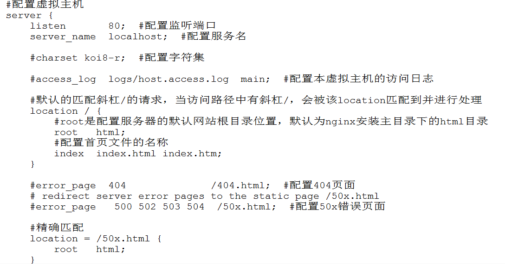

## Nginx主要应用

-   静态网站部署

    -   负载均衡

    -   静态代理

    -   动静分离

    -   虚拟主机

        后面的章节主要围绕这几个应用进行展开

# 静态网站部署

Nginx是一个HTTP的web服务器，可以将服务器上的静态文件（如HTML、图片等）通过HTTP协议返回给浏览器客户端

## 案例：将ace-master这个静态网站部署到Nginx服务器上

### 通过Xftp将ace-master到linux服务器/opt/static目录下，为了演示方便，将名字改为ace

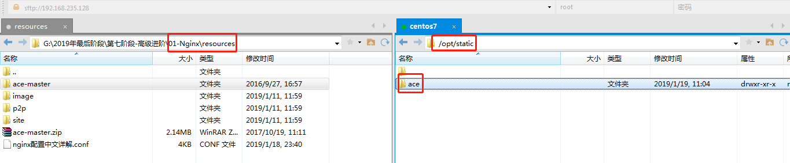

### 通过<http://192.168.235.128:80/>访问

#### 修改nginx.conf配置文件

>   在server中，通过location匹配访问的路径，然后转发给静态资源

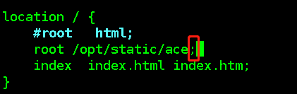

>   注意要以分号结尾

#### 重启nginx服务器

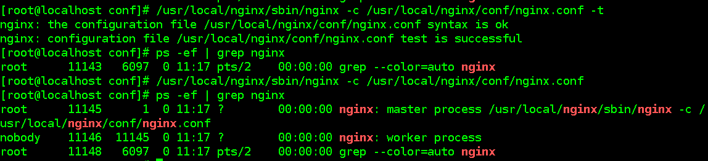

#### 在浏览器中输入<http://192.168.235.128:80/>进行访问

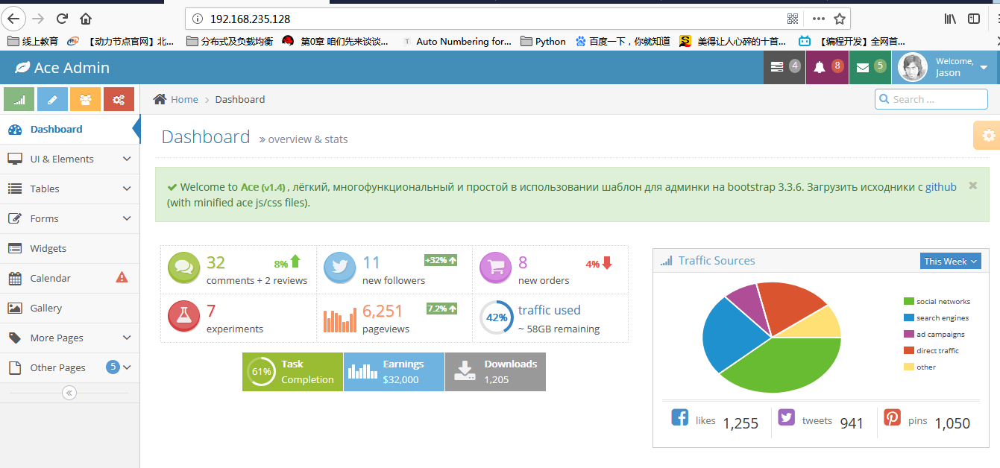

### 通过<http://192.168.235.128:80/ace/>访问

#### 修改nginx.conf配置文件

>   在server中，通过location匹配访问的路径，然后转发给静态资源

#### 重启nginx服务器

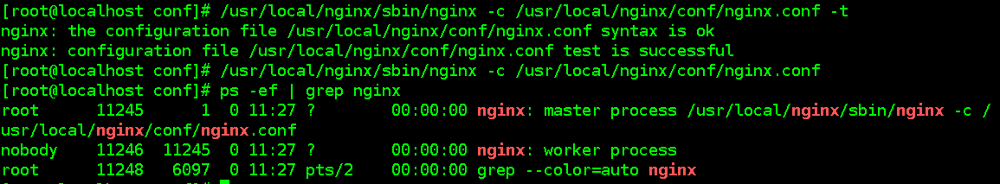

#### 在浏览器中输入<http://192.168.235.128:80/>ace进行访问

## location中配置路径讲解

初次接触：可能会遇到404找不到页面的错误，主要原因是配置路径问题；

**规则：ip + port 等于 root，假设server的配置如下：**

>   server {

>   listen 80; \#端口号

>   location / {

>   root /opt/static /ace; \#静态文件路径

>   }

>   }

>   **替换：**

http://192.168.92.128:80/ = root = /opt/static/ace

http://192.168.92.128:80/ace = root/ace = /opt/static/ace/ace

| **location匹配顺序** 在没有标识符的请求下，匹配规则如下： 1、nginx服务器首先在server块的多个location块中搜索是否有标准的uri和请求字符串匹配。如果有多个标准uri可以匹配，就匹配其中匹配度最高的一个location。 2、然后，nginx在使用location块中，正则uri和请求字符串，进行匹配。如果正则匹配成功，则结束匹配，并使用这个location处理请求；如果正则匹配失败，则使用标准uri中，匹配度最高的location。 **备注：** 1、如果有精确匹配，会先进行精确匹配，匹配成功，立刻返回结果。 2、普通匹配与顺序无关，因为按照匹配的长短来取匹配结果。 3、正则匹配与顺序有关，因为是从上往下匹配。(首先匹配，就结束解析过程) 4、在location中，有一种统配的location，所有的请求，都可以匹配，如下： location / {  \# 因为所有的地址都以 / 开头，所以这条规则将匹配到所有请求  \# 但是正则和最长字符串会优先匹配 } |   |
|----------------------------------------------------------------------------------------------------------------------------------------------------------------------------------------------------------------------------------------------------------------------------------------------------------------------------------------------------------------------------------------------------------------------------------------------------------------------------------------------------------------------------------------------------------------------------------------------------------------------------------------------------------------------------------------------------------------------------------------------------------------------------------------------|---|

结合标识符，匹配顺序如下：

(location =) \> (location 完整路径) \> (location \^\~ 路径) \> (location \~,\~\*
正则顺序) \> (location 部分起始路径) \> (location /)

即

（精确匹配）\> (最长字符串匹配，但完全匹配)
\>（非正则匹配）\>（正则匹配）\>（最长字符串匹配，不完全匹配）\>（location通配）

# 负载均衡 

## 负载均衡概述

在网站创立初期，我们一般都使用单台机器对外提供集中式服务。随着业务量的增大，我们一台服务器不够用，此时就会把多台机器组成一个集群对外提供服务，但是，我们网站对外提供的访问入口通常只有一个，比如
www.web.com。那么当用户在浏览器输入www.web.com进行访问的时候，如何将用户的请求分发到集群中不同的机器上呢，这就是负载均衡要做的事情。

负载均衡通常是指将请求"均匀"分摊到集群中多个服务器节点上执行，这里的均匀是指在一个比较大的统计范围内是基本均匀的，并不是完全均匀。

## 负载均衡实现方式

### 硬件负载均衡

比如 F5、深信服、Array 等

优点是有厂商专业的技术服务团队提供支持，性能稳定

缺点是费用昂贵，对于规模较小的网络应用成本太高

### 软件负载均衡

比如 Nginx、LVS、HAProxy 等

优点是免费开源，成本低廉

### Nginx负载均衡

>   Nginx通过在nginx.conf文件进行配置即可实现负载均衡

#### 原理图

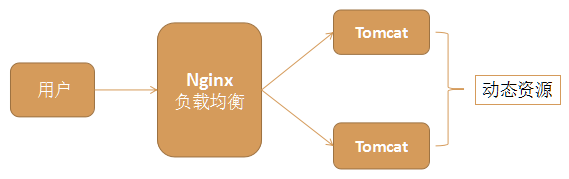

#### 配置如下：（配置2步即可）

##### 在http模块加上upstream配置

>   upstream www.myweb.com {

>   server 127.0.0.1:9100 weight=3;

>   server 127.0.0.1:9200 weight=1;

>   }

其中weight=1表示权重，用于后端服务器性能不均的情况，访问比率约等于权重之比，权重越大访问机会越多

**upstream是配置nginx与后端服务器负载均衡非常重要的一个模块**，并且它还能对后端的服务器的健康状态进行检查，若后端服务器中的一台发生故障，则前端的请求不会转发到该故障的机器

##### 在server模块里添加location，并配置proxy_pass

>   location /myweb {

>   proxy_pass http://www.myweb.com;

>   }

>   其中 www.myweb.com 字符串要和 upstream 后面的字符串相等

#### 案例：将resources/site中的myweb.war部署到两台不同的tomcat上，通过nginx实现负载均衡

##### 在linux服务器/usr/local目录下，拷贝两台新的tomcat

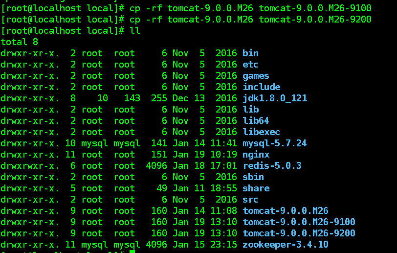

##### 将这两台tomcat服务器webapps目录下没用的项目删掉

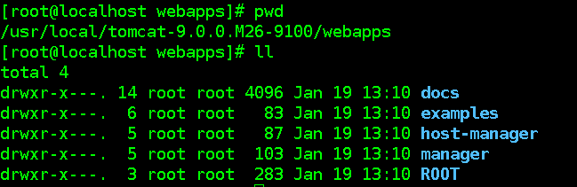

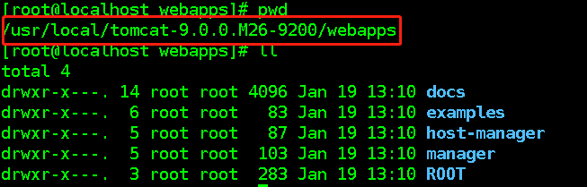

##### 修改其中一台tomcat9100的端口号为9100 

##### 修改tomcat9200的端口号为9200 ，因为需要同时启动两台，这里其它的端口号也要修改

##### 将myweb.war上传到两台tomcat服务器的webapps目录下

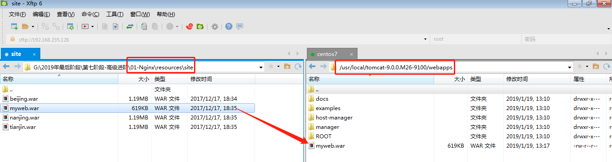

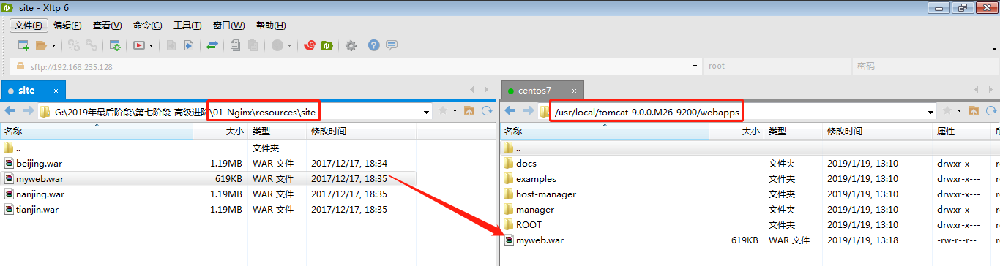

##### 启动两台tomcat

##### 浏览器直接访问两台tomcat，进行测试

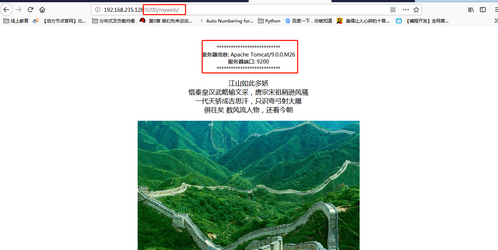

>   但是我们网站一般对外之后提供一个入口地址，所以这个时候可以使用nginx进行负载。

##### 配置nginx

-   在http模块上加

    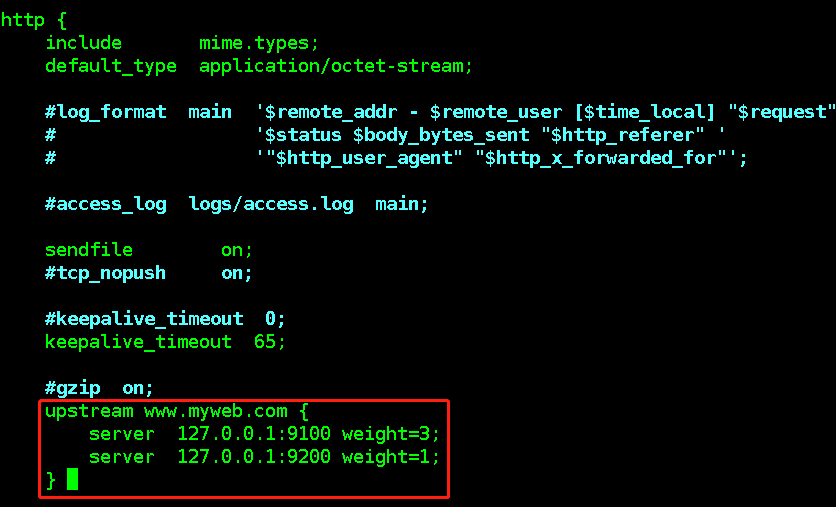

-   在server模块加

    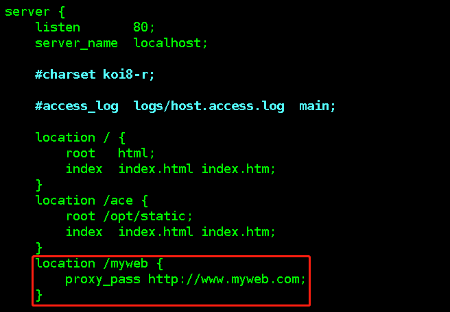

##### 重启Nginx

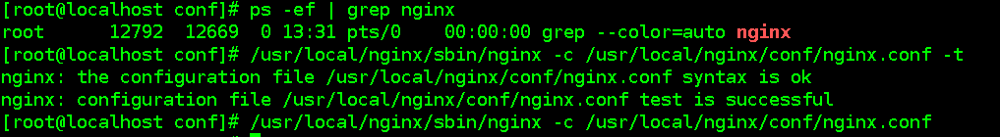

##### 浏览器直接访问nginx进行测试

-   为了看到效果，在tomcat9100的index.jsp中加一个标记

    

-   这个时候可以看到，服务器的端口为80，是nginx服务器的默认端口

    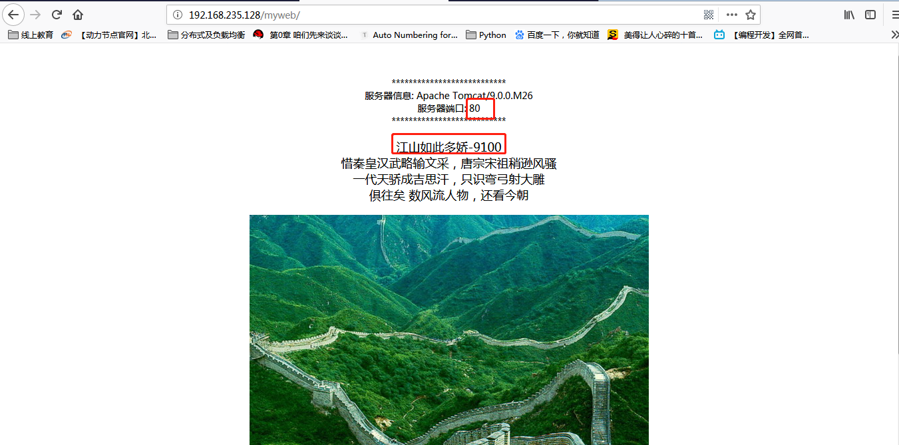

-   多访问几次，如果没有端口号，说明是tomcat9200被访问了

    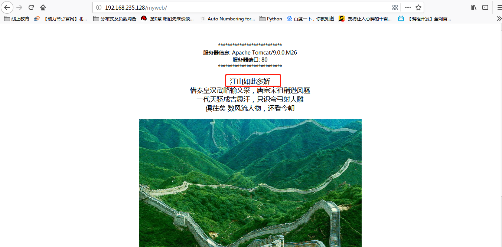

## Nginx常用负载均衡策略

### 轮询（默认）

**注意：这里的轮询并不是每个请求轮流分配到不同的后端服务器，与ip_hash类似，但是按照访问url的hash结果来分配请求，使得每个url定向到同一个后端服务器，主要应用于后端服务器为缓存时的场景下**。**如果后端服务器down掉，将自动剔除**

upstream backserver {

server 127.0.0.1:8080;

server 127.0.0.1:9090;

}

### 权重

**每个请求按一定比例分发到不同的后端服务器，weight值越大访问的比例越大，用于后端服务器性能不均的情况**

upstream backserver {

server 192.168.0.14 weight=5;

server 192.168.0.15 weight=2;

}

### ip_hash

**ip_hash也叫IP绑定，每个请求按访问ip的hash值分配，这样每个访问客户端会固定访问一个后端服务器，可以解决会话Session丢失的问题**

**算法：hash("124.207.55.82") % 2 = 0, 1**

upstream backserver {

ip_hash;

server 127.0.0.1:8080;

server 127.0.0.1:9090;

}

### 最少连接

**web请求会被转发到连接数最少的服务器上**

upstream backserver {

least_conn;

server 127.0.0.1:8080;

server 127.0.0.1:9090;

}

### 案例：将负载均衡策略修改为ip_hash进行测试

#### 修改nginx.conf配置文件

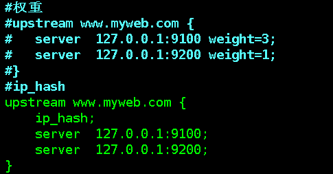

#### 重启nginx

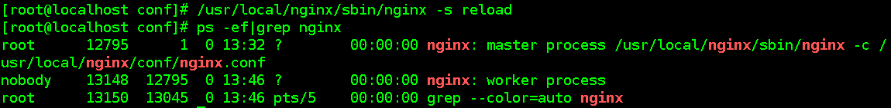

#### 浏览器访问测试，始终访问的是同一台tomcat服务器

不管刷新多少遍，始终访问的是同一台tomcat服务器

## 负载均衡其他几个配置

>   **配置1：**

upstream backserver {

server 127.0.0.1:9100;

\#其它所有的非backup机器down的时候，才请求backup机器

server 127.0.0.1:9200 backup;

}

>   **配置2：**

upstream backserver {

>   server 127.0.0.1:9100;

>   \#down表示当前的server是down状态，不参与负载均衡

server 127.0.0.1:9200 down;

}

一般在项目上线的时候，可以分配部署不同的服务器上，然后对Nginx重新reload。

reload不会影响用户的访问，或者可以给一个提示页面,系统正在升级...

# 静态代理

把所有静态资源的访问改为访问nginx，而不是访问tomcat，这种方式叫静态代理。因为nginx更擅长于静态资源的处理，性能更好，效率更高。

所以在实际应用中，我们将静态资源比如图片、css、html、js等交给nginx处理，而不是由tomcat处理。

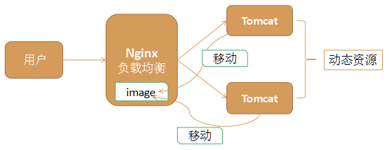

## Nginx静态代理实现方式

### 方式一 在nginx.conf的location中配置静态资源的后缀

**例如：当访问静态资源，则从linux服务器/opt/static目录下获取（举例）**

location \~
.\*\\.(js\|css\|htm\|html\|gif\|jpg\|jpeg\|png\|bmp\|swf\|ioc\|rar\|zip\|txt\|flv\|mid

>   \|doc\|ppt\|pdf\|xls\|mp3\|wma)\$ {

root /opt/static;

}

**说明**

-   \~ 表示正则匹配，也就是说后面的内容可以是正则表达式匹配

-   第一个点 . 表示任意字符

-   \*表示一个或多个字符

-   \\. 是转移字符，是后面这个点的转移字符

-   \| 表示或者

-   \$ 表示结尾

整个配置表示以 .后面括号里面的这些后缀结尾的文件都由nginx处理

放置静态资源的目录，要注意一下目录权限问题，如果权限不足，给目录赋予权限；

否则会出现403错误 chmod 755

### 方式二 在nginx.conf的location中配置静态资源所在目录实现

**例如：当访问静态资源，则从linux服务器/opt/static目录下获取（举例）**

location \~ .\*/(css\|js\|img\|images) {

root /opt/static;

}

xxx/css

xxx/js

xxx/img

xxx/images

我们将静态资源放入 /opt/static 目录下，然后用户访问时由nginx返回这些静态资源

### 案例： 通过nginx访问上面myweb案例中的图片

-   修改nginx.conf文件，在location中配置对静态资源的拦截，如果是静态资源，就交给nginx处理，使拦截静态文件后缀名的方式

    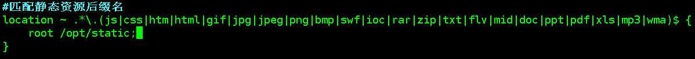

-   重启nginx

    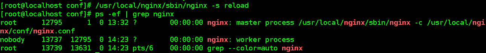

-   浏览器访问nginx服务器，进行测试，发现图片无法加载

    

-   右键图片，查看图片的地址为http://192.168.235.128/myweb/image/001.jpg，因为我们在nginx中配置了对.jpg的拦截，所以请求会交给nginx服务器进行处理。

    根据ip +
    port等于root的原则，我们会去/opt/static/myweb目录下找资源，所以在/opt/static下创建myweb目录，并放入image目录及图片，为了和tomcat上的图片区分，我们这里图片的内容发生了变化

    

-   浏览器访问nginx访问器，进行测试 ，图片访问正常，而且访问的是nginx上的图片

    

-   将nginx.conf中的location拦截方式修改为拦截静态文件目录的方式

    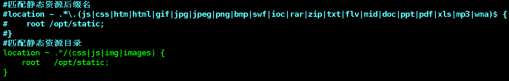

-   重启nginx服务器，通过浏览器访问nginx服务器，进行测试，访问正常，但是访问的是tomcat服务器下的图片

    

    **注意：**

    我们拦截的目录为/images，

    请求的图片目录是/image，这样拦截不到；

    但是反过来

    我们拦截的目录为/imag

    请求的图片目录为/image，这样可以拦截到

所有我们需要将location的/images修改为/image。所以一般我们用方式一，匹配静态资源后缀的方式更好一下，防止js拦截jsp目录。

# 动静分离

Nginx的负载均衡和静态代理结合在一起，我们可以实现动静分离，这是实际应用中常见的一种场景。

动态资源，如jsp由tomcat或其他web服务器完成

静态资源，如图片、css、js等由nginx服务器完成

它们各司其职，专注于做自己擅长的事情

动静分离充分利用了它们各自的优势，从而达到更高效合理的架构

## 动静分离案例

### 架构图

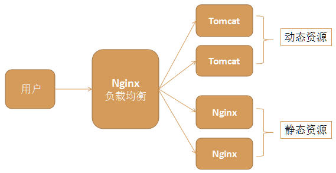

>   整个架构中，一个nginx负责负载均衡，两个nginx负责静态代理。Nginx在一台Linux上安装一份，可以启动多个Nginx，每个Nginx的配置文件不一样即可

### 实现步骤

#### 拷贝两份nginx配置文件（静态代理）

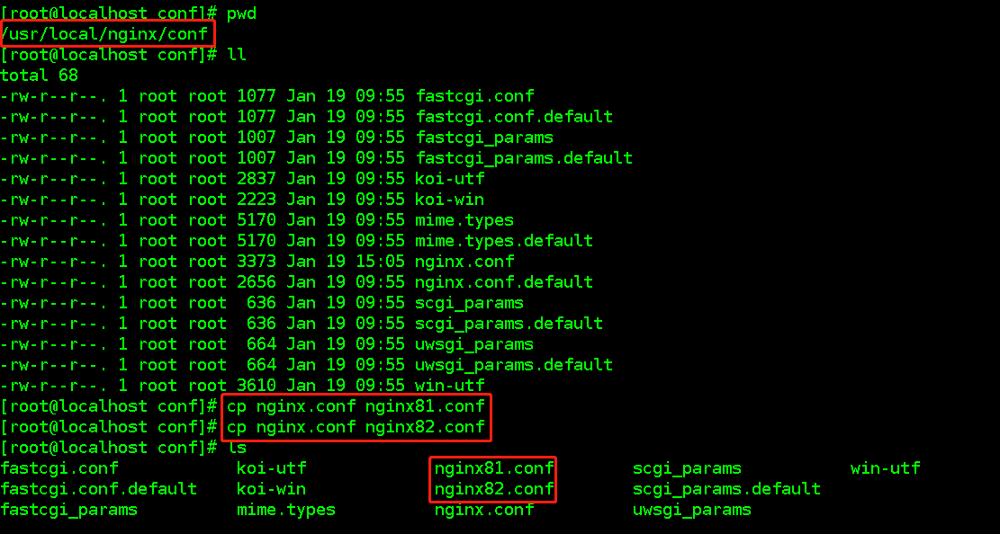

#### 修改新拷贝的nginx81.conf和nginx82.conf配置文件

-   Nginx81.conf端口号，因为这两个机器只需要做静态代理，所以删除掉负载均衡的配置

    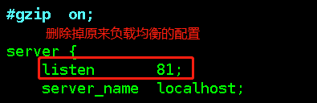

-   Nginx82.conf端口号，因为这两个机器只需要做静态代理，所以删除掉负载均衡的配置

    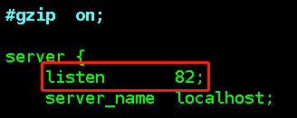

-   静态代理的配置

    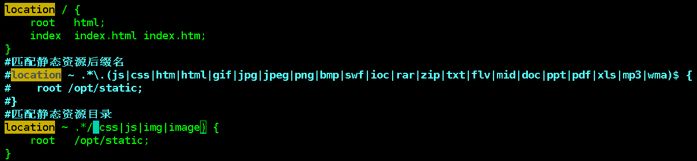

#### 负载均衡Nginx配置（nginx.conf）

##### 动态资源的负载均衡

>   upstream www.myweb.com {

>   server 127.0.0.1:9100 weight=5;

>   server 127.0.0.1:9200 weight=2;

>   }

location /myweb {

proxy_pass http://www.myweb.com;

}

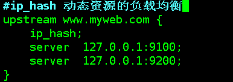

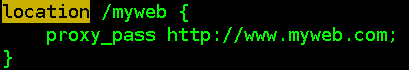

##### 静态资源的负载均衡

>   upstream static.myweb.com {

>   server 127.0.0.1:81 weight=1;

>   server 127.0.0.1:82 weight=1;

>   }

location \~ .\*/(css\|js\|img\|images) {

proxy_pass http://static.myweb.com;

}

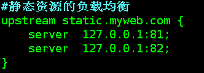

#### 启动三台nginx服务器，启动两台tomcat服务器

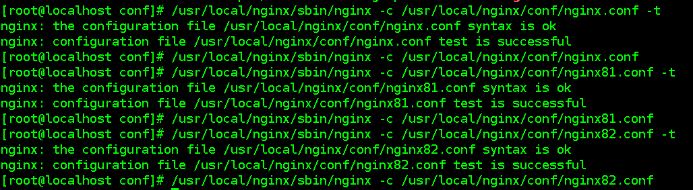

#### 浏览器输入http://192.168.235.128/myweb/进行测试

>   关闭掉一台nginx静态代理服务器

>   关闭掉一台tomcat服务器

# 虚拟主机

虚拟主机，就是把一台物理服务器划分成多个“虚拟”的服务器，这样我们的一台物理服务器就可以当做多个服务器来使用，从而可以配置多个网站。

Nginx提供虚拟主机的功能，就是为了让我们不需要安装多个Nginx，就可以运行多个域名不同的网站。

Nginx下，一个server标签就是一个虚拟主机。nginx的虚拟主机就是通过nginx.conf中server节点指定的，想要设置多个虚拟主机，配置多个server节点即可；

例如：[www.meituan.com](http://www.meituan.com)
切换城市，可以看到不同的城市地址不一样（二级域名）

比如一个公司有多个二级域名，没有必要为每个二级域名都提供一台Nginx服务器，就可以使用虚拟主机技术，在一台nginx服务器上，模拟多个虚拟服务器。

## 配置虚拟主机方式

### 基于端口的虚拟主机（了解）

基于端口的虚拟主机配置，使用端口来区分

浏览器使用 同一个域名+端口 或 同一个ip地址+端口访问；

**server {**

>   **listen 8080;**

**server_name www.myweb.com;**

**location /myweb {**

**proxy_pass http://www.myweb.com;**

**}**

>   **}**

**server {**

**listen 9090;**

**server_name www.myweb.com;**

**location /p2p {**

**proxy_pass http://www.p2p.com;**

**}**

>   **}**

### 基于域名的虚拟主机（掌握）

基于域名的虚拟主机是最常见的一种虚拟主机

**server {**

**listen 80;**

**server_name www.myweb.com;**

**location /myweb {**

**proxy_pass http://www. myweb.com;**

**}**

**}**

**server {**

**listen 80;**

**server_name www.p2p.com;**

**location /myweb {**

**proxy_pass http://www.p2p.com;**

**}**

**}**

需要修改一下本地的hosts文件，文件位置：C:\\Windows\\System32\\drivers\\etc\\hosts

在hosts文件配置：

>   192.168.208.128 www.myweb.com

>   192.168.208.128 www.p2p.com

前面是Linux的IP，后面是你自定义的域名

## 虚拟主机案例，模拟城市站点网站（我们配置三个城市站点）

### 架构图

### 实现步骤

#### 配置3个Tomcat，每个Tomcat一个站点项目

-   部署在Tomcat的ROOT目录下，目的是访问的时候不用加上下文根，测试方便

-   拷贝一个新的tomcat9300

    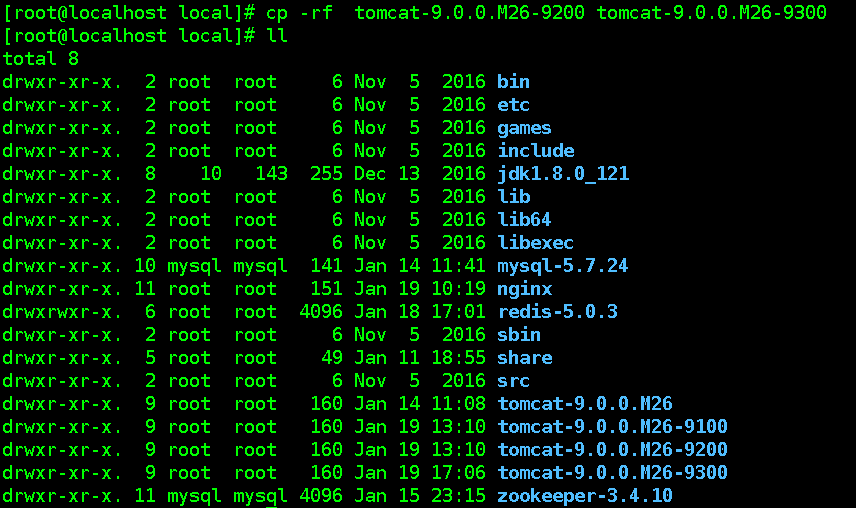

-   修改tomcat9300的端口号（修改server.xml文件）

    

    

    

-   在Xshell中开启三个选项卡，分别操作三个tomcat

    

-   清空三个tomcat的webapps/ROOT目录

    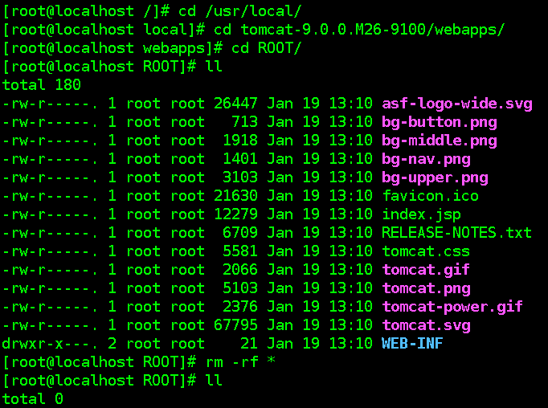

    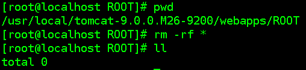

    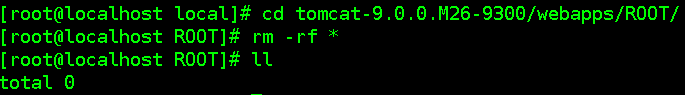

-   使用Xftp将三个war包上传到三个tomcat的ROOT目录

    beijing.war上传到tomcat9100服务器上

    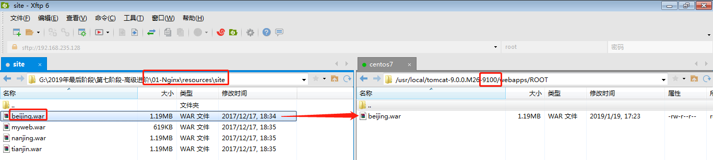

    nanjing.war上传到tomcat9200服务器上

    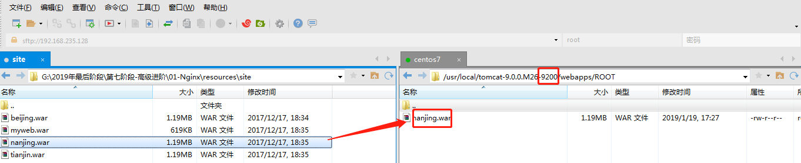

    tianjin.war上传到tomcat9300服务器上

    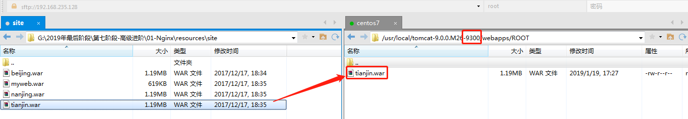

-   在tomcat启动前，使用unzip命令，直接解压三个war包，否则tomcat启动的时候，自动解压，还是有一个上下文目录的

    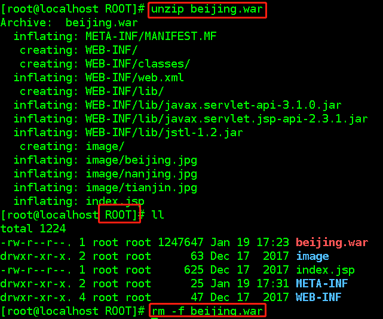

    在tomcat9200和9300上执行相同的操作

-   启动三个tomcat

    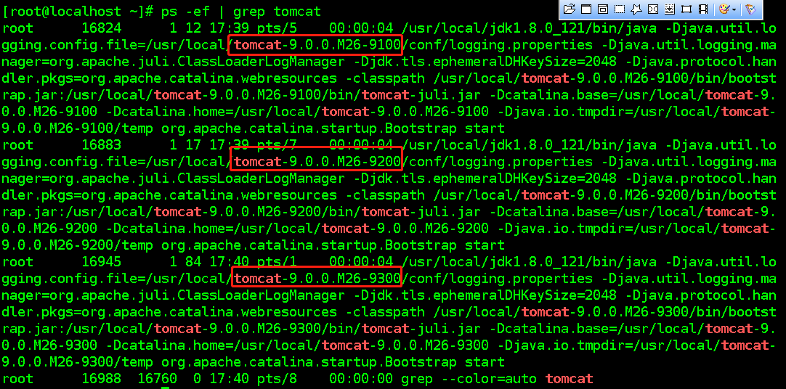

-   在浏览器中直接访问tomcat进行测试

    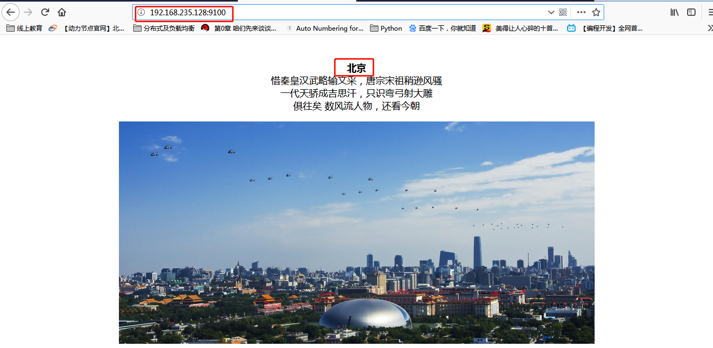

    

    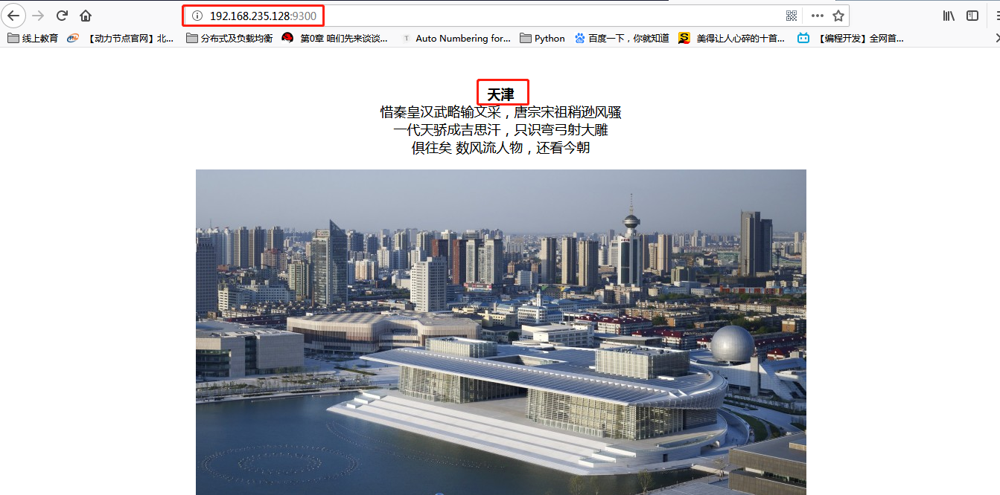

#### 在nginx.conf中配置3个Nginx虚拟主机

##### 方式一：直接在nginx.conf中配置

-   在nginx.conf文件添加三个server节点，用于配置三个虚拟主机

**server {**

**listen 80;**

**server_name beijing.myweb.com;**

**location / {**

**proxy_pass http://beijing.myweb.com;**

**}**

>   **}**

**server {**

**listen 80;**

**server_name nanjing.myweb.com;**

**location / {**

**proxy_pass http://nanjing.myweb.com;**

**}**

>   **}**

**server {**

**listen 80;**

**server_name tianjin.myweb.com;**

**location / {**

**proxy_pass http://tianjin.myweb.com;**

**}**

>   **}**

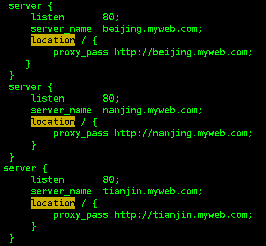

##### 方式二：通过单独的配置文件配置虚拟主机

通过include的方式引入虚拟主机配置

include /usr/local/nginx/conf/vhost/vhost.conf;

将虚拟目录的配置文件加入到”http {}”部分的末尾，与其他server并列；

文件是隔开的，配置更清晰，主文件没有那么多是server

#### 在nginx.conf中配置每个虚拟主机请求转发所对应的后端服务器（负载均衡，可以配置多个服务器）

**upstream beijing.myweb.com {**

**server 127.0.0.1:9100;**

**}**

**upstream nanjing.myweb.com {**

**server 127.0.0.1:9200;**

**}**

**upstream tianjin.myweb.com {**

**server 127.0.0.1:9300;**

**}**

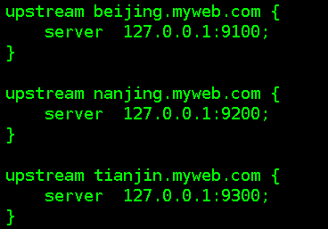

#### **修改hosts文件，让Linux的ip指向到三个站点的域名**

C:\\Windows\\System32\\drivers\\etc\\hosts

192.168.235.128 beijing.myweb.com

192.168.235.128 nanjing.myweb.com

192.168.235.128 tianjin.myweb.com

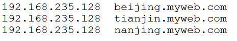

#### 重启nginx，通过浏览器访问nginx进行测试

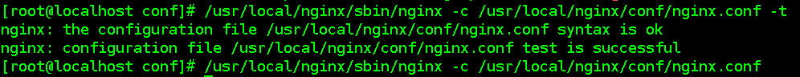

#### 通过单独的配置文件配置虚拟主机，然后再nginx.conf中引入（参照步骤2的方式二）

-   在/usr/local/nginx/conf目录下，创建vhost目录，并创建vhost.conf文件，在其中配置虚拟主机信息

    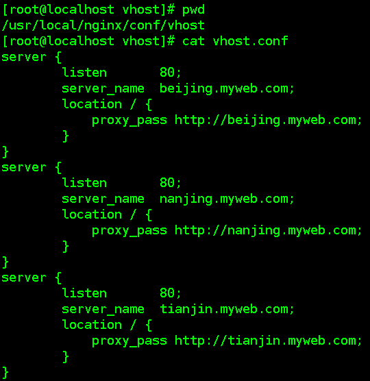

-   在nginx.conf中引入上面的配置文件

    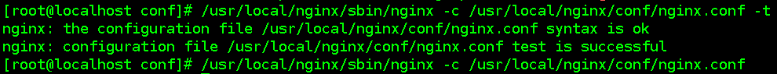
