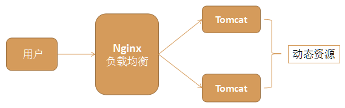
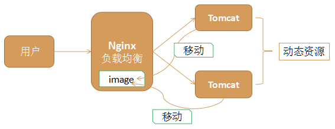

# 一：Nginx 简介

## Nginx 发展介绍

Nginx （engine x）是一个高性能的 Web 服务器和反向代理服务器，也可以作为邮件代理服务器。

Nginx特点是占有内存少，并发处理能力强，以高性能、低系统资源消耗而闻名，Nginx 官方测试为 5 万并发请求。与 Nginx 同类型的 Web 服务器还有 Apache、Lighttpd（音同 lighty）、Tengine（阿里巴巴的）等。Nginx的并发处理能力在同类型的 Web 服务器中表现极好（Apache、Lighttpd），在全世界范围内大量的网站使用了 Nginx，国内互联网中也大量使用了 Nginx，比如：淘宝、新浪、搜狐、网易、美团等。

Nginx 是免费开源的，同时 Nginx 也有收费的商业版本，商业版本提供了性能优化、宕机等紧急问题处理等技术支持和服务。

## 正向代理和反向代理

反向代理（ReverseProxy）方式是指以代理服务器来接受 internet 上的连接请求，然后将请求转发给内部网络上的服务器，并将从服务器上得到的结果返回给 internet 上请求连接的客户端，此时代理服务器对外就表现为一个反向代理服务器；

正向代理类似一个跳板机，代理访问外部资源。比如：我是一个用户，我访问不了某网站，但是我能访问一个代理服务器，这个代理服务器，它能访问那个我不能访问的网站，于是我先连上代理服务器，告诉它我需要那个无法访问网站的内容，代理服务器去取回来,然后返回给我。

反向代理隐藏了真正的服务端，就像你每天使用百度的时候，只知道敲打www.baidu.com就可以打开百度搜索页面，但背后成千上万台百度服务器具体是哪一台为我们服务的，我们并不知道。我们只知道这个代理服务器，它会把我们的请求转发到真实为我们服务的那台服务器那里去。

**综上所述：正向代理代理对象是客户端，反向代理代理对象是服务端。**

## 总结

软件层面一般常用 Nginx 来做反向代理服务器，它的性能非常好，用来做负载均衡。

# 二：环境搭建

下载

免费开源版的官方网站：<http://nginx.org>

Nginx 有 Windows 版本和 Linux 版本，但更推荐在 Linux 下使用 Nginx；

下载 nginx-1.14.2.tar.gz 的源代码文件：wget<http://nginx.org/download/nginx-1.14.2.tar.gz>

我的习惯，将下载或者上传的安装文件放到/home/soft/目录下

## 安装

1：安装前的准备

Nginx 的安装需要确定 Linux 安装相关的几个库，否则配置和编译会出现错误，
具体的检查安装过程为：

gcc 编译器是否安装

检查是否安装：yum list installed \| grep gcc

执行安装：yum install gcc -y

openssl 库是否安装

检查是否安装：yum list installed \| grep openssl

执行安装：yum install openssl openssl-devel -y

pcre 库是否安装

检查是否安装：yum list installed \| grep pcre

执行安装：yum install pcre pcre-devel -y

zlib 库是否安装

检查是否安装：yum list installed \| grep zlib

执行安装：yum install zlib zlib-devel -y

一次性安装，执行如下命令

yum install gcc openssl openssl-devel pcre pcre-devel zlib zlib-devel -y

2：正式安装

- 解压下载下来的 nginx 文件，执行命令：tar -zxvf nginx-1.14.2.tar.gz

- 切换至解压后的 nginx 主目录，执行命令：cd nginx-1.14.2

- 在 nginx 主目录 nginx-1.14.2 下执行命令：./configure --prefix=/usr/local/nginx

- （其中--prefix 是指定 nginx 安装路径） 注意:等号左右不要有空格

- 执行命令进行编译：make

- 执行命令进行安装：make install

  安装成功后，可以切换到/usr/local/nginx 目录下，查看内容


## 启动

普通启动

切换到 nginx 安装目录的 sbin 目录下，执行：./nginx

通过配置文件启动

```shell
./nginx -c /usr/local/nginx/conf/nginx.conf
/usr/local/nginx/sbin/nginx -c /usr/local/nginx/conf/nginx.conf
## 查看
ps -ef | grep nginx
```

**其中-c 是指定配置文件,而且配置文件路径必须指定绝对路径**

nginx 体系结构由 master 进程和其 worker 进程组成

master 进程读取配置文件，并维护 worker 进程，而 worker 进程则对请求进行实际处理

Nginx 启动后，安装目录下会出现一些\_tmp 结尾的文件，这些是临时文件，不用管。

在浏览器中输入<http://192.168.235.128:80/>访问 Nginx 服务器，出现欢迎页面

## 关闭

优雅关闭 Nginx

找出 nginx 的进程号：ps -ef \| grep nginx

执行命令：kill -QUIT 主 pid

**注意：**

- 其中 pid 是主进程号的 pid（master process），其他为子进程 pid（worker process）

- 这种关闭方式会处理完请求后再关闭，所以称之为优雅的关闭

快速关闭 Nginx：

找出 nginx 的进程号：ps -ef \| grep nginx

kill -TERM 主 pid

**注意：**

- 其中 pid 是主进程号的 pid（master process），其他为子进程 pid（worker process）

- 这种关闭方式不管请求是否处理完成，直接关闭，比较暴力，称之为快速的关闭


重启 Nginx：

./nginx -s reload

## 配置检查

当修改 Nginx 配置文件后，可以使用 Nginx 命令进行配置文件语法检查，用于检查 Nginx 配置文件是否正确

/usr/local/nginx/sbin/nginx -c /usr/local/nginx/conf/nginx.conf –t


## 其它

Linux 上查看 nginx 版本：/usr/local/nginx/sbin/nginx -V


## Window 下环境搭建（了解）

在官方网站下载最新 windows 版的 nginx：http://nginx.org/en/download.html

将下载下来的 nginx 压缩包解压到一个目录下，解压后该软件就可以启动使用了

启动方式 1：双击解压目录下的 nginx.exe 文件即可运行 nginx；

启动方式 2：进入 dos 窗口，切换到 nginx 主目录下，在 dos 窗口执行命令：start nginx

关闭方式 1：在资源管理器杀掉 Nginx 进程（有两个进程）

关闭方式 2：在 dos 窗口切换到 Nginx 安装主目录下执行命令：nginx -s stop

# 三：配置文件及应用

学习 Nginx 首先需要对它的核心配置文件有一定的认识，这个文件位于 Nginx 的安装目录/usr/local/nginx/conf 目录下，名字为 nginx.conf

**Nginx 的核心配置文件主要由三个部分构成**

### 基本配置

```txt
#user  nobody;
#工作进程数，一般配置成和cpu数量一致或2倍
worker_processes  1;

#全局错误日志及pid文件存放位置
error_log  logs/error.log;
#error_log  logs/error.log  notice;
#error_log  logs/error.log  info;

#nginx 启动master进程pid号
#pid        logs/nginx.pid;
```

### events 配置

```txt
#配置工作模式和连接数 
events {
	#标识单个worker进程的最大并发数
    worker_connections  1024;
}
```

### http 配置

#### 基本配置

```txt
http {
    #引入 mime 类型定义文件 配置支持哪些多媒体配置类型
    include       mime.types;
    #默认流类型，可以认为任意类型
    default_type  application/octet-stream;
    #设置日志生成格式
    #log_format  main  '$remote_addr - $remote_user [$time_local] "$request" '
    #                  '$status $body_bytes_sent "$http_referer" '
    #                  '"$http_user_agent" "$http_x_forwarded_for"';
    # 配置日志存放路径
    #access_log  logs/access.log  main;
    # 开启文件搞笑传输模式
    sendfile        on;
    # 防止网络阻塞
    #tcp_nopush     on;
    #连接的超时时间 秒
    #keepalive_timeout  0;
    keepalive_timeout  65;
    #开启gzip压缩
    #gzip  on;
    #此处配置多台tomcat服务器(名称不能有下划线：webServer）
    upstream webServer{
        server 127.0.0.1:8081;
        server 127.0.0.1:8082;
     }
   
	#此处配置多台tomcat服务器(名称不能有下划线：webs2Server）
    #upstream webs2Server{
      #server 192.168.30.19:8083;
      #server 192.168.32.12:8085;
    }
```

#### server 配置，可以有多个

```txt
  server {
        #定义当前这个server监听的端口
        listen       80;
        #定义使用localhost访问
        server_name  localhost;
        #charset koi8-r;
        #access_log  logs/host.access.log  main;
        #默认请求地址，如果请求是：192.168.10.80:80/  那么会进入这个里面的tomcat反向代理地址
        #一个location里面只能有一个proxy_pass
        location / {
        #此处可以配置Tomcat反向代理地址比如：
        #此处可以引用上面upstream 的多台tomcat；也可以单独配置一台
        proxy_pass http://127.0.0.1:8081/; #配置单台
        #proxy_pass http://webServer/; #引用上面的多台
        #引用上面的多台配置
           # root   html; #默认的网站根目录的位置
            #index  index.html index.htm; #网站的欢迎页,起始页
        }
        #表示如果请求是：192.168.10.80:80/web 那么会进入这个里面的tomcat反向代理地址
        location /web {
            #此处引用上面的配置的多台tomcat
            #proxy_pass http://127.0.0.1:8082/;
            #proxy_pass http://web2Server/; #引用上面的多台Tomcat配置
        }

        #error_page  404              /404.html;
        # redirect server error pages to the static page /50x.html
        #错误提示页面
        error_page   500 502 503 504  /50x.html;
        location = /50x.html {
            root   html;
        }
        # proxy the PHP scripts to Apache listening on 127.0.0.1:80
        #
        #location ~ \.php$ {
        #    proxy_pass   http://127.0.0.1;
        #}

        # pass the PHP scripts to FastCGI server listening on 127.0.0.1:9000
        #
        #location ~ \.php$ {
        #    root           html;
        #    fastcgi_pass   127.0.0.1:9000;
        #    fastcgi_index  index.php;
        #    fastcgi_param  SCRIPT_FILENAME  /scripts$fastcgi_script_name;
        #    include        fastcgi_params;
        #}

        # deny access to .htaccess files, if Apache's document root
        # concurs with nginx's one
        #
        #location ~ /\.ht {
        #    deny  all;
        #}
    }
```


# 四：负载均衡

## 负载均衡概述

在网站创立初期，我们一般都使用单台机器对外提供集中式服务。随着业务量的增大，我们一台服务器不够用，此时就会把多台机器组成一个集群对外提供服务，但是，我们网站对外提供的访问入口通常只有一个，比如
www.web.com。那么当用户在浏览器输入www.web.com进行访问的时候，如何将用户的请求分发到集群中不同的机器上呢，这就是负载均衡要做的事情。

负载均衡通常是指将请求"均匀"分摊到集群中多个服务器节点上执行，这里的均匀是指在一个比较大的统计范围内是基本均匀的，并不是完全均匀。

## 负载均衡实现方式

### 硬件负载均衡

比如 F5、深信服、Array 等

优点是有厂商专业的技术服务团队提供支持，性能稳定

缺点是费用昂贵，对于规模较小的网络应用成本太高

### 软件负载均衡

比如 Nginx、LVS、HAProxy 等

优点是免费开源，成本低廉

## Nginx 负载均衡

Nginx 通过在 nginx.conf 文件进行配置即可实现负载均衡

原理图



### 负载均衡策略

1：轮询（默认）

**注意：这里的轮询并不是每个请求轮流分配到不同的后端服务器，与 ip_hash 类似，但是按照访问 url 的 hash 结果来分配请求，使得每个 url 定向到同一个后端服务器，主要应用于后端服务器为缓存时的场景下**。**如果后端服务器 down 掉，将自动剔除**

```txt
upstream backserver {
    server 127.0.0.1:8080;
    server 127.0.0.1:9090;
}
```

2：权重

**每个请求按一定比例分发到不同的后端服务器，weight 值越大访问的比例越大，用于后端服务器性能不均的情况**

```txt
upstream backserver {
    server 192.168.0.14 weight=5;
    server 192.168.0.15 weight=2;
}
```

3：ip_hash

**ip_hash 也叫 IP 绑定，每个请求按访问 ip 的 hash 值分配，这样每个访问客户端会固定访问一个后端服务器，可以解决会话 Session 丢失的问题**

**算法：hash("124.207.55.82") % 2 = 0, 1**

```txt
upstream backserver {
    ip_hash;
    server 127.0.0.1:8080;
    server 127.0.0.1:9090;
}
```

4：最少连接

**web 请求会被转发到连接数最少的服务器上**

```txt
upstream backserver {
    least_conn;
    server 127.0.0.1:8080;
    server 127.0.0.1:9090;
}
```

# 五：静态代理

把所有静态资源的访问改为访问 nginx，而不是访问 tomcat，这种方式叫静态代理。因为 nginx 更擅长于静态资源的处理，性能更好，效率更高。

所以在实际应用中，我们将静态资源比如图片、css、html、js 等交给 nginx 处理，而不是由 tomcat 处理。



## 实现方式

方式一 在 nginx.conf 的 location 中配置静态资源的后缀

**例如：当访问静态资源，则从 linux 服务器/opt/static 目录下获取（举例）**

```txt

```

**说明**

- \~ 表示正则匹配，也就是说后面的内容可以是正则表达式匹配

- 第一个点 . 表示任意字符

- \*表示一个或多个字符

- \\. 是转移字符，是后面这个点的转移字符

- \| 表示或者

- \$ 表示结尾

整个配置表示以 .后面括号里面的这些后缀结尾的文件都由 nginx 处理

放置静态资源的目录，要注意一下目录权限问题，如果权限不足，给目录赋予权限；

否则会出现 403 错误 chmod 755

方式二 在 nginx.conf 的 location 中配置静态资源所在目录实现

**例如：当访问静态资源，则从 linux 服务器/opt/static 目录下获取（举例）**


我们将静态资源放入 /opt/static 目录下，然后用户访问时由 nginx 返回这些静态资源

# 六：动静分离

Nginx 的负载均衡和静态代理结合在一起，我们可以实现动静分离，这是实际应用中常见的一种场景。

动态资源，如 jsp 由 tomcat 或其他 web 服务器完成

静态资源，如图片、css、js 等由 nginx 服务器完成

它们各司其职，专注于做自己擅长的事情

动静分离充分利用了它们各自的优势，从而达到更高效合理的架构

整个架构中，一个 nginx 负责负载均衡，两个 nginx 负责静态代理。Nginx 在一台 Linux 上安装一份，可以启动多个 Nginx，每个 Nginx 的配置文件不一样即可

# 七：虚拟主机

虚拟主机，就是把一台物理服务器划分成多个“虚拟”的服务器，这样我们的一台物理服务器就可以当做多个服务器来使用，从而可以配置多个网站。

Nginx 提供虚拟主机的功能，就是为了让我们不需要安装多个 Nginx，就可以运行多个域名不同的网站。

Nginx 下，一个 server 标签就是一个虚拟主机。nginx 的虚拟主机就是通过 nginx.conf 中 server 节点指定的，想要设置多个虚拟主机，配置多个 server 节点即可；

例如：[www.meituan.com](http://www.meituan.com)切换城市，可以看到不同的城市地址不一样（二级域名）

比如一个公司有多个二级域名，没有必要为每个二级域名都提供一台 Nginx 服务器，就可以使用虚拟主机技术，在一台 nginx 服务器上，模拟多个虚拟服务器。

### 基于端口的虚拟主机（了解）

基于端口的虚拟主机配置，使用端口来区分

浏览器使用 同一个域名+端口 或 同一个 ip 地址+端口访问；

```txt
server {
    listen 8080;
    server_name www.myweb.com;
    location /myweb {
    	proxy_pass http://www.myweb.com;
    }
}

server {
    listen 9090;
    server_name www.myweb.com;
    location /p2p {
    	proxy_pass http://www.p2p.com;
    }
}
```

### 基于域名的虚拟主机（掌握）

基于域名的虚拟主机是最常见的一种虚拟主机

```txt
server {
    listen 80;
    server_name www.myweb.com;
    location /myweb {
    	proxy_pass http://www. myweb.com;
    }
}
server {
    listen 80;
    server_name www.p2p.com;
    location /myweb {
    	proxy_pass http://www.p2p.com;
    }
}
```


需要修改一下本地的 hosts 文件，文件位置：C:\\Windows\\System32\\drivers\\etc\\hosts

在 hosts 文件配置：

```txt
192.168.208.128 www.myweb.com

192.168.208.128 www.p2p.com
```

前面是 Linux 的 IP，后面是你自定义的域名

# 八：Nginx 限流

## 限流算法

令牌桶算法

- 令牌以固定速率产生，并缓存到令牌桶中；
- 令牌桶放满时，多余的令牌被丢弃；
- 请求要消耗等比例的令牌才能被处理；
- 令牌不够时，请求被缓存。

漏桶算法：

- 水（请求）从上方倒入水桶，从水桶下方流出（被处理）；
- 来不及流出的水存在水桶中（缓冲），以固定速率流出；
- 水桶满后水溢出（丢弃）。
- 这个算法的核心是：缓存请求、匀速处理、多余的请求直接丢弃。

从作用上来说，漏桶和令牌桶算法最明显的区别就是是否允许突发流量(burst)的处理，漏桶算法能够强行限制数据的实时传输（处理）速率，对突发流量不做额外处理；而令牌桶算法能够在限制数据的平均传输速率的同时允许某种程度的突发传输。

Nginx 按请求速率限速模块使用的是漏桶算法，即能够强行保证请求的实时处理速度不会超过设置的阈值。

Nginx 官方版本限制 IP 的连接和并发分别有两个模块：

- `limit_req_zone` 用来限制单位时间内的请求数，即速率限制,采用的漏桶算法 "leaky bucket"。
- `limit_req_conn` 用来限制同一时间连接数，即并发限制。

```properties
limit_req_zone $binary_remote_addr zone=one:10m rate=1r/s;
```

- 第一个参数：$binary*remote_addr 表示通过 remote_addr 这个标识来做限制，“binary*”的目的是缩写内存占用量，是限制同一客户端 ip 地址。
- 第二个参数：zone=one:10m 表示生成一个大小为 10M，名字为 one 的内存区域，用来存储访问的频次信息。
- 第三个参数：rate=1r/s 表示允许相同标识的客户端的访问频次，这里限制的是每秒 1 次，还可以有比如 30r/m 的。

```properties

```

处理突发量：burst 与 nodelay

**burst=20 **，若同时有 21 个请求到达，Nginx 会处理第一个请求，剩余 20 个请求将放入队列，然后每隔 100ms 从队列中获取一个请求进行处理。若请求数大于 21，将拒绝处理多余的请求，直接返回 503.

nodelay 针对的是 burst 参数，burst=20 nodelay 表示这 20 个请求立马处理，不能延迟，相当于特事特办。不过，即使这 20 个突发请求立马处理结束，后续来了请求也不会立马处理。burst=20 相当于缓存队列中占了 20 个坑，即使请求被处理了，这 20 个位置这只能按 100ms 一个来释放。

这就达到了速率稳定，但突然流量也能正常处理的效果。
